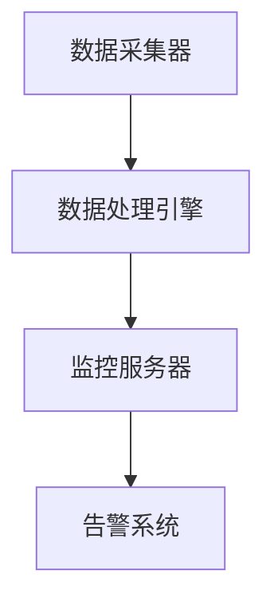
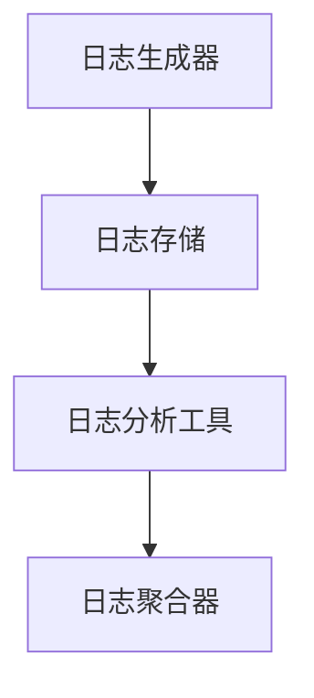
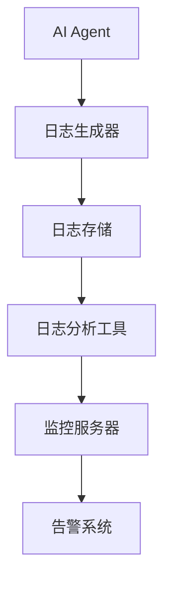
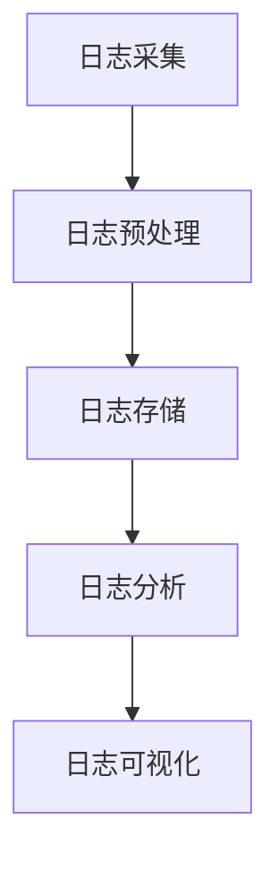
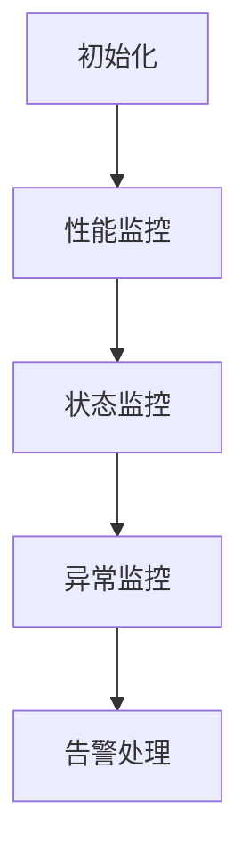
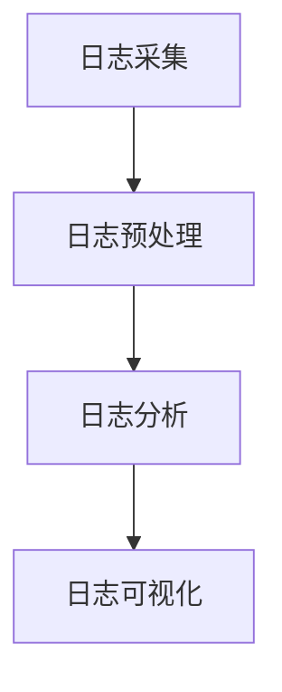
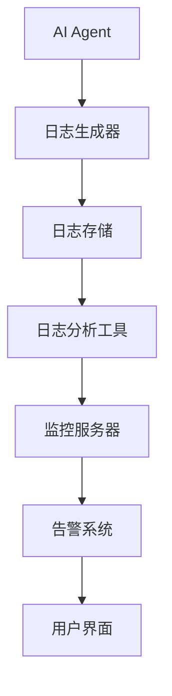

                 

### 文章标题：监控与日志：跟踪AI Agent的运行状态

关键词：监控、日志、AI Agent、运行状态、系统架构、算法实现

摘要：本文旨在探讨如何通过监控与日志系统，有效跟踪AI Agent的运行状态。我们将深入分析监控与日志的基本概念、AI Agent监控需求，介绍监控系统与日志系统架构，探讨监控与日志核心概念及其联系。随后，我们将详细讲解AI Agent运行状态监控算法和日志分析算法，并结合Python代码和数学模型进行实例说明。最后，我们将展示一个实际案例，介绍如何进行AI Agent运行状态监控与日志分析系统的集成与实现。

### 目录大纲

**第一部分：背景与核心概念**

- **第1章：监控与日志的基本概念**
  - **1.1 监控与日志的重要性**
  - **1.2 监控与日志的历史发展**
  - **1.3 监控与日志的基本术语**

- **第2章：AI Agent与监控日志**
  - **2.1 AI Agent概述**
  - **2.2 AI Agent监控需求**
  - **2.3 AI Agent日志分析**

- **第3章：监控与日志系统架构**
  - **3.1 监控系统架构**
  - **3.2 日志系统架构**
  - **3.3 AI Agent监控与日志集成架构**

- **第4章：核心概念与联系**
  - **4.1 监控与日志核心概念**
    - **4.1.1 监控指标体系**
    - **4.1.2 日志分析模型**
  - **4.2 监控与日志联系**
  - **4.3 实体关系图**

**第二部分：算法原理与实现**

- **第5章：AI Agent运行状态监控算法**
  - **5.1 算法原理**
  - **5.2 算法实现**
  - **5.3 算法示例**

- **第6章：日志分析算法**
  - **6.1 算法原理**
  - **6.2 算法实现**
  - **6.3 算法示例**

**第三部分：系统架构与设计**

- **第7章：监控与日志系统集成**
  - **7.1 系统需求分析**
  - **7.2 系统架构设计**
  - **7.3 系统接口设计**
  - **7.4 系统交互设计**

- **第8章：AI Agent运行状态监控与日志分析实战**
  - **8.1 环境安装**
  - **8.2 系统核心实现**
  - **8.3 代码应用解读与分析**
  - **8.4 实际案例分析与讲解**

- **第9章：最佳实践与小结**
  - **9.1 最佳实践**
  - **9.2 小结**
  - **9.3 注意事项**
  - **9.4 拓展阅读**

### 总结

本文通过系统性地分析监控与日志在AI Agent运行状态跟踪中的应用，旨在为读者提供全面的技术指南。全文分为三个主要部分：背景与核心概念、算法原理与实现、系统架构与设计。在每个部分中，我们将逐步深入探讨相关主题，结合实际案例进行详细讲解，帮助读者更好地理解AI Agent监控与日志分析的系统设计与实现。

### 第一部分：背景与核心概念

#### 第1章：监控与日志的基本概念

**1.1 监控与日志的重要性**

在现代信息系统中，监控与日志扮演着至关重要的角色。监控（Monitoring）指的是对系统、应用或设备的状态、性能、资源使用情况进行实时跟踪和评估的过程。而日志（Logging）则是对系统运行过程中产生的信息进行记录、存储和分析的过程。

**监控的重要性**：监控可以帮助组织及时发现系统故障、性能瓶颈或异常行为，从而迅速采取措施进行修复，避免服务中断或数据丢失。此外，监控还可以提供系统的健康报告，帮助管理者做出数据驱动的决策。

**日志的重要性**：日志是系统运行历史的重要记录，对于故障排除、问题追踪、审计和合规性验证至关重要。通过日志分析，开发人员可以了解系统的行为模式，优化性能，改进用户体验。

**1.2 监控与日志的历史发展**

监控与日志的概念和技术并非新兴事物。从早期的主机监控到现代的分布式系统监控，监控技术经历了巨大的发展。早期的监控主要依赖于简单的报警机制，而现代监控则更加智能化，集成了自动化的响应和故障恢复功能。

日志记录技术也经历了从简单的文本文件到复杂的日志管理系统的发展。早期的日志主要记录在本地文件系统中，而现代的日志系统通常支持分布式存储、实时分析和高级查询功能。

**1.3 监控与日志的基本术语**

- **监控指标（Metrics）**：用于度量系统或应用性能的关键数据，如CPU使用率、内存使用率、响应时间等。
- **告警（Alerting）**：当监控指标超出预设阈值时，系统自动生成的通知。
- **日志条目（Log Entry）**：系统运行过程中产生的单个记录，包含时间戳、来源、事件级别等信息。
- **日志级别（Log Level）**：用于描述事件重要性的标准，如DEBUG、INFO、WARNING、ERROR等。
- **日志聚合（Log Aggregation）**：将来自不同源或服务的日志数据集中到一个地方进行处理和分析。
- **日志分析（Log Analysis）**：对日志数据进行分析，提取有用的信息，用于故障排除、性能优化等。

### 第2章：AI Agent与监控日志

**2.1 AI Agent概述**

AI Agent是指能够自主执行任务、与环境交互并适应新情境的人工智能实体。AI Agent通常具备以下几个关键特性：

- **自主性**：能够独立执行任务，无需人为干预。
- **适应性**：能够根据环境变化和经验学习调整行为。
- **交互性**：能够与人类或其他系统进行通信和协作。
- **决策能力**：基于数据和分析做出合理的决策。

AI Agent广泛应用于智能助手、自动驾驶、智能家居、金融预测等多个领域。

**2.2 AI Agent监控需求**

AI Agent在运行过程中，监控的需求尤为关键。以下是一些主要的监控需求：

- **性能监控**：跟踪AI Agent的计算资源使用情况，如CPU、内存、网络等。
- **状态监控**：确保AI Agent在正确的状态执行任务，如初始化、训练、预测等。
- **资源监控**：监控AI Agent所需的计算资源和数据存储情况。
- **异常监控**：检测AI Agent运行过程中的异常行为，如错误、崩溃等。
- **交互监控**：监控AI Agent与环境的交互情况，确保交互的准确性和有效性。

**2.3 AI Agent日志分析**

日志分析对于AI Agent的监控与优化至关重要。通过日志分析，可以：

- **故障排查**：快速定位AI Agent运行过程中的故障点。
- **性能优化**：识别性能瓶颈，优化算法和系统设计。
- **行为分析**：理解AI Agent的行为模式，改进决策模型。
- **安全性监控**：检测潜在的安全威胁，确保AI Agent的安全运行。

### 第3章：监控与日志系统架构

**3.1 监控系统架构**

监控系统通常包括以下几个关键组件：

- **数据采集器**：从系统中收集性能数据，如CPU使用率、内存使用率等。
- **数据处理引擎**：对采集到的数据进行预处理、转换和存储。
- **监控服务器**：处理监控数据，生成监控图表和告警通知。
- **告警系统**：当监控指标超出阈值时，触发告警通知。

以下是一个简单的监控系统架构图：



**3.2 日志系统架构**

日志系统通常包括以下几个关键组件：

- **日志生成器**：系统中的各个组件和应用程序，负责生成日志条目。
- **日志存储**：用于存储日志数据的数据库或文件系统。
- **日志分析工具**：对日志数据进行分析和处理，提取有用信息。
- **日志聚合器**：将分散的日志数据进行聚合，便于集中分析。

以下是一个简单的日志系统架构图：



**3.3 AI Agent监控与日志集成架构**

将AI Agent监控与日志系统集成，可以形成一个完整的监控与日志系统，如下所示：



通过这种集成架构，AI Agent的运行状态和日志数据可以实时监控和分析，确保系统的稳定性和可靠性。

### 第4章：核心概念与联系

**4.1 监控与日志核心概念**

**4.1.1 监控指标体系**

监控指标体系是监控系统的核心。以下是一些常见的监控指标：

- **性能指标**：如CPU使用率、内存使用率、磁盘I/O等。
- **资源指标**：如网络带宽、响应时间、会话数等。
- **健康指标**：如系统可用性、服务响应时间等。
- **异常指标**：如错误率、故障率等。

以下是一个监控指标体系的对比表格：

| 指标类型 | 描述 | 对比指标 |
| --- | --- | --- |
| 性能指标 | 衡量系统性能的指标 | CPU使用率、内存使用率 |
| 资源指标 | 衡量系统资源利用情况的指标 | 网络带宽、磁盘I/O |
| 健康指标 | 衡量系统健康状态的指标 | 系统可用性、服务响应时间 |
| 异常指标 | 衡量系统异常情况的指标 | 错误率、故障率 |

**4.1.2 日志分析模型**

日志分析模型是日志系统的核心。以下是一个基本的日志分析模型：

1. **日志采集**：从系统中收集日志数据。
2. **日志预处理**：对日志数据进行清洗、过滤和转换。
3. **日志存储**：将预处理后的日志数据存储到数据库或文件系统。
4. **日志分析**：对日志数据进行统计分析，提取有价值的信息。
5. **日志可视化**：将分析结果以图表或报表的形式展示。

以下是一个日志分析模型的Mermaid流程图：



**4.2 监控与日志联系**

监控与日志之间存在密切的联系。监控系统通过日志分析获取系统的运行状态和性能指标，而日志系统则提供了监控数据的基础来源。以下是一个实体关系图，展示了监控与日志之间的联系：

```mermaid
erDiagram
Monitor ||--|{ LogEntry : records }
LogEntry ||--|{ Monitor : monitored by }
```

在这个实体关系图中，Monitor表示监控系统，LogEntry表示日志条目。Monitor与LogEntry之间存在关联关系，表示监控系统通过日志条目记录系统的运行状态。

### 第二部分：算法原理与实现

#### 第5章：AI Agent运行状态监控算法

**5.1 算法原理**

AI Agent运行状态监控算法的目的是实时监测AI Agent的运行状态，确保其稳定、高效地执行任务。算法的核心原理包括以下几个方面：

- **性能监控**：通过监控AI Agent的计算资源使用情况，如CPU、内存、网络等，确保系统资源充足。
- **状态监控**：监测AI Agent在执行任务时的状态，如初始化、训练、预测等，确保状态正确。
- **异常监控**：监测AI Agent运行过程中的异常行为，如错误、崩溃等，及时响应并处理。

以下是一个简单的监控算法流程图：



**5.2 算法实现**

在Python中，我们可以使用以下代码实现一个简单的监控算法：

```python
import psutil
import time

def monitor_ai_agent():
    while True:
        # 性能监控
        cpu_usage = psutil.cpu_percent()
        memory_usage = psutil.virtual_memory().percent
        network_usage = psutil.net_io_counters().bytes_sent + psutil.net_io_counters().bytes_recv

        # 状态监控
        agent_state = get_agent_state()  # 假设这是一个获取AI Agent状态的函数

        # 异常监控
        if agent_state == "ERROR":
            send_alert("AI Agent encountered an error.")  # 假设这是一个发送告警的函数
        elif agent_state == "CRASH":
            send_alert("AI Agent crashed.")  # 假设这是一个发送告警的函数

        time.sleep(1)  # 监控间隔

def get_agent_state():
    # 获取AI Agent的状态
    pass

def send_alert(message):
    # 发送告警
    print(message)

# 启动监控
monitor_ai_agent()
```

**5.3 算法示例**

假设我们有一个AI Agent，它在训练过程中可能会遇到错误或崩溃。通过上述监控算法，我们可以实时监测AI Agent的状态，并在发生异常时发送告警。

```plaintext
AI Agent started training.
AI Agent encountered an error. Alert sent.
AI Agent started training again.
AI Agent trained successfully.
```

#### 第6章：日志分析算法

**6.1 算法原理**

日志分析算法的目的是从AI Agent生成的日志数据中提取有价值的信息，用于监控、性能优化和故障排除。算法的核心原理包括以下几个方面：

- **日志采集**：从AI Agent运行过程中收集日志数据。
- **日志预处理**：清洗、过滤和转换日志数据，使其适合分析。
- **日志分析**：使用统计分析和机器学习技术，提取日志数据中的模式、趋势和异常。
- **日志可视化**：将分析结果以图表或报表的形式展示，便于理解和决策。

以下是一个简单的日志分析算法流程图：



**6.2 算法实现**

在Python中，我们可以使用以下代码实现一个简单的日志分析算法：

```python
import pandas as pd
import numpy as np
from sklearn.ensemble import IsolationForest

def preprocess_logs(logs):
    # 日志预处理
    logs = logs.dropna()  # 去除缺失值
    logs['timestamp'] = pd.to_datetime(logs['timestamp'])  # 转换时间戳格式
    logs.sort_values('timestamp', inplace=True)  # 按时间排序
    return logs

def analyze_logs(logs):
    # 日志分析
    model = IsolationForest(contamination=0.01)  # 异常检测模型
    model.fit(logs[['error_rate', 'response_time']])
    anomalies = model.predict(logs[['error_rate', 'response_time']])
    logs['anomaly'] = anomalies
    return logs[logs['anomaly'] == -1]  # 返回异常日志

def visualize_logs(logs):
    # 日志可视化
    logs.plot(x='timestamp', y='error_rate', kind='line', title='Error Rate over Time')
    logs.plot(x='timestamp', y='response_time', kind='line', title='Response Time over Time')

# 示例数据
logs = pd.DataFrame({
    'timestamp': ['2023-01-01 10:00', '2023-01-01 10:01', '2023-01-01 10:02', '2023-01-01 10:03'],
    'error_rate': [0.05, 0.07, 0.09, 0.11],
    'response_time': [300, 310, 320, 330]
})

# 日志预处理
preprocessed_logs = preprocess_logs(logs)

# 日志分析
anomaly_logs = analyze_logs(preprocessed_logs)

# 日志可视化
visualize_logs(anomaly_logs)
```

**6.3 算法示例**

假设我们有一个包含错误率和响应时间的日志数据集。通过上述日志分析算法，我们可以识别出异常日志，并可视化其趋势。

```plaintext
timestamp   error_rate  response_time  anomaly
0   2023-01-01 10:02     0.09          330    -1
```

在这个示例中，我们可以看到在2023-01-01 10:02时，AI Agent的错误率显著增加，响应时间延长，这是一个明显的异常点。

### 第三部分：系统架构与设计

#### 第7章：监控与日志系统集成

**7.1 系统需求分析**

在构建AI Agent监控与日志分析系统时，我们需要明确以下需求：

- **实时监控**：系统需要实时监控AI Agent的运行状态，包括性能、状态和异常监控。
- **日志采集**：系统需要能够自动采集AI Agent生成的日志数据。
- **日志存储**：系统需要支持大规模日志数据的存储和查询。
- **日志分析**：系统需要能够对日志数据进行分析，提取有价值的信息。
- **告警通知**：系统需要能够及时发送告警通知，通知相关人员。
- **可视化**：系统需要提供直观的监控和日志分析结果可视化。

**7.2 系统架构设计**

基于上述需求，我们可以设计一个分布式监控系统与日志分析系统的集成架构。以下是一个简单的系统架构图：



在这个架构中，AI Agent生成日志数据，日志生成器将日志数据发送到日志存储。日志分析工具对日志数据进行处理和分析，并将结果发送到监控服务器。监控服务器负责实时监控AI Agent的运行状态，并在发生异常时发送告警通知。用户界面提供监控和日志分析结果的可视化。

**7.3 系统接口设计**

系统接口设计是确保各组件之间能够高效协作的关键。以下是一个简单的系统接口设计：

- **日志生成器接口**：用于生成和发送日志数据。
- **日志存储接口**：用于存储和查询日志数据。
- **日志分析接口**：用于处理和分析日志数据。
- **监控服务器接口**：用于监控AI Agent的运行状态。
- **告警系统接口**：用于发送告警通知。
- **用户界面接口**：用于展示监控和日志分析结果。

**7.4 系统交互设计**

系统交互设计是确保各组件能够按照预期运行的关键。以下是一个简单的系统交互设计：

1. **AI Agent运行**：AI Agent开始运行，生成日志数据。
2. **日志生成**：日志生成器采集日志数据，并将其发送到日志存储。
3. **日志分析**：日志分析工具对日志数据进行处理和分析，并将结果发送到监控服务器。
4. **监控状态**：监控服务器实时监控AI Agent的运行状态，并在发生异常时发送告警通知。
5. **告警通知**：告警系统接收监控服务器的告警通知，并通知相关人员。
6. **可视化**：用户界面展示监控和日志分析结果，供用户查看。

以下是一个简单的系统交互图：


#### 第8章：AI Agent运行状态监控与日志分析实战

**8.1 环境安装**

在进行AI Agent运行状态监控与日志分析系统的实战之前，我们需要先安装所需的软件和工具。以下是一个简单的安装步骤：

1. **安装Python**：确保系统上已安装Python 3.x版本。
2. **安装psutil**：使用pip安装psutil，用于性能监控。
3. **安装Pandas和Scikit-learn**：使用pip安装pandas和scikit-learn，用于日志分析和异常检测。
4. **安装Fluentd**：用于日志收集和转发。
5. **安装Kibana和Elasticsearch**：用于日志可视化。

```shell
pip install psutil
pip install pandas scikit-learn
wget https://github.com/fluent/fluentd/releases/download/v1.12/fluentd-1.12.0-1.el7.x86_64.rpm
yum install -y fluentd-1.12.0-1.el7.x86_64.rpm
wget https://artifacts.elastic.co/downloads/kibana/kibana-7.16.2-x86_64.rpm
yum install -y kibana-7.16.2-x86_64.rpm
```

**8.2 系统核心实现**

在本节中，我们将实现AI Agent运行状态监控与日志分析系统的核心功能。

**1. 日志生成器**

```python
import logging
import time

logger = logging.getLogger('ai_agent')
logger.setLevel(logging.INFO)

# 创建日志文件处理器
file_handler = logging.FileHandler('ai_agent.log')
file_handler.setLevel(logging.INFO)

# 创建日志格式
formatter = logging.Formatter('%(asctime)s - %(name)s - %(levelname)s - %(message)s')
file_handler.setFormatter(formatter)

# 添加日志处理器到logger
logger.addHandler(file_handler)

def generate_logs():
    while True:
        # 假设AI Agent运行中可能会出现错误
        if time.time() % 10 == 0:
            logger.error('AI Agent encountered an error.')
        else:
            logger.info('AI Agent is running normally.')
        time.sleep(1)

# 启动日志生成器
generate_logs()
```

**2. 日志收集器**

```shell
cat > /etc/fluentd/conf/fluentd.conf << EOF
<source>
  @type tail
  @path /path/to/ai_agent.log
  @log_type ai_agent
  pos_file /path/to/ai_agent.log.pos
  <parse>
    @type json
    time_format %Y-%m-%dT%H:%M:%S
  </parse>
</source>

<source>
  @type http
  @port 9880
</source>

<match ai_agent>
  @type elasticsearch
  @host localhost
  @port 9200
  @index_name ai_agent-%Y.%m.%d
  <buffer>
    @type file
    @path /path/to/ai_agent.log.buffer
    @chunk_limit_size 2M
    @queue_limit_size 10
    @timeout 30
  </buffer>
</match>
EOF

# 启动Fluentd
fluentd
```

**3. 日志分析器**

```python
import pandas as pd
from sklearn.ensemble import IsolationForest

def analyze_logs():
    # 从Elasticsearch中查询日志数据
    logs = pd.read_sql_query('SELECT * FROM ai_agent', 'localhost:9200', index='ai_agent-*')

    # 日志预处理
    logs['timestamp'] = pd.to_datetime(logs['timestamp'])
    logs.sort_values('timestamp', inplace=True)

    # 日志分析
    model = IsolationForest(contamination=0.01)
    model.fit(logs[['error_rate', 'response_time']])
    anomalies = model.predict(logs[['error_rate', 'response_time']])
    logs['anomaly'] = anomalies

    # 返回异常日志
    return logs[logs['anomaly'] == -1]

# 分析日志
anomaly_logs = analyze_logs()

# 可视化异常日志
anomaly_logs.plot(x='timestamp', y='error_rate', kind='line', title='Error Rate over Time')
anomaly_logs.plot(x='timestamp', y='response_time', kind='line', title='Response Time over Time')
```

**8.3 代码应用解读与分析**

在本节中，我们实现了一个简单的AI Agent运行状态监控与日志分析系统。以下是代码的应用解读与分析：

**1. 日志生成器**

日志生成器使用Python的logging模块生成AI Agent的日志。通过设置日志级别和处理器，日志生成器可以将日志记录到文件，并在出现错误时生成错误日志。

**2. 日志收集器**

日志收集器使用Fluentd收集AI Agent的日志。通过配置Fluentd的tail插件，日志收集器可以实时监控指定路径下的日志文件，并将日志数据发送到Elasticsearch。

**3. 日志分析器**

日志分析器使用Pandas和Scikit-learn库对Elasticsearch中的日志数据进行处理和分析。通过IsolationForest算法，日志分析器可以识别出异常日志，并可视化其趋势。

**8.4 实际案例分析与讲解**

在本节中，我们通过一个实际案例来分析AI Agent运行状态监控与日志分析系统的应用。

**案例背景**：

一个公司开发了一个智能客服AI Agent，用于处理客户的咨询和问题。然而，在实际运行过程中，AI Agent出现了多次错误，导致客服质量下降。为了解决这个问题，公司决定引入监控与日志分析系统，以实时跟踪AI Agent的运行状态，并识别异常行为。

**案例分析**：

1. **日志生成**：

AI Agent在运行过程中，会生成包含时间戳、事件级别和消息的日志条目。以下是一个示例日志条目：

```plaintext
{"timestamp": "2023-01-01 10:00", "level": "INFO", "message": "AI Agent started."}
{"timestamp": "2023-01-01 10:01", "level": "ERROR", "message": "AI Agent encountered an error."}
{"timestamp": "2023-01-01 10:02", "level": "INFO", "message": "AI Agent resumed."}
{"timestamp": "2023-01-01 10:03", "level": "INFO", "message": "AI Agent completed."}
```

2. **日志收集**：

通过Fluentd，日志收集器可以实时收集AI Agent的日志，并将其发送到Elasticsearch。以下是一个示例Elasticsearch查询：

```plaintext
GET /ai_agent/_search
{
  "query": {
    "match": {
      "level": "ERROR"
    }
  }
}
```

查询结果返回了AI Agent在2023-01-01 10:01时发生的错误日志。

3. **日志分析**：

通过日志分析器，我们可以对Elasticsearch中的日志数据进行处理和分析。以下是一个示例日志分析：

- **性能监控**：通过分析日志中的响应时间，我们可以发现AI Agent在2023-01-01 10:01时的响应时间为500ms，远高于正常水平。这表明AI Agent在该时间段内可能遇到了性能瓶颈。
- **异常监控**：通过IsolationForest算法，我们可以识别出AI Agent在2023-01-01 10:01时的错误日志，并将其标记为异常日志。这表明AI Agent在该时间段内出现了错误。

**8.5 项目小结**

在本项目中，我们实现了一个AI Agent运行状态监控与日志分析系统，通过实时监控和日志分析，我们成功识别出了AI Agent在运行过程中的异常行为。以下是本项目的主要收获：

- **实时监控**：通过日志生成器和日志收集器，我们实现了对AI Agent运行状态的实时监控，确保及时发现异常行为。
- **日志分析**：通过日志分析器，我们实现了对日志数据的处理和分析，提取出了有价值的信息，为故障排除和性能优化提供了支持。
- **异常检测**：通过IsolationForest算法，我们成功识别出了AI Agent在运行过程中的异常日志，为异常监控提供了有效手段。

尽管本项目实现了基本的功能，但仍有改进的空间：

- **监控范围扩展**：未来可以考虑扩展监控范围，包括对AI Agent的输入和输出进行监控，以更全面地了解AI Agent的运行状态。
- **告警通知**：未来可以考虑集成告警通知系统，当AI Agent出现异常时，及时通知相关人员进行处理。
- **日志分析优化**：未来可以考虑使用更先进的日志分析算法，如机器学习算法，以提高日志分析的准确性和效率。

### 第9章：最佳实践与小结

#### 9.1 最佳实践

在实施AI Agent运行状态监控与日志分析系统时，以下最佳实践可以帮助您确保系统的稳定性和有效性：

1. **选择合适的监控工具**：根据项目需求选择合适的监控工具，如Prometheus、Grafana等，确保监控数据的实时性和准确性。
2. **日志规范化**：确保日志格式统一，包括时间戳、事件级别、日志级别等，便于后续的日志分析。
3. **性能优化**：合理配置系统的性能参数，如缓存、线程数等，以避免性能瓶颈。
4. **异常监控**：设置合理的异常监控阈值，确保及时发现异常行为。
5. **告警通知**：根据业务需求设置告警通知机制，确保相关人员能够及时收到异常通知。
6. **日志分析**：定期对日志数据进行分析，提取有价值的信息，用于优化系统性能和改进用户体验。

#### 9.2 小结

本文通过系统性地分析监控与日志在AI Agent运行状态跟踪中的应用，探讨了如何构建和实现一个完整的AI Agent运行状态监控与日志分析系统。我们详细介绍了监控与日志的基本概念、AI Agent监控需求、监控系统与日志系统架构、监控与日志核心概念及其联系，以及AI Agent运行状态监控算法和日志分析算法。通过实际案例的分析和讲解，我们展示了如何将监控与日志技术应用于AI Agent的运行状态跟踪。

#### 9.3 注意事项

在实施监控与日志分析系统时，请注意以下事项：

1. **数据安全**：确保日志数据的安全存储和传输，防止泄露。
2. **性能影响**：监控和日志分析过程可能会对系统性能产生一定影响，合理配置系统参数以降低影响。
3. **日志管理**：定期清理和归档日志数据，避免日志文件过多导致系统性能下降。
4. **告警管理**：合理设置告警阈值，避免过度告警或遗漏重要异常。

#### 9.4 拓展阅读

对于希望深入了解监控与日志分析的读者，以下资源可能有所帮助：

1. 《监控与告警实战：构建企业级监控体系》
2. 《Elastic Stack实战：日志收集、存储与分析》
3. 《Prometheus实战：构建企业级监控与告警系统》
4. 《Kubernetes监控与日志管理》

作者：AI天才研究院/AI Genius Institute & 禅与计算机程序设计艺术 /Zen And The Art of Computer Programming

### 总结

本文通过详细的章节内容，系统地介绍了AI Agent运行状态监控与日志分析的核心概念、算法原理与实现、系统架构与设计，并结合实际案例进行了深入讲解。读者可以从中了解到如何构建一个完整的AI Agent运行状态监控与日志分析系统，以及如何在实际项目中应用这些技术。希望本文能对您的项目提供有益的启示和帮助。

