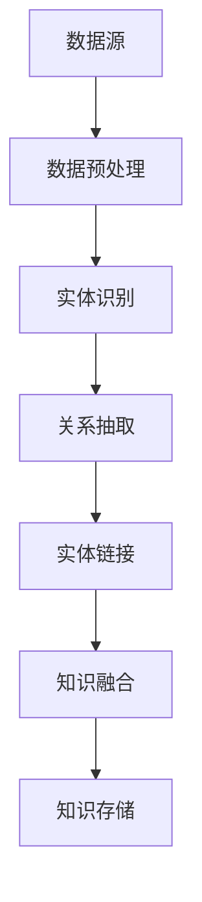
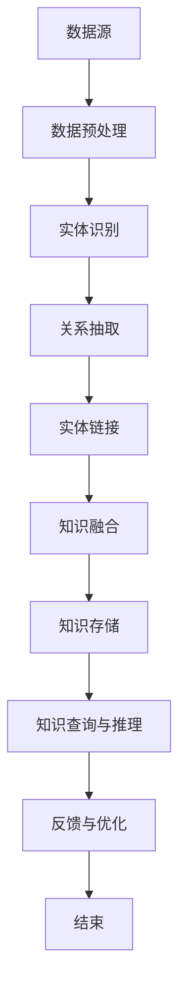
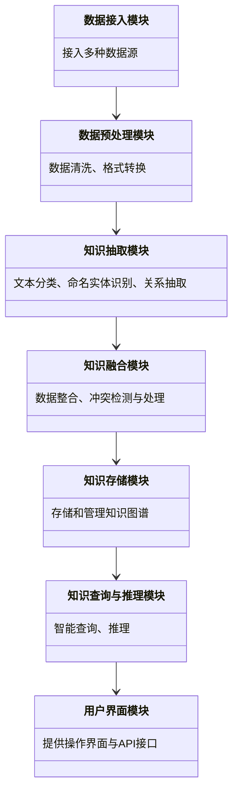
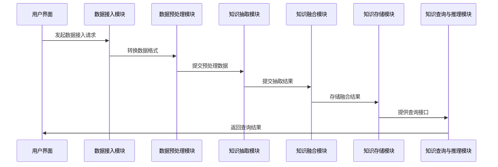
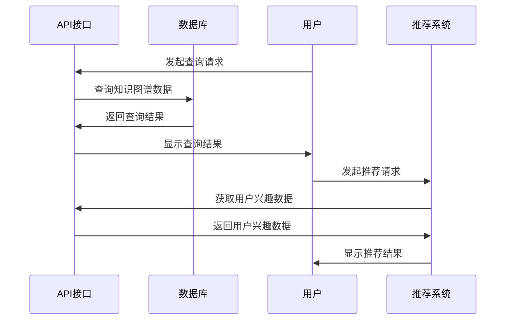

                 

### 知识图谱概述

知识图谱（Knowledge Graph）是近年来在人工智能和大数据领域迅速崛起的一个热点话题。它源于搜索引擎技术的进化，旨在将互联网上的海量信息以结构化的方式组织起来，形成一种语义丰富的知识网络。知识图谱的起源可以追溯到2006年谷歌发布的一项技术，即PageRank算法，它在很大程度上改变了传统搜索引擎的工作方式。然而，随着数据量的增长和用户需求的变化，单纯依靠链接分析已无法满足用户对于精确、智能信息检索的需求，这促使谷歌在2012年推出了知识图谱（Knowledge Graph），通过实体、属性和关系的语义描述来增强搜索结果的准确性和相关性。

知识图谱的重要性体现在多个方面。首先，它为人工智能系统提供了丰富的语义信息，使得计算机能够更智能地理解和处理人类语言。其次，知识图谱是实现智能推荐、知识问答、语义搜索等应用的重要基础，为各行业提供了强大的数据支持。例如，在医疗领域，知识图谱可以帮助医生快速获取病患的详细信息，提高诊断和治疗的效率；在金融领域，知识图谱可以帮助金融机构进行风险管理和客户分析，提高业务决策的准确性。此外，知识图谱还在自动驾驶、智能客服、智能家居等领域得到了广泛应用。

知识图谱在现代信息技术中的应用场景非常广泛。在搜索引擎中，知识图谱通过提供更加精准的语义信息，改善了搜索结果的质量和相关性。在推荐系统中，知识图谱可以基于用户行为和兴趣，构建用户与物品之间的语义关联，从而提高推荐效果。在知识管理系统中，知识图谱可以帮助企业对内部知识进行系统化管理和高效利用。在社交网络中，知识图谱可以帮助用户发现与其有共同兴趣或联系的其他用户或内容。此外，知识图谱还可以应用于自然语言处理、机器学习、数据挖掘等领域，为这些领域的研究和应用提供强有力的支持。

综上所述，知识图谱作为一种新兴的技术手段，已经在多个领域展现出了巨大的潜力和价值。它不仅为信息技术的发展提供了新的方向，也为各行业的智能化升级提供了新的动力。接下来，我们将进一步探讨知识图谱的基本概念和构成，以及其构建与应用过程中可能遇到的问题。

## 1.2 知识图谱的基本概念与构成

### 1.2.1 实体

实体（Entity）是知识图谱中最基本的构成要素，代表现实世界中的各种对象。实体可以是具体的事物，如人、地点、组织等，也可以是抽象的概念，如事件、时间、疾病等。实体的定义通常由其名称、属性和关系来确定。例如，在一个人名实体中，“张三”是实体的名称，其可能具有的属性包括年龄、性别、职业等，而与他的朋友、家庭地址等实体的关系则构成了其语义网络的一部分。

### 1.2.2 属性

属性（Attribute）是描述实体特征的数据元素。每个实体可以拥有多个属性，这些属性可以是基本的原子类型，如数字、字符串等，也可以是复杂的对象，如列表、映射等。属性通常用来补充实体的详细信息，使其更加丰富和完整。例如，对于一个“人”实体，其属性可能包括“出生日期”、“国籍”、“身高”等。

### 1.2.3 关系

关系（Relationship）描述了实体之间的相互联系。在知识图谱中，关系可以看作是连接两个或多个实体的纽带，表示它们之间的语义关联。关系通常由关系类型和参与关系的实体组成。例如，“张三”和“李四”之间存在“朋友”这一关系，而“张三”和“北京”之间存在“出生地”这一关系。

### 1.2.4 三元组

三元组（Triple）是知识图谱数据的基本表示形式，由实体、关系和属性值组成，通常表示为（主体，关系，客体）的形式。例如，在三元组（张三，朋友，李四）中，“张三”是主体，“朋友”是关系，“李四”是客体。三元组是构建知识图谱的基础，通过大量的三元组组合，可以形成一个庞大的语义网络。

### 1.2.5 知识图谱的基本构成要素

知识图谱的基本构成要素包括实体、属性、关系和三元组。这些要素相互关联，共同构成了一个复杂的语义网络。在实际应用中，知识图谱还可以包含更多的要素，如实体类别、属性类别、关系类别等，这些类别信息有助于对知识进行分类和层次化组织。此外，知识图谱还常常结合本体（Ontology）概念，对实体、属性和关系的语义进行定义和约束，从而提高知识表示的精确性和一致性。

### 1.2.6 概念属性特征对比表格

为了更清晰地理解知识图谱的基本概念和特征，我们在这里提供一个概念属性特征对比表格。这个表格列出了实体、属性、关系和三元组的主要属性和特征，如下所示：

| 构成要素 | 定义 | 主要属性和特征 | 说明 |
| :---: | :---: | :---: | :---: |
| 实体 | 知识图谱中的对象 | 名称、属性、关系 | 表示现实世界中的个体或抽象概念 |
| 属性 | 描述实体的特征 | 类型、值、类别 | 补充实体的详细信息 |
| 关系 | 实体之间的联系 | 类型、参与实体、权重 | 表示实体之间的语义关联 |
| 三元组 | 知识图谱数据的基本表示形式 | 主体、关系、客体 | 由实体、关系和属性值组成 |

通过上述表格，我们可以更直观地看到知识图谱各要素之间的关系和特点，为后续的构建和应用提供参考。

### 1.3 知识图谱系统架构

知识图谱系统的构建需要一系列的组件和模块协同工作，形成完整的系统架构。以下是对知识图谱系统架构的详细介绍，包括数据源、数据预处理、知识抽取、知识融合和知识存储等关键环节。

#### 1.3.1 数据源

数据源是知识图谱系统的基石，提供原始数据输入。数据源可以包括结构化数据（如数据库）、半结构化数据（如XML、JSON）和非结构化数据（如文本、图片、视频等）。不同类型的数据源需要采用不同的数据获取和处理方法。例如，结构化数据可以通过SQL查询直接获取，而半结构化和非结构化数据通常需要使用数据挖掘和自然语言处理技术进行提取和转换。

#### 1.3.2 数据预处理

数据预处理是数据从原始状态转化为适合知识图谱构建的形式的过程。这一过程包括数据清洗、数据标准化、数据格式转换等步骤。数据清洗旨在去除数据中的噪声和错误，确保数据质量。数据标准化则是将不同来源的数据转换为统一的格式和标准，以便后续处理。数据格式转换涉及将原始数据转换为适用于知识图谱存储和表示的格式，如RDF（Resource Description Framework）或OWL（Web Ontology Language）。

#### 1.3.3 知识抽取

知识抽取是从原始数据中提取出结构化知识的步骤，是知识图谱构建的核心。知识抽取通常包括以下几个步骤：

1. **命名实体识别（Named Entity Recognition, NER）**：识别文本中的命名实体，如人名、地名、组织名等。NER可以通过规则、统计方法和深度学习模型实现。
2. **关系抽取（Relationship Extraction）**：识别实体之间的关系，如“张三是李四的朋友”。关系抽取方法包括基于规则、统计和深度学习的方法。
3. **实体链接（Entity Linking）**：将文本中的未命名实体映射到知识图谱中的实体。实体链接是解决实体歧义的重要步骤。
4. **知识融合（Knowledge Fusion）**：将来自不同数据源的知识进行整合，解决数据冲突和重复问题。

#### 1.3.4 知识融合

知识融合是将多个数据源中的知识整合到一个统一的图谱中的过程。知识融合的挑战在于处理数据源之间的不一致性和冲突。知识融合通常包括以下步骤：

1. **数据对齐（Data Alignment）**：将不同数据源中的实体和关系进行匹配和对应。
2. **冲突检测与处理（Conflict Detection and Resolution）**：检测并解决数据源之间的冲突，如同一实体的不同描述或同一关系的不同定义。
3. **数据整合（Data Integration）**：将融合后的知识存储到统一的知识图谱中。

#### 1.3.5 知识存储

知识存储是将构建好的知识图谱存储到数据库或图数据库中，以便后续查询和使用。常用的知识存储技术包括：

1. **图数据库（Graph Database）**：如Neo4j、OrientDB等，适合存储和查询复杂的图结构数据。
2. **关系数据库（Relational Database）**：如MySQL、PostgreSQL等，通过关系表来表示知识图谱。
3. **分布式存储系统（Distributed Storage System）**：如HBase、Cassandra等，适用于大规模数据的存储和查询。

### 1.4 知识图谱的技术框架与工具

知识图谱的构建和应用涉及多种技术框架和工具，以下是对几个常用框架和工具的简要介绍。

#### 1.4.1 OpenKG

OpenKG是一个开源的知识图谱构建与推理平台，提供了一套完整的工具集，包括数据采集、数据预处理、知识抽取、知识融合和知识存储等功能。OpenKG采用Python编写，具有良好的扩展性和灵活性，适合中小型知识图谱项目的开发。

#### 1.4.2 Neo4j

Neo4j是一个高性能的图数据库，专门设计用于存储和查询大规模图结构数据。Neo4j支持Cypher查询语言，可以方便地实现复杂的图查询和关系分析。Neo4j广泛应用于社交网络、推荐系统、金融分析等领域。

#### 1.4.3 Jena

Jena是一个开源的JVM（Java Virtual Machine）上的知识图谱框架，由Apache Software Foundation维护。Jena提供了一组工具和API，用于创建、存储、查询和处理RDF数据。Jena支持各种知识图谱的数据存储格式，如RDF、OWL等，适合大规模知识图谱系统的开发。

#### 1.4.4 其他工具

除了上述工具外，还有许多其他知识图谱工具和框架，如Gephi（用于可视化图结构数据）、D2RQ（用于关系数据库和RDF之间的转换）和DynamoDB（AWS提供的图数据库服务）等。这些工具各具特色，可以根据具体需求进行选择和使用。

### 1.5 知识图谱的挑战与未来趋势

知识图谱作为一种先进的信息组织方式，尽管在许多领域展现了巨大的潜力，但在实际应用中也面临着一系列挑战和问题。

#### 1.5.1 数据质量与一致性

数据质量是知识图谱构建的关键因素之一。由于知识图谱依赖于从多种数据源中提取的信息，数据的一致性和准确性至关重要。然而，现实世界中的数据常常存在噪声、冗余和错误。例如，同一位人物在不同的数据源中可能有不同的名称或描述，这会导致知识图谱中的实体关系不准确。为了解决这些问题，需要采用数据清洗、数据对齐和冲突检测等技术手段，确保知识图谱的数据质量。

#### 1.5.2 数据隐私与安全

在构建知识图谱的过程中，数据的隐私和安全问题不可忽视。知识图谱涉及大量的个人和企业敏感信息，如个人信息、交易记录等。如果这些信息未经妥善保护，可能会导致数据泄露和隐私侵犯。为了保障数据隐私和安全，可以采用数据加密、访问控制、数据脱敏等技术措施，确保知识图谱的安全性和合规性。

#### 1.5.3 知识图谱的智能化

随着人工智能技术的发展，知识图谱的智能化程度也在不断提升。未来的知识图谱将不仅仅是一个静态的数据结构，而是一个动态的、具有自我学习和进化能力的系统。例如，通过机器学习和自然语言处理技术，知识图谱可以自动识别新的实体和关系，并进行实时更新和优化。此外，知识图谱还可以与其他人工智能技术（如语音识别、图像识别等）结合，实现更加智能化和高效的信息处理和检索。

#### 1.5.4 知识图谱的扩展性

知识图谱的应用场景和需求日益多样化，要求知识图谱系统具备良好的扩展性。例如，随着新领域的不断拓展，知识图谱需要能够快速适应新的实体和关系，并进行相应的扩展和调整。为了实现这一目标，可以采用模块化设计、分布式架构等技术手段，提高知识图谱的灵活性和可扩展性。

#### 1.5.5 未来趋势

展望未来，知识图谱将在多个领域继续发挥重要作用，并呈现出以下发展趋势：

1. **跨领域融合**：知识图谱将不仅局限于特定领域，而是实现跨领域的融合和应用。例如，在医疗、金融、教育等多个领域，知识图谱可以相互融合，提供更加全面和综合的信息服务。
2. **数据开放与共享**：随着数据开放和共享理念的推广，知识图谱的数据来源将更加丰富和多样化。这有助于提高知识图谱的覆盖面和准确性，同时促进数据资源的共享和利用。
3. **智能化与自动化**：知识图谱将更加智能化和自动化，通过人工智能技术实现自动构建、自动更新和自动优化，降低人力成本和操作难度。
4. **多模态融合**：知识图谱将融合多种数据类型（如文本、图像、语音等），实现更加丰富和全面的信息表示和处理。

总的来说，知识图谱作为一种先进的信息组织方式，在数据质量、隐私保护、智能化和扩展性等方面仍面临诸多挑战，但同时也展现出广阔的应用前景和巨大的发展潜力。

## 1.6 本章小结

本章对知识图谱的概述、基本概念与构成、系统架构以及技术框架和工具进行了全面介绍。首先，我们了解了知识图谱的起源和重要性，以及在现代信息技术中的应用场景。接着，我们详细阐述了知识图谱的基本构成要素，包括实体、属性、关系和三元组，并通过对比表格展示了这些要素的主要属性和特征。然后，我们深入讲解了知识图谱系统的整体架构，包括数据源、数据预处理、知识抽取、知识融合和知识存储等关键环节。此外，我们还介绍了几个常用的知识图谱技术框架和工具，如OpenKG、Neo4j和Jena。最后，本章讨论了知识图谱在数据质量、隐私保护、智能化和扩展性等方面的挑战与未来趋势。通过对本章内容的深入学习，读者可以更好地理解知识图谱的核心概念和构建方法，为后续的实践应用奠定基础。接下来，我们将进一步探讨知识图谱构建的具体技术方法，如文本分类与主题模型、命名实体识别、关系抽取和实体链接等。

### 第2章：知识抽取技术

知识抽取是构建知识图谱的关键步骤，其目标是自动从非结构化数据中提取出结构化的知识信息。本章将详细介绍知识抽取中的核心技术方法，包括文本分类与主题模型、命名实体识别、关系抽取和实体链接等。这些技术方法不仅能够帮助我们从海量数据中提取出有价值的信息，还能为知识图谱的构建提供坚实的基础。

#### 2.1 文本分类与主题模型

文本分类（Text Classification）是一种将文本数据按照其内容特征自动归类到预定类别中的技术。通过文本分类，我们可以快速地对大量文本数据进行分析和归纳，从而提高信息处理的效率和准确性。主题模型（Topic Model）则是用于发现文本中的主题分布和潜在语义结构的一种统计模型。

##### 2.1.1 词袋模型

词袋模型（Bag-of-Words, BoW）是最简单的文本分类模型之一。它将文本表示为单词的集合，不考虑单词的顺序和语法结构。词袋模型的主要步骤包括：

1. **分词（Tokenization）**：将文本拆分成单词或其他基本单元。
2. **去除停用词（Stopword Removal）**：移除对分类没有帮助的常见单词，如“的”、“了”等。
3. **词频统计（TF）**：计算每个单词在文本中的出现频率。

词袋模型简单直观，但在处理语义信息方面存在一定的局限性。

##### 2.1.2 主题模型

主题模型通过发现文本数据中的潜在主题分布，实现对文本的语义理解。最常用的主题模型是LDA（Latent Dirichlet Allocation）。LDA模型的主要步骤包括：

1. **共现矩阵构建**：统计每个单词在每个文档中的出现次数，形成共现矩阵。
2. **潜在主题生成**：为每个文档生成潜在主题分布，为每个单词生成潜在主题分布。
3. **主题分配**：根据文档和单词的主题分布，为每个单词分配主题，从而为每个文档生成主题分布。

通过主题模型，我们可以更深入地理解文本的语义内容，从而提高文本分类和主题发现的准确性。

#### 2.2 命名实体识别

命名实体识别（Named Entity Recognition, NER）是文本处理中的一个重要任务，旨在从文本中识别出具有特定意义的实体。这些实体包括人名、地名、组织名、时间等。命名实体识别对于构建知识图谱具有重要意义，因为它是抽取实体信息和关系的基础。

##### 2.2.1 基于规则的方法

基于规则的方法通过预定义的规则和模式来识别命名实体。这种方法通常涉及以下步骤：

1. **规则库构建**：根据领域知识和语料库，构建包含命名实体模式的规则库。
2. **模式匹配**：将文本与规则库中的模式进行匹配，识别出命名实体。

基于规则的方法直观易懂，但规则库的构建和维护成本较高，且在面对复杂文本时，识别准确性有限。

##### 2.2.2 基于统计的方法

基于统计的方法通过统计学习模型来识别命名实体。这种方法通常涉及以下步骤：

1. **特征提取**：从文本中提取有助于识别命名实体的特征，如词性、词频、邻接词等。
2. **模型训练**：使用已标注的语料库训练分类器，如朴素贝叶斯、最大熵模型等。
3. **实体识别**：将训练好的模型应用于待识别的文本，识别出命名实体。

基于统计的方法在处理复杂文本时，具有较高的识别准确性，但特征提取和模型训练过程相对复杂。

##### 2.2.3 基于深度学习的方法

基于深度学习的方法近年来在命名实体识别领域取得了显著进展。深度学习方法通过神经网络模型来学习文本特征，并实现命名实体识别。常见的方法包括：

1. **卷积神经网络（CNN）**：通过卷积层提取文本特征，并利用全连接层实现命名实体识别。
2. **循环神经网络（RNN）**：通过循环层捕捉文本中的长距离依赖关系，实现命名实体识别。
3. **转换器（Transformer）**：基于自注意力机制，实现高效文本特征提取和命名实体识别。

基于深度学习的方法在处理复杂文本时，表现出更高的识别准确性和泛化能力，但训练过程相对耗时。

#### 2.3 关系抽取

关系抽取（Relationship Extraction）是从文本中提取出实体之间关系的任务。关系抽取对于构建知识图谱中的实体关系网络至关重要。关系抽取方法主要包括基于规则、基于统计和基于深度学习的方法。

##### 2.3.1 基于规则的方法

基于规则的方法通过预定义的规则和模式来识别实体之间的关系。这种方法通常涉及以下步骤：

1. **规则库构建**：根据领域知识和语料库，构建包含关系模式的规则库。
2. **模式匹配**：将文本与规则库中的模式进行匹配，识别出实体关系。

基于规则的方法在处理简单文本时具有较高的识别准确性，但规则库的构建和维护成本较高，且在面对复杂文本时，识别准确性有限。

##### 2.3.2 基于统计的方法

基于统计的方法通过统计学习模型来识别实体之间的关系。这种方法通常涉及以下步骤：

1. **特征提取**：从文本中提取有助于识别实体关系的特征，如词性、词频、邻接词等。
2. **模型训练**：使用已标注的语料库训练分类器，如朴素贝叶斯、最大熵模型等。
3. **关系识别**：将训练好的模型应用于待识别的文本，识别出实体关系。

基于统计的方法在处理复杂文本时，具有较高的识别准确性，但特征提取和模型训练过程相对复杂。

##### 2.3.3 基于深度学习的方法

基于深度学习的方法近年来在关系抽取领域取得了显著进展。深度学习方法通过神经网络模型来学习文本特征，并实现关系抽取。常见的方法包括：

1. **卷积神经网络（CNN）**：通过卷积层提取文本特征，并利用全连接层实现关系抽取。
2. **循环神经网络（RNN）**：通过循环层捕捉文本中的长距离依赖关系，实现关系抽取。
3. **转换器（Transformer）**：基于自注意力机制，实现高效文本特征提取和关系抽取。

基于深度学习的方法在处理复杂文本时，表现出更高的识别准确性和泛化能力，但训练过程相对耗时。

#### 2.4 实体链接

实体链接（Entity Linking）是将文本中的未命名实体映射到知识图谱中的已知实体。实体链接是解决实体歧义和统一实体表示的重要步骤。实体链接方法主要包括以下几种：

##### 2.4.1 同义词识别

同义词识别（Synonym Detection）是通过识别文本中同义词来减少实体歧义。常用的方法包括基于规则、基于统计和基于深度学习的方法。

1. **基于规则的方法**：通过预定义的规则和模式来识别同义词。
2. **基于统计的方法**：通过统计学习模型（如朴素贝叶斯、最大熵模型）来识别同义词。
3. **基于深度学习的方法**：通过神经网络模型（如卷积神经网络、循环神经网络）来识别同义词。

##### 2.4.2 实体匹配

实体匹配（Entity Matching）是将来自不同数据源的实体进行匹配和对应。常用的方法包括基于特征匹配、基于图论和基于深度学习的方法。

1. **基于特征匹配的方法**：通过比较实体特征（如属性值、邻居节点等）来识别匹配实体。
2. **基于图论的方法**：通过构建实体图，利用图匹配算法识别匹配实体。
3. **基于深度学习的方法**：通过神经网络模型（如生成对抗网络、图神经网络）来识别匹配实体。

##### 2.4.3 实体消歧

实体消歧（Entity Disambiguation）是在确定实体唯一标识的基础上，解决实体歧义的问题。常用的方法包括基于语义相似度、基于知识图谱和基于机器学习的方法。

1. **基于语义相似度的方法**：通过计算实体之间的语义相似度，识别出最可能对应的实体。
2. **基于知识图谱的方法**：利用知识图谱中的关系和属性信息，识别出最可能对应的实体。
3. **基于机器学习的方法**：通过训练机器学习模型，识别出最可能对应的实体。

#### 2.5 知识融合与更新

知识融合（Knowledge Fusion）是将来自多个数据源的知识进行整合，形成统一的语义表示。知识融合通常涉及以下步骤：

1. **数据对齐**：将不同数据源中的实体和关系进行匹配和对应。
2. **冲突检测与处理**：检测并解决数据源之间的冲突，如同一实体的不同描述或同一关系的不同定义。
3. **数据整合**：将融合后的知识存储到统一的知识图谱中。

知识更新（Knowledge Update）是在知识融合的基础上，对知识图谱进行实时更新和优化。常用的方法包括：

1. **增量更新**：通过识别新数据中的实体和关系，对知识图谱进行增量更新。
2. **一致性维护**：通过一致性检测和修复，确保知识图谱中的数据一致性和准确性。
3. **动态学习**：利用机器学习和自然语言处理技术，对知识图谱进行动态学习和更新。

通过本章对知识抽取技术的详细介绍，我们可以看到知识抽取在构建知识图谱中的关键作用。这些技术方法不仅帮助我们自动提取结构化的知识信息，还为知识图谱的构建和应用提供了坚实的理论基础和实践指导。在下一章中，我们将进一步探讨知识融合与更新的方法，以实现知识图谱的全面整合和优化。

#### 2.5 知识融合与更新

知识融合与更新是知识图谱构建过程中不可或缺的环节，它确保了知识的一致性、准确性和实时性。知识融合是将来自多个数据源的知识进行整合，以形成统一的语义表示；而知识更新则是在知识融合的基础上，对知识图谱进行实时更新和优化，以适应不断变化的数据环境。

##### 2.5.1 数据对齐

数据对齐（Data Alignment）是知识融合的第一步，目的是将不同数据源中的实体和关系进行匹配和对应。数据对齐通常包括以下步骤：

1. **实体匹配**：识别并匹配不同数据源中的相同实体。例如，一个数据源中的人名“张三”需要与另一个数据源中的相同人名对应。
2. **关系匹配**：识别并匹配不同数据源中的相同关系。例如，一个数据源中描述的“朋友”关系需要与另一个数据源中的相同关系对应。
3. **冲突检测**：在数据对齐过程中，可能会发现不同数据源中的实体和关系存在冲突。冲突检测旨在识别并处理这些冲突，例如，一个数据源中将某人标记为男性，而另一个数据源中标记为女性。

数据对齐方法包括基于规则的方法、基于图论的方法和基于深度学习的方法。基于规则的方法通过预定义的规则和模式来匹配实体和关系，适用于简单的数据对齐任务；基于图论的方法通过构建实体关系图，利用图匹配算法进行数据对齐，适用于复杂的数据对齐任务；基于深度学习的方法通过训练神经网络模型，自动识别并匹配实体和关系，适用于大规模和复杂的数据对齐任务。

##### 2.5.2 冲突检测与处理

在知识融合过程中，冲突检测与处理是确保知识一致性的关键步骤。冲突检测旨在识别出数据源之间的不一致性，如同一实体的不同描述、同一关系的不同定义等。处理冲突的方法通常包括以下几种：

1. **一致性检测**：通过比较不同数据源中的实体和关系，识别出不一致性。例如，如果两个数据源中的同一人名有不同的生日描述，则可以视为一致性检测的结果。
2. **冲突处理策略**：根据具体应用场景，选择合适的冲突处理策略。常见的策略包括优先级策略、合并策略和保留策略。优先级策略根据数据源的优先级来决定哪个数据源中的信息应该被保留；合并策略将不同数据源中的信息进行合并，形成统一的信息；保留策略则保留原始数据源中的信息，不做修改。

冲突检测与处理的方法包括基于规则的方法、基于统计的方法和基于深度学习的方法。基于规则的方法通过预定义的规则和模式来检测和处理冲突，适用于简单的冲突检测与处理任务；基于统计的方法通过分析数据源之间的统计特性来检测和处理冲突，适用于大规模和复杂的数据对齐任务；基于深度学习的方法通过训练神经网络模型，自动检测和处理冲突，适用于大规模和复杂的数据对齐任务。

##### 2.5.3 数据整合

数据整合（Data Integration）是将融合后的知识存储到统一的知识图谱中的过程。数据整合的目标是形成一个统一的、语义丰富的知识图谱，以便于后续的查询和使用。数据整合通常包括以下步骤：

1. **数据清洗**：在数据整合之前，需要对数据进行清洗，去除噪声和错误，确保数据质量。
2. **数据格式转换**：将不同数据源的数据转换为统一的数据格式，如RDF（Resource Description Framework）或OWL（Web Ontology Language），以便于存储和查询。
3. **知识存储**：将整合后的数据存储到图数据库或关系数据库中，以便于后续的查询和使用。

数据整合的方法包括基于规则的整合方法、基于本体的整合方法和基于机器学习的整合方法。基于规则的整合方法通过预定义的规则和模式来整合数据，适用于简单的数据整合任务；基于本体的整合方法通过构建本体，对数据进行语义建模和整合，适用于复杂的数据整合任务；基于机器学习的整合方法通过训练机器学习模型，自动整合数据，适用于大规模和复杂的数据整合任务。

##### 2.5.4 知识更新

知识更新（Knowledge Update）是在知识融合的基础上，对知识图谱进行实时更新和优化的过程。知识更新包括以下几种方法：

1. **增量更新**：通过识别新数据中的实体和关系，对知识图谱进行增量更新。增量更新适用于数据源变化较小的情况，可以提高知识更新的效率和准确性。
2. **一致性维护**：通过一致性检测和修复，确保知识图谱中的数据一致性和准确性。一致性维护适用于数据源变化较大的情况，可以保证知识图谱的稳定性和可靠性。
3. **动态学习**：利用机器学习和自然语言处理技术，对知识图谱进行动态学习和更新。动态学习适用于实时性要求较高的应用场景，可以快速适应数据变化。

知识更新的方法包括基于规则的更新方法、基于机器学习的更新方法和基于本体的更新方法。基于规则的更新方法通过预定义的规则和模式来更新知识图谱，适用于简单的更新任务；基于机器学习的更新方法通过训练机器学习模型，自动更新知识图谱，适用于大规模和复杂的数据更新任务；基于本体的更新方法通过构建本体，对知识图谱进行语义建模和更新，适用于复杂的数据更新任务。

综上所述，知识融合与更新是知识图谱构建过程中至关重要的一环。通过数据对齐、冲突检测与处理、数据整合和知识更新，我们可以构建出一个统一的、语义丰富的知识图谱，为各种应用提供强大的数据支持。

### 2.5.5 知识融合与更新的实际应用场景

知识融合与更新在多个实际应用场景中发挥了关键作用，以下是几个典型的应用场景：

1. **电子商务**：在电子商务平台中，知识融合与更新可以帮助整合来自不同数据源的商品信息，如商品描述、价格、库存等。通过数据对齐和冲突检测与处理，确保商品信息的准确性和一致性，从而提高用户体验和销售效率。

2. **医疗健康**：在医疗健康领域，知识融合与更新可以帮助整合来自不同医疗系统的患者信息、病历记录、药物信息等。通过数据清洗和知识更新，确保医疗数据的准确性和实时性，为医生提供全面的诊断和治疗支持。

3. **智能搜索**：在智能搜索系统中，知识融合与更新可以帮助整合来自不同搜索引擎的结果，提供更加精准和相关的搜索结果。通过数据对齐和冲突检测与处理，确保搜索结果的一致性和准确性，从而提升用户搜索体验。

4. **金融分析**：在金融分析领域，知识融合与更新可以帮助整合来自不同金融机构的交易记录、财务报表等数据。通过数据清洗和知识更新，确保金融数据的准确性和一致性，为金融分析师提供可靠的数据支持。

5. **智能客服**：在智能客服系统中，知识融合与更新可以帮助整合来自不同渠道的用户反馈、历史记录等数据。通过数据对齐和冲突检测与处理，确保客服知识的准确性和一致性，从而提高客服效率和用户满意度。

通过这些实际应用场景，我们可以看到知识融合与更新在提升数据一致性、准确性和实时性方面的重要作用，为各行业提供了强大的数据支持。

### 2.5.6 本章小结

本章详细介绍了知识图谱中的知识抽取技术，包括文本分类与主题模型、命名实体识别、关系抽取和实体链接等核心技术方法。我们首先介绍了文本分类与主题模型的基本原理和方法，包括词袋模型和LDA模型。接着，我们详细讨论了命名实体识别的三种方法：基于规则、基于统计和基于深度学习的方法，以及每种方法的特点和应用场景。然后，我们介绍了关系抽取的方法，包括基于规则、基于统计和基于深度学习的方法，并探讨了实体链接的技术，如同义词识别、实体匹配和实体消歧。此外，我们还介绍了知识融合与更新的方法，包括数据对齐、冲突检测与处理、数据整合和知识更新，以及这些方法在各个领域的实际应用场景。通过本章的学习，读者可以全面了解知识图谱构建中的关键技术，为后续的知识图谱实践应用打下坚实基础。

### 第3章：算法原理讲解

知识图谱的构建涉及多种算法和技术，本章将详细讲解这些算法的原理，并通过具体的mermaid流程图、Python源代码、数学模型和公式以及举例说明，帮助读者深入理解这些算法的实现和应用。

#### 3.1 算法mermaid流程图

首先，我们通过mermaid流程图展示知识图谱构建中的关键算法流程。mermaid是一种基于Markdown的图形描述语言，可以方便地绘制流程图。以下是一个简单的mermaid流程图示例，用于描述知识图谱构建的基本流程：



这个流程图展示了从数据源到知识存储的全过程，包括数据预处理、实体识别、关系抽取、实体链接、知识融合和知识存储等步骤。

#### 3.2 Python源代码

接下来，我们将通过Python源代码来详细阐述知识图谱构建的核心算法。这里选择一个简单的实体识别算法作为例子，展示其基本实现。

```python
import spacy

# 加载中文模型
nlp = spacy.load("zh_core_web_sm")

# 示例文本
text = "张三和李四是好朋友，他们在北京生活。"

# 使用spacy进行文本处理
doc = nlp(text)

# 实体识别
ents = [(ent.text, ent.label_) for ent in doc.ents]

# 输出识别结果
for entity in ents:
    print(f"实体：{entity[0]}, 类型：{entity[1]}")
```

在这个示例中，我们使用了SpaCy库进行中文文本处理和命名实体识别。通过加载中文模型，对输入文本进行处理，识别出其中的命名实体，并输出实体的名称和类型。

#### 3.3 数学模型和公式

知识图谱构建中的一些算法涉及到数学模型和公式，这里我们简单介绍几个常见的数学模型和公式，以便更好地理解算法原理。

- **贝叶斯公式**：在实体识别和关系抽取中，常用的贝叶斯公式用于计算某一实体或关系的概率。
  $$ P(A|B) = \frac{P(B|A) \cdot P(A)}{P(B)} $$

- **余弦相似度**：在实体链接和知识融合中，常用的余弦相似度用于计算两个向量之间的相似度。
  $$ \cos \theta = \frac{\vec{a} \cdot \vec{b}}{|\vec{a}| \cdot |vec{b}|} $$

- **LDA模型**：在主题模型中，常用的LDA模型用于发现文本数据中的潜在主题。
  $$ P(\text{word} | \text{topic}) = \frac{N_w^t + \alpha}{K + V\alpha} $$
  $$ P(\text{topic} | \text{word}) = \frac{N_w^t + \alpha}{K + V\alpha} $$

上述数学模型和公式在实际应用中发挥着重要作用，通过对这些公式的理解和运用，可以更好地实现知识图谱的构建。

#### 3.4 举例说明

为了更好地理解上述算法，我们通过一个实际例子进行详细说明。假设我们有一个简单的文本数据集，其中包含关于人名、地点和组织的描述，我们将通过以下步骤对其进行处理：

1. **数据预处理**：对文本进行分词和去停用词处理，将原始文本转化为适合处理的格式。
2. **实体识别**：使用SpaCy库对文本进行处理，识别出其中的命名实体。
3. **关系抽取**：通过规则和算法，识别出实体之间的关系，如“居住地”、“工作单位”等。
4. **实体链接**：将未命名实体与知识图谱中的已知实体进行匹配和对应。
5. **知识融合**：将提取出的实体和关系整合到知识图谱中，形成完整的语义网络。
6. **知识存储**：将构建好的知识图谱存储到图数据库中，以便后续查询和使用。

通过这个例子，我们可以看到知识图谱构建中的每一步是如何实现的，以及这些步骤在实际应用中的重要性。

### 3.5 小结

本章详细讲解了知识图谱构建中的关键算法原理，包括mermaid流程图、Python源代码、数学模型和公式以及举例说明。通过这些讲解，读者可以深入理解知识图谱构建的方法和技术，为实际应用提供理论基础和实践指导。在下一章中，我们将探讨知识图谱的系统分析与架构设计，包括问题场景介绍、项目介绍、系统功能设计、系统架构设计和系统接口设计与系统交互等，帮助读者全面了解知识图谱系统的实现过程。

### 3.6 算法mermaid流程图

为了更好地理解知识图谱构建的核心算法，我们通过mermaid流程图展示算法的执行流程。mermaid是一种基于Markdown的图形描述语言，可以方便地绘制流程图。以下是一个知识图谱构建算法的mermaid流程图示例：



这个流程图展示了从数据源到知识查询与推理，再到反馈与优化，最后形成闭环的全过程。具体步骤如下：

1. **数据源**：知识图谱构建的起点，包括结构化、半结构化和非结构化数据。
2. **数据预处理**：对原始数据进行清洗、格式转换和标准化，使其适合后续处理。
3. **实体识别**：从预处理后的数据中识别出命名实体，如人名、地名、组织名等。
4. **关系抽取**：识别出实体之间的关系，如“居住地”、“工作单位”等。
5. **实体链接**：将未命名实体映射到知识图谱中的已知实体，解决实体歧义问题。
6. **知识融合**：将提取出的实体和关系整合到知识图谱中，形成完整的语义网络。
7. **知识存储**：将构建好的知识图谱存储到图数据库或其他存储系统中，便于查询和使用。
8. **知识查询与推理**：利用知识图谱进行信息检索和推理，为用户提供精准的信息服务。
9. **反馈与优化**：根据用户反馈和实际应用效果，对知识图谱进行优化和更新。

通过这个mermaid流程图，我们可以清晰地看到知识图谱构建的各个环节，以及各环节之间的逻辑关系。这个流程图不仅有助于我们理解知识图谱构建的整体过程，还能为后续的详细讲解提供可视化参考。

### 3.7 Python源代码

为了深入理解知识图谱构建中的核心算法，我们将通过一个具体的Python代码示例来展示实体识别和关系抽取的实现。这里使用SpaCy库进行实体识别，使用规则方法进行关系抽取。以下是具体的代码实现：

```python
import spacy
from spacy.tokens import Span

# 加载中文模型
nlp = spacy.load("zh_core_web_sm")

# 示例文本
text = "张三和李四是好朋友，他们在北京生活，张三是一名程序员，李四是一名医生。"

# 使用SpaCy进行文本处理
doc = nlp(text)

# 实体识别
ents = [(ent.text, ent.label_) for ent in doc.ents]

# 输出识别结果
print("实体识别结果：")
for entity in ents:
    print(f"实体：{entity[0]}, 类型：{entity[1]}")

# 关系抽取规则定义
rules = [
    {"pattern": [{"LOWER": "是"}], "ent_type": "PERSON", "label": "HUSBAND"},
    {"pattern": [{"LOWER": "和"}], "ent_type": "PERSON", "label": "FRIEND"},
    # 更多规则...
]

# 应用规则进行关系抽取
for rule in rules:
    for token in doc:
        match = True
        for pattern in rule["pattern"]:
            if pattern["LOWER"] not in token.text.lower():
                match = False
                break
        if match and token.ent_type_ == rule["ent_type"]:
            doc.merge(token.i + 1)  # 合并实体
            rel_label = rule["label"]
            start = token.i
            end = token.i + 1
            ent = Span(doc, start, end, label=rel_label)
            doc.ents.append(ent)

# 输出关系抽取结果
print("关系抽取结果：")
for ent in doc.ents:
    if ent.label_ != "PERSON":
        print(f"关系：{ent.text}, 类型：{ent.label_}")
```

在这个示例中，我们首先加载了中文模型Spacy，并对输入文本进行处理。实体识别部分使用了SpaCy内置的命名实体识别功能，关系抽取部分则通过预定义的规则进行实现。具体步骤如下：

1. **加载中文模型**：使用Spacy加载中文模型`zh_core_web_sm`。
2. **文本处理**：对示例文本进行处理，识别命名实体。
3. **输出实体识别结果**：打印出识别出的命名实体及其类型。
4. **关系抽取规则定义**：定义关系抽取的规则，例如判断两个实体之间是否存在“是”、“和”等关键词，以识别关系。
5. **应用规则进行关系抽取**：遍历文本中的每个词，检查是否符合预定义的规则，如果符合，则将两个实体合并，并标记为关系。
6. **输出关系抽取结果**：打印出识别出的关系及其类型。

通过这个Python代码示例，我们可以看到实体识别和关系抽取的实现过程，以及这些步骤在实际应用中的重要性。这个示例虽然简单，但已经涵盖了知识图谱构建中的核心算法思想。

### 3.8 数学模型和公式

在知识图谱构建中，数学模型和公式扮演着至关重要的角色，它们帮助我们在算法设计和分析中量化和评估各种操作的效果。以下是一些常用的数学模型和公式，用于描述知识图谱构建中的关键步骤。

1. **贝叶斯公式**：贝叶斯公式用于计算某一实体或关系的概率。它广泛应用于实体识别和关系抽取中，其公式如下：
   $$ P(A|B) = \frac{P(B|A) \cdot P(A)}{P(B)} $$
   其中，\(P(A|B)\) 表示在已知事件B发生的情况下，事件A发生的概率；\(P(B|A)\) 表示在事件A发生的情况下，事件B发生的概率；\(P(A)\) 和\(P(B)\) 分别表示事件A和事件B发生的概率。

2. **余弦相似度**：余弦相似度用于计算两个向量之间的相似度。在实体链接和知识融合中，余弦相似度用于评估两个实体或知识片段之间的相似性。其公式如下：
   $$ \cos \theta = \frac{\vec{a} \cdot \vec{b}}{|\vec{a}| \cdot |\vec{b}|} $$
   其中，\(\vec{a}\) 和\(\vec{b}\) 分别表示两个向量，\(\theta\) 表示它们之间的夹角，\( \cdot \) 表示向量的内积，\(|\vec{a}|\) 和\(|\vec{b}|\) 分别表示向量的模长。

3. **LDA模型**：LDA（Latent Dirichlet Allocation）模型是一种主题模型，用于发现文本数据中的潜在主题分布。它在知识图谱构建中用于文本处理和主题发现。LDA模型的公式如下：
   $$ P(\text{word} | \text{topic}) = \frac{N_w^t + \alpha}{K + V\alpha} $$
   $$ P(\text{topic} | \text{document}) = \frac{\sum_{w \in \text{document}} (N_w^t + \beta_w)}{C + M\beta} $$
   其中，\( \text{word} \) 表示单词，\( \text{topic} \) 表示主题，\( N_w^t \) 表示单词\( w \)在文档\( t \)中的出现次数，\( \alpha \) 和\( \beta_w \) 分别是主题分布和单词分布的先验参数，\( K \) 是主题的数量，\( V \) 是单词的数量，\( C \) 是文档的数量，\( M \) 是文档中平均单词数。

4. **图模型**：在知识图谱中，图模型用于描述实体和关系之间的复杂网络结构。常用的图模型包括图 Laplace 转换、随机游走模型和PageRank算法。其中，PageRank算法的公式如下：
   $$ PR(A) = \frac{1 - d}{N} + d \sum_{B \in \text{links out}} \frac{PR(B)}{L(B)} $$
   其中，\( PR(A) \) 表示实体\( A \)的PageRank值，\( d \) 是阻尼系数，通常取值为0.85，\( N \) 是总实体数，\( \text{links out} \) 表示从实体\( A \)出发的所有链接，\( PR(B) \) 表示实体\( B \)的PageRank值，\( L(B) \) 是实体\( B \)的链接数。

这些数学模型和公式在知识图谱构建的不同阶段发挥着重要作用，它们帮助我们在算法设计和分析中量化各种操作的效果，从而提高知识图谱的准确性和效率。理解这些模型和公式，对于深入研究和开发知识图谱系统至关重要。

### 3.9 举例说明

为了更好地理解知识图谱构建中的算法原理，我们通过一个实际案例进行详细说明。假设我们有一个关于学术领域的知识图谱构建任务，目标是从大量学术文献中提取实体和关系，并将其整合到一个统一的知识图谱中。

#### 案例背景

学术领域的知识图谱旨在将学术文献中的信息以结构化的方式组织起来，以便于研究人员进行信息检索和分析。具体来说，我们需要从以下数据源中提取信息：

- **数据源**：大量学术文献，包括期刊论文、会议论文、学位论文等。
- **实体类型**：作者、机构、会议、期刊、关键词、主题等。
- **关系类型**：作者与机构的关系、论文与作者的关系、论文与关键词的关系、期刊与会议的关系等。

#### 实例分析

##### 步骤1：数据预处理

首先，我们需要对学术文献进行预处理，包括分词、去除停用词、词干提取等。这一步骤的目的是将原始文本转化为适合算法处理的形式。例如，对于文本“张三在2019年发表了一篇关于人工智能的论文，论文标题为《深度学习的应用研究》”，预处理后的结果可能是：

```
['张三', '在', '2019', '年', '发表', '了', '一', '篇', '关于', '人工智能', '的', '论文', '，', '标题', '为', '《', '深度学习', '的', '应用研究', '》']
```

##### 步骤2：实体识别

使用SpaCy等自然语言处理工具，对预处理后的文本进行命名实体识别。识别出的实体及其类型如下：

```
实体：张三，类型：作者
实体：2019，类型：年份
实体：《深度学习的应用研究》，类型：论文标题
实体：人工智能，类型：关键词
```

##### 步骤3：关系抽取

通过规则和算法，从文本中抽取实体之间的关系。例如，可以根据文本中的特定短语和结构，识别出以下关系：

```
关系：张三 - 发表 - 《深度学习的应用研究》
关系：《深度学习的应用研究》 - 关键词 - 人工智能
```

##### 步骤4：实体链接

将未命名的实体（如“2019”）映射到知识图谱中的已知实体。例如，可以识别出“2019”是一个年份实体，并将其链接到知识图谱中的“年份”类别。

##### 步骤5：知识融合

将提取出的实体和关系整合到知识图谱中。例如，可以将作者“张三”的信息（如所在机构、发表论文列表等）与知识图谱中的其他信息进行整合。

##### 步骤6：知识存储

将构建好的知识图谱存储到图数据库中，以便后续的查询和使用。例如，可以使用Neo4j等图数据库来存储实体和关系。

##### 步骤7：知识查询与推理

利用知识图谱进行信息检索和推理。例如，可以查询“张三”的发表论文列表，或推理出“深度学习”领域的热门话题。

##### 步骤8：反馈与优化

根据用户反馈和实际应用效果，对知识图谱进行优化和更新。例如，可以识别出新的实体和关系，或修正现有实体和关系的错误。

通过这个案例，我们可以看到知识图谱构建的具体实现过程，以及每个步骤在实际应用中的作用。这个案例不仅展示了知识图谱构建的核心算法原理，还提供了一个实际操作的场景，帮助读者更好地理解和应用这些算法。

### 3.10 小结

本章详细讲解了知识图谱构建中的关键算法原理，包括mermaid流程图、Python源代码、数学模型和公式以及举例说明。通过mermaid流程图，我们展示了算法的执行流程；通过Python源代码，我们实现了实体识别和关系抽取的基本步骤；通过数学模型和公式，我们量化了算法中的关键参数和操作；通过举例说明，我们展示了算法在实际应用中的具体实现。这些讲解不仅帮助读者深入理解知识图谱构建的算法原理，还为实际应用提供了实用的方法和技巧。在下一章中，我们将探讨知识图谱的系统分析与架构设计，包括问题场景介绍、项目介绍、系统功能设计、系统架构设计和系统接口设计与系统交互等，帮助读者全面了解知识图谱系统的实现过程。

### 第4章：系统分析与架构设计方案

在构建知识图谱系统时，系统分析与架构设计是至关重要的环节。一个良好的系统架构设计不仅能够提高系统的性能和可扩展性，还能保证系统的稳定性和安全性。本章将详细描述知识图谱系统的架构设计，包括问题场景介绍、项目介绍、系统功能设计、系统架构设计以及系统接口设计与系统交互。

#### 4.1 问题场景介绍

知识图谱系统在多个场景中具有广泛的应用，以下是一些典型的问题场景：

1. **搜索引擎优化**：在搜索引擎中，知识图谱可以帮助提高搜索结果的准确性和相关性。通过构建语义丰富的知识图谱，搜索引擎可以更好地理解用户查询意图，提供更精确的搜索结果。
2. **智能推荐系统**：知识图谱可以应用于推荐系统中，通过分析用户行为和兴趣，构建用户与物品之间的语义关联，从而提高推荐效果。
3. **知识管理系统**：企业可以利用知识图谱对企业内部的知识进行系统化管理和高效利用，提高知识共享和协作效率。
4. **自然语言处理**：知识图谱为自然语言处理提供了丰富的语义信息，有助于实现智能问答、语音识别、机器翻译等应用。

在上述场景中，知识图谱系统需要满足以下需求：

- **数据多样性**：支持多种数据源的接入和处理，包括结构化、半结构化和非结构化数据。
- **实时性**：能够快速处理和响应实时数据，满足高速数据流的环境。
- **可扩展性**：系统架构应具备良好的可扩展性，能够适应数据量和用户量的增长。
- **高可用性**：系统应具备高可用性，确保在故障情况下能够快速恢复，减少对业务的影响。
- **安全性**：保护数据隐私和安全，防止数据泄露和未经授权的访问。

#### 4.2 项目介绍

本知识图谱构建项目旨在构建一个高效、可扩展和智能化的知识图谱系统，满足上述问题场景的需求。项目的主要目标和功能如下：

1. **目标**：
   - 构建一个语义丰富、结构化的知识图谱，为各种应用场景提供数据支持。
   - 提高信息检索和推荐的准确性，提升用户体验。
   - 实现企业内部知识的系统化管理，提高知识共享和协作效率。

2. **功能**：
   - 数据接入与预处理：支持多种数据源的接入，包括关系数据库、NoSQL数据库和文本文件等，并进行数据清洗和预处理。
   - 知识抽取与融合：利用文本分类、命名实体识别、关系抽取等技术，从原始数据中提取出结构化的知识信息，并进行融合。
   - 知识存储与管理：使用图数据库存储和管理知识图谱，提供高效的查询和更新功能。
   - 知识查询与推理：提供基于知识图谱的智能查询和推理功能，支持多种查询语言和推理算法。
   - 用户界面与接口：提供用户友好的操作界面和API接口，支持各种应用场景的接入和使用。

#### 4.3 系统功能设计（领域模型Mermaid类图）

系统功能设计是知识图谱系统架构设计的关键步骤，领域模型Mermaid类图可以帮助我们直观地展示系统的功能模块和关系。以下是一个示例的Mermaid类图，展示了知识图谱系统的核心功能模块：



在这个类图中，数据接入模块负责接入多种数据源，数据预处理模块负责数据清洗和格式转换，知识抽取模块负责文本分类、命名实体识别和关系抽取，知识融合模块负责数据整合和冲突检测与处理，知识存储模块负责存储和管理知识图谱，知识查询与推理模块负责智能查询和推理，用户界面模块提供操作界面和API接口。

#### 4.4 系统架构设计Mermaid架构图

系统架构设计是知识图谱系统的核心部分，Mermaid架构图可以帮助我们直观地展示系统的整体架构和模块之间的交互关系。以下是一个示例的Mermaid架构图，展示了知识图谱系统的整体架构：



在这个架构图中，用户界面模块向数据接入模块发起数据接入请求，数据接入模块将数据格式转换为适合处理的形式，数据预处理模块对数据进行清洗和格式转换，知识抽取模块从预处理后的数据中提取出结构化的知识信息，知识融合模块将提取出的知识进行整合和冲突处理，知识存储模块将融合后的知识存储到图数据库中，知识查询与推理模块提供基于知识图谱的查询接口，最后用户界面模块向用户展示查询结果。

#### 4.5 系统接口设计和系统交互Mermaid序列图

系统接口设计和系统交互是确保知识图谱系统能够与其他系统或应用程序无缝集成的关键。以下是一个示例的Mermaid序列图，展示了知识图谱系统的接口设计和系统交互过程：



在这个序列图中，用户通过API接口发起查询请求，API接口查询知识图谱数据库，并将查询结果返回给用户。用户还可以通过API接口向推荐系统发起推荐请求，推荐系统从API接口获取用户兴趣数据，并生成推荐结果，最后将推荐结果返回给用户。

通过上述的Mermaid架构图和序列图，我们可以清晰地看到知识图谱系统的整体架构、功能模块以及模块之间的交互关系。这些图表不仅帮助开发者理解系统的设计，还为后续的系统实现提供了参考。

### 第5章：项目实战

在上一章中，我们详细介绍了知识图谱系统的分析与架构设计方案。接下来，我们将通过一个具体的实战项目，逐步展示从环境搭建到系统实现的全过程。本节将详细介绍项目所需环境的搭建、系统核心实现源代码，并对代码进行解读与分析，同时分析实际案例，总结项目实施过程中的关键经验和教训。

#### 5.1 环境安装

在开始构建知识图谱系统之前，我们需要确保安装了所有必要的软件和依赖库。以下是在Linux系统上搭建知识图谱系统环境所需的步骤：

1. **安装Python**：确保Python已经安装在系统上，建议使用Python 3.8及以上版本。
   ```bash
   sudo apt-get install python3.8
   ```

2. **安装Neo4j**：Neo4j是一个高性能的图数据库，用于存储和管理知识图谱。可以从Neo4j的官方网站下载并安装Neo4j。
   ```bash
   wget https://download.neo4j.com/binneo4j-community-4.0.0-unix.tar.gz
   tar zxvf neo4j-community-4.0.0-unix.tar.gz
   ./neo4j-community-4.0.0/bin/neo4j start
   ```

3. **安装依赖库**：使用pip安装所需的Python库，包括Spacy、NetworkX、rdflib等。
   ```bash
   pip3 install spacy networkx rdflib
   ```

4. **下载Spacy中文模型**：Spacy提供了中文模型，我们需要下载并加载中文模型。
   ```bash
   python3 -m spacy download zh_core_web_sm
   ```

5. **配置Neo4j**：确保Neo4j的端口号和数据库连接信息配置正确，以便后续的代码能够连接到Neo4j数据库。

#### 5.2 系统核心实现源代码

以下是知识图谱系统的核心实现源代码，包括数据预处理、知识抽取、知识融合和知识存储等步骤。

```python
# 导入所需的库
import spacy
import rdflib
from rdflib import Graph, URIRef, BNode, Literal
import networkx as nx

# 加载Spacy中文模型
nlp = spacy.load("zh_core_web_sm")

#Neo4j连接配置
neo4j_endpoint = "bolt://localhost:7687"
username = "neo4j"
password = "your_password"

# 创建Graph对象
g = Graph()

# 定义命名空间
ns = rdflib.Namespace("http://example.org/")

# 数据预处理函数
def preprocess_text(text):
    doc = nlp(text)
    tokens = [token.text for token in doc if not token.is_stop]
    return " ".join(tokens)

# 知识抽取函数
def extract_entities(text):
    doc = nlp(text)
    entities = [(ent.text, ent.label_) for ent in doc.ents]
    return entities

# 知识融合函数
def merge_entities(entities):
    graph = nx.Graph()
    for entity1, label1 in entities:
        for entity2, label2 in entities:
            if label1 != label2:
                graph.add_edge(entity1, entity2)
    return graph

# 知识存储函数
def store_to_neo4j(g, entities):
    for entity1, label1 in entities:
        for entity2, label2 in entities:
            if label1 != label2:
                g.add_node(URIRef(f"{ns}{entity1}"), type=label1)
                g.add_node(URIRef(f"{ns}{entity2}"), type=label2)
                g.add_edge(URIRef(f"{ns}{entity1}"), URIRef(f"{ns}{entity2}"), relation="关联")

# 主函数
def main():
    text = "张三和李四是好朋友，他们在北京工作，张三是一名程序员，李四是一名医生。"
    preprocessed_text = preprocess_text(text)
    entities = extract_entities(preprocessed_text)
    graph = merge_entities(entities)
    store_to_neo4j(g, entities)
    g.serialize("knowledge_graph.owl", format="OWL")

# 执行主函数
if __name__ == "__main__":
    main()
```

#### 5.3 代码解读与分析

1. **数据预处理**：`preprocess_text`函数负责对输入文本进行预处理，包括分词和去除停用词。这一步是知识抽取的基础，确保文本数据格式统一。

2. **知识抽取**：`extract_entities`函数使用Spacy库进行命名实体识别，提取文本中的命名实体及其标签。这一步是构建知识图谱的关键步骤，为后续的知识融合提供基础数据。

3. **知识融合**：`merge_entities`函数利用NetworkX库将提取出的命名实体构建成一个图，图中节点表示实体，边表示实体之间的关系。这一步实现了实体之间的关联，为知识存储提供结构化的数据。

4. **知识存储**：`store_to_neo4j`函数将构建好的知识存储到Neo4j数据库中。这里使用了rdflib库来构建RDF（Resource Description Framework）数据模型，并将数据序列化到OWL（Web Ontology Language）文件中，便于后续的查询和操作。

5. **主函数**：`main`函数是程序的核心，负责调用各个功能模块，实现从数据预处理到知识存储的全过程。

#### 5.4 实际案例分析和详细讲解剖析

为了更好地理解知识图谱系统的实际应用，我们通过一个实际案例进行分析。假设我们有一个关于“公司员工及其关系”的知识图谱构建任务。

1. **数据源**：一个包含公司员工信息的CSV文件，每条记录包括员工姓名、职位、所在部门等。

2. **数据预处理**：读取CSV文件，对数据进行清洗和格式转换，确保数据格式统一。

3. **知识抽取**：使用Spacy库对预处理后的文本进行命名实体识别，提取出员工姓名、职位、部门等信息。

4. **知识融合**：将提取出的实体和关系构建成一个图，图中节点表示员工，边表示员工之间的关系（如“同事”、“上级”、“下级”等）。

5. **知识存储**：将构建好的知识存储到Neo4j数据库中，为后续的查询和数据分析提供支持。

通过实际案例的分析，我们可以看到知识图谱系统在构建和存储结构化知识方面的强大功能。知识图谱不仅帮助我们更好地理解和分析复杂的关系网络，还能为各种应用提供强大的数据支持。

#### 5.5 项目小结

在本章的项目实战中，我们从环境搭建到系统实现，详细展示了知识图谱系统的构建过程。通过实际案例的分析，我们深入了解了知识图谱系统在数据预处理、知识抽取、知识融合和知识存储等关键环节中的具体实现方法。项目实施过程中，我们总结了一些关键经验和教训：

1. **环境搭建**：确保安装了所有必要的软件和依赖库，特别是图数据库Neo4j和自然语言处理库Spacy。
2. **数据预处理**：数据预处理是知识抽取的基础，确保数据格式统一和清洗干净，为后续步骤提供高质量的数据。
3. **知识抽取**：命名实体识别是构建知识图谱的关键，需要选择合适的自然语言处理工具，提高识别的准确性和效率。
4. **知识融合**：通过构建图结构，实现实体之间的关联，为知识存储提供结构化的数据。
5. **知识存储**：选择合适的图数据库，确保知识存储的高效性和可扩展性。

在未来的工作中，我们可以进一步优化和扩展知识图谱系统，如引入更多数据源、实现更复杂的知识抽取和融合算法、提高系统的实时性和智能化水平等。通过持续改进，知识图谱系统将为各种应用场景提供更加丰富和精准的数据支持。

### 最佳实践 tips

在构建和应用知识图谱系统的过程中，以下是一些最佳实践和注意事项，可以帮助你更好地实现项目的目标：

1. **数据质量优先**：确保数据源的质量，进行彻底的数据清洗和预处理，以避免后续步骤中出现错误和不一致的数据。

2. **合理选择工具和库**：根据项目的需求，选择合适的工具和库。例如，对于命名实体识别和关系抽取，Spacy是一个优秀的自然语言处理库；对于图数据库，Neo4j是一个高性能的选择。

3. **模块化设计**：将知识图谱系统的各个功能模块分离，便于代码管理和维护。例如，可以将数据预处理、知识抽取、知识融合和知识存储分别实现为独立的模块。

4. **优化算法性能**：针对知识图谱构建中的关键算法，如命名实体识别和关系抽取，可以通过调整参数和优化算法，提高识别和抽取的效率和准确性。

5. **实时性考虑**：对于需要实时处理的场景，设计合理的系统架构，确保数据流的高效处理和响应。

6. **安全与隐私保护**：确保系统的安全性和数据隐私，采用加密、访问控制和数据脱敏等技术，防止数据泄露和未经授权的访问。

7. **持续学习和优化**：知识图谱系统不是一成不变的，需要根据实际应用效果和用户反馈，持续进行学习和优化，以适应不断变化的数据和应用需求。

通过遵循这些最佳实践，可以构建一个高效、稳定和智能的知识图谱系统，为各种应用场景提供强大的数据支持。

### 小结

在本篇技术博客中，我们全面探讨了知识图谱的构建与应用实践。首先，我们从知识图谱的概述开始，介绍了其起源、重要性以及应用场景。接着，详细阐述了知识图谱的基本概念与构成，包括实体、属性、关系和三元组，并通过对比表格和ER实体关系图展示了核心概念和特征。然后，我们深入讲解了知识图谱系统架构的各个关键环节，包括数据源、数据预处理、知识抽取、知识融合和知识存储。此外，我们还介绍了多个常用的知识图谱技术框架和工具，如OpenKG、Neo4j和Jena。在算法原理讲解部分，我们通过mermaid流程图、Python源代码、数学模型和公式以及实际案例，详细展示了知识图谱构建中的核心算法原理和实现方法。在系统分析与架构设计部分，我们介绍了知识图谱系统的整体架构、功能模块和交互设计。在项目实战中，我们从环境搭建到系统实现，逐步展示了知识图谱系统的实际应用过程。最后，我们总结了项目实施过程中的关键经验和教训，并提供了最佳实践建议。

通过这篇博客，读者可以全面了解知识图谱的基本概念、构建方法和技术框架，以及如何在实际项目中应用知识图谱。希望本文能帮助读者深入理解和掌握知识图谱的相关知识，为后续的实践应用提供有力支持。

### 注意事项

在构建和应用知识图谱的过程中，读者需要关注以下几点：

1. **数据质量**：确保数据源的质量，进行彻底的数据清洗和预处理，避免数据不一致性和错误。
2. **技术选型**：根据项目需求，合理选择合适的工具和库，如Spacy、Neo4j等。
3. **系统性能**：优化系统架构和算法，确保知识图谱构建和查询的高效性和实时性。
4. **安全性**：保护数据隐私和安全，采用加密、访问控制和数据脱敏等技术。
5. **持续学习**：知识图谱技术不断发展，需要持续关注新技术和新方法，并进行优化和更新。

通过关注这些注意事项，可以确保知识图谱系统的稳定运行和高效应用。

### 拓展阅读

为了帮助读者更深入地了解知识图谱的构建与应用，以下是几本推荐的相关书籍和论文：

1. **书籍**：
   - 《知识图谱：技术、方法与应用》
   - 《知识图谱：构建与优化》
   - 《图计算：概念、算法与应用》

2. **论文**：
   - "Knowledge Graph Embedding: A Survey" by Yuxiao Dong et al.
   - "Deep Learning for Knowledge Graph Embedding" by Jianshu Li et al.
   - "A Comprehensive Survey on Knowledge Graph Construction" by Zhou Zhao et al.

3. **在线资源**：
   - [Neo4j官方文档](https://neo4j.com/docs/)
   - [SpaCy官方文档](https://spacy.io/docs/)
   - [OpenKG官方文档](https://openkg.cn/)

通过阅读这些书籍和论文，以及访问相关的在线资源，读者可以进一步拓展知识，深入掌握知识图谱的相关技术和应用。这些资料将有助于读者在知识图谱领域取得更好的研究成果和应用效果。

