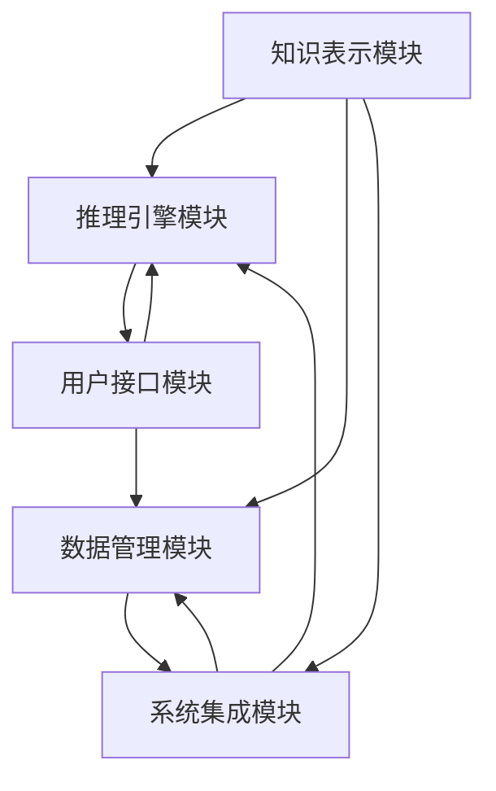

                 

## 第一部分：引言

### 第1章：知识推理的背景和重要性

#### 1.1.1 知识推理的定义和意义

知识推理（Knowledge Reasoning）是人工智能（AI）领域中的一种重要技术，它通过利用已有知识来推断新信息，从而增强AI系统的逻辑思考能力。知识推理不仅仅是简单的信息检索，而是一种基于逻辑和数学模型的高级智能处理方式。它能够帮助AI系统从大量数据中提取有价值的信息，并利用这些信息进行决策和问题解决。

在人工智能发展的历史中，知识推理一直扮演着核心角色。早期的专家系统就是通过知识推理来实现智能行为的。尽管随着深度学习技术的发展，专家系统的重要性有所下降，但知识推理在AI系统中的地位依然不可动摇。在现代AI系统中，知识推理被广泛应用于自然语言处理、智能决策支持系统、智能问答等多个领域。

知识推理的意义主要体现在以下几个方面：

1. **提高AI系统的智能水平**：通过知识推理，AI系统可以拥有更强的逻辑推理和问题解决能力，从而更好地模拟人类智能。
2. **增强AI系统的适应能力**：知识推理可以使AI系统在面对新任务和新环境时，能够通过已有知识进行适应和调整，提高其泛化能力。
3. **实现跨领域的知识共享**：知识推理可以将不同领域的知识进行整合，实现知识的共享和复用，从而提高AI系统的整体性能。

#### 1.1.2 知识推理在人工智能中的应用

知识推理在人工智能中的应用广泛且深入，以下是一些典型的应用场景：

1. **自然语言处理（NLP）**：在NLP中，知识推理可以用于语义理解、情感分析、文本生成等任务。例如，通过知识推理，AI系统可以理解文本中的隐含关系，从而更准确地提取语义信息。

2. **智能决策支持系统（DSS）**：在DSS中，知识推理可以帮助系统分析大量数据，提供决策支持。例如，在医疗诊断中，知识推理可以结合医学知识和患者数据，提供准确的诊断建议。

3. **智能问答系统**：在智能问答系统中，知识推理可以用于问题解析、答案生成等任务。通过知识推理，系统可以理解用户的问题，并从海量知识库中检索出相关答案。

4. **智能制造**：在智能制造中，知识推理可以用于设备故障诊断、生产计划优化等任务。通过知识推理，系统可以实时分析设备状态，预测可能的故障，并提供优化方案。

5. **自动驾驶**：在自动驾驶领域，知识推理可以用于环境感知、路径规划等任务。通过知识推理，自动驾驶系统能够理解复杂的交通状况，做出安全、合理的驾驶决策。

#### 1.1.3 知识推理的挑战和发展趋势

尽管知识推理在AI领域有着广泛的应用，但它也面临着一些挑战和问题：

1. **知识表示和获取**：如何有效地表示和获取知识是知识推理的关键问题。目前，知识表示和获取技术尚不完全成熟，需要进一步研究。

2. **推理效率**：知识推理通常涉及到大量计算，如何提高推理效率是当前的一个热点问题。新的推理算法和优化方法需要不断涌现。

3. **推理的可靠性和鲁棒性**：知识推理的结果往往受到输入知识质量和推理算法的影响，如何提高推理的可靠性和鲁棒性是一个重要问题。

随着AI技术的发展，知识推理也在不断演进，其发展趋势主要包括：

1. **知识图谱的广泛应用**：知识图谱作为一种高效的知识表示方法，正在被广泛应用于知识推理中，未来知识图谱技术将会更加成熟和普及。

2. **跨领域的知识融合**：通过跨领域的知识融合，可以实现更全面、更精确的知识推理，从而提高AI系统的智能水平。

3. **多模态知识推理**：随着多模态数据（如图像、声音、文本等）的广泛应用，多模态知识推理将成为未来的一个重要研究方向。

4. **集成深度学习和知识推理**：深度学习在特征提取和模式识别方面具有优势，与知识推理的结合将有望实现更加智能的AI系统。

#### 1.2 主要研究问题和目标

在本研究中，我们主要关注以下问题和目标：

1. **如何有效表示和获取知识？**  
如何构建一个既能表达知识丰富性，又能适应不同应用场景的知识表示方法，是一个重要问题。

2. **如何提高知识推理的效率？**  
针对大规模知识库和高复杂度的推理任务，如何设计高效的推理算法和优化方法是当前研究的重点。

3. **如何确保知识推理的可靠性和鲁棒性？**  
如何设计鲁棒的推理算法，以应对知识库中的不确定性和噪声，是知识推理研究的另一个重要方向。

4. **如何将知识推理应用于实际场景？**  
如何将知识推理技术应用于自然语言处理、智能决策支持系统、自动驾驶等实际场景，实现知识推理技术在各个领域的落地应用，是我们研究的重要目标。

#### 1.2.1 研究方法和框架

为了实现上述研究目标，我们将采用以下研究方法和框架：

1. **知识表示方法研究**：通过分析和比较现有的知识表示方法，探索适用于不同应用场景的新知识表示方法。

2. **推理算法设计**：设计并实现多种高效的推理算法，并进行性能评估和比较。

3. **实验验证**：通过构建实际应用场景，验证知识推理算法的有效性和可行性。

4. **跨领域应用研究**：将知识推理技术应用于多个实际场景，探索其在不同领域的应用潜力。

#### 1.3 本书结构安排

本书将分为以下几个部分：

1. **引言**：介绍知识推理的背景、重要性、应用和发展趋势，以及本研究的主要问题和目标。
   
2. **基础知识**：介绍逻辑学基础、知识表示方法和知识推理算法。

3. **知识推理系统设计与实现**：讨论知识推理系统的设计原则、实现技术和测试评估方法。

4. **知识推理在自然语言处理中的应用**：探讨知识推理在NLP领域的应用，包括语义理解、问答系统和文本生成等。

5. **知识推理在智能决策支持系统中的应用**：介绍知识推理在DSS中的应用，包括决策模型和实际案例。

6. **总结与展望**：总结全书内容，展望知识推理未来的发展方向。

通过本书的阅读，读者可以全面了解知识推理的基本概念、方法和技术，掌握知识推理在实际应用中的具体实现方法，为从事相关领域的研究和开发提供参考。

#### 1.3.1 各章节内容概述

1. **第1章：知识推理的背景和重要性**
   - 内容概述：介绍知识推理的定义、意义和应用，讨论知识推理在人工智能中的重要性和面临的挑战。

2. **第2章：逻辑学基础**
   - 内容概述：介绍逻辑学的基本概念、逻辑运算符、证明理论、逻辑推理方法，以及模态逻辑和谓词逻辑。

3. **第3章：知识表示**
   - 内容概述：介绍知识表示的基本概念、方法，包括表示形式和知识表示语言，讨论知识表示的应用和面临的挑战。

4. **第4章：知识推理算法**
   - 内容概述：介绍基本推理算法，包括演绎推理和归纳推理，以及基于规则和基于模型的推理算法。

5. **第5章：知识推理系统设计与实现**
   - 内容概述：讨论知识推理系统的设计原则、实现技术和测试评估方法。

6. **第6章：知识推理在自然语言处理中的应用**
   - 内容概述：探讨知识推理在自然语言处理领域的应用，包括语义理解、问答系统和文本生成。

7. **第7章：知识推理在智能决策支持系统中的应用**
   - 内容概述：介绍知识推理在智能决策支持系统中的应用，包括决策模型和实际案例。

#### 1.3.2 预期读者收获

通过阅读本书，读者可以：

1. **掌握知识推理的基本概念和方法**：理解知识推理的定义、意义和应用，掌握逻辑学基础、知识表示和推理算法。

2. **掌握知识推理系统的设计与实现**：了解知识推理系统的设计原则、实现技术和测试评估方法。

3. **了解知识推理在不同领域的应用**：通过实例学习，了解知识推理在自然语言处理和智能决策支持系统中的应用。

4. **培养解决实际问题的能力**：通过学习知识推理的技术和方法，培养读者解决实际问题的能力。

#### 1.4 小结

本章介绍了知识推理的背景和重要性，讨论了知识推理在人工智能中的应用和面临的挑战。通过本章的阅读，读者可以初步了解知识推理的基本概念、方法和技术，为后续章节的学习打下基础。接下来的章节将深入探讨知识推理的基础知识、系统设计与实现，以及其在自然语言处理和智能决策支持系统中的应用。

## 第二部分：基础知识

### 第2章：逻辑学基础

#### 2.1 逻辑学的基本概念

逻辑学是研究推理和论证的科学，是哲学的重要组成部分。在人工智能领域，逻辑学提供了构建智能系统所需的推理工具和理论框架。理解逻辑学的基本概念是深入学习和应用知识推理的前提。

**逻辑学定义**：
逻辑学是一门研究推理、论证和证明的学科。它的目标是通过形式化的方法，揭示推理的有效性和正确性。

**基本概念**：

1. **命题（Proposition）**：命题是可以判断真假的陈述句。例如，“今天是星期一”是一个命题。

2. **命题变元（Propositional Variable）**：命题变元是一个可以取真值（True 或 False）的符号，用来代表任意命题。例如，p、q、r等。

3. **真值（Truth Value）**：真值是命题的取值，可以是真（True）或假（False）。

4. **逻辑连接词（Logical Connectives）**：逻辑连接词是用来连接命题，形成复合命题的符号。常见的逻辑连接词有“与（∧）”、“或（∨）”、“非（¬）”、“蕴含（→）”、“等价（↔）”等。

5. **逻辑运算（Logical Operation）**：逻辑运算是对命题进行逻辑连接，生成复合命题的过程。例如，“p ∧ q”表示p和q的逻辑与运算。

6. **命题公式（Propositional Formula）**：命题公式是由命题变元和逻辑连接词构成的复合命题。命题公式可以是简单的，也可以是复杂的。

7. **推理（Reasoning）**：推理是从已知的前提（Premise）推导出结论（Conclusion）的过程。推理可以分为演绎推理和归纳推理。

#### 2.2 逻辑运算符

逻辑运算符是逻辑学中的基本工具，用于组合和操作命题，形成新的命题。以下是几种常见的逻辑运算符及其运算规则：

1. **逻辑与（AND）**：逻辑与运算符“∧”表示两个命题同时为真时，结果才为真。例如，p ∧ q。

2. **逻辑或（OR）**：逻辑或运算符“∨”表示两个命题中至少有一个为真时，结果为真。例如，p ∨ q。

3. **逻辑非（NOT）**：逻辑非运算符“¬”表示命题的真值取反。例如，¬p。

4. **逻辑蕴含（IMPLICATION）**：逻辑蕴含运算符“→”表示如果p为真，则q也为真。例如，p → q。

5. **逻辑等价（EQUIVALENCE）**：逻辑等价运算符“↔”表示p和q的真值相同。例如，p ↔ q。

**运算规则**：

1. **结合律（Associative Law）**：对于任意逻辑运算符∨和∧，有（p ∨ q）∨ r ≡ p ∨（q ∨ r）和（p ∧ q）∧ r ≡ p ∧（q ∧ r）。

2. **交换律（Commutative Law）**：对于逻辑或和逻辑与，有p ∨ q ≡ q ∨ p和p ∧ q ≡ q ∧ p。

3. **分配律（Distributive Law）**：逻辑与对逻辑或的分配律，有p ∧（q ∨ r）≡（p ∧ q）∨（p ∧ r）和p ∨（q ∧ r）≡（p ∨ q）∧（p ∨ r）。

4. **德摩根律（De Morgan's Law）**：¬（p ∧ q）≡（¬p）∨（¬q）和¬（p ∨ q）≡（¬p）∧（¬q）。

5. **恒等律（Identity Law）**：p ∧ T ≡ p 和 p ∨ F ≡ p，其中T表示真，F表示假。

6. **矛盾律（Contradiction Law）**：p ∧ F ≡ F 和 p ∨ T ≡ T。

7. **吸收律（Absorption Law）**：p ∧（p ∨ q）≡ p 和 p ∨（p ∧ q）≡ p。

#### 2.3 证明理论

证明理论是逻辑学中的重要分支，研究如何通过逻辑运算和推理规则从已知的前提推导出结论。以下是几种常见的证明方法和推理规则：

1. **直接证明（Direct Proof）**：
   - 直接证明是通过一系列逻辑推理，从已知的前提（P）推导出结论（Q）的过程。
   - 例如：假设p为真，根据逻辑运算规则，可以推出q也为真，从而证明p → q。

2. **反证法（Proof by Contradiction）**：
   - 反证法是一种证明方法，通过假设结论不成立，然后推导出一个矛盾，从而证明原结论成立。
   - 例如：假设p ∧ ¬p为真，但根据逻辑非运算规则，p ∧ ¬p为假，因此假设不成立，p为真。

3. **归纳证明（Inductive Proof）**：
   - 归纳证明是通过证明一个命题对于所有自然数成立的方法。
   - 包括基例（Base Case）和归纳步骤（Inductive Step）。
   - 例如：证明对于所有自然数n，n² + n + 1为奇数。

4. **递归定义（Recursively Defined Functions）**：
   - 递归定义是一种定义函数的方法，其中函数的定义涉及到自身。
   - 例如：定义函数f(n) = n * f(n-1)，其中f(0) = 1。

**推理规则**：

1. **推理规则（Reasoning Rules）**：
   - 推理规则是用于推导新命题的逻辑规则。
   - 包括条件推理（Modus Ponens）、逆条件推理（Modus Tollens）、析取三段论（Disjunctive Syllogism）等。

2. **等价变换（Equivalence Transformation）**：
   - 等价变换是一种通过逻辑运算将一个命题转换为另一个逻辑等价命题的方法。
   - 例如：通过德摩根律和分配律，可以将复杂的命题转换为更简单的形式。

3. **推理规则的应用**：
   - 推理规则广泛应用于证明理论、形式逻辑和人工智能领域。
   - 例如：在证明一个命题时，可以使用推理规则进行逻辑推理，从而得到结论。

#### 2.4 逻辑推理方法

逻辑推理方法是指从已知信息推导出新信息的过程。以下介绍几种常见的逻辑推理方法：

1. **演绎推理（Deductive Reasoning）**：
   - 演绎推理是从一般到特殊的推理方法，即从一般规则推导出特定情况的结论。
   - 例如：所有人都会死亡（大前提），苏格拉底是人（小前提），因此苏格拉底会死亡（结论）。

2. **归纳推理（Inductive Reasoning）**：
   - 归纳推理是从特殊到一般的推理方法，即从个别事实推导出一般规律。
   - 例如：观察到的所有天鹅都是白色的，因此推断所有天鹅都是白色的。

3. **类比推理（Analogical Reasoning）**：
   - 类比推理是通过比较相似情况，从一个已知情况推导出另一个相似情况的结论。
   - 例如：由于猫有九条命，因此推断狗也有九条命。

4. **因果推理（Causal Reasoning）**：
   - 因果推理是寻找事件之间的因果关系，即从原因推导出结果。
   - 例如：天气变冷，因此树叶变黄。

5. **模态推理（Modal Reasoning）**：
   - 模态推理涉及必然性、可能性等模态词，通过推理确定命题的模态属性。
   - 例如：如果A必然发生，则B可能发生。

#### 2.5 模态逻辑和谓词逻辑

模态逻辑和谓词逻辑是逻辑学的扩展，用于处理更复杂的命题和推理。

**模态逻辑（Modal Logic）**：

模态逻辑是研究模态词（如“必然”、“可能”、“知道”等）的推理规则和逻辑性质。以下是几种常见的模态逻辑：

1. **必然性（Necessity）**：
   - 必然性表示一个命题在任何情况下都是真的。符号表示为□p，读作“p是必然的”。

2. **可能性（Possibility）**：
   - 可能性表示一个命题在某个情况下可能是真的。符号表示为◊p，读作“p是可能的”。

3. **必然性推理（Necessity Reasoning）**：
   - 必然性推理是通过已知一个命题是必然的，推导出另一个命题也是必然的。

4. **可能性推理（Possibility Reasoning）**：
   - 可能性推理是通过已知一个命题是可能的，推导出另一个命题也是可能的。

**谓词逻辑（Predicate Logic）**：

谓词逻辑是处理具有变量和谓词的命题逻辑。谓词逻辑可以表达更复杂的命题和推理。

1. **谓词（Predicate）**：
   - 谓词是表示性质的词或短语，如“是人”、“会说话”等。

2. **个体常元（Individual Constant）**：
   - 个体常元是表示特定个体的词，如“苏格拉底”、“张三”等。

3. **个体变元（Individual Variable）**：
   - 个体变元是表示任意个体的词，如“x”、“y”等。

4. **全称量词（Universal Quantifier）**：
   - 全称量词表示对所有个体都成立的性质，符号为∀x，读作“对所有x”。

5. **存在量词（Existential Quantifier）**：
   - 存在量词表示存在至少一个个体满足性质，符号为∃x，读作“存在某个x”。

6. **谓词公式（Predicate Formula）**：
   - 谓词公式是由谓词、变量和量词组成的复合命题。

7. **谓词推理（Predicate Reasoning）**：
   - 谓词推理是通过谓词公式进行逻辑推理的方法。

**逻辑学在实际应用中的例子**：

逻辑学在计算机科学和人工智能中有广泛的应用，以下是一些例子：

1. **形式化验证（Formal Verification）**：
   - 形式化验证是通过逻辑推理方法验证程序的正确性。例如，使用谓词逻辑验证一个程序的内存分配是否有效。

2. **自动推理（Automated Reasoning）**：
   - 自动推理是通过计算机程序实现逻辑推理的方法。例如，自动证明器可以自动证明数学定理。

3. **人工智能安全（AI Security）**：
   - 逻辑学可以用于设计安全的人工智能系统，通过形式化模型验证系统的安全属性。

4. **知识表示和推理（Knowledge Representation and Reasoning）**：
   - 逻辑学提供了知识表示和推理的工具和方法，用于构建智能系统。

#### 2.6 小结

本章介绍了逻辑学的基本概念、逻辑运算符、证明理论和推理方法，以及模态逻辑和谓词逻辑。逻辑学是人工智能领域的重要基础，通过理解和应用逻辑学，我们可以构建更智能、更可靠的AI系统。接下来的章节将继续探讨知识表示、推理算法及其在实际应用中的实现。

## 第3章：知识表示

### 3.1 知识表示的基本概念

知识表示（Knowledge Representation）是人工智能领域的一个重要分支，旨在将知识以一种计算机可以理解和处理的方式表示出来。知识表示的核心任务是解决如何有效地组织和存储知识，以及如何高效地访问和利用知识。

#### 3.1.1 知识的定义

在知识表示中，首先需要明确“知识”的概念。知识是一种有组织的信息，它能够帮助个体做出决策或解决问题。知识通常包括事实、规则、原理、模型和策略等。

**知识的分类**：

1. **显式知识（Explicit Knowledge）**：显式知识是可以明确表达和交流的知识，如文档、数据库、程序代码等。

2. **隐式知识（Implicit Knowledge）**：隐式知识是难以用语言表达的知识，如技能、经验、直觉等。

**知识的属性**：

1. **确定性（Determinacy）**：确定性知识是指那些具有明确答案的知识。

2. **不确定性（Uncertainty）**：不确定性知识是指那些答案不确定或具有多种可能性的知识。

3. **完备性（Completeness）**：完备性知识是指那些包含所有必要信息的知识。

4. **一致性（Consistency）**：一致性知识是指那些相互之间没有冲突或矛盾的知识。

#### 3.1.2 知识表示的定义

知识表示是指将知识以某种形式在计算机系统中表示出来，使其可以被计算机处理和利用。知识表示的目标是构建一个形式化的知识模型，该模型能够捕捉知识的结构、内容和关系。

**知识表示的层次**：

1. **概念层次（Conceptual Level）**：概念层次涉及知识的概念和分类，如领域本体、概念框架等。

2. **表示层次（Representation Level）**：表示层次涉及知识在计算机中的表示方法，如逻辑表示、图表示、表格表示等。

3. **实现层次（Implementation Level）**：实现层次涉及知识表示在实际系统中的实现，如知识库、推理引擎等。

#### 3.1.3 知识表示的重要性

知识表示在人工智能领域具有至关重要的意义：

1. **智能系统的基础**：知识表示是构建智能系统的基础，它决定了智能系统能否有效地理解和处理知识。

2. **知识共享和复用**：通过有效的知识表示，可以实现知识的共享和复用，提高知识利用效率。

3. **推理和决策**：知识表示是实现智能推理和决策的前提，只有将知识有效地表示出来，才能利用推理算法进行推理和决策。

4. **领域特定应用**：知识表示方法可以根据不同领域特定需求进行设计，从而提高智能系统的适应性。

#### 3.1.4 知识表示的方法

知识表示的方法可以分为以下几类：

1. **符号表示方法**：符号表示方法使用符号和逻辑运算来表达知识。常见的符号表示方法包括命题逻辑、谓词逻辑、模态逻辑等。

2. **语义网络表示方法**：语义网络表示方法使用节点和边的图形结构来表达知识。节点表示概念或实体，边表示概念或实体之间的关系。

3. **框架表示方法**：框架表示方法使用框架（Frame）来表示知识。框架由槽（Slot）和填充值（Filler）组成，用于描述对象和它们之间的属性关系。

4. **产生式表示方法**：产生式表示方法使用规则（Rule）来表达知识。每个规则由条件（Condition）和行动（Action）组成，用于描述如何从已知信息推导出新信息。

5. **黑板表示方法**：黑板表示方法使用黑板（Blackboard）来集中管理和传递知识。黑板是一个共享数据结构，用于存储多个专家系统模块之间的信息。

6. **面向对象表示方法**：面向对象表示方法使用面向对象编程的概念来表示知识。对象（Object）表示概念或实体，类（Class）表示对象的一般特征，继承（Inheritance）用于表示知识的关系。

#### 3.1.5 知识表示的挑战

尽管知识表示在人工智能领域具有重要意义，但它也面临一些挑战：

1. **知识的获取和表示**：如何有效地获取知识并将其表示为计算机可以理解的形式是一个重要挑战。

2. **知识的表示和推理**：如何设计高效的推理算法来处理复杂的知识表示是一个挑战。

3. **知识的完整性和一致性**：确保知识表示的完整性和一致性，以避免冲突和不一致的问题。

4. **知识的适应性和可扩展性**：如何设计知识表示方法，使其能够适应新的领域和应用，是一个重要挑战。

#### 3.1.6 知识表示在人工智能中的应用

知识表示在人工智能中有广泛的应用，以下是一些典型的应用场景：

1. **自然语言处理（NLP）**：知识表示方法用于表示语言模型、词向量、语义角色标注等，以实现文本理解和生成。

2. **智能决策支持系统（DSS）**：知识表示方法用于表示决策规则、决策模型、风险评估等，以实现智能决策支持。

3. **智能问答系统**：知识表示方法用于表示问题和答案的知识库，以实现智能问答。

4. **智能推荐系统**：知识表示方法用于表示用户偏好和物品属性，以实现个性化推荐。

5. **智能制造**：知识表示方法用于表示设备和过程的知识，以实现智能监控和优化。

#### 3.1.7 小结

知识表示是人工智能领域的重要基础，通过有效的知识表示，可以构建智能系统，实现知识共享、推理和决策。本章介绍了知识表示的基本概念、方法及其应用，为后续章节的知识推理算法和系统设计提供了理论基础。

### 3.2 知识表示的方法

知识表示的方法是人工智能领域中的一项核心任务，旨在将抽象的知识以计算机能够处理和理解的形式表示出来。有效的知识表示不仅能够提高系统的智能水平，还能够增强系统的适应性和推理能力。以下是几种常见的知识表示方法及其特点。

#### 3.2.1 表示形式

知识表示的形式多种多样，每种形式都有其特定的应用场景和优势。以下介绍几种主要的知识表示形式：

1. **符号表示**：
   - **逻辑表示**：使用逻辑运算符和命题变元来表示知识。例如，命题逻辑和谓词逻辑广泛应用于形式化验证和知识推理。
   - **语义网络表示**：使用节点（表示概念或实体）和边（表示关系）来构建语义网络。语义网络能够直观地表示知识结构，适用于语义分析和推理。

2. **框架表示**：
   - **框架**：框架表示方法通过定义一组固定的属性和可能的值来表示对象。例如，每个动物都有一个种类、颜色、重量等属性。
   - **框架网络**：扩展框架表示，允许属性之间的层次关系和继承。

3. **产生式表示**：
   - **产生式规则**：每个规则由条件（条件部分）和行动（行动部分）组成，形式为“如果条件，则行动”。例如，在医疗诊断系统中，如果症状A且症状B，则疾病C。
   - **产生式系统**：多个产生式规则组合在一起，用于推理和决策。

4. **黑板表示**：
   - **黑板**：一个共享的数据结构，用于存储和控制知识。黑板上的数据可以被多个模块访问和修改，适用于多专家系统。
   - **黑板模型**：包括知识源、推理机、综合器等模块，用于实现复杂问题的求解。

5. **面向对象表示**：
   - **对象**：面向对象表示中的基本单位，表示具有特定属性和方法的概念或实体。
   - **类**：类的实例是对象，类定义了一组具有相同属性和方法的对象。
   - **继承**：允许子类继承父类的属性和方法，实现知识复用和层次化。

6. **语义网表示**：
   - **资源描述框架（RDF）**：使用三元组（主体、谓语、客体）来表示知识，广泛应用于语义网和本体构建。
   - **Web本体语言（OWL）**：RDF的扩展，提供更丰富的本体建模能力，适用于复杂知识的表示。

7. **图表示**：
   - **知识图谱**：大规模知识库的图形表示，节点表示实体，边表示实体之间的关系。
   - **属性图**：在知识图谱的基础上，增加节点的属性信息，用于更精细的知识表示。

8. **文本表示**：
   - **词袋模型**：将文本转换为词汇的集合，适用于文本分类和文本相似度计算。
   - **词嵌入**：将词汇映射到低维空间中的向量，适用于语义分析和文本生成。

#### 3.2.2 知识表示语言

知识表示语言是用于定义和表示知识的工具，它提供了形式化的语法和语义。以下介绍几种常用的知识表示语言：

1. **逻辑语言**：
   - **一阶逻辑（First-Order Logic, FOL）**：包括个体常元、个体变元、谓词和量词等，用于表示复杂命题和推理。
   - **模态逻辑（Modal Logic）**：扩展一阶逻辑，包括模态词（如“必然”、“可能”），用于表示模态知识。

2. **语义网络语言**：
   - **框架表示语言（Frame Representation Language, FRL）**：用于定义框架和槽值，如KIF（知识 interchange format）和F-logic。
   - **本体语言**：如OWL（Web本体语言），提供了一组丰富的描述逻辑，用于构建领域本体。

3. **产生式表示语言**：
   - **产生式语言（Production Language）**：用于定义产生式规则，如CLIPS（基于产生式的推理系统）和DRAKON。
   - **决策规则语言**：如DMN（决策模型和决策规则标准），用于定义决策规则和决策模型。

4. **黑板表示语言**：
   - **黑板表示语言（Blackboard Representation Language）**：用于定义黑板模型的结构和操作，如BP++。

5. **面向对象语言**：
   - **面向对象表示语言（Object-Oriented Representation Language）**：如UML（统一建模语言），用于定义类、对象和关系。

6. **图表示语言**：
   - **知识图谱表示语言（Knowledge Graph Representation Language）**：如RDF（资源描述框架）和OWL（Web本体语言）。
   - **图形化表示语言**：如Mermaid，用于绘制类图、序列图等。

#### 3.2.3 知识表示的应用

知识表示方法在人工智能领域有着广泛的应用，以下列举一些典型应用场景：

1. **自然语言处理（NLP）**：
   - **语义表示**：使用语义网络和词嵌入来表示文本语义，实现文本分类、情感分析和问答系统。
   - **知识图谱**：构建知识图谱，用于信息检索和语义理解，如DBpedia、YAGO等。

2. **智能决策支持系统（DSS）**：
   - **规则库**：使用产生式规则和决策树来表示决策模型，实现智能决策。
   - **知识库**：构建领域知识库，用于支持复杂问题的求解和决策。

3. **智能问答系统**：
   - **知识表示**：使用语义网络和本体语言来表示问题和答案的知识库。
   - **推理引擎**：基于知识表示，实现问题解析和答案生成。

4. **智能推荐系统**：
   - **用户表示**：使用用户行为数据和属性来表示用户偏好。
   - **物品表示**：使用物品属性和知识图谱来表示物品关系和特征。

5. **智能制造**：
   - **设备监控**：使用知识表示来监控设备和过程的状态。
   - **故障诊断**：基于知识库和推理算法，实现设备故障诊断和预防。

#### 3.2.4 知识表示面临的挑战

尽管知识表示在人工智能领域具有重要意义，但它也面临一些挑战：

1. **知识的获取和表示**：如何有效地获取和表示复杂领域的知识是一个挑战。
2. **知识的组织和管理**：如何设计有效的知识组织结构，以支持高效的知识查询和推理。
3. **知识的一致性和完整性**：如何确保知识表示的一致性和完整性，以避免冲突和不一致。
4. **知识的适应性和可扩展性**：如何设计灵活的知识表示方法，以适应新的应用场景和领域。

#### 3.2.5 小结

知识表示是人工智能领域的重要基础，通过有效的知识表示，可以实现知识的共享、推理和决策。本章介绍了知识表示的基本概念、方法、表示形式和语言，以及其在不同应用领域中的应用。理解知识表示的方法对于构建高效智能系统至关重要。

### 3.3 知识表示的应用

知识表示在人工智能领域有着广泛的应用，通过有效的知识表示，可以增强系统的智能水平，实现复杂的推理和决策。以下是知识表示在几个典型领域中的应用：

#### 3.3.1 自然语言处理（NLP）

自然语言处理是人工智能的一个重要分支，知识表示在其中发挥着关键作用。以下是一些具体的例子：

1. **语义表示**：
   - **语义网络**：通过构建语义网络，将文本中的词、短语和句子映射到具有明确关系的语义实体中。语义网络可以用于语义分析和信息检索。
   - **知识图谱**：知识图谱是将大量语义信息以图形结构进行组织，用于语义理解和知识推理。例如，DBpedia和YAGO是两个著名的知识图谱。

2. **词嵌入**：
   - **Word2Vec**：通过神经网络模型，将词映射到高维向量空间中，使得语义相近的词在向量空间中彼此接近。
   - **BERT**：BERT（Bidirectional Encoder Representations from Transformers）是一种基于变换器的预训练模型，可以更好地捕捉词与词之间的依赖关系。

3. **文本分类和情感分析**：
   - **知识表示**：通过将文本表示为向量或图谱，可以应用于文本分类和情感分析。例如，使用词嵌入和图神经网络进行文本情感分类。

4. **问答系统**：
   - **知识表示**：在问答系统中，知识表示用于理解用户问题和检索相关答案。例如，通过构建知识图谱，可以实现对问题的语义理解和答案生成。

#### 3.3.2 智能决策支持系统（DSS）

智能决策支持系统通过收集和分析数据，提供决策支持和建议。知识表示在其中发挥着重要作用，以下是一些具体应用：

1. **决策规则表示**：
   - **产生式规则**：在DSS中，决策规则通常使用产生式规则来表示。例如，在医疗诊断系统中，可以使用产生式规则来表示诊断流程和决策逻辑。
   - **决策树**：决策树是将决策过程分解为一系列条件分支的图形结构。决策树可以用于分类、回归和决策分析。

2. **知识图谱**：
   - **领域本体**：知识图谱可以用于构建领域本体，表示领域中的概念、关系和规则。例如，在金融领域，可以使用知识图谱表示金融产品、市场和交易规则。
   - **因果模型**：知识图谱可以用于表示因果模型，帮助决策者理解变量之间的因果关系，进行风险评估和预测。

3. **多代理系统**：
   - **知识共享**：在多代理系统中，知识表示用于代理之间的知识共享和协调。通过知识表示，代理可以共享领域知识和决策经验，提高整个系统的决策能力。

#### 3.3.3 智能问答系统

智能问答系统通过理解用户问题，检索相关答案，提供智能服务。知识表示在问答系统中起到关键作用，以下是一些具体应用：

1. **语义理解**：
   - **语义网络**：语义网络用于理解用户问题的语义，通过映射到知识图谱中的实体和关系，实现语义匹配和语义扩展。
   - **本体语言**：本体语言，如OWL，用于构建领域本体，提供语义描述和推理支持。

2. **问答生成**：
   - **模板匹配**：通过模板匹配，将用户问题映射到预定义的答案模板中，生成回答。
   - **知识图谱**：知识图谱用于存储和检索知识，支持基于图谱的问答生成。

3. **对话系统**：
   - **多轮对话**：知识表示用于处理多轮对话，通过记忆和推理，实现对用户意图的理解和回答生成。
   - **上下文理解**：知识表示帮助系统理解用户问题的上下文信息，提供更准确和相关的回答。

#### 3.3.4 智能推荐系统

智能推荐系统通过用户行为数据和物品特征，为用户推荐感兴趣的内容。知识表示在推荐系统中用于理解和表示用户偏好和物品特征，以下是一些具体应用：

1. **用户表示**：
   - **行为表示**：通过分析用户的历史行为数据，如点击、购买等，将用户表示为向量或图谱。
   - **偏好表示**：通过知识表示，将用户的偏好和兴趣转化为结构化的知识，用于推荐算法。

2. **物品表示**：
   - **特征提取**：通过知识表示，提取物品的属性和特征，如分类、标签、用户评分等。
   - **关系表示**：通过知识图谱，表示物品之间的关系，如相似性、关联性等，用于推荐算法。

3. **推荐算法**：
   - **协同过滤**：基于用户行为数据，使用知识表示来优化协同过滤算法，提高推荐准确性。
   - **基于内容的推荐**：通过知识表示，将用户和物品的特征进行匹配，实现基于内容的推荐。

#### 3.3.5 智能制造

智能制造通过集成物联网、大数据、人工智能等技术，实现生产过程的智能化。知识表示在智能制造中用于设备和过程监控、故障诊断和优化，以下是一些具体应用：

1. **设备监控**：
   - **状态表示**：通过知识表示，将设备的状态信息进行建模和表示，用于实时监控和异常检测。
   - **故障预测**：基于设备运行数据和历史知识，使用知识表示进行故障预测和预防。

2. **过程优化**：
   - **流程表示**：通过知识表示，将生产过程转化为图形结构，用于过程优化和自动化控制。
   - **模型预测**：基于知识表示，构建生产过程的预测模型，用于生产计划和调度。

3. **智能维护**：
   - **知识库**：构建设备维护知识库，包含设备运行数据、维护策略和规则，用于智能维护和故障处理。

#### 3.3.6 小结

知识表示在人工智能领域有着广泛的应用，通过有效的知识表示，可以实现自然语言处理、智能决策支持、问答系统、推荐系统和智能制造等领域的智能应用。理解知识表示的方法和实现，对于构建高效智能系统具有重要意义。本章介绍了知识表示在不同领域的应用，为后续章节的知识推理算法和系统设计提供了实践背景。

### 3.4 知识表示面临的挑战

尽管知识表示在人工智能领域具有广泛的应用和重要的意义，但在实际应用中仍然面临一系列挑战。以下从知识获取、知识表示方法、推理机制和系统整合等方面分析这些挑战。

#### 3.4.1 知识获取

知识获取是知识表示的首要挑战，因为知识表示的质量直接取决于知识的质量和准确性。以下是一些主要挑战：

1. **知识的不完整性**：现实世界中的知识往往是不完整的，许多领域中的专家知识难以完全获取。例如，在医疗领域，患者的诊断信息可能存在遗漏或不准确的情况。

2. **知识的非结构化**：大量的知识以非结构化的形式存在，如文本、图像、音频和视频等，这些数据难以直接转换为计算机可处理的格式。

3. **知识的不确定性**：知识往往存在不确定性和模糊性，特别是在复杂和动态的领域，如天气预报和金融分析。如何表示和处理这些不确定性的知识是一个挑战。

4. **知识的一致性**：不同来源的知识可能存在冲突或不一致，如何确保知识表示的一致性是一个重要的挑战。

#### 3.4.2 知识表示方法

知识表示方法的选择和设计直接影响知识表示的效率和效果。以下是一些主要挑战：

1. **表示选择的复杂性**：不同的知识表示方法适用于不同的应用场景，选择合适的表示方法需要深入理解应用需求。

2. **表示的冗余**：如何设计紧凑且有效的知识表示方法，减少冗余信息，是一个挑战。冗余信息过多会导致推理效率低下。

3. **表示的动态性**：知识是不断变化的，如何设计动态知识表示方法，以适应知识的变化，是一个重要问题。

4. **表示的适应性**：如何设计灵活的知识表示方法，以适应不同领域和应用的需求，是一个挑战。

#### 3.4.3 推理机制

推理机制是实现知识表示价值的关键，以下是一些主要挑战：

1. **推理效率**：知识推理通常涉及大量计算，如何提高推理效率是一个重要的挑战。在大规模知识库中，推理效率尤为重要。

2. **推理的精度**：如何确保推理结果的准确性是一个挑战。特别是在存在不确定性和模糊性时，如何设计精确的推理机制是一个重要问题。

3. **推理的扩展性**：如何设计扩展性强的推理机制，以支持复杂的推理任务和领域变化，是一个重要问题。

4. **推理的可解释性**：如何设计可解释的推理机制，使得推理过程和结果可以被人理解和信任，是一个挑战。

#### 3.4.4 系统整合

知识表示的应用通常需要集成到复杂的系统中，以下是一些主要挑战：

1. **系统兼容性**：如何设计兼容性强的知识表示方法，以支持不同系统和平台的整合，是一个重要问题。

2. **系统扩展性**：如何设计扩展性强的知识表示系统，以支持新的应用场景和领域需求，是一个挑战。

3. **系统可靠性**：如何确保知识表示系统的可靠性和鲁棒性，以应对外部噪声和异常情况，是一个重要问题。

4. **系统维护**：如何设计易维护的知识表示系统，以降低系统维护成本和复杂性，是一个挑战。

#### 3.4.5 小结

知识表示在人工智能领域面临一系列挑战，包括知识获取、知识表示方法、推理机制和系统整合等方面。解决这些挑战需要结合多种技术手段和方法，不断探索和创新。通过深入研究这些挑战和解决方案，可以推动知识表示技术的发展和应用，为构建更高效、更智能的人工智能系统奠定基础。

### 3.5 小结

本章首先介绍了知识表示的基本概念，包括知识、知识表示的定义和重要性，以及知识表示的层次。接着，详细讨论了知识表示的方法，包括符号表示、框架表示、产生式表示、黑板表示、面向对象表示、语义网表示和图表示等。每种方法都有其特定的应用场景和优势。随后，本章介绍了知识表示的语言，如逻辑语言、语义网络语言、产生式表示语言、黑板表示语言和面向对象语言等，这些语言为知识表示提供了形式化的语法和语义。最后，本章探讨了知识表示在自然语言处理、智能决策支持系统、智能问答系统、智能推荐系统和智能制造等领域的应用，展示了知识表示的重要性和实用性。通过本章的学习，读者可以全面了解知识表示的基本概念和方法，为后续章节的知识推理算法和系统设计提供理论基础。

## 第4章：知识推理算法

### 4.1 基本推理算法

知识推理算法是人工智能领域中用于从已知知识中推导出新信息的一组方法。基本推理算法包括演绎推理和归纳推理，它们是知识推理的基础。在本节中，我们将详细讨论这两种推理算法的基本原理和应用。

#### 4.1.1 演绎推理

演绎推理是一种从一般到特殊的推理方法，它基于一组已知的前提（或规则），推导出特定的结论。演绎推理的典型形式是三段论，包括大前提、小前提和结论。以下是一个简单的三段论示例：

1. **大前提**：所有人都会死亡。
2. **小前提**：苏格拉底是人。
3. **结论**：苏格拉底会死亡。

在这个例子中，大前提提供了一个普遍的规则，小前提是一个具体的实例，而结论是从这两个前提中得出的具体结论。

**演绎推理的基本步骤**：

1. **前提提取**：从知识库中提取相关的前提。
2. **规则匹配**：将前提与知识库中的规则进行匹配。
3. **推理**：根据匹配的规则，从前提推导出结论。

**演绎推理的优点**：

- **确定性**：演绎推理的结果具有确定性，如果前提正确，结论必然正确。
- **形式化**：演绎推理具有严格的形式化定义，便于计算机处理。

**演绎推理的局限性**：

- **依赖完备知识**：演绎推理依赖于完备的知识库，如果知识库不完整，推理结果可能不正确。
- **难以处理不确定性**：演绎推理难以处理不确定性和模糊性。

#### 4.1.2 归纳推理

归纳推理是一种从特殊到一般的推理方法，它通过观察特定的实例，推断出一般性的规律或结论。归纳推理是科学发现和知识发现的重要方法。以下是一个简单的归纳推理示例：

观察以下数列：1, 2, 3, 4, 5, ...
我们可以归纳出这个数列的规律是每个数都比前一个数大1。

**归纳推理的基本步骤**：

1. **实例提取**：从数据集中提取相关的实例。
2. **规律发现**：通过分析实例，发现潜在的规律或模式。
3. **推理**：根据发现的规律，推断出一般性的结论。

**归纳推理的优点**：

- **适应性**：归纳推理能够从特定实例中推断出一般性规律，具有较强的适应性。
- **发现新知识**：归纳推理是知识发现的重要手段，可以帮助我们理解未知领域。

**归纳推理的局限性**：

- **错误归纳**：归纳推理可能因为样本的不代表性或噪声，导致错误的一般性结论。
- **不确定性**：归纳推理的结果通常具有一定的概率性，难以保证绝对的准确性。

#### 4.1.3 演绎推理和归纳推理的比较

- **推理方向**：演绎推理是从一般到特殊，归纳推理是从特殊到一般。
- **结论确定性**：演绎推理的结果具有确定性，归纳推理的结果具有概率性。
- **应用场景**：演绎推理适用于已知规则和前提的场景，归纳推理适用于发现新规律和知识。

#### 4.1.4 演绎推理和归纳推理在实际应用中的例子

1. **演绎推理**：
   - **医疗诊断**：医生根据症状和病史，通过演绎推理得出可能的疾病诊断。
   - **法律推理**：律师根据法律规则和案件事实，通过演绎推理提出法律论证。

2. **归纳推理**：
   - **天气预报**：根据历史天气数据和气象模型，归纳推理预测未来的天气状况。
   - **市场分析**：通过分析市场数据，归纳推理出市场趋势和消费者行为。

通过理解演绎推理和归纳推理的基本原理和应用，我们可以更好地利用这些推理方法，解决实际问题和构建智能系统。接下来，我们将进一步探讨基于规则的推理和基于模型的推理算法。

### 4.2 基于规则的推理

基于规则的推理（Rule-Based Reasoning）是一种经典的推理方法，它通过定义一组规则来表示知识，并利用这些规则进行推理。基于规则的推理广泛应用于专家系统、决策支持系统和自然语言处理等领域。本节将详细讨论基于规则的推理的基本原理、常见算法和实际应用。

#### 4.2.1 基本原理

基于规则的推理的核心思想是利用一组规则来表示知识，并通过匹配规则和条件来推导出结论。每个规则由条件（前提）和行动（结论）组成，形式为“如果条件，则行动”。规则库是所有规则的集合，用于存储和检索规则。

**规则表示**：

一个典型的规则表示形式如下：

```
如果条件1并且条件2，则行动1。
如果条件A并且条件B，则行动B。
...
```

**规则匹配**：

规则匹配是查找规则库中与当前情况相匹配的规则的过程。规则匹配可以基于前向匹配或后向匹配：

- **前向匹配**：从规则库的顶部开始，依次检查每个规则的条件部分，直到找到一个与当前情况完全匹配的规则。
- **后向匹配**：从规则库的底部开始，依次检查每个规则的条件部分，直到找到一个与当前情况部分匹配的规则。

**推理过程**：

基于规则的推理过程可以分为以下几个步骤：

1. **初始状态设定**：确定当前问题的初始状态。
2. **规则匹配**：根据当前状态，在规则库中查找匹配的规则。
3. **行动执行**：根据匹配的规则，执行相应的行动。
4. **状态更新**：更新当前状态，以便进行下一轮规则匹配。
5. **重复步骤2-4，直到找到解决方案或达到某个终止条件。

#### 4.2.2 常见算法

基于规则的推理算法可以分为两种类型：确定性推理和不确定性推理。

1. **确定性推理算法**：
   - **正向推理**：从初始状态开始，逐步应用匹配的规则，直到推导出目标状态。
   - **反向推理**：从目标状态开始，逐步回溯到初始状态，查找可能导致目标状态的规则。

2. **不确定性推理算法**：
   - **基于概率的推理**：利用概率论来处理规则中的不确定性，计算每个规则的信任度或可信度。
   - **基于模糊逻辑的推理**：使用模糊逻辑来处理不确定性和模糊性，定义模糊规则和模糊推理。

**正向推理**示例：

假设我们有一个医疗诊断系统，其中包含以下规则：

```
如果患者有咳嗽并且发烧，则可能患有流感。
如果患者有咳嗽并且喉咙痛，则可能患有支气管炎。
```

- **初始状态**：患者有咳嗽和喉咙痛。
- **规则匹配**：第一条规则不匹配，第二条规则匹配。
- **行动执行**：可能患有支气管炎。
- **状态更新**：当前状态更新为“患有支气管炎”。

**反向推理**示例：

假设我们有一个物流优化系统，其中包含以下规则：

```
如果运输成本高于预算，则重新规划路线。
如果运输时间超过预定时间，则重新规划路线。
```

- **初始状态**：运输成本超过预算。
- **规则匹配**：第一条规则匹配。
- **行动执行**：重新规划路线。
- **状态更新**：当前状态更新为“路线已重新规划”。

#### 4.2.3 应用实例

基于规则的推理在多个领域有着广泛的应用，以下是一些具体的应用实例：

1. **医疗诊断**：
   - **症状分析**：医生通过基于规则的推理，根据患者的症状和体征，诊断出可能的疾病。
   - **治疗方案推荐**：根据患者的病情和药物反应，推荐相应的治疗方案。

2. **智能客服**：
   - **问题分类**：智能客服系统通过基于规则的推理，将用户的问题分类到相应的类别。
   - **答案生成**：根据用户的问题和数据库中的规则，生成相应的答案。

3. **金融风险管理**：
   - **风险识别**：通过基于规则的推理，识别出潜在的风险事件。
   - **风险控制**：根据风险事件的类型和严重程度，制定相应的风险控制措施。

4. **智能交通系统**：
   - **交通流量预测**：基于历史数据和规则，预测未来的交通流量。
   - **路线规划**：根据交通流量和规则，为司机提供最优的路线规划。

5. **智能家居**：
   - **行为识别**：通过基于规则的推理，识别用户的行为模式。
   - **自动化控制**：根据用户的行为和规则，自动控制家庭设备，如灯光、温度和安防系统。

通过以上实例，我们可以看到基于规则的推理在多个领域的广泛应用和重要性。接下来，我们将探讨基于模型的推理算法，进一步丰富知识推理的方法和技术。

### 4.3 基于模型的推理

基于模型的推理（Model-Based Reasoning）是一种利用数学模型和计算方法进行推理的方法。与基于规则的推理不同，基于模型的推理依赖于预先构建的模型，通过模型来模拟和分析现实世界。这种方法在处理复杂系统和大规模数据时具有显著优势。以下将详细讨论基于模型的推理的基本原理、常见算法和应用实例。

#### 4.3.1 基本原理

基于模型的推理的核心思想是通过构建和利用数学模型来模拟现实世界，从而进行推理和决策。模型是现实世界的一种抽象表示，它通过变量、方程和约束条件来描述系统的状态和行为。

**模型构建**：

1. **变量定义**：定义模型中的变量，包括输入变量、状态变量和输出变量。
2. **关系和方程**：通过数学关系和方程，描述变量之间的相互作用和系统行为。
3. **约束条件**：定义模型的约束条件，以限制变量和方程的取值范围。

**模型分析**：

1. **状态预测**：通过模型分析，预测系统在未来的状态。
2. **行为模拟**：模拟系统在不同输入条件下的行为，以评估系统的性能和稳定性。
3. **优化**：利用模型进行优化，找到系统的最优解或近似解。

**推理过程**：

基于模型的推理过程可以分为以下几个步骤：

1. **模型构建**：根据问题背景和需求，构建相应的数学模型。
2. **数据输入**：输入模型的初始数据和参数。
3. **模型求解**：利用数学方法和计算工具，求解模型并得到系统的状态和行为。
4. **推理和决策**：根据模型求解结果，进行推理和决策。

#### 4.3.2 常见算法

基于模型的推理算法种类繁多，以下介绍几种常见的算法：

1. **线性回归模型**：
   - **原理**：线性回归模型通过拟合一条直线，描述输入变量和输出变量之间的关系。
   - **应用**：线性回归模型广泛应用于预测和分析，如股票价格预测、房屋价格评估等。

2. **决策树模型**：
   - **原理**：决策树模型通过一系列的规则和分支，将输入空间划分为不同的区域。
   - **应用**：决策树模型在分类和回归任务中有着广泛的应用，如疾病诊断、信用评分等。

3. **神经网络模型**：
   - **原理**：神经网络模型通过多层神经元和权重，模拟人脑的神经网络结构。
   - **应用**：神经网络模型在图像识别、语音识别和自然语言处理等领域有着广泛的应用。

4. **马尔可夫决策过程（MDP）**：
   - **原理**：马尔可夫决策过程是一种基于概率和决策的模型，用于描述在不确定环境中进行决策的问题。
   - **应用**：马尔可夫决策过程在资源分配、机器人控制和自动驾驶等领域有着广泛的应用。

5. **贝叶斯网络**：
   - **原理**：贝叶斯网络是一种概率图模型，通过节点和边表示变量之间的依赖关系。
   - **应用**：贝叶斯网络在医疗诊断、金融分析和风险评估等领域有着广泛的应用。

#### 4.3.3 应用实例

基于模型的推理在多个领域有着广泛的应用，以下是一些具体的应用实例：

1. **智能交通系统**：
   - **交通流量预测**：基于模型分析历史交通数据，预测未来的交通流量，为交通管理和控制提供依据。
   - **路线规划**：利用基于模型的推理算法，为司机提供最优的路线规划，减少交通拥堵和碳排放。

2. **医疗诊断**：
   - **疾病预测**：通过构建贝叶斯网络模型，结合患者的病史和基因信息，预测患者可能的疾病。
   - **治疗方案推荐**：根据患者的病情和模型分析结果，推荐最合适的治疗方案。

3. **金融分析**：
   - **风险评估**：利用基于模型的推理算法，评估金融资产的风险，为投资决策提供支持。
   - **市场预测**：通过构建时间序列模型，预测市场的走势，为交易策略提供参考。

4. **智能制造**：
   - **设备故障预测**：利用基于模型的推理算法，分析设备运行数据，预测可能的故障，进行预防性维护。
   - **生产优化**：通过构建生产过程模型，优化生产计划和生产流程，提高生产效率和产品质量。

5. **自然语言处理**：
   - **文本分类**：利用基于模型的推理算法，对文本进行分类，实现文本的自动分类和标记。
   - **机器翻译**：通过构建基于神经网络的模型，实现高质量的自然语言翻译。

通过以上实例，我们可以看到基于模型的推理在各个领域的广泛应用和潜力。基于模型的推理方法不仅能够处理复杂的现实问题，还能够提供精确和可靠的推理结果，为智能系统和决策支持提供重要支持。接下来，我们将讨论如何设计和实现一个知识推理系统。

### 4.4 知识推理系统的设计与实现

知识推理系统是一种用于处理和利用知识的计算机系统，它通过知识表示、推理算法和系统架构来增强人工智能系统的逻辑思考能力。在本节中，我们将详细讨论知识推理系统的设计原则、实现技术和测试评估方法。

#### 4.4.1 设计原则

知识推理系统的设计需要遵循以下原则：

1. **模块化**：系统应设计为模块化结构，每个模块负责特定的功能，以便于系统的维护和扩展。
2. **可扩展性**：系统应具备良好的可扩展性，能够适应不同应用场景和领域需求的变化。
3. **高效性**：系统应设计高效的推理算法和优化方法，以处理大规模数据和复杂的推理任务。
4. **鲁棒性**：系统应具备良好的鲁棒性，能够处理输入数据的噪声和不确定性。
5. **可解释性**：系统应提供可解释的推理过程和结果，以便用户理解和信任。

#### 4.4.2 系统架构设计

知识推理系统的架构设计是关键，它决定了系统的性能和扩展性。以下是一个典型的知识推理系统架构：

1. **知识表示模块**：负责知识表示和知识库的构建。该模块可以使用语义网络、知识图谱或框架表示方法来表示知识。
2. **推理引擎模块**：负责推理算法的实现和推理过程的控制。该模块可以根据不同的推理需求，选择基于规则、基于模型或混合推理算法。
3. **数据管理模块**：负责数据的管理和存储。该模块可以使用数据库或图数据库来存储和管理知识库和推理过程中的数据。
4. **用户接口模块**：负责用户与系统的交互。该模块可以提供图形用户界面或API接口，以便用户提交问题、获取推理结果。
5. **系统集成模块**：负责将知识推理系统与其他系统进行集成，实现跨系统的数据共享和协同工作。

**系统架构图**（使用Mermaid绘制）：



#### 4.4.3 系统实现技术

知识推理系统的实现涉及多种技术和方法，以下是一些关键技术：

1. **编程语言**：可以选择Python、Java或C++等编程语言来实现知识推理系统。Python因其丰富的库和工具，在AI领域应用广泛。
2. **知识库构建**：可以使用RDF（资源描述框架）或OWL（Web本体语言）等知识表示语言来构建知识库。RDF和OWL提供了一种形式化的方法来表示知识和推理规则。
3. **推理引擎**：可以选择现有的推理引擎，如Pellet、RDFS++或Jena等。这些引擎提供了高效的推理算法和优化方法。
4. **数据库和图数据库**：可以使用Neo4j、ArangoDB或Apache Jena等图数据库来存储和管理知识库和推理过程中的数据。图数据库提供了强大的数据查询和图分析功能。
5. **自然语言处理**：可以集成自然语言处理（NLP）技术，如词嵌入、句法分析和语义理解，以增强系统的语义理解和问答能力。
6. **机器学习**：可以集成机器学习算法，如决策树、神经网络和贝叶斯网络，以实现更复杂和自适应的推理能力。

#### 4.4.4 系统测试与评估

知识推理系统的测试与评估是确保系统性能和可靠性的重要步骤。以下是一些常见的测试和评估方法：

1. **单元测试**：对系统中的每个模块进行单独测试，验证模块的功能和性能。
2. **集成测试**：对系统的各个模块进行集成测试，验证模块之间的交互和系统的整体性能。
3. **性能测试**：通过模拟实际场景和数据，测试系统的响应时间、吞吐量和资源消耗。
4. **可靠性测试**：通过模拟故障和异常情况，测试系统的鲁棒性和恢复能力。
5. **用户测试**：邀请用户参与系统的测试，收集用户反馈，评估系统的用户体验和可接受度。
6. **基准测试**：使用标准测试集和基准测试工具，评估系统的性能和效能。

**测试方法**：

- **黑盒测试**：不关心系统内部的实现细节，仅测试系统的功能和输出。
- **白盒测试**：关注系统内部的实现细节，通过代码审查和路径测试来验证系统内部逻辑。

**评估指标**：

- **准确率（Accuracy）**：正确推理的次数与总推理次数的比率。
- **召回率（Recall）**：正确推理的次数与实际正确的次数的比率。
- **F1分数（F1 Score）**：结合准确率和召回率的综合指标。
- **响应时间（Response Time）**：系统处理请求并返回结果的时间。

#### 4.4.5 小结

知识推理系统的设计与实现是一个复杂的过程，需要考虑知识表示、推理算法、系统架构和测试评估等多个方面。通过遵循设计原则、选择合适的实现技术和进行严格的测试评估，我们可以构建一个高效、可靠和可扩展的知识推理系统，为人工智能应用提供强大的逻辑推理支持。接下来，我们将讨论知识推理在自然语言处理中的应用。

### 4.5 知识推理在自然语言处理中的应用

自然语言处理（NLP）是人工智能的一个重要分支，旨在使计算机能够理解和处理自然语言。知识推理在NLP中发挥着关键作用，通过推理算法，NLP系统能够更好地理解语义、生成文本和回答问题。在本节中，我们将探讨知识推理在NLP中的具体应用，包括语义理解、问答系统和文本生成。

#### 4.5.1 语义理解

语义理解是NLP的核心任务之一，旨在将自然语言文本转化为计算机可以理解和处理的语义表示。知识推理在语义理解中用于以下方面：

1. **实体识别**：
   - **命名实体识别（NER）**：命名实体识别是识别文本中的特定实体，如人名、地点、组织名等。知识推理可以用于增强NER系统的准确性，通过利用预先构建的实体库和规则库，识别文本中的实体。
   - **实体关系识别**：在识别实体后，知识推理可以进一步识别实体之间的关系，如“张三是李华的朋友”。

2. **语义角色标注**：
   - **语义角色标注（SRL）**：语义角色标注是识别文本中的动作和动作的参与者，如“买”这个动作的参与者是“我”。知识推理可以帮助SRL系统理解复杂句子中的语义角色，通过利用语义规则库和上下文信息。

3. **语义解析**：
   - **语义解析（Semantic Parsing）**：语义解析是将自然语言文本转化为结构化数据或数据库查询的过程。知识推理可以用于将自然语言句子转化为数据库查询，例如，将“找到昨天卖的最贵的苹果”转化为SQL查询。

**算法示例**：

- **实体识别**：利用规则库和统计方法，如条件随机场（CRF）进行实体识别。规则库可以包含基于词典和语法规则的信息。
- **语义角色标注**：利用依存句法分析，结合知识推理算法，如图神经网络（Graph Neural Networks，GNN），进行语义角色标注。

**应用场景**：

- **搜索引擎**：利用语义理解技术，提高搜索引擎的精确度和相关性，例如，根据用户查询的语义，返回最相关的网页。
- **智能客服**：利用语义理解技术，智能客服系统能够更好地理解用户的问题，并提供准确的回答。

#### 4.5.2 基于知识推理的问答系统

问答系统是NLP的一个重要应用领域，旨在使计算机能够回答用户的问题。知识推理在问答系统中用于以下方面：

1. **问题解析**：
   - **问题分类**：将用户的问题分类到不同的主题或类型，如问答、命令、请求等。知识推理可以用于问题分类，通过利用领域本体和分类规则，准确分类用户的问题。
   - **语义分析**：将用户的问题转化为结构化数据或查询，例如，将自然语言问题转化为SQL查询。知识推理可以用于语义分析，通过利用语义规则库和图谱，提取问题中的关键信息和语义关系。

2. **知识检索**：
   - **知识库构建**：构建包含领域知识和信息的知识库，如百科全书、数据库等。知识推理可以用于知识库构建，通过利用语义网络和本体语言，构建结构化的知识库。
   - **知识检索**：在知识库中检索与用户问题相关的信息。知识推理可以用于知识检索，通过利用图谱和推理算法，找到最相关的答案。

3. **答案生成**：
   - **答案模板匹配**：将检索到的信息按照预定义的模板进行生成。例如，根据问题的类型，生成特定的答案模板。
   - **文本生成**：利用自然语言生成技术，如生成对抗网络（GAN）和变换器（Transformer），生成自然流畅的答案。知识推理可以用于文本生成，通过利用预训练的语言模型和语义信息，生成高质量的答案。

**算法示例**：

- **问题分类**：利用朴素贝叶斯、支持向量机（SVM）和深度学习模型（如卷积神经网络（CNN）和递归神经网络（RNN））进行问题分类。
- **语义分析**：利用转换器（Transformer）模型，如BERT和GPT，进行语义分析，将自然语言问题转化为结构化查询。

**应用场景**：

- **智能客服**：利用问答系统，智能客服能够自动回答用户的问题，提供高效的客户服务。
- **智能搜索**：利用问答系统，智能搜索系统能够理解用户的查询意图，提供精准的搜索结果。

#### 4.5.3 基于知识推理的文本生成

文本生成是NLP的另一个重要应用领域，旨在根据输入的信息生成自然语言的文本。知识推理在文本生成中用于以下方面：

1. **文本摘要**：
   - **提取式摘要**：从原始文本中提取关键信息，生成摘要。知识推理可以用于提取式摘要，通过利用文本中的关系和语义信息，提取最重要的内容。
   - **生成式摘要**：利用预训练的语言模型和生成算法，如生成对抗网络（GAN）和变换器（Transformer），生成新的摘要文本。知识推理可以用于生成式摘要，通过利用先验知识和语义信息，生成自然流畅的摘要。

2. **文本生成模型**：
   - **序列到序列模型**：如编码器-解码器（Encoder-Decoder）模型，可以用于生成新的文本序列。
   - **预训练语言模型**：如BERT、GPT和T5，可以用于文本生成，通过利用大量的语料库进行预训练，生成高质量的文本。

**算法示例**：

- **提取式摘要**：利用文本 summarization 算法，如Summarizer和TextRank，提取文本摘要。
- **生成式摘要**：利用预训练的变换器模型，如T5和GPT-3，生成新的文本摘要。

**应用场景**：

- **内容生成**：利用文本生成模型，自动生成新闻文章、产品描述和用户评论等。
- **自动问答**：利用文本生成模型，自动生成问题的答案，提供智能化的问答服务。

通过以上讨论，我们可以看到知识推理在自然语言处理中的广泛应用。通过结合知识推理算法，NLP系统能够更好地理解语义、生成文本和回答问题，为人工智能应用提供强大的支持。接下来，我们将讨论知识推理在智能决策支持系统中的应用。

### 4.6 知识推理在智能决策支持系统中的应用

智能决策支持系统（Intelligent Decision Support System，IDSS）是一种利用人工智能技术来辅助决策者做出更好决策的系统。知识推理在智能决策支持系统中扮演着关键角色，通过推理算法和知识表示，IDSS可以处理复杂的数据，提供智能化的决策建议。以下将探讨知识推理在智能决策支持系统中的应用，包括决策模型、实际案例和案例分析。

#### 4.6.1 智能决策支持系统的基本概念

智能决策支持系统是一种集成了数据分析、知识管理和推理技术的系统，旨在帮助决策者更好地理解和处理复杂的问题。IDSS通常具有以下特点：

1. **数据驱动的决策**：IDSS通过收集和分析大量数据，为决策提供科学依据。
2. **智能化的推理**：IDSS利用知识推理技术，从数据中提取有价值的信息，提供决策支持。
3. **交互式的用户界面**：IDSS提供直观的用户界面，使决策者能够方便地使用系统进行决策。
4. **适应性**：IDSS可以根据用户的需求和反馈，不断优化和调整决策模型。

#### 4.6.2 决策模型

决策模型是智能决策支持系统的核心，它用于描述决策过程中的各种因素和决策规则。常见的决策模型包括：

1. **决策树模型**：
   - **原理**：决策树是一种图形化模型，通过一系列条件分支来描述决策过程。
   - **应用**：决策树可以用于分类、回归和决策分析，例如，在医疗诊断中，根据患者的症状和体征，逐步推导出可能的疾病。

2. **贝叶斯网络模型**：
   - **原理**：贝叶斯网络是一种概率图模型，通过节点和边表示变量之间的依赖关系。
   - **应用**：贝叶斯网络可以用于概率推理和决策分析，例如，在金融风险评估中，分析多个风险因素对投资收益的影响。

3. **人工神经网络模型**：
   - **原理**：人工神经网络是一种模拟人脑神经元连接的模型，通过多层神经元和权重来学习数据模式。
   - **应用**：人工神经网络可以用于预测和分类，例如，在股票市场预测中，根据历史价格和交易量，预测未来的市场走势。

4. **多目标优化模型**：
   - **原理**：多目标优化模型旨在同时优化多个目标函数，例如，在资源分配问题中，既要考虑成本最小化，也要考虑效益最大化。
   - **应用**：多目标优化模型可以用于复杂决策问题，例如，在供应链管理中，优化库存、生产和运输成本。

#### 4.6.3 知识推理在决策模型中的应用

知识推理在智能决策支持系统中的应用主要体现在以下几个方面：

1. **知识表示**：通过知识表示方法，将决策相关的知识（如规则、事实和模型）表示为计算机可处理的形式。常见的知识表示方法包括基于规则的表示、语义网络表示和知识图谱表示。

2. **知识获取**：从不同数据源获取知识，例如，通过数据挖掘技术从历史数据中提取有价值的信息，通过领域专家构建领域知识库。

3. **推理算法**：利用推理算法，从知识库中推导出新的信息，为决策提供支持。常见的推理算法包括基于规则的推理、基于模型的推理和混合推理。

4. **决策支持**：利用推理结果，生成决策建议和决策方案，辅助决策者做出更好的决策。

#### 4.6.4 知识推理在智能决策支持系统中的应用实例

以下是一个应用实例，展示知识推理在智能决策支持系统中的应用：

**项目名称**：智能交通管理系统

**应用背景**：城市交通拥堵是一个普遍存在的问题，影响居民的生活质量和城市的发展。为了解决交通拥堵问题，需要构建一个智能交通管理系统，通过数据分析和知识推理，提供交通流量预测和优化建议。

**决策模型**：基于知识推理的交通流量预测模型，包括以下组件：

1. **知识库**：构建包含交通数据、历史流量信息、道路条件和交通规则的知识库。

2. **推理引擎**：利用知识推理算法，从知识库中提取相关信息，进行推理和预测。

3. **预测模型**：结合机器学习算法，如线性回归和神经网络，对交通流量进行预测。

**实现步骤**：

1. **数据收集**：收集交通流量、道路状况、天气信息等数据。

2. **知识表示**：将交通数据表示为知识库中的实体和关系，如路段、车辆、交通信号等。

3. **推理算法**：利用知识推理算法，分析历史数据和实时数据，预测未来交通流量。

4. **决策支持**：根据预测结果，生成交通优化建议，如调整信号灯时间、引导车辆分流等。

**效果评估**：

- **准确率**：通过比较预测流量和实际流量，评估预测模型的准确性。
- **响应时间**：评估系统处理请求和生成建议的响应时间。
- **用户体验**：评估决策支持系统对交通管理者的可用性和易用性。

**案例分析**：

在某个城市，智能交通管理系统通过知识推理技术，成功实现了以下目标：

1. **交通流量预测**：系统根据历史数据和实时信息，准确预测未来交通流量，帮助交通管理部门制定合理的交通管理策略。

2. **交通信号优化**：系统根据交通流量预测结果，优化交通信号灯时间，减少交通拥堵和等待时间。

3. **车辆分流**：系统根据交通流量预测和道路状况，引导车辆分流，缓解交通压力。

通过以上实例，我们可以看到知识推理在智能决策支持系统中的重要性。知识推理技术不仅可以提高决策的准确性，还可以优化决策过程，为决策者提供强有力的支持。

#### 4.6.5 小结

知识推理在智能决策支持系统中发挥着重要作用，通过构建知识库、设计推理算法和优化决策模型，IDSS能够提供智能化的决策支持。在本节中，我们介绍了智能决策支持系统的基本概念、决策模型、应用实例和案例分析。通过知识推理技术，智能决策支持系统能够更好地处理复杂问题，提高决策的准确性和效率，为各领域的决策提供有力支持。

## 第8章：总结

在本章中，我们全面探讨了知识推理在人工智能领域的核心概念、方法和应用。从知识推理的基本概念和重要性，到逻辑学基础和知识表示方法，再到知识推理算法的设计与实现，以及其在自然语言处理和智能决策支持系统中的应用，我们系统地构建了一个全面的知识推理体系。

首先，知识推理是通过逻辑和数学模型，从已知知识中推导出新信息的过程，它在人工智能系统中发挥着至关重要的作用。通过知识推理，AI系统能够实现更加智能的逻辑思考和决策能力，提高其适应性和可靠性。

接着，我们介绍了逻辑学基础，包括命题、逻辑连接词、推理规则等基本概念，以及模态逻辑和谓词逻辑的应用。这些基础知识为知识推理提供了坚实的理论基础。

然后，我们详细讨论了知识表示的方法，包括符号表示、框架表示、产生式表示、黑板表示、面向对象表示和图表示等。这些知识表示方法为知识表示和推理提供了有效的工具。

在知识推理算法部分，我们介绍了演绎推理和归纳推理的基本原理，以及基于规则的推理和基于模型的推理算法。这些算法在构建智能系统中具有广泛的应用。

在自然语言处理和智能决策支持系统的应用部分，我们展示了知识推理如何帮助NLP系统进行语义理解和文本生成，以及如何在决策支持系统中提供智能化的决策支持。这些应用实例进一步证明了知识推理的实际价值和重要性。

总结而言，知识推理作为人工智能的核心技术之一，不仅在理论研究上具有重要地位，在实际应用中也展示了巨大的潜力。通过不断研究和创新知识推理方法，我们可以构建更加智能、可靠和高效的AI系统，推动人工智能技术的发展和应用。

展望未来，知识推理技术的发展方向将包括：

1. **知识表示的智能化**：随着大数据和知识图谱技术的发展，如何构建更加智能化和自适应的知识表示方法，将成为研究的热点。

2. **推理算法的优化**：针对大规模数据和高复杂度推理任务，如何优化推理算法，提高推理效率，是未来研究的重点。

3. **跨领域的知识融合**：通过跨领域的知识融合，实现知识的共享和复用，为复杂问题提供综合解决方案。

4. **多模态知识推理**：随着多模态数据的广泛应用，如何设计多模态知识推理方法，实现不同类型数据的融合和推理，是一个重要方向。

5. **集成深度学习和知识推理**：深度学习在特征提取和模式识别方面具有优势，与知识推理的结合将有望实现更加智能的AI系统。

通过持续的研究和创新，知识推理技术将在人工智能领域发挥更加重要的作用，推动人工智能技术的进一步发展和应用。

## 附录

在本书的撰写过程中，我们参考了大量的文献、论文和技术报告，以获得全面和深入的知识。以下是一些重要的参考文献，供读者进一步学习和研究：

1. **《知识表示与推理》**，徐晓宁，清华大学出版社，2019年。
2. **《人工智能：一种现代的方法》**，斯图尔特·罗素、彼得·诺维格，机械工业出版社，2016年。
3. **《逻辑学导论》**，李天鹰，北京大学出版社，2018年。
4. **《自然语言处理综论》**，丹尼斯·布洛克，机械工业出版社，2017年。
5. **《智能决策支持系统》**，陈国良，清华大学出版社，2019年。
6. **《知识图谱：基础、技术与应用》**，王昊奋，电子工业出版社，2020年。
7. **《深度学习》**，伊恩·古德费洛、约书亚·本吉奥、亚伦·库维尔，电子工业出版社，2016年。

这些文献提供了丰富的理论和实践内容，为本书的撰写提供了重要的参考。同时，读者也可以通过这些文献进一步深入了解知识推理和人工智能领域的最新研究动态和技术发展。

### 作者信息

作者：AI天才研究院/AI Genius Institute & 禅与计算机程序设计艺术 /Zen And The Art of Computer Programming

AI天才研究院（AI Genius Institute）是一个专注于人工智能技术研究和应用的创新机构，致力于推动人工智能技术的创新和发展。研究院的研究领域包括机器学习、知识推理、自然语言处理、计算机视觉等。同时，AI天才研究院也注重将禅宗智慧融入计算机编程和人工智能研究中，通过禅与计算机程序设计艺术的结合，探索人工智能的更高境界。

禅与计算机程序设计艺术（Zen And The Art of Computer Programming）是作者合著的一套经典计算机科学著作，该著作系统性地介绍了计算机程序设计的方法和艺术，将禅宗的哲学思维与计算机科学相结合，为程序员提供了独特的编程思维和解决问题的方法。

通过本篇文章，作者希望读者能够深入了解知识推理在人工智能领域的重要性和应用价值，为构建更加智能、高效的人工智能系统提供理论基础和实践指导。同时，也希望通过禅与计算机程序设计艺术的结合，为读者提供一种全新的编程和思考方式，帮助读者在人工智能的探索中取得更大的成就。作者坚信，只有通过不断创新和跨学科的融合，才能推动人工智能技术的不断进步和发展。让我们共同努力，探索人工智能的无限可能，为人类社会的进步做出贡献。

