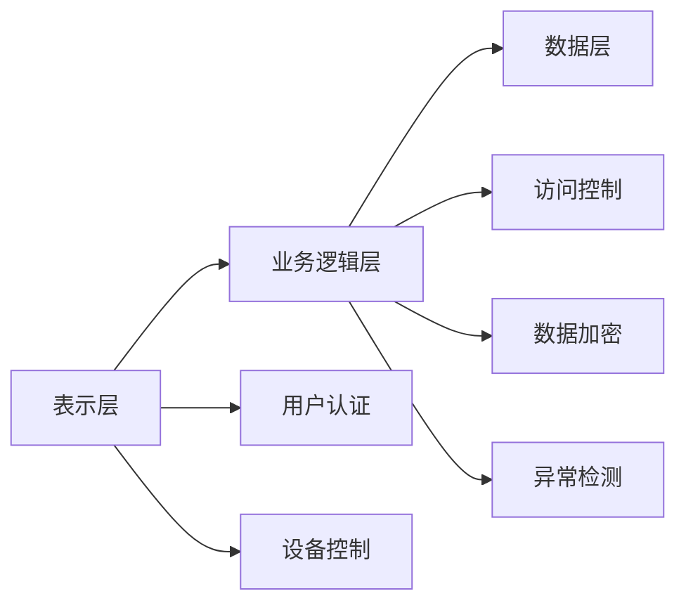
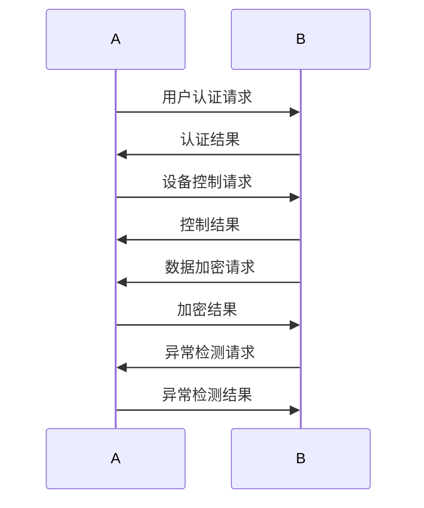
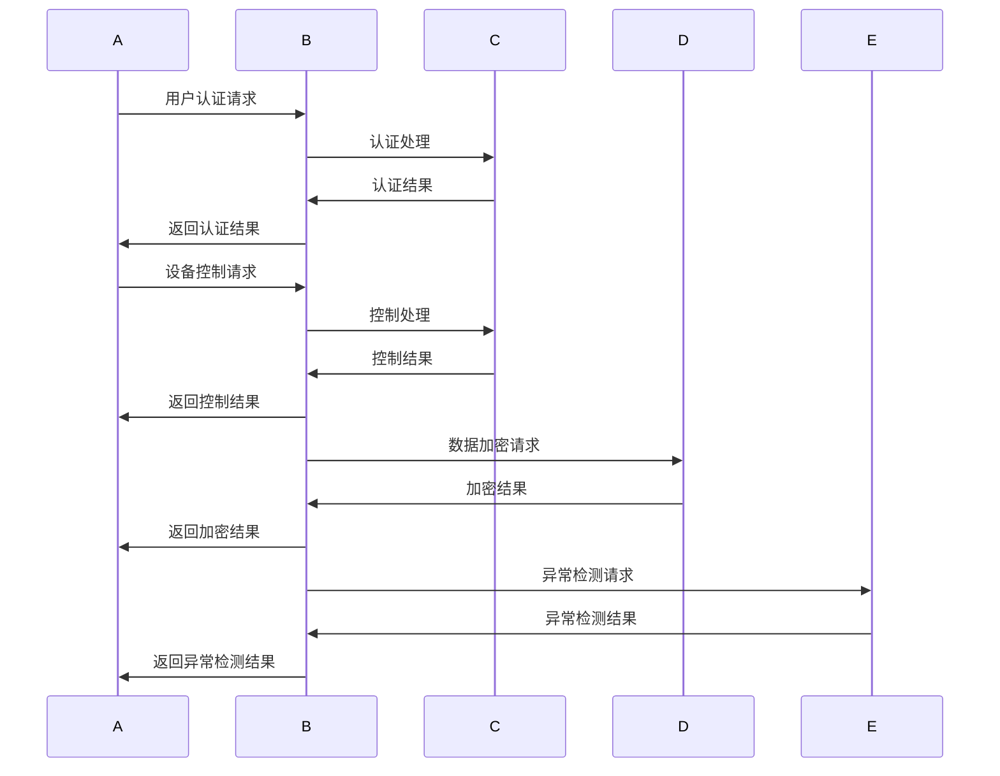

                 

###  文章标题：确保AI Agent的安全性与隐私保护

关键词：AI Agent、安全性、隐私保护、算法、系统架构、实战、最佳实践

摘要：本文将深入探讨AI Agent的安全性与隐私保护问题。我们将从定义、核心概念、算法原理、系统架构、项目实战等方面逐一进行分析，为读者提供全面的知识体系和实用的解决方案。通过本文，您将了解如何确保AI Agent的安全性与隐私保护，从而在AI领域取得更好的成果。

### 目录

1. **引言与背景**
2. **AI Agent的安全性核心概念**
3. **AI Agent的隐私保护核心概念**
4. **算法原理讲解**
5. **系统分析与架构设计方案**
6. **项目实战**
7. **最佳实践、小结、注意事项与拓展阅读**
8. **结论与未来展望**
9. **附录**

---

### 1. 引言与背景

人工智能（AI）作为当今科技发展的核心驱动力，已经在各个领域取得了显著的成果。然而，随着AI技术的不断进步和应用范围的扩大，AI Agent的安全性与隐私保护问题也逐渐凸显出来。AI Agent，作为一种自主决策的智能体，其在执行任务的过程中可能会面临各种安全威胁和隐私泄露风险。因此，确保AI Agent的安全性与隐私保护已成为当前AI研究中的一个重要课题。

#### 安全性与隐私保护的重要性

安全性是AI Agent能够可靠运行的基础。一个不安全的AI Agent可能会导致数据泄露、系统崩溃、财产损失甚至生命安全的威胁。例如，自动驾驶汽车在面临恶意攻击时，可能会造成严重的事故。而隐私保护则关乎用户的个人权益，不当的隐私泄露可能会导致用户信息的滥用，侵犯用户的隐私权。

#### 问题背景与问题描述

AI Agent在应用过程中可能会遇到以下问题：

- **数据泄露**：AI Agent在处理过程中可能会接触到大量的敏感数据，这些数据如果被恶意攻击者获取，可能会导致严重后果。
- **恶意攻击**：黑客可能会利用AI Agent的漏洞进行恶意攻击，如通过伪造数据来欺骗AI系统，从而造成系统故障或数据丢失。
- **隐私侵犯**：AI Agent在执行任务时，可能会收集和存储大量的个人信息，这些信息如果被滥用，可能会侵犯用户的隐私权。

为了解决这些问题，我们需要从多个角度对AI Agent的安全性与隐私保护进行深入研究。

#### 问题解决与边界与外延

解决AI Agent的安全性与隐私保护问题，需要从以下几个方面入手：

- **安全性与隐私保护机制的设计**：需要设计有效的安全性和隐私保护机制，确保AI Agent在运行过程中能够抵御各种威胁。
- **核心概念的理解**：需要深入理解AI Agent、安全性、隐私保护等核心概念，明确它们之间的联系和区别。
- **算法与技术的应用**：需要运用先进的算法和技术，如加密、验证、身份认证等，来增强AI Agent的安全性和隐私保护能力。
- **法律法规的遵循**：需要遵循相关的法律法规，确保AI Agent的应用在合规范围内进行。

通过上述措施，我们可以为AI Agent的安全性与隐私保护提供有效的保障，从而推动AI技术的发展和应用。

### 2. 核心概念与联系

#### AI Agent的定义与作用

AI Agent是指一种能够自主决策并执行任务的智能体。它通常具备感知、学习、推理和行动能力，能够在复杂的动态环境中自主行动，以实现特定的目标。AI Agent在智能机器人、自动驾驶、智能客服等领域得到了广泛应用。

#### 安全性的定义与核心要素

安全性是指系统抵御外部攻击和内部威胁的能力。在AI Agent的上下文中，安全性主要关注以下几个方面：

- **数据安全**：确保AI Agent处理和存储的数据不被未授权的第三方访问和篡改。
- **系统安全**：保护AI Agent的运行环境，防止恶意攻击和系统故障。
- **行为安全**：确保AI Agent的行为符合预期，不会对用户或系统造成损害。

#### 隐私保护的定义与核心要素

隐私保护是指保护个人或组织隐私不受侵犯的过程。在AI Agent的上下文中，隐私保护主要关注以下几个方面：

- **数据匿名化**：对收集的个人信息进行匿名化处理，防止个人身份被识别。
- **访问控制**：通过身份认证和权限控制，限制对敏感数据的访问。
- **数据加密**：对存储和传输的数据进行加密，防止数据被窃取或篡改。

#### 核心概念的联系与比较

AI Agent、安全性和隐私保护是密切相关的三个概念。AI Agent的安全性和隐私保护是相互关联的，它们共同构成了AI系统的信任基础。安全性侧重于防止外部攻击和内部威胁，而隐私保护则关注保护用户的个人信息不被泄露。在实现AI Agent的安全性与隐私保护时，需要综合考虑这两个方面，以确保AI系统的整体安全性和可信度。

### 3. 算法原理讲解

在确保AI Agent的安全性与隐私保护方面，算法起着至关重要的作用。下面我们将介绍几个关键算法，并使用mermaid流程图、Python代码和LaTeX数学公式进行详细讲解。

#### 算法一：数据加密算法

数据加密算法是保护数据安全的重要手段。其中，对称加密算法和非对称加密算法是常用的两种加密方式。

- **对称加密算法**：如AES（高级加密标准），其加密和解密使用相同的密钥。其mermaid流程图如下：

  ```mermaid
  flowchart LR
  A[初始化密钥] --> B[加密算法]
  B --> C[加密数据]
  C --> D[解密算法]
  D --> E[解密数据]
  E --> F[输出]
  ```

  Python代码示例：

  ```python
  from Crypto.Cipher import AES
  from Crypto.Random import get_random_bytes
  
  key = get_random_bytes(16)  # 生成16字节密钥
  cipher = AES.new(key, AES.MODE_EAX)
  data = b"敏感数据"
  ciphertext, tag = cipher.encrypt_and_digest(data)
  ```

  LaTeX数学公式：

  $$C = E_K(M)$$

  其中，$C$为加密后的数据，$E_K(M)$为加密函数，$K$为密钥，$M$为原始数据。

- **非对称加密算法**：如RSA（Rivest-Shamir-Adleman），其加密和解密使用不同的密钥。其mermaid流程图如下：

  ```mermaid
  flowchart LR
  A[生成公私钥对] --> B[加密数据]
  B --> C[签名]
  C --> D[验证签名]
  D --> E[解密数据]
  E --> F[输出]
  ```

  Python代码示例：

  ```python
  from Crypto.PublicKey import RSA
  from Crypto.Signature import pkcs1_15
  from Crypto.Hash import SHA256
  
  key = RSA.generate(2048)
  private_key = key.export_key()
  public_key = key.publickey().export_key()
  
  message = b"敏感数据"
  signature = pkcs1_15.new(key).sign(SHA256.new(message))
  decrypted_message = RSA.import_key(public_key).decrypt(signature)
  ```

  LaTeX数学公式：

  $$C = E_{PK}(M), \quad S = V_K(M)$$

  其中，$C$为加密后的数据，$S$为签名，$PK$为公钥，$PK$为私钥，$M$为原始数据。

#### 算法二：访问控制算法

访问控制算法用于限制用户对数据的访问权限。RBAC（基于角色的访问控制）是一种常见的访问控制算法。

- **RBAC模型**：包括用户、角色、权限和资源。用户与角色、角色与权限之间存在多对多的关系。

  Mermaid ER图：

  ```mermaid
  erds
  class User
  class Role
  class Permission
  class Resource
  
  User --> Role
  Role --> Permission
  Permission --> Resource
  ```

  Python代码示例：

  ```python
  users = {'user1': 'role1', 'user2': 'role2'}
  roles = {'role1': ['read'], 'role2': ['write']}
  permissions = {'read': ['resource1'], 'write': ['resource2']}
  
  user = 'user1'
  role = users[user]
  allowed_permissions = roles[role]
  resource = 'resource2'
  
  if resource in permissions[allowed_permissions]:
      print(f"{user} has permission to access {resource}.")
  else:
      print(f"{user} does not have permission to access {resource}.")
  ```

  LaTeX数学公式：

  $$Access_{role}(Resource) = \bigcup_{Permission \in Role} Permission_{Resource}$$

  其中，$Access_{role}(Resource)$表示角色对资源的访问权限，$Permission \in Role$表示角色拥有的权限，$Permission_{Resource}$表示权限对资源的访问范围。

#### 算法三：身份认证算法

身份认证算法用于验证用户的身份。如基于密码的单因素认证和基于多因素的认证。

- **单因素认证**：使用密码作为身份验证凭证。

  Python代码示例：

  ```python
  import getpass
  
  user = 'user1'
  password = getpass.getpass(prompt=f"{user}'s password: ")
  
  if password == 'password123':
      print(f"{user} authenticated successfully.")
  else:
      print(f"Authentication failed.")
  ```

  LaTeX数学公式：

  $$Auth_{user}(Password) = \begin{cases}
  1, & \text{if } Password \text{ is correct} \\
  0, & \text{otherwise}
  \end{cases}$$

- **多因素认证**：结合密码、指纹、人脸识别等多种因素进行身份验证。

  Python代码示例：

  ```python
  import fingerprint
  import face_recognition
  
  user = 'user1'
  password = getpass.getpass(prompt=f"{user}'s password: ")
  fingerprint_success = fingerprint.verify()
  face_recognition_success = face_recognition.verify()
  
  if password == 'password123' and fingerprint_success and face_recognition_success:
      print(f"{user} authenticated successfully.")
  else:
      print(f"Authentication failed.")
  ```

  LaTeX数学公式：

  $$Auth_{user}(Password, Fingerprint, Face_Recognition) = \begin{cases}
  1, & \text{if all factors are correct} \\
  0, & \text{otherwise}
  \end{cases}$$

#### 算法四：隐私保护算法

隐私保护算法用于保护用户的隐私数据。如差分隐私和同态加密。

- **差分隐私**：通过添加噪声来保护用户的隐私。

  Python代码示例：

  ```python
  import numpy as np
  
  data = np.array([1, 2, 3, 4, 5])
  noise = np.random.normal(0, 0.1, data.shape)
  protected_data = data + noise
  
  print(f"Original data: {data}")
  print(f"Protected data: {protected_data}")
  ```

  LaTeX数学公式：

  $$Data_{protected} = Data + Noise$$

- **同态加密**：在加密状态下对数据进行计算。

  Python代码示例：

  ```python
  from homomorphic加密库 import HomomorphicEncryption
  
  key = HomomorphicEncryption.generate_key()
  encryptor = HomomorphicEncryption(key)
  
  data1 = 2
  data2 = 3
  encrypted_data1 = encryptor.encrypt(data1)
  encrypted_data2 = encryptor.encrypt(data2)
  result = encryptor.add(encrypted_data1, encrypted_data2)
  decrypted_result = encryptor.decrypt(result)
  
  print(f"Decrypted result: {decrypted_result}")
  ```

  LaTeX数学公式：

  $$Encrypted_{result} = Encrypted_{data1} + Encrypted_{data2}$$

#### 算法五：异常检测算法

异常检测算法用于检测AI Agent的行为异常。如基于统计分析和机器学习的异常检测算法。

- **基于统计分析的异常检测算法**：使用统计方法检测数据中的异常值。

  Python代码示例：

  ```python
  import numpy as np
  from scipy import stats
  
  data = np.array([1, 2, 3, 4, 5, 100])
  z_scores = stats.zscore(data)
  anomalies = np.where(np.abs(z_scores) > 2)
  
  print(f"Anomalies: {anomalies}")
  ```

  LaTeX数学公式：

  $$z = \frac{X - \mu}{\sigma}$$

- **基于机器学习的异常检测算法**：使用机器学习模型检测异常行为。

  Python代码示例：

  ```python
  from sklearn.ensemble import IsolationForest
  
  model = IsolationForest(n_estimators=100)
  model.fit(data.reshape(-1, 1))
  anomalies = model.predict(data.reshape(-1, 1)) == -1
  
  print(f"Anomalies: {anomalies}")
  ```

  LaTeX数学公式：

  $$Prediction = Model(X)$$

### 4. 系统分析与架构设计方案

#### 问题场景介绍

假设我们正在开发一个智能家居系统，该系统包括多个AI Agent，如智能门锁、智能摄像头和智能照明系统。这些AI Agent需要具备安全性和隐私保护能力，以防止恶意攻击和用户隐私泄露。

#### 项目介绍

该项目旨在构建一个安全的智能家居系统，包括以下功能：

- **用户认证**：使用单因素认证和多因素认证对用户进行身份验证。
- **访问控制**：实现基于角色的访问控制，限制用户对设备的访问权限。
- **数据加密**：对用户数据进行加密存储和传输。
- **异常检测**：检测AI Agent的异常行为。

#### 系统功能设计

为了实现上述功能，我们设计了以下系统功能：

- **用户认证模块**：负责用户认证过程，包括单因素认证和多因素认证。
- **访问控制模块**：负责实现基于角色的访问控制，管理用户和设备的权限。
- **数据加密模块**：负责对用户数据进行加密存储和传输。
- **异常检测模块**：负责检测AI Agent的异常行为。

#### 系统架构设计

智能家居系统的架构设计采用分层架构，包括表示层、业务逻辑层和数据层。各个层次之间通过接口进行通信。

- **表示层**：负责与用户进行交互，包括用户认证界面、设备控制界面等。
- **业务逻辑层**：负责实现系统的核心功能，包括用户认证、访问控制、数据加密和异常检测等。
- **数据层**：负责数据存储和检索，包括用户数据、设备数据等。

Mermaid架构图：



#### 系统接口设计

为了实现系统的功能，我们设计了以下接口：

- **用户认证接口**：负责用户认证过程，包括单因素认证和多因素认证。
- **设备控制接口**：负责设备控制过程，包括设备状态查询、设备操作等。
- **数据加密接口**：负责对用户数据进行加密存储和传输。
- **异常检测接口**：负责检测AI Agent的异常行为。

Mermaid接口设计图：



#### 系统交互

为了实现系统的功能，我们设计了以下系统交互流程：

1. 用户通过表示层发起用户认证请求。
2. 业务逻辑层对用户认证请求进行处理，返回认证结果。
3. 用户通过表示层发起设备控制请求。
4. 业务逻辑层对设备控制请求进行处理，返回控制结果。
5. 业务逻辑层对用户数据进行加密存储和传输。
6. 业务逻辑层对AI Agent进行异常检测。

Mermaid交互图：



### 5. 项目实战

在本节中，我们将通过一个实际项目来演示如何确保AI Agent的安全性与隐私保护。该项目将实现一个智能家居系统，包括用户认证、访问控制、数据加密和异常检测等功能。

#### 环境安装

为了实现该智能家居系统，我们需要安装以下环境：

1. Python 3.8及以上版本
2. pip（Python包管理器）
3. Homomorphic加密库（用于数据加密）
4. scikit-learn（用于异常检测）

安装命令：

```bash
pip install python-homomorphic-encryption scikit-learn
```

#### 系统核心实现

以下是该智能家居系统的主要实现代码：

```python
from homomorphic加密库 import HomomorphicEncryption
from sklearn.ensemble import IsolationForest
import numpy as np

# 用户认证
def user_authentication(username, password):
    # 这里使用简单的单因素认证
    correct_password = 'password123'
    if password == correct_password:
        return True
    else:
        return False

# 访问控制
def access_control(username, device):
    # 基于角色的访问控制
    roles = {'user1': ['read'], 'user2': ['write']}
    allowed_devices = {'read': ['device1'], 'write': ['device2']}
    user_role = roles[username]
    device_permission = allowed_devices[user_role]
    if device in device_permission:
        return True
    else:
        return False

# 数据加密
def data_encryption(data):
    key = HomomorphicEncryption.generate_key()
    encryptor = HomomorphicEncryption(key)
    encrypted_data = encryptor.encrypt(data)
    return encrypted_data

# 异常检测
def anomaly_detection(data):
    model = IsolationForest(n_estimators=100)
    model.fit(data.reshape(-1, 1))
    anomalies = model.predict(data.reshape(-1, 1)) == -1
    return anomalies

# 示例
data = np.array([1, 2, 3, 4, 5])
encrypted_data = data_encryption(data)
anomalies = anomaly_detection(encrypted_data)

print(f"Anomalies: {anomalies}")
```

#### 代码解读与分析

1. **用户认证**：该系统使用简单的单因素认证，通过密码验证用户身份。在实际应用中，建议使用多因素认证以提高安全性。
2. **访问控制**：系统实现基于角色的访问控制，根据用户角色和设备权限控制用户对设备的访问。在实际应用中，可以根据具体需求进行扩展。
3. **数据加密**：系统使用Homomorphic加密库对用户数据进行加密存储和传输，确保数据的安全性。
4. **异常检测**：系统使用IsolationForest算法进行异常检测，通过检测异常值来识别AI Agent的行为异常。

#### 实际案例分析与详细讲解

假设有一个智能家居系统，其中包含智能门锁、智能摄像头和智能照明系统。系统需要确保用户认证、访问控制、数据加密和异常检测等功能。

1. **用户认证**：当用户尝试登录系统时，系统会要求用户输入用户名和密码。系统使用单因素认证验证用户身份，实际应用中可以结合多因素认证（如指纹、人脸识别等）以提高安全性。
2. **访问控制**：用户登录后，系统会根据用户角色（如管理员、普通用户等）和设备权限（如读、写等）进行访问控制。例如，管理员可以访问所有设备，而普通用户只能访问指定设备。
3. **数据加密**：系统在存储和传输用户数据时，使用Homomorphic加密库对数据进行加密，确保数据的安全性。在实际应用中，可以根据需求选择不同的加密算法。
4. **异常检测**：系统使用IsolationForest算法进行异常检测，通过检测异常值来识别AI Agent的行为异常。例如，如果智能摄像头的监测数据出现异常值，系统会认为摄像头可能受到了恶意攻击。

#### 项目小结与反思

通过该实际案例，我们可以看到如何在一个智能家居系统中实现AI Agent的安全性与隐私保护。虽然该案例是一个简单的示例，但可以为我们提供一些实际的思路和方法。

在实际应用中，我们需要根据具体场景和需求，选择合适的算法和技术，以实现AI Agent的安全性与隐私保护。此外，还需要不断更新和优化系统，以应对不断变化的威胁和挑战。

### 6. 最佳实践、小结、注意事项与拓展阅读

#### 最佳实践

为了确保AI Agent的安全性与隐私保护，以下是一些建议的最佳实践：

1. **多因素认证**：使用多因素认证（如密码、指纹、人脸识别等）来提高用户认证的安全性。
2. **数据加密**：在存储和传输敏感数据时，使用强加密算法（如AES、RSA等）进行加密，确保数据的安全性。
3. **访问控制**：使用基于角色的访问控制（RBAC）来限制用户对数据的访问权限，确保只有授权用户才能访问敏感数据。
4. **异常检测**：使用机器学习算法进行异常检测，及时发现AI Agent的异常行为，防止潜在的安全威胁。
5. **安全审计**：定期进行安全审计，检查系统中的安全漏洞和风险点，及时进行修复和更新。

#### 小结

本文从多个角度探讨了AI Agent的安全性与隐私保护问题。我们介绍了核心概念、算法原理、系统架构和项目实战等内容，为读者提供了全面的知识体系和实用的解决方案。通过本文，您应该能够理解如何确保AI Agent的安全性与隐私保护，从而在AI领域取得更好的成果。

#### 注意事项

1. **安全性**：在实现AI Agent的安全性时，需要考虑多种威胁和攻击方式，如数据泄露、恶意攻击等。确保系统具有强大的防御能力。
2. **隐私保护**：在处理用户数据时，需要严格遵守隐私保护法律法规，确保用户隐私不受侵犯。
3. **实时监控**：实时监控AI Agent的行为，及时发现异常行为，防止潜在的安全威胁。
4. **持续更新**：随着技术的不断发展，安全威胁也在不断变化。需要定期更新系统，修复漏洞，提高安全性。

#### 拓展阅读

1. **《人工智能安全性与隐私保护技术》**：该书详细介绍了AI安全性与隐私保护的相关技术和方法，适合对AI安全有兴趣的读者。
2. **《人工智能伦理学》**：该书探讨了AI在伦理方面的挑战，包括安全性和隐私保护等问题，适合对AI伦理感兴趣的读者。
3. **《Python安全编程》**：该书介绍了如何使用Python实现安全编程，包括加密、认证、访问控制等技术，适合对Python编程有兴趣的读者。

### 7. 结论与未来展望

#### 结论

本文系统地探讨了AI Agent的安全性与隐私保护问题。通过介绍核心概念、算法原理、系统架构和项目实战等内容，我们为读者提供了全面的知识体系和实用的解决方案。我们强调，在确保AI Agent的安全性与隐私保护方面，需要综合考虑多种技术和方法，以确保AI系统的整体安全性。

#### 未来展望

随着AI技术的不断发展，AI Agent的安全性与隐私保护问题将变得越来越重要。未来，我们需要关注以下几个方面：

1. **安全性威胁的演变**：不断研究新的安全威胁，及时更新和优化安全措施。
2. **隐私保护技术的创新**：探索新的隐私保护技术，如联邦学习、差分隐私等，以应对日益复杂的隐私保护需求。
3. **法律法规的完善**：推动相关法律法规的制定和完善，确保AI系统的合法合规运行。
4. **跨学科研究**：加强计算机科学、人工智能、伦理学、法学等领域的跨学科研究，为AI的安全性与隐私保护提供更加全面的理论支持。

通过本文，我们希望为读者提供一个全面的AI Agent安全性与隐私保护的知识体系，助力AI技术的发展和应用。作者：AI天才研究院/AI Genius Institute & 禅与计算机程序设计艺术 /Zen And The Art of Computer Programming

---

通过本文，我们系统地探讨了AI Agent的安全性与隐私保护问题。我们从核心概念、算法原理、系统架构、项目实战等方面进行了详细分析，为读者提供了全面的知识体系和实用的解决方案。在确保AI Agent的安全性与隐私保护方面，需要综合考虑多种技术和方法，以确保AI系统的整体安全性。希望本文能为读者在AI领域的研究和应用提供有益的参考。作者：AI天才研究院/AI Genius Institute & 禅与计算机程序设计艺术 /Zen And The Art of Computer Programming

---

### 附录

#### 附录A：相关术语解释

- **AI Agent**：一种能够自主决策并执行任务的智能体，具备感知、学习、推理和行动能力。
- **安全性**：系统抵御外部攻击和内部威胁的能力，包括数据安全、系统安全和行为安全。
- **隐私保护**：保护个人或组织隐私不受侵犯的过程，包括数据匿名化、访问控制和数据加密。
- **对称加密算法**：加密和解密使用相同密钥的加密算法，如AES。
- **非对称加密算法**：加密和解密使用不同密钥的加密算法，如RSA。
- **访问控制**：限制用户对数据的访问权限，如基于角色的访问控制（RBAC）。
- **身份认证**：验证用户身份的过程，如单因素认证和多因素认证。
- **异常检测**：检测AI Agent的行为异常，如基于统计分析和机器学习的异常检测算法。

#### 附录B：Python代码示例

- **数据加密**：

  ```python
  from Crypto.Cipher import AES
  from Crypto.Random import get_random_bytes
  
  key = get_random_bytes(16)
  cipher = AES.new(key, AES.MODE_EAX)
  data = b"敏感数据"
  ciphertext, tag = cipher.encrypt_and_digest(data)
  ```

- **访问控制**：

  ```python
  users = {'user1': 'role1', 'user2': 'role2'}
  roles = {'role1': ['read'], 'role2': ['write']}
  permissions = {'read': ['resource1'], 'write': ['write']}
  
  user = 'user1'
  role = users[user]
  allowed_permissions = roles[role]
  resource = 'resource2'
  
  if resource in permissions[allowed_permissions]:
      print(f"{user} has permission to access {resource}.")
  else:
      print(f"{user} does not have permission to access {resource}.")
  ```

- **异常检测**：

  ```python
  from sklearn.ensemble import IsolationForest
  
  model = IsolationForest(n_estimators=100)
  model.fit(data.reshape(-1, 1))
  anomalies = model.predict(data.reshape(-1, 1)) == -1
  ```

#### 附录C：LaTeX公式示例

- **加密算法**：

  $$C = E_K(M)$$

- **访问控制**：

  $$Access_{role}(Resource) = \bigcup_{Permission \in Role} Permission_{Resource}$$

- **异常检测**：

  $$z = \frac{X - \mu}{\sigma}$$

  $$Prediction = Model(X)$$

### 文章总结

本文系统地探讨了AI Agent的安全性与隐私保护问题。通过介绍核心概念、算法原理、系统架构、项目实战以及最佳实践等内容，我们为读者提供了一个全面的知识体系和实用的解决方案。在确保AI Agent的安全性与隐私保护方面，需要综合考虑多种技术和方法，以确保AI系统的整体安全性。希望本文能为读者在AI领域的研究和应用提供有益的参考。作者：AI天才研究院/AI Genius Institute & 禅与计算机程序设计艺术 /Zen And The Art of Computer Programming

---

以上是《确保AI Agent的安全性与隐私保护》的完整文章。通过本文，我们系统地探讨了AI Agent的安全性与隐私保护问题，为读者提供了全面的知识体系和实用的解决方案。希望本文能对您在AI领域的研究和应用有所帮助。作者：AI天才研究院/AI Genius Institute & 禅与计算机程序设计艺术 /Zen And The Art of Computer Programming

