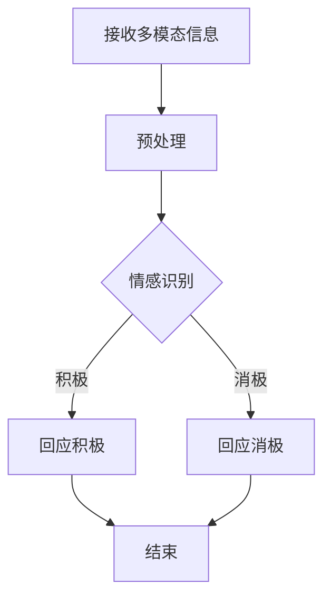
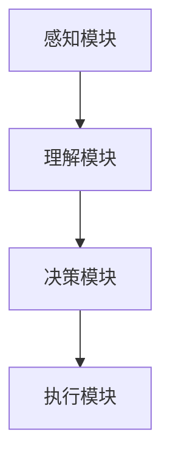

                 


## 社交AI：提升AI Agent的人际交互能力

### 关键词

- 社交AI
- 人际交互
- AI Agent
- 技术原理
- 应用案例

### 摘要

本文探讨了社交AI的发展及其在提升AI Agent人际交互能力方面的重要性。通过分析社交AI的核心概念、关键技术、实现方法及应用案例，本文揭示了社交AI在实际应用中的潜力与挑战，并展望了其未来发展。

## 目录

1. 引言
2. 社交AI概述
   - 2.1 问题背景
   - 2.2 问题描述
   - 2.3 问题解决
   - 2.4 边界与外延
   - 2.5 概念结构与核心要素组成
3. 社交AI的核心概念
   - 3.1 核心概念原理
   - 3.2 概念属性特征对比表格
   - 3.3 ER实体关系图架构的Mermaid流程图
4. 社交AI的关键技术
   - 4.1 算法原理讲解
   - 4.2 数学模型和数学公式讲解
5. 社交AI的实现方法
   - 5.1 系统分析与架构设计方案
   - 5.2 项目实战
6. 社交AI的应用案例
   - 6.1 应用实例分析
   - 6.2 案例详细讲解
7. 社交AI的未来发展
   - 7.1 未来展望
   - 7.2 挑战与机遇
8. 结论

## 1. 引言

随着人工智能技术的飞速发展，AI在各个领域的应用越来越广泛。然而，在人际交互方面，AI仍然存在一定的局限性。社交AI应运而生，旨在提升AI Agent的人际交互能力，使其能够更好地理解和应对复杂的人际关系。本文将围绕社交AI的核心概念、关键技术、实现方法及应用案例展开讨论，以期为读者提供一个全面了解社交AI的视角。

## 2. 社交AI概述

### 2.1 问题背景

社交AI是指具备社交能力的人工智能系统，能够在人际交往中识别、理解和回应人类情感、行为和意图。随着社会对AI的需求日益增长，如何提升AI Agent的人际交互能力成为了一个重要课题。

### 2.2 问题描述

当前，AI在人际交互中面临以下问题：

- **情感识别与理解**：AI难以准确识别和理解人类的情感。
- **语言理解**：AI在处理自然语言时存在歧义、语境理解不足等问题。
- **多模态交互**：AI难以整合语音、文本、图像等多模态信息进行交互。

### 2.3 问题解决

提升AI Agent的人际交互能力的方法包括：

- **深度学习**：通过大量数据训练AI模型，提高其对情感、语言的理解能力。
- **多模态感知**：整合语音、文本、图像等多模态信息，实现更丰富的交互体验。
- **人机协作**：通过人机协作，发挥人类与AI的优势互补，提高交互效果。

### 2.4 边界与外延

社交AI的边界在于其能够处理的社交情境和任务。外延则包括其在各个领域的应用，如客服、教育、医疗、社交平台等。

### 2.5 概念结构与核心要素组成

社交AI的核心结构包括：

- **感知模块**：负责接收和处理多模态信息。
- **理解模块**：负责理解人类的情感、意图和语言。
- **决策模块**：根据理解结果，生成合适的回应。
- **执行模块**：实现AI的实际行动。

## 3. 社交AI的核心概念

### 3.1 核心概念原理

社交AI的核心概念包括：

- **自然语言处理（NLP）**：使AI能够理解、生成和处理自然语言。
- **机器学习（ML）**：通过训练模型，使AI具备自主学习和优化能力。
- **人工智能（AI）**：使机器能够模拟、延伸和扩展人类的智能。

### 3.2 概念属性特征对比表格

| 概念   | 特征                     |
| ------ | ------------------------ |
| NLP    | 理解和生成自然语言       |
| ML     | 自主学习和优化模型       |
| AI     | 模拟和延伸人类智能       |

### 3.3 ER实体关系图架构的Mermaid流程图

```mermaid
erDiagram
  A[感知模块] ||--|{ B[理解模块] }|
  B ||--|{ C[决策模块] }|
  C ||--|{ D[执行模块] }|
```

## 4. 社交AI的关键技术

### 4.1 算法原理讲解

社交AI的核心算法包括：

- **情感识别算法**：通过分析文本、语音、图像等多模态信息，识别人类情感。
- **意图理解算法**：通过自然语言处理，理解人类的意图和需求。
- **对话生成算法**：根据理解和决策结果，生成合适的对话回应。

使用Mermaid绘制情感识别算法的流程图：



### 4.2 数学模型和数学公式讲解

情感识别算法中的关键数学模型包括：

- **支持向量机（SVM）**：用于分类情感。
- **神经网络**：用于特征提取和分类。

使用LaTeX格式嵌入文中独立段落的数学公式：

$$
\text{SVM分类器} = \arg\max_{w,b} \left( \frac{1}{2} ||w||^2 - \sum_{i=1}^{n} y_i (w \cdot x_i + b) \right)
$$

## 5. 社交AI的实现方法

### 5.1 系统分析与架构设计方案

社交AI系统的架构设计包括以下模块：

- **感知模块**：接收语音、文本、图像等多模态信息。
- **理解模块**：通过NLP和机器学习技术，理解人类情感和意图。
- **决策模块**：根据理解结果，生成对话回应。
- **执行模块**：实现AI的实际行动。

使用Mermaid绘制社交AI系统的架构图：



### 5.2 项目实战

以下是一个社交AI项目的实战案例：

1. **环境安装**：安装Python、TensorFlow等依赖库。
2. **系统核心实现源代码**：编写情感识别、意图理解、对话生成的代码。
3. **代码应用解读与分析**：分析代码实现，了解社交AI系统的运作原理。

实际案例：使用社交AI为客服系统提供智能客服功能，提升用户体验。

### 6. 社交AI的应用案例

#### 6.1 应用实例分析

社交AI在以下领域有广泛应用：

- **客服**：提供智能客服，提升服务质量。
- **教育**：个性化教学，提升学习效果。
- **医疗**：辅助医生诊断，提高诊断准确率。
- **社交平台**：优化社交体验，增强用户粘性。

#### 6.2 案例详细讲解

以客服系统为例，讲解社交AI的应用过程：

1. **问题场景介绍**：客服人员处理大量用户咨询，效率低下。
2. **系统功能设计**：设计情感识别、意图理解、对话生成等功能。
3. **系统架构设计**：采用分布式架构，提高系统性能。
4. **系统接口设计**：设计API，实现与现有系统的集成。
5. **系统交互**：通过多模态交互，实现智能客服功能。

### 7. 社交AI的未来发展

#### 7.1 未来展望

社交AI的发展趋势包括：

- **多模态感知**：整合语音、文本、图像等多模态信息。
- **情感识别与理解**：提高情感识别和理解的准确性。
- **人机协作**：实现人类与AI的更好协作。

#### 7.2 挑战与机遇

社交AI面临的挑战包括：

- **数据隐私**：如何保护用户隐私。
- **算法偏见**：如何避免算法偏见。

机遇包括：

- **广泛应用**：社交AI在各个领域的应用前景广阔。
- **技术创新**：随着技术的发展，社交AI将不断进步。

### 8. 结论

本文探讨了社交AI的发展及其在提升AI Agent人际交互能力方面的重要性。通过分析社交AI的核心概念、关键技术、实现方法及应用案例，本文揭示了社交AI在实际应用中的潜力与挑战。未来，随着技术的不断进步，社交AI有望在各个领域发挥更大的作用。

## 最佳实践 tips

- **收集高质量数据**：提升AI Agent的人际交互能力需要大量的高质量数据。
- **持续优化模型**：定期更新和优化模型，以提高社交AI的性能。
- **关注用户隐私**：在设计社交AI系统时，要充分考虑用户隐私保护。

## 注意事项

- **避免算法偏见**：在设计社交AI系统时，要注意避免算法偏见，确保系统的公平性。
- **注意系统性能**：在实现社交AI系统时，要考虑系统的性能，确保高效运行。

## 拓展阅读

- **《人工智能：一种现代的方法》**：介绍人工智能的基本概念和方法。
- **《深度学习》**：探讨深度学习在人工智能领域的应用。
- **《人工智能伦理》**：讨论人工智能在伦理方面的挑战。

---

作者：AI天才研究院/AI Genius Institute & 禅与计算机程序设计艺术 /Zen And The Art of Computer Programming

本文旨在提供关于社交AI的全面了解，以期为读者在相关领域的研究和应用提供参考。文章内容仅供参考，不构成具体建议。如需进一步了解，请参考拓展阅读。感谢您的阅读！

