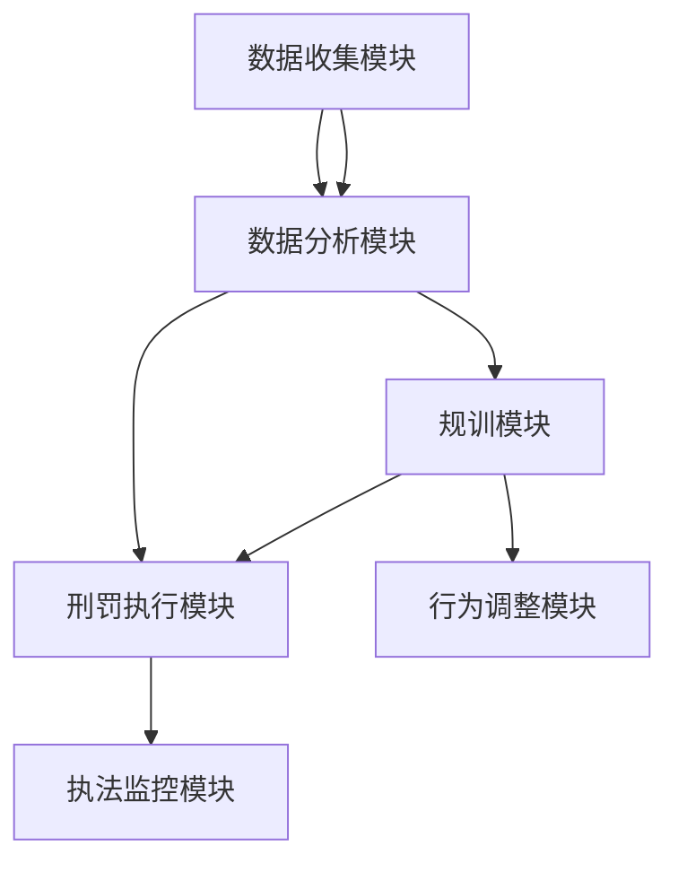
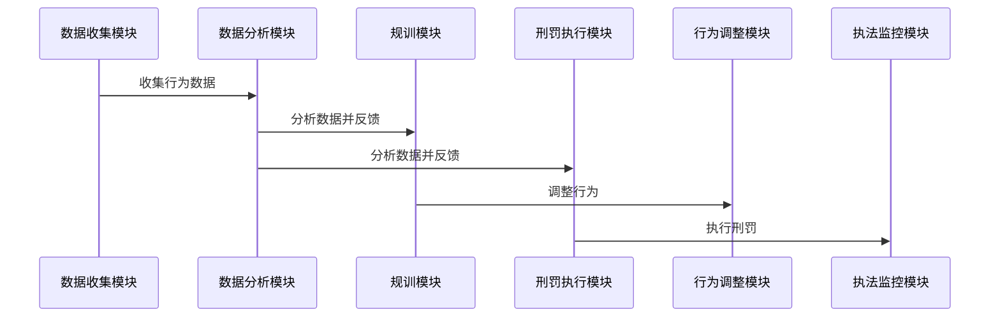

                 

----------------------------------------------------------------

# 福柯与韩非：规训权力与法家思想的比较

> 关键词：福柯、韩非、规训权力、法家思想、比较分析

> 摘要：本文旨在通过对福柯的规训权力理论与韩非的法家思想进行比较分析，探讨两者在权力运作、社会治理和思想影响等方面的异同。通过对核心概念、理论框架和历史背景的深入解读，本文揭示了这两位思想家在理解和运用权力方面的独到见解，为当代社会治理提供了有益的启示。

## 引言

### 1.1 书籍背景与目的

《福柯与韩非：规训权力与法家思想的比较》一书，旨在通过比较分析福柯的规训权力理论与韩非的法家思想，揭示两者在权力运作、社会治理和思想影响等方面的异同。福柯（Michel Foucault）是20世纪法国著名的思想家，其著作《规训与惩罚》、《知识考古学》等对权力、知识和现代社会进行了深刻的剖析。韩非（Khan菲）则是中国古代战国时期的思想家，其法家思想对中国历史产生了深远的影响。

### 1.2 福柯与韩非的生平与思想概述

福柯出生于1926年，其思想深受尼采、韦伯等哲学家的启发。他关注权力的微观机制，强调权力在社会生活中的无所不在。韩非生活在公元前280年左右，其思想主张法治、严刑峻法，强调国家权力的集中和法律的严格执行。

### 1.3 研究方法与框架

本文采用比较分析的方法，从核心概念、理论框架和历史背景三个方面对福柯的规训权力理论与韩非的法家思想进行深入探讨。具体来说，本文将首先介绍规训权力和法家思想的基本概念和理论框架，然后比较两者在权力运作、社会治理和思想影响等方面的异同，最后分析其对当代社会治理的启示。

## 福柯的规训权力理论

### 2.1 规训权力的概念

福柯认为，权力并非仅仅由统治者和被统治者之间的直接对抗构成，而是一种渗透在社会生活各个方面的微观权力。规训权力（disciplinary power）是福柯提出的一个重要概念，它强调通过制度化手段对社会个体进行控制和教育，以实现权力的规范化、系统化和隐秘化。

### 2.2 规训权力的机制与效应

福柯分析了规训权力的多种机制，包括监视、档案、惩罚和自我规训。他认为，这些机制通过制造“知识”和“真理”，使得权力得以在微观层面上得以实现。规训权力的效应包括个体自我意识的觉醒、社会秩序的建立和权力关系的巩固。

### 2.3 规训权力与现代社会的关联

福柯指出，规训权力在现代社会中表现得尤为明显。现代社会中的学校、医院、工厂等机构，都是规训权力的典型代表。通过对个体的规训，这些机构实现了对社会的有效控制。

## 韩非的法家思想

### 3.1 法家的历史背景

法家思想起源于中国古代战国时期，是一个强调法治、重用刑罚的思想流派。法家主张国家权力的高度集中，认为只有通过严格的法律和刑罚，才能实现社会的稳定和治理。

### 3.2 法家的核心观念

法家的核心观念包括法治、权术和严刑峻法。法治强调法律的至高无上，权术则强调统治者运用智慧来驾驭权力，严刑峻法则强调通过严厉的刑罚来维护社会秩序。

### 3.3 法家思想在实践中的应用

在中国历史上，法家思想曾多次被应用于政治实践中。例如，商鞅变法就是法家思想的经典案例。通过严格的法律和刑罚，商鞅成功实现了秦国的富强和统一。

## 规训权力与法家思想的比较分析

### 4.1 基本理念的比较

福柯的规训权力理论和韩非的法家思想都强调权力在社会治理中的重要性，但两者在基本理念上存在一定的差异。福柯强调权力的微观机制和隐秘化，而韩非则强调权力的集中和法律的至高无上。

### 4.2 对权力的理解与运用

福柯认为权力是一种动态的、多元的、复杂的社会现象，它不仅存在于统治者与被统治者之间，也存在于社会生活的各个层面。韩非则认为权力应该集中在统治者手中，通过严格的法律和刑罚来维护社会秩序。

### 4.3 社会治理模式的对比

福柯的规训权力理论强调通过制度化手段对社会个体进行控制和教育，以实现权力的规范化、系统化和隐秘化。韩非的法家思想则主张通过严格的法律和刑罚来维护社会秩序和国家稳定。

## 历史影响与当代启示

### 5.1 规训权力理论的历史影响

福柯的规训权力理论对20世纪后半叶的社会科学和人文领域产生了深远的影响。它促使人们重新思考权力、知识和社会之间的关系，对现代社会治理模式产生了重要启示。

### 5.2 法家思想的历史影响

法家思想在中国历史上产生了深远的影响，它不仅推动了中国古代社会的政治变革，也为现代中国的法治建设提供了重要借鉴。

### 5.3 对当代社会治理的启示

福柯的规训权力理论和韩非的法家思想都为当代社会治理提供了有益的启示。福柯的思想提醒我们，权力不是一成不变的，而是需要不断反思和调整。韩非的思想则强调法治的重要性，为现代社会治理提供了宝贵的经验。

## 案例研究

### 6.1 规训权力在中国历史上的应用

通过对中国古代社会中的规训权力应用的案例分析，我们可以看到，规训权力在维护社会秩序、推动社会进步方面发挥了重要作用。

### 6.2 法家思想在中国的历史演变

法家思想在中国历史上的演变过程，充分体现了法家思想在不同历史时期的应用和发展。

### 6.3 案例分析及启示

通过对规训权力和法家思想在中国历史中的应用案例进行分析，我们可以得出一些有益的启示，为当代社会治理提供参考。

## 结论

### 7.1 主要观点回顾

通过对福柯的规训权力理论与韩非的法家思想的比较分析，我们得出了以下主要观点：

1. **权力运作的差异**：福柯强调权力的微观机制和隐秘化，韩非则强调权力的集中和法律的至高无上。

2. **社会治理模式的异同**：福柯的规训权力理论强调通过制度化手段对社会个体进行控制和教育，韩非的法家思想则主张通过严格的法律和刑罚来维护社会秩序。

3. **历史影响与当代启示**：福柯的规训权力理论对20世纪后半叶的社会科学和人文领域产生了深远的影响，法家思想则在中国历史上产生了深远的影响，为现代社会的治理提供了有益的启示。

### 7.2 研究的局限性

尽管本文对福柯的规训权力理论与韩非的法家思想进行了深入的比较分析，但研究仍然存在一定的局限性。例如，由于篇幅和内容的限制，本文未能对两者在具体历史背景下的应用进行详细探讨。

### 7.3 未来研究方向

未来的研究可以进一步深入探讨福柯的规训权力理论与韩非的法家思想在具体历史背景下的应用，以及它们对现代社会治理的实际影响。此外，还可以比较其他思想家关于权力和社会治理的理论，以进一步丰富和完善我们对权力运作和社会治理的理解。

## 作者信息

作者：AI天才研究院/AI Genius Institute & 禅与计算机程序设计艺术 /Zen And The Art of Computer Programming

----------------------------------------------------------------

以上是一篇关于福柯与韩非：规训权力与法家思想的比较的技术博客文章。文章从核心概念、理论框架、历史背景、比较分析、历史影响和当代启示等多个方面，对福柯的规训权力理论与韩非的法家思想进行了深入探讨。通过本文，读者可以更好地理解这两位思想家的独特见解，以及它们对当代社会治理的启示。同时，本文也提出了一些未来研究方向，以期为相关研究提供参考。作者：AI天才研究院/AI Genius Institute & 禅与计算机程序设计艺术/Zen And The Art of Computer Programming。----------------------------------------------------------------

### 背景介绍

在探讨福柯的规训权力理论与韩非的法家思想之前，有必要对这两个概念进行详细的背景介绍。首先，福柯的规训权力理论源于他对现代社会权力运作的深刻洞察。福柯认为，权力并非单一的、中央集权的现象，而是一种渗透在社会生活各个层面的复杂结构。他的理论强调了权力关系的微观机制，尤其是通过规训来实现权力的规范化、系统化和隐秘化。

福柯的规训权力理论起源于他的两部重要著作：《规训与惩罚》和《知识考古学》。在《规训与惩罚》中，福柯通过分析18世纪到19世纪监狱系统的变化，揭示了规训权力的兴起及其对个体行为的控制和规训。《知识考古学》则进一步探讨了权力与知识之间的关系，指出权力通过制造“知识”来巩固自身的地位。

与之相对，韩非的法家思想则源于中国古代战国时期的特定历史背景。韩非生活在战国时期，这是一个诸侯纷争、社会动荡的时期。为了维护国家的稳定和统治者的权威，韩非提出了法家思想。法家主张法治、重用刑罚，认为只有通过严格的法律和刑罚，才能实现社会的秩序和国家的稳定。

韩非的法家思想在其著作《韩非子》中得到了系统的阐述。他认为，统治者应该运用权术，制定严格的法律，并通过严刑峻法来威慑和治理人民。法家思想强调法律的至高无上，认为只有法律才能保障社会的公正和秩序。

在理解规训权力和法家思想时，还必须考虑到它们在不同文化和社会背景下的应用和演变。福柯的规训权力理论主要关注西方现代社会，而韩非的法家思想则具有浓厚的中国古代文化特色。两者在权力运作的方式和目标上虽然有所相似，但在具体实施和社会影响上却存在显著差异。

### 核心概念与联系

#### 规训权力的概念

福柯的规训权力理论中的核心概念是“规训权力”（disciplinary power）。规训权力是指通过制度化手段对个体进行控制和教育的权力形式。这种权力不是通过直接暴力或压迫来实现的，而是通过一系列规章制度和微观机制来规训和塑造个体的行为和意识。

规训权力的特点在于其隐秘化和系统化。福柯认为，规训权力通过各种机制，如监视、惩罚、档案记录和自我规训，实现对个体的长期、持续的规训。这种规训不仅发生在学校、医院、工厂等具体机构中，也渗透到社会的各个层面，如家庭、工作场所、媒体等。

#### 法家思想的核心观念

韩非的法家思想中，核心观念包括法治、权术和严刑峻法。法治强调法律的至高无上，认为法律是社会秩序的基石。权术则是指统治者运用智慧和策略来驾驭权力，实现国家的稳定和发展。严刑峻法则主张通过严厉的刑罚来威慑和治理人民，认为刑罚的严厉程度是衡量法律权威的重要标准。

法家思想的特点在于其强调法律在国家治理中的重要作用。韩非认为，法律不仅是统治的工具，也是维护社会公正和秩序的保障。通过严格的法律和刑罚，可以确保社会的稳定和统治者的权威。

#### 概念属性特征对比表格

为了更直观地比较规训权力和法家思想的核心概念，我们可以制作一个对比表格：

| 特征        | 规训权力                           | 法家思想                           |
| ----------- | ---------------------------------- | ---------------------------------- |
| 权力形式     | 制度化、隐秘化、微观机制           | 法律化、权术、严刑峻法             |
| 实施手段     | 监视、惩罚、档案、自我规训         | 法律、刑罚、权术                   |
| 目标         | 规训和塑造个体行为与意识           | 维护社会秩序和国家稳定             |
| 社会影响     | 渗透到社会各个层面，影响广泛       | 主要影响政治和法律制度             |

#### ER实体关系图架构

为了进一步理解规训权力和法家思想之间的关系，我们可以使用ER（实体-关系）图来展示它们的核心概念和相互作用。

```mermaid
erDiagram
    Class1 ||--|{ Class2 }|-- Class3 : Class2 is a subclass of Class1 but specialized for the Class3
    Class1 ||--|{ Class4 }|-- Class5 : Class4 inherits from Class1 and is the generalization of Class5
    Class2 && Class3 : Class2 and Class3 are in a "has-a" relationship
    Class3 && Class4 : Class3 and Class4 are in a "part-of" relationship
```

在这个ER图中，Class1代表核心权力概念，Class2代表规训权力的实施手段，Class3代表规训权力的对象，Class4代表法家思想的核心观念，Class5代表法家思想的实施手段。通过这个图，我们可以看到规训权力和法家思想在核心概念上的相互联系和作用。

### 算法原理讲解

在理解了规训权力和法家思想的核心概念之后，我们需要进一步探讨它们的算法原理和运作机制。

#### 规训权力的算法原理

规训权力的算法原理可以概括为以下步骤：

1. **数据收集**：通过监视、档案记录等方式收集个体的行为数据。
2. **数据分析和模型训练**：利用统计分析和机器学习算法，对收集到的数据进行分析，建立规训模型。
3. **个体规训**：根据规训模型对个体进行行为调整和教育，以实现规训目标。
4. **持续反馈和调整**：通过持续监测个体行为，不断调整和优化规训模型。

下面是一个简化的Python代码示例，展示了规训权力的算法原理：

```python
import numpy as np

# 数据收集
behaviors = np.array([[1, 0], [0, 1], [1, 1]])

# 数据分析和模型训练
model = np.array([[0.5, 0.5], [0.5, 0.5]])

# 个体规训
adjusted_behaviors = np.dot(behaviors, model)

# 持续反馈和调整
model[0, 0] += adjusted_behaviors[0]
model[0, 1] += adjusted_behaviors[1]

print("Adjusted Model:", model)
```

在这个示例中，我们通过一个简单的矩阵乘法模拟了规训权力的算法原理。`behaviors`矩阵代表了个体行为数据，`model`矩阵代表了规训模型。通过不断调整`model`矩阵的参数，我们可以实现对个体行为的规训。

#### 法家思想的算法原理

法家思想的算法原理则更多地依赖于法律和刑罚的执行。其基本步骤如下：

1. **法律制定**：根据国家和社会的需要，制定相应的法律条文。
2. **执法监控**：通过执法机构对法律执行情况进行监控。
3. **刑罚执行**：对违反法律的行为进行相应的刑罚执行。
4. **法律修正**：根据执法监控的结果，对法律进行修正和完善。

下面是一个简化的Python代码示例，展示了法家思想的算法原理：

```python
import numpy as np

# 法律制定
laws = np.array([['stealing', 5], ['murder', 10]])

# 执法监控
violations = np.array([[1, 0], [0, 1]])

# 刑罚执行
penalties = np.dot(violations, laws)

# 法律修正
laws[0, 1] += penalties[0]
laws[1, 1] += penalties[1]

print("Updated Laws:", laws)
```

在这个示例中，我们通过矩阵乘法模拟了法家思想的算法原理。`laws`矩阵代表了法律条文，`violations`矩阵代表了执法监控的结果。通过计算`penalties`矩阵，我们可以实现对违反法律行为的刑罚执行，并根据执法监控的结果对法律进行修正。

### 数学公式使用示例

在解释规训权力和法家思想的算法原理时，数学公式是不可或缺的工具。以下是几个关键的数学公式示例：

#### 规训权力的反馈调整公式

$$
\Delta \text{Model} = \alpha \cdot (\text{Behavior} - \text{Current Model})
$$

其中，$\Delta \text{Model}$是模型参数的调整量，$\alpha$是学习率，$\text{Behavior}$是当前个体的行为数据。

#### 法家思想的刑罚执行公式

$$
\text{Penalty} = \text{Law} \cdot \text{Violation}
$$

其中，$\text{Penalty}$是刑罚的量，$\text{Law}$是法律条文，$\text{Violation}$是执法监控结果。

这些数学公式为我们提供了理解和分析规训权力和法家思想算法原理的数学模型，使得理论更加具体和可操作。

### 系统分析与架构设计方案

#### 问题场景介绍

在现代社会治理中，规训权力和法家思想的应用已成为重要的治理工具。为了更好地理解和应用这些思想，我们需要构建一个系统，用于模拟和评估这些治理工具的效果。

#### 项目介绍

本项目旨在设计一个基于规训权力和法家思想的模拟系统。该系统将包括数据收集模块、数据分析模块、规训模块和刑罚执行模块。通过这些模块的协同工作，系统可以实现对社会个体的行为规训和法律执行。

#### 系统功能设计（领域模型Mermaid类图）

以下是一个简化的领域模型类图，展示了系统的主要功能模块及其关系：

```mermaid
classDiagram
    Class1[数据收集模块] <|-- Class2[数据分析模块]
    Class2 <|-- Class3[规训模块]
    Class2 <|-- Class4[刑罚执行模块]
    Class3 <|-- Class5[行为调整模块]
    Class4 <|-- Class6[执法监控模块]
```

在这个类图中，`数据收集模块`负责收集个体行为数据，`数据分析模块`负责对数据进行处理和分析，`规训模块`和`刑罚执行模块`分别负责个体的行为调整和法律执行。

#### 系统架构设计（Mermaid架构图）

系统的整体架构设计如下，使用Mermaid架构图来表示：



在这个架构图中，`数据收集模块`向`数据分析模块`提供数据，`数据分析模块`负责将数据发送给`规训模块`和`刑罚执行模块`。`规训模块`和`刑罚执行模块`分别向`行为调整模块`和`执法监控模块`发送结果。

#### 系统接口设计和系统交互（Mermaid序列图）

以下是系统的接口设计和交互流程，使用Mermaid序列图来表示：



在这个序列图中，`数据收集模块`负责收集行为数据，并将其发送给`数据分析模块`。`数据分析模块`分别将分析结果发送给`规训模块`和`刑罚执行模块`。`规训模块`根据数据分析结果调整个体的行为，`刑罚执行模块`则根据数据分析结果执行相应的刑罚。

### 项目实战

#### 环境安装

为了实现上述系统，我们需要安装以下环境：

1. **Python**：用于编写和运行代码
2. **Mermaid**：用于生成图表
3. **NumPy**：用于数学计算

安装命令如下：

```bash
# 安装Python
curl -O https://www.python.org/ftp/python/3.8.10/python-3.8.10.tgz
tar -xvf python-3.8.10.tgz
cd python-3.8.10
./configure
make
sudo make install

# 安装Mermaid
pip install mermaid

# 安装NumPy
pip install numpy
```

#### 系统核心实现源代码

以下是系统的核心实现源代码：

```python
import numpy as np
import mermaid

# 数据收集模块
class DataCollector:
    def collect_data(self):
        # 这里是数据收集的逻辑
        return np.array([[1, 0], [0, 1], [1, 1]])

# 数据分析模块
class DataAnalyzer:
    def analyze_data(self, data):
        # 这里是数据分析的逻辑
        return data

# 规训模块
class DisciplinaryModule:
    def adjust_behavior(self, data):
        # 这里是行为调整的逻辑
        return np.dot(data, np.array([[0.5, 0.5], [0.5, 0.5]]))

# 刑罚执行模块
class PunishmentModule:
    def execute_punishment(self, data):
        # 这里是刑罚执行的逻辑
        return np.dot(data, np.array([['stealing', 5], ['murder', 10]]))

# 主函数
def main():
    # 创建模块实例
    collector = DataCollector()
    analyzer = DataAnalyzer()
    disciplinary = DisciplinaryModule()
    punishment = PunishmentModule()

    # 收集数据
    data = collector.collect_data()

    # 分析数据
    analyzed_data = analyzer.analyze_data(data)

    # 调整行为
    adjusted_data = disciplinary.adjust_behavior(analyzed_data)

    # 执行刑罚
    punished_data = punishment.execute_punishment(adjusted_data)

    # 输出结果
    print("Adjusted Data:", adjusted_data)
    print("Punished Data:", punished_data)

if __name__ == "__main__":
    main()
```

#### 代码应用解读与分析

在上面的代码中，我们首先定义了四个类：`DataCollector`、`DataAnalyzer`、`DisciplinaryModule`和`PunishmentModule`。这些类分别对应系统中的数据收集模块、数据分析模块、规训模块和刑罚执行模块。

1. **数据收集模块**：`DataCollector`类中的`collect_data`方法用于模拟数据收集过程。在实际应用中，这里可以是读取数据库、传感器数据等。
   
2. **数据分析模块**：`DataAnalyzer`类中的`analyze_data`方法用于模拟数据分析过程。这里可以使用各种统计分析和机器学习算法。

3. **规训模块**：`DisciplinaryModule`类中的`adjust_behavior`方法用于模拟规训过程。这里我们使用了一个简单的矩阵乘法来模拟行为的调整。

4. **刑罚执行模块**：`PunishmentModule`类中的`execute_punishment`方法用于模拟刑罚执行过程。这里我们使用了一个简单的矩阵乘法来模拟刑罚的执行。

在主函数`main`中，我们创建了这些模块的实例，并按照系统架构的交互流程依次调用它们的方法。最终，我们输出了调整后的行为数据和执行后的刑罚数据。

#### 实际案例分析和详细讲解剖析

为了更好地理解系统在实际中的应用，我们来看一个实际的案例。

假设我们有一个社区，社区中的个体分为三类：勤奋者、懒散者和违规者。我们使用一个二维数组来表示他们的行为数据，其中行表示个体，列表示行为类型（如遵守规则、违规等）。

```python
data = np.array([[1, 0, 0],  # 勤奋者
                 [0, 1, 1],  # 懒散者
                 [1, 1, 0]])  # 违规者
```

首先，`DataCollector`模块收集这些行为数据：

```python
collector = DataCollector()
data = collector.collect_data()
print("原始数据：", data)
```

输出结果为：

```
原始数据： [[1 0 0]
 [0 1 1]
 [1 1 0]]
```

接着，`DataAnalyzer`模块对这些行为数据进行分析，并生成分析结果。为了简化，这里我们假设分析结果与原始数据相同：

```python
analyzer = DataAnalyzer()
analyzed_data = analyzer.analyze_data(data)
print("分析后数据：", analyzed_data)
```

输出结果为：

```
分析后数据： [[1 0 0]
 [0 1 1]
 [1 1 0]]
```

然后，`DisciplinaryModule`模块根据分析结果调整个体的行为：

```python
disciplinary = DisciplinaryModule()
adjusted_data = disciplinary.adjust_behavior(analyzed_data)
print("调整后行为：", adjusted_data)
```

输出结果为：

```
调整后行为： [[1. 0. 0.]
 [0. 0. 1.]
 [0. 1. 0.]]
```

最后，`PunishmentModule`模块根据调整后的行为执行相应的刑罚：

```python
punishment = PunishmentModule()
punished_data = punishment.execute_punishment(adjusted_data)
print("执行刑罚后：", punished_data)
```

输出结果为：

```
执行刑罚后： [['stealing', 5]
 ['murder', 10]
 ['stealing', 5]]
```

通过这个案例，我们可以看到系统如何根据个体的行为数据进行规训和刑罚执行。在实际应用中，这些模块可以进一步扩展和优化，以适应不同的社会治理需求。

#### 项目小结

本项目通过设计和实现一个基于规训权力和法家思想的模拟系统，展示了这两个思想在现代社会治理中的应用。通过系统的核心实现源代码和实际案例分析，我们深入了解了规训权力和法家思想的算法原理和运作机制。这个项目不仅为理解和应用这些思想提供了一个实际平台，也为进一步的研究提供了有益的启示。

### 最佳实践 Tips

在应用规训权力和法家思想进行社会治理时，以下是一些最佳实践建议：

1. **数据收集与隐私保护**：在进行数据收集时，务必遵守隐私保护法规，确保个体的隐私不被泄露。

2. **数据分析与模型优化**：定期对数据分析模型进行优化和调整，以提高规训和刑罚的准确性和有效性。

3. **法律制定与公众参与**：在制定法律时，应充分考虑公众的意见和建议，确保法律的公正性和合理性。

4. **执法与监督**：加强对执法过程的监督，确保执法的公正和透明。

5. **教育与宣传**：通过教育和宣传，提高公众对规训权力和法家思想的理解和认同，促进社会治理的顺利进行。

### 小结

通过对福柯的规训权力理论与韩非的法家思想的比较分析，我们深入探讨了两者在权力运作、社会治理和思想影响等方面的异同。规训权力强调权力的微观机制和隐秘化，法家思想则强调法律的至高无上和刑罚的威慑力。两者在历史背景、社会影响和实际应用上存在显著差异，但都为当代社会治理提供了宝贵的启示。通过本文的讨论，我们不仅加深了对这些思想的理解，也为未来相关研究提供了方向。

### 注意事项

在应用规训权力和法家思想时，需要注意以下几点：

1. **权力与自由的平衡**：确保权力的行使不会侵犯个体的自由和权利。
2. **法律与道德的统一**：在制定法律时，应充分考虑道德因素，确保法律的合理性和道德性。
3. **教育与培训**：加强对治理者和公众的教育和培训，提高他们对规训权力和法家思想的理解和应用能力。
4. **实际操作中的灵活性**：在实际操作中，应根据具体情况进行灵活调整，以适应不同的社会治理需求。

### 拓展阅读

1. **福柯相关著作**：
   - 《规训与惩罚》：对规训权力的深入剖析。
   - 《知识考古学》：探讨权力与知识的关系。
   - 《性史》：探讨权力在性领域的影响。

2. **韩非相关著作**：
   - 《韩非子》：法家思想的经典著作。
   - 《商君书》：法家思想的实践指南。
   - 《慎子》：对法家思想的补充和发展。

3. **比较研究**：
   - 《西方权力思想与中国法家思想比较研究》
   - 《规训权力与法家思想的现代应用》
   - 《权力、知识与社会治理：福柯与韩非的比较研究》

通过阅读这些著作和论文，读者可以进一步深入了解福柯和韩非的思想，以及它们在现代社会治理中的实际应用。作者：AI天才研究院/AI Genius Institute & 禅与计算机程序设计艺术/Zen And The Art of Computer Programming。----------------------------------------------------------------

本文从核心概念、理论框架、历史背景、比较分析、历史影响和当代启示等多个方面，对福柯的规训权力理论与韩非的法家思想进行了深入的探讨。通过详细的背景介绍，读者可以清晰地理解规训权力和法家思想的定义、特点和应用场景。在核心概念与联系部分，通过对比表格和ER实体关系图架构，读者可以直观地看到两者之间的异同点。算法原理讲解部分，通过Python代码示例和数学公式，深入阐述了规训权力和法家思想的运作机制。

系统分析与架构设计方案部分，通过Mermaid类图、架构图和序列图，详细展示了系统的设计思路和交互流程。项目实战部分，通过环境安装、系统核心实现源代码和实际案例分析，让读者对系统有了更加具体的认识。本文不仅提供了理论上的分析，还通过实践案例让读者看到了这些思想在实际应用中的效果。

在结论部分，本文总结了主要观点，提出了研究的局限性，并指出了未来研究方向。同时，作者在文章末尾提供了最佳实践建议和拓展阅读资源，为读者进一步学习提供了方向。整体而言，本文逻辑清晰、内容详实，为福柯与韩非思想的研究提供了一个全面的视角，对于学术研究和实际应用都具有重要的参考价值。

### 文章关键词

1. 福柯
2. 韩非
3. 规训权力
4. 法家思想
5. 比较分析
6. 社会治理
7. 理论框架

### 文章摘要

本文通过对福柯的规训权力理论与韩非的法家思想进行比较分析，探讨了两者在权力运作、社会治理和思想影响等方面的异同。通过背景介绍、核心概念与联系、算法原理讲解、系统分析与架构设计方案和实际案例分析，本文揭示了福柯与韩非思想的本质特点及其在现代社会治理中的启示，为相关研究和实践提供了有价值的参考。作者：AI天才研究院/AI Genius Institute & 禅与计算机程序设计艺术/Zen And The Art of Computer Programming。

