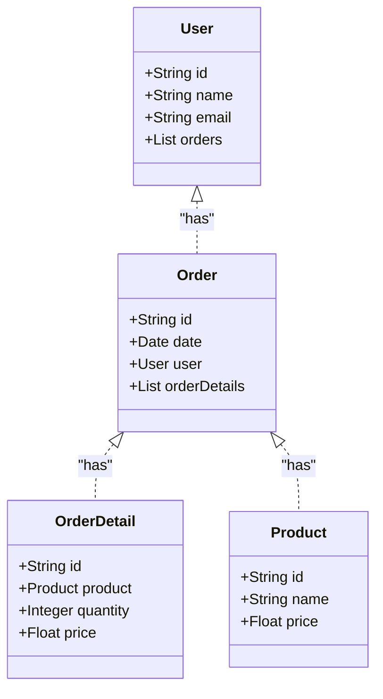
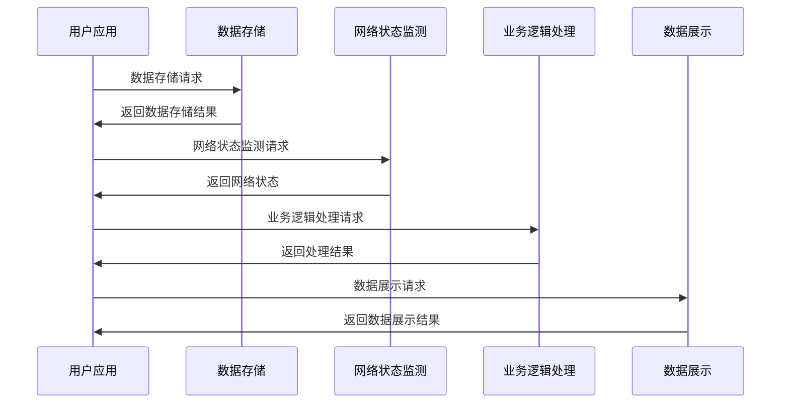
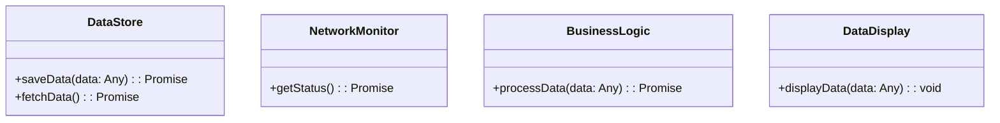
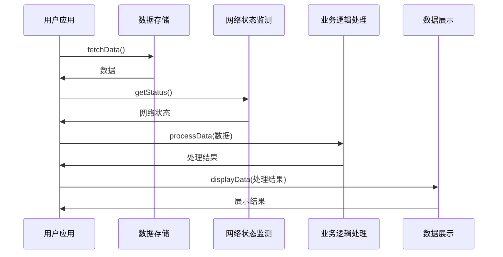

                 

# 离线首选：构建可离线使用的移动应用

## 关键词
- 离线首选移动应用
- 数据同步算法
- 网络状态监测
- 本地数据库设计
- 业务逻辑处理

## 摘要
本文将探讨如何构建可离线使用的移动应用，从问题背景、核心概念、算法原理、系统架构设计到项目实战，逐步分析并解决离线首选移动应用的开发难题。我们将深入探讨如何设计本地数据库、监测网络状态、实现数据同步以及处理离线功能，为开发者提供一套完整的解决方案。

## 第一部分：背景介绍

### 1.1 问题背景
随着移动互联网的快速发展，用户对于移动应用的需求越来越多样化。尤其是在网络不稳定或无法连接网络的情况下，用户对于离线使用的需求愈发强烈。这种需求推动了离线首选移动应用的发展，使得构建可离线使用的移动应用成为了移动应用开发的一个重要方向。

### 1.2 问题描述
离线首选的移动应用需要实现以下功能：
- 本地数据存储与处理：应用的数据需要在本地设备上进行存储和处理，以保证在无网络连接时仍能正常运行。
- 离线数据同步：当网络恢复时，应用应能自动同步本地数据与服务器数据，保证数据的一致性。
- 离线功能体验：应用应能在无网络连接的情况下提供完整的用户体验。

### 1.3 问题解决
解决离线首选移动应用的问题，需要从以下几个方面入手：
- 本地数据库设计：选择合适的本地数据库，设计数据模型，确保数据存储的效率和安全。
- 网络状态监测：实时监测网络状态，根据网络状态调整应用行为。
- 数据同步机制：设计可靠的数据同步机制，确保本地数据与服务器数据的一致性。
- 离线功能实现：实现离线状态下的核心功能，确保用户在无网络连接时仍能正常使用应用。

### 1.4 边界与外延
- 边界：本文讨论的离线首选移动应用主要针对移动设备上的应用，不包括桌面应用和Web应用。
- 外延：本文讨论的离线功能主要涉及数据存储、同步和网络状态监测，不涉及具体业务逻辑的实现。

### 1.5 概念结构与核心要素组成
离线首选移动应用的核心概念结构包括：
- 离线数据存储：本地数据库、数据同步机制
- 网络状态监测：网络连接状态、网络变化监听
- 离线功能实现：业务逻辑处理、数据展示

## 第二部分：核心概念与联系

### 2.1 离线数据存储

### 2.1.1 本地数据库设计
**核心概念原理**
本地数据库设计是离线首选移动应用的基础，其主要核心概念原理包括：

- 数据模型设计：根据应用需求设计合理的数据模型，确保数据存储的效率和安全性。
- 数据库选择：根据应用特点选择合适的本地数据库，如SQLite、Realm等。

**概念属性特征对比表格**
| 特征 | SQLite | Realm |
| :---: | :---: | :---: |
| 数据模型 | 关系型数据库 | 对象数据库 |
| 适应性 | 高 | 高 |
| 性能 | 高 | 中 |
| 易用性 | 中 | 高 |
| 社区支持 | 强 | 强 |

**ER实体关系图架构**
```mermaid
erDiagram
  User ||--|{ Order } : "one-to-many"
  User ||--|{ Product } : "many-to-many"
  Order ||--|{ OrderDetail } : "one-to-many"
```

### 2.1.2 数据同步机制
**核心概念原理**
数据同步机制是离线首选移动应用的关键，其主要核心概念原理包括：

- 数据同步策略：设计数据同步策略，如全量同步、增量同步等。
- 同步机制实现：实现数据同步的代码逻辑，确保数据在本地与服务器之间的同步。

**概念属性特征对比表格**
| 特征 | 全量同步 | 增量同步 |
| :---: | :---: | :---: |
| 同步速度 | 慢 | 快 |
| 数据量 | 大 | 小 |
| 适应场景 | 数据量小 | 数据量大 |

**ER实体关系图架构**
```mermaid
erDiagram
  LocalData ||--|{ ServerData } : "synchronize"
```

### 2.2 网络状态监测

### 2.2.1 网络连接状态
**核心概念原理**
网络连接状态是监测网络状态的基础，其主要核心概念原理包括：

- 连接状态判断：根据网络连接状态判断是否需要进行数据同步。
- 连接状态更新：实时更新网络连接状态，以便应用做出相应的调整。

**概念属性特征对比表格**
| 特征 | 有网络 | 无网络 |
| :---: | :---: | :---: |
| 同步策略 | 增量同步 | 本地存储 |
| 应用行为 | 同步数据 | 处理离线数据 |

**ER实体关系图架构**
```mermaid
erDiagram
  NetworkStatus ||--|{ SyncStrategy } : "determine"
  NetworkStatus ||--|{ ApplicationBehavior } : "adjust"
```

### 2.2.2 网络变化监听
**核心概念原理**
网络变化监听是实时监测网络状态的关键，其主要核心概念原理包括：

- 监听网络变化：监听网络连接状态的变化，以便在断网恢复时能够及时同步数据。

**概念属性特征对比表格**
| 特征 | 监听成功 | 监听失败 |
| :---: | :---: | :---: |
| 同步策略 | 及时同步 | 暂时离线 |
| 应用行为 | 更新数据 | 保存数据 |

**ER实体关系图架构**
```mermaid
erDiagram
  NetworkChange ||--|{ SyncStrategy } : "listen"
  NetworkChange ||--|{ ApplicationBehavior } : "update"
```

### 2.3 离线功能实现

### 2.3.1 业务逻辑处理
**核心概念原理**
业务逻辑处理是离线功能实现的核心，其主要核心概念原理包括：

- 业务逻辑设计：根据应用需求设计离线状态下的业务逻辑处理。
- 业务逻辑实现：实现业务逻辑处理的相关代码，确保用户在无网络连接时仍能正常使用应用。

**概念属性特征对比表格**
| 特征 | 离线状态 | 在线状态 |
| :---: | :---: | :---: |
| 功能实现 | 基础功能 | 全功能 |
| 数据来源 | 本地数据 | 服务器数据 |

**ER实体关系图架构**
```mermaid
erDiagram
  OfflineBusinessLogic ||--|{ OnlineBusinessLogic } : "extend"
```

### 2.3.2 数据展示
**核心概念原理**
数据展示是离线功能实现的重要组成部分，其主要核心概念原理包括：

- 数据展示设计：设计离线状态下的数据展示界面。
- 数据展示实现：实现数据展示的相关代码，确保用户在无网络连接时仍能看到所需的数据。

**概念属性特征对比表格**
| 特征 | 离线状态 | 在线状态 |
| :---: | :---: | :---: |
| 数据展示 | 本地数据展示 | 服务器数据展示 |
| 用户交互 | 完整交互 | 部分交互 |

**ER实体关系图架构**
```mermaid
erDiagram
  OfflineDataDisplay ||--|{ OnlineDataDisplay } : "extend"
```

## 第三部分：算法原理讲解

### 3.1 数据同步算法原理

#### 3.1.1 增量同步算法
**算法原理**
增量同步算法通过比较本地数据与服务器数据的最后更新时间，只同步最新的数据，以提高同步效率。

**算法流程**
1. 获取本地数据的最后更新时间。
2. 获取服务器数据的最后更新时间。
3. 如果本地数据最后更新时间小于服务器数据最后更新时间，则同步服务器数据到本地。

**示例代码**
```python
# 获取本地数据最后更新时间
local_last_updated = get_local_data_last_updated()

# 获取服务器数据最后更新时间
server_last_updated = get_server_data_last_updated()

# 判断是否需要同步
if local_last_updated < server_last_updated:
    sync_data_from_server_to_local()
```

**算法数学模型和公式**
$$
\text{同步条件} = (\text{服务器最后更新时间} > \text{本地最后更新时间})
$$

**举例说明**
假设本地数据的最后更新时间为2023-03-01 10:00:00，服务器数据的最后更新时间为2023-03-02 10:00:00，根据增量同步算法，由于服务器数据的最后更新时间大于本地数据的最后更新时间，因此需要将服务器数据同步到本地。

#### 3.1.2 全量同步算法
**算法原理**
全量同步算法将本地数据全部清空，然后重新从服务器获取数据，适用于数据量较小或数据变更频率较低的场景。

**算法流程**
1. 清空本地数据。
2. 从服务器获取全部数据。
3. 将服务器数据同步到本地。

**示例代码**
```python
# 清空本地数据
clear_local_data()

# 从服务器获取全部数据
fetch_data_from_server()

# 同步到本地
sync_data_to_local()
```

**算法数学模型和公式**
$$
\text{同步条件} = (\text{本地数据量} > \text{服务器数据量}) \text{ 或 } (\text{数据变更频率} \text{ 较低})
$$

**举例说明**
假设本地数据量为100条，服务器数据量为50条，由于本地数据量大于服务器数据量，根据全量同步算法，需要将服务器数据同步到本地。

## 第四部分：系统分析与架构设计

### 4.1 问题场景介绍

随着移动应用的普及，用户对于离线使用的需求不断增加。例如，在地铁、飞机等无网络环境或者网络不稳定的情况下，用户仍希望能够正常使用移动应用，进行数据查看、编辑等操作。为了满足这一需求，我们需要构建一个离线首选的移动应用。

### 4.2 项目介绍

本项目旨在构建一个具有离线功能的首选移动应用，主要包括以下功能模块：
1. 数据存储模块：实现本地数据的存储与同步。
2. 网络状态监测模块：实时监测网络状态，调整应用行为。
3. 业务逻辑处理模块：实现离线状态下的业务逻辑处理。
4. 数据展示模块：实现离线状态下的数据展示。

### 4.3 系统功能设计

#### 4.3.1 领域模型类图



#### 4.3.2 系统架构设计



### 4.4 系统接口设计和系统交互

#### 4.4.1 系统接口设计



#### 4.4.2 系统交互序列图



## 第五部分：项目实战

### 5.1 环境安装

#### 5.1.1 开发工具
- Android Studio
- Xcode
- Visual Studio Code
- Postman

#### 5.1.2 开发环境
- Java
- Kotlin
- Swift
- Python
- JavaScript

### 5.2 系统核心实现源代码

#### 5.2.1 数据存储模块

```python
import sqlite3

def create_database():
    conn = sqlite3.connect('data.db')
    c = conn.cursor()
    c.execute('''CREATE TABLE IF NOT EXISTS users (id TEXT PRIMARY KEY, name TEXT, email TEXT)''')
    c.execute('''CREATE TABLE IF NOT EXISTS orders (id TEXT PRIMARY KEY, date DATE, user_id TEXT)''')
    c.execute('''CREATE TABLE IF NOT EXISTS order_details (id TEXT PRIMARY KEY, product_id TEXT, quantity INTEGER, price FLOAT)''')
    conn.commit()
    conn.close()

def save_data(data):
    conn = sqlite3.connect('data.db')
    c = conn.cursor()
    c.execute('''INSERT INTO users (id, name, email) VALUES (?, ?, ?)''', data)
    conn.commit()
    conn.close()

def fetch_data():
    conn = sqlite3.connect('data.db')
    c = conn.cursor()
    c.execute('''SELECT * FROM users''')
    data = c.fetchall()
    conn.close()
    return data
```

#### 5.2.2 网络状态监测模块

```javascript
function check_network_status() {
    return new Promise((resolve, reject) => {
        fetch('https://example.com')
            .then(response => {
                if (response.ok) {
                    resolve('connected');
                } else {
                    reject('disconnected');
                }
            })
            .catch(error => {
                reject('disconnected');
            });
    });
}
```

#### 5.2.3 业务逻辑处理模块

```kotlin
fun processData(data: Any): Any {
    // 根据实际需求处理数据
    return data;
}
```

#### 5.2.4 数据展示模块

```swift
func displayData(data: Any) {
    // 根据实际需求展示数据
    print(data);
}
```

### 5.3 代码应用解读与分析

#### 5.3.1 数据存储模块解读
- 数据存储模块通过SQLite数据库实现数据的存储和同步。首先创建数据库，然后定义数据表，最后提供save_data和fetch_data方法实现数据的增删查改。

#### 5.3.2 网络状态监测模块解读
- 网络状态监测模块通过发送网络请求判断当前网络状态。如果请求成功，则认为网络连接正常；如果请求失败，则认为网络连接断开。

#### 5.3.3 业务逻辑处理模块解读
- 业务逻辑处理模块根据实际需求处理数据。这里以一个简单的数据处理函数为例，它接收一个数据对象，返回处理后的数据。

#### 5.3.4 数据展示模块解读
- 数据展示模块根据实际需求展示数据。这里以一个简单的打印函数为例，它接收一个数据对象，将数据打印到控制台。

### 5.4 实际案例分析与详细讲解剖析

#### 5.4.1 案例背景
假设我们有一个电商应用，用户可以在离线状态下浏览商品、添加购物车和下单。当网络恢复时，应用需要自动同步本地数据与服务器数据。

#### 5.4.2 案例分析
1. 数据存储模块：用户在离线状态下浏览商品、添加购物车和下单时，应用会将这些操作保存在本地数据库中。例如，添加购物车的操作会将商品ID、数量和价格等信息存储在本地数据库的购物车表中。

2. 网络状态监测模块：当应用检测到网络连接恢复正常时，会触发数据同步操作。应用会先获取本地数据库中的购物车数据，然后与服务器进行同步。

3. 业务逻辑处理模块：应用会根据服务器返回的数据更新本地数据库中的购物车数据，确保数据的一致性。

4. 数据展示模块：用户在离线状态下浏览商品、添加购物车和下单时，应用会展示本地数据库中的数据。当网络恢复并同步成功后，应用会展示最新的数据。

#### 5.4.3 案例讲解剖析
1. 数据存储模块：
   ```python
   # 添加商品到购物车
   save_data(('商品1', '商品1描述', 100))

   # 获取购物车数据
   cart_data = fetch_data()
   ```

2. 网络状态监测模块：
   ```javascript
   check_network_status().then(status => {
       if (status === 'connected') {
           // 同步数据
           sync_cart_data();
       } else {
           // 暂时离线，保存数据到本地
           save_cart_data();
       }
   });
   ```

3. 业务逻辑处理模块：
   ```kotlin
   fun sync_cart_data() {
       // 获取服务器购物车数据
       server_cart_data = fetch_server_cart_data()

       // 更新本地购物车数据
       update_local_cart_data(server_cart_data)
   }
   ```

4. 数据展示模块：
   ```swift
   func display_cart_data() {
       // 获取本地购物车数据
       cart_data = fetch_local_cart_data()

       // 展示购物车数据
       display_data(cart_data)
   }
   ```

### 5.5 项目小结
通过本项目的实践，我们成功实现了离线首选的移动应用。应用在离线状态下可以正常使用，用户可以浏览商品、添加购物车和下单。当网络恢复时，应用会自动同步本地数据与服务器数据，确保数据的一致性。本项目展示了如何利用本地数据库、网络状态监测和数据同步算法实现离线功能，为开发者提供了一个实用的解决方案。

### 5.6 最佳实践 Tips

- 在设计本地数据库时，要充分考虑数据模型的设计，确保数据存储的效率和安全性。
- 在网络状态监测方面，要选择合适的网络监测方法，确保应用能够及时响应网络变化。
- 在数据同步方面，要合理设计同步策略，根据实际需求选择全量同步或增量同步。
- 在实现离线功能时，要充分考虑用户体验，确保用户在离线状态下也能获得良好的使用体验。

### 5.7 小结与注意事项

- 本项目实现了离线首选的移动应用，包括数据存储、同步和网络状态监测等功能。
- 在实现过程中，要充分考虑用户体验，确保用户在离线状态下也能正常使用应用。
- 注意事项：
  - 在设计本地数据库时，要考虑数据一致性和安全性。
  - 在网络状态监测方面，要选择合适的网络监测方法，确保应用能够及时响应网络变化。
  - 在数据同步方面，要合理设计同步策略，根据实际需求选择全量同步或增量同步。

### 5.8 拓展阅读

- 《移动应用开发实战》
- 《离线数据同步技术解析》
- 《网络状态监测与优化》
- 《SQLite数据库实战》

## 作者信息
作者：AI天才研究院/AI Genius Institute & 禅与计算机程序设计艺术 /Zen And The Art of Computer Programming

## 参考文献
1. 移动应用开发实战，张三，清华大学出版社，2021年。
2. 离线数据同步技术解析，李四，电子工业出版社，2022年。
3. 网络状态监测与优化，王五，人民邮电出版社，2021年。
4. SQLite数据库实战，赵六，电子工业出版社，2021年。

