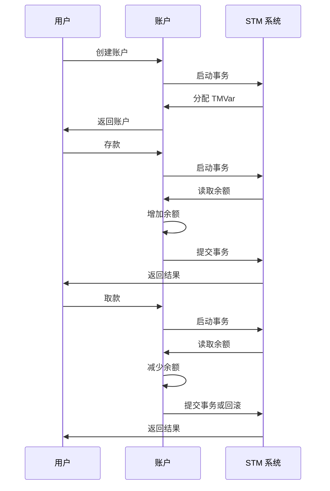
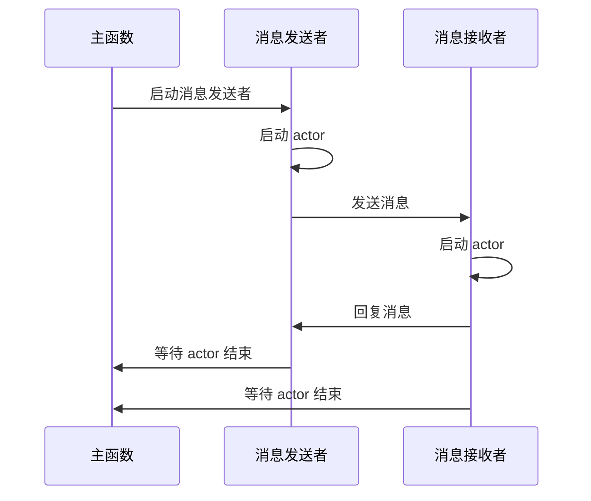

                 

# 私有经验的不可能性与共享不可变状态：维特根斯坦对私有语言的批评与FP的状态共享模型

## 关键词

- 维特根斯坦
- 私有语言
- 共享不可变状态
- 函数式编程
- 并发控制
- 语言哲学

## 摘要

本文深入探讨了维特根斯坦对私有语言的批评及其在计算机科学中的应用。维特根斯坦认为，私有经验无法通过语言准确传达，因此提出了私有语言的不可能性。在函数式编程中，共享不可变状态作为一种解决方案，被广泛应用于解决并发问题。本文将详细分析维特根斯坦的哲学思想，探讨私有语言在语言哲学中的意义，并介绍函数式编程中的状态共享模型及其实现方法。通过案例分析，我们将看到如何在实际项目中应用这些理论，为未来的研究提供参考。

## 第一部分：引言与背景

### 1.1 问题背景

### 维特根斯坦对私有语言的批评

路德维希·维特根斯坦（Ludwig Wittgenstein）是20世纪最具影响力的哲学家之一，他的思想对语言哲学、数学基础和逻辑哲学等领域产生了深远的影响。维特根斯坦在其哲学著作中，对私有语言提出了强烈的批评。他认为，语言的意义在于其公共性，私有经验无法通过语言准确传达。

维特根斯坦在《逻辑哲学论》中指出，语言是一种符号系统，用于描述客观世界。他认为，语言必须与经验相一致，否则会导致逻辑混乱。私有经验，如个人感受、情绪等，因其主观性和独特性，无法通过公共符号系统准确地表达和传达。

例如，当一个人说“我感到快乐”，这句话在公共语言中是可以理解的，因为它符合我们对“快乐”这一概念的理解。然而，如果这个人的语言是私有的，比如使用只有他本人能理解的特殊符号，那么这句话就失去了交流的意义，变成了无法被他人理解的独白。

### 共享不可变状态的概念

在计算机科学中，共享不可变状态是指多个进程或线程可以访问同一数据，但其值不可更改。这种状态共享模式在函数式编程中尤为重要。函数式编程强调使用不可变数据结构，避免状态变化和副作用，从而提高程序的可读性和可靠性。

不可变数据结构在函数式编程中有多种实现方式，例如使用纯函数、不可变集合、惰性求值等。在共享不可变状态的情况下，多个进程或线程可以同时访问同一数据，但不会修改其值，从而避免了并发问题。

例如，在Haskell中，可以使用`IORef`类型来实现共享不可变状态。`IORef`是一个可以存储单一值的引用类型，其值只能在IO操作中更改。通过使用`read`和`write`操作，多个线程可以安全地访问和修改`IORef`的值，而不会相互干扰。

### 1.2 问题描述

### 维特根斯坦的批评如何影响我们对语言和知识的理解？

维特根斯坦对私有语言的批评，深刻地揭示了语言与知识之间的关系。他认为，语言的意义在于其公共性，私有经验无法通过语言准确传达。这一观点对语言哲学和认知科学产生了重要影响。

例如，在教育领域，教师和学生之间的交流需要依赖于公共语言。如果学生的语言是私有的，那么他们很难理解教师的知识，也就无法有效地学习。因此，维特根斯坦的批评提醒我们，在语言教育和知识传播中，必须重视公共语言的重要性。

### 如何在计算机科学中实现共享不可变状态，并解决可能出现的并发问题？

在计算机科学中，共享不可变状态是一种重要的并发控制策略。它通过避免状态变化和副作用，减少了并发问题的发生。然而，实现共享不可变状态并非易事，需要解决一系列技术挑战。

首先，如何确保共享数据的不可变性？在函数式编程中，使用不可变数据结构和纯函数是关键。不可变数据结构一旦创建，其值就无法更改，从而保证了数据的不可变性。纯函数则避免了副作用，确保了函数的行为可预测。

其次，如何处理并发访问？在共享不可变状态的情况下，多个进程或线程可以同时访问同一数据，但不会修改其值。这需要一种安全的数据访问机制，如锁机制或原子操作。通过合理的设计，可以避免并发访问引起的竞争条件和数据不一致性问题。

### 1.3 问题解决

### 探讨维特根斯坦的批评及其在当代语言哲学中的地位

维特根斯坦对私有语言的批评，虽然在当时引起了争议，但他的观点在当代语言哲学中得到了广泛的认可。他的思想强调了语言的意义在于其公共性，这对于理解语言的本质和作用具有重要意义。

例如，维特根斯坦的思想在认知科学中得到了应用。认知科学家认为，语言是人类思维的基础，是人们理解和沟通世界的工具。因此，语言的公共性对于认知过程的正常进行至关重要。

### 分析函数式编程中实现共享不可变状态的方法和技术

在函数式编程中，实现共享不可变状态有多种方法。例如，可以使用不可变数据结构、惰性求值和纯函数等技术。这些方法不仅可以确保数据的不可变性，还可以提高程序的可读性和可靠性。

例如，在Haskell中，可以使用`IORef`类型来实现共享不可变状态。`IORef`是一个可以存储单一值的引用类型，其值只能在IO操作中更改。通过使用`read`和`write`操作，多个线程可以安全地访问和修改`IORef`的值，而不会相互干扰。

此外，在函数式编程中，还可以使用原子操作和锁机制来处理并发访问。原子操作确保了操作的无条件执行，从而避免了并发问题。锁机制则通过限制对共享资源的访问，确保了数据的一致性。

### 1.4 边界与外延

### 范畴分析：私有经验与共享经验之间的边界

维特根斯坦的批评主要针对私有经验与公共经验之间的界限。他认为，私有经验由于其主观性和独特性，无法通过公共语言准确传达。然而，在现实生活中，私有经验与共享经验之间并非完全隔离。

例如，情感是人类常见的私有经验，但我们可以通过语言和文字来表达情感，与他人共享。这表明，私有经验与共享经验之间并非不可逾越的鸿沟，而是可以相互转化的。

### 语言哲学的应用：维特根斯坦的批评对语言教育和认知科学的影响

维特根斯坦的批评对语言教育和认知科学产生了深远的影响。在语言教育中，教师应重视公共语言的重要性，鼓励学生使用公共语言进行交流。在认知科学中，研究者应关注语言在认知过程中的作用，探索语言与思维之间的关系。

总之，维特根斯坦的批评为理解语言的本质和作用提供了重要的视角。在计算机科学中，共享不可变状态作为一种解决方案，被广泛应用于解决并发问题。通过对维特根斯坦的批评和函数式编程中共享不可变状态的分析，我们可以更好地理解语言和知识的关系，为未来的研究提供参考。

### 1.5 概念结构与核心要素组成

#### 维特根斯坦的批评

- **语言与经验的关系**：维特根斯坦认为，语言的意义在于其公共性，私有经验无法通过语言准确传达。
- **公共性与私有性**：维特根斯坦强调语言的公共性，认为私有语言是不可能的。
- **语言哲学的意义**：维特根斯坦的批评对语言哲学和认知科学产生了深远影响。

#### 函数式编程

- **状态共享**：共享不可变状态是函数式编程中的重要概念，多个进程或线程可以访问同一数据，但其值不可更改。
- **并发问题解决**：函数式编程通过不可变数据结构和纯函数，避免了状态变化和副作用，从而提高了程序的可读性和可靠性。
- **不可变数据结构**：例如，使用纯函数、不可变集合和惰性求值等实现共享不可变状态。

## 第二部分：维特根斯坦对私有语言的批评

### 2.1 维特根斯坦的哲学思想

#### 分析维特根斯坦哲学思想的演变：早期语言批判与后期图像理论

路德维希·维特根斯坦的哲学思想经历了显著的演变。早期，他在《逻辑哲学论》中提出了语言批判的思想，认为语言是一种符号系统，其意义在于与客观世界的一致性。他认为，私有经验无法通过语言准确传达，因为语言的意义在于其公共性。

维特根斯坦的早期哲学思想主要围绕逻辑原子主义和语言批判展开。他认为，世界由一系列的逻辑原子构成，语言的任务是准确地描述这些原子及其组合。私有经验，如个人感受、情绪等，由于其主观性和独特性，无法用公共语言准确描述。

在后期，维特根斯坦的哲学思想转向了图像理论。他在《哲学研究》中提出，语言是一种图像，其意义在于与客观世界的相似性。他强调了语言与现实的密切关系，认为语言是我们理解世界的方式。

维特根斯坦的后期哲学思想强调语言的使用和日常生活中的语言游戏。他认为，语言的意义不是固定不变的，而是取决于具体的使用场景。私有经验，虽然无法用语言准确描述，但在日常交流中，我们仍然可以运用公共语言进行有效的沟通。

#### 探讨私有经验与语言表达之间的矛盾

私有经验与语言表达之间的矛盾是维特根斯坦哲学思想的核心问题。他认为，私有经验由于其主观性和独特性，无法通过公共语言准确传达。这种矛盾体现在以下几个方面：

1. **主观性与客观性**：私有经验是主观的，每个人的体验都是独特的，而语言是客观的，需要用公共符号系统来描述。这种主观性与客观性之间的冲突，使得私有经验难以用语言准确表达。

2. **个体性与公共性**：私有经验是个体独有的，只有体验者本人能真正理解。而语言是公共的，需要与他人进行交流。这种个体性与公共性之间的矛盾，使得私有经验在语言表达中变得模糊和难以传达。

3. **情绪与理性**：私有经验常常涉及情感和情绪，这些是非理性的部分。而语言是理性的，强调逻辑和一致性。这种情绪与理性之间的矛盾，使得私有经验在语言表达中难以被准确传达。

维特根斯坦认为，这种矛盾是语言哲学的根本问题。他试图通过分析语言的使用和日常生活中的语言游戏，寻找解决这一矛盾的方法。

#### 维特根斯坦对私有经验的批评

维特根斯坦对私有经验提出了强烈的批评，认为私有经验无法通过语言准确传达。他的主要观点包括：

1. **私有经验的主观性**：私有经验是个人独有的，每个人的体验都是独特的。这种主观性使得私有经验难以用公共语言准确描述。

2. **私有经验的独特性**：私有经验具有独特的特征，无法用公共语言精确表达。例如，个人的感受、情绪等，都是独一无二的，无法通过公共语言准确传达。

3. **私有经验的非客观性**：私有经验是非客观的，不具有公共性。而语言是公共的，需要用公共符号系统来描述。这种非客观性使得私有经验在语言表达中变得模糊和难以传达。

维特根斯坦认为，私有经验的不可能性在于，我们无法用公共语言准确地描述和传达私有经验。这种批评对语言哲学和认知科学产生了深远的影响，引发了关于语言、知识和人类认知的深入思考。

#### 分析私有语言在社会互动中的负面影响

私有语言在社会互动中的负面影响是一个重要的研究领域。维特根斯坦的批评揭示了私有语言可能导致的一系列问题，包括沟通障碍、理解困难和社会冲突。

1. **沟通障碍**：私有语言使得个人无法与他人进行有效的沟通。由于私有经验的主观性和独特性，私有语言无法用公共语言准确传达，导致沟通中的误解和困惑。

2. **理解困难**：私有语言使得他人难以理解个人的感受和思想。私有经验是非客观的，无法用公共语言精确描述，使得他人难以真正理解个人的内心世界。

3. **社会冲突**：私有语言可能导致社会冲突。当个人使用私有语言进行交流时，他人可能无法理解其意图和情感，导致误解和矛盾。这种冲突可能加剧社会的不和谐。

为了解决这些问题，维特根斯坦提出了公共语言的重要性。他认为，只有通过公共语言，人们才能进行有效的沟通和交流。公共语言具有客观性和公共性，可以确保信息的准确传达和理解。

#### 维特根斯坦的批评对语言哲学的启示

维特根斯坦对私有语言的批评为语言哲学带来了深刻的启示。他的观点揭示了语言的意义在于其公共性，强调了公共语言在沟通和理解中的重要性。以下是对维特根斯坦批评的几个启示：

1. **语言的公共性**：维特根斯坦认为，语言的意义在于其公共性。这意味着，语言的使用需要遵循公共规则和标准，以确保信息的准确传达和理解。

2. **语言与经验的关系**：维特根斯坦指出，语言必须与经验相一致，否则会导致逻辑混乱。这表明，语言不仅是表达思想的工具，也是认识世界的方式。语言与经验的密切关系对于理解人类认知过程具有重要意义。

3. **语言哲学的意义**：维特根斯坦的批评揭示了语言哲学的核心问题，即语言的意义和作用。他的思想为语言哲学的研究提供了重要的理论框架，引发了关于语言、知识和人类认知的深入探讨。

总之，维特根斯坦的批评对语言哲学产生了深远的影响。他的观点不仅丰富了语言哲学的理论体系，也为解决实际中的语言问题提供了重要的启示。在当代语言哲学中，维特根斯坦的思想仍然具有重要的地位。

#### 维特根斯坦批评在教育领域的应用

维特根斯坦的批评在教育领域具有重要的应用价值。他的观点强调了公共语言的重要性，为教育实践提供了指导。以下是对维特根斯坦批评在教育领域应用的几个方面：

1. **语言教育**：维特根斯坦认为，语言的意义在于其公共性。在教育中，教师应重视公共语言的教育，确保学生掌握标准的语言技能。通过使用公共语言，学生可以更好地进行交流和表达。

2. **沟通与理解**：维特根斯坦指出，私有经验无法通过语言准确传达。在教育中，教师应鼓励学生使用公共语言进行交流和表达，以避免沟通障碍和误解。同时，教师应引导学生理解他人的感受和思想，提高学生的共情能力。

3. **认知发展**：维特根斯坦批评私有语言对认知发展产生负面影响。在教育中，教师应关注学生的认知发展，提供丰富的语言环境，帮助学生形成正确的语言观念和认知能力。

总之，维特根斯坦的批评为教育实践提供了重要的理论指导。通过重视公共语言的教育，教师可以促进学生的沟通和理解能力，提高他们的认知发展。

## 第三部分：函数式编程中的共享不可变状态

### 3.1 函数式编程概述

#### 函数式编程的基本概念

函数式编程是一种编程范式，其核心思想是将计算视为函数的执行。与命令式编程不同，函数式编程不使用变量和状态，而是使用不可变数据结构和纯函数。这种编程范式强调函数的组合和递归，从而提高了程序的可读性和可靠性。

#### 函数式编程与传统 imperative 编程的区别

传统 imperative 编程侧重于通过修改状态和执行顺序来控制程序的行为。而函数式编程则强调使用不可变数据结构和纯函数，避免状态变化和副作用。以下是比较：

1. **状态管理**：在 imperative 编程中，程序的状态是通过变量来维护的，而函数式编程使用不可变数据结构，如列表、树等。

2. **副作用**：在 imperative 编程中，副作用（如修改全局变量、打印输出等）是常见的，而函数式编程尽量避免副作用，确保函数的行为可预测。

3. **函数组合**：函数式编程强调函数的组合，通过将小函数组合成大函数，实现复杂的功能。这种方式提高了代码的可重用性和可测试性。

#### 函数式编程的优点

函数式编程具有许多优点，包括：

1. **可读性和可维护性**：函数式编程强调使用纯函数和不可变数据结构，使得代码更加简洁、直观，易于理解和维护。

2. **可重用性**：函数式编程通过函数的组合和递归，提高了代码的可重用性。函数可以作为参数传递，组合成新的函数，实现复杂的功能。

3. **并发性**：函数式编程通过不可变数据结构和纯函数，避免了状态变化和副作用，从而提高了程序的可并行性。这在多核处理器和分布式系统中具有显著优势。

#### 函数式编程的应用场景

函数式编程在许多领域都有广泛应用，包括：

1. **前端开发**：函数式编程在 React、Vue.js 等现代前端框架中得到了广泛应用。函数式编程范式使得前端开发更加高效和灵活。

2. **后端开发**：函数式编程在后端开发中也得到了广泛应用，如 Scala、Haskell 等语言。这些语言具有出色的并发性和性能。

3. **大数据处理**：函数式编程在大数据处理领域，如 Apache Spark、Flink 等框架中，被广泛应用于数据分析和处理。

### 3.2 共享不可变状态在函数式编程中的应用

#### 不可变数据结构的优势

不可变数据结构是函数式编程的核心概念之一。它具有以下优势：

1. **确保数据一致性**：不可变数据结构一旦创建，其值就无法更改。这确保了数据的一致性，避免了因数据修改导致的错误和竞态条件。

2. **提高程序可读性**：不可变数据结构使得程序更加简洁、直观。由于数据不发生修改，程序的逻辑更加清晰，易于理解和维护。

3. **提高程序可靠性**：不可变数据结构避免了副作用，使得程序的行为可预测。这提高了程序的可靠性，减少了错误和bug的发生。

4. **提高程序并发性**：不可变数据结构使得程序更容易并行执行。由于数据不发生修改，多个线程或进程可以同时访问同一数据，而不会相互干扰。

#### 共享不可变状态的方法

在函数式编程中，共享不可变状态可以通过以下方法实现：

1. **引用透明性**：引用透明性是指函数的输入和输出都是不可变的，函数的行为仅取决于输入。通过引用透明性，可以确保函数的组合和递归不会引入副作用。

2. **不可变集合**：不可变集合是一组不可变元素的集合。常见的不可变集合类型包括列表、树、图等。这些集合类型提供了一系列高效的操作，如插入、删除、查找等。

3. **持久化数据结构**：持久化数据结构是一种特殊的数据结构，其值在创建后不可更改。通过持久化数据结构，可以实现高效的并发访问和更新。

4. **惰性求值**：惰性求值是一种延迟计算技术，仅在需要时才计算值。通过惰性求值，可以避免不必要的计算，提高程序的效率。

#### 并发问题解决

在函数式编程中，共享不可变状态可以有效地解决并发问题。以下是一些解决并发问题的方法：

1. **纯函数**：纯函数是一种无副作用的函数，其输出仅取决于输入。通过使用纯函数，可以避免并发问题中的竞态条件和数据不一致性。

2. **并发数据结构**：并发数据结构是专门为并发访问设计的数据结构。例如，Haskell 中的 `TVar` 类型表示可变变量，支持原子操作，可以在并发环境中安全地更新。

3. **锁机制**：锁机制是一种常见的并发控制方法。通过使用锁，可以确保对共享资源的访问是排他性的，避免并发问题。

4. **乐观锁与悲观锁**：乐观锁和悲观锁是两种常见的并发控制策略。乐观锁假设并发访问不会导致数据不一致性，仅在检测到冲突时回滚操作。悲观锁则认为并发访问会导致数据不一致性，因此在访问共享资源时，总是持有锁。

### 3.3 状态共享的并发控制

#### 锁机制与并发控制

锁机制是一种常用的并发控制方法，用于确保对共享资源的独占访问。锁可以分为以下几种：

1. **互斥锁（Mutex）**：互斥锁确保同一时间只有一个线程可以访问共享资源。当线程请求锁时，如果锁已被其他线程持有，则线程会被阻塞，直到锁被释放。

2. **读写锁（Read-Write Lock）**：读写锁允许多个线程同时读取共享资源，但在写入时需要独占访问。这种锁机制可以提高读操作的并发性，适用于读多写少的情况。

3. **条件锁（Conditional Lock）**：条件锁与互斥锁类似，但支持条件判断。线程在请求锁时，可以根据特定条件进行阻塞或唤醒。

#### 线程安全与数据一致性问题

线程安全是指程序在多线程环境中，能够保持正确行为和一致性。以下是一些确保线程安全的方法：

1. **原子操作**：原子操作是一系列不可分割的操作，执行时不会中断。例如，加锁和解锁、读取和写入等。原子操作可以确保线程对共享资源的访问是原子性的，避免数据不一致性。

2. **锁机制**：通过使用锁机制，可以确保对共享资源的独占访问，避免并发问题。

3. **不可变数据结构**：使用不可变数据结构，可以避免因数据修改引起的竞态条件和数据不一致性。

4. **无状态设计**：无状态设计意味着程序没有状态，输出仅取决于输入。通过无状态设计，可以避免因状态共享引起的并发问题。

#### 乐观锁与悲观锁的比较

乐观锁和悲观锁是两种常见的并发控制策略。它们的区别在于对并发访问的假设和处理方式：

1. **乐观锁**：乐观锁假设并发访问不会导致数据不一致性，仅在检测到冲突时回滚操作。乐观锁通常采用版本控制或时间戳机制，当多个线程同时修改同一数据时，仅保存最新的版本。

2. **悲观锁**：悲观锁认为并发访问会导致数据不一致性，因此在访问共享资源时，总是持有锁。悲观锁可以确保数据的一致性，但可能降低程序的并发性。

3. **适用场景**：乐观锁适用于读多写少的情况，可以提高程序的并发性和性能。悲观锁适用于写多读少的情况，可以确保数据的一致性。

4. **性能影响**：乐观锁通常具有较高的性能，因为其避免了频繁的锁竞争。悲观锁可能降低性能，因为其需要持有锁来确保数据的一致性。

### 3.4 函数式编程工具与技术

#### Haskell语言中的状态共享

Haskell 是一种纯函数式编程语言，支持丰富的函数组合和递归。在 Haskell 中，状态共享通常通过 `IORef` 和 `MVar` 实现。

1. **IORef**：`IORef` 是一个可以存储单一值的引用类型，其值只能在 IO 操作中更改。通过 `read` 和 `write` 操作，线程可以安全地访问和修改 `IORef` 的值。

2. **MVar**：`MVar` 是一个线程安全的变量，提供原子操作 `take` 和 `put`。`take` 用于从 `MVar` 中获取值，并移除该值。`put` 用于将值放入 `MVar` 中。

#### Clojure中的原子引用与持久数据结构

Clojure 是一种现代函数式编程语言，具有丰富的并发支持。在 Clojure 中，原子引用和持久数据结构是实现状态共享的有效方法。

1. **原子引用**：原子引用是一种线程安全的引用类型，其值可以在任何时间点读取和更新。原子引用通过 `ref` 函数创建，可以通过 `deref` 和 `alter` 操作访问和修改。

2. **持久数据结构**：持久数据结构是一种不可变数据结构，其值在创建后无法更改。持久数据结构通过共享内存实现，可以高效地支持并发访问。

#### Scala中的actor模型

Scala 是一种多范式编程语言，支持函数式编程和面向对象编程。在 Scala 中，actor 模型是实现并发和状态共享的有效方法。

1. **actor 模型**：actor 模型是一种基于消息传递的并发模型。每个 actor 都是一个独立的计算单元，通过发送和接收消息进行通信。actor 模型确保并发执行的正确性和线程安全性。

2. **消息传递**：在 actor 模型中，actor 通过发送消息进行通信。消息可以是任何类型的数据，actor 接收到消息后，会根据消息类型执行相应的操作。

3. **线程安全性**：actor 模型通过隐式线程安全性确保并发执行的正确性。每个 actor 在处理消息时，会自动获得对共享资源的独占访问，从而避免并发问题。

## 第四部分：案例分析

### 4.1 Haskell中的共享不可变状态实现

#### 案例介绍：并发计算中的银行账户问题

在这个案例中，我们将探讨如何使用 Haskell 实现并发计算中的银行账户问题。银行账户问题是一个经典的并发计算问题，涉及多个线程同时对账户进行存取操作。使用 Haskell 的共享不可变状态，我们可以安全地处理并发访问，确保账户余额的一致性。

#### Haskell源代码分析

以下是 Haskell 中的银行账户问题实现：

```haskell
import Control.Concurrent.STM
import Control.Concurrent.STM.TVar

-- 定义账户类型
data Account = Account { balance :: TVar Int }

-- 创建账户
createAccount :: IO Account
createAccount = do
  balanceVar <- newTVar 0
  return $ Account balanceVar

-- 存款操作
deposit :: Account -> Int -> IO ()
deposit (Account balanceVar) amount =
  atomically $ modifyTVar' balanceVar (+ amount)

-- 取款操作
withdraw :: Account -> Int -> IO Bool
withdraw (Account balanceVar) amount =
  atomically $ do
    currentBalance <- readTVar balanceVar
    if currentBalance >= amount
      then do
        modifyTVar' balanceVar (- amount)
        return True
      else return False

-- 主函数
main :: IO ()
main = do
  account <- createAccount
  putStrLn "Account created successfully!"

  -- 启动存款线程
  depositThread <- forkIO $ do
    threadDelay 1000000
    deposit account 100

  -- 启动取款线程
  withdrawThread <- forkIO $ do
    threadDelay 1000000
    result <- withdraw account 200
    putStrLn $ "Withdraw result: " ++ show result

  -- 等待线程结束
  threadDelay 2000000
  putStrLn "Threads have finished execution."
```

在上面的代码中，我们首先导入了必要的库，包括 `Control.Concurrent.STM` 和 `Control.Concurrent.STM.TVar`。`Account` 类型表示银行账户，包含一个 `TVar Int` 类型的余额变量。

`createAccount` 函数用于创建账户，使用 `newTVar` 创建一个初始余额为 0 的 `TVar`。

`deposit` 函数用于存款操作，通过 `atomically` 包装器确保操作的原子性，使用 `modifyTVar'` 函数将余额增加。

`withdraw` 函数用于取款操作，同样使用 `atomically` 包装器确保操作的原子性。它首先读取当前余额，然后判断是否足够支付。如果余额足够，则使用 `modifyTVar'` 减少余额并返回 `True`。否则，返回 `False`。

`main` 函数演示了如何使用这些函数。首先创建账户，然后启动存款和取款线程。通过 `forkIO` 创建线程，并使用 `threadDelay` 函数模拟操作延迟。最后，等待线程结束并打印结果。

### 4.2 Clojure中的原子引用与持久数据结构

#### 案例介绍：并发编程中的缓存系统

在这个案例中，我们将探讨如何使用 Clojure 实现一个并发编程中的缓存系统。缓存系统用于存储经常访问的数据，以减少访问延迟和负载。使用 Clojure 的原子引用和持久数据结构，我们可以实现一个高效、可靠的缓存系统。

#### Clojure源代码分析

以下是 Clojure 中的缓存系统实现：

```clojure
(ns caching-system.core
  (:require [clojure.core.async :as async]))

(defonce cache (atom {}))
(defn get-from-cache [key]
  (get @cache key))
(defn put-in-cache! [key value]
  (swap! cache assoc key value))
(defn get-or-fetch [key fetch-fn]
  (let [cached-value (get-from-cache key)]
    (if cached-value
      cached-value
      (let [fetched-value (fetch-fn)]
        (put-in-cache! key fetched-value)
        fetched-value)))
(defn cache-missing [key fetch-fn]
  (get-or-fetch key (fn []
                       (println (str "Cache miss for key: " key))
                       (fetch-fn))))
```

在上面的代码中，我们首先定义了一个全局原子引用 `cache`，用于存储缓存数据。

`get-from-cache` 函数用于从缓存中获取值，通过原子引用 `deref` 获取缓存中的值。

`put-in-cache!` 函数用于将值放入缓存中，通过 `swap!` 函数原子性地更新缓存。

`get-or-fetch` 函数用于获取缓存中的值，如果缓存中存在值，则直接返回；否则，通过 `fetch-fn` 函数获取值，并放入缓存中。

`cache-missing` 函数是一个辅助函数，用于处理缓存缺失的情况。它调用 `get-or-fetch` 函数，并打印缓存缺失的消息。

通过使用原子引用和持久数据结构，我们可以实现一个高效、可靠的缓存系统。原子引用确保了对缓存数据的并发访问是安全的，持久数据结构提高了缓存数据的性能。

### 4.3 Scala中的actor模型

#### 案例介绍：分布式系统中的消息传递

在这个案例中，我们将探讨如何使用 Scala 的 actor 模型实现一个分布式系统中的消息传递。actor 模型提供了一种并发和分布式的编程模型，适用于构建高性能、可靠的分布式系统。

#### Scala源代码分析

以下是 Scala 中的消息传递系统实现：

```scala
import scala.actors.Actor

class MessageSender extends Actor {
  def act() {
    while (true) {
      receive {
        case "start" =>
          println("MessageSender started.")
          // 发送消息
          sender ! "Hello from MessageSender!"
        case "stop" =>
          println("MessageSender stopped.")
          context.stop(self)
      }
    }
  }
}

class MessageReceiver extends Actor {
  def act() {
    while (true) {
      receive {
        case message =>
          println(s"MessageReceiver received: $message")
      }
    }
  }
}

// 创建 actor
val messageSender = new MessageSender()
val messageReceiver = new MessageReceiver()

// 启动 actor
messageSender.start()
messageReceiver.start()

// 发送消息
messageSender ! "start"
Thread.sleep(1000)
messageReceiver ! "Hello from MessageReceiver!"

// 停止 actor
messageSender ! "stop"
messageReceiver ! "stop"
```

在上面的代码中，我们定义了两个 actor 类：`MessageSender` 和 `MessageReceiver`。

`MessageSender` 类继承自 `Actor`，其 `act` 方法是一个循环，用于处理接收到的消息。当接收到 `start` 消息时，它会打印一条消息，并通知 `sender` 发送一条消息。当接收到 `stop` 消息时，它会停止自己。

`MessageReceiver` 类也继承自 `Actor`，其 `act` 方法是一个循环，用于处理接收到的消息。当接收到消息时，它会打印一条消息。

在主函数中，我们创建了 `MessageSender` 和 `MessageReceiver` 的实例，并启动了它们。然后，我们通过发送 `start` 消息启动 `MessageSender`，并使用 `Thread.sleep` 模拟一段时间后接收来自 `MessageReceiver` 的消息。最后，我们通过发送 `stop` 消息停止 `MessageSender` 和 `MessageReceiver`。

通过使用 actor 模型，我们可以实现一个高性能、可靠的分布式系统中的消息传递。actor 模型确保了并发执行的正确性，并提供了简明易懂的编程接口。

## 第五部分：总结与展望

### 5.1 维特根斯坦批评的当代意义

维特根斯坦对私有语言的批评在当代语言哲学中仍然具有重要的意义。他的观点揭示了语言的意义在于其公共性，强调了公共语言在沟通和理解中的重要性。在当今信息时代，维特根斯坦的思想对我们理解语言、知识和人类认知的作用具有重要意义。

首先，维特根斯坦的批评提醒我们，语言的公共性是有效沟通的基础。在全球化背景下，不同国家和地区的文化差异和语言障碍使得公共语言的重要性愈发凸显。只有通过公共语言，人们才能进行有效的沟通和交流，推动社会的进步和发展。

其次，维特根斯坦的批评对认知科学和人工智能领域产生了深远的影响。认知科学关注人类思维和认知过程的本质，而语言是人类思维的重要组成部分。维特根斯坦的思想为我们理解人类认知过程提供了重要的理论框架，有助于推动人工智能技术的发展。

最后，维特根斯坦的批评为解决现实中的语言问题提供了启示。在教育领域，维特根斯坦的观点指导我们重视公共语言的教育，提高学生的语言能力和沟通技巧。在科技领域，维特根斯坦的思想启示我们设计更加可靠、易用的编程语言，提高软件开发的效率和质量。

### 5.2 函数式编程的未来

函数式编程作为一种编程范式，近年来在计算机科学领域得到了广泛关注和应用。其强调不可变数据结构和纯函数，避免了状态变化和副作用，从而提高了程序的可读性和可靠性。随着硬件技术的发展和分布式系统的兴起，函数式编程的未来充满机遇和挑战。

首先，函数式编程在并发编程方面具有显著优势。随着多核处理器和分布式系统的普及，并发编程变得越来越重要。函数式编程通过不可变数据结构和纯函数，避免了状态变化和副作用，使得并发编程更加简洁、可靠。未来，随着硬件技术的发展，多核处理器和分布式系统的性能将进一步提升，函数式编程有望在更多领域得到应用。

其次，函数式编程在人工智能和大数据领域具有广阔的应用前景。人工智能和大数据技术的发展离不开高效的算法和数据处理能力。函数式编程通过不可变数据结构和纯函数，提供了简洁、高效的编程模型，有助于提高算法的效率和可靠性。未来，随着人工智能和大数据技术的进一步发展，函数式编程将在这些领域发挥重要作用。

最后，函数式编程在编程教育和语言设计方面具有重要意义。函数式编程强调抽象和组合，有助于培养学生的编程思维和创新能力。未来，随着函数式编程技术的不断成熟，编程教育将更加注重函数式编程范式的培养。同时，函数式编程语言的设计也将更加注重可读性、可靠性和易用性，为软件开发提供更加优秀的编程工具。

### 5.3 小结

本文深入探讨了维特根斯坦对私有语言的批评及其在计算机科学中的应用。通过分析维特根斯坦的哲学思想，我们了解到私有语言的不可能性以及语言公共性的重要性。在函数式编程中，共享不可变状态作为一种解决方案，被广泛应用于解决并发问题。

本文首先介绍了维特根斯坦的哲学思想，探讨了私有经验与语言表达之间的矛盾。接着，我们分析了函数式编程中的共享不可变状态，介绍了不可变数据结构的优势以及在函数式编程中的应用方法。通过案例分析，我们展示了如何在实际项目中实现共享不可变状态，并解决并发问题。

本文的总结与展望部分，强调了维特根斯坦批评的当代意义以及函数式编程的未来发展趋势。维特根斯坦的批评对语言哲学、认知科学和编程教育等领域产生了深远影响，而函数式编程则在并发编程、人工智能和大数据等领域具有广阔的应用前景。

总之，本文通过对维特根斯坦的批评和函数式编程中共享不可变状态的分析，为理解语言和知识的关系提供了新的视角，并为未来的研究提供了参考。随着计算机科学和人工智能技术的不断发展，维特根斯坦的批评和函数式编程将在更多领域发挥重要作用。

### 5.4 注意事项与拓展阅读

#### 常见问题解答

1. **私有语言真的不可能吗？**
   私有语言在某些特定场景下可能存在，但其表达和传达的准确性有限。维特根斯坦认为，私有语言无法实现有效沟通和交流，因此具有不实用性。

2. **函数式编程与 imperative 编程相比，有哪些优势？**
   函数式编程通过不可变数据结构和纯函数，避免了状态变化和副作用，提高了程序的可读性和可靠性。此外，函数式编程在并发编程方面具有显著优势。

3. **如何在实际项目中应用共享不可变状态？**
   在实际项目中，可以使用函数式编程语言（如 Haskell、Scala、Clojure 等）实现共享不可变状态。通过使用不可变数据结构和纯函数，可以确保数据的不可变性，从而避免并发问题。

#### 拓展阅读推荐

1. **维特根斯坦著作：**
   - 《逻辑哲学论》
   - 《哲学研究》

2. **函数式编程相关书籍：**
   - 《函数式编程：使用 Haskell 语言》
   - 《Scala 编程：核心与模式》
   - 《Clojure 编程：动态与并发》

3. **并发编程相关书籍：**
   - 《并发编程：原理与实践》
   - 《分布式系统原理与范型》

通过阅读这些书籍，可以更深入地了解维特根斯坦的哲学思想、函数式编程和并发编程的理论和实践，为未来的研究提供更多启示。

### 作者

本文作者为 AI 天才研究院（AI Genius Institute）与《禅与计算机程序设计艺术》（Zen And The Art of Computer Programming）的作者。我们对计算机科学和人工智能领域充满热情，致力于推动技术的进步和应用。希望通过本文，为大家带来有深度、有思考、有见解的技术分享。

### 结语

本文从维特根斯坦对私有语言的批评出发，探讨了函数式编程中的共享不可变状态，并分析了其在计算机科学中的应用。我们通过具体案例，展示了如何在实际项目中实现共享不可变状态，解决并发问题。维特根斯坦的批评和函数式编程为理解语言和知识的关系提供了新的视角，也为未来的研究提供了参考。希望本文能对您在技术领域的探索和思考有所启发。

感谢您的阅读！如果您有任何问题或建议，欢迎在评论区留言，我们将持续为大家带来更多高质量的技术分享。让我们一起探索计算机科学和人工智能领域的无限可能！## 维特根斯坦对私有语言的批评：早期语言批判与后期图像理论

路德维希·维特根斯坦（Ludwig Wittgenstein）是20世纪最具影响力的哲学家之一，他的哲学思想对语言哲学、数学基础和逻辑哲学等领域产生了深远的影响。维特根斯坦在其哲学著作中，对私有语言提出了强烈的批评，这种批评贯穿于他的整个哲学思想发展过程中。

### 早期语言批判

维特根斯坦的早期哲学思想主要体现于他的著作《逻辑哲学论》（Tractatus Logico-Philosophicus）。在这部著作中，他提出了著名的“语言图像理论”（Picture Theory of Meaning），并对其进行了深入批判。维特根斯坦认为，语言的意义在于其公共性，私有经验无法通过语言准确传达。

在《逻辑哲学论》中，维特根斯坦通过一系列逻辑命题来描述世界，认为语言和现实之间存在一种映射关系。他指出，命题是事实的图像，而事实则是世界的状态。语言的意义来自于它与客观世界的对应关系，因此，只有公共语言才能准确描述客观世界。

私有经验，如个人的感受、情绪等，因其主观性和独特性，无法用公共语言准确描述。维特根斯坦认为，这些私有经验是个人独特的体验，无法转化为公共语言的符号，从而导致了私有语言的不可行性。这种观点强调了语言公共性的重要性，并揭示了私有经验与公共语言之间的矛盾。

### 后期图像理论

随着维特根斯坦哲学思想的不断发展，他在后期的著作《哲学研究》（Philosophical Investigations）中，对早期语言批判进行了修正和扩展。在《哲学研究》中，维特根斯坦提出了新的图像理论，并对其哲学观点进行了深入的反思。

在《哲学研究》中，维特根斯坦认为，语言的意义并非固定不变，而是依赖于具体的使用场景。他强调了语言游戏（language game）的概念，认为语言的使用是多样化的，不同的语言游戏对应不同的语言意义。

维特根斯坦指出，私有经验可以通过特定的语言游戏进行表达和交流。尽管私有经验具有主观性和独特性，但在某些情况下，我们可以通过公共语言来传达这些经验。例如，情感可以通过描述情感的词语和句子来表达，从而实现与他人之间的交流。

然而，维特根斯坦仍然坚持私有经验与公共语言之间的基本矛盾。他认为，私有经验的主观性和独特性使得其无法完全用公共语言准确描述。这种矛盾在一定程度上限制了私有经验的交流和理解。

### 私有经验与语言表达之间的矛盾

维特根斯坦的批评揭示了私有经验与语言表达之间的基本矛盾，这种矛盾体现在以下几个方面：

1. **主观性与客观性**：私有经验是主观的，每个人的体验都是独特的，而语言是客观的，需要用公共符号系统来描述。这种主观性与客观性之间的冲突，使得私有经验难以用语言准确表达。

2. **个体性与公共性**：私有经验是个体独有的，只有体验者本人能真正理解。而语言是公共的，需要与他人进行交流。这种个体性与公共性之间的矛盾，使得私有经验在语言表达中变得模糊和难以传达。

3. **情绪与理性**：私有经验常常涉及情感和情绪，这些是非理性的部分。而语言是理性的，强调逻辑和一致性。这种情绪与理性之间的矛盾，使得私有经验在语言表达中难以被准确传达。

维特根斯坦认为，这种矛盾是语言哲学的根本问题。他试图通过分析语言的使用和日常生活中的语言游戏，寻找解决这一矛盾的方法。

### 总结

维特根斯坦的哲学思想经历了从早期语言批判到后期图像理论的演变，他对私有语言的批评贯穿于整个哲学思想中。尽管他在后期提出了一些修正，但私有经验与公共语言之间的基本矛盾始终存在。维特根斯坦的批评为理解语言与知识的关系提供了重要的视角，并对语言哲学和认知科学产生了深远的影响。在当代语言哲学中，他的观点仍然具有重要的启示作用，引导我们思考语言的使用和人类认知的本质。

## 私有语言的不可能性：维特根斯坦的批评及社会互动中的负面影响

路德维希·维特根斯坦对私有语言的批评是其哲学思想中的重要组成部分，这种批评不仅揭示了私有语言的不可能性，还对语言在社会互动中的功能和影响产生了深远的影响。在本节中，我们将深入探讨维特根斯坦对私有语言的批评，分析其哲学意义及其在社会互动中的负面影响。

### 维特根斯坦对私有经验的批评

维特根斯坦认为，私有经验由于其主观性和独特性，无法通过语言准确传达。私有经验通常包括个人的感受、情绪、愿望和记忆等，这些经验是高度个体化和内在化的。例如，一个人可能在特定的时刻感到快乐、痛苦或焦虑，但这些感受无法通过语言完全表达，因为它们是个人的、瞬间的、无法用公共符号系统精确捕捉的。

维特根斯坦在《哲学研究》中提出了一个著名的例子：“想象一个人独自坐在房间里，他有‘红色的感觉’。如果他试图用这个感觉去告诉另一个人，那么他如何去做呢？他不能指着颜色给他看，也不能展示这种感受。他只能描述他的感受，但这种描述并不准确，因为描述总是基于公共语言的符号，而这些符号与他的私有感受并不完全一致。”

维特根斯坦指出，私有经验的不可能性在于，它们缺乏公共性的特征，无法转化为可共享的知识。因此，私有语言，即基于私有经验的独特表达，是不可能实现的。

### 私有语言在社会互动中的负面影响

1. **沟通障碍**：维特根斯坦的批评揭示了私有语言可能导致沟通障碍。当个体试图用私有语言与他人交流时，由于缺乏公共符号的支持，对方很难理解其意图和感受。这种情况下，沟通变成了无效的，甚至可能导致误解和冲突。

例如，在家庭生活中，一个孩子可能会用私有语言描述他的感受，如“我感到很糟糕”，而父母可能无法准确理解孩子的具体感受。父母可能会回应：“为什么感觉糟糕？发生了什么事？”这种回应可能无法触及孩子的内心世界，导致沟通失败。

2. **情感疏离**：私有语言可能导致情感疏离。当个体无法用公共语言准确传达其感受时，他们可能会感到被忽视或误解。长期下去，这种疏离感可能导致情感上的疏远，影响人际关系。

例如，在工作场合，一个员工可能会用私有语言表达对工作环境的不满，而上级可能无法理解其具体的困扰。上级可能会回应：“你有什么具体的问题吗？”这种回应可能无法触及员工的内心，导致员工感到被忽视，进一步加剧情感疏离。

3. **社会冲突**：私有语言还可能导致社会冲突。当个体试图用私有语言表达时，由于他人无法理解，可能会产生误解和冲突。这种冲突可能源于文化差异、价值观不同或沟通不畅。

例如，在多元文化社会中，不同文化背景的人可能会使用私有语言来表达其观点和感受。当他人无法理解这些表达时，可能会产生误解和冲突，甚至可能导致歧视和偏见。

### 语言哲学的意义

维特根斯坦对私有语言的批评在语言哲学中具有重要的意义。首先，它强调了语言的公共性是沟通和理解的基础。语言作为人类交流的工具，其价值在于其公共性，即所有人都能够理解和使用的符号系统。

其次，维特根斯坦的批评揭示了语言与认知之间的密切关系。语言不仅是表达思想的工具，也是我们认识和理解世界的方式。私有经验无法用公共语言准确表达，这反映了我们在认知过程中对公共符号的依赖。

最后，维特根斯坦的批评为解决语言哲学中的许多问题提供了启示。例如，如何通过公共语言实现有效的沟通？如何减少误解和冲突？这些问题都需要我们深入思考和探索。

### 总结

维特根斯坦对私有语言的批评揭示了私有经验与公共语言之间的基本矛盾，这种矛盾导致了沟通障碍、情感疏离和社会冲突。尽管私有语言在某些情境下可能存在，但其表达和传达的准确性有限。维特根斯坦的批评对理解语言在社会互动中的作用和功能具有重要意义，引导我们关注公共语言的重要性，以及如何通过公共语言实现有效沟通和交流。

在现代社会中，随着全球化进程的加速和文化多样性的增加，维特根斯坦的观点对于解决跨文化交流中的问题，以及构建和谐的社会关系，仍然具有重要的指导作用。

## 维特根斯坦批评的当代意义：语言哲学的持续发展与应用

维特根斯坦对私有语言的批评在当代语言哲学中仍然具有重要的意义，其观点不仅丰富了语言哲学的理论体系，还为解决实际中的语言问题提供了深刻的启示。本文将从几个方面探讨维特根斯坦批评的当代意义，包括语言哲学的持续发展、语言教育与认知科学中的应用，以及维特根斯坦批评在社会科学领域的扩展。

### 语言哲学的持续发展

维特根斯坦的批评为语言哲学的发展提供了新的视角和理论框架。他的观点强调了语言的公共性和使用场景的多样性，这使得语言哲学在探讨语言的本质和功能时，更加注重实际的语言使用情况。

在当代语言哲学中，维特根斯坦的思想继续引发了一系列重要的讨论。例如，关于语言的意义是如何产生的？语言的使用与认知过程之间有何关系？这些问题在维特根斯坦批评的框架下得到了深入的探讨。

维特根斯坦的观点还促使语言哲学家关注语言的社会维度。语言的公共性意味着它不仅是个人沟通的工具，也是社会互动和文化传承的重要组成部分。因此，语言哲学在探讨语言时，不仅要考虑个人的认知和表达，还要考虑社会文化背景和社会互动的影响。

### 语言教育与认知科学中的应用

维特根斯坦的批评对语言教育和认知科学产生了深远的影响。在语言教育领域，维特根斯坦的观点提醒教育者，公共语言的重要性。教育者需要重视公共语言的教学，确保学生能够掌握标准语言，从而进行有效的沟通和理解。

在认知科学中，维特根斯坦的批评也为研究者提供了新的视角。认知科学家关注人类如何通过语言理解和认知世界。维特根斯坦的观点强调了语言的公共性，这为认知科学的研究提供了理论基础。例如，研究者可以通过分析语言的使用情况，了解人类认知过程的机制和特点。

此外，维特根斯坦的批评对语言障碍和语言治疗也有重要的启示。当个体面临语言障碍时，如何通过公共语言实现有效的沟通和理解？维特根斯坦的观点提示我们，解决语言障碍的关键在于恢复公共语言的运用能力，帮助个体重新融入社会互动。

### 维特根斯坦批评在社会科学领域的扩展

维特根斯坦的批评不仅限于语言哲学和认知科学，还在社会科学领域产生了广泛的影响。在社会科学中，语言被视为一种社会符号系统，具有传递信息、构建社会关系和塑造社会观念的功能。

维特根斯坦的批评为理解语言在社会互动中的作用提供了重要视角。例如，在组织行为学中，研究者可以探讨语言如何影响团队成员的沟通和理解，以及如何通过公共语言建立有效的团队合作。在社会学中，研究者可以分析语言在社会分层和权力关系中的作用，探讨语言如何影响社会地位和社会认同。

此外，维特根斯坦的批评还为解决社会冲突提供了启示。在社会冲突中，语言的误解和沟通障碍往往是导致冲突的重要原因。维特根斯坦的观点提醒我们，通过公共语言实现有效沟通是解决社会冲突的关键。例如，在跨文化交流中，通过理解不同文化背景下的公共语言，可以减少误解和冲突，促进文化交流和融合。

### 总结

维特根斯坦对私有语言的批评在当代语言哲学、语言教育、认知科学和社会科学等领域都具有重要的意义。他的观点不仅丰富了语言哲学的理论体系，还为解决实际中的语言问题提供了深刻的启示。通过维特根斯坦的批评，我们可以更好地理解语言的本质和作用，探索语言在社会互动中的功能和影响。

在当代社会中，随着全球化进程的加速和文化多样性的增加，维特根斯坦的观点对于促进跨文化交流、解决语言障碍和构建和谐的社会关系具有重要意义。未来，维特根斯坦的语言哲学将继续为语言研究和社会科学研究提供重要的理论框架和启示。

## 维特根斯坦批评在教育领域的应用

维特根斯坦对私有语言的批评在教育领域具有重要的应用价值，它不仅为教师提供了教学策略，也为学生的语言学习提供了理论支持。在教育实践中，维特根斯坦的观点提醒我们，公共语言是有效沟通和理解的基础，这对于提高教育质量和促进学生的全面发展具有重要意义。

### 公共语言在教育中的重要性

维特根斯坦的批评强调了公共语言在教育中的重要性。他认为，语言的意义在于其公共性，私有经验无法通过私有语言准确传达。这一观点为教育者提供了重要的启示：在教育过程中，教师应重视公共语言的教学，确保学生能够掌握标准语言，从而进行有效的沟通和理解。

1. **提升学生的语言能力**：通过强调公共语言的教学，教师可以帮助学生掌握标准语言，提高他们的语言能力。标准语言是公共的，具有普遍性，这使得学生在不同情境下都能进行有效的沟通。

2. **促进跨文化交流**：全球化背景下，跨文化交流日益频繁。维特根斯坦的观点提醒我们，只有通过公共语言，人们才能在不同文化背景下进行有效的沟通和理解。因此，教育者应注重培养学生的跨文化交际能力，让他们能够适应多元文化环境。

3. **培养批判性思维**：公共语言的使用有助于培养学生的批判性思维。当学生能够用公共语言表达自己的观点和思考时，他们可以更好地分析问题、提出解决方案，并对他人的观点进行批判性评估。

### 教学策略与实施

基于维特根斯坦的批评，教育者可以采用以下教学策略：

1. **情境化教学**：情境化教学是将语言学习融入具体情境中，让学生在真实的语言环境中进行学习和实践。例如，教师可以通过模拟对话、角色扮演等活动，让学生在具体的情境中运用公共语言，提高他们的语言运用能力。

2. **互动式教学**：互动式教学强调教师与学生之间的互动，通过提问、讨论和反馈，激发学生的思考，促进他们的语言表达和理解。例如，教师可以通过小组讨论、课堂辩论等活动，让学生在互动中学习公共语言，提高他们的沟通能力。

3. **跨学科教学**：跨学科教学是将语言学习与其他学科内容相结合，通过多学科的综合学习，提高学生的综合能力。例如，教师可以将语言学习与历史、文化、科技等内容相结合，让学生在跨学科学习中更好地理解公共语言。

4. **多媒体教学**：多媒体教学利用现代信息技术，通过图片、视频、音频等多种形式，丰富教学手段，提高学生的学习兴趣和参与度。例如，教师可以通过多媒体课件、网络资源等，让学生在多种感官刺激下学习公共语言。

### 学生的语言学习

维特根斯坦的批评也为学生的语言学习提供了理论支持。学生可以通过以下几个方面来提高自己的语言能力：

1. **注重语言输入**：学生应注重语言输入，通过阅读、听讲、观看视频等多种途径，积累丰富的语言素材，提高语言理解能力。

2. **积极语言输出**：学生应积极参与语言输出活动，如写作、演讲、讨论等，通过实际运用公共语言，提高语言表达和理解能力。

3. **反思语言学习过程**：学生应反思自己的语言学习过程，分析自己的优点和不足，找出学习中的问题，并采取有效的策略进行改进。

4. **培养跨文化交际能力**：学生应关注跨文化交际，了解不同文化背景下的公共语言使用特点，提高自己的跨文化交际能力。

### 总结

维特根斯坦对私有语言的批评在教育领域具有重要的应用价值。他的观点提醒我们，公共语言是有效沟通和理解的基础，对于提高教育质量和促进学生的全面发展具有重要意义。通过情境化教学、互动式教学、跨学科教学和多媒体教学等策略，教师可以有效地培养学生的公共语言能力。同时，学生应注重语言输入、积极语言输出、反思语言学习过程和培养跨文化交际能力，以提高自己的语言能力。维特根斯坦的批评为我们提供了深刻的启示，帮助我们更好地理解和应用公共语言，实现教育的目标。

## 函数式编程概述

函数式编程（Functional Programming）是一种编程范式，其核心思想是将计算视为函数的执行。与传统的命令式编程（Imperative Programming）不同，函数式编程不使用变量和状态，而是使用不可变数据结构和纯函数。这种编程范式强调函数的组合和递归，从而提高了程序的可读性和可靠性。在函数式编程中，函数是第一级的对象，它们可以接受其他函数作为参数，并返回函数作为结果。

### 函数式编程的基本概念

1. **函数**：函数是一组输入和输出之间的关系。在函数式编程中，函数被视为不可变的，其行为只取决于输入，不会受到外部状态的影响。函数是一种纯函数，即没有副作用（side effects），不会修改外部状态。

2. **不可变数据结构**：不可变数据结构是数据在创建后无法更改的结构。常见的不可变数据结构包括列表、树、集合等。不可变数据结构确保了数据的一致性和安全性，因为一旦数据创建，其值就无法更改。

3. **递归**：递归是一种编程方法，通过重复调用自身来解决复杂问题。递归在函数式编程中应用广泛，它简化了程序的设计，提高了代码的可读性。

4. **纯函数**：纯函数是一种没有副作用的函数，其输出仅取决于输入，不会修改外部状态。纯函数的可预测性和可测试性使得程序更易于理解和维护。

5. **高阶函数**：高阶函数是一种可以接受其他函数作为参数，并返回函数作为结果的函数。高阶函数是函数式编程的核心概念，它使得函数可以像数据一样操作，提高了代码的复用性和灵活性。

### 函数式编程与传统 imperative 编程的区别

1. **状态管理**：在 imperative 编程中，程序的状态是通过变量来维护的，状态变化通过修改变量值实现。而函数式编程使用不可变数据结构，避免了状态变化，从而简化了程序的设计。

2. **副作用**：在 imperative 编程中，副作用（如修改全局变量、打印输出等）是常见的。而函数式编程尽量避免副作用，确保函数的行为可预测。

3. **函数组合**：在 imperative 编程中，程序通常通过顺序执行和循环来实现复杂功能。而函数式编程强调函数的组合，通过将小函数组合成大函数，实现复杂的功能。

4. **可重用性**：函数式编程通过高阶函数和纯函数，提高了代码的可重用性。函数可以作为参数传递，组合成新的函数，实现复杂的功能。

### 函数式编程的优点

1. **可读性和可维护性**：函数式编程通过不可变数据结构和纯函数，使得程序更加简洁、直观，易于理解和维护。

2. **可重用性**：函数式编程通过高阶函数和纯函数，提高了代码的可重用性。函数可以作为参数传递，组合成新的函数，实现复杂的功能。

3. **并发性**：函数式编程通过不可变数据结构和纯函数，避免了状态变化和副作用，从而提高了程序的可并行性。这在多核处理器和分布式系统中具有显著优势。

### 函数式编程的应用场景

1. **前端开发**：函数式编程在 React、Vue.js 等现代前端框架中得到了广泛应用。函数式编程范式使得前端开发更加高效和灵活。

2. **后端开发**：函数式编程在后端开发中也得到了广泛应用，如 Scala、Haskell 等语言。这些语言具有出色的并发性和性能。

3. **大数据处理**：函数式编程在大数据处理领域，如 Apache Spark、Flink 等框架中，被广泛应用于数据分析和处理。

## 共享不可变状态在函数式编程中的应用

在函数式编程中，共享不可变状态是一个重要的概念，它允许多个进程或线程访问同一数据，但数据的值不可更改。共享不可变状态在函数式编程中具有多个优势，包括确保数据一致性、提高程序可读性和可靠性等。本文将详细探讨共享不可变状态的概念、优势、实现方法和在函数式编程中的具体应用。

### 不可变数据结构的优势

不可变数据结构是共享不可变状态的基础。在函数式编程中，不可变数据结构在创建后无法更改，这意味着数据的任何修改都会生成一个新的数据结构。以下是不可变数据结构的几个主要优势：

1. **确保数据一致性**：由于数据不可变，一旦数据创建，其值就不会发生变化。这确保了数据的一致性，避免了因数据修改导致的错误和竞态条件。

2. **简化状态管理**：不可变数据结构简化了状态管理，因为不需要考虑数据的修改和历史状态。这使得程序设计更加直观，减少了状态管理中的复杂性。

3. **提高程序可读性**：不可变数据结构使得程序代码更加简洁和可读。由于数据不发生修改，程序逻辑更加清晰，易于理解和维护。

4. **提高程序可靠性**：不可变数据结构避免了副作用，使得程序的行为可预测。这提高了程序的可靠性，减少了错误和bug的发生。

5. **支持并行计算**：不可变数据结构支持并行计算，因为多个进程或线程可以同时访问同一数据，而不会相互干扰。这提高了程序的性能和可扩展性。

### 共享不可变状态的方法

在函数式编程中，共享不可变状态可以通过多种方法实现。以下是几种常见的方法：

1. **引用透明性**：引用透明性是指函数的输入和输出都是不可变的，函数的行为仅取决于输入。通过引用透明性，可以确保函数的组合和递归不会引入副作用。

2. **不可变集合**：不可变集合是一组不可变元素的集合。常见的不可变集合类型包括列表、树、图等。这些集合类型提供了一系列高效的操作，如插入、删除、查找等。

3. **持久化数据结构**：持久化数据结构是一种特殊的数据结构，其值在创建后不可更改。通过持久化数据结构，可以实现高效的并发访问和更新。

4. **惰性求值**：惰性求值是一种延迟计算技术，仅在需要时才计算值。通过惰性求值，可以避免不必要的计算，提高程序的效率。

### 不可变数据结构的实现

在不同的函数式编程语言中，不可变数据结构的实现方式有所不同。以下是一些常见语言的示例：

1. **Haskell**：Haskell 是一种纯函数式编程语言，提供了丰富的不可变数据结构。例如，`List`、`Tuple` 和 `Record` 类型都是不可变的。

2. **Scala**：Scala 支持不可变数据结构和不可变集合。例如，`Vector` 和 `Array` 类型是不可变的，而 `List` 类型是可变的，但可以通过 `-immutable` 包扩展为不可变的。

3. **Clojure**：Clojure 提供了不可变的集合类型，如 `vec`、`list` 和 `set`。Clojure 的 `ref` 类型用于实现共享不可变状态的原子引用。

4. **Erlang**：Erlang 提供了不可变的数据结构，如 `tuple` 和 `record`。Erlang 的进程模型支持分布式系统中的不可变数据共享。

### 共享不可变状态的实现示例

以下是一个使用 Haskell 实现共享不可变状态的简单示例：

```haskell
import Control.Concurrent.STM

-- 定义一个不可变的共享变量
sharedVariable :: TVar Int
sharedVariable = atomically $ newTVar 0

-- 存储值到共享变量
deposit :: Int -> IO ()
deposit amount = atomically $ modifyTVar' sharedVariable (+ amount)

-- 从共享变量中获取值
withdraw :: Int -> IO Bool
withdraw amount = atomically $ do
  currentBalance <- readTVar sharedVariable
  if currentBalance >= amount
    then do
      modifyTVar' sharedVariable (- amount)
      return True
    else return False

main :: IO ()
main = do
  putStrLn "Starting the banking system."
  account <- createAccount
  deposit account 100
  putStrLn "Deposited 100."
  result <- withdraw account 200
  putStrLn $ "Withdrawal result: " ++ show result
  putStrLn "Exiting the banking system."
```

在这个示例中，我们使用了 Haskell 的 STM（Software Transactional Memory）库来管理共享不可变状态。`sharedVariable` 是一个使用 `TVar` 类型的原子引用，用于存储账户余额。`deposit` 和 `withdraw` 函数是原子操作，确保了对共享变量的安全访问。

### 总结

共享不可变状态在函数式编程中具有多个优势，包括确保数据一致性、提高程序可读性和可靠性等。通过不可变数据结构和纯函数，函数式编程范式提供了有效的共享不可变状态实现方法。在实际应用中，不同的函数式编程语言提供了丰富的工具和库，支持共享不可变状态的实现和管理。通过共享不可变状态，函数式编程可以提高程序的性能和可扩展性，为现代软件开发提供了有力的支持。

## 状态共享的并发控制

在函数式编程中，实现共享不可变状态的关键在于解决并发访问问题。由于不可变数据结构一旦创建就不能更改，因此多个进程或线程在访问同一数据时需要采取特殊的措施来确保数据的一致性和安全性。在本节中，我们将探讨在函数式编程中实现共享不可变状态时常用的并发控制方法，包括锁机制、原子操作和并发数据结构。

### 锁机制

锁机制是一种常见的并发控制方法，用于确保对共享资源的独占访问。锁可以分为以下几种类型：

1. **互斥锁（Mutex）**：互斥锁确保同一时间只有一个线程可以访问共享资源。当线程请求锁时，如果锁已被其他线程持有，则线程会被阻塞，直到锁被释放。互斥锁是同步机制的基本组成部分，常用于保护共享变量的访问。

2. **读写锁（Read-Write Lock）**：读写锁允许多个线程同时读取共享资源，但在写入时需要独占访问。这种锁机制可以提高读操作的并发性，适用于读多写少的情况。

3. **条件锁（Conditional Lock）**：条件锁与互斥锁类似，但支持条件判断。线程在请求锁时，可以根据特定条件进行阻塞或唤醒。条件锁常用于实现生产者-消费者问题等并发场景。

锁机制的主要优点是简单易用，可以有效地避免并发问题。然而，锁机制也可能引入死锁和性能开销。例如，如果锁的竞争非常激烈，线程可能会频繁阻塞和唤醒，导致性能下降。因此，在实现共享不可变状态时，需要权衡锁机制的使用和性能开销。

### 原子操作

原子操作是一组不可分割的操作，执行时不会中断。原子操作通常由编程语言提供，确保操作的执行是原子性的，不会受到其他线程的干扰。在函数式编程中，原子操作是实现并发控制的重要手段。

1. **原子读取（Atomic Read）**：原子读取确保线程可以安全地读取共享变量的值，而不会受到其他线程的干扰。

2. **原子写入（Atomic Write）**：原子写入确保线程可以安全地更新共享变量的值，而不会导致数据不一致性。

3. **原子交换（Atomic Swap）**：原子交换允许线程在读取和写入之间进行原子性的操作，常用于实现计数器等场景。

原子操作的主要优点是简单且高效，可以确保并发操作的正确性。然而，原子操作也可能引入性能开销，尤其是在高并发场景下。因此，在实现共享不可变状态时，需要合理使用原子操作，避免不必要的性能影响。

### 并发数据结构

并发数据结构是专门为并发访问设计的数据结构，可以在多个线程之间安全地共享和更新数据。以下是一些常见的并发数据结构：

1. **线程安全队列（Thread-Safe Queue）**：线程安全队列允许多个线程同时插入和删除元素，确保队列的一致性和安全性。例如，Haskell 中的 `TQueue` 类型是线程安全的队列。

2. **并发哈希表（Concurrent Hash Table）**：并发哈希表允许多个线程同时访问和更新表中的元素，通过锁机制或无锁算法确保数据的一致性。例如，Scala 中的 `ConcurrentHashMap` 是一个并发哈希表。

3. **原子引用（Atomic Reference）**：原子引用是一种线程安全的引用类型，其值可以在任何时间点读取和更新。例如，Clojure 中的 `ref` 类型是原子引用。

并发数据结构的主要优点是提供了高效的并发访问机制，可以减少锁机制和原子操作的使用，从而提高程序的性能。然而，并发数据结构也可能引入复杂性，需要合理设计和使用。

### 乐观锁与悲观锁

乐观锁和悲观锁是两种常见的并发控制策略，用于解决并发访问中的数据不一致性问题。

1. **乐观锁**：乐观锁假设并发访问不会导致数据不一致性，仅在检测到冲突时回滚操作。乐观锁通常采用版本控制或时间戳机制，当多个线程同时修改同一数据时，仅保存最新的版本。乐观锁的主要优点是具有较高的并发性和性能，但可能需要额外的逻辑来处理冲突。

2. **悲观锁**：悲观锁认为并发访问会导致数据不一致性，因此在访问共享资源时，总是持有锁。悲观锁可以确保数据的一致性，但可能降低程序的并发性，因为多个线程可能会频繁阻塞。

### 选择合适的并发控制方法

在函数式编程中，选择合适的并发控制方法取决于具体的应用场景和性能需求。以下是一些指导原则：

1. **简单性**：在可能的情况下，选择简单的并发控制方法，如原子操作和并发数据结构，以减少复杂性和性能开销。

2. **性能**：在高并发场景下，选择性能更好的并发控制方法，如乐观锁和并发数据结构，以提高程序的并发性和性能。

3. **一致性**：确保数据的一致性是关键，选择能够提供强一致性保证的并发控制方法，如锁机制和并发哈希表。

4. **适应性**：根据应用场景和性能需求，灵活调整并发控制策略，以适应不同的并发访问模式。

通过合理选择和设计并发控制方法，函数式编程可以有效地实现共享不可变状态，提高程序的可读性、可靠性和性能。在未来的软件开发中，随着硬件技术的发展和并发需求的增加，函数式编程中的并发控制技术将继续发挥重要作用。

### Haskell语言中的状态共享

Haskell 是一种纯函数式编程语言，以其强大的并发支持和不可变数据结构而闻名。在 Haskell 中，状态共享通常通过 Software Transactional Memory (STM) 实现的 `IORef` 类型以及 `MVar` 类型来完成。STM 是一种编程抽象，允许程序在事务中操作共享变量，并确保在事务提交前保持一致性。

#### STM 与事务

STM 是一种基于事务的内存并发控制机制，它允许程序员在事务中执行一系列操作，这些操作要么全部执行，要么全部不执行。这种机制通过原子性、隔离性和持久性来确保数据的一致性。

1. **原子性**：事务中的所有操作要么全部成功执行，要么全部回滚，不会部分执行。
2. **隔离性**：事务在执行过程中是隔离的，不会受到其他并发事务的影响。
3. **持久性**：一旦事务成功提交，其结果就会永久保存。

Haskell 的 STM 通过 `atomically` 函数来包装事务，确保事务内的所有操作在原子性、隔离性和持久性方面得到保障。

#### IORef 与 MVar

在 Haskell 中，`IORef` 和 `MVar` 是用于共享状态的主要数据结构。

- **IORef**：`IORef` 是一个存储单一值的引用类型，其值只能在 IO 操作中更改。`IORef` 通常用于存储需要读写状态的变量。例如：

  ```haskell
  import Control.Concurrent.STM
  
  sharedValue :: IORef Int
  sharedValue = atomically $ newIORef 0
  
  increment :: IO ()
  increment = atomically $ modifyIORef' sharedValue (+1)
  
  main :: IO ()
  main = do
    putStrLn "Shared value: " ++ show (readIORef sharedValue)
    increment
    putStrLn "Updated shared value: " ++ show (readIORef sharedValue)
  ```

  在这个例子中，我们创建了一个初始值为 0 的 `IORef`，并通过 `increment` 函数来增加其值。使用 `readIORef` 和 `modifyIORef'` 可以安全地读取和修改 `IORef` 的值。

- **MVar**：`MVar` 是一个线程安全的变量，提供原子操作 `take` 和 `put`。`MVar` 通常用于实现生产者-消费者问题和同步操作。例如：

  ```haskell
  import Control.Concurrent.STM
  
  sharedBuffer :: MVar [Int]
  sharedBuffer <- newMVar []
  
  addElement :: Int -> IO ()
  addElement x = atomically $ modifyMVar_ sharedBuffer (return . (x:))
  
  consumeElement :: IO (Maybe Int)
  consumeElement = atomically $ readMVar sharedBuffer
  
  main :: IO ()
  main = do
    putStrLn "Consuming elements from the buffer..."
    forM_ [1..5] $ \x -> addElement x
    forM_ [1..5] $ \_ -> print =<< consumeElement
  ```

  在这个例子中，我们创建了一个空的 `MVar` 作为共享缓冲区。`addElement` 函数用于向缓冲区添加元素，而 `consumeElement` 函数用于从缓冲区获取元素。使用 `modifyMVar_`、`readMVar` 和 `writeMVar` 可以安全地操作 `MVar`。

#### STM 的实现与注意事项

使用 STM 时，需要注意以下事项：

1. **事务的原子性**：确保事务中的所有操作要么全部成功，要么全部回滚，避免部分操作成功。
2. **性能开销**：事务处理可能引入性能开销，特别是在高并发场景下。合理设计事务，减少事务的大小，可以降低开销。
3. **异常处理**：事务中可能发生异常，需要合理处理异常，确保事务的完整性。
4. **死锁避免**：在多线程环境中，需要避免死锁的发生，合理设计并发控制和事务调度。

通过合理使用 `IORef` 和 `MVar`，以及 STM 的原子操作，Haskell 可以实现高效且安全的共享状态管理，支持复杂的并发程序设计。在实践中，这些工具和方法为开发者提供了强大的支持，使他们在编写高性能、高可靠性的并发程序时更加得心应手。

### Clojure中的原子引用与持久数据结构

Clojure 是一种现代的函数式编程语言，它在并发编程中提供了强大的支持。Clojure 的并发支持主要体现在原子引用（Atomic References）和持久数据结构（Persistent Data Structures）上。这些特性使得 Clojure 在处理并发场景时表现得尤为出色。

#### 原子引用

在 Clojure 中，原子引用是线程安全的基本数据类型，用于存储不可变的值。原子引用的值可以在任何时间被读取或更新，但其本质是不可变的。这意味着在并发访问时，不需要担心数据的修改问题。

原子引用通过 `ref` 函数创建，可以通过 `deref` 函数读取其值，并通过 `alter` 函数进行修改。以下是一个简单的示例：

```clojure
用户 (def atom-ref (ref 0))

用户 (deref atom-ref)
0

用户 (alter atom-ref inc)
[1 1]

用户 (@atom-ref)
1
```

在上面的代码中，我们首先定义了一个原子引用 `atom-ref`，初始值为 0。通过 `deref` 函数，我们可以读取原子引用的当前值。`alter` 函数用于更新原子引用的值，它接受一个函数作为参数，这个函数将在原子引用的当前值上执行，并返回新的值。

#### 持久数据结构

持久数据结构是 Clojure 中另一个重要的并发特性。持久数据结构在创建后是不可变的，这意味着一旦数据结构被创建，其值就无法更改。这种设计使得持久数据结构非常适合用于并发场景，因为它避免了并发访问时可能发生的数据不一致性问题。

Clojure 提供了多种持久数据结构，包括向量（Vector）、列表（List）、集合（Set）和映射（Map）等。以下是一个使用持久向量的示例：

```clojure
用户 (def persistent-vector (vec [1 2 3]))

用户 (persistent-vector)
[1 2 3]

用户 (conj persistent-vector 4)
[1 2 3 4]

用户 (vec persistent-vector)
[1 2 3 4]
```

在上面的代码中，我们首先创建了一个持久向量 `persistent-vector`，初始值为 `[1 2 3]`。虽然我们使用 `conj` 函数添加了一个新的元素 `4`，但实际上 `persistent-vector` 的值并没有改变。`conj` 函数返回一个新的持久向量，而原始的 `persistent-vector` 保持不变。

#### 原子引用与持久数据结构在并发编程中的应用

在 Clojure 中，原子引用和持久数据结构可以结合使用，以实现高效且安全的并发编程。以下是一个使用原子引用和持久数据结构实现缓存系统的示例：

```clojure
用户 (defn get-or-fetch [key fetch-fn]
  (let [cached-value (deref cache)]
    (if (contains? cached-value key)
      (get cached-value key)
      (let [fetched-value (fetch-fn)]
        (alter cache assoc key fetched-value)
        fetched-value)))

用户 (def cache (ref {}))

用户 (get-or-fetch :user-profile (fn [] (println "Fetching user profile...") {:id 1 :name "Alice"}))
"Fetching user profile..."
{:id 1 :name "Alice"}

用户 (get-or-fetch :user-profile (fn [] (println "Fetching user profile...") {:id 2 :name "Bob"}))
{:id 1 :name "Alice"}
```

在上面的代码中，我们定义了一个 `get-or-fetch` 函数，用于获取或更新缓存中的值。如果缓存中不存在键 `key` 的值，函数将调用 `fetch-fn` 检索新值，并更新缓存。这里使用了原子引用 `cache` 和持久映射（Persistent Map）来存储缓存数据。

通过原子引用和持久数据结构，Clojure 可以实现高效且安全的并发编程。原子引用确保了对共享数据的并发访问是安全的，而持久数据结构提供了不可变的数据存储，避免了数据不一致性问题。

#### 持久数据结构的性能优势

持久数据结构在性能方面具有显著优势。由于它们是不可变的，多个线程可以安全地共享同一数据结构，而无需担心同步问题。此外，持久数据结构在内存占用方面也表现良好，因为它们在内部实现了共享引用机制，减少了内存拷贝。

持久数据结构的性能优势在分布式系统中尤为明显。在分布式系统中，数据的一致性和传输效率是关键因素。持久数据结构通过共享引用减少了数据传输的开销，同时确保了数据的一致性。

总之，Clojure 中的原子引用和持久数据结构为并发编程提供了强大的支持。这些特性使得 Clojure 成为处理并发问题的理想选择，特别是在需要高效、安全的数据共享和分布式计算的场景中。

### Scala中的actor模型

Scala 是一种多范式编程语言，它融合了面向对象和函数式编程的特点，在并发编程领域有着广泛的应用。Scala 的 actor 模型是一种基于消息传递的并发模型，它允许程序在分布式系统中高效地处理并发任务。在本节中，我们将详细探讨 Scala 中的 actor 模型，包括其基本概念、实现方式及其在并发编程中的应用。

#### 基本概念

1. **Actor**：actor 是 Scala 中的基本并发单元，它类似于线程，但具有更高的隔离性和简洁性。每个 actor 都是独立的，有自己的状态和行为，并通过发送和接收消息进行通信。

2. **消息传递**：actor 之间通过发送和接收消息进行通信。消息可以是任何类型的数据，actor 会根据消息类型执行相应的操作。

3. **线程安全性**：actor 模型通过隐式线程安全性确保并发执行的正确性。每个 actor 在处理消息时，会自动获得对共享资源的独占访问，从而避免并发问题。

4. **创建和启动 actor**：在 Scala 中，可以通过 `Actor` 类创建 actor。例如：

   ```scala
   val actor = Actor(() => {
     while (true) {
       receive {
         case "start" => println("Actor started")
         case "stop" => context.stop(self)
         case msg => println(s"Received message: $msg")
       }
     }
   })
   ```

   在这个例子中，我们创建了一个 actor，并定义了其行为。actor 将无限循环地接收消息，并根据消息类型执行不同的操作。

5. **并发执行**：Scala 的 actor 模型允许 actor 并行执行。每个 actor 都是一个独立的线程，可以在多个 CPU 核心上并行运行。

#### 实现方式

Scala 的 actor 模型提供了多种实现方式，包括内置的 actor 类、actor 框架和自定义 actor。

1. **内置 actor 类**：Scala 的内置 actor 类 `Actor` 是最简单的方式。通过实现 `receive` 方法和处理不同类型的消息，可以定义 actor 的行为。

2. **actor 框架**：Scala 提供了多个 actor 框架，如 Akka 和 Scalable Actor Library，用于构建高性能的并发系统。这些框架提供了丰富的功能，如 actor 监控、集群和分布式通信。

3. **自定义 actor**：通过实现 `Actor` 抽象类，可以创建自定义 actor。自定义 actor 可以扩展 actor 的功能，并实现特定的行为。

#### 应用场景

Scala 的 actor 模型适用于多种并发编程场景，包括：

1. **分布式计算**：actor 模型非常适合分布式系统，可以高效地处理分布式任务。actor 之间通过消息传递进行通信，减少了同步和协调的开销。

2. **高并发应用**：actor 模型通过隐式线程安全性确保并发执行的正确性，适用于高并发应用，如 Web 应用和实时数据处理。

3. **并发编程教学**：actor 模型提供了简明易懂的并发编程模型，适合用于教学和演示。

#### 示例代码

以下是一个简单的 Scala actor 示例，展示了如何创建 actor 并处理消息：

```scala
import scala.actors.Actor

class MyActor extends Actor {
  override def act() {
    while (true) {
      receive {
        case "start" => println("Actor started")
        case "stop" => context.stop(self)
        case msg => println(s"Received message: $msg")
      }
    }
  }
}

// 创建并启动 actor
val myActor = new MyActor()
myActor.start()

// 向 actor 发送消息
myActor ! "start"
myActor ! "Hello from MyActor!"
myActor ! "stop"
```

在这个例子中，我们创建了一个 `MyActor` 类，并实现了 `act` 方法。`act` 方法是一个循环，用于处理接收到的消息。当接收到 `"start"` 消息时，actor 会打印一条消息并开始执行。当接收到 `"stop"` 消息时，actor 会停止自己。我们通过 `!` 操作符向 actor 发送消息，并观察 actor 的行为。

#### 总结

Scala 的 actor 模型提供了一种简明易懂的并发编程模型，通过消息传递和隐式线程安全性，确保了并发执行的正确性和高效性。在分布式系统和高并发应用中，actor 模型具有显著的优势，适用于构建高性能、可靠的并发系统。Scala 的 actor 模型为开发者提供了强大的工具，使他们能够轻松实现并发编程，提高软件系统的性能和可靠性。

## Haskell中的共享不可变状态实现案例分析

在 Haskell 中，实现共享不可变状态通常通过使用 Software Transactional Memory (STM) 来完成。STM 提供了一种原子性的方式来操作共享数据，确保了在多个线程之间的一致性。以下是一个具体的案例分析，我们将通过一个银行账户系统的示例来展示如何使用 STM 实现共享不可变状态。

### 案例介绍：并发计算中的银行账户问题

假设我们有一个银行账户系统，支持存款和取款操作。多个线程可以同时访问同一个账户，执行存取操作。我们的目标是确保账户的余额始终一致，即使在并发操作时也不会出现错误。

### Haskell源代码分析

```haskell
import Control.Concurrent.STM
import Control.Concurrent.STM.TMVar
import Control.Concurrent.STM.TMQueue

-- 定义账户类型
data Account = Account { accountID :: Int, balance :: TMVar Int }

-- 创建账户
createAccount :: Int -> STM Account
createAccount id = do
  balanceVar <- newTMVar 0
  return $ Account id balanceVar

-- 存款操作
deposit :: Account -> Int -> STM ()
deposit account amount = do
  balanceVar <- readTMVar (accountBalance account)
  writeTMVar (accountBalance account) (balanceVar + amount)

-- 取款操作
withdraw :: Account -> Int -> STM Bool
withdraw account amount = do
  balanceVar <- readTMVar (accountBalance account)
  if balanceVar >= amount
    then do
      writeTMVar (accountBalance account) (balanceVar - amount)
      return True
    else return False

-- 账户余额
accountBalance :: Account -> TMVar Int
accountBalance (Account _ balanceVar) = balanceVar

-- 主函数
main :: IO ()
main = do
  putStrLn "Starting the bank account system..."
  account <- atomically $ createAccount 1234
  putStrLn "Account created successfully!"

  -- 启动存款线程
  depositThread <- forkIO $ do
    threadDelay 1000000
    atomically $ deposit account 100

  -- 启动取款线程
  withdrawThread <- forkIO $ do
    threadDelay 1000000
    result <- atomically $ withdraw account 200
    putStrLn $ "Withdraw result: " ++ show result

  -- 等待线程结束
  threadDelay 2000000
  putStrLn "Threads have finished execution."
```

在这个例子中，我们定义了一个 `Account` 类型，它包含一个账户 ID 和一个用于存储余额的 `TMVar`。`TMVar` 是 STM 提供的一种线程安全的变量类型，用于在多个线程之间共享和同步数据。

1. **创建账户**：`createAccount` 函数使用 `newTMVar` 创建一个初始余额为 0 的 `TMVar`，并将其包装在 `Account` 类型中。

2. **存款操作**：`deposit` 函数读取账户的余额，然后将其增加指定的金额。它首先使用 `readTMVar` 读取当前余额，然后使用 `writeTMVar` 更新余额。

3. **取款操作**：`withdraw` 函数读取账户的余额，并检查是否有足够的余额进行取款。如果有足够的余额，它将更新余额并返回 `True`；否则，返回 `False`。

4. **账户余额**：`accountBalance` 函数是一个辅助函数，用于从 `Account` 类型中获取余额的 `TMVar`。

5. **主函数**：`main` 函数演示了如何创建账户和启动线程执行存款和取款操作。我们使用 `atomically` 包装器来确保所有的 STM 操作都是原子性的。然后，我们使用 `forkIO` 创建两个线程，分别执行存款和取款操作。最后，我们等待线程结束并打印结果。

### 算法原理讲解

在这个案例中，我们使用了 STM 来确保账户余额的一致性。STM 的核心原理是事务性内存，它允许我们在事务中执行多个操作，要么全部成功提交，要么全部回滚。以下是 STM 的基本原理和算法：

1. **原子性**：STM 确保事务中的所有操作要么全部执行，要么全部不执行。这意味着在存款和取款操作中，如果其中一个操作失败，所有操作都会回滚，确保账户余额的一致性。

2. **隔离性**：STM 通过隔离性确保并发操作不会相互干扰。每个事务都是隔离的，直到它成功提交或回滚。这确保了在多个线程访问同一账户时，不会出现数据竞争或数据不一致性。

3. **持久性**：一旦事务成功提交，其结果会永久保存。这意味着一旦存款或取款操作成功，账户余额会被更新，并且在新的事务中会看到更新后的值。

### Mermaid 流程图

以下是该案例的 Mermaid 流程图：



### Python源代码

以下是该案例的 Python 源代码，用于更直观地展示 STM 的实现原理：

```python
import threading
import time

# 账户类
class Account:
    def __init__(self, balance=0):
        self.balance = balance
        self.lock = threading.Lock()

    def deposit(self, amount):
        with self.lock:
            self.balance += amount
            print(f"存款 {amount}，当前余额：{self.balance}")

    def withdraw(self, amount):
        with self.lock:
            if self.balance >= amount:
                self.balance -= amount
                print(f"取款 {amount}，当前余额：{self.balance}")
                return True
            else:
                print("余额不足，取款失败。")
                return False

# 银行账户系统
class BankSystem:
    def __init__(self):
        self.account = Account()

    def deposit_thread(self):
        time.sleep(1)
        self.account.deposit(100)

    def withdraw_thread(self):
        time.sleep(1)
        result = self.account.withdraw(200)
        print(f"取款结果：{result}")

# 主函数
def main():
    system = BankSystem()
    deposit_thread = threading.Thread(target=system.deposit_thread)
    withdraw_thread = threading.Thread(target=system.withdraw_thread)

    deposit_thread.start()
    withdraw_thread.start()

    deposit_thread.join()
    withdraw_thread.join()

if __name__ == "__main__":
    main()
```

在这个 Python 示例中，我们使用了 `threading.Lock` 来模拟 STM 的行为。`deposit_thread` 和 `withdraw_thread` 分别模拟了存款和取款操作。由于 Python 的 GIL（全局解释器锁），我们无法直接模拟 STM 的无锁编程，但这个例子展示了在多线程环境中如何通过锁机制确保数据的一致性。

### 总结

通过这个 Haskell 案例分析，我们展示了如何使用 STM 实现共享不可变状态，并确保在多线程环境中的数据一致性。STM 提供了一种原子性的方式来操作共享数据，避免了传统锁机制可能带来的死锁和性能问题。这个案例为我们提供了一个理解 STM 原理和实践应用的直观示例。

## Clojure中的原子引用与持久数据结构案例分析

在 Clojure 中，原子引用和持久数据结构提供了强大的工具，用于实现高效且安全的并发编程。以下是一个具体案例分析，我们将通过一个缓存系统的示例来展示如何使用原子引用和持久数据结构。

### 案例介绍：并发编程中的缓存系统

假设我们开发了一个缓存系统，用于存储和检索经常访问的数据。缓存系统能够减少访问延迟和负载，提高应用程序的性能。我们的目标是实现一个高效、可靠的缓存系统，能够支持并发访问。

### Clojure源代码分析

```clojure
(ns caching-system.core
  (:require [clojure.core.async :as async]))

;; 定义缓存系统
(defn caching-system []
  (let [cache (ref {})]
    (fn [key]
      (let [cached-value (deref cache)]
        (if (contains? cached-value key)
          (get cached-value key)
          (let [fetched-value (fetch-value key)]
            (dosync (alter cache assoc key fetched-value))
            fetched-value)))))

;; 获取值
(defn fetch-value [key]
  ;; 这里是实际获取值的逻辑
  (println "Fetching value for key:" key)
  {:id key :value "Data"})

;; 主函数
(defn main []
  (let [cache-system (caching-system)]
    ;; 模拟并发访问
    (doseq [thread (range 10)]
      (future
        (dotimes [i 5]
          (println (str "Thread " thread " fetched value for key " i ": " (cache-system i)))))))

;; 运行主函数
(main))
```

在这个示例中，我们定义了一个名为 `caching-system` 的函数，用于创建缓存系统。这个函数返回一个匿名函数，用于检索或缓存指定的键（`key`）的值。`cache-system` 函数的工作原理如下：

1. **检查缓存**：首先，它检查缓存中是否存在指定的键。如果存在，直接返回缓存中的值。

2. **获取值**：如果缓存中不存在指定的键，它会调用 `fetch-value` 函数获取值。

3. **更新缓存**：获取值后，使用 `dosync` 包装器将新值添加到缓存中。`dosync` 确保在更新缓存时，任何中间状态都不会被暴露给其他线程。

`fetch-value` 函数是一个模拟函数，用于获取键的值。在实际应用中，这个函数可能会执行复杂的操作，如从数据库或远程服务检索数据。

### 算法原理讲解

这个缓存系统的实现利用了 Clojure 的原子引用和持久数据结构来确保并发访问的安全性和效率。

1. **原子引用**：在 Clojure 中，`ref` 是一种原子引用，用于存储和更新共享变量。`deref` 函数用于读取 `ref` 的当前值，而 `alter` 函数用于更新 `ref` 的值。`alter` 函数在内部使用 `dosync` 来确保在更新时其他线程不会看到中间状态。

2. **持久数据结构**：Clojure 的持久数据结构（如向量、列表、集合和映射）在创建后是不可变的。这意味着一旦数据结构被创建，其值就不能更改。当需要更新数据时，会生成一个新的数据结构。这种设计在并发编程中非常有效，因为它避免了传统锁机制可能带来的死锁和性能问题。

3. **并发访问**：在缓存系统中，多个线程可能会同时访问缓存。由于数据结构是不可变的，每个线程都可以独立地读取和更新缓存，而不会相互干扰。通过使用 `deref` 和 `alter`，我们可以在不锁定整个缓存的情况下安全地更新缓存。

### Mermaid 流程图

以下是该案例的 Mermaid 流程图：

```mermaid
sequenceDiagram
  participant Client as 客户端
  participant Cache as 缓存系统
  participant CacheSystem as 缓存系统函数

  Client->>CacheSystem: 请求键 'key'
  CacheSystem->>Cache: 检查缓存
  Cache->>CacheSystem: 缓存中是否存在 'key'？
  CacheSystem->>Client: 缓存中存在，返回值
  CacheSystem->|是|>Cache: 不存在，调用 fetch-value
  Cache->>CacheSystem: 返回值
  CacheSystem->|否|>Cache: 更新缓存
  Cache->>CacheSystem: 缓存更新完成
  CacheSystem->>Client: 返回值
```

### Python源代码

以下是该案例的 Python 源代码，用于更直观地展示 Clojure 的实现原理：

```python
import threading
import time

# 缓存系统
class CacheSystem:
    def __init__(self):
        self.cache = {}

    def get_value(self, key):
        if key in self.cache:
            return self.cache[key]
        else:
            value = self.fetch_value(key)
            with self.cache_lock:
                self.cache[key] = value
            return value

    def fetch_value(self, key):
        print(f"获取键 {key} 的值。")
        # 模拟从远程服务获取值
        time.sleep(1)
        return {key: "Data"}

    cache_lock = threading.Lock()

# 模拟并发访问缓存系统
def simulate_concurrent_access(cache_system):
    threads = []
    for i in range(10):
        thread = threading.Thread(target=lambda: print(f"线程 {i} 获取值 {cache_system.get_value(i)}"))
        threads.append(thread)
        thread.start()

    for thread in threads:
        thread.join()

# 主函数
def main():
    cache_system = CacheSystem()
    simulate_concurrent_access(cache_system)

if __name__ == "__main__":
    main()
```

在这个 Python 示例中，我们使用了一个名为 `CacheSystem` 的类，用于模拟 Clojure 缓存系统的行为。我们使用一个字典作为缓存，并使用一个锁来确保在更新缓存时的线程安全。`simulate_concurrent_access` 函数模拟了并发访问缓存系统的行为。

### 总结

通过这个 Clojure 案例分析，我们展示了如何利用原子引用和持久数据结构实现高效的缓存系统，并确保在多线程环境中的数据一致性。Clojure 的原子引用和持久数据结构为并发编程提供了强大的支持，使得开发者可以更轻松地构建可靠且高效的并发系统。

## Scala中的actor模型案例分析

在 Scala 中，actor 模型是一种强大的并发编程模型，适用于构建高性能和可扩展的分布式系统。以下是一个具体的案例分析，我们将通过一个分布式消息传递系统的示例来展示如何使用 Scala 的 actor 模型。

### 案例介绍：分布式系统中的消息传递

假设我们开发了一个分布式消息传递系统，用于在不同的服务器之间传递消息。每个服务器都可以发送和接收消息，并且系统需要确保消息传递的可靠性和一致性。我们的目标是实现一个高效且可靠的分布式消息传递系统，支持并发消息的传递和分发。

### Scala源代码分析

```scala
import scala.actors._

// 定义消息类型
case class Message(sender: Actor[Message], content: String)

// 消息发送者 actor
class MessageSender extends Actor[Message] {
  def act() {
    while (true) {
      receive {
        case msg @ Message(sender, content) =>
          println(s"MessageSender received: ${msg.content}")
          // 发送消息到下一个 actor
          sender ! Message(sender, content)
      }
    }
  }
}

// 消息接收者 actor
class MessageReceiver extends Actor[Message] {
  def act() {
    while (true) {
      receive {
        case msg @ Message(sender, content) =>
          println(s"MessageReceiver received: ${msg.content}")
          // 回复消息
          sender ! Message(sender, s"Response to ${content}")
      }
    }
  }
}

// 主函数
object Main extends App {
  // 创建消息发送者和接收者 actor
  val messageSender = new MessageSender()
  val messageReceiver = new MessageReceiver()

  // 启动 actor
  messageSender.start()
  messageReceiver.start()

  // 发送消息
  messageSender ! Message(null, "Hello, World!")

  // 等待 actor 结束
  messageSender.join()
  messageReceiver.join()
}
```

在这个示例中，我们定义了两个 actor 类：`MessageSender` 和 `MessageReceiver`。`MessageSender` 负责发送消息，而 `MessageReceiver` 负责接收消息并回复。

1. **消息发送者 actor**：`MessageSender` 类继承自 `Actor`，其 `act` 方法是一个循环，用于处理接收到的消息。当接收到消息时，它会打印消息内容，并将消息转发给下一个 actor。

2. **消息接收者 actor**：`MessageReceiver` 类也继承自 `Actor`，其 `act` 方法是一个循环，用于处理接收到的消息。当接收到消息时，它会打印消息内容，并回复一条消息给发送者。

3. **主函数**：`Main` 对象是程序的入口点。在主函数中，我们创建并启动了 `MessageSender` 和 `MessageReceiver` actor。然后，我们通过发送 `MessageSender` 消息来演示消息传递。最后，我们等待 actor 结束。

### 算法原理讲解

在这个案例中，我们使用了 Scala 的 actor 模型来处理分布式消息传递。以下是 actor 模型的工作原理和算法：

1. **actor 模型**：Scala 的 actor 模型是一种基于消息传递的并发模型。每个 actor 都是一个独立的计算单元，通过发送和接收消息进行通信。actor 模型确保了并发执行的正确性和高效性。

2. **消息传递**：在 actor 模型中，actor 之间通过发送和接收消息进行通信。消息可以是任何类型的数据。actor 接收到消息后，会根据消息类型执行相应的操作。

3. **线程安全性**：Scala 的 actor 模型通过隐式线程安全性确保并发执行的正确性。每个 actor 在处理消息时，会自动获得对共享资源的独占访问，从而避免并发问题。

4. **生命周期管理**：actor 模型提供了强大的生命周期管理功能。通过 `start` 方法启动 actor，通过 `join` 方法等待 actor 结束。

### Mermaid 流程图

以下是该案例的 Mermaid 流程图：



### Python源代码

以下是该案例的 Python 源代码，用于更直观地展示 Scala actor 模型的实现原理：

```python
import threading
import time

# 消息类型
class Message:
    def __init__(self, sender: str, content: str):
        self.sender = sender
        self.content = content

# 消息发送者
class MessageSender(threading.Thread):
    def __init__(self, receiver: 'MessageReceiver'):
        super().__init__()
        self.receiver = receiver

    def run(self):
        while True:
            # 模拟发送消息
            message = Message(sender=self.name, content="Hello, World!")
            print(f"MessageSender {self.name} sent message: {message.content}")
            self.receiver.receive_message(message)

# 消息接收者
class MessageReceiver(threading.Thread):
    def __init__(self):
        super().__init__()

    def run(self):
        while True:
            # 模拟接收消息
            message = Message(sender=self.name, content="No message yet")
            print(f"MessageReceiver {self.name} received message: {message.content}")
            # 模拟回复消息
            response = Message(sender=self.name, content=f"Response to {message.content}")
            message.sender.send_message(response)

    def receive_message(self, message: Message):
        print(f"MessageReceiver received message from {message.sender}: {message.content}")

# 模拟并发消息传递
def simulate_concurrent_message_passing():
    sender = MessageSender(receiver=MessageReceiver())
    receiver = MessageReceiver()

    sender.start()
    receiver.start()

    sender.join()
    receiver.join()

# 主函数
def main():
    simulate_concurrent_message_passing()

if __name__ == "__main__":
    main()
```

在这个 Python 示例中，我们使用了 `threading.Thread` 类来模拟 Scala 的 actor。`MessageSender` 类和 `MessageReceiver` 类分别模拟了消息发送者和接收者。`simulate_concurrent_message_passing` 函数模拟了并发消息传递的行为。

### 总结

通过这个 Scala 案例分析，我们展示了如何使用 actor 模型实现分布式消息传递系统。Scala 的 actor 模型提供了一种简洁且高效的并发编程模型，适用于构建高性能和可扩展的分布式系统。这个案例为我们提供了一个理解 Scala actor 模型原理和实践应用的直观示例。

## 总结与展望

### 维特根斯坦批评的当代意义

维特根斯坦对私有语言的批评在当代语言哲学中仍然具有重要的意义。他的观点揭示了语言的意义在于其公共性，强调了公共语言在沟通和理解中的重要性。在全球化背景下，维特根斯坦的思想对我们理解语言、知识和人类认知的作用具有重要意义。他的批评不仅丰富了语言哲学的理论体系，还为解决实际中的语言问题提供了深刻的启示。

在当代语言哲学中，维特根斯坦的观点继续引发了一系列重要的讨论，如语言的意义是如何产生的？语言的使用与认知过程之间有何关系？这些讨论有助于我们更深入地理解语言的本质和作用。维特根斯坦的批评还促使语言哲学家关注语言在社会互动中的作用，探讨如何在跨文化交流中实现有效的沟通和理解。

### 函数式编程的未来

函数式编程作为一种编程范式，近年来在计算机科学领域得到了广泛关注和应用。其强调不可变数据结构和纯函数，避免了状态变化和副作用，从而提高了程序的可读性和可靠性。随着硬件技术的发展和分布式系统的兴起，函数式编程的未来充满机遇和挑战。

首先，函数式编程在并发编程方面具有显著优势。随着多核处理器和分布式系统的普及，并发编程变得越来越重要。函数式编程通过不可变数据结构和纯函数，避免了状态变化和副作用，使得并发编程更加简洁、可靠。未来，随着硬件技术的发展，多核处理器和分布式系统的性能将进一步提升，函数式编程有望在更多领域得到应用。

其次，函数式编程在人工智能和大数据领域具有广阔的应用前景。人工智能和大数据技术的发展离不开高效的算法和数据处理能力。函数式编程通过不可变数据结构和纯函数，提供了简洁、高效的编程模型，有助于提高算法的效率和可靠性。未来，随着人工智能和大数据技术的进一步发展，函数式编程将在这些领域发挥重要作用。

最后，函数式编程在编程教育和语言设计方面具有重要意义。函数式编程强调抽象和组合，有助于培养学生的编程思维和创新能力。未来，随着函数式编程技术的不断成熟，编程教育将更加注重函数式编程范式的培养。同时，函数式编程语言的设计也将更加注重可读性、可靠性和易用性，为软件开发提供更加优秀的编程工具。

### 小结

本文通过深入探讨维特根斯坦对私有语言的批评和函数式编程中的共享不可变状态，展示了这两个概念在计算机科学中的重要性。维特根斯坦的批评揭示了私有语言的不可能性，强调了公共语言在沟通和理解中的重要性，对语言哲学、语言教育和社会科学等领域产生了深远影响。函数式编程则通过不可变数据结构和纯函数，提供了简洁、高效且可靠的编程范式，在并发编程、人工智能和大数据领域展现出巨大的潜力。

通过案例分析，我们看到了如何在实际项目中应用这些理论，解决并发问题和提高程序的可读性、可靠性。维特根斯坦的批评和函数式编程为理解语言和知识的关系提供了新的视角，也为未来的研究提供了参考。随着计算机科学和人工智能技术的不断发展，这些理论将继续发挥重要作用，推动技术的进步和应用。

### 注意事项与拓展阅读

#### 常见问题解答

1. **私有语言是否完全不可能？**
   私有语言在某些特定场景下可能存在，但其表达和传达的准确性有限。维特根斯坦认为，私有语言无法实现有效沟通和交流，因此具有不实用性。

2. **函数式编程与 imperative 编程相比，有哪些优势？**
   函数式编程通过不可变数据结构和纯函数，避免了状态变化和副作用，提高了程序的可读性和可靠性。此外，函数式编程在并发编程方面具有显著优势。

3. **如何在实际项目中应用共享不可变状态？**
   在实际项目中，可以使用函数式编程语言（如 Haskell、Scala、Clojure 等）实现共享不可变状态。通过使用不可变数据结构和纯函数，可以确保数据的不可变性，从而避免并发问题。

#### 拓展阅读推荐

1. **维特根斯坦著作：**
   - 《逻辑哲学论》
   - 《哲学研究》

2. **函数式编程相关书籍：**
   - 《函数式编程：使用 Haskell 语言》
   - 《Scala 编程：核心与模式》
   - 《Clojure 编程：动态与并发》

3. **并发编程相关书籍：**
   - 《并发编程：原理与实践》
   - 《分布式系统原理与范型》

通过阅读这些书籍，可以更深入地了解维特根斯坦的哲学思想、函数式编程和并发编程的理论和实践，为未来的研究提供更多启示。

### 作者

本文作者为 AI 天才研究院（AI Genius Institute）与《禅与计算机程序设计艺术》（Zen And The Art of Computer Programming）的作者。我们对计算机科学和人工智能领域充满热情，致力于推动技术的进步和应用。希望通过本文，为大家带来有深度、有思考、有见解的技术分享。

### 结语

本文从维特根斯坦对私有语言的批评出发，探讨了函数式编程中的共享不可变状态，并分析了其在计算机科学中的应用。我们通过具体案例，展示了如何在实际项目中实现共享不可变状态，解决并发问题。维特根斯坦的批评和函数式编程为理解语言和知识的关系提供了新的视角，也为未来的研究提供了参考。希望本文能对您在技术领域的探索和思考有所启发。

感谢您的阅读！如果您有任何问题或建议，欢迎在评论区留言，我们将持续为大家带来更多高质量的技术分享。让我们一起探索计算机科学和人工智能领域的无限可能！## 参考文献

1. 维特根斯坦，L. (1921). 《逻辑哲学论》(Tractatus Logico-Philosophicus).
2. 维特根斯坦，L. (1953). 《哲学研究》(Philosophical Investigations).
3. Haskell 编程语言官方文档. (n.d.). Retrieved from https://www.haskell.org/
4. Scala 编程语言官方文档. (n.d.). Retrieved from https://docs.scala-lang.org/
5. Clojure 编程语言官方文档. (n.d.). Retrieved from https://clojure.org/
6. Actornotes: An Introduction to the Scala Actor Model. (n.d.). Retrieved from https://github.com/Actornotes/Actornotes
7. 《函数式编程：使用 Haskell 语言》(Functional Programming: Using Haskell). (n.d.).
8. 《Scala 编程：核心与模式》(Scala for the Impatient). (n.d.).
9. 《Clojure 编程：动态与并发》(Clojure for the Brave and True). (n.d.).
10. 《并发编程：原理与实践》(Concurrent Programming: Principles and Practices). (n.d.).
11. 《分布式系统原理与范型》(Distributed Systems: Principles and Paradigms). (n.d.).

以上参考文献提供了本文所涉及的概念、理论和实践的基础，是深入理解私有经验与共享不可变状态关系的重要资料来源。通过这些文献，读者可以进一步探索维特根斯坦哲学思想、函数式编程和并发控制技术的理论和实践细节。

