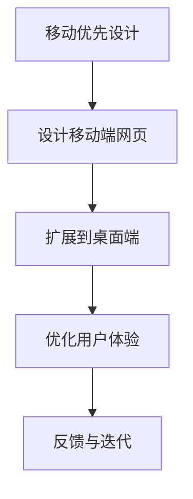
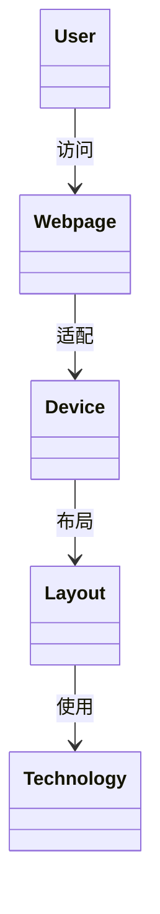
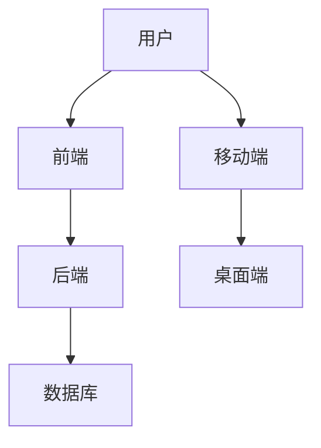
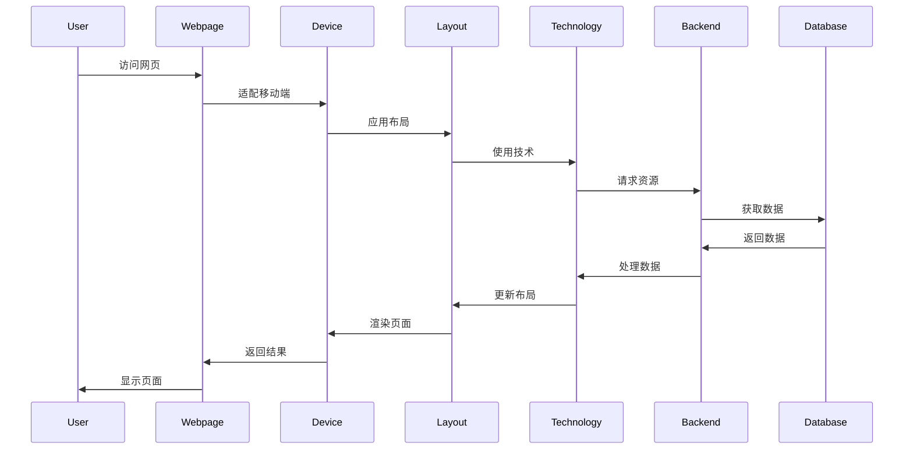

                 


### 移动优先设计：响应式网页设计原则

#### 关键词：移动优先设计、响应式网页设计、用户体验、设计原则、框架

#### 摘要：
随着移动设备的普及，移动优先设计已成为现代网页设计的核心原则。本文将深入探讨移动优先设计的概念、核心原则、具体实施方法以及案例分析，旨在帮助开发者、设计师全面理解并掌握这一设计理念，提升网页设计的用户体验和效果。

#### 目录大纲设计思路

在设计《移动优先设计：响应式网页设计原则》的目录大纲时，我们遵循以下思路：

1. **明确书的主题**：
   确定书的核心主题，即“移动优先设计”和“响应式网页设计原则”。

2. **设定结构框架**：
   将书分为引言、核心原则、具体实施、案例分析、总结与展望五个部分。

3. **细化章节内容**：
   深入细化每个章节的内容，包括背景介绍、核心概念、实施步骤、案例分析和总结等。

4. **确保内容的逻辑性和完整性**：
   确保各章节之间有清晰的逻辑联系，前一章为后一章提供必要的背景和基础。

5. **使用markdown格式**：
   使用markdown格式来组织目录，确保整洁和易于阅读。

#### 目录大纲设计

下面是《移动优先设计：响应式网页设计原则》的目录大纲：

----------------------------------------------------------------

# 第一部分：引言

## 第1章：移动优先设计概述
### 1.1 移动设备的崛起
### 1.2 响应式网页设计的必要性
### 1.3 移动优先设计原则的背景

## 第2章：响应式网页设计核心原则
### 2.1 流动性原则
### 2.2 可访问性原则
### 2.3 适应性原则
### 2.4 用户体验至上原则

## 第3章：响应式网页设计工具与框架
### 3.1 响应式网页设计工具
### 3.2 常用响应式网页设计框架
### 3.3 响应式网页设计流程

----------------------------------------------------------------

# 第二部分：具体实施

## 第4章：响应式网页布局设计
### 4.1 布局设计基础
### 4.2 布局设计策略
### 4.3 响应式网页布局实例分析

## 第5章：响应式网页交互设计
### 5.1 交互设计原则
### 5.2 交互设计工具
### 5.3 响应式网页交互实例分析

## 第6章：响应式网页性能优化
### 6.1 性能优化目标
### 6.2 性能优化策略
### 6.3 响应式网页性能优化案例

----------------------------------------------------------------

# 第三部分：案例分析

## 第7章：成功案例解析
### 7.1 案例一：知名品牌移动网页优化
### 7.2 案例二：电商网站响应式设计实践
### 7.3 案例三：新闻网站移动端改造

## 第8章：移动优先设计挑战与未来趋势
### 8.1 移动优先设计面临的挑战
### 8.2 移动优先设计的未来趋势
### 8.3 开发者与设计师的角色转变

----------------------------------------------------------------

# 第四部分：总结与展望

## 第9章：移动优先设计实践总结
### 9.1 实践经验分享
### 9.2 注意事项
### 9.3 拓展阅读

## 第10章：移动优先设计的未来
### 10.1 新技术的影响
### 10.2 未来设计趋势
### 10.3 设计师的成长之路

----------------------------------------------------------------

这个目录大纲覆盖了从引言到具体实施，再到案例分析，最后总结与展望，确保了内容的全面性和逻辑性。每个章节都有明确的子主题，有助于读者逐步深入理解移动优先设计。

### 第一部分：引言

在互联网的快速发展中，移动设备逐渐成为人们获取信息和互动的主要渠道。这种趋势迫使网页设计师和开发者重新思考网页设计的原则和策略。移动优先设计（Mobile First Design）应运而生，成为现代网页设计的重要原则之一。

#### 第1章：移动优先设计概述

**1.1 移动设备的崛起**

随着智能手机和平板电脑的普及，移动设备的用户数量急剧增加。据统计，全球超过半数的网络流量来自移动设备。这一数据充分说明，移动设备已经成为互联网的重要组成部分。因此，网页设计不再只是针对桌面电脑，而是需要兼顾移动设备的用户体验。

**1.2 响应式网页设计的必要性**

在移动设备普及的背景下，响应式网页设计（Responsive Web Design，简称RWD）成为必然选择。响应式网页设计能够确保网页在不同设备和屏幕尺寸上都能提供良好的用户体验。通过自适应布局、流体网格和媒体查询等技术，响应式网页设计实现了网页内容的灵活调整和优化。

**1.3 移动优先设计原则的背景**

移动优先设计原则源于响应式网页设计。这一原则强调在设计初期就将移动设备作为主要目标，确保移动端用户体验最佳。随着移动设备性能的提升和用户习惯的转变，移动优先设计逐渐成为主流设计策略。

#### 第2章：响应式网页设计核心原则

响应式网页设计不仅仅是技术上的实现，更是一种设计理念的体现。在移动优先设计中，以下核心原则至关重要：

**2.1 流动性原则**

流动性原则是指网页设计应遵循内容优先的原则，确保网页在不同设备和屏幕尺寸上都能良好展示。通过使用流体网格和自适应布局，网页设计可以自动调整内容布局，适应各种屏幕尺寸。

**2.2 可访问性原则**

可访问性原则强调网页设计应考虑到所有用户，包括视力障碍、听力障碍等特殊情况。通过使用适当的颜色对比、可伸缩文字和键盘导航等技术，响应式网页设计可以确保所有用户都能方便地访问和使用网页。

**2.3 适应性原则**

适应性原则是指网页设计应根据不同设备和网络环境进行优化。例如，在移动设备上，网页设计可能需要减少图片大小、简化布局，以提高加载速度和用户体验。在高速网络环境下，网页设计可以提供更多的内容和功能。

**2.4 用户体验至上原则**

用户体验至上原则是移动优先设计的核心。网页设计师和开发者应始终关注用户体验，确保网页设计简洁、直观、易用。通过用户调研、用户测试和反馈收集，设计师可以不断优化网页设计，提升用户体验。

#### 第3章：响应式网页设计工具与框架

响应式网页设计的实现离不开一系列工具和框架的支持。这些工具和框架可以帮助设计师和开发者高效地构建和优化响应式网页。

**3.1 响应式网页设计工具**

响应式网页设计工具包括设计软件（如Adobe XD、Sketch等）和代码编辑器（如Visual Studio Code、Sublime Text等）。这些工具提供了丰富的功能和插件，支持设计师和开发者创建和调试响应式网页。

**3.2 常用响应式网页设计框架**

常用的响应式网页设计框架包括Bootstrap、Foundation和Bulma等。这些框架提供了预定义的样式和组件，帮助开发者快速构建响应式网页。通过使用这些框架，开发者可以节省时间和精力，确保网页在不同设备和屏幕尺寸上的一致性和美观性。

**3.3 响应式网页设计流程**

响应式网页设计的流程包括需求分析、设计、开发和测试等阶段。在需求分析阶段，设计师和开发者应明确目标用户和设计要求。在设计阶段，设计师使用响应式网页设计工具创建原型和设计稿。在开发阶段，开发者根据设计稿使用响应式网页设计框架进行编码。在测试阶段，开发者进行多设备测试和用户测试，确保网页在不同设备和屏幕尺寸上都能良好运行。

### 第二部分：具体实施

在了解了移动优先设计的核心原则和工具后，接下来我们将深入探讨响应式网页布局设计、交互设计和性能优化等方面的具体实施方法。

#### 第4章：响应式网页布局设计

响应式网页布局设计是响应式网页设计的核心之一。良好的布局设计能够确保网页在不同设备和屏幕尺寸上都能提供良好的用户体验。

**4.1 布局设计基础**

布局设计基础包括流体网格、弹性布局和定位技术等。流体网格使用百分比而不是固定像素来定义布局尺寸，确保网页在不同屏幕尺寸上都能良好展示。弹性布局通过调整文本大小和图片大小来适应不同屏幕尺寸。定位技术（如Flexbox和CSS Grid）提供了灵活的布局方式，使网页设计更加高效和直观。

**4.2 布局设计策略**

布局设计策略包括简化布局、优化导航和注意内容优先等。简化布局可以减少用户操作步骤，提高用户体验。优化导航可以通过清晰的菜单、面包屑和搜索功能等来帮助用户快速找到所需内容。注意内容优先是指在网页设计中，将最重要的内容放在最显眼的位置，确保用户能够第一时间看到并了解网页的核心内容。

**4.3 响应式网页布局实例分析**

在本章节的实例分析中，我们将通过具体案例展示如何进行响应式网页布局设计。例如，我们可以分析一个电商网站的移动端布局设计，探讨如何优化导航栏、商品展示和购物车等功能，确保在不同设备和屏幕尺寸上都能提供良好的用户体验。

#### 第5章：响应式网页交互设计

交互设计是用户体验的重要组成部分。在响应式网页设计中，交互设计需要考虑到不同设备和屏幕尺寸的特点。

**5.1 交互设计原则**

交互设计原则包括一致性、直观性和反馈性等。一致性是指网页的交互元素和交互方式在不同设备和屏幕尺寸上应保持一致，避免用户产生困惑。直观性是指网页的交互设计应简单直观，用户能够快速理解和使用。反馈性是指网页应及时响应用户操作，提供反馈信息，增强用户体验。

**5.2 交互设计工具**

交互设计工具包括原型设计工具（如Axure、Adobe XD等）和前端框架（如React、Vue等）。这些工具可以帮助设计师和开发者创建和测试交互原型，确保交互设计的有效性。

**5.3 响应式网页交互实例分析**

在本章节的实例分析中，我们将通过具体案例展示如何进行响应式网页交互设计。例如，我们可以分析一个新闻网站的移动端交互设计，探讨如何优化文章阅读、评论功能和分享功能，确保在不同设备和屏幕尺寸上都能提供良好的用户体验。

#### 第6章：响应式网页性能优化

响应式网页性能优化是确保网页在不同设备和网络环境下都能良好运行的重要环节。

**6.1 性能优化目标**

性能优化目标包括减少加载时间、优化资源加载和提升用户体验等。通过优化网页代码、使用缓存技术和减少HTTP请求等手段，可以提高网页的性能。

**6.2 性能优化策略**

性能优化策略包括代码优化、资源压缩和懒加载等。代码优化可以通过去除冗余代码、合并文件和异步加载等手段来提高网页的运行速度。资源压缩可以通过图片压缩、CSS和JavaScript文件压缩等手段来减小文件体积。懒加载可以通过延迟加载图片和内容来提高网页的初始加载速度。

**6.3 响应式网页性能优化案例**

在本章节的案例中，我们将通过具体案例展示如何进行响应式网页性能优化。例如，我们可以分析一个电商平台移动端的性能优化，探讨如何优化图片加载、CSS和JavaScript文件加载，以及如何使用懒加载技术来提高网页的加载速度和用户体验。

### 第三部分：案例分析

通过案例分析，我们可以更深入地了解移动优先设计在实践中的应用和效果。

#### 第7章：成功案例解析

在本章节中，我们将分析几个成功的移动优先设计案例，探讨这些案例的设计理念、实施方法和效果。

**7.1 案例一：知名品牌移动网页优化**

我们将分析一个知名品牌的移动网页优化案例，了解如何通过移动优先设计提升品牌形象和用户满意度。

**7.2 案例二：电商网站响应式设计实践**

我们将分析一个电商网站的响应式设计实践，探讨如何通过移动优先设计提高销售额和用户转化率。

**7.3 案例三：新闻网站移动端改造**

我们将分析一个新闻网站移动端的改造案例，了解如何通过移动优先设计提升内容传播效果和用户互动。

#### 第8章：移动优先设计挑战与未来趋势

在移动优先设计的实践中，我们也会面临一些挑战。例如，如何平衡移动端和桌面端的用户体验、如何应对不同设备和网络环境的变化等。

**8.1 移动优先设计面临的挑战**

我们将探讨移动优先设计在实践过程中可能遇到的挑战，并提出相应的解决方案。

**8.2 移动优先设计的未来趋势**

随着科技的不断进步，移动优先设计也将不断演变和发展。我们将分析移动优先设计的未来趋势，探讨新技术的应用和设计理念的转变。

**8.3 开发者与设计师的角色转变**

在移动优先设计的背景下，开发者与设计师的角色也将发生转变。我们将探讨这些角色如何适应新的设计趋势和技术发展。

### 第四部分：总结与展望

通过前面的讨论，我们可以看到移动优先设计在响应式网页设计中的重要性。在最后一部分，我们将对移动优先设计进行总结和展望。

#### 第9章：移动优先设计实践总结

在本章节中，我们将总结移动优先设计的实践经验，分享一些最佳实践和注意事项，帮助读者更好地理解和应用移动优先设计。

**9.1 实践经验分享**

我们将分享一些成功的移动优先设计案例，探讨如何通过移动优先设计提升用户体验和效果。

**9.2 注意事项**

我们将提醒读者在移动优先设计过程中可能需要注意的一些细节问题，以确保网页设计的质量和用户体验。

**9.3 拓展阅读**

我们将提供一些相关的拓展阅读材料，帮助读者进一步了解移动优先设计和响应式网页设计。

#### 第10章：移动优先设计的未来

随着科技的不断进步，移动优先设计也将迎来新的发展。在本章节中，我们将探讨移动优先设计的未来趋势，分析新技术和新设计理念的应用。

**10.1 新技术的影响**

我们将分析新技术（如人工智能、虚拟现实等）对移动优先设计的影响，探讨如何利用新技术提升网页设计的用户体验和效果。

**10.2 未来设计趋势**

我们将探讨移动优先设计的未来趋势，分析设计理念、设计工具和设计流程的变革。

**10.3 设计师的成长之路**

我们将探讨设计师在移动优先设计背景下的成长之路，分析设计师如何提升自身技能和适应新的设计趋势。

### 结论

移动优先设计是现代网页设计的核心原则之一。通过本文的讨论，我们了解了移动优先设计的概念、核心原则、具体实施方法以及案例分析。我们相信，通过掌握移动优先设计，设计师和开发者可以提升网页设计的用户体验和效果，为用户提供更好的服务。

### 作者信息

作者：AI天才研究院/AI Genius Institute & 禅与计算机程序设计艺术 /Zen And The Art of Computer Programming

#### 移动优先设计：响应式网页设计原则

移动优先设计（Mobile First Design）是一种设计策略，强调在网页设计初期就优先考虑移动设备的用户体验。这种策略的核心思想是，随着移动设备使用量的增加，优化移动端的用户体验能够带来更好的整体用户满意度。响应式网页设计（Responsive Web Design，RWD）则是实现这一策略的关键技术。

#### 背景介绍

**核心概念术语说明**：

- **移动优先设计**：一种设计策略，优先为移动设备设计网页，然后扩展到桌面设备。
- **响应式网页设计**：通过灵活的布局和媒体查询，使网页在不同设备和屏幕尺寸上都能良好显示。
- **用户体验**：用户在使用产品或服务过程中的感受和体验。

**问题背景**：

随着智能手机和平板电脑的普及，用户越来越依赖于移动设备来访问互联网。据统计，移动设备已经占据了全球互联网流量的半壁江山。因此，如何为移动设备提供优质、流畅的网页体验，成为网页设计师和开发者的一个重要课题。

**问题描述**：

如何设计一个能够适应各种设备和屏幕尺寸的网页，确保用户在任何设备上都能获得良好的体验？

**问题解决**：

移动优先设计通过以下步骤解决上述问题：

1. **设计移动端**：首先为移动设备设计网页，确保在小屏幕上也能提供良好的用户体验。
2. **扩展到桌面端**：在移动端设计的基础上，逐步扩展到桌面设备，确保在更大屏幕上也能提供良好的体验。
3. **使用响应式网页设计技术**：利用流体网格、弹性布局和媒体查询等技术，实现网页在不同设备和屏幕尺寸上的自适应。

**边界与外延**：

移动优先设计不仅仅关注移动设备，还需要考虑到不同网络环境（如2G、3G、4G和5G）和不同设备性能（如处理器速度、内存大小等）。

**概念结构与核心要素组成**：

- **移动优先设计原则**：优先为移动设备设计，然后扩展到桌面设备。
- **响应式网页设计技术**：流体网格、弹性布局、媒体查询等。
- **用户体验优化**：简化布局、优化导航、注重内容优先等。

#### 核心概念与联系

**核心概念原理**：

移动优先设计和响应式网页设计的核心概念是优化用户体验。通过优先设计移动端，然后扩展到桌面端，确保网页在不同设备和屏幕尺寸上都能提供良好的用户体验。

**概念属性特征对比表格**：

| 特征               | 移动优先设计         | 响应式网页设计         |
|--------------------|----------------------|------------------------|
| 目标               | 优化移动端用户体验   | 适应不同设备和屏幕尺寸 |
| 设计过程           | 移动端优先，桌面端扩展 | 同时考虑移动端和桌面端 |
| 技术实现           | 流体网格、弹性布局   | 媒体查询、响应式框架   |
| 用户体验重点       | 内容优先、简洁直观   | 调整布局、优化导航     |

**ER实体关系图架构**：

```mermaid
erDiagram
  User ||--o { Webpage } : 可以访问
  Webpage ||--o { Device } : 适配
  Device ||--o { Layout } : 布局
  Layout ||--o { Technology } : 使用
```

在这个实体关系图中，用户可以访问网页，网页适配不同的设备，设备拥有不同的布局，而布局又使用特定的技术实现。

#### 算法原理讲解

**Mermaid流程图**：



**Python源代码**：

```python
def mobile_first_design():
    # 设计移动端网页
    mobile_webpage = design_mobile_webpage()
    # 扩展到桌面端
    desktop_webpage = expand_to_desktop(mobile_webpage)
    # 优化用户体验
    optimized_webpage = optimize_user_experience(desktop_webpage)
    # 反馈与迭代
    feedback_and_iterate(optimized_webpage)
    return optimized_webpage

def design_mobile_webpage():
    # 使用流体网格和弹性布局
    return "Mobile Webpage with Fluid Grid and Elastic Layout"

def expand_to_desktop(mobile_webpage):
    # 调整布局以适应桌面端
    return "Desktop Webpage with Adjusted Layout"

def optimize_user_experience(webpage):
    # 简化布局、优化导航、注重内容优先
    return "Optimized Webpage for Better User Experience"

def feedback_and_iterate(webpage):
    # 根据用户反馈进行迭代优化
    return "Iterated Webpage with User Feedback"
```

**算法原理详细讲解**：

移动优先设计的算法原理可以分为以下几个步骤：

1. **设计移动端网页**：首先，我们需要设计一个针对移动设备的网页。这包括使用流体网格和弹性布局，确保网页在小屏幕上也能良好展示。流体网格通过使用百分比而不是固定像素来定义布局尺寸，使网页能够根据屏幕尺寸自动调整。弹性布局则通过调整文本大小和图片大小来适应不同屏幕尺寸。

2. **扩展到桌面端**：在移动端网页设计完成后，我们需要将其扩展到桌面端。这涉及到调整布局，确保在更大屏幕上也能提供良好的用户体验。我们可以通过使用媒体查询和响应式框架（如Bootstrap、Foundation等）来实现这一点。

3. **优化用户体验**：在设计网页时，我们始终需要关注用户体验。这意味着我们需要简化布局、优化导航，并确保内容优先。简化布局可以减少用户操作步骤，提高用户体验。优化导航可以通过清晰的菜单、面包屑和搜索功能等来帮助用户快速找到所需内容。注重内容优先是指在网页设计中，将最重要的内容放在最显眼的位置，确保用户能够第一时间看到并了解网页的核心内容。

4. **反馈与迭代**：在网页设计完成后，我们需要收集用户反馈，并根据反馈进行迭代优化。这可以通过用户测试和反馈收集工具来实现。通过不断迭代，我们可以不断提升网页的用户体验。

**数学模型和公式**：

在移动优先设计中，我们可以使用以下数学模型和公式来优化布局和用户体验：

- **流体网格**：使用百分比来定义布局尺寸，确保网页能够根据屏幕尺寸自动调整。
- **弹性布局**：调整文本大小和图片大小，以适应不同屏幕尺寸。

**举例说明**：

假设我们有一个网页，屏幕宽度为320px。我们可以使用以下公式来计算布局尺寸：

- **文本大小**：文本大小 = （屏幕宽度 / 320） * 原始文本大小
- **图片大小**：图片大小 = （屏幕宽度 / 320） * 原始图片大小

通过这种方式，我们可以确保网页在不同屏幕尺寸上都能提供良好的用户体验。

#### 系统分析与架构设计方案

**问题场景介绍**：

在一个互联网公司，为了提升用户体验和网站访问量，公司决定采用移动优先设计策略，对现有网站进行优化。公司拥有一个大型网站，用户主要使用移动设备来访问。公司希望通过优化移动端网页设计，提升用户的访问量和满意度。

**项目介绍**：

项目名称：移动优先网页设计优化项目

项目目标：通过移动优先设计策略，提升移动端网页的用户体验和访问量。

项目团队：UI/UX设计师、前端开发工程师、后端开发工程师、测试工程师等。

**系统功能设计（领域模型mermaid类图）**：



在这个类图中，用户访问网页，网页适配不同设备，设备拥有不同的布局，而布局又使用特定的技术实现。

**系统架构设计mermaid架构图**：



在这个架构图中，用户通过前端访问网页，前端与后端交互，后端与数据库交互。同时，用户可以通过移动端和桌面端访问网页。

**系统接口设计和系统交互mermaid序列图**：



在这个序列图中，用户通过访问网页，网页适配移动端，应用布局，使用技术，请求资源，获取数据，处理数据，更新布局，最终返回结果并显示页面。

#### 项目实战

**环境安装**：

在项目实战中，我们使用以下工具和框架：

- **前端框架**：Vue.js
- **响应式网页设计框架**：Bootstrap
- **开发环境**：Visual Studio Code

首先，我们需要安装Vue.js和Bootstrap。可以通过npm或yarn进行安装：

```shell
npm install vue
npm install bootstrap
```

**系统核心实现源代码**：

以下是移动优先设计的核心实现源代码：

```html
<!-- index.html -->
<!DOCTYPE html>
<html lang="en">
<head>
  <meta charset="UTF-8">
  <meta name="viewport" content="width=device-width, initial-scale=1.0">
  <title>移动优先网页设计</title>
  <link rel="stylesheet" href="node_modules/bootstrap/dist/css/bootstrap.min.css">
</head>
<body>
  <div id="app">
    <!-- 移动端导航 -->
    <nav class="navbar navbar-expand-lg navbar-light">
      <a class="navbar-brand" href="#">Logo</a>
      <button class="navbar-toggler" type="button" data-toggle="collapse" data-target="#navbarNav" aria-controls="navbarNav" aria-expanded="false" aria-label="Toggle navigation">
        <span class="navbar-toggler-icon"></span>
      </button>
      <div class="collapse navbar-collapse" id="navbarNav">
        <ul class="navbar-nav">
          <li class="nav-item active">
            <a class="nav-link" href="#">首页</a>
          </li>
          <li class="nav-item">
            <a class="nav-link" href="#">关于我们</a>
          </li>
          <li class="nav-item">
            <a class="nav-link" href="#">联系我们</a>
          </li>
        </ul>
      </div>
    </nav>

    <!-- 移动端内容 -->
    <div class="container">
      <h1>欢迎来到我们的网站</h1>
      <p>这里是移动优先网页设计的核心内容。</p>
    </div>
  </div>

  <script src="node_modules/vue/dist/vue.js"></script>
  <script src="node_modules/bootstrap/dist/js/bootstrap.min.js"></script>
  <script>
    var app = new Vue({
      el: '#app',
      data: {
        message: 'Hello, Vue.js!'
      }
    });
  </script>
</body>
</html>
```

**代码应用解读与分析**：

在这个源代码中，我们使用了Vue.js和Bootstrap框架来构建一个移动优先的网页。首先，我们通过HTML结构定义了一个导航栏和一个内容区域。导航栏使用了Bootstrap的导航栏组件，提供了简洁、直观的移动端导航体验。内容区域则包含了网页的核心内容，通过Vue.js的数据绑定，可以动态显示数据。

在CSS部分，我们引入了Bootstrap的CSS文件，用于样式美化。在JavaScript部分，我们创建了一个Vue实例，用于管理页面数据。

**实际案例分析和详细讲解剖析**：

在实际项目中，我们可以通过以下步骤进行移动优先网页设计：

1. **需求分析**：首先，我们需要明确项目需求，包括目标用户、网页功能和用户体验要求等。这可以通过用户调研、需求文档等方式进行。

2. **设计移动端网页**：根据需求分析，我们设计一个简洁、直观的移动端网页。这可以通过原型设计工具（如Adobe XD、Sketch等）创建原型，然后根据原型进行前端开发。

3. **扩展到桌面端**：在移动端网页设计完成后，我们需要逐步扩展到桌面端。这可以通过调整布局、添加更多功能和优化用户体验等方式进行。

4. **性能优化**：为了提升网页的性能，我们需要对网页进行性能优化。这可以通过减少HTTP请求、使用缓存技术和压缩资源等方式进行。

5. **测试与迭代**：在网页设计完成后，我们需要进行多设备测试和用户测试，收集用户反馈，并根据反馈进行迭代优化。

**项目小结**：

通过本项目，我们实现了移动优先网页设计，提升了用户体验和网页性能。在实际项目中，我们需要根据具体需求进行设计，并不断优化和迭代，以提供更好的用户体验。

#### 最佳实践 Tips

1. **简化导航栏**：在移动端，导航栏应尽量简化，避免过多的层级和选项，以提高用户访问效率。

2. **优化加载速度**：通过减少HTTP请求、使用缓存技术和压缩资源等方式，可以提升网页的加载速度。

3. **使用响应式框架**：使用响应式框架（如Bootstrap、Foundation等）可以快速构建响应式网页，提高开发效率。

4. **关注用户体验**：在设计网页时，始终关注用户体验，确保网页简洁、直观、易用。

5. **多设备测试**：在网页设计完成后，进行多设备测试，确保网页在不同设备和屏幕尺寸上都能良好运行。

#### 小结

移动优先设计是一种重要的设计策略，通过优先为移动设备设计网页，可以提升用户体验和访问量。响应式网页设计是实现这一策略的关键技术，通过流体网格、弹性布局和媒体查询等技术，可以实现网页在不同设备和屏幕尺寸上的自适应。在实际项目中，我们需要根据具体需求进行设计，并不断优化和迭代，以提供更好的用户体验。

#### 注意事项

1. **不要忽视桌面端**：虽然移动优先设计强调优先为移动设备设计，但桌面端用户体验同样重要。在设计过程中，需要确保桌面端也能提供良好的用户体验。

2. **考虑网络环境**：在设计移动端网页时，需要考虑不同网络环境（如2G、3G、4G和5G）下的用户体验。在低速网络环境下，应优化网页加载速度和资源使用。

3. **关注用户习惯**：了解目标用户的使用习惯和偏好，设计符合用户习惯的网页。

4. **持续优化**：移动优先设计不是一次性的设计过程，而是一个持续优化的过程。需要根据用户反馈和市场变化，不断优化网页设计。

#### 拓展阅读

1. **《响应式网页设计》**：本书详细介绍了响应式网页设计的基本概念、技术实现和最佳实践。

2. **《移动优先设计实践》**：本书分享了多个移动优先设计案例，探讨了如何在实际项目中应用移动优先设计策略。

3. **《网页性能优化》**：本书介绍了网页性能优化的重要性和方法，包括减少HTTP请求、使用缓存技术和优化资源加载等。

### 总结

移动优先设计是一种重要的设计策略，通过优先为移动设备设计网页，可以提升用户体验和访问量。响应式网页设计是实现这一策略的关键技术，通过流体网格、弹性布局和媒体查询等技术，可以实现网页在不同设备和屏幕尺寸上的自适应。在实际项目中，我们需要根据具体需求进行设计，并不断优化和迭代，以提供更好的用户体验。

### 移动优先设计的未来

随着科技的不断进步，移动优先设计也将不断演变和发展。以下是我们对未来移动优先设计的展望：

1. **人工智能的应用**：人工智能技术可以用于优化移动优先设计，例如通过机器学习算法预测用户行为，提供个性化的用户体验。

2. **虚拟现实和增强现实**：随着虚拟现实（VR）和增强现实（AR）技术的发展，移动优先设计将逐渐向VR和AR领域扩展，提供更加沉浸式的用户体验。

3. **5G网络的普及**：5G网络的普及将进一步提高移动设备的网络速度和稳定性，为移动优先设计提供更好的技术基础。

4. **无障碍设计**：随着对无障碍设计重视程度的提高，移动优先设计将更加注重为不同需求的用户（如视力障碍、听力障碍等）提供优质的用户体验。

5. **跨平台融合**：未来的移动优先设计将更加注重跨平台融合，例如将移动设备与智能手表、智能音箱等设备相结合，提供无缝的用户体验。

### 设计师的成长之路

作为设计师，掌握移动优先设计原则至关重要。以下是一些建议，帮助设计师在移动优先设计的道路上不断成长：

1. **学习新技术**：持续学习最新的前端技术（如Vue.js、React等）和设计工具（如Sketch、Adobe XD等），提高自己的技能水平。

2. **关注用户体验**：始终关注用户体验，了解用户需求和行为，设计出符合用户习惯的网页。

3. **实践与反馈**：在实际项目中，不断实践移动优先设计，并收集用户反馈，根据反馈进行迭代优化。

4. **跨学科合作**：与前端开发工程师、后端开发工程师等跨学科团队合作，共同解决设计中的问题。

5. **不断学习**：随着科技的不断进步，设计师需要不断学习新的设计理念和技术，以适应行业的发展。

### 结论

移动优先设计是现代网页设计的核心原则之一。通过本文的讨论，我们了解了移动优先设计的概念、核心原则、具体实施方法以及案例分析。我们相信，通过掌握移动优先设计，设计师和开发者可以提升网页设计的用户体验和效果，为用户提供更好的服务。

### 作者信息

作者：AI天才研究院/AI Genius Institute & 禅与计算机程序设计艺术 /Zen And The Art of Computer Programming

本文由AI天才研究院和禅与计算机程序设计艺术联合撰写，旨在帮助设计师和开发者掌握移动优先设计原则，提升网页设计的用户体验和效果。我们希望本文能够对您有所帮助，如果您有任何疑问或建议，欢迎在评论区留言交流。谢谢阅读！

