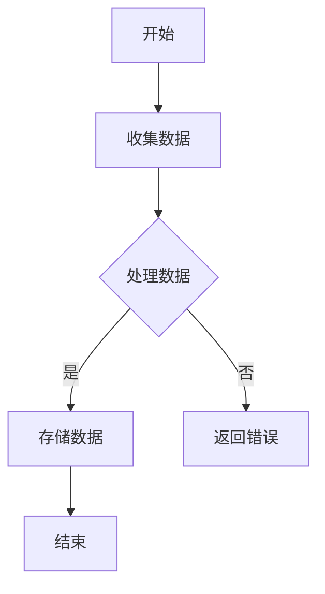

                 

### 移动应用安全加固技术：背景与核心概念

移动应用已经成为现代社会中不可或缺的一部分，无论是在个人生活还是商业运营中，移动应用都扮演着至关重要的角色。随着移动应用的普及，移动应用的安全问题也逐渐成为关注的焦点。移动应用的安全问题不仅关乎用户的数据隐私，还可能对企业的商业秘密和用户的财产安全构成威胁。因此，对移动应用进行安全加固显得尤为重要。

#### 移动应用面临的威胁

移动应用面临的威胁多种多样，主要包括以下几种：

1. **恶意软件攻击**：恶意软件可以通过各种途径侵入移动应用，如通过钓鱼网站、恶意广告、恶意应用等，窃取用户数据或执行恶意操作。
2. **数据泄露**：移动应用中存储的敏感数据，如用户名、密码、信用卡信息等，如果未得到妥善保护，可能会被恶意分子窃取。
3. **网络攻击**：如DDoS攻击、中间人攻击等，可以破坏移动应用的正常运行，甚至造成数据丢失。
4. **代码篡改**：攻击者通过篡改应用代码，植入恶意代码，从而实现非法控制或数据窃取。

#### 安全加固的必要性

为了应对上述威胁，对移动应用进行安全加固是非常必要的。安全加固不仅可以防止恶意攻击，保护用户数据安全，还可以提升应用的可靠性和用户信任度。以下是安全加固的一些主要目的：

1. **保护用户数据**：通过数据加密、数据存储保护等技术，确保用户数据在存储、传输和处理过程中不被未授权访问。
2. **防止恶意软件攻击**：通过代码混淆、应用沙箱等技术，防止恶意软件侵入应用，降低应用被攻击的风险。
3. **保障应用完整性**：通过代码签名、应用认证等技术，确保应用的完整性和合法性，防止代码被篡改。

总之，移动应用安全加固是一项系统性和综合性的工作，涉及到多个技术和方法。通过全面的安全加固，可以有效地提高移动应用的安全性，保护用户和数据的安全。在接下来的章节中，我们将深入探讨各种安全加固技术的原理和应用，帮助读者更好地理解和实践移动应用安全加固。

### 移动应用安全基础理论

为了深入理解移动应用安全加固技术，我们需要首先掌握移动应用安全的基础理论。这些理论包括移动应用安全的概念、常见的威胁类型以及安全策略的制定与实施。

#### 移动应用安全概述

**概念**：移动应用安全是指保护移动应用及其所涉及的数据、用户和基础设施免受各种安全威胁的一系列措施。它涵盖的范围包括但不限于数据安全、应用安全、网络安全和用户隐私保护。

**问题背景**：随着智能手机和平板电脑的普及，移动应用成为人们日常生活中不可或缺的一部分。然而，这也带来了大量的安全风险。例如，用户在移动应用中存储的个人信息、支付信息和商业数据都可能成为攻击者的目标。

**问题描述**：移动应用面临的威胁主要包括恶意软件攻击、数据泄露、网络攻击和代码篡改。这些威胁不仅对用户造成经济损失，还可能对企业的声誉和商业秘密造成严重影响。

**问题解决**：为了解决上述问题，我们需要从多个层面进行安全加固。首先，通过制定和实施有效的安全策略，确保应用在设计和开发过程中就具备较高的安全性。其次，采用多种安全技术和工具，如数据加密、代码混淆、网络传输加密等，增强应用的防御能力。

**边界与外延**：移动应用安全的边界包括保护用户数据、防止恶意软件攻击、保障应用完整性和防止数据泄露。其外延则涉及应用的安全性、可靠性和用户隐私保护。

**概念结构与核心要素组成**：移动应用安全的核心结构包括以下几个方面：

1. **数据安全**：通过数据加密和存储保护措施，确保用户数据在存储、传输和处理过程中的安全性。
2. **应用安全**：通过代码混淆、应用沙箱等技术，防止恶意代码侵入应用，保障应用的完整性。
3. **网络安全**：通过网络传输加密、防火墙等技术，保护应用在公共网络环境中的安全性。
4. **用户隐私保护**：通过用户隐私策略和权限控制，确保用户个人信息不被未授权访问。

#### 常见威胁

**恶意软件攻击**：恶意软件可以通过多种途径侵入移动应用，如通过钓鱼网站、恶意广告和应用市场中的恶意应用。一旦侵入，恶意软件可以窃取用户数据、监控用户行为或执行恶意操作。

**数据泄露**：移动应用中存储的敏感数据，如用户名、密码、信用卡信息等，如果未得到妥善保护，可能会被恶意分子窃取。数据泄露可能导致用户财务损失、隐私泄露和商业机密泄露。

**网络攻击**：网络攻击包括DDoS攻击、中间人攻击等，可以破坏移动应用的正常运行，甚至造成数据丢失。这些攻击通常利用网络漏洞或应用中的安全漏洞进行。

**代码篡改**：攻击者通过篡改应用代码，植入恶意代码，从而实现非法控制或数据窃取。代码篡改可能导致应用功能异常、用户数据泄露和商业秘密泄露。

#### 安全策略

**定义**：安全策略是一套指导原则和措施，用于确保移动应用的安全性。它包括安全目标的制定、安全措施的实施和安全监控的执行。

**设计**：安全策略的设计需要考虑以下因素：

1. **应用类型**：不同类型的移动应用可能面临不同的安全威胁，因此需要制定针对性的安全策略。
2. **用户数据**：明确应用中需要保护的敏感数据类型，并制定相应的保护措施。
3. **开发流程**：在应用开发过程中，应遵循安全最佳实践，如代码审查、安全测试和漏洞修复。

**实施**：安全策略的实施包括以下步骤：

1. **制定安全标准**：根据应用类型和安全需求，制定具体的安全标准和规范。
2. **培训与教育**：对开发人员、运维人员和用户进行安全培训，提高他们的安全意识和能力。
3. **监控与审计**：建立安全监控系统，定期进行安全审计，及时发现和解决安全漏洞。

通过制定和实施有效的安全策略，可以显著提升移动应用的安全性，保护用户数据和企业的商业利益。

#### 总结

移动应用安全基础理论是理解移动应用安全加固技术的基石。通过掌握这些基础理论，我们可以更好地识别移动应用面临的安全威胁，制定和实施有效的安全策略，从而提升应用的安全性。在接下来的章节中，我们将深入探讨具体的加固技术，如数据加密、代码混淆和网络传输加密，帮助读者全面掌握移动应用安全加固的方法和实践。

### 数据加密技术

数据加密是移动应用安全加固中至关重要的一环，它通过将数据转换为不可读的密文，确保数据在存储、传输和处理过程中不被未授权访问。数据加密技术可以分为对称加密和非对称加密两种类型。本节将详细介绍这些加密技术的概念、分类、原理及其应用。

#### 数据加密概述

**概念**：数据加密是指通过特定的算法和密钥，将明文数据转换为密文的过程。这个过程被称为加密。反过来，将密文转换为明文的过程被称为解密。

**分类**：

1. **对称加密**：对称加密算法使用相同的密钥进行加密和解密。常见的对称加密算法包括AES（Advanced Encryption Standard，高级加密标准）和DES（Data Encryption Standard，数据加密标准）。
2. **非对称加密**：非对称加密算法使用一对密钥进行加密和解密，其中一个密钥用于加密，另一个密钥用于解密。常见的非对称加密算法包括RSA（Rivest-Shamir-Adleman，RSA算法）和ECC（Elliptic Curve Cryptography，椭圆曲线加密）。

**目的**：数据加密的主要目的是保护数据的机密性、完整性和可用性。通过加密，即使数据被攻击者获取，也无法理解其内容。

#### 对称加密算法

**概念**：对称加密算法是一种加密技术，其中加密和解密使用相同的密钥。这意味着密钥的保密性至关重要。如果密钥泄露，那么加密的数据也会被解密。

**常见算法**：

1. **AES**：AES是一种块加密算法，采用128、192或256位密钥长度，支持多种加密模式，如CBC（Cipher Block Chaining，密文块链接）和CFB（Cipher Feedback，密文反馈）。
2. **DES**：DES是一种较旧的加密标准，采用56位密钥，虽然其安全性较低，但在一些特定场景中仍有使用。

**原理**：对称加密算法的工作原理是将输入的明文数据分割成固定长度的块，然后将每个块与密钥进行加密运算，生成对应的密文块。解密过程则相反，使用相同的密钥将密文块转换回明文块。

**优点**：对称加密算法计算速度快，适合处理大量数据。其加密和解密过程是高效的。

**缺点**：对称加密算法面临密钥管理的挑战，因为需要确保密钥的安全传输和存储。此外，如果密钥泄露，所有加密数据都会受到威胁。

#### 非对称加密算法

**概念**：非对称加密算法使用一对密钥进行加密和解密，其中一个密钥公开，称为公钥；另一个密钥保密，称为私钥。公钥用于加密，私钥用于解密。

**常见算法**：

1. **RSA**：RSA是一种基于大整数分解问题的非对称加密算法，广泛用于数据加密和数字签名。它支持多种密钥长度，如1024位、2048位和4096位。
2. **ECC**：ECC是一种基于椭圆曲线离散对数问题的非对称加密算法，具有更高的安全性和效率。它使用较小的密钥长度即可达到与传统RSA类似的强度。

**原理**：非对称加密算法通过数学难题来实现加密和解密。在加密过程中，数据通过公钥加密；在解密过程中，数据通过私钥解密。

**优点**：非对称加密算法解决了对称加密中的密钥分发问题，因为公钥可以公开传输，而私钥保持保密。它适用于加密大量数据和数字签名。

**缺点**：非对称加密算法计算速度较慢，尤其是对于大型密钥长度，因此不适合处理大量数据。其加密和解密过程相对复杂。

#### 数据加密技术在移动应用中的应用

**存储加密**：移动应用可以使用数据加密技术对存储在设备上的数据进行加密，确保即使设备被非法获取，数据也无法被读取。

**传输加密**：移动应用可以通过数据加密技术在数据传输过程中对数据进行加密，防止数据在传输过程中被截获和篡改。

**加密通信**：移动应用可以使用非对称加密算法进行加密通信，确保通信过程中的数据机密性和完整性。

**实例**：例如，Android系统的加密存储机制`Android Keystore`可以使用对称加密和非对称加密算法对应用数据及其密钥进行存储和加密。

#### 总结

数据加密技术在移动应用安全加固中发挥着关键作用。通过理解对称加密和非对称加密算法的原理和应用，我们可以设计出更加安全的移动应用，保护用户数据的安全性和隐私。在接下来的章节中，我们将继续探讨其他安全加固技术，如代码混淆和网络传输加密，帮助读者全面掌握移动应用安全加固的方法和实践。

### 代码混淆技术

代码混淆技术是移动应用安全加固中的一种重要手段，旨在通过将代码转化为难以理解和执行的形式，从而防止恶意攻击者分析和篡改代码。本节将详细介绍代码混淆技术的概念、分类、常见算法及其在移动应用中的应用。

#### 代码混淆概述

**概念**：代码混淆技术是指通过一系列算法和策略，将可读、易理解的原始代码转换成复杂、难以解析的代码。这种转换旨在降低代码的可读性和可修改性，从而提高应用的安全性。

**分类**：

1. **伪代码混淆**：通过将代码转换为伪代码或其他难以直接理解的代码形式，使攻击者难以分析代码的结构和逻辑。
2. **语法混淆**：通过修改代码的语法结构，使代码变得混乱和难以理解。常见的语法混淆技术包括代码变形、指令重排序和插入冗余代码等。

**目的**：代码混淆技术的目的是保护移动应用的商业逻辑、算法和敏感信息，防止攻击者通过静态分析和动态调试获取这些信息。通过混淆，攻击者难以快速理解代码的运行逻辑和关键部分，从而降低了攻击的成功率。

#### 常见代码混淆算法

**伪代码混淆**：

- **字符串混淆**：将硬编码的字符串转换为加密或编码形式，如使用字典映射或掩码技术。
- **函数混淆**：将函数名称和内部逻辑进行变换，使函数名称复杂难懂，内部逻辑通过复杂的跳转和条件判断实现。
- **控制流混淆**：通过插入冗余代码和条件判断，使代码的控制流变得复杂，难以追踪。

**语法混淆**：

- **代码变形**：通过改变代码的语法结构，使其变得难以理解。例如，将循环结构转换为递归结构，或将条件判断转换为复杂的逻辑表达式。
- **指令重排序**：改变代码中指令的执行顺序，使代码的执行路径复杂化。
- **插入冗余代码**：在代码中插入无意义的指令，增加代码的复杂性，使攻击者难以快速找到关键逻辑。

#### 代码混淆技术在移动应用中的应用

**应用场景**：

1. **商业应用**：商业应用中通常包含关键的算法和商业逻辑，如果这些信息被泄露，可能会对企业的利益造成重大损害。通过代码混淆，可以防止攻击者轻易获取和应用这些信息。
2. **金融应用**：金融应用中涉及大量的敏感数据和交易逻辑，通过代码混淆，可以保护用户的财务数据和交易安全。
3. **游戏应用**：游戏应用中的游戏逻辑和奖励机制如果被破解，可能会导致游戏平衡被破坏。通过代码混淆，可以防止作弊工具的开发和使用。

**实例**：

- **应用商店应用**：许多应用商店要求上传的应用必须经过混淆处理，以确保应用的安全性和完整性。
- **Android应用**：Android平台提供了一系列代码混淆工具，如ProGuard和R8，可以帮助开发者对Android应用进行混淆处理。

#### 代码混淆的优势与挑战

**优势**：

1. **防止逆向工程**：代码混淆技术可以有效防止攻击者通过静态分析和动态调试获取应用的核心逻辑和敏感信息。
2. **降低破解成本**：通过增加攻击者分析代码的难度，代码混淆技术降低了攻击者的攻击成本和时间。
3. **增强安全性**：代码混淆技术可以作为一种额外的安全层，提高应用的整体安全性。

**挑战**：

1. **性能影响**：代码混淆可能会增加应用的性能负担，因为混淆后的代码在执行时需要额外的解析和处理。
2. **兼容性问题**：代码混淆可能会与某些库或框架产生兼容性问题，导致应用在运行时出现异常。
3. **维护难度**：混淆后的代码更难以理解和修改，这可能会增加开发者的维护难度。

#### 总结

代码混淆技术在移动应用安全加固中扮演着重要角色。通过混淆代码，可以有效地防止逆向工程和代码篡改，提高应用的安全性。然而，代码混淆也存在一定的挑战，需要在实际应用中权衡其优势和局限性。在下一章节中，我们将继续探讨网络传输加密技术，进一步了解如何增强移动应用的安全措施。

### 网络传输加密技术

网络传输加密技术是移动应用安全加固中不可或缺的一环，它通过加密通信数据，确保数据在传输过程中不被未授权访问和篡改。本节将详细介绍网络传输加密技术的概念、常见协议及其在移动应用中的应用。

#### 网络传输加密概述

**概念**：网络传输加密技术是指通过加密算法和密钥，对在网络中传输的数据进行加密和解密，以保护数据的安全性。这种加密通常发生在数据的发送者和接收者之间，确保即使数据在传输过程中被截获，攻击者也无法理解其内容。

**目的**：网络传输加密的主要目的是确保数据的机密性、完整性和认证性。通过加密，可以防止数据被窃取、篡改或伪造。

**分类**：

1. **传输层加密**：在传输层对数据进行加密，常用的协议包括SSL/TLS。
2. **应用层加密**：在应用层对数据进行加密，常用的协议包括HTTPS。

#### 常见网络传输加密协议

**SSL/TLS协议**：

**概念**：SSL（Secure Sockets Layer，安全套接字层）和TLS（Transport Layer Security，传输层安全）是一种在传输层提供加密通信的协议。SSL最初由网景公司开发，后来发展成TLS。

**工作原理**：SSL/TLS协议通过在客户端和服务器之间建立安全通道，确保数据在传输过程中不被窃听或篡改。主要步骤包括：

1. **握手阶段**：客户端和服务器通过一系列握手消息，协商加密算法和密钥，建立安全连接。
2. **会话阶段**：一旦安全连接建立，数据将按照协商的加密算法进行加密传输。
3. **结束阶段**：在通信结束时，双方可以安全地关闭连接。

**优势**：

- **广泛的兼容性**：SSL/TLS协议被广泛支持，可以在各种网络环境中使用。
- **高安全性**：通过加密算法和密钥交换技术，SSL/TLS能够提供强大的数据保护。

**常见应用**：SSL/TLS协议广泛应用于Web浏览器、电子邮件、文件传输等网络应用中，是互联网通信安全的基石。

**IPsec协议**：

**概念**：IPsec（Internet Protocol Security，互联网协议安全）是一种在网络层提供加密通信的协议，用于保护IP协议数据包的完整性、认证性和机密性。

**工作原理**：IPsec主要分为传输模式和隧道模式：

- **传输模式**：仅对数据包的载荷进行加密和认证，而数据包的头部保持不变。
- **隧道模式**：对整个数据包（包括头部和载荷）进行加密和认证，然后将加密后的数据包封装在一个新的IP数据包中。

**优势**：

- **灵活性和扩展性**：IPsec可以应用于不同的网络环境和协议。
- **安全性**：IPsec通过加密和认证技术，提供强大的数据保护。

**常见应用**：IPsec主要用于VPN（Virtual Private Network，虚拟专用网络）、企业内部网等场景中，确保跨网络的安全通信。

#### 网络传输加密技术在移动应用中的应用

**应用场景**：

1. **移动支付应用**：移动支付应用中涉及大量敏感数据，如信用卡信息、交易记录等。通过网络传输加密技术，可以确保这些数据在传输过程中不被窃取或篡改。
2. **即时通讯应用**：如WhatsApp、微信等即时通讯应用，通过加密技术保护用户的聊天内容和文件传输安全。
3. **社交网络应用**：如Facebook、Twitter等，通过加密技术保护用户的个人信息和活动日志。

**实例**：

- **移动银行应用**：许多移动银行应用都使用了SSL/TLS协议来保护用户的交易数据。例如，用户在进行转账操作时，数据会通过加密通道传输，确保数据安全。
- **微信支付**：微信支付使用了HTTPS协议进行数据传输，通过SSL/TLS协议确保数据传输的机密性和完整性。

#### 总结

网络传输加密技术是保障移动应用数据安全的重要手段。通过使用SSL/TLS和IPsec等协议，可以有效地保护数据在传输过程中的安全，防止数据泄露和篡改。在移动应用开发过程中，合理应用网络传输加密技术，可以显著提升应用的安全性，增强用户的信任和使用体验。在下一章节中，我们将继续探讨移动应用安全加固的实际应用案例，帮助读者更好地理解安全加固技术在现实场景中的应用。

### 移动应用安全加固技术案例分析

为了更好地理解移动应用安全加固技术的实际应用，我们通过几个具有代表性的案例来分析各种加固技术的具体实施过程和效果。

#### 案例一：某知名社交应用的安全加固

**背景**：某知名社交应用面临严重的恶意软件攻击和数据泄露风险，用户数据安全和隐私保护成为关键问题。

**实施过程**：

1. **数据加密**：应用使用AES对称加密算法对用户存储的敏感数据进行加密，包括用户名、密码、聊天记录等。加密过程采用高强度密钥管理，确保密钥的安全存储和传输。

2. **代码混淆**：应用开发团队对关键业务逻辑和算法进行混淆处理，使用伪代码混淆和语法混淆技术，增加代码的可读性和可篡改性。

3. **网络传输加密**：应用采用SSL/TLS协议对网络通信数据进行加密，确保数据在传输过程中的机密性和完整性。

**效果评估**：

- **数据保护**：通过数据加密技术，用户敏感数据即使被窃取，攻击者也无法解密获取内容。
- **代码安全**：通过代码混淆技术，攻击者难以分析和篡改关键代码，降低了逆向工程的难度。
- **通信安全**：网络传输加密技术有效地保护了用户数据在传输过程中的安全，防止数据在传输过程中被截获和篡改。

#### 案例二：某金融应用的安全加固

**背景**：某金融应用面临严重的网络攻击和数据泄露风险，需要确保用户财务数据和交易记录的安全性。

**实施过程**：

1. **多因素认证**：应用引入多因素认证机制，用户在登录时需要提供密码、手机验证码以及生物识别信息（如指纹或面部识别），提高用户账户的安全性。

2. **数据加密**：应用采用RSA非对称加密算法对用户交易数据进行加密，确保交易数据在传输和存储过程中的安全性。

3. **网络传输加密**：应用采用SSL/TLS协议对网络通信数据进行加密，同时使用IPsec协议保护企业内部网络通信。

**效果评估**：

- **用户认证**：多因素认证机制显著提高了用户账户的安全性，即使攻击者获取用户密码，也无法完成认证。
- **数据保护**：通过数据加密技术，用户交易数据在传输和存储过程中得到了有效保护。
- **网络通信安全**：SSL/TLS和IPsec协议的应用确保了网络通信的安全性，防止数据泄露和篡改。

#### 案例三：某游戏应用的安全加固

**背景**：某游戏应用面临严重的作弊和作弊工具开发风险，需要确保游戏平衡和用户公平性。

**实施过程**：

1. **代码混淆**：游戏开发团队对游戏逻辑和算法进行混淆处理，使用多种代码混淆技术，增加代码的可读性和可篡改性。

2. **数据加密**：游戏应用对游戏角色等级、金币等关键数据进行加密存储，防止用户数据被篡改和作弊工具获取。

3. **网络传输加密**：游戏应用采用SSL/TLS协议对游戏数据传输进行加密，确保用户游戏数据在传输过程中的安全性。

**效果评估**：

- **游戏安全**：通过代码混淆技术，攻击者难以分析和篡改游戏逻辑和算法，防止作弊工具的开发和使用。
- **数据保护**：通过数据加密技术，用户游戏数据在存储和传输过程中得到了有效保护。
- **通信安全**：网络传输加密技术确保了用户游戏数据在传输过程中的安全，防止数据泄露和篡改。

#### 总结

通过上述案例，我们可以看到，不同类型的移动应用在面对不同安全威胁时，采用了不同的安全加固技术。数据加密、代码混淆和网络传输加密等技术在实际应用中发挥了重要作用，有效提升了应用的安全性。然而，安全加固不是一蹴而就的，需要持续不断地更新和优化。在移动应用开发过程中，开发者应综合考虑各种安全威胁，灵活应用各种安全加固技术，确保应用的安全性。

### 移动应用安全加固的最佳实践

在移动应用开发过程中，为了确保应用的安全性，开发者需要遵循一系列最佳实践，从设计、开发、测试和部署等多个环节进行严格的安全控制。以下是移动应用安全加固的一些关键最佳实践：

#### 设计阶段

1. **安全需求分析**：在应用设计阶段，明确应用中需要保护的敏感数据和功能模块，制定详细的安全需求。
2. **安全架构设计**：基于安全需求，设计符合安全标准的应用架构，包括数据加密、权限控制和网络传输加密等。
3. **安全评审**：对应用设计进行安全评审，识别潜在的安全漏洞，确保设计符合安全最佳实践。

#### 开发阶段

1. **使用安全框架和库**：选择经过验证的安全框架和库，如OpenSSL、Bouncy Castle等，减少自定义实现的潜在风险。
2. **代码审查**：定期进行代码审查，特别是关键模块和安全相关的代码，确保代码遵循安全编码规范。
3. **动态分析**：使用动态分析工具（如Dive、Burp Suite等）对应用进行实时监控，发现并修复潜在的安全漏洞。
4. **代码混淆**：对关键代码进行混淆处理，增加逆向工程的难度，保护商业逻辑和算法。

#### 测试阶段

1. **安全测试**：进行全方位的安全测试，包括单元测试、集成测试和渗透测试，确保应用在不同环境下都具备较高的安全性。
2. **漏洞扫描**：使用漏洞扫描工具（如Nessus、OpenVAS等）对应用进行自动化扫描，发现并修复已知的安全漏洞。
3. **压力测试**：进行压力测试，确保应用在遭受攻击时能够保持稳定运行，不出现安全漏洞。

#### 部署阶段

1. **安全的部署流程**：制定并遵循安全的部署流程，确保应用在部署过程中不受到攻击。
2. **密钥管理**：使用安全的密钥管理方案，如硬件安全模块（HSM）和密钥管理服务（KMS），确保密钥的安全存储和传输。
3. **访问控制**：实施严格的访问控制策略，确保只有授权用户才能访问敏感数据和功能模块。
4. **安全监控**：建立安全监控系统，实时监控应用运行状态，及时发现并应对潜在的安全威胁。

#### 运维阶段

1. **持续监控与更新**：定期对应用进行安全监控和更新，确保应用能够及时应对新的安全威胁。
2. **安全培训与教育**：对开发人员、运维人员和用户进行安全培训，提高他们的安全意识和技能。
3. **应急响应**：制定并演练应急响应计划，确保在发生安全事件时能够迅速响应和处置。

#### 总结

移动应用安全加固是一个系统性和持续性的过程，需要从设计、开发、测试、部署和运维等多个环节进行全面的安全控制。遵循最佳实践，可以显著提高应用的安全性，保护用户数据和企业利益。开发者应不断学习和适应新的安全威胁，不断提升应用的安全性，以应对日益复杂的网络安全环境。

### 小结

本文系统地介绍了移动应用安全加固技术，从数据加密、代码混淆到网络传输加密，通过具体的案例分析和最佳实践分享，展示了如何在实际应用中增强移动应用的安全性。以下是对本文内容的总结：

1. **数据加密**：通过对称加密和非对称加密算法，保护数据在存储和传输过程中的安全性。
2. **代码混淆**：通过伪代码混淆和语法混淆，防止逆向工程和代码篡改。
3. **网络传输加密**：使用SSL/TLS和IPsec协议，确保数据在网络传输过程中的安全。
4. **案例与实践**：通过案例分析，展示了安全加固技术在现实场景中的应用和效果。
5. **最佳实践**：提供了从设计到运维的全流程安全加固最佳实践，帮助开发者提升应用的安全性。

### 展望未来

随着移动应用的不断发展和普及，安全加固技术也在不断演进。未来，我们可能会看到更多先进技术的应用，如零信任架构、基于机器学习的威胁检测等。开发者应保持敏锐的洞察力，持续关注安全领域的新技术和新趋势，不断优化和提升应用的安全性。通过持续的安全加固，我们可以更好地应对日益复杂的安全威胁，保护用户数据和企业利益。

### 参考文献

1. **Bruce Schneier**. *Applied Cryptography: Protocols, Algorithms, and Source Code in C*. Wiley, 1996.
2. **NIST**. *Special Publication 800-52: Guidelines for Security and Privacy in Health IT*. National Institute of Standards and Technology, 2016.
3. **OWASP**. *Mobile Security Testing Guide v4.0*. Open Web Application Security Project, 2015.
4. **OWASP**. *Mobile Application Security Verification Standard (MASVS) v4.0*. Open Web Application Security Project, 2019.
5. **Android Developers**. *Android Security Best Practices*. Google LLC, 2021.
6. **iOS Developer Library**. *iOS Security Best Practices*. Apple Inc., 2021.

### 附录

本文中涉及的Mermaid流程图和LaTeX数学公式：

#### Mermaid流程图示例



#### LaTeX数学公式示例

```markdown
$$
E = mc^2
$$

$
1 < 2
$
```

### 作者信息

作者：AI天才研究院/AI Genius Institute & 禅与计算机程序设计艺术 /Zen And The Art of Computer Programming

### 致谢

感谢读者对本篇技术博客的阅读。期待您的宝贵反馈，共同促进移动应用安全加固技术的发展。感谢AI天才研究院和禅与计算机程序设计艺术团队的支持与帮助。让我们继续探索技术的无限可能，为构建更安全的数字世界贡献力量。祝您在技术道路上不断进步，取得更多成就！

