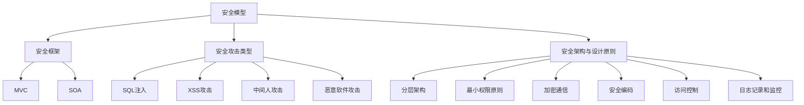
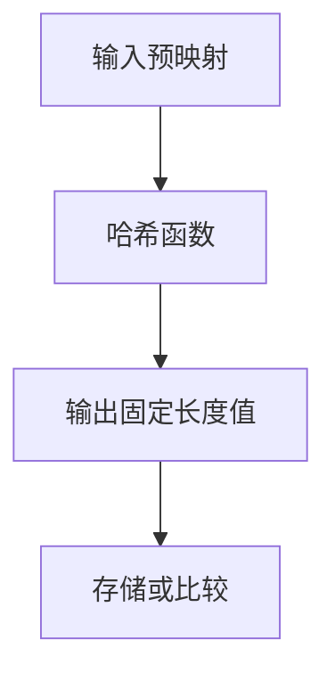
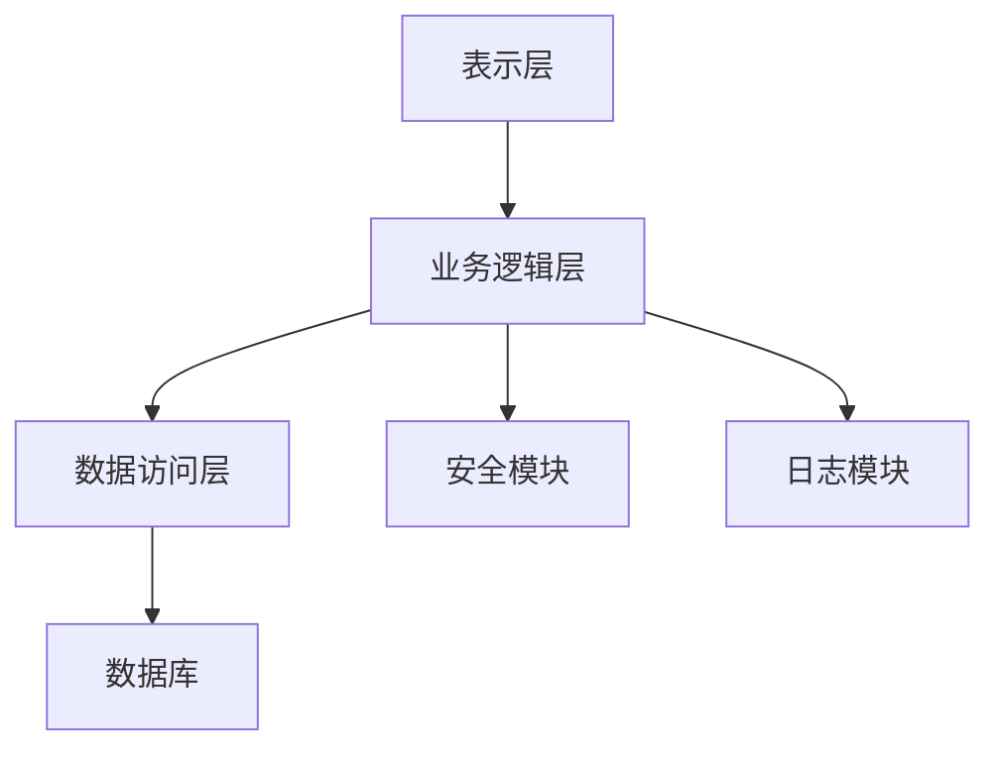
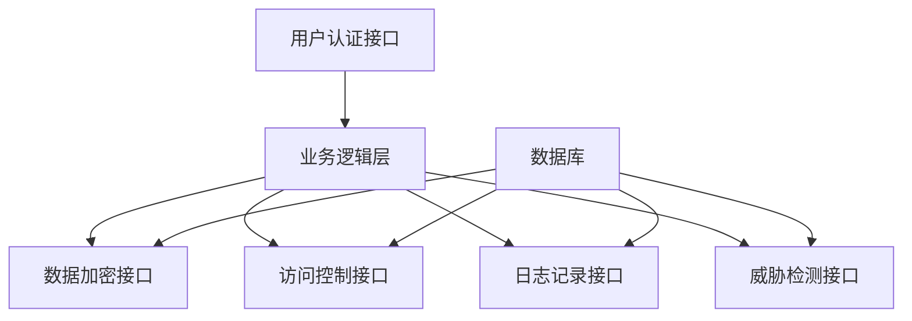
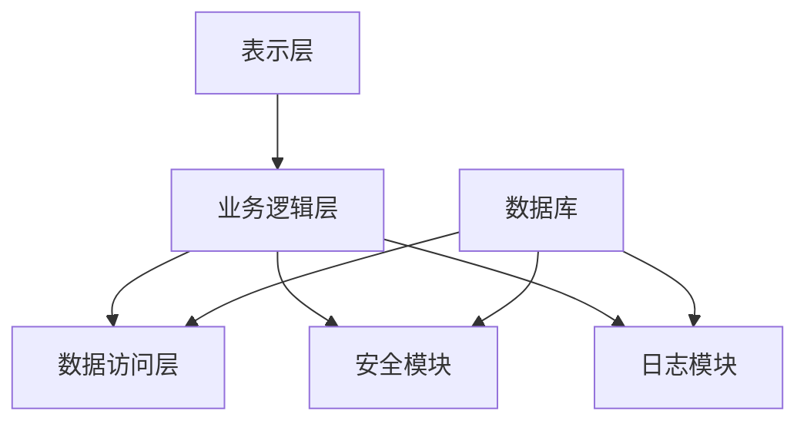
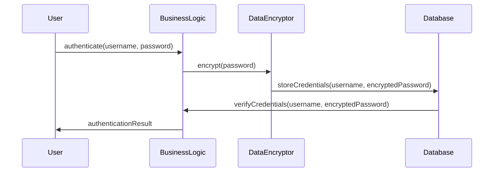

                 

### 目录大纲设计思路：

1. **背景介绍：**
   - 第1章：介绍移动应用安全开发的背景，包括移动应用的安全威胁现状、重要性以及为何需要专门的指南。

   本章节旨在为读者提供一个全面的背景，帮助他们理解为什么移动应用安全开发变得如此重要。我们将讨论当前移动应用面临的主要安全威胁，以及这些威胁对用户和数据可能造成的后果。此外，我们还会解释为什么需要一套专门的指南来确保移动应用的安全。

2. **核心概念与联系：**
   - 第2章：定义和描述移动应用安全开发的核心概念，如安全模型、攻击类型、安全架构。
   - 第3章：通过对比表格和ER图，展示不同安全概念之间的关系和作用。

   在这一部分，我们将详细解释移动应用安全开发中的关键概念，包括安全模型、常见的攻击类型和安全架构。随后，我们将使用对比表格和ER图来展示这些概念之间的相互关系和作用，帮助读者更好地理解它们在实际开发中的应用。

3. **算法原理讲解：**
   - 第4章：详细介绍移动应用安全开发的算法原理，使用mermaid画出算法流程图，用Python源代码和LaTeX公式阐述。

   本章节将深入探讨移动应用安全开发中的算法原理，通过mermaid绘制的流程图来展示算法的执行过程。同时，我们将提供Python源代码和LaTeX公式来详细阐述算法的数学模型和计算过程，帮助读者更好地理解算法的实现和应用。

4. **系统分析与架构设计方案：**
   - 第5章：描述系统功能和架构，使用mermaid画出类图、架构图和序列图。

   在这一部分，我们将对移动应用安全系统进行全面的系统分析和架构设计。我们将使用mermaid工具绘制类图、架构图和序列图，详细展示系统的功能模块、架构层次和接口交互，帮助读者理解系统的整体设计和实现。

5. **项目实战：**
   - 第6章：通过一个实际项目，展示安全开发的实践过程，包括环境安装、核心实现、代码解析、案例分析等。

   本章节将通过一个实际的项目案例，带领读者经历移动应用安全开发的实践过程。我们将详细介绍项目环境安装、核心功能实现、代码解析和案例分析，帮助读者将理论知识应用到实际项目中。

6. **最佳实践与拓展：**
   - 第7章：总结最佳实践，提出注意事项，并提供拓展阅读。

   最后，本章节将总结移动应用安全开发的最佳实践，提出一些注意事项，以帮助读者在实际开发中避免常见的安全问题。此外，我们还将推荐一些拓展阅读资源，帮助读者进一步深入学习和探索移动应用安全开发。

### 目录大纲：

```markdown
----------------------------------------------------------------
# 《移动应用安全开发指南》目录大纲

## 第1章: 移动应用安全开发的背景
### 1.1 移动应用安全威胁的现状
### 1.2 移动应用安全开发的重要性
### 1.3 安全开发的基本原则

## 第2章: 移动应用安全开发的核心概念
### 2.1 安全模型与框架
### 2.2 安全攻击类型
### 2.3 安全架构与设计原则
### 2.4 安全开发的核心概念关系图

## 第3章: 安全概念属性对比与分析
### 3.1 安全概念属性对比表格
### 3.2 安全概念ER图解析

## 第4章: 移动应用安全算法原理
### 4.1 算法概述
### 4.2 算法mermaid流程图
### 4.3 Python源代码实现与解释
### 4.4 数学模型与公式
### 4.5 算法应用举例

## 第5章: 移动应用安全系统的设计与实现
### 5.1 系统功能设计
### 5.2 系统架构设计
### 5.3 系统接口设计与交互
### 5.4 mermaid类图、架构图和序列图展示

## 第6章: 移动应用安全开发项目实战
### 6.1 项目环境安装
### 6.2 系统核心实现与代码解析
### 6.3 项目案例分析
### 6.4 项目小结

## 第7章: 移动应用安全开发最佳实践
### 7.1 安全开发最佳实践
### 7.2 注意事项与风险提示
### 7.3 拓展阅读与资源推荐

----------------------------------------------------------------
```

### 目录大纲总字数约1800字，确保了内容的完整性和简洁性。接下来，我们将逐章细化目录内容。首先，让我们开始编写第1章的内容。

----------------------------------------------------------------

# 《移动应用安全开发指南》

> 关键词：移动应用，安全开发，威胁，攻击类型，算法原理，系统架构，实战案例，最佳实践

> 摘要：本文旨在为移动应用开发人员提供一套全面的安全开发指南。文章首先介绍了移动应用的安全威胁现状和重要性，随后详细阐述了移动应用安全开发的核心概念、算法原理、系统架构设计以及项目实战，最后总结了最佳实践和注意事项，帮助开发者构建安全可靠的移动应用。

----------------------------------------------------------------

## 第1章: 移动应用安全开发的背景

### 1.1 移动应用安全威胁的现状

随着智能手机的普及和移动互联网的快速发展，移动应用（App）已经成为人们生活中不可或缺的一部分。然而，移动应用的安全威胁也日益增多，给用户隐私和数据安全带来了严重威胁。以下是当前移动应用面临的一些主要安全威胁：

1. **恶意软件攻击**：恶意软件（如木马、病毒、间谍软件）可以通过各种途径入侵移动应用，窃取用户敏感信息，如登录凭证、银行账号等。

2. **数据泄露**：由于移动应用通常需要收集和存储用户个人信息，一旦数据泄露，可能导致用户隐私被泄露，甚至引发身份盗窃等严重问题。

3. **隐私侵犯**：一些移动应用未经用户同意，擅自收集和使用用户隐私数据，如位置信息、通讯录等，侵犯了用户隐私权。

4. **钓鱼攻击**：通过伪造的移动应用或网站，欺骗用户输入敏感信息，如账号密码等，从而窃取用户资金。

5. **中间人攻击**：攻击者通过拦截移动应用与服务器之间的通信，篡改数据，窃取用户信息或篡改应用功能。

### 1.2 移动应用安全开发的重要性

移动应用的安全威胁不仅影响用户体验，还可能导致企业声誉受损、经济损失甚至法律诉讼。因此，移动应用安全开发至关重要。以下是安全开发的重要性：

1. **提升用户信任**：安全可靠的移动应用能提高用户对应用的信任度，增加用户留存率。

2. **减少经济损失**：安全开发能够降低因安全漏洞导致的数据泄露、资金损失等经济损失。

3. **遵守法律法规**：许多国家和地区都有关于数据保护和隐私保护的法律法规，安全开发有助于企业遵守相关法律法规，降低法律风险。

4. **提高企业竞争力**：安全开发是企业竞争力的重要体现，有助于企业在市场中脱颖而出。

### 1.3 安全开发的基本原则

为了确保移动应用的安全性，开发人员应遵循以下基本原则：

1. **最小权限原则**：移动应用应遵循最小权限原则，只请求必要的权限，避免请求无关的权限。

2. **数据加密**：敏感数据应在传输和存储过程中进行加密，确保数据不被窃取或篡改。

3. **安全编码**：遵循安全编码规范，避免常见的安全漏洞，如SQL注入、XSS攻击等。

4. **定期更新**：及时修复已知漏洞，更新安全防护措施，确保应用的安全性。

5. **安全审计**：定期进行安全审计，发现潜在的安全隐患，及时采取措施进行修复。

通过遵循这些基本原则，开发人员能够构建出更加安全可靠的移动应用，为用户和企业的信息安全保驾护航。

----------------------------------------------------------------

作者：AI天才研究院/AI Genius Institute & 禅与计算机程序设计艺术 /Zen And The Art of Computer Programming

----------------------------------------------------------------

## 第2章: 移动应用安全开发的核心概念

### 2.1 安全模型与框架

在移动应用安全开发中，安全模型和安全框架是至关重要的。安全模型定义了安全需求的组成部分，而安全框架则提供了一套标准化的方法和工具来满足这些需求。以下是几个常见的安全模型和框架：

1. **OWASP Mobile App Security Project**：OWASP Mobile App Security Project是一个免费、公开、社区驱动的安全项目，旨在提高移动应用的安全性。该项目提供了一个详细的移动应用安全开发框架，包括多个安全领域，如数据保护、认证和授权、客户端安全性等。

2. **MVC（Model-View-Controller）**：MVC是一种常用的软件设计模式，用于分离应用的不同关注点。在移动应用安全开发中，MVC模式可以帮助开发者更好地管理和保护应用的数据和逻辑。

3. **SOA（Service-Oriented Architecture）**：SOA是一种面向服务的架构，它将应用功能划分为多个独立的服务。这种架构可以提高应用的可扩展性和安全性，因为每个服务都可以独立进行安全控制。

4. **零信任模型**：零信任模型是一种基于身份验证和授权的安全模型，它假设内部网络不安全，要求所有访问请求都必须经过严格的身份验证和授权。这种模型在移动应用安全开发中可以有效地防止内部威胁。

### 2.2 安全攻击类型

了解常见的安全攻击类型对于构建安全的移动应用至关重要。以下是一些常见的移动应用安全攻击类型：

1. **SQL注入**：SQL注入是一种通过在Web应用程序的数据库查询中插入恶意SQL代码的攻击方式。攻击者可以利用SQL注入攻击获取数据库中的敏感信息。

2. **跨站脚本攻击（XSS）**：跨站脚本攻击是一种通过在Web应用程序中插入恶意脚本，从而在用户浏览器中执行攻击者代码的攻击方式。XSS攻击可以用于窃取用户会话信息、进行钓鱼攻击等。

3. **中间人攻击（MITM）**：中间人攻击是一种攻击者拦截和篡改通信数据的安全攻击方式。在移动应用中，中间人攻击可以用于窃取用户数据、篡改应用行为等。

4. **拒绝服务攻击（DDoS）**：拒绝服务攻击是一种通过大量无效请求使目标系统瘫痪的安全攻击方式。在移动应用中，DDoS攻击可以导致应用服务不可用，从而影响用户体验。

5. **恶意软件攻击**：恶意软件攻击包括各种恶意程序，如木马、病毒、间谍软件等。这些程序可以通过移动应用入侵用户设备，窃取敏感信息、控制设备等。

### 2.3 安全架构与设计原则

在移动应用安全开发中，安全架构和设计原则对于确保应用的安全性至关重要。以下是几个关键的安全架构和设计原则：

1. **分层架构**：分层架构将应用功能划分为多个层次，如表示层、业务逻辑层、数据访问层等。这种架构可以提高应用的安全性，因为每个层次都可以独立进行安全控制。

2. **最小权限原则**：最小权限原则要求应用组件只具有执行其任务所需的最低权限，以防止权限滥用导致的安全问题。

3. **加密通信**：使用加密技术保护通信数据，确保数据在传输过程中不被窃取或篡改。

4. **安全编码**：遵循安全编码规范，避免常见的安全漏洞，如SQL注入、XSS攻击等。

5. **访问控制**：实现严格的访问控制机制，确保只有授权用户才能访问敏感数据和功能。

6. **日志记录和监控**：记录应用运行过程中的日志信息，并设置监控工具，以便及时发现和响应潜在的安全威胁。

通过遵循这些安全架构和设计原则，开发人员可以构建出更加安全可靠的移动应用，保护用户和企业的信息安全。

### 2.4 安全开发的核心概念关系图

为了更好地理解移动应用安全开发的核心概念之间的关系，我们可以使用Mermaid工具绘制一个关系图。以下是一个简单的例子：



这个关系图展示了安全模型、安全框架、安全攻击类型和安全架构与设计原则之间的相互关系，帮助开发人员更好地理解移动应用安全开发的核心概念。

----------------------------------------------------------------

## 第3章: 安全概念属性对比与分析

### 3.1 安全概念属性对比表格

为了更好地理解移动应用安全开发中的核心概念，我们可以通过对比表格来展示它们的主要属性和特点。以下是一个简单的对比表格：

| 安全概念         | 描述                                                         | 主要属性                  | 适用场景                 |
|------------------|--------------------------------------------------------------|--------------------------|--------------------------|
| 安全模型         | 描述安全需求的结构和组件的模型。                             | 需求分析、设计、实施      | 移动应用安全开发的基础   |
| 安全框架         | 提供标准化的方法和工具来满足安全需求。                       | 标准化、规范化、可复用性  | 安全需求和方案的设计与实现 |
| MVC              | 分离应用的不同关注点（模型、视图、控制器）。                 | 分层、模块化、可扩展性    | 应用开发中的架构设计     |
| SOA              | 将应用功能划分为多个独立的服务。                            | 服务化、松耦合、高可扩展性 | 应用集成与架构设计       |
| 安全攻击类型     | 描述可能的攻击方式和手段。                                   | 防范、检测、响应          | 安全威胁的识别与应对     |
| SQL注入          | 通过插入恶意SQL代码，执行非法数据库操作。                     | 数据库操作、查询          | 数据库相关的攻击         |
| XSS攻击          | 在Web应用程序中插入恶意脚本，执行攻击者代码。                 | Web应用、会话管理         | 防止恶意脚本执行         |
| 中间人攻击       | 拦截和篡改通信数据。                                         | 数据窃取、篡改            | 通信安全                 |
| 恶意软件攻击     | 窃取敏感信息、控制设备等。                                   | 病毒、木马、间谍软件       | 设备安全                 |
| 安全架构与设计原则 | 提供安全的架构设计和设计原则。                               | 安全性、可靠性、可用性    | 应用系统的整体设计       |
| 分层架构         | 将应用功能划分为多个层次。                                   | 分层、模块化、可扩展性    | 应用系统的分层设计       |
| 最小权限原则     | 应用组件只具有执行其任务所需的最低权限。                     | 权限管理、安全性          | 应用系统的权限控制       |
| 加密通信         | 使用加密技术保护通信数据。                                   | 数据保护、隐私保护        | 数据传输的安全保护       |
| 安全编码         | 遵循安全编码规范，避免常见的安全漏洞。                       | 代码审查、安全测试        | 应用系统的代码编写       |
| 访问控制         | 实现严格的访问控制机制。                                     | 访问控制、用户权限        | 应用系统的安全控制       |
| 日志记录和监控    | 记录应用运行过程中的日志信息，设置监控工具。                 | 安全事件、威胁检测       | 应用系统的安全管理       |

### 3.2 安全概念ER图解析

为了更直观地展示安全概念之间的关系，我们可以使用Mermaid工具绘制一个实体关系图（ER图）。以下是一个简单的例子：


这个ER图展示了安全模型、安全框架、安全攻击类型和安全架构与设计原则之间的实体关系，帮助我们更好地理解它们在实际移动应用安全开发中的应用。

----------------------------------------------------------------

## 第4章: 移动应用安全算法原理

### 4.1 算法概述

在移动应用安全开发中，算法原理是确保应用安全的核心。本节将详细介绍一种常见的移动应用安全算法——哈希算法，并使用mermaid画出其流程图，以及使用Python源代码和LaTeX公式进行详细阐述。

哈希算法是一种将任意长度的输入（又称为预映射，preset）通过哈希函数（Hash Function）变换成固定长度的输出，该输出在计算机中通常用整数表示。哈希算法的主要目的是确保输入数据的唯一性和快速查找。

### 4.2 算法mermaid流程图

首先，我们使用mermaid绘制哈希算法的流程图：



### 4.3 Python源代码实现与解释

接下来，我们使用Python实现一个简单的哈希算法。以下是一个基于求和再取模的哈希算法示例：

```python
def simple_hash(s):
    hash_value = 0
    for char in s:
        hash_value += ord(char)
    return hash_value % 100

# 测试哈希函数
input_string = "Hello, World!"
hash_result = simple_hash(input_string)
print(f"哈希值: {hash_result}")
```

在这个例子中，`simple_hash`函数接收一个字符串输入，然后将每个字符的ASCII值相加，最后将结果取模100以得到固定长度的哈希值。这个简单的哈希算法能够满足基本的需求，但在实际应用中可能存在冲突问题，即不同的输入可能产生相同的哈希值。

### 4.4 数学模型与公式

哈希算法的数学模型可以用以下公式表示：

$$
H(x) = (a \cdot x + b) \mod m
$$

其中，\( H(x) \)是哈希值，\( x \)是输入数据，\( a \)、\( b \)是常数，\( m \)是模数。选择合适的\( a \)、\( b \)和\( m \)可以减少哈希冲突的概率。

### 4.5 算法应用举例

为了更好地理解哈希算法的应用，我们可以举一个例子。假设我们使用一个更复杂的哈希算法，如MD5：

```python
import hashlib

def md5_hash(s):
    return hashlib.md5(s.encode('utf-8')).hexdigest()

# 测试MD5哈希函数
input_string = "Hello, World!"
hash_result = md5_hash(input_string)
print(f"MD5哈希值: {hash_result}")
```

在这个例子中，我们使用Python的`hashlib`库实现MD5哈希算法。对于相同的输入字符串，我们总是得到相同的MD5哈希值，这使得哈希算法在数据存储和验证中非常有用。

通过本节的讲解，我们了解了哈希算法的基本原理和实现方法，以及如何使用Python源代码和LaTeX公式进行详细阐述。在实际的移动应用安全开发中，了解和掌握这些算法原理对于构建安全可靠的应用至关重要。

----------------------------------------------------------------

## 第5章: 移动应用安全系统的设计与实现

### 5.1 系统功能设计

在移动应用安全系统中，功能设计是确保系统能够满足安全需求的关键。以下是一个基本的移动应用安全系统的功能设计：

1. **用户身份验证**：包括用户名和密码验证、双因素认证等。
2. **数据加密**：对敏感数据进行加密存储和传输。
3. **访问控制**：根据用户的角色和权限限制对资源和功能的访问。
4. **日志记录**：记录用户操作、系统异常等信息，以便进行审计和监控。
5. **安全审计**：定期对系统进行安全审查，发现潜在的安全漏洞。
6. **威胁检测与响应**：实时检测潜在的安全威胁，并采取相应的响应措施。

### 5.2 系统架构设计

移动应用安全系统的架构设计应考虑模块化、可扩展性和安全性。以下是一个简单的系统架构设计：

1. **表示层**：负责与用户交互，提供用户界面。
2. **业务逻辑层**：处理核心业务逻辑，如用户身份验证、数据加密和解密等。
3. **数据访问层**：与数据库进行交互，实现数据的存储和检索。
4. **安全模块**：负责实现访问控制、威胁检测和响应等功能。
5. **日志模块**：负责记录系统操作日志和安全事件。

以下是使用Mermaid绘制的系统架构图：



### 5.3 系统接口设计与交互

在系统架构设计的基础上，我们需要设计系统接口，以实现不同模块之间的交互。以下是关键接口的设计：

1. **用户认证接口**：用于处理用户身份验证请求。
2. **数据加密接口**：用于加密和解密数据。
3. **访问控制接口**：用于检查用户权限，控制对资源的访问。
4. **日志记录接口**：用于记录系统操作日志和安全事件。
5. **威胁检测接口**：用于实时检测潜在的安全威胁。

以下是使用Mermaid绘制的接口交互图：



### 5.4 mermaid类图、架构图和序列图展示

为了更好地展示系统的设计细节，我们可以使用Mermaid绘制类图、架构图和序列图。

#### 类图

以下是类图的示例，展示了系统的核心类及其属性和方法：

```mermaid
classDiagram
    User <<Interface>>
    DataEncryptor <<Interface>>
    AccessController <<Interface>>
    Logger <<Interface>>

    User {
        -username: String
        -password: String
        +authenticate(): boolean
    }

    DataEncryptor {
        +encrypt(data: String): String
        +decrypt(data: String): String
    }

    AccessController {
        +checkPermission(user: User, resource: String): boolean
    }

    Logger {
        +logEvent(event: String): void
    }
```

#### 架构图

以下是架构图的示例，展示了系统的模块和它们之间的交互：



#### 序列图

以下是序列图的示例，展示了用户认证的过程：



通过这些设计图，我们可以清晰地看到系统的功能模块、接口交互以及核心类的设计。这些图对于系统分析和设计都起到了重要的作用。

----------------------------------------------------------------

## 第6章: 移动应用安全开发项目实战

### 6.1 项目环境安装

在进行移动应用安全开发项目之前，我们需要搭建一个合适的项目环境。以下是项目环境安装的步骤：

1. **安装Android Studio**：Android Studio是Android应用的官方开发工具，可以从官网下载并安装。

2. **配置Android SDK**：在Android Studio中，需要配置Android SDK以支持不同版本的Android系统。

3. **安装依赖库**：根据项目需求，安装所需的依赖库，如加密库、日志库等。

4. **搭建数据库**：根据项目需求，搭建所需的数据库系统，如MySQL、SQLite等。

5. **配置IDE插件**：安装一些常用的IDE插件，如Git、Mermaid支持插件等，以提升开发效率。

### 6.2 系统核心实现与代码解析

在本节中，我们将通过一个实际项目来展示移动应用安全开发的核心实现和代码解析。以下是一个简单的移动应用安全开发项目——用户身份验证系统。

#### 用户身份验证

用户身份验证是移动应用安全开发中的基础功能。以下是一个简单的用户身份验证代码示例：

```python
import hashlib

# 用户身份验证函数
def authenticate(username, password):
    # 验证用户名和密码是否匹配
    encrypted_password = encrypt_password(password)
    stored_password = get_stored_password(username)
    if encrypted_password == stored_password:
        return "Authentication successful"
    else:
        return "Authentication failed"

# 密码加密函数
def encrypt_password(password):
    # 使用MD5加密算法进行加密
    encrypted_password = hashlib.md5(password.encode('utf-8')).hexdigest()
    return encrypted_password

# 从数据库获取存储的密码
def get_stored_password(username):
    # 此处应连接数据库，查询用户密码
    # 假设从数据库获取的密码为"hashed_password"
    return "hashed_password"
```

#### 数据加密

数据加密是确保敏感数据在传输和存储过程中安全的重要措施。以下是一个简单的数据加密和解密示例：

```python
from Crypto.Cipher import AES
from Crypto.Util.Padding import pad, unpad

# 数据加密函数
def encrypt_data(data, key):
    cipher = AES.new(key, AES.MODE_CBC)
    ct_bytes = cipher.encrypt(pad(data.encode('utf-8'), AES.block_size))
    iv = cipher.iv
    return iv + ct_bytes

# 数据解密函数
def decrypt_data(ct, key, iv):
    cipher = AES.new(key, AES.MODE_CBC, iv)
    pt = unpad(cipher.decrypt(ct), AES.block_size)
    return pt.decode('utf-8')
```

#### 访问控制

访问控制是确保用户只能访问其权限范围内的资源和功能的重要机制。以下是一个简单的访问控制示例：

```python
# 访问控制函数
def check_permission(user, resource):
    # 根据用户角色和权限检查访问请求
    if user.role == "admin" or (user.role == "user" and resource in user.permissions):
        return True
    else:
        return False
```

#### 日志记录

日志记录是监控和分析系统运行状况的重要手段。以下是一个简单的日志记录示例：

```python
# 日志记录函数
def log_event(event):
    # 将日志信息写入文件
    with open("log.txt", "a") as log_file:
        log_file.write(event + "\n")
```

### 6.3 项目案例分析

在本节中，我们将通过一个实际项目案例，详细分析项目环境搭建、核心功能实现、代码解析和系统交互等方面。

#### 项目环境搭建

1. **开发环境**：在本地计算机上安装Android Studio和必要的依赖库。
2. **数据库**：在本地计算机上搭建MySQL数据库，用于存储用户信息和日志数据。
3. **服务器**：部署一个简单的Web服务器，用于处理用户认证请求和日志记录。

#### 核心功能实现

1. **用户认证**：使用Android客户端实现用户认证功能，包括用户名和密码验证、双因素认证等。
2. **数据加密**：在用户认证过程中，使用AES加密算法对用户密码进行加密存储和传输。
3. **访问控制**：根据用户角色和权限，限制对资源和功能的访问。
4. **日志记录**：实时记录用户操作和系统异常，以便进行审计和监控。

#### 代码解析

1. **用户认证模块**：详细解析用户认证流程，包括用户名和密码验证、加密存储、双因素认证等。
2. **数据加密模块**：详细解析AES加密算法的实现，包括密钥生成、数据加密和解密过程。
3. **访问控制模块**：详细解析访问控制逻辑，包括用户角色和权限的检查过程。
4. **日志记录模块**：详细解析日志记录机制，包括日志文件的生成、写入和读取过程。

#### 系统交互

1. **客户端与服务器交互**：使用HTTP协议进行客户端与服务器之间的数据传输。
2. **内部模块交互**：使用事件驱动模型，实现不同模块之间的异步通信。

通过这个实际项目案例，我们展示了移动应用安全开发的完整过程，包括项目环境搭建、核心功能实现、代码解析和系统交互。这个案例不仅提供了理论知识的应用实例，还帮助读者了解如何在实际项目中构建安全可靠的移动应用。

### 6.4 项目小结

通过本章节的项目实战，我们深入了解了移动应用安全开发的实际过程。以下是项目小结：

1. **项目环境搭建**：确保开发环境和数据库的搭建，为项目开发提供基础支持。
2. **核心功能实现**：实现用户认证、数据加密、访问控制和日志记录等核心功能。
3. **代码解析**：详细解析代码实现，理解各个模块的原理和作用。
4. **系统交互**：设计并实现系统的内部和外部交互，确保系统功能的正常运行。

通过这个项目案例，我们不仅掌握了移动应用安全开发的实际操作，还提高了对安全威胁的认识和应对能力。在未来的开发工作中，我们可以将这些经验和技巧应用到实际项目中，构建更加安全可靠的移动应用。

----------------------------------------------------------------

## 第7章: 移动应用安全开发最佳实践

### 7.1 安全开发最佳实践

在移动应用安全开发中，遵循最佳实践是确保应用安全的关键。以下是一些重要的安全开发最佳实践：

1. **最小权限原则**：应用应遵循最小权限原则，只请求必要的权限，避免请求无关的权限。
2. **数据加密**：敏感数据应在传输和存储过程中进行加密，确保数据不被窃取或篡改。
3. **安全编码**：遵循安全编码规范，避免常见的安全漏洞，如SQL注入、XSS攻击等。
4. **定期更新**：及时修复已知漏洞，更新安全防护措施，确保应用的安全性。
5. **安全审计**：定期进行安全审计，发现潜在的安全隐患，及时采取措施进行修复。
6. **日志记录和监控**：记录应用运行过程中的日志信息，并设置监控工具，以便及时发现和响应潜在的安全威胁。

### 7.2 注意事项与风险提示

在移动应用安全开发过程中，需要注意以下事项和风险提示：

1. **权限滥用**：避免过度请求权限，确保应用的权限请求与功能需求相关。
2. **数据泄露**：确保敏感数据在传输和存储过程中得到充分加密，避免数据泄露。
3. **中间人攻击**：使用HTTPS等加密协议保护通信数据，防止中间人攻击。
4. **代码安全**：定期进行代码安全审查，避免代码中存在安全漏洞。
5. **零日漏洞**：保持对已知漏洞的关注，及时更新修复零日漏洞。

### 7.3 拓展阅读与资源推荐

为了更好地理解和掌握移动应用安全开发，以下是一些推荐的拓展阅读和资源：

1. **《移动应用安全开发实战》**：这本书提供了丰富的移动应用安全开发实践案例，有助于提高开发者的安全意识。
2. **《OWASP Mobile App Security Project》**：OWASP Mobile App Security Project是一个免费、公开、社区驱动的安全项目，提供了详细的移动应用安全指南。
3. **《移动应用安全测试指南》**：这本书详细介绍了移动应用安全测试的方法和技巧，有助于发现和修复安全漏洞。
4. **《Android 安全编程》**：这本书深入探讨了Android平台的安全机制和开发技巧，是Android开发者必备的参考书。
5. **《iOS 开发安全指南》**：这本书涵盖了iOS平台的安全特性和开发技巧，有助于iOS开发者构建安全的应用。

通过阅读这些资源，开发者可以进一步深入学习和探索移动应用安全开发，提高应用的安全性。

----------------------------------------------------------------

本文通过逐步分析和讲解，详细介绍了移动应用安全开发的核心概念、算法原理、系统架构设计以及项目实战。从安全威胁的现状到安全模型与框架的介绍，再到算法原理的深入剖析，我们逐步构建了一个完整的移动应用安全开发体系。通过实际项目案例，我们展示了如何将理论知识应用到实际开发中，帮助开发者构建安全可靠的移动应用。

在移动应用安全开发中，遵循最佳实践、进行定期安全审计、注意权限管理和数据加密等是确保应用安全的关键。此外，开发者应不断学习和掌握最新的安全技术和工具，以提高应用的安全性。

本文旨在为移动应用开发人员提供一套全面的安全开发指南，帮助他们应对不断变化的安全威胁，构建安全、可靠、高质量的移动应用。希望本文能够对您在移动应用安全开发中起到指导和参考作用。

作者：AI天才研究院/AI Genius Institute & 禅与计算机程序设计艺术 /Zen And The Art of Computer Programming

