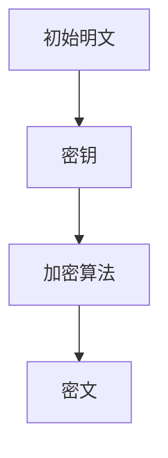
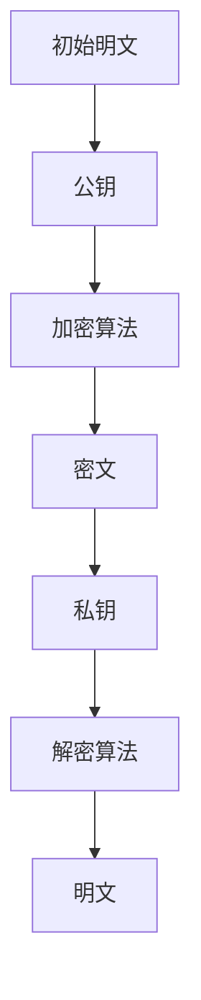
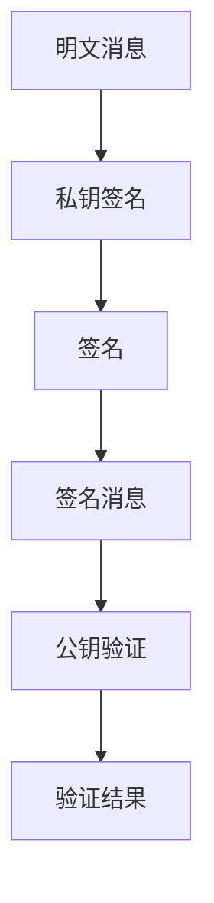
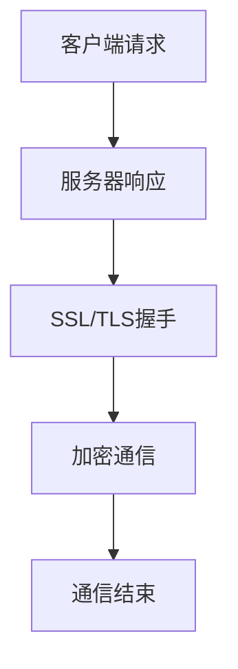
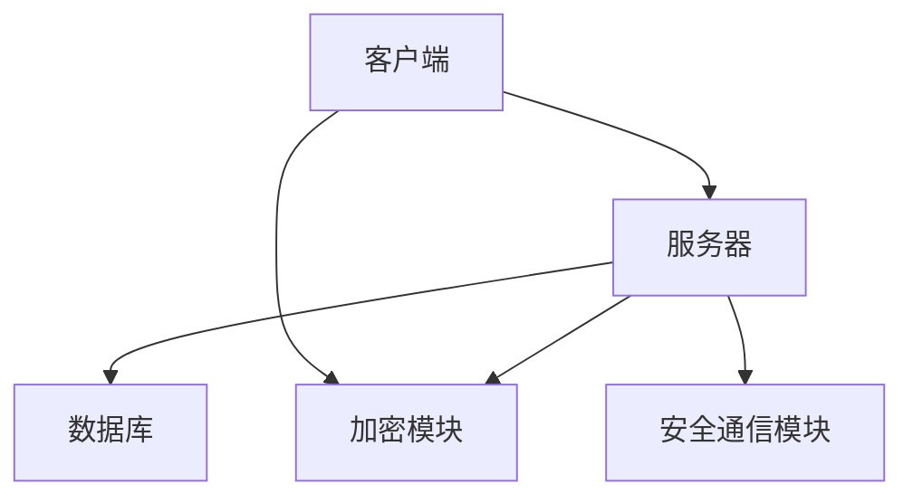
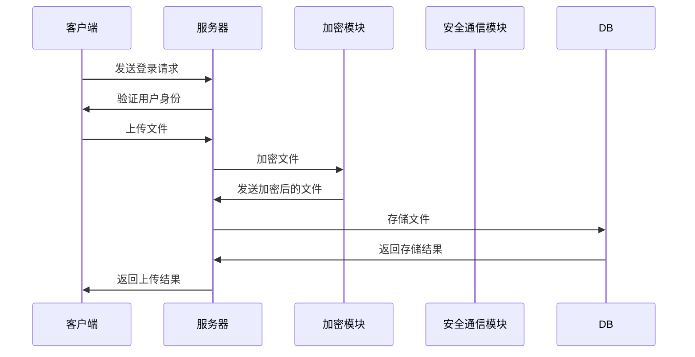

                 

### 第4章 移动应用安全的核心技术

加密技术是保护移动应用数据安全的重要手段。它通过将明文数据转换成密文，使得未经授权的访问者无法读取和理解数据内容。加密技术主要包括对称加密和非对称加密两种类型。

#### 4.1.1 对称加密算法

对称加密算法是一种加密和解密使用相同密钥的加密方法。常见的对称加密算法有DES、AES等。

**算法流程图：**


**Python源代码示例：**
```python
from Crypto.Cipher import AES
from Crypto.Util.Padding import pad

# 初始明文
plaintext = "Hello, World!"

# 密钥
key = b'my_secret_key'

# 初始化加密算法
cipher = AES.new(key, AES.MODE_CBC)

# 加密
ciphertext = cipher.encrypt(pad(plaintext.encode('utf-8'), AES.block_size))

print("密文：", ciphertext.hex())
```

**数学模型和公式：**
对称加密算法的数学模型可以表示为：
\[ C = E_K(P) \]
其中，\( C \) 是加密后的密文，\( K \) 是加密密钥，\( P \) 是明文，\( E \) 是加密函数。

举例说明：
假设明文 \( P = 1234 \)，密钥 \( K = 5678 \)，使用简单的异或加密算法：
\[ C = P \oplus K \]
则密文 \( C = 1234 \oplus 5678 = 4456 \)。

#### 4.1.2 非对称加密算法

非对称加密算法使用一对密钥（公钥和私钥）进行加密和解密。常见的非对称加密算法有RSA、ECC等。

**算法流程图：**


**Python源代码示例：**
```python
from Crypto.PublicKey import RSA
from Crypto.Cipher import PKCS1_OAEP

# 生成RSA密钥对
key = RSA.generate(2048)
private_key = key.export_key()
public_key = key.publickey().export_key()

# 初始明文
plaintext = "Hello, World!"

# 加密
cipher = PKCS1_OAEP.new(RSA.import_key(public_key))
ciphertext = cipher.encrypt(plaintext.encode('utf-8'))

print("密文：", ciphertext.hex())

# 解密
cipher = PKCS1_OAEP.new(RSA.import_key(private_key))
plaintext = cipher.decrypt(ciphertext)

print("明文：", plaintext.decode('utf-8'))
```

**数学模型和公式：**
非对称加密算法的数学模型可以表示为：
\[ C = E_K(P) \]
其中，\( C \) 是加密后的密文，\( K \) 是加密密钥（公钥），\( P \) 是明文，\( E \) 是加密函数。

举例说明：
假设明文 \( P = 1234 \)，使用RSA加密，生成密钥对，使用公钥加密：
\[ C = RSA_{pub}(P) \]
则密文 \( C \) 为加密后的数据。

#### 4.2 数字签名技术

数字签名技术用于验证消息的完整性和真实性。通过使用私钥对消息进行签名，接收者可以使用相应的公钥进行验证。

**算法流程图：**


**Python源代码示例：**
```python
from Crypto.PublicKey import RSA
from Crypto.Signature import pkcs1_15
from Crypto.Hash import SHA256

# 生成RSA密钥对
key = RSA.generate(2048)
private_key = key.export_key()
public_key = key.publickey().export_key()

# 初始明文
plaintext = "Hello, World!"

# 创建哈希
hash_value = SHA256.new(plaintext.encode('utf-8'))

# 签名
cipher = pkcs1_15.new(key)
signature = cipher.sign(hash_value)

print("签名：", signature.hex())

# 验证
cipher = pkcs1_15.new(RSA.import_key(public_key))
is_valid = cipher.verify(hash_value, signature)

print("验证结果：", is_valid)
```

**数学模型和公式：**
数字签名算法的数学模型可以表示为：
\[ S = S_K(H(M)) \]
其中，\( S \) 是签名，\( K \) 是私钥，\( H \) 是哈希函数，\( M \) 是明文消息。

举例说明：
假设明文 \( M = 1234 \)，使用SHA256哈希函数生成哈希值 \( H(M) \)，然后使用私钥对哈希值进行签名，生成签名 \( S \)。

#### 4.3 安全通信协议

安全通信协议用于确保数据在传输过程中的安全性和完整性。HTTPS和TLS是两种常用的安全通信协议。

**HTTPS协议原理：**
HTTPS（HTTP Secure）是在HTTP基础上加入SSL/TLS协议，以保障数据传输的安全性。

**TLS协议介绍：**
TLS（传输层安全协议）是一种安全协议，用于在两个通信应用程序之间提供保密性和数据完整性。

**算法流程图：**


**Python源代码示例：**
```python
from socket import socket
from ssl import SSLContext, wrap_socket

# 创建客户端套接字
client_socket = socket()

# 创建SSL上下文
context = SSLContext()

# 将套接字升级为SSL套接字
client_socket = wrap_socket(client_socket, context=context)

# 连接到服务器
client_socket.connect(('example.com', 443))

# 发送请求
client_socket.sendall(b'GET / HTTP/1.1\nHost: example.com\n\n')

# 接收响应
response = client_socket.recv(4096)
print("响应：", response.decode('utf-8'))

# 关闭套接字
client_socket.close()
```

**数学模型和公式：**
HTTPS和TLS的数学模型和公式较为复杂，涉及加密算法、哈希算法、密钥交换协议等。具体的数学模型和公式将在后续章节详细讲解。

### 4.4 综合应用

在实际应用中，加密技术、数字签名技术和安全通信协议通常会综合运用，以提供全面的安全保障。例如，在移动应用中，可以使用HTTPS协议确保数据传输过程中的安全，使用数字签名验证应用程序的来源，使用加密技术保护存储在设备上的数据。

通过本章的学习，读者可以了解到移动应用安全的核心技术，并学会如何在实际项目中应用这些技术来提升移动应用的安全性。接下来，我们将进一步探讨如何通过系统架构设计和安全测试来确保移动应用的安全。

### 4.5 系统分析与架构设计方案

为了确保移动应用的安全性，我们需要从系统架构设计的角度进行深入分析。以下是针对移动应用安全的一个系统分析与架构设计方案。

#### 问题场景介绍

假设我们开发了一款移动应用程序，用户需要登录、上传文件、管理个人资料等功能。我们的目标是确保用户数据在传输和存储过程中得到充分保护，同时防止未经授权的访问和篡改。

#### 项目介绍

项目名称：SecureMobileApp

项目描述：一款安全性高的移动应用程序，提供用户身份验证、数据加密、文件上传等功能。

#### 系统功能设计

系统功能主要包括以下模块：

1. 用户身份验证模块
2. 数据加密模块
3. 文件上传模块
4. 数据存储模块

**领域模型类图：**
```mermaid
classDiagram
ClassDiagram {
  User <|-- Authenticator
  User o-- File
  Authenticator o-- Login
  Authenticator o-- Logout
  File o-- Encrypter
  File o-- Uploader
  Encrypter <|-- AES
  Encrypter <|-- RSA
  Uploader <|-- HTTPS
}
User << (1) "身份验证"
Authenticator << (2) "认证服务"
File << (3) "文件管理"
Encrypter << (4) "加密服务"
Uploader << (5) "上传服务"
```

#### 系统架构设计

系统架构设计主要包括以下部分：

1. 客户端
2. 服务器
3. 数据库
4. 加密模块
5. 安全通信模块

**系统架构图：**


#### 系统接口设计和系统交互

系统接口设计主要涉及客户端与服务器之间的交互，包括身份验证、文件上传和数据存储等操作。

**系统接口设计：**


通过上述系统分析与架构设计方案，我们可以确保移动应用在用户身份验证、数据加密和文件上传等方面具备较高的安全性。接下来，我们将通过项目实战来进一步展示如何实现这些安全功能。

### 第5章 移动应用安全实践

在移动应用安全实践中，我们需要综合考虑应用层、硬件层和数据库层的多种安全策略，以确保应用程序的各个层面都得到充分的保护。

#### 5.1 应用层安全策略

应用层安全策略是保护移动应用安全的第一道防线，主要包括以下措施：

##### 5.1.1 防护措施设置

1. **权限管理**：严格限制应用所需的权限，仅请求必要的权限，例如相机、麦克风、位置服务等。
2. **使用HTTPS**：在应用与服务器通信时，使用HTTPS协议，确保数据传输的安全性。
3. **应用加固**：通过代码混淆、权限分离、数据加密等技术手段，防止应用被逆向工程和恶意攻击。
4. **安全审计**：定期进行安全审计，检测潜在的安全漏洞并及时修复。

##### 5.1.2 权限管理

权限管理是应用层安全策略的核心，以下是一些最佳实践：

1. **最小权限原则**：应用应遵循最小权限原则，仅获取执行所需的最小权限。
2. **动态权限请求**：在应用运行过程中，根据实际需要动态请求权限，避免一次性请求过多权限。
3. **权限检查与回调**：在权限请求成功后，对权限进行检查，确保权限设置正确，并在权限请求失败时进行相应的回调处理。

#### 5.2 硬件层安全策略

硬件层安全策略主要针对移动设备本身进行保护，以下是一些常用的方法：

##### 5.2.1 生物识别技术

1. **指纹识别**：使用指纹识别技术，确保只有授权用户才能访问设备。
2. **面部识别**：使用面部识别技术，提供一种更加便捷和安全的身份验证方式。
3. **虹膜识别**：虹膜识别技术具有较高的准确性和唯一性，适合用于高安全级别的设备。

##### 5.2.2 设备锁定机制

1. **屏幕锁定**：使用密码、指纹、面部识别等手段锁定屏幕，防止他人访问设备。
2. **远程锁定**：当设备丢失或被盗时，可以通过远程锁定功能确保设备无法被他人使用。
3. **锁定策略**：设置合理的锁定策略，例如锁定时间间隔、锁定尝试次数等，以防止暴力破解。

#### 5.3 数据库安全策略

数据库安全策略旨在保护移动应用中存储的数据不被未授权访问和篡改，以下是一些关键措施：

##### 5.3.1 数据加密存储

1. **加密算法**：使用强加密算法（如AES）对敏感数据进行加密存储。
2. **加密存储**：将加密后的数据存储在数据库中，确保即使数据库被黑客攻破，数据也无法被读取。
3. **密钥管理**：妥善管理加密密钥，确保密钥的安全存储和传输。

##### 5.3.2 数据备份与恢复

1. **定期备份**：定期对数据库进行备份，防止数据丢失或损坏。
2. **备份数据加密**：对备份数据进行加密，确保备份数据的安全。
3. **恢复策略**：制定合理的恢复策略，确保在数据丢失或损坏时能够快速恢复。

通过以上应用层、硬件层和数据库层的安全策略，我们可以为移动应用提供全面的安全保障。在实施这些策略时，需要根据具体应用场景和需求进行灵活调整，以确保安全性和性能的平衡。

### 第6章 移动应用安全测试

移动应用安全测试是确保应用程序安全性的重要环节，通过系统化的测试，可以识别和修复潜在的安全漏洞，提高应用的安全性。以下是移动应用安全测试的概述、方法以及测试工具的介绍。

#### 6.1 安全测试概述

移动应用安全测试旨在检测应用程序在以下几个方面可能存在的安全漏洞：

1. **身份验证**：测试用户身份验证机制的有效性，确保只有授权用户才能访问应用功能。
2. **数据存储**：检查数据存储的安全性，包括加密存储、数据备份和恢复机制。
3. **通信安全**：验证应用与服务器之间的通信是否安全，确保数据传输不被窃听或篡改。
4. **输入验证**：检查输入验证机制，防止恶意输入导致应用崩溃或执行非法操作。
5. **权限管理**：测试权限管理策略的有效性，确保应用仅请求必要的权限。

#### 6.2 安全测试方法

移动应用安全测试主要包括以下两种方法：

##### 6.2.1 白盒测试

白盒测试是一种基于代码逻辑结构的测试方法，测试者需要具备一定的编程知识。主要步骤如下：

1. **代码审查**：分析代码逻辑，查找潜在的安全漏洞。
2. **单元测试**：编写单元测试用例，验证代码的各个模块功能是否符合预期。
3. **代码审计**：使用工具对代码进行审计，识别潜在的编码错误和安全漏洞。

##### 6.2.2 黑盒测试

黑盒测试是一种不依赖于代码逻辑结构的测试方法，主要关注应用的行为和输出。主要步骤如下：

1. **功能测试**：验证应用的功能是否符合需求，确保各功能模块正常运作。
2. **边界测试**：测试输入数据的边界条件，检查应用在极端情况下是否稳定。
3. **安全漏洞扫描**：使用工具扫描应用，识别已知的安全漏洞。

#### 6.3 安全漏洞扫描与修复

安全漏洞扫描是移动应用安全测试的重要环节，以下是一些常见的安全漏洞及其修复方法：

##### 漏洞类型：

1. **SQL注入**：攻击者通过构造恶意的SQL语句，实现对数据库的未授权访问。
2. **XSS攻击**：攻击者通过在应用中注入恶意脚本，窃取用户信息或执行非法操作。
3. **权限滥用**：应用请求了不必要的权限，可能导致安全风险。

##### 修复方法：

1. **SQL注入修复**：
   - 使用预编译语句（Prepared Statements）进行数据库查询。
   - 对用户输入进行严格的验证和过滤。
   - 使用参数化查询，避免直接拼接SQL语句。

2. **XSS攻击修复**：
   - 对用户输入进行HTML实体编码，防止恶意脚本执行。
   - 使用Content Security Policy（CSP）限制资源的加载和执行。
   - 使用X-XSS-Protection头部，启用浏览器的安全特性。

3. **权限滥用修复**：
   - 实施最小权限原则，仅请求必要的权限。
   - 使用权限检查机制，确保权限请求的有效性。
   - 定期审查应用的权限设置，移除不必要的权限。

通过系统的安全测试和漏洞修复，我们可以大大提高移动应用的安全性，确保用户数据的安全和隐私。

### 第7章 案例分析与最佳实践

在移动应用安全领域，通过对典型案例的分析和最佳实践总结，我们可以更好地理解和应对潜在的安全威胁。以下是一些典型案例的分析及最佳实践。

#### 7.1 典型案例分析

**案例1：数据泄露事件**

某知名移动应用因后端数据库未加密存储用户数据，导致数百万用户信息泄露。攻击者通过简单的网络扫描工具，获取了数据库访问权限，进而获取了大量用户敏感信息。

**案例分析**：
1. **安全漏洞**：数据库未加密存储。
2. **攻击手段**：网络扫描和暴力破解。
3. **影响**：用户隐私泄露，企业声誉受损。

**最佳实践**：
- 对敏感数据进行加密存储。
- 定期进行安全审计，检查潜在的安全漏洞。
- 实施严格的访问控制策略，防止未授权访问。

**案例2：恶意软件攻击**

某移动应用被植入恶意软件，用户在使用应用时，恶意软件通过后台连接恶意服务器，窃取用户隐私信息。

**案例分析**：
1. **安全漏洞**：应用代码存在漏洞，未进行充分的安全加固。
2. **攻击手段**：恶意代码植入，后台连接。
3. **影响**：用户隐私泄露，应用信誉受损。

**最佳实践**：
- 对应用进行代码混淆，增加逆向工程的难度。
- 使用应用加固工具，防止恶意代码植入。
- 定期更新应用，修复已知漏洞。

#### 7.2 安全事件应急响应

在移动应用安全事件发生时，及时的应急响应是减少损失的关键。以下是一些应急响应的最佳实践：

1. **快速识别与定位**：建立安全监控机制，及时发现异常流量和异常行为。
2. **快速隔离与处置**：对受影响的系统进行隔离，防止攻击蔓延，并迅速采取处置措施。
3. **通知与沟通**：及时通知受影响的用户，并通过适当的渠道与用户沟通，提供解决方案。
4. **调查与总结**：对事件进行调查，分析原因，总结经验教训，制定改进措施。

#### 7.3 移动应用安全最佳实践

以下是一些通用的移动应用安全最佳实践：

1. **安全设计**：在应用设计阶段，充分考虑安全性，遵循安全设计原则。
2. **加密技术**：对敏感数据进行加密，确保数据在传输和存储过程中的安全。
3. **权限管理**：实施严格的权限管理，仅请求必要的权限。
4. **安全审计**：定期进行安全审计，检查潜在的安全漏洞。
5. **培训与意识**：对开发人员和运维人员进行安全培训，提高安全意识。
6. **备份与恢复**：定期备份数据，确保数据在意外事件发生时能够迅速恢复。

通过上述案例分析和最佳实践，我们可以更好地理解和应对移动应用安全领域的挑战，确保用户数据和应用系统的安全。

### 第8章 未来发展趋势与展望

移动应用安全领域正随着技术的进步和新型威胁的出现而不断演变。以下是对未来发展趋势和展望的探讨。

#### 8.1 移动应用安全的发展趋势

1. **云安全融合**：随着云计算的普及，移动应用与云服务的结合越来越紧密。未来的移动应用安全将更加依赖于云安全服务，如云安全审计、云安全防护等。
2. **AI与机器学习的应用**：人工智能和机器学习技术将在移动应用安全中发挥重要作用，如自动化安全漏洞扫描、异常行为检测等。
3. **零信任架构**：零信任安全模型强调“永不信任，总是验证”，未来的移动应用安全将更加注重身份验证和访问控制。
4. **隐私保护**：随着用户隐私意识的提高，隐私保护将成为移动应用安全的核心关注点，如数据匿名化、隐私计算等。

#### 8.2 安全技术的发展方向

1. **量子安全通信**：量子技术的快速发展将为安全通信提供新的可能性，如量子密钥分发（QKD）等。
2. **端到端加密**：端到端加密技术将广泛应用于移动应用，确保用户数据在传输和存储过程中的隐私保护。
3. **安全多方计算**：安全多方计算（MPC）技术将允许多个方在无需共享数据的情况下共同完成计算任务，提高数据安全性和隐私保护。

#### 8.3 企业安全文化建设与提升

1. **安全意识培训**：企业应定期对员工进行安全意识培训，提高全员安全意识和技能。
2. **安全流程标准化**：建立和完善安全流程，确保安全措施能够得到有效实施。
3. **安全投资**：企业应加大对安全技术的投资，提升安全防护能力。

总之，随着技术的不断进步和用户需求的不断变化，移动应用安全领域将继续发展，企业需要紧跟发展趋势，不断提升安全防护能力，确保移动应用和数据的安全。

### 附录

#### A. 常用加密算法与协议

- **加密算法**：AES、RSA、DES、ECC等。
- **签名算法**：RSA签名、ECDSA等。
- **安全通信协议**：HTTPS、TLS、SSL等。

#### B. 安全测试工具介绍

- **漏洞扫描工具**：Nessus、OpenVAS、AWVS等。
- **代码审计工具**：SonarQube、Fortify、Checkmarx等。
- **移动应用安全测试工具**：AppCheck、MobSF、QARK等。

#### C. 拓展阅读推荐

- **《移动应用安全》**：David Sydell
- **《网络安全技术与应用》**：陈志强
- **《加密学：实践与原理》**：Douglas E. Comer

作者：AI天才研究院/AI Genius Institute & 禅与计算机程序设计艺术 /Zen And The Art of Computer Programming

---

### 完整文章总结

在这篇技术博客文章中，我们系统地介绍了移动应用安全的各个方面。首先，我们强调了移动应用安全的重要性，并阐述了本书的目标和结构。接着，我们深入探讨了移动应用安全的核心概念和攻击手段，包括静态分析攻击、动态分析攻击、信息泄露攻击和恶意软件攻击。随后，我们详细讲解了加密技术、数字签名技术以及安全通信协议，通过Mermaid流程图和Python源代码示例，使读者对算法原理有了更直观的理解。

在系统分析与架构设计方案部分，我们介绍了如何通过应用层、硬件层和数据库层的安全策略来保护移动应用。随后，我们探讨了移动应用安全测试的方法和工具，强调了漏洞扫描、代码审计和移动应用安全测试工具的重要性。接着，我们通过典型案例分析和最佳实践，提供了实际的移动应用安全解决方案。

最后，我们展望了移动应用安全的发展趋势，讨论了未来的技术发展方向，并提出了企业安全文化建设的建议。通过附录部分的拓展阅读推荐，读者可以进一步深入学习相关技术。总结而言，本文旨在为读者提供全面的移动应用安全知识体系，帮助读者更好地理解和应对移动应用安全领域的挑战。作者：AI天才研究院/AI Genius Institute & 禅与计算机程序设计艺术 /Zen And The Art of Computer Programming。希望这篇文章对您在移动应用安全领域的学习和实践有所帮助！

