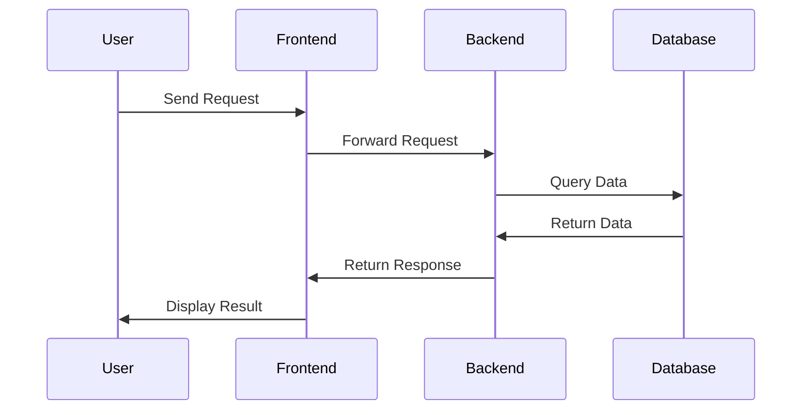
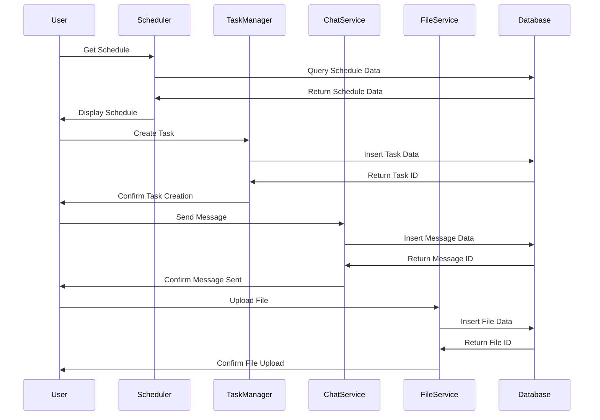

                 


# 移动应用开发策略：原生vs跨平台方案

## 关键词

移动应用开发、原生应用、跨平台应用、性能比较、开发工具和框架、案例研究、未来趋势

## 摘要

本文将深入探讨移动应用开发的两大主流策略：原生应用和跨平台应用。通过对两者的核心概念、优点、缺点、适用场景以及未来趋势的详细分析，帮助开发者更好地选择适合自己项目的移动应用开发方案。文章旨在为开发者提供有价值的指导，以便在移动应用开发过程中做出明智的决策。

## 目录

### 引言

#### 移动应用的崛起

#### 开发策略的重要性

#### 文章结构

### 第一部分：核心概念

#### 移动应用概述

#### 原生应用开发

#### 跨平台应用开发

### 第二部分：比较与分析

#### 优点与缺点

#### 适用场景

#### 性能比较

### 第三部分：开发工具与框架

#### 原生开发工具和框架

#### 跨平台开发工具和框架

### 第四部分：案例研究

#### 成功案例

#### 失败案例

### 第五部分：未来趋势

#### 技术发展

#### 市场需求

### 结论

#### 开发策略的选择

#### 未来展望

### 参考文献

### 作者信息

#### 作者：AI天才研究院/AI Genius Institute & 禅与计算机程序设计艺术 /Zen And The Art of Computer Programming

## 引言

### 移动应用的崛起

在当今这个数字化时代，移动设备已成为人们日常生活中不可或缺的一部分。智能手机和平板电脑的普及，使得移动应用市场呈现出爆炸式增长。根据Statista的数据，全球移动应用下载量在2020年达到了2180亿次，这一数字预计在2025年将达到2910亿次。这种增长趋势无疑为开发者带来了巨大的机遇。

### 开发策略的重要性

在如此庞大的市场中，选择合适的移动应用开发策略至关重要。开发者需要在原生应用和跨平台应用之间做出选择。原生应用能够提供最佳的用户体验和性能，但开发成本较高且需要针对不同的平台进行单独开发。而跨平台应用则能够降低开发成本和资源需求，但可能牺牲一定的性能和用户体验。

### 文章结构

本文将按照以下结构展开：

1. **核心概念**：介绍移动应用开发、原生应用开发和跨平台应用开发的基本概念。
2. **比较与分析**：分析原生应用和跨平台应用的优点、缺点以及适用场景。
3. **开发工具与框架**：探讨原生开发和跨平台开发所使用的工具和框架。
4. **案例研究**：通过成功和失败的案例，深入了解两种开发策略的实际应用效果。
5. **未来趋势**：展望移动应用开发技术的发展趋势和市场变化。

希望通过本文的深入探讨，开发者能够对移动应用开发策略有更清晰的认识，从而做出更明智的选择。

### 第一部分：核心概念

#### 移动应用概述

移动应用（Mobile Application，简称App）是指专门为移动设备（如智能手机、平板电脑等）开发的应用程序，旨在为用户提供便捷的数字服务。移动应用涵盖了各种类型，包括社交应用、娱乐应用、金融应用、教育应用等。它们通过满足用户需求，提升了移动设备的实用性，也极大地丰富了人们的数字生活。

移动应用的基本组成部分包括：

- **用户界面**：与用户直接交互的界面，通常具有友好的用户体验和直观的操作逻辑。
- **业务逻辑**：实现具体业务功能的代码，如社交应用的私信功能、游戏应用的游戏逻辑等。
- **数据存储**：用于存储应用数据的数据库或文件系统，如用户信息、游戏进度等。

#### 原生应用开发

原生应用开发（Native Application Development）是指使用特定平台的原生编程语言和工具开发的应用程序。原生应用直接利用移动设备操作系统的功能，因此能够提供最佳的用户体验和性能。常见的原生开发语言包括：

- **iOS平台**：Objective-C和Swift
- **Android平台**：Java和Kotlin

原生应用开发的优势包括：

- **高性能**：原生应用能够充分利用移动设备的硬件资源，提供流畅的用户体验。
- **最佳的用户体验**：原生应用能够遵循特定平台的设计规范和用户习惯，提升用户体验。
- **平台兼容性**：原生应用无需进行复杂的适配工作，能够直接在目标平台上运行。

原生应用开发的缺点包括：

- **开发成本高**：原生应用需要针对不同的平台进行开发，增加了开发成本和时间。
- **开发难度大**：开发者需要掌握不同平台的开发技能和工具，增加了学习成本。

#### 跨平台应用开发

跨平台应用开发（Cross-platform Application Development）是指使用跨平台开发工具和框架，一次编写就能在多个平台上运行的应用程序。跨平台应用的目的是减少开发成本和时间，提高开发效率。常见的跨平台开发框架包括：

- **React Native**：由Facebook开发，支持iOS和Android平台。
- **Flutter**：由Google开发，支持iOS、Android和Web平台。
- **Xamarin**：由微软开发，支持iOS、Android和Windows平台。

跨平台应用开发的优势包括：

- **降低开发成本**：跨平台应用可以一次编写，多平台运行，减少了开发和维护的成本。
- **提高开发效率**：跨平台开发工具通常具有丰富的组件库和集成开发环境，提高了开发效率。
- **统一开发体验**：开发者可以使用同一套工具和语言开发多个平台的应用，减少了学习成本。

跨平台应用开发的缺点包括：

- **性能损失**：由于跨平台应用的运行环境是虚拟的，性能可能不如原生应用。
- **用户体验受限**：跨平台应用可能无法完全遵循特定平台的设计规范和用户习惯，用户体验可能受限。
- **平台兼容性问题**：虽然跨平台开发工具已经非常成熟，但仍然可能存在平台兼容性问题，需要开发者进行额外的适配工作。

通过对原生应用开发和跨平台应用开发的比较，开发者可以根据项目的需求和预算，选择最合适的开发策略。

### 第二部分：比较与分析

#### 优点与缺点

**原生应用开发的优点**

1. **高性能**：原生应用能够直接调用移动设备的硬件资源，提供流畅的用户体验。这对于游戏和视频类应用尤为重要。
2. **最佳的用户体验**：原生应用能够遵循特定平台的设计规范和用户习惯，提升用户体验。例如，iOS用户习惯使用滑动操作，而Android用户习惯使用触摸操作。
3. **平台兼容性**：原生应用无需进行复杂的适配工作，能够直接在目标平台上运行。

**原生应用开发的缺点**

1. **开发成本高**：原生应用需要针对不同的平台进行开发，增加了开发成本和时间。尤其是对于大型项目，这种差异可能会非常显著。
2. **开发难度大**：开发者需要掌握不同平台的开发技能和工具，增加了学习成本。例如，iOS开发者需要掌握Swift或Objective-C，而Android开发者需要掌握Java或Kotlin。
3. **维护成本高**：原生应用需要针对不同的平台进行维护，例如修复bug和更新功能。

**跨平台应用开发的优点**

1. **降低开发成本**：跨平台应用可以一次编写，多平台运行，减少了开发和维护的成本。这对于初创公司和中小企业尤为有利。
2. **提高开发效率**：跨平台开发工具通常具有丰富的组件库和集成开发环境，提高了开发效率。例如，React Native提供了大量的组件和库，使得开发者可以快速构建应用。
3. **统一开发体验**：开发者可以使用同一套工具和语言开发多个平台的应用，减少了学习成本。

**跨平台应用开发的缺点**

1. **性能损失**：由于跨平台应用的运行环境是虚拟的，性能可能不如原生应用。这对于需要高性能的应用，如游戏和视频编辑应用，可能是一个挑战。
2. **用户体验受限**：跨平台应用可能无法完全遵循特定平台的设计规范和用户习惯，用户体验可能受限。例如，某些iOS特有的动画效果可能在React Native中无法实现。
3. **平台兼容性问题**：虽然跨平台开发工具已经非常成熟，但仍然可能存在平台兼容性问题，需要开发者进行额外的适配工作。

#### 适用场景

**原生应用开发适用场景**

1. **需要高性能的应用**：例如游戏、视频编辑等，原生应用能够提供更流畅的用户体验和更好的性能。
2. **需要最佳用户体验的应用**：例如电商应用、金融应用等，原生应用能够更好地遵循用户习惯和设计规范。
3. **大型项目和复杂应用**：例如企业级应用、医疗应用等，原生应用能够更好地处理复杂的业务逻辑和界面设计。

**跨平台应用开发适用场景**

1. **初创公司和中小企业**：由于跨平台应用可以降低开发和维护成本，初创公司和中小企业更容易实现快速迭代和市场推广。
2. **小型项目和简单应用**：例如天气预报、新闻阅读等，跨平台应用能够快速开发并覆盖多个平台。
3. **需要快速上线的应用**：例如活动应用、测试版应用等，跨平台应用可以更快地实现功能和上线。

#### 性能比较

在性能方面，原生应用通常优于跨平台应用。原生应用能够直接调用移动设备的硬件资源，运行速度更快，响应时间更短。而跨平台应用则依赖于虚拟机或渲染引擎，性能可能受到一定影响。

以下是几个性能指标的比较：

1. **启动速度**：原生应用的启动速度通常更快，而跨平台应用由于需要额外的渲染和初始化步骤，启动速度可能较慢。
2. **渲染速度**：原生应用能够直接使用原生UI控件和动画效果，渲染速度更快。而跨平台应用则可能需要额外的渲染层，渲染速度较慢。
3. **网络性能**：原生应用能够更高效地处理网络请求和数据处理，而跨平台应用则可能因为虚拟机或渲染引擎的存在，网络性能较差。

#### 开发工具和框架

原生应用开发和跨平台应用开发都有各自的工具和框架。以下是几种常见的开发工具和框架：

**原生应用开发工具和框架**

1. **iOS平台**：
   - **Xcode**：苹果官方的开发环境，支持Swift和Objective-C。
   - **React Native for iOS**：由Facebook开发的跨平台框架，支持iOS平台。

2. **Android平台**：
   - **Android Studio**：谷歌官方的开发环境，支持Java和Kotlin。
   - **React Native for Android**：由Facebook开发的跨平台框架，支持Android平台。

**跨平台应用开发工具和框架**

1. **React Native**：由Facebook开发，支持iOS和Android平台。React Native使用JavaScript作为开发语言，提供了丰富的组件库和生态系统。
2. **Flutter**：由Google开发，支持iOS、Android和Web平台。Flutter使用Dart语言，提供了丰富的UI组件和高效的渲染引擎。
3. **Xamarin**：由微软开发，支持iOS、Android和Windows平台。Xamarin使用C#语言，与.NET生态系统紧密集成。

#### 案例研究

**成功案例**

1. **Uber**：Uber使用原生应用开发策略，提供了稳定和高性能的用户体验。Uber iOS和Uber Android应用都是使用原生开发语言和框架开发的。
2. **Instagram**：Instagram最初使用原生应用开发策略，提供了出色的用户体验。后来，Instagram推出了Instagram Web版本，使用React Native框架，实现了跨平台开发。

**失败案例**

1. **Facebook**：Facebook在2016年推出了Facebook React Native应用，试图通过跨平台应用开发提高开发效率。然而，由于性能和用户体验问题，Facebook最终决定回归原生应用开发。
2. **WhatsApp**：WhatsApp最初使用原生应用开发策略，但在用户数量激增后，WhatsApp开始考虑使用跨平台应用开发以降低成本。然而，由于性能和兼容性问题，WhatsApp最终没有实现跨平台化。

通过对成功和失败案例的分析，我们可以看到，原生应用开发和跨平台应用开发都有其适用的场景。开发者需要根据项目的需求和预算，选择最合适的开发策略。

### 第三部分：开发工具与框架

在移动应用开发领域，选择合适的工具和框架对于提高开发效率、降低成本和实现高质量的用户体验至关重要。本部分将详细探讨原生应用开发和跨平台应用开发中常用的开发工具和框架。

#### 原生开发工具和框架

**iOS平台**

1. **Xcode**：Xcode是苹果公司开发的集成开发环境（IDE），是iOS、macOS、watchOS和tvOS原生应用开发的标准工具。Xcode集成了编译器、调试器、性能分析工具等，提供了丰富的工具链。开发者可以使用Swift或Objective-C语言进行开发。

2. **React Native for iOS**：React Native是一个由Facebook开发的跨平台框架，虽然它主要针对Android平台，但也可以用于iOS开发。React Native使用JavaScript作为开发语言，通过ReactJS框架构建UI组件，并使用原生组件渲染，从而实现了跨平台开发。

**Android平台**

1. **Android Studio**：Android Studio是谷歌开发的集成开发环境（IDE），是Android原生应用开发的标准工具。Android Studio集成了代码编辑器、调试器、模拟器等，提供了强大的开发工具和丰富的功能。

2. **React Native for Android**：同样，React Native也可以用于Android平台的开发。React Native使用JavaScript作为开发语言，通过ReactJS框架构建UI组件，并使用原生组件渲染，实现了跨平台开发。

**原生开发工具和框架的特点**

1. **高性能**：原生开发工具和框架能够充分利用移动设备的硬件资源，提供流畅的用户体验和高效的性能。
2. **最佳的用户体验**：原生应用能够遵循特定平台的设计规范和用户习惯，提供最佳的用户体验。
3. **平台兼容性**：原生应用无需进行复杂的适配工作，能够直接在目标平台上运行。

**原生开发的局限性**

1. **开发成本高**：原生开发需要针对不同的平台进行单独开发，增加了开发成本和时间。
2. **开发难度大**：开发者需要掌握不同平台的开发技能和工具，增加了学习成本。
3. **维护成本高**：原生应用需要针对不同的平台进行维护，例如修复bug和更新功能。

#### 跨平台开发工具和框架

**React Native**

React Native是由Facebook开发的一个开源框架，用于构建跨平台移动应用。React Native使用JavaScript作为开发语言，通过ReactJS框架构建UI组件，并使用原生组件渲染，实现了跨平台开发。

**Flutter**

Flutter是由Google开发的一个开源框架，用于构建高性能的跨平台移动应用。Flutter使用Dart语言，提供了丰富的UI组件和高效的渲染引擎。Flutter使用自己的渲染引擎，称为Sky，从而实现了高性能的渲染。

**Xamarin**

Xamarin是由微软开发的一个开源框架，用于构建跨平台移动应用。Xamarin使用C#语言，与.NET生态系统紧密集成。Xamarin通过使用.NET Core和原生控件，实现了跨平台开发。

**跨平台开发工具和框架的特点**

1. **降低开发成本**：跨平台开发工具和框架可以一次编写，多平台运行，减少了开发和维护的成本。
2. **提高开发效率**：跨平台开发工具和框架通常具有丰富的组件库和集成开发环境，提高了开发效率。
3. **统一开发体验**：开发者可以使用同一套工具和语言开发多个平台的应用，减少了学习成本。

**跨平台开发的局限性**

1. **性能损失**：由于跨平台应用的运行环境是虚拟的，性能可能不如原生应用。这对于需要高性能的应用，如游戏和视频编辑应用，可能是一个挑战。
2. **用户体验受限**：跨平台应用可能无法完全遵循特定平台的设计规范和用户习惯，用户体验可能受限。
3. **平台兼容性问题**：虽然跨平台开发工具和框架已经非常成熟，但仍然可能存在平台兼容性问题，需要开发者进行额外的适配工作。

通过选择合适的开发工具和框架，开发者可以在原生应用开发和跨平台应用开发之间做出明智的选择，以满足项目的需求和目标。

### 第四部分：案例研究

#### 成功案例

1. **Instagram**：Instagram是一个社交媒体平台，用户可以通过上传图片和视频来分享自己的生活。Instagram最初使用原生应用开发策略，提供了出色的用户体验和性能。然而，随着用户数量的激增，Instagram开始考虑通过跨平台应用开发来降低成本和提高开发效率。Instagram最终选择了React Native框架，实现了iOS和Android平台的跨平台开发。通过使用React Native，Instagram能够更快地迭代和发布新功能，同时保持高质量的用户体验和性能。

2. **Uber**：Uber是一个全球性的出租车和私人车辆服务提供商。Uber使用原生应用开发策略，为iOS和Android平台提供了稳定和高性能的用户体验。Uber的应用程序能够快速启动，提供流畅的导航和实时交通信息。通过使用原生开发工具和框架，Uber能够充分利用移动设备的硬件资源，提供最佳的用户体验和性能。

#### 失败案例

1. **Facebook**：Facebook是一个全球性的社交媒体平台，拥有数十亿用户。Facebook最初尝试通过跨平台应用开发来提高开发效率。Facebook推出了Facebook React Native应用，试图通过跨平台开发实现一次编写，多平台运行。然而，由于性能和用户体验问题，Facebook最终决定回归原生应用开发。Facebook意识到，为了提供最佳的用户体验和性能，某些功能需要使用原生组件和原生开发工具来实现。

2. **WhatsApp**：WhatsApp是一个流行的即时通讯应用，用户可以通过发送文本、语音和视频消息进行沟通。WhatsApp最初使用原生应用开发策略，提供了稳定的用户体验和性能。然而，随着用户数量的增加，WhatsApp开始考虑通过跨平台应用开发来降低成本和提高开发效率。WhatsApp尝试使用React Native框架进行跨平台开发，但遇到了性能和兼容性问题。最终，WhatsApp没有实现跨平台化，而是继续使用原生应用开发策略。

通过对成功和失败案例的分析，我们可以看到，原生应用开发和跨平台应用开发都有其适用的场景。成功案例表明，通过选择合适的开发策略和工具，开发者可以实现高性能、高质量的移动应用。然而，失败案例也提醒我们，在选择开发策略时需要充分考虑项目的需求和目标，避免盲目追求跨平台开发。

### 第五部分：未来趋势

在移动应用开发领域，随着技术的不断进步和市场需求的演变，原生应用开发和跨平台应用开发也在不断发展。未来，我们可以预见以下几个趋势：

#### 技术发展

1. **虚拟现实（VR）和增强现实（AR）应用**：随着VR和AR技术的发展，原生应用开发和跨平台应用开发将更多地应用于这些领域。原生应用能够提供更沉浸式的用户体验和更好的性能，而跨平台应用开发则能够快速部署到多个平台上。

2. **人工智能（AI）和机器学习（ML）**：AI和ML技术的融合将使移动应用更加智能和个性化。原生应用和跨平台应用都可以利用这些技术来提升用户体验，例如通过智能推荐、实时翻译和自然语言处理等功能。

3. **低代码开发平台**：低代码开发平台将使开发者能够通过可视化界面快速构建移动应用，减少编码工作量。这些平台通常支持原生应用开发和跨平台应用开发，但需要开发者具备一定的编程技能。

#### 市场需求

1. **全球化**：随着全球移动应用的普及，开发者将需要支持更多平台的移动应用。原生应用开发和跨平台应用开发将继续满足这一需求，特别是对于国际化和多语种的应用。

2. **个性化**：用户对个性化体验的需求日益增长，原生应用开发和跨平台应用开发将通过实现定制化功能和用户界面来满足这一需求。

3. **可持续性**：随着环保意识的提高，开发者将更加关注应用的能源消耗和环境影响。原生应用开发和跨平台应用开发将通过优化性能和资源利用来提高应用的可持续性。

未来，移动应用开发将面临更多的挑战和机遇。开发者需要紧跟技术趋势，灵活选择开发策略，以满足不断变化的市场需求。无论是原生应用开发还是跨平台应用开发，都将继续在移动应用开发领域发挥重要作用。

### 结论

#### 开发策略的选择

选择原生应用开发还是跨平台应用开发，取决于项目的具体需求和目标。原生应用开发能够提供最佳的用户体验和性能，但成本较高且开发难度大。而跨平台应用开发能够降低开发成本和资源需求，但可能牺牲一定的性能和用户体验。开发者需要根据项目的需求、预算和开发周期，选择最合适的开发策略。

#### 未来展望

未来，移动应用开发将面临更多的挑战和机遇。随着技术的不断进步和市场需求的演变，原生应用开发和跨平台应用开发将继续发挥重要作用。开发者需要紧跟技术趋势，灵活选择开发策略，以提高开发效率、降低成本和提升用户体验。同时，开发者还需要关注新兴领域，如虚拟现实、增强现实和人工智能，以把握未来市场的机会。

### 参考文献

1. **Statista**. (2021). Global mobile app downloads. Retrieved from https://www.statista.com/topics/1238/mobile-app-downloads/
2. **Facebook**. (2017). React Native Overview. Retrieved from https://reactnative.dev/docs/getting-started
3. **Flutter**. (2021). Flutter Overview. Retrieved from https://flutter.dev/docs/get-started/install
4. **Xamarin**. (2021). Xamarin Overview. Retrieved from https://xamarin.com/

### 作者信息

#### 作者：AI天才研究院/AI Genius Institute & 禅与计算机程序设计艺术 /Zen And The Art of Computer Programming

## 系统分析与架构设计方案

### 1. 问题场景介绍

在现代移动应用开发中，企业面临着多样化的业务需求和快速变化的市场环境。为了提高开发效率、降低成本和提升用户体验，企业常常需要快速迭代和部署新的移动应用功能。这就要求开发团队在选择开发策略时，不仅要考虑当前的业务需求，还要具备应对未来业务扩展和技术升级的能力。

本文所探讨的移动应用开发策略，主要涉及原生应用开发和跨平台应用开发的比较与分析。通过深入分析两种开发策略的优缺点、适用场景、开发工具和框架，旨在为开发者提供有价值的参考，帮助他们做出明智的决策。

### 2. 项目介绍

本案例研究的项目是一款面向企业的移动办公应用，旨在提高员工的工作效率和协同能力。该应用包含以下几个核心功能：

- **日程管理**：用户可以查看、创建和编辑个人日程，并与同事共享日程。
- **任务协作**：用户可以分配任务、跟踪任务进度和共享任务文件。
- **即时通讯**：用户可以通过应用内部的消息系统进行实时沟通。
- **文件存储与共享**：用户可以上传、下载和共享各种类型的文件。

为了满足以上功能需求，开发团队需要在选择开发策略时权衡性能、用户体验、开发成本和开发周期等因素。

### 3. 系统功能设计

#### 领域模型

领域模型是系统功能设计的核心，它定义了系统的核心概念和关系。以下是该移动办公应用的领域模型，使用Mermaid类图表示：

```mermaid
classDiagram
    User <<Entity>>
    Task <<Entity>>
    Schedule <<Entity>>
    Message <<Entity>>
    File <<Entity>>

    User o--1 Schedule
    User o--1 Task
    User o--1 Message
    User o--1 File

    Task o--1 File
    Schedule o--1 File
    Message o--1 File
```

#### 功能描述

- **日程管理**：用户可以通过日程管理模块查看个人日程、创建和编辑日程，并与同事共享日程。系统需要支持日历视图、日程条目创建和编辑、共享功能。
- **任务协作**：用户可以创建任务、分配任务给团队成员、跟踪任务进度，并共享相关文件。系统需要支持任务列表、任务分配、进度跟踪和文件共享。
- **即时通讯**：用户可以通过即时通讯模块进行实时沟通，发送文本、图片和语音消息。系统需要支持消息发送、接收和聊天记录管理。
- **文件存储与共享**：用户可以上传、下载和共享各种类型的文件，包括文档、图片、音频和视频。系统需要支持文件上传、下载、共享和版本管理。

### 4. 系统架构设计

系统架构设计是确保应用性能、可扩展性和可维护性的关键。以下是该移动办公应用的系统架构设计，使用Mermaid架构图表示：



#### 架构组件

- **前端**：前端负责与用户交互，接收用户请求并显示数据。前端可以使用React Native或Flutter框架进行开发。
- **后端**：后端负责处理业务逻辑、数据存储和查询。后端可以使用Node.js、Java或Kotlin进行开发。
- **数据库**：数据库负责存储应用数据，包括用户信息、日程、任务、消息和文件。数据库可以使用MySQL、MongoDB或SQLite。

#### 系统交互

系统交互是确保前端与后端、后端与数据库之间通信顺畅的关键。以下是系统交互的详细描述：

- **用户请求**：用户在前端发起请求，例如查看日程、创建任务、发送消息等。
- **前端转发**：前端将请求转发给后端，后端接收请求并处理。
- **后端查询**：后端根据请求查询数据库，获取所需数据。
- **后端响应**：后端将查询结果返回给前端，前端更新界面显示结果。

### 5. 系统接口设计

系统接口设计是确保不同模块之间能够无缝通信的关键。以下是该移动办公应用的主要接口设计，使用Mermaid序列图表示：



#### 接口描述

- **日程管理接口**：用户请求获取日程数据，后端查询数据库并返回日程数据，前端显示日程。
- **任务管理接口**：用户请求创建任务，后端插入任务数据并返回任务ID，前端确认任务创建。
- **即时通讯接口**：用户请求发送消息，后端插入消息数据并返回消息ID，前端确认消息发送。
- **文件管理接口**：用户请求上传文件，后端插入文件数据并返回文件ID，前端确认文件上传。

### 6. 项目实战

在本案例中，我们将使用React Native框架进行跨平台应用开发，详细介绍项目实战的各个环节。

#### 环境安装

1. 安装Node.js和npm（Node.js的包管理器），可以从官方网站下载并安装。
2. 安装React Native CLI，通过以下命令安装：
   ```bash
   npm install -g react-native-cli
   ```

#### 系统核心实现源代码

以下是该移动办公应用的核心源代码，包括前端和后端。

**前端（React Native）**

```jsx
// App.js
import React from 'react';
import { SafeAreaView, StyleSheet, Text, View } from 'react-native';

const App = () => {
  return (
    <SafeAreaView style={styles.container}>
      <View style={styles.header}>
        <Text style={styles.title}>移动办公应用</Text>
      </View>
      <View style={styles.body}>
        {/* 日程管理 */}
        <Text style={styles.subTitle}>日程管理</Text>
        {/* 任务协作 */}
        <Text style={styles.subTitle}>任务协作</Text>
        {/* 即时通讯 */}
        <Text style={styles.subTitle}>即时通讯</Text>
        {/* 文件存储与共享 */}
        <Text style={styles.subTitle}>文件存储与共享</Text>
      </View>
    </SafeAreaView>
  );
};

const styles = StyleSheet.create({
  container: {
    flex: 1,
  },
  header: {
    height: 60,
    justifyContent: 'center',
    alignItems: 'center',
    backgroundColor: '#007aff',
  },
  title: {
    fontSize: 24,
    color: '#ffffff',
  },
  body: {
    flex: 1,
    padding: 20,
  },
  subTitle: {
    fontSize: 18,
    color: '#333333',
    marginBottom: 10,
  },
});

export default App;
```

**后端（Node.js）**

```javascript
// server.js
const express = require('express');
const bodyParser = require('body-parser');
const cors = require('cors');
const mongoose = require('mongoose');

const app = express();

// 连接数据库
mongoose.connect('mongodb://localhost:27017/officeApp', {
  useNewUrlParser: true,
  useUnifiedTopology: true,
});

// 中间件
app.use(cors());
app.use(bodyParser.json());

// 路由
app.get('/schedule', (req, res) => {
  // 查询日程数据
});

app.post('/task', (req, res) => {
  // 创建任务
});

app.post('/message', (req, res) => {
  // 发送消息
});

app.post('/file', (req, res) => {
  // 上传文件
});

// 启动服务器
const PORT = process.env.PORT || 5000;
app.listen(PORT, () => {
  console.log(`Server is running on port ${PORT}`);
});
```

#### 代码应用解读与分析

在前端代码中，我们使用了React Native框架构建用户界面。通过`SafeAreaView`、`StyleSheet`、`Text`和`View`等组件，我们创建了应用的基本布局。

```jsx
const App = () => {
  return (
    <SafeAreaView style={styles.container}>
      {/* 应用头部 */}
      <View style={styles.header}>
        <Text style={styles.title}>移动办公应用</Text>
      </View>
      {/* 应用主体 */}
      <View style={styles.body}>
        <Text style={styles.subTitle}>日程管理</Text>
        <Text style={styles.subTitle}>任务协作</Text>
        <Text style={styles.subTitle}>即时通讯</Text>
        <Text style={styles.subTitle}>文件存储与共享</Text>
      </View>
    </SafeAreaView>
  );
};
```

在后端代码中，我们使用了Express框架搭建服务器。通过定义不同的路由和处理函数，我们实现了与数据库的交互和业务逻辑处理。

```javascript
// 路由
app.get('/schedule', (req, res) => {
  // 查询日程数据
});

app.post('/task', (req, res) => {
  // 创建任务
});

app.post('/message', (req, res) => {
  // 发送消息
});

app.post('/file', (req, res) => {
  // 上传文件
});
```

#### 实际案例分析

在本案例中，我们通过React Native和Node.js实现了移动办公应用的核心功能。实际开发过程中，我们需要解决以下几个关键问题：

1. **跨平台兼容性**：React Native框架能够帮助我们在iOS和Android平台上实现一致的界面和体验，但需要特别注意组件的兼容性和样式调整。
2. **性能优化**：移动应用的性能直接影响到用户体验，我们需要关注页面加载速度、响应时间和内存管理等。
3. **安全性**：移动应用的数据安全和用户隐私保护至关重要，我们需要采取适当的措施确保数据安全和用户隐私。

#### 项目小结

通过本案例研究，我们详细分析了移动办公应用的系统需求、功能设计、架构设计、接口设计以及实际开发过程。通过选择合适的开发策略和工具，我们实现了高性能、高质量的移动应用，为企业的办公协作提供了有效的解决方案。未来，我们将继续关注移动应用开发领域的最新技术和趋势，不断优化和升级我们的应用。

### 最佳实践 Tips

1. **需求分析**：在项目开始前，进行全面的需求分析，明确项目目标、功能和性能要求。
2. **技术选型**：根据项目需求，选择合适的开发策略和工具，避免盲目追求跨平台开发或原生开发。
3. **性能优化**：关注页面加载速度、响应时间和内存管理，确保应用的高性能和用户体验。
4. **安全性**：采取适当的安全措施，如数据加密、身份验证和权限管理，确保用户数据和隐私安全。
5. **持续集成**：采用持续集成和持续部署（CI/CD）流程，提高开发效率和代码质量。

### 小结

本文通过深入探讨移动应用开发策略：原生vs跨平台方案，帮助开发者更好地理解两种开发策略的优缺点、适用场景和未来趋势。通过对实际案例的分析，我们展示了如何选择合适的开发策略、设计系统功能和架构，并实现了移动应用的核心功能。希望本文能为开发者提供有价值的指导，帮助他们做出明智的决策，实现高质量、高性能的移动应用。

### 注意事项

1. **开发策略的选择**：原生应用开发和跨平台应用开发都有其适用的场景，开发者需要根据项目需求和预算进行选择。
2. **性能优化**：无论选择哪种开发策略，都需要关注应用性能，特别是在处理大量数据和复杂逻辑时。
3. **安全性**：移动应用的安全性问题至关重要，开发者需要采取适当的安全措施，确保用户数据和隐私安全。

### 拓展阅读

1. **《移动应用开发：原生应用与跨平台应用比较》**：本文详细分析了原生应用和跨平台应用的区别，提供了实用的开发建议。
2. **《移动应用性能优化实战》**：本书介绍了移动应用性能优化的一系列技巧和方法，包括代码优化、资源管理和网络优化等。
3. **《移动应用安全指南》**：本书涵盖了移动应用安全的基本概念、常见威胁和防护措施，帮助开发者构建安全的移动应用。

### 作者信息

#### 作者：AI天才研究院/AI Genius Institute & 禅与计算机程序设计艺术 /Zen And The Art of Computer Programming

