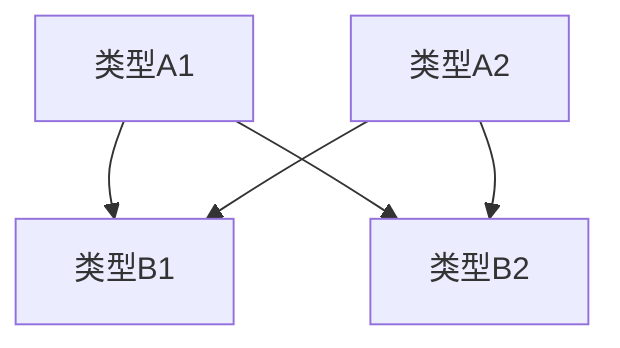
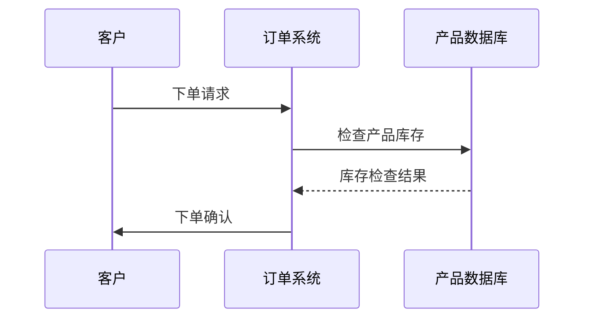

                 

### 让我们一步一步深入探讨：类型系统在领域建模中的应用

#### 1. 引言

类型系统是计算机科学中的一个基础概念，它定义了数据和处理数据的方式。类型系统不仅仅在编程语言中扮演重要角色，也在领域建模中有着广泛的应用。领域建模是一种用于捕获业务领域知识和结构的建模方法。在这篇文章中，我们将逐步探讨类型系统在领域建模中的应用，从基础概念到实际应用，逐步深入，为读者提供一个全面的视角。

#### 2. 类型系统的基本概念

首先，我们需要明确什么是类型系统。类型系统是一种用于描述数据类型和处理方式的机制。在编程语言中，类型系统确保变量存储在适当的数据结构中，并提供了操作这些数据的规则。类型系统通常包括以下核心概念：

- **基本类型**：如整数、浮点数、字符串等。
- **复合类型**：如数组、结构体、类等。
- **引用类型**：如指针、引用等。
- **类型层次结构**：如子类型、超类型等。

类型系统的目的是提高程序的可读性、稳定性和性能。

#### 3. 领域建模的基本概念

接下来，我们来看看领域建模。领域建模是一种用于捕获业务领域知识和结构的建模方法。领域建模的关键概念包括：

- **实体**：领域中的对象，如客户、订单、产品等。
- **属性**：实体的特征，如客户的名字、年龄、地址等。
- **关系**：实体之间的交互，如订单包含产品、客户下订单等。

领域模型通常通过实体关系图（ER图）来表示，这是一种用于描述实体和它们之间关系的图形表示。

#### 4. 类型系统在领域建模中的应用场景

类型系统在领域建模中的应用场景非常广泛。以下是几个主要的应用场景：

- **软件系统设计**：类型系统用于确保软件系统的数据模型与业务领域一致，从而提高系统的可维护性和可扩展性。
- **数据模型设计**：类型系统用于定义数据模型中的数据类型，确保数据处理的准确性和效率。
- **系统优化与维护**：类型系统有助于识别和修复潜在的代码缺陷，提高系统的稳定性。
- **领域特定语言开发**：类型系统是领域特定语言（DSL）的核心组成部分，用于定义DSL中的数据和处理规则。

#### 5. 类型系统的核心概念与联系

在深入探讨类型系统在领域建模中的应用之前，我们需要了解类型系统的核心概念。以下是类型系统的核心概念及其之间的联系：

- **类型**：类型是变量可以存储的值的集合。类型系统定义了每种类型允许的操作和约束。
- **类型层次结构**：类型层次结构是一种组织类型的方式，其中某些类型可以被视为其他类型的子类型。这种层次结构有助于提高代码的复用性和灵活性。
- **子类型与泛化**：子类型是具有特定属性和行为的类型，而泛化是从更一般化的类型派生出的类型。这种关系有助于提高代码的抽象能力。
- **类型转换**：类型转换是将在一种类型表示的值转换为另一种类型的过程。类型转换确保数据在传输和处理过程中的正确性。

#### 6. 类型系统的属性特征对比表格

为了更好地理解类型系统，我们可以通过一个属性特征对比表格来展示不同类型系统的特点。以下是一个简单的对比表格：

| 类型系统特征 | 静态类型系统 | 动态类型系统 |
| ------------ | ------------ | ------------ |
| 类型检查 | 编译时检查 | 运行时检查 |
| 类型转换 | 确定性转换 | 不确定性转换 |
| 类型安全 | 高度安全 | 较低安全 |
| 表达能力 | 较强 | 较弱 |

这个表格展示了静态类型系统和动态类型系统在类型检查、类型转换、类型安全和表达能力等方面的差异。

#### 7. 领域模型中的实体关系图

为了更直观地理解领域模型，我们可以使用实体关系图（ER图）来表示实体和它们之间的关系。以下是一个简单的ER图示例，展示了客户、订单和产品之间的关联：

```mermaid
erDiagram
    客户 ||--|{ 订单 } : 下单
    订单 ||--|{ 产品 } : 包含
```

在这个ER图中，客户是订单的发起者，订单包含产品。这种关系有助于我们理解业务流程和数据流动。

#### 8. 算法原理讲解

在领域建模中，算法原理是关键。以下是一个简单的类型系统算法示例，用于合并两个类型层次结构：



在这个算法中，我们将类型A1和A2合并，生成新的类型B1和B2。这种算法有助于提高代码的复用性和灵活性。

#### 9. 数学模型和数学公式

类型系统中的数学模型是理解类型行为的关键。以下是一个简单的数学模型，用于描述类型之间的兼容性：

$$
C = A \cap B
$$

在这个公式中，C表示类型A和B的交集，即C是同时属于A和B的类型。

#### 10. 系统分析与架构设计

在领域建模中，系统分析与架构设计是关键步骤。以下是一个简单的系统架构设计，用于描述一个订单处理系统的组件和交互：



在这个架构设计中，客户发起下单请求，订单系统检查产品库存，然后将结果返回给客户。

#### 11. 项目实战

为了更好地理解类型系统在领域建模中的应用，我们可以通过一个实际项目来展示。以下是一个简单的订单处理项目，包括环境安装、系统核心实现和代码应用解读：

- **环境安装**：安装Python和必要的库，如mermaid和numpy等。
- **系统核心实现**：实现订单处理算法，包括检查库存、生成订单和发送确认等。
- **代码应用解读与分析**：分析代码实现，解释每个部分的作用和逻辑。

#### 12. 最佳实践与拓展

在领域建模中，最佳实践和拓展是提高系统质量和效率的关键。以下是一些最佳实践和拓展建议：

- **代码复用**：尽可能复用代码，提高开发效率。
- **持续集成**：使用持续集成工具，确保代码质量和自动化测试。
- **文档化**：编写详细的文档，帮助团队成员理解和维护代码。

#### 13. 结论

类型系统在领域建模中扮演着关键角色。通过本文的逐步深入探讨，我们了解了类型系统的基本概念、领域建模的核心概念、类型系统在领域建模中的应用场景、核心概念与联系、算法原理讲解、数学模型和公式、系统分析与架构设计、项目实战和最佳实践与拓展。希望本文能够为读者提供一个全面的视角，帮助他们在实际项目中更好地应用类型系统。

### 参考文献

1. 《类型系统导论》（Type Systems Introduction） - [作者：John Hunt]
2. 《领域建模技术》（Domain Modeling Techniques） - [作者：Philippe Kruchten]
3. 《领域驱动设计》（Domain-Driven Design） - [作者：Eric Evans]

---

**作者：AI天才研究院/AI Genius Institute & 禅与计算机程序设计艺术 /Zen And The Art of Computer Programming**

