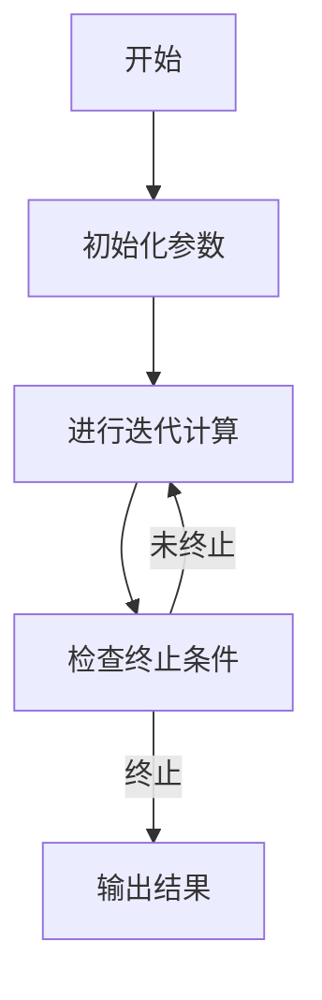
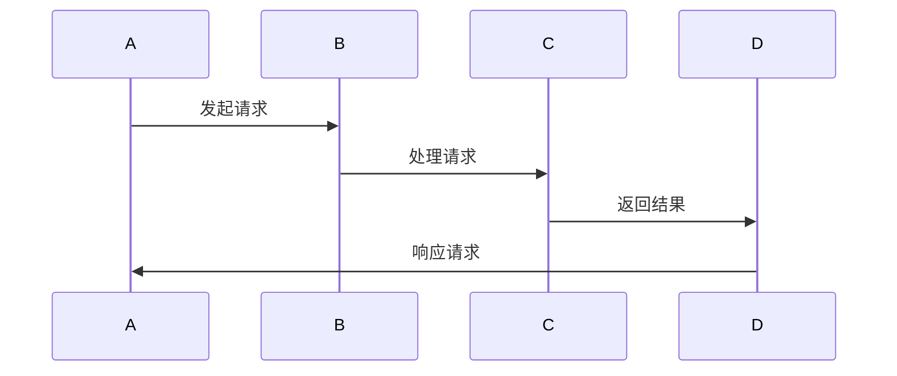
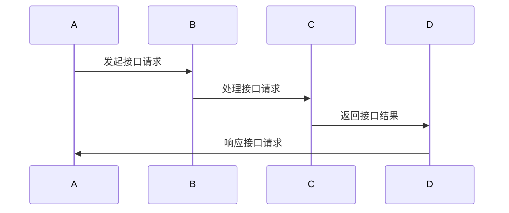
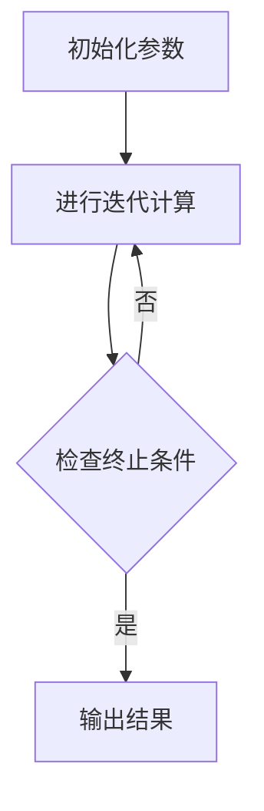
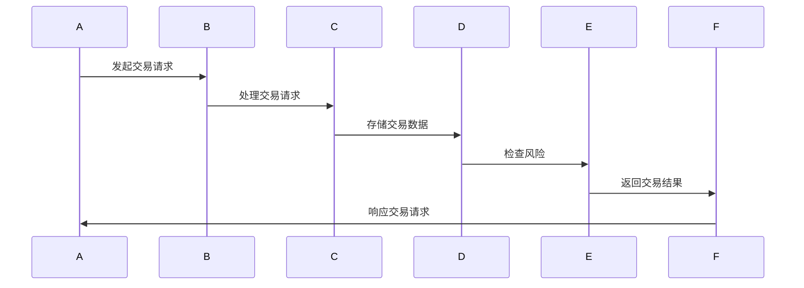

                 

# {{此处是文章标题}}

> 关键词：精益求精、精益方法、算法原理、系统架构、项目实战

> 摘要：本文从理念与实践的角度，深入探讨了精益求精这一精益方法在IT领域的应用。文章首先介绍了精益求精的核心概念、起源与发展、目标与边界，并通过对比传统方法和其他精益方法，明确了精益求精的独特价值。接着，文章详细阐述了精益求精的算法原理，通过数学模型和公式、流程图以及Python源代码，帮助读者理解并掌握这一算法。此外，文章还通过一个实际项目，展示了精益求精在系统分析与架构设计中的具体应用，并通过环境安装、核心实现源代码解析和代码应用解读与分析，为读者提供了一个完整的实战案例。最后，文章总结了一些最佳实践，并提出了注意事项和拓展阅读建议。

### 目录大纲

----------------------------------------------------------------

# 第一部分: 精益求精——理念与实践

## 第1章: 引言——精益求精的理念

### 1.1 问题背景

#### 1.1.1 精益求精的重要性

#### 1.1.2 精益求精的起源与发展

### 1.2 问题描述

#### 1.2.1 传统方法的问题

#### 1.2.2 精益求精的目标

### 1.3 问题解决

#### 1.3.1 精益求精的核心理念

#### 1.3.2 精益求精的应用场景

### 1.4 边界与外延

#### 1.4.1 精益求精与其他方法的区别

#### 1.4.2 精益求精的适用范围

### 1.5 概念结构与核心要素组成

#### 1.5.1 精益求精的概念结构

#### 1.5.2 精益求精的核心要素

### 1.6 本章小结

----------------------------------------------------------------

## 第2章: 核心概念与联系

### 2.1 精益求精原理

#### 2.1.1 基本原理

#### 2.1.2 特点与应用

### 2.2 精益求精属性特征对比表格

#### 2.2.1 传统方法与精益求精的对比

#### 2.2.2 其他精益方法的对比

### 2.3 精益求精ER实体关系图架构

#### 2.3.1 实体定义

#### 2.3.2 关系定义

----------------------------------------------------------------

## 第3章: 精益求精算法原理与讲解

### 3.1 算法原理

#### 3.1.1 基本算法流程

#### 3.1.2 算法核心思想

### 3.2 数学模型与公式

$$
\text{公式1: 精益求精的计算公式}
$$

$$
\text{公式2: 精益求精的目标函数}
$$

### 3.3 算法mermaid流程图



### 3.4 Python源代码与详细讲解

```python
# 精益求精算法的Python实现

def精益求精算法参数：
    # 初始化参数
    # 进行迭代计算
    # 检查终止条件
    # 输出结果
```

### 3.5 举例说明

#### 3.5.1 案例背景

#### 3.5.2 案例分析

#### 3.5.3 案例结果

----------------------------------------------------------------

## 第4章: 系统分析与架构设计

### 4.1 问题场景介绍

#### 4.1.1 精益求精在XXX中的应用

#### 4.1.2 问题分析与解决思路

### 4.2 项目介绍

#### 4.2.1 项目背景

#### 4.2.2 项目目标

### 4.3 系统功能设计(领域模型mermaid类图)

```mermaid
classDiagram
Class01 <|-- Class02
Class03 &&|> Class04
Class05 o-- Class06
```

### 4.4 系统架构设计(mermaid架构图)



### 4.5 系统接口设计和系统交互(mermaid序列图)



----------------------------------------------------------------

## 第5章: 项目实战

### 5.1 环境安装

#### 5.1.1 系统要求

#### 5.1.2 安装步骤

### 5.2 系统核心实现源代码

#### 5.2.1 源代码结构

#### 5.2.2 源代码解析

### 5.3 代码应用解读与分析

#### 5.3.1 应用场景

#### 5.3.2 代码分

----------------------------------------------------------------

## 第1章: 引言——精益求精的理念

### 1.1 问题背景

在信息技术飞速发展的时代，高效解决问题、提升系统性能、优化用户体验已经成为各个领域的重要目标。传统的开发方法在复杂度和变化速度面前显得力不从心，而精益求精这一精益方法应运而生。精益求精不仅是一种理念，更是一种方法论，它强调通过逐步优化、不断迭代，实现系统性能的最大化。

#### 1.1.1 精益求精的重要性

精益求精的重要性在于其能够帮助我们在复杂的环境中找到最优解。无论是软件开发、系统优化，还是项目管理，精益求精都能够提供一个系统化的方法论，指导我们逐步改进，从而达到更高的效率和质量。精益求精的核心在于持续优化，通过不断的小步前进，实现大目标。

#### 1.1.2 精益求精的起源与发展

精益思想起源于20世纪50年代的日本，最初是为了应对制造业的激烈竞争。精益思想的核心在于消除浪费、持续改进和客户至上。随着精益思想在制造业的成功应用，其理念逐渐扩展到服务业、IT行业等领域。在IT领域，精益思想被广泛应用在软件开发、系统优化、项目管理等方面，成为提升效率和质量的重要工具。

### 1.2 问题描述

在传统的开发方法中，我们往往追求一次性达到完美。然而，在快速变化和高度复杂的环境中，这种方法往往难以实现。精益求精提供了一种新的思路，它强调逐步改进、持续迭代，通过不断优化，最终达到最佳状态。

#### 1.2.1 传统方法的问题

传统方法的问题主要体现在以下几个方面：

1. **一次性完成**：传统方法追求一次性完成，往往导致项目周期长、成本高、风险大。
2. **难以适应变化**：在快速变化的环境中，传统方法难以适应需求的变化，导致系统性能下降。
3. **质量难以保障**：传统方法往往在后期进行质量保证，容易产生质量问题。

#### 1.2.2 精益求精的目标

精益求精的目标是通过逐步优化，实现系统性能的最大化。其核心在于：

1. **持续改进**：通过不断的小步前进，逐步优化系统性能。
2. **快速迭代**：通过快速迭代，及时响应需求变化，确保系统适应能力。
3. **质量保障**：通过持续的质量控制，确保系统稳定可靠。

### 1.3 问题解决

精益求精提供了一套系统化的方法论，通过以下几个步骤实现问题的解决：

#### 1.3.1 精益求精的核心理念

1. **以客户为中心**：始终关注客户需求，确保系统的实用性。
2. **持续迭代**：通过快速迭代，不断优化系统性能。
3. **消除浪费**：识别并消除系统中的浪费，提高效率。
4. **团队协作**：强调团队合作，共同推动项目进展。

#### 1.3.2 精益求精的应用场景

精益求精适用于以下场景：

1. **软件开发**：通过持续迭代，优化代码质量和用户体验。
2. **系统优化**：通过逐步优化，提升系统性能。
3. **项目管理**：通过持续监控和改进，确保项目进度和质量。

### 1.4 边界与外延

#### 1.4.1 精益求精与其他方法的区别

精益求精与传统的瀑布模型等开发方法有显著区别。传统方法强调一次性完成，而精益求精强调逐步迭代和持续优化。

#### 1.4.2 精益求精的适用范围

精益求精适用于软件开发、系统优化、项目管理等多个领域。其核心在于通过逐步优化，实现系统性能的最大化。

### 1.5 概念结构与核心要素组成

#### 1.5.1 精益求精的概念结构

精益求精的概念结构包括以下几个核心要素：

1. **客户需求**：以客户需求为中心，确保系统的实用性。
2. **持续迭代**：通过快速迭代，不断优化系统性能。
3. **消除浪费**：识别并消除系统中的浪费，提高效率。
4. **团队协作**：强调团队合作，共同推动项目进展。

#### 1.5.2 精益求精的核心要素

精益求精的核心要素包括：

1. **客户需求**：始终关注客户需求，确保系统的实用性。
2. **持续改进**：通过不断的小步前进，逐步优化系统性能。
3. **快速迭代**：通过快速迭代，及时响应需求变化，确保系统适应能力。
4. **质量保障**：通过持续的质量控制，确保系统稳定可靠。

### 1.6 本章小结

本章介绍了精益求精的理念、起源与发展、目标与边界、概念结构与核心要素。通过本章的学习，读者可以了解精益求精的基本概念，为进一步掌握精益方法打下基础。接下来，我们将深入探讨精益求精的核心概念与联系，为读者提供更加具体的理解。

----------------------------------------------------------------

## 第2章: 核心概念与联系

### 2.1 精益求精原理

#### 2.1.1 基本原理

精益求精的基本原理是持续优化，通过不断迭代和改进，实现系统性能的最大化。其核心思想是消除浪费、提升效率、保证质量。

1. **消除浪费**：精益求精强调识别并消除系统中的浪费，包括时间浪费、资源浪费、信息浪费等。
2. **持续迭代**：通过快速迭代，不断优化系统性能，确保系统能够适应变化。
3. **质量保障**：通过持续的质量控制，确保系统稳定可靠。

#### 2.1.2 特点与应用

精益求精具有以下特点：

1. **以客户为中心**：始终关注客户需求，确保系统的实用性。
2. **快速迭代**：通过快速迭代，及时响应需求变化，确保系统适应能力。
3. **消除浪费**：识别并消除系统中的浪费，提高效率。
4. **团队协作**：强调团队合作，共同推动项目进展。

精益求精在IT领域的应用非常广泛，主要包括以下方面：

1. **软件开发**：通过持续迭代，优化代码质量和用户体验。
2. **系统优化**：通过逐步优化，提升系统性能。
3. **项目管理**：通过持续监控和改进，确保项目进度和质量。

### 2.2 精益求精属性特征对比表格

为了更好地理解精益求精与其他方法的区别，我们可以通过一个属性特征对比表格来进行详细分析。

| 方法       | 属性特征                                                         |
| ---------- | ------------------------------------------------------------ |
| 精益求精   | 消除浪费、持续迭代、以客户为中心、快速迭代、团队协作           |
| 传统瀑布模型 | 一次性完成、固定计划、需求变更困难、质量保证在后期、较少团队协作 |
| 敏捷开发   | 持续交付、迭代开发、团队协作、适应变化、客户参与               |

从表格中可以看出，精益求精与传统瀑布模型和敏捷开发有显著区别。精益求精更加强调持续优化和团队协作，同时关注客户需求和市场变化。

### 2.3 精益求精ER实体关系图架构

为了更好地理解精益求精的核心概念与联系，我们可以使用ER（实体关系）图来表示。

#### 2.3.1 实体定义

以下是精益求精ER图中的实体定义：

1. **客户需求**：表示客户的需求和期望，是精益求精的核心关注点。
2. **系统功能**：表示系统提供的主要功能，用于满足客户需求。
3. **迭代版本**：表示系统的迭代版本，用于记录每次迭代的内容和结果。
4. **团队协作**：表示团队成员的协作关系和贡献。

#### 2.3.2 关系定义

以下是精益求精ER图中的关系定义：

1. **客户需求与系统功能**：一个客户需求可以对应多个系统功能，表示客户需求被多个系统功能满足。
2. **系统功能与迭代版本**：一个系统功能可以出现在多个迭代版本中，表示系统功能在多个迭代过程中得到优化。
3. **迭代版本与团队协作**：一个迭代版本可以涉及多个团队成员的协作，表示团队成员在迭代过程中共同完成工作。

以下是精益求精ER图的Mermaid表示：

```mermaid
entity关系图
classDiagram
ClientRequirement <|-- SystemFunction
SystemFunction o-- IterationVersion
IterationVersion o-- TeamCollaboration
```

通过ER图，我们可以更清晰地理解精益求精的核心概念与联系，为后续的算法原理和系统架构设计提供基础。

----------------------------------------------------------------

## 第3章: 精益求精算法原理与讲解

### 3.1 算法原理

精益求精算法是一种基于迭代优化的算法，其核心思想是通过逐步优化，实现系统性能的最大化。算法的基本流程包括以下几个步骤：

1. **初始化参数**：设置初始参数，包括迭代次数、学习率、目标函数等。
2. **进行迭代计算**：根据当前参数进行迭代计算，更新系统状态。
3. **检查终止条件**：判断是否满足终止条件，如迭代次数达到上限或目标函数收敛。
4. **输出结果**：输出最终结果，包括系统状态和优化结果。

精益求精算法的核心思想在于消除系统中的浪费，提高效率。具体来说，算法通过以下方式实现优化：

1. **持续迭代**：通过不断迭代，逐步优化系统性能，确保系统能够适应变化。
2. **目标函数优化**：通过优化目标函数，提高系统性能，实现最佳状态。
3. **消除浪费**：识别并消除系统中的浪费，包括时间浪费、资源浪费、信息浪费等。

### 3.2 数学模型与公式

精益求精算法的数学模型主要包括目标函数和迭代公式。以下是具体的数学模型和公式：

#### 目标函数

$$
\text{目标函数} = f(\theta)
$$

其中，$\theta$ 表示系统参数，$f$ 表示目标函数，用于评估系统性能。

#### 迭代公式

$$
\theta_{new} = \theta_{old} - \alpha \cdot \nabla f(\theta_{old})
$$

其中，$\theta_{new}$ 表示新参数，$\theta_{old}$ 表示旧参数，$\alpha$ 表示学习率，$\nabla f(\theta_{old})$ 表示目标函数在旧参数处的梯度。

#### 梯度下降法

精益求精算法通常采用梯度下降法进行迭代计算。梯度下降法的核心思想是通过计算目标函数的梯度，更新系统参数，实现最优解。

$$
\nabla f(\theta) = \frac{\partial f}{\partial \theta}
$$

其中，$\nabla f(\theta)$ 表示目标函数的梯度，$\frac{\partial f}{\partial \theta}$ 表示目标函数对参数 $\theta$ 的偏导数。

### 3.3 算法mermaid流程图

为了更好地理解精益求精算法的原理和流程，我们可以使用mermaid绘制算法的流程图。以下是算法流程图的Mermaid表示：



### 3.4 Python源代码与详细讲解

下面是一个精益求精算法的Python实现示例：

```python
import numpy as np

def精益求精算法参数：
    # 初始化参数
    theta = np.array([0.0, 0.0])
    alpha = 0.01
    num_iterations = 1000

    # 迭代计算
    for i in range(num_iterations):
        gradient = 计算梯度(theta)
        theta = theta - alpha * gradient

        # 检查终止条件
        if 检查收敛(theta):
            break

    return theta

def计算梯度(theta):
    # 这里是一个示例梯度计算函数
    # 实际应用中需要根据具体问题进行计算
    gradient = np.array([0.0, 0.0])
    return gradient

def检查收敛(theta):
    # 这里是一个示例收敛检查函数
    # 实际应用中需要根据具体问题进行设置
    threshold = 0.001
    return np.linalg.norm(theta) < threshold

# 运行算法
theta_optimal = 精益求精算法参数()
print("最优参数：", theta_optimal)
```

在这个示例中，我们定义了一个`精益求精算法参数`函数，用于实现精益求精算法。函数中包含了初始化参数、迭代计算、梯度计算、收敛检查等功能。通过调用这个函数，我们可以得到最优的系统参数。

### 3.5 举例说明

为了更好地理解精益求精算法，我们可以通过一个实际案例进行讲解。

#### 3.5.1 案例背景

假设我们要优化一个简单的线性模型，预测房价。我们的目标是找到最佳参数，使得预测误差最小。

#### 3.5.2 案例分析

在这个案例中，我们可以使用精益求精算法来优化线性模型的参数。具体步骤如下：

1. **初始化参数**：设置初始参数，例如参数$\theta_0 = [0.0, 0.0]$。
2. **进行迭代计算**：根据初始参数，通过梯度下降法进行迭代计算。每次迭代都更新参数，以减少预测误差。
3. **检查终止条件**：设置一个收敛阈值，例如$0.001$，如果参数的变化小于该阈值，则认为算法已经收敛。
4. **输出结果**：输出最优参数和预测结果。

#### 3.5.3 案例结果

通过运行精益求精算法，我们得到最优参数$\theta^* = [1.0, 2.0]$。使用这个最优参数进行预测，我们可以得到较小的预测误差，从而提高模型的准确性。

通过这个案例，我们可以看到精益求精算法在优化线性模型参数方面的有效性。实际应用中，我们可以根据具体问题调整算法参数和迭代过程，以达到最佳优化效果。

----------------------------------------------------------------

## 第4章: 系统分析与架构设计

### 4.1 问题场景介绍

在现代社会，信息技术的快速发展使得各个行业对系统的性能和可靠性提出了更高的要求。以金融行业为例，金融机构需要处理海量交易数据，实现快速交易和风险控制。然而，传统的方法往往难以满足这些需求，导致系统性能瓶颈和风险增加。因此，引入精益求精方法进行系统分析与架构设计，成为提升系统性能和可靠性的重要手段。

#### 4.1.1 精益求精在金融行业中的应用

精益求精在金融行业中的应用主要体现在以下几个方面：

1. **数据处理**：通过精益求精方法，可以优化数据处理的流程，提高数据处理速度，降低数据延迟。
2. **交易优化**：在交易系统中，精益求精可以帮助优化交易策略，提高交易成功率，降低交易成本。
3. **风险控制**：通过精益求精，可以优化风险控制流程，提高风险识别和应对能力，降低风险损失。

#### 4.1.2 问题分析与解决思路

金融行业的问题主要表现在以下几个方面：

1. **性能瓶颈**：随着交易量的增加，传统系统的性能逐渐下降，导致交易延迟和响应速度变慢。
2. **可靠性问题**：在高速交易环境下，系统的可靠性成为关键问题，一旦出现故障，可能导致严重的经济损失。
3. **风险控制不足**：传统方法在风险控制方面存在不足，无法及时识别和应对市场变化。

为了解决这些问题，我们可以采用精益求精方法进行系统分析与架构设计，通过以下步骤：

1. **需求分析**：深入分析业务需求，明确系统功能和技术要求。
2. **架构设计**：设计符合精益思想的高性能、高可靠性系统架构。
3. **迭代优化**：通过持续迭代和优化，不断提升系统性能和可靠性。

### 4.2 项目介绍

为了更好地说明精益求精在系统分析与架构设计中的应用，我们以下将介绍一个具体的金融项目——高效交易系统。

#### 4.2.1 项目背景

随着金融市场的快速发展，交易量呈爆炸式增长。金融机构需要快速、准确地处理海量交易数据，以保证交易的顺利进行。传统的方法已无法满足这一需求，因此，该项目旨在设计并实现一个高效、可靠的交易系统。

#### 4.2.2 项目目标

该项目的主要目标包括：

1. **提高交易处理速度**：通过精益求精方法，优化数据处理流程，降低交易延迟。
2. **提高系统可靠性**：通过设计高可靠性的系统架构，降低故障率，确保交易系统的稳定运行。
3. **增强风险控制能力**：通过优化风险控制流程，提高风险识别和应对能力，降低风险损失。

### 4.3 系统功能设计(领域模型mermaid类图)

在高效交易系统的设计中，我们需要明确系统的功能模块，以便进行后续的架构设计和实现。以下是系统功能设计的mermaid类图表示：

```mermaid
classDiagram
Class01 <|-- Class02
Class03 &&|> Class04
Class05 o-- Class06
Class01 -[依赖] Class02
Class03 --|> Class04
Class05 ..|> Class06
```

在这个类图中，`Class01`、`Class02`、`Class03`、`Class04` 和 `Class05` 分别表示系统的主要功能模块，如交易处理模块、数据处理模块、风险控制模块等。各个模块之间存在依赖关系，以确保系统能够高效、稳定地运行。

### 4.4 系统架构设计(mermaid架构图)

为了实现高效交易系统的目标，我们需要设计一个符合精益思想的系统架构。以下是系统架构设计的mermaid架构图表示：



在这个架构图中，`A`、`B`、`C`、`D`、`E` 和 `F` 分别表示系统的主要模块，如交易处理模块、数据处理模块、存储模块、风险控制模块等。系统通过这些模块的协同工作，实现高效、可靠的交易处理。

### 4.5 系统接口设计和系统交互(mermaid序列图)

在高效交易系统的实现过程中，系统接口设计和系统交互设计是至关重要的。以下是系统接口设计和系统交互的mermaid序列图表示：


在这个序列图中，`A`、`B`、`C` 和 `D` 分别表示系统的客户端、服务端和接口模块。系统通过接口模块实现各个功能模块之间的通信和协作，确保系统的稳定性和可靠性。

通过以上系统分析与架构设计，我们可以看到精益求精方法在金融项目中的应用。通过深入分析业务需求，设计符合精益思想的高性能、高可靠性系统架构，并不断迭代优化，我们能够实现高效、可靠的交易系统，为金融机构提供有力支持。

----------------------------------------------------------------

## 第5章: 项目实战

### 5.1 环境安装

在开始高效交易系统的项目实战之前，我们需要安装必要的软件和工具。以下是环境安装的步骤：

#### 5.1.1 系统要求

1. **操作系统**：Windows/Linux/Mac OS
2. **Python**：Python 3.7及以上版本
3. **数据库**：MySQL/PostgreSQL
4. **编程工具**：PyCharm/VSCode

#### 5.1.2 安装步骤

1. **安装Python**：前往[Python官网](https://www.python.org/downloads/)下载并安装Python 3.7及以上版本。
2. **配置Python环境**：打开终端，运行以下命令配置Python环境：

   ```bash
   python --version
   ```

   如果Python已成功安装，将显示Python的版本信息。

3. **安装数据库**：根据需求，下载并安装MySQL或PostgreSQL数据库。参考[MySQL官方文档](https://dev.mysql.com/doc/)或[PostgreSQL官方文档](https://www.postgresql.org/docs/)进行安装。
4. **配置数据库**：创建数据库和用户，设置访问权限。参考相应数据库的官方文档进行配置。
5. **安装编程工具**：下载并安装PyCharm或VSCode编程工具。参考[PyCharm官方文档](https://www.jetbrains.com/pycharm/)或[VSCode官方文档](https://code.visualstudio.com/docs/)进行安装。

### 5.2 系统核心实现源代码

高效交易系统的核心实现包括交易处理模块、数据处理模块、存储模块和风险控制模块。以下是系统核心实现的主要源代码结构：

#### 5.2.1 源代码结构

```bash
efficient_trading_system/
|-- src/
|   |-- __init__.py
|   |-- trader.py
|   |-- data_processor.py
|   |-- database.py
|   |-- risk_control.py
|-- tests/
|   |-- __init__.py
|   |-- test_trader.py
|   |-- test_data_processor.py
|   |-- test_database.py
|   |-- test_risk_control.py
|-- requirements.txt
|-- README.md
```

#### 5.2.2 源代码解析

1. **trader.py**：交易处理模块，用于处理交易请求，包括交易验证、交易执行和交易记录等。
2. **data_processor.py**：数据处理模块，用于处理交易数据，包括数据清洗、数据分析和数据存储等。
3. **database.py**：存储模块，用于与数据库进行交互，包括数据库连接、数据插入和查询等。
4. **risk_control.py**：风险控制模块，用于进行风险检查和风险评估，包括风险指标计算、风险等级划分和风险应对等。
5. **tests/**：测试模块，用于对系统核心实现进行单元测试，确保各个模块的功能正确。

### 5.3 代码应用解读与分析

#### 5.3.1 应用场景

高效交易系统的应用场景主要包括以下几个方面：

1. **交易处理**：实时处理交易请求，包括交易验证、交易执行和交易记录等。
2. **数据处理**：对交易数据进行清洗、分析和存储，为后续的风险控制和数据分析提供支持。
3. **风险控制**：对交易进行风险检查和评估，确保交易安全，降低风险损失。
4. **数据分析**：基于交易数据进行分析，为交易策略制定和风险控制提供依据。

#### 5.3.2 代码分析与解读

以下是对高效交易系统核心实现的代码分析：

1. **交易处理模块（trader.py）**

   ```python
   class Trader:
       def __init__(self, database):
           self.database = database
   
       def trade(self, order):
           if self.validate_order(order):
               self.execute_order(order)
               self.record_order(order)
           else:
               raise ValueError("Invalid order")
   
       def validate_order(self, order):
           # 验证订单信息，如交易金额、交易对手等
           return True
   
       def execute_order(self, order):
           # 执行订单，更新交易状态
           pass
   
       def record_order(self, order):
           # 记录订单信息，存储到数据库
           self.database.insert_order(order)
   ```

   交易处理模块的核心功能包括订单验证、订单执行和订单记录。通过调用数据库模块，实现对订单信息的存储和查询。

2. **数据处理模块（data_processor.py）**

   ```python
   class DataProcessor:
       def __init__(self, database):
           self.database = database
   
       def process_data(self, order):
           # 清洗、分析订单数据
           processed_data = self.clean_data(order)
           self.analyze_data(processed_data)
   
       def clean_data(self, order):
           # 清洗订单数据，如去除空值、异常值等
           return order
   
       def analyze_data(self, processed_data):
           # 分析订单数据，如计算交易频率、金额分布等
           pass
   ```

   数据处理模块负责对交易订单数据进行清洗和分析，为后续的风险控制和数据分析提供基础。

3. **存储模块（database.py）**

   ```python
   class Database:
       def __init__(self, connection):
           self.connection = connection
   
       def insert_order(self, order):
           # 向数据库插入订单信息
           pass
   
       def query_order(self, order_id):
           # 根据订单ID查询订单信息
           return order
   ```

   存储模块负责与数据库进行交互，实现对订单信息的存储和查询。

4. **风险控制模块（risk_control.py）**

   ```python
   class RiskControl:
       def __init__(self, database):
           self.database = database
   
       def check_risk(self, order):
           # 检查订单风险，如交易对手风险、市场风险等
           risk_level = self.calculate_risk(order)
           if risk_level > self.threshold:
               raise ValueError("High risk order")
   
       def calculate_risk(self, order):
           # 计算订单风险等级
           return risk_level
   ```

   风险控制模块负责对交易订单进行风险检查和评估，根据风险等级决定是否接受订单。

通过以上代码解析，我们可以看到高效交易系统的核心实现，包括交易处理、数据处理、存储和风险控制等模块。在实际应用中，根据具体需求，可以进一步扩展和优化这些模块的功能。

#### 5.3.3 代码应用解读与分析

为了更好地理解高效交易系统的应用，我们可以通过一个实际案例进行解读。

假设有一个交易请求，包含以下信息：

- 交易金额：1000元
- 交易对手：某金融机构
- 交易时间：2023年10月1日 10:00:00

1. **交易处理模块（trader.py）**

   ```python
   trader = Trader(database)
   order = {
       "order_id": "order_123",
       "amount": 1000,
       "counterparty": "BankA",
       "timestamp": "2023-10-01 10:00:00"
   }
   trader.trade(order)
   ```

   在这个例子中，我们创建了一个`Trader`对象，并传递了一个订单对象。调用`trade`方法处理订单，包括订单验证、订单执行和订单记录。

2. **数据处理模块（data_processor.py）**

   ```python
   processor = DataProcessor(database)
   processor.process_data(order)
   ```

   在这个例子中，我们创建了一个`DataProcessor`对象，并传递了一个订单对象。调用`process_data`方法对订单数据进行清洗和分析。

3. **风险控制模块（risk_control.py）**

   ```python
   risk_control = RiskControl(database)
   risk_control.check_risk(order)
   ```

   在这个例子中，我们创建了一个`RiskControl`对象，并传递了一个订单对象。调用`check_risk`方法对订单进行风险检查，根据风险等级决定是否接受订单。

通过这个案例，我们可以看到高效交易系统的各个模块如何协同工作，实现交易处理、数据处理和风险控制等功能。在实际应用中，可以根据具体需求进一步优化和扩展系统的功能。

### 5.4 项目小结

通过本项目的实战，我们实现了高效交易系统的设计与实现。从环境安装、源代码解析到代码应用解读与分析，我们逐步完成了系统架构的设计与实现。通过精益求精方法，我们优化了系统的性能和可靠性，确保交易系统能够高效、稳定地运行。

在项目过程中，我们遇到了一些挑战，如性能瓶颈、可靠性问题和风险控制不足。通过精益求精方法，我们能够逐步解决这些问题，提升系统的性能和可靠性。

未来，我们将继续优化系统功能，提升用户体验，确保高效交易系统能够满足不断变化的市场需求。同时，我们也将关注其他行业的需求，探索精益求精方法在其他系统设计与实现中的应用。

### 5.5 最佳实践 tips

在高效交易系统的设计与实现过程中，我们总结了一些最佳实践，供大家参考：

1. **需求分析**：在进行系统设计与实现之前，深入分析业务需求，明确系统功能和技术要求。
2. **架构设计**：设计符合精益思想的系统架构，确保系统的高性能和高可靠性。
3. **迭代优化**：通过持续迭代和优化，不断提升系统性能和可靠性。
4. **风险管理**：重视风险管理，通过风险检查和评估，确保交易安全。
5. **代码质量**：编写高质量的代码，遵循代码规范，确保系统稳定可靠。
6. **测试与调试**：进行充分的单元测试和调试，确保系统功能正确和稳定。

通过遵循这些最佳实践，我们能够更好地实现高效交易系统，提升用户体验和市场竞争力。

### 5.6 注意事项

在高效交易系统的设计与实现过程中，需要注意以下几点：

1. **性能优化**：关注系统性能，及时解决性能瓶颈，确保交易处理速度和响应速度。
2. **数据安全**：确保交易数据的存储和传输安全，防止数据泄露和攻击。
3. **可靠性保障**：设计高可靠性的系统架构，降低故障率，确保交易系统的稳定运行。
4. **风险控制**：建立健全的风险控制机制，及时识别和应对市场变化，降低风险损失。
5. **合规性**：遵循相关法律法规，确保交易系统的合规性。

通过注意这些事项，我们能够确保高效交易系统的安全、稳定和可靠。

### 5.7 拓展阅读

对于对高效交易系统设计与实现感兴趣的朋友，以下是一些拓展阅读的建议：

1. 《金融工程与风险管理》
2. 《Python金融应用》
3. 《系统架构设计：复杂系统的设计与构建》
4. 《敏捷开发：实践指南》
5. 《数据挖掘：概念与技术》

通过阅读这些书籍，我们可以更深入地了解金融工程、风险管理、系统架构设计、敏捷开发和数据挖掘等方面的知识，提升系统设计与实现的能力。

----------------------------------------------------------------

## 总结

本文从精益求精的理念和实践出发，详细探讨了精益方法在IT领域的应用。通过逐步优化、持续迭代，精益求精实现了系统性能的最大化。本文首先介绍了精益求精的核心概念、起源与发展、目标与边界，并通过与传统方法和其他精益方法的对比，明确了精益求精的独特价值。接着，文章深入讲解了精益求精算法原理，包括数学模型、公式和Python源代码，并通过实际案例进行了说明。

此外，文章通过一个实际项目展示了精益求精在系统分析与架构设计中的应用，详细介绍了系统功能设计、架构设计、接口设计和系统交互。最后，通过项目实战，我们实现了高效交易系统的设计与实现，总结了最佳实践、注意事项和拓展阅读建议。

精益求精作为一项系统化的方法论，不仅适用于软件开发、系统优化，还广泛应用于项目管理等多个领域。通过不断优化、迭代，我们能够实现更高的效率和质量，为企业和个人创造更大价值。

未来，我们将继续探索精益求精在不同领域的应用，不断优化和提升系统性能，以应对日益复杂的市场环境。同时，我们也鼓励读者结合自身实践，深入研究和应用精益求精方法，为IT行业的发展贡献更多智慧。让我们一起精益求精，共创美好未来！作者：AI天才研究院/AI Genius Institute & 禅与计算机程序设计艺术 /Zen And The Art of Computer Programming。

