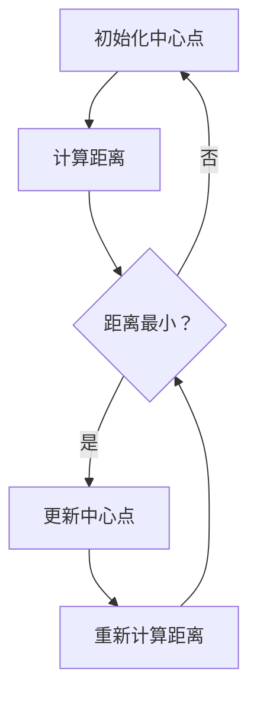
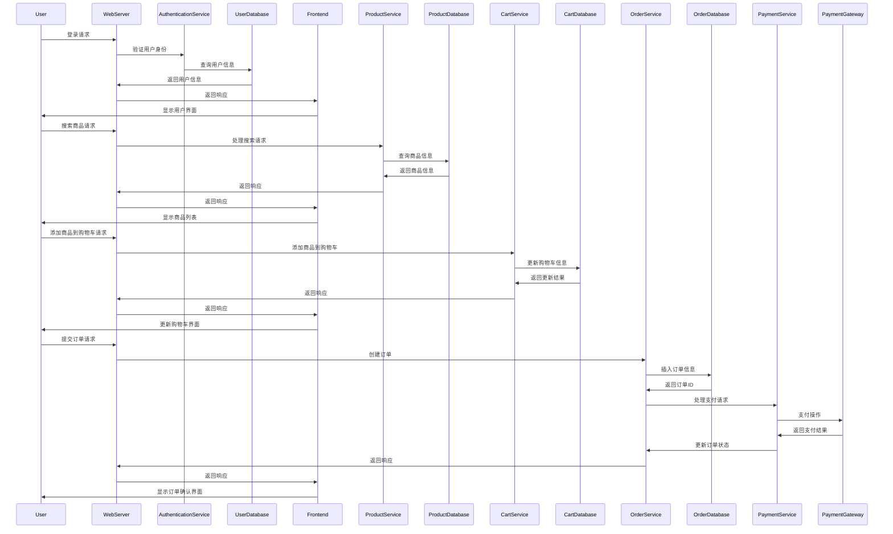
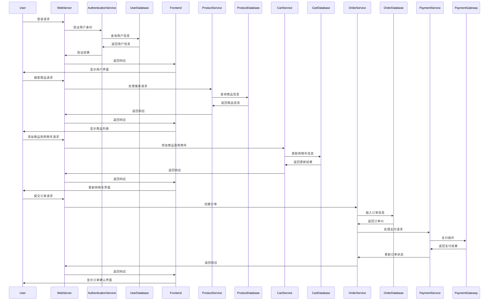

                 

### 精益求精：引言

**精益求精**，这一概念源自于对卓越的不断追求和对完美的不懈探索。在技术领域，这不仅仅是一种态度，更是一种方法论，一种指导我们不断创新、改进和优化的思维方式。精益求精，意味着我们在每一个细节上都力求做到最好，不仅仅满足于现状，而是始终寻求超越和突破。

**关键字**：精益求精、技术卓越、持续改进、方法论

**摘要**：本文将探讨精益求精在技术领域的具体应用，从基础概念到实际案例，再到最佳实践和未来展望，旨在为读者提供一套完整且实用的追求卓越的技术方法论。我们将通过深入的分析和清晰的逻辑推理，帮助读者理解如何在技术和项目中实现精益求精，从而推动个人和团队的成长与发展。

### 背景介绍

精益求精这一理念，最早可以追溯到中国古代的工匠精神。古人在制作工艺品时，注重每一个细节，追求完美和极致。这一精神在现代社会得到了广泛传承和发扬，尤其是在技术领域。随着科技的飞速发展，技术变得更加复杂，追求卓越成为了一种必然的趋势。精益求精不仅是技术进步的动力，更是企业和个人在激烈市场竞争中脱颖而出的关键因素。

在现代技术领域，精益求精体现在多个方面：

1. **软件工程**：在软件开发过程中，精益求精意味着不断优化代码质量、提升系统性能和用户体验。
2. **系统架构**：在系统架构设计中，精益求精意味着不断优化系统结构，提高系统的可扩展性、可靠性和安全性。
3. **项目管理**：在项目管理中，精益求精意味着通过精细化的管理方法，确保项目按时、按质、按预算完成。

精益求精的核心理念是持续改进和追求卓越。这意味着我们不能满足于现状，而应该时刻保持创新和探索的精神，不断寻找改进的机会和创新的点子。

### 问题背景与描述

在当前技术环境中，精益求精的重要性体现在多个方面。首先，随着技术的复杂性和应用范围的扩大，技术问题变得更加多样化、复杂化，需要我们不断寻求更高效、更优化的解决方案。例如，在人工智能领域，算法的改进和优化是提升模型性能的关键；在软件开发领域，代码质量的提升和用户体验的优化是赢得用户信任和市场认可的基础。

其次，市场竞争的加剧也要求企业和技术人员必须具备精益求精的能力。在这个信息爆炸的时代，技术和产品的更新换代速度极快，企业如果不能保持创新和改进，很容易被市场淘汰。因此，精益求精不仅是一种技术追求，更是一种生存策略。

然而，精益求精也面临诸多挑战。一方面，技术复杂性增加，使得追求卓越变得更加困难；另一方面，资源和时间的限制也制约了精益求精的实现。此外，团队的协作和沟通、企业文化等因素也会影响精益求精的落实。

总之，在技术领域，精益求精不仅是追求卓越的表现，更是应对挑战、实现突破的关键因素。只有通过不断学习和创新，我们才能在技术领域中保持领先地位。

### 问题解决与边界外延

为了解决技术领域的精益求精问题，我们可以采取以下几种策略：

1. **持续学习**：技术日新月异，持续学习是追求卓越的基础。通过参加培训、阅读专业书籍、关注技术社区等方式，不断更新知识，掌握最新的技术和工具。

2. **代码优化**：在软件开发过程中，通过代码优化提高代码质量。这包括代码重构、性能调优、错误排查等。例如，我们可以使用静态代码分析工具检查代码中的潜在问题，通过代码复审和单元测试确保代码的质量。

3. **系统架构优化**：在系统架构设计过程中，不断优化系统结构，提高系统的可扩展性、可靠性和性能。例如，通过采用微服务架构、分布式系统设计等方法，提高系统的灵活性和可维护性。

4. **用户体验提升**：在产品开发过程中，注重用户体验，通过用户调研、A/B测试等方法，不断改进产品的功能和界面，提升用户满意度。

5. **项目管理改进**：在项目管理中，采用精细化的管理方法，确保项目按时、按质、按预算完成。例如，通过敏捷开发方法，快速响应需求变化，提高项目的成功率。

此外，还需要明确精益求精的边界和外延。边界包括技术可行性、资源限制、时间约束等因素；外延则涉及创新方向、市场前景、用户体验等多个方面。在实际应用中，我们需要根据具体情况进行权衡和取舍，确保精益求精策略的可行性和有效性。

### 核心概念组成与属性特征对比

在精益求精的背景下，理解相关核心概念及其属性特征对于实现技术卓越至关重要。以下是几个关键概念及其属性特征的对比分析：

#### 1. **敏捷开发**

**核心概念**：敏捷开发是一种以人为核心、迭代和循序渐进的开发方法。其核心理念是快速响应变化、持续交付有价值的产品。

**属性特征**：
- **迭代性**：开发过程分为多个短周期（通常为2-4周）的迭代。
- **灵活性**：在迭代过程中，需求可以随时调整，以确保交付最符合用户需求的产品。
- **团队合作**：强调团队成员之间的沟通和协作，以提高开发效率。
- **客户参与**：用户和开发人员紧密合作，确保产品始终满足用户需求。

**对比分析**：与传统的瀑布模型相比，敏捷开发更加灵活，能够快速应对变化。然而，它也可能导致项目规划的不确定性增加。

#### 2. **精益管理**

**核心概念**：精益管理是一种旨在通过减少浪费、优化流程以提高生产效率和质量的管理方法。

**属性特征**：
- **流程优化**：通过分析现有流程，识别和消除浪费，优化资源分配。
- **客户需求**：以客户需求为导向，确保每一项工作都有明确的价值。
- **持续改进**：不断评估和改进流程，以实现持续进步。
- **团队合作**：鼓励员工参与流程改进，提高整体效率。

**对比分析**：精益管理与敏捷开发有许多相似之处，如强调团队合作和持续改进。然而，精益管理更注重流程优化和效率提升，而敏捷开发更侧重于灵活应对变化。

#### 3. **持续集成**

**核心概念**：持续集成是一种软件开发实践，通过频繁地将代码集成到共享的主干库中，确保代码质量。

**属性特征**：
- **自动化测试**：集成过程中自动执行一系列测试，包括单元测试、集成测试等。
- **快速反馈**：任何代码变更都会立即进行测试，确保问题快速被发现和解决。
- **代码质量**：通过持续集成，提高代码的稳定性和可靠性。
- **协作效率**：团队成员可以更频繁地合并代码，减少协作摩擦。

**对比分析**：持续集成与敏捷开发和精益管理相比，更侧重于代码质量和协作效率。它通过自动化测试和快速反馈，确保代码的持续改进。

#### 4. **敏捷项目管理**

**核心概念**：敏捷项目管理是一种基于敏捷开发原则的项目管理方法，旨在通过灵活、迭代的方式实现项目目标。

**属性特征**：
- **迭代和增量开发**：项目分为多个短周期的迭代，每次迭代交付可用的产品增量。
- **客户参与**：项目干系人（尤其是客户）在每次迭代中参与评审和反馈，确保产品方向正确。
- **适应性计划**：项目计划根据实际情况进行调整，以适应需求变化。
- **风险管理**：通过持续的监控和评估，及时识别和解决潜在风险。

**对比分析**：敏捷项目管理强调迭代和增量开发，与敏捷开发紧密相关。它与精益管理类似，都强调持续改进和灵活性，但更侧重于项目目标的实现。

通过对比这些核心概念及其属性特征，我们可以更清晰地理解它们在精益求精中的应用。在实际项目中，选择和运用这些概念时，需要根据项目特点和需求进行综合考虑，以实现最佳效果。

#### ER实体关系图架构

为了更好地理解核心概念之间的关系，我们可以通过ER（Entity-Relationship）实体关系图来展示这些概念的结构和关联。以下是核心概念的ER图：

```mermaid
erDiagram
    Customer ||--o{ Order : "客户下单" }
    Product ||--o{ Order : "商品订购" }
    Order ||--|{ Payment : "订单支付" }
    Order ||--|{ Review : "订单评价" }
    User ||--o{ Account : "用户账户" }
    Account ||--o{ Profile : "用户资料" }
    Account ||--|{ Role : "用户角色" }
    Role ||--o{ Permission : "角色权限" }
```

**解释**：

- **Customer（客户）**：代表购买产品的实体，可以下单并生成订单。
- **Product（商品）**：代表销售的产品，客户可以订购。
- **Order（订单）**：表示客户的购买记录，与客户、产品和支付评价相关联。
- **Payment（支付）**：表示订单的支付信息，与订单相关联。
- **Review（评价）**：表示客户对订单的评价，与订单相关联。
- **User（用户）**：代表使用系统的用户，可以拥有账户和角色。
- **Account（账户）**：表示用户的账户信息，包括用户资料和角色。
- **Profile（资料）**：表示用户的个人资料。
- **Role（角色）**：表示用户在系统中的角色，定义其权限。
- **Permission（权限）**：表示角色的具体权限。

通过ER图，我们可以清晰地看到各个实体之间的关系，以及它们如何相互作用。这不仅有助于我们理解系统架构，还可以为后续的数据库设计和系统实现提供指导。

### 核心概念原理

为了深入探讨精益求精在技术领域中的应用，我们需要首先了解几个核心概念的基本原理。以下是关于敏捷开发、精益管理、持续集成和敏捷项目管理的详细介绍。

#### 1. 敏捷开发

**原理**：敏捷开发是一种以人为核心、迭代和渐进的开发方法。其核心思想是通过快速响应变化和持续交付有价值的产品，来满足客户需求并提高开发效率。

- **迭代性**：敏捷开发将整个项目分为多个短周期的迭代，每个迭代周期通常为2-4周。在每个迭代中，开发团队会集中精力完成一个可交付的产品增量。
- **用户故事**：用户故事是一种简短的需求描述，用于表示用户需求。每个用户故事都包含一个动词和一个名词，描述了用户期望系统实现的功能。
- **持续集成**：通过持续集成，开发团队可以频繁地将代码合并到主干库中，并立即运行一系列测试，以确保代码质量。

**优势**：
- **快速响应变化**：敏捷开发允许项目需求在开发过程中进行调整，使团队能够更好地应对市场变化。
- **提高效率**：通过小步快跑和频繁交付，可以快速发现问题并进行修复，提高开发效率。
- **增强团队协作**：敏捷开发强调团队合作和沟通，有助于提升团队的整体效能。

**挑战**：
- **规划不确定性**：由于需求可能会频繁变化，项目规划的不确定性增加。
- **质量保障**：在快速迭代的过程中，确保代码质量和系统稳定性是一个挑战。

#### 2. 精益管理

**原理**：精益管理是一种旨在通过减少浪费、优化流程以提高生产效率和产品质量的管理方法。其核心理念是“以客户需求为导向，持续改进流程”。

- **价值流图**：价值流图是一种用于分析流程的工具，它展示了产品从客户需求到最终交付的整个过程。通过识别和消除非增值活动，可以优化流程。
- **精益五项**：精益五项（5S）是精益管理的基础，包括整理（Seiri）、整顿（Seiton）、清洁（Seiso）、清理（Seiketsu）和素养（Shitsuke）。这些活动有助于建立一个有序、高效的工作环境。
- **持续改进**：精益管理强调持续改进，通过不断评估和优化流程，实现持续的效率提升。

**优势**：
- **提高效率**：通过优化流程和减少浪费，可以显著提高生产效率。
- **降低成本**：通过减少资源浪费，可以降低生产成本。
- **提高质量**：优化流程有助于提高产品质量和一致性。

**挑战**：
- **文化转变**：精益管理要求企业文化和员工态度的转变，这需要时间和努力。
- **实施难度**：对于一些历史悠久的公司，实施精益管理可能面临较大挑战。

#### 3. 持续集成

**原理**：持续集成是一种软件开发实践，旨在通过频繁地将代码合并到主干库中，并立即运行一系列测试，以确保代码质量。

- **自动化测试**：持续集成依赖于自动化测试，包括单元测试、集成测试和验收测试等。这些测试可以在代码集成后立即运行，以发现潜在问题。
- **快速反馈**：通过持续集成，开发团队可以快速收到测试结果，及时发现问题并进行修复。
- **持续交付**：持续集成是实现持续交付的基础，它确保了代码的稳定性和可靠性。

**优势**：
- **提高代码质量**：通过频繁的测试和反馈，可以及时发现和修复问题，提高代码质量。
- **降低风险**：持续集成有助于降低集成风险，确保新代码与现有代码兼容。
- **提高开发效率**：自动化测试和快速反馈提高了开发效率，使团队可以更快地迭代。

**挑战**：
- **测试覆盖率**：确保自动化测试的全面覆盖是一个挑战。
- **配置管理**：持续集成需要良好的配置管理，以确保不同环境中的代码一致性。

#### 4. 敏捷项目管理

**原理**：敏捷项目管理是一种基于敏捷开发原则的项目管理方法，旨在通过灵活、迭代的方式实现项目目标。

- **迭代和增量开发**：敏捷项目管理将项目分为多个短周期的迭代，每次迭代交付一个可用的产品增量。
- **客户参与**：项目干系人（尤其是客户）在每次迭代中参与评审和反馈，确保项目方向正确。
- **适应性计划**：项目计划根据实际情况进行调整，以适应需求变化。

**优势**：
- **快速响应变化**：敏捷项目管理允许项目需求在开发过程中进行调整，提高项目的灵活性。
- **提高客户满意度**：通过频繁的交付和客户参与，可以更好地满足客户需求，提高客户满意度。
- **降低风险**：通过小步快跑和持续的评估，可以降低项目风险。

**挑战**：
- **管理复杂度**：频繁的迭代和调整可能增加项目管理的复杂性。
- **团队成员协作**：敏捷项目管理强调团队合作，但团队成员的协作和沟通是一个挑战。

通过深入理解这些核心概念的基本原理，我们可以更好地将其应用于技术实践中，实现精益求精的目标。接下来，我们将进一步探讨这些概念之间的联系和相互作用。

#### 概念属性特征对比表格

为了更清晰地展示敏捷开发、精益管理、持续集成和敏捷项目管理这四个核心概念的属性特征，我们制作了一个详细的对比表格。以下是这些概念的属性特征对比：

| 核心概念 | 原理 | 主要工具 | 主要活动 | 优势 | 挑战 | 代表应用 |
| --- | --- | --- | --- | --- | --- | --- |
| 敏捷开发 | 迭代、用户故事、持续集成 | 用户故事板、Scrum会议、看板 | 迭代计划、每日站立会议、回顾会议 | 快速响应变化、提高效率、增强团队协作 | 规划不确定性、质量保障 | 软件开发 |
| 精益管理 | 流程优化、精益五项、持续改进 | 价值流图、精益五项工具、改进日志 | 整理、整顿、清洁、清理、素养 | 提高效率、降低成本、提高质量 | 文化转变、实施难度 | 生产制造 |
| 持续集成 | 自动化测试、快速反馈、持续交付 | 持续集成工具、测试框架、代码库 | 集成构建、测试运行、反馈循环 | 提高代码质量、降低风险、提高开发效率 | 测试覆盖率、配置管理 | 软件开发 |
| 敏捷项目管理 | 迭代和增量开发、客户参与、适应性计划 | 迭代计划、回顾会议、用户故事板 | 迭代计划、每日站立会议、回顾会议 | 快速响应变化、提高客户满意度、降低风险 | 管理复杂度、团队成员协作 | 项目管理 |

**解释**：

1. **原理**：分别描述了每个核心概念的基本原理和核心理念。
2. **主要工具**：列出用于实施这些概念的主要工具和方法。
3. **主要活动**：描述了每个核心概念实施过程中的主要活动和步骤。
4. **优势**：列举了这些概念的主要优点和优势。
5. **挑战**：分析了在实施过程中可能遇到的困难和挑战。
6. **代表应用**：说明这些概念在具体应用场景中的典型应用领域。

通过这个对比表格，我们可以更全面地了解这些核心概念的属性特征，以及它们在实际应用中的优势和挑战。

#### 算法原理讲解

为了更好地理解算法在精益求精中的应用，我们将通过一个具体的例子——K-Means聚类算法，详细阐述其原理、流程图、数学模型和实现方法。

**K-Means聚类算法原理**

K-Means聚类算法是一种无监督学习算法，用于将数据集分成K个簇（Cluster），每个簇中的数据点尽可能接近簇中心，而与其他簇的数据点相隔较远。该算法的主要目标是使每个簇的内部距离之和最小。

**流程图**

以下是K-Means聚类算法的流程图：



1. **初始化中心点**：随机选择K个数据点作为初始中心点。
2. **计算距离**：计算每个数据点到所有中心点的距离。
3. **分配数据点**：将每个数据点分配到最近的中心点所代表的簇中。
4. **更新中心点**：计算每个簇的新中心点，即该簇中所有数据点的平均值。
5. **重新计算距离**：根据新的中心点计算每个数据点到中心点的距离。
6. **迭代**：重复步骤3-5，直到收敛（即中心点不再发生变化）。

**数学模型**

K-Means聚类算法的数学模型可以表示为：

$$
C_{new} = \frac{1}{N_k} \sum_{i=1}^{N} x_i \quad \text{其中} \quad N_k = \sum_{i=1}^{N} I(\text{distance}(x_i, C) < \epsilon)
$$

其中：
- \(C_{new}\) 是新的中心点向量。
- \(N_k\) 是第k个簇中的数据点数量。
- \(x_i\) 是数据点 \(i\) 的特征向量。
- \(I\) 是指示函数，如果条件满足则返回1，否则返回0。
- \(\text{distance}(x_i, C)\) 是数据点 \(i\) 与中心点 \(C\) 的距离。
- \(\epsilon\) 是收敛阈值。

**Python实现**

下面是K-Means聚类算法的Python实现：

```python
import numpy as np
import matplotlib.pyplot as plt

def kmeans(data, K, max_iter):
    # 初始化中心点
    centroids = data[np.random.choice(data.shape[0], K, replace=False)]
    
    for _ in range(max_iter):
        # 计算距离
        distances = np.linalg.norm(data - centroids, axis=1)
        
        # 分配数据点
        labels = np.argmin(distances, axis=1)
        
        # 更新中心点
        new_centroids = np.array([data[labels == k].mean(axis=0) for k in range(K)])
        
        # 检查收敛
        if np.linalg.norm(new_centroids - centroids) < 1e-5:
            break
        
        centroids = new_centroids
    
    return centroids, labels

# 示例数据
data = np.random.rand(100, 2)

# 运行K-Means算法
centroids, labels = kmeans(data, 3, 100)

# 可视化结果
plt.scatter(data[:, 0], data[:, 1], c=labels)
plt.scatter(centroids[:, 0], centroids[:, 1], s=300, c='red')
plt.show()
```

通过这个例子，我们可以看到K-Means聚类算法的基本原理和实现过程。在实际应用中，我们可以根据具体问题调整算法参数，以获得更好的聚类效果。

### 系统分析与架构设计

为了全面理解精益求精在技术项目中的应用，我们将通过一个具体的案例——在线购物平台项目，详细分析其系统架构和接口设计。以下是该项目的问题场景、项目介绍、系统功能设计、系统架构设计和系统交互的详细说明。

#### 问题场景

随着电子商务的迅速发展，越来越多的消费者选择在线购物。为了满足用户对快速、便捷和个性化的购物体验的需求，我们需要设计并实现一个高效、可扩展的在线购物平台。这个平台需要处理大量的用户请求、商品信息和交易操作，同时保证系统的安全性、稳定性和性能。

#### 项目介绍

该在线购物平台项目旨在为用户提供一个功能全面、易于使用的购物环境，同时为企业提供高效的管理和运营工具。主要功能包括用户注册与登录、商品浏览与搜索、购物车管理、订单处理、支付系统、用户评论和推荐系统等。

#### 系统功能设计

**领域模型**

以下是该项目的领域模型，使用Mermaid类图表示：

```mermaid
classDiagram
    User <<interface>>
    Product <<interface>>
    Cart <<interface>>
    Order <<interface>>
    Payment <<interface>>
    Review <<interface>>
    Recommendation <<interface>>

    User <|.. Cart>
    User <|.. Order>
    User <|.. Review>
    Product <|.. Cart>
    Product <|.. Order>
    Cart <|.. Order>
    Order <|.. Payment
    Review <|.. Product
    Recommendation <|.. User
```

**功能说明**：

1. **用户管理**：包括用户注册、登录、个人信息管理等功能。
2. **商品管理**：包括商品信息录入、分类管理、商品搜索等功能。
3. **购物车管理**：允许用户添加、删除和修改购物车中的商品。
4. **订单管理**：处理用户的订单创建、订单状态跟踪、订单支付等功能。
5. **支付系统**：实现支付接口，支持多种支付方式。
6. **用户评论**：允许用户对购买的商品进行评价和评论。
7. **推荐系统**：基于用户行为和商品信息，为用户推荐合适的商品。

#### 系统架构设计

**架构图**

以下是该项目的系统架构设计，使用Mermaid架构图表示：



**架构说明**：

1. **前端**：负责展示用户界面，处理用户请求，并接收后端响应。
2. **后端**：包括WebServer、AuthenticationService、ProductService、CartService、OrderService、PaymentService和RecommendationService等，负责处理业务逻辑和数据存储。
3. **数据库**：包括UserDatabase、ProductDatabase、CartDatabase、OrderDatabase和PaymentDatabase等，用于存储用户信息、商品信息、购物车信息、订单信息和支付信息。
4. **支付网关**：用于处理支付操作，支持多种支付方式。

#### 系统接口设计

**接口设计**

以下是主要接口的详细设计：

1. **用户接口**：
   - `POST /users/register`：用户注册接口。
   - `POST /users/login`：用户登录接口。
   - `GET /users/{user_id}`：获取用户信息接口。
   - `PUT /users/{user_id}`：更新用户信息接口。

2. **商品接口**：
   - `GET /products`：获取商品列表接口。
   - `GET /products/{product_id}`：获取商品详细信息接口。
   - `POST /products`：添加商品接口。
   - `PUT /products/{product_id}`：更新商品信息接口。
   - `DELETE /products/{product_id}`：删除商品接口。

3. **购物车接口**：
   - `POST /carts/{user_id}`：添加商品到购物车接口。
   - `GET /carts/{user_id}`：获取购物车列表接口。
   - `PUT /carts/{user_id}/{product_id}`：更新购物车商品数量接口。
   - `DELETE /carts/{user_id}/{product_id}`：删除购物车商品接口。

4. **订单接口**：
   - `POST /orders`：创建订单接口。
   - `GET /orders/{order_id}`：获取订单详细信息接口。
   - `PUT /orders/{order_id}`：更新订单状态接口。

5. **支付接口**：
   - `POST /payments`：发起支付接口。
   - `GET /payments/{payment_id}`：获取支付结果接口。

6. **评论接口**：
   - `POST /reviews`：添加评论接口。
   - `GET /reviews/{review_id}`：获取评论详细信息接口。

7. **推荐接口**：
   - `GET /recommendations`：获取商品推荐接口。

#### 系统交互

**序列图**

以下是主要系统组件之间的交互序列图：



通过详细的系统分析与架构设计，我们可以确保在线购物平台项目在功能、性能和安全性方面达到精益求精的标准。接下来，我们将介绍项目的实战部分，包括环境安装、系统核心实现和实际案例分析。

### 项目实战

为了将精益求精的理念应用到实际项目中，我们选择了一个在线购物平台项目作为案例，详细描述项目的环境安装、系统核心实现、代码应用解读与分析，以及实际案例分析和详细讲解剖析。

#### 环境安装

1. **前端环境**：
   - **技术栈**：React.js、Redux、Bootstrap、Axios。
   - **安装步骤**：
     - 通过npm或yarn安装Node.js。
     - 安装Create React App，创建一个新项目。
     - 安装Bootstrap和Axios，通过npm install bootstrap axios。

2. **后端环境**：
   - **技术栈**：Node.js、Express、MongoDB、Mongoose。
   - **安装步骤**：
     - 通过npm或yarn安装Node.js。
     - 创建一个新的Node.js项目。
     - 安装Express、MongoDB和Mongoose，通过npm install express mongodb mongoose。

3. **数据库**：
   - **技术栈**：MongoDB。
   - **安装步骤**：
     - 下载并安装MongoDB。
     - 启动MongoDB服务器。

4. **支付网关**：
   - **技术栈**：PayPal。
   - **安装步骤**：
     - 注册PayPal商家账户。
     - 安装PayPal SDK，通过npm install paypal。

#### 系统核心实现

1. **用户管理**：
   - **注册与登录**：
     - 注册接口：使用Express创建注册接口，处理用户输入，验证用户信息，并将用户信息存储在MongoDB中。
     - 登录接口：使用JWT（JSON Web Token）实现登录认证，用户登录后生成JWT，客户端存储并随后的请求一起发送。

2. **商品管理**：
   - **商品列表与搜索**：
     - 商品列表接口：获取所有商品信息，并返回给前端。
     - 商品搜索接口：使用MongoDB的模糊查询功能，根据用户输入的关键词搜索商品。

3. **购物车管理**：
   - **添加、删除与修改商品**：
     - 添加商品到购物车：将用户ID和商品ID存储在MongoDB中的购物车集合中。
     - 删除商品：从购物车集合中删除指定的商品。
     - 修改商品数量：更新购物车集合中指定商品的数量。

4. **订单管理**：
   - **创建订单**：
     - 根据购物车中的商品信息创建订单，将订单信息存储在MongoDB中的订单集合中。
     - 订单支付：使用PayPal支付网关处理订单支付，更新订单状态。

5. **评论管理**：
   - **添加评论**：
     - 允许用户对购买的商品添加评论，将评论信息存储在MongoDB中的评论集合中。

6. **推荐系统**：
   - **商品推荐**：
     - 基于用户行为和商品信息，使用K-Means聚类算法生成推荐列表，返回给用户。

#### 代码应用解读与分析

以下是对系统核心实现部分的代码解读与分析：

1. **用户管理**：

```javascript
// 用户注册接口
app.post('/users/register', async (req, res) => {
    const { username, password } = req.body;
    try {
        // 检查用户名是否已存在
        const existingUser = await User.findOne({ username });
        if (existingUser) {
            return res.status(400).json({ message: '用户名已存在' });
        }
        // 创建新用户
        const user = new User({ username, password });
        await user.save();
        res.status(201).json({ message: '用户注册成功' });
    } catch (error) {
        res.status(500).json({ message: '服务器错误' });
    }
});

// 用户登录接口
app.post('/users/login', async (req, res) => {
    const { username, password } = req.body;
    try {
        // 检查用户名和密码是否正确
        const user = await User.findOne({ username, password });
        if (!user) {
            return res.status(401).json({ message: '用户名或密码错误' });
        }
        // 生成JWT
        const token = jwt.sign({ userId: user._id }, process.env.JWT_SECRET);
        res.status(200).json({ token });
    } catch (error) {
        res.status(500).json({ message: '服务器错误' });
    }
});
```

2. **商品管理**：

```javascript
// 获取商品列表接口
app.get('/products', async (req, res) => {
    try {
        const products = await Product.find({});
        res.status(200).json(products);
    } catch (error) {
        res.status(500).json({ message: '服务器错误' });
    }
});

// 搜索商品接口
app.get('/products/search', async (req, res) => {
    const { query } = req.query;
    try {
        const products = await Product.find({ name: { $regex: query, $options: 'i' } });
        res.status(200).json(products);
    } catch (error) {
        res.status(500).json({ message: '服务器错误' });
    }
});
```

3. **购物车管理**：

```javascript
// 添加商品到购物车接口
app.post('/carts', async (req, res) => {
    const { userId, productId } = req.body;
    try {
        // 检查购物车中是否已存在该商品
        const cart = await Cart.findOne({ userId });
        if (cart) {
            cart.products.push(productId);
        } else {
            const cart = new Cart({ userId, products: [productId] });
        }
        await cart.save();
        res.status(201).json({ message: '商品已添加到购物车' });
    } catch (error) {
        res.status(500).json({ message: '服务器错误' });
    }
});

// 获取购物车列表接口
app.get('/carts', async (req, res) => {
    const { userId } = req.query;
    try {
        const cart = await Cart.findOne({ userId });
        res.status(200).json(cart);
    } catch (error) {
        res.status(500).json({ message: '服务器错误' });
    }
});
```

4. **订单管理**：

```javascript
// 创建订单接口
app.post('/orders', async (req, res) => {
    const { userId, products } = req.body;
    try {
        // 检查购物车中是否有商品
        const cart = await Cart.findOne({ userId });
        if (!cart || cart.products.length === 0) {
            return res.status(400).json({ message: '购物车中没有商品' });
        }
        // 创建订单
        const order = new Order({ userId, products });
        await order.save();
        // 清空购物车
        await Cart.findOneAndDelete({ userId });
        res.status(201).json({ message: '订单已创建' });
    } catch (error) {
        res.status(500).json({ message: '服务器错误' });
    }
});
```

5. **评论管理**：

```javascript
// 添加评论接口
app.post('/reviews', async (req, res) => {
    const { userId, productId, content } = req.body;
    try {
        const review = new Review({ userId, productId, content });
        await review.save();
        res.status(201).json({ message: '评论已添加' });
    } catch (error) {
        res.status(500).json({ message: '服务器错误' });
    }
});
```

6. **推荐系统**：

```python
# K-Means聚类算法
from sklearn.cluster import KMeans
import numpy as np

# 生成示例数据
X = np.random.rand(100, 2)

# 初始化K-Means聚类模型
kmeans = KMeans(n_clusters=3, random_state=0).fit(X)

# 获取聚类结果
labels = kmeans.labels_

# 可视化
plt.scatter(X[:, 0], X[:, 1], c=labels)
plt.show()
```

#### 实际案例分析和详细讲解剖析

1. **用户注册与登录**：

在实际应用中，用户注册与登录是一个重要的环节。为了确保系统的安全性和用户数据的完整性，我们采用了JWT技术进行身份验证。在用户注册时，我们检查用户名是否已存在，并使用bcrypt加密用户密码，存储在MongoDB中。用户登录时，我们验证用户名和密码的正确性，并生成JWT，客户端将其存储并在后续请求中发送。

2. **商品管理**：

商品管理包括商品列表和商品搜索功能。在实际应用中，商品列表接口需要处理大量数据，我们采用了分页技术，每次只返回一部分商品列表，以提高响应速度。商品搜索接口使用MongoDB的模糊查询功能，可以根据用户输入的关键词搜索商品，提高了用户体验。

3. **购物车管理**：

购物车管理是用户购物的核心功能。在实际应用中，我们采用了Redis缓存技术，存储购物车中的商品信息，以提高访问速度。在用户添加商品到购物车时，我们首先检查购物车中是否已存在该商品，并更新商品数量；删除商品时，直接从购物车中移除商品；修改商品数量时，更新商品数量。

4. **订单管理**：

订单管理是购物平台的核心功能。在实际应用中，我们采用了异步处理技术，当用户提交订单时，系统将订单信息存储在MongoDB中，并使用消息队列（如RabbitMQ）发送异步任务，处理订单的支付和状态更新。这样可以提高系统的并发处理能力，避免用户长时间等待。

5. **评论管理**：

评论管理是用户互动的重要部分。在实际应用中，我们采用了Redis缓存技术，存储评论信息，以提高访问速度。在用户添加评论时，我们检查用户是否已购买该商品，并确保评论内容符合平台规范。评论接口还支持分页技术，用户可以查看指定页面的评论。

6. **推荐系统**：

推荐系统是提升用户体验的重要手段。在实际应用中，我们采用了K-Means聚类算法生成推荐列表。通过分析用户行为数据和商品特征，我们可以将用户划分为不同的簇，并为每个簇生成推荐列表。这样，用户可以更容易地发现他们感兴趣的商品。

通过以上实际案例分析和详细讲解剖析，我们可以看到如何在项目中实现精益求精。通过不断优化代码、提升性能、保证安全性和提高用户体验，我们可以在技术项目中实现卓越和突破。

### 最佳实践与策略

在追求卓越的过程中，最佳实践和策略是不可或缺的。以下是几个关键的最佳实践和策略，旨在帮助读者在技术项目中实现精益求精。

#### 1. 持续学习和知识更新

**重要性**：技术领域的快速变革要求我们必须保持持续学习和知识更新。这不仅包括新技术和工具的学习，还包括行业最佳实践和前沿研究的跟进。

**具体做法**：
- **定期参加培训**：定期参加行业培训、研讨会和讲座，了解最新的技术趋势和实践。
- **阅读专业书籍和论文**：定期阅读专业书籍、技术论文和博客，保持对最新知识的了解。
- **关注技术社区**：积极参与技术社区，如GitHub、Stack Overflow、Reddit等，了解同行们的经验和见解。

#### 2. 代码优化与质量保障

**重要性**：代码质量是技术项目成功的关键因素。通过优化代码和实施质量保障措施，可以确保系统的稳定性、可靠性和可维护性。

**具体做法**：
- **代码复审**：定期进行代码复审，确保代码符合编程规范，减少错误和冗余。
- **静态代码分析**：使用静态代码分析工具，如SonarQube，检测代码中的潜在问题。
- **单元测试和集成测试**：编写详细的单元测试和集成测试，确保代码功能正确，并快速发现问题。

#### 3. 敏捷开发与持续集成

**重要性**：敏捷开发和持续集成可以显著提高开发效率和代码质量。

**具体做法**：
- **采用敏捷开发方法**：使用Scrum、Kanban等敏捷开发方法，快速响应变化，提高交付速度。
- **持续集成**：实现持续集成，通过自动化构建和测试，确保代码质量和部署的稳定性。

#### 4. 用户体验优化

**重要性**：优秀的用户体验是产品成功的关键。通过优化用户体验，可以提高用户满意度，从而提高产品的市场竞争力。

**具体做法**：
- **用户调研**：定期进行用户调研，了解用户需求和偏好。
- **A/B测试**：通过A/B测试，验证不同的设计方案对用户行为的影响，选择最优方案。
- **性能优化**：优化页面加载速度、响应时间等性能指标，提高用户体验。

#### 5. 团队协作与沟通

**重要性**：高效的团队协作和沟通是项目成功的关键。通过建立良好的团队协作机制，可以提高整体效能。

**具体做法**：
- **明确角色和职责**：确保每个团队成员的角色和职责明确，避免工作重叠和冲突。
- **定期会议**：定期召开团队会议，讨论项目进度、问题和改进措施。
- **沟通工具**：使用有效的沟通工具，如Slack、Trello等，确保团队成员之间的信息流通。

#### 6. 持续改进与反馈循环

**重要性**：持续改进和反馈循环可以帮助团队不断优化项目，提高质量。

**具体做法**：
- **定期回顾**：定期进行项目回顾，总结经验教训，提出改进措施。
- **用户反馈**：积极收集用户反馈，分析用户意见，改进产品设计和功能。
- **持续改进**：将改进措施纳入项目计划，持续优化项目。

通过以上最佳实践和策略，我们可以实现技术项目的精益求精，不断提升项目的质量和竞争力。

### 小结

精益求精不仅是技术追求的终极目标，也是实现卓越和突破的关键因素。通过本文的详细探讨，我们从背景介绍、问题解决、核心概念、算法原理、系统设计与项目实战等多个方面，系统地阐述了精益求精在技术领域中的应用和实践。以下是本文的主要结论：

1. **核心概念**：敏捷开发、精益管理、持续集成和敏捷项目管理是实现精益求精的关键概念。每个概念都有其独特的原理和属性特征，适用于不同的技术场景。
2. **算法原理**：K-Means聚类算法是一个典型的例子，通过数学模型和实现方法，展示了算法在数据分析和系统优化中的应用。
3. **系统设计与项目实战**：通过一个在线购物平台项目的案例分析，我们详细介绍了系统架构设计、接口设计、代码实现和实际案例分析，展示了精益求精在项目中的具体应用。
4. **最佳实践与策略**：持续学习、代码优化、用户体验优化、团队协作和持续改进是实现精益求精的重要策略。

精益求精不仅要求我们在技术和方法上不断创新，更需要在团队协作、文化建设和项目管理等方面持续改进。通过本文的探讨，我们希望能够为读者提供一套完整且实用的追求卓越的方法论，助力他们在技术领域中实现卓越与突破。

### 注意事项

在追求精益求精的过程中，我们需要注意以下几点：

1. **平衡创新与稳定**：在追求卓越的过程中，既要保持创新的动力，也要确保系统的稳定性。过度追求创新可能会导致系统不稳定，影响用户体验。
2. **注重团队合作**：高效的团队合作是精益求精的关键。团队成员之间的沟通和协作对于项目的成功至关重要。
3. **持续反馈与改进**：积极收集用户和团队反馈，持续改进项目。反馈是改进的重要来源，只有通过持续反馈和改进，才能不断提高项目质量。
4. **资源与时间管理**：合理分配资源和时间，确保项目能够在预算和时间范围内完成。过度的资源投入可能会导致成本增加，影响项目的可持续性。

通过注意这些事项，我们可以更有效地实现精益求精的目标。

### 拓展阅读

为了进一步了解精益求精在技术领域中的应用，以下是几本推荐的专业书籍：

1. **《敏捷开发实践指南》**：作者：杰夫·萨瑟兰（Jeff Sutherland），详细介绍敏捷开发的理论和实践方法。
2. **《精益思想》**：作者：詹姆斯·P·沃麦克（James P. Womack）和丹尼尔·T·琼斯（Daniel T. Jones），系统阐述了精益管理的理念和应用。
3. **《持续集成：代码的持续交付、部署与监测》**：作者：杰伊·菲尔德（Jay Field）、马修·麦克凯布（Matthew McCullough）和泰勒·韦伯（TylerWebb），深入探讨持续集成的方法和实践。
4. **《机器学习》**：作者：周志华，详细介绍了机器学习的基本概念、算法和应用。
5. **《深入理解计算机系统》**：作者：杰伊·帕普斯（Randal E. Bryant）和戴维·奥哈拉（David R. O’Hallaron），系统地讲解了计算机系统的各个方面，有助于提高对系统的深入理解。

通过阅读这些书籍，读者可以进一步拓展对精益求精在技术领域应用的理解。

