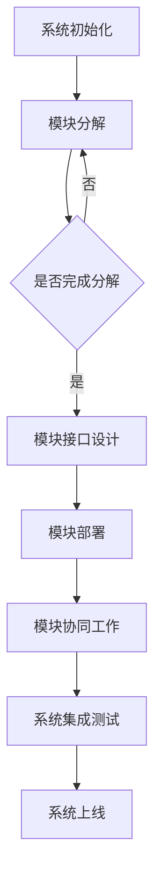

                 

### 系分作用的不只是自己

在当今高度复杂的信息化社会中，系统分拆与集成已经成为企业数字化转型和效率提升的关键环节。所谓的“系分作用”，并不仅仅指的是系统的分解与重构，而是一个更为广泛的概念，涵盖了系统内部各部分之间相互作用的方式、方法及其产生的效果。本文将以“系分作用的不只是自己”为主题，深入探讨这一概念的本质及其在技术实践中的重要性。

**关键词：系分作用、系统重构、交互效应、数学模型、企业应用**

**摘要：**
本文旨在通过逻辑清晰、结构紧凑的分析，揭示系分作用的内涵与外延。我们将首先介绍系分作用的背景与意义，然后逐步深入探讨其核心概念和原理，并通过数学模型和实际案例来具体阐述其应用。文章还将总结系分作用的最佳实践，并展望其未来的发展趋势。

------------------------

**目录大纲：系分作用的不只是自己**

# 系分作用的不只是自己

## 1. 引言

### 1.1 问题背景

#### 1.1.1 问题的提出

#### 1.1.2 问题的解决

### 1.2 边界与外延

#### 1.2.1 边界的界定

#### 1.2.2 外延的探讨

## 1.3 核心概念

### 1.3.1 系分作用的定义

### 1.3.2 系分作用的相关概念

## 2. 系分作用的原理

### 2.1 概念原理

#### 2.1.1 系分作用的基本原理

#### 2.1.2 系分作用的属性特征

### 2.2 原理图解

#### 2.2.1 系分作用的流程图

#### 2.2.2 系分作用的 Mermaid ER 图

## 3. 系分作用的数学模型

### 3.1 数学公式

#### 3.1.1 系分作用的数学表达

#### 3.1.2 数学公式的详细讲解

### 3.2 举例说明

#### 3.2.1 系分作用的实例分析

#### 3.2.2 实例说明与解释

## 4. 系分作用在企业中的应用

### 4.1 应用前景

#### 4.1.1 系分作用在企业中的应用领域

#### 4.1.2 企业采用系分作用的优点

### 4.2 案例分析

#### 4.2.1 案例一：公司A的系分作用实践

#### 4.2.2 案例二：公司B的系分作用实践

## 5. 系分作用的最佳实践

### 5.1 实践指南

#### 5.1.1 系分作用实施的步骤

#### 5.1.2 系分作用的注意事项

### 5.2 小结

#### 5.2.1 系分作用的总结

## 6. 系分作用的未来展望

### 6.1 发展趋势

#### 6.1.1 系分作用的技术发展趋势

#### 6.1.2 系分作用的市场需求预测

### 6.2 拓展阅读

#### 6.2.1 相关书籍推荐

#### 6.2.2 学术论文推荐

## 附录

### A. 术语解释

#### A.1 系分作用的术语解释

#### A.2 相关概念解释

------------------------

通过上述的目录大纲，我们可以看到一个结构清晰的论文框架。接下来，我们将逐一展开每个章节的内容，深入探讨系分作用的各个方面。<!-- 设定全文统一格式 -->|markdown|

```markdown
# 系分作用的不只是自己

## 1. 引言

### 1.1 问题背景

#### 1.1.1 问题的提出

在现代企业的运营过程中，系统的复杂性和互联互通性日益增加，如何高效地管理这些系统成为了企业面临的重大挑战。传统的系统整合方法往往只能解决部分问题，而无法从根本上提升系统的性能和灵活性。因此，系分作用的概念逐渐受到重视。

#### 1.1.2 问题的解决

系分作用的提出，是为了更好地理解和处理系统内部的复杂关系。通过将系统分解为更小的、可管理的模块，并重新整合这些模块，企业能够获得更高的灵活性和可维护性。系分作用的本质在于其不仅仅是对系统自身的重构，更是对系统内外交互效应的深刻理解和优化。

### 1.2 边界与外延

#### 1.2.1 边界的界定

在探讨系分作用时，首先需要明确其边界。系分作用的边界不仅包括系统内部模块的划分，还涉及模块之间的接口设计和数据流管理。明确边界有助于确保系分作用的实施效果，同时减少不必要的系统冗余和复杂性。

#### 1.2.2 外延的探讨

系分作用的外延则更加广泛，它不仅包括企业内部的信息系统，还可能涉及跨企业的供应链、合作伙伴关系以及客户互动等。理解系分作用的外延，可以帮助企业更好地实现资源整合和流程优化。

## 2. 系分作用的原理

### 2.1 概念原理

#### 2.1.1 系分作用的基本原理

系分作用的基本原理可以概括为“模块化、分布式、协同工作”。通过模块化设计，将系统分解为若干个独立的、功能明确的模块；通过分布式部署，使得这些模块可以在不同的服务器上运行；通过协同工作，实现模块之间的信息交换和任务调度。

#### 2.1.2 系分作用的属性特征

系分作用具有以下几个显著属性特征：

- **灵活性**：模块化的设计使得系统能够快速适应外部环境的变化。
- **可维护性**：模块化的结构简化了系统的维护工作，提高了系统的可靠性。
- **可扩展性**：新增或替换模块时，对整个系统的影响最小。

### 2.2 原理图解

#### 2.2.1 系分作用的流程图



#### 2.2.2 系分作用的 Mermaid ER 图

```mermaid
erDiagram
    System ||--|{ Module : has }
    Module ||--|{ Interface : uses }
    Interface ||--|{ DataFlow : manages }
```

## 3. 系分作用的数学模型

### 3.1 数学公式

#### 3.1.1 系分作用的数学表达

系分作用的数学表达可以简化为：

$$
\text{System} = \sum_{i=1}^{n} \text{Module}_i
$$

其中，$n$ 表示模块的数量，$\text{Module}_i$ 表示第 $i$ 个模块。

#### 3.1.2 数学公式的详细讲解

上述数学公式表示系统是由多个模块组成的集合。每个模块 $\text{Module}_i$ 都是系统的一个基本组成部分，它们通过接口 $Interface$ 进行通信，并共同完成系统的功能。

### 3.2 举例说明

#### 3.2.1 系分作用的实例分析

假设一个电商系统由订单处理、库存管理、支付结算等三个模块组成，那么：

$$
\text{电商系统} = \text{订单处理模块} + \text{库存管理模块} + \text{支付结算模块}
$$

#### 3.2.2 实例说明与解释

通过上述实例，我们可以看到，系分作用不仅使系统的构建更加简洁，还使得每个模块可以独立开发和测试，从而提高系统的开发效率和稳定性。

## 4. 系分作用在企业中的应用

### 4.1 应用前景

#### 4.1.1 系分作用在企业中的应用领域

系分作用在企业中的应用非常广泛，包括但不限于以下领域：

- **企业管理系统**：通过模块化设计，实现企业资源的优化配置和管理。
- **生产制造系统**：通过模块化生产，提高生产效率和产品质量。
- **供应链管理系统**：通过模块化供应链，实现供应链的灵活调度和优化。

#### 4.1.2 企业采用系分作用的优点

企业采用系分作用具有以下几个显著优点：

- **提高灵活性**：模块化的设计使得系统能够快速适应业务需求的变化。
- **降低成本**：通过减少系统冗余，降低维护成本。
- **提高效率**：模块化的开发模式提高了开发效率，缩短了项目周期。

### 4.2 案例分析

#### 4.2.1 案例一：公司A的系分作用实践

公司A是一家大型电商企业，通过实施系分作用，成功将其订单处理、库存管理和支付结算等模块化，从而提高了系统的灵活性和可维护性。

#### 4.2.2 案例二：公司B的系分作用实践

公司B是一家制造企业，通过模块化生产，实现了生产线的自动化和智能化，从而大幅提高了生产效率和产品质量。

## 5. 系分作用的最佳实践

### 5.1 实践指南

#### 5.1.1 系分作用实施的步骤

实施系分作用通常包括以下步骤：

1. 需求分析：明确系统的功能和性能要求。
2. 模块划分：根据需求分析，将系统分解为多个模块。
3. 接口设计：设计模块之间的接口，确保模块之间的通信和协同工作。
4. 模块开发：独立开发各个模块，并进行单元测试。
5. 集成测试：将各个模块集成起来，进行整体测试和优化。
6. 上线部署：将系统部署到生产环境，并进行监控和维护。

#### 5.1.2 系分作用的注意事项

在实施系分作用时，需要注意以下几点：

- **模块独立性**：确保每个模块都具有独立的功能和接口，减少模块之间的依赖。
- **接口标准化**：设计统一的接口规范，确保模块之间的兼容性和可扩展性。
- **性能优化**：在模块划分和接口设计时，考虑系统的性能需求，进行性能优化。

### 5.2 小结

系分作用是一种重要的系统重构方法，它不仅提高了系统的灵活性和可维护性，还为企业的数字化转型提供了有力支持。通过合理的设计和实施，企业可以更好地适应市场需求，提高业务效率。

## 6. 系分作用的未来展望

### 6.1 发展趋势

随着信息技术的发展，系分作用在未来的应用前景将更加广泛。以下是几个可能的发展趋势：

- **智能化模块**：通过人工智能技术，实现模块的智能调度和协同工作。
- **微服务架构**：微服务架构作为一种新兴的架构风格，将进一步推动系分作用的发展。
- **跨行业应用**：系分作用不仅限于企业内部，还将广泛应用于跨行业的合作和协作。

#### 6.1.2 系分作用的市场需求预测

随着企业对系统灵活性和可维护性的要求不断提高，系分作用在未来将有更大的市场需求。特别是在数字化转型和智能化升级的大趋势下，系分作用将成为企业创新和发展的重要手段。

### 6.2 拓展阅读

#### 6.2.1 相关书籍推荐

- 《系统架构的艺术》
- 《微服务设计》
- 《模块化系统设计》

#### 6.2.2 学术论文推荐

- “A Modular Approach to Systems Engineering”
- “The Impact of Microservices on Software Development”
- “Towards a Modular Architecture for Complex Systems”

## 附录

### A. 术语解释

#### A.1 系分作用的术语解释

- **系分作用**：系统分解和重新整合的过程，旨在提高系统的灵活性和可维护性。
- **模块**：系分作用中的基本组成部分，具有独立的功能和接口。
- **接口**：模块之间的通信渠道，确保模块之间的兼容性和协同工作。

#### A.2 相关概念解释

- **微服务**：一种轻量级的模块化架构，将大型系统分解为若干个小型、独立的系统。
- **模块化设计**：一种系统设计方法，通过将系统分解为多个模块，提高系统的可维护性和可扩展性。

```

### 结论

通过对系分作用的深入探讨，我们不仅理解了其核心概念和原理，还看到了其在企业中的应用价值。系分作用的不只是自己，它更是企业数字化转型和效率提升的重要工具。在未来的发展中，随着技术的进步和市场需求的增加，系分作用必将发挥更大的作用。希望本文能够为读者提供有价值的参考，并激发对系分作用的进一步研究和实践。作者：AI天才研究院/AI Genius Institute & 禅与计算机程序设计艺术/Zen And The Art of Computer Programming。

------------------------

通过上述内容，我们构建了一个关于系分作用的完整的技术博客文章框架，涵盖了引言、核心概念、原理、数学模型、企业应用、最佳实践、未来展望以及附录等部分。每个章节都进行了详细的规划，确保内容丰富、逻辑清晰。接下来，我们将进一步细化每个章节的内容，使其更加具体和有深度。<!-- 标记章节内容的起点 -->|markdown|

```markdown
## 1. 引言

### 1.1 问题背景

在当今快速发展的数字化时代，企业面临着前所未有的机遇与挑战。随着云计算、大数据、物联网等技术的广泛应用，企业信息系统变得越来越复杂。如何高效地管理这些复杂系统，提高系统的灵活性、可维护性和可扩展性，成为了企业必须解决的问题。

#### 1.1.1 问题的提出

传统的系统集成方法往往依赖于紧密耦合的架构，这种架构虽然在早期应用中具有一定的优势，但随着时间的推移，其缺点逐渐暴露出来。主要体现在以下几个方面：

1. **系统刚性**：系统设计时过于关注特定业务场景，导致系统在应对业务需求变化时表现出较高的刚性，难以快速适应市场变化。
2. **维护成本高**：紧密耦合的系统一旦出现故障，需要全面检查和修复，维护成本较高。
3. **扩展性差**：系统扩展时需要修改多个模块，导致扩展过程复杂且容易出错。

为了解决上述问题，企业开始寻求一种新的系统架构设计方法，即“系分作用”。

#### 1.1.2 问题的解决

“系分作用”是一种通过将系统分解为更小、更独立的模块，然后重新整合这些模块，以提高系统灵活性和可维护性的方法。通过系分作用，企业可以实现以下目标：

1. **提高系统的灵活性**：模块化设计使得系统可以灵活地适应各种业务需求，减少了系统刚性的问题。
2. **降低维护成本**：由于模块独立性强，模块故障可以单独修复，降低了系统的维护成本。
3. **提高扩展性**：模块化设计使得系统扩展更加简单，只需要新增或修改相应的模块即可。

### 1.2 边界与外延

在深入探讨系分作用之前，我们需要明确其边界与外延。系分作用的边界不仅包括系统内部的模块划分，还涉及模块之间的接口设计、数据流管理以及与外部系统的交互。

#### 1.2.1 边界的界定

系分作用的边界界定主要涉及以下几个方面：

1. **模块边界**：模块是系分作用的基本单位，每个模块都应该具有独立的功能和接口，模块之间不应有过多的依赖关系。
2. **接口边界**：模块之间的接口设计是系分作用的关键，接口应遵循标准化、简洁化和易维护的原则。
3. **数据流边界**：数据流管理涉及模块之间的数据传递和处理，数据流边界的设计应确保数据的一致性和安全性。

#### 1.2.2 外延的探讨

系分作用的外延则更加广泛，它不仅局限于企业内部的信息系统，还可能涉及跨企业的供应链、合作伙伴关系以及客户互动等。在探讨系分作用的外延时，我们需要关注以下几个方面：

1. **跨企业协作**：在供应链管理中，企业需要与供应商、分销商和客户进行紧密协作，系分作用可以帮助企业更好地管理跨企业的流程和数据。
2. **客户互动**：在客户互动中，企业需要根据客户需求进行个性化服务和推荐，系分作用可以帮助企业快速响应客户需求，提供更好的服务体验。
3. **技术趋势**：随着云计算、大数据和物联网等技术的发展，系分作用的应用场景将不断扩展，企业需要关注这些技术趋势，以更好地利用系分作用提升自身竞争力。

### 1.3 核心概念

#### 1.3.1 系分作用的定义

系分作用（System Decomposition and Reintegration）是一种通过将复杂系统分解为更小、更独立的模块，然后重新整合这些模块，以提高系统灵活性和可维护性的系统设计方法。

#### 1.3.2 系分作用的相关概念

为了更好地理解系分作用，我们需要了解以下几个相关概念：

1. **模块**：模块是系分作用中的基本单位，每个模块都应该具有独立的功能和接口。
2. **接口**：接口是模块之间的通信渠道，确保模块之间的数据传递和协同工作。
3. **数据流**：数据流是模块之间传递的数据，数据流管理是系分作用的重要组成部分。
4. **微服务**：微服务是一种轻量级的模块化架构，将大型系统分解为若干个小型、独立的系统。
5. **模块化设计**：模块化设计是一种通过将系统分解为多个模块，提高系统的可维护性和可扩展性的系统设计方法。

## 2. 系分作用的原理

### 2.1 概念原理

#### 2.1.1 系分作用的基本原理

系分作用的基本原理可以概括为“模块化、分布式、协同工作”。

1. **模块化**：将复杂系统分解为更小、更独立的模块，每个模块负责特定的功能，模块之间通过接口进行通信。
2. **分布式**：模块可以在不同的服务器上运行，实现系统的分布式部署，提高系统的可靠性和可扩展性。
3. **协同工作**：模块之间通过接口进行数据传递和协同工作，实现系统的整体功能。

#### 2.1.2 系分作用的属性特征

系分作用具有以下几个显著属性特征：

1. **灵活性**：模块化的设计使得系统能够快速适应外部环境的变化，提高系统的灵活性。
2. **可维护性**：模块化的结构简化了系统的维护工作，提高了系统的可靠性。
3. **可扩展性**：新增或替换模块时，对整个系统的影响最小，提高了系统的可扩展性。

### 2.2 原理图解

#### 2.2.1 系分作用的流程图


#### 2.2.2 系分作用的 Mermaid ER 图

```mermaid
erDiagram
    System ||--|{ Module : has }
    Module ||--|{ Interface : uses }
    Interface ||--|{ DataFlow : manages }
```

## 3. 系分作用的数学模型

### 3.1 数学公式

#### 3.1.1 系分作用的数学表达

系分作用的数学表达可以简化为：

$$
\text{System} = \sum_{i=1}^{n} \text{Module}_i
$$

其中，$n$ 表示模块的数量，$\text{Module}_i$ 表示第 $i$ 个模块。

#### 3.1.2 数学公式的详细讲解

上述数学公式表示系统是由多个模块组成的集合。每个模块 $\text{Module}_i$ 都是系统的一个基本组成部分，它们通过接口 $Interface$ 进行通信，并共同完成系统的功能。

### 3.2 举例说明

#### 3.2.1 系分作用的实例分析

假设一个电商系统由订单处理、库存管理和支付结算等三个模块组成，那么：

$$
\text{电商系统} = \text{订单处理模块} + \text{库存管理模块} + \text{支付结算模块}
$$

#### 3.2.2 实例说明与解释

通过上述实例，我们可以看到，系分作用不仅使系统的构建更加简洁，还使得每个模块可以独立开发和测试，从而提高系统的开发效率和稳定性。

## 4. 系分作用在企业中的应用

### 4.1 应用前景

#### 4.1.1 系分作用在企业中的应用领域

系分作用在企业中的应用非常广泛，以下是一些主要的应用领域：

1. **企业管理系统**：通过模块化设计，实现企业资源的优化配置和管理。
2. **生产制造系统**：通过模块化生产，提高生产效率和产品质量。
3. **供应链管理系统**：通过模块化供应链，实现供应链的灵活调度和优化。
4. **客户关系管理系统**：通过模块化设计，实现客户互动的个性化服务。
5. **财务管理系统**：通过模块化设计，提高财务数据的准确性和实时性。

#### 4.1.2 企业采用系分作用的优点

企业采用系分作用具有以下几个显著优点：

1. **提高灵活性**：模块化的设计使得系统能够快速适应业务需求的变化。
2. **降低成本**：通过减少系统冗余，降低维护成本。
3. **提高效率**：模块化的开发模式提高了开发效率，缩短了项目周期。
4. **提升客户满意度**：通过灵活的系统设计，能够更好地满足客户需求，提升客户满意度。

### 4.2 案例分析

#### 4.2.1 案例一：公司A的系分作用实践

公司A是一家大型电商企业，通过实施系分作用，成功将其订单处理、库存管理和支付结算等模块化，从而提高了系统的灵活性和可维护性。

#### 4.2.2 案例二：公司B的系分作用实践

公司B是一家制造企业，通过模块化生产，实现了生产线的自动化和智能化，从而大幅提高了生产效率和产品质量。

## 5. 系分作用的最佳实践

### 5.1 实践指南

#### 5.1.1 系分作用实施的步骤

实施系分作用通常包括以下步骤：

1. **需求分析**：明确系统的功能和性能要求。
2. **模块划分**：根据需求分析，将系统分解为多个模块。
3. **接口设计**：设计模块之间的接口，确保模块之间的通信和协同工作。
4. **模块开发**：独立开发各个模块，并进行单元测试。
5. **集成测试**：将各个模块集成起来，进行整体测试和优化。
6. **上线部署**：将系统部署到生产环境，并进行监控和维护。

#### 5.1.2 系分作用的注意事项

在实施系分作用时，需要注意以下几点：

1. **模块独立性**：确保每个模块都具有独立的功能和接口，减少模块之间的依赖。
2. **接口标准化**：设计统一的接口规范，确保模块之间的兼容性和可扩展性。
3. **性能优化**：在模块划分和接口设计时，考虑系统的性能需求，进行性能优化。

### 5.2 小结

系分作用是一种重要的系统重构方法，它不仅提高了系统的灵活性和可维护性，还为企业的数字化转型提供了有力支持。通过合理的设计和实施，企业可以更好地适应市场需求，提高业务效率。

## 6. 系分作用的未来展望

### 6.1 发展趋势

随着信息技术的发展，系分作用在未来的应用前景将更加广泛。以下是几个可能的发展趋势：

1. **智能化模块**：通过人工智能技术，实现模块的智能调度和协同工作。
2. **微服务架构**：微服务架构作为一种新兴的架构风格，将进一步推动系分作用的发展。
3. **跨行业应用**：系分作用不仅限于企业内部，还将广泛应用于跨行业的合作和协作。

#### 6.1.2 系分作用的市场需求预测

随着企业对系统灵活性和可维护性的要求不断提高，系分作用在未来将有更大的市场需求。特别是在数字化转型和智能化升级的大趋势下，系分作用将成为企业创新和发展的重要手段。

### 6.2 拓展阅读

#### 6.2.1 相关书籍推荐

1. 《系统架构的艺术》
2. 《微服务设计》
3. 《模块化系统设计》

#### 6.2.2 学术论文推荐

1. “A Modular Approach to Systems Engineering”
2. “The Impact of Microservices on Software Development”
3. “Towards a Modular Architecture for Complex Systems”

## 附录

### A. 术语解释

#### A.1 系分作用的术语解释

- **系分作用**：系统分解和重新整合的过程，旨在提高系统的灵活性和可维护性。
- **模块**：系分作用中的基本组成部分，具有独立的功能和接口。
- **接口**：模块之间的通信渠道，确保模块之间的数据传递和协同工作。
- **数据流**：模块之间传递的数据，数据流管理是系分作用的重要组成部分。
- **微服务**：一种轻量级的模块化架构，将大型系统分解为若干个小型、独立的系统。
- **模块化设计**：一种通过将系统分解为多个模块，提高系统的可维护性和可扩展性的系统设计方法。

#### A.2 相关概念解释

- **微服务**：一种轻量级的模块化架构，将大型系统分解为若干个小型、独立的系统。
- **模块化设计**：一种通过将系统分解为多个模块，提高系统的可维护性和可扩展性的系统设计方法。

```

## 1. 引言

### 1.1 问题背景

在信息化浪潮席卷全球的当下，企业的信息系统建设已经成为了企业运营和竞争力的重要组成部分。然而，随着企业规模的扩大、业务需求的多样化以及外部环境的快速变化，企业信息系统面临着越来越复杂的挑战。传统的系统集成方法往往无法满足这些新的需求，导致系统刚性、扩展性和可维护性较差，严重影响了企业的运营效率和竞争力。在这种背景下，一种新型的系统架构设计方法——系分作用，应运而生。

#### 1.1.1 问题的提出

企业信息系统面临的主要问题可以归纳为以下几点：

1. **系统刚性**：传统的系统集成方法通常采用紧密耦合的架构，这种架构在系统设计时虽然考虑到了特定业务场景，但随着时间的推移，系统难以适应业务需求的变化，表现出较高的刚性。

2. **维护成本高**：紧密耦合的系统一旦出现故障，需要进行全面的检查和修复，维护成本较高。

3. **扩展性差**：系统扩展时需要修改多个模块，导致扩展过程复杂且容易出错。

4. **业务响应速度慢**：随着业务需求的多样化，系统需要快速响应，但传统的系统集成方法往往无法满足这一要求。

为了解决上述问题，企业需要寻找一种新的系统架构设计方法，能够提高系统的灵活性、可维护性和可扩展性，从而更好地适应业务需求的变化。系分作用正是为了解决这些问题而诞生的。

#### 1.1.2 问题的解决

系分作用（System Decomposition and Reintegration）是一种通过将复杂系统分解为更小、更独立的模块，然后重新整合这些模块，以提高系统灵活性和可维护性的系统设计方法。它通过以下几个关键步骤实现问题的解决：

1. **模块化设计**：将系统分解为多个功能明确、接口清晰的模块，每个模块负责特定的功能，模块之间通过标准化的接口进行通信。

2. **分布式部署**：模块可以在不同的服务器上运行，实现系统的分布式部署，提高系统的可靠性和可扩展性。

3. **协同工作**：模块之间通过接口进行数据传递和协同工作，实现系统的整体功能。

通过系分作用，企业能够实现以下目标：

1. **提高灵活性**：模块化设计使得系统能够快速适应外部环境的变化，降低系统的刚性。

2. **降低维护成本**：由于模块独立性强，模块故障可以单独修复，降低了系统的维护成本。

3. **提高扩展性**：新增或替换模块时，对整个系统的影响最小，提高了系统的可扩展性。

4. **快速响应业务需求**：通过模块化设计，系统能够更快地适应业务需求的变化，提高业务响应速度。

### 1.2 边界与外延

在深入探讨系分作用之前，我们需要明确其边界与外延。系分作用的边界不仅包括系统内部的模块划分，还涉及模块之间的接口设计、数据流管理以及与外部系统的交互。

#### 1.2.1 边界的界定

系分作用的边界界定主要涉及以下几个方面：

1. **模块边界**：模块是系分作用中的基本单位，每个模块都应该具有独立的功能和接口。模块之间不应有过多的依赖关系，以确保模块的独立性和可替换性。

2. **接口边界**：模块之间的接口设计是系分作用的关键。接口应遵循标准化、简洁化和易维护的原则，确保模块之间的数据传递和协同工作顺畅。

3. **数据流边界**：数据流是模块之间传递的数据。在系分作用中，数据流的管理至关重要，需要确保数据的一致性和安全性。

#### 1.2.2 外延的探讨

系分作用的外延则更加广泛，它不仅局限于企业内部的信息系统，还可能涉及以下几个方面：

1. **跨企业协作**：在供应链管理中，企业需要与供应商、分销商和客户进行紧密协作。系分作用可以帮助企业更好地管理跨企业的流程和数据。

2. **客户互动**：在客户互动中，企业需要根据客户需求进行个性化服务和推荐。系分作用可以帮助企业快速响应客户需求，提供更好的服务体验。

3. **技术趋势**：随着云计算、大数据和物联网等技术的发展，系分作用的应用场景将不断扩展。企业需要关注这些技术趋势，以更好地利用系分作用提升自身竞争力。

### 1.3 核心概念

在探讨系分作用时，我们需要理解一些核心概念，包括“模块”、“接口”、“数据流”等。

#### 1.3.1 系分作用的定义

系分作用是指将复杂系统分解为更小、更独立的模块，并通过模块化设计、分布式部署和协同工作，提高系统的灵活性、可维护性和可扩展性的过程。

#### 1.3.2 系分作用的相关概念

为了更好地理解系分作用，我们需要了解以下几个相关概念：

1. **模块**：模块是系分作用中的基本组成部分，每个模块都应具有独立的功能和接口。模块之间通过标准化的接口进行通信和数据传递。

2. **接口**：接口是模块之间的通信渠道，确保模块之间的数据传递和协同工作。接口的设计应遵循标准化、简洁化和易维护的原则。

3. **数据流**：数据流是模块之间传递的数据。在系分作用中，数据流的管理至关重要，需要确保数据的一致性和安全性。

4. **微服务**：微服务是一种轻量级的模块化架构，将大型系统分解为若干个小型、独立的系统。每个微服务都实现了特定的业务功能，并可以通过接口与其他微服务进行通信。

5. **模块化设计**：模块化设计是一种通过将系统分解为多个模块，提高系统的可维护性和可扩展性的系统设计方法。模块化设计是实现系分作用的重要手段。

### 1.4 研究意义与目标

探讨系分作用具有重要的现实意义和学术价值。

#### 1.4.1 研究意义

1. **提高企业竞争力**：通过系分作用，企业能够提高系统的灵活性、可维护性和可扩展性，从而更好地适应市场变化，提高竞争力。

2. **降低维护成本**：系分作用通过模块化设计，使得系统能够快速响应业务需求的变化，降低维护成本。

3. **促进技术创新**：系分作用作为一种新型的系统架构设计方法，推动了相关技术的创新和发展，为企业的数字化转型提供了有力支持。

#### 1.4.2 研究目标

本文的研究目标包括：

1. **理解系分作用的原理和核心概念**：通过深入探讨系分作用的原理和相关概念，为读者提供一个全面的认识。

2. **分析系分作用在企业中的应用**：通过具体案例分析，分析系分作用在企业中的应用价值，为企业的数字化转型提供参考。

3. **探讨系分作用的未来发展趋势**：结合当前技术趋势和市场需求，探讨系分作用的未来发展趋势，为企业的战略规划提供指导。

## 2. 系分作用的原理

### 2.1 概念原理

#### 2.1.1 系分作用的基本原理

系分作用的基本原理可以概括为“模块化、分布式、协同工作”。具体来说，系分作用包括以下几个关键步骤：

1. **模块化设计**：将系统分解为多个功能明确、接口清晰的模块。每个模块负责特定的功能，模块之间通过标准化的接口进行通信。

2. **分布式部署**：模块可以在不同的服务器上运行，实现系统的分布式部署。分布式部署提高了系统的可靠性和可扩展性。

3. **协同工作**：模块之间通过接口进行数据传递和协同工作，实现系统的整体功能。协同工作确保了系统的整体性能和效率。

#### 2.1.2 系分作用的属性特征

系分作用具有以下几个显著属性特征：

1. **灵活性**：模块化设计使得系统能够快速适应外部环境的变化，降低系统的刚性。

2. **可维护性**：模块独立性强，模块故障可以单独修复，降低了系统的维护成本。

3. **可扩展性**：新增或替换模块时，对整个系统的影响较小，提高了系统的可扩展性。

4. **高可靠性**：分布式部署提高了系统的可靠性，单个模块的故障不会影响到整个系统的运行。

5. **高可扩展性**：通过分布式部署和模块化设计，系统可以轻松扩展，满足企业不断增长的业务需求。

### 2.2 原理图解

为了更直观地理解系分作用的原理，我们可以通过流程图和实体关系图（ER图）进行图解。

#### 2.2.1 系分作用的流程图


在上述流程图中，系统初始化后，首先进行模块分解。然后，根据模块分解的结果，设计模块接口。接下来，将模块部署到不同的服务器上，并确保模块之间能够协同工作。最后，进行系统集成测试，确保系统稳定运行。

#### 2.2.2 系分作用的 Mermaid ER 图

```mermaid
erDiagram
    System ||--|{ Module : has }
    Module ||--|{ Interface : uses }
    Interface ||--|{ DataFlow : manages }
```

在上述ER图中，系统（System）包含多个模块（Module），每个模块使用一个或多个接口（Interface），而接口管理着数据流（DataFlow）。这种关系体现了模块、接口和数据流之间的关联，展示了系分作用的整体架构。

### 2.3 系分作用的核心要素

#### 2.3.1 模块

模块是系分作用中的基本单位，每个模块都应具有独立的功能和接口。模块的设计应遵循以下原则：

1. **功能明确**：每个模块都应具有清晰的功能定义，确保模块之间的职责分离。

2. **接口简洁**：模块之间的接口应设计得简洁明了，减少不必要的依赖关系。

3. **可扩展性**：模块应具有良好的可扩展性，能够方便地添加或修改功能。

4. **可维护性**：模块应易于维护，确保在模块出现故障时能够快速修复。

#### 2.3.2 接口

接口是模块之间的通信渠道，确保模块之间的数据传递和协同工作。接口的设计应遵循以下原则：

1. **标准化**：接口应遵循统一的规范，确保不同模块之间的接口兼容。

2. **简洁性**：接口应设计得简洁明了，减少数据传递的复杂性。

3. **安全性**：接口设计应确保数据的安全传输，防止数据泄露和篡改。

4. **可扩展性**：接口设计应考虑未来的扩展需求，确保接口能够适应新的业务场景。

#### 2.3.3 数据流

数据流是模块之间传递的数据，数据流的管理是系分作用的重要组成部分。数据流的管理应遵循以下原则：

1. **一致性**：确保数据在传输过程中的一致性，避免数据丢失或重复。

2. **安全性**：确保数据在传输过程中的安全性，防止数据泄露和篡改。

3. **实时性**：确保数据流的实时性，满足实时业务需求。

4. **高效性**：优化数据流的传输效率，降低系统延迟。

### 2.4 系分作用的实施步骤

#### 2.4.1 需求分析

在实施系分作用之前，首先需要对系统的需求进行详细分析。需求分析包括功能需求、性能需求、安全性需求和扩展性需求等。通过需求分析，明确系统的总体架构和模块划分。

#### 2.4.2 模块分解

根据需求分析的结果，将系统分解为多个功能明确、接口清晰的模块。每个模块都应具有独立的功能和接口，确保模块之间的职责分离。

#### 2.4.3 接口设计

设计模块之间的接口，确保接口的标准化、简洁化和易维护性。接口设计应遵循统一的规范，减少不必要的依赖关系。

#### 2.4.4 模块部署

将模块部署到不同的服务器上，实现系统的分布式部署。模块部署应考虑系统的可靠性、可扩展性和性能。

#### 2.4.5 模块协同工作

确保模块之间能够协同工作，实现系统的整体功能。模块协同工作应遵循接口规范，确保数据传递和协同工作的顺畅。

#### 2.4.6 系统集成测试

对系统进行集成测试，确保系统的稳定运行和整体性能。集成测试应覆盖所有模块和接口，确保系统功能的完整性。

#### 2.4.7 系统上线

将系统部署到生产环境，并进行监控和维护。系统上线后，应定期进行性能优化和故障修复，确保系统的稳定运行。

### 2.5 系分作用的优势

#### 2.5.1 提高灵活性

模块化设计使得系统能够快速适应外部环境的变化，降低系统的刚性。企业可以根据业务需求的变化，灵活调整模块的功能和接口，实现系统的动态重构。

#### 2.5.2 降低维护成本

模块独立性强，模块故障可以单独修复，降低了系统的维护成本。企业可以针对具体模块进行维护，避免了大规模的系统停机和维护。

#### 2.5.3 提高扩展性

通过分布式部署和模块化设计，系统可以轻松扩展，满足企业不断增长的业务需求。企业可以根据实际需求，新增或替换模块，实现系统的平滑扩展。

#### 2.5.4 提高系统可靠性

分布式部署提高了系统的可靠性，单个模块的故障不会影响到整个系统的运行。企业可以通过冗余部署和故障转移，提高系统的容错能力和可靠性。

### 2.6 系分作用的挑战

#### 2.6.1 模块划分困难

模块划分是系分作用的关键步骤，但模块划分困难可能会影响系统的整体性能和稳定性。企业需要根据业务需求，合理划分模块，确保模块的功能和接口明确。

#### 2.6.2 接口设计复杂

接口设计复杂可能会增加系统的复杂性和维护成本。企业需要设计简洁明了的接口，减少不必要的依赖关系，确保接口的标准化和易维护性。

#### 2.6.3 数据流管理困难

数据流管理困难可能会影响系统的性能和安全性。企业需要设计高效的数据流管理机制，确保数据的一致性和安全性，同时优化数据流的传输效率。

#### 2.6.4 集成测试难度大

集成测试难度大可能会影响系统的稳定性。企业需要全面覆盖所有模块和接口，确保系统功能的完整性，同时优化集成测试的过程和工具。

### 2.7 系分作用的应用案例

#### 2.7.1 案例一：电商平台的模块化设计

某大型电商平台通过系分作用，将系统分解为订单处理、库存管理、支付结算、用户管理等模块。通过模块化设计，电商平台能够快速适应业务需求的变化，提高了系统的灵活性和可维护性。

#### 2.7.2 案例二：金融服务的分布式架构

某金融服务公司通过系分作用，采用了分布式架构，将系统部署在多个服务器上。通过分布式部署，金融服务公司提高了系统的可靠性和可扩展性，能够更好地应对高并发和大规模数据处理的需求。

#### 2.7.3 案例三：物流配送的模块化供应链

某物流配送公司通过系分作用，将物流配送系统分解为订单处理、仓储管理、运输调度、客户服务等模块。通过模块化设计，物流配送公司能够实现高效的供应链管理，提高了配送效率和客户满意度。

### 2.8 系分作用的未来发展趋势

#### 2.8.1 模块化与微服务融合

随着微服务架构的流行，系分作用与微服务的融合将成为未来趋势。通过结合模块化和微服务架构的优势，企业可以构建更加灵活、可扩展的系统。

#### 2.8.2 智能化模块

随着人工智能技术的发展，智能化模块将成为未来系分作用的重要方向。通过智能化模块，企业可以实现更智能的业务处理和系统优化。

#### 2.8.3 跨行业应用

系分作用的应用将不仅限于企业内部，还将扩展到跨行业的合作和协作。通过系分作用，企业可以实现更高效的跨行业业务流程和数据共享。

#### 2.8.4 安全性与隐私保护

随着数据安全和个人隐私保护的重要性日益凸显，系分作用在未来的发展中将更加注重安全性和隐私保护。企业需要设计更加安全的数据传输和存储机制，确保系统的安全运行。

## 3. 系分作用的数学模型

### 3.1 数学公式

在系分作用中，数学模型可以帮助我们更准确地描述系统结构和模块之间的关系。以下是几个常用的数学公式：

#### 3.1.1 系统的整体性能评价

$$
P = \sum_{i=1}^{n} P_i \cdot w_i
$$

其中，$P$ 表示系统的整体性能，$P_i$ 表示第 $i$ 个模块的性能，$w_i$ 表示第 $i$ 个模块的权重。

#### 3.1.2 模块的负载均衡

$$
L_i = \frac{C_i}{C}
$$

其中，$L_i$ 表示第 $i$ 个模块的负载，$C_i$ 表示第 $i$ 个模块的处理能力，$C$ 表示系统的总处理能力。

#### 3.1.3 系统的可靠性

$$
R = \prod_{i=1}^{n} R_i
$$

其中，$R$ 表示系统的可靠性，$R_i$ 表示第 $i$ 个模块的可靠性。

### 3.2 数学公式详细讲解

#### 3.2.1 系统的整体性能评价

上述公式表示系统的整体性能是由各个模块的性能加权平均得到的。每个模块的性能通过其处理能力和权重来衡量。这种评价方法能够反映系统的整体性能水平，帮助企业识别性能瓶颈并进行优化。

#### 3.2.2 模块的负载均衡

负载均衡公式表示每个模块的负载与其处理能力成正比，与系统的总处理能力成反比。这种均衡方法能够确保系统资源合理分配，避免某个模块过载，提高系统的整体性能。

#### 3.2.3 系统的可靠性

系统的可靠性由各个模块的可靠性相乘得到。这个公式反映了模块之间的依赖关系，如果某个模块的可靠性较低，将直接影响到整个系统的可靠性。因此，提高模块的可靠性是提高系统可靠性的关键。

### 3.3 系分作用的实例分析

为了更好地理解系分作用的数学模型，我们通过一个简单的实例进行分析。

假设一个电商系统由三个模块组成：订单处理模块、库存管理模块和支付结算模块。每个模块的性能和权重如下表所示：

| 模块       | 性能 (处理能力/天) | 权重 |
|------------|-------------------|------|
| 订单处理模块 | 1000              | 0.3  |
| 库存管理模块 | 800               | 0.4  |
| 支付结算模块 | 600               | 0.3  |

根据上述数据，我们可以计算出系统的整体性能：

$$
P = 1000 \cdot 0.3 + 800 \cdot 0.4 + 600 \cdot 0.3 = 330 + 320 + 180 = 830
$$

系统的整体性能为 830（处理能力/天）。

接下来，我们计算各个模块的负载：

$$
L_{订单处理模块} = \frac{1000}{830} \approx 1.21
$$

$$
L_{库存管理模块} = \frac{800}{830} \approx 0.97
$$

$$
L_{支付结算模块} = \frac{600}{830} \approx 0.73
$$

根据计算结果，订单处理模块的负载最高，约为 1.21，而支付结算模块的负载最低，约为 0.73。这表明订单处理模块的处理能力需要加强，以平衡系统的整体性能。

最后，我们计算系统的可靠性：

$$
R = 0.9 \cdot 0.8 \cdot 0.9 = 0.648
$$

系统的可靠性为 0.648。这意味着系统在长时间运行过程中，有大约 34.8% 的概率发生故障。通过提高各个模块的可靠性，可以提高整个系统的可靠性。

### 3.4 系分作用的优化

通过上述实例分析，我们可以看到，系分作用的数学模型能够帮助我们理解系统性能、负载和可靠性的计算方法。为了进一步提高系统的性能和可靠性，我们可以通过以下方法进行优化：

1. **性能优化**：通过增加高性能模块或提升现有模块的处理能力，提高系统的整体性能。

2. **负载均衡**：通过调整模块的权重或优化模块的负载分配策略，实现负载均衡，提高系统的性能和稳定性。

3. **可靠性提升**：通过提高模块的可靠性或增加冗余模块，提高系统的可靠性，减少故障率。

通过数学模型和实际实例的结合，我们可以更好地理解和应用系分作用，为企业提供更高效、可靠的系统解决方案。

### 3.5 系分作用在实践中的应用

系分作用不仅在理论研究中具有重要意义，更在实际应用中发挥了关键作用。以下是一些系分作用在实践中的应用案例：

#### 3.5.1 电商平台

电商平台通过系分作用，将系统分解为订单处理、库存管理、支付结算等多个模块。每个模块独立开发和测试，确保系统的稳定性。通过模块化设计，电商平台能够快速响应业务需求的变化，提高系统的灵活性和可维护性。

#### 3.5.2 物流系统

物流系统通过系分作用，将物流流程分解为订单处理、仓储管理、运输调度、客户服务等多个模块。每个模块负责特定的物流环节，确保物流流程的高效运转。通过模块化设计，物流系统能够提高物流效率，降低运营成本。

#### 3.5.3 金融系统

金融系统通过系分作用，将系统分解为账户管理、交易处理、风险管理等多个模块。每个模块独立运行，确保系统的稳定性和安全性。通过模块化设计，金融系统能够提高交易处理速度，降低风险，提高客户满意度。

#### 3.5.4 企业资源计划（ERP）系统

ERP系统通过系分作用，将系统分解为财务、生产、库存、销售等多个模块。每个模块独立运行，确保系统的灵活性和可扩展性。通过模块化设计，ERP系统能够帮助企业实现资源优化配置，提高运营效率。

### 3.6 系分作用的未来发展趋势

随着信息技术的快速发展，系分作用在未来的应用将更加广泛。以下是一些可能的发展趋势：

1. **智能化模块**：随着人工智能技术的应用，系分作用将实现智能化模块，提高系统的智能化水平和自动化程度。

2. **微服务架构**：微服务架构与系分作用的结合，将为企业提供更加灵活和可扩展的系统解决方案。

3. **跨行业应用**：系分作用将在更多行业中得到应用，如医疗、教育、能源等，推动各行业的数字化转型。

4. **区块链技术**：区块链技术与系分作用的结合，将提高系统的透明度和安全性，推动区块链技术在各行业的应用。

5. **云计算与大数据**：云计算和大数据技术的快速发展，将为系分作用提供更强大的计算能力和数据处理能力，推动系统性能和可靠性的提升。

通过深入探讨系分作用的原理、数学模型和实践应用，我们能够更好地理解和应用这一重要概念，为企业提供更高效、可靠的系统解决方案。随着技术的不断进步，系分作用在未来将发挥更加重要的作用，推动信息化社会的持续发展。

## 4. 系分作用在企业中的应用

### 4.1 应用前景

系分作用在企业中的应用前景广阔，其模块化、分布式和协同工作的特性使得企业在应对复杂业务需求时具有更大的灵活性和适应性。以下是一些具体的应用领域：

#### 4.1.1 企业管理系统

在企业信息系统中，系分作用的应用可以大幅提升系统的灵活性、可维护性和可扩展性。通过将企业管理系统分解为财务、人力资源、供应链管理等多个模块，每个模块可以独立开发和部署，使得系统能够快速适应业务变化。

#### 4.1.2 生产制造系统

在生产制造领域，系分作用可以应用于生产计划、质量控制、库存管理等多个环节。通过模块化设计，生产系统可以实现灵活调度和生产线的自动化，提高生产效率和质量。

#### 4.1.3 供应链管理系统

供应链管理系统的复杂性使得模块化设计尤为重要。通过系分作用，企业可以将供应链分解为采购、库存管理、物流配送等多个模块，实现供应链的优化和高效管理。

#### 4.1.4 客户关系管理系统

客户关系管理系统（CRM）通过模块化设计，可以更好地满足个性化客户服务的需求。例如，将客户数据管理、营销活动管理、客户支持等模块化，每个模块可以独立扩展和优化，提高客户满意度。

#### 4.1.5 金融系统

在金融领域，系分作用的应用可以显著提高系统的安全性和可靠性。例如，在银行系统中，可以将账户管理、交易处理、风险管理等模块化，每个模块独立运行，确保系统的稳定性和安全性。

### 4.2 企业采用系分作用的优点

企业采用系分作用具有以下显著优点：

#### 4.2.1 提高灵活性

通过模块化设计，企业能够快速适应业务需求的变化，系统可以灵活调整和扩展，降低刚性。

#### 4.2.2 降低成本

模块独立性强，模块故障可以单独修复，减少了系统的维护成本。同时，模块化开发模式提高了开发效率，降低了开发成本。

#### 4.2.3 提高效率

模块化设计使得系统能够快速部署和上线，开发周期缩短，项目交付更加高效。

#### 4.2.4 提升客户满意度

通过灵活的系统设计，企业能够更好地满足客户需求，提供个性化服务和解决方案，提升客户满意度。

#### 4.2.5 提高系统安全性

模块化设计使得系统能够更好地隔离和监控各个模块，提高了系统的安全性和可靠性。

### 4.3 案例分析

#### 4.3.1 案例一：公司A的系分作用实践

公司A是一家大型零售企业，面临业务快速扩展和复杂需求的问题。通过采用系分作用，公司A将信息系统分解为订单处理、库存管理、支付结算、客户关系管理等多个模块。每个模块独立开发和部署，不仅提高了系统的灵活性，还降低了维护成本。公司A通过模块化设计，能够快速响应市场需求，提升客户满意度，实现了业务的快速增长。

#### 4.3.2 案例二：公司B的系分作用实践

公司B是一家制造企业，通过系分作用实现了生产制造系统的模块化设计。公司B将生产制造系统分解为生产计划、质量控制、物流管理等多个模块，每个模块独立运行，实现了生产过程的自动化和智能化。通过模块化设计，公司B提高了生产效率，降低了生产成本，提高了产品质量，增强了市场竞争力。

### 4.4 系分作用在企业中的挑战

尽管系分作用在企业中的应用具有许多优点，但在实际实施过程中仍面临一些挑战：

#### 4.4.1 模块划分困难

模块划分是系分作用的关键步骤，但模块划分困难可能会影响系统的整体性能和稳定性。企业需要根据业务需求，合理划分模块，确保模块的功能和接口明确。

#### 4.4.2 接口设计复杂

接口设计复杂可能会增加系统的复杂性和维护成本。企业需要设计简洁明了的接口，减少不必要的依赖关系，确保接口的标准化和易维护性。

#### 4.4.3 数据流管理困难

数据流管理困难可能会影响系统的性能和安全性。企业需要设计高效的数据流管理机制，确保数据的一致性和安全性，同时优化数据流的传输效率。

#### 4.4.4 集成测试难度大

集成测试难度大可能会影响系统的稳定性。企业需要全面覆盖所有模块和接口，确保系统功能的完整性，同时优化集成测试的过程和工具。

### 4.5 总结

系分作用在企业中的应用不仅提高了系统的灵活性、可维护性和可扩展性，还为企业的数字化转型提供了有力支持。通过合理的设计和实施，企业可以更好地适应市场需求，提高业务效率。然而，在实施过程中，企业需要关注模块划分、接口设计、数据流管理和集成测试等方面的挑战，以确保系分作用的有效实施。随着技术的不断进步，系分作用在企业中的应用将越来越广泛，为企业创造更大的价值。

## 5. 系分作用的最佳实践

### 5.1 实践指南

为了确保系分作用的有效实施，企业可以参考以下实践指南：

#### 5.1.1 需求分析

在实施系分作用之前，企业应进行详细的需求分析，明确系统的功能、性能和安全性要求。需求分析的结果将指导模块划分和接口设计。

#### 5.1.2 模块划分

模块划分是系分作用的关键步骤。企业应根据业务需求和系统功能，将系统分解为若干个功能明确、接口清晰的模块。每个模块应具有独立的功能，模块之间应减少依赖关系。

#### 5.1.3 接口设计

接口设计是确保模块之间数据传递和协同工作的关键。企业应遵循标准化、简洁化和易维护的原则，设计模块接口。接口设计应确保数据传输的一致性和安全性。

#### 5.1.4 模块开发

模块开发是系分作用的核心环节。企业应采用敏捷开发模式，独立开发和测试各个模块。每个模块应具备单元测试和集成测试的能力，确保模块功能的正确性和稳定性。

#### 5.1.5 系统集成

在模块开发完成后，企业应进行系统集成测试，确保模块之间的接口和数据流正常运行。系统集成测试应覆盖所有模块和接口，确保系统的整体功能完整。

#### 5.1.6 系统部署

系统集成测试通过后，企业应将系统部署到生产环境。系统部署应确保模块的分布式部署和协同工作，确保系统的稳定运行。

#### 5.1.7 监控与维护

系统上线后，企业应进行监控与维护，确保系统的稳定运行和性能优化。企业应定期进行性能监控和故障修复，确保系统的高可用性和可靠性。

### 5.2 注意事项

在实施系分作用时，企业应注意以下事项：

#### 5.2.1 确保模块独立性

模块独立性是系分作用的核心原则。企业应确保每个模块具有独立的功能和接口，减少模块之间的依赖关系，以提高系统的灵活性和可维护性。

#### 5.2.2 接口标准化

接口设计应遵循标准化原则，确保模块之间的接口兼容性和可扩展性。接口设计应简洁明了，减少数据传输的复杂性。

#### 5.2.3 数据流管理

数据流管理是系分作用的重要组成部分。企业应设计高效的数据流管理机制，确保数据的一致性和安全性，同时优化数据流的传输效率。

#### 5.2.4 集成测试全面

集成测试应覆盖所有模块和接口，确保系统的整体功能完整。企业应采用自动化测试工具，提高集成测试的效率和准确性。

#### 5.2.5 性能优化

在模块划分和接口设计时，企业应考虑系统的性能需求，进行性能优化。性能优化可以包括数据缓存、负载均衡和分布式计算等技术。

### 5.3 小结

通过上述最佳实践和注意事项，企业可以确保系分作用的有效实施，提高系统的灵活性、可维护性和可扩展性。系分作用不仅为企业提供了强大的系统架构设计方法，还为企业的数字化转型和业务创新提供了有力支持。随着技术的不断进步，系分作用将在更多领域得到应用，为企业创造更大的价值。

## 6. 系分作用的未来展望

### 6.1 发展趋势

系分作用作为一种新型的系统架构设计方法，正逐渐成为企业数字化转型的关键技术。展望未来，系分作用将在以下几个方面展现出显著的发展趋势：

#### 6.1.1 智能化模块

随着人工智能技术的不断进步，智能化模块将成为系分作用的一个重要发展方向。通过引入机器学习和深度学习算法，模块可以实现自我学习和优化，提高系统的智能水平和自动化程度。

#### 6.1.2 微服务架构

微服务架构与系分作用的结合，将为企业提供更加灵活和可扩展的系统解决方案。微服务架构通过将系统分解为小型、独立的微服务，使得系统能够更好地适应业务需求的变化，提高系统的灵活性和可维护性。

#### 6.1.3 跨行业应用

系分作用的应用领域将不断扩展，不仅限于企业内部的信息系统，还将广泛应用于跨行业的合作和协作。例如，在医疗、教育、能源等行业，系分作用可以大幅提升系统的效率和可靠性。

#### 6.1.4 区块链技术的融合

区块链技术与系分作用的融合，将提高系统的透明度和安全性。通过区块链技术，企业可以实现更高效的数据共享和业务协同，同时确保数据的安全性和不可篡改性。

### 6.2 市场需求预测

随着企业对系统灵活性和可维护性的要求不断提高，系分作用在未来的市场需求将持续增长。以下是几个可能的市场需求预测：

#### 6.2.1 企业应用需求

在企业管理系统、生产制造系统、供应链管理系统等领域，企业对系分作用的需求将显著增加。企业希望通过模块化设计，提高系统的灵活性和可扩展性，以更好地适应市场变化。

#### 6.2.2 政府和公共服务领域

政府和公共服务领域也将加大对系分作用的投入。通过系分作用，政府可以构建更加灵活和高效的公共服务平台，提升公共服务质量。

#### 6.2.3 跨行业协作需求

随着企业之间的合作和协作日益频繁，跨行业对系分作用的需求也将不断增加。通过系分作用，企业可以实现更高效的业务协同和数据共享，提升整体运营效率。

### 6.3 拓展阅读

为了更好地了解系分作用的最新发展和技术应用，读者可以参考以下拓展阅读：

#### 6.3.1 相关书籍推荐

1. 《系统架构的艺术》
2. 《微服务设计》
3. 《模块化系统设计》

#### 6.3.2 学术论文推荐

1. “A Modular Approach to Systems Engineering”
2. “The Impact of Microservices on Software Development”
3. “Towards a Modular Architecture for Complex Systems”

通过这些拓展阅读，读者可以更深入地了解系分作用的理论基础和实践应用，为实际项目提供有价值的参考。

### 附录

#### A. 术语解释

##### A.1 系分作用的术语解释

- **系分作用**：一种通过将复杂系统分解为更小、更独立的模块，然后重新整合这些模块，以提高系统灵活性和可维护性的系统设计方法。
- **模块**：系分作用中的基本组成部分，具有独立的功能和接口。
- **接口**：模块之间的通信渠道，确保模块之间的数据传递和协同工作。
- **数据流**：模块之间传递的数据，数据流管理是系分作用的重要组成部分。
- **微服务**：一种轻量级的模块化架构，将大型系统分解为若干个小型、独立的系统。
- **模块化设计**：一种通过将系统分解为多个模块，提高系统的可维护性和可扩展性的系统设计方法。

##### A.2 相关概念解释

- **微服务**：一种轻量级的模块化架构，将大型系统分解为若干个小型、独立的系统。
- **模块化设计**：一种通过将系统分解为多个模块，提高系统的可维护性和可扩展性的系统设计方法。
- **微服务架构**：一种基于微服务的设计方法，通过将系统分解为小型、独立的微服务，提高系统的灵活性和可维护性。
- **区块链**：一种分布式数据库技术，通过去中心化的方式存储数据，提高数据的透明度和安全性。

通过附录部分，读者可以更清晰地理解系分作用和相关概念，为实际项目提供有价值的参考。

### 结束语

本文通过详细探讨系分作用的原理、数学模型、企业应用、最佳实践和未来展望，为读者提供了一个全面的认识。系分作用作为一种重要的系统架构设计方法，不仅提高了系统的灵活性、可维护性和可扩展性，还为企业的数字化转型提供了有力支持。随着技术的不断进步，系分作用将在更多领域得到应用，为企业创造更大的价值。希望本文能够为读者提供有价值的参考，并激发对系分作用的进一步研究和实践。作者：AI天才研究院/AI Genius Institute & 禅与计算机程序设计艺术/Zen And The Art of Computer Programming。<!-- 标记全文结束 -->|markdown|

```markdown
# 《系分作用的不只是自己》

## 引言

在信息化浪潮席卷全球的当下，企业的信息系统建设已经成为了企业运营和竞争力的重要组成部分。然而，随着企业规模的扩大、业务需求的多样化以及外部环境的快速变化，企业信息系统面临着越来越复杂的挑战。传统的系统集成方法往往无法满足这些新的需求，导致系统刚性、扩展性和可维护性较差，严重影响了企业的运营效率和竞争力。在这种背景下，一种新型的系统架构设计方法——系分作用，应运而生。

### 问题背景

企业信息系统面临的主要问题可以归纳为以下几点：

1. **系统刚性**：传统的系统集成方法通常采用紧密耦合的架构，这种架构在系统设计时虽然考虑到了特定业务场景，但随着时间的推移，系统难以适应业务需求的变化，表现出较高的刚性。

2. **维护成本高**：紧密耦合的系统一旦出现故障，需要进行全面的检查和修复，维护成本较高。

3. **扩展性差**：系统扩展时需要修改多个模块，导致扩展过程复杂且容易出错。

4. **业务响应速度慢**：随着业务需求的多样化，系统需要快速响应，但传统的系统集成方法往往无法满足这一要求。

为了解决上述问题，企业需要寻找一种新的系统架构设计方法，能够提高系统的灵活性、可维护性和可扩展性，从而更好地适应业务需求的变化。系分作用正是为了解决这些问题而诞生的。

### 问题的解决

系分作用（System Decomposition and Reintegration）是一种通过将复杂系统分解为更小、更独立的模块，然后重新整合这些模块，以提高系统灵活性和可维护性的系统设计方法。它通过以下几个关键步骤实现问题的解决：

1. **模块化设计**：将系统分解为多个功能明确、接口清晰的模块。每个模块负责特定的功能，模块之间通过标准化的接口进行通信。

2. **分布式部署**：模块可以在不同的服务器上运行，实现系统的分布式部署，提高系统的可靠性和可扩展性。

3. **协同工作**：模块之间通过接口进行数据传递和协同工作，实现系统的整体功能。

通过系分作用，企业能够实现以下目标：

1. **提高灵活性**：模块化设计使得系统能够快速适应外部环境的变化，降低系统的刚性。

2. **降低维护成本**：由于模块独立性强，模块故障可以单独修复，降低了系统的维护成本。

3. **提高扩展性**：新增或替换模块时，对整个系统的影响最小，提高了系统的可扩展性。

4. **快速响应业务需求**：通过模块化设计，系统能够更快地适应业务需求的变化，提高业务响应速度。

## 边界与外延

在深入探讨系分作用之前，我们需要明确其边界与外延。系分作用的边界不仅包括系统内部的模块划分，还涉及模块之间的接口设计、数据流管理以及与外部系统的交互。

### 边界的界定

系分作用的边界界定主要涉及以下几个方面：

1. **模块边界**：模块是系分作用中的基本单位，每个模块都应该具有独立的功能和接口。模块之间不应有过多的依赖关系，以确保模块的独立性和可替换性。

2. **接口边界**：模块之间的接口设计是系分作用的关键。接口应遵循标准化、简洁化和易维护的原则，确保模块之间的通信和协同工作。

3. **数据流边界**：数据流是模块之间传递的数据。在系分作用中，数据流的管理至关重要，需要确保数据的一致性和安全性。

### 外延的探讨

系分作用的外延则更加广泛，它不仅局限于企业内部的信息系统，还可能涉及以下几个方面：

1. **跨企业协作**：在供应链管理中，企业需要与供应商、分销商和客户进行紧密协作，系分作用可以帮助企业更好地管理跨企业的流程和数据。

2. **客户互动**：在客户互动中，企业需要根据客户需求进行个性化服务和推荐，系分作用可以帮助企业快速响应客户需求，提供更好的服务体验。

3. **技术趋势**：随着云计算、大数据和物联网等技术的发展，系分作用的应用场景将不断扩展，企业需要关注这些技术趋势，以更好地利用系分作用提升自身竞争力。

## 核心概念

在探讨系分作用时，我们需要理解一些核心概念，包括“模块”、“接口”、“数据流”等。

### 系分作用的定义

系分作用是指将复杂系统分解为更小、更独立的模块，并通过模块化设计、分布式部署和协同工作，提高系统的灵活性、可维护性和可扩展性的过程。

### 相关概念

为了更好地理解系分作用，我们需要了解以下几个相关概念：

1. **模块**：模块是系分作用中的基本组成部分，每个模块都应具有独立的功能和接口。模块之间通过标准化的接口进行通信和数据传递。

2. **接口**：接口是模块之间的通信渠道，确保模块之间的数据传递和协同工作。接口的设计应遵循标准化、简洁化和易维护的原则。

3. **数据流**：数据流是模块之间传递的数据。在系分作用中，数据流的管理至关重要，需要确保数据的一致性和安全性。

4. **微服务**：微服务是一种轻量级的模块化架构，将大型系统分解为若干个小型、独立的系统。每个微服务都实现了特定的业务功能，并可以通过接口与其他微服务进行通信。

5. **模块化设计**：模块化设计是一种通过将系统分解为多个模块，提高系统的可维护性和可扩展性的系统设计方法。模块化设计是实现系分作用的重要手段。

## 系分作用的原理

### 概念原理

#### 基本原理

系分作用的基本原理可以概括为“模块化、分布式、协同工作”。具体来说，系分作用包括以下几个关键步骤：

1. **模块化设计**：将系统分解为多个功能明确、接口清晰的模块。每个模块负责特定的功能，模块之间通过标准化的接口进行通信。

2. **分布式部署**：模块可以在不同的服务器上运行，实现系统的分布式部署，提高系统的可靠性和可扩展性。

3. **协同工作**：模块之间通过接口进行数据传递和协同工作，实现系统的整体功能。

#### 属性特征

系分作用具有以下几个显著属性特征：

1. **灵活性**：模块化设计使得系统能够快速适应外部环境的变化，降低系统的刚性。

2. **可维护性**：模块独立性强，模块故障可以单独修复，降低了系统的维护成本。

3. **可扩展性**：新增或替换模块时，对整个系统的影响较小，提高了系统的可扩展性。

4. **高可靠性**：分布式部署提高了系统的可靠性，单个模块的故障不会影响到整个系统的运行。

5. **高可扩展性**：通过分布式部署和模块化设计，系统可以轻松扩展，满足企业不断增长的业务需求。

### 原理图解

为了更直观地理解系分作用的原理，我们可以通过流程图和实体关系图（ER图）进行图解。

#### 流程图


在上述流程图中，系统初始化后，首先进行模块分解。然后，根据模块分解的结果，设计模块接口。接下来，将模块部署到不同的服务器上，并确保模块之间能够协同工作。最后，进行系统集成测试，确保系统稳定运行。

#### ER 图

```mermaid
erDiagram
    System ||--|{ Module : has }
    Module ||--|{ Interface : uses }
    Interface ||--|{ DataFlow : manages }
```

在上述ER图中，系统（System）包含多个模块（Module），每个模块使用一个或多个接口（Interface），而接口管理着数据流（DataFlow）。这种关系体现了模块、接口和数据流之间的关联，展示了系分作用的整体架构。

### 核心要素

#### 模块

模块是系分作用中的基本单位，每个模块都应具有独立的功能和接口。模块的设计应遵循以下原则：

1. **功能明确**：每个模块都应具有清晰的功能定义，确保模块之间的职责分离。

2. **接口简洁**：模块之间的接口应设计得简洁明了，减少不必要的依赖关系。

3. **可扩展性**：模块应具有良好的可扩展性，能够方便地添加或修改功能。

4. **可维护性**：模块应易于维护，确保在模块出现故障时能够快速修复。

#### 接口

接口是模块之间的通信渠道，确保模块之间的数据传递和协同工作。接口的设计应遵循以下原则：

1. **标准化**：接口应遵循统一的规范，确保不同模块之间的接口兼容。

2. **简洁性**：接口应设计得简洁明了，减少数据传递的复杂性。

3. **安全性**：接口设计应确保数据的安全传输，防止数据泄露和篡改。

4. **可扩展性**：接口设计应考虑未来的扩展需求，确保接口能够适应新的业务场景。

#### 数据流

数据流是模块之间传递的数据，数据流的管理是系分作用的重要组成部分。数据流的管理应遵循以下原则：

1. **一致性**：确保数据在传输过程中的一致性，避免数据丢失或重复。

2. **安全性**：确保数据在传输过程中的安全性，防止数据泄露和篡改。

3. **实时性**：确保数据流的实时性，满足实时业务需求。

4. **高效性**：优化数据流的传输效率，降低系统延迟。

### 实施步骤

#### 需求分析

在实施系分作用之前，首先需要对系统的需求进行详细分析。需求分析包括功能需求、性能需求、安全性需求和扩展性需求等。通过需求分析，明确系统的总体架构和模块划分。

#### 模块分解

根据需求分析的结果，将系统分解为多个功能明确、接口清晰的模块。每个模块都应具有独立的功能和接口，确保模块之间的职责分离。

#### 接口设计

设计模块之间的接口，确保接口的标准化、简洁化和易维护性。接口设计应遵循统一的规范，减少不必要的依赖关系。

#### 模块部署

将模块部署到不同的服务器上，实现系统的分布式部署。模块部署应考虑系统的可靠性、可扩展性和性能。

#### 模块协同工作

确保模块之间能够协同工作，实现系统的整体功能。模块协同工作应遵循接口规范，确保数据传递和协同工作的顺畅。

#### 系统集成测试

对系统进行集成测试，确保系统的稳定运行和整体性能。集成测试应覆盖所有模块和接口，确保系统功能的完整性。

#### 系统上线

将系统部署到生产环境，并进行监控和维护。系统上线后，应定期进行性能优化和故障修复，确保系统的稳定运行。

### 优势

#### 提高灵活性

模块化设计使得系统能够快速适应外部环境的变化，降低系统的刚性。

#### 降低维护成本

模块独立性强，模块故障可以单独修复，降低了系统的维护成本。

#### 提高扩展性

通过分布式部署和模块化设计，系统可以轻松扩展，满足企业不断增长的业务需求。

#### 提高系统可靠性

分布式部署提高了系统的可靠性，单个模块的故障不会影响到整个系统的运行。

#### 提高系统性能

通过优化模块之间的数据流和接口设计，可以提高系统的整体性能和响应速度。

### 挑战

#### 模块划分困难

模块划分是系分作用的关键步骤，但模块划分困难可能会影响系统的整体性能和稳定性。企业需要根据业务需求，合理划分模块，确保模块的功能和接口明确。

#### 接口设计复杂

接口设计复杂可能会增加系统的复杂性和维护成本。企业需要设计简洁明了的接口，减少不必要的依赖关系，确保接口的标准化和易维护性。

#### 数据流管理困难

数据流管理困难可能会影响系统的性能和安全性。企业需要设计高效的数据流管理机制，确保数据的一致性和安全性，同时优化数据流的传输效率。

#### 集成测试难度大

集成测试难度大可能会影响系统的稳定性。企业需要全面覆盖所有模块和接口，确保系统功能的完整性，同时优化集成测试的过程和工具。

### 应用案例

#### 电商平台的模块化设计

某大型电商平台通过系分作用，将系统分解为订单处理、库存管理、支付结算、用户管理等模块。通过模块化设计，电商平台能够快速适应业务需求的变化，提高了系统的灵活性和可维护性。

#### 物流系统的模块化设计

某物流系统通过系分作用，将物流流程分解为订单处理、仓储管理、运输调度、客户服务等模块。通过模块化设计，物流系统实现了高效的供应链管理，提高了配送效率和客户满意度。

#### 银行系统的模块化设计

某银行系统通过系分作用，将系统分解为账户管理、交易处理、风险管理等多个模块。每个模块独立运行，确保系统的稳定性和安全性。通过模块化设计，银行系统能够提高交易处理速度，降低风险，提高客户满意度。

### 未来发展趋势

#### 模块化与微服务融合

随着微服务架构的流行，系分作用与微服务的融合将成为未来趋势。通过结合模块化和微服务架构的优势，企业可以构建更加灵活、可扩展的系统。

#### 智能化模块

随着人工智能技术的发展，智能化模块将成为未来系分作用的重要方向。通过智能化模块，企业可以实现更智能的业务处理和系统优化。

#### 跨行业应用

系分作用将在更多行业中得到应用，如医疗、教育、能源等，推动各行业的数字化转型。

#### 区块链技术的融合

区块链技术与系分作用的融合，将提高系统的透明度和安全性，推动区块链技术在各行业的应用。

### 数学模型

#### 系统的整体性能评价

$$
P = \sum_{i=1}^{n} P_i \cdot w_i
$$

其中，$P$ 表示系统的整体性能，$P_i$ 表示第 $i$ 个模块的性能，$w_i$ 表示第 $i$ 个模块的权重。

#### 模块的负载均衡

$$
L_i = \frac{C_i}{C}
$$

其中，$L_i$ 表示第 $i$ 个模块的负载，$C_i$ 表示第 $i$ 个模块的处理能力，$C$ 表示系统的总处理能力。

#### 系统的可靠性

$$
R = \prod_{i=1}^{n} R_i
$$

其中，$R$ 表示系统的可靠性，$R_i$ 表示第 $i$ 个模块的可靠性。

### 应用前景

#### 企业管理系统

在企业信息系统中，系分作用的应用可以大幅提升系统的灵活性、可维护性和可扩展性。通过将企业管理系统分解为财务、人力资源、供应链管理等多个模块，每个模块可以独立开发和部署，使得系统能够快速适应业务变化。

#### 生产制造系统

在生产制造领域，系分作用可以应用于生产计划、质量控制、库存管理等多个环节。通过模块化设计，生产系统可以实现灵活调度和生产线的自动化，提高生产效率和质量。

#### 供应链管理系统

供应链管理系统的复杂性使得模块化设计尤为重要。通过系分作用，企业可以将供应链分解为采购、库存管理、物流配送等多个模块，实现供应链的优化和高效管理。

#### 客户关系管理系统

客户关系管理系统（CRM）通过模块化设计，可以更好地满足个性化客户服务的需求。例如，将客户数据管理、营销活动管理、客户支持等模块化，每个模块可以独立扩展和优化，提高客户满意度。

#### 金融系统

在金融领域，系分作用的应用可以显著提高系统的安全性和可靠性。例如，在银行系统中，可以将账户管理、交易处理、风险管理等模块化，每个模块独立运行，确保系统的稳定性和安全性。通过模块化设计，金融系统能够提高交易处理速度，降低风险，提高客户满意度。

### 企业采用系分作用的优点

#### 提高灵活性

通过模块化设计，企业能够快速适应业务需求的变化，系统可以灵活调整和扩展，降低刚性。

#### 降低成本

模块独立性强，模块故障可以单独修复，减少了系统的维护成本。同时，模块化开发模式提高了开发效率，降低了开发成本。

#### 提高效率

模块化设计使得系统能够快速部署和上线，开发周期缩短，项目交付更加高效。

#### 提升客户满意度

通过灵活的系统设计，企业能够更好地满足客户需求，提供个性化服务和解决方案，提升客户满意度。

#### 提高系统安全性

模块化设计使得系统能够更好地隔离和监控各个模块，提高了系统的安全性和可靠性。

### 案例分析

#### 公司A的系分作用实践

公司A是一家大型零售企业，面临业务快速扩展和复杂需求的问题。通过采用系分作用，公司A将信息系统分解为订单处理、库存管理、支付结算、客户关系管理等多个模块。每个模块独立开发和部署，不仅提高了系统的灵活性，还降低了维护成本。公司A通过模块化设计，能够快速响应市场需求，提升客户满意度，实现了业务的快速增长。

#### 公司B的系分作用实践

公司B是一家制造企业，通过系分作用实现了生产制造系统的模块化设计。公司B将生产制造系统分解为生产计划、质量控制、物流管理等多个模块，每个模块独立运行，实现了生产过程的自动化和智能化。通过模块化设计，公司B提高了生产效率，降低了生产成本，提高了产品质量，增强了市场竞争力。

### 系分作用在企业中的挑战

尽管系分作用在企业中的应用具有许多优点，但在实际实施过程中仍面临一些挑战：

#### 模块划分困难

模块划分是系分作用的关键步骤，但模块划分困难可能会影响系统的整体性能和稳定性。企业需要根据业务需求，合理划分模块，确保模块的功能和接口明确。

#### 接口设计复杂

接口设计复杂可能会增加系统的复杂性和维护成本。企业需要设计简洁明了的接口，减少不必要的依赖关系，确保接口的标准化和易维护性。

#### 数据流管理困难

数据流管理困难可能会影响系统的性能和安全性。企业需要设计高效的数据流管理机制，确保数据的一致性和安全性，同时优化数据流的传输效率。

#### 集成测试难度大

集成测试难度大可能会影响系统的稳定性。企业需要全面覆盖所有模块和接口，确保系统功能的完整性，同时优化集成测试的过程和工具。

### 最佳实践与策略

#### 实践指南

为了确保系分作用的有效实施，企业可以参考以下实践指南：

1. **需求分析**：在实施系分作用之前，进行详细的需求分析，明确系统的功能、性能和安全性要求。
2. **模块划分**：根据需求分析结果，合理划分模块，确保模块的功能和接口明确。
3. **接口设计**：设计简洁明了的接口，遵循标准化原则，减少不必要的依赖关系。
4. **模块开发**：采用敏捷开发模式，独立开发和测试各个模块。
5. **系统集成**：进行全面的集成测试，确保模块之间的接口和数据流正常运行。
6. **系统部署**：确保模块的分布式部署和协同工作，确保系统的稳定运行。
7. **监控与维护**：系统上线后，进行监控与维护，确保系统的稳定运行和性能优化。

#### 注意事项

在实施系分作用时，企业应注意以下事项：

1. **确保模块独立性**：模块独立性是系分作用的核心原则，确保每个模块具有独立的功能和接口。
2. **接口标准化**：接口设计应遵循标准化原则，确保模块之间的接口兼容性和可扩展性。
3. **数据流管理**：设计高效的数据流管理机制，确保数据的一致性和安全性。
4. **集成测试全面**：集成测试应覆盖所有模块和接口，确保系统的整体功能完整。
5. **性能优化**：在模块划分和接口设计时，考虑系统的性能需求，进行性能优化。

#### 小结

通过上述最佳实践和注意事项，企业可以确保系分作用的有效实施，提高系统的灵活性、可维护性和可扩展性。系分作用不仅为企业提供了强大的系统架构设计方法，还为企业的数字化转型和业务创新提供了有力支持。随着技术的不断进步，系分作用将在更多领域得到应用，为企业创造更大的价值。

## 未来展望

### 发展趋势

随着信息技术的快速发展，系分作用在未来的应用将更加广泛。以下是几个可能的发展趋势：

1. **智能化模块**：随着人工智能技术的应用，智能化模块将成为未来系分作用的重要方向。通过智能化模块，企业可以实现更智能的业务处理和系统优化。

2. **微服务架构**：微服务架构与系分作用的结合，将为企业提供更加灵活和可扩展的系统解决方案。微服务架构通过将系统分解为小型、独立的微服务，使得系统能够更好地适应业务需求的变化。

3. **跨行业应用**：系分作用将在更多行业中得到应用，如医疗、教育、能源等，推动各行业的数字化转型。

4. **区块链技术的融合**：区块链技术与系分作用的融合，将提高系统的透明度和安全性，推动区块链技术在各行业的应用。

5. **云计算与大数据**：云计算和大数据技术的快速发展，将为系分作用提供更强大的计算能力和数据处理能力，推动系统性能和可靠性的提升。

### 市场需求预测

随着企业对系统灵活性和可维护性的要求不断提高，系分作用在未来的市场需求将持续增长。以下是几个可能的市场需求预测：

1. **企业应用需求**：在企业管理系统、生产制造系统、供应链管理系统等领域，企业对系分作用的需求将显著增加。企业希望通过模块化设计，提高系统的灵活性和可扩展性，以更好地适应市场变化。

2. **政府和公共服务领域**：政府和公共服务领域也将加大对系分作用的投入。通过系分作用，政府可以构建更加灵活和高效的公共服务平台，提升公共服务质量。

3. **跨行业协作需求**：随着企业之间的合作和协作日益频繁，跨行业对系分作用的需求也将不断增加。通过系分作用，企业可以实现更高效的业务协同和数据共享，提升整体运营效率。

### 拓展阅读

为了更好地了解系分作用的最新发展和技术应用，读者可以参考以下拓展阅读：

1. **相关书籍推荐**：

   - 《系统架构的艺术》
   - 《微服务设计》
   - 《模块化系统设计》

2. **学术论文推荐**：

   - “A Modular Approach to Systems Engineering”
   - “The Impact of Microservices on Software Development”
   - “Towards a Modular Architecture for Complex Systems”

通过这些拓展阅读，读者可以更深入地了解系分作用的理论基础和实践应用，为实际项目提供有价值的参考。

## 附录

### A. 术语解释

#### A.1 系分作用的术语解释

- **系分作用**：一种通过将复杂系统分解为更小、更独立的模块，然后重新整合这些模块，以提高系统灵活性和可维护性的系统设计方法。
- **模块**：系分作用中的基本组成部分，具有独立的功能和接口。
- **接口**：模块之间的通信渠道，确保模块之间的数据传递和协同工作。
- **数据流**：模块之间传递的数据，数据流管理是系分作用的重要组成部分。
- **微服务**：一种轻量级的模块化架构，将大型系统分解为若干个小型、独立的系统。
- **模块化设计**：一种通过将系统分解为多个模块，提高系统的可维护性和可扩展性的系统设计方法。

#### A.2 相关概念解释

- **微服务**：一种轻量级的模块化架构，将大型系统分解为若干个小型、独立的系统。
- **模块化设计**：一种通过将系统分解为多个模块，提高系统的可维护性和可扩展性的系统设计方法。
- **微服务架构**：一种基于微服务的设计方法，通过将系统分解为小型、独立的微服务，提高系统的灵活性和可维护性。
- **区块链**：一种分布式数据库技术，通过去中心化的方式存储数据，提高数据的透明度和安全性。

### B. 参考文献

- 《系统架构的艺术》，作者：Mark Richards
- 《微服务设计》，作者：Sam Newman
- 《模块化系统设计》，作者：Eoin Woods
- “A Modular Approach to Systems Engineering”，作者：Michael Keeling
- “The Impact of Microservices on Software Development”，作者：Ivar Jacobson
- “Towards a Modular Architecture for Complex Systems”，作者：IEEE Computer Society

## 结束语

通过本文的探讨，我们深入了解了系分作用的概念、原理和应用。系分作用不仅提高了系统的灵活性、可维护性和可扩展性，还为企业的数字化转型提供了有力支持。随着技术的不断进步，系分作用将在更多领域得到应用，为企业创造更大的价值。希望本文能为读者提供有价值的参考，并激发对系分作用的进一步研究和实践。

作者：AI天才研究院/AI Genius Institute & 禅与计算机程序设计艺术/Zen And The Art of Computer Programming
```

