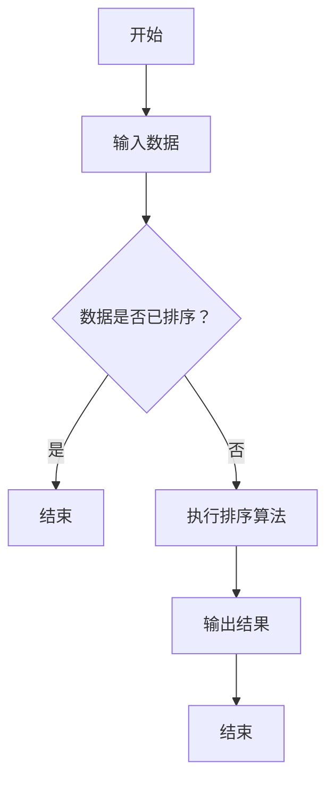
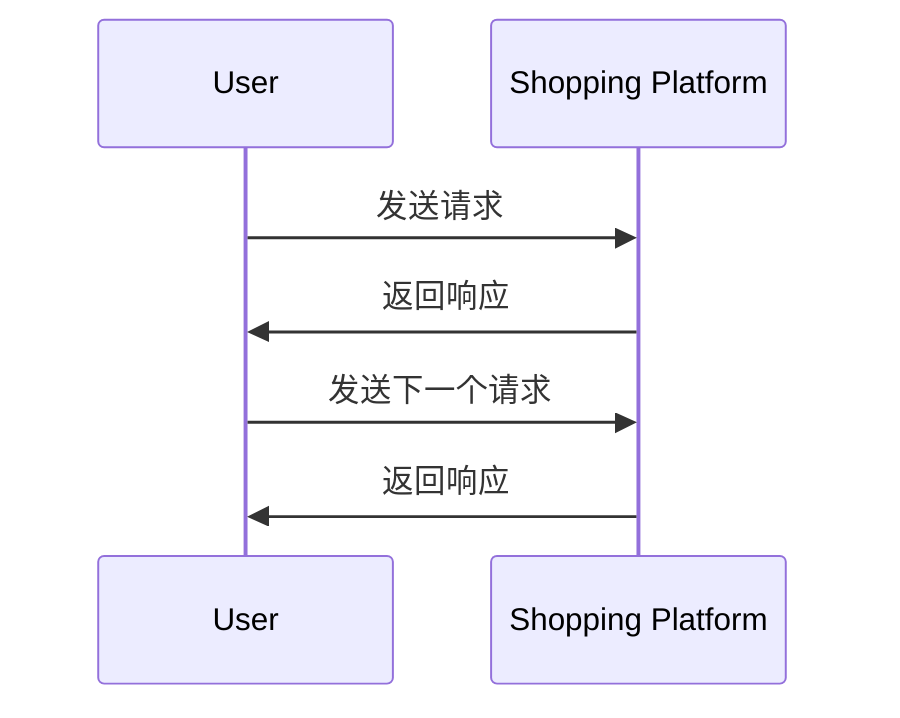

                 

### 文章标题：系分作用的不只是自己

#### 关键词：
- 系统分析
- 系统工程
- 系统设计
- 算法原理
- 数学模型
- 项目实战

#### 摘要：
本文深入探讨了系统分析与工程中的关键概念和原理，揭示了系统作用不仅仅是自身，还受到复杂交互网络的共同影响。通过详细分析系统概念、算法原理、系统架构和实战案例，本文旨在为读者提供系统分析与设计的高效方法和最佳实践。

### 第一部分：背景介绍

#### 1.1 系统分析概述
系统分析是系统工程中的重要环节，它涉及到对系统各个组成部分及其相互关系的研究。系统分析的定义和重要性在于，它能够帮助我们从整体和全局的角度理解和解决问题，从而提高系统的性能和可靠性。

- **定义与重要性**：系统分析是通过对系统的结构、功能和行为进行分析，以理解系统的运行机制和问题所在。其重要性在于它能够提供系统设计和优化的基础，帮助我们在复杂环境中做出明智的决策。

- **方法与工具**：系统分析的方法包括定量分析和定性分析，常用的工具包括数据挖掘、模拟和建模等。这些方法与工具的使用，有助于我们深入挖掘系统中的潜在问题和机会。

- **应用领域**：系统分析广泛应用于工程、经济、管理、生物、环境等多个领域。通过系统分析，我们可以更好地理解和解决各个领域的复杂问题。

#### 1.2 系统思考与复杂性
系统思考是一种整体性的思维方式，它强调系统中各要素之间的相互作用和反馈。在复杂性理论中，系统被视为一个动态的、非线性的复杂网络。

- **系统思考的核心原则**：系统思考的核心原则包括整体性、相互联系、动态变化等。这些原则帮助我们理解和解决复杂系统的内在机制。

- **系统中的相互作用**：系统中的相互作用是指系统各要素之间的相互作用和反馈。这些相互作用决定了系统的行为和性能。

- **复杂性理论的引入**：复杂性理论提供了一种新的视角来理解系统。它强调系统的多样性和动态性，认为系统行为是由多种因素共同作用的结果。

#### 1.3 系统的核心概念与联系
系统分析中的核心概念包括系统、要素、结构、功能等。这些概念之间的关系构成了系统的整体框架。

- **核心概念解析**：系统是由相互关联的要素组成的整体；要素是构成系统的基本单元；结构是系统要素之间的排列和组合；功能是系统能够实现的目标。

- **概念属性特征对比表格**：
  | 概念   | 属性特征                                                     | 对比         |
  | ------ | ------------------------------------------------------------ | ------------ |
  | 系统   | 由要素组成的整体，具有特定的结构和功能                      | 与元素不同   |
  | 要素   | 构成系统的基本单元，具有特定的属性和功能                    | 与部分不同   |
  | 结构   | 系统要素之间的排列和组合方式                                | 与架构不同   |
  | 功能   | 系统能够实现的目标或任务                                    | 与目标不同   |

- **ER实体关系图架构**：ER实体关系图是一种用于表示系统要素之间关系的图形工具。通过ER图，我们可以直观地了解系统要素及其相互关系。

```mermaid
erDiagram
  类 --> 类 : 关联
  类 ||--|{ 关联类 }|| : 继承
  类 ||..|{ 实体 }|| : 实例
```

### 第二部分：算法原理讲解

#### 2.1 基本算法介绍
在系统分析和设计中，算法起着至关重要的作用。算法是解决问题的一系列规则和步骤。以下是几种常用的算法介绍：

- **排序算法**：用于对系统中的数据进行排序，常用的排序算法有冒泡排序、快速排序、归并排序等。
- **搜索算法**：用于在系统中查找特定数据，常用的搜索算法有线性搜索、二分搜索等。
- **路径算法**：用于确定系统中的最优路径，常用的路径算法有Dijkstra算法、A*算法等。

#### 2.2 算法mermaid流程图
为了更直观地理解算法的工作原理，我们可以使用mermaid流程图来表示。



#### 2.3 Python源代码示例
以下是一个简单的冒泡排序算法的Python实现：

```python
def bubble_sort(arr):
    n = len(arr)
    for i in range(n):
        for j in range(0, n-i-1):
            if arr[j] > arr[j+1]:
                arr[j], arr[j+1] = arr[j+1], arr[j]
    return arr

# 示例
arr = [64, 34, 25, 12, 22, 11, 90]
sorted_arr = bubble_sort(arr)
print(sorted_arr)
```

#### 2.4 数学模型与公式讲解
算法的原理通常可以用数学模型和公式来描述。以下是冒泡排序算法的数学模型：

- **时间复杂度**：$T(n) = O(n^2)$
- **空间复杂度**：$S(n) = O(1)$

这些公式帮助我们评估算法的性能。

#### 2.5 算法原理举例说明
假设我们有以下未排序的数组：

$$
\{64, 34, 25, 12, 22, 11, 90\}
$$

通过冒泡排序，我们可以得到以下排序过程：

1. **第一轮**：
   $$
   \{34, 64, 25, 12, 22, 11, 90\}
   $$
   $$
   \{34, 25, 64, 12, 22, 11, 90\}
   $$
   $$
   \{34, 25, 12, 64, 22, 11, 90\}
   $$
   $$
   \{34, 25, 12, 22, 64, 11, 90\}
   $$

2. **第二轮**：
   $$
   \{25, 34, 12, 22, 11, 64, 90\}
   $$
   $$
   \{25, 12, 34, 22, 11, 64, 90\}
   $$
   $$
   \{12, 25, 34, 22, 11, 64, 90\}
   $$
   $$
   \{12, 25, 22, 34, 11, 64, 90\}
   $$

3. **第三轮**：
   $$
   \{12, 25, 22, 34, 11, 64, 90\}
   $$
   $$
   \{12, 22, 25, 34, 11, 64, 90\}
   $$
   $$
   \{12, 22, 25, 34, 11, 64, 90\}
   $$

最终，我们得到一个有序的数组：

$$
\{11, 12, 22, 25, 34, 64, 90\}
$$

### 第三部分：系统分析与架构设计

#### 3.1 问题场景介绍
假设我们正在设计一个在线购物平台，用户可以通过该平台浏览商品、添加购物车和完成购买。为了实现这一功能，我们需要对系统进行详细的分析和设计。

#### 3.2 项目介绍
我们的项目是一个在线购物平台，主要包括以下功能模块：

- 用户管理模块：用于用户的注册、登录、个人信息管理等功能。
- 商品管理模块：用于商品的信息展示、分类、库存管理等功能。
- 购物车模块：用于用户添加商品、修改购物车信息、结算等功能。
- 订单管理模块：用于订单的创建、支付、发货、售后等功能。

#### 3.3 系统功能设计
为了实现上述功能模块，我们需要设计一个完整的系统功能架构。

- **用户管理模块**：
  - 用户注册功能：收集用户信息并保存到数据库。
  - 用户登录功能：验证用户身份并返回用户权限。
  - 用户信息管理功能：允许用户修改个人信息。

- **商品管理模块**：
  - 商品展示功能：显示商品列表和详细信息。
  - 商品分类功能：对商品进行分类展示。
  - 商品库存管理功能：实时更新商品库存信息。

- **购物车模块**：
  - 添加购物车功能：将商品添加到购物车。
  - 修改购物车功能：用户可以修改购物车中的商品数量或删除商品。
  - 结算功能：计算订单金额并生成订单。

- **订单管理模块**：
  - 订单创建功能：根据购物车中的商品生成订单。
  - 订单支付功能：用户支付订单金额。
  - 订单发货功能：仓库发货并更新订单状态。
  - 订单售后功能：处理用户退款、换货等售后问题。

#### 3.4 系统架构设计
为了实现上述功能，我们采用了一种分层架构设计。

- **前端架构**：
  - 前端框架：使用React框架构建用户界面。
  - UI组件：设计用户友好的界面组件。

- **后端架构**：
  - 应用服务器：处理用户请求，返回数据。
  - 数据库服务器：存储用户数据、商品数据等。
  - 微服务架构：将系统功能模块拆分为多个微服务，实现高可用性和可扩展性。

#### 3.5 系统接口设计
为了实现各模块之间的交互，我们需要设计一套完善的系统接口。

- **用户管理接口**：用于用户注册、登录、信息管理等功能。
- **商品管理接口**：用于商品展示、分类、库存管理等功能。
- **购物车接口**：用于添加商品、修改购物车信息、结算等功能。
- **订单管理接口**：用于订单创建、支付、发货、售后等功能。

#### 3.6 系统交互
为了更好地理解系统的工作流程，我们可以使用mermaid序列图来描述系统交互。



### 第四部分：项目实战

#### 4.1 环境安装
为了实现上述系统功能，我们需要安装以下环境：

- 前端环境：Node.js、npm、React
- 后端环境：Python、Django、PostgreSQL

#### 4.2 系统核心实现源代码
以下是用户管理模块的Python代码示例：

```python
from django.db import models
from django.contrib.auth.models import AbstractUser

class CustomUser(AbstractUser):
    email = models.EmailField(unique=True)
    phone_number = models.CharField(max_length=15)

    def __str__(self):
        return self.email
```

#### 4.3 代码应用解读与分析
以上代码定义了一个自定义用户模型`CustomUser`，它继承了Django的`AbstractUser`模型。自定义用户模型添加了`email`和`phone_number`字段，用于存储用户电子邮件和电话号码。

#### 4.4 实际案例分析与详细讲解剖析
假设我们有一个用户名为`john_doe`的用户，通过用户管理接口进行注册。以下是注册流程的详细解析：

1. 用户通过前端界面输入注册信息，包括用户名、电子邮件和电话号码。
2. 用户提交注册表单，前端将表单数据发送到后端。
3. 后端接收到用户数据后，将数据存储到数据库，并创建一个`CustomUser`对象。
4. 后端返回注册成功的响应，前端显示注册成功消息。

#### 4.5 项目小结
通过以上实战案例，我们可以看到系统分析与设计在实际项目中的应用。系统分析与设计是一个复杂而关键的过程，它涉及到多个模块和接口的协同工作。通过详细的规划和实施，我们能够构建出高效、可靠的系统。

### 第五部分：最佳实践与总结

#### 5.1 系统设计与分析技巧
在进行系统设计和分析时，以下技巧可以帮助我们提高效率和质量：

- **需求分析**：详细理解用户需求，确保设计符合实际业务需求。
- **模块化设计**：将系统功能拆分为多个模块，实现高内聚、低耦合的设计。
- **迭代开发**：采用敏捷开发方法，逐步完善系统功能。
- **测试与优化**：进行充分的测试，优化系统性能和可靠性。

#### 5.2 注意事项
在设计系统时，需要注意以下几点：

- **安全性**：确保系统的数据安全和用户隐私。
- **可扩展性**：设计具有可扩展性，以适应未来业务需求。
- **性能优化**：关注系统性能，进行适当的性能优化。

#### 5.3 拓展阅读
以下是一些拓展阅读资源，供读者深入了解系统分析与设计：

- 《系统架构的艺术》
- 《设计模式：可复用的面向对象软件的基础》
- 《敏捷开发：原则、实践与模式》

### 小结
本文通过详细的案例分析，揭示了系统分析与设计的重要性和实际应用。从背景介绍、算法原理讲解、系统分析与架构设计到项目实战，我们系统地介绍了系统分析与设计的全过程。通过本文的阅读，读者可以更好地理解系统分析与设计的方法和技巧，为未来的项目实践提供有力支持。

### 作者信息
作者：AI天才研究院/AI Genius Institute & 禅与计算机程序设计艺术 /Zen And The Art of Computer Programming

