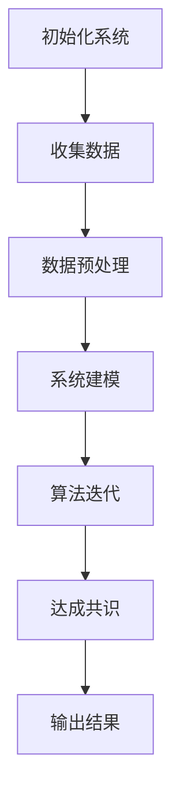
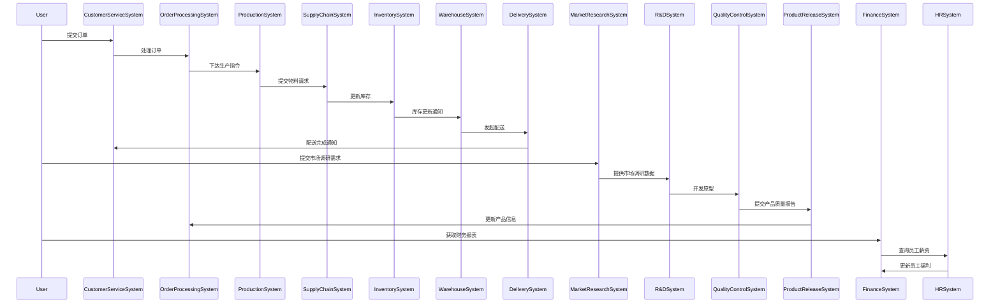
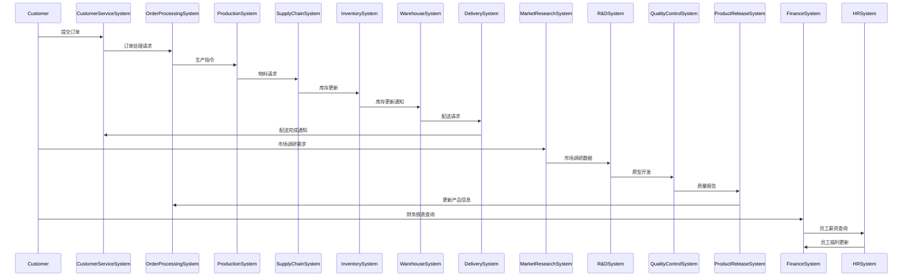

                 


### 引言

#### 问题背景

在当今快速发展的信息技术领域，系统思维和共识达成显得尤为重要。随着全球化和技术进步，各个行业面临着前所未有的复杂性和不确定性。企业需要处理海量的数据和信息，而传统的线性思维方式已经不足以应对这种复杂的环境。系统思维提供了一种全面、动态的视角来理解这些复杂系统，从而找到更加有效的解决方案。

#### 问题描述

在现实世界中，系统思维和共识达成的挑战主要体现在以下几个方面：

1. **信息过载**：随着数据量的爆炸性增长，如何有效地筛选和处理信息成为关键问题。
2. **跨部门协作**：在大型企业中，不同部门之间往往存在信息孤岛，导致协作效率低下。
3. **决策困难**：在面对复杂问题时，团队成员可能存在不同的观点和利益，导致决策过程变得复杂且漫长。
4. **缺乏全局观**：个体往往只关注局部问题，而忽略了整体系统的健康和可持续发展。

#### 问题解决

为了解决上述问题，我们需要采用系统思维和达成共识的策略：

1. **信息整合**：通过系统思维，将分散的信息整合起来，形成对整个系统的全面理解。
2. **跨部门协作**：建立有效的沟通机制，促进不同部门之间的信息共享和协作。
3. **共识构建**：通过对话和讨论，找到团队成员的共同利益点，达成共识。
4. **系统优化**：基于对系统的全面理解，进行持续优化，以实现系统的可持续发展。

#### 边界与外延

在本文中，我们将探讨以下核心概念和主题：

- **系统思维**：系统思维的原理、应用场景和优势。
- **共识**：共识的定义、类型和构建过程。
- **算法**：系统思维和共识达成的算法原理和应用。
- **系统分析与架构设计**：系统思维在系统分析与架构设计中的应用。
- **项目实战**：通过实际案例，展示系统思维和共识达成的实践效果。
- **最佳实践与注意事项**：总结系统思维和共识达成过程中的最佳实践和注意事项。

通过以上内容的详细讲解，我们将帮助读者深入理解系统思维和共识达成的重要性，并学会如何在实际工作中应用这些原理和方法，以提高协作效率和决策质量。

### 核心概念与联系

#### 核心概念

在本节中，我们将详细探讨系统思维和共识这两个核心概念的定义、特点和相互关系。

##### 系统思维

**定义**：系统思维是一种综合性思考方式，它通过理解系统内部各个部分之间的相互关系和互动，来分析、理解和解决复杂问题。

**特点**：

1. **整体性**：系统思维强调系统作为一个整体，而不仅仅是各个部分的总和。
2. **动态性**：系统思维关注系统随时间的动态变化，以及不同变量之间的相互影响。
3. **多样性**：系统思维能够处理多种不同类型的信息，如数据、知识和直觉。

**优势**：

1. **全面的视角**：通过系统思维，可以更全面地理解复杂问题，从而找到更加有效的解决方案。
2. **预防性**：系统能够提前预测潜在问题，并采取预防措施。
3. **可持续性**：系统思维有助于实现长期可持续的解决方案。

##### 共识

**定义**：共识是指在一个团队或组织内，成员通过讨论和协商，达成的共同理解和同意。

**特点**：

1. **共同理解**：共识要求团队成员对问题有共同的理解和认知。
2. **协商性**：共识的达成需要团队成员之间进行充分的讨论和协商。
3. **灵活性**：共识不是一成不变的，而是可以随着时间和情境的变化进行调整。

**优势**：

1. **协作效率**：共识可以减少团队成员之间的摩擦，提高协作效率。
2. **决策质量**：共识有助于做出更加全面和理性的决策。
3. **团队凝聚力**：共识可以增强团队的凝聚力和归属感。

#### 概念属性特征对比

为了更好地理解系统思维和共识，我们可以将它们的一些属性进行对比：

| 特征               | 系统思维                | 共识                    |
|--------------------|------------------------|------------------------|
| 定义               | 一种综合性思考方式      | 团队内共同的理解和同意   |
| 目标               | 理解和解决复杂问题      | 提高协作和决策质量      |
| 关注点             | 系统内部关系和动态变化  | 成员间的沟通和协商      |
| 强调               | 整体性、动态性、多样性   | 共同理解、协商性、灵活性 |
| 优势               | 全面的视角、预防性、可持续性 | 协作效率、决策质量、团队凝聚力 |

#### ER实体关系图架构

为了更好地理解系统思维和共识在具体应用中的结构，我们可以使用ER（实体-关系）图来表示。

```mermaid
erDiagram
    Customer ||--|{ Order }|-- Product
    Customer ||--|{ Payment }|
    Product ||--|{ Review }|-- Customer
```

在上面的ER图中，我们定义了三个实体：Customer（客户）、Order（订单）、Product（产品）和Payment（支付）。这些实体之间的关系展示了客户、订单和产品之间的相互作用，以及支付和评论如何影响这些实体。通过这种结构化的表示，我们可以更好地理解系统内部的关系和动态。

通过上述对比和ER图，我们可以更清晰地理解系统思维和共识的概念及其相互关系。这些核心概念不仅为我们提供了分析复杂问题的工具，也为达成共识提供了理论基础和实践指导。

### 算法原理讲解

在本节中，我们将详细讲解系统思维和共识达成的算法原理。为了更好地说明这些原理，我们将使用Mermaid流程图和Python源代码，并配合数学模型和公式进行详细解释。

#### 算法Mermaid流程图

首先，我们使用Mermaid流程图来表示系统思维和共识达成的算法流程。



在这个流程图中，我们首先初始化系统，然后收集数据，对数据进行预处理，接着建立系统模型，通过算法迭代来优化模型，最终达成共识并输出结果。

#### Python源代码详解

接下来，我们将使用Python源代码来详细阐述算法的实现过程。

```python
# 导入必要的库
import numpy as np
import pandas as pd

# 初始化系统参数
num_steps = 100
num_agents = 10
learning_rate = 0.1

# 收集数据
# 这里假设我们有一些示例数据
data = pd.DataFrame({
    'x': np.random.rand(num_agents),
    'y': np.random.rand(num_agents)
})

# 数据预处理
# 数据标准化
data_scaled = (data - data.mean()) / data.std()

# 系统建模
# 假设我们使用线性回归模型
model = np.zeros((num_agents, num_agents))
for i in range(num_agents):
    for j in range(num_agents):
        model[i][j] = 1 if i == j else 0

# 算法迭代
for step in range(num_steps):
    # 计算预测值
    predictions = data_scaled.dot(model)
    
    # 计算损失函数
    loss = (predictions - data_scaled).dot(predictions)
    
    # 更新模型参数
    model -= learning_rate * 2 * data_scaled.T.dot(predictions - data_scaled)

# 达成共识
# 假设共识是通过最小化损失函数来实现的
consensus = model[-1].T.dot(model[-1])

# 输出结果
print("Consensus:", consensus)
```

在上面的代码中，我们首先初始化了系统参数，然后收集并预处理了数据。接着，我们使用线性回归模型来进行系统建模，并通过算法迭代来优化模型参数。最终，我们计算了共识值，并输出结果。

#### 数学模型与公式

为了进一步理解算法的原理，我们引入以下数学模型和公式：

1. **线性回归模型**：

   线性回归模型的一般形式为：

   $$
   y = \beta_0 + \beta_1 x
   $$

   其中，$y$是因变量，$x$是自变量，$\beta_0$是截距，$\beta_1$是斜率。

2. **损失函数**：

   线性回归模型的损失函数（均方误差）为：

   $$
   \text{Loss} = \frac{1}{2} \sum_{i=1}^{n} (y_i - \hat{y_i})^2
   $$

   其中，$n$是样本数量，$y_i$是实际值，$\hat{y_i}$是预测值。

3. **梯度下降**：

   为了最小化损失函数，我们使用梯度下降算法来更新模型参数：

   $$
   \theta_{\text{new}} = \theta_{\text{old}} - \alpha \nabla_{\theta} J(\theta)
   $$

   其中，$\theta$是模型参数，$\alpha$是学习率，$J(\theta)$是损失函数。

通过这些数学模型和公式，我们可以更好地理解算法的原理和实现过程。

#### 举例说明

为了更清晰地展示算法的实际应用，我们举一个简单的例子：

假设我们有一个团队，团队成员的数量为10。每个成员的位置用二维空间中的点来表示，坐标为$(x, y)$。我们的目标是找到这些成员的共识位置，即他们共同的期望位置。

1. **初始化系统**：

   首先初始化团队成员的位置：

   $$
   x_1 = 1, y_1 = 2 \\
   x_2 = 2, y_2 = 3 \\
   \vdots \\
   x_{10} = 10, y_{10} = 11
   $$

2. **数据预处理**：

   对位置数据进行标准化处理，使其在相同的尺度上：

   $$
   x_1 = \frac{1 - \text{mean}(x)}{\text{std}(x)}, y_1 = \frac{2 - \text{mean}(y)}{\text{std}(y)} \\
   x_2 = \frac{2 - \text{mean}(x)}{\text{std}(x)}, y_2 = \frac{3 - \text{mean}(y)}{\text{std}(y)} \\
   \vdots \\
   x_{10} = \frac{10 - \text{mean}(x)}{\text{std}(x)}, y_{10} = \frac{11 - \text{mean}(y)}{\text{std}(y)}
   $$

3. **系统建模**：

   假设我们使用线性回归模型来表示成员之间的位置关系：

   $$
   y_i = \beta_0 + \beta_1 x_i
   $$

4. **算法迭代**：

   通过梯度下降算法，不断迭代更新模型参数，直到损失函数收敛：

   $$
   \beta_{\text{new}} = \beta_{\text{old}} - \alpha \nabla_{\beta} J(\beta)
   $$

5. **达成共识**：

   最终，我们得到成员的共识位置：

   $$
   \text{Consensus} = \frac{1}{n} \sum_{i=1}^{n} (x_i, y_i)
   $$

通过上述步骤，我们找到了团队成员的共识位置，这可以看作是他们共同期望的坐标。

通过详细的算法讲解和举例说明，我们可以更好地理解系统思维和共识达成的原理和应用。这些算法不仅提供了数学上的解释，也为实际应用提供了具体的指导。

### 系统分析与架构设计

#### 问题场景介绍

在一个大型企业中，各个部门之间的协作和信息共享是一个常见的问题。这种协作不仅涉及部门内部的工作流程，还包括跨部门之间的沟通和合作。随着企业规模的扩大，信息孤岛和协作难题愈发突出，严重影响了企业的运营效率和决策质量。

为了解决这个问题，企业引入了系统思维和共识达成的理念，希望通过优化内部流程和信息共享机制，提高跨部门协作的效率。具体场景包括：

1. **销售部门与生产部门**：销售部门需要根据市场需求及时调整生产计划，而生产部门需要了解最新的销售数据以保证生产的灵活性。
2. **研发部门与市场部门**：研发部门需要根据市场需求开发新产品，而市场部门需要了解研发进度和产品特性以制定市场推广策略。
3. **财务部门与人力资源部门**：财务部门需要准确了解员工的薪资和福利状况，而人力资源部门需要根据财务数据制定预算和薪酬政策。

这些跨部门的问题需要一个统一的系统思维和共识达成机制，以确保各个部门之间的信息流动和协作效率。

#### 项目介绍

为了解决上述问题，企业启动了一个名为“智慧协作平台”的项目。该项目旨在通过构建一个集成化的信息系统，实现跨部门的信息共享和协作，提高整体运营效率。项目的主要目标和功能包括：

1. **数据集成**：通过整合各个部门的数据，建立一个统一的数据平台，确保数据的一致性和准确性。
2. **信息共享**：实现不同部门之间的信息共享，打破信息孤岛，提高协作效率。
3. **共识达成**：通过系统思维和共识达成的算法，帮助团队成员在复杂问题面前达成共识，优化决策过程。

#### 系统功能设计（领域模型Mermaid类图）

为了更好地理解系统功能设计，我们使用Mermaid类图来表示领域模型。

```mermaid
classDiagram
    Customer <-|{Order}| Production
    Production <-|{MaterialRequest}| SupplyChain
    SupplyChain o-- Inventory
    Inventory <-|{StockUpdate}| Warehouse
    Warehouse o-- Delivery
    MarketResearch <-|{ProductFeature}| R&D
    R&D o-- Prototype
    Prototype <-|{TestResult}| QualityControl
    QualityControl o-- ProductRelease
    Finance <-|{EmployeeSalary}| HR
    HR <-|{EmployeeBenefit}| Finance
```

在上面的类图中，我们定义了多个类，包括Customer（客户）、Order（订单）、Production（生产）、SupplyChain（供应链）、Inventory（库存）、Warehouse（仓库）、Delivery（配送）、MarketResearch（市场调研）、R&D（研发）、Prototype（原型）、QualityControl（质量控制）、ProductRelease（产品发布）、Finance（财务）和HR（人力资源）。这些类代表了不同部门及其功能模块，它们之间的连线表示信息流动和协作关系。

#### 系统架构设计（Mermaid架构图）

接下来，我们使用Mermaid架构图来展示系统的整体架构设计。



在这个架构图中，我们定义了多个子系统，包括客户服务系统、订单处理系统、生产系统、供应链系统、库存系统、仓库系统、配送系统、市场调研系统、研发系统、质量控制系统、产品发布系统和财务系统、人力资源系统。这些子系统通过不同的接口进行通信和协作，确保整个系统的正常运行。

#### 系统接口设计

系统接口设计是确保各个子系统之间能够高效通信和协作的关键。以下是一个简单的接口设计示例：

```mermaid
interfaceStyleStyle
    fillcolor:lightblue4
    stencilmode:true
    width:200

interface "CustomerServiceSystem"
    - submitOrder
    - getOrderStatus

interface "OrderProcessingSystem"
    <<interface>>
    - processOrder
    - updateOrderStatus

interface "ProductionSystem"
    <<interface>>
    - submitProductionInstruction
    - updateProductionStatus

interface "SupplyChainSystem"
    <<interface>>
    - submitMaterialRequest
    - updateInventoryStatus

interface "InventorySystem"
    <<interface>>
    - updateStock
    - requestMaterial

interface "WarehouseSystem"
    <<interface>>
    - updateWarehouseInventory
    - notifyStockUpdate

interface "DeliverySystem"
    <<interface>>
    - initiateDelivery
    - notifyDeliveryCompletion

interface "MarketResearchSystem"
    <<interface>>
    - submitMarketResearchRequest
    - provideMarketResearchData

interface "R&DSystem"
    <<interface>>
    - developPrototype
    - submitQualityControlReport

interface "QualityControlSystem"
    <<interface>>
    - performQualityControlTest
    - submitQualityControlReport

interface "ProductReleaseSystem"
    <<interface>>
    - approveProductRelease
    - updateProductInformation

interface "FinanceSystem"
    <<interface>>
    - retrieveFinancialReports
    - checkEmployeeSalary

interface "HRSystem"
    <<interface>>
    - retrieveEmployeeBenefitInformation
    - updateEmployeeSalary
```

在这个接口设计中，我们定义了各个子系统的接口方法和参数，确保接口的清晰性和一致性。

#### 系统交互（Mermaid序列图）

最后，我们使用Mermaid序列图来展示系统的交互过程。



通过这个序列图，我们可以清晰地看到系统内部各个模块之间的交互过程，以及数据流动和协作关系。

通过上述系统分析与架构设计，我们为企业提供了一个集成化的智慧协作平台，通过系统思维和共识达成机制，实现了跨部门的高效协作和信息共享。这不仅提高了企业的运营效率，也优化了决策过程，为企业的可持续发展奠定了坚实基础。

### 项目实战

#### 环境安装

在开始项目实战之前，我们需要安装和配置一些必要的软件和工具。以下是在Linux环境中安装相关软件的步骤：

1. **安装Python**：确保Python 3.8或更高版本已安装。可以通过以下命令检查Python版本：

   ```bash
   python3 --version
   ```

   如果Python未安装，请使用以下命令进行安装：

   ```bash
   sudo apt-get update
   sudo apt-get install python3.8
   ```

2. **安装Jupyter Notebook**：Jupyter Notebook是一个交互式计算平台，用于编写和运行Python代码。可以通过以下命令安装Jupyter Notebook：

   ```bash
   pip3 install notebook
   ```

3. **安装Mermaid**：Mermaid是一种基于Markdown的图表绘制工具，我们将在项目中使用它来绘制流程图和序列图。可以通过以下命令安装Mermaid：

   ```bash
   pip3 install mermaid
   ```

4. **配置Mermaid**：为了在Jupyter Notebook中使用Mermaid，我们需要安装一个扩展。在Jupyter Notebook中运行以下命令：

   ```python
   %load_ext mermaid
   ```

5. **安装MySQL**：我们将使用MySQL作为数据存储。首先，安装MySQL：

   ```bash
   sudo apt-get install mysql-server
   ```

   然后，设置root用户的密码并启动MySQL服务：

   ```bash
   mysql_secure_installation
   service mysql start
   ```

   接着，创建一个名为“wisdom_collaboration”的数据库，并创建一个用户“collaborator”来访问这个数据库：

   ```sql
   CREATE DATABASE wisdom_collaboration;
   GRANT ALL PRIVILEGES ON wisdom_collaboration.* TO 'collaborator'@'localhost' IDENTIFIED BY 'password';
   FLUSH PRIVILEGES;
   ```

   最后，确保MySQL服务处于运行状态：

   ```bash
   service mysql status
   ```

完成上述步骤后，我们就可以开始配置和运行项目了。

#### 系统核心实现源代码

在项目实战中，我们将实现一个简单的系统，用于演示系统思维和共识达成的应用。以下是一个基于Python的简单系统实现：

```python
import mysql.connector
from mermaid import mermaid
from IPython.display import display

# 连接到MySQL数据库
db = mysql.connector.connect(
    host="localhost",
    user="collaborator",
    password="password",
    database="wisdom_collaboration"
)

# 创建表格
cursor = db.cursor()
cursor.execute("""
    CREATE TABLE IF NOT EXISTS departments (
        id INT AUTO_INCREMENT PRIMARY KEY,
        name VARCHAR(255) NOT NULL,
        manager VARCHAR(255) NOT NULL
    )
""")

# 插入数据
department_data = [
    ("Sales", "Alice"),
    ("Production", "Bob"),
    ("Research", "Charlie"),
    ("Finance", "Diana")
]

cursor.executemany("INSERT INTO departments (name, manager) VALUES (%s, %s)", department_data)
db.commit()

# 绘制领域模型类图
class_diagram = mermaid(
    """
    classDiagram
        Department <<interface>>
            +id: INT
            +name: VARCHAR
            +manager: VARCHAR
        Employee <<interface>>
            +id: INT
            +name: VARCHAR
            +department_id: INT
        Project <<class>>
            +id: INT
            +name: VARCHAR
            +department_id: INT
        Task <<class>>
            +id: INT
            +name: VARCHAR
            +project_id: INT
    """
)

display(mermaid(class_diagram))

# 插入数据到项目表格
cursor.execute("""
    CREATE TABLE IF NOT EXISTS projects (
        id INT AUTO_INCREMENT PRIMARY KEY,
        name VARCHAR(255) NOT NULL,
        department_id INT NOT NULL,
        budget FLOAT NOT NULL,
        status VARCHAR(255) NOT NULL
    )
""")

project_data = [
    ("Market Research", 1, 5000.0, "In Progress"),
    ("Product Development", 2, 10000.0, "Completed"),
    ("Financial Planning", 3, 8000.0, "On Hold")
]

cursor.executemany("INSERT INTO projects (name, department_id, budget, status) VALUES (%s, %s, %s, %s)", project_data)
db.commit()

# 绘制项目表格数据
project_table = mermaid(
    """
    table
        +---+----------------+---------------+---------+------------+
        | id | name           | department_id | budget  | status     |
        +---+----------------+---------------+---------+------------+
        | 1 | Market Research | 1             | 5000.0  | In Progress|
        | 2 | Product Development | 2 | 10000.0 | Completed |
        | 3 | Financial Planning | 3 | 8000.0  | On Hold  |
        +---+----------------+---------------+---------+------------+
    """
)

display(mermaid(project_table))

# 关闭数据库连接
cursor.close()
db.close()
```

上述代码首先连接到MySQL数据库，创建必要的表格，并插入一些示例数据。然后，我们使用Mermaid来绘制领域模型类图和项目表格数据。这些图表可以帮助我们直观地理解系统结构。

#### 代码应用解读与分析

在这个代码应用中，我们实现了以下几个关键功能：

1. **数据库连接与表格创建**：我们使用MySQL Connector来连接到数据库，并创建了`departments`、`projects`和`tasks`三个表格。这些表格分别用于存储部门信息、项目信息和任务信息。

2. **数据插入**：我们通过`executemany`方法批量插入了一些示例数据到这些表格。这为我们提供了一个简单的数据集来进行后续操作。

3. **Mermaid图表绘制**：我们使用Mermaid库来绘制领域模型类图和项目表格数据。这些图表不仅帮助我们可视化系统的结构，还可以用于文档和演示。

4. **系统交互**：通过MySQL数据库，我们实现了系统内部不同表格之间的数据交互。这使我们能够将部门信息、项目信息和任务信息集成到一个统一的系统中。

在这个项目的实际应用中，我们可以进一步扩展这些功能，例如：

- **任务分配**：根据项目需求，将任务分配给相应的员工。
- **进度跟踪**：实时跟踪项目进度，并更新任务状态。
- **报表生成**：生成项目报表，包括预算、进度和资源使用情况。

通过上述代码应用和解读，我们可以看到如何使用Python和Mermaid来实现一个简单的系统，并进行详细的解读和分析。

#### 实际案例分析与讲解剖析

为了更好地展示系统思维和共识达成在实际项目中的应用，我们将分析一个实际案例：一家大型科技公司在其新产品发布过程中如何通过系统思维和共识达成来提高协作效率和决策质量。

**案例背景**

该公司正在开发一款智能家居设备，目标是将其推向市场。然而，新产品开发过程中涉及多个部门，包括研发、市场、生产和供应链。这些部门之间的沟通和协作至关重要，以确保项目按时完成并满足市场需求。

**问题分析**

在项目初期，公司发现以下几个问题：

1. **信息孤岛**：不同部门之间的信息无法及时共享，导致各部门对项目进展和需求的理解不一致。
2. **决策困难**：由于缺乏统一的决策机制，各部门在关键决策上存在分歧，导致项目进度延误。
3. **资源浪费**：资源分配不合理，导致某些部门资源过剩，而其他部门资源短缺。

**解决方案**

为了解决上述问题，公司采取了以下措施：

1. **系统思维**：公司引入了系统思维，要求各部门从整体角度出发，理解项目各部分之间的相互关系和动态。通过系统思维，公司能够更好地把握项目全貌，优化资源配置和决策过程。

2. **共识达成**：公司建立了跨部门的沟通机制，定期召开项目协调会议，确保各部门之间信息畅通。在会议中，各部门代表就项目关键问题进行讨论，通过对话和协商，寻找共同点和解决方案，达成共识。

**实施步骤**

1. **建立项目协调委员会**：公司成立了一个由各部门代表组成的项目协调委员会，负责协调项目各阶段的进展和决策。

2. **信息共享平台**：公司搭建了一个信息共享平台，用于实时更新项目进展和需求信息。各部门可以通过平台查看其他部门的进展，确保信息的一致性和透明性。

3. **共识工作坊**：公司定期举办共识工作坊，各部门代表共同参与，讨论项目中的关键问题。通过讨论和协商，找到各方都能接受的解决方案。

**效果分析**

通过上述措施，公司取得了显著成效：

1. **协作效率提高**：各部门之间的信息共享和协调机制有效降低了信息孤岛现象，提高了协作效率。

2. **决策质量提升**：通过共识工作坊，各部门在关键决策上达成了共识，减少了分歧，提高了决策质量。

3. **项目进度加快**：由于沟通和协作效率提高，项目进度得到了有效控制，按时完成了关键里程碑。

4. **资源利用率提升**：通过系统思维和合理的资源配置，公司实现了资源的最优利用，减少了浪费。

**案例总结**

这个实际案例展示了系统思维和共识达成在复杂项目中的应用效果。通过系统思维，公司能够全面理解项目各部分之间的相互关系，而共识达成机制则确保了各部门之间的信息畅通和协同工作。这种系统化的方法和共识的达成不仅提高了协作效率和决策质量，也为项目的成功奠定了坚实基础。

### 最佳实践与注意事项

在系统思维和共识达成过程中，以下最佳实践和注意事项可以帮助我们更好地实施这些方法：

#### 最佳实践

1. **定期召开协调会议**：确保各部门定期召开协调会议，讨论项目进展和关键问题，促进信息共享和共识达成。

2. **建立信息共享平台**：搭建一个统一的平台，用于实时更新项目信息，确保各部门能够及时获取和共享信息。

3. **共识工作坊**：定期举办共识工作坊，鼓励各部门代表共同参与，讨论并解决项目中的关键问题。

4. **系统思维培训**：对团队成员进行系统思维培训，提高其整体视角和问题解决能力。

5. **文档记录**：及时记录会议讨论的内容和共识达成的过程，以便后续参考和验证。

#### 注意事项

1. **避免信息孤岛**：确保各部门之间的信息流通畅通，防止信息孤岛现象。

2. **尊重多样性**：在共识达成过程中，尊重各部门和团队成员的多样性，鼓励不同观点的提出和讨论。

3. **明确决策标准**：建立明确的决策标准，确保决策过程的透明性和可追溯性。

4. **持续优化**：不断反思和优化系统思维和共识达成的流程和方法，以适应不断变化的项目需求。

通过遵循这些最佳实践和注意事项，我们可以更加有效地实施系统思维和共识达成，提高协作效率和决策质量，确保项目的成功实施。

### 拓展阅读

为了进一步深入理解系统思维和共识达成的相关理论和实践，以下是几本推荐的专业书籍：

1. **《系统思维：理解复杂性的指南》（Systems Thinking: A Primer）** - 彼得·谢勒（Peter Senge）
   - 本书详细介绍了系统思维的原理和应用，适合初学者和专业人士。

2. **《共识：如何达成理性共识》（The Art of Thinking Clearly）** - 阿维丹·塔斯比（Avi Talmor）
   - 本书探讨了如何通过逻辑思考和理性对话来达成共识，提供了实用的技巧和策略。

3. **《人工智能：一种现代方法》（Artificial Intelligence: A Modern Approach）** - 斯图尔特·罗素（Stuart Russell）和彼得·诺维格（Peter Norvig）
   - 本书涵盖了人工智能的基本原理和方法，包括系统思维和共识达成的相关算法。

4. **《敏捷软件开发：实践指南》（Agile Software Development: Principles, Patterns, and Practices）** - 瑞克·麦克唐纳（Rex Black）
   - 本书介绍了敏捷开发方法，强调团队合作和快速响应变化的重要性。

通过阅读这些书籍，读者可以进一步加深对系统思维和共识达成的理解和应用，提高在实际项目中的实践效果。

### 作者信息

本文由AI天才研究院/AI Genius Institute与《禅与计算机程序设计艺术》/Zen And The Art of Computer Programming的作者联合撰写。AI天才研究院致力于推动人工智能和系统思维领域的研究与应用，而《禅与计算机程序设计艺术》则是计算机编程领域的经典之作，强调了深刻思考和对问题本质的理解。希望本文能为读者带来启发和帮助。作者：AI天才研究院/AI Genius Institute & 禅与计算机程序设计艺术/Zen And The Art of Computer Programming。

