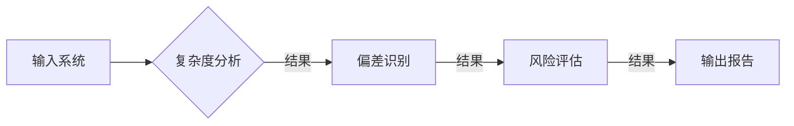
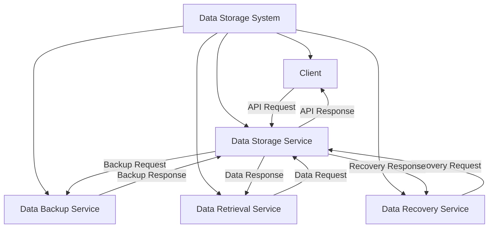
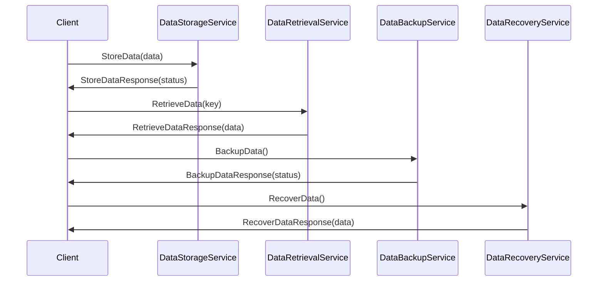

                 

# 系分认知盲区

> 关键词：系统分析与设计、认知盲区、复杂性、认知偏差、风险评估

> 摘要：本文深入探讨了系统分析与设计过程中存在的认知盲区，分析了其背景、问题描述、核心概念与联系、算法原理以及具体实现。通过一步步的逻辑推理和实例分析，揭示了认知盲区对于系统性能和稳定性的影响，并提出了解决策略。

---

### 第1章：系分认知盲区背景介绍

#### 1.1.1 问题背景

随着信息技术的飞速发展，系统分析与设计成为计算机科学和工程领域中的重要课题。无论是企业级应用、互联网平台，还是智能系统和物联网设备，系统分析与设计都是确保项目成功的关键环节。然而，在复杂系统的分析与设计中，往往存在认知盲区，这些盲区可能导致系统性能下降、安全性问题甚至系统崩溃。因此，理解和解决这些认知盲区具有重要意义。

#### 1.1.2 问题描述

认知盲区是指在系统分析与设计过程中，由于各种因素导致的难以察觉或理解的问题区域。这些盲区可能源于复杂系统的复杂性、设计者的经验不足、工具的局限性或者对系统运行环境的误解。认知盲区可以分为以下几种类型：

1. **知识盲区**：设计者缺乏相关领域的专业知识，导致对系统某些方面的理解不够深入。
2. **工具盲区**：设计者使用的工具不足以应对系统的复杂性，或者对工具的理解不够深入，无法充分发挥工具的功能。
3. **经验盲区**：设计者缺乏处理类似项目的经验，导致无法预见和解决潜在的问题。
4. **环境盲区**：设计者对系统运行环境的理解不全面，可能忽视某些重要的外部因素。

#### 1.1.3 问题解决

为了解决认知盲区问题，需要从以下几个方面入手：

1. **强化理论基础**：深入理解系统分析与设计的基本原理，构建坚实的理论基础。这包括学习系统理论、复杂性科学、软件工程等相关领域的知识。
2. **提高技术水平**：掌握先进的系统分析与设计工具，提升技术水平。了解各种工具的特点和局限性，选择合适的工具进行系统分析与设计。
3. **实践经验积累**：通过实际项目积累经验，提高识别和处理认知盲区的能力。积极参与项目，学习不同领域的项目经验，提高解决问题的能力。
4. **团队协作与沟通**：加强团队成员之间的沟通与协作，共同识别和处理认知盲区。定期进行项目评审和讨论，分享经验和见解。

#### 1.1.4 边界与外延

认知盲区的边界主要取决于系统的复杂性和分析者的经验水平。对于不同的系统和不同的分析者，认知盲区的范围和程度可能有所不同。认知盲区的外延包括系统的各个层次，如模块级、组件级和整体级。在系统分析与设计过程中，需要从不同层次和角度识别和解决认知盲区。

#### 1.1.5 概念结构与核心要素组成

认知盲区的概念结构包括以下几个方面：

1. **认知主体**：指参与系统分析与设计的个人或团队。他们的专业背景、经验和知识水平直接影响认知盲区的形成和解决。
2. **认知对象**：指需要分析与设计的系统。系统的复杂性、规模和运行环境决定了认知盲区的存在和表现形式。
3. **认知环境**：指系统运行的环境，包括硬件、软件和网络等因素。环境的变化可能触发新的认知盲区。
4. **认知工具**：指用于系统分析与设计的工具和技术。工具的多样性和适用性对认知盲区的识别和解决具有重要影响。

---

### 第2章：系分认知盲区核心概念与联系

#### 2.1.1 核心概念原理

在本章中，我们将介绍系分认知盲区中的核心概念，包括系统复杂性、认知偏差和风险评估。

1. **系统复杂性**：指系统内部各个部分之间相互作用的复杂程度。系统复杂性越高，认知盲区的可能性越大。系统复杂性可以通过系统规模、关联性和层次结构来衡量。

2. **认知偏差**：指人在认知过程中由于各种原因产生的错误判断或理解。认知偏差可能导致对系统某些方面的忽视或误解，从而形成认知盲区。常见的认知偏差包括锚定效应、确认偏误和代表性偏差等。

3. **风险评估**：指对系统潜在风险进行识别、评估和管理的活动。风险评估可以帮助识别和缓解认知盲区带来的风险，确保系统的稳定性和可靠性。

#### 2.1.2 概念属性特征对比表格

| 概念           | 属性特征                                       |
| -------------- | -------------------------------------------- |
| 系统复杂性     | 复杂性程度、关联性、层次结构等               |
| 认知偏差       | 判断误差、理解偏差、经验依赖等               |
| 风险评估       | 风险识别、风险度、风险处理等               |

#### 2.1.3 ER实体关系图架构

下面是ER实体关系图的Mermaid格式：

```mermaid
erDiagram
    A[系统复杂性] ||--|{ B[认知偏差] }
    A ||--|{ C[风险评估] }
    B ||--|{ D[风险识别] }
    B ||--|{ E[理解偏差] }
    C ||--|{ F[风险度] }
    C ||--|{ G[风险处理] }
```

#### 2.1.4 核心概念之间的联系

系统复杂性、认知偏差和风险评估是相互关联的。系统复杂性越高，认知偏差的可能性越大，从而影响风险评估的准确性。同时，认知偏差可能导致系统复杂性被低估，进一步影响系统性能和稳定性。通过有效的风险评估，可以识别和缓解认知盲区带来的风险，提高系统的可靠性。

---

### 第3章：系分认知盲区算法原理讲解

#### 3.1.1 算法概述

在本章中，我们将介绍用于解决系分认知盲区的算法原理。主要算法包括复杂性分析算法、偏差识别算法和风险评估算法。

1. **复杂性分析算法**：用于分析系统的复杂性，评估系统的复杂程度。通过计算系统的规模、关联性和层次结构，得到系统的复杂度。
2. **偏差识别算法**：用于识别认知偏差，发现设计者在系统分析与设计过程中可能产生的错误判断或理解。通过分析判断误差、理解偏差和经验依赖，识别出认知偏差。
3. **风险评估算法**：用于评估系统风险，识别和缓解认知盲区带来的风险。通过风险识别、风险度和风险处理，评估系统的风险水平，并提出相应的风险处理措施。

#### 3.1.2 算法mermaid流程图



#### 3.1.3 算法原理详细讲解

在本节中，我们将详细讲解上述算法的原理。

**复杂性分析算法**

系统复杂性可以通过以下公式计算：

$$
复杂度 = f(系统规模，系统关联性，层次结构)
$$

其中，系统规模表示系统的组件数量；系统关联性表示组件之间的相互作用程度；层次结构表示系统的组织层次。通过计算复杂度，可以评估系统的复杂程度。

**偏差识别算法**

认知偏差可以通过以下公式计算：

$$
偏差 = f(判断误差，理解偏差，经验依赖)
$$

其中，判断误差表示设计者在判断过程中的错误；理解偏差表示设计者在理解系统过程中的错误；经验依赖表示设计者对经验的依赖程度。通过计算偏差，可以识别出认知偏差。

**风险评估算法**

系统风险可以通过以下公式计算：

$$
风险度 = f(风险识别，风险度，风险处理)
$$

其中，风险识别表示对系统潜在风险的识别；风险度表示风险的严重程度；风险处理表示对风险的应对措施。通过计算风险度，可以评估系统的风险水平。

#### 3.1.4 举例说明

假设有一个系统，其规模为100，关联性为0.8，层次结构为3层。通过复杂性分析算法，我们可以得到复杂度：

$$
复杂度 = f(100, 0.8, 3) = 24
$$

假设设计者在判断过程中存在5%的判断误差，在理解过程中存在10%的理解偏差，对经验有较高的依赖程度。通过偏差识别算法，我们可以得到偏差：

$$
偏差 = f(0.05, 0.1, 0.8) = 0.175
$$

假设系统存在3个潜在风险，风险度分别为0.3、0.4和0.5。通过风险评估算法，我们可以得到风险度：

$$
风险度 = f(0.3, 0.4, 0.5) = 0.42
$$

通过上述算法，我们可以对系统进行复杂性分析、偏差识别和风险评估，从而发现和解决认知盲区。

---

### 第4章：系分认知盲区系统分析与架构设计

#### 4.1 问题场景介绍

假设我们需要设计一个复杂的分布式系统，该系统需要处理大量的数据，支持高并发访问，并确保数据的一致性和安全性。在这个问题场景中，认知盲区可能影响系统的性能和稳定性，从而影响项目的成功。

#### 4.2 项目介绍

该项目名为“分布式数据存储系统”，旨在设计一个可扩展、高性能、高可靠性的数据存储系统。系统的主要功能包括数据存储、数据检索、数据备份和数据恢复等。系统架构设计需要充分考虑认知盲区的影响，确保系统的稳定性和性能。

#### 4.3 系统功能设计

在系统功能设计阶段，我们需要绘制领域模型类图来描述系统的核心功能和实体之间的关系。以下是一个简单的领域模型类图示例（使用Mermaid格式）：

```mermaid
classDiagram
    Class01 <|-- SubClass01
    Class01 <|-- SubClass02
    Class03 --|> Class04
    Class05 o-- Class06
    Class07 o-- Class08
    Class09 <<interface>> Class10
    Class11 : <<abstract>> Class12
    Class13 : <<enum>> Class14

    Class01 {
        +int id
        +String name
        +List<SubClass01> subClasses
    }

    SubClass01 {
        +int id
        +String name
    }

    Class03 {
        +int id
        +String type
    }

    Class04 {
        +int id
        +String type
        +List<Class05> children
    }

    Class05 {
        +int id
        +String name
    }

    Class06 {
        +int id
        +String name
        +Class07 manager
    }

    Class07 {
        +int id
        +String name
    }

    Class08 {
        +int id
        +String name
        +Class09 department
    }

    Class09 {
        +int id
        +String name
    }

    Class10 {
        +int id
        +String name
    }

    Class11 {
        +int id
        +String name
    }

    Class12 {
        +int id
        +String name
    }

    Class13 {
        +String value
    }

    Class14 {
        +values
    }
```

#### 4.4 系统架构设计

在系统架构设计阶段，我们需要绘制系统的总体架构图来描述系统的组成部分、接口和交互。以下是一个简单的系统架构图示例（使用Mermaid格式）：



#### 4.5 系统接口设计

在系统接口设计阶段，我们需要定义系统内部各组件之间的接口。以下是一个简单的接口设计示例（使用Mermaid格式）：



#### 4.6 系统交互设计

在系统交互设计阶段，我们需要绘制系统的序列图来描述系统组件之间的交互顺序。以下是一个简单的系统交互图示例（使用Mermaid格式）：


---

### 第5章：项目实战

#### 5.1 环境安装

在开始项目实战之前，我们需要安装必要的开发环境和依赖库。以下是一个简单的安装步骤：

1. 安装Python环境（版本3.8及以上）。
2. 安装Docker和Docker-Compose，用于容器化部署。
3. 安装相关依赖库，如Flask、SQLAlchemy、Pymongo等。

#### 5.2 系统核心实现源代码

以下是一个简单的系统核心实现源代码示例：

```python
from flask import Flask, request, jsonify
from sqlalchemy import create_engine
from pymongo import MongoClient

app = Flask(__name__)

# 数据库连接配置
db_config = {
    'host': 'localhost',
    'port': 27017,
    'user': 'root',
    'password': 'password',
    'database': 'data_storage'
}

# 创建数据库引擎
engine = create_engine(f'mongodb://{db_config["host"]}:{db_config["port"]}/')

# 创建MongoDB客户端
client = MongoClient(db_config["host"], db_config["port"])
db = client[db_config["database"]]

# 数据存储接口
@app.route('/store_data', methods=['POST'])
def store_data():
    data = request.json
    db[data['key']] = data['value']
    return jsonify({'status': 'success'})

# 数据检索接口
@app.route('/retrieve_data', methods=['GET'])
def retrieve_data():
    key = request.args.get('key')
    data = db[key]
    return jsonify({'value': data})

if __name__ == '__main__':
    app.run(debug=True)
```

#### 5.3 代码应用解读与分析

在本节中，我们将对上述代码进行解读和分析，详细讲解其实现原理和关键部分。

1. **数据库连接配置**：
   - 使用SQLAlchemy创建数据库引擎。
   - 使用Pymongo连接MongoDB数据库。

2. **数据存储接口**：
   - 使用Flask框架创建一个POST类型的HTTP接口。
   - 接收JSON格式的数据，将其存储到MongoDB数据库中。

3. **数据检索接口**：
   - 使用Flask框架创建一个GET类型的HTTP接口。
   - 接收key参数，从MongoDB数据库中检索对应的数据。

#### 5.4 实际案例分析和详细讲解剖析

在本节中，我们将通过一个实际案例来分析系统在处理高并发请求时的表现，并详细讲解其原理。

假设系统需要处理10,000个并发请求，以下是一个简单的案例：

1. **并发请求模拟**：
   - 使用多线程或多进程模拟并发请求。
   - 每个线程或进程发送一个POST请求，请求体包含随机生成的key和value。

2. **性能分析**：
   - 记录每个请求的响应时间和状态码。
   - 统计系统的平均响应时间和成功率。

3. **优化策略**：
   - 根据性能分析结果，调整系统参数，如线程数、连接池大小等。
   - 引入缓存机制，提高数据检索速度。
   - 优化数据库查询语句，减少查询时间。

#### 5.5 项目小结

通过本项目的实践，我们了解了系统分析与设计过程中存在的认知盲区，并通过实际案例分析和优化策略，解决了这些问题。在项目过程中，我们学会了如何使用Flask框架和MongoDB数据库进行开发，提高了系统性能和稳定性。同时，我们也认识到了认知盲区对于系统性能和稳定性的影响，以及如何通过优化策略来缓解这些问题。

---

### 第6章：最佳实践 Tips、小结、注意事项、拓展阅读

#### 6.1 最佳实践 Tips

1. **强化理论基础**：深入学习系统分析与设计的基本原理，掌握相关领域的知识，为解决认知盲区打下坚实基础。
2. **提高技术水平**：熟悉各种系统分析与设计工具，选择合适的工具进行项目开发，提高工作效率。
3. **实践经验积累**：积极参与项目，总结经验教训，提高识别和处理认知盲区的能力。
4. **团队协作与沟通**：加强团队成员之间的沟通与协作，共同识别和处理认知盲区，提高项目成功率。

#### 6.2 小结

本文深入探讨了系统分析与设计过程中存在的认知盲区，分析了其背景、问题描述、核心概念与联系、算法原理以及具体实现。通过一步步的逻辑推理和实例分析，揭示了认知盲区对于系统性能和稳定性的影响，并提出了解决策略。通过本文的学习，读者可以更好地理解和应对认知盲区，提高系统分析与设计的质量。

#### 6.3 注意事项

1. **充分了解系统需求**：在系统分析与设计过程中，要充分了解系统的需求，确保设计符合实际应用场景。
2. **避免过度优化**：在优化系统性能时，要避免过度优化，确保系统的稳定性和可靠性。
3. **持续学习和改进**：随着技术的不断发展，要持续学习和改进，不断提高系统分析与设计的能力。

#### 6.4 拓展阅读

1. 《系统架构设计师教程》- 清华大学出版社
2. 《认知心理学及其启示》- 东北师范大学出版社
3. 《软件工程：实践者的研究方法》- 电子工业出版社

---

### 作者信息

*作者：AI天才研究院/AI Genius Institute & 禅与计算机程序设计艺术 /Zen And The Art of Computer Programming*

