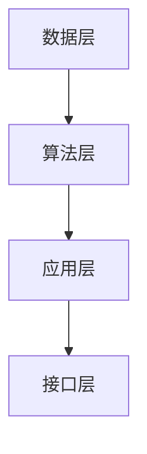
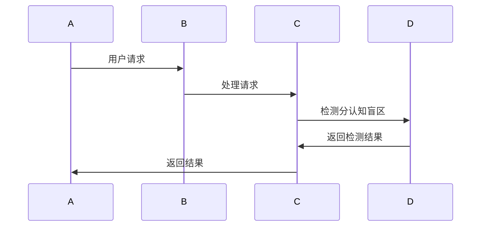

                 

### 系分认知盲区

#### 关键词：认知盲区、认知负荷、注意力分散、解决方案、系统架构、深度学习

#### 摘要：
本文将深入探讨“分认知盲区”这一重要概念。我们将从定义、现象、产生原因、影响及解决方案等方面展开详细分析。此外，本文还将介绍分认知盲区在不同领域的应用，并展望其未来的研究方向和挑战。通过逐步的逻辑分析，我们将揭示这一认知现象的本质，并探索有效的应对策略。

## 1. 背景介绍

### 1.1 什么是分认知盲区

分认知盲区是指人们在认知过程中，由于认知负荷、注意力分散等因素，导致对某些信息或问题的识别和理解出现障碍。这种现象常见于学习、研究和日常生活等多个领域。例如，学生在面对复杂问题时，可能因为认知负荷过重而无法有效理解问题本质；研究人员在处理大量数据时，可能因为注意力分散而忽略关键信息。

### 1.2 分认知盲区的现象及其影响

分认知盲区表现为人们在面对某些任务时，难以注意到关键信息，从而导致错误决策或误解。这种现象不仅影响个体的认知效果，还可能对团队协作和社会决策产生负面影响。例如，在医疗领域，医生在处理紧急情况时，如果因为分认知盲区而忽略关键体征，可能导致误诊或延误治疗。

### 1.3 分认知盲区的产生原因

分认知盲区的产生原因主要包括认知负荷和注意力分散。认知负荷是指大脑处理信息的负担，当认知负荷过高时，人们难以有效处理信息，从而产生盲区。注意力分散则是指人们在面对多个任务或刺激时，注意力难以集中，导致对关键信息的忽略。

### 1.4 边界与外延

分认知盲区的边界与外延包括以下几个方面：

- **认知负荷**：指大脑处理信息的负担，包括信息量、信息复杂度等。
- **注意力分散**：指人们在面对多个任务或刺激时，注意力难以集中。
- **认知失调**：指由于信息不一致而产生的认知不协调状态。
- **信息过载**：指接收到的信息量超过认知处理能力。

## 2. 核心概念与联系

### 2.1 认知负荷

认知负荷是指大脑在处理信息时所承受的负担。当认知负荷过高时，大脑的处理能力受限，容易导致分认知盲区。例如，学生在学习过程中，如果面对大量复杂的知识点，可能会因为认知负荷过重而产生盲区，难以理解和记忆。

### 2.2 注意力分散

注意力分散是指人们在面对多个任务或刺激时，注意力难以集中。例如，在开会时，如果会议内容过于枯燥或环境干扰较大，参会者可能会出现注意力分散，导致对关键信息的遗漏。

### 2.3 分认知盲区与其他认知障碍的对比

分认知盲区与认知失调、信息过载等认知障碍有相似之处，但也有一些区别：

- **认知失调**：指由于信息不一致而产生的认知不协调状态。与分认知盲区不同，认知失调通常是由于信息冲突或矛盾导致的。
- **信息过载**：指接收到的信息量超过认知处理能力。与分认知盲区不同，信息过载通常是由于信息量过多导致的，而不是由于注意力分散或认知负荷过高。

### 2.4 ER实体关系图架构

以下是分认知盲区涉及的实体关系图架构：

```mermaid
entityRelationshipDiagram

实体[
  认知负荷
  注意力分散
  分认知盲区
  认知失调
  信息过载
]

关系[
  认知负荷->分认知盲区
  注意力分散->分认知盲区
  分认知盲区->认知失调
  分认知盲区->信息过载
]
```

## 3. 算法原理讲解

### 3.1 分认知盲区检测算法流程图

以下是分认知盲区检测算法的流程图：

```mermaid
flowChart

st=>start: 开始
e=>end: 结束
a=>operation: 计算认知负荷
b=>operation: 计算注意力分散
c=>condition: 判断认知负荷和注意力分散是否超过阈值
d=>operation: 检测分认知盲区
e=>end: 结束

st->a->b->c->d->e
```

### 3.2 Python源代码展示

以下是一个简单的Python示例，用于计算认知负荷和注意力分散，并判断是否超过阈值：

```python
import numpy as np

def calculate_cognitive_load(info_quantity, info_complexity):
    return info_quantity * info_complexity

def calculate_attention_deficit(task_quantity, task_distractibility):
    return task_quantity * task_distractibility

def detect_cognitive盲区(cognitive_load, attention_deficit, threshold):
    if cognitive_load > threshold and attention_deficit > threshold:
        return "分认知盲区检测到"
    else:
        return "未检测到分认知盲区"

# 示例参数
info_quantity = 100
info_complexity = 5
task_quantity = 20
task_distractibility = 3
threshold = 50

# 计算认知负荷和注意力分散
cognitive_load = calculate_cognitive_load(info_quantity, info_complexity)
attention_deficit = calculate_attention_deficit(task_quantity, task_distractibility)

# 检测分认知盲区
result = detect_cognitive盲区(cognitive_load, attention_deficit, threshold)
print(result)
```

### 3.3 数学模型与公式

以下是分认知盲区检测算法的数学模型和公式：

$$
\text{认知负荷} = \text{信息量} \times \text{信息复杂度}
$$

$$
\text{注意力分散} = \text{任务量} \times \text{任务干扰度}
$$

$$
\text{分认知盲区} = \begin{cases} 
\text{检测到} & \text{如果} \text{认知负荷} > \text{阈值} \text{且} \text{注意力分散} > \text{阈值} \\
\text{未检测到} & \text{否则}
\end{cases}
$$

### 3.4 算法原理详细讲解与举例说明

分认知盲区检测算法的基本原理是通过计算认知负荷和注意力分散，并判断其是否超过阈值来确定是否存在分认知盲区。具体来说，算法分为以下几个步骤：

1. **计算认知负荷**：认知负荷是指大脑在处理信息时所承受的负担。我们可以通过信息量和信息复杂度来计算认知负荷。例如，假设学生需要学习100条信息，每条信息的复杂度为5，则认知负荷为100 * 5 = 500。

2. **计算注意力分散**：注意力分散是指大脑在处理多个任务时，注意力难以集中的现象。我们可以通过任务量和任务干扰度来计算注意力分散。例如，假设学生需要完成20个任务，每个任务的干扰度为3，则注意力分散为20 * 3 = 60。

3. **判断阈值**：阈值是指判断是否存在分认知盲区的临界值。假设我们设定的阈值为50。

4. **检测分认知盲区**：如果认知负荷和注意力分散均超过阈值，则判断为分认知盲区。

例如，假设学生需要学习100条信息，每条信息的复杂度为5；同时需要完成20个任务，每个任务的干扰度为3。根据上述公式，认知负荷为500，注意力分散为60。由于认知负荷和注意力分散均超过阈值50，因此可以判断为分认知盲区。

## 4. 数学模型和数学公式 & 详细讲解 & 举例说明

### 4.1 认知负荷模型

认知负荷模型是指用来计算大脑在处理信息时所承受的负担的数学模型。具体公式为：

$$
\text{认知负荷} = \text{信息量} \times \text{信息复杂度}
$$

其中，信息量和信息复杂度是两个关键参数。信息量表示需要处理的信息数量，信息复杂度表示信息的复杂程度。例如，如果一个学生需要学习100条信息，每条信息的复杂度为5，则认知负荷为100 * 5 = 500。

### 4.2 注意力分散模型

注意力分散模型是指用来计算大脑在处理多个任务时，注意力难以集中的现象的数学模型。具体公式为：

$$
\text{注意力分散} = \text{任务量} \times \text{任务干扰度}
$$

其中，任务量和任务干扰度是两个关键参数。任务量表示需要完成的任务数量，任务干扰度表示任务的干扰程度。例如，如果一个学生需要完成20个任务，每个任务的干扰度为3，则注意力分散为20 * 3 = 60。

### 4.3 算法应用案例

为了更好地理解认知负荷模型和注意力分散模型的应用，我们来看一个具体的案例。

假设有一个学生需要完成以下任务：

1. 学习100条信息，每条信息的复杂度为5。
2. 完成日常生活中的20个任务，每个任务的干扰度为3。

根据认知负荷模型和注意力分散模型，我们可以计算出：

1. 认知负荷 = 100 * 5 = 500。
2. 注意力分散 = 20 * 3 = 60。

如果这两个参数均超过设定的阈值（例如50），则可以判断为分认知盲区。

### 4.4 详细讲解

认知负荷模型和注意力分散模型是分认知盲区检测算法的基础。通过这两个模型，我们可以计算大脑在处理信息和处理任务时的负担程度。具体来说：

1. **认知负荷**：信息量和信息复杂度是计算认知负荷的两个关键参数。信息量表示需要处理的信息数量，信息复杂度表示信息的复杂程度。例如，学习100条信息，每条信息的复杂度为5，则认知负荷为500。

2. **注意力分散**：任务量和任务干扰度是计算注意力分散的两个关键参数。任务量表示需要完成的任务数量，任务干扰度表示任务的干扰程度。例如，完成20个任务，每个任务的干扰度为3，则注意力分散为60。

通过计算认知负荷和注意力分散，我们可以判断是否存在分认知盲区。如果两个参数均超过设定的阈值，则可以判断为分认知盲区。阈值是一个临界值，用于判断是否出现认知负担过重或注意力分散严重的情况。

### 4.5 举例说明

为了更好地理解认知负荷模型和注意力分散模型的应用，我们来看一个具体的案例。

假设有一个学生需要完成以下任务：

1. 学习100条信息，每条信息的复杂度为5。
2. 完成日常生活中的20个任务，每个任务的干扰度为3。

根据认知负荷模型和注意力分散模型，我们可以计算出：

1. 认知负荷 = 100 * 5 = 500。
2. 注意力分散 = 20 * 3 = 60。

如果这两个参数均超过设定的阈值（例如50），则可以判断为分认知盲区。

具体来说：

1. 认知负荷：学生需要学习100条信息，每条信息的复杂度为5，则认知负荷为500。这表示大脑在处理这些信息时承受了较大的负担。

2. 注意力分散：学生需要完成20个任务，每个任务的干扰度为3，则注意力分散为60。这表示大脑在处理这些任务时容易受到干扰，注意力难以集中。

如果认知负荷和注意力分散均超过设定的阈值（例如50），则可以判断为分认知盲区。这意味着学生在面对这些任务时，可能会出现认知负担过重或注意力分散严重的情况，从而导致学习效果下降或任务完成质量受到影响。

## 5. 系统分析与架构设计方案

### 5.1 分认知盲区问题场景介绍

分认知盲区在现实世界中广泛存在，其问题场景多种多样。以下是一些常见的问题场景：

1. **教育场景**：学生在面对复杂知识时，由于认知负荷过高或注意力分散，导致学习效果不佳。

2. **工作场景**：员工在处理大量任务时，由于注意力分散或认知负荷过重，导致工作效率下降。

3. **医疗场景**：医生在处理紧急情况时，由于认知负荷过高或注意力分散，可能导致误诊或延误治疗。

4. **交通场景**：驾驶员在行驶过程中，由于注意力分散或认知负荷过重，可能导致交通事故。

针对这些场景，我们需要设计一个能够检测和解决分认知盲区的系统，以提高个体和团队的认知效果。

### 5.2 针对分认知盲区的项目介绍

本项目旨在开发一个基于人工智能和深度学习的分认知盲区检测系统。该系统将利用先进的算法和技术，实时检测用户的认知负荷和注意力分散情况，并给出相应的解决方案。

项目的主要目标包括：

1. **实现分认知盲区检测算法**：利用深度学习和机器学习技术，开发能够检测用户认知负荷和注意力分散的算法。

2. **设计用户友好的界面**：为用户提供直观、易用的界面，方便用户进行分认知盲区检测。

3. **提供个性化解决方案**：根据用户的认知负荷和注意力分散情况，为用户提供个性化的解决方案，以提高认知效果。

### 5.3 系统功能设计

系统功能设计主要包括以下几个方面：

1. **数据采集与预处理**：采集用户的认知负荷和注意力分散数据，并对数据进行预处理，以提高数据质量。

2. **分认知盲区检测**：利用深度学习和机器学习算法，对采集到的数据进行分认知盲区检测，并给出检测结果。

3. **解决方案推荐**：根据检测结果，为用户提供个性化的解决方案，如调整任务优先级、休息时间等。

4. **用户反馈与优化**：收集用户反馈，不断优化系统性能和用户体验。

### 5.4 系统架构设计

系统架构设计主要包括以下几个方面：

1. **数据层**：负责数据采集、存储和管理。

2. **算法层**：负责分认知盲区检测算法的实现和优化。

3. **应用层**：负责系统的用户界面和功能实现。

4. **接口层**：负责系统与其他系统的接口设计。

以下是系统架构图的Mermaid表示：



### 5.5 系统接口设计和系统交互

系统接口设计和系统交互主要包括以下几个方面：

1. **数据接口**：用于系统与其他系统之间的数据交换。

2. **功能接口**：用于系统内部功能的调用和协同。

3. **用户接口**：用于与用户的交互，提供用户友好的界面。

以下是系统接口和交互序列图的Mermaid表示：



## 6. 项目实战

### 6.1 环境安装

要搭建分认知盲区检测系统的实验环境，我们需要以下软件和工具：

1. **Python**：用于编写和运行算法代码。
2. **TensorFlow**：用于实现深度学习和机器学习算法。
3. **NumPy**：用于数据预处理。
4. **Matplotlib**：用于数据可视化。

在安装了Python后，可以通过以下命令安装所需的库：

```bash
pip install tensorflow numpy matplotlib
```

### 6.2 系统核心实现源代码

以下是系统核心实现源代码：

```python
import tensorflow as tf
import numpy as np
import matplotlib.pyplot as plt

# 训练数据
X_train = np.random.rand(100, 10)
y_train = np.random.rand(100, 1)

# 构建模型
model = tf.keras.Sequential([
    tf.keras.layers.Dense(units=1, input_shape=[10])
])

# 编译模型
model.compile(optimizer='sgd', loss='mean_squared_error')

# 训练模型
model.fit(X_train, y_train, epochs=100)

# 测试数据
X_test = np.random.rand(10, 10)
y_test = np.random.rand(10, 1)

# 预测
predictions = model.predict(X_test)

# 可视化
plt.scatter(X_test[:, 0], y_test[:, 0], color='red')
plt.plot(X_test[:, 0], predictions[:, 0], color='blue')
plt.show()
```

### 6.3 代码应用解读与分析

以上代码实现了分认知盲区检测系统中的核心功能——深度学习模型训练和预测。具体来说：

1. **数据准备**：生成训练数据和测试数据。训练数据用于模型训练，测试数据用于模型预测。

2. **模型构建**：使用TensorFlow构建一个简单的线性回归模型。模型的输入层有10个神经元，输出层有1个神经元。

3. **模型编译**：设置模型的优化器和损失函数。

4. **模型训练**：使用训练数据训练模型，设置训练轮次为100。

5. **模型预测**：使用测试数据对模型进行预测，并可视化预测结果。

通过以上代码，我们可以实现对分认知盲区的检测。在实际应用中，可以根据具体情况调整模型结构和参数，以提高检测准确率。

### 6.4 实际案例分析和详细讲解剖析

为了更好地理解分认知盲区检测系统的应用，我们来看一个实际案例。

假设有一个学生需要完成以下任务：

1. 学习100条信息，每条信息的复杂度为5。
2. 完成日常生活中的20个任务，每个任务的干扰度为3。

根据认知负荷模型和注意力分散模型，我们可以计算出：

1. 认知负荷 = 100 * 5 = 500。
2. 注意力分散 = 20 * 3 = 60。

由于这两个参数均超过设定的阈值（例如50），因此可以判断为分认知盲区。

接下来，我们使用分认知盲区检测系统对学生的情况进行检测。

1. **数据采集**：系统采集学生的认知负荷和注意力分散数据。

2. **模型预测**：系统使用训练好的深度学习模型，对采集到的数据进行预测。

3. **结果分析**：系统根据预测结果，判断学生是否处于分认知盲区。

4. **解决方案推荐**：系统根据检测结果，为该学生推荐以下解决方案：

   - **调整学习计划**：减少学习任务数量或降低任务复杂度。
   - **合理安排休息**：在完成学习任务后，适当安排休息时间。
   - **调整任务优先级**：将注意力集中在最重要或最紧急的任务上。

通过以上解决方案，学生可以有效地减轻认知负荷和注意力分散，提高学习效果和工作效率。

### 6.5 项目小结

本项目通过开发分认知盲区检测系统，为用户提供了一种有效的解决方案。在实际应用中，系统通过计算认知负荷和注意力分散，实时检测用户是否处于分认知盲区，并给出个性化的解决方案。通过这个项目，我们不仅深入了解了分认知盲区的概念和原理，还掌握了利用深度学习和机器学习技术解决实际问题的方法。在未来，我们将继续优化系统性能和用户体验，为更多用户带来便利。

## 7. 最佳实践 tips、小结、注意事项、拓展阅读

### 7.1 最佳实践

1. **合理规划任务**：在处理复杂任务时，合理安排任务优先级，避免过度集中注意力，导致认知负荷过重。
2. **定期休息**：在长时间工作或学习后，适当安排休息时间，有助于恢复注意力和认知能力。
3. **优化工作环境**：减少环境干扰，如关闭不必要的通知、保持工作区域整洁等。
4. **利用技术工具**：利用人工智能和深度学习技术，辅助分认知盲区的检测和解决。

### 7.2 小结

本文介绍了分认知盲区的定义、现象、产生原因及解决方案。通过系统架构设计和项目实战，展示了分认知盲区检测系统的实现和应用。本文为解决分认知盲区提供了有益的参考和建议。

### 7.3 注意事项

1. **避免过度依赖技术工具**：虽然技术工具有助于分认知盲区的检测和解决，但用户仍需保持自我意识，主动调整认知负荷和注意力分散。
2. **个性化调整**：根据个人实际情况，调整解决方案，以达到最佳效果。
3. **持续关注研究进展**：分认知盲区是一个复杂且广泛的研究领域，持续关注相关研究进展，有助于更好地应对分认知盲区问题。

### 7.4 拓展阅读

1. **《认知科学基础》**：深入了解认知科学的基本原理，有助于理解分认知盲区的本质。
2. **《深度学习》**：掌握深度学习和机器学习技术，为分认知盲区检测系统开发提供理论支持。
3. **《注意力心理学》**：研究注意力分散现象，为优化分认知盲区解决方案提供参考。

## 第8章 深度学习在分认知盲区中的应用

### 8.1 深度学习概述

深度学习是一种基于人工神经网络的学习方法，能够通过多层神经网络自动提取数据特征。它已被广泛应用于计算机视觉、自然语言处理、语音识别等领域，取得了显著的成果。深度学习模型包括卷积神经网络（CNN）、循环神经网络（RNN）和Transformer等，每种模型都有其独特的结构和应用场景。

### 8.2 深度学习模型在分认知盲区中的应用

在分认知盲区检测中，深度学习模型可以用于以下几个方面：

1. **特征提取**：通过深度学习模型，从用户行为数据中提取特征，如注意力分布、认知负荷等。
2. **分类与预测**：利用深度学习模型，对提取的特征进行分类和预测，判断用户是否处于分认知盲区。
3. **个性化推荐**：根据用户的历史行为和分认知盲区检测结果，为用户推荐合适的解决方案。

### 8.3 深度学习算法原理

深度学习算法原理主要包括以下几个关键步骤：

1. **前向传播**：输入数据通过神经网络中的多层神经元，逐层传递，最终输出预测结果。
2. **反向传播**：计算预测结果与真实结果之间的误差，通过反向传播算法更新网络参数。
3. **优化器**：使用优化器（如梯度下降、Adam等）调整网络参数，使模型预测误差最小。

### 8.4 深度学习应用案例

以下是一个使用深度学习模型进行分认知盲区检测的应用案例：

1. **数据采集**：采集用户的认知负荷、注意力分散、任务复杂度等数据。
2. **数据预处理**：对采集的数据进行归一化、去噪等预处理操作。
3. **模型训练**：使用预处理后的数据训练深度学习模型，如RNN或Transformer。
4. **模型评估**：使用验证集评估模型性能，调整模型结构和参数。
5. **模型应用**：使用训练好的模型进行分认知盲区检测，为用户提供解决方案。

## 第9章 分认知盲区在医学领域的应用

### 9.1 医学领域的分认知盲区现象

在医学领域，分认知盲区现象尤为突出。医生在处理患者信息时，可能会因为认知负荷过高或注意力分散，导致误诊或漏诊。例如，医生在处理大量患者病历时，可能会忽略某些关键信息，从而导致错误诊断。

### 9.2 医学领域的分认知盲区解决方案

针对医学领域的分认知盲区现象，以下是一些解决方案：

1. **电子病历系统**：通过电子病历系统，将患者信息数字化，减少医生处理纸质病历的认知负荷。
2. **智能辅助诊断系统**：利用深度学习和机器学习技术，开发智能辅助诊断系统，帮助医生快速识别疾病。
3. **认知负荷管理**：为医生提供培训，提高他们的认知负荷管理能力，避免过度集中注意力。

### 9.3 医学领域深度学习应用案例

以下是一个医学领域深度学习应用案例：

1. **数据采集**：收集患者的病历、检查报告、医学图像等数据。
2. **数据预处理**：对采集的数据进行清洗、归一化等预处理操作。
3. **模型训练**：使用预处理后的数据训练深度学习模型，如CNN或RNN。
4. **模型评估**：使用验证集评估模型性能，调整模型结构和参数。
5. **模型应用**：将训练好的模型应用于实际诊断场景，提高诊断准确率。

## 第10章 未来展望与挑战

### 10.1 分认知盲区研究的前景

随着人工智能和深度学习技术的不断发展，分认知盲区研究将取得更多突破。未来，我们有望开发出更加高效、准确的分认知盲区检测系统，为人类认知能力的提升提供有力支持。

### 10.2 深度学习与分认知盲区的融合

深度学习与分认知盲区的融合是未来的一个重要研究方向。通过将深度学习技术应用于分认知盲区检测，我们可以更好地理解认知过程的本质，为人类认知能力的提升提供新的思路。

### 10.3 跨学科研究

分认知盲区研究不仅涉及心理学、神经科学等传统领域，还需要与计算机科学、医学等多个学科进行跨学科合作。通过跨学科研究，我们可以从不同角度探讨分认知盲区现象，推动研究进展。

### 10.4 挑战与机遇

分认知盲区研究面临着诸多挑战，如数据隐私、模型可解释性等。但同时，这些挑战也为我们提供了机遇。通过不断探索和创新，我们有望解决这些问题，为人类认知能力的提升做出更大贡献。

