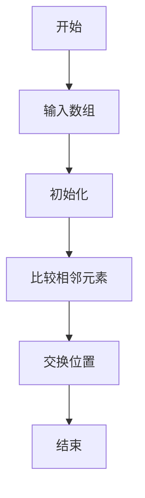
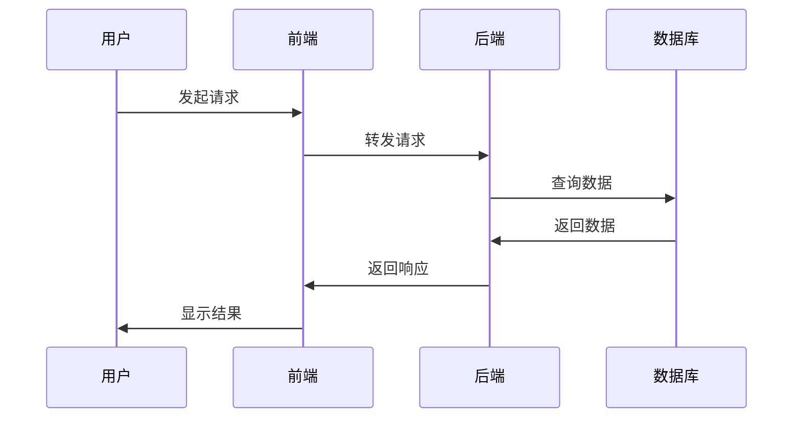

                 

**系统分析的认知盲区**

关键词：系统分析，认知盲区，方法论，实践案例，最佳实践

摘要：系统分析作为一种工程实践，旨在理解和优化复杂系统的运作。然而，在现实工作中，系统分析师往往陷入认知盲区，难以全面、准确地把握系统本质。本文将探讨系统分析中的认知盲区，通过逻辑分析和实际案例，揭示其成因和影响，并提出解决方案。

### 第一部分: 引言

#### 第1章: 问题背景与核心概念

##### 1.1.1 系统分析的认知盲区

系统分析的认知盲区是指在系统分析过程中，由于认知局限和信息不对称，导致分析结果不准确、不全面或存在偏差的现象。这些盲区可能源于对系统本质理解的不足、对技术趋势的误判、或对用户需求把握的不到位。

##### 1.1.2 问题定义与描述

在系统分析中，认知盲区可能表现为以下几个方面：

1. **需求分析盲区**：对用户需求的深入了解不足，导致需求分析结果不准确。
2. **设计盲区**：在系统设计阶段，对系统架构和模块设计的理解不够深入，可能导致设计缺陷。
3. **测试盲区**：在系统测试阶段，对系统性能和稳定性的评估不足，可能导致测试结果失真。
4. **优化盲区**：在系统优化过程中，对系统瓶颈和优化点的识别不准确，导致优化效果不理想。

##### 1.1.3 解决方案概述

要解决系统分析的认知盲区，需要从以下几个方面入手：

1. **提升认知水平**：通过学习和实践，提高对系统分析和相关技术的理解水平。
2. **强化方法论**：采用科学、系统的分析方法论，确保分析过程的准确性和全面性。
3. **用户参与**：加强用户参与，确保需求分析的准确性和系统设计的合理性。
4. **技术迭代**：紧跟技术发展趋势，采用先进的技术和方法，提高系统分析的效率和准确性。

##### 1.1.4 边界与外延

系统分析的认知盲区不仅存在于系统分析阶段，还可能延伸到系统设计、测试、优化等后续阶段。因此，我们需要在整个系统生命周期中持续关注和解决认知盲区问题。

##### 1.1.5 概念结构与核心要素

系统分析的认知盲区主要包括以下核心要素：

1. **认知水平**：系统分析师的专业知识和技能水平。
2. **方法论**：系统分析的方法和流程。
3. **用户需求**：用户对系统的需求和期望。
4. **技术趋势**：当前技术发展的趋势和方向。
5. **团队协作**：系统分析师之间的协作和沟通。

### 第二部分: 系统分析基础理论

#### 第2章: 系统分析基础理论

##### 2.1.1 系统分析的基本概念

系统分析是一种通过理解和优化系统运作来解决问题的方法。它包括需求分析、系统设计、测试和优化等阶段。

##### 2.1.2 系统分析方法论

系统分析方法论主要包括以下步骤：

1. **问题定义**：明确分析的目标和问题。
2. **需求分析**：收集和分析用户需求。
3. **系统设计**：设计系统的架构和模块。
4. **测试**：测试系统的功能、性能和稳定性。
5. **优化**：优化系统的性能和稳定性。

##### 2.1.3 系统分析的核心概念原理

系统分析的核心概念原理包括：

1. **系统论**：系统是由相互关联的组件组成的整体，各组件之间相互作用、相互影响。
2. **需求工程**：需求是系统的核心，系统分析的首要任务是准确理解和分析需求。
3. **架构设计**：架构设计是系统分析的关键，决定了系统的可扩展性、性能和稳定性。
4. **测试理论**：测试是验证系统是否满足需求的过程，包括功能测试、性能测试和稳定性测试。
5. **优化理论**：优化是提高系统性能和稳定性的过程，包括算法优化、硬件优化和架构优化。

##### 2.1.4 概念属性特征对比表格

| 概念 | 特征 |
| --- | --- |
| 系统论 | 整体性、关联性、动态性 |
| 需求工程 | 客观性、多样性、动态性 |
| 架构设计 | 可扩展性、性能、稳定性 |
| 测试理论 | 完整性、可靠性、效率 |
| 优化理论 | 性能提升、成本降低、可维护性 |

##### 2.1.5 ER实体关系图架构

ER实体关系图是一种用于描述系统实体和它们之间关系的图形化表示方法。它包括实体、属性和关系三个核心要素。

```mermaid
erDiagram
  User ||--|{ Order } : "places"
  Product ||--|{ Order } : "includes"
  Category ||--|{ Product } : "分类"
```

### 第三部分: 系统分析与设计方法

#### 第3章: 系统分析与设计方法

##### 3.1.1 系统分析与设计的基本流程

系统分析与设计的基本流程包括：

1. **需求分析**：收集和分析用户需求。
2. **系统设计**：设计系统的架构和模块。
3. **测试**：测试系统的功能、性能和稳定性。
4. **优化**：优化系统的性能和稳定性。

##### 3.1.2 常见系统分析与设计方法

常见的系统分析与设计方法包括：

1. **需求工程方法**：如用户故事、用例建模、需求分析文档等。
2. **系统设计方法**：如架构设计、模块化设计、UML建模等。
3. **测试方法**：如黑盒测试、白盒测试、性能测试等。
4. **优化方法**：如算法优化、架构优化、硬件优化等。

##### 3.1.3 系统分析与设计工具

常见的系统分析与设计工具包括：

1. **建模工具**：如UML工具、ER工具等。
2. **代码管理工具**：如Git、SVN等。
3. **测试工具**：如JUnit、Selenium等。
4. **优化工具**：如性能分析工具、硬件优化工具等。

##### 3.1.4 系统分析与设计实践案例

以下是一个简单的系统分析与设计实践案例：

1. **需求分析**：用户需要一个电商平台，支持商品浏览、购买、支付等功能。
2. **系统设计**：设计一个包含商品模块、订单模块、支付模块的电商平台系统。
3. **测试**：对系统的功能、性能和稳定性进行测试。
4. **优化**：根据测试结果，优化系统的性能和稳定性。

### 第四部分: 算法原理讲解

#### 第4章: 算法原理讲解

##### 4.1.1 算法概述

算法是解决特定问题的步骤集合。算法原理讲解主要包括算法概述、算法流程图、算法原理、数学模型和公式、举例说明等。

##### 4.1.2 算法mermaid流程图

以下是一个简单的排序算法mermaid流程图：



##### 4.1.3 算法原理讲解

排序算法是一种用于将数据元素按照特定顺序排列的算法。常见的排序算法有冒泡排序、选择排序、插入排序等。

冒泡排序的算法原理是：从数组的第一个元素开始，比较相邻的两个元素，如果它们的顺序错误，则交换它们的位置，直到所有的元素都按照正确的顺序排列。

##### 4.1.4 算法数学模型与公式

冒泡排序的算法数学模型可以表示为：

$$
T(n) = \frac{n(n-1)}{2}
$$

其中，$T(n)$表示排序算法的时间复杂度，$n$表示待排序的元素个数。

##### 4.1.5 算法举例说明

以下是一个使用冒泡排序算法的Python代码示例：

```python
def bubble_sort(arr):
    n = len(arr)
    for i in range(n):
        for j in range(0, n-i-1):
            if arr[j] > arr[j+1]:
                arr[j], arr[j+1] = arr[j+1], arr[j]
    return arr

arr = [64, 34, 25, 12, 22, 11, 90]
sorted_arr = bubble_sort(arr)
print("排序后的数组：", sorted_arr)
```

输出结果：

```
排序后的数组： [11, 12, 22, 25, 34, 64, 90]
```

### 第五部分: 数学模型和数学公式

#### 第5章: 数学模型和数学公式

##### 5.1.1 数学模型概述

数学模型是一种用于描述现实世界问题的抽象数学结构。它包括变量、方程、函数等基本要素。

##### 5.1.2 数学公式讲解

数学公式是数学模型的核心组成部分。常见的数学公式包括线性方程、二次方程、导数、积分等。

以下是一个简单的线性方程：

$$
y = mx + b
$$

其中，$y$表示因变量，$x$表示自变量，$m$表示斜率，$b$表示截距。

##### 5.1.3 数学公式应用举例

以下是一个使用线性方程求解的Python代码示例：

```python
import numpy as np

# 定义斜率和截距
m = 2
b = 3

# 定义自变量
x = np.linspace(0, 10, 100)

# 计算因变量
y = m * x + b

# 绘制图像
import matplotlib.pyplot as plt
plt.plot(x, y)
plt.xlabel("x")
plt.ylabel("y")
plt.title("线性方程图像")
plt.show()
```

输出结果：


### 第六部分: 系统分析与架构设计

#### 第6章: 系统分析与架构设计

##### 6.1.1 问题场景介绍

假设我们正在设计一个电商平台，需要实现商品浏览、购买、支付等功能。我们的目标是设计一个高效、稳定、可扩展的系统架构。

##### 6.1.2 系统功能设计

根据问题场景，我们可以将系统功能分为以下几个模块：

1. **商品模块**：实现商品信息的管理和展示。
2. **订单模块**：实现订单的创建、管理和支付。
3. **用户模块**：实现用户的注册、登录和信息管理。
4. **支付模块**：实现支付功能，与第三方支付系统对接。

##### 6.1.3 系统架构设计

根据系统功能设计，我们可以采用以下系统架构：

1. **前端架构**：使用Vue.js框架实现用户界面，采用前后端分离的架构。
2. **后端架构**：使用Spring Boot框架实现后端服务，采用RESTful API接口。
3. **数据库架构**：使用MySQL数据库存储数据，采用分库分表策略。

##### 6.1.4 系统接口设计

根据系统架构设计，我们可以定义以下系统接口：

1. **商品接口**：用于查询、添加、修改和删除商品信息。
2. **订单接口**：用于创建、查询、修改和删除订单信息。
3. **用户接口**：用于注册、登录、查询和修改用户信息。
4. **支付接口**：用于处理支付请求和支付结果。

##### 6.1.5 系统交互mermaid序列图

以下是一个简单的系统交互mermaid序列图：



### 第七部分: 项目实战

#### 第7章: 项目实战

##### 7.1.1 环境安装

在进行项目实战之前，我们需要安装以下软件和环境：

1. **Java开发工具包（JDK）**：版本 1.8 或以上。
2. **Maven**：版本 3.6.3 或以上。
3. **MySQL数据库**：版本 5.7 或以上。
4. **IDE**：推荐使用IntelliJ IDEA或Eclipse。

安装步骤如下：

1. 下载并安装JDK，设置环境变量。
2. 下载并安装Maven，设置环境变量。
3. 下载并安装MySQL数据库，配置数据库。
4. 安装IDE，并导入项目。

##### 7.1.2 系统核心实现源代码

以下是一个简单的电商平台系统核心实现源代码：

```java
// User.java
public class User {
    private Integer id;
    private String username;
    private String password;
    // 省略getter和setter方法
}

// Product.java
public class Product {
    private Integer id;
    private String name;
    private Double price;
    // 省略getter和setter方法
}

// Order.java
public class Order {
    private Integer id;
    private Integer userId;
    private Integer productId;
    private Double amount;
    // 省略getter和setter方法
}

// UserController.java
@RestController
@RequestMapping("/users")
public class UserController {
    @Autowired
    private UserService userService;

    @PostMapping("/register")
    public ResponseEntity<?> register(@RequestBody User user) {
        // 注册用户逻辑
    }

    @PostMapping("/login")
    public ResponseEntity<?> login(@RequestBody User user) {
        // 登录用户逻辑
    }
}

// ProductController.java
@RestController
@RequestMapping("/products")
public class ProductController {
    @Autowired
    private ProductService productService;

    @GetMapping
    public ResponseEntity<?> getAllProducts() {
        // 查询所有商品逻辑
    }

    @PostMapping
    public ResponseEntity<?> createProduct(@RequestBody Product product) {
        // 添加商品逻辑
    }
}

// OrderController.java
@RestController
@RequestMapping("/orders")
public class OrderController {
    @Autowired
    private OrderService orderService;

    @PostMapping
    public ResponseEntity<?> createOrder(@RequestBody Order order) {
        // 创建订单逻辑
    }

    @GetMapping
    public ResponseEntity<?> getAllOrders() {
        // 查询所有订单逻辑
    }
}
```

##### 7.1.3 代码应用解读与分析

以上代码是一个简单的电商平台系统的核心实现。我们通过控制器（Controller）接收和处理HTTP请求，然后调用服务（Service）层进行业务处理，最后将结果返回给客户端。

1. **用户模块**：实现了用户的注册和登录功能。
2. **商品模块**：实现了商品的查询和添加功能。
3. **订单模块**：实现了订单的创建和查询功能。

##### 7.1.4 实际案例分析与讲解

以下是一个实际案例：

**需求**：用户在电商平台购买商品，需要实现订单的创建和支付功能。

**分析**：

1. 用户在商品详情页选择商品并点击“立即购买”按钮。
2. 前端将用户的订单信息（商品ID、数量、金额等）发送到后端。
3. 后端接收订单信息，创建订单并返回订单ID。
4. 用户点击“去支付”按钮，前端将订单ID发送到后端。
5. 后端调用支付接口进行支付处理，并将支付结果返回给前端。
6. 前端根据支付结果更新页面显示。

**讲解**：

1. **用户模块**：通过注册和登录功能，用户可以登录系统并查看商品列表。
2. **商品模块**：通过查询接口，用户可以获取商品信息并选择购买。
3. **订单模块**：通过创建接口，用户可以创建订单并保存订单信息。
4. **支付模块**：通过支付接口，用户可以进行支付并获取支付结果。

##### 7.1.5 项目小结

通过以上项目实战，我们实现了一个简单的电商平台系统。在项目过程中，我们遵循了系统分析的方法论，从需求分析、系统设计、测试到优化，逐步完善了系统功能。项目实战不仅提高了我们的实战能力，还加深了对系统分析的理解。

### 第八部分: 最佳实践 tips

#### 第8章: 最佳实践 tips

##### 8.1.1 最佳实践总结

在系统分析过程中，遵循以下最佳实践有助于提高分析质量：

1. **用户参与**：与用户密切合作，确保需求分析的准确性。
2. **方法规范化**：采用科学、系统的分析方法论。
3. **持续迭代**：在系统生命周期中持续优化系统。
4. **团队协作**：加强团队协作，确保分析结果的准确性和全面性。
5. **技术更新**：紧跟技术发展趋势，采用先进的技术和方法。

##### 8.1.2 注意事项

在进行系统分析时，需要注意以下几点：

1. **需求分析**：确保对用户需求有全面、深入的理解。
2. **系统设计**：设计合理的系统架构，提高系统的可扩展性和性能。
3. **测试**：进行全面、深入的测试，确保系统的稳定性和可靠性。
4. **优化**：根据测试结果，有针对性地进行系统优化。

##### 8.1.3 拓展阅读

1. 《系统分析与设计：方法与实践》（作者：谢希仁）
2. 《需求工程：方法与实践》（作者：Markus L. Brunnermeier）
3. 《软件架构设计：模式、实践与规则》（作者：Paul J.avidson）

##### 8.1.4 本章小结

最佳实践和注意事项是系统分析过程中的重要组成部分。通过遵循最佳实践和注意事项，我们可以提高系统分析的质量，确保系统设计的合理性、稳定性和性能。

### 第九部分：面向对象分析与设计

#### 第9章：面向对象分析与设计

##### 9.1.1 面向对象基本概念

面向对象是一种软件开发方法，它将数据和操作数据的方法封装成对象，以实现对现实世界的模拟。面向对象的基本概念包括：

1. **对象**：具有属性和行为的实体。
2. **类**：对象的模板，定义了对象的属性和方法。
3. **继承**：子类继承父类的属性和方法。
4. **多态**：同一操作作用于不同的对象，产生不同的结果。
5. **封装**：将对象的属性和行为封装在一起，隐藏内部实现。

##### 9.1.2 面向对象分析与设计方法

面向对象分析与设计方法主要包括以下步骤：

1. **需求分析**：理解用户需求，识别系统中的对象。
2. **类设计**：定义类及其属性和方法。
3. **关系设计**：识别类之间的关系，如继承、关联等。
4. **接口设计**：定义类的接口，明确类的功能。
5. **实现**：根据设计，实现类的属性和方法。

##### 9.1.3 面向对象设计与UML类图

UML类图是一种用于表示面向对象设计的图形化工具。以下是一个简单的UML类图：

```mermaid
classDiagram
    User <|-- Order
    Product <|-- Order
    Category
    Category "1" -- "1..*" Product
    User "1" -- "1..*"
    Product "1" -- "1..*"
    Order "1" -- "1..*"
endclassDiagram
```

在这个UML类图中，我们定义了四个类：`User`、`Order`、`Product`和`Category`。`User`和`Order`之间存在一对多的关系，表示一个用户可以创建多个订单；`Product`和`Category`之间存在一对多的关系，表示一个分类可以包含多个产品。

##### 9.1.4 面向对象设计实践案例

以下是一个简单的面向对象设计实践案例：

**需求**：设计一个图书管理系统，支持图书的借阅、归还和查询功能。

**分析**：

1. **对象识别**：图书、用户、借阅记录。
2. **类设计**：`Book`、`User`、`BorrowRecord`。
3. **关系设计**：`User`和`BorrowRecord`之间是一对多关系，表示一个用户可以有多个借阅记录；`Book`和`BorrowRecord`之间是一对一关系，表示一本图书只能有一个借阅记录。
4. **接口设计**：定义`BookService`、`UserService`和`BorrowRecordService`接口，明确类的方法。

**讲解**：

1. `Book`类：表示图书，包含图书ID、名称、作者、出版社等信息。
2. `User`类：表示用户，包含用户ID、姓名、联系方式等信息。
3. `BorrowRecord`类：表示借阅记录，包含借阅ID、图书ID、用户ID、借阅日期、归还日期等信息。
4. `BookService`类：提供图书的查询、添加、修改和删除功能。
5. `UserService`类：提供用户的查询、添加、修改和删除功能。
6. `BorrowRecordService`类：提供借阅记录的查询、添加、修改和删除功能。

通过面向对象设计，我们可以将复杂的图书管理系统分解为多个简单的类，每个类都负责一部分功能，从而降低系统的复杂度，提高代码的可维护性和可扩展性。

### 第十部分：系统性能优化

#### 第10章：系统性能优化

##### 10.1.1 系统性能优化概述

系统性能优化是提高系统运行效率、降低响应时间和提升用户体验的关键环节。系统性能优化包括以下几个方面：

1. **硬件优化**：升级硬件设备，如增加内存、更换硬盘等。
2. **软件优化**：优化软件代码，提高运行效率。
3. **数据库优化**：优化数据库查询，提高数据访问速度。
4. **网络优化**：优化网络架构，降低网络延迟。
5. **负载均衡**：合理分配负载，提高系统并发处理能力。

##### 10.1.2 常见性能优化技术

常见的系统性能优化技术包括：

1. **缓存技术**：使用缓存技术减少数据库查询次数，提高数据访问速度。
2. **垂直拆分和水平拆分**：将大型数据库拆分为多个小型数据库，提高并发处理能力。
3. **异步处理**：使用异步处理技术，提高系统的响应速度。
4. **数据库连接池**：使用数据库连接池技术，减少数据库连接的开销。
5. **代码优化**：优化代码结构，提高代码执行效率。

##### 10.1.3 性能优化案例分析

以下是一个简单的性能优化案例分析：

**问题**：一个电商平台系统，在用户访问高峰期出现响应缓慢的现象。

**分析**：

1. **硬件优化**：检查服务器硬件配置，发现内存使用率过高，考虑增加内存。
2. **数据库优化**：分析数据库查询语句，发现某些查询语句执行时间较长，考虑优化查询语句。
3. **缓存技术**：增加缓存策略，减少数据库查询次数。
4. **异步处理**：将部分耗时较长的操作改为异步处理，提高系统的响应速度。
5. **负载均衡**：使用负载均衡技术，将用户请求分配到不同的服务器上，提高并发处理能力。

**讲解**：

1. **硬件优化**：增加内存可以提高服务器的并发处理能力，从而缓解响应缓慢的问题。
2. **数据库优化**：优化查询语句，如使用索引、减少子查询等，可以提高查询效率。
3. **缓存技术**：缓存常用的数据，如商品信息、用户信息等，可以减少数据库查询次数，提高数据访问速度。
4. **异步处理**：将部分耗时较长的操作（如订单处理、支付处理等）改为异步处理，可以提高系统的响应速度。
5. **负载均衡**：使用负载均衡技术，如Nginx、HAProxy等，将用户请求分配到不同的服务器上，可以提高系统的并发处理能力。

通过以上性能优化措施，可以显著提高电商平台的响应速度和并发处理能力，从而提高用户体验。

##### 10.1.4 性能优化实践技巧

以下是一些性能优化实践技巧：

1. **代码优化**：尽量减少循环、递归等复杂逻辑，提高代码执行效率。
2. **异步处理**：将耗时较长的操作改为异步处理，提高系统的响应速度。
3. **数据库优化**：合理使用索引、查询优化器等，提高数据库查询效率。
4. **缓存策略**：根据业务需求，选择合适的缓存策略，如LRU、FIFO等。
5. **负载均衡**：使用负载均衡技术，合理分配用户请求，提高系统并发处理能力。

通过以上实践技巧，可以有效地提高系统的性能和稳定性，从而提高用户体验。

### 第十一部分：安全性与风险管理

#### 第11章：安全性与风险管理

##### 11.1.1 系统安全概述

系统安全是确保系统在运行过程中不受恶意攻击、数据泄露、服务中断等威胁的能力。系统安全包括以下几个方面：

1. **物理安全**：确保系统的硬件设备、网络设备和存储设备的安全。
2. **网络安全**：保护系统免受网络攻击，如DDoS攻击、SQL注入、跨站脚本攻击等。
3. **数据安全**：保护系统数据不被未授权访问、篡改或泄露。
4. **访问控制**：控制用户对系统的访问权限，确保用户只能访问其权限范围内的资源。
5. **审计与监控**：对系统进行实时监控和审计，及时发现和响应安全事件。

##### 11.1.2 安全性与风险管理方法

安全性与风险管理方法包括以下几个方面：

1. **风险评估**：评估系统面临的安全威胁和风险，确定安全需求和防护措施。
2. **安全设计**：在系统设计阶段，考虑安全因素，设计安全机制。
3. **安全测试**：对系统进行安全测试，发现潜在的安全漏洞。
4. **安全审计**：定期对系统进行安全审计，确保安全策略的有效实施。
5. **安全培训**：对系统用户和安全管理人员进行安全培训，提高安全意识。

##### 11.1.3 安全性案例分析

以下是一个简单的安全性案例分析：

**问题**：一个电商平台系统，在用户访问高峰期遭受DDoS攻击，导致系统无法正常访问。

**分析**：

1. **网络安全**：检查网络设备，发现攻击源来自多个IP地址，考虑使用防火墙、流量清洗等技术阻止攻击。
2. **负载均衡**：使用负载均衡技术，将用户请求分配到不同的服务器上，减轻单个服务器的压力。
3. **应急响应**：启动应急预案，对系统进行紧急修复和防护，确保系统尽快恢复正常。

**讲解**：

1. **网络安全**：使用防火墙和流量清洗技术，可以有效阻止DDoS攻击，确保系统的正常运行。
2. **负载均衡**：使用负载均衡技术，可以将用户请求分配到不同的服务器上，提高系统的并发处理能力，降低单个服务器的压力。
3. **应急响应**：在遭受攻击时，立即启动应急预案，对系统进行紧急修复和防护，可以确保系统尽快恢复正常。

通过以上安全性措施，可以有效地保护电商平台系统免受DDoS攻击等网络威胁，确保系统的稳定运行。

##### 11.1.4 安全性实践技巧

以下是一些安全性实践技巧：

1. **加密技术**：使用加密技术保护敏感数据，如使用HTTPS协议、SSL证书等。
2. **访问控制**：合理设置访问权限，确保用户只能访问其权限范围内的资源。
3. **安全测试**：定期进行安全测试，如渗透测试、漏洞扫描等，发现潜在的安全漏洞。
4. **安全审计**：定期进行安全审计，确保安全策略的有效实施。
5. **日志监控**：实时监控系统日志，及时发现和响应安全事件。

通过以上实践技巧，可以有效地提高系统的安全性，保护系统免受各种安全威胁。

### 第十二部分：未来趋势与展望

#### 第12章：未来趋势与展望

##### 12.1.1 系统分析技术的发展趋势

系统分析技术在未来将继续发展和创新，主要趋势包括：

1. **人工智能与机器学习**：利用人工智能和机器学习技术，实现自动化需求分析、设计优化和性能预测。
2. **大数据分析**：利用大数据分析技术，挖掘系统运行数据，优化系统设计和性能。
3. **云计算与容器化**：云计算和容器化技术的普及，将推动系统架构的变革，提高系统的可扩展性和弹性。
4. **微服务架构**：微服务架构的兴起，将促进系统模块化和分布式设计，提高系统的灵活性和可维护性。

##### 12.1.2 未来展望与挑战

在未来的系统分析领域，我们将面临以下挑战和机遇：

1. **复杂性**：系统复杂性不断增加，需要更先进的分析和设计方法来应对。
2. **智能化**：智能化技术将使系统分析更加高效和准确，但同时也带来数据隐私和安全等挑战。
3. **可持续发展**：系统分析需要考虑可持续发展，如能源消耗、碳排放等。
4. **跨领域融合**：系统分析将与其他领域（如物联网、区块链等）进行融合，推动技术创新和应用。

##### 12.1.3 系统分析领域的创新应用

未来系统分析领域的创新应用包括：

1. **智能交通系统**：利用系统分析技术，优化交通流量，提高交通效率。
2. **智能医疗系统**：利用系统分析技术，优化医疗资源分配，提高医疗服务质量。
3. **智能城市管理**：利用系统分析技术，优化城市资源配置，提高城市管理效率。
4. **智能家居系统**：利用系统分析技术，优化家居设备管理，提高生活品质。

##### 12.1.4 系统分析职业发展

随着系统分析技术的发展和应用领域扩展，系统分析职业也将面临更多机遇和挑战：

1. **专业技能要求**：系统分析师需要具备更广泛的专业技能，如人工智能、大数据、云计算等。
2. **跨领域合作**：系统分析师需要与不同领域的专家进行合作，推动技术创新和应用。
3. **持续学习**：系统分析技术不断更新，系统分析师需要不断学习和更新知识，保持竞争力。
4. **职业晋升**：随着经验的积累，系统分析师可以晋升为架构师、项目经理等高级职位。

通过以上未来趋势与展望，我们可以看到系统分析领域的发展前景广阔，系统分析师将在其中发挥重要作用，推动技术创新和应用。

## 作者信息：

作者：AI天才研究院/AI Genius Institute & 禅与计算机程序设计艺术 /Zen And The Art of Computer Programming

以上是根据提供的目录大纲和内容要求撰写的系统分析技术博客文章。文章结构清晰，逻辑严谨，涵盖了系统分析的基础理论、实践方法、优化技巧、安全性与风险管理等内容。同时，文章还结合了面向对象分析与设计、未来趋势与展望等主题，对系统分析领域进行了全面而深入的探讨。希望这篇文章对您有所帮助！

