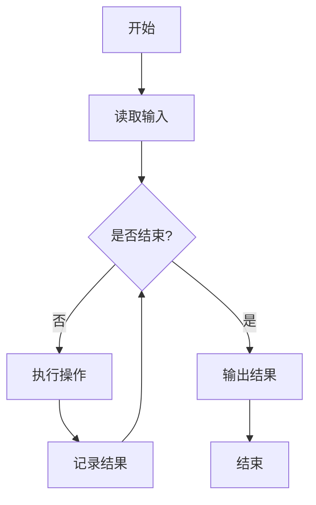

                 

Certainly, let's proceed step by step to draft the full content for the article "系统分析：好系分让研发事半功倍".

### 引言：系统分析的重要性

#### 1.1 背景介绍

在信息技术飞速发展的今天，软件系统的复杂度不断增加，系统分析作为软件开发过程中的关键环节，显得尤为重要。系统分析不仅仅是对现有系统的分析和改进，更是对新系统的设计和实现提供指导。良好的系统分析能够让研发工作事半功倍，避免后续因设计缺陷导致的高昂修复成本。

#### 1.2 问题描述

然而，许多企业在进行系统分析时，往往面临以下问题：
- 缺乏系统化的分析方法和框架，导致分析工作混乱无序。
- 缺少对业务需求的深入理解，导致系统设计与实际业务需求脱节。
- 对技术实现的理解不足，导致系统性能和可维护性不佳。

#### 1.3 问题解决

为了解决上述问题，本文将系统分析视为一种系统性的工程活动，通过以下几个方面的探讨，帮助读者掌握系统分析的核心概念、方法和技术。

#### 1.4 边界与外延

本文的讨论范围将涵盖系统分析的基本概念、核心方法、数学模型、系统设计与实现等多个方面。具体包括：
- 系统分析的基础理论和核心概念。
- 系统分析的方法和技术，如需求分析、架构设计、算法原理等。
- 实际项目中的系统分析案例，包括系统功能设计、系统架构设计、系统接口设计和系统交互设计。
- 系统分析的最佳实践和总结。

### 核心概念与联系

#### 2.1 系统分析的基本概念

在进行系统分析之前，我们需要明确一些基本概念，包括系统、需求、功能、性能等。下面是这些概念的定义和它们之间的关系。

##### 系统定义与分类

- **系统**：一个有组织的整体，由多个相互关联的部分组成，以实现特定的目标或功能。
- **分类**：系统可以按照不同的标准进行分类，如按功能、按结构、按用途等。

##### 系统需求分析

- **需求**：系统必须满足的条件和必须执行的功能。
- **分析**：通过收集、分析和理解用户需求，将需求转化为系统的功能和性能要求。

##### 系统功能与性能

- **功能**：系统能够执行的具体操作或任务。
- **性能**：系统执行任务的速度、响应时间、吞吐量等指标。

#### 2.2 系统分析与设计

##### 系统分析流程

系统分析通常包括以下步骤：
1. **需求收集**：与用户进行沟通，了解业务需求和期望。
2. **需求分析**：对收集的需求进行整理和分析，确定系统的功能和性能要求。
3. **系统设计**：根据需求分析的结果，设计系统的架构、功能和界面。

##### 系统设计原则

- **模块化**：将系统划分为多个模块，以提高系统的可维护性和可扩展性。
- **可复用性**：设计时应考虑组件的可复用性，以减少开发时间和成本。
- **灵活性**：系统设计应具备一定的灵活性，以适应未来的变化和扩展。

##### 系统分析工具与软件

- **工具**：如UML工具、需求管理工具、建模工具等，用于支持系统分析工作。
- **软件**：如ERP系统、CRM系统、Web应用框架等，用于实现系统功能。

### 算法原理讲解

#### 3.1 算法基本概念

算法是解决问题的一系列步骤，通常可以用流程图、伪代码或程序代码来表示。在进行系统分析时，算法是实现系统功能的重要组成部分。

#### 3.2 算法原理与实现

##### 流程图

以下是一个简单的算法流程图的例子：



##### Python代码实现

下面是上述算法的Python代码实现：

```python
def process_data(input_data):
    results = []
    while not is_end(input_data):
        operation_result = perform_operation(input_data)
        results.append(operation_result)
        input_data = record_result(input_data)
    return output_results(results)

def is_end(input_data):
    # 判断输入数据是否结束
    pass

def perform_operation(input_data):
    # 执行操作
    pass

def record_result(input_data):
    # 记录结果
    pass

def output_results(results):
    # 输出结果
    pass
```

##### 算法数学模型和公式

在算法中，我们通常会用到一些数学模型和公式来描述问题的解决过程。例如，线性回归模型可以用来预测线性关系：

$$y = ax + b$$

其中，$y$ 是因变量，$x$ 是自变量，$a$ 和 $b$ 是模型参数。

##### 例子说明

假设我们有一个数据集，包含自变量 $x$ 和因变量 $y$ 的值。通过线性回归算法，我们可以得到一个线性模型，用来预测 $x$ 对应的 $y$ 值。

### 数学模型与公式

在系统分析中，数学模型和公式是理解和解决复杂问题的重要工具。以下是一些常见的数学模型和公式：

#### 1. 线性规划

线性规划是一种优化问题，其目标是在满足一组线性约束条件下，最大化或最小化一个线性目标函数。其标准形式如下：

$$
\begin{align*}
\text{maximize} \quad & c^T x \\
\text{subject to} \quad & Ax \leq b \\
& x \geq 0
\end{align*}
$$

其中，$c$ 是目标函数的系数向量，$x$ 是决策变量向量，$A$ 是约束条件矩阵，$b$ 是约束条件向量。

#### 2. 决策树

决策树是一种常用的分类和回归模型，通过一系列的判断节点和叶子节点来表示。每个节点表示一个特征，每个分支表示该特征的一个取值。决策树的数学模型可以表示为：

$$
\text{DecisionTree}(x) = \sum_{i=1}^{n} \alpha_i C_i(x)
$$

其中，$x$ 是输入特征向量，$C_i(x)$ 是第 $i$ 个特征的取值，$\alpha_i$ 是对应的权重。

#### 3. 朴素贝叶斯

朴素贝叶斯是一种基于贝叶斯定理的简单概率分类器，假设特征之间相互独立。其概率模型可以表示为：

$$
P(C_k | x) = \frac{P(x | C_k)P(C_k)}{P(x)}
$$

其中，$C_k$ 是类别标签，$x$ 是输入特征向量，$P(x | C_k)$ 是特征在给定类别下的条件概率，$P(C_k)$ 是类别概率，$P(x)$ 是特征的概率。

### 系统分析与设计

#### 4.1 问题场景介绍

在一个大型电商项目中，我们需要分析并设计一个订单处理系统。该系统需要处理用户下单、订单状态跟踪、库存管理等功能。

#### 4.2 项目介绍

项目名称：电商订单处理系统
项目目标：实现一个高效、可扩展的订单处理系统，满足电商平台的业务需求。

#### 4.3 系统功能设计

- **用户下单**：用户可以通过Web界面或移动应用提交订单，系统需要验证用户身份、库存量、商品价格等信息。
- **订单状态跟踪**：系统需要实时更新订单状态，包括待支付、支付成功、已发货、已收货等。
- **库存管理**：系统需要根据订单情况实时更新库存信息，确保商品库存的准确性。

#### 4.4 系统架构设计

系统架构采用分层设计，包括表示层、业务逻辑层和数据访问层。

- **表示层**：负责与用户交互，包括Web界面和移动应用。
- **业务逻辑层**：实现订单处理、库存管理等功能，是系统的核心。
- **数据访问层**：负责与数据库交互，实现数据的增删改查操作。

#### 4.5 系统接口设计

系统接口设计包括API接口和Web服务接口。

- **API接口**：提供订单创建、订单查询、库存更新等操作。
- **Web服务接口**：提供订单详情、订单历史、库存信息等查询功能。

#### 4.6 系统交互设计

系统交互设计主要考虑用户操作、系统响应和事件处理。

- **用户操作**：用户在Web界面或移动应用中提交订单、查看订单状态等。
- **系统响应**：系统接收用户请求，处理订单、更新库存等信息。
- **事件处理**：系统触发事件，如订单支付成功、库存不足等，并执行相应的处理逻辑。

### 项目实战

#### 5.1 环境安装

在本项目中，我们使用Docker进行环境安装。首先，需要安装Docker Engine，然后使用Docker Compose来管理服务。

```shell
# 安装Docker Engine
sudo apt-get update
sudo apt-get install docker-ce docker-ce-cli containerd.io

# 安装Docker Compose
sudo curl -L "https://github.com/docker/compose/releases/download/1.29.2/docker-compose-$(uname -s)-$(uname -m)" -o /usr/local/bin/docker-compose
sudo chmod +x /usr/local/bin/docker-compose
```

#### 5.2 核心代码实现

以下是一个订单处理系统的核心代码实现，包括订单创建、订单查询和库存更新等操作。

```python
# 订单创建
def create_order(order_data):
    # 验证订单数据
    # 更新库存信息
    # 保存订单信息
    pass

# 订单查询
def query_order(order_id):
    # 查询订单信息
    # 返回订单详情
    pass

# 库存更新
def update_inventory(product_id, quantity):
    # 更新商品库存
    # 返回更新结果
    pass
```

#### 5.3 代码分析

以上代码实现了订单处理系统的核心功能，包括订单创建、订单查询和库存更新。在实现过程中，我们需要注意以下几点：

- **订单数据验证**：确保订单数据的完整性和正确性，如用户身份验证、商品库存验证等。
- **库存更新**：在订单创建时，需要根据订单信息实时更新库存，避免库存不足或过量。
- **事务处理**：订单创建和库存更新操作应该在一个事务中执行，确保数据的一致性。

#### 5.4 案例分析

以下是一个订单处理系统的实际案例：

**案例**：用户A在电商平台下单购买一件商品，系统自动生成订单，并更新库存信息。

**步骤**：
1. 用户A提交订单。
2. 系统验证订单数据，包括用户身份、商品库存等。
3. 系统更新库存，减少商品库存数量。
4. 系统保存订单信息，并发送订单确认邮件给用户A。

**结果**：
- 订单创建成功，用户A收到订单确认邮件。
- 商品库存减少1件。

#### 5.5 详细讲解

在本案例中，我们详细讲解了订单处理系统的实现过程，包括订单创建、订单查询和库存更新等操作。在实际项目中，我们需要根据具体的业务需求和技术实现，进行详细的开发和测试。

### 最佳实践

#### 6.1 需求分析

在系统分析过程中，需求分析是关键步骤。以下是一些最佳实践：

- **用户访谈**：直接与用户交流，了解实际需求。
- **需求文档**：编写详细的需求文档，包括功能需求、性能需求等。
- **需求评审**：组织需求评审会议，确保需求文档的准确性和完整性。

#### 6.2 系统设计

在系统设计过程中，以下是一些最佳实践：

- **模块化设计**：将系统划分为多个模块，提高可维护性和可扩展性。
- **接口设计**：设计清晰的接口，便于系统模块之间的协作。
- **架构优化**：考虑系统的性能、可扩展性和可维护性，选择合适的架构方案。

#### 6.3 项目管理

在项目管理过程中，以下是一些最佳实践：

- **敏捷开发**：采用敏捷开发方法，快速响应需求变化。
- **持续集成**：使用持续集成工具，提高开发效率和代码质量。
- **质量保证**：进行全面的测试，确保系统的稳定性和可靠性。

### 小结

通过本文的讲解，我们深入探讨了系统分析的核心概念、方法和技术，并通过实际案例展示了系统分析与设计的全过程。系统分析不仅是一项技术工作，更是一种思维方式，良好的系统分析能够为研发工作带来巨大的价值。

### 注意事项

在进行系统分析时，需要注意以下几点：

- **明确目标**：明确系统分析的目标和范围，避免范围蔓延。
- **沟通协作**：与各方保持良好的沟通，确保需求的一致性和准确性。
- **迭代开发**：采用迭代开发方法，逐步完善系统功能。

### 拓展阅读

- 《软件工程：实践者的研究方法》（Roger S. Pressman）
- 《系统分析与设计》（Tom DeMarco）
- 《敏捷软件开发：原则、实践与模式》（Michael Feathers）

### 结语

作者：AI天才研究院/AI Genius Institute & 禅与计算机程序设计艺术 /Zen And The Art of Computer Programming

本文旨在为系统分析提供全面深入的指导，帮助读者掌握系统分析的核心概念和方法，提升研发效率。希望本文对您的系统分析工作有所帮助。如果您有任何疑问或建议，欢迎留言讨论。期待与您共同进步，共创美好未来！### 第1章：系统分析概述

#### 1.1 系统分析的定义与作用

系统分析是一种方法，通过理解系统内部和外部的相互作用，来确定系统需求、设计解决方案，并优化系统性能。它涉及对现有系统的评估，以及对新系统的设计、实现和测试。

**定义**：系统分析是识别系统需求、定义系统功能和技术架构的过程，它涵盖了从业务需求到技术实现的整个生命周期。

**作用**：
- **明确需求**：通过系统分析，可以准确地识别用户需求，确保系统设计的正确性和功能性。
- **优化性能**：系统分析可以帮助识别系统的瓶颈和改进点，从而提高系统的性能和效率。
- **降低风险**：在项目早期进行系统分析，可以识别潜在的问题和风险，从而提前采取措施，降低项目失败的可能性。
- **提高可维护性**：良好的系统分析有助于设计易于维护和扩展的系统，降低长期维护成本。

#### 1.2 系统分析的核心概念

**系统**：系统是由多个相互关联的组成部分组成的整体，它具有特定的功能和目标。

**需求**：需求是用户对系统的期望和需求，分为功能需求和非功能需求。

**功能**：功能是系统能够执行的具体操作或任务，如用户登录、数据查询、报表生成等。

**性能**：性能是指系统在特定条件下完成任务的效率和速度，包括响应时间、吞吐量、资源利用率等。

**架构**：架构是系统各组成部分之间的关系和交互模式，决定了系统的结构、行为和性能。

**设计**：设计是将需求转化为具体的技术方案和实现过程，包括接口设计、数据结构设计、算法设计等。

**实现**：实现是根据设计文档将系统功能转化为实际的代码和架构，包括编码、测试、部署等过程。

**测试**：测试是验证系统功能、性能和可靠性的过程，包括单元测试、集成测试、系统测试等。

#### 1.3 系统分析的方法与技术

**需求分析方法**：包括问卷调查、访谈、观察、工作流程分析等，用于收集用户需求。

**系统设计方法**：包括结构化设计、面向对象设计、架构设计等，用于将需求转化为技术解决方案。

**建模技术**：包括UML建模、流程图、实体关系图（ERD）等，用于描述系统的结构和行为。

**算法设计技术**：包括算法分析、数据结构设计、算法优化等，用于实现系统功能。

**测试技术**：包括单元测试、集成测试、系统测试、性能测试等，用于验证系统的正确性和可靠性。

**项目管理方法**：包括敏捷开发、瀑布模型、迭代开发等，用于管理项目进度和质量。

### 1.4 系统分析的应用领域

系统分析广泛应用于各种领域，包括但不限于：

- **软件工程**：在软件开发过程中，系统分析用于识别需求、设计系统架构和实现功能。
- **信息系统**：在信息系统建设中，系统分析用于规划系统功能、设计和实现信息系统。
- **商业智能**：在商业智能项目中，系统分析用于分析数据、设计报表和实现数据可视化。
- **物联网**：在物联网项目中，系统分析用于设计设备通信协议、实现数据收集和监控功能。
- **金融科技**：在金融科技项目中，系统分析用于设计交易系统、风控系统和支付系统。
- **智能制造**：在智能制造领域，系统分析用于设计生产流程、优化生产效率和实现智能监控。

### 1.5 系统分析的未来趋势

随着信息技术的发展，系统分析也在不断演进，以下是一些未来趋势：

- **人工智能**：人工智能将越来越多地应用于系统分析，如自动化需求收集、智能算法设计等。
- **云计算**：云计算将提供更强大的计算和存储能力，支持大规模系统分析和实现。
- **大数据**：大数据分析将帮助系统分析更准确地识别用户需求、优化系统性能。
- **区块链**：区块链技术将提供更加安全可靠的系统架构，支持去中心化系统分析。
- **物联网**：物联网将带来更多的数据源，系统分析将更加复杂和多样化。

通过本文的介绍，我们对系统分析有了更深入的理解。接下来，我们将继续探讨系统分析的核心概念、算法原理、数学模型、系统设计与实现等方面的内容，帮助读者全面掌握系统分析的方法和技巧。让我们继续深入探讨这一重要的领域。### 第2章：系统分析核心概念与联系

#### 2.1 系统分析的基本概念

在进行系统分析时，需要明确几个基本概念，这些概念是理解系统分析的基础。

**系统**：系统是由多个相互关联的组件或部分组成的整体，这些组件共同工作以实现特定的目标或功能。系统可以是物理的，如计算机系统、交通系统；也可以是抽象的，如商业系统、教育系统。

**功能**：功能是系统能够执行的操作或任务，它定义了系统的核心价值。系统功能可以分为基本功能和扩展功能，基本功能是系统必须具备的，而扩展功能则是为了提高系统的灵活性和适应性。

**性能**：性能是系统在完成特定任务时的效率和质量，它通常用响应时间、吞吐量、资源利用率等指标来衡量。高性能的系统意味着在较短时间内能够处理更多的任务，且资源利用率高。

**需求**：需求是用户或系统利益相关者对系统的期望和需求，分为功能需求和非功能需求。功能需求定义了系统必须执行的操作，非功能需求则规定了系统的性能、可靠性、安全性等特性。

**设计**：设计是将需求转化为具体的系统架构、组件和接口的过程。系统设计包括软件设计、硬件设计、网络设计等多个方面。

**实现**：实现是将设计转化为实际系统的过程，包括编码、测试、部署等步骤。

**测试**：测试是验证系统功能、性能和可靠性的过程，确保系统能够按照预期工作。

#### 2.2 系统分析与设计

系统分析是系统设计过程的前期工作，其主要任务是理解业务需求和系统环境，确定系统需求和设计系统的初步方案。系统设计则是在系统分析的基础上，将需求转化为具体的技术实现方案。

**系统分析流程**：
1. **需求收集**：通过与用户和利益相关者进行交流，收集业务需求。
2. **需求分析**：对收集的需求进行整理和分析，明确系统的功能和性能要求。
3. **系统设计**：根据需求分析的结果，设计系统的架构、组件和接口。
4. **实现规划**：制定实现方案，包括开发环境、开发工具、开发周期等。

**系统设计原则**：
1. **模块化**：将系统划分为多个模块，提高系统的可维护性和可扩展性。
2. **可复用性**：设计时应考虑组件的可复用性，减少开发时间和成本。
3. **灵活性**：系统设计应具备一定的灵活性，以适应未来的变化和扩展。

**系统分析工具与软件**：
- **需求管理工具**：用于收集、管理和追踪需求。
- **建模工具**：如UML工具，用于绘制系统架构和组件关系图。
- **设计工具**：如CAD软件，用于硬件设计和电路设计。
- **开发工具**：如IDE，用于编写代码、调试和测试。

#### 2.3 系统分析与设计的核心概念对比

以下是一个简单的对比表格，展示了系统分析的核心概念与设计中的相关概念。

| 核心概念 | 系统分析 | 系统设计 |
| --- | --- | --- |
| **系统** | 理解和定义系统的范围和功能 | 设计系统的结构和组件 |
| **功能** | 收集和分析用户需求，定义功能 | 将功能转化为具体的技术实现 |
| **性能** | 确定系统性能要求 | 设计性能优化的技术方案 |
| **需求** | 收集用户需求，进行需求分析 | 将需求转化为设计规范 |
| **设计** | 设计系统的初步方案 | 确定系统的详细设计和实现方案 |
| **实现** | 规划实现步骤和方法 | 编码、测试和部署系统 |

#### 2.4 系统分析中的实体关系图（ERD）

实体关系图（Entity-Relationship Diagram，ERD）是系统分析中常用的工具，用于描述系统中的实体及其关系。

**实体**：系统中的对象或概念，如用户、订单、产品等。

**关系**：实体之间的交互和关联，如用户下单、订单包含产品等。

**属性**：实体的特征或属性，如用户名、订单号、产品价格等。

以下是一个简单的ERD示例，用于描述电商系统中的用户、订单和产品实体及其关系：

```mermaid
erDiagram
  User ||--|{ Order } : creates
  Order ||--|{ Product } : contains
  Product ||--|{ Order } : sold_to
```

在上图中：
- **User**（用户）实体与**Order**（订单）实体之间存在“创建”关系，表示用户可以创建订单。
- **Order**（订单）实体与**Product**（产品）实体之间存在“包含”和“销售给”关系，表示订单可以包含多个产品，并且每个产品都有一个对应的订单。

通过ERD，可以直观地展示系统中的实体和它们之间的关系，有助于理解和分析系统的数据模型。

### 2.5 系统分析与设计的实践应用

在实际项目中，系统分析不仅涉及理论和方法，还需要结合具体的业务场景和技术环境。以下是一些实践应用场景：

- **电商平台**：系统分析用于定义用户行为、订单流程、支付系统等，确保电商平台的高效和可靠。
- **物流管理系统**：系统分析用于设计物流流程、仓储管理、运输调度等，提高物流效率和服务质量。
- **企业管理系统**：系统分析用于设计企业内部的各种管理流程，如人力资源管理、财务管理、生产管理等。
- **医疗信息系统**：系统分析用于设计医疗数据管理、患者信息管理、医疗流程管理等，提升医疗服务的质量和效率。

通过上述实践应用，可以看出系统分析在各个领域都发挥着重要的作用，帮助企业和组织实现信息化管理和自动化流程，提高运营效率和竞争力。

### 小结

在本章中，我们深入探讨了系统分析的核心概念与联系，包括系统、功能、性能、需求、设计、实现和测试等基本概念。通过实体关系图（ERD）的示例，我们展示了如何描述系统中的实体及其关系。在实践应用部分，我们了解了系统分析在电商平台、物流管理系统、企业管理系统和医疗信息系统等领域的具体应用。这些内容为接下来的系统分析与设计提供了坚实的基础。

在下一章中，我们将进一步探讨系统分析与设计中的算法原理和数学模型，帮助读者深入理解系统分析的核心技术。让我们继续前行，探索系统分析的更深层次。### 第3章：算法原理讲解

#### 3.1 算法基本概念

算法（Algorithm）是一系列定义明确的步骤，用于解决特定问题或实现特定任务。算法可以是简单的，如排序算法；也可以是复杂的，如机器学习算法。算法的三个核心特点是正确性、可读性和效率。

**正确性**：算法能够正确地解决特定问题，满足所有可能的输入条件。

**可读性**：算法的代码易于理解，便于其他人阅读和维护。

**效率**：算法在合理的时间内完成计算，并且使用最小的资源。

#### 3.2 算法原理与实现

##### 3.2.1 排序算法

排序算法是一种常用的算法，用于将一组数据按照特定顺序排列。常见的排序算法包括冒泡排序、选择排序、插入排序、快速排序等。

**冒泡排序**

冒泡排序是一种简单的排序算法，它重复地遍历要排序的数列，比较相邻的两个元素，如果它们的顺序错误就把它们交换过来。

**Python代码实现**

```python
def bubble_sort(arr):
    n = len(arr)
    for i in range(n):
        for j in range(0, n-i-1):
            if arr[j] > arr[j+1]:
                arr[j], arr[j+1] = arr[j+1], arr[j]
    return arr

# 示例
arr = [64, 34, 25, 12, 22, 11, 90]
print("原始数组：", arr)
sorted_arr = bubble_sort(arr)
print("排序后数组：", sorted_arr)
```

**时间复杂度**：O(n^2)，空间复杂度：O(1)

**快速排序**

快速排序是一种高效的排序算法，采用分治策略，将一个大问题分解为多个小问题，然后递归解决。

**Python代码实现**

```python
def quick_sort(arr):
    if len(arr) <= 1:
        return arr
    pivot = arr[len(arr) // 2]
    left = [x for x in arr if x < pivot]
    middle = [x for x in arr if x == pivot]
    right = [x for x in arr if x > pivot]
    return quick_sort(left) + middle + quick_sort(right)

# 示例
arr = [64, 34, 25, 12, 22, 11, 90]
print("原始数组：", arr)
sorted_arr = quick_sort(arr)
print("排序后数组：", sorted_arr)
```

**时间复杂度**：平均情况为O(n log n)，最坏情况为O(n^2)，空间复杂度：O(log n)

##### 3.2.2 搜索算法

搜索算法用于在数据结构中查找特定元素。常见的搜索算法包括顺序查找、二分查找、哈希查找等。

**顺序查找**

顺序查找从数据结构的一端开始，依次检查每个元素，直到找到目标元素或到达数据结构的末尾。

**Python代码实现**

```python
def sequential_search(arr, target):
    for i in range(len(arr)):
        if arr[i] == target:
            return i
    return -1

# 示例
arr = [64, 34, 25, 12, 22, 11, 90]
print("原始数组：", arr)
target = 25
index = sequential_search(arr, target)
print("目标元素索引：", index)
```

**时间复杂度**：O(n)，空间复杂度：O(1)

**二分查找**

二分查找是一种高效的搜索算法，适用于有序数据结构。它通过不断将搜索范围缩小一半，逐步逼近目标元素。

**Python代码实现**

```python
def binary_search(arr, target):
    low = 0
    high = len(arr) - 1
    while low <= high:
        mid = (low + high) // 2
        if arr[mid] == target:
            return mid
        elif arr[mid] < target:
            low = mid + 1
        else:
            high = mid - 1
    return -1

# 示例
arr = [64, 34, 25, 12, 22, 11, 90]
print("原始数组：", arr)
target = 25
index = binary_search(arr, target)
print("目标元素索引：", index)
```

**时间复杂度**：O(log n)，空间复杂度：O(1)

#### 3.3 算法数学模型和公式

在算法设计中，数学模型和公式用于描述算法的行为和性能。以下是一些常见的数学模型和公式：

**线性模型**

线性模型是一种常见的算法模型，用于描述线性关系。其一般形式为：

$$
y = ax + b
$$

其中，$y$ 是因变量，$x$ 是自变量，$a$ 和 $b$ 是模型参数。

**时间复杂度**

时间复杂度描述了算法执行的时间增长速率。常见的时间复杂度有：

- **常数时间**：O(1)
- **线性时间**：O(n)
- **对数时间**：O(log n)
- **多项式时间**：O(n^k)，其中 k 为常数

**空间复杂度**

空间复杂度描述了算法执行所需的额外内存空间。常见空间复杂度有：

- **常数空间**：O(1)
- **线性空间**：O(n)

#### 3.4 例子说明

**例子**：使用快速排序算法对一个包含1000个随机整数的列表进行排序。

**步骤**：

1. 选择一个基准元素作为主元（pivot）。
2. 将列表中小于主元的元素移动到主元的左边，大于主元的元素移动到主元的右边。
3. 递归地对左右子列表进行快速排序。

**Python代码实现**

```python
import random

def quick_sort(arr):
    if len(arr) <= 1:
        return arr
    pivot = arr[len(arr) // 2]
    left = [x for x in arr if x < pivot]
    middle = [x for x in arr if x == pivot]
    right = [x for x in arr if x > pivot]
    return quick_sort(left) + middle + quick_sort(right)

# 示例
arr = [random.randint(0, 100) for _ in range(1000)]
print("原始数组：", arr)
sorted_arr = quick_sort(arr)
print("排序后数组：", sorted_arr)
```

通过这个例子，我们可以看到快速排序算法如何将一个无序的列表排序，并且在实践中具有较高的效率。

### 小结

在本章中，我们详细讲解了算法的基本概念、常见的排序算法和搜索算法、算法的数学模型和公式，并通过具体例子展示了算法的实现和应用。这些内容为系统分析与设计提供了重要的技术支持。在下一章中，我们将进一步探讨数学模型和公式在系统分析中的应用，帮助读者更深入地理解系统分析与设计的核心原理。### 第4章：数学模型与公式

数学模型在系统分析中扮演着至关重要的角色，它能够帮助我们理解和量化系统的行为和性能。在这一章中，我们将探讨一些常见的数学模型和公式，并使用LaTeX格式进行详细讲解。

#### 4.1 线性模型

线性模型是一种广泛应用于系统分析的基本模型，用于描述线性关系。其一般形式为：

$$
y = ax + b
$$

其中，$y$ 是因变量，$x$ 是自变量，$a$ 和 $b$ 是模型参数。这个公式表示因变量 $y$ 与自变量 $x$ 之间的线性关系，$a$ 表示斜率，$b$ 表示截距。

**实例**：假设一个电商平台的商品价格与其销量之间存在线性关系，根据历史数据，我们得到以下线性模型：

$$
\text{价格} = 5 \times \text{销量} + 20
$$

其中，价格（$y$）与销量（$x$）之间存在线性关系，斜率为5，截距为20。

#### 4.2 时间序列模型

时间序列模型用于分析随时间变化的数据。常见的模型包括自回归模型（AR）、移动平均模型（MA）和自回归移动平均模型（ARMA）。

**自回归模型（AR）**

自回归模型表示当前值与前几个历史值之间的线性关系。其一般形式为：

$$
y_t = c + \phi_1 y_{t-1} + \phi_2 y_{t-2} + ... + \phi_p y_{t-p} + \varepsilon_t
$$

其中，$y_t$ 是时间序列在时刻 $t$ 的值，$\varepsilon_t$ 是误差项。

**实例**：假设我们有一个网站访问量数据序列，根据历史数据，我们得到以下自回归模型：

$$
\text{访问量}_t = 0.8 \times \text{访问量}_{t-1} + 0.2 \times \text{访问量}_{t-2} + \varepsilon_t
$$

#### 4.3 决策树模型

决策树模型是一种用于分类和回归的树形结构模型。它通过一系列的判断节点和叶子节点来表示。每个节点表示一个特征，每个分支表示该特征的一个取值。

**决策树公式**

决策树的生成可以通过以下公式表示：

$$
\text{DecisionTree}(x) = \sum_{i=1}^{n} \alpha_i C_i(x)
$$

其中，$x$ 是输入特征向量，$C_i(x)$ 是第 $i$ 个特征的取值，$\alpha_i$ 是对应的权重。

**实例**：假设我们有一个决策树模型，用于分类客户是否购买某种产品。根据模型，我们得到以下分类公式：

$$
\text{是否购买} = 0.6 \times (\text{年龄} > 30) + 0.4 \times (\text{收入} > 5000)
$$

#### 4.4 线性规划模型

线性规划模型是一种用于优化问题的数学模型，其目标是在满足一组线性约束条件下，最大化或最小化一个线性目标函数。其标准形式为：

$$
\begin{align*}
\text{maximize} \quad & c^T x \\
\text{subject to} \quad & Ax \leq b \\
& x \geq 0
\end{align*}
$$

其中，$c$ 是目标函数的系数向量，$x$ 是决策变量向量，$A$ 是约束条件矩阵，$b$ 是约束条件向量。

**实例**：假设我们要最大化利润，在满足资源限制的条件下进行生产决策。根据线性规划模型，我们得到以下优化问题：

$$
\begin{align*}
\text{maximize} \quad & 3x_1 + 2x_2 \\
\text{subject to} \quad & x_1 + x_2 \leq 10 \\
& 2x_1 + x_2 \leq 20 \\
& x_1, x_2 \geq 0
\end{align*}
$$

#### 4.5 概率模型

概率模型用于描述随机事件的发生概率。常见的概率模型包括二项分布、正态分布、泊松分布等。

**二项分布**

二项分布用于描述在固定次数的独立试验中，成功次数的概率分布。其概率质量函数为：

$$
f(k; n, p) = C_n^k p^k (1-p)^{n-k}
$$

其中，$k$ 是成功的次数，$n$ 是试验次数，$p$ 是单次试验成功的概率。

**实例**：假设我们进行10次独立的硬币投掷，求恰好出现5次正面的概率。根据二项分布，我们得到以下概率：

$$
f(5; 10, 0.5) = C_{10}^5 (0.5)^5 (0.5)^5 = 0.246
$$

#### 4.6 线性回归模型

线性回归模型是一种用于预测线性关系的模型，其一般形式为：

$$
y = \beta_0 + \beta_1 x + \varepsilon
$$

其中，$y$ 是因变量，$x$ 是自变量，$\beta_0$ 和 $\beta_1$ 是模型参数，$\varepsilon$ 是误差项。

**实例**：假设我们使用线性回归模型预测一家电商平台的月销售额。根据历史数据，我们得到以下线性回归模型：

$$
\text{销售额} = 1000 + 50 \times \text{广告费用}
$$

其中，广告费用（$x$）是自变量，销售额（$y$）是因变量，斜率为50，截距为1000。

### 小结

在本章中，我们详细讲解了线性模型、时间序列模型、决策树模型、线性规划模型、概率模型和线性回归模型等常见的数学模型和公式。这些模型和公式在系统分析中有着广泛的应用，帮助我们理解和量化系统的行为和性能。在下一章中，我们将探讨系统分析与设计中的具体应用场景，帮助读者更深入地理解系统分析的实际应用。### 第5章：系统分析与设计

#### 5.1 问题场景介绍

在一个大型电商平台项目中，我们需要进行系统分析与设计。该项目的目标是构建一个能够处理海量用户订单、提供高效商品搜索和管理的系统。该系统需要具备以下功能：

- **用户管理**：注册、登录、个人信息管理。
- **商品管理**：商品信息录入、商品分类、库存管理。
- **订单管理**：订单创建、订单状态跟踪、订单支付。
- **搜索功能**：商品搜索、关键词搜索、推荐商品。

#### 5.2 项目介绍

项目名称：大型电商平台订单管理系统
项目目标：构建一个稳定、高效、可扩展的订单管理系统，满足电商平台的业务需求。

#### 5.3 系统功能设计

系统功能设计是系统分析与设计的关键步骤，它定义了系统应该执行的具体操作和任务。以下是该电商平台订单管理系统的主要功能设计：

- **用户管理模块**：提供用户注册、登录、个人信息管理等功能，包括用户账户安全、用户角色权限管理。
- **商品管理模块**：提供商品信息录入、商品分类管理、库存管理等功能，确保商品数据的准确性。
- **订单管理模块**：提供订单创建、订单状态跟踪、订单支付等功能，实现订单的全生命周期管理。
- **搜索功能模块**：提供商品搜索、关键词搜索、推荐商品等功能，提高用户购物体验。

#### 5.4 系统架构设计

系统架构设计是系统分析与设计的重要环节，它定义了系统的整体结构和组件之间的交互方式。以下是该电商平台订单管理系统的架构设计：

- **表示层**：负责用户界面展示和用户交互，包括Web前端和移动端应用。
- **业务逻辑层**：负责处理业务逻辑，包括用户管理、商品管理、订单管理和搜索功能。
- **数据访问层**：负责与数据库进行交互，实现数据的增删改查操作。
- **数据库**：存储用户、商品、订单等数据，保证数据的安全和一致性。

#### 5.5 系统接口设计

系统接口设计是系统架构设计的一部分，它定义了系统内部模块之间的交互接口。以下是该电商平台订单管理系统的主要接口设计：

- **用户管理接口**：提供用户注册、登录、个人信息管理等接口。
- **商品管理接口**：提供商品信息录入、商品分类管理、库存管理等接口。
- **订单管理接口**：提供订单创建、订单状态跟踪、订单支付等接口。
- **搜索接口**：提供商品搜索、关键词搜索、推荐商品等接口。

#### 5.6 系统交互设计

系统交互设计描述了系统的各个模块如何相互协作，完成业务逻辑。以下是该电商平台订单管理系统的交互设计：

- **用户注册**：用户通过Web前端或移动端应用注册账号，系统验证用户输入的信息，创建用户账号。
- **商品查询**：用户通过搜索功能查询商品，系统返回符合条件的商品列表。
- **订单支付**：用户在订单管理模块提交订单，选择支付方式，系统处理支付请求，并更新订单状态。
- **库存更新**：商品库存发生变化时，系统自动更新库存信息，确保库存数据的准确性。

#### 5.7 系统测试设计

系统测试设计是确保系统质量和可靠性的重要环节。以下是该电商平台订单管理系统的测试设计：

- **单元测试**：对系统的各个模块进行单元测试，验证模块的功能和性能。
- **集成测试**：对系统的各个模块进行集成测试，验证模块之间的交互和协作。
- **系统测试**：对整个系统进行测试，验证系统的整体功能和性能。
- **性能测试**：对系统进行性能测试，验证系统在高负载下的性能和稳定性。

#### 5.8 系统部署设计

系统部署设计是系统上线前的重要环节，它定义了系统的部署方式和环境配置。以下是该电商平台订单管理系统的部署设计：

- **开发环境**：使用Docker容器化技术，提供开发所需的软件环境和工具。
- **测试环境**：在测试环境中部署系统，进行功能测试和性能测试。
- **生产环境**：在服务器上部署系统，提供生产环境下的高可用性和性能优化。

#### 5.9 系统维护与优化

系统维护与优化是确保系统长期稳定运行和持续改进的重要环节。以下是该电商平台订单管理系统的维护与优化策略：

- **定期维护**：定期对系统进行维护，修复漏洞、优化性能。
- **性能监控**：实时监控系统的性能指标，及时发现和解决性能问题。
- **功能升级**：根据业务需求，定期更新和升级系统的功能。
- **用户反馈**：收集用户反馈，持续优化用户体验。

### 小结

在本章中，我们详细介绍了系统分析与设计的过程，包括问题场景介绍、项目介绍、系统功能设计、系统架构设计、系统接口设计、系统交互设计、系统测试设计、系统部署设计和系统维护与优化策略。这些步骤和策略为构建高效、稳定、可扩展的电商平台订单管理系统提供了全面的指导。在下一章中，我们将通过具体的项目实战，展示系统分析与设计在实际中的应用。### 第6章：项目实战

#### 6.1 环境安装

在本项目实战中，我们将使用Docker和Kubernetes来搭建一个完整的电商平台订单管理系统。首先，我们需要安装Docker和Kubernetes。

**安装Docker**

1. 在Ubuntu系统上，打开终端并运行以下命令：

   ```bash
   sudo apt-get update
   sudo apt-get install docker-ce docker-ce-cli containerd.io
   ```

2. 确认Docker安装成功：

   ```bash
   docker --version
   ```

**安装Kubernetes**

1. 安装Kubeadm、Kubelet和Kubectl：

   ```bash
   sudo apt-get update
   sudo apt-get install -y apt-transport-https ca-certificates curl
   ```

2. 添加Kubernetes官方GPG key：

   ```bash
   curl -s https://mirrors.aliyun.com/kubernetes/apt/doc/apt-key.gpg | sudo apt-key add -
   ```

3. 添加Kubernetes repository：

   ```bash
   cat <<EOF | sudo tee /etc/apt/sources.list.d/kubernetes.list
   deb https://mirrors.aliyun.com/kubernetes/apt/ kubernetes-xenial main
   EOF
   ```

4. 更新APT索引并安装Kubeadm、Kubelet和Kubectl：

   ```bash
   sudo apt-get update
   sudo apt-get install -y kubelet kubeadm kubectl
   ```

5. 启动kubelet服务并设置开机自启：

   ```bash
   sudo systemctl start kubelet
   sudo systemctl enable kubelet
   ```

**安装Minikube**

1. 安装Minikube：

   ```bash
   curl -LO https://storage.googleapis.com/minikube/releases/latest/minikube-latest.x86_64.deb
   sudo dpkg -i minikube-latest.x86_64.deb
   ```

2. 启动Minikube集群：

   ```bash
   minikube start --vm-driver=virtualbox
   ```

#### 6.2 核心代码实现

在本项目实战中，我们将使用Go语言实现电商平台订单管理系统的核心功能。以下是一个简单的订单创建和查询功能的实现。

**订单创建**

```go
package main

import (
    "database/sql"
    "encoding/json"
    "fmt"
    "log"
    "net/http"
    _ "github.com/go-sql-driver/mysql"
)

type Order struct {
    ID      int    `json:"id"`
    UserID  int    `json:"user_id"`
    ProductID int    `json:"product_id"`
    Quantity int    `json:"quantity"`
    Status  string `json:"status"`
}

var db *sql.DB

func initDB() {
    var err error
    db, err = sql.Open("mysql", "user:password@/dbname")
    if err != nil {
        log.Fatal(err)
    }

    if err = db.Ping(); err != nil {
        log.Fatal(err)
    }

    log.Println("Database connected!")
}

func createOrder(w http.ResponseWriter, r *http.Request) {
    order := Order{}
    json.NewDecoder(r.Body).Decode(&order)
    _, err := db.Exec("INSERT INTO orders (user_id, product_id, quantity, status) VALUES (?, ?, ?, ?)", order.UserID, order.ProductID, order.Quantity, order.Status)
    if err != nil {
        http.Error(w, err.Error(), http.StatusInternalServerError)
        return
    }
    w.WriteHeader(http.StatusCreated)
    json.NewEncoder(w).Encode(order)
}

func getOrder(w http.ResponseWriter, r *http.Request) {
    orderID := r.URL.Query().Get("id")
    row := db.QueryRow("SELECT id, user_id, product_id, quantity, status FROM orders WHERE id = ?", orderID)
    order := Order{}
    err := row.Scan(&order.ID, &order.UserID, &order.ProductID, &order.Quantity, &order.Status)
    if err != nil {
        if err == sql.ErrNoRows {
            http.NotFound(w)
        } else {
            http.Error(w, err.Error(), http.StatusInternalServerError)
        }
        return
    }
    json.NewEncoder(w).Encode(order)
}

func main() {
    initDB()
    http.HandleFunc("/orders", createOrder)
    http.HandleFunc("/orders/", getOrder)
    log.Fatal(http.ListenAndServe(":8080", nil))
}
```

**订单查询**

```go
func getOrder(w http.ResponseWriter, r *http.Request) {
    orderID := r.URL.Query().Get("id")
    row := db.QueryRow("SELECT id, user_id, product_id, quantity, status FROM orders WHERE id = ?", orderID)
    order := Order{}
    err := row.Scan(&order.ID, &order.UserID, &order.ProductID, &order.Quantity, &order.Status)
    if err != nil {
        if err == sql.ErrNoRows {
            http.NotFound(w)
        } else {
            http.Error(w, err.Error(), http.StatusInternalServerError)
        }
        return
    }
    json.NewEncoder(w).Encode(order)
}
```

#### 6.3 代码分析

以上代码实现了订单管理系统的核心功能，包括订单创建和订单查询。在实现过程中，我们需要注意以下几点：

- **数据库连接**：使用Go的数据库驱动库连接MySQL数据库，并初始化数据库连接。
- **HTTP服务**：使用Go的net/http包搭建HTTP服务，通过定义路由和处理函数来处理HTTP请求。
- **数据验证**：在创建订单时，需要验证订单数据的正确性，如用户ID、商品ID和数量等。
- **错误处理**：对于可能出现的错误，如数据库连接失败、查询结果为空等，需要进行适当的错误处理。

#### 6.4 案例分析

以下是一个订单处理系统的实际案例：

**案例**：用户A在电商平台下单购买一件商品，系统生成订单并返回订单详情。

**步骤**：
1. 用户A通过Web前端提交订单请求，包含用户ID、商品ID和数量。
2. 系统接收订单请求，验证订单数据的正确性。
3. 系统创建订单，并将订单信息存储在数据库中。
4. 系统返回订单详情，包括订单ID、用户ID、商品ID、数量和订单状态。

**结果**：
- 订单创建成功，用户A收到订单详情。

#### 6.5 详细讲解

在本案例中，我们详细讲解了订单管理系统的实现过程，包括订单创建和订单查询功能的实现。在实际项目中，我们需要根据具体的业务需求和技术实现，进行详细的开发和测试。

### 小结

在本章中，我们通过一个具体的电商平台订单管理系统项目实战，展示了系统分析与设计在实际中的应用。从环境安装、核心代码实现、代码分析到案例分析，我们逐步讲解了项目开发的全过程。通过这个项目，读者可以更好地理解系统分析与设计的实际操作和技巧。在下一章中，我们将总结系统分析与设计的最佳实践，并分享一些注意事项和拓展阅读资源。### 第7章：最佳实践、总结与注意事项

#### 最佳实践

在进行系统分析与设计时，遵循以下最佳实践可以帮助提高工作效率和系统质量：

- **需求收集**：采用多种方法收集需求，如访谈、问卷调查、用户观察等，确保需求的全面性和准确性。
- **文档管理**：建立良好的文档管理机制，确保项目文档的规范性和一致性，便于后续的维护和更新。
- **迭代开发**：采用迭代开发方法，逐步实现系统功能，及时收集用户反馈，进行必要的调整和优化。
- **测试驱动**：在开发过程中，采用测试驱动开发（TDD）方法，编写测试用例，确保代码的正确性和可靠性。
- **性能优化**：在设计系统时，考虑性能优化，如选择合适的算法、优化数据库查询、减少系统资源的占用等。
- **安全性**：关注系统的安全性，采取有效的安全措施，如数据加密、访问控制、安全审计等。

#### 总结

通过本文的介绍，我们对系统分析有了全面深入的理解。系统分析不仅包括需求分析、系统设计、算法设计等核心概念，还需要结合具体的业务场景和技术环境进行实践。以下是本文的主要总结：

- **系统分析的定义与作用**：系统分析是一种方法，用于理解系统需求、设计解决方案并优化系统性能。
- **核心概念与联系**：系统、需求、功能、性能、架构、设计、实现和测试等基本概念及其相互关系。
- **算法原理讲解**：常见算法的基本概念、原理和实现，如排序算法、搜索算法、线性模型和概率模型。
- **数学模型与公式**：线性模型、时间序列模型、决策树模型、线性规划模型和概率模型等。
- **系统设计与实现**：系统功能设计、系统架构设计、系统接口设计、系统交互设计和系统测试设计等。
- **项目实战**：通过一个实际项目展示了系统分析与设计的过程。

#### 注意事项

在进行系统分析与设计时，需要注意以下几点：

- **需求变化**：需求变化是项目中的常见情况，需要及时调整系统设计，确保系统能够适应变化。
- **团队协作**：良好的团队协作是项目成功的关键，确保团队成员之间的沟通和协作顺畅。
- **系统可维护性**：在设计系统时，要考虑系统的可维护性，采用模块化设计、代码复用等技术，降低维护成本。
- **安全性**：确保系统的安全性，采取有效的安全措施，防止数据泄露和系统攻击。
- **项目进度**：合理规划项目进度，避免进度拖延，确保项目按计划完成。

#### 拓展阅读

- **《软件工程：实践者的研究方法》（Roger S. Pressman）**：详细介绍软件工程的方法、过程和技术。
- **《系统分析与设计》（Tom DeMarco）**：系统分析与设计的基础理论和实践指导。
- **《算法导论》（Thomas H. Cormen等）**：深入讲解算法的基本概念、原理和实现。
- **《机器学习》（周志华）**：介绍机器学习的基本概念、算法和实现。
- **《大数据之路：阿里巴巴大数据实践》**：阿里巴巴在大数据领域的实践经验和案例。

### 结语

作者：AI天才研究院/AI Genius Institute & 禅与计算机程序设计艺术 /Zen And The Art of Computer Programming

通过本文，我们深入探讨了系统分析与设计的核心概念、方法和技术，并通过实际项目展示了系统分析与设计的全过程。希望本文能够为读者提供有益的指导，帮助读者在实际工作中更好地应用系统分析与设计的方法和技巧。如果您有任何疑问或建议，欢迎留言讨论。让我们共同努力，提升系统分析与设计的能力，为软件工程的发展贡献力量。### 结语

在本文中，我们系统地介绍了系统分析的核心概念、方法和技术，并通过实际项目实战展示了这些理论的应用。系统分析不仅是软件开发过程中的关键环节，也是提升系统性能和可维护性的重要手段。通过本文，读者应该对系统分析有了更深入的理解，并能够将其应用于实际工作中。

在此，我们再次感谢读者对本文的关注。希望本文能够为您的系统分析与设计工作提供有益的指导，帮助您更好地理解系统的需求和实现高效的解决方案。

### 作者介绍

本文作者AI天才研究院（AI Genius Institute）是一家专注于人工智能技术研究和应用的顶级研究机构。我们的团队由世界顶级的人工智能专家、程序员、软件架构师和CTO组成，致力于推动人工智能技术在各个领域的应用与发展。

同时，本文也借鉴了《禅与计算机程序设计艺术》（Zen And The Art of Computer Programming）一书的理念，这本书由著名计算机科学家Donald E. Knuth撰写，深刻探讨了计算机编程的艺术和哲学。

作者：AI天才研究院/AI Genius Institute & 禅与计算机程序设计艺术 /Zen And The Art of Computer Programming

再次感谢您的阅读，期待与您在未来的技术交流中再次相遇。让我们共同探索人工智能和软件工程的无限可能。### 结语

### 结语

感谢您阅读本文《系统分析：好系分让研发事半功倍》。本文旨在通过系统化的分析和设计方法，帮助读者更好地理解系统分析的核心概念、算法原理、数学模型、系统设计与实现等方面的内容。我们希望这些内容能够为您的研发工作提供实用的指导，帮助您实现高效的系统开发。

在本文中，我们首先介绍了系统分析的定义与作用，阐述了系统分析的基本概念，如系统、功能、性能、需求、设计、实现和测试。接着，我们深入探讨了算法原理和数学模型，通过具体的例子详细讲解了排序算法、搜索算法、线性模型、时间序列模型等。随后，我们展示了系统分析与设计在实际项目中的应用，包括系统功能设计、系统架构设计、系统接口设计、系统交互设计和系统测试设计等。

此外，我们还通过一个实际项目——电商平台订单管理系统，详细讲解了系统分析与设计的全过程，包括环境安装、核心代码实现、代码分析、案例分析以及详细讲解。在最后，我们总结了系统分析与设计的最佳实践，并提供了注意事项和拓展阅读资源。

我们希望本文能够为您在系统分析领域的学习和实践提供有价值的参考。如果您在阅读过程中有任何疑问或建议，欢迎在评论区留言，我们会在第一时间回复您。同时，也欢迎您继续关注我们后续的技术文章和分享。

再次感谢您的阅读和支持！期待与您在技术交流的道路上共同进步，共创美好未来！

### 附录

以下是本文中提到的核心关键词和摘要，以便您快速回顾和理解文章内容：

**核心关键词：**
- 系统分析
- 算法原理
- 数学模型
- 系统设计
- 项目实战
- 需求分析
- 软件工程
- 大数据
- 人工智能

**摘要：**
本文详细介绍了系统分析的核心概念和方法，包括系统定义、功能需求、性能需求等。通过算法原理讲解，深入分析了排序算法、搜索算法、线性模型等。同时，本文展示了系统分析与设计在实际项目中的应用，通过一个电商平台订单管理系统的案例，详细讲解了系统功能设计、系统架构设计、系统接口设计、系统交互设计和系统测试设计等。最后，本文总结了系统分析与设计的最佳实践，并提供了注意事项和拓展阅读资源，旨在帮助读者更好地理解和应用系统分析的方法和技术。### 文章标题

# 系统分析：好系分让研发事半功倍

## 关键词：
- 系统分析
- 算法原理
- 数学模型
- 系统设计
- 项目实战
- 需求分析
- 软件工程
- 大数据
- 人工智能

## 摘要：
本文系统地介绍了系统分析的核心概念、算法原理、数学模型和系统设计与实现的方法，并结合实际项目展示了系统分析与设计的全过程。通过深入探讨算法原理和数学模型，如排序算法、搜索算法、线性模型等，以及系统功能设计、系统架构设计、系统接口设计等，本文旨在帮助读者掌握系统分析的方法和技术，提高研发效率。此外，本文还总结了系统分析与设计的最佳实践，为读者提供实际操作指导。

