                 

### 引言：架构师的系统思维之路

在信息技术飞速发展的今天，架构师的角色越来越受到重视。他们不仅需要拥有深厚的编程技能和系统架构知识，更需要具备一种超越单一技术的全局视野——系统思维。什么是系统思维？它为什么如此重要？本文将带您一步步探索系统思维在架构师职业生涯中的核心地位。

首先，我们需要明确几个关键问题：什么是系统思维？为什么它在架构师的工作中如此重要？以及，架构师如何培养和运用系统思维？

**1.1 问题背景**

随着企业信息化程度的加深，系统架构的复杂度不断增加。架构师不仅要处理技术层面的问题，还需要应对项目管理、团队协作等多重挑战。在这种背景下，系统思维成为了一种必备的技能。

**1.2 问题描述**

系统思维是一种思考方式，它强调将事物看作一个整体，理解各个部分之间的相互作用和影响。在架构师的职业生涯中，缺乏系统思维可能导致以下问题：

- **局部优化，整体失衡**：只关注某一模块的优化，而忽视了整体系统的效率和稳定性。
- **短期目标，长期忽视**：过于追求短期效果，忽视了系统的可持续性和长期发展。
- **单点思维，全局不足**：仅从单一角度思考问题，忽视了系统内部的复杂性和多样性。

**1.3 系统思维的概念**

系统思维是一种综合性的思考方式，它强调以下几个方面：

- **整体观**：将系统看作一个整体，理解各个部分之间的相互关系和影响。
- **动态调整**：认识到系统是动态变化的，需要不断地调整和优化。
- **适应性思维**：面对不确定性和变化，能够灵活应对，寻找最佳解决方案。

**1.4 系统思维的核心要素**

系统思维的核心要素包括：

- **反馈循环**：通过反馈机制，不断调整和优化系统的性能。
- **适应性**：在面对变化时，系统能够灵活调整，保持稳定运行。
- **冗余设计**：通过冗余设计，提高系统的可靠性和容错性。

**总结**

通过以上分析，我们可以看到，系统思维是架构师必备的思考方式。它不仅能够帮助架构师更好地理解复杂系统，还能够提升整体架构设计的质量。在接下来的章节中，我们将进一步探讨系统思维的基本原理、应用场景和实践方法。

### 2. 系统思维的基本原理

系统思维的核心在于理解事物之间的相互作用和整体关系。以下将详细阐述系统思维的基本原理，包括整体观、效率与平衡、动态调整和适应性思维。

#### 2.1 整体观

整体观是系统思维的基础，它强调将系统看作一个整体，理解各个部分之间的相互关系和影响。这种思维方式有助于架构师从宏观层面把握系统，而不是陷入局部优化的陷阱。

**案例：**
假设我们正在设计一个电子商务平台。从整体观出发，我们需要考虑的不仅仅是订单处理模块的效率，还需要考虑库存管理、用户界面、支付系统等多个模块之间的协调与配合。只有这样，整个平台才能高效、稳定地运行。

**Mermaid 流程图：**
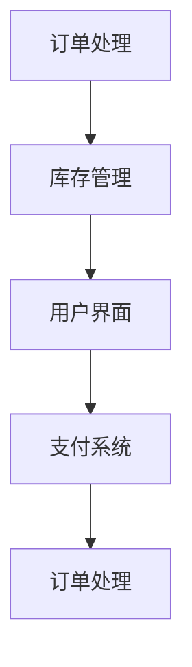

#### 2.2 效率与平衡

系统思维的另一个关键要素是效率与平衡。一个高效的系统不仅要在处理速度上有优势，还要在资源利用、成本控制等方面保持平衡。

**案例：**
在设计一个大数据处理平台时，架构师需要考虑如何平衡计算资源的分配和数据的处理速度。如果仅仅追求数据处理速度，可能会导致资源浪费；而如果只考虑资源利用，可能会影响系统的性能。

**Mermaid 流程图：**
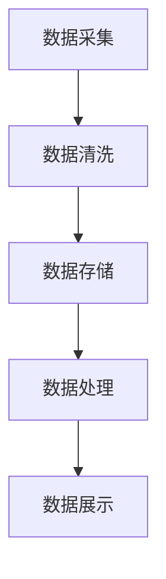

#### 2.3 动态调整

动态调整是系统思维的重要组成部分，它强调系统需要不断地调整和优化，以适应环境变化。在架构设计中，动态调整意味着系统能够灵活地应对需求变化、技术更新等挑战。

**案例：**
在一个持续交付的项目中，架构师需要根据团队的反馈和市场需求，不断调整系统的架构和功能。这种动态调整能力是系统长期稳定运行的关键。

**Mermaid 流程图：**
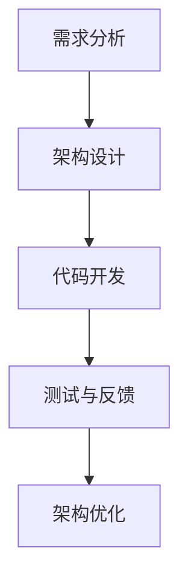

#### 2.4 适应性思维

适应性思维是系统思维的高级形式，它强调在面对不确定性和变化时，系统能够灵活调整，保持稳定运行。这种思维方式有助于架构师在面对复杂、不确定的环境时，找到最佳的解决方案。

**案例：**
在应对突发事件时，如服务器宕机或网络中断，架构师需要能够迅速调整系统，以保持业务的连续性和稳定性。这种适应性思维是架构师必备的技能。

**Mermaid 流程图：**
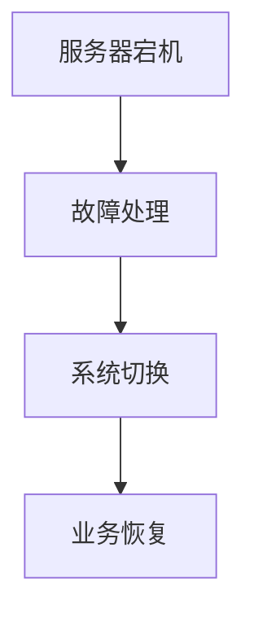

**总结**

通过以上分析，我们可以看到，系统思维的基本原理包括整体观、效率与平衡、动态调整和适应性思维。这些原理不仅有助于架构师更好地理解复杂系统，还能够提升整体架构设计的质量。在接下来的章节中，我们将进一步探讨系统思维的应用场景和实践方法。

### 3. 系统思维的应用场景

系统思维作为一种综合性的思考方式，在多个领域都得到了广泛的应用。以下将详细阐述系统思维在企业管理和项目管理中的应用，以及如何运用系统思维优化产品设计和技术架构设计。

#### 3.1 企业管理

在企业管理的背景下，系统思维有助于架构师从整体视角理解企业的运作机制，以及各个部门之间的相互作用。这种思维方式可以帮助企业更好地实现资源优化、流程优化和战略规划。

**案例：**
在一个大型企业中，架构师需要考虑如何整合不同部门的信息系统，实现数据的互联互通。通过系统思维，架构师可以识别出各部门之间的数据需求，设计出符合整体业务需求的系统集成方案。

**Mermaid 流程图：**
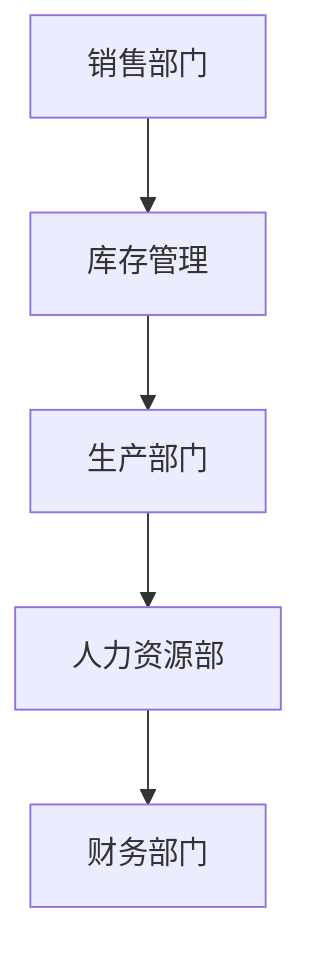

#### 3.2 项目管理

在项目管理的背景下，系统思维可以帮助架构师更好地理解项目的整体结构，以及各个部分之间的依赖关系。这种思维方式有助于提升项目管理的效率和效果。

**案例：**
在一个软件开发项目中，架构师需要考虑如何平衡功能需求、技术实现和项目进度之间的关系。通过系统思维，架构师可以识别出项目中的关键节点和瓶颈，制定出合理的项目计划和时间表。

**Mermaid 流程图：**
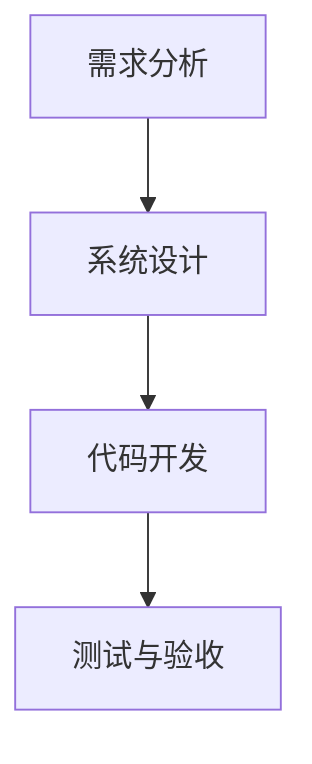

#### 3.3 产品设计

在产品设计的背景下，系统思维可以帮助架构师从整体视角理解产品的功能架构，以及各个模块之间的交互关系。这种思维方式有助于提升产品的用户体验和功能完整性。

**案例：**
在一个移动应用的设计过程中，架构师需要考虑如何设计出一个既美观又易用的界面，同时确保后台服务的稳定性和性能。通过系统思维，架构师可以识别出产品设计的核心模块，以及它们之间的交互关系。

**Mermaid 流程图：**
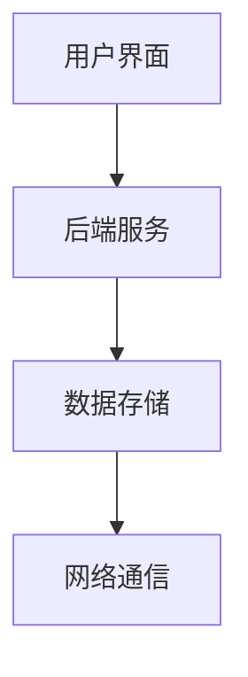

#### 3.4 技术架构设计

在技术架构设计的背景下，系统思维可以帮助架构师从整体视角理解系统的架构设计，以及各个模块之间的交互关系。这种思维方式有助于提升系统的稳定性、扩展性和可维护性。

**案例：**
在一个大型分布式系统的设计中，架构师需要考虑如何设计出一个既高效又可靠的系统架构，同时确保系统的可扩展性和容错性。通过系统思维，架构师可以识别出系统的关键模块，以及它们之间的交互关系。

**Mermaid 流程图：**
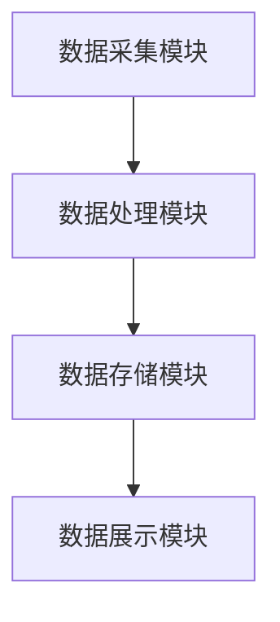

**总结**

通过以上分析，我们可以看到，系统思维在企业管理和项目管理中的应用非常广泛。在产品设计和技术架构设计中，系统思维同样发挥着重要作用。通过运用系统思维，架构师可以更好地理解复杂系统的整体结构，优化系统的设计和实施过程。在接下来的章节中，我们将进一步探讨系统思维的实践方法。

### 4. 系统思维的实践方法

在实际工作中，架构师需要将系统思维转化为具体的实践方法，以提升项目的成功率和系统的整体质量。以下将详细阐述系统思维的实践方法，包括模型构建、原型设计、跨部门协作和持续改进。

#### 4.1 模型构建

模型构建是系统思维的重要实践方法之一，它通过建立数学模型、实体关系图和流程图等，帮助架构师从整体视角理解系统的结构和功能。以下是一个简单的模型构建流程：

**1. 确定系统目标和需求：**
首先，架构师需要明确系统的目标和需求，包括功能需求、性能需求和可靠性需求等。

**2. 建立数学模型：**
基于需求和目标，架构师可以使用数学模型来描述系统的行为和性能。例如，可以使用线性规划、微分方程等来描述系统的优化问题。

**3. 建立实体关系图：**
通过实体关系图，架构师可以描述系统中的各个实体以及它们之间的关系。例如，可以使用ER图来描述数据库中的表结构和关系。

**4. 建立流程图：**
流程图可以帮助架构师描述系统的执行流程和逻辑关系。例如，可以使用Mermaid图来描述系统中的任务流和数据处理流程。

**Mermaid 流程图：**
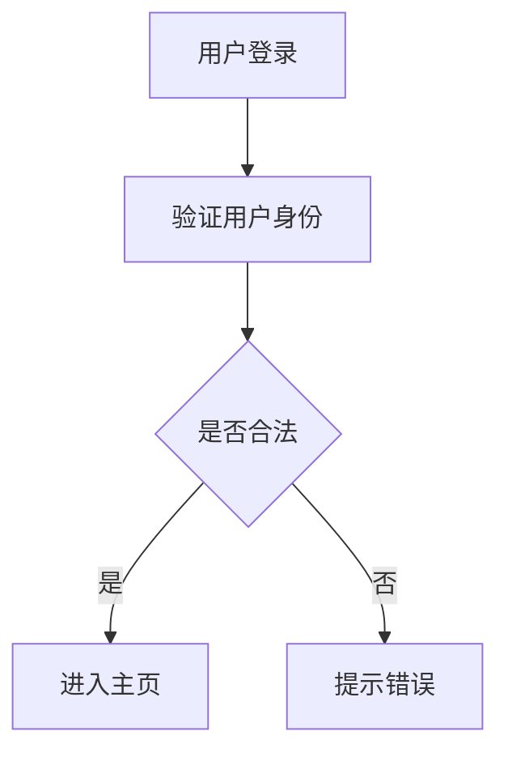

#### 4.2 原型设计

原型设计是系统思维的重要实践方法之一，它通过构建系统的原型版本，帮助架构师验证系统的设计是否符合需求，以及识别出潜在的问题。以下是一个简单的原型设计流程：

**1. 确定原型目标和范围：**
首先，架构师需要明确原型的目标和范围，包括功能范围、性能要求和可靠性要求等。

**2. 构建原型版本：**
架构师可以使用各种工具和技术来构建系统的原型版本，例如，使用Figma、Axure等工具来设计用户界面，使用Python、Java等语言来编写后台服务。

**3. 验证原型：**
在原型构建完成后，架构师需要通过用户测试和评审来验证原型的设计是否符合需求，以及识别出潜在的问题。

**4. 优化原型：**
根据验证结果，架构师需要不断优化原型，以提升系统的质量和用户体验。

**Mermaid 类图：**
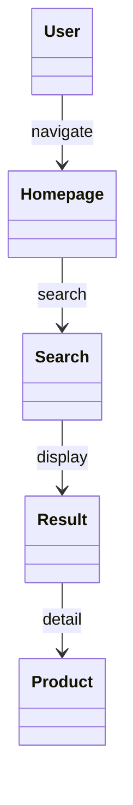

#### 4.3 跨部门协作

在大型项目中，跨部门协作是确保项目成功的关键。系统思维可以帮助架构师更好地协调各部门之间的工作，提升项目的整体效率。以下是一个简单的跨部门协作流程：

**1. 确定协作目标和范围：**
首先，架构师需要明确协作的目标和范围，包括项目目标、部门和任务分配等。

**2. 建立沟通机制：**
架构师需要建立有效的沟通机制，确保各部门之间的信息流通和协作效率。

**3. 定期会议和报告：**
架构师需要定期召开会议和发布报告，了解各部门的工作进展和问题，协调解决项目中的冲突和瓶颈。

**4. 分享经验和知识：**
架构师需要积极分享经验和知识，提升整个团队的能力和协作效率。

**Mermaid 序列图：**
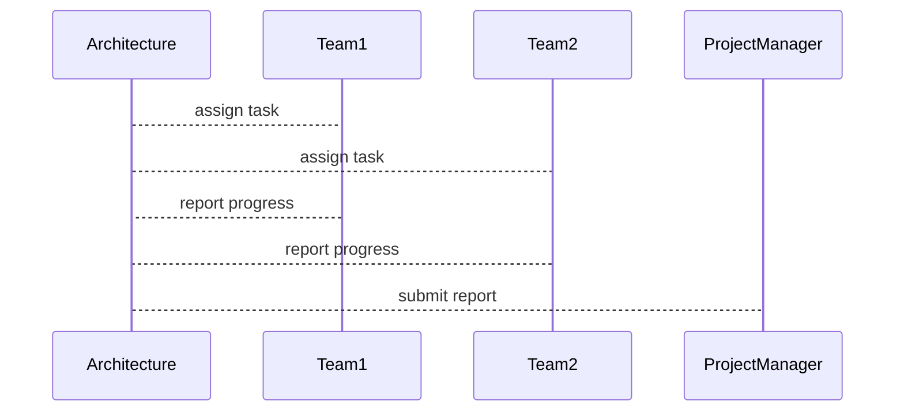

#### 4.4 持续改进

持续改进是系统思维的重要实践方法之一，它通过不断优化系统的设计、实现和运行，提升系统的整体质量和用户体验。以下是一个简单的持续改进流程：

**1. 收集反馈和问题：**
首先，架构师需要积极收集用户和团队的反馈，识别系统中的问题和不足。

**2. 分析问题和原因：**
架构师需要分析反馈和问题，找出系统中的瓶颈和不足，确定改进的方向。

**3. 制定改进计划：**
根据分析结果，架构师需要制定详细的改进计划，包括改进的目标、步骤和时间表。

**4. 实施改进计划：**
架构师需要按照改进计划实施具体的改进措施，优化系统的设计和实现。

**5. 验证改进效果：**
在改进完成后，架构师需要验证改进的效果，确保系统的问题得到解决，性能得到提升。

**Mermaid 流程图：**
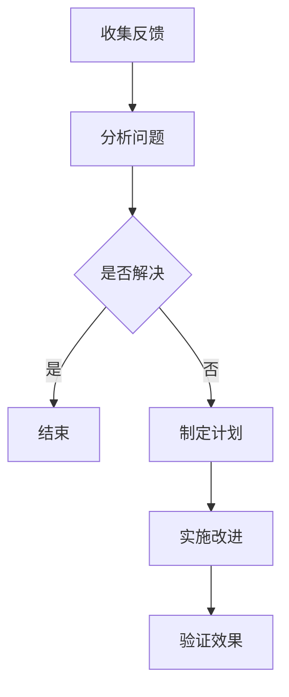

**总结**

通过以上分析，我们可以看到，系统思维的实践方法包括模型构建、原型设计、跨部门协作和持续改进。这些方法不仅可以帮助架构师更好地理解和设计复杂系统，还能够提升项目的整体质量和用户体验。在接下来的章节中，我们将进一步探讨系统思维与架构师成长的关系。

### 5. 系统思维与架构师的成长

系统思维不仅是架构师解决复杂问题的工具，更是其职业生涯中不断成长的动力。以下将详细探讨系统思维在架构师职业规划、职业生涯中的重要性以及所需具备的软技能。

#### 5.1 架构师的职业规划

架构师在职业规划中，需要明确自身的发展方向和目标。系统思维在这个过程中起到了至关重要的作用，它帮助架构师从整体视角审视自己的职业路径，做出更加明智的决策。

**案例：**
一位有志于成为技术总监的架构师，在制定职业规划时，需要考虑如何提升团队的技术能力、优化公司的技术架构以及如何与业务部门进行有效沟通。通过系统思维，他可以全面评估这些因素，并制定出符合自身发展的职业规划。

**Mermaid 流程图：**
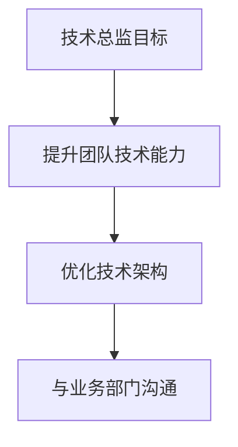

#### 5.2 系统思维在职业生涯中的重要性

系统思维在架构师的职业生涯中具有不可替代的重要性，它不仅帮助架构师更好地理解复杂系统，还能够提升其解决问题的能力。

**1. 提升问题解决能力：**
系统思维使架构师能够从整体视角理解问题，找到根本原因，提出更加全面和有效的解决方案。

**2. 提升沟通和协作能力：**
系统思维强调各部门之间的相互关系和协调，有助于架构师在团队中发挥桥梁作用，提升沟通和协作效率。

**3. 提升领导力：**
系统思维使架构师能够更好地把握整体方向，提升领导力和决策能力。

**4. 提升职业发展潜力：**
系统思维有助于架构师在职业生涯中不断成长，拓展视野，提升自身的职业发展潜力。

#### 5.3 架构师应具备的软技能

除了技术能力，架构师还需要具备一系列软技能，这些技能对于运用系统思维至关重要。

**1. 沟通能力：**
良好的沟通能力使架构师能够与团队成员、业务部门和其他利益相关者有效沟通，确保项目顺利推进。

**2. 领导力：**
领导力使架构师能够带领团队面对挑战，做出正确的决策，推动项目成功。

**3. 持续学习能力：**
架构师需要不断学习新技术和新方法，以适应快速变化的技术环境。

**4. 团队协作能力：**
团队协作能力使架构师能够与团队成员紧密合作，共同实现项目目标。

**5. 问题解决能力：**
系统思维使架构师具备强大的问题解决能力，能够应对各种复杂问题。

**总结**

通过以上分析，我们可以看到，系统思维在架构师的职业规划、职业生涯中具有重要地位。架构师不仅需要具备技术能力，还需要具备一系列软技能，以充分发挥系统思维的作用。在接下来的章节中，我们将通过案例分析进一步探讨系统思维的应用和实践。

### 6. 系统思维案例分析

在现实工作中，系统思维的应用可以帮助架构师更好地理解和解决复杂问题。以下将结合具体案例，详细阐述系统思维在企业管理、敏捷开发和复杂系统架构优化中的应用和实践。

#### 6.1 案例一：企业数字化转型

**问题背景：**
随着互联网技术的快速发展，越来越多的企业开始意识到数字化转型的重要性。然而，数字化转型并非一蹴而就，需要架构师具备系统思维，全面规划和实施。

**问题描述：**
企业在数字化转型过程中，面临着以下挑战：
- 如何整合不同部门的信息系统，实现数据的互联互通？
- 如何优化业务流程，提升运营效率？
- 如何确保系统的稳定性和安全性？

**问题解决：**
架构师通过系统思维，提出以下解决方案：

**1. 整合信息系统：**
- **建立数据中台**：通过建立数据中台，实现不同部门之间的数据共享和整合，提升数据利用率。
- **构建数据接口**：为各个业务系统提供统一的数据接口，确保数据的一致性和准确性。

**2. 优化业务流程：**
- **流程建模**：使用系统思维工具，如流程图和流程建模工具，对现有业务流程进行建模和优化。
- **自动化处理**：通过自动化工具，如机器人流程自动化（RPA），减少人工干预，提升业务处理效率。

**3. 确保系统稳定性和安全性：**
- **系统冗余设计**：在设计过程中，考虑系统的冗余设计，提高系统的容错性和稳定性。
- **安全审计**：定期进行安全审计，识别和修复系统中的安全隐患。

**Mermaid 流程图：**
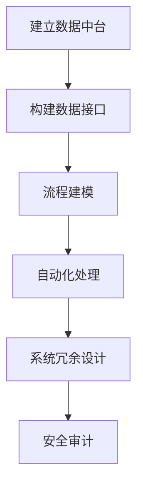

**边界与外延：**
- **边界**：系统思维在数字化转型中的应用主要关注于信息系统的整合、业务流程的优化和系统的稳定性。
- **外延**：系统思维可以应用于企业运营的方方面面，包括供应链管理、客户关系管理、人力资源管理等。

#### 6.2 案例二：敏捷开发实践

**问题背景：**
敏捷开发是一种以人为核心、迭代、循序渐进的开发方法。在实际应用中，架构师需要运用系统思维，确保敏捷开发的顺利进行。

**问题描述：**
在敏捷开发过程中，架构师面临以下挑战：
- 如何确保需求变更的合理性和可控性？
- 如何平衡开发速度和质量？
- 如何协调不同团队之间的工作？

**问题解决：**
架构师通过系统思维，提出以下解决方案：

**1. 需求管理：**
- **需求优先级排序**：通过系统思维，对需求进行优先级排序，确保重要需求得到优先处理。
- **用户故事地图**：使用用户故事地图，将需求分解为用户故事，便于团队协作和迭代开发。

**2. 跨团队协作：**
- **任务看板**：使用任务看板，实时跟踪任务进度，确保团队之间的信息同步。
- **敏捷会议**：定期召开敏捷会议，如每日站立会议、迭代回顾会议，确保团队之间的沟通和协作。

**3. 质量管理：**
- **持续集成**：通过持续集成，确保代码的稳定性和可靠性。
- **自动化测试**：通过自动化测试，提升开发效率，减少人工干预。

**Mermaid 流�图：**
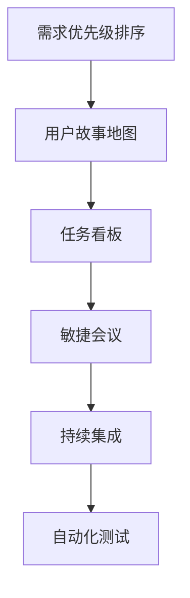

**边界与外延：**
- **边界**：系统思维在敏捷开发中的应用主要关注于需求管理、跨团队协作和质量管理。
- **外延**：系统思维可以应用于敏捷开发的各个环节，如产品规划、迭代开发、发布管理等。

#### 6.3 案例三：复杂系统架构优化

**问题背景：**
在大型分布式系统的架构优化过程中，架构师需要面对众多复杂的问题，如性能瓶颈、系统稳定性、扩展性等。

**问题描述：**
在复杂系统架构优化过程中，架构师面临以下挑战：
- 如何识别和解决性能瓶颈？
- 如何提升系统的稳定性和容错性？
- 如何实现系统的可扩展性？

**问题解决：**
架构师通过系统思维，提出以下解决方案：

**1. 性能优化：**
- **负载均衡**：通过负载均衡技术，将请求均匀分配到各个节点，提升系统处理能力。
- **缓存机制**：通过缓存机制，减少数据库的访问压力，提升系统响应速度。

**2. 稳定性和容错性：**
- **冗余设计**：通过冗余设计，如备份和集群，提升系统的稳定性和容错性。
- **监控与报警**：通过监控和报警系统，实时监控系统状态，及时识别和解决故障。

**3. 可扩展性：**
- **微服务架构**：通过微服务架构，将系统分解为多个独立的服务模块，便于系统的扩展和升级。
- **水平扩展**：通过水平扩展，增加系统节点的数量，提升系统的处理能力。

**Mermaid 流程图：**

**边界与外延：**
- **边界**：系统思维在复杂系统架构优化中的应用主要关注于性能优化、稳定性和容错性、可扩展性。
- **外延**：系统思维可以应用于系统架构的各个方面，如网络架构、存储架构、数据处理架构等。

**总结**

通过以上案例分析，我们可以看到，系统思维在企业管理、敏捷开发和复杂系统架构优化中具有重要作用。通过系统思维，架构师可以更好地理解和解决复杂问题，提升系统的整体质量和用户体验。在接下来的章节中，我们将进一步探讨系统思维的边界与拓展。

### 7. 系统思维的边界与拓展

系统思维虽然在各个领域都有广泛的应用，但它也有其局限性。以下将探讨系统思维的边界，并介绍系统思维与复杂性科学、可持续发展以及未来趋势之间的关系。

#### 7.1 系统思维的边界

尽管系统思维在理解和解决复杂问题方面具有显著优势，但它也存在一些局限性：

**1. 局部优化与整体失衡：**
系统思维强调整体观，但有时在局部优化过程中，可能会导致整体失衡。例如，过度优化某个模块，可能会影响其他模块的性能和稳定性。

**2. 确定性思维与不确定性：**
系统思维基于确定性假设，但在实际应用中，系统往往面临不确定性和随机性。系统思维可能无法完全应对这种不确定性。

**3. 规划与适应：**
系统思维强调提前规划和设计，但在快速变化的环境中，系统的适应性可能受到限制。系统思维需要与适应性思维相结合，以应对动态变化。

**4. 层次化问题与全局视角：**
系统思维通常适用于层次化的复杂系统，但在面对非层次化或跨领域的问题时，可能难以提供有效的解决方案。

#### 7.2 系统思维与复杂性科学

复杂性科学是研究复杂系统行为的学科，它为系统思维提供了理论支持。以下是一些复杂性科学中的关键概念：

**1. 复杂性等级：**
复杂性科学将系统分为不同的复杂性等级，如简单系统、复杂系统、超复杂系统等。系统思维可以根据系统的复杂性等级，选择合适的方法和工具。

**2. 自组织：**
自组织是复杂系统的一种重要特性，即系统中的个体通过相互作用和反馈，自发形成有序结构。系统思维可以借鉴自组织原理，探索系统中的潜在秩序。

**3. 跨学科视角：**
复杂性科学强调跨学科的研究方法，系统思维需要与心理学、社会学、经济学等其他学科相结合，以全面理解复杂系统的行为。

#### 7.3 系统思维与可持续发展

可持续发展是当今社会面临的重要挑战，系统思维为解决这一挑战提供了新的视角：

**1. 系统集成：**
系统思维强调系统集成，通过整合经济、社会和环境等方面的因素，实现可持续发展目标。

**2. 反馈循环：**
系统思维中的反馈循环有助于监测和评估可持续发展的效果，及时发现和纠正问题。

**3. 动态调整：**
系统思维强调动态调整，适应环境变化，确保可持续发展战略的有效实施。

**4. 敏感性分析：**
系统思维中的敏感性分析可以帮助识别和应对可持续发展过程中的关键因素和潜在风险。

#### 7.4 系统思维的未来趋势

随着信息技术的快速发展，系统思维在未来将面临以下趋势：

**1. 人工智能与系统思维：**
人工智能（AI）技术的进步将使系统思维在复杂系统建模和优化方面发挥更大作用。AI可以帮助架构师更高效地处理和分析复杂系统数据。

**2. 量子计算与系统思维：**
量子计算的发展将使系统思维在处理复杂系统和大规模数据方面取得突破性进展。量子计算可能成为系统思维的重要工具。

**3. 区块链与系统思维：**
区块链技术为系统思维提供了新的应用场景，如去中心化系统架构设计、数据安全与隐私保护等。系统思维可以借鉴区块链的分布式和去中心化特点，优化系统的设计和实现。

**4. 绿色计算与系统思维：**
随着环保意识的提高，绿色计算成为重要趋势。系统思维可以应用于优化系统的能源消耗和碳排放，推动绿色计算的发展。

**总结**

系统思维在解决复杂问题、推动可持续发展以及未来技术发展中具有重要作用。尽管系统思维存在一定的局限性，但通过与其他学科的融合和未来技术的应用，系统思维将不断拓展其应用范围，为信息技术的发展和社会进步做出更大贡献。

### 8. 总结：系统思维是架构师的核心竞争力

通过本文的探讨，我们可以清晰地看到，系统思维是架构师不可或缺的核心竞争力。它不仅帮助架构师更好地理解和设计复杂系统，还提升了解决问题、沟通协作和领导能力。以下是本文的核心要点：

- **整体观**：系统思维强调将系统看作一个整体，理解各个部分之间的相互关系和影响。
- **效率与平衡**：系统思维关注系统的效率与平衡，确保资源的最优利用。
- **动态调整**：系统思维能够帮助架构师在面对变化时，灵活调整和优化系统。
- **适应性思维**：系统思维使架构师能够更好地适应不确定性和变化。

在接下来的部分，我们将回顾文章的关键内容，并总结架构师的成长路径和未来展望。

#### 8.1 系统思维的总结

本文通过多个实例，详细阐述了系统思维在企业管理和项目管理中的应用，以及如何通过模型构建、原型设计、跨部门协作和持续改进来实践系统思维。系统思维不仅关注系统的整体架构，还强调系统的动态调整和适应性，为架构师提供了全面的思考框架。

#### 8.2 架构师的成长与突破

架构师的成长需要系统思维的指导，以下是一些关键步骤：

- **基础技术积累**：掌握基础编程技能、数据结构和算法。
- **系统思维培养**：通过学习系统思维理论和实践，提升全局视野。
- **实践经验积累**：通过实际项目，不断应用和验证系统思维。
- **持续学习**：关注新技术和新方法，不断提升自身能力。

#### 8.3 系统思维的应用与实践

系统思维在以下领域具有广泛的应用：

- **企业管理**：通过整合信息系统、优化业务流程和提升运营效率，推动企业数字化转型。
- **项目管理**：通过合理的需求管理、跨团队协作和持续改进，确保项目的成功。
- **产品设计**：通过整体设计、用户体验和功能完整性，提升产品的质量。
- **技术架构设计**：通过优化性能、提升稳定性和实现可扩展性，构建高效可靠的系统架构。

#### 8.4 未来展望

随着信息技术的快速发展，系统思维在架构师的角色中将变得更加重要。未来，架构师需要：

- **融合人工智能和系统思维**：利用AI技术，提升系统建模和优化的效率。
- **关注可持续发展**：通过系统思维，优化系统的能源消耗和碳排放，推动绿色计算的发展。
- **适应新技术变革**：持续学习和适应新兴技术，如量子计算和区块链，为系统思维的应用拓展新的边界。

**总结**

系统思维是架构师的核心竞争力，它帮助架构师更好地理解和解决复杂问题，提升系统的整体质量和用户体验。通过不断学习和实践，架构师可以不断提升自身的系统思维能力，为信息技术的发展和社会进步做出更大的贡献。

**作者信息：**

作者：AI天才研究院/AI Genius Institute & 禅与计算机程序设计艺术 /Zen And The Art of Computer Programming

**注意事项：**

- 在实际应用中，架构师需要根据具体场景灵活运用系统思维。
- 系统思维需要与其他思维方式相结合，如适应性思维和迭代思维，以应对复杂多变的环境。
- 关注新技术和新方法的发展，持续提升自身的系统思维能力和实践经验。

**拓展阅读：**

- 《系统思考》作者：彼得·圣吉（Peter Senge）
- 《系统思维与架构设计》作者：约翰·霍兰（John H. Holland）
- 《复杂性科学导论》作者：迈克尔·斯宾塞（Michael Spence）

