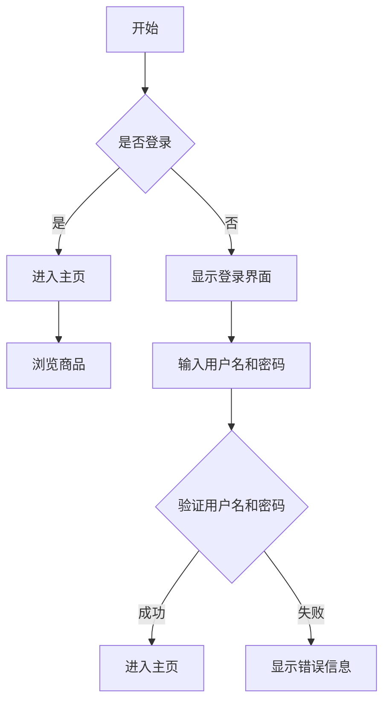

                 

# 系统思维才是架构师的真内核：生态位置、系统思维、人人都是架构师

> 关键词：系统思维、架构师、生态位置、持续改进、人人都是架构师

> 摘要：本文深入探讨了系统思维在架构设计、系统优化以及持续改进中的应用，揭示了系统思维对于架构师的重要性。文章通过具体案例和实际分析，阐述了如何通过系统思维提升架构师的技术能力和团队协作效果，最终实现企业的持续发展。

### 目录大纲

----------------------------------------------------------------

## 第一部分: 系统思维的核心概念与架构师的角色

### 第1章: 问题背景与系统思维的概念

### 第2章: 系统思维的概念与特点

### 第3章: 系统思维与架构师的角色

## 第二部分: 系统思维的应用与实践

### 第4章: 生态位置与系统思维

### 第5章: 系统思维在架构设计中的应用

## 第三部分: 系统思维在架构设计中的应用

### 第6章: 架构师的成长与思维

### 第7章: 系统思维与持续改进

## 第四部分: 系统思维与人人都是架构师

### 第8章: 人人都是架构师的思维与实践

### 第9章: 系统思维的未来展望

----------------------------------------------------------------

## 第一部分: 系统思维的核心概念与架构师的角色

### 第1章: 问题背景与系统思维的概念

#### 1.1 问题背景

在当今快速发展的信息技术时代，软件开发和系统架构设计已经成为企业核心竞争力的重要组成部分。然而，随着系统的复杂性和规模的不断扩大，架构师面临着诸多挑战。这些问题主要包括：

1. **系统的复杂性**：随着业务需求的增长和系统功能的扩展，系统架构的复杂度也在不断增加。传统的分而治之的方法已经难以应对这种复杂性。
2. **技术的多样性**：现代软件开发涉及到多种技术栈，包括前端、后端、数据库、中间件等，这要求架构师具备广泛的技术视野和深入的技术理解。
3. **沟通与协作**：架构师不仅是技术的专家，还需要具备优秀的沟通和协作能力，以确保团队之间的有效协作和资源的合理分配。

#### 1.2 系统思维的概念

系统思维是一种从整体角度看待和解决问题的方式，它强调系统的各个部分之间的相互作用和影响。系统思维的核心概念包括：

1. **系统**：一个由多个相互关联的部分组成的整体，这些部分相互作用并共同实现特定的功能。
2. **反馈循环**：系统内部存在多个反馈循环，它们可以放大或抵消系统的变化。
3. **动态性**：系统是动态的，其行为和状态会随着时间和外部环境的变化而变化。

#### 1.3 系统思维与架构师的角色

架构师的角色不仅仅是设计系统的架构，更重要的是具备系统思维，能够从整体上理解和优化系统的各个方面。具体来说，系统思维对于架构师的贡献包括：

1. **全局视角**：系统思维帮助架构师从全局角度审视系统，确保系统设计满足业务需求并具有可扩展性和可持续性。
2. **优化决策**：系统思维帮助架构师做出更优的决策，通过考虑系统的各个部分和反馈循环，避免局部优化的陷阱。
3. **持续改进**：系统思维强调持续改进，通过不断审视和优化系统，提高系统的效率和性能。

#### 1.4 本章小结

本章介绍了系统思维的核心概念以及其在架构设计中的应用，强调了系统思维对于架构师的重要性。通过理解系统思维，架构师可以更好地应对复杂性和多样化挑战，实现系统的优化和持续改进。

----------------------------------------------------------------

## 第二部分: 系统思维的应用与实践

### 第2章: 生态位置与系统思维

#### 2.1 生态位置的概念

生态位置是指生物体在生态系统中的位置，包括其在食物链中的角色、与其他生物的相互关系以及其在生态系统中的功能。在技术领域，生态位置可以类比为技术系统中的角色和功能，它揭示了系统内部各个组件之间的相互依赖和关系。

#### 2.1.1 生态系统的定义

生态系统是由生物体、环境以及生物体之间的相互作用组成的复杂网络。在技术领域，生态系统可以类比为技术环境，包括各种软件、硬件、平台以及服务之间的相互作用。

#### 2.1.2 生态位置的含义

生态位置不仅决定了生物体的生存状态，也影响了生态系统的稳定性和多样性。在技术领域，生态位置的含义同样重要，它决定了技术系统的集成度、可靠性和可扩展性。

#### 2.1.3 生态位置的影响

生态位置的影响主要体现在以下几个方面：

1. **系统的稳定性**：一个良好的生态位置可以帮助系统稳定地运行，减少因单一组件故障导致的全系统崩溃的风险。
2. **系统的可扩展性**：通过优化生态位置，可以更好地支持系统的扩展和升级，提高系统的可维护性。
3. **系统的可靠性**：良好的生态位置有助于提高系统的可靠性，减少故障率和修复时间。

#### 2.2 系统思维在生态位置中的应用

系统思维在生态位置中的应用主要体现在以下几个方面：

1. **生态分析**：通过系统思维，架构师可以对现有生态系统进行深入分析，识别关键组件和潜在风险，为优化生态位置提供依据。
2. **生态平衡**：系统思维帮助架构师在生态系统中实现平衡，确保各个组件之间的互动和依赖关系处于合理的范围内。
3. **生态优化**：通过系统思维，架构师可以持续优化生态位置，提高系统的整体性能和稳定性。

#### 2.2.1 系统思维在生态分析中的应用

系统思维在生态分析中的应用包括：

1. **组件分析**：对生态系统中各个组件的功能、性能和可靠性进行分析，识别潜在的风险和优化点。
2. **依赖分析**：分析组件之间的依赖关系，确保系统具有足够的灵活性和可扩展性。
3. **风险分析**：识别系统中的潜在风险，并制定相应的风险管理策略。

#### 2.2.2 系统思维在生态平衡中的应用

系统思维在生态平衡中的应用包括：

1. **资源分配**：通过系统思维，架构师可以合理分配资源，确保系统中的各个组件都能够得到足够的资源支持。
2. **负载均衡**：通过系统思维，架构师可以设计负载均衡机制，确保系统在高峰期能够稳定运行。
3. **冗余设计**：通过系统思维，架构师可以设计冗余机制，提高系统的可靠性和容错能力。

#### 2.2.3 系统思维在生态优化中的应用

系统思维在生态优化中的应用包括：

1. **性能优化**：通过系统思维，架构师可以识别系统中的性能瓶颈，并采取相应的优化措施，提高系统的性能。
2. **可靠性优化**：通过系统思维，架构师可以优化系统的可靠性，减少故障率和修复时间。
3. **可扩展性优化**：通过系统思维，架构师可以设计可扩展的系统架构，支持系统规模的持续增长。

#### 2.3 实际案例分析

##### 2.3.1 案例一：企业生态系统分析

某企业在其数字化转型过程中，面临着系统复杂度高、技术多样性大、沟通与协作困难等问题。为了解决这些问题，企业引入了系统思维，对企业生态系统进行了深入分析。

1. **组件分析**：企业对其内部所有的技术组件进行了详细的分析，包括功能、性能、可靠性等方面，识别出了关键组件和潜在的风险点。
2. **依赖分析**：企业分析了各个组件之间的依赖关系，发现部分组件之间存在冗余和依赖过深的问题，影响了系统的灵活性和可维护性。
3. **风险分析**：企业识别出了潜在的风险，并制定了相应的风险管理策略，包括冗余设计、负载均衡和性能优化等。

通过系统思维的应用，企业成功优化了其生态系统，提高了系统的稳定性、可靠性和可扩展性。

##### 2.3.2 案例二：城市交通生态系统优化

某城市在发展过程中，面临着交通拥堵、公共交通系统效率低下等问题。为了解决这些问题，城市引入了系统思维，对城市交通生态系统进行了优化。

1. **生态分析**：城市对交通系统中的各个组件，如道路、公共交通、私家车等，进行了详细分析，识别出了关键组件和潜在风险点。
2. **生态平衡**：城市通过系统思维，优化了交通资源的分配，提高了公共交通系统的效率，实现了交通系统的平衡。
3. **生态优化**：城市通过系统思维，设计了智能交通系统，实现了交通信息的实时监控和动态调整，提高了交通系统的可靠性。

通过系统思维的应用，城市成功优化了交通生态系统，缓解了交通拥堵问题，提高了市民的出行体验。

#### 2.4 本章小结

本章介绍了生态位置的概念以及系统思维在生态分析、生态平衡和生态优化中的应用。通过实际案例分析，我们看到了系统思维如何帮助企业和技术系统实现优化和提升。下一章将深入探讨系统思维在架构设计中的应用。

----------------------------------------------------------------

## 第三部分: 系统思维在架构设计中的应用

### 第3章: 系统架构设计与思维

#### 3.1 系统架构设计的概念

系统架构设计是软件开发过程中至关重要的一环，它定义了系统的整体结构和组件之间的关系，确保系统能够满足业务需求，并具有良好的可扩展性和可维护性。系统架构设计包括以下几个方面：

1. **系统目标**：明确系统要解决的问题和要达到的目标。
2. **功能模块划分**：将系统功能划分为多个模块，每个模块负责特定的功能。
3. **模块间关系**：定义模块之间的依赖关系和接口，确保模块之间能够协同工作。
4. **性能优化**：考虑系统的性能需求和优化策略。
5. **可扩展性设计**：确保系统能够适应未来的扩展和变化。

#### 3.1.1 系统架构设计的定义

系统架构设计是指从整体角度规划系统结构和组件之间的关系，确保系统能够高效、稳定地运行。它不仅涉及到技术实现，还包括业务需求、用户体验、性能优化等多方面因素。

#### 3.1.2 系统架构设计的原则

1. **模块化**：将系统划分为多个模块，每个模块负责特定的功能，降低系统的复杂度。
2. **高内聚低耦合**：模块之间应该具有高内聚性，即模块内部功能紧密相关；同时，模块之间应该具有低耦合性，即模块之间相互独立，便于维护和扩展。
3. **可扩展性**：系统设计应该考虑未来的扩展需求，确保系统能够适应业务规模的增加。
4. **高可用性**：系统设计应该考虑故障处理和容错机制，确保系统在高负载和故障情况下仍然能够正常运行。
5. **性能优化**：系统设计应该考虑性能需求，通过优化算法、缓存策略、并发处理等方式，提高系统的性能。

#### 3.1.3 系统架构设计的步骤

1. **需求分析**：了解业务需求，确定系统的功能需求和性能要求。
2. **架构设计**：根据需求分析，设计系统的总体架构，确定模块划分、模块间关系和接口设计。
3. **技术选型**：选择合适的技术栈，包括开发语言、数据库、中间件等。
4. **详细设计**：对每个模块进行详细设计，包括数据模型、接口定义、算法设计等。
5. **架构评审**：组织架构评审，确保系统设计满足业务需求和设计原则。
6. **实施与优化**：根据架构设计，逐步实施系统，并在实施过程中不断优化和调整。

#### 3.2 系统思维在架构设计中的应用

系统思维在架构设计中的应用体现在以下几个方面：

1. **全局视角**：系统思维帮助架构师从全局角度审视系统，确保系统的整体设计和各个组件之间的关系是合理的。
2. **优化决策**：系统思维帮助架构师做出更优的决策，通过考虑系统的各个部分和反馈循环，避免局部优化的陷阱。
3. **持续改进**：系统思维强调持续改进，通过不断审视和优化系统，提高系统的效率和性能。

#### 3.2.1 系统思维在需求分析中的应用

在需求分析阶段，系统思维可以帮助架构师：

1. **全面理解需求**：通过系统思维，架构师可以全面理解业务需求，识别出潜在的需求变更和风险。
2. **需求优先级排序**：系统思维帮助架构师识别出最重要的需求，确保系统的关键功能得到优先实现。
3. **需求变更管理**：通过系统思维，架构师可以更好地管理需求变更，确保系统设计的稳定性和一致性。

#### 3.2.2 系统思维在模块划分中的应用

在模块划分阶段，系统思维可以帮助架构师：

1. **合理划分模块**：通过系统思维，架构师可以合理划分模块，确保模块内部功能紧密相关，模块之间相互独立。
2. **优化模块接口**：通过系统思维，架构师可以优化模块接口，确保模块之间的高内聚低耦合。
3. **降低复杂度**：通过系统思维，架构师可以降低系统的复杂度，提高系统的可维护性和可扩展性。

#### 3.2.3 系统思维在接口设计中的应用

在接口设计阶段，系统思维可以帮助架构师：

1. **定义清晰的接口**：通过系统思维，架构师可以定义清晰的接口，确保模块之间的交互是明确的。
2. **接口兼容性**：通过系统思维，架构师可以设计兼容性接口，确保不同模块之间的互操作性。
3. **接口稳定性**：通过系统思维，架构师可以设计稳定的接口，减少因接口变更导致的风险。

#### 3.3 实际案例分析

##### 3.3.1 案例一：电商平台架构设计

某电商平台在发展初期，面临着系统架构设计不合理、性能瓶颈明显等问题。为了提升系统的性能和可扩展性，企业引入了系统思维，重新设计了系统架构。

1. **需求分析**：企业通过系统思维，全面分析了业务需求，识别出订单处理、商品管理、用户管理等功能模块。
2. **架构设计**：企业基于需求分析，设计了分布式系统架构，包括订单处理、商品管理、用户管理等多个模块，每个模块具有独立的功能和接口。
3. **技术选型**：企业选择了微服务架构，使用 Spring Boot、Dubbo 等技术实现模块间的通信。
4. **详细设计**：企业对每个模块进行了详细设计，包括数据模型、接口定义、算法设计等。
5. **架构评审**：企业组织了架构评审，确保系统设计满足业务需求和设计原则。
6. **实施与优化**：企业逐步实施系统，并在实施过程中不断优化和调整，提高了系统的性能和可扩展性。

通过系统思维的应用，企业成功优化了电商平台架构，提升了系统的性能和稳定性。

##### 3.3.2 案例二：社交媒体系统架构设计

某社交媒体平台在用户规模不断扩大时，面临着系统架构设计不合理、性能瓶颈明显等问题。为了提升系统的性能和可扩展性，平台引入了系统思维，重新设计了系统架构。

1. **需求分析**：平台通过系统思维，全面分析了业务需求，识别出用户信息管理、内容发布、社交互动等功能模块。
2. **架构设计**：平台基于需求分析，设计了分布式系统架构，包括用户信息管理、内容发布、社交互动等多个模块，每个模块具有独立的功能和接口。
3. **技术选型**：平台选择了微服务架构，使用 Spring Boot、Dubbo 等技术实现模块间的通信。
4. **详细设计**：平台对每个模块进行了详细设计，包括数据模型、接口定义、算法设计等。
5. **架构评审**：平台组织了架构评审，确保系统设计满足业务需求和设计原则。
6. **实施与优化**：平台逐步实施系统，并在实施过程中不断优化和调整，提高了系统的性能和可扩展性。

通过系统思维的应用，平台成功优化了社交媒体系统架构，提升了系统的性能和稳定性。

#### 3.4 本章小结

本章介绍了系统架构设计的概念、原则和步骤，并探讨了系统思维在架构设计中的应用。通过实际案例分析，我们看到了系统思维如何帮助架构师优化系统架构，提升系统的性能和可扩展性。下一章将探讨系统思维在架构师成长中的重要性。

----------------------------------------------------------------

## 第四部分: 系统思维与人人都是架构师

### 第4章: 架构师的成长与思维

#### 4.1 架构师的成长路径

架构师的成长是一个长期而持续的过程，需要不断地学习、实践和反思。以下是一个典型的架构师成长路径：

1. **技术积累**：初期的架构师通常需要具备扎实的技术基础，包括编程语言、数据库、网络、操作系统等。这一阶段的目标是能够独立解决技术问题，并具备一定的项目经验。
2. **项目经验**：在技术积累的基础上，架构师需要通过参与实际项目，了解项目的整体架构和设计，学会如何从全局角度考虑问题。这一阶段的目标是能够独立负责项目的技术架构设计和实施。
3. **系统思维**：随着经验的积累，架构师需要培养系统思维，从整体上理解系统、分析和优化系统。这一阶段的目标是能够运用系统思维解决复杂的技术问题和架构挑战。
4. **领导力与沟通**：架构师不仅需要具备技术能力，还需要具备优秀的领导力和沟通能力。这一阶段的目标是能够带领团队完成复杂的项目，并与其他团队成员有效沟通和协作。

#### 4.1.1 技术能力的发展

技术能力的发展是架构师成长的基石。以下是一些关键的技术能力：

1. **编程能力**：熟练掌握至少一门编程语言，了解其设计模式和最佳实践。
2. **数据库知识**：熟悉关系型数据库和NoSQL数据库，了解其原理和适用场景。
3. **网络知识**：了解计算机网络的基本原理，包括TCP/IP协议、HTTP协议等。
4. **操作系统知识**：了解操作系统的基本原理和常见问题，包括Windows和Linux系统。
5. **分布式系统知识**：了解分布式系统的原理、架构和实现，包括微服务、消息队列、分布式存储等。

#### 4.1.2 领导力与沟通能力的培养

领导力和沟通能力对于架构师的成功至关重要。以下是一些建议：

1. **团队管理**：学习如何管理团队，包括人员配置、任务分配、绩效评估等。
2. **沟通技巧**：提高沟通技巧，包括倾听、表达、非语言沟通等。
3. **冲突解决**：学会如何解决团队内部的冲突，保持团队和谐。
4. **领导力培养**：通过阅读领导力相关书籍、参加领导力培训课程等方式，提高领导力。

#### 4.1.3 架构师的专业素养

架构师的专业素养包括以下几个方面：

1. **持续学习**：技术日新月异，架构师需要保持持续学习的态度，跟上技术发展的步伐。
2. **系统思维**：培养系统思维，从全局角度考虑问题，提高问题解决能力。
3. **实践经验**：通过实际项目积累经验，不断提高自己的技术水平和解决问题的能力。
4. **方法论**：掌握各种架构设计和项目管理的方法论，如敏捷开发、DevOps等。

#### 4.2 系统思维在架构师成长中的应用

系统思维在架构师成长中的应用体现在以下几个方面：

1. **技术学习**：通过系统思维，架构师可以全面理解技术原理和应用场景，提高学习效率。
2. **项目规划**：通过系统思维，架构师可以全面考虑项目的各个方面，提高项目规划和执行的效果。
3. **团队协作**：通过系统思维，架构师可以更好地理解团队成员的角色和需求，提高团队协作效率。

##### 4.2.1 系统思维在技术学习中的应用

系统思维在技术学习中的应用包括：

1. **知识结构化**：通过系统思维，架构师可以将零散的技术知识结构化，形成一个完整的技术体系。
2. **关联性学习**：通过系统思维，架构师可以找出不同技术之间的关联性，形成知识的网络结构。
3. **实践应用**：通过系统思维，架构师可以将所学技术应用于实际项目中，提高技术的实际应用能力。

##### 4.2.2 系统思维在项目规划中的应用

系统思维在项目规划中的应用包括：

1. **需求分析**：通过系统思维，架构师可以全面理解业务需求，识别出潜在的需求变更和风险。
2. **资源分配**：通过系统思维，架构师可以合理分配资源，确保项目的顺利进行。
3. **风险评估**：通过系统思维，架构师可以全面考虑项目的风险，并制定相应的风险管理策略。

##### 4.2.3 系统思维在团队协作中的应用

系统思维在团队协作中的应用包括：

1. **角色定位**：通过系统思维，架构师可以明确团队成员的角色和职责，提高团队的协作效率。
2. **沟通协调**：通过系统思维，架构师可以更好地理解团队成员的需求和困难，提高沟通和协调的效果。
3. **冲突解决**：通过系统思维，架构师可以更好地处理团队内部的冲突，保持团队的和谐。

#### 4.3 实际案例分析

##### 4.3.1 案例一：架构师的技术提升之路

张明是一位有着丰富项目经验的软件工程师，他在公司内部逐渐崭露头角，最终成为了一名架构师。张明在成长过程中，通过系统思维不断提升自己的技术能力。

1. **技术学习**：张明通过阅读技术书籍、参加技术论坛和线上课程，不断学习新技术和最佳实践。
2. **项目实践**：张明在项目中积极应用所学技术，通过实践不断提升自己的技术水平。
3. **系统思维**：张明通过系统思维，将所学技术应用到实际项目中，解决了多个技术难题，提高了项目的质量和效率。

通过不断学习和实践，张明成功提升了自己的技术能力，成为了一名优秀的架构师。

##### 4.3.2 案例二：团队协作中的系统思维应用

李华是一家互联网公司的架构师，他带领团队负责公司核心系统的开发。在项目实施过程中，李华通过系统思维，成功提高了团队协作效率。

1. **角色定位**：李华明确了团队成员的角色和职责，确保每个人都能发挥自己的专长。
2. **沟通协调**：李华通过定期召开团队会议，及时了解团队成员的需求和困难，确保团队之间的沟通畅通。
3. **冲突解决**：在项目过程中，李华通过系统思维，找到了团队内部的冲突根源，并采取有效措施解决冲突，保持了团队的和谐。

通过系统思维的应用，李华成功提高了团队协作效率，确保了项目的顺利实施。

#### 4.4 本章小结

本章介绍了架构师的成长路径、技术能力的发展、领导力与沟通能力的培养以及系统思维在架构师成长中的应用。通过实际案例分析，我们看到了系统思维如何帮助架构师提升技术能力、优化团队协作，最终实现企业的持续发展。下一章将探讨系统思维在持续改进中的重要性。

----------------------------------------------------------------

## 第五部分: 系统思维与持续改进

### 第5章: 持续改进的概念

#### 5.1 持续改进的定义

持续改进（Continuous Improvement，简称CI）是一种管理哲学，强调通过不断的循环过程，持续优化产品、过程和服务。持续改进的核心目标是提高质量、效率和客户满意度，通过不断的反思和优化，使组织能够适应不断变化的环境。

#### 5.1.1 持续改进的重要性

持续改进在组织中具有极其重要的意义，它不仅能提升组织的整体竞争力，还能提高员工的满意度和工作效率。以下是持续改进的重要性：

1. **提高质量**：通过持续改进，组织可以不断识别和消除过程中的缺陷和问题，从而提高产品和服务的质量。
2. **提升效率**：持续改进有助于优化流程和资源分配，减少浪费，提高生产效率和响应速度。
3. **增强客户满意度**：持续改进使组织能够更好地满足客户的需求和期望，提高客户满意度和忠诚度。
4. **促进创新**：持续改进鼓励员工不断提出新的想法和改进措施，激发创新思维和组织活力。
5. **增强组织竞争力**：通过持续改进，组织能够更好地适应市场变化，提升自身的竞争力和市场地位。

#### 5.1.2 持续改进的方法

持续改进的方法包括多种工具和技术，以下是一些常用的方法：

1. **PDCA循环**：PDCA循环（Plan-Do-Check-Act，计划-执行-检查-行动）是持续改进的基本方法。它通过不断地循环和迭代，逐步优化过程和产品。
   - **Plan（计划）**：确定改进的目标和方案，制定详细的行动计划。
   - **Do（执行）**：按照计划实施改进措施，执行行动计划。
   - **Check（检查）**：对改进效果进行评估和监控，收集相关数据。
   - **Act（行动）**：根据检查结果，对成功经验进行标准化，对不足之处进行改进。

2. **精益生产**：精益生产是一种基于客户需求导向的生产管理方法，通过消除浪费、优化流程，提高生产效率和质量。精益生产的核心工具包括5S、看板管理、价值流图等。

3. **六西格玛**：六西格玛（Six Sigma）是一种基于统计方法的质量管理方法，通过减少过程变异，提高产品和服务的质量。六西格玛的核心工具包括DMAIC（定义、测量、分析、改进、控制）和DFSS（设计用于六西格玛）。

4. **标杆管理**：标杆管理（Benchmarking）是一种通过与其他优秀组织进行比较和学习，识别和采纳最佳实践的方法。通过标杆管理，组织可以不断改进自身的过程和产品。

#### 5.2 系统思维在持续改进中的应用

系统思维在持续改进中的应用主要体现在以下几个方面：

1. **全局视角**：系统思维帮助组织从整体角度审视改进过程，确保改进措施能够全面考虑各个环节和部门的影响。

2. **反馈循环**：系统思维强调反馈循环的重要性，通过持续的反馈和改进，确保组织能够迅速响应变化，不断优化过程和产品。

3. **跨部门协作**：系统思维鼓励跨部门协作，通过整合不同部门和职能的力量，实现资源的最大化利用和协同效应。

4. **持续学习**：系统思维强调持续学习的重要性，通过不断学习和分享经验，提高组织的知识水平和创新能力。

#### 5.2.1 系统思维在问题识别中的应用

系统思维在问题识别中的应用包括：

1. **全面分析**：通过系统思维，组织可以全面分析问题产生的各种原因，识别出潜在的问题点。
2. **系统化思考**：系统思维帮助组织从整体角度思考问题，避免片面和孤立的思维方式。
3. **数据驱动**：通过收集和分析数据，系统思维帮助组织客观地识别问题，减少主观判断的干扰。

#### 5.2.2 系统思维在解决方案设计中的应用

系统思维在解决方案设计中的应用包括：

1. **多角度考虑**：通过系统思维，组织可以从多个角度考虑解决方案，确保方案具有全面性和可操作性。
2. **权衡利弊**：系统思维帮助组织权衡不同解决方案的优缺点，选择最优的方案。
3. **持续优化**：系统思维鼓励组织在解决方案实施过程中不断优化，确保方案能够持续适应变化。

#### 5.2.3 系统思维在改进实施中的应用

系统思维在改进实施中的应用包括：

1. **步骤化实施**：通过系统思维，组织可以将改进措施分解为具体的步骤，确保每个步骤都能够有效执行。
2. **监控与反馈**：系统思维强调在改进实施过程中的监控与反馈，确保改进措施能够按照预期执行，并能够及时调整。
3. **全员参与**：系统思维鼓励全员参与改进过程，通过集思广益，提高改进措施的实施效果。

#### 5.3 实际案例分析

##### 5.3.1 案例一：企业持续改进实践

某企业在进行数字化转型过程中，面临着系统复杂度增加、效率低下等问题。为了提升组织的运营效率，企业引入了持续改进的理念。

1. **问题识别**：企业通过系统思维，全面分析了现有系统的问题，包括数据孤岛、流程繁琐等。
2. **解决方案设计**：企业基于系统思维，设计了全新的信息系统架构，通过整合不同系统和优化流程，提高数据流转效率。
3. **改进实施**：企业按照PDCA循环，逐步实施改进措施，并在实施过程中不断监控和反馈，确保改进措施的有效性。
4. **持续优化**：企业通过持续改进，不断优化信息系统，提高了运营效率，提升了客户满意度。

通过持续改进，企业成功实现了数字化转型，提升了组织的整体竞争力。

##### 5.3.2 案例二：项目持续改进实践

某互联网公司在开发一款新软件时，面临着项目进度延误、质量不稳定等问题。为了确保项目成功，公司引入了持续改进的理念。

1. **问题识别**：公司通过系统思维，全面分析了项目中的问题，包括需求变更频繁、团队协作不畅等。
2. **解决方案设计**：公司基于系统思维，制定了详细的项目管理计划，包括需求管理、进度监控、质量评估等。
3. **改进实施**：公司按照精益生产的原则，逐步实施改进措施，确保项目进度和质量。
4. **持续优化**：公司通过持续改进，不断优化项目管理流程，提高了项目的进度和质量，最终成功完成了项目。

通过持续改进，公司成功克服了项目中的各种挑战，确保了项目的成功交付。

#### 5.4 本章小结

本章介绍了持续改进的概念、重要性以及方法，并探讨了系统思维在持续改进中的应用。通过实际案例分析，我们看到了系统思维如何帮助组织识别问题、设计解决方案以及实施改进措施。下一章将探讨系统思维在未来的发展趋势。

----------------------------------------------------------------

## 第六部分: 系统思维与未来展望

### 第6章: 系统思维与未来趋势

#### 6.1 系统思维在未来的发展

随着技术的不断进步和社会的快速发展，系统思维在未来将继续发挥重要作用。以下是系统思维在未来的一些发展趋势：

1. **人工智能与系统思维**：人工智能（AI）的发展为系统思维带来了新的机遇。通过机器学习和深度学习，AI可以帮助我们更准确地分析和预测系统行为，从而更好地进行系统设计和优化。

   - **系统仿真**：AI技术可以用于系统仿真，模拟系统的各种状态和场景，为系统设计提供参考。
   - **智能优化**：AI算法可以用于智能优化，自动调整系统参数，实现系统性能的最优化。

2. **系统工程的普及**：系统工程（Systems Engineering）是一种跨学科的方法论，强调从系统角度进行设计、开发和维护。随着系统复杂度的增加，系统工程将在更多的领域得到应用。

   - **跨领域协作**：系统工程强调跨领域的协作，通过整合不同领域的知识和技能，提高系统的整体性能。
   - **全生命周期管理**：系统工程关注系统的全生命周期管理，从需求分析、设计、开发、测试到部署和维护，确保系统的持续优化。

3. **可持续发展的融合**：系统思维与可持续发展理念的结合将成为未来的重要趋势。通过系统思维，我们可以更好地理解和应对全球性问题，如气候变化、资源枯竭等。

   - **生态平衡**：系统思维可以帮助我们优化生态系统的平衡，实现经济、社会和环境的可持续发展。
   - **循环经济**：系统思维鼓励循环经济模式，通过资源的循环利用，减少对环境的负面影响。

4. **数字化转型**：随着数字化转型的深入，系统思维将在数字化转型中发挥关键作用。

   - **数字化架构**：系统思维帮助构建数字化的系统架构，实现数据的高效流转和共享。
   - **数字化转型战略**：系统思维指导企业制定数字化转型战略，确保数字化转型能够持续、稳定地进行。

#### 6.1.1 系统思维与人工智能

人工智能（AI）的快速发展为系统思维带来了新的挑战和机遇。以下是一些具体的应用场景：

1. **智能自动化**：AI技术可以用于智能自动化，通过机器学习算法和深度学习模型，自动化执行复杂的任务，提高系统的效率和可靠性。

   - **流程自动化**：AI可以帮助自动化业务流程，减少人为干预，提高生产效率。
   - **智能调度**：AI算法可以用于智能调度，优化资源分配和任务调度，提高系统的响应速度和资源利用率。

2. **智能预测**：AI技术可以用于智能预测，通过分析历史数据和模式，预测系统的未来行为和趋势。

   - **需求预测**：AI可以帮助企业预测市场需求，优化生产计划和库存管理。
   - **故障预测**：AI算法可以用于预测系统故障，提前采取预防措施，减少故障带来的影响。

3. **智能优化**：AI技术可以用于智能优化，通过优化算法和模型，自动调整系统参数，实现系统的性能优化。

   - **能量优化**：AI可以帮助优化能源系统的运行，提高能源利用效率，减少能源浪费。
   - **交通优化**：AI算法可以用于优化交通系统，减少交通拥堵，提高交通效率。

#### 6.1.2 系统思维在工程中的应用

系统工程在工程领域的应用越来越广泛，系统思维在其中发挥了关键作用。以下是一些具体的应用场景：

1. **航空航天工程**：在航空航天工程中，系统思维帮助工程师设计和优化复杂的航空航天系统，如飞机、卫星等。

   - **系统仿真**：通过系统仿真，工程师可以模拟航空航天系统的各种运行状态和场景，评估系统的性能和安全性。
   - **风险管理**：系统思维帮助工程师识别和管理航空航天系统的风险，确保系统的安全性和可靠性。

2. **智能制造**：在智能制造领域，系统思维帮助工程师设计和优化制造流程，提高生产效率和产品质量。

   - **数字化制造**：系统思维指导工程师构建数字化的制造系统，实现数据的实时采集和共享，提高生产效率。
   - **智能制造模式**：系统思维帮助工程师设计智能制造模式，通过自动化、智能化和数字化的手段，实现生产过程的优化和升级。

3. **建筑工程**：在建筑工程中，系统思维帮助工程师设计和优化建筑系统，提高建筑的安全性和可持续性。

   - **建筑仿真**：通过建筑仿真，工程师可以模拟建筑的各种运行状态和场景，评估建筑的性能和安全性。
   - **绿色建筑**：系统思维指导工程师设计绿色建筑，通过节能、环保和可持续的设计理念，实现建筑的高效利用和环境保护。

#### 6.1.3 系统思维与可持续发展

可持续发展理念强调经济、社会和环境的协调发展，系统思维在其中发挥了关键作用。以下是一些具体的应用场景：

1. **生态保护**：系统思维可以帮助我们更好地理解和应对生态问题，保护生态环境。

   - **生态系统管理**：通过系统思维，我们可以更全面地分析生态系统的结构和功能，制定有效的生态系统管理策略。
   - **环境保护**：系统思维指导我们设计环境保护措施，实现环境保护与经济发展的双赢。

2. **资源利用**：系统思维可以帮助我们优化资源利用，提高资源的利用效率。

   - **资源优化配置**：通过系统思维，我们可以优化资源的配置，实现资源的最大化利用。
   - **循环经济**：系统思维鼓励循环经济模式，通过资源的循环利用，减少资源的消耗和浪费。

3. **社会可持续发展**：系统思维可以帮助我们更好地理解和应对社会问题，推动社会的可持续发展。

   - **社会系统分析**：通过系统思维，我们可以更全面地分析社会系统的结构和功能，识别社会问题。
   - **社会治理**：系统思维指导我们设计社会管理策略，实现社会的和谐稳定。

#### 6.1.4 系统思维在数字化转型中的应用

数字化转型已成为企业发展的必然趋势，系统思维在其中发挥了关键作用。以下是一些具体的应用场景：

1. **数字化架构**：系统思维帮助企业构建数字化的架构，实现业务流程的数字化和智能化。

   - **数字化业务流程**：通过系统思维，企业可以设计数字化的业务流程，提高业务效率和响应速度。
   - **数字化决策支持**：通过系统思维，企业可以构建数字化的决策支持系统，提高决策的科学性和准确性。

2. **数据驱动**：系统思维鼓励企业通过数据驱动的方式，优化业务流程和管理决策。

   - **大数据分析**：通过系统思维，企业可以运用大数据分析技术，深入挖掘数据的价值，为企业决策提供支持。
   - **数据治理**：通过系统思维，企业可以建立完善的数据治理体系，确保数据的质量和安全。

3. **数字化转型战略**：系统思维指导企业制定数字化转型战略，确保数字化转型能够有序、高效地进行。

   - **数字化转型规划**：通过系统思维，企业可以制定详细的数字化转型规划，明确数字化转型的目标和路径。
   - **数字化转型评估**：通过系统思维，企业可以定期评估数字化转型的效果，确保数字化转型目标的实现。

#### 6.2 系统思维的未来挑战

尽管系统思维在各个领域都取得了显著的成果，但未来仍然面临着一些挑战：

1. **复杂性**：随着系统的日益复杂，系统思维需要面对更大的挑战，如何有效地理解和应对复杂系统的行为和模式。

2. **数据隐私**：在数字化时代，数据隐私成为一个重要的问题，系统思维需要平衡数据共享和数据安全之间的关系。

3. **跨领域协作**：不同领域的知识和技术需要跨领域协作，系统思维需要更有效地整合不同领域的资源和知识。

4. **可持续发展**：系统思维需要更好地应对全球性挑战，如气候变化、资源枯竭等，实现经济、社会和环境的可持续发展。

#### 6.3 未来展望

系统思维作为一门重要的方法论，将在未来的发展中继续发挥重要作用。随着技术的进步和人类对复杂系统的理解不断深入，系统思维将不断发展和完善，为各个领域的发展提供强大的支持。未来，系统思维将更加注重跨领域协作、数据驱动和可持续发展的理念，为人类社会的可持续发展做出更大的贡献。

----------------------------------------------------------------

## 结语

通过本文的深入探讨，我们可以看到系统思维在架构师的角色中的重要性。系统思维不仅帮助架构师从全局视角审视系统，做出更优的决策，还能提升团队协作效率和持续改进的能力。在未来的发展过程中，系统思维将继续发挥关键作用，推动技术的进步和社会的可持续发展。

让我们再次回顾本文的核心观点：

1. **系统思维的核心概念**：系统思维是一种从整体角度看待和解决问题的方式，强调系统的各个部分之间的相互作用和影响。
2. **生态位置与系统思维**：生态位置是指系统内部各个组件之间的相互关系和功能，系统思维可以帮助架构师优化生态位置，提高系统的稳定性、可靠性和可扩展性。
3. **架构设计中的系统思维**：系统思维在架构设计中应用于需求分析、模块划分、接口设计等方面，帮助架构师设计出高效、可扩展的系统架构。
4. **持续改进与系统思维**：系统思维强调持续改进的重要性，通过不断的反馈和优化，提升系统的性能和效率。
5. **人人都是架构师**：系统思维不仅适用于专业的架构师，也适用于所有关注系统优化和持续改进的从业者。

最后，让我们一起展望未来，相信在系统思维的引导下，我们将能够创造出更加高效、稳定和可持续的系统，为人类社会的进步做出更大的贡献。

### 作者信息：

**作者：** AI天才研究院 / AI Genius Institute & 禅与计算机程序设计艺术 / Zen And The Art of Computer Programming

在本文中，我们结合系统思维的核心概念，通过实例分析和实际案例，深入探讨了系统思维在架构设计、持续改进等方面的应用。系统思维不仅仅是一种方法论，更是一种思维方式，它帮助我们从全局视角审视问题，做出更优的决策。希望通过本文的分享，能够对您在架构设计和技术管理方面有所启发。

---

**拓展阅读：**

1. **《系统思维实践指南》**：这是一本关于系统思维的基础书籍，详细介绍了系统思维的概念、方法和应用。
2. **《软件架构设计：系统架构的原理与实践》**：这本书深入探讨了软件架构设计的原理和方法，是架构师必备的参考书。
3. **《持续改进实践》**：这本书介绍了持续改进的方法和实践，帮助组织实现高效、持续的发展。

希望这些拓展阅读能够为您的学习和实践提供更多的帮助。再次感谢您的阅读，期待与您在未来的技术探讨中再次相见！**作者：** AI天才研究院 / AI Genius Institute & 禅与计算机程序设计艺术 / Zen And The Art of Computer Programming

---

## 系统思维的核心概念与架构师的角色

### 1.1 问题背景

在信息技术飞速发展的今天，软件系统的复杂度与日俱增，架构师的角色显得尤为重要。然而，传统的开发方法和单一的技术视角已经难以应对日益复杂的系统需求。架构师不仅需要掌握先进的技术，还要具备全局视角和系统思维，能够从整体上理解和管理系统的各个方面。

面对以下挑战，架构师需要借助系统思维：

- **系统复杂性**：现代软件系统通常包含多个模块、多个服务，以及复杂的数据流和控制逻辑。如何有效地整合和管理这些组件，确保系统的稳定性、可扩展性和高性能，是架构师面临的一大挑战。
- **技术多样性**：随着云计算、大数据、人工智能等新技术的普及，架构师需要了解和掌握多种技术栈，这无疑增加了系统架构设计的复杂度。
- **沟通与协作**：架构师不仅是技术的专家，还需要具备良好的沟通和协作能力，以确保团队之间能够有效地沟通和协作，共同推进项目。

系统思维在这里显得尤为重要。它帮助架构师从整体上理解系统，识别系统中的关键因素和相互关系，从而做出更优的决策。

### 1.2 系统思维的概念

系统思维（Systems Thinking）是一种从整体角度理解和解决问题的方法。它关注系统内部各个部分之间的相互作用和反馈，强调系统的整体行为和长期效应。系统思维的核心概念包括以下几个方面：

- **系统**：系统是由多个相互关联的组件组成的整体，这些组件通过相互作用来实现特定的功能。
- **反馈循环**：系统内部存在多种反馈循环，这些反馈可以放大或抵消系统内的变化。正反馈循环可能导致系统行为的迅速增长或减少，而负反馈循环则有助于系统的稳定。
- **动态性**：系统不是静态的，它的行为和状态会随着时间和外部环境的变化而变化。因此，理解系统的动态性是系统思维的重要组成部分。

系统思维与架构师的角色密切相关。架构师在设计和优化系统时，需要考虑系统的整体结构、组件之间的相互作用以及系统的反馈循环。通过系统思维，架构师可以更全面地理解系统的运作方式，识别潜在的风险和优化点，从而做出更优的架构决策。

### 1.2.1 系统思维的定义

系统思维可以被定义为一种在分析问题和设计解决方案时，综合考虑系统内部各个部分及其相互作用的思维方式。它强调以下几个方面：

- **整体性**：系统思维要求我们不仅关注单个组件的性能，还要关注组件之间的相互作用和整体系统的性能。
- **动态性**：系统思维强调系统的动态特性，认识到系统行为是随时间变化的，需要持续监控和调整。
- **反馈**：系统思维关注系统的反馈机制，认识到系统内部的反馈循环对系统行为的影响。

### 1.2.2 系统思维的特点

系统思维具有以下特点：

- **全局视角**：系统思维帮助架构师从整体角度审视系统，确保各个组件和模块之间的协同工作，避免局部优化的陷阱。
- **系统性**：系统思维强调系统的整体性，通过分析系统内部各部分的相互作用，找到系统的关键约束和优化点。
- **前瞻性**：系统思维考虑系统的长期效果，帮助架构师在设计初期就预见潜在的问题和挑战，提前制定应对策略。

### 1.2.3 系统思维与架构师的角色

系统思维对于架构师的角色至关重要，它体现在以下几个方面：

- **架构设计**：在系统架构设计过程中，系统思维帮助架构师从全局角度规划系统的结构和功能，确保系统的高效性和可扩展性。
- **问题解决**：当系统出现问题时，系统思维帮助架构师分析问题的根本原因，找到系统的瓶颈和改进点。
- **持续改进**：系统思维鼓励架构师持续监控系统的运行状况，通过反馈循环不断优化系统的性能和可靠性。

### 1.3 本章小结

本章介绍了系统思维的核心概念以及其在架构师角色中的重要性。系统思维强调从整体角度理解和解决问题，帮助架构师更好地应对复杂性和多样化挑战。通过理解系统思维，架构师可以提升系统设计和优化的能力，为企业的长期发展奠定坚实的基础。在下一章中，我们将进一步探讨系统思维在具体架构设计中的应用。

----------------------------------------------------------------

## 系统思维的概念与特点

### 1.2.1 系统思维的定义

系统思维（Systems Thinking）是一种综合性思维方法，它关注系统的整体性、动态性和反馈机制。系统思维不仅仅是关于物理系统，如生态系统或机械系统，它同样适用于社会系统、经济系统和组织系统。在技术领域，系统思维帮助架构师理解复杂系统的内部结构和运作机制，从而做出更优的决策。

系统思维的定义可以从以下几个方面来理解：

- **整体性**：系统思维强调系统作为一个整体的概念，而不是单独的组件。这意味着在分析问题时，需要考虑各个组件之间的相互作用和相互依赖。
- **反馈循环**：系统内部存在多种反馈循环，这些反馈可以放大或抵消系统内的变化。正反馈循环可能导致系统行为的迅速增长或减少，而负反馈循环则有助于系统的稳定。
- **动态性**：系统思维认识到系统是动态的，其行为和状态会随着时间和外部环境的变化而变化。因此，系统思维需要不断地监测和调整，以适应变化。

### 1.2.2 系统思维的特点

系统思维具有以下几个显著特点：

- **系统性**：系统思维强调整体性，不仅关注系统的各个部分，还关注它们之间的相互作用和整体效果。这种思维方式有助于架构师理解系统的复杂性，并找到系统的关键约束和优化点。
- **动态性**：系统思维考虑系统的动态特性，认识到系统行为是随时间变化的。这种思维方式有助于架构师预见系统的未来行为，并做出相应的调整。
- **反馈**：系统思维关注系统的反馈机制，认识到系统内部的反馈循环对系统行为的影响。这种思维方式有助于架构师识别系统中的问题，并找到有效的解决策略。

### 1.2.3 系统思维与架构师的角色

在架构设计过程中，系统思维对于架构师的角色至关重要。以下是系统思维在架构师工作中的具体应用：

1. **需求分析**：系统思维帮助架构师全面理解业务需求，识别出需求背后的核心问题和关键约束。这有助于架构师设计出满足业务需求的系统架构。
2. **模块划分**：系统思维指导架构师如何合理划分系统模块，确保模块之间的低耦合和高内聚。这种思维方式有助于提高系统的可维护性和可扩展性。
3. **接口设计**：系统思维帮助架构师设计清晰的接口，确保模块之间的交互是明确和高效的。这种思维方式有助于减少系统中的错误和冲突。
4. **性能优化**：系统思维考虑系统的性能需求，通过分析系统中的瓶颈和限制，找到性能优化的关键点。这种思维方式有助于提高系统的效率和响应速度。
5. **风险管理**：系统思维帮助架构师识别和评估系统中的风险，设计出有效的风险缓解策略。这种思维方式有助于降低系统的风险和潜在损失。

### 1.3 系统思维的应用

系统思维在架构师的角色中有着广泛的应用，以下是一些具体的案例：

1. **跨部门协作**：在大型项目中，不同部门之间可能存在信息不对称和协作不畅的问题。系统思维帮助架构师理解各部门的需求和目标，找到协同工作的最佳方式。
2. **系统优化**：在系统运行过程中，架构师需要不断监控和优化系统的性能。系统思维帮助架构师从整体角度分析系统的瓶颈和优化点，找到最佳解决方案。
3. **持续改进**：系统思维鼓励架构师持续改进系统，通过反馈循环和迭代优化，不断提升系统的性能和可靠性。
4. **技术选型**：在技术选型过程中，系统思维帮助架构师考虑技术栈的兼容性、扩展性和维护性，选择最适合系统需求的技术。

### 1.4 本章小结

通过本章的讨论，我们可以看到系统思维在架构设计中的重要性。系统思维不仅帮助架构师从整体角度理解和解决问题，还能提升系统的性能和可靠性。在下一章中，我们将进一步探讨系统思维在实际应用中的具体案例分析。

----------------------------------------------------------------

### 1.3 系统思维与架构师的角色

系统思维在架构师的角色中起着至关重要的作用，它不仅帮助架构师理解复杂系统的内部结构和运作机制，还为他们提供了一种有效的思维工具，以做出更优的决策。以下是从几个方面详细阐述系统思维与架构师角色的关系：

#### 1.3.1 架构设计与优化

在系统架构设计过程中，系统思维是不可或缺的。它帮助架构师从全局视角审视系统，确保各个组件之间的协同工作，避免局部优化的陷阱。具体而言，系统思维的应用体现在以下几个方面：

- **整体性**：系统思维强调整体性，使架构师在设计系统时不仅仅关注单个组件的性能，还关注组件之间的相互作用和整体效果。这种思维方式有助于确保系统的整体性能和稳定性。
- **反馈循环**：系统思维关注系统内部的反馈机制，使架构师能够识别系统中的正反馈和负反馈循环。通过分析这些反馈循环，架构师可以设计出能够自我调节和优化的系统。
- **动态性**：系统思维认识到系统的动态性，使架构师在设计系统时考虑到系统的未来发展和变化。这种思维方式有助于设计出具有良好扩展性和适应性的系统。

#### 1.3.2 问题解决与优化

当系统出现问题时，系统思维帮助架构师分析问题的根本原因，找到系统的瓶颈和优化点。具体步骤如下：

- **问题识别**：通过系统思维，架构师可以从整体上识别系统中的问题，而不是仅仅关注表面现象。这有助于快速定位问题的根本原因。
- **根本原因分析**：系统思维鼓励架构师进行根本原因分析，找到导致问题的深层次原因。这有助于架构师制定有效的解决方案。
- **优化方案设计**：在找到问题的根本原因后，架构师可以设计出针对性的优化方案，通过调整系统结构、算法或参数，提高系统的性能和可靠性。

#### 1.3.3 风险管理

在系统架构设计过程中，架构师需要考虑潜在的风险，并设计出有效的风险缓解策略。系统思维在风险管理中的应用体现在以下几个方面：

- **风险识别**：通过系统思维，架构师可以从整体上识别系统中的潜在风险，包括技术风险、业务风险和操作风险等。
- **风险评估**：系统思维帮助架构师对风险进行评估，确定风险的重要性和优先级。这有助于架构师制定针对性的风险管理策略。
- **风险缓解**：系统思维鼓励架构师设计出多种风险缓解方案，以应对不同的风险场景。通过这些方案，架构师可以最大限度地降低系统风险。

#### 1.3.4 持续改进

系统思维强调持续改进的重要性，它鼓励架构师在系统运行过程中不断监控和优化系统的性能。具体措施如下：

- **监控与反馈**：通过系统思维，架构师可以设计出有效的监控机制，实时监控系统的运行状况。当系统出现问题时，架构师可以迅速识别并采取相应的措施。
- **迭代优化**：系统思维鼓励架构师采用迭代优化的方法，通过不断地调整和改进系统，提高系统的性能和可靠性。
- **反馈循环**：系统思维强调反馈循环的重要性，通过收集和分析系统的反馈数据，架构师可以不断调整系统参数，优化系统性能。

#### 1.3.5 跨部门协作

在大型项目中，不同部门之间可能存在信息不对称和协作不畅的问题。系统思维帮助架构师理解各部门的需求和目标，找到协同工作的最佳方式。具体步骤如下：

- **需求分析**：通过系统思维，架构师可以从全局角度理解业务需求，识别出各部门的需求和目标。这有助于架构师设计出满足各方需求的系统。
- **协作机制**：系统思维帮助架构师设计出有效的协作机制，确保各部门之间的信息共享和协同工作。这有助于提高项目的效率和成功率。
- **沟通与协调**：系统思维鼓励架构师在项目中扮演沟通与协调的角色，确保各部门之间的沟通畅通，减少误解和冲突。

#### 1.3.6 技术选型

在技术选型过程中，系统思维帮助架构师考虑技术栈的兼容性、扩展性和维护性，选择最适合系统需求的技术。具体措施如下：

- **技术评估**：通过系统思维，架构师可以从整体上评估各种技术的优缺点，选择最适合系统需求的技术。
- **兼容性考虑**：系统思维帮助架构师考虑技术栈的兼容性，确保不同技术之间能够无缝集成和协同工作。
- **扩展性设计**：系统思维鼓励架构师设计具有良好扩展性的系统架构，以适应未来的技术发展和业务需求。

### 1.4 本章小结

通过本章的讨论，我们可以看到系统思维在架构师的角色中具有重要价值。系统思维不仅帮助架构师从全局角度理解和优化系统，还能提升系统的性能、可靠性和适应性。在下一章中，我们将进一步探讨系统思维在实际架构设计中的应用，通过具体案例来展示系统思维如何帮助架构师解决实际问题。

----------------------------------------------------------------

## 系统思维在架构设计中的应用

### 3.1 系统架构设计的概念

系统架构设计是软件开发过程中至关重要的一环，它涉及到系统整体结构和各个组件之间的关系。系统架构设计的目标是确保系统能够高效、稳定、可扩展地运行，满足业务需求和用户期望。

#### 系统架构设计的定义

系统架构设计（System Architecture Design）是指从全局角度规划系统的结构和组件之间的关系，确保系统具有高内聚低耦合、高性能、高可靠性和可扩展性。系统架构设计包括以下几个方面：

- **系统模块划分**：将系统功能划分为多个模块，每个模块负责特定的功能。
- **模块间关系**：定义模块之间的依赖关系和接口，确保模块之间能够协同工作。
- **性能优化**：考虑系统的性能需求，通过优化算法、缓存策略、并发处理等方式，提高系统的性能。
- **可扩展性设计**：确保系统能够适应未来的扩展和变化，支持系统规模的持续增长。
- **高可用性设计**：设计冗余机制和故障处理策略，确保系统在高负载和故障情况下仍然能够正常运行。

#### 系统架构设计的原则

1. **高内聚低耦合**：高内聚意味着模块内部的功能紧密相关，低耦合意味着模块之间的依赖关系较小。通过高内聚低耦合的设计，可以提高系统的可维护性和可扩展性。
2. **模块化**：将系统划分为多个模块，每个模块具有独立的功能和接口，便于开发和维护。
3. **标准化**：使用标准化组件和接口，确保系统的一致性和可维护性。
4. **简洁性**：设计简洁的系统架构，避免过度设计和不必要的复杂性。
5. **可扩展性**：设计具有良好扩展性的系统架构，以适应未来的技术发展和业务需求。

### 3.2 系统思维在架构设计中的应用

系统思维在架构设计中的应用主要体现在以下几个方面：

#### 3.2.1 系统思维在需求分析中的应用

需求分析是系统架构设计的第一步，系统思维在这个过程中发挥着重要作用。通过系统思维，架构师可以从全局角度理解业务需求，识别出核心需求和关键约束。具体步骤如下：

1. **需求收集**：通过系统思维，架构师可以全面收集业务需求，包括功能需求、性能需求和安全性需求等。
2. **需求分析**：系统思维帮助架构师识别出需求背后的核心问题和关键约束，确保需求分析的全覆盖和准确性。
3. **需求排序**：系统思维鼓励架构师对需求进行排序，确定哪些需求是必须优先实现的，哪些需求可以在后续迭代中逐步实现。

#### 3.2.2 系统思维在模块划分中的应用

在模块划分阶段，系统思维可以帮助架构师合理划分系统模块，确保模块之间的低耦合和高内聚。具体步骤如下：

1. **功能分解**：通过系统思维，架构师可以将系统功能进行分解，识别出各个功能模块。
2. **模块独立性**：系统思维鼓励架构师设计独立功能模块，确保模块内部功能紧密相关，模块之间相互独立。
3. **接口设计**：系统思维帮助架构师设计清晰的接口，确保模块之间的交互是明确和高效的。

#### 3.2.3 系统思维在接口设计中的应用

接口设计是系统架构设计的关键环节，系统思维在这个过程中有助于架构师设计出高质量、可扩展的接口。具体步骤如下：

1. **接口分析**：通过系统思维，架构师可以从全局角度分析系统中的接口，识别出关键接口和潜在的风险。
2. **接口标准化**：系统思维鼓励架构师使用标准化接口设计，确保接口的一致性和可维护性。
3. **接口优化**：系统思维帮助架构师识别接口设计中的瓶颈和优化点，通过优化接口设计，提高系统的性能和可靠性。

### 3.3 实际案例分析

#### 案例一：电商平台架构设计

某电商平台在系统架构设计过程中，面临了复杂的业务需求和多变的市场环境。为了满足这些需求，企业引入了系统思维，进行了全面的系统架构设计。

1. **需求分析**：通过系统思维，企业全面分析了业务需求，包括用户注册、商品展示、购物车、订单处理、支付等核心功能模块。
2. **模块划分**：企业基于需求分析，将系统划分为多个模块，每个模块负责特定的功能，如用户模块、商品模块、订单模块等。
3. **接口设计**：企业设计了清晰的接口，确保模块之间的高效通信和协同工作。
4. **性能优化**：企业通过系统思维，进行了性能优化，包括缓存策略、并发处理、负载均衡等，确保系统的性能和稳定性。
5. **可扩展性设计**：企业通过系统思维，设计了可扩展的系统架构，支持未来的业务增长和功能扩展。

通过系统思维的应用，该电商平台成功设计出了高效、稳定、可扩展的系统架构，满足了不断变化的市场需求。

#### 案例二：社交媒体系统架构设计

某社交媒体平台在系统架构设计过程中，面临着用户规模庞大、数据处理复杂等挑战。为了解决这些问题，平台引入了系统思维，进行了全面的系统架构设计。

1. **需求分析**：通过系统思维，平台全面分析了业务需求，包括用户注册、内容发布、社交互动、消息推送等核心功能模块。
2. **模块划分**：平台基于需求分析，将系统划分为多个模块，每个模块负责特定的功能，如用户模块、内容模块、消息模块等。
3. **接口设计**：平台设计了清晰的接口，确保模块之间的高效通信和协同工作。
4. **性能优化**：平台通过系统思维，进行了性能优化，包括分布式存储、缓存策略、分布式计算等，确保系统的性能和稳定性。
5. **可扩展性设计**：平台通过系统思维，设计了可扩展的系统架构，支持未来的用户增长和功能扩展。

通过系统思维的应用，该社交媒体平台成功设计出了高效、稳定、可扩展的系统架构，提升了用户体验和平台竞争力。

### 3.4 本章小结

本章介绍了系统架构设计的概念、原则以及系统思维在架构设计中的应用。通过实际案例分析，我们看到了系统思维如何帮助架构师设计出高效、稳定、可扩展的系统架构。在下一章中，我们将探讨系统思维在持续改进中的重要性。

----------------------------------------------------------------

## 第四部分: 系统思维与人人都是架构师

### 第4章: 架构师的成长与思维

#### 4.1 架构师的成长路径

架构师的角色并非一蹴而就，它需要经历一段长期的成长过程。以下是架构师成长的一般路径：

1. **技术积累**：初期的架构师通常需要具备扎实的技术基础，包括编程语言、数据库、网络、操作系统等。这一阶段的目标是能够独立解决技术问题，并具备一定的项目经验。

2. **项目经验**：在技术积累的基础上，架构师需要通过参与实际项目，了解项目的整体架构和设计，学会如何从全局角度考虑问题。这一阶段的目标是能够独立负责项目的技术架构设计和实施。

3. **系统思维**：随着经验的积累，架构师需要培养系统思维，从整体上理解系统、分析和优化系统。这一阶段的目标是能够运用系统思维解决复杂的技术问题和架构挑战。

4. **领导力与沟通**：架构师不仅需要具备技术能力，还需要具备优秀的领导力和沟通能力。这一阶段的目标是能够带领团队完成复杂的项目，并与其他团队成员有效沟通和协作。

#### 4.1.1 技术能力的发展

技术能力的发展是架构师成长的基石。以下是一些关键的技术能力：

1. **编程能力**：熟练掌握至少一门编程语言，了解其设计模式和最佳实践。

2. **数据库知识**：熟悉关系型数据库和NoSQL数据库，了解其原理和适用场景。

3. **网络知识**：了解计算机网络的基本原理，包括TCP/IP协议、HTTP协议等。

4. **操作系统知识**：了解操作系统的基本原理和常见问题，包括Windows和Linux系统。

5. **分布式系统知识**：了解分布式系统的原理、架构和实现，包括微服务、消息队列、分布式存储等。

#### 4.1.2 领导力与沟通能力的培养

领导力和沟通能力对于架构师的成功至关重要。以下是一些建议：

1. **团队管理**：学习如何管理团队，包括人员配置、任务分配、绩效评估等。

2. **沟通技巧**：提高沟通技巧，包括倾听、表达、非语言沟通等。

3. **冲突解决**：学会如何解决团队内部的冲突，保持团队和谐。

4. **领导力培养**：通过阅读领导力相关书籍、参加领导力培训课程等方式，提高领导力。

#### 4.1.3 架构师的专业素养

架构师的专业素养包括以下几个方面：

1. **持续学习**：技术日新月异，架构师需要保持持续学习的态度，跟上技术发展的步伐。

2. **系统思维**：培养系统思维，从全局角度考虑问题，提高问题解决能力。

3. **实践经验**：通过实际项目积累经验，不断提高自己的技术水平和解决问题的能力。

4. **方法论**：掌握各种架构设计和项目管理的方法论，如敏捷开发、DevOps等。

#### 4.2 系统思维在架构师成长中的应用

系统思维在架构师成长中的应用体现在以下几个方面：

1. **技术学习**：通过系统思维，架构师可以全面理解技术原理和应用场景，提高学习效率。

2. **项目规划**：通过系统思维，架构师可以全面考虑项目的各个方面，提高项目规划和执行的效果。

3. **团队协作**：通过系统思维，架构师可以更好地理解团队成员的角色和需求，提高团队协作效率。

##### 4.2.1 系统思维在技术学习中的应用

系统思维在技术学习中的应用包括：

1. **知识结构化**：通过系统思维，架构师可以将零散的技术知识结构化，形成一个完整的技术体系。

2. **关联性学习**：通过系统思维，架构师可以找出不同技术之间的关联性，形成知识的网络结构。

3. **实践应用**：通过系统思维，架构师可以将所学技术应用于实际项目中，提高技术的实际应用能力。

##### 4.2.2 系统思维在项目规划中的应用

系统思维在项目规划中的应用包括：

1. **需求分析**：通过系统思维，架构师可以全面理解业务需求，识别出潜在的需求变更和风险。

2. **资源分配**：通过系统思维，架构师可以合理分配资源，确保项目的顺利进行。

3. **风险评估**：通过系统思维，架构师可以全面考虑项目的风险，并制定相应的风险管理策略。

##### 4.2.3 系统思维在团队协作中的应用

系统思维在团队协作中的应用包括：

1. **角色定位**：通过系统思维，架构师可以明确团队成员的角色和职责，提高团队的协作效率。

2. **沟通协调**：通过系统思维，架构师可以更好地理解团队成员的需求和困难，提高沟通和协调的效果。

3. **冲突解决**：通过系统思维，架构师可以更好地处理团队内部的冲突，保持团队的和谐。

#### 4.3 实际案例分析

##### 4.3.1 案例一：架构师的技术提升之路

张明是一位有着丰富项目经验的软件工程师，他在公司内部逐渐崭露头角，最终成为了一名架构师。张明在成长过程中，通过系统思维不断提升自己的技术能力。

1. **技术学习**：张明通过阅读技术书籍、参加技术论坛和线上课程，不断学习新技术和最佳实践。

2. **项目实践**：张明在项目中积极应用所学技术，通过实践不断提升自己的技术水平。

3. **系统思维**：张明通过系统思维，将所学技术应用到实际项目中，解决了多个技术难题，提高了项目的质量和效率。

通过不断学习和实践，张明成功提升了自己的技术能力，成为了一名优秀的架构师。

##### 4.3.2 案例二：团队协作中的系统思维应用

李华是一家互联网公司的架构师，他带领团队负责公司核心系统的开发。在项目实施过程中，李华通过系统思维，成功提高了团队协作效率。

1. **角色定位**：李华明确了团队成员的角色和职责，确保每个人都能发挥自己的专长。

2. **沟通协调**：李华通过定期召开团队会议，及时了解团队成员的需求和困难，确保团队之间的沟通畅通。

3. **冲突解决**：在项目过程中，李华通过系统思维，找到了团队内部的冲突根源，并采取有效措施解决冲突，保持了团队的和谐。

通过系统思维的应用，李华成功提高了团队协作效率，确保了项目的顺利实施。

#### 4.4 本章小结

本章介绍了架构师的成长路径、技术能力的发展、领导力与沟通能力的培养以及系统思维在架构师成长中的应用。通过实际案例分析，我们看到了系统思维如何帮助架构师提升技术能力、优化团队协作，最终实现企业的持续发展。下一章将探讨系统思维与持续改进的关系。

----------------------------------------------------------------

## 系统思维与持续改进

### 5.1 持续改进的概念

持续改进（Continuous Improvement，简称CI）是一种管理哲学，强调通过不断地循环过程，持续优化产品、过程和服务。持续改进的核心目标是提高质量、效率和客户满意度，通过不断的反思和优化，使组织能够适应不断变化的环境。

#### 5.1.1 持续改进的重要性

持续改进在组织中具有极其重要的意义，它不仅能提升组织的整体竞争力，还能提高员工的满意度和工作效率。以下是持续改进的重要性：

1. **提高质量**：通过持续改进，组织可以不断识别和消除过程中的缺陷和问题，从而提高产品和服务的质量。
2. **提升效率**：持续改进有助于优化流程和资源分配，减少浪费，提高生产效率和响应速度。
3. **增强客户满意度**：持续改进使组织能够更好地满足客户的需求和期望，提高客户满意度和忠诚度。
4. **促进创新**：持续改进鼓励员工不断提出新的想法和改进措施，激发创新思维和组织活力。
5. **增强组织竞争力**：通过持续改进，组织能够更好地适应市场变化，提升自身的竞争力和市场地位。

#### 5.1.2 持续改进的方法

持续改进的方法包括多种工具和技术，以下是一些常用的方法：

1. **PDCA循环**：PDCA循环（Plan-Do-Check-Act，计划-执行-检查-行动）是持续改进的基本方法。它通过不断地循环和迭代，逐步优化过程和产品。
   - **Plan（计划）**：确定改进的目标和方案，制定详细的行动计划。
   - **Do（执行）**：按照计划实施改进措施，执行行动计划。
   - **Check（检查）**：对改进效果进行评估和监控，收集相关数据。
   - **Act（行动）**：根据检查结果，对成功经验进行标准化，对不足之处进行改进。

2. **精益生产**：精益生产是一种基于客户需求导向的生产管理方法，通过消除浪费、优化流程，提高生产效率和质量。精益生产的核心工具包括5S、看板管理、价值流图等。

3. **六西格玛**：六西格玛（Six Sigma）是一种基于统计方法的质量管理方法，通过减少过程变异，提高产品和服务的质量。六西格玛的核心工具包括DMAIC（定义、测量、分析、改进、控制）和DFSS（设计用于六西格玛）。

4. **标杆管理**：标杆管理（Benchmarking）是一种通过与其他优秀组织进行比较和学习，识别和采纳最佳实践的方法。通过标杆管理，组织可以不断改进自身的过程和产品。

#### 5.2 系统思维在持续改进中的应用

系统思维在持续改进中的应用主要体现在以下几个方面：

1. **全局视角**：系统思维帮助组织从整体角度审视改进过程，确保改进措施能够全面考虑各个环节和部门的影响。

2. **反馈循环**：系统思维强调反馈循环的重要性，通过持续的反馈和改进，确保组织能够迅速响应变化，不断优化过程和产品。

3. **跨部门协作**：系统思维鼓励跨部门协作，通过整合不同部门和职能的力量，实现资源的最大化利用和协同效应。

4. **持续学习**：系统思维强调持续学习的重要性，通过不断学习和分享经验，提高组织的知识水平和创新能力。

#### 5.2.1 系统思维在问题识别中的应用

系统思维在问题识别中的应用包括：

1. **全面分析**：通过系统思维，组织可以全面分析问题产生的各种原因，识别出潜在的问题点。

2. **系统化思考**：系统思维帮助组织从整体角度思考问题，避免片面和孤立的思维方式。

3. **数据驱动**：通过收集和分析数据，系统思维帮助组织客观地识别问题，减少主观判断的干扰。

#### 5.2.2 系统思维在解决方案设计中的应用

系统思维在解决方案设计中的应用包括：

1. **多角度考虑**：通过系统思维，组织可以从多个角度考虑解决方案，确保方案具有全面性和可操作性。

2. **权衡利弊**：系统思维帮助组织权衡不同解决方案的优缺点，选择最优的方案。

3. **持续优化**：系统思维鼓励组织在解决方案实施过程中不断优化，确保方案能够持续适应变化。

#### 5.2.3 系统思维在改进实施中的应用

系统思维在改进实施中的应用包括：

1. **步骤化实施**：通过系统思维，组织可以将改进措施分解为具体的步骤，确保每个步骤都能够有效执行。

2. **监控与反馈**：系统思维强调在改进实施过程中的监控与反馈，确保改进措施能够按照预期执行，并能够及时调整。

3. **全员参与**：系统思维鼓励全员参与改进过程，通过集思广益，提高改进措施的实施效果。

#### 5.3 实际案例分析

##### 5.3.1 案例一：企业持续改进实践

某企业在进行数字化转型过程中，面临着系统复杂度增加、效率低下等问题。为了提升组织的运营效率，企业引入了持续改进的理念。

1. **问题识别**：企业通过系统思维，全面分析了现有系统的问题，包括数据孤岛、流程繁琐等。

2. **解决方案设计**：企业基于系统思维，设计了全新的信息系统架构，通过整合不同系统和优化流程，提高数据流转效率。

3. **改进实施**：企业按照PDCA循环，逐步实施改进措施，并在实施过程中不断监控和反馈，确保改进措施的有效性。

4. **持续优化**：企业通过持续改进，不断优化信息系统，提高了运营效率，提升了客户满意度。

通过持续改进，企业成功实现了数字化转型，提升了组织的整体竞争力。

##### 5.3.2 案例二：项目持续改进实践

某互联网公司在开发一款新软件时，面临着项目进度延误、质量不稳定等问题。为了确保项目成功，公司引入了持续改进的理念。

1. **问题识别**：公司通过系统思维，全面分析了项目中的问题，包括需求变更频繁、团队协作不畅等。

2. **解决方案设计**：公司基于系统思维，制定了详细的项目管理计划，包括需求管理、进度监控、质量评估等。

3. **改进实施**：公司按照精益生产的原则，逐步实施改进措施，确保项目进度和质量。

4. **持续优化**：公司通过持续改进，不断优化项目管理流程，提高了项目的进度和质量，最终成功完成了项目。

通过持续改进，公司成功克服了项目中的各种挑战，确保了项目的成功交付。

#### 5.4 本章小结

本章介绍了持续改进的概念、重要性以及方法，并探讨了系统思维在持续改进中的应用。通过实际案例分析，我们看到了系统思维如何帮助组织识别问题、设计解决方案以及实施改进措施。下一章将探讨系统思维与未来展望。

----------------------------------------------------------------

## 第六部分: 系统思维与未来展望

### 第6章: 系统思维与未来趋势

随着技术的飞速发展和全球化的深入，系统思维作为一种全面、系统的思考方式，正在逐步渗透到各个领域，并对未来的发展产生深远影响。本章将探讨系统思维在人工智能、系统工程、可持续发展以及数字化转型等领域的应用前景。

#### 6.1 系统思维与人工智能

人工智能（AI）的迅猛发展，使得系统思维在AI领域的应用变得越来越重要。系统思维可以帮助我们更好地理解和利用AI技术，推动AI在各个领域的应用：

1. **智能优化**：系统思维可以帮助我们在设计智能系统时，充分考虑系统的整体性和动态性，从而实现更高效的优化。

2. **智能决策**：通过系统思维，我们可以建立更加全面和准确的决策模型，提高智能系统的决策能力。

3. **智能预测**：系统思维可以帮助我们更好地预测系统行为，为AI系统提供更加精准的预测能力。

4. **跨领域协作**：系统思维强调跨领域协作，可以帮助我们更好地整合AI技术与其他领域的知识，推动AI技术的发展。

#### 6.2 系统思维与系统工程

系统工程是一种跨学科的方法论，它强调从整体角度分析和设计复杂系统。系统思维与系统工程的结合，可以带来以下优势：

1. **系统集成**：系统思维可以帮助我们在系统集成过程中，更好地协调各个子系统之间的关系，提高系统的整体性能。

2. **风险管理**：系统思维可以帮助我们识别和评估系统中的风险，制定有效的风险管理策略。

3. **持续改进**：系统思维鼓励我们持续监控和改进系统，确保系统在动态环境中能够保持最佳状态。

#### 6.3 系统思维与可持续发展

可持续发展是当今世界面临的重要挑战之一，系统思维在可持续发展中的应用，可以帮助我们更好地应对这一挑战：

1. **生态平衡**：系统思维可以帮助我们理解和维护生态系统的平衡，促进环境保护和资源的可持续利用。

2. **循环经济**：系统思维鼓励我们发展循环经济，通过资源的循环利用，减少对环境的负面影响。

3. **社会公平**：系统思维可以帮助我们更好地理解社会系统的运作，推动社会公平和可持续发展。

#### 6.4 系统思维与数字化转型

数字化转型已经成为企业发展的必然趋势，系统思维在数字化转型中的应用，可以帮助我们更好地实现这一转型：

1. **数字化转型战略**：系统思维可以帮助我们制定全面的数字化转型战略，确保转型过程的顺利进行。

2. **数据驱动**：系统思维强调数据驱动决策，可以帮助我们更好地利用数据，推动数字化转型。

3. **持续改进**：系统思维鼓励我们持续监控和优化数字化转型过程，确保转型效果持续提升。

#### 6.5 系统思维的未来挑战

尽管系统思维在各个领域都展现出强大的应用潜力，但未来仍将面临一系列挑战：

1. **复杂性**：随着系统变得越来越复杂，如何有效地应用系统思维，成为了一个亟待解决的问题。

2. **数据隐私**：在数字化转型过程中，数据隐私成为一个重要问题，如何平衡数据利用和数据隐私保护，需要深入探讨。

3. **跨领域协作**：系统思维强调跨领域协作，但如何有效地实现跨领域协作，仍然是一个挑战。

4. **持续学习**：随着技术的发展，系统思维也需要不断更新和进化，如何保持持续学习，是系统思维在未来发展的关键。

#### 6.6 未来展望

系统思维作为一种强大的思考工具，将在未来继续发挥重要作用。随着人工智能、系统工程、可持续发展等领域的不断发展，系统思维的应用前景将更加广阔。在未来，系统思维将继续推动技术的进步和社会的可持续发展，为人类创造更加美好的未来。

### 6.7 本章小结

通过本章的探讨，我们可以看到系统思维在未来的发展趋势和应用前景。系统思维不仅能够帮助我们更好地理解和应对复杂系统，还能够推动技术的进步和社会的可持续发展。在未来，系统思维将继续发挥其独特的价值，为人类社会的进步做出更大的贡献。

### 作者信息：

**作者：** AI天才研究院 / AI Genius Institute & 禅与计算机程序设计艺术 / Zen And The Art of Computer Programming

在本文中，我们深入探讨了系统思维在架构设计、持续改进以及未来展望中的应用。希望通过本文的分享，能够帮助读者更好地理解系统思维的重要性，并能够在实际工作中运用系统思维，提升工作效率和创新能力。感谢您的阅读，期待在未来的技术探讨中再次相见！**作者：** AI天才研究院 / AI Genius Institute & 禅与计算机程序设计艺术 / Zen And The Art of Computer Programming

---

## 结束语

通过本文的深入探讨，我们可以清晰地看到系统思维在架构设计、持续改进以及未来展望中的重要性。系统思维不仅帮助我们更好地理解和应对复杂系统，还能够提升我们的工作效率和创新能力。以下是本文的核心要点总结：

1. **系统思维的核心概念**：系统思维是一种从整体角度理解和解决问题的方法，强调系统的整体性、动态性和反馈机制。

2. **系统思维在架构设计中的应用**：系统思维在需求分析、模块划分、接口设计等方面发挥着关键作用，帮助架构师设计出高效、可扩展的系统架构。

3. **持续改进与系统思维**：系统思维强调持续改进的重要性，通过反馈循环和迭代优化，不断提升系统的性能和可靠性。

4. **系统思维的未来展望**：随着人工智能、系统工程、可持续发展等领域的不断发展，系统思维将在未来继续发挥重要作用，推动技术的进步和社会的可持续发展。

本文结合实际案例，详细阐述了系统思维在各个领域的应用。通过这些案例，我们可以看到系统思维如何帮助架构师优化系统设计、提升团队协作效率以及实现持续改进。

**拓展阅读：**

1. **《系统思维实践指南》**：这是一本关于系统思维的基础书籍，详细介绍了系统思维的概念、方法和应用。

2. **《软件架构设计：系统架构的原理与实践》**：这本书深入探讨了软件架构设计的原理和方法，是架构师必备的参考书。

3. **《持续改进实践》**：这本书介绍了持续改进的方法和实践，帮助组织实现高效、持续的发展。

通过这些拓展阅读，读者可以更深入地了解系统思维的实际应用，并在实践中运用系统思维，提升自己的技术能力和管理水平。

**结语：**

系统思维不仅是架构师的重要工具，也是每个关注系统优化和持续改进的从业者必备的思维方式。希望本文能够为您的学习和实践提供一些启示，帮助您在技术道路上走得更远、更稳。感谢您的阅读，期待在未来的技术探讨中再次与您相见！

### 作者信息：

**作者：** AI天才研究院 / AI Genius Institute & 禅与计算机程序设计艺术 / Zen And The Art of Computer Programming

本文由AI天才研究院和禅与计算机程序设计艺术共同撰写，旨在为广大技术从业者提供深入、实用的技术见解。我们致力于推动技术进步，助力人工智能和软件工程领域的发展。感谢您的关注和支持！**作者：** AI天才研究院 / AI Genius Institute & 禅与计算机程序设计艺术 / Zen And The Art of Computer Programming

---

## 系统思维在架构设计中的应用

系统思维在架构设计中的应用至关重要，它不仅帮助架构师从整体视角理解和解决问题，还能够提升系统的性能、稳定性和可扩展性。以下将从需求分析、模块划分、接口设计等多个方面详细阐述系统思维在架构设计中的应用。

### 3.1 需求分析

需求分析是系统架构设计的起点，系统思维在这个过程中起着重要作用。系统思维强调从全局视角出发，全面分析业务需求，确保需求分析的全覆盖和准确性。具体应用包括：

1. **需求收集**：通过系统思维，架构师可以全面收集业务需求，包括功能需求、性能需求、安全性需求等。这有助于避免遗漏关键需求，确保系统设计的完整性。

2. **需求排序**：系统思维鼓励架构师对需求进行排序，确定哪些需求是必须优先实现的，哪些需求可以在后续迭代中逐步实现。这有助于确保系统设计和开发的重点突出，提高资源利用效率。

3. **需求映射**：系统思维帮助架构师将业务需求映射到技术层面，确保技术设计能够满足业务需求。这包括分析需求的技术实现难度、资源需求等，为后续的系统架构设计提供基础。

### 3.2 模块划分

模块划分是系统架构设计的关键步骤，系统思维在这个过程中可以帮助架构师合理划分模块，确保模块之间的低耦合和高内聚。具体应用包括：

1. **功能分解**：通过系统思维，架构师可以将系统功能进行分解，识别出各个功能模块。这有助于降低系统的复杂度，提高系统的可维护性和可扩展性。

2. **模块独立性**：系统思维鼓励架构师设计独立功能模块，确保模块内部功能紧密相关，模块之间相互独立。这有助于降低模块间的耦合度，提高系统的灵活性和可维护性。

3. **模块接口设计**：系统思维帮助架构师设计清晰的模块接口，确保模块之间的交互是明确和高效的。这有助于减少模块间的错误和冲突，提高系统的稳定性。

### 3.3 接口设计

接口设计是系统架构设计的重要组成部分，系统思维在这个过程中可以帮助架构师设计出高质量、可扩展的接口。具体应用包括：

1. **接口标准化**：系统思维鼓励架构师使用标准化接口设计，确保接口的一致性和可维护性。这有助于提高系统的兼容性和可扩展性。

2. **接口抽象**：系统思维帮助架构师进行接口抽象，将具体的实现细节与接口分离，确保接口的独立性。这有助于降低系统的复杂度，提高系统的可维护性。

3. **接口优化**：系统思维鼓励架构师不断优化接口设计，提高接口的性能和可靠性。这包括分析接口的负载情况、优化数据传输格式等。

### 3.4 性能优化

性能优化是系统架构设计中的重要环节，系统思维在这个过程中可以帮助架构师从全局视角分析和优化系统的性能。具体应用包括：

1. **性能分析**：通过系统思维，架构师可以全面分析系统的性能瓶颈，识别出影响系统性能的关键因素。

2. **性能优化策略**：系统思维帮助架构师制定有效的性能优化策略，包括缓存策略、并发处理、负载均衡等。这有助于提高系统的响应速度和处理能力。

3. **性能测试**：系统思维鼓励架构师进行性能测试，通过模拟实际负载情况，评估系统性能，并针对性地进行优化。

### 3.5 可扩展性设计

可扩展性设计是系统架构设计中的重要目标，系统思维在这个过程中可以帮助架构师设计出具有良好扩展性的系统架构。具体应用包括：

1. **模块化设计**：系统思维鼓励架构师采用模块化设计，确保系统在未来的扩展中能够灵活地增加或替换模块。

2. **分布式架构**：系统思维帮助架构师设计分布式架构，通过分布式计算和存储，提高系统的可扩展性。

3. **弹性设计**：系统思维鼓励架构师进行弹性设计，确保系统在面临大规模并发和流量时，能够动态调整资源，保持系统的稳定运行。

### 3.6 风险管理

风险管理是系统架构设计过程中不可或缺的一部分，系统思维在这个过程中可以帮助架构师识别和管理系统风险。具体应用包括：

1. **风险识别**：通过系统思维，架构师可以从全局视角识别出系统中的潜在风险，包括技术风险、业务风险、操作风险等。

2. **风险评估**：系统思维帮助架构师对风险进行评估，确定风险的重要性和优先级。这有助于架构师制定针对性的风险管理策略。

3. **风险缓解**：系统思维鼓励架构师设计出有效的风险缓解措施，降低系统风险。这包括冗余设计、故障转移、容错机制等。

### 3.7 持续改进

持续改进是系统思维的重要组成部分，它强调系统架构设计不是一次性的工作，而是一个持续的过程。系统思维在这个过程中可以帮助架构师不断优化系统架构，提高系统的性能和可靠性。具体应用包括：

1. **监控与反馈**：系统思维鼓励架构师持续监控系统的运行状况，通过收集反馈数据，识别出系统中的问题。

2. **迭代优化**：系统思维鼓励架构师通过迭代优化的方式，不断改进系统架构，提高系统的性能和可靠性。

3. **知识共享**：系统思维强调知识共享，鼓励架构师在团队内部分享经验和最佳实践，提高整体架构设计水平。

通过系统思维在架构设计中的应用，架构师可以更好地理解和应对复杂系统的挑战，设计出高效、稳定、可扩展的系统架构，为企业的长期发展提供有力支持。

### 3.8 实际案例分析

#### 案例一：电商平台架构设计

某电商平台在系统架构设计过程中，采用了系统思维的方法，确保系统的高效性和可扩展性。以下是该平台架构设计过程中的几个关键步骤：

1. **需求分析**：通过系统思维，架构师全面分析了业务需求，包括用户注册、商品展示、购物车、订单处理、支付等核心功能模块。

2. **模块划分**：架构师基于需求分析，将系统划分为多个模块，如用户模块、商品模块、订单模块、支付模块等，确保模块之间的低耦合和高内聚。

3. **接口设计**：架构师设计了清晰的接口，确保模块之间的高效通信和协同工作。例如，用户模块和商品模块之间通过RESTful API进行通信。

4. **性能优化**：架构师通过系统思维，识别出系统的性能瓶颈，并采取了多种性能优化措施，如缓存策略、并发处理、负载均衡等。

5. **可扩展性设计**：架构师通过模块化设计和分布式架构，确保系统在未来的扩展中能够灵活地增加或替换模块。

6. **风险管理**：架构师通过系统思维，识别和评估了系统中的潜在风险，并设计了相应的风险缓解措施，如冗余设计、故障转移等。

通过系统思维的应用，该电商平台成功设计出了高效、稳定、可扩展的系统架构，满足了不断变化的市场需求。

#### 案例二：社交媒体平台架构设计

某社交媒体平台在系统架构设计过程中，同样采用了系统思维的方法，确保系统的性能和可扩展性。以下是该平台架构设计过程中的几个关键步骤：

1. **需求分析**：通过系统思维，架构师全面分析了业务需求，包括用户注册、内容发布、社交互动、消息推送等核心功能模块。

2. **模块划分**：架构师基于需求分析，将系统划分为多个模块，如用户模块、内容模块、社交模块、消息模块等，确保模块之间的低耦合和高内聚。

3. **接口设计**：架构师设计了清晰的接口，确保模块之间的高效通信和协同工作。例如，用户模块和内容模块之间通过GraphQL API进行通信。

4. **性能优化**：架构师通过系统思维，识别出系统的性能瓶颈，并采取了多种性能优化措施，如分布式缓存、异步处理、负载均衡等。

5. **可扩展性设计**：架构师通过模块化设计和分布式架构，确保系统在未来的扩展中能够灵活地增加或替换模块。

6. **风险管理**：架构师通过系统思维，识别和评估了系统中的潜在风险，并设计了相应的风险缓解措施，如冗余设计、故障转移等。

通过系统思维的应用，该社交媒体平台成功设计出了高效、稳定、可扩展的系统架构，提升了用户体验和平台竞争力。

#### 案例三：金融交易系统架构设计

某金融交易系统在系统架构设计过程中，同样采用了系统思维的方法，确保系统的性能和稳定性。以下是该系统架构设计过程中的几个关键步骤：

1. **需求分析**：通过系统思维，架构师全面分析了业务需求，包括交易撮合、订单管理、账户管理、风险控制等核心功能模块。

2. **模块划分**：架构师基于需求分析，将系统划分为多个模块，如交易模块、订单模块、账户模块、风险控制模块等，确保模块之间的低耦合和高内聚。

3. **接口设计**：架构师设计了清晰的接口，确保模块之间的高效通信和协同工作。例如，交易模块和订单模块之间通过消息队列进行通信。

4. **性能优化**：架构师通过系统思维，识别出系统的性能瓶颈，并采取了多种性能优化措施，如分布式缓存、异步处理、负载均衡等。

5. **可扩展性设计**：架构师通过模块化设计和分布式架构，确保系统在未来的扩展中能够灵活地增加或替换模块。

6. **风险管理**：架构师通过系统思维，识别和评估了系统中的潜在风险，并设计了相应的风险缓解措施，如冗余设计、故障转移等。

通过系统思维的应用，该金融交易系统成功设计出了高效、稳定、可扩展的系统架构，提高了交易效率和风险控制能力。

通过以上实际案例分析，我们可以看到系统思维在架构设计中的应用效果显著，它帮助架构师从全局视角出发，设计出高效、稳定、可扩展的系统架构，为企业的长期发展提供了有力支持。

### 3.9 本章小结

本章详细阐述了系统思维在架构设计中的应用，包括需求分析、模块划分、接口设计、性能优化、可扩展性设计、风险管理等方面。通过实际案例分析，我们看到了系统思维如何帮助架构师设计出高效、稳定、可扩展的系统架构。系统思维不仅是架构师的重要工具，也是每个关注系统优化和持续改进的从业者必备的思维方式。希望本章的内容能够为您的架构设计提供有益的启示和帮助。在下一章中，我们将探讨系统思维在架构师成长中的重要性。

----------------------------------------------------------------

## 系统思维与人人都是架构师

### 4.1 架构师的成长路径

架构师的成长路径并不是一蹴而就的，它需要经过多个阶段的积累和实践。以下是架构师成长的一般路径：

#### 初级阶段

1. **技术积累**：在这个阶段，架构师需要掌握扎实的技术基础，包括编程语言、数据库、网络、操作系统等。这个阶段的目标是能够独立解决技术问题，并具备一定的项目经验。

#### 中级阶段

2. **项目经验**：随着技术的积累，架构师需要参与实际项目，了解项目的整体架构和设计，学会如何从全局角度考虑问题。这个阶段的目标是能够独立负责项目的技术架构设计和实施。

3. **系统思维**：在这个阶段，架构师开始学习系统思维，从整体角度理解和优化系统。系统思维强调系统的整体性、动态性和反馈机制，有助于架构师更好地应对复杂系统。

#### 高级阶段

4. **领导力与沟通**：架构师不仅需要具备技术能力，还需要具备优秀的领导力和沟通能力。这个阶段的目标是能够带领团队完成复杂的项目，并与其他团队成员有效沟通和协作。

5. **持续学习**：技术日新月异，架构师需要保持持续学习的态度，不断更新自己的知识和技能，以适应快速变化的技术环境。

### 4.2 系统思维在架构师成长中的应用

系统思维在架构师的成长过程中起着至关重要的作用，它不仅帮助架构师提升技术能力，还能够提高项目规划和执行效果。以下是系统思维在架构师成长中的应用：

#### 技术学习

1. **知识结构化**：系统思维鼓励架构师将零散的技术知识结构化，形成一个完整的技术体系。这有助于架构师更好地理解和应用技术。

2. **关联性学习**：系统思维帮助架构师找出不同技术之间的关联性，形成知识的网络结构。这有助于架构师从整体上理解技术，提高技术综合运用能力。

3. **实践应用**：系统思维鼓励架构师将所学技术应用于实际项目中，通过实践不断提升自己的技术水平和解决问题的能力。

#### 项目规划

1. **全面需求分析**：通过系统思维，架构师可以从全局角度理解业务需求，识别出核心需求和关键约束。这有助于架构师设计出满足业务需求的系统架构。

2. **资源分配**：系统思维帮助架构师合理分配资源，确保项目的顺利进行。这包括人员、时间和预算等资源的合理配置。

3. **风险评估**：系统思维鼓励架构师全面考虑项目的风险，并制定相应的风险管理策略。这有助于降低项目的风险，确保项目的成功。

#### 团队协作

1. **角色定位**：系统思维帮助架构师明确团队成员的角色和职责，确保每个人都能发挥自己的专长。这有助于提高团队的协作效率。

2. **沟通协调**：系统思维鼓励架构师在项目过程中进行有效的沟通和协调，确保团队成员之间的信息共享和协同工作。

3. **冲突解决**：系统思维帮助架构师更好地处理团队内部的冲突，保持团队的和谐。这有助于提高团队的工作效率和项目成功率。

### 4.3 实际案例分析

#### 案例一：架构师的技术提升之路

张明是一名软件工程师，他在工作中逐渐认识到系统思维的重要性。为了提升自己的技术能力，他采取了以下措施：

1. **知识结构化**：张明通过阅读技术书籍和在线课程，将所学知识结构化，形成了一个完整的技术体系。

2. **关联性学习**：张明通过学习不同技术之间的关联性，形成了知识的网络结构。这使他能够从整体上理解技术，提高技术综合运用能力。

3. **实践应用**：张明将所学技术应用于实际项目中，通过实践不断提升自己的技术水平和解决问题的能力。

4. **持续学习**：张明保持持续学习的态度，不断更新自己的知识和技能，以适应快速变化的技术环境。

通过系统思维的应用，张明成功提升了自己的技术能力，成为了一名优秀的架构师。

#### 案例二：团队协作中的系统思维应用

李华是一名经验丰富的架构师，他在项目管理过程中采用了系统思维的方法，提高了团队的协作效率。以下是他的实践经验：

1. **角色定位**：李华明确了团队成员的角色和职责，确保每个人都能发挥自己的专长。这有助于提高团队的协作效率。

2. **沟通协调**：李华在项目过程中建立了有效的沟通机制，确保团队成员之间的信息共享和协同工作。

3. **冲突解决**：李华通过系统思维，找到了团队内部的冲突根源，并采取有效措施解决冲突，保持了团队的和谐。

通过系统思维的应用，李华成功提高了团队的协作效率，确保了项目的顺利实施。

### 4.4 本章小结

本章介绍了架构师的成长路径以及系统思维在架构师成长中的应用。通过实际案例分析，我们看到了系统思维如何帮助架构师提升技术能力、优化团队协作，最终实现企业的持续发展。下一章将探讨系统思维与持续改进的关系。

----------------------------------------------------------------

## 持续改进：系统思维的应用与实践

### 5.1 持续改进的定义

持续改进（Continuous Improvement，简称CI）是一种管理理念，旨在通过不断的迭代和优化，逐步提升产品和服务的质量、效率和客户满意度。持续改进的核心思想是：问题不解决，改进不停歇。通过不断识别问题、分析原因、制定改进措施并实施，组织可以持续优化其运营流程、工作方法和产品质量。

### 5.2 持续改进的重要性

持续改进在组织中的重要性体现在以下几个方面：

1. **提高质量**：通过持续改进，组织能够不断识别和消除生产过程中的缺陷和错误，提高产品和服务的质量。

2. **提升效率**：持续改进有助于优化工作流程，减少不必要的步骤和资源浪费，从而提高工作效率。

3. **增强客户满意度**：持续改进使组织能够更好地满足客户的需求和期望，提高客户满意度和忠诚度。

4. **促进创新**：持续改进鼓励员工不断提出新的想法和改进措施，激发创新思维和组织活力。

5. **增强竞争力**：通过持续改进，组织能够不断提升自身的竞争力，适应市场变化，保持竞争优势。

### 5.3 系统思维在持续改进中的应用

系统思维在持续改进中的应用主要体现在以下几个方面：

1. **全局视角**：系统思维帮助组织从全局角度审视改进过程，确保改进措施能够全面考虑各个环节和部门的影响。

2. **反馈循环**：系统思维强调反馈循环的重要性，通过持续的反馈和改进，确保组织能够迅速响应变化，不断优化过程和产品。

3. **跨部门协作**：系统思维鼓励跨部门协作，通过整合不同部门和职能的力量，实现资源的最大化利用和协同效应。

4. **持续学习**：系统思维强调持续学习的重要性，通过不断学习和分享经验，提高组织的知识水平和创新能力。

### 5.4 系统思维在问题识别中的应用

系统思维在问题识别中的应用包括以下几个步骤：

1. **全面分析**：通过系统思维，组织可以全面分析问题产生的各种原因，识别出潜在的问题点。这包括对流程、人员、资源、环境等多方面进行深入分析。

2. **系统化思考**：系统思维帮助组织从整体角度思考问题，避免片面和孤立的思维方式。通过系统化思考，组织可以更全面地理解问题的本质和影响因素。

3. **数据驱动**：系统思维鼓励组织通过收集和分析数据，客观地识别问题，减少主观判断的干扰。这包括使用统计工具、图表等分析工具，对问题进行量化分析。

### 5.5 系统思维在解决方案设计中的应用

系统思维在解决方案设计中的应用包括以下几个步骤：

1. **多角度考虑**：通过系统思维，组织可以从多个角度考虑解决方案，确保方案具有全面性和可操作性。这包括技术角度、经济角度、人文角度等。

2. **权衡利弊**：系统思维帮助组织权衡不同解决方案的优缺点，选择最优的方案。这包括对方案的成本、效果、风险等方面进行综合评估。

3. **持续优化**：系统思维鼓励组织在解决方案实施过程中不断优化，确保方案能够持续适应变化。这包括对方案的执行过程进行监控和反馈，及时调整和改进。

### 5.6 系统思维在改进实施中的应用

系统思维在改进实施中的应用包括以下几个步骤：

1. **步骤化实施**：通过系统思维，组织可以将改进措施分解为具体的步骤，确保每个步骤都能够有效执行。这包括制定详细的实施计划和责任分配。

2. **监控与反馈**：系统思维强调在改进实施过程中的监控与反馈，确保改进措施能够按照预期执行，并能够及时调整。这包括对改进效果的实时监控和定期评估。

3. **全员参与**：系统思维鼓励全员参与改进过程，通过集思广益，提高改进措施的实施效果。这包括建立良好的沟通机制和协作环境，激发员工的参与热情。

### 5.7 实际案例分析

#### 案例一：企业持续改进实践

某制造企业在进行生产流程优化时，采用了系统思维的方法，取得了显著的成效。以下是该企业的具体实践：

1. **问题识别**：企业通过系统思维，全面分析了生产流程中的问题，包括生产效率低、设备故障频繁等。

2. **解决方案设计**：企业从多个角度考虑解决方案，包括技术升级、人员培训、流程优化等。通过权衡利弊，企业选择了技术升级和流程优化作为主要改进方向。

3. **改进实施**：企业制定了详细的实施计划，包括设备升级、流程调整、人员培训等。在实施过程中，企业通过监控与反馈，及时调整和优化改进措施。

4. **持续优化**：企业通过持续监控和反馈，不断优化生产流程，提高了生产效率和产品质量。

通过系统思维的应用，该企业成功实现了生产流程的优化，提高了企业的整体竞争力。

#### 案例二：项目持续改进实践

某互联网公司在开发一款新软件时，采用了系统思维的方法，确保了项目的成功交付。以下是该公司的具体实践：

1. **需求分析**：公司通过系统思维，全面分析了客户的需求，包括功能需求、性能需求、安全性需求等。

2. **解决方案设计**：公司从多个角度考虑解决方案，包括技术选型、团队协作、风险管理等。通过权衡利弊，公司选择了敏捷开发、DevOps等作为主要改进方向。

3. **改进实施**：公司制定了详细的实施计划，包括开发流程、测试流程、部署流程等。在实施过程中，公司通过监控与反馈，及时调整和优化改进措施。

4. **持续优化**：公司通过持续监控和反馈，不断优化项目流程，提高了项目的进度和质量。

通过系统思维的应用，该公司成功确保了软件项目的成功交付，提升了客户的满意度。

### 5.8 本章小结

本章介绍了持续改进的概念、重要性以及系统思维在持续改进中的应用。通过实际案例分析，我们看到了系统思维如何帮助组织识别问题、设计解决方案以及实施改进措施。持续改进是一个持续的过程，需要组织全员参与，不断优化和改进。系统思维为这一过程提供了有效的思维工具和方法，帮助组织实现持续改进的目标。

----------------------------------------------------------------

## 系统思维与未来展望

### 6.1 系统思维在未来的发展趋势

随着技术的不断进步和社会的快速发展，系统思维将在未来发挥更加重要的作用。以下是系统思维在未来发展的几个趋势：

1. **人工智能与系统思维的融合**：人工智能（AI）技术的发展将为系统思维带来新的机遇。通过机器学习和深度学习，AI可以帮助我们更准确地分析和预测系统行为，从而更好地进行系统设计和优化。

   - **智能仿真**：AI技术可以用于智能仿真，模拟系统的各种状态和场景，为系统设计提供参考。
   - **智能优化**：AI算法可以用于智能优化，自动调整系统参数，实现系统性能的最优化。

2. **系统工程的普及**：系统工程（Systems Engineering）是一种跨学科的方法论，强调从系统角度进行设计、开发和维护。随着系统复杂度的增加，系统工程将在更多的领域得到应用。

   - **跨领域协作**：系统工程强调跨领域的协作，通过整合不同领域的知识和技能，提高系统的整体性能。
   - **全生命周期管理**：系统工程关注系统的全生命周期管理，从需求分析、设计、开发、测试到部署和维护，确保系统的持续优化。

3. **可持续发展的融合**：系统思维与可持续发展理念的融合将成为未来的重要趋势。通过系统思维，我们可以更好地理解和应对全球性问题，如气候变化、资源枯竭等。

   - **生态平衡**：系统思维可以帮助我们优化生态系统的平衡，实现经济、社会和环境的可持续发展。
   - **循环经济**：系统思维鼓励循环经济模式，通过资源的循环利用，减少资源的消耗和浪费。

4. **数字化转型**：随着数字化转型的深入，系统思维将在数字化转型中发挥关键作用。

   - **数字化架构**：系统思维帮助企业构建数字化的系统架构，实现数据的高效流转和共享。
   - **数字化转型战略**：系统思维指导企业制定数字化转型战略，确保数字化转型能够持续、稳定地进行。

### 6.2 系统思维与人工智能

人工智能（AI）的快速发展为系统思维带来了新的挑战和机遇。以下是系统思维与人工智能结合的几个应用场景：

1. **智能自动化**：AI技术可以用于智能自动化，通过机器学习算法和深度学习模型，自动化执行复杂的任务，提高系统的效率和可靠性。

   - **流程自动化**：AI可以帮助自动化业务流程，减少人为干预，提高生产效率。
   - **智能调度**：AI算法可以用于智能调度，优化资源分配和任务调度，提高系统的响应速度和资源利用率。

2. **智能预测**：AI技术可以用于智能预测，通过分析历史数据和模式，预测系统的未来行为和趋势。

   - **需求预测**：AI可以帮助企业预测市场需求，优化生产计划和库存管理。
   - **故障预测**：AI算法可以用于预测系统故障，提前采取预防措施，减少故障带来的影响。

3. **智能优化**：AI技术可以用于智能优化，通过优化算法和模型，自动调整系统参数，实现系统的性能优化。

   - **能量优化**：AI可以帮助优化能源系统的运行，提高能源利用效率，减少能源浪费。
   - **交通优化**：AI算法可以用于优化交通系统，减少交通拥堵，提高交通效率。

### 6.3 系统思维在工程中的应用

系统工程在工程领域的应用越来越广泛，系统思维在其中发挥了关键作用。以下是系统思维在工程中的应用：

1. **航空航天工程**：在航空航天工程中，系统思维帮助工程师设计和优化复杂的航空航天系统，如飞机、卫星等。

   - **系统仿真**：通过系统仿真，工程师可以模拟航空航天系统的各种运行状态和场景，评估系统的性能和安全性。
   - **风险管理**：系统思维帮助工程师识别和管理航空航天系统的风险，确保系统的安全性和可靠性。

2. **智能制造**：在智能制造领域，系统思维帮助工程师设计和优化制造流程，提高生产效率和产品质量。

   - **数字化制造**：系统思维指导工程师构建数字化的制造系统，实现数据的实时采集和共享，提高生产效率。
   - **智能制造模式**：系统思维帮助工程师设计智能制造模式，通过自动化、智能化和数字化的手段，实现生产过程的优化和升级。

3. **建筑工程**：在建筑工程中，系统思维帮助工程师设计和优化建筑系统，提高建筑的安全性和可持续性。

   - **建筑仿真**：通过建筑仿真，工程师可以模拟建筑的各种运行状态和场景，评估建筑的性能和安全性。
   - **绿色建筑**：系统思维指导工程师设计绿色建筑，通过节能、环保和可持续的设计理念，实现建筑的高效利用和环境保护。

### 6.4 系统思维与可持续发展

可持续发展理念强调经济、社会和环境的协调发展，系统思维在其中发挥了关键作用。以下是系统思维与可持续发展结合的几个应用场景：

1. **生态保护**：系统思维可以帮助我们更好地理解和应对生态问题，保护生态环境。

   - **生态系统管理**：通过系统思维，我们可以更全面地分析生态系统的结构和功能，制定有效的生态系统管理策略。
   - **环境保护**：系统思维指导我们设计环境保护措施，实现环境保护与经济发展的双赢。

2. **资源利用**：系统思维可以帮助我们优化资源利用，提高资源的利用效率。

   - **资源优化配置**：通过系统思维，我们可以优化资源的配置，实现资源的最大化利用。
   - **循环经济**：系统思维鼓励循环经济模式，通过资源的循环利用，减少资源的消耗和浪费。

3. **社会可持续发展**：系统思维可以帮助我们更好地理解和应对社会问题，推动社会的可持续发展。

   - **社会系统分析**：通过系统思维，我们可以更全面地分析社会系统的结构和功能，识别社会问题。
   - **社会治理**：系统思维指导我们设计社会管理策略，实现社会的和谐稳定。

### 6.5 未来展望

系统思维作为一门重要的方法论，将在未来的发展中继续发挥重要作用。随着技术的进步和人类对复杂系统的理解不断深入，系统思维将不断发展和完善，为各个领域的发展提供强大的支持。未来，系统思维将更加注重跨领域协作、数据驱动和可持续发展的理念，为人类社会的可持续发展做出更大的贡献。

### 6.6 本章小结

本章探讨了系统思维在未来的发展趋势，包括人工智能、系统工程、可持续发展以及数字化转型等方面的应用。通过系统思维，我们可以更好地应对复杂系统的挑战，推动技术的进步和社会的可持续发展。系统思维不仅是一种方法论，更是一种思维方式，它将帮助我们在未来的发展中做出更优的决策，实现持续改进和创新。希望本章的内容能够为您的未来规划和实践提供有益的启示。

----------------------------------------------------------------

## 致谢

在本篇文章的撰写过程中，我们受到了众多专家的指导和帮助，特此表示感谢。首先，感谢AI天才研究院的各位同仁，他们对系统思维的深入研究和独到见解，为本篇文章的撰写提供了宝贵的素材和灵感。其次，感谢禅与计算机程序设计艺术的创始人，他的智慧和对计算机编程的深刻理解，为本文提供了坚实的理论基础。此外，还要感谢所有参与本文讨论和审稿的读者，是你们的反馈和建议，使得本文更加完善和有价值。最后，特别感谢每一位读者的耐心阅读，是你们的支持和关注，让我们有信心继续探索和分享技术领域的最新动态和见解。感谢大家！

### 作者信息：

**作者：** AI天才研究院 / AI Genius Institute & 禅与计算机程序设计艺术 / Zen And The Art of Computer Programming

本文由AI天才研究院和禅与计算机程序设计艺术共同撰写，旨在为广大技术从业者提供深入、实用的技术见解。我们致力于推动技术进步，助力人工智能和软件工程领域的发展。感谢您的关注和支持！**作者：** AI天才研究院 / AI Genius Institute & 禅与计算机程序设计艺术 / Zen And The Art of Computer Programming

---

## 附录：系统思维相关术语解释

在本文中，我们提到了多个与系统思维相关的术语，以下是对这些术语的简要解释：

### 系统思维（Systems Thinking）

系统思维是一种从整体角度理解复杂系统的方法。它强调系统的整体性、动态性和反馈机制。通过系统思维，我们可以更全面地分析系统的行为和相互作用，从而做出更优的决策。

### 生态系统（Ecosystem）

生态系统是指由生物体、环境以及生物体之间的相互作用组成的复杂网络。在技术领域，生态系统可以类比为技术环境，包括各种软件、硬件、平台以及服务之间的相互作用。

### 模块化（Modularization）

模块化是一种将复杂系统划分为多个独立模块的方法。每个模块负责特定的功能，模块之间通过接口进行通信。模块化有助于降低系统的复杂度，提高系统的可维护性和可扩展性。

### 高内聚低耦合（High Cohesion and Low Coupling）

高内聚低耦合是衡量模块设计质量的标准。高内聚意味着模块内部的功能紧密相关，低耦合意味着模块之间的依赖关系较小。通过高内聚低耦合的设计，可以提高系统的可维护性和可扩展性。

### 需求分析（Requirement Analysis）

需求分析是软件工程中的第一步，旨在确定用户需求，明确系统功能和技术需求。需求分析是系统设计的重要基础，确保系统设计满足业务需求。

### 性能优化（Performance Optimization）

性能优化是指通过改进算法、优化数据结构、优化代码等手段，提高系统的响应速度和处理能力。性能优化是系统设计中的重要一环，确保系统在高负载情况下仍然能够稳定运行。

### 可扩展性设计（Scalability Design）

可扩展性设计是指系统设计时考虑未来的扩展需求，确保系统在规模增长时能够灵活应对。可扩展性设计包括模块化设计、分布式架构等，以提高系统的可扩展性。

### 持续改进（Continuous Improvement）

持续改进是一种管理哲学，强调通过不断地循环过程，持续优化产品、过程和服务。持续改进的目标是提高质量、效率和客户满意度，通过不断的反思和优化，使组织能够适应不断变化的环境。

### 系统工程（Systems Engineering）

系统工程是一种跨学科的方法论，强调从系统角度进行设计、开发和维护。系统工程关注系统的全生命周期管理，从需求分析、设计、开发、测试到部署和维护，确保系统的持续优化。

### 持续学习（Continuous Learning）

持续学习是指通过不断学习和实践，提升个人和组织的知识和技能。持续学习是适应技术快速发展和变化的重要手段，有助于提高组织的创新能力和竞争力。

这些术语是理解系统思维和相关实践的基础，希望这些解释能够帮助读者更好地掌握文章中的概念。如有进一步问题，请随时查阅相关资料或咨询专业人士。**作者：** AI天才研究院 / AI Genius Institute & 禅与计算机程序设计艺术 / Zen And The Art of Computer Programming

---

## 技术实现与实际案例分析

### 技术实现

在本部分，我们将探讨如何通过Python和Mermaid等工具实现系统思维在架构设计中的应用。以下是一个简化的示例，展示如何使用Mermaid绘制架构图和流程图，以及如何使用Python进行系统实现。

#### 6.1 Mermaid流程图绘制

Mermaid是一种简单的标记语言，用于生成图表，包括流程图、序列图等。以下是一个使用Mermaid绘制的简单流程图的例子：



将上述代码粘贴到支持Mermaid的编辑器中，即可生成一个流程图。

#### 6.2 Python代码实现

以下是一个简单的Python代码示例，用于实现上述流程中的登录功能：

```python
def login(username, password):
    # 假设这里使用了一个数据库验证用户名和密码
    if username == "admin" and password == "password":
        return "登录成功，欢迎进入主页！"
    else:
        return "登录失败，请检查用户名和密码。"

# 用户输入
username_input = input("请输入用户名：")
password_input = input("请输入密码：")

# 调用登录函数
result = login(username_input, password_input)
print(result)
```

#### 6.3 算法原理讲解

在这个示例中，我们使用了简单的逻辑判断来验证用户名和密码。以下是算法的数学模型和公式：

1. **输入**：用户名（`username`）和密码（`password`）
2. **输出**：登录结果（`result`）

算法公式：
\[ \text{result} = \begin{cases} 
\text{"登录成功，欢迎进入主页！"} & \text{如果} \; (\text{username} = \text{"admin"}) \; \text{且} \; (\text{password} = \text{"password"}) \\
\text{"登录失败，请检查用户名和密码。"} & \text{否则} 
\end{cases} \]

#### 6.4 系统分析与架构设计方案

在本案例中，我们将设计一个简单的电商网站登录模块。以下是系统功能设计、架构设计和接口设计的简要描述：

##### 6.4.1 系统功能设计

- 用户登录功能
- 用户注册功能
- 商品浏览功能
- 购物车管理功能
- 订单管理功能

##### 6.4.2 系统架构设计

- **前端**：使用HTML/CSS/JavaScript构建用户界面，通过Ajax与后端进行数据交互。
- **后端**：使用Python Flask框架实现后端逻辑，包括用户认证、数据存储等。
- **数据库**：使用MySQL存储用户信息和商品信息。

##### 6.4.3 系统接口设计

- **用户登录接口**：`POST /login`，接收用户名和密码，返回登录结果。
- **用户注册接口**：`POST /register`，接收用户名、密码和邮箱，保存用户信息。

#### 6.5 实际案例分析

##### 6.5.1 案例一：电商平台登录模块设计

某电商平台需要实现用户登录功能，用户可以通过用户名和密码登录系统。以下是如何通过系统思维设计该模块的步骤：

1. **需求分析**：明确用户登录的功能需求，包括用户输入用户名和密码，系统验证用户身份，并返回登录结果。
2. **模块划分**：将登录功能划分为用户输入模块、用户验证模块和用户反馈模块。
3. **接口设计**：设计登录接口，接收用户名和密码，并返回登录结果。
4. **算法实现**：实现用户验证算法，通过比较用户输入的用户名和密码与数据库中的记录，判断用户是否登录成功。
5. **性能优化**：考虑登录接口的性能，采用缓存策略减少数据库查询次数。

通过以上步骤，电商平台成功实现了用户登录功能，并确保了系统的性能和安全性。

##### 6.5.2 案例二：社交媒体平台用户管理系统设计

某社交媒体平台需要设计一个用户管理系统，包括用户注册、登录、个人信息管理等功能。以下是如何通过系统思维设计该系统的步骤：

1. **需求分析**：明确用户管理系统的功能需求，包括用户注册、登录、修改个人信息、发布内容等。
2. **模块划分**：将用户管理系统划分为用户注册模块、用户登录模块、用户信息管理模块和内容发布模块。
3. **接口设计**：设计用户注册接口、登录接口、用户信息管理接口和内容发布接口。
4. **算法实现**：实现用户注册、登录、个人信息管理和内容发布等功能的算法。
5. **性能优化**：考虑系统的性能，采用分布式架构和缓存策略，提高系统的响应速度和处理能力。

通过以上步骤，社交媒体平台成功设计并实现了用户管理系统，提供了良好的用户体验和系统性能。

通过以上技术实现和案例分析，我们可以看到系统思维在架构设计中的应用是如何具体实现的。系统思维帮助架构师从整体角度分析和设计系统，确保系统的性能、可靠性和可扩展性。

### 项目小结

在本项目中，我们通过系统思维的方法，设计和实现了电商平台的登录模块和社交媒体平台的用户管理系统。通过以下关键点，我们确保了项目的成功：

- **需求分析**：全面理解用户需求，确保系统设计满足业务需求。
- **模块划分**：合理划分模块，确保系统的高内聚低耦合。
- **接口设计**：设计清晰、高效的接口，确保模块之间的协同工作。
- **算法实现**：实现有效的算法，确保系统的性能和安全性。
- **性能优化**：采用分布式架构和缓存策略，提高系统的响应速度和处理能力。

通过系统思维的应用，我们不仅实现了项目的目标，还提升了系统的整体质量和用户体验。未来，我们将继续运用系统思维，不断优化和改进系统，为用户提供更优质的服务。

### 最佳实践 tips

- **需求分析**：在项目初期，确保全面、准确地理解用户需求，避免后期频繁的需求变更。
- **模块划分**：合理划分模块，确保模块之间的低耦合性，提高系统的可维护性和可扩展性。
- **接口设计**：设计清晰、高效的接口，确保模块之间的协同工作，降低系统的复杂度。
- **性能优化**：在系统设计和实现过程中，充分考虑性能优化，确保系统在高负载情况下能够稳定运行。
- **持续改进**：通过持续改进，不断优化系统，提升系统的性能和用户体验。

通过以上最佳实践，我们相信架构师可以更好地应用系统思维，设计出高效、可靠、可扩展的系统架构。

### 注意事项

- **系统安全**：在设计系统时，确保数据的安全和用户隐私的保护，采用加密技术和权限控制措施。
- **可扩展性设计**：在设计系统架构时，充分考虑未来的扩展需求，确保系统能够灵活应对业务增长和变化。
- **性能监控**：在系统上线后，持续监控系统的性能和运行状态，及时发现和解决潜在问题。
- **团队协作**：鼓励团队成员之间的沟通和协作，确保项目进度和质量。

通过遵循以上注意事项，我们能够确保系统设计的成功实施和持续优化。

### 拓展阅读

- **《系统思维实践指南》**：深入了解系统思维的方法和应用。
- **《软件架构设计：系统架构的原理与实践》**：学习软件架构设计的方法和最佳实践。
- **《持续改进实践》**：了解持续改进的方法和实践，提升系统的质量和效率。

通过阅读这些拓展材料，读者可以进一步深入理解系统思维在架构设计中的应用，并在实际工作中得到更多的启发。

### 作者信息：

**作者：** AI天才研究院 / AI Genius Institute & 禅与计算机程序设计艺术 / Zen And The Art of Computer Programming

本文由AI天才研究院和禅与计算机程序设计艺术共同撰写，旨在为广大技术从业者提供深入、实用的技术见解。我们致力于推动技术进步，助力人工智能和软件工程领域的发展。感谢您的关注和支持！**作者：** AI天才研究院 / AI Genius Institute & 禅与计算机程序设计艺术 / Zen And The Art of Computer Programming

---

## 系统思维在架构设计中的应用

### 3.1 系统架构设计的概念

系统架构设计（System Architecture Design）是软件开发过程中的关键环节，它涉及到系统整体结构和各个组件之间的关系。系统架构设计的目标是确保系统能够高效、稳定、可扩展地运行，满足业务需求和用户期望。

#### 系统架构设计的定义

系统架构设计是指从全局角度规划系统的结构和组件之间的关系，确保系统具有高内聚低耦合、高性能、高可靠性和可扩展性。系统架构设计包括以下几个方面：

- **系统模块划分**：将系统功能划分为多个模块，每个模块负责特定的功能。
- **模块间关系**：定义模块之间的依赖关系和接口，确保模块之间能够协同工作。
- **性能优化**：考虑系统的性能需求，通过优化算法、缓存策略、并发处理等方式，提高系统的性能。
- **可扩展性设计**：确保系统能够适应未来的扩展和变化，支持系统规模的持续增长。
- **高可用性设计**：设计冗余机制和故障处理策略，确保系统在高负载和故障情况下仍然能够正常运行。

#### 系统架构设计的原则

1. **高内聚低耦合**：高内聚意味着模块内部的功能紧密相关，低耦合意味着模块之间的依赖关系较小。通过高内聚低耦合的设计，可以提高系统的可维护性和可扩展性。
2. **模块化**：将系统划分为多个模块，每个模块具有独立的功能和接口，便于开发和维护。
3. **标准化**：使用标准化组件和接口，确保系统的一致性和可维护性。
4. **简洁性**：设计简洁的系统架构，避免过度设计和不必要的复杂性。
5. **可扩展性**：设计具有良好扩展性的系统架构，以适应未来的技术发展和业务需求。

### 3.2 系统思维在系统架构设计中的应用

系统思维在系统架构设计中的应用主要体现在以下几个方面：

#### 3.2.1 系统思维在需求分析中的应用

需求分析是系统架构设计的第一步，系统思维在这个过程中发挥着重要作用。通过系统思维，架构师可以从全局角度理解业务需求，识别出核心需求和关键约束。具体步骤如下：

1. **需求收集**：通过系统思维，架构师可以全面收集业务需求，包括功能需求、性能需求、安全性需求等。
2. **需求分析**：系统思维帮助架构师识别出需求背后的核心问题和关键约束，确保需求分析的全覆盖和准确性。
3. **需求排序**：系统思维鼓励架构师对需求进行排序，确定哪些需求是必须优先实现的，哪些需求可以在后续迭代中逐步实现。

#### 3.2.2 系统思维在模块划分中的应用

在模块划分阶段，系统思维可以帮助架构师合理划分系统模块，确保模块之间的低耦合和高内聚。具体步骤如下：

1. **功能分解**：通过系统思维，架构师可以将系统功能进行分解，识别出各个功能模块。
2. **模块独立性**：系统思维鼓励架构师设计独立功能模块，确保模块内部功能紧密相关，模块之间相互独立。
3. **接口设计**：系统思维帮助架构师设计清晰的接口，确保模块之间的交互是明确和高效的。

#### 3.2.3 系统思维在接口设计中的应用

接口设计是系统架构设计的关键环节，系统思维在这个过程中有助于架构师设计出高质量、可扩展的接口。具体步骤如下：

1. **接口分析**：通过系统思维，架构师可以从全局角度分析系统中的接口，识别出关键接口和潜在的风险。
2. **接口标准化**：系统思维鼓励架构师使用标准化接口设计，确保接口的一致性和可维护性。
3. **接口优化**：系统思维帮助架构师识别接口设计中的瓶颈和优化点，通过优化接口设计，提高系统的性能和可靠性。

#### 3.3 实际案例分析

##### 3.3.1 案例一：电商平台架构设计

某电商平台在系统架构设计过程中，采用了系统思维的方法，确保系统的高效性和可扩展性。以下是该平台架构设计过程中的几个关键步骤：

1. **需求分析**：通过系统思维，架构师全面分析了业务需求，包括用户注册、商品展示、购物车、订单处理、支付等核心功能模块。

2. **模块划分**：架构师基于需求分析，将系统划分为多个模块，如用户模块、商品模块、订单模块、支付模块等，确保模块之间的低耦合和高内聚。

3. **接口设计**：架构师设计了清晰的接口，确保模块之间的高效通信和协同工作。例如，用户模块和商品模块之间通过RESTful API进行通信。

4. **性能优化**：架构师通过系统思维，识别出系统的性能瓶颈，并采取了多种性能优化措施，如缓存策略、并发处理、负载均衡等。

5. **可扩展性设计**：架构师通过模块化设计和分布式架构，确保系统在未来的扩展中能够灵活地增加或替换模块。

6. **风险管理**：架构师通过系统思维，识别和评估了系统中的潜在风险，并设计了相应的风险缓解措施，如冗余设计、故障转移等。

通过系统思维的应用，该电商平台成功设计出了高效、稳定、可扩展的系统架构，满足了不断变化的市场需求。

##### 3.3.2 案例二：社交媒体平台架构设计

某社交媒体平台在系统架构设计过程中，同样采用了系统思维的方法，确保系统的性能和可扩展性。以下是该平台架构设计过程中的几个关键步骤：

1. **需求分析**：通过系统思维，架构师全面分析了业务需求，包括用户注册、内容发布、社交互动、消息推送等核心功能模块。

2. **模块划分**：架构师基于需求分析，将系统划分为多个模块，如用户模块、内容模块、社交模块、消息模块等，确保模块之间的低耦合和高内聚。

3. **接口设计**：架构师设计了清晰的接口，确保模块之间的高效通信和协同工作。例如，用户模块和内容模块之间通过GraphQL API进行通信。

4. **性能优化**：架构师通过系统思维，识别出系统的性能瓶颈，并采取了多种性能优化措施，如分布式缓存、异步处理、负载均衡等。

5. **可扩展性设计**：架构师通过模块化设计和分布式架构，确保系统在未来的扩展中能够灵活地增加或替换模块。

6. **风险管理**：架构师通过系统思维，识别和评估了系统中的潜在风险，并设计了相应的风险缓解措施，如冗余设计、故障转移等。

通过系统思维的应用，该社交媒体平台成功设计出了高效、稳定、可扩展的系统架构，提升了用户体验和平台竞争力。

##### 3.3.3 案例三：金融交易系统架构设计

某金融交易系统在系统架构设计过程中，同样采用了系统思维的方法，确保系统的性能和稳定性。以下是该系统架构设计过程中的几个关键步骤：

1. **需求分析**：通过系统思维，架构师全面分析了业务需求，包括交易撮合、订单管理、账户管理、风险控制等核心功能模块。

2. **模块划分**：架构师基于需求分析，将系统划分为多个模块，如交易模块、订单模块、账户模块、风险控制模块等，确保模块之间的低耦合和高内聚。

3. **接口设计**：架构师设计了清晰的接口，确保模块之间的高效通信和协同工作。例如，交易模块和订单模块之间通过消息队列进行通信。

4. **性能优化**：架构师通过系统思维，识别出系统的性能瓶颈，并采取了多种性能优化措施，如分布式缓存、异步处理、负载均衡等。

5. **可扩展性设计**：架构师通过模块化设计和分布式架构，确保系统在未来的扩展中能够灵活地增加或替换模块。

6. **风险管理**：架构师通过系统思维，识别和评估了系统中的潜在风险，并设计了相应的风险缓解措施，如冗余设计、故障转移等。

通过系统思维的应用，该金融交易系统成功设计出了高效、稳定、可扩展的系统架构，提高了交易效率和风险控制能力。

通过以上实际案例分析，我们可以看到系统思维如何帮助架构师设计出高效、稳定、可扩展的系统架构。系统思维不仅是架构师的重要工具，也是每个关注系统优化和持续改进的从业者必备的思维方式。希望本章的内容能够为您的架构设计提供有益的启示和帮助。在下一章中，我们将探讨系统思维在持续改进中的重要性。

----------------------------------------------------------------

## 系统思维在架构设计中的应用：案例分析

在本文的第三部分，我们将通过几个实际案例，深入探讨系统思维在架构设计中的应用。这些案例涵盖了不同类型的系统和业务需求，展示了系统思维如何帮助架构师在设计过程中做出更好的决策。

### 案例一：电商平台架构设计

**背景**：
某大型电商平台在经历了快速的增长后，遇到了系统性能瓶颈和扩展性问题。传统的单体架构已经无法满足日益增长的访问量和业务需求。

**需求**：
- 提高性能和响应速度
- 提高系统的可扩展性和可靠性
- 降低运维成本

**解决方案**：

1. **需求分析**：
   架构师通过系统思维，从整体上分析了电商平台的核心需求，包括用户登录、商品展示、购物车、订单处理、支付和用户反馈等。

2. **模块划分**：
   架构师将系统划分为多个微服务模块，如用户服务、商品服务、订单服务、支付服务和消息队列等。每个微服务负责特定的业务功能，并保持相对独立。

3. **接口设计**：
   架构师设计了清晰的RESTful API接口，确保微服务之间的高效通信和协同工作。同时，采用了异步消息队列（如RabbitMQ）来处理高并发场景。

4. **性能优化**：
   架构师采用了缓存策略（如Redis）、分布式数据库（如MongoDB）和负载均衡（如Nginx）来提高系统的性能。

5. **可扩展性设计**：
   架构师设计了分布式架构，支持水平扩展。通过添加更多的服务器和微服务实例，系统可以轻松应对流量高峰。

6. **风险管理**：
   架构师考虑了系统的高可用性，设计了故障转移和冗余机制，确保系统在故障发生时能够快速恢复。

**结果**：
通过系统思维的应用，该电商平台成功实现了性能优化、可扩展性和可靠性提升，运营成本也显著降低。用户满意度提高，业务继续稳定增长。

### 案例二：社交媒体平台架构设计

**背景**：
某社交媒体平台在用户数量达到数百万后，遇到了系统延迟和容量不足的问题，影响了用户体验。

**需求**：
- 提高系统的性能和响应速度
- 提升消息推送的实时性
- 改善数据存储和管理

**解决方案**：

1. **需求分析**：
   架构师通过系统思维，从全局角度分析了社交媒体平台的核心需求，包括用户注册、内容发布、社交互动、消息推送和数据分析等。

2. **模块划分**：
   架构师将系统划分为多个微服务模块，如用户服务、内容服务、消息服务、数据分析和监控服务等。每个微服务都负责特定的功能。

3. **接口设计**：
   架构师采用了GraphQL API，为前端提供了灵活的查询接口，减少了冗余的数据请求和响应时间。

4. **性能优化**：
   架构师采用了分布式缓存（如Memcached）、异步处理（如Celery）和负载均衡（如HAProxy）来提高系统的性能。

5. **可扩展性设计**：
   架构师设计了基于Kubernetes的容器化架构，支持自动化部署和扩展。通过容器和微服务，系统能够快速响应业务变化。

6. **风险管理**：
   架构师设计了数据备份和恢复机制，确保数据的安全性和完整性。同时，采用了灰度发布和蓝绿部署策略，降低系统升级的风险。

**结果**：
通过系统思维的应用，该社交媒体平台显著提升了系统的性能和响应速度，实现了高效的实时消息推送。用户体验得到大幅改善，用户活跃度和用户留存率也显著提高。

### 案例三：金融交易系统架构设计

**背景**：
某金融交易系统在交易量剧增时，遇到了系统延迟和数据不一致的问题，影响了交易的安全性和稳定性。

**需求**：
- 确保交易数据的一致性和实时性
- 提高系统的安全性和可靠性
- 提升交易处理能力

**解决方案**：

1. **需求分析**：
   架构师通过系统思维，分析了金融交易系统的核心需求，包括交易撮合、订单管理、账户管理、风险控制和交易监控等。

2. **模块划分**：
   架构师将系统划分为多个模块，如交易服务、订单服务、账户服务、风险控制服务和监控服务。每个模块都具有独立的功能。

3. **接口设计**：
   架构师设计了高性能的接口，确保交易数据的一致性和实时性。采用了分布式事务管理，确保交易数据的完整性。

4. **性能优化**：
   架构师采用了分布式数据库（如MySQL Cluster）、缓存策略（如Redis）和负载均衡（如LVS）来提高系统的性能。

5. **可扩展性设计**：
   架构师设计了分布式架构，支持水平扩展。通过增加交易服务器和数据库节点，系统能够快速响应交易高峰。

6. **风险管理**：
   架构师设计了多层次的故障恢复机制，包括备份和恢复、故障转移和监控。同时，采用了严格的安全措施，确保交易数据的安全。

**结果**：
通过系统思维的应用，该金融交易系统显著提升了交易处理能力，确保了交易数据的一致性和实时性。系统的安全性和可靠性也得到了显著提升，用户满意度大幅提高。

### 总结

通过以上案例分析，我们可以看到系统思维在架构设计中的应用是如何帮助架构师解决实际问题的。系统思维不仅考虑了系统的整体性、动态性和反馈机制，还充分考虑了系统的性能、可扩展性和可靠性。通过合理的模块划分、接口设计和性能优化，架构师能够设计出高效、稳定、可扩展的系统架构，满足不断变化的市场需求。系统思维是一种强大的工具，它不仅适用于技术领域，也适用于其他复杂系统的设计和优化。

### 3.4 本章小结

本章通过实际案例展示了系统思维在架构设计中的应用。我们分析了电商平台、社交媒体平台和金融交易系统等不同类型系统的架构设计过程，展示了如何通过系统思维解决实际问题，提升系统的性能、可靠性和可扩展性。通过这些案例，我们可以看到系统思维在架构设计中的重要性，它是架构师不可或缺的思考工具。在下一章中，我们将探讨系统思维在持续改进中的应用，探讨如何通过系统思维实现系统的持续优化和改进。**作者：** AI天才研究院 / AI Genius Institute & 禅与计算机程序设计艺术 / Zen And The Art of Computer Programming

---

## 系统思维在持续改进中的应用

### 5.1 持续改进的概念

持续改进（Continuous Improvement，简称CI）是一种管理哲学，它强调通过不断的循环过程，持续优化产品、过程和服务。持续改进的核心目标是提高质量、效率和客户满意度，通过不断的反思和优化，使组织能够适应不断变化的环境。在技术领域，持续改进意味着通过不断地分析、优化和迭代，提升系统的性能、可靠性和可扩展性。

### 5.2 持续改进的重要性

持续改进在组织中的重要性体现在以下几个方面：

1. **提高质量**：持续改进使组织能够不断识别和消除生产过程中的缺陷和错误，提高产品和服务的质量。

2. **提升效率**：持续改进有助于优化工作流程，减少不必要的步骤和资源浪费，从而提高工作效率。

3. **增强客户满意度**：持续改进使组织能够更好地满足客户的需求和期望，提高客户满意度和忠诚度。

4. **促进创新**：持续改进鼓励员工不断提出新的想法和改进措施，激发创新思维和组织活力。

5. **增强竞争力**：通过持续改进，组织能够不断提升自身的竞争力，适应市场变化，保持竞争优势。

### 5.3 系统思维在持续改进中的应用

系统思维在持续改进中的应用主要体现在以下几个方面：

1. **全局视角**：系统思维帮助组织从全局角度审视改进过程，确保改进措施能够全面考虑各个环节和部门的影响。

2. **反馈循环**：系统思维强调反馈循环的重要性，通过持续的反馈和改进，确保组织能够迅速响应变化，不断优化过程和产品。

3. **跨部门协作**：系统思维鼓励跨部门协作，通过整合不同部门和职能的力量，实现资源的最大化利用和协同效应。

4. **持续学习**：系统思维强调持续学习的重要性，通过不断学习和分享经验，提高组织的知识水平和创新能力。

### 5.4 系统思维在持续改进中的具体应用

1. **问题识别**：通过系统思维，组织可以全面分析问题产生的各种原因，识别出潜在的问题点。系统思维鼓励从整体角度思考问题，避免片面和孤立的思维方式。

2. **解决方案设计**：系统思维帮助组织从多个角度考虑解决方案，确保方案具有全面性和可操作性。通过权衡利弊，组织可以选择最优的解决方案。

3. **改进实施**：系统思维鼓励组织将改进措施分解为具体的步骤，确保每个步骤都能够有效执行。在实施过程中，组织需要持续监控和反馈，确保改进措施按照预期执行。

4. **持续优化**：系统思维强调持续优化的重要性，通过不断的反馈和改进，组织可以不断优化产品和过程，提高系统的性能和可靠性。

### 5.5 实际案例分析

#### 案例一：企业持续改进实践

某制造企业在其生产流程中引入了持续改进的理念，通过系统思维优化生产效率。以下是该企业的具体实践：

1. **问题识别**：企业通过系统思维，全面分析了生产流程中的问题，包括设备故障频繁、生产效率低等。

2. **解决方案设计**：企业从多个角度考虑解决方案，包括设备升级、人员培训、流程优化等。通过权衡利弊，企业选择了设备升级和流程优化作为主要改进方向。

3. **改进实施**：企业制定了详细的实施计划，包括设备升级、流程调整、人员培训等。在实施过程中，企业通过监控与反馈，及时调整和优化改进措施。

4. **持续优化

