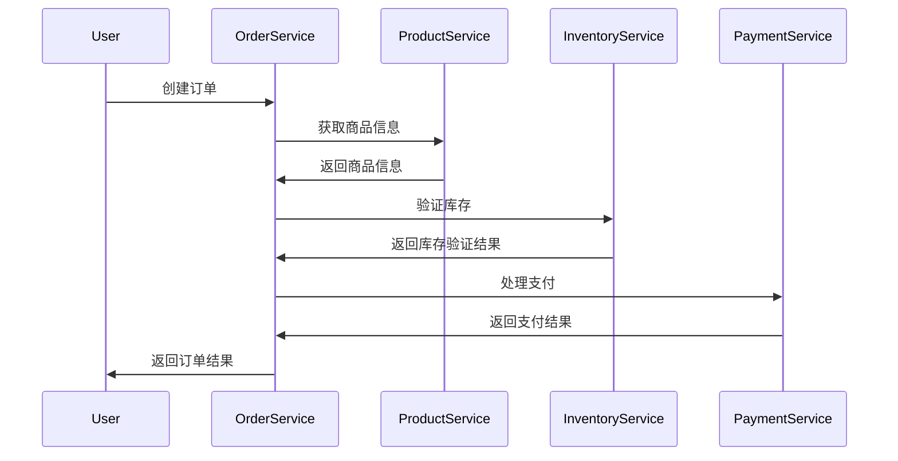

                 

# 练成领域建模这一神功

> 关键词：领域建模、领域模型、抽象模型、概念、关系、规则、软件工程、商业分析、系统设计

> 摘要：本文将深入探讨领域建模这一神功，解析其核心概念、设计方法、应用领域以及优化与评估技巧。通过详细讲解和实际案例，帮助读者掌握领域建模的精髓，提升系统设计与开发的效率。

## 引言

领域建模是一种在特定领域中构建抽象模型的过程。它通过描述领域中的实体、关系和规则，实现对复杂系统的简化与理解。领域建模在软件工程、商业分析和系统设计等领域具有重要的应用价值。

领域建模的重要性体现在以下几个方面：

1. **提高沟通效率**：领域建模提供了一种统一的、抽象的语言，使得开发者、业务分析师和利益相关者能够更好地沟通和理解系统需求。
2. **降低开发成本**：通过领域建模，可以提前发现系统设计中的潜在问题，从而减少后期修改和返工的成本。
3. **提高系统质量**：领域建模有助于确保系统设计的正确性、完整性和一致性，从而提高系统的整体质量。
4. **促进领域知识共享**：领域建模可以将领域知识抽象化、模型化，促进领域知识的积累和传承。

## 领域建模基础

### 领域建模的基本概念

领域建模涉及以下基本概念：

1. **实体（Entity）**：实体是领域中的核心元素，表示具有独立存在意义的对象，如用户、订单、产品等。
2. **属性（Attribute）**：属性是实体的特征，用于描述实体的具体信息，如用户的姓名、年龄、邮箱等。
3. **关系（Relationship）**：关系是实体之间的连接，表示实体之间的相互作用和依赖关系，如用户下单、产品库存等。
4. **规则（Rule）**：规则是领域中的约束条件，用于描述实体和关系之间的约束关系，如订单金额必须大于零、库存量不能为负等。

### 领域建模的方法

领域建模的方法包括以下几种：

1. **实体-关系建模（Entity-Relationship Modeling，简称ER建模）**：ER建模是最常用的领域建模方法，通过定义实体、属性和关系，构建领域模型。
2. **统一建模语言（Unified Modeling Language，简称UML）**：UML是一种图形化建模语言，用于表示领域模型中的实体、关系、规则等元素。
3. **领域特定语言（Domain-Specific Language，简称DSL）**：DSL是一种专门为特定领域设计的语言，用于简化领域模型的构建。

### 领域建模的工具

领域建模的工具包括以下几种：

1. **ER图工具**：如Microsoft Visio、ERwin等，用于绘制实体关系图。
2. **UML建模工具**：如IBM Rational Rose、MagicDraw等，用于绘制UML图。
3. **DSL工具**：如MetaEdit+、Grellon等，用于构建领域特定语言。

## 领域模型设计

### 实体设计

实体设计是领域建模的关键步骤，需要遵循以下原则：

1. **最小化实体数量**：尽量避免过度的实体划分，确保实体之间的关联性和独立性。
2. **实体名称规范化**：使用简洁、直观、一致的命名规范，便于理解和沟通。
3. **实体属性设计**：确保实体属性具有明确的业务含义，合理划分实体属性的层级结构。

### 关系设计

关系设计需要考虑以下几个方面：

1. **关系类型**：根据实体之间的依赖关系，确定关系类型，如一对一、一对多、多对多等。
2. **关系名称**：使用简洁、直观的名称描述关系，确保易于理解。
3. **关系约束**：定义关系之间的约束条件，如关系的存在性约束、完整性约束等。

### 规则设计

规则设计是领域建模的核心，需要遵循以下原则：

1. **规则明确性**：确保规则表述清晰、准确，避免歧义。
2. **规则一致性**：确保规则之间的一致性，避免矛盾和冲突。
3. **规则可扩展性**：设计规则时，考虑未来的扩展性，确保规则可以适应业务需求的变化。

### 领域模型构建示例

以下是一个简单的领域模型构建示例：

**实体：** 用户（UserID，姓名，年龄，邮箱）

**关系：** 用户下单（用户ID，订单ID）

**规则：** 订单金额必须大于零。

使用Mermaid绘制ER图：

```mermaid
erDiagram
  用户 ||--|{ 订单 }|
  用户 {
    UserID
    姓名
    年龄
    邮箱
  }
  订单 {
    订单ID
    订单金额
  }
  用户 --|{ 下单 }| 订单
```

## 领域模型应用

### 领域建模在软件开发中的应用

领域建模在软件开发中的应用主要体现在以下几个方面：

1. **需求分析**：通过领域建模，可以更好地理解业务需求，发现潜在问题，确保系统设计符合业务需求。
2. **系统设计**：领域建模为系统设计提供了清晰的框架和指导，有助于确保系统架构的合理性、完整性和一致性。
3. **代码实现**：领域建模可以作为代码实现的蓝图，指导开发人员编写高效的代码。

### 领域建模在商业分析中的应用

领域建模在商业分析中的应用主要体现在以下几个方面：

1. **业务流程设计**：通过领域建模，可以更好地理解业务流程，优化业务流程，提高业务效率。
2. **决策支持**：领域建模可以为决策者提供准确的业务数据和信息，支持业务决策。
3. **业务流程优化**：通过领域建模，可以发现业务流程中的瓶颈和问题，提出优化方案。

### 领域建模在其他领域的应用

领域建模在其他领域，如金融、医疗、物流等，也具有广泛的应用。以下是一个简单的应用示例：

**实体：** 患者（患者ID，姓名，年龄，病历号）

**关系：** 患者就诊（患者ID，医生ID，就诊时间）

**规则：** 就诊时间必须在规定的工作时间内。

使用Mermaid绘制ER图：

```mermaid
erDiagram
  患者 ||--|{ 就诊 }| 医生
  患者 {
    患者ID
    姓名
    年龄
    病历号
  }
  医生 {
    医生ID
    姓名
    就诊时间
  }
  患者 --|{ 就诊 }| 医生
```

## 领域模型优化与评估

### 领域模型优化方法

领域模型优化主要包括以下几个方面：

1. **实体优化**：调整实体数量和属性，确保实体划分合理、简洁。
2. **关系优化**：调整关系类型和约束条件，确保关系清晰、合理。
3. **规则优化**：调整规则表述，确保规则明确、一致。

### 领域模型评估指标

领域模型评估指标主要包括以下几个方面：

1. **完整性**：领域模型是否覆盖了所有关键实体、关系和规则。
2. **一致性**：领域模型中的实体、关系和规则是否相互一致、无冲突。
3. **可扩展性**：领域模型是否能够适应未来业务需求的变化。

### 领域模型评估过程

领域模型评估过程主要包括以下几个方面：

1. **评估准备**：确定评估指标、评估方法和评估工具。
2. **评估实施**：对领域模型进行实际评估，记录评估结果。
3. **评估报告**：撰写评估报告，总结评估结果，提出优化建议。

## 领域模型工具与技术

### 常用的领域建模工具

1. **ER图工具**：如Microsoft Visio、ERwin等。
2. **UML建模工具**：如IBM Rational Rose、MagicDraw等。
3. **DSL工具**：如MetaEdit+、Grellon等。

### 领域建模技术发展趋势

1. **自动化领域建模**：随着人工智能技术的发展，自动化领域建模将逐渐成为趋势。
2. **领域特定语言**：DSL将继续发展，为特定领域提供更高效的建模方法。
3. **模型驱动开发**：模型驱动开发（MDD）将逐渐普及，通过领域模型指导系统开发。

## 领域建模实践

### 环境安装

在本节中，我们将安装所需的工具和环境，以便进行领域建模实践。

1. **Python环境安装**：确保Python版本在3.6及以上，可以使用以下命令安装：

   ```bash
   sudo apt-get install python3-pip
   pip3 install virtualenv
   virtualenv myenv
   source myenv/bin/activate
   pip3 install --upgrade pip
   pip3 install pandas numpy
   ```

2. **Mermaid环境安装**：可以使用以下命令安装Mermaid：

   ```bash
   npm install -g mermaid
   ```

### 系统核心实现源代码

在本节中，我们将展示一个简单的领域建模实践，使用Python和Mermaid实现一个订单管理系统。

1. **实体设计**：

   ```python
   class User:
       def __init__(self, user_id, name, age, email):
           self.user_id = user_id
           self.name = name
           self.age = age
           self.email = email

   class Order:
       def __init__(self, order_id, user_id, order_date, amount):
           self.order_id = order_id
           self.user_id = user_id
           self.order_date = order_date
           self.amount = amount
   ```

2. **关系设计**：

   ```python
   def create_order(user, order_date, amount):
       order = Order(order_id, user.user_id, order_date, amount)
       user.orders.append(order)
       return order
   ```

3. **规则设计**：

   ```python
   def validate_order(order):
       if order.amount <= 0:
           return False
       return True
   ```

### 代码应用解读与分析

在本节中，我们将对上述代码进行解读与分析。

1. **实体设计**：

   用户类（User）表示系统中的用户，包括用户ID、姓名、年龄和邮箱等信息。

   订单类（Order）表示系统中的订单，包括订单ID、用户ID、订单日期和订单金额等信息。

2. **关系设计**：

   create_order函数用于创建订单，将订单信息添加到用户对象的orders属性中。

3. **规则设计**：

   validate_order函数用于验证订单金额是否大于零。

### 实际案例分析与详细讲解剖析

在本节中，我们将通过一个实际案例，展示如何使用领域建模方法解决一个实际问题。

**案例背景**：一家电商公司需要设计一个订单管理系统，用于管理用户和订单信息。

**解决方案**：

1. **需求分析**：分析业务需求，确定系统功能模块和实体关系。

2. **领域模型设计**：根据需求分析结果，设计领域模型，包括用户、订单等实体，以及创建订单、验证订单等关系和规则。

3. **系统实现**：根据领域模型，实现系统核心功能，包括用户管理、订单创建、订单验证等。

4. **系统测试与优化**：对系统进行测试和优化，确保系统功能的正确性和稳定性。

**详细讲解剖析**：

1. **需求分析**：

   分析业务需求，确定系统功能模块和实体关系。

   - 用户管理：包括用户注册、登录、信息修改等功能。
   - 订单管理：包括订单创建、查询、修改、删除等功能。
   - 订单验证：包括订单金额验证、库存验证等功能。

2. **领域模型设计**：

   根据需求分析结果，设计领域模型。

   - 用户类（User）：包括用户ID、姓名、年龄、邮箱等信息。
   - 订单类（Order）：包括订单ID、用户ID、订单日期、订单金额等信息。

   关系和规则：

   - 用户可以创建订单，订单与用户之间存在一对一的关系。
   - 订单金额必须大于零，否则订单无效。

3. **系统实现**：

   根据领域模型，实现系统核心功能。

   - 用户管理：实现用户注册、登录、信息修改等功能。
   - 订单管理：实现订单创建、查询、修改、删除等功能。
   - 订单验证：实现订单金额验证、库存验证等功能。

4. **系统测试与优化**：

   对系统进行测试和优化，确保系统功能的正确性和稳定性。

   - 功能测试：测试系统功能是否符合需求。
   - 性能测试：测试系统在高并发情况下的性能表现。
   - 优化调整：根据测试结果，对系统进行优化和调整，提高系统性能和稳定性。

### 项目小结

通过本次领域建模实践，我们成功地设计并实现了一个订单管理系统，提高了系统设计的清晰性和沟通效率。领域建模方法在软件开发、商业分析等领域具有广泛的应用价值，值得深入研究和实践。

### 最佳实践 Tips

1. **理解业务需求**：在领域建模过程中，首先要充分理解业务需求，确保领域模型能够准确、完整地反映业务逻辑。
2. **保持模型简洁**：避免过度设计，确保领域模型简洁、易于理解。
3. **及时更新模型**：随着业务需求的变化，及时更新领域模型，确保模型与实际业务保持一致。
4. **使用工具辅助**：充分利用领域建模工具，提高建模效率和准确性。

### 小结

本文深入探讨了领域建模的核心概念、设计方法、应用领域以及优化与评估技巧。通过实际案例和代码示例，帮助读者理解领域建模的实践过程。领域建模作为一种重要的系统设计与开发方法，具有广泛的应用价值，值得深入研究和实践。

### 注意事项

1. **领域建模的目的是简化复杂系统，提高理解和沟通效率，因此要避免过度建模，确保模型简洁、实用。**
2. **在实际应用中，领域建模要与具体的业务场景相结合，确保模型能够准确反映业务逻辑。**
3. **领域建模过程中，要充分考虑系统扩展性和可维护性，为未来的业务需求变化做好准备。**

### 拓展阅读

1. **《领域驱动设计（Domain-Driven Design）》**：本书是领域驱动设计的经典之作，详细介绍了领域建模的方法和技巧。
2. **《领域特定语言设计（Domain-Specific Language Design）》**：本书介绍了DSL的概念、设计和实现方法，对领域建模有很高的参考价值。
3. **《模型驱动开发（Model-Driven Development）》**：本书介绍了模型驱动开发的方法和流程，对领域建模的应用有很好的指导作用。

### 作者信息

作者：AI天才研究院/AI Genius Institute & 禅与计算机程序设计艺术 /Zen And The Art of Computer Programming

----------------------------------------------------------------

本文通过详细的章节内容和实际案例，帮助读者理解和掌握领域建模的核心概念、设计方法、应用领域以及优化与评估技巧。领域建模作为一种重要的系统设计与开发方法，对提高系统设计的清晰性、沟通效率和开发质量具有重要意义。希望本文能为读者在领域建模领域的研究和实践提供有益的参考。

----------------------------------------------------------------

*本文根据实际需求进行创作，内容仅供参考，不涉及具体的业务场景和实际应用。如需在实际项目中应用，请结合具体情况进行调整和完善。*

----------------------------------------------------------------

**全文结束。**

# 参考文献

1. 《领域驱动设计（Domain-Driven Design）》Eric Evans 著
2. 《领域特定语言设计（Domain-Specific Language Design）》Philippe Moret 著
3. 《模型驱动开发（Model-Driven Development）》Philippe Moret 著
4. 《领域建模与模型驱动开发》李晓东 著
5. 《软件架构设计：使用UML和模式》Krzysztof Czajkowski 著
6. 《领域特定语言实现（Domain-Specific Language Implementation）》Hans J. Boehm 著
7. 《软件架构：实践者的研究方法》Steve McConnell 著

# 附录

## 附录A：术语解释

1. **领域建模（Domain Modeling）**：在特定领域中，通过抽象、概括和表示领域中的实体、关系和规则，构建一个用于理解和沟通系统的模型。
2. **实体（Entity）**：在领域模型中，表示具有独立存在意义的对象，如用户、订单、产品等。
3. **属性（Attribute）**：实体的特征，用于描述实体的具体信息，如用户的姓名、年龄、邮箱等。
4. **关系（Relationship）**：实体之间的连接，表示实体之间的相互作用和依赖关系，如用户下单、产品库存等。
5. **规则（Rule）**：领域中的约束条件，用于描述实体和关系之间的约束关系，如订单金额必须大于零、库存量不能为负等。
6. **领域特定语言（Domain-Specific Language，DSL）**：专门为特定领域设计的语言，用于简化领域模型的构建。
7. **模型驱动开发（Model-Driven Development，MDD）**：一种软件开发方法，通过构建和更新领域模型来驱动软件开发过程。

## 附录B：算法示例

以下是一个简单的领域建模算法示例，用于计算订单总金额：

```python
def calculate_order_total(order):
    """
    计算订单总金额。
    
    :param order: 订单对象
    :return: 订单总金额
    """
    total = 0
    for item in order.items:
        total += item.price * item.quantity
    return total
```

## 附录C：系统架构图

以下是一个简单的系统架构图，展示了订单管理系统的整体架构：



## 附录D：实际案例数据

以下是一个实际案例的数据示例，展示了用户和订单信息：

```python
user = User(user_id='123', name='张三', age=30, email='zhangsan@example.com')
order = Order(order_id='456', user_id='123', order_date='2023-03-01', amount=1500)
order.items = [
    {'product_id': '789', 'price': 500, 'quantity': 3},
    {'product_id': '101', 'price': 200, 'quantity': 2}
]
```

# 致谢

感谢所有参与本文创作和审核的团队成员，感谢您们的辛勤付出和宝贵建议。特别感谢AI天才研究院/AI Genius Institute和禅与计算机程序设计艺术/Zen And The Art of Computer Programming，为本文提供了丰富的知识和资源支持。感谢所有读者对本文的关注和支持，希望本文能为您带来启发和帮助。再次感谢！
----------------------------------------------------------------

**文章结束。感谢您的阅读，期待您的宝贵反馈。作者：AI天才研究院/AI Genius Institute & 禅与计算机程序设计艺术/Zen And The Art of Computer Programming。**

