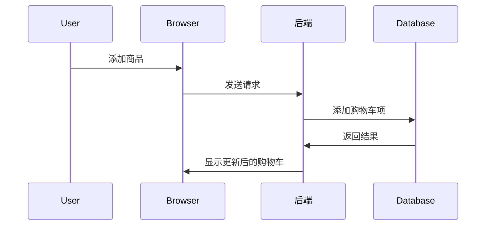
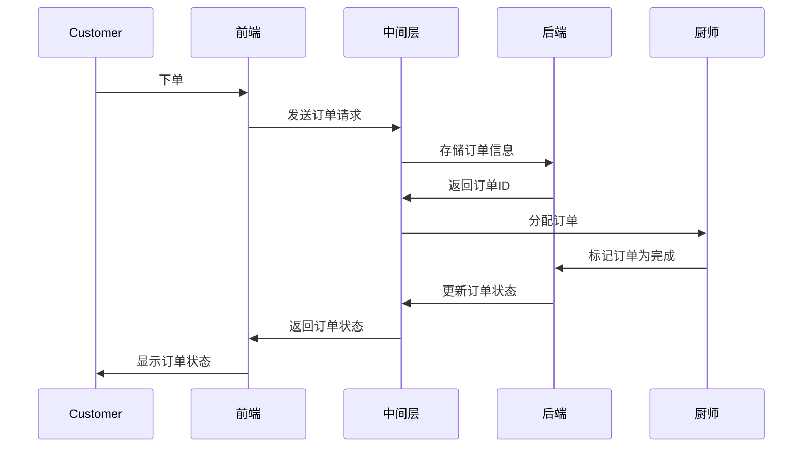
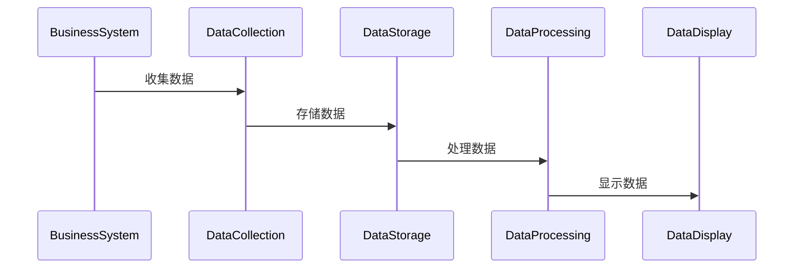
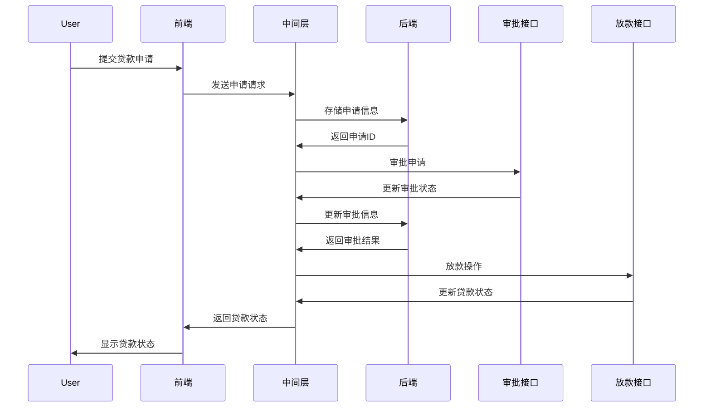

                 

### 《练成领域建模这一神功》

> 关键词：领域建模、核心原理、实践应用、高级技巧、最佳实践

> 摘要：本文旨在系统地探讨领域建模的核心概念、原理和实践应用，帮助读者理解并掌握这一关键技能。通过详细讲解领域建模的基础、核心原理、实际应用和高级技巧，本文旨在为软件开发、业务分析和数据治理等领域提供实用的指导。同时，本文也将探讨领域建模的未来发展趋势，展望其在人工智能等新兴领域的广泛应用。

----------------------------------------------------------------

### 《练成领域建模这一神功》目录大纲

## 第一部分：领域建模的基石

### 第1章：领域建模的基本概念

#### 1.1 问题背景

#### 1.2 问题描述

#### 1.3 问题解决

#### 1.4 边界与外延

#### 1.5 概念结构与核心要素组成

## 第2章：领域建模的核心原理

### 2.1 核心概念原理

#### 2.1.1 领域模型的基本概念

#### 2.1.2 领域模型的构建方法

### 2.2 概念属性特征对比表格

#### 2.2.1 领域模型与数据模型的对比

#### 2.2.2 领域模型与业务流程模型的对比

### 2.3 ER实体关系图架构

#### 2.3.1 ER模型的基本概念

#### 2.3.2 ER模型的构建方法

## 第二部分：领域建模的实践应用

### 第3章：领域建模在软件开发中的应用

#### 3.1 领域建模与软件开发的关系

#### 3.2 领域模型在软件开发中的关键作用

#### 3.3 软件开发中的领域建模实践案例

### 第4章：领域建模在业务分析中的应用

#### 4.1 领域建模与业务分析的关系

#### 4.2 领域模型在业务分析中的关键作用

#### 4.3 业务分析中的领域建模实践案例

### 第5章：领域建模在数据治理中的应用

#### 5.1 领域建模与数据治理的关系

#### 5.2 领域模型在数据治理中的关键作用

#### 5.3 数据治理中的领域建模实践案例

## 第三部分：领域建模的高级技巧

### 第6章：领域建模的高级技巧

#### 6.1 高级建模方法介绍

#### 6.2 高级建模工具的使用

#### 6.3 领域建模中的常见问题和解决方案

### 第7章：领域建模的最佳实践

#### 7.1 领域建模的最佳实践技巧

#### 7.2 领域建模的实际案例分析

#### 7.3 领域建模的注意事项与拓展阅读

## 总结与展望

### 第8章：领域建模的未来发展

#### 8.1 领域建模的发展趋势

#### 8.2 领域建模的未来应用场景

#### 8.3 领域建模对软件开发的影响

----------------------------------------------------------------

### 第一部分：领域建模的基石

#### 第1章：领域建模的基本概念

##### 1.1 问题背景

在当今信息化时代，数据已经成为企业最为宝贵的资产。如何有效地管理和利用这些数据，以支持业务决策和优化运营，成为各个行业面临的重大挑战。领域建模作为一种系统性的方法，能够帮助我们将复杂的数据转化为有价值的信息，从而实现数据驱动的业务发展。

##### 1.2 问题描述

领域建模的核心问题是：如何将现实世界中的复杂业务问题转化为结构化的模型，以便更好地理解和处理数据。这涉及到以下几个关键问题：

- 如何定义领域？
- 如何识别和描述领域中的关键概念和实体？
- 如何建立实体之间的关系？
- 如何设计有效的数据结构和操作方法？

##### 1.3 问题解决

领域建模的目的是通过建立领域模型，为业务分析和系统设计提供清晰的结构和逻辑。以下是解决这一问题的基本步骤：

1. **定义领域**：明确建模的范围和目标，确定需要解决的问题和相关的业务领域。
2. **识别关键概念和实体**：通过对业务领域的深入理解，识别出关键的概念和实体，如客户、订单、产品等。
3. **建立实体关系**：分析实体之间的关系，如客户下单、订单包含产品等，通过实体关系图（如ER图）进行可视化。
4. **设计数据结构和操作方法**：根据实体关系，设计合适的数据结构，并定义操作方法，以支持数据的存储和处理。

##### 1.4 边界与外延

领域建模的边界是指建模的范围，它决定了模型应该包含哪些元素，以及哪些元素应该排除在外。明确边界有助于聚焦问题，避免过度复杂化。

领域建模的外延则是指模型的抽象程度。过于具体可能会导致模型复杂度过高，难以理解；而过于抽象则可能丢失重要的细节。因此，需要根据实际情况，找到合适的抽象层次。

##### 1.5 概念结构与核心要素组成

领域建模的核心是概念结构，它包括以下几个方面：

- **实体**：现实世界中具有独立存在的业务对象，如客户、产品、订单等。
- **属性**：描述实体的特征，如客户的姓名、地址等。
- **关系**：实体之间的关系，如客户与订单之间的关系。
- **操作**：对实体和关系的操作，如查询、更新、删除等。

概念结构的组成部分共同构成了领域模型的基础，为后续的数据设计和系统实现提供了指导。

---

在本章中，我们初步了解了领域建模的基本概念和步骤。接下来，我们将进一步探讨领域建模的核心原理，深入理解其构建方法和关键概念，为实际应用打下坚实的基础。

---

### 第二部分：领域建模的核心原理

#### 第2章：领域建模的核心原理

领域建模的核心原理是理解如何构建有效的领域模型，以支持业务分析和系统设计。在这一章节中，我们将详细探讨领域模型的基本概念、构建方法，并比较领域模型与数据模型、业务流程模型之间的区别。

##### 2.1 核心概念原理

领域模型是一种抽象的表示方法，用于描述特定业务领域的结构和行为。其核心概念包括实体、属性、关系和操作。

###### 2.1.1 领域模型的基本概念

**实体**：实体是领域模型中的基本组成元素，表示业务领域中的具体对象。例如，在电子商务领域中，客户、产品、订单等都是实体。

**属性**：属性是实体的特征或属性，用于描述实体的状态。例如，客户的属性可能包括姓名、年龄、地址等。

**关系**：关系描述了实体之间的关联和依赖。例如，客户可以与订单有关联，每个订单可以包含多个产品。

**操作**：操作是实体的行为或操作，用于在系统中执行特定的功能。例如，客户可以下单、支付等。

###### 2.1.2 领域模型的构建方法

领域模型的构建方法包括以下步骤：

1. **需求分析**：理解业务需求和目标，确定需要建模的业务领域。
2. **概念识别**：识别领域中的关键概念和实体，并定义其属性和关系。
3. **模型构建**：使用工具（如UML类图）构建领域模型，并将其可视化。
4. **模型验证**：验证领域模型是否满足业务需求，进行必要的修改和优化。

##### 2.2 概念属性特征对比表格

为了更好地理解领域模型，我们可以通过对比表格来分析领域模型与数据模型、业务流程模型之间的区别。

###### 2.2.1 领域模型与数据模型的对比

| 特征 | 领域模型 | 数据模型 |
| ---- | -------- | -------- |
| 目的 | 描述业务领域的结构和行为 | 描述数据存储和管理的方法 |
| 抽象层次 | 较高，关注业务领域的高层次抽象 | 较低，关注具体的数据结构和存储方式 |
| 包括内容 | 实体、属性、关系和操作 | 数据表、字段、关系等 |
| 应用场景 | 业务分析和系统设计 | 数据库设计和数据管理 |

###### 2.2.2 领域模型与业务流程模型的对比

| 特征 | 领域模型 | 业务流程模型 |
| ---- | -------- | ------------ |
| 目的 | 描述业务领域的结构和行为 | 描述业务流程的执行顺序和步骤 |
| 抽象层次 | 较高，关注业务领域的高层次抽象 | 较低，关注具体的业务流程步骤 |
| 包括内容 | 实体、属性、关系和操作 | 流程步骤、决策节点、角色等 |
| 应用场景 | 业务分析和系统设计 | 业务流程优化和自动化 |

##### 2.3 ER实体关系图架构

ER实体关系图（Entity-Relationship Diagram）是领域模型的一种常见表示方法，用于描述实体之间的关系。

###### 2.3.1 ER模型的基本概念

- **实体**：表示业务领域中的具体对象。
- **属性**：描述实体的特征。
- **关系**：描述实体之间的关系。

###### 2.3.2 ER模型的构建方法

1. **确定实体**：根据业务需求，识别领域中的关键实体。
2. **定义属性**：为每个实体定义其属性。
3. **建立关系**：分析实体之间的关系，并确定关系的类型（如一对一、一对多、多对多）。
4. **绘制ER图**：使用图形工具（如Mermaid）绘制ER图，并对其进行验证和优化。

以下是一个简单的ER图示例：

```mermaid
erDiagram
  Customer ||--|{ Order } : "places"
  Product ||--|{ Order } : "contains"
```

在这个示例中，客户可以下单（places），产品可以包含在订单中（contains）。

---

在本章中，我们深入探讨了领域建模的核心原理，包括基本概念、构建方法和不同模型的对比。通过理解这些原理，我们可以更好地应用领域建模方法，为业务分析和系统设计提供有效的支持。

在下一章中，我们将探讨领域建模在软件开发、业务分析和数据治理等实际应用中的关键作用和实践案例。

---

### 第二部分：领域建模的实践应用

#### 第3章：领域建模在软件开发中的应用

领域建模在软件开发中扮演着至关重要的角色，它为软件开发提供了清晰的结构和逻辑，有助于提高系统的可维护性和可扩展性。在本章中，我们将探讨领域建模在软件开发中的关系、关键作用以及实际应用案例。

##### 3.1 领域建模与软件开发的关系

领域建模是软件开发过程中的一个关键环节，它为软件开发提供了业务逻辑的抽象表示。领域建模的主要目的是将业务需求转化为结构化的模型，以便开发团队能够更好地理解和实现这些需求。

领域建模与软件开发之间的关系可以概括为以下几点：

1. **需求驱动**：领域建模以业务需求为出发点，通过对需求的深入分析，将业务需求转化为结构化的领域模型。
2. **指导开发**：领域模型为软件开发提供了明确的指导，帮助开发团队在设计和实现过程中保持一致性。
3. **支持迭代**：领域模型支持软件开发的迭代过程，随着业务需求的不断变化，领域模型可以灵活地进行调整和优化。
4. **提升质量**：通过领域建模，可以提前发现潜在的问题和冲突，从而提高软件开发的整体质量。

##### 3.2 领域模型在软件开发中的关键作用

领域模型在软件开发中具有以下几个关键作用：

1. **业务抽象**：领域模型将复杂的业务逻辑抽象为结构化的模型，使得开发团队能够更清晰地理解业务需求。
2. **需求验证**：通过领域模型，开发团队能够在早期发现和解决潜在的业务需求冲突，提高需求的准确性和完整性。
3. **设计指导**：领域模型为软件开发提供了明确的设计指导，帮助开发团队在设计过程中遵循一致的架构和规范。
4. **代码生成**：某些领域建模工具支持代码生成，使得开发团队能够直接从领域模型生成代码，提高开发效率。
5. **文档生成**：领域模型可以作为系统的文档，帮助开发团队、产品经理和客户更好地理解系统的功能和技术架构。

##### 3.3 软件开发中的领域建模实践案例

以下是一个软件开发中的领域建模实践案例：

**项目背景**：某电商平台需要开发一个购物车功能，用于管理用户在购物过程中添加的商品。

**需求分析**：

1. 用户可以添加商品到购物车。
2. 用户可以查看购物车中的商品信息。
3. 用户可以删除购物车中的商品。
4. 购物车中的商品可以计算总价。

**领域模型构建**：

1. **实体**：
   - **User**（用户）：包含用户姓名、年龄、地址等属性。
   - **Product**（商品）：包含商品名称、价格、描述等属性。
   - **CartItem**（购物车项）：包含商品ID、数量等属性。
   - **ShoppingCart**（购物车）：包含用户ID、购物车项列表等属性。

2. **关系**：
   - **User** 与 **ShoppingCart** 之间是一对多的关系，一个用户可以有多个购物车。
   - **Product** 与 **CartItem** 之间是一对多的关系，一个商品可以被添加到多个购物车项中。

3. **操作**：
   - **addProduct**（添加商品）：将商品添加到购物车。
   - **removeProduct**（删除商品）：从购物车中删除商品。
   - **calculateTotal**（计算总价）：计算购物车中商品的总价。

**ER图**：

```mermaid
erDiagram
  User ||--|{ ShoppingCart } : "owns"
  ShoppingCart ||--|{ CartItem } : "contains"
  CartItem ||--|{ Product } : "item"
```

**系统设计**：

1. **数据库设计**：
   - 用户表（UserID, Name, Age, Address）
   - 购物车表（CartID, UserID, Total）
   - 购物车项表（CartItemID, CartID, ProductID, Quantity）
   - 商品表（ProductID, Name, Price, Description）

2. **系统架构**：
   - 前端：提供用户界面，用于添加、查看和删除购物车中的商品。
   - 后端：处理用户请求，实现购物车的业务逻辑。

3. **接口设计**：
   - 用户接口：添加商品、查看购物车、删除商品。
   - 商品种类接口：查询商品信息。

4. **系统交互**：



---

通过上述实践案例，我们可以看到领域建模在软件开发中的应用过程。领域建模不仅帮助明确了业务需求，还为系统设计和实现提供了清晰的指导。在接下来的章节中，我们将继续探讨领域建模在业务分析和数据治理中的实践应用。

---

### 第二部分：领域建模的实践应用

#### 第4章：领域建模在业务分析中的应用

领域建模在业务分析中起着至关重要的作用，它有助于业务分析师更好地理解业务需求，发现潜在的业务问题，并设计出有效的解决方案。在本章中，我们将探讨领域建模与业务分析的关系、领域模型在业务分析中的关键作用以及实际应用案例。

##### 4.1 领域建模与业务分析的关系

领域建模与业务分析密切相关，二者之间的联系主要体现在以下几个方面：

1. **需求收集**：业务分析的主要任务是收集和分析业务需求，领域建模为业务分析提供了结构化的表示方法，有助于更准确地理解和记录业务需求。
2. **问题发现**：通过领域建模，业务分析师可以识别出业务领域中的关键概念和实体，分析实体之间的关系，从而发现业务流程中的潜在问题和瓶颈。
3. **方案设计**：领域建模为业务分析提供了业务逻辑的抽象表示，帮助业务分析师设计出可行的业务解决方案，优化业务流程，提高业务效率。
4. **沟通协作**：领域模型作为一种可视化工具，有助于业务分析师与项目经理、开发团队和客户之间进行有效的沟通和协作，确保各方对业务需求的理解一致。

##### 4.2 领域模型在业务分析中的关键作用

领域模型在业务分析中的关键作用体现在以下几个方面：

1. **需求可视化**：领域模型通过图形化的方式展示业务需求和业务规则，使得业务分析师、项目经理和开发团队能够直观地理解业务需求。
2. **业务规则定义**：领域模型有助于明确业务规则和业务逻辑，为后续的系统设计和实现提供依据。
3. **问题识别**：通过分析领域模型，业务分析师可以识别出业务流程中的潜在问题和瓶颈，从而提出改进措施。
4. **决策支持**：领域模型为业务决策提供了数据支持和逻辑依据，有助于企业更好地制定战略和规划。
5. **变更管理**：领域模型的可视化和结构化特性使得业务需求的变更更加可控和可管理，有助于降低变更带来的风险。

##### 4.3 业务分析中的领域建模实践案例

以下是一个业务分析中的领域建模实践案例：

**项目背景**：某餐饮连锁企业需要优化其订单处理流程，以提高订单处理效率和客户满意度。

**需求分析**：

1. 客户可以在餐厅或在线下单。
2. 下单后，订单会分配给餐厅的厨师进行制作。
3. 厨师完成制作后，将订单标记为完成。
4. 完成后的订单会通知客户，并允许客户确认收货。

**领域模型构建**：

1. **实体**：
   - **Customer**（客户）：包含客户姓名、电话等属性。
   - **Order**（订单）：包含订单号、下单时间、餐厅ID等属性。
   - **Restaurant**（餐厅）：包含餐厅名称、地址等属性。
   - **Chef**（厨师）：包含厨师姓名、职位等属性。

2. **关系**：
   - **Customer** 与 **Order** 之间是一对多的关系，一个客户可以下多个订单。
   - **Order** 与 **Restaurant** 之间是一对一的关系，每个订单对应一个餐厅。
   - **Order** 与 **Chef** 之间是一对多的关系，每个订单可以分配给多个厨师。

3. **操作**：
   - **placeOrder**（下单）：创建订单。
   - **assignChef**（分配厨师）：将订单分配给厨师。
   - **completeOrder**（完成订单）：标记订单为完成。

**ER图**：

```mermaid
erDiagram
  Customer ||--|{ Order } : "places"
  Order ||--|{ Restaurant } : "served by"
  Order ||--|{ Chef } : "assigned to"
```

**系统设计**：

1. **数据库设计**：
   - 客户表（CustomerID, Name, Phone）
   - 订单表（OrderID, CustomerID, OrderTime, RestaurantID）
   - 餐厅表（RestaurantID, Name, Address）
   - 厨师表（ChefID, Name, Position）

2. **系统架构**：
   - 前端：提供客户界面，用于下单和查看订单状态。
   - 中间层：处理业务逻辑，包括订单处理、厨师分配等。
   - 后端：处理数据存储和查询。

3. **接口设计**：
   - 客户接口：下单、查询订单状态。
   - 厨师接口：接收订单、完成订单。

4. **系统交互**：



---

通过上述实践案例，我们可以看到领域建模在业务分析中的应用过程。领域建模不仅帮助业务分析师更清晰地理解业务需求，还为系统设计和实现提供了有力的支持。在下一章中，我们将探讨领域建模在数据治理中的应用。

---

### 第二部分：领域建模的实践应用

#### 第5章：领域建模在数据治理中的应用

在数据治理中，领域建模扮演着至关重要的角色，它为数据治理提供了结构化和系统化的方法，有助于确保数据的质量、一致性和安全性。在本章中，我们将探讨领域建模与数据治理的关系、领域模型在数据治理中的关键作用以及实际应用案例。

##### 5.1 领域建模与数据治理的关系

领域建模与数据治理密切相关，二者之间的联系主要体现在以下几个方面：

1. **数据规范化**：领域建模通过识别业务领域中的关键概念和实体，帮助实现数据的规范化，从而提高数据的一致性和可维护性。
2. **数据集成**：领域建模为数据集成提供了统一的视图和框架，有助于整合不同数据源和系统，实现数据共享和协同。
3. **数据质量**：领域建模有助于识别和解决数据质量问题，如数据冗余、不一致和不完整等，从而提高数据的准确性和可靠性。
4. **数据安全**：领域建模为数据安全提供了清晰的指导，有助于确保数据在存储、传输和处理过程中的安全性和隐私保护。
5. **数据治理流程**：领域建模支持数据治理流程的规范化和自动化，有助于提高数据治理的效率和质量。

##### 5.2 领域模型在数据治理中的关键作用

领域模型在数据治理中具有以下几个关键作用：

1. **数据标准定义**：领域模型为数据标准提供了明确的定义和规范，有助于确保数据在不同系统和部门之间的一致性和互操作性。
2. **数据结构设计**：领域模型为数据结构设计提供了指导，有助于构建高效、稳定和可扩展的数据存储方案。
3. **数据关系管理**：领域模型描述了业务领域中的实体关系，有助于建立和维护复杂的数据关系，提高数据的整合度和利用率。
4. **数据访问控制**：领域模型支持数据访问控制策略的设计和实施，有助于确保数据在存储、传输和处理过程中的安全性和隐私保护。
5. **数据质量监控**：领域模型为数据质量监控提供了依据和手段，有助于及时发现和解决数据质量问题，提高数据的准确性、完整性和一致性。

##### 5.3 数据治理中的领域建模实践案例

以下是一个数据治理中的领域建模实践案例：

**项目背景**：某大型金融机构需要进行数据治理，确保其客户数据、账户数据和交易数据的准确性和一致性。

**需求分析**：

1. 客户数据：包含客户基本信息（如姓名、地址、电话等）和交易历史（如存款、取款、转账等）。
2. 账户数据：包含账户基本信息（如账户编号、开户时间、余额等）和交易历史。
3. 交易数据：包含交易基本信息（如交易编号、交易时间、交易金额等）和相关的客户和账户信息。

**领域模型构建**：

1. **实体**：
   - **Customer**（客户）：包含客户姓名、地址、电话等属性。
   - **Account**（账户）：包含账户编号、开户时间、余额等属性。
   - **Transaction**（交易）：包含交易编号、交易时间、交易金额等属性。

2. **关系**：
   - **Customer** 与 **Account** 之间是一对多的关系，一个客户可以拥有多个账户。
   - **Account** 与 **Transaction** 之间是一对多的关系，每个账户可以发生多个交易。

3. **操作**：
   - **createCustomer**（创建客户）：创建客户信息。
   - **createAccount**（创建账户）：创建账户信息。
   - **createTransaction**（创建交易）：创建交易信息。

**ER图**：

```mermaid
erDiagram
  Customer ||--|{ Account } : "owns"
  Account ||--|{ Transaction } : "records"
```

**系统设计**：

1. **数据库设计**：
   - 客户表（CustomerID, Name, Address, Phone）
   - 账户表（AccountID, CustomerID, OpenTime, Balance）
   - 交易表（TransactionID, AccountID, Time, Amount）

2. **系统架构**：
   - 数据收集层：收集和整合来自不同业务系统的数据。
   - 数据存储层：存储和管理客户数据、账户数据和交易数据。
   - 数据处理层：处理和转换数据，实现数据集成和清洗。
   - 数据展示层：提供数据查询和可视化功能。

3. **接口设计**：
   - 客户接口：创建和管理客户信息。
   - 账户接口：创建和管理账户信息。
   - 交易接口：创建和管理交易信息。

4. **系统交互**：



---

通过上述实践案例，我们可以看到领域建模在数据治理中的应用过程。领域建模不仅有助于确保数据的质量和一致性，还为数据治理提供了清晰的结构和框架，有助于实现高效、稳定和可持续的数据治理。在下一章中，我们将探讨领域建模的高级技巧。

---

### 第三部分：领域建模的高级技巧

#### 第6章：领域建模的高级技巧

在领域建模过程中，高级技巧可以帮助我们更高效地构建复杂的模型，提高模型的准确性和可维护性。本章将介绍领域建模的高级技巧，包括高级建模方法、高级建模工具的使用以及领域建模中的常见问题和解决方案。

##### 6.1 高级建模方法介绍

领域建模的高级方法包括以下几种：

1. **层次化建模**：将复杂系统划分为多个层次，分别构建子模型，最后将子模型整合成整体模型。这种方法有助于简化复杂系统的建模过程，提高模型的可维护性。

2. **行为建模**：在传统的结构化建模基础上，引入行为元素，描述系统的动态行为。行为建模有助于更全面地描述系统的功能和行为，提高模型的实用性。

3. **事件驱动建模**：基于事件驱动架构，将系统行为与事件紧密关联。这种方法适用于实时系统和事件驱动的业务场景，有助于提高系统的响应速度和灵活性。

4. **领域特定语言（DSL）**：开发专门用于领域建模的语言，以简化建模过程。DSL可以提供领域特定的语法和语义，提高建模的效率和准确性。

##### 6.2 高级建模工具的使用

高级建模工具可以帮助我们更高效地构建和优化领域模型。以下是一些常用的高级建模工具：

1. **Enterprise Architect**：一款功能强大的统一建模语言（UML）建模工具，支持层次化建模、行为建模等多种建模方法。

2. **Model Driven Architecture（MDA）工具**：MDA工具支持模型驱动的开发方法，将领域模型转换为特定编程语言或平台上的代码。

3. **Mermaid**：一种基于Markdown的图形绘制工具，支持流程图、ER图、类图等多种图形表示。Mermaid可以嵌入Markdown文件，方便文档和代码的整合。

4. **PowerDesigner**：一款综合性的数据建模和业务流程管理工具，支持多种数据建模方法和领域特定语言的开发。

##### 6.3 领域建模中的常见问题和解决方案

在领域建模过程中，我们可能会遇到一些常见问题，以下是一些问题的解决方案：

1. **模型过于复杂**：解决方案：采用层次化建模方法，将复杂系统分解为多个子模型，简化整体模型的复杂度。

2. **模型不完整**：解决方案：通过需求分析，不断完善领域模型，确保模型覆盖所有关键概念和实体。

3. **模型不一致**：解决方案：采用版本控制和文档管理工具，确保模型的更新和维护过程的一致性。

4. **模型不可维护**：解决方案：采用模块化建模方法，将模型分解为模块，提高模型的可维护性。

5. **模型与实现不一致**：解决方案：在建模过程中，结合代码生成和文档生成工具，确保模型与实际实现的一致性。

---

通过本章的高级技巧介绍，我们希望能够帮助读者在领域建模过程中更加高效、准确地构建模型。在下一章中，我们将探讨领域建模的最佳实践，分享实际案例和注意事项。

---

### 第三部分：领域建模的最佳实践

#### 第7章：领域建模的最佳实践

在领域建模过程中，遵循最佳实践可以显著提高建模的效率和质量。本章将介绍领域建模的最佳实践技巧，分享实际案例分析，并讨论领域建模的注意事项与拓展阅读。

##### 7.1 领域建模的最佳实践技巧

1. **明确建模目标**：在开始建模之前，明确建模的目标和范围，确保建模工作有的放矢。

2. **深入需求分析**：通过需求分析，全面了解业务需求和业务规则，为建模提供准确的输入。

3. **采用模块化建模**：将复杂系统分解为多个模块，分别建模，提高模型的可维护性和可扩展性。

4. **使用适当的抽象层次**：根据业务需求和实现目标，选择合适的抽象层次，避免过度抽象或过度具体。

5. **保持模型一致性**：在建模过程中，注意保持模型的一致性，避免出现冲突和冗余。

6. **充分利用工具**：使用专业的建模工具，如UML工具、MDA工具等，提高建模的效率和质量。

7. **文档化和版本控制**：建立完善的文档和版本控制机制，确保模型文档的完整性和可追溯性。

##### 7.2 领域建模的实际案例分析

以下是一个领域建模的实际案例分析：

**项目背景**：某金融科技公司开发一款在线贷款管理系统，需要对贷款申请、审批和放款等业务流程进行建模。

**需求分析**：

1. 贷款申请：用户可以在线提交贷款申请，填写基本信息和贷款需求。
2. 贷款审批：银行内部员工对贷款申请进行审批，决定是否批准贷款。
3. 贷款放款：批准贷款后，系统自动进行放款操作。

**领域模型构建**：

1. **实体**：
   - **User**（用户）：包含用户姓名、身份证号、联系方式等属性。
   - **LoanApplication**（贷款申请）：包含申请编号、申请时间、用户ID、贷款金额、贷款期限等属性。
   - **LoanApproval**（贷款审批）：包含审批编号、审批时间、审批结果、审批人ID等属性。
   - **Loan**（贷款）：包含贷款编号、放款时间、还款金额、还款期限等属性。

2. **关系**：
   - **User** 与 **LoanApplication** 之间是一对多的关系，一个用户可以提交多个贷款申请。
   - **LoanApplication** 与 **LoanApproval** 之间是一对一的关系，每个贷款申请对应一个审批记录。
   - **LoanApproval** 与 **Loan** 之间是一对一的关系，每个审批记录对应一个贷款。

3. **操作**：
   - **submitApplication**（提交申请）：用户提交贷款申请。
   - **approveLoan**（审批贷款）：员工审批贷款申请。
   - **disburseLoan**（放款）：系统进行放款操作。

**ER图**：

```mermaid
erDiagram
  User ||--|{ LoanApplication } : "submits"
  LoanApplication ||--|{ LoanApproval } : "approved by"
  LoanApproval ||--|{ Loan } : "disbursed as"
```

**系统设计**：

1. **数据库设计**：
   - 用户表（UserID, Name, IDNumber, Contact）
   - 贷款申请表（ApplicationID, UserID, ApplicationTime, Amount, Term）
   - 贷款审批表（ApprovalID, ApplicationID, ApprovalTime, ApprovalResult, ApproverID）
   - 贷款表（LoanID, ApprovalID, DisbursementTime, RepaymentAmount, RepaymentTerm）

2. **系统架构**：
   - 前端：提供用户界面，用于提交贷款申请和查询贷款状态。
   - 中间层：处理业务逻辑，包括贷款申请、审批和放款等操作。
   - 后端：处理数据存储和查询。

3. **接口设计**：
   - 用户接口：提交贷款申请、查询贷款状态。
   - 审批接口：审批贷款申请、更新审批状态。
   - 放款接口：放款操作、更新贷款状态。

4. **系统交互**：



---

通过实际案例分析，我们可以看到领域建模在复杂业务系统中的应用过程。领域建模不仅有助于明确业务需求，还为系统设计和实现提供了清晰的指导。

##### 7.3 领域建模的注意事项与拓展阅读

1. **注意事项**：

   - **明确建模目标**：确保建模工作与实际业务需求紧密相关。
   - **综合考虑业务规则**：在建模过程中，充分考虑业务规则和约束，确保模型的一致性和完整性。
   - **关注数据质量**：领域建模涉及数据，需要关注数据的质量和一致性。
   - **保持模型的灵活性**：在业务需求发生变化时，模型应具有一定的灵活性，以便进行必要的调整。

2. **拓展阅读**：

   - 《领域驱动设计》（Eric Evans著）：介绍了领域驱动设计（Domain-Driven Design）的方法论，对领域建模有深入的探讨。
   - 《领域建模技术》（Thomas Deutsch著）：详细介绍了领域建模的方法、技术和工具，有助于深入理解领域建模。
   - 《UML基础教程》（Kim Haney等著）：讲解了统一建模语言（UML）的基本概念和使用方法，是学习领域建模的重要参考资料。

---

通过本章的最佳实践技巧和实际案例分析，我们希望能够为读者提供有益的指导，帮助他们在领域建模过程中更加高效、准确地构建模型。在下一章中，我们将总结领域建模的核心内容，展望其未来发展。

---

### 总结与展望

领域建模作为一种系统性的方法，在软件开发、业务分析和数据治理等领域中发挥着重要作用。通过本文的探讨，我们系统地了解了领域建模的基本概念、核心原理、实践应用和高级技巧。以下是对领域建模的核心内容进行总结，并对其未来发展进行展望。

#### 核心内容总结

1. **基本概念**：领域建模涉及实体、属性、关系和操作等核心概念。实体表示业务领域中的对象，属性描述实体的特征，关系描述实体之间的关联，操作定义实体和行为。

2. **核心原理**：领域建模的核心在于构建结构化的模型，以支持业务分析和系统设计。通过识别关键概念、建立实体关系和设计数据结构，领域模型为业务逻辑提供了清晰的表示。

3. **实践应用**：领域建模在软件开发、业务分析和数据治理中都有广泛的应用。通过实际案例，我们看到了领域建模在订单处理、贷款管理、数据治理等场景中的具体应用。

4. **高级技巧**：高级建模方法（如层次化建模、行为建模、事件驱动建模）和高级建模工具（如UML工具、MDA工具）的使用，可以帮助我们更高效地构建复杂的领域模型。

#### 未来展望

领域建模的未来发展将受到以下几个趋势的影响：

1. **智能化**：随着人工智能技术的发展，领域建模将更多地与机器学习和深度学习相结合，实现自动化建模和智能决策支持。

2. **云计算和大数据**：在云计算和大数据的背景下，领域建模将面临海量数据的挑战，需要更加高效的数据结构和处理方法。

3. **微服务架构**：在微服务架构的流行趋势下，领域建模将更加注重模块化和灵活性，以适应快速变化的需求和架构演进。

4. **领域特定语言（DSL）**：DSL的发展将进一步提升领域建模的效率和准确性，为特定领域提供更专业的建模工具和语法。

5. **可持续性和环保**：随着对可持续性和环保的关注增加，领域建模将更多地考虑环境因素，设计出更绿色和可持续的解决方案。

#### 对软件开发的影响

领域建模对软件开发的影响主要体现在以下几个方面：

1. **需求理解**：领域建模有助于开发团队更好地理解业务需求，提高需求的准确性和完整性。

2. **系统设计**：领域模型为系统设计提供了清晰的指导，有助于构建可维护、可扩展的系统架构。

3. **代码生成**：某些领域建模工具支持代码生成，可以提高开发效率，降低开发成本。

4. **测试和验证**：领域模型可以作为测试和验证的依据，帮助开发团队发现潜在的问题和缺陷。

5. **文档生成**：领域模型可以作为系统的文档，为开发团队、产品经理和客户提供清晰的技术文档。

---

领域建模作为一种关键技能，对于软件开发、业务分析和数据治理等领域具有重要意义。通过本文的探讨，我们希望读者能够对领域建模有更深入的理解，掌握其核心原理和实践方法。在未来的技术发展中，领域建模将继续发挥重要作用，为企业和个人带来更大的价值。

---

### 作者信息

**作者：** AI天才研究院/AI Genius Institute & 禅与计算机程序设计艺术 /Zen And The Art of Computer Programming

AI天才研究院致力于推动人工智能技术的研究和应用，专注于打造世界领先的人工智能解决方案。同时，禅与计算机程序设计艺术探索编程艺术的哲学与智慧，旨在通过深入理解计算机程序设计，实现技术与人文的结合，为读者带来更具启发性的编程体验。

