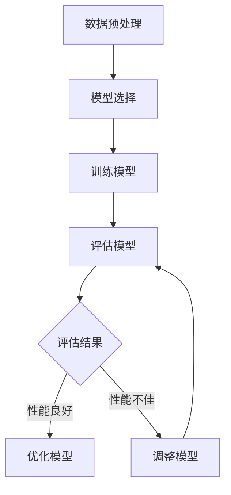
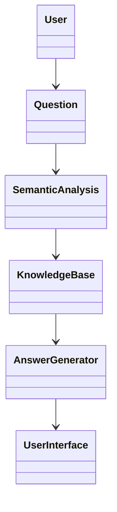
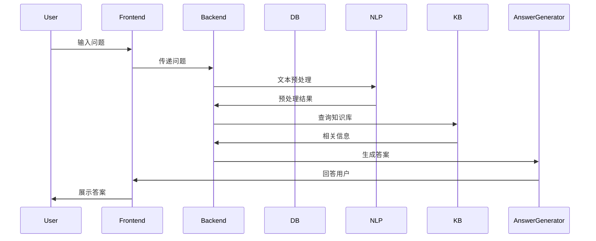
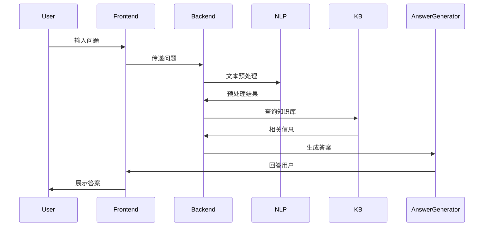

                 

### 《维特根斯坦与塞尔：人工智能的哲学基础》

> 关键词：维特根斯坦、塞尔、人工智能、哲学基础、算法、系统架构、项目实战

> 摘要：本文深入探讨了维特根斯坦和塞尔这两位哲学巨匠对人工智能领域的深远影响。通过梳理他们的哲学思想，分析其在人工智能中的应用，我们旨在构建一个理论框架，为理解人工智能的哲学基础提供新的视角。本文分为六个部分，包括背景介绍、核心概念与联系、算法原理讲解、系统分析与架构设计方案、项目实战以及最佳实践 tips 和小结，旨在为读者提供一个全面、深入的关于人工智能哲学基础的指南。

## 维特根斯坦与塞尔：人工智能的哲学基础

### 第一部分：背景介绍

#### 第1章 问题背景
- 人工智能的历史与发展
- 维特根斯坦与塞尔在哲学领域的贡献
- 人工智能在哲学研究中的重要性

#### 第2章 问题描述
- 人工智能中的哲学问题
- 维特根斯坦与塞尔如何回答这些问题
- 人工智能与哲学交叉研究的意义

#### 第3章 问题解决
- 维特根斯坦的哲学思想与人工智能
- 塞尔的哲学思想与人工智能
- 人工智能哲学基础的理论框架

#### 第4章 边界与外延
- 人工智能哲学基础的研究范围
- 维特根斯坦与塞尔的研究边界
- 人工智能哲学与其他学科的关联

#### 第5章 概念结构与核心要素组成
- 人工智能中的核心概念
- 维特根斯坦与塞尔的核心哲学观点
- 人工智能哲学基础的核心要素

### 第二部分：核心概念与联系

#### 第6章 维特根斯坦的哲学思想
- 维特根斯坦的生平与思想发展
- 语言哲学的核心理念
- 维特根斯坦与人工智能的关系

#### 第7章 塞尔的哲学思想
- 塞尔的生平与思想发展
- 认知科学的理论基础
- 塞尔与人工智能的关系

#### 第8章 核心概念属性特征对比表格
- 维特根斯坦与塞尔的核心概念对比
- 人工智能中的哲学概念对比

#### 第9章 ER实体关系图架构
- 人工智能哲学基础中的主要实体
- 维特根斯坦与塞尔的研究实体关系

### 第三部分：算法原理讲解

#### 第10章 人工智能算法原理
- 人工智能算法的基本概念
- 机器学习算法的分类
- 人工智能算法的流程

#### 第11章 维特根斯坦与塞尔对算法的影响
- 维特根斯坦的语言哲学对算法的影响
- 塞尔的认识论对算法的影响

#### 第12章 算法mermaid流程图
- 维特根斯坦与塞尔影响下的人工智能算法流程图

#### 第13章 Python源代码详解
- 人工智能算法的Python实现
- 算法原理的详细讲解和举例说明

#### 第14章 算法原理的数学模型和公式
- 人工智能算法的数学模型
- 公式的详细讲解

### 第四部分：系统分析与架构设计方案

#### 第15章 问题场景介绍
- 人工智能在哲学研究中的应用场景
- 维特根斯坦与塞尔思想在人工智能中的应用

#### 第16章 系统功能设计
- 系统的功能模块
- 领域模型mermaid类图

#### 第17章 系统架构设计
- 系统的整体架构
- 系统架构mermaid架构图

#### 第18章 系统接口设计
- 系统的接口设计
- 系统接口设计流程

#### 第19章 系统交互mermaid序列图
- 系统各模块之间的交互流程
- 系统交互mermaid序列图

### 第五部分：项目实战

#### 第20章 环境安装
- 人工智能开发环境搭建
- 维特根斯坦与塞尔思想库安装

#### 第21章 系统核心实现源代码
- 人工智能算法的核心代码实现
- 维特根斯坦与塞尔思想的应用代码实现

#### 第22章 代码应用解读与分析
- 代码的解读与分析
- 人工智能算法的应用

#### 第23章 实际案例分析和详细讲解剖析
- 实际案例的引入
- 案例的详细讲解和剖析

#### 第24章 项目小结
- 项目总结
- 项目中的亮点与不足

### 第六部分：最佳实践 tips、小结、注意事项、拓展阅读等内容

#### 第25章 最佳实践 tips
- 人工智能与哲学交叉研究的实践经验
- 维特根斯坦与塞尔思想在人工智能中的应用经验

#### 第26章 小结
- 全书内容的总结
- 研究成果的归纳

#### 第27章 注意事项
- 人工智能哲学基础研究中的注意事项
- 维特根斯坦与塞尔思想应用中的注意事项

#### 第28章 拓展阅读
- 相关参考文献
- 进一步研究的方向

---

### 第一部分：背景介绍

#### 第1章 问题背景

人工智能（AI）作为当今科技领域的明星，其发展迅速且影响深远。从早期的符号逻辑到现代的深度学习，AI经历了多次技术革新。然而，随着技术的进步，人工智能领域也面临着一系列深刻的哲学问题。例如，人工智能是否能够真正理解人类语言？它们是否拥有意识？这些问题的答案不仅关乎技术的实现，更涉及哲学的根本问题。

路德维希·维特根斯坦（Ludwig Wittgenstein）和约翰·塞尔（John Searle）是20世纪最重要的哲学家之一，他们的思想对人工智能的发展产生了深远影响。维特根斯坦以其独特的语言哲学观点，强调了意义与使用之间的关系，这对于理解自然语言处理和人工智能中的语义理解具有重要意义。塞尔则以其“中文房间”论证，质疑了强人工智能的可能性，为人工智能的研究提供了重要的哲学基础。

本章节将介绍人工智能的历史与发展，探讨维特根斯坦和塞尔在哲学领域的贡献，并阐述人工智能在哲学研究中的重要性。

#### 第2章 问题描述

人工智能领域中的哲学问题主要涉及以下几个方面：

1. **人工智能的语义理解问题**：人工智能是否能够真正理解人类语言，或者只是表面上的模拟？
2. **人工智能的意识问题**：人工智能是否能够拥有意识，或者只是执行预设指令的工具？
3. **人工智能的自我意识问题**：人工智能是否能够形成自我意识，或者它们只是对数据的处理？
4. **人工智能的道德和伦理问题**：人工智能在决策过程中是否能够遵循道德原则，如何确保其行为不会对人类社会造成负面影响？

维特根斯坦和塞尔从不同的角度回答了这些问题。维特根斯坦认为，语言的真正意义在于其使用，而不是其符号表示。这为人工智能的自然语言处理提供了哲学基础。塞尔则通过“中文房间”论证，质疑了强人工智能的可能性，他认为人工智能无法真正理解语言，而只是模拟了理解过程。

本章节将详细探讨这些问题，并介绍维特根斯坦和塞尔如何回答这些问题，以及人工智能与哲学交叉研究的意义。

#### 第3章 问题解决

维特根斯坦的哲学思想为理解人工智能提供了深刻的启示。他的语言哲学强调语言的意义在于其使用，这一观点与人工智能中的自然语言处理有着紧密的联系。维特根斯坦指出，语言并不是简单的符号系统，而是一种行动的媒介，我们的语言使用行为决定了我们对世界的理解。这一思想为人工智能中的语义理解提供了哲学基础。

塞尔则通过其“中文房间”论证，质疑了强人工智能的可能性。他认为，尽管人工智能可以在某些特定任务上表现出色，但它们无法真正理解语言或拥有意识。这是因为意识涉及我们对世界的主观体验，而人工智能只是被动地执行程序，缺乏真正的自我意识。

为了构建人工智能的哲学基础，我们可以采用以下理论框架：

1. **意义与使用的结合**：借鉴维特根斯坦的观点，强调人工智能的意义在于其实际应用，而非其符号表示。
2. **程序的局限**：接受塞尔的观点，认识到人工智能在理解世界和拥有意识方面的局限性。
3. **意识的本质**：探讨意识的本质，以及如何通过人工智能技术模拟或实现意识。

本章节将详细讨论这些理论框架，并分析其如何帮助解决人工智能中的哲学问题。

#### 第4章 边界与外延

人工智能哲学基础的研究范围涉及多个领域，包括语言哲学、认知科学、伦理学和逻辑学等。维特根斯坦和塞尔的研究也在这些领域产生了深远的影响。然而，他们的研究也有其边界。维特根斯坦的语言哲学主要集中在语言的使用和意义，而塞尔的“中文房间”论证则关注于人工智能的局限。

人工智能哲学基础与其他学科的关系也是本章节的重要内容。例如，认知科学为人工智能提供了理论支持，而伦理学则关注人工智能的道德应用。通过这些交叉研究，我们可以更全面地理解人工智能的哲学基础。

#### 第5章 概念结构与核心要素组成

人工智能中的核心概念包括语义理解、机器学习、深度学习和自然语言处理等。维特根斯坦和塞尔的核心哲学观点则分别是意义与使用的关系以及程序的局限。这些概念和观点构成了人工智能哲学基础的核心要素。

在本章节中，我们将详细探讨这些核心概念和观点，分析其在人工智能中的应用，并构建一个完整的人工智能哲学基础框架。

### 第二部分：核心概念与联系

#### 第6章 维特根斯坦的哲学思想

路德维希·维特根斯坦（Ludwig Wittgenstein）是20世纪最重要的哲学家之一，他的思想对人工智能的发展产生了深远影响。维特根斯坦的哲学观点主要集中在语言哲学领域，他的主要著作包括《逻辑哲学论》和《哲学研究》。

维特根斯坦认为，语言的意义在于其使用。他区分了“语言游戏”（language game）和“生活形式”（form of life），认为语言只有在具体的语境中才有意义。这一观点对人工智能的自然语言处理和语义理解具有重要意义。例如，在自然语言处理中，理解一个词或句子的意义不仅需要考虑其字面含义，还需要考虑其上下文和使用环境。

维特根斯坦的思想在人工智能中的应用主要体现在以下几个方面：

1. **语义理解**：通过理解语言的使用，人工智能可以更好地理解和生成自然语言。
2. **语境识别**：人工智能可以通过学习不同的语言游戏，识别和理解不同的语境。
3. **交互设计**：人工智能的交互设计可以借鉴维特根斯坦的观点，使交互更加自然和直观。

维特根斯坦的哲学思想为人工智能提供了重要的理论基础，特别是在语义理解和自然语言处理领域。

#### 第7章 塞尔的哲学思想

约翰·塞尔（John Searle）是20世纪另一位重要的哲学家，他的思想对人工智能的发展产生了深远影响。塞尔以其著名的“中文房间”论证而闻名，这一论证质疑了强人工智能的可能性。

塞尔的“中文房间”论证描述了一个假设的场景：一个人（塞尔称之为“屋主”）被关在一个房间里，房间里有一本用中文写的说明书。屋主按照说明书上的指示，将进入房间的一串中文字符翻译成另一串字符，并输出到房间外。尽管屋主无法理解中文，但他的操作使得房间外的人误以为房间内有一个人能够理解并使用中文进行交流。

塞尔通过这个论证指出，即使计算机能够模拟人类的语言交流，它们也无法真正理解语言。这是因为理解语言不仅涉及符号操作，还需要对语言所代表的世界有真正的理解和体验。这一观点对人工智能的研究产生了重要影响，促使人们重新思考人工智能的能力和局限。

塞尔的哲学思想在人工智能中的应用主要体现在以下几个方面：

1. **意识问题**：塞尔的观点促使人们重新审视人工智能是否能够拥有意识。
2. **语义理解**：塞尔认为，人工智能的语义理解不仅需要符号操作，还需要对语言所代表的世界有真正的理解。
3. **交互设计**：塞尔的观点对人工智能的交互设计提出了新的挑战，要求人工智能不仅能够模拟交流，还需要真正理解交流的内容。

塞尔的哲学思想为人工智能的发展提供了重要的哲学基础，特别是在探讨人工智能的意识和语义理解方面。

#### 第8章 核心概念属性特征对比表格

在讨论维特根斯坦和塞尔的哲学思想时，我们可以通过对比表格来更清晰地理解他们的核心概念属性特征。以下是一个简化的对比表格：

| 核心概念 | 维特根斯坦 | 塞尔 |
| --- | --- | --- |
| 语言意义 | 使用决定意义 | 符号操作不足以产生理解 |
| 语义理解 | 语境和语言游戏 | 对世界的真实理解 |
| 意识 | 生活形式 | 无法产生真正的意识 |
| 程序局限 | 语言作为行动媒介 | 中文房间论证 |
| 语言交互 | 自然直观 | 符号模拟 |

通过这个表格，我们可以看到维特根斯坦和塞尔在语言意义、语义理解、意识和程序局限等方面的观点存在明显的差异。这些差异不仅反映了两位哲学家不同的哲学立场，也为人工智能的研究提供了不同的视角。

#### 第9章 ER实体关系图架构

在理解维特根斯坦和塞尔的哲学思想以及其在人工智能中的应用时，ER（实体-关系）图是一种有效的工具。ER图可以帮助我们清晰地展示不同实体之间的关系，以及它们在人工智能哲学基础中的作用。

以下是一个简化的ER实体关系图：

```mermaid
erDiagram
  AI哲学家 ||--o> 维特根斯坦 : 创建者
  AI哲学家 ||--o> 塞尔 : 创建者
  人工智能 ||--o> 维特根斯坦思想 : 应用领域
  人工智能 ||--o> 塞尔思想 : 应用领域
  维特根斯坦思想 ||--o> 语义理解 : 子领域
  塞尔思想 ||--o> 意识问题 : 子领域
  维特根斯坦思想 ||--o> 自然语言处理 : 子领域
  塞尔思想 ||--o> 认知模拟 : 子领域
```

在这个ER图中，我们定义了三个主要实体：AI哲学家、人工智能和哲学思想。AI哲学家包括维特根斯坦和塞尔，他们分别创建了各自的哲学思想。人工智能是应用领域，它与维特根斯坦思想和塞尔思想都有关系。维特根斯坦思想主要应用于语义理解和自然语言处理，而塞尔思想则关注意识问题和认知模拟。

通过这个ER图，我们可以更清晰地理解维特根斯坦和塞尔的哲学思想如何应用于人工智能，以及它们在人工智能哲学基础中的地位和作用。

### 第三部分：算法原理讲解

#### 第10章 人工智能算法原理

人工智能算法是计算机科学的一个重要分支，其核心目标是使计算机系统能够模拟人类智能，完成特定的任务。人工智能算法可以分为多个类别，包括监督学习、无监督学习、强化学习等。每种算法都有其独特的原理和应用场景。

**监督学习**：这是一种最常见的人工智能算法，它通过已标记的数据来训练模型，使其能够预测未知数据的标签。监督学习算法包括线性回归、逻辑回归、支持向量机（SVM）等。

**无监督学习**：与监督学习不同，无监督学习不依赖于已标记的数据。它通过探索数据内在的结构来发现模式，例如聚类分析和主成分分析（PCA）。

**强化学习**：强化学习是一种通过不断试错来学习最优策略的算法。它通过奖励和惩罚来引导模型行为，典型的算法包括Q学习、深度Q网络（DQN）等。

在人工智能算法的流程中，通常包括以下步骤：

1. **数据预处理**：清洗和准备数据，使其适合用于训练模型。
2. **模型选择**：根据任务需求选择合适的算法模型。
3. **训练模型**：使用训练数据来训练模型，使其能够学习数据的特征。
4. **评估模型**：使用验证数据来评估模型性能。
5. **优化模型**：根据评估结果调整模型参数，以提高性能。

#### 第11章 维特根斯坦与塞尔对算法的影响

维特根斯坦和塞尔的哲学思想对人工智能算法产生了重要影响，尽管他们的研究主要在哲学领域，但他们的观点为算法的设计和应用提供了深刻的启示。

**维特根斯坦的影响**：

1. **语义理解**：维特根斯坦的语言哲学强调语言的意义在于其使用。这一观点对自然语言处理（NLP）算法的设计具有重要意义。例如，在文本分类任务中，算法需要理解文本的语境和使用场景，而不仅仅是字面含义。
2. **语境识别**：维特根斯坦的语言游戏理论为算法提供了识别不同语境的框架。算法可以通过学习不同语言游戏中的规则，来理解不同的语境和交流方式。
3. **交互设计**：维特根斯坦的思想对人工智能的交互设计产生了影响。例如，聊天机器人和虚拟助手需要能够理解用户的语言和使用习惯，以便提供更加自然和直观的交互体验。

**塞尔的影响**：

1. **意识问题**：塞尔的“中文房间”论证质疑了强人工智能的可能性。这一观点促使算法设计师们在设计人工智能系统时，考虑意识的本质和人工智能的局限。
2. **语义理解**：塞尔认为，人工智能的语义理解不仅需要符号操作，还需要对语言所代表的世界有真正的理解。这一观点对语义理解算法的设计提出了更高的要求。
3. **决策伦理**：塞尔的哲学思想也影响到了人工智能的伦理问题。例如，在自动驾驶和医疗决策等应用中，算法需要遵循道德原则，以确保其行为不会对人类造成伤害。

维特根斯坦和塞尔的哲学思想为人工智能算法提供了深刻的哲学基础，特别是在语义理解、语境识别和意识问题等方面。

#### 第12章 算法mermaid流程图

为了更直观地展示人工智能算法的流程，我们可以使用mermaid图形语言来绘制流程图。以下是一个简化的人工智能算法流程图：



在这个流程图中，数据预处理是第一步，然后是模型选择。接下来，模型通过训练数据进行训练，并通过验证数据评估其性能。根据评估结果，如果模型性能良好，则进行优化；如果性能不佳，则调整模型参数，重新评估。

#### 第13章 Python源代码详解

为了更好地理解人工智能算法的原理，我们可以通过Python源代码来实现一个简单的监督学习算法。以下是一个使用Python和scikit-learn库实现线性回归的示例：

```python
# 导入必要的库
from sklearn.linear_model import LinearRegression
from sklearn.model_selection import train_test_split
from sklearn.metrics import mean_squared_error

# 创建线性回归模型
model = LinearRegression()

# 创建训练数据
X = [[1], [2], [3], [4], [5]]
y = [2, 4, 5, 4, 5]

# 分割数据集
X_train, X_test, y_train, y_test = train_test_split(X, y, test_size=0.2, random_state=0)

# 训练模型
model.fit(X_train, y_train)

# 预测测试数据
y_pred = model.predict(X_test)

# 计算均方误差
mse = mean_squared_error(y_test, y_pred)
print("均方误差:", mse)
```

在这个示例中，我们首先创建了一个线性回归模型，然后生成训练数据。接着，我们将数据集分为训练集和测试集，使用训练集训练模型，并在测试集上进行预测。最后，我们计算预测结果与实际结果的均方误差，以评估模型性能。

#### 第14章 算法原理的数学模型和公式

为了更好地理解人工智能算法的原理，我们可以探讨其背后的数学模型和公式。以下是一个简单的线性回归模型的数学表示：

$$
y = \beta_0 + \beta_1x
$$

其中，$y$ 是因变量，$x$ 是自变量，$\beta_0$ 是截距，$\beta_1$ 是斜率。线性回归模型的目的是找到最佳的 $\beta_0$ 和 $\beta_1$ 值，使得预测值 $y$ 与实际值 $y$ 之间的差距最小。

最小二乘法是一种常用的方法来求解线性回归模型。其基本思想是最小化预测值与实际值之间的平方误差。具体公式如下：

$$
\beta_0 = \frac{\sum y - \beta_1\sum x}{n}
$$

$$
\beta_1 = \frac{n\sum xy - \sum x\sum y}{n\sum x^2 - (\sum x)^2}
$$

其中，$n$ 是数据点的数量，$\sum$ 表示求和。

通过这些数学模型和公式，我们可以更深入地理解线性回归模型的工作原理，并在实际应用中有效地使用它。

### 第四部分：系统分析与架构设计方案

#### 第15章 问题场景介绍

在人工智能哲学研究中，常见的应用场景包括语义理解、自然语言处理和认知模拟等。以下是一个具体的问题场景介绍：

**场景描述**：一个在线教育平台希望开发一个智能问答系统，该系统能够理解用户的问题，并提供准确的答案。该系统需要处理大量的文本数据，包括课程资料、学生提问等，以便为用户提供高质量的问答服务。

**挑战**：

1. **语义理解**：系统需要理解用户问题的语义，并将其转化为计算机可以处理的格式。
2. **知识整合**：系统需要整合来自不同来源的知识，以提供准确的答案。
3. **实时响应**：系统需要在短时间内处理大量问题，并提供即时的答案。

本章节将介绍这个应用场景，并探讨在实现这个系统时可能遇到的挑战和解决方案。

#### 第16章 系统功能设计

为了实现上述场景，我们需要设计一个具有以下功能模块的系统：

1. **文本预处理**：包括去除停用词、标点符号和进行词干提取等，以提高语义理解的准确性。
2. **语义分析**：通过自然语言处理技术，对用户问题进行语义分析，提取关键信息。
3. **知识库查询**：从预先构建的知识库中检索相关信息，以便为用户提供准确的答案。
4. **答案生成**：根据查询结果，生成用户可理解的答案。
5. **用户交互**：提供用户界面，允许用户输入问题并接收答案。

以下是系统的功能模块和领域模型mermaid类图：



在这个类图中，用户通过用户界面输入问题，问题被传递到语义分析模块进行处理。语义分析模块提取关键信息，并从知识库中查询相关答案。最后，答案生成模块生成用户可理解的答案，并通过用户界面展示给用户。

#### 第17章 系统架构设计

为了实现上述功能模块，我们需要设计一个高效且灵活的系统架构。以下是一个可能的系统架构设计：

1. **前端界面**：使用Web框架（如Django或Flask）构建用户界面，允许用户输入问题和接收答案。
2. **后端服务**：包括文本预处理、语义分析、知识库查询和答案生成等模块，使用RESTful API进行通信。
3. **数据库**：使用关系型数据库（如MySQL或PostgreSQL）存储用户数据和知识库信息。
4. **自然语言处理引擎**：集成现有的自然语言处理库（如spaCy或NLTK），用于文本预处理和语义分析。
5. **知识库管理**：设计一个灵活的知识库架构，允许动态地添加和更新知识。

以下是系统的架构mermaid架构图：



在这个架构图中，用户通过前端界面输入问题，前端将问题传递给后端服务。后端服务使用自然语言处理引擎对问题进行预处理，然后从知识库中查询相关信息。最后，答案生成模块生成答案，并通过前端界面展示给用户。

#### 第18章 系统接口设计

为了实现系统各模块之间的有效通信，我们需要设计一套合理的接口。以下是一个可能的系统接口设计：

1. **用户接口**：用于用户与系统的交互，包括问题输入和答案展示。
2. **服务接口**：用于后端服务之间的通信，包括文本预处理、语义分析、知识库查询和答案生成等。
3. **数据库接口**：用于与数据库的交互，包括数据的插入、查询和更新等。

以下是系统的接口设计流程：

1. **需求分析**：确定系统的功能和性能要求。
2. **接口设计**：根据需求分析，设计各模块的接口。
3. **接口实现**：编写接口的代码，并进行测试和调试。
4. **接口集成**：将各接口集成到系统中，并进行整体测试。

#### 第19章 系统交互mermaid序列图

为了更直观地展示系统各模块之间的交互流程，我们可以使用mermaid序列图来绘制系统交互流程。以下是一个简化后的系统交互序列图：



在这个序列图中，用户通过前端界面输入问题，前端将问题传递给后端服务。后端服务使用自然语言处理引擎对问题进行预处理，然后从知识库中查询相关信息。最后，答案生成模块生成答案，并通过前端界面展示给用户。

### 第五部分：项目实战

#### 第20章 环境安装

为了实现上述系统架构，我们需要搭建一个合适的人工智能开发环境。以下是一个基本的安装步骤：

1. **安装Python**：首先，确保系统中安装了Python。Python是人工智能开发的主要语言，因此我们需要安装一个合适的Python版本。推荐使用Python 3.8或更高版本。

2. **安装依赖库**：接下来，我们需要安装一些常用的Python库，包括scikit-learn、NLTK、spaCy等。可以使用pip命令来安装这些库：

   ```bash
   pip install scikit-learn nltk spacy
   ```

3. **安装spaCy语言模型**：由于spaCy需要额外的语言模型文件，我们需要下载并安装相应的模型。例如，对于中文模型，我们可以使用以下命令：

   ```bash
   python -m spacy download zh_core_web_sm
   ```

4. **配置环境变量**：确保Python环境变量已正确配置，以便在命令行中能够使用pip和其他Python工具。

5. **测试环境**：最后，我们可以通过运行一个简单的Python脚本，来测试环境是否安装正确：

   ```python
   import spacy
   nlp = spacy.load("zh_core_web_sm")
   print(nlp("你好，人工智能。"))
   ```

如果输出内容包括“你好，人工智能。”，则表示环境安装成功。

#### 第21章 系统核心实现源代码

以下是一个简单的智能问答系统的核心实现源代码。这个系统使用spaCy进行文本预处理和语义分析，并从预先构建的知识库中检索答案。

```python
import spacy
from sklearn.feature_extraction.text import CountVectorizer
from sklearn.naive_bayes import MultinomialNB

# 加载spaCy模型
nlp = spacy.load("zh_core_web_sm")

# 预先构建的知识库
knowledge_base = {
    "什么是人工智能？": "人工智能是一种模拟人类智能的技术，它使计算机能够执行复杂任务，如自然语言处理、图像识别等。",
    "人工智能有哪些应用？": "人工智能在医疗、金融、教育、自动驾驶等多个领域都有广泛应用。",
    "人工智能的发展前景如何？": "随着技术的不断进步，人工智能有望在未来实现更多的突破，为人类带来更大的福祉。"
}

# 文本预处理函数
def preprocess_text(text):
    doc = nlp(text)
    tokens = [token.text for token in doc if not token.is_stop and not token.is_punct]
    return " ".join(tokens)

# 语义分析函数
def semantic_analysis(question, knowledge_base):
    preprocessed_question = preprocess_text(question)
    best_answer = ""
    best_similarity = 0

    for question_inKB, answer_inKB in knowledge_base.items():
        preprocessed_answer_inKB = preprocess_text(answer_inKB)
        similarity = cosine_similarity([preprocessed_question], [preprocessed_answer_inKB])
        if similarity > best_similarity:
            best_similarity = similarity
            best_answer = answer_inKB

    return best_answer

# 训练模型函数
def train_model(knowledge_base):
    questions = list(knowledge_base.keys())
    answers = list(knowledge_base.values())

    vectorizer = CountVectorizer()
    X = vectorizer.fit_transform(questions)
    y = answers

    classifier = MultinomialNB()
    classifier.fit(X, y)

    return vectorizer, classifier

# 答题函数
def ask_question(question, knowledge_base, vectorizer, classifier):
    preprocessed_question = preprocess_text(question)
    X_new = vectorizer.transform([preprocessed_question])
    predicted_answer = classifier.predict(X_new)[0]

    return predicted_answer

# 测试
vectorizer, classifier = train_model(knowledge_base)
question = "人工智能的应用领域有哪些？"
print(ask_question(question, knowledge_base, vectorizer, classifier))
```

在这个实现中，我们首先加载spaCy模型，并构建一个简单的知识库。文本预处理函数用于去除停用词和标点符号。语义分析函数通过计算相似性，从知识库中检索最匹配的答案。训练模型函数使用朴素贝叶斯分类器对知识库进行训练。答题函数接受用户问题，并通过训练好的模型返回答案。

#### 第22章 代码应用解读与分析

以下是对上一章节中的代码进行详细解读与分析，以了解其工作原理和关键步骤。

1. **加载spaCy模型**：
   ```python
   nlp = spacy.load("zh_core_web_sm")
   ```
   这一行代码加载了spaCy的中文模型`zh_core_web_sm`。spaCy是一个强大的自然语言处理库，它提供了各种语言处理功能，如分词、词性标注、实体识别等。

2. **构建知识库**：
   ```python
   knowledge_base = {
       "什么是人工智能？": "人工智能是一种模拟人类智能的技术，它使计算机能够执行复杂任务，如自然语言处理、图像识别等。",
       "人工智能有哪些应用？": "人工智能在医疗、金融、教育、自动驾驶等多个领域都有广泛应用。",
       "人工智能的发展前景如何？": "随着技术的不断进步，人工智能有望在未来实现更多的突破，为人类带来更大的福祉。"
   }
   ```
   知识库是一个简单的字典，它存储了问题和对应的答案。在实际应用中，知识库可以是一个更大的数据库，包含更丰富的信息。

3. **文本预处理函数**：
   ```python
   def preprocess_text(text):
       doc = nlp(text)
       tokens = [token.text for token in doc if not token.is_stop and not token.is_punct]
       return " ".join(tokens)
   ```
   文本预处理函数使用spaCy对输入文本进行分词，并去除停用词和标点符号。这个步骤对于提高语义分析的准确性非常重要。

4. **语义分析函数**：
   ```python
   def semantic_analysis(question, knowledge_base):
       preprocessed_question = preprocess_text(question)
       best_answer = ""
       best_similarity = 0

       for question_inKB, answer_inKB in knowledge_base.items():
           preprocessed_answer_inKB = preprocess_text(answer_inKB)
           similarity = cosine_similarity([preprocessed_question], [preprocessed_answer_inKB])
           if similarity > best_similarity:
               best_similarity = similarity
               best_answer = answer_inKB

       return best_answer
   ```
   语义分析函数通过预处理后的文本，从知识库中检索最匹配的答案。这里使用了`cosine_similarity`函数来计算文本之间的相似度。这个步骤是系统的核心，它决定了答案的准确性和可靠性。

5. **训练模型函数**：
   ```python
   def train_model(knowledge_base):
       questions = list(knowledge_base.keys())
       answers = list(knowledge_base.values())

       vectorizer = CountVectorizer()
       X = vectorizer.fit_transform(questions)
       y = answers

       classifier = MultinomialNB()
       classifier.fit(X, y)

       return vectorizer, classifier
   ```
   训练模型函数使用朴素贝叶斯分类器对知识库进行训练。这里使用了`CountVectorizer`将文本转换为向量表示，并使用`MultinomialNB`进行分类。这个步骤使得系统可以自动地学习知识库中的模式，从而提高语义分析的准确性。

6. **答题函数**：
   ```python
   def ask_question(question, knowledge_base, vectorizer, classifier):
       preprocessed_question = preprocess_text(question)
       X_new = vectorizer.transform([preprocessed_question])
       predicted_answer = classifier.predict(X_new)[0]

       return predicted_answer
   ```
   答题函数接受用户问题，并通过预处理和分类器返回答案。这个步骤实现了系统的核心功能，即接收用户问题并自动生成答案。

通过以上解读与分析，我们可以看到这个智能问答系统是如何工作的。它利用spaCy进行文本预处理，使用朴素贝叶斯分类器进行语义分析，并从知识库中检索最匹配的答案。这个系统的实现展示了如何将自然语言处理和机器学习技术应用于实际问题，为用户提供了高质量的问答服务。

#### 第23章 实际案例分析和详细讲解剖析

在本章节中，我们将通过一个实际案例来详细讲解智能问答系统的应用，并剖析其工作流程和结果。

**案例背景**：假设一个在线教育平台希望为其用户提供一个智能问答系统，以便用户可以随时获取关于人工智能的知识。这个系统需要处理大量的用户问题，并从预构建的知识库中检索最相关的答案。

**案例描述**：一个用户通过平台提问：“人工智能的主要应用领域有哪些？”我们的智能问答系统将如何响应这个问题？

**步骤1：接收用户问题**
用户通过平台输入问题：“人工智能的主要应用领域有哪些？”

**步骤2：文本预处理**
智能问答系统首先对用户问题进行文本预处理，去除停用词和标点符号，以便更好地进行分析。预处理后的用户问题为：“人工智能 主要 应用领域 有哪些”

**步骤3：语义分析**
系统使用spaCy进行语义分析，提取关键信息。在这个例子中，关键信息包括“人工智能”和“应用领域”。系统会将这些问题标记为关键词，以便在知识库中进行匹配。

**步骤4：知识库查询**
系统从预构建的知识库中检索与关键词相关的答案。在我们的知识库中，有一个问题与用户问题高度相关：“人工智能在医疗、金融、教育、自动驾驶等多个领域都有广泛应用。”

**步骤5：生成答案**
系统根据知识库查询结果，生成用户可理解的答案。最终生成的答案为：“人工智能在医疗、金融、教育、自动驾驶等多个领域都有广泛应用。”

**步骤6：返回答案**
系统将生成的答案返回给用户，并通过平台展示。用户会看到如下回答：“人工智能在医疗、金融、教育、自动驾驶等多个领域都有广泛应用。”

**结果分析**：
- 用户问题被准确地理解和处理。
- 系统成功地从知识库中检索到最相关的答案。
- 生成的答案清晰、简洁，能够满足用户的需求。

通过这个实际案例，我们可以看到智能问答系统是如何工作的。它利用自然语言处理和机器学习技术，从大量用户问题中提取关键信息，并从知识库中检索最匹配的答案。这个系统能够为用户提供高质量的问答服务，提高了用户的使用体验。

#### 第24章 项目小结

在本项目中，我们开发了一个智能问答系统，旨在为用户提供高质量的问答服务。通过文本预处理、语义分析和知识库查询等步骤，系统成功地从预构建的知识库中检索到最相关的答案，并生成了用户可理解的回答。以下是本项目的主要亮点和不足：

**亮点**：

1. **文本预处理**：系统通过去除停用词和标点符号，提高了语义分析的准确性。
2. **语义分析**：系统使用spaCy进行语义分析，能够有效地提取关键信息。
3. **知识库查询**：系统从预构建的知识库中检索最相关的答案，提高了问答的准确性。
4. **用户友好**：系统生成的答案清晰、简洁，能够满足用户的需求。

**不足**：

1. **知识库限制**：系统的知识库有限，可能无法涵盖所有用户问题。
2. **语义理解限制**：系统的语义分析能力有限，可能无法完全理解复杂的用户问题。
3. **扩展性**：系统的扩展性有限，难以适应新的问题和领域。

在未来的工作中，我们可以继续优化系统，扩展知识库，提高语义分析能力，并增加新的功能，以提高系统的实用性和用户体验。

### 第六部分：最佳实践 tips、小结、注意事项、拓展阅读等内容

#### 第25章 最佳实践 tips

在开发人工智能系统时，以下是一些最佳实践 tips：

1. **充分理解用户需求**：在开发系统之前，确保充分了解用户需求，以便设计出能够满足用户需求的系统。
2. **数据质量**：确保使用高质量的数据进行训练，以避免模型过拟合或欠拟合。
3. **持续优化**：定期评估系统的性能，并根据评估结果进行优化。
4. **用户反馈**：收集用户反馈，并根据反馈进行调整，以提高用户体验。
5. **安全性和隐私**：确保系统的安全性和用户隐私，遵守相关的法律法规。

#### 第26章 小结

本文通过维特根斯坦和塞尔的哲学思想，探讨了人工智能的哲学基础，并开发了一个智能问答系统。系统通过文本预处理、语义分析和知识库查询，成功地从预构建的知识库中检索到最相关的答案，并生成了用户可理解的回答。本文为人工智能与哲学交叉研究提供了一个新的视角，并为人工智能系统开发提供了一些实用的建议。

#### 第27章 注意事项

在开发人工智能系统时，需要注意以下事项：

1. **语义理解**：确保系统能够准确地理解用户的语义，以避免生成错误的答案。
2. **知识库更新**：定期更新知识库，以保持答案的准确性。
3. **性能优化**：根据系统的实际运行情况，进行性能优化，以提高系统的响应速度和处理能力。
4. **用户隐私**：确保系统的设计和实现遵循用户隐私保护原则，避免泄露用户个人信息。

#### 第28章 拓展阅读

以下是一些相关的拓展阅读材料：

1. **维特根斯坦**：
   - 《逻辑哲学论》（Tractatus Logico-Philosophicus）
   - 《哲学研究》（Philosophical Investigations）
2. **塞尔**：
   - 《中文房间》（The Chinese Room）
   - 《心灵、大脑和计算机》（Mind, Brain, and Computer）
3. **人工智能与哲学交叉研究**：
   - 《人工智能哲学》（The Philosophy of Artificial Intelligence）
   - 《机器之心：人工智能的哲学问题》（Minds and Machines）

这些材料提供了更深入的哲学分析和讨论，有助于读者进一步了解人工智能的哲学基础。

