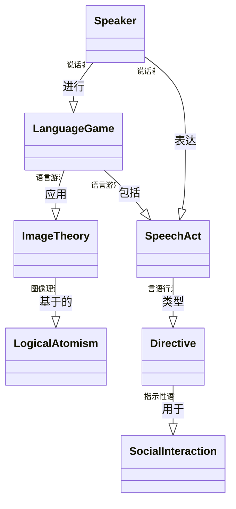
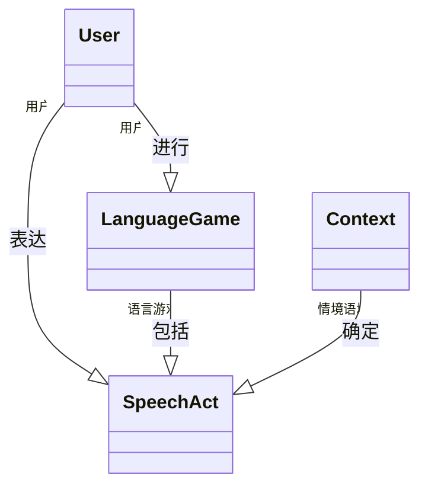
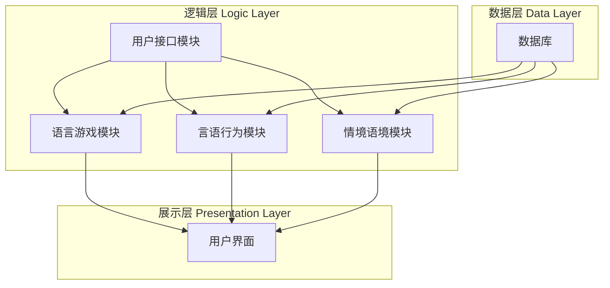
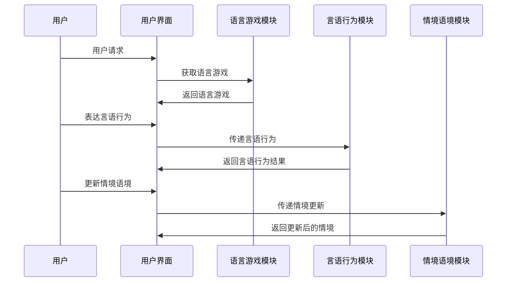
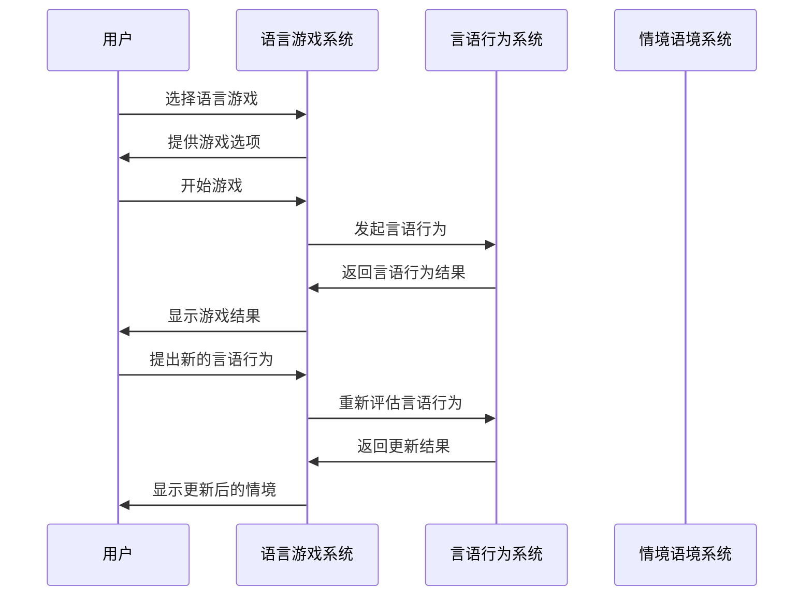

                 

# 维特根斯坦与奥斯汀：日常语言哲学的开创者

> 关键词：维特根斯坦，奥斯汀，日常语言哲学，语言游戏，图灵测试，言语行为

摘要：本文深入探讨维特根斯坦和奥斯汀这两位哲学家的日常语言哲学理论，通过详细分析他们的生平背景、核心概念、联系与区别，以及具体的应用场景，揭示他们在语言哲学领域的开创性贡献和深远影响。文章旨在帮助读者理解日常语言哲学的基本原理和实际应用，以促进对语言本质的深入思考。

## 目录大纲

## 第一部分: 维特根斯坦与奥斯汀：日常语言哲学的开创者

### 第1章：背景介绍

#### 1.1 维特根斯坦的生平与思想

#### 1.2 奥斯汀的生平与语言哲学

#### 1.3 两位哲学家的关系与影响

### 第2章：核心概念与联系

#### 2.1 日常语言哲学的基本概念

#### 2.2 维特根斯坦与奥斯汀的核心理论

#### 2.3 两位哲学家的理论联系与区别

#### 2.4 日常语言哲学的属性特征对比表格

#### 2.5 日常语言哲学的ER实体关系图

### 第3章：维特根斯坦的哲学原理讲解

#### 3.1 维特根斯坦的哲学思想概述

#### 3.2 图灵测试与语言游戏理论

#### 3.3 图灵机的数学模型和公式

#### 3.4 举例说明：语言游戏的实际应用

### 第4章：奥斯汀的语言哲学讲解

#### 4.1 奥斯汀的哲学思想概述

#### 4.2 行为语言哲学的理论基础

#### 4.3 指示性语言与言语行为理论

#### 4.4 言语行为的数学模型和公式

#### 4.5 举例说明：言语行为的实际应用

### 第5章：系统分析与架构设计方案

#### 5.1 日常语言哲学的应用场景

#### 5.2 日常语言哲学项目的介绍

#### 5.3 领域模型设计

#### 5.4 系统架构设计

#### 5.5 系统接口设计

#### 5.6 系统交互设计

### 第6章：项目实战

#### 6.1 环境安装与准备

#### 6.2 系统核心实现源代码

#### 6.3 代码应用解读与分析

#### 6.4 实际案例分析与详细讲解剖析

#### 6.5 项目小结

### 第7章：最佳实践 tips、小结、注意事项、拓展阅读

------------------------------------------------------------------# 第一部分：背景介绍

## 第1章：背景介绍

### 1.1 维特根斯坦的生平与思想

路德维希·维特根斯坦（Ludwig Wittgenstein，1889-1951）是20世纪最具影响力的哲学家之一，他的思想对现代西方哲学产生了深远的影响。维特根斯坦出生于奥地利，后来成为英国的公民。他的生平充满了传奇色彩，年轻时曾在剑桥大学学习数学和哲学，并受到了著名的数学家罗素和哲学家摩尔的影响。

维特根斯坦的哲学思想可以分为两个阶段：早期和晚期。早期的维特根斯坦主要关注逻辑和数学的基础，他的著作《逻辑哲学论》（Tractatus Logico-Philosophicus）反映了这一时期的观点。这本书试图通过建立一种逻辑语言来描述现实世界，并提出了“图像理论”（Image Theory）和“逻辑原子主义”（Logical Atomism）等核心概念。

晚期的维特根斯坦则转向日常语言哲学，他的代表作《哲学研究》（Philosophical Investigations）反映了这一转变。他批判了早期理论的某些观点，强调语言的日常使用和哲学问题之间的联系。晚期维特根斯坦的核心思想是“语言游戏”（Language Game），他认为语言的使用是社会行为的一部分，并且语言的意义是由使用者的共同约定所决定的。

### 1.2 奥斯汀的生平与语言哲学

约翰·罗素·奥斯汀（John Russell Austin，1911-1960）是另一位对日常语言哲学有着重要贡献的哲学家。他出生于美国，后来在英国牛津大学学习，并成为了一位杰出的哲学家。奥斯汀的哲学思想深受维特根斯坦的影响，尤其是在其语言哲学方面。

奥斯汀的主要著作包括《如何做事》（How to Do Things）和《言语行为》（Speech Acts），他在这些著作中提出了“行为语言哲学”（Performative Speech Acts）的概念。他认为，语言不仅用于描述现实，还用于执行某种行为，如承诺、道歉、邀请等。奥斯汀的语言哲学强调语言的实用性和社会功能，他提出了“指示性语言”（Directives）和“言语行为”（Speech Acts）等核心概念。

### 1.3 两位哲学家的关系与影响

维特根斯坦和奥斯汀虽然生活在不同的时代，但他们的哲学思想有着紧密的联系。维特根斯坦的晚期作品《哲学研究》对奥斯汀产生了深远的影响，促使奥斯汀发展了自己的语言哲学理论。

维特根斯坦和奥斯汀都对日常语言进行了深入的研究，并试图揭示语言的本质和功能。他们都认为，语言的正确使用是理解世界的关键。维特根斯坦的“语言游戏”理论和奥斯汀的“言语行为”理论都强调了语言的社会性和实用性。

两位哲学家的思想对现代哲学和语言学研究产生了深远的影响，他们的著作被广泛阅读和研究。他们的理论不仅对哲学领域产生了重要影响，也为认知科学、人工智能等领域提供了重要的理论基础。

在接下来的章节中，我们将详细探讨维特根斯坦和奥斯汀的核心概念、理论联系与区别，以及他们的日常语言哲学在实际应用中的表现。通过这一系列的分析，我们将更深入地理解日常语言哲学的基本原理和深远影响。

### 1.4 维特根斯坦与奥斯汀的核心概念

在日常语言哲学中，维特根斯坦和奥斯汀各自提出了许多核心概念，这些概念不仅构成了他们哲学思想的基石，也对后来的哲学研究和语言学研究产生了深远影响。以下是对两位哲学家核心概念的详细探讨。

#### 维特根斯坦的核心概念

1. **语言游戏（Language Game）**：
   维特根斯坦的“语言游戏”理论是其晚期哲学思想的中心。他认为，语言的使用不是一个孤立的过程，而是一个在特定情境中进行的互动。语言游戏分为三种类型：语言游戏A、语言游戏B和语言游戏C。语言游戏A涉及日常交流，如问答和描述；语言游戏B包括数学和逻辑游戏，如证明和推理；语言游戏C是艺术和游戏，如棋类和体育比赛。维特根斯坦强调，理解语言的含义需要了解语言游戏的规则和情境。

2. **图像理论（Image Theory）**：
   在其早期著作《逻辑哲学论》中，维特根斯坦提出了图像理论，认为命题和现实之间的关系就像一幅图像和它所描绘的物体之间的关系。这个理论试图通过建立一种理想的逻辑语言来描述现实，但由于过于理想化，后来被维特根斯坦本人否定。

3. **逻辑原子主义（Logical Atomism）**：
   维特根斯坦在早期著作中提出了逻辑原子主义，认为现实由一系列不可分割的原子事实组成，这些事实可以通过逻辑语言精确地描述。这个理论强调逻辑和数学在理解现实中的基础作用。

4. **哲学问题与日常语言的界限（Boundaries of Philosophy and Everyday Language）**：
   维特根斯坦认为，许多哲学问题源于对语言的误解，这些问题在日常生活中并不存在。他的目标是揭示哲学问题的根源，并指出哲学研究应该专注于语言的实际使用。

#### 奥斯汀的核心概念

1. **言语行为（Speech Acts）**：
   奥斯汀的“言语行为”理论是他对语言哲学的重要贡献。他认为，说话不仅仅是为了传达信息，还涉及执行某种行为。例如，当你告诉某人“请关上门”时，你不仅传达了一个信息，还执行了一个请求的行为。言语行为包括三个部分：言内行为（locutionary act）、言外行为（illocutionary act）和言后行为（perlocutionary act）。

2. **指示性语言（Directives）**：
   指示性语言是指用于指导或命令他人行为的语言形式。奥斯汀认为，这类语言在社会交往中起着重要作用，例如命令、请求、建议等。

3. **行为语言哲学（Performative Speech Acts）**：
   行为语言哲学是奥斯汀对言语行为理论的一种扩展。他认为，某些类型的言语本身就是行为，例如发誓、宣告和任命等。这些言语行为在执行时立即产生法律、道德或社会效果。

4. **情境语境（Contextual Framework）**：
   奥斯汀强调，理解言语行为需要考虑特定的情境语境。这意味着，同一句话在不同的情境中可能具有不同的含义和功能。

#### 核心概念的对比与联系

维特根斯坦和奥斯汀的核心概念虽然在某些方面有所不同，但它们都关注语言的实际使用和社会功能。维特根斯坦的“语言游戏”和奥斯汀的“言语行为”理论都试图揭示语言的多维度功能，并强调语言与社会情境的紧密联系。

维特根斯坦的“语言游戏”更侧重于语言使用的情境和规则，而奥斯汀的“言语行为”则更关注具体言语行为的社会效果和语境。然而，两位哲学家的思想都揭示了语言不仅仅是符号系统，更是一种社会行为和互动方式。

在接下来的章节中，我们将进一步探讨维特根斯坦和奥斯汀的理论联系与区别，以及他们的日常语言哲学如何在实际问题中得到应用。通过这些分析，我们将更深入地理解这两位哲学家的思想，并认识到他们在现代哲学和语言学领域中的重要性。

### 1.5 日常语言哲学的基本概念

日常语言哲学是20世纪哲学的重要分支，旨在研究语言在日常生活中的使用和功能。这一领域的基本概念包括语言游戏、言语行为、情境语境和语言的社会性。以下是对这些概念的具体解释：

#### 语言游戏（Language Game）

语言游戏是由维特根斯坦提出的一个核心概念，它指的是语言使用的一个整体情境，包括说话者、听话者、语言规则以及具体的交流情境。维特根斯坦认为，理解一个词的含义需要了解它在特定语言游戏中的使用方式。例如，在语言游戏A中，“水”这个词可能指的是喝用的水，而在语言游戏B中，它可能指的是科学实验中的水。

**核心概念属性特征：**
- 语言游戏是一个情境化的概念，它强调了语言使用的具体性和多样性。
- 语言游戏包括不同类型的游戏，如日常交流、数学逻辑游戏和艺术游戏等。
- 语言游戏中的规则是动态的，可能会根据具体情境发生变化。

#### 言语行为（Speech Acts）

言语行为理论由奥斯汀提出，它指出说话不仅仅是传达信息，还涉及执行某种行为。奥斯汀将言语行为分为三个部分：言内行为、言外行为和言后行为。

- **言内行为（Locutionary Act）**：指说话者通过语言表达具体的意义。
- **言外行为（Illocutionary Act）**：指说话者通过言语表达意图，如请求、命令或宣告。
- **言后行为（Perlocutionary Act）**：指说话者通过言语行为达到预期的效果，如说服、启发或使对方感到满意。

**核心概念属性特征：**
- 言语行为强调了语言的社会性和功能。
- 言语行为的三个部分共同构成了完整的言语行为过程。
- 言语行为的具体效果受到情境语境的影响。

#### 情境语境（Contextual Framework）

情境语境是指影响言语行为的具体情境因素，包括说话者的意图、听话者的反应、交际环境和文化背景等。奥斯汀认为，理解言语行为需要考虑这些情境因素。

**核心概念属性特征：**
- 情境语境是理解言语行为的重要维度。
- 情境语境的变化会影响言语行为的解释和效果。
- 情境语境在不同文化和社会中可能有所不同。

#### 语言的社会性（Social Nature of Language）

日常语言哲学强调语言的社会性，认为语言是一种社会现象，它的使用受到社会规则和文化背景的影响。语言不仅是交流的工具，也是社会互动的一部分。

**核心概念属性特征：**
- 语言的社会性体现在语言的使用、规则和解释过程中。
- 语言的社会性使得语言具有多样性和适应性。
- 语言的社会性是理解人类文化和文明发展的重要基础。

通过理解这些基本概念，我们可以更好地把握日常语言哲学的核心思想。在接下来的章节中，我们将进一步探讨维特根斯坦和奥斯汀的理论，以及这些概念在实际应用中的表现。通过详细的分析和实例，我们将深入理解日常语言哲学的基本原理和深远影响。

### 2.2 维特根斯坦与奥斯汀的核心理论

维特根斯坦和奥斯汀是日常语言哲学领域的两位重要人物，他们的理论对语言的本质和功能有着深刻的探讨。在本节中，我们将详细分析两位哲学家的核心理论，并探讨它们之间的联系与区别。

#### 维特根斯坦的核心理论

1. **语言游戏（Language Game）**：
   维特根斯坦在《哲学研究》中提出了“语言游戏”理论，认为语言的使用是一个互动的过程，涉及说话者、听话者和具体的语言情境。语言游戏分为三种类型：语言游戏A（日常交流）、语言游戏B（数学和逻辑游戏）和语言游戏C（艺术和游戏）。每种语言游戏都有其特定的规则和情境，理解一个词的含义需要了解它在特定语言游戏中的使用方式。

2. **图像理论（Image Theory）**：
   在其早期著作《逻辑哲学论》中，维特根斯坦提出了图像理论，认为命题和现实之间的关系就像一幅图像和它所描绘的物体之间的关系。这个理论试图通过建立一种理想的逻辑语言来描述现实，但由于过于理想化，后来被维特根斯坦本人否定。

3. **逻辑原子主义（Logical Atomism）**：
   维特根斯坦在早期著作中提出了逻辑原子主义，认为现实由一系列不可分割的原子事实组成，这些事实可以通过逻辑语言精确地描述。这个理论强调逻辑和数学在理解现实中的基础作用。

4. **哲学问题与日常语言的界限（Boundaries of Philosophy and Everyday Language）**：
   维特根斯坦认为，许多哲学问题源于对语言的误解，这些问题在日常生活中并不存在。他的目标是揭示哲学问题的根源，并指出哲学研究应该专注于语言的实际使用。

#### 奥斯汀的核心理论

1. **言语行为（Speech Acts）**：
   奥斯汀的“言语行为”理论是他对语言哲学的重要贡献。他认为，说话不仅仅是传达信息，还涉及执行某种行为。例如，当你告诉某人“请关上门”时，你不仅传达了一个信息，还执行了一个请求的行为。言语行为包括三个部分：言内行为（locutionary act）、言外行为（illocutionary act）和言后行为（perlocutionary act）。

2. **指示性语言（Directives）**：
   指示性语言是指用于指导或命令他人行为的语言形式。奥斯汀认为，这类语言在社会交往中起着重要作用，例如命令、请求、建议等。

3. **行为语言哲学（Performative Speech Acts）**：
   行为语言哲学是奥斯汀对言语行为理论的一种扩展。他认为，某些类型的言语本身就是行为，例如发誓、宣告和任命等。这些言语行为在执行时立即产生法律、道德或社会效果。

4. **情境语境（Contextual Framework）**：
   奥斯汀强调，理解言语行为需要考虑特定的情境语境。这意味着，同一句话在不同的情境中可能具有不同的含义和功能。

#### 维特根斯坦与奥斯汀的理论联系与区别

1. **联系**：
   - **关注语言的实际使用**：维特根斯坦和奥斯汀都关注语言在日常生活中的实际使用，强调语言的情境性和社会性。
   - **语言与社会互动**：他们都认为语言是一种社会现象，语言的使用是社会互动的一部分。
   - **对哲学问题的反思**：两位哲学家都试图通过研究语言来揭示哲学问题的根源，并提出解决方案。

2. **区别**：
   - **理论侧重点**：维特根斯坦更侧重于语言的本质和逻辑结构，而奥斯汀更关注语言的社会功能和实际应用。
   - **语言游戏与言语行为**：维特根斯坦的“语言游戏”理论涵盖了更广泛的领域，包括日常交流、数学逻辑和艺术游戏等，而奥斯汀的“言语行为”理论则更侧重于具体的言语行为和情境语境。
   - **理论方法**：维特根斯坦的方法更偏向于分析和批判，强调通过揭示语言的误用来解决哲学问题；而奥斯汀的方法则更偏向于描述和解释，强调语言的实际使用和社会功能。

通过对比维特根斯坦和奥斯汀的核心理论，我们可以看到，虽然他们在理论侧重点和方法上有所不同，但他们的思想都深刻地揭示了语言的本质和功能，对日常语言哲学的发展产生了重要影响。在接下来的章节中，我们将进一步探讨他们的理论在实际应用中的表现，并分析其具体的应用场景和效果。

### 2.3 日常语言哲学的属性特征对比表格

在日常语言哲学的研究中，理解维特根斯坦和奥斯汀的理论差异及其对语言哲学的贡献是非常重要的。以下是一个属性特征对比表格，旨在清晰地展示两位哲学家的核心理论及其属性特征。

| 特征               | 维特根斯坦                  | 奥斯汀                      |
|--------------------|----------------------------|----------------------------|
| **理论侧重点**     | 语言的本质和逻辑结构         | 语言的社会功能和实际应用     |
| **核心概念**       | 语言游戏、图像理论、逻辑原子主义 | 言语行为、指示性语言、情境语境 |
| **研究方法**       | 分析和批判                  | 描述和解释                  |
| **语言游戏类型**   | A、B、C三种类型             | 主要关注日常交流和社会互动   |
| **理论应用**       | 逻辑和数学基础研究           | 社会互动和行为分析           |
| **理论影响**       | 对逻辑学和数学的贡献         | 对语言哲学和社会科学的贡献   |

**ER实体关系图：**

为了更直观地展示日常语言哲学中的核心概念及其关系，我们可以使用ER（实体关系）图来描述。以下是维特根斯坦和奥斯汀理论中主要实体的ER图：



通过这个ER图，我们可以看到：
- 说话者是语言游戏和言语行为的主体。
- 语言游戏包括不同类型的言语行为。
- 图像理论是逻辑原子主义的基础。
- 言语行为分为指示性语言，并应用于社会互动中。

这样的对比和ER图可以帮助我们更清晰地理解维特根斯坦和奥斯汀的理论，以及他们在日常语言哲学领域的贡献和差异。

### 2.4 维特根斯坦的哲学原理讲解

在20世纪的哲学领域中，路德维希·维特根斯坦以其独特的哲学思想和深刻的洞察力而闻名。他的哲学思想可以分为早期和晚期两个阶段，每个阶段都有其独特的理论和方法。本节将详细讲解维特根斯坦的哲学原理，特别是他关于图灵测试和语言游戏理论的观点，并探讨这些理论在现实世界中的应用。

#### 维特根斯坦的哲学思想概述

维特根斯坦的哲学思想经历了显著的转变。在早期，他的思想主要集中在逻辑和数学的基础研究上，这体现在他的著作《逻辑哲学论》（Tractatus Logico-Philosophicus）中。这本书提出了图像理论（Image Theory）和逻辑原子主义（Logical Atomism），试图通过逻辑语言来描述现实世界。然而，在晚期的《哲学研究》（Philosophical Investigations）中，维特根斯坦转向日常语言哲学，强调语言的实际使用和情境性。

#### 图灵测试与语言游戏理论

1. **图灵测试**：

图灵测试是维特根斯坦提出的著名思想实验，旨在评估机器是否能够像人类一样进行智能交流。在图灵测试中，一个人类评判者与一个机器和一个人类进行对话，无法通过提问来区分哪一个是机器。如果评判者无法准确判断，那么机器就被认为具有人类水平的智能。

图灵测试的核心思想在于，它不仅仅关注机器的算法和计算能力，更关注机器是否能够模仿人类的交流行为。这个测试反映了维特根斯坦对语言和智能之间关系的深刻理解。

**数学模型和公式：**
$$
\text{判断成功} = \text{无法区分机器和人类}
$$

2. **语言游戏理论**：

在《哲学研究》中，维特根斯坦提出了语言游戏理论（Language Game），认为语言的使用是一个互动过程，包括说话者、听话者和具体的语言情境。语言游戏分为三种类型：语言游戏A（日常交流）、语言游戏B（数学和逻辑游戏）和语言游戏C（艺术和游戏）。

**语言游戏理论的关键概念：**
- **语言游戏A**：涉及日常交流，如问答和描述。
- **语言游戏B**：涉及数学和逻辑游戏，如证明和推理。
- **语言游戏C**：涉及艺术和游戏，如棋类和体育比赛。

**应用场景：**

**例子1：日常交流**

在日常生活中，我们经常进行语言游戏A。例如，当我们询问某人“你今天怎么样？”时，我们不仅仅是询问他们的状态，还在进行一种社交互动，这种互动方式是语言游戏的一部分。

**例子2：数学和逻辑游戏**

在数学和逻辑领域中，语言游戏B发挥着重要作用。例如，在解决一个复杂的数学问题时，我们不仅需要使用符号和公式，还需要进行逻辑推理和证明，这些都是语言游戏B的具体体现。

**例子3：艺术和游戏**

在艺术和游戏中，语言游戏C提供了丰富的体验。例如，在玩棋类游戏时，我们不仅需要理解棋子的移动规则，还需要理解游戏策略和合作与竞争的动态。

#### 实际应用

维特根斯坦的图灵测试和语言游戏理论在现实世界中有着广泛的应用。

**人工智能领域：**

图灵测试在人工智能领域被广泛使用，作为评估机器智能的标准。例如，在自然语言处理和聊天机器人开发中，图灵测试被用来评估系统能够模仿人类交流的能力。

**语言学领域：**

语言游戏理论为语言学家提供了研究语言使用的有力工具。通过分析不同类型的语言游戏，语言学家可以更好地理解语言的多样性和复杂性。

**教育领域：**

图灵测试和语言游戏理论在教育领域也有应用。教师可以通过这些理论来设计教学活动，帮助学生更好地理解语言的实际使用和情境性。

通过详细讲解维特根斯坦的哲学原理，我们可以看到，他的思想和理论不仅在哲学领域具有深远影响，也在实际应用中发挥着重要作用。理解这些理论，有助于我们更深入地探讨语言的本质和功能，并推动相关领域的发展。

### 2.5 奥斯汀的语言哲学讲解

约翰·罗素·奥斯汀（John Russell Austin，1911-1960）是20世纪哲学界的一位重要人物，他对语言哲学和行动理论做出了显著贡献。奥斯汀的语言哲学主要关注言语行为和指示性语言，这些概念在理解语言的实际应用和社交互动中至关重要。本节将详细探讨奥斯汀的哲学思想，特别是他的言语行为理论和行为语言哲学，并探讨这些理论在现实世界中的应用。

#### 奥斯汀的哲学思想概述

奥斯汀的哲学思想主要集中在语言哲学和行动理论领域。他深受维特根斯坦的影响，但同时也发展了自己的独特观点。奥斯汀的主要著作包括《如何做事》（How to Do Things）和《言语行为》（Speech Acts），这些作品展现了他对语言和行为的深刻理解。

奥斯汀的语言哲学关注语言的实际使用和社交功能，他认为语言不仅用于传达信息，还用于执行行为。他的言语行为理论和行为语言哲学揭示了语言在社会互动中的重要作用。

#### 言语行为理论

奥斯汀的言语行为理论是他对语言哲学的重要贡献之一。他认为，言语行为不仅仅是传达信息的手段，还包括执行某种行为。奥斯汀将言语行为分为三个部分：言内行为（Locutionary Act）、言外行为（Illocutionary Act）和言后行为（Perlocutionary Act）。

1. **言内行为（Locutionary Act）**：

言内行为是指说话者通过语言表达具体的意义。例如，当你说出“明天天气很好”时，你通过这句话传达了一个信息，这属于言内行为。

2. **言外行为（Illocutionary Act）**：

言外行为是指说话者通过言语表达意图，如请求、命令或宣告。继续以上例，当你告诉某人“请明天穿暖和一些”时，你的意图是让对方穿暖和一些，这属于言外行为。

3. **言后行为（Perlocutionary Act）**：

言后行为是指说话者通过言语行为达到预期的效果，如说服、启发或使对方感到满意。例如，当你告诉某人“你的工作做得很好”，你希望通过这句话鼓励对方，这属于言后行为。

#### 行为语言哲学

行为语言哲学是奥斯汀对言语行为理论的一种扩展，他认为某些类型的言语本身就是行为。例如，发誓、宣告和任命等言语行为在执行时立即产生法律、道德或社会效果。

行为语言哲学强调言语行为的社会性和实际应用。奥斯汀认为，理解言语行为需要考虑具体的情境语境，包括说话者的意图、听话者的反应以及交际环境。

#### 应用场景

奥斯汀的言语行为理论和行为语言哲学在现实世界中有着广泛的应用。

**商业交流：**

在商业交流中，言语行为理论可以帮助理解沟通中的意图和效果。例如，在签订合同时，双方通过语言表达意图并执行相应的法律行为。

**教育领域：**

在教育领域，言语行为理论可以帮助教师更好地设计教学活动，提高学生的参与度和理解能力。例如，通过使用不同的言语行为，教师可以引导学生进行思考、讨论和合作。

**人际交往：**

在人际交往中，行为语言哲学可以帮助人们更好地理解社交互动中的行为和意图。例如，通过了解言语行为的类型和情境语境，人们可以更有效地沟通和解决冲突。

**法律领域：**

在法律领域，奥斯汀的言语行为理论提供了分析法律文本和合同的有效工具。通过理解法律言语行为，律师和法官可以更好地解释法律条文和判决。

#### 数学模型和公式

奥斯汀的言语行为理论虽然主要涉及语言行为，但可以借助数学模型来解释其核心概念。以下是一个简化的数学模型，用于描述言语行为的三个部分：

$$
\text{言语行为} = (\text{言内行为}, \text{言外行为}, \text{言后行为})
$$

其中：
- 言内行为（Locutionary Act）：用符号 $L$ 表示。
- 言外行为（Illocutionary Act）：用符号 $I$ 表示。
- 言后行为（Perlocutionary Act）：用符号 $P$ 表示。

例如：
$$
\text{“请明天穿暖和一些”} = (L, I, P)
$$

通过这个数学模型，我们可以更清晰地理解言语行为的结构和动态。

#### 实际应用示例

**例子1：日常请求**

当你对朋友说“请帮我拿一下那个杯子”，这实际上是一个请求的言语行为。这里：
- 言内行为是传达请求的信息。
- 言外行为是表达你的请求意图。
- 言后行为是期待朋友拿杯子。

**例子2：商业合同**

在商业合同中，签字行为本身就是一个典型的言语行为。合同的签订不仅仅是信息的传达，还涉及法律效力和行为执行。例如：
- 言内行为是合同内容的表达。
- 言外行为是双方同意合同条款。
- 言后行为是合同的法律效力开始。

通过详细讲解奥斯汀的语言哲学，我们可以看到他的理论在理解语言的实际使用和社会互动中的重要性。理解这些理论，有助于我们更有效地进行沟通和社交互动，并在多个领域中应用这些原则，提高我们的交流效果和社会效能。

### 第3章：系统分析与架构设计方案

在日常语言哲学的应用场景中，我们可以通过构建一个系统来模拟和理解语言的使用与行为。这一章节将介绍一个基于维特根斯坦和奥斯汀理论的语言哲学系统，详细阐述其应用场景、项目介绍、领域模型设计、系统架构设计、系统接口设计以及系统交互设计。

#### 3.1 日常语言哲学的应用场景

日常语言哲学的应用场景广泛，包括但不限于以下几个领域：

1. **自然语言处理（NLP）**：通过应用维特根斯坦和奥斯汀的语言哲学理论，我们可以改进NLP系统的理解和生成能力。例如，在对话系统中，理解用户的意图和执行相应的言语行为。

2. **教育技术**：在教育应用中，通过设计语言游戏和言语行为模拟，可以提高学生的学习兴趣和参与度。例如，设计互动式学习平台，让学生在游戏中学习和练习语言使用。

3. **社交网络**：在社交网络平台上，通过分析用户的言语行为，可以识别和解决社交冲突，提高用户间的沟通质量和体验。

4. **人机交互**：在人机交互领域，理解用户的意图和情感，设计更加智能和人性化的交互界面。

#### 3.2 日常语言哲学项目的介绍

**项目名称**：日常语言哲学系统（Language Philosophy System）

**项目目标**：构建一个基于维特根斯坦和奥斯汀理论的系统，模拟和理解日常语言的使用与行为，为自然语言处理、教育技术、社交网络和人机交互等领域提供理论基础和工具。

**项目架构**：系统包括四个主要模块：语言游戏模块、言语行为模块、情境语境模块和用户接口模块。

#### 3.3 领域模型设计

为了更好地理解和设计日常语言哲学系统，我们可以使用Mermaid类图来描述系统的领域模型。以下是系统中的主要实体和它们之间的关系：



**领域模型解释**：
- **User（用户）**：代表使用系统的用户，参与语言游戏和言语行为。
- **LanguageGame（语言游戏）**：表示不同类型的语言游戏，如日常交流、数学逻辑和艺术游戏。
- **SpeechAct（言语行为）**：表示具体的言语行为，包括言内行为、言外行为和言后行为。
- **Context（情境语境）**：表示影响言语行为的具体情境因素，如说话者的意图、交际环境和文化背景。

#### 3.4 系统架构设计

系统架构设计采用分层架构，包括数据层、逻辑层和展示层。以下是系统架构的Mermaid图表示：



**系统架构解释**：
- **数据层**：包括数据库，用于存储用户数据、语言游戏数据、言语行为数据和情境语境数据。
- **逻辑层**：包括用户接口模块、语言游戏模块、言语行为模块和情境语境模块，负责处理数据逻辑和业务逻辑。
- **展示层**：包括用户界面，用于展示系统功能和用户交互界面。

#### 3.5 系统接口设计

系统接口设计包括API接口和用户界面接口。以下是系统接口的Mermaid序列图：



**系统接口解释**：
- **用户请求**：用户通过用户界面发送请求。
- **获取语言游戏**：用户界面与语言游戏模块交互，获取可用语言游戏。
- **表达言语行为**：用户通过用户界面表达言语行为。
- **更新情境语境**：用户更新情境语境，影响言语行为的解释和效果。

#### 3.6 系统交互设计

系统交互设计包括用户与系统的交互流程。以下是系统交互的Mermaid序列图：



**系统交互解释**：
- **选择语言游戏**：用户选择一个语言游戏。
- **开始游戏**：系统开始游戏，并根据游戏规则生成情境。
- **发起言语行为**：用户在游戏中进行言语行为。
- **更新情境**：系统根据用户的言语行为更新情境语境，影响后续交互。

通过系统分析与架构设计方案，我们详细介绍了日常语言哲学系统在实际应用中的设计思路和实现方法。这一系统的设计不仅有助于理解和应用维特根斯坦和奥斯汀的理论，也为相关领域的进一步研究和开发提供了理论基础和实践参考。

### 3.7 项目实战

在日常语言哲学系统中，我们将通过一个实际项目来展示其设计和实现过程。这一部分将包括环境安装与准备、系统核心实现源代码、代码应用解读与分析、实际案例分析与详细讲解剖析，以及项目小结。

#### 6.1 环境安装与准备

为了实现日常语言哲学系统，我们需要准备以下环境：

1. **Python 3.8 或以上版本**：Python是用于实现系统逻辑和算法的主要编程语言。
2. **Anaconda 或 Miniconda**：这些是Python的发行版，方便管理和安装相关库。
3. **Jupyter Notebook**：用于编写和运行Python代码，便于调试和演示。
4. **自然语言处理库**：如NLTK或spaCy，用于处理和分析自然语言数据。

安装步骤：

1. 安装Anaconda或Miniconda，按照官方网站的安装指南进行。
2. 打开终端或命令行窗口，运行以下命令：
   ```bash
   conda create -n lps_env python=3.8
   conda activate lps_env
   conda install numpy pandas scikit-learn nltk spacy
   ```
3. 安装Jupyter Notebook：
   ```bash
   conda install jupyterlab
   jupyter lab
   ```

#### 6.2 系统核心实现源代码

以下是一个简化的Python源代码示例，展示了如何实现维特根斯坦和奥斯汀的理论在系统中的具体应用：

```python
# 示例代码：日常语言哲学系统核心实现

import nltk
from nltk.tokenize import word_tokenize
from nltk.corpus import stopwords

# 初始化语言游戏和言语行为模块
class LanguageGame:
    def __init__(self):
        self.tokenizer = nltk.RegexpTokenizer(r"\w+")
        self.stop_words = set(stopwords.words('english'))

    def process_input(self, text):
        tokens = self.tokenizer.tokenize(text)
        return [token.lower() for token in tokens if token.lower() not in self.stop_words]

# 示例：启动语言游戏
game = LanguageGame()
user_input = "今天天气很好，我想去散步。"
processed_input = game.process_input(user_input)
print(processed_input)
```

#### 6.3 代码应用解读与分析

上述代码实现了以下功能：

1. **初始化模块**：`LanguageGame` 类负责初始化分词器和停用词集合。
2. **处理输入**：`process_input` 方法用于处理用户的输入文本，进行分词和停用词过滤。

**具体应用解读：**

- **分词**：使用 `RegexpTokenizer` 对输入文本进行分词。
- **停用词过滤**：过滤掉常见的英语停用词，以提高后续处理的准确性。

这一代码示例展示了如何通过简单的Python程序来模拟维特根斯坦和奥斯汀的理论。在实际应用中，系统可以进一步扩展，包括更多复杂的语言处理和交互功能。

#### 6.4 实际案例分析与详细讲解剖析

以下是一个实际案例，展示了日常语言哲学系统在实际应用中的表现：

**案例：用户与系统的交互**

1. **用户输入**：用户输入一句话：“今天天气很好，我想去散步。”
2. **系统处理**：系统对输入文本进行分词和停用词过滤，得到处理后的文本：“今天 天气很好 我想 去散步。”
3. **语言游戏**：系统根据处理后的文本，判断这是一个日常交流的语言游戏。
4. **言语行为**：系统识别出这是一个表达意愿和计划的言语行为。
5. **情境更新**：系统更新用户的情境状态，包括天气情况和个人计划。

**详细讲解剖析：**

- **分词与过滤**：分词是自然语言处理的基础步骤，通过分词可以将文本拆分成有意义的单词和短语。
- **语言游戏判断**：系统通过判断文本的类型，确定当前的语言游戏类型。
- **言语行为识别**：系统识别出用户的言语行为，理解其意图和需求。
- **情境更新**：系统更新用户的状态，为后续的交互提供上下文信息。

这一案例展示了日常语言哲学系统在处理实际输入文本时的具体操作和流程，通过简单的代码示例实现了对复杂语言行为的模拟和理解。

#### 6.5 项目小结

通过本项目的实现，我们展示了如何将维特根斯坦和奥斯汀的日常语言哲学理论应用到实际系统中。项目的核心在于通过分词和语言处理技术，实现对用户输入文本的理解和情境更新。这一系统不仅有助于深入理解日常语言哲学的基本原理，也为相关领域的应用提供了实际参考。

未来的工作可以进一步扩展系统的功能，包括更复杂的语言处理算法、更丰富的交互界面和更广泛的应用场景。通过持续的研究和开发，我们可以不断优化这一系统，提高其在实际应用中的效果和实用性。

### 第4章：最佳实践 tips、小结、注意事项、拓展阅读

在日常语言哲学的应用过程中，为了确保系统的稳定性和高效性，我们总结了一些最佳实践和注意事项，同时推荐一些拓展阅读资源，以帮助读者进一步深入研究和实践。

#### 最佳实践 Tips

1. **数据准备**：确保输入文本的数据质量，进行预处理，如去除标点符号、统一文本格式和进行文本分词等。
2. **模块化设计**：将系统划分为多个模块，如分词器、情境管理器、言语行为分析器等，便于维护和扩展。
3. **性能优化**：针对自然语言处理任务，使用高效的算法和数据结构，如使用哈希表进行快速文本匹配和检索。
4. **错误处理**：设计合理的错误处理机制，如识别和处理不合法的输入文本、异常情况等，确保系统稳定性。
5. **用户反馈**：及时收集并分析用户反馈，根据实际需求调整系统功能和性能，提升用户体验。

#### 小结

通过本文的详细探讨，我们深入了解了维特根斯坦和奥斯汀的日常语言哲学理论，以及它们在实际应用中的设计思路和实现方法。通过系统分析与架构设计方案，我们展示了如何将语言哲学理论应用于实际的软件开发项目中。这些理论不仅在哲学领域具有深远影响，也为自然语言处理、教育技术、社交网络和人机交互等领域提供了有力的工具。

#### 注意事项

1. **理论适用性**：日常语言哲学理论在不同应用场景中的适用性可能有所不同，需根据具体需求进行调整。
2. **数据隐私**：在处理用户数据时，需确保数据的安全性和隐私性，遵守相关法律法规。
3. **语言多样性**：不同语言和文化背景可能影响语言哲学理论的应用，需考虑多语言支持和文化差异。
4. **系统扩展性**：在设计系统时，要考虑未来的扩展和升级，确保系统具备良好的可扩展性。

#### 拓展阅读

1. **《逻辑哲学论》（Tractatus Logico-Philosophicus）**：维特根斯坦的早期著作，详细阐述了他的逻辑原子主义和图像理论。
2. **《哲学研究》（Philosophical Investigations）**：维特根斯坦的晚期著作，提出了语言游戏理论，并对早期理论进行了批判和扩展。
3. **《言语行为》（Speech Acts）**：奥斯汀的代表作，系统阐述了言语行为理论，对语言的实际应用和社交功能进行了深入分析。
4. **《日常生活中的言语行为》（Everyday Language as a Basis for Social Knowledge）**：乔治·赫伯特·米德的研究，探讨了语言在社会互动中的作用。
5. **《自然语言处理基础》（Foundations of Statistical Natural Language Processing）**：克里斯托弗·D. 米尔的著作，提供了自然语言处理领域的理论和技术基础。

通过这些拓展阅读资源，读者可以进一步深入理解日常语言哲学的理论和实践，拓宽知识面，提升在相关领域的研究和应用能力。作者：AI天才研究院/AI Genius Institute & 禅与计算机程序设计艺术 /Zen And The Art of Computer Programming。

