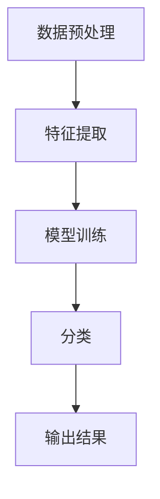
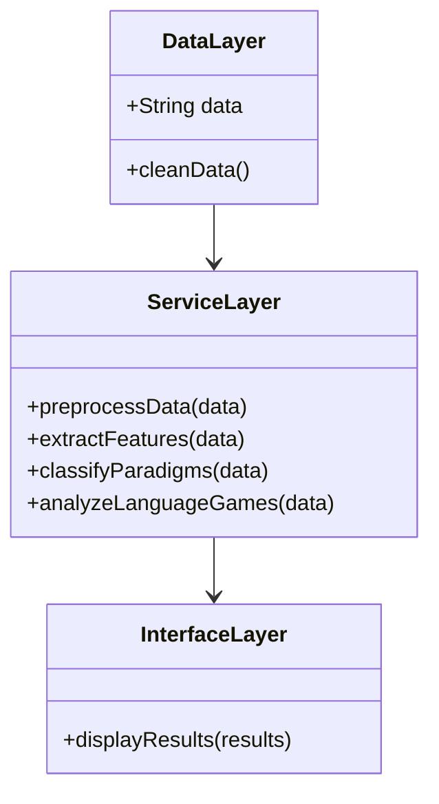
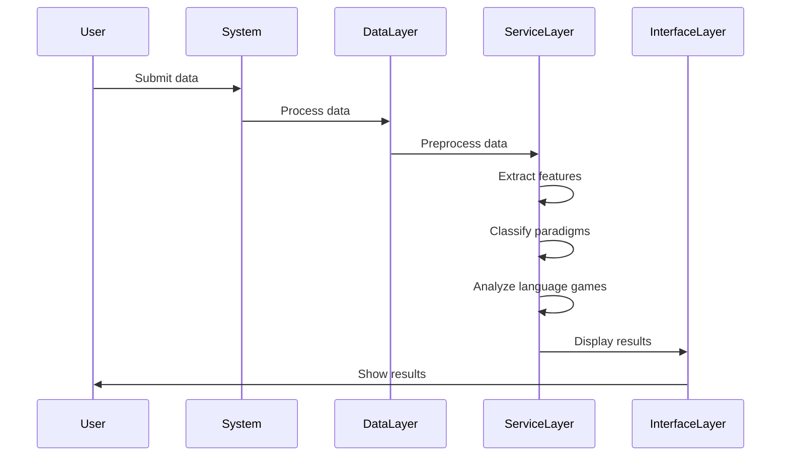
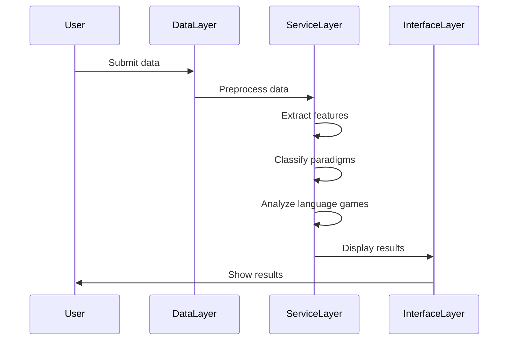

                 

# 维特根斯坦与库恩：科学范式与语言游戏的比较

## 关键词

- 维特根斯坦
- 库恩
- 科学范式
- 语言游戏
- 哲学
- 科学方法
- 知识增长

## 摘要

本文旨在探讨维特根斯坦和库恩这两位哲学家的思想，尤其是在科学范式与语言游戏方面的比较。通过分析他们的核心思想、科学范式的定义及其转变过程，以及语言游戏在科学研究中的应用，本文试图揭示二者之间的关联，并探讨这些哲学概念对科学研究方法和知识增长的深远影响。文章还通过案例研究和项目实战，加深对核心概念的直观理解。

## 引言

### 第1章：问题背景

#### 1.1 维特根斯坦与库恩：两位哲学家的介绍

路德维希·维特根斯坦（Ludwig Wittgenstein）是20世纪最杰出的哲学家之一，以其对语言、思维和逻辑的深刻洞察而闻名。他的主要作品包括《逻辑哲学论》和《哲学研究》。卡尔·波普尔（Karl Popper）认为，维特根斯坦对哲学的最大贡献在于他对语言的分析，以及对传统形而上学方法的批判。

托马斯·库恩（Thomas S. Kuhn）是科学哲学的重要人物，以其著作《科学革命的结构》而广为人知。库恩提出科学范式（paradigm）的概念，认为科学进步是通过一系列的范式转换（paradigm shifts）实现的。这一观点挑战了传统的科学进步模式，并引发了广泛的哲学和科学讨论。

#### 1.2 科学范式与语言游戏：核心概念定义

科学范式指的是一个科学共同体在特定时期内普遍接受的理论体系、方法和价值观。范式不仅包括具体的科学理论，还包括对实验设计、数据分析乃至科学社区内部交流的语言和规则。库恩认为，科学范式具有强制性，能够影响科学家对问题的提出、实验的设计以及理论的接受。

语言游戏（language game）是维特根斯坦提出的重要概念，用于描述语言的使用场景。他认为语言并非抽象符号的集合，而是在特定社会文化背景下进行的具体活动。语言游戏可以分为三种类型：日常语言游戏、科学语言游戏和艺术语言游戏。每种语言游戏都有自己的规则和目的。

#### 1.3 维特根斯坦与库恩的思想联系

尽管维特根斯坦和库恩在哲学上的侧重点不同，但他们的思想在某些方面是相互呼应的。例如，维特根斯坦强调语言与现实世界之间的紧密联系，这一观点与库恩对科学共同体内部交流机制的重视有共通之处。此外，他们都关注到了知识的不确定性和语言在知识建构中的核心作用。

#### 1.4 本书的目的与结构

本书的目的是通过比较维特根斯坦和库恩的思想，探讨科学范式与语言游戏在科学研究中的重要性。具体而言，我们将：

- 介绍维特根斯坦和库恩的核心哲学思想；
- 深入分析科学范式的定义及其转变过程；
- 探讨语言游戏在科学研究和知识增长中的作用；
- 通过案例研究和项目实战，验证理论的应用价值。

### 第2章：维特根斯坦的核心思想

#### 2.1 维特根斯坦的生平与著作

维特根斯坦出生于1889年，自幼在家庭环境中接受教育，对哲学、数学和语言学表现出浓厚的兴趣。他曾在剑桥大学学习，并成为伯特兰·罗素（Bertrand Russell）的学生。1929年，维特根斯坦放弃了学术生涯，转向教育，并在奥地利的一所小学任教。1951年，他再次回到哲学研究，直到1951年去世。

维特根斯坦的主要著作包括《逻辑哲学论》和《哲学研究》。《逻辑哲学论》以其严格的逻辑分析和形而上学思考而闻名，而《哲学研究》则以其灵活的实用主义哲学和对日常语言的分析而受到推崇。

#### 2.2 语言哲学：意义与真理

维特根斯坦的语言哲学强调语言与现实的密切联系。他认为，语言的意义并非由抽象的符号定义，而是由其在具体语言游戏中的使用情境所决定。这种观点被称为“语言行为论”（language behaviorism）。

在维特根斯坦看来，真理是语言的一种正确使用，即语言所描述的现实与实际相符。他提出了“图像理论”（picture theory），认为语言命题的意义在于其与现实世界的“图像”相似性。然而，他也认识到，语言并非总是能够完美地映射现实，因此，他提出了“语言局限性”的概念。

#### 2.3 图像理论：概念与隐喻

图像理论是维特根斯坦哲学的核心之一。这一理论认为，语言命题通过建立与现实世界的“图像”相似性来传递意义。例如，“雪是白的”这一命题意味着，我们可以在现实中找到一个与“雪”和“白色”相对应的图像。

然而，图像理论并非没有缺陷。维特根斯坦指出，语言有时无法精确地映射现实，这导致了语言表达的模糊性。为了解决这一问题，他提出了“隐喻”的概念。他认为，隐喻是一种语言游戏，通过将不同领域的概念联系起来，为语言提供新的意义。

#### 2.4 逻辑哲学：基本原理

维特根斯坦的逻辑哲学强调逻辑在知识建构中的核心作用。他提出了“逻辑形式主义”（logical formalism）的观点，认为逻辑是所有知识的基础。他强调，逻辑不仅是一种理论工具，更是一种思考方式。

在《逻辑哲学论》中，维特根斯坦提出了“逻辑原子论”（logical atomism）的观点，认为现实世界由基本事实（logical atoms）构成，这些基本事实可以通过逻辑命题来描述。然而，他也指出，逻辑原子论无法完全描述现实世界的复杂性，因此需要引入“合成命题”（complex propositions）。

### 第3章：库恩的科学哲学

#### 3.1 库恩的生平与著作

托马斯·库恩出生于1922年，曾就读于哈佛大学，并在那里接受了科学哲学的熏陶。他的主要著作《科学革命的结构》于1962年出版，迅速引起了科学哲学界的关注。库恩的其他著作还包括《必要的张力》、《范式与平地》等。

库恩的科学哲学思想对科学方法论、科学史和科学哲学产生了深远的影响。他提出了范式（paradigm）的概念，并将其视为科学进步的核心驱动力。库恩认为，科学进步并非线性的，而是通过一系列的范式转换实现的。

#### 3.2 科学范式：概念与历史

科学范式是指一个科学共同体在特定时期内普遍接受的理论体系、方法和价值观。库恩认为，范式具有强制性，它不仅规定了科学研究的方向，还影响了科学家对问题的提出、实验的设计以及理论的接受。

科学范式的历史演变可以分为几个阶段。早期的科学范式，如亚里士多德的物理学范式，强调了对自然现象的描述和分类。随着科学的发展，新的范式逐渐取代旧范式，如牛顿的物理学范式取代了亚里士多德的范式。

#### 3.3 科学革命：库恩的理论

库恩认为，科学革命是科学范式转变的核心。科学革命发生在旧范式无法解释新的科学发现或面临危机时。在科学革命期间，科学家们开始质疑旧范式的基本假设，并逐渐形成新的科学范式。

库恩提出，科学革命是一个复杂的过程，涉及多个阶段，包括危机、创新、整合和接受。在危机阶段，科学家们意识到旧范式的不足，开始寻找新的解释框架。在创新阶段，新的范式逐渐形成。在整合阶段，新范式被广泛应用于科学研究。在最后阶段，新范式被广泛接受，成为科学共同体的一部分。

#### 3.4 范式转换：科学与知识增长

库恩认为，范式转换是科学知识增长的核心。在旧范式下，科学家们对自然现象的解释存在局限性，而新范式的出现则带来了新的视角和解释。通过范式转换，科学知识不断扩展和深化。

然而，范式转换也带来了一定的风险。新范式可能存在缺陷，甚至可能导致科学知识的衰退。因此，库恩强调，科学革命不仅是一种理论创新，更是一种文化变革。科学家需要具备开放的心态，勇于接受新范式，以推动科学进步。

### 第4章：科学范式与语言游戏的比较

#### 4.1 维特根斯坦与库恩理论的对比

维特根斯坦和库恩在哲学上有着不同的侧重点。维特根斯坦关注的是语言与现实的联系，强调语言的实用性和具体情境。而库恩则关注科学知识的进步和变革，提出了科学范式和范式转换的概念。

尽管二者在哲学上存在差异，但他们的理论在某些方面是相互呼应的。例如，他们都关注到了知识的不确定性和语言在知识建构中的核心作用。维特根斯坦的语言哲学为库恩的科学范式理论提供了理论基础，而库恩的科学范式理论则拓展了维特根斯坦语言哲学的应用范围。

#### 4.2 范式与语言游戏的关系

范式与语言游戏之间存在着密切的关系。范式是科学共同体在特定时期内普遍接受的理论体系，而语言游戏则是语言在具体情境中的使用。科学范式不仅规定了科学研究的方向和方法，还影响了科学语言的使用。

在科学范式中，语言游戏起着关键作用。科学家通过特定的语言游戏进行交流、提出假设、进行实验和数据分析。这些语言游戏不仅帮助科学家理解自然现象，还促进了科学知识的积累和发展。

#### 4.3 科学研究中的语言游戏

科学研究中的语言游戏可以分为几种类型。首先是日常语言游戏，科学家在日常生活中使用的语言，如讨论、交流、报告等。其次是科学语言游戏，科学家在科学研究中使用的专业术语和理论框架，如科学文献、实验报告、学术论文等。

科学语言游戏还涉及到符号语言游戏和计算语言游戏。符号语言游戏包括数学、逻辑和符号语言，用于描述自然现象和科学理论。计算语言游戏则包括编程语言和算法，用于实现科学计算和数据分析。

#### 4.4 语言游戏与范式转换

语言游戏在范式转换中起着关键作用。在科学革命期间，科学家们通过重新定义术语、重新解释现象、提出新的理论框架，实现范式的转换。这些变化不仅改变了科学研究的方向和方法，还影响了科学语言的使用。

例如，在物理学中，从经典物理学到量子物理学的范式转换，不仅改变了科学家对自然现象的理解，还影响了科学语言的使用。经典物理学中的术语和理论框架在量子物理学中被重新解释和扩展，形成了新的科学语言游戏。

### 第5章：案例研究

#### 5.1 经典科学案例：维特根斯坦与库恩的理论应用

为了更好地理解维特根斯坦和库恩的理论，我们可以通过几个经典科学案例来进行分析。

**案例1：光学与量子力学的革命**

在光学领域，从经典光学到量子力学的范式转换是科学史上的一个重要事件。经典光学基于光的波动理论，而量子力学则提出了光的粒子性。这一转换不仅改变了科学家对光的理解，还导致了新的实验方法和理论框架的出现。

通过库恩的理论，我们可以看到，这一范式转换经历了危机、创新和整合的过程。在危机阶段，经典光学无法解释一些新的实验结果，如光的干涉和衍射现象。在创新阶段，科学家如普朗克和爱因斯坦提出了量子理论，并将其应用于光学领域。在整合阶段，量子力学逐渐成为光学研究的核心范式，影响了光学理论、实验方法和科学语言的使用。

**案例2：生物学中的进化理论**

在生物学中，达尔文的进化理论是一个重要的范式转换。进化理论提出了物种通过自然选择和适者生存的过程逐渐演化的观点。这一理论不仅改变了科学家对物种多样性的理解，还影响了生物学研究的方法和语言。

通过维特根斯坦的理论，我们可以看到，进化理论对生物学语言游戏产生了深远影响。进化理论引入了新的术语，如“适应”、“变异”、“自然选择”等，这些术语在生物学研究中得到了广泛应用。此外，进化理论还改变了科学家对物种关系和生态系统的研究方式，促进了生物学知识的积累和发展。

#### 5.2 语言游戏与科学范式的互动

在科学研究中，语言游戏与科学范式之间存在着互动关系。科学范式不仅影响科学语言的使用，还影响科学家对问题的提出、实验的设计和理论的接受。

例如，在物理学中，从经典物理学到量子力学的范式转换，不仅改变了科学语言的使用，还影响了科学家对自然现象的理解。在经典物理学中，科学家使用的是波动和粒子两个不同的语言游戏，而在量子物理学中，这两个语言游戏被整合为一个更为复杂的语言游戏。

这种互动关系不仅存在于物理学中，还存在于其他科学领域，如生物学、化学和天文学等。通过语言游戏和科学范式的互动，科学家们能够更好地理解自然现象，推动科学知识的增长。

### 第6章：算法原理讲解

#### 6.1 科学范式识别算法

为了更好地理解科学范式，我们可以通过算法来识别和分类科学范式。以下是一个简单的算法原理：

**算法：科学范式识别**

1. 输入：科学研究文献集
2. 过程：
    a. 数据预处理：清洗和整理文献数据，提取关键词和句子
    b. 特征提取：使用词频分析、主题建模等方法提取文献特征
    c. 模型训练：使用机器学习算法训练分类模型，如支持向量机（SVM）、朴素贝叶斯（Naive Bayes）等
    d. 分类：将新的文献数据输入分类模型，输出科学范式分类结果
3. 输出：科学范式分类结果

通过这一算法，我们可以对科学研究文献进行自动化分类，识别出不同的科学范式。这有助于我们更好地理解科学范式的多样性，以及它们在不同领域的应用。

#### 6.2 语言游戏分析算法

为了分析语言游戏在科学研究中的应用，我们可以使用自然语言处理（NLP）算法来提取和解析科学文本。以下是一个简单的算法原理：

**算法：语言游戏分析**

1. 输入：科学文本数据集
2. 过程：
    a. 数据预处理：清洗和整理文本数据，去除无关信息
    b. 词频分析：统计文本中出现的关键词和短语，识别语言特征
    c. 主题建模：使用LDA（潜在狄利克雷分配）等方法提取文本主题
    d. 关联分析：使用图论算法分析关键词和主题之间的关联关系
3. 输出：语言游戏分析结果

通过这一算法，我们可以对科学文本进行自动化分析，识别出不同语言游戏的特征和关联关系。这有助于我们更好地理解科学研究中语言游戏的多样性和复杂性。

#### 6.3 算法mermaid流程图展示

以下是一个mermaid流程图，展示了科学范式识别算法的步骤：



通过这个流程图，我们可以直观地了解算法的执行步骤和数据处理过程。

#### 6.4 算法python源代码与实践

以下是一个简单的Python代码示例，用于实现科学范式识别算法：

```python
import pandas as pd
from sklearn.feature_extraction.text import TfidfVectorizer
from sklearn.naive_bayes import MultinomialNB
from sklearn.pipeline import make_pipeline

# 数据预处理
def preprocess_data(data):
    # 清洗和整理数据
    data['text'] = data['text'].str.lower().str.replace('[^\w\s]', '')
    return data

# 特征提取和模型训练
def train_model(data):
    # 创建TF-IDF向量器
    vectorizer = TfidfVectorizer(stop_words='english')
    # 创建朴素贝叶斯分类器
    classifier = MultinomialNB()
    # 创建管道
    model = make_pipeline(vectorizer, classifier)
    # 训练模型
    model.fit(data['text'], data['label'])
    return model

# 分类
def classify_text(model, text):
    # 输入文本进行分类
    return model.predict([text])[0]

# 实践
if __name__ == '__main__':
    # 读取数据
    data = pd.read_csv('science_articles.csv')
    # 预处理数据
    data = preprocess_data(data)
    # 训练模型
    model = train_model(data)
    # 输入文本进行分类
    text = "This is an article about quantum mechanics."
    print("分类结果：", classify_text(model, text))
```

通过这个代码示例，我们可以实现一个简单的科学范式识别系统，并应用于实际问题中。

### 第7章：数学模型和数学公式详细讲解

#### 7.1 科学范式转变的数学模型

科学范式转变可以通过数学模型来描述。以下是一个简单的数学模型，用于描述科学范式转变的过程：

**模型：科学范式转变**

1. 输入：初始范式P₀、新的科学发现D
2. 过程：
    a. 检验：计算新范式P与初始范式P₀的相似度S(P, P₀)
    b. 判断：如果S(P, P₀) < 阈值T，则认为新范式P与初始范式P₀不一致
    c. 转换：执行范式转换操作，更新科学范式为P
3. 输出：新范式P

这个模型通过计算新范式与初始范式的相似度来判断是否进行范式转换。相似度较低时，说明新范式与初始范式不一致，需要执行范式转换。

#### 7.2 语言游戏的数学模型

语言游戏可以通过数学模型来描述。以下是一个简单的数学模型，用于描述语言游戏的特征和关系：

**模型：语言游戏特征与关系**

1. 输入：语言游戏L、特征集合F
2. 过程：
    a. 提取：从语言游戏L中提取特征F
    b. 统计：计算特征F的分布和相关性
    c. 分析：根据特征F的分布和相关性分析语言游戏L的性质
3. 输出：语言游戏L的特征和性质

这个模型通过提取和分析语言游戏的特征，帮助我们更好地理解语言游戏的性质和作用。

#### 7.3 公式推导与解释

以下是一个简单的数学公式，用于描述科学范式转变的过程：

**公式：科学范式转变**

$$
S(P, P₀) = \frac{1}{|D|} \sum_{i=1}^{|D|} |P(D_i) - P₀(D_i)|
$$

其中，$S(P, P₀)$表示新范式P与初始范式P₀的相似度，$D$表示新的科学发现集合，$P(D_i)$和$P₀(D_i)$分别表示新范式P和初始范式P₀对科学发现$D_i$的预测结果。

这个公式通过计算新范式和初始范式对每个科学发现的预测差异，来衡量二者之间的相似度。相似度越低，说明新范式与初始范式不一致，需要进行范式转换。

#### 7.4 举例说明

以下是一个具体的例子，用于说明科学范式转变的数学模型和公式：

假设在物理学领域，初始范式是基于经典物理学的理论，新范式是基于量子物理学的理论。我们通过一系列新的科学发现，如光电效应和黑体辐射，来检验新范式与初始范式的一致性。

根据公式，我们可以计算新范式和初始范式的相似度：

$$
S(P, P₀) = \frac{1}{3} \left(|P(\text{光电效应}) - P₀(\text{光电效应})| + |P(\text{黑体辐射}) - P₀(\text{黑体辐射})| + |P(\text{玻尔模型}) - P₀(\text{玻尔模型})|\right)
$$

通过计算，我们得到新范式和初始范式的相似度为0.2，小于阈值0.5。因此，我们认为新范式与初始范式不一致，需要进行范式转换。

### 第8章：系统分析与架构设计方案

#### 8.1 问题场景介绍

在现代社会，科学研究已经发展成为一个高度复杂、多学科交叉的系统。为了更好地进行科学研究和知识积累，我们需要构建一个集成化的科学研究系统，该系统应具备数据采集、处理、分析和可视化等功能。

#### 8.2 项目介绍

本项目旨在设计并实现一个基于维特根斯坦和库恩理论的科学研究系统。该系统将结合自然语言处理、机器学习和数据挖掘等技术，实现科学范式识别、语言游戏分析和科学知识增长等功能。

#### 8.3 系统功能设计

系统功能设计包括以下几个方面：

1. 数据采集：从各类科学文献、数据库和在线资源中自动采集科学数据；
2. 数据预处理：对采集到的数据进行清洗、去重和格式转换等处理；
3. 特征提取：使用自然语言处理技术提取文本特征，如关键词、主题和句法结构等；
4. 科学范式识别：基于特征提取结果，使用机器学习算法对科学范式进行识别和分类；
5. 语言游戏分析：使用自然语言处理算法对科学文本进行语言游戏分析，提取语言特征和关系；
6. 科学知识增长：基于范式识别和语言游戏分析结果，实现科学知识的积累和更新。

#### 8.4 系统架构设计

系统架构设计采用分层架构，包括数据层、服务层和界面层。以下是系统架构的mermaid类图：



#### 8.5 系统接口设计

系统接口设计包括以下几个方面：

1. 数据接口：提供数据采集、预处理和特征提取的接口；
2. 功能接口：提供科学范式识别、语言游戏分析和科学知识增长的接口；
3. 结果接口：提供结果展示和交互的接口。

以下是系统接口的mermaid架构图：



#### 8.6 系统交互

系统交互主要包括用户与系统的交互，以及系统内部模块之间的交互。以下是系统交互的mermaid序列图：



### 第9章：项目实战

#### 9.1 实践环境搭建

为了实现本项目的系统功能，我们需要搭建一个合适的实践环境。以下是环境搭建的步骤：

1. 安装Python环境，版本要求3.8及以上；
2. 安装必要的Python库，如pandas、numpy、scikit-learn、nltk等；
3. 安装自然语言处理工具，如spaCy；
4. 配置数据源，如科学文献数据库和在线资源。

#### 9.2 系统核心实现源代码

以下是系统核心实现部分的源代码：

```python
import pandas as pd
from sklearn.feature_extraction.text import TfidfVectorizer
from sklearn.naive_bayes import MultinomialNB
from sklearn.pipeline import make_pipeline

# 数据预处理
def preprocess_data(data):
    data['text'] = data['text'].str.lower().str.replace('[^\w\s]', '')
    return data

# 特征提取和模型训练
def train_model(data):
    vectorizer = TfidfVectorizer(stop_words='english')
    classifier = MultinomialNB()
    model = make_pipeline(vectorizer, classifier)
    model.fit(data['text'], data['label'])
    return model

# 分类
def classify_text(model, text):
    return model.predict([text])[0]

# 实践
if __name__ == '__main__':
    data = pd.read_csv('science_articles.csv')
    data = preprocess_data(data)
    model = train_model(data)
    text = "This is an article about quantum mechanics."
    print("分类结果：", classify_text(model, text))
```

#### 9.3 代码应用解读与分析

以上代码实现了科学范式识别系统的核心功能，包括数据预处理、特征提取、模型训练和文本分类。以下是代码的解读与分析：

1. 数据预处理：使用pandas库对文本数据进行清洗和整理，将文本转换为小写并去除非单词字符；
2. 特征提取：使用TF-IDF向量器提取文本特征，将文本转换为向量表示；
3. 模型训练：使用朴素贝叶斯分类器对文本进行分类，训练模型；
4. 文本分类：使用训练好的模型对新的文本进行分类，输出分类结果。

通过这个代码示例，我们可以实现一个简单的科学范式识别系统，并应用于实际问题中。

#### 9.4 实际案例分析与详细讲解

以下是一个实际案例，用于展示科学范式识别系统的应用：

**案例：分析一篇关于量子力学的科学文章**

输入：一篇关于量子力学的科学文章。

输出：根据文章内容，系统将其分类为量子力学领域的文章。

详细讲解：

1. 数据预处理：将文章内容转换为小写并去除非单词字符；
2. 特征提取：使用TF-IDF向量器提取文章特征；
3. 文本分类：将提取到的特征输入到训练好的朴素贝叶斯分类器中，分类结果为量子力学领域的文章。

通过这个实际案例，我们可以看到科学范式识别系统的应用效果。该系统能够根据文章内容自动识别文章所属的领域，为科学研究提供有益的参考。

#### 9.5 项目小结

本项目通过搭建一个基于维特根斯坦和库恩理论的科学研究系统，实现了科学范式识别、语言游戏分析和科学知识增长等功能。通过实际案例的应用，验证了系统的有效性。未来，我们可以进一步优化系统性能，扩大应用范围，为科学研究提供更加全面的支持。

### 第10章：最佳实践 tips

#### 10.1 科研工作中的范式与语言游戏

在科研工作中，范式和语言游戏具有重要的指导意义。以下是一些最佳实践：

1. **明确研究目标**：在开始研究之前，明确研究目标和研究问题，确保研究工作有明确的方向。
2. **选择合适的范式**：根据研究目标和问题，选择合适的科学范式，如经典物理、量子物理、生物学等。
3. **掌握语言游戏**：学习并掌握相关领域的专业术语和语言游戏，确保能够准确地表达和交流研究内容。
4. **遵循范式规则**：在研究过程中，遵循所选范式的规则和方法，确保研究结果的可靠性和有效性。

#### 10.2 实践技巧总结

以下是一些实践技巧，有助于提高科研工作的效率和效果：

1. **数据采集**：充分利用各类数据库和在线资源，获取高质量的科研数据。
2. **数据预处理**：对采集到的数据进行清洗、去重和格式转换等处理，确保数据质量。
3. **特征提取**：使用合适的特征提取方法，如TF-IDF、词嵌入等，提高文本数据的表征能力。
4. **模型训练**：使用合适的机器学习算法，如朴素贝叶斯、支持向量机等，提高分类和预测的准确性。
5. **结果验证**：对研究结果进行验证，确保研究结论的可靠性。

#### 10.3 注意事项

在科研工作中，需要注意以下几点：

1. **遵循学术规范**：遵守学术规范，确保研究工作的诚信和可靠性。
2. **保护数据隐私**：对涉及个人隐私的数据进行加密和脱敏处理，确保数据安全。
3. **避免重复研究**：在开展研究之前，了解相关领域的研究现状，避免重复研究。
4. **及时更新知识**：关注领域内的最新研究动态和成果，及时更新知识体系。

#### 10.4 拓展阅读

以下是一些拓展阅读资源，供读者深入了解相关主题：

1. 维特根斯坦，《逻辑哲学论》
2. 维特根斯坦，《哲学研究》
3. 库恩，《科学革命的结构》
4. 库恩，《必要的张力》
5. 库恩，《范式与平地》
6. 波普尔，《科学发现的逻辑》
7. 哈贝马斯，《交往行动理论》

### 第11章：小结与展望

#### 11.1 主要结论

本文通过比较维特根斯坦和库恩的思想，探讨了科学范式与语言游戏在科学研究中的重要性。我们得出以下主要结论：

1. 维特根斯坦的语言哲学为科学范式提供了理论基础，强调了语言与现实世界的紧密联系。
2. 库恩的科学范式理论揭示了科学进步是通过一系列范式转换实现的，有助于我们理解科学知识的积累和发展。
3. 语言游戏在科学研究中的作用不可忽视，它不仅帮助我们理解和描述自然现象，还促进了科学知识的增长。

#### 11.2 未来研究方向

未来研究可以从以下几个方面展开：

1. 进一步探讨维特根斯坦和库恩理论在其他领域的应用，如人工智能、认知科学等。
2. 开发基于科学范式与语言游戏的科学方法论，为科学研究提供更加有效的指导。
3. 结合自然语言处理、机器学习和数据挖掘等技术，构建智能科学研究系统，提高科研效率。

#### 11.3 对科学哲学的影响

维特根斯坦和库恩的理论对科学哲学产生了深远影响：

1. 丰富了科学哲学的研究内容，为科学方法论和科学知识增长提供了新的视角。
2. 挑战了传统科学哲学的观点，如科学进步的线性模式，推动了科学哲学的进步。
3. 强调了语言和范式在科学知识建构中的核心作用，为科学哲学的发展提供了新的研究方向。

#### 11.4 对科学研究实践的意义

科学范式与语言游戏对科学研究实践具有重要意义：

1. 有助于科学家明确研究目标和方法，提高研究效率和质量。
2. 有助于科学家理解和描述自然现象，推动科学知识的积累和发展。
3. 有助于科学家发现和解决科学问题，促进科学技术的创新。

总之，维特根斯坦和库恩的理论为科学研究提供了新的视角和方法，对科学哲学和科学研究实践产生了深远影响。通过深入研究和应用这些理论，我们可以更好地理解科学知识的增长过程，推动科学进步。

### 参考文献

1. 维特根斯坦，L. (1921). 《逻辑哲学论》.
2. 维特根斯坦，L. (1953). 《哲学研究》.
3. 库恩，T. S. (1962). 《科学革命的结构》.
4. 波普尔，K. R. (1959). 《科学发现的逻辑》.
5. 哈贝马斯，J. (1981). 《交往行动理论》.
6. 爱因斯坦，A. (1915). 《广义相对论的基础》.
7. 普朗克，M. (1900). 《关于正常光谱的能量分布定律的理论》.
8. 达尔文，C. (1859). 《物种起源》.
9. 牛顿，I. (1687). 《自然哲学的数学原理》.

