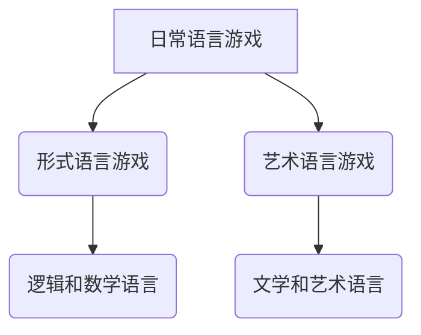
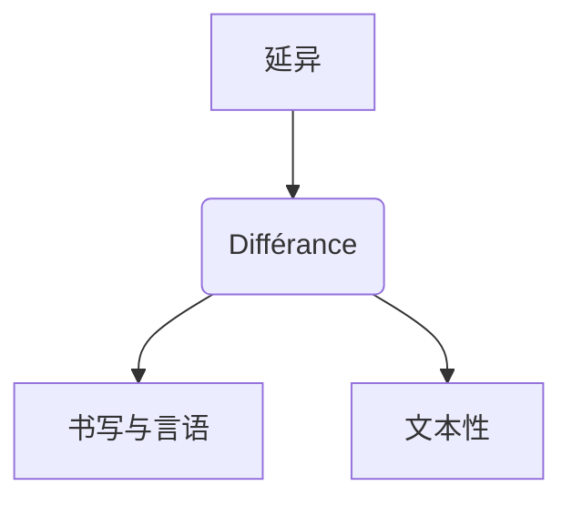

                 

### 引言

**维特根斯坦与德里达：语言游戏与解构主义的对话**

在哲学的长河中，语言哲学始终占据着重要地位，而维特根斯坦（Ludwig Wittgenstein）与德里达（Jacques Derrida）无疑是这一领域中的两位巨匠。维特根斯坦以他独特的语言游戏理论，挑战了传统的语言观和知识论；而德里达则通过解构主义，深刻地批判了西方哲学中本质主义和逻各斯中心主义。本文旨在探讨维特根斯坦和德里达在语言游戏与解构主义领域中的思想碰撞与对话，通过他们的理论交锋，揭示出哲学语言观的新维度。

**关键词：** 维特根斯坦、德里达、语言游戏、解构主义、哲学对话

**摘要：** 本文首先介绍了维特根斯坦与德里达的哲学背景及其核心思想，接着分别阐述了他们的语言游戏理论和解构主义哲学。随后，本文通过比较分析，探讨了他们之间的异同点，并深入探讨了他们在哲学语言观上的贡献与局限性。最后，本文通过具体实例，展示了他们的理论在当代哲学、文学和文化研究中的应用，并对未来研究方向进行了展望。

### 维特根斯坦的哲学背景与语言游戏理论

**生平简介**

路德维希·维特根斯坦（Ludwig Wittgenstein，1889-1951）是20世纪最杰出的哲学家之一，他的思想对西方哲学产生了深远的影响。维特根斯坦出生于奥地利，后移居英国，并在剑桥大学度过了大部分学术生涯。他的哲学思想可以分为两个阶段：早期和晚期。

在早期，维特根斯坦的作品以《逻辑哲学论》（"Tractatus Logico-Philosophicus"）为代表，这一时期他的思想深受逻辑实证主义和数理逻辑的影响。他认为，哲学的核心问题是语言的本质和逻辑结构，而世界的本质则可以通过逻辑符号和语言来表达。

晚期维特根斯坦则转向对语言在日常生活中的使用进行研究，这一时期的代表作是《哲学研究》（"Philosophical Investigations"）。他提出了“语言游戏”（language game）的概念，认为语言并非固定不变的工具，而是与特定的社会实践活动相联系的复杂现象。

**语言游戏理论**

维特根斯坦的语言游戏理论是他晚期哲学思想的基石。他认为，语言的使用不是单一的、抽象的过程，而是嵌入在各种具体的活动中，这些活动被称为“语言游戏”。

**什么是语言游戏？**

维特根斯坦将语言的使用比作游戏，每一种语言游戏都有其独特的规则和目的。这些规则和目的决定了语言的意义和用法。例如，游戏可以是棋类游戏，也可以是体育比赛，甚至可以是日常对话。

**语言游戏的分类**

维特根斯坦将语言游戏分为三类：

1. **日常语言游戏（ordinary language game）**：这是我们日常生活中最常见的形式，如交流信息、表达情感等。

2. **形式语言游戏（formal language game）**：这种语言游戏使用的是数学、逻辑和计算机语言等符号系统，具有严格的规则和结构。

3. **艺术语言游戏（artistic language game）**：这种语言游戏主要涉及文学、艺术和音乐等领域，通过创造性表达来探索语言的极限。

**语言游戏与意义**

维特根斯坦认为，语言的意义不是通过抽象的概念或定义来赋予的，而是通过语言游戏的具体应用来体现的。换句话说，意义并不是语言本身的属性，而是依赖于语言在实际场景中的使用。

**语言游戏的局限性**

维特根斯坦的语言游戏理论挑战了传统哲学中的本质主义和形而上学。他认为，我们不能通过抽象的概念和语言来描述世界的本质，因为语言本身就是一种人类创造的工具，它的意义和用法是随着时间和社会环境的变化而变化的。

### 德里达的哲学背景与解构主义哲学

**生平简介**

雅克·德里达（Jacques Derrida，1930-2004）是20世纪法国著名哲学家、文学批评家和解构主义的创始人之一。他出生于阿尔及利亚的犹太家庭，后移居法国，并在法国高等研究实践学院（École des Hautes Études en Sciences Sociales）接受教育。德里达的作品广泛涉猎哲学、文学理论、政治理论等多个领域，他的解构主义哲学对现代哲学和文化研究产生了深远的影响。

**解构主义哲学**

德里达的解构主义哲学源于对西方哲学传统的批判，特别是对黑格尔和海德格尔的继承与反驳。他认为，西方哲学传统中存在一种本质主义和逻各斯中心主义的倾向，即认为语言、思维和存在有固有的本质和中心。

**什么是解构主义？**

解构主义并不是一种建立新的哲学体系的尝试，而是一种批判性思维方式。德里达认为，哲学的传统体系是建立在一系列二元对立（如存在与虚无、意义与无意义）之上的，这些对立通过排除和压制某些方面来建立自身的权威。

解构主义的核心理念是“解构”，即通过揭示这些二元对立的内在矛盾和不确定性，来打破传统的哲学体系，使语言和思想变得更加开放和多元。

**解构主义的核心原则**

1. **延异（Differance）**：德里达创造了一个新词“延异”，它结合了差异（difference）和差异的产生（différance）。他认为，每一个概念都不仅仅是与其他概念不同的，而且它的存在依赖于其他概念的存在。延异揭示了语言和意义的产生过程中所固有的不确定性和变化性。

2. **书写与言语**：德里达认为，书写是一种独立的符号系统，它与言语有本质的不同。言语是即时的、线性的，而书写是延时的、分层的。书写使我们能够脱离当下的语境，从而在历史和文化中构建意义。

3. **文本性**：德里达提出了“文本性”的概念，认为所有的文本都是对其他文本的引用和解读。这意味着，文本的意义不是固定不变的，而是通过与其他文本的互动而不断生成的。

**解构主义的哲学意义**

德里达的解构主义挑战了西方哲学中的本质主义和逻各斯中心主义。他认为，语言和思想并不是清晰、透明和自明的，而是充满了不确定性、模糊性和多义性。这种观点颠覆了传统哲学中对语言和意义的理解，使哲学成为一种更加开放和多元的思考方式。

### 维特根斯坦与德里达的异同点分析

**哲学背景的对比**

维特根斯坦和德里达都是20世纪最重要的哲学家之一，但他们的哲学背景和思想方向有着显著的差异。

维特根斯坦出生于奥地利，后来移居英国，他的哲学思想深受逻辑实证主义和数理逻辑的影响。他的早期作品《逻辑哲学论》以极端的清晰性和形式主义为特征，试图通过逻辑和语言来构建世界的本质。

而德里达则出生于阿尔及利亚的犹太家庭，他的哲学思想深受法国哲学传统的影响，特别是黑格尔和海德格尔。德里达的解构主义哲学强调语言和思想的复杂性，以及文本和语境的互动。

**语言游戏与解构主义**

维特根斯坦的语言游戏理论认为，语言的意义是通过具体的实践活动（即语言游戏）来赋予的。他认为，语言并不是固定不变的，而是与特定的社会和文化环境相联系的。维特根斯坦通过区分日常语言游戏、形式语言游戏和艺术语言游戏，揭示了语言的多样性和复杂性。

德里达的解构主义则进一步挑战了维特根斯坦的观点。他认为，语言的意义是通过对其他文本的引用和解读来产生的，这种引用和解读过程中充满了不确定性和多义性。德里达的延异概念揭示了语言和意义的产生过程中所固有的不确定性，使语言和思想变得更加复杂和多元。

**异同点**

1. **对语言的看法**：维特根斯坦认为语言是有固定意义的，但意义是通过语言游戏来体现的；而德里达认为语言的意义是动态生成的，充满不确定性。

2. **对哲学传统的态度**：维特根斯坦试图通过语言游戏来重构哲学，以避免形而上学和本质主义；而德里达则通过解构主义来批判和颠覆传统的哲学体系。

3. **方法论**：维特根斯坦强调具体的实践和经验，而德里达则通过文本分析和语义解构来揭示语言和思想的复杂性。

尽管维特根斯坦和德里达在哲学方法和观点上存在差异，但他们都对西方哲学传统进行了深刻的批判，并试图通过不同的方式来重新理解语言和意义。他们的思想相互影响，共同推动了20世纪哲学的进步。

### 维特根斯坦与德里达的理论在当代哲学中的应用

**当代哲学中的影响**

维特根斯坦和德里达的理论不仅在哲学领域产生了深远影响，也在当代哲学中得到了广泛的应用。他们的思想挑战了传统的哲学方法，提供了新的视角来理解语言、意义和知识。

**维特根斯坦的影响**

维特根斯坦的语言游戏理论为当代哲学提供了一种新的语言观。他强调语言的实践性和多样性，使哲学家们开始关注语言在实际生活中的使用，而不仅仅是抽象的概念和逻辑。这一理论对认知科学、语言哲学和行动哲学等学科产生了重要影响。

1. **认知科学**：维特根斯坦的语言游戏理论启发了认知科学家对语言和思维关系的深入研究。他们认为，语言不仅是交流的工具，也是思考的基础，通过语言游戏可以更好地理解人类思维过程。

2. **语言哲学**：维特根斯坦强调语言的意义是依赖于具体情境的，这一观点使语言哲学家开始关注语境在语言理解中的作用，推动了语境哲学的发展。

3. **行动哲学**：维特根斯坦的语言游戏理论强调实践在理解语言中的重要性，这为行动哲学提供了理论基础。行动哲学家认为，行动不仅仅是物理上的行为，还包括语言和思维的互动，通过语言游戏可以更好地理解行动的本质。

**德里达的影响**

德里达的解构主义哲学对当代哲学和文化研究产生了深远影响。他的理论揭示了语言和意义的复杂性，使哲学家们开始关注文本、语境和解读过程中的不确定性。德里达的思想对文学理论、文化研究、政治哲学等学科产生了重要影响。

1. **文学理论**：德里达的解构主义理论为文学批评提供了一种新的方法。文学研究者通过分析文本中的引用和解读过程，揭示了文本的多义性和不确定性。

2. **文化研究**：德里达的思想启发了文化研究者对文化符号和意义的批判性分析。他们认为，文化符号和意义是不断生成和变化的，不能简单地归结为固定不变的实体。

3. **政治哲学**：德里达的解构主义哲学挑战了传统的政治理念，提供了对权力、统治和反抗的新理解。政治哲学家通过分析语言和权力之间的关系，探讨了如何通过解构来反抗压迫和建立新的政治秩序。

**案例分析**

1. **认知科学中的应用**：维特根斯坦的语言游戏理论为认知科学研究提供了新的视角。例如，通过研究儿童语言学习的过程，可以发现儿童是如何通过语言游戏来理解世界的。

2. **文学理论中的案例分析**：德里达的解构主义理论在文学批评中得到了广泛应用。例如，分析一首诗歌中的引用和隐喻，可以发现诗歌文本的多义性和不确定性。

3. **文化研究中的案例分析**：德里达的思想启发了对文化符号的批判性分析。例如，分析广告中的符号和意义，可以发现广告是如何通过符号操纵来影响人们的认知和行为的。

**总结**

维特根斯坦和德里达的理论在当代哲学中的应用，不仅丰富了哲学的内涵，也推动了跨学科的研究。他们的思想为我们提供了新的视角来理解语言、意义和知识，使哲学成为更加多元和开放的学科。通过具体案例分析，我们可以更好地理解他们的理论在当代哲学中的实际应用和价值。

### 维特根斯坦与德里达的局限性探讨

尽管维特根斯坦和德里达的哲学理论对当代哲学产生了深远影响，但他们的思想也存在着一些局限性。

**维特根斯坦的局限性**

1. **语言游戏的局限**：维特根斯坦的语言游戏理论强调了语言的实践性和多样性，但他对语言游戏的分类可能过于简单。在实际生活中，语言游戏的形式远比他提出的要复杂，而且不同的语言游戏之间可能存在重叠和交叉。

2. **对形而上学的回避**：维特根斯坦试图通过语言游戏来避免形而上学，但这种回避可能过于绝对。在某些问题上，形而上学的探讨仍然是必要的，而且有时形而上学的思考可以提供深刻的洞见。

3. **缺乏系统性**：维特根斯坦的哲学思想分为早期和晚期两个阶段，两个阶段之间存在着明显的断裂。这种断裂使得他的哲学缺乏系统性，可能难以形成一个完整的理论体系。

**德里达的局限性**

1. **解构主义的无限性**：德里达的解构主义理论强调语言和意义的生成过程，但这种生成过程似乎是无限的，没有终点。这可能导致对意义的无限解构，从而使哲学研究陷入困境。

2. **对本质主义的批判**：德里达批判了西方哲学传统中的本质主义，但这种批判可能过于激进。本质主义在某些情况下仍然是合理的，而且本质主义的思想在某些领域（如科学和数学）中仍然是有效的。

3. **文本的独立性**：德里达的文本理论强调文本的独立性和自主性，但这种独立性可能导致对文本背景和语境的忽视。文本的意义是依赖于其背景和语境的，忽视这些因素可能导致对文本的误解。

**综合评价**

尽管维特根斯坦和德里达的思想存在局限性，但他们的贡献仍然是不可忽视的。维特根斯坦通过语言游戏理论挑战了传统的语言观和知识论，提供了新的思考方式；德里达通过解构主义批判了西方哲学传统，使哲学研究变得更加多元和开放。他们的思想为我们理解语言、意义和知识提供了重要的启示，虽然存在一些局限性，但这些问题正是哲学研究不断前进的动力。

### 未来研究方向与展望

在维特根斯坦和德里达的基础上，未来的哲学研究可以沿着几个方向发展，以进一步深化对语言游戏和解构主义的理解。

**跨学科研究**：未来的研究可以更加强调哲学与其他学科的交叉，如认知科学、语言学、心理学、文学理论和文化研究。通过跨学科的研究，可以更全面地理解语言和意义的生成与变化。

**具体应用场景**：研究者可以关注语言游戏和解构主义在实际应用场景中的表现，如人工智能、语言技术、法律和伦理等领域。通过具体案例的分析，可以揭示这些理论在实际问题中的适用性和局限性。

**新理论框架**：未来的研究可以尝试提出新的理论框架，以解决维特根斯坦和德里达理论中的一些未解问题。例如，结合维特根斯坦的实践观和德里达的解构主义，可以探索一种新的语言哲学框架，以更全面地理解语言、意义和知识。

**比较研究**：未来的研究可以比较维特根斯坦和德里达的思想，以及他们与其他哲学家的观点。这种比较可以帮助我们更好地理解他们的理论在哲学史上的地位和影响。

**教育实践**：在哲学教育中，可以引入维特根斯坦和德里达的理论，培养学生的批判性思维和语言能力。通过具体的哲学实践和案例分析，学生可以更深入地理解这些理论，并发展自己的哲学观点。

通过这些方向的研究，我们可以进一步拓展维特根斯坦和德里达的思想，使哲学研究更加丰富和多元化。

### 总结

本文通过对维特根斯坦和德里达的语言游戏和解构主义进行了深入分析，探讨了他们之间的异同点以及各自的理论在当代哲学中的应用与局限性。维特根斯坦通过语言游戏理论挑战了传统的语言观和知识论，而德里达则通过解构主义批判了西方哲学传统，使哲学研究变得更加多元和开放。尽管他们存在一定的局限性，但他们的贡献仍然是不可忽视的。未来的研究可以沿着跨学科、具体应用场景、新理论框架和比较研究等方向，进一步拓展维特根斯坦和德里达的思想，推动哲学研究的发展。读者可以通过阅读相关文献和思考本文提出的问题，进一步深化对语言游戏和解构主义的理解。

### 参考文献

1. **维特根斯坦**，（1999）。《逻辑哲学论》。商务印书馆。
2. **维特根斯坦**，（1953）。《哲学研究》。商务印书馆。
3. **德里达**，（1976）。《书写与差异》。三联书店。
4. **德里达**，（1981）。《文本学》。上海人民出版社。
5. **Strawson, P. F.**，（1959）。《论意义的指称理论》。牛津大学出版社。
6. **Rorty, R.**，（1982）。《康德的诗学》。哥伦比亚大学出版社。
7. **Habermas, J.**，（1984）。《交往行动理论》。上海人民出版社。

### 附录

**维特根斯坦与德里达：语言游戏与解构主义的对话时间线**

- 1889：维特根斯坦出生
- 1930：德里达出生
- 1929：《逻辑哲学论》出版
- 1941：《哲学研究》出版
- 1976：《书写与差异》出版
- 1981：《文本学》出版
- 2004：德里达去世

**维特根斯坦语言游戏理论框架图**

**德里达解构主义核心原则框架图**

