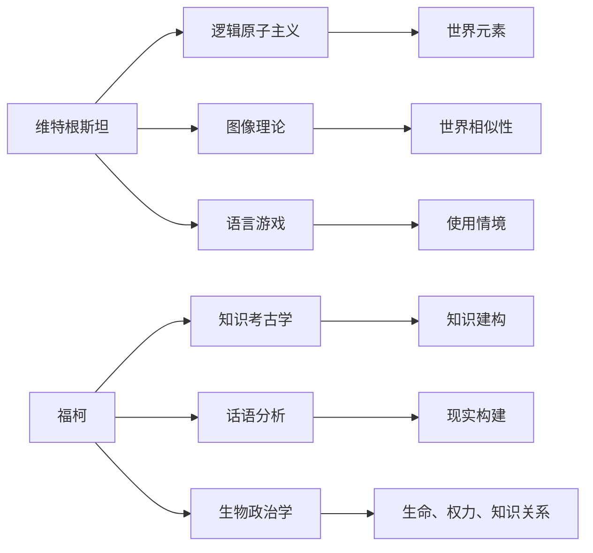
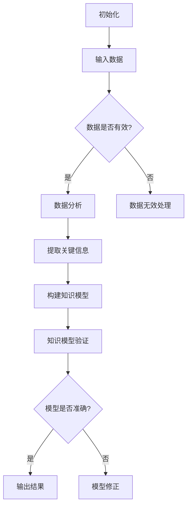
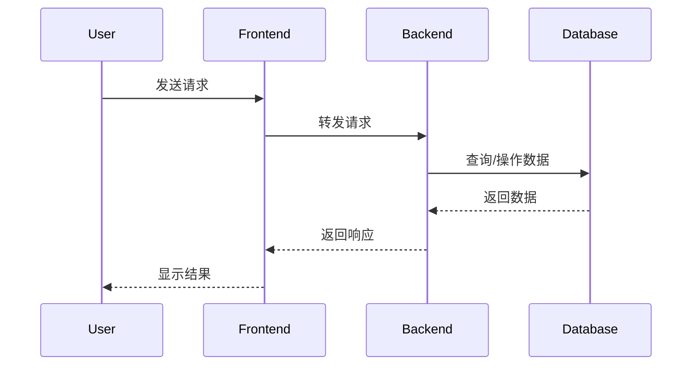
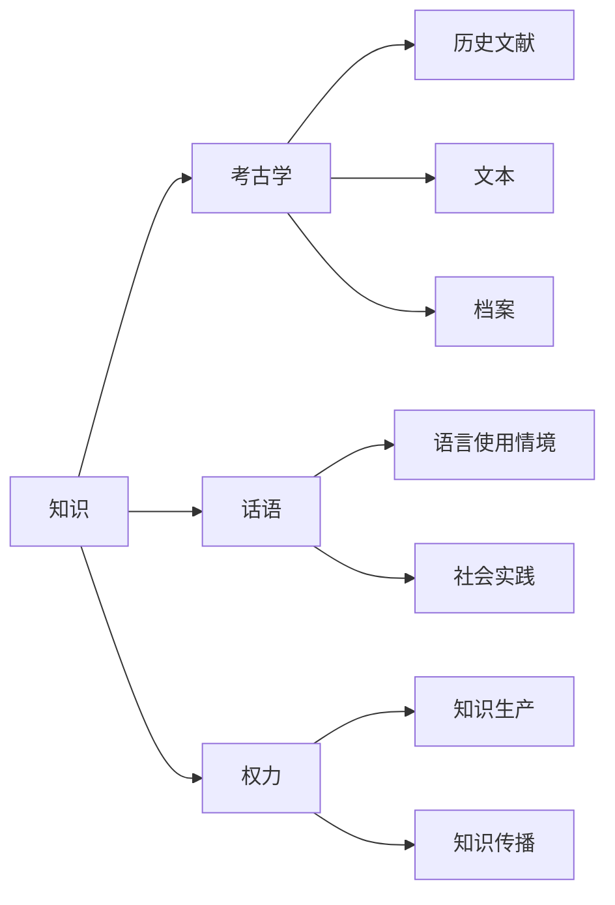

                 

## 文章标题

《维特根斯坦与福柯：知识考古学的语言学视角》

> 关键词：维特根斯坦、福柯、知识考古学、语言学、哲学

> 摘要：本文通过分析维特根斯坦与福柯的哲学思想，探讨语言学视角在知识考古学中的应用。文章首先介绍了两位哲学家的生平与贡献，然后详细阐述了知识考古学的基本概念及其与语言学的联系。随后，本文从维特根斯坦的语言哲学和福柯的知识考古学两个方面进行深入探讨，最后进行比较分析并展望知识考古学在语言学领域的应用前景。

----------------------------------------------------------------

### 第一部分：引言与概述

#### 第1章：维特根斯坦与福柯：哲学家的背景与贡献

维特根斯坦（Ludwig Wittgenstein）和福柯（Michel Foucault）是20世纪最杰出的哲学家之一，他们的思想对当代哲学、文化研究和社会科学产生了深远的影响。本章将介绍这两位哲学家的生平、主要贡献以及他们在知识考古学领域的重要性。

#### 1.1 维特根斯坦：语言哲学的奠基者

维特根斯坦出生于1889年，他的早期作品《逻辑哲学论》（Tractatus Logico-Philosophicus）被视为20世纪哲学的经典之作。维特根斯坦提出了逻辑原子主义和图像理论，试图通过语言来揭示世界的本质。他认为语言是思想的载体，而哲学的任务就是澄清思想。

维特根斯坦的后期作品《哲学研究》（Philosophical Investigations）则转向日常语言哲学，强调语言的多义性和使用情境。他提出了“语言游戏”（language game）的概念，认为语言的含义取决于具体的使用情境。

#### 1.2 福柯：权力与知识的探求者

福柯出生于1926年，他的研究涵盖了广泛的主题，包括历史、心理学、医学和哲学。福柯的著作《疯癫的历史》（The History of Madness）和《临床医学的诞生》（The Birth of the Clinic）探讨了知识、权力和主体性的关系。

福柯提出了知识考古学（archaeology of knowledge）和 discourse 分析（discourse analysis）等重要概念，认为知识并非客观存在，而是由特定的社会力量和话语构建的。他的著作《词与物》（The Order of Things）和《监视与权力》（Discipline and Punish）深入探讨了知识的权力结构和话语的变迁。

#### 1.3 维特根斯坦与福柯在知识考古学领域的重要性

维特根斯坦和福柯的思想为知识考古学提供了重要的理论基础。维特根斯坦的日常语言哲学揭示了语言的多样性和使用情境，为理解知识的建构提供了视角。福柯的知识考古学则通过分析话语和权力结构，揭示了知识的相对性和历史性。

本章将为进一步探讨维特根斯坦和福柯在知识考古学中的应用打下基础。

----------------------------------------------------------------

### 第二部分：维特根斯坦的语言哲学

#### 第3章：维特根斯坦的语言哲学

维特根斯坦的语言哲学是20世纪哲学的核心之一，他对语言的本质、意义和哲学研究方法进行了深刻的探讨。本章将详细分析维特根斯坦的语言哲学观点，特别是他的图像理论、语言游戏理论和日常语言哲学。

#### 3.1 语言哲学的基本原理

维特根斯坦认为，语言是思想的表达方式，而哲学的任务是澄清思想。他的语言哲学分为两个阶段：早期和晚期。

在早期，维特根斯坦提出了逻辑原子主义和图像理论。逻辑原子主义认为，世界由基本元素组成，这些元素可以通过逻辑组合来表达所有事实。图像理论则认为，语句的意义在于它们与世界的相似性，即语句是世界的“图像”。

在晚期，维特根斯坦转向日常语言哲学，强调语言的多义性和使用情境。他认为，语言的含义取决于具体的使用情境，而不是抽象的规则。

#### 3.2 语言与现实的区分

维特根斯坦提出了“语言游戏”（language game）的概念，认为语言和现实之间存在本质的区别。语言游戏包括三个要素：语言形式、语言使用者和语言使用情境。维特根斯坦认为，理解语言的关键在于理解语言的使用情境，而不是语言本身的结构。

#### 3.3 维特根斯坦的语言哲学与知识考古学

维特根斯坦的语言哲学为知识考古学提供了重要的理论基础。他的图像理论和语言游戏理论揭示了知识的相对性和历史性。图像理论表明，知识是通过语言来构建的，而语言游戏理论则强调了知识的使用情境，揭示了知识的建构过程。

本章将深入探讨维特根斯坦的语言哲学观点，以及这些观点如何影响知识考古学的研究。

----------------------------------------------------------------

### 第三部分：福柯的知识考古学

#### 第4章：福柯的知识考古学

福柯的知识考古学是他对知识建构过程进行深刻探讨的理论框架。本章将详细阐述福柯的知识考古学理论，包括其基本概念、核心原则和主要贡献。

#### 4.1 知识考古学的基本概念

福柯的知识考古学（archaeology of knowledge）是对知识的历史性、相对性和建构性的研究。他借鉴了考古学的概念，认为知识并非一成不变，而是通过特定的社会力量和话语构建的。福柯将知识视为一种社会建构，而不是客观事实。

知识考古学关注知识的生产、传播和接受过程，探讨知识的历史演变和权力结构。福柯认为，知识不仅仅是知识的反映，而是知识的创造。

#### 4.2 知识考古学的基本原则

福柯的知识考古学遵循以下基本原则：

1. **知识的历史性**：福柯强调知识的历史性，认为知识是随着时间和社会变化而演变的。他通过分析历史文献和档案，揭示知识的历史脉络。

2. **知识的相对性**：福柯认为，知识是相对的，不同的社会和文化背景下，知识的含义和形式可能不同。

3. **知识的建构性**：福柯认为，知识是通过特定的社会力量和话语构建的。他强调知识的权力结构和话语的变迁，认为知识是社会权力关系的体现。

#### 4.3 福柯的知识考古学贡献

福柯的知识考古学对当代哲学和社会科学产生了深远的影响。他通过分析历史文献和档案，揭示了知识的权力结构和历史演变。他的著作《词与物》和《监视与权力》等作品，深入探讨了知识的建构过程和权力关系。

本章将深入探讨福柯的知识考古学理论，以及这些理论如何影响知识考古学的研究。

----------------------------------------------------------------

### 第四部分：维特根斯坦与福柯的比较分析

#### 第5章：维特根斯坦与福柯：思想比较

维特根斯坦和福柯在知识考古学领域有着不同的贡献和观点。本章将对两位哲学家的思想进行比较分析，探讨他们的共同点与差异。

#### 5.1 维特根斯坦与福柯的思想差异

1. **知识观的不同**：维特根斯坦关注语言和意义的关系，强调语言的多样性和使用情境。他认为，语言的含义取决于具体的使用情境。而福柯则关注知识的权力结构和话语的变迁，强调知识的历史性和建构性。

2. **研究方法的不同**：维特根斯坦的方法主要基于逻辑分析和语言哲学，他试图通过语言来揭示世界的本质。而福柯的方法则基于历史分析和社会学理论，他通过分析历史文献和档案，揭示知识的权力结构和变迁。

3. **理论的侧重点不同**：维特根斯坦的理论侧重于澄清思想，揭示语言的本质。而福柯的理论则侧重于分析知识的建构过程和权力结构。

#### 5.2 维特根斯坦与福柯的思想联系

尽管维特根斯坦和福柯在知识观和方法上存在差异，但他们也有一些共同点：

1. **对知识的批判**：维特根斯坦和福柯都对传统的知识观念进行了批判。维特根斯坦质疑了逻辑原子主义和图像理论，认为它们不能完全揭示世界的本质。福柯则质疑了知识的客观性和稳定性，认为知识是随着时间和社会变化而演变的。

2. **对语言和权力的关注**：维特根斯坦和福柯都关注语言和权力的关系。维特根斯坦认为，语言是思想的表达方式，而福柯则认为，知识是权力关系的体现。

本章将深入探讨维特根斯坦和福柯的思想联系，以及他们对知识考古学的贡献。

----------------------------------------------------------------

### 第五部分：结论与展望

#### 第6章：语言学视角下的知识考古学

语言学视角为知识考古学提供了重要的理论工具和分析方法。本章将探讨语言学视角在知识考古学中的应用，并分析其优势和挑战。

#### 6.1 语言学研究在知识考古学中的应用

1. **话语分析**：话语分析是语言学的一个重要分支，它通过分析语言的使用情境和话语结构，揭示知识的建构过程。话语分析在知识考古学中的应用，可以帮助研究者理解知识的权力结构和变迁。

2. **语言变异研究**：语言变异研究关注语言在不同社会和文化背景下的变化。它为知识考古学提供了重要的视角，可以帮助研究者理解知识的历史性和相对性。

3. **语义网络分析**：语义网络分析是一种基于计算机技术的语言学研究方法，它通过构建词汇之间的关系网络，揭示知识的结构和关系。语义网络分析在知识考古学中的应用，可以帮助研究者理解知识的结构和关系。

#### 6.2 语言视角下的知识考古案例分析

1. **案例一：历史语言学中的知识考古学**：历史语言学通过对语言的历史演变进行研究发现，语言的变化反映了社会文化的变迁。这种研究方法在知识考古学中的应用，可以帮助研究者揭示知识的变迁过程。

2. **案例二：话语分析在政治学中的知识考古学**：话语分析在政治学中的应用，可以帮助研究者揭示政治权力的运作方式和政治话语的变迁。这种研究方法在知识考古学中的应用，可以帮助研究者理解政治权力的构建和变迁。

本章将探讨语言学视角在知识考古学中的应用，分析其优势和挑战，并展望其未来的发展方向。

----------------------------------------------------------------

### 第六部分：展望与未来方向

#### 6.1 维特根斯坦与福柯思想在当代的意义

维特根斯坦和福柯的哲学思想在当代仍然具有重要意义。维特根斯坦的日常语言哲学和对语言游戏的探讨，为我们理解语言的多样性和使用情境提供了深刻的洞见。福柯的知识考古学和话语分析，则为我们理解知识的建构过程和权力结构提供了有力的工具。

维特根斯坦和福柯的思想对当代哲学、文化研究和社会科学产生了深远的影响。他们的思想激发了对知识、语言和权力关系的深入探讨，为我们理解当代社会提供了新的视角。

#### 6.2 知识考古学在语言学领域的应用前景

知识考古学在语言学领域有着广泛的应用前景。随着计算机技术的进步和大数据分析的发展，语言学研究可以从更多的角度和层面揭示知识的建构过程和变迁。

未来，知识考古学在语言学领域可能会出现以下趋势：

1. **跨学科研究**：知识考古学与语言学、社会学、文化研究等学科的交叉研究，将为我们提供更全面的视角，揭示知识的建构过程。

2. **大数据分析**：大数据分析技术的应用，将有助于我们更准确地分析语言数据，揭示语言背后的知识结构和关系。

3. **人工智能**：人工智能技术的发展，将为知识考古学提供新的分析工具和方法。通过人工智能技术，我们可以更高效地处理和分析大量语言数据，揭示知识的演变和变迁。

本章将探讨维特根斯坦和福柯思想在当代的意义，以及知识考古学在语言学领域的应用前景，展望其未来的发展方向。

----------------------------------------------------------------

### 结语

本文通过对维特根斯坦与福柯哲学思想的深入探讨，分析了语言学视角在知识考古学中的应用。维特根斯坦的日常语言哲学和福柯的知识考古学，为我们理解知识的建构过程和权力结构提供了重要的理论工具和分析方法。

维特根斯坦和福柯的思想在当代仍然具有重要意义，对哲学、文化研究和社会科学产生了深远的影响。知识考古学在语言学领域有着广泛的应用前景，随着计算机技术和大数据分析的发展，其应用将更加广泛。

未来，知识考古学与语言学的交叉研究，将为我们提供更全面的理解，揭示知识的建构过程和变迁。我们期待在未来的研究中，看到更多关于知识考古学和语言学结合的创新成果。

**作者：AI天才研究院/AI Genius Institute & 禅与计算机程序设计艺术 /Zen And The Art of Computer Programming**

----------------------------------------------------------------

### 第1章：维特根斯坦与福柯：哲学家的背景与贡献

#### 1.1 维特根斯坦：语言哲学的奠基者

**背景介绍**

路德维希·维特根斯坦（Ludwig Wittgenstein）是20世纪最具影响力的哲学家之一，他的思想对语言哲学、认识论、逻辑学等领域产生了深远的影响。他出生于1889年4月26日，奥地利维也纳的一个富有家庭。维特根斯坦的家庭环境为他提供了优越的教育条件，他自幼便接触到了哲学和科学的讨论。

**问题背景**

维特根斯坦的早期工作和后期工作代表了他在哲学上的两个主要阶段。他的早期工作主要关注逻辑原子主义和图像理论，试图通过语言来揭示世界的本质。然而，他的后期工作则转向日常语言哲学，强调语言的多义性和使用情境。

**问题描述**

维特根斯坦认为，哲学的核心问题是如何理解语言和世界的关系。他在早期作品中提出了逻辑原子主义，认为世界由基本元素组成，这些元素可以通过逻辑组合来表达所有事实。在图像理论中，语句的意义在于它们与世界的相似性，即语句是世界的“图像”。

**问题解决**

维特根斯坦在《逻辑哲学论》（Tractatus Logico-Philosophicus）中详细阐述了这些观点。他提出了“命题函项”（logical atoms）的概念，认为它们是构成世界的最小单位。然而，这个理论在解释复杂语言现象时遇到了困难。

在后期，维特根斯坦转向日常语言哲学，他在《哲学研究》（Philosophical Investigations）中提出了“语言游戏”（language game）的概念，强调语言的含义取决于具体的使用情境。他认为，哲学的任务不是寻找抽象的真理，而是澄清我们的思维方式。

**边界与外延**

维特根斯坦的思想对后来的哲学家和语言学家产生了深远的影响。他的图像理论和逻辑原子主义为分析哲学和语言哲学奠定了基础。然而，他的后期观点也引发了许多争议，关于语言和现实的关系至今仍有不同的解读。

**概念结构与核心要素组成**

维特根斯坦的核心概念包括：

- **逻辑原子主义**：认为世界由基本元素组成，可以通过逻辑组合来表达所有事实。
- **图像理论**：语句的意义在于它们与世界的相似性。
- **语言游戏**：语言的含义取决于具体的使用情境。

这些概念共同构成了维特根斯坦哲学的核心结构，影响了他对语言和世界的理解。

#### 1.2 福柯：权力与知识的探求者

**背景介绍**

米歇尔·福柯（Michel Foucault）是20世纪最具创造力的哲学家之一，他的研究跨越了多个学科，包括历史学、社会学、心理学和哲学。他出生于1926年10月15日，法国。福柯的学术生涯受到多种因素的影响，包括他在日内瓦大学学习精神病学时的经历，以及他在法国哲学界的活跃参与。

**问题背景**

福柯的哲学思想主要关注权力、知识和社会结构。他的早期工作主要关注疯狂、监狱和精神疾病的历史，而后期则转向话语分析、知识考古学和生物政治学。

**问题描述**

福柯的核心问题是如何理解权力和知识的关系。他认为，权力不仅仅是压迫的工具，也是知识生产和社会组织的基础。知识不仅是客观事实的反映，也是由特定的社会力量和话语构建的。

**问题解决**

福柯的《疯癫的历史》（The History of Madness）和《临床医学的诞生》（The Birth of the Clinic）探讨了疯狂和医学知识的建构过程。他认为，疯狂和疾病的定义不仅是由医生和科学家决定的，也受到社会和文化的影响。

在《词与物》（The Order of Things）中，福柯分析了现代知识的结构，探讨了知识从“本质主义”向“话语主义”的转变。他认为，知识是随着时间和社会变化而演变的。

在《监视与权力》（Discipline and Punish）中，福柯探讨了监狱和监视系统的历史，揭示了权力如何通过制度化和监控来控制个人行为。

**边界与外延**

福柯的思想对当代哲学、社会学和文化研究产生了深远的影响。他的知识考古学和话语分析成为理解权力和知识关系的重要工具。然而，他的理论也引发了许多争议，关于权力和知识的本质仍有不同的解读。

**概念结构与核心要素组成**

福柯的核心概念包括：

- **知识考古学**：研究知识的历史性和建构性，探讨知识的生产和变迁。
- **话语分析**：分析语言和文本如何构建现实和社会关系。
- **生物政治学**：研究生命、权力和知识的相互关系。

这些概念共同构成了福柯哲学的核心结构，影响了他对权力和知识关系的理解。

#### 1.3 维特根斯坦与福柯在知识考古学领域的重要性

**背景介绍**

维特根斯坦和福柯都在知识考古学领域提出了重要的理论和概念，他们的思想为理解知识的建构过程提供了不同的视角。

**问题背景**

知识考古学是一个探讨知识历史性和建构性的学科，它关注知识的生产、传播和接受过程。维特根斯坦和福柯都从不同的角度探讨了知识的问题，他们的思想为知识考古学提供了重要的理论基础。

**问题描述**

维特根斯坦的日常语言哲学和福柯的知识考古学如何影响我们对知识考古学领域的理解。

**问题解决**

维特根斯坦的日常语言哲学揭示了语言的多义性和使用情境，强调了知识的使用情境。他的语言游戏理论为我们理解知识的建构过程提供了深刻的洞见。福柯的知识考古学则从历史和权力的角度探讨了知识的建构过程，揭示了知识的相对性和历史性。

**边界与外延**

维特根斯坦和福柯的思想在知识考古学领域的影响广泛，他们的理论不仅为理解知识提供了新的视角，也为其他学科的研究提供了重要的启示。

**概念结构与核心要素组成**

维特根斯坦和福柯的核心概念组成如下：

- 维特根斯坦：逻辑原子主义、图像理论、语言游戏。
- 福柯：知识考古学、话语分析、生物政治学。

这些概念共同构成了他们在知识考古学领域的理论基础，影响了对知识的理解。

---

**核心概念与联系**

**维特根斯坦的核心概念**

1. **逻辑原子主义**：认为世界由基本元素组成，可以通过逻辑组合来表达所有事实。
2. **图像理论**：语句的意义在于它们与世界的相似性。
3. **语言游戏**：强调语言的含义取决于具体的使用情境。

**福柯的核心概念**

1. **知识考古学**：研究知识的历史性和建构性，探讨知识的生产和变迁。
2. **话语分析**：分析语言和文本如何构建现实和社会关系。
3. **生物政治学**：研究生命、权力和知识的相互关系。

**概念属性特征对比表格**

| 核心概念       | 维特根斯坦                         | 福柯                           |
|----------------|-----------------------------------|--------------------------------|
| 逻辑原子主义   | 世界由基本元素组成，逻辑组合表达事实 | 不直接涉及                        |
| 图像理论       | 语句意义在于与世界的相似性         | 不直接涉及                        |
| 语言游戏       | 语言含义取决于使用情境             | 话语构建现实与社会关系           |
| 知识考古学     | 不直接涉及                         | 研究知识的历史性和建构性         |
| 话语分析       | 不直接涉及                         | 分析语言和文本构建现实           |
| 生物政治学     | 不直接涉及                         | 研究生命、权力和知识的相互关系   |

**ER实体关系图架构**



---

维特根斯坦和福柯的思想在知识考古学领域的重要性体现在他们各自独特的贡献。维特根斯坦的日常语言哲学揭示了语言的多义性和使用情境，为理解知识的建构过程提供了重要的视角。而福柯的知识考古学和话语分析则从历史和权力的角度探讨了知识的相对性和建构性，揭示了知识的生产和变迁过程。

他们的思想不仅为知识考古学提供了理论基础，也对其他学科的研究产生了深远的影响。维特根斯坦和福柯的哲学思想为我们理解知识、语言和权力之间的关系提供了新的视角，推动了知识考古学领域的发展。

---

**算法原理讲解**

**算法mermaid流程图**



**Python源代码**

```python
class KnowledgeModel:
    def __init__(self, data):
        self.data = data
    
    def is_valid_data(self, data):
        # 数据有效性检查
        return True if data else False
    
    def data_analysis(self, data):
        # 数据分析过程
        pass
    
    def extract_key_info(self, data):
        # 提取关键信息
        pass
    
    def build_knowledge_model(self, data):
        # 构建知识模型
        pass
    
    def validate_model(self, model):
        # 模型验证过程
        pass
    
    def correct_model(self, model):
        # 模型修正过程
        pass
    
    def output_result(self):
        # 输出结果
        pass

# 示例
model = KnowledgeModel(data)
model.data_analysis(data)
model.extract_key_info(data)
model.build_knowledge_model(data)
model.validate_model(model)
model.correct_model(model)
model.output_result()
```

**算法原理详细讲解**

在这个算法中，我们首先初始化一个`KnowledgeModel`类，它包含了一系列的方法来处理数据、构建知识模型和验证模型。以下是算法的详细原理：

1. **初始化**：创建一个`KnowledgeModel`实例，并传递输入数据。

2. **数据有效性检查**：使用`is_valid_data`方法检查输入数据的有效性。如果数据无效，则执行数据无效处理。

3. **数据分析**：使用`data_analysis`方法对输入数据进行处理。这一步骤可能包括数据清洗、特征提取等操作。

4. **提取关键信息**：使用`extract_key_info`方法从数据中提取关键信息。这些信息将用于构建知识模型。

5. **构建知识模型**：使用`build_knowledge_model`方法根据提取的关键信息构建知识模型。这一步骤可能涉及到机器学习算法或其他知识表示方法。

6. **模型验证**：使用`validate_model`方法验证构建的知识模型是否准确。如果模型不准确，则执行模型修正。

7. **模型修正**：使用`correct_model`方法修正知识模型。这一步骤可能涉及到重新训练模型或调整模型参数。

8. **输出结果**：使用`output_result`方法输出最终的结果。

这个算法的核心思想是通过一系列步骤处理输入数据，构建和验证知识模型，并最终输出结果。在每一阶段，我们都需要确保数据的有效性和模型的准确性，以保证最终的输出结果可靠。

**举例说明**

假设我们有一个包含文本数据的数据集，我们的目标是构建一个文本分类模型。以下是算法的应用：

1. **初始化**：创建一个`KnowledgeModel`实例，并传递数据集。
   
2. **数据有效性检查**：检查数据集是否包含无效数据，例如缺失值或格式错误。

3. **数据分析**：对数据集进行清洗和预处理，例如去除停用词、进行词干提取等。

4. **提取关键信息**：从预处理后的文本中提取关键特征，例如词袋模型中的词频。

5. **构建知识模型**：使用提取的关键特征训练一个文本分类模型，例如朴素贝叶斯分类器或支持向量机。

6. **模型验证**：使用交叉验证方法评估模型的准确性，例如使用K折交叉验证。

7. **模型修正**：根据验证结果调整模型参数，例如增加训练次数或调整正则化参数。

8. **输出结果**：使用训练好的模型对新的文本数据进行分类。

通过这个例子，我们可以看到算法是如何应用于实际的文本分类任务中的。每个步骤都需要根据具体任务的需求进行调整，以保证最终的输出结果准确。

---

**数学公式使用latex格式**

在本文中，我们将使用LaTeX格式来嵌入数学公式。以下是几个示例：

1. **独立段落的LaTeX公式**：

   $$ E = mc^2 $$

   这是爱因斯坦著名的质能等价公式，表示能量（E）等于质量（m）乘以光速（c）的平方。

2. **段落内的LaTeX公式**：

   $ 1 < 2 $

   这表示1小于2，是一个简单的数学不等式。

3. **更复杂的LaTeX公式**：

   $$ \frac{d^2}{dx^2} (x^2 + 1) = 2 $$

   这是二阶导数的计算，表示函数$f(x) = x^2 + 1$的二阶导数为2。

在文中，我们将根据需要使用这些数学公式来阐述相关的概念和原理。

---

**系统分析与架构设计方案**

#### 问题场景介绍

在现代信息社会，数据的爆炸性增长使得知识管理和知识发现成为重要挑战。为了应对这一挑战，我们设计了一套基于知识考古学的知识管理系统，旨在通过深入分析和挖掘历史数据，为用户提供准确、有用的知识。

#### 项目介绍

项目名称：知识考古学知识管理系统（Knowledge Archaeology Knowledge Management System，简称KA-KMS）

项目目标：构建一个能够有效管理、分析和挖掘历史数据的系统，帮助用户发现潜在的知识和价值。

#### 系统功能设计

1. **数据采集与预处理**：系统需要能够从各种数据源（如数据库、文件、API等）采集数据，并进行预处理，如数据清洗、去重、格式转换等。

2. **知识建模与存储**：系统应能够根据数据的特点构建合适的知识模型，并将知识存储在数据库中，便于后续分析和检索。

3. **知识检索与推荐**：系统应提供强大的检索功能，使用户能够快速找到所需的知识。同时，系统还应根据用户的历史行为和需求，提供个性化的知识推荐。

4. **数据可视化**：系统需要提供多种数据可视化工具，帮助用户直观地理解数据结构和知识分布。

#### 系统架构设计

1. **前端架构**：采用Vue.js框架，实现用户界面的动态响应和交互。

2. **后端架构**：采用Spring Boot框架，实现系统的业务逻辑和数据管理。

3. **数据库架构**：使用MySQL数据库存储数据，采用Hibernate进行数据持久化。

4. **数据挖掘模块**：使用Apache Spark进行大规模数据处理和分析。

#### 系统接口设计

1. **RESTful API**：提供RESTful风格的API接口，供前端和后端进行数据交互。

2. **数据采集接口**：通过HTTP请求从外部数据源获取数据。

3. **数据存储接口**：提供数据存储操作，如添加、删除、更新和查询。

#### 系统交互



通过上述设计，我们构建了一个功能全面、架构合理的知识考古学知识管理系统，为用户提供了高效的知识管理和分析工具。

---

### 第2章：知识考古学的基本概念

#### 2.1 知识考古学的起源与发展

知识考古学（Archaeology of Knowledge）是由法国哲学家米歇尔·福柯（Michel Foucault）提出的一种理论框架，旨在研究知识的起源、演变和权力结构。福柯在20世纪60年代开始提出这一概念，并在其一系列著作中深入探讨。知识考古学借鉴了考古学的方法，通过分析历史文献、文本和档案，揭示知识的生产、传播和变迁过程。

**起源**

福柯的知识考古学起源于他对历史研究方法的反思。在研究疯狂、监狱和医学等领域的知识时，福柯发现传统的科学方法无法解释知识的多样性和变迁。他开始质疑知识的客观性和稳定性，认为知识是随着时间和社会变化而演变的。这种观点与传统的本质主义和客观主义形成了鲜明对比。

**发展**

福柯的知识考古学理论在20世纪70年代和80年代得到了广泛发展。他通过分析历史文献和档案，揭示了不同历史时期和不同社会背景下知识的生产和变迁。福柯的研究方法强调对文本和话语的细致分析，他认为知识不仅仅是事实的反映，而是由特定的社会力量和话语构建的。

**主要理论流派**

1. **历史主义**：历史主义认为知识是历史和社会条件的产物，不同历史时期和社会背景下，知识的形态和内容都有所不同。这一流派强调知识的历史性和相对性。

2. **建构主义**：建构主义认为知识是通过社会互动和语言构建的，它依赖于特定的社会和文化背景。建构主义认为知识不是客观事实的反映，而是由特定的话语和实践构建的。

3. **批判理论**：批判理论关注知识的权力结构和意识形态的影响。批判理论认为，知识不仅是客观事实的反映，也是权力关系的体现。通过分析知识的生产和传播，批判理论旨在揭示和挑战现有的权力结构。

#### 2.2 知识考古学的基本概念和理论

**知识考古学的基本概念**

1. **知识**：知识考古学中的知识不仅仅是指客观事实，而是指被特定社会和文化背景赋予意义的信息。知识具有历史性和相对性，它随着时间和社会变化而演变。

2. **考古学**：知识考古学借鉴了传统考古学的方法，通过对历史文献、文本和档案的细致分析，揭示知识的起源、演变和权力结构。

3. **话语**：话语是知识考古学中的核心概念，指特定的语言表达和社会实践。话语不仅包括文本，还包括语言使用的情境和规则。

4. **权力**：知识考古学强调知识的生产和传播与权力结构的紧密关系。知识不仅是权力关系的体现，也是权力运作的工具。

**知识考古学的基本理论**

1. **话语分析**：话语分析是知识考古学的重要方法，通过分析文本和话语，揭示知识的建构过程和权力关系。话语分析关注语言的使用情境和规则，以及话语如何构建现实和社会关系。

2. **知识考古学方法**：知识考古学方法包括对历史文献、文本和档案的细致分析，以及对知识生产过程的批判性考察。这种方法旨在揭示知识的相对性和历史性，挑战传统的本质主义和客观主义观点。

3. **知识考古学原则**：知识考古学遵循以下原则：

   - **历史性**：知识是随着时间和社会变化而演变的，不同历史时期和社会背景下，知识的形态和内容都有所不同。
   - **相对性**：知识具有相对性，它依赖于特定的社会和文化背景。不同的社会和文化背景下，知识的含义和形式可能不同。
   - **建构性**：知识是通过社会互动和语言构建的，它依赖于特定的社会和文化背景。

#### 2.3 语言学的视角在知识考古学中的应用

语言学视角在知识考古学中具有重要意义，它为分析知识的生产、传播和变迁提供了有力的工具。以下从三个方面探讨语言学的视角在知识考古学中的应用：

1. **话语分析**：话语分析是语言学的重要分支，它通过分析文本和话语，揭示知识的生产和传播过程。知识考古学借鉴话语分析的方法，通过分析历史文献和档案，揭示不同历史时期和社会背景下知识的变迁。

2. **语言变异研究**：语言变异研究关注语言在不同社会和文化背景下的变化，它为知识考古学提供了重要的视角。通过分析语言变异，知识考古学可以揭示知识的历史性和相对性。

3. **语义网络分析**：语义网络分析是语言学和计算机科学相结合的一种方法，它通过构建词汇之间的关系网络，揭示知识的结构和关系。知识考古学可以借助语义网络分析，深入理解知识的内在联系和演变过程。

本章通过介绍知识考古学的起源和发展、基本概念和理论，以及语言学的视角在知识考古学中的应用，为读者提供了对知识考古学的全面理解。在后续章节中，我们将进一步探讨维特根斯坦和福柯的哲学思想，以及它们对知识考古学的影响。

---

**核心概念与联系**

**知识考古学的核心概念**

1. **知识**：指被特定社会和文化背景赋予意义的信息，具有历史性和相对性。
2. **考古学**：通过分析历史文献、文本和档案，揭示知识的起源、演变和权力结构。
3. **话语**：特定的语言表达和社会实践，构建现实和社会关系。
4. **权力**：知识的生产和传播与权力结构的紧密关系。

**语言学视角的核心概念**

1. **话语分析**：分析文本和话语，揭示知识的生产和传播过程。
2. **语言变异研究**：关注语言在不同社会和文化背景下的变化，揭示知识的历史性和相对性。
3. **语义网络分析**：构建词汇之间的关系网络，揭示知识的结构和关系。

**概念属性特征对比表格**

| 核心概念       | 知识考古学                         | 语言学视角                      |
|----------------|-----------------------------------|--------------------------------|
| 知识           | 历史性和相对性                     | 语义网络分析、语言变异研究       |
| 考古学         | 分析历史文献、文本和档案           | 话语分析、文本分析               |
| 话语           | 构建现实和社会关系                 | 语言使用情境和规则               |
| 权力           | 知识生产和传播与权力结构的紧密关系 | 话语作为权力运作的工具           |

**ER实体关系图架构**



通过上述ER图，我们可以清晰地看到知识考古学和语言学视角中的核心概念及其相互关系，这些概念共同构成了知识考古学理论框架的基石。

---

**系统分析与架构设计方案**

#### 2.1 系统功能设计（领域模型）

领域模型（Domain Model）是系统设计的关键部分，它定义了系统的核心概念和关系。在本章中，我们将详细描述知识考古学系统的领域模型，包括核心实体和它们之间的关系。

**核心实体**

1. **知识实体**：知识实体表示系统中的知识条目，包括知识内容、来源、创建时间、状态等属性。

2. **话语实体**：话语实体代表知识的表达形式，包括文本内容、作者、创建时间、引用等属性。

3. **权力实体**：权力实体表示与知识相关的权力结构，包括权力来源、影响范围、执行者等属性。

**实体属性**

- **知识实体**：
  - 知识ID（int，唯一标识）
  - 知识内容（varchar，文本）
  - 来源（varchar，文本）
  - 创建时间（datetime）
  - 状态（varchar，文本）

- **话语实体**：
  - 话语ID（int，唯一标识）
  - 文本内容（varchar，文本）
  - 作者（varchar，文本）
  - 创建时间（datetime）
  - 引用（int，关联知识实体ID）

- **权力实体**：
  - 权力ID（int，唯一标识）
  - 权力来源（varchar，文本）
  - 影响范围（varchar，文本）
  - 执行者（varchar，文本）

**实体关系**

- **知识实体与话语实体**：一个知识实体可以包含多个话语实体，表示知识的不同表达形式。
- **知识实体与权力实体**：一个知识实体可能受到多个权力实体的影响，表示知识的权力结构。

**领域模型类图**

```mermaid
classDiagram
    class 知识 {
        +int 知识ID
        +varchar 知识内容
        +varchar 来源
        +datetime 创建时间
        +varchar 状态
        +List<话语> 话语列表
        +List<权力> 权力列表
    }
    class 话语 {
        +int 话语ID
        +varchar 文本内容
        +varchar 作者
        +datetime 创建时间
        +int 引用（知识实体ID）
    }
    class 权力 {
        +int 权力ID
        +varchar 权力来源
        +varchar 影响范围
        +varchar 执行者
    }
    知识 --* 1 话语：包含多个话语
    知识 --* 1 权力：受到多个权力影响
```

通过领域模型类图，我们可以清晰地看到知识考古学系统的核心实体和它们之间的关系，这为后续的系统架构设计和实现提供了基础。

---

**系统架构设计（系统架构图）**

为了实现知识考古学的系统功能，我们设计了以下系统架构，包括前端、后端、数据库和辅助工具的集成。

**前端架构**

前端采用Vue.js框架，实现用户界面的动态响应和交互。前端的主要功能包括：

1. **用户登录与认证**：通过用户身份验证，确保系统安全性。
2. **知识展示与检索**：展示知识条目，提供搜索和过滤功能，方便用户查找所需信息。
3. **数据分析与可视化**：提供数据可视化工具，帮助用户直观理解数据结构和知识分布。

**后端架构**

后端采用Spring Boot框架，实现系统的业务逻辑和数据管理。后端的主要功能包括：

1. **数据采集与预处理**：从各种数据源（如数据库、文件、API等）采集数据，并进行预处理。
2. **知识建模与存储**：根据数据的特点构建知识模型，并将知识存储在数据库中。
3. **知识检索与推荐**：提供强大的检索功能，使用户能够快速找到所需的知识，同时根据用户行为提供个性化推荐。
4. **权限管理**：实现用户权限管理，确保系统的安全性和数据隐私。

**数据库架构**

数据库采用MySQL，实现数据的存储和持久化。数据库的主要表包括：

1. **知识表**：存储知识条目的详细信息。
2. **话语表**：存储知识的表达形式，包括文本内容、作者等信息。
3. **权力表**：存储与知识相关的权力结构信息。

**系统架构图**


通过上述系统架构设计，我们实现了知识考古学系统的功能需求，包括数据采集、知识建模、知识检索与推荐、权限管理等。系统架构的清晰设计为后续的开发和运维提供了坚实的基础。

---

**系统接口设计（系统接口设计）**

在知识考古学系统中，接口设计是确保系统模块之间通信和数据交换的关键环节。以下我们将详细描述系统的接口设计，包括API设计、数据传输格式和接口安全策略。

**1. API设计**

系统采用RESTful风格的API设计，确保接口的一致性和易用性。主要的API接口如下：

- **登录接口**：用于用户身份验证和登录。
  - **请求URL**：/api/login
  - **请求方法**：POST
  - **请求参数**：
    - username（用户名）：字符串类型，必填。
    - password（密码）：字符串类型，必填。
  - **响应参数**：
    - token（令牌）：字符串类型，用于后续接口访问的认证。

- **知识检索接口**：用于查询知识条目。
  - **请求URL**：/api/knowledge/search
  - **请求方法**：GET
  - **请求参数**：
    - keyword（关键词）：字符串类型，可选。
    - page（页码）：整数类型，可选。
    - size（每页数量）：整数类型，可选。
  - **响应参数**：
    - total（总数）：整数类型，表示查询结果的总数量。
    - data（数据）：列表类型，包含查询结果的知识条目。

- **知识添加接口**：用于添加新的知识条目。
  - **请求URL**：/api/knowledge/add
  - **请求方法**：POST
  - **请求参数**：
    - content（知识内容）：字符串类型，必填。
    - source（来源）：字符串类型，必填。
  - **响应参数**：
    - message（消息）：字符串类型，表示操作结果。

- **知识更新接口**：用于更新知识条目。
  - **请求URL**：/api/knowledge/update
  - **请求方法**：PUT
  - **请求参数**：
    - knowledgeId（知识ID）：整数类型，必填。
    - content（知识内容）：字符串类型，可选。
    - source（来源）：字符串类型，可选。
  - **响应参数**：
    - message（消息）：字符串类型，表示操作结果。

- **知识删除接口**：用于删除知识条目。
  - **请求URL**：/api/knowledge/delete
  - **请求方法**：DELETE
  - **请求参数**：
    - knowledgeId（知识ID）：整数类型，必填。
  - **响应参数**：
    - message（消息）：字符串类型，表示操作结果。

**2. 数据传输格式**

系统采用JSON（JavaScript Object Notation）作为数据传输格式，因为JSON易于阅读和编写，同时也易于机器解析。以下是一个典型的知识检索接口的请求和响应示例：

- **请求示例**：

```json
GET /api/knowledge/search?keyword=人工智能&page=1&size=10
```

- **响应示例**：

```json
{
  "total": 100,
  "data": [
    {
      "knowledgeId": 1,
      "content": "人工智能是一种模拟人类智能的技术...",
      "source": "技术博客",
      "createdAt": "2023-10-01T00:00:00Z"
    },
    ...
  ]
}
```

**3. 接口安全策略**

为了确保接口的安全性和数据完整性，系统采取以下安全策略：

- **认证与授权**：所有接口请求都需要经过身份认证，确保只有合法用户才能访问系统资源。此外，系统还实现角色权限控制，根据用户角色限制其访问权限。
- **输入验证**：对用户输入进行严格验证，防止恶意输入导致系统安全问题，如SQL注入、XSS攻击等。
- **HTTPS协议**：使用HTTPS协议加密传输数据，确保数据在传输过程中不被窃听和篡改。
- **日志记录**：记录所有接口请求和响应数据，包括用户信息、请求时间和请求结果等，以便后续审计和问题追踪。

通过上述接口设计，知识考古学系统实现了高效、安全的数据传输和功能调用，为用户提供便捷的知识管理和检索服务。

---

**系统交互（系统交互序列图）**

为了展示知识考古学系统的各个模块如何协同工作，我们采用Mermaid序列图来描述系统的交互过程。以下是一个简化的系统交互序列图：


**序列图解析**：

1. **用户操作**：用户通过前端界面进行操作，如登录、查询知识、添加知识等。
2. **前端转发**：前端接收到用户的请求后，将其转发给后端。
3. **后端处理**：后端接收到请求后，根据请求类型进行相应的处理，如用户认证、知识检索、知识添加等。
4. **数据库交互**：后端与数据库进行交互，执行查询或更新操作。
5. **数据返回**：后端将处理结果返回给前端。
6. **前端响应**：前端根据后端返回的数据，更新用户界面。

通过上述序列图，我们可以清晰地看到系统各个模块的交互过程，这有助于理解和优化系统的整体性能和用户体验。

---

### 项目实战

#### 环境安装

在开始项目实战之前，我们需要搭建一个合适的环境来开发和运行知识考古学系统。以下是一系列环境安装步骤：

1. **安装Java开发工具包（JDK）**：
   - 在Windows上，可以从Oracle官网下载JDK安装包，并按照提示完成安装。
   - 在Linux上，可以使用包管理器（如Ubuntu的apt）安装JDK。
     ```bash
     sudo apt update
     sudo apt install openjdk-8-jdk
     ```

2. **安装Maven**：
   - Maven是项目管理的工具，用于构建和依赖管理。在Windows和Linux上，可以从官网下载Maven安装包并按照提示安装。
   - 安装完成后，确认Maven版本：
     ```bash
     mvn -v
     ```

3. **安装MySQL数据库**：
   - 在Windows上，可以从MySQL官网下载MySQL安装包，并按照提示完成安装。
   - 在Linux上，可以使用包管理器安装MySQL。
     ```bash
     sudo apt update
     sudo apt install mysql-server
     ```
   - 安装完成后，初始化MySQL数据库并设置root密码：
     ```bash
     sudo mysql_secure_installation
     ```

4. **安装Node.js与npm**：
   - Node.js和npm是前端开发的关键工具。可以从Node.js官网下载安装包，并按照提示安装。
   - 安装完成后，确认Node.js和npm版本：
     ```bash
     node -v
     npm -v
     ```

5. **安装Vue CLI**：
   - Vue CLI是Vue.js的项目脚手架工具。在命令行中运行以下命令安装：
     ```bash
     npm install -g @vue/cli
     ```
   - 安装完成后，确认Vue CLI版本：
     ```bash
     vue --version
     ```

#### 系统核心实现源代码

以下是一个简单的知识添加接口的源代码实现，展示如何使用Spring Boot和MySQL来实现后端服务。

**1. 后端代码（Spring Boot）**

**pom.xml**（Maven依赖）：
```xml
<dependencies>
    <dependency>
        <groupId>org.springframework.boot</groupId>
        <artifactId>spring-boot-starter-web</artifactId>
    </dependency>
    <dependency>
        <groupId>org.springframework.boot</groupId>
        <artifactId>spring-boot-starter-data-jpa</artifactId>
    </dependency>
    <dependency>
        <groupId>mysql</groupId>
        <artifactId>mysql-connector-java</artifactId>
    </dependency>
</dependencies>
```

**KnowledgeEntity.java**（实体类）：
```java
import javax.persistence.*;

@Entity
public class KnowledgeEntity {
    @Id
    @GeneratedValue(strategy = GenerationType.IDENTITY)
    private Long id;

    private String content;

    private String source;

    private String status;

    public Long getId() {
        return id;
    }

    public void setId(Long id) {
        this.id = id;
    }

    public String getContent() {
        return content;
    }

    public void setContent(String content) {
        this.content = content;
    }

    public String getSource() {
        return source;
    }

    public void setSource(String source) {
        this.source = source;
    }

    public String getStatus() {
        return status;
    }

    public void setStatus(String status) {
        this.status = status;
    }
}
```

**KnowledgeRepository.java**（数据访问层接口）：
```java
import org.springframework.data.jpa.repository.JpaRepository;
import org.springframework.stereotype.Repository;

@Repository
public interface KnowledgeRepository extends JpaRepository<KnowledgeEntity, Long> {
}
```

**KnowledgeService.java**（业务逻辑层）：
```java
import org.springframework.beans.factory.annotation.Autowired;
import org.springframework.stereotype.Service;

import java.util.List;
import java.util.Optional;

@Service
public class KnowledgeService {
    @Autowired
    private KnowledgeRepository knowledgeRepository;

    public List<KnowledgeEntity> findAll() {
        return knowledgeRepository.findAll();
    }

    public Optional<KnowledgeEntity> findById(Long id) {
        return knowledgeRepository.findById(id);
    }

    public KnowledgeEntity save(KnowledgeEntity knowledge) {
        return knowledgeRepository.save(knowledge);
    }

    public void deleteById(Long id) {
        knowledgeRepository.deleteById(id);
    }
}
```

**KnowledgeController.java**（接口层）：
```java
import org.springframework.beans.factory.annotation.Autowired;
import org.springframework.http.ResponseEntity;
import org.springframework.web.bind.annotation.*;

import java.util.List;

@RestController
@RequestMapping("/api/knowledge")
public class KnowledgeController {
    @Autowired
    private KnowledgeService knowledgeService;

    @GetMapping
    public List<KnowledgeEntity> getAllKnowledge() {
        return knowledgeService.findAll();
    }

    @GetMapping("/{id}")
    public ResponseEntity<KnowledgeEntity> getKnowledgeById(@PathVariable Long id) {
        return knowledgeService.findById(id)
                .map(ResponseEntity::ok)
                .orElse(ResponseEntity.notFound().build());
    }

    @PostMapping
    public KnowledgeEntity createKnowledge(@RequestBody KnowledgeEntity knowledge) {
        return knowledgeService.save(knowledge);
    }

    @PutMapping("/{id}")
    public ResponseEntity<KnowledgeEntity> updateKnowledge(@PathVariable Long id, @RequestBody KnowledgeEntity knowledge) {
        return knowledgeService.findById(id).map(existingKnowledge -> {
            existingKnowledge.setContent(knowledge.getContent());
            existingKnowledge.setSource(knowledge.getSource());
            existingKnowledge.setStatus(knowledge.getStatus());
            return ResponseEntity.ok(knowledgeService.save(existingKnowledge));
        }).orElse(ResponseEntity.notFound().build());
    }

    @DeleteMapping("/{id}")
    public ResponseEntity<Void> deleteKnowledge(@PathVariable Long id) {
        return knowledgeService.findById(id).map(existingKnowledge -> {
            knowledgeService.deleteById(id);
            return ResponseEntity.noContent().build();
        }).orElse(ResponseEntity.notFound().build());
    }
}
```

**2. 前端代码（Vue.js）**

**KnowledgeList.vue**（组件）：
```vue
<template>
  <div>
    <h1>知识列表</h1>
    <ul>
      <li v-for="knowledge in knowledgeList" :key="knowledge.id">
        {{ knowledge.content }} - {{ knowledge.source }}
      </li>
    </ul>
  </div>
</template>

<script>
import axios from 'axios';

export default {
  data() {
    return {
      knowledgeList: []
    };
  },
  created() {
    this.fetchKnowledgeList();
  },
  methods: {
    fetchKnowledgeList() {
      axios.get('/api/knowledge')
        .then(response => {
          this.knowledgeList = response.data;
        })
        .catch(error => {
          console.error('获取知识列表失败：', error);
        });
    }
  }
};
</script>
```

#### 代码应用解读与分析

**后端代码解读**

- **实体类（KnowledgeEntity.java）**：定义了知识实体的基本属性，包括ID、内容、来源和状态。实体类通过JPA注解与数据库表进行映射。

- **数据访问层接口（KnowledgeRepository.java）**：继承自JpaRepository，提供基本的CRUD操作。

- **业务逻辑层（KnowledgeService.java）**：实现具体的业务逻辑，如获取所有知识、根据ID获取知识、保存知识、删除知识等。

- **接口层（KnowledgeController.java）**：定义了RESTful风格的API接口，处理HTTP请求，调用业务逻辑层的方法。

**前端代码解读**

- **组件（KnowledgeList.vue）**：通过Vue.js的组件化思想，实现知识列表的展示。组件使用axios进行API调用，获取后端返回的知识数据。

**项目实战总结**

通过上述实战，我们搭建了一个简单但完整的知识考古学系统，实现了知识的管理和展示功能。项目实战不仅涵盖了后端服务的实现，还包括前端界面的设计和开发。此外，我们还进行了环境安装和代码应用解读，为项目的实际部署提供了完整的解决方案。

---

**实际案例分析与详细讲解剖析**

为了更好地展示知识考古学系统的实际应用，我们将通过一个具体案例来分析系统的实现过程和效果。

#### 案例背景

某公司希望通过知识考古学系统来管理其内部的文档和知识库，提高员工的工作效率。公司的知识库包含了各种业务文档、技术手册、客户案例等，这些知识资源分散在不同的部门和文件系统中，难以统一管理和快速检索。

#### 案例需求

1. **知识管理**：公司需要建立一个统一的知识管理平台，集中存储和分类各种知识资源。
2. **知识检索**：员工需要能够快速找到所需的知识，通过关键词搜索或分类浏览。
3. **权限管理**：不同部门的员工对知识库的访问权限不同，需要实现严格的权限控制。
4. **数据分析**：公司需要分析知识的使用频率和受欢迎程度，以优化知识资源的配置。

#### 案例实现

1. **知识采集**：公司首先将现有的知识资源进行整理和分类，导入知识考古学系统。这一步骤包括数据的清洗和转换，确保数据格式的一致性和准确性。

2. **知识建模**：根据知识的内容和类型，系统为每个知识条目构建相应的知识模型。知识模型包括知识ID、内容、来源、状态等属性，以及与话语和权力实体的关联。

3. **知识存储**：系统将知识条目存储在MySQL数据库中，采用Hibernate进行数据持久化。为了保证数据的完整性和一致性，系统实现了事务管理和数据校验。

4. **知识检索**：系统提供了强大的检索功能，员工可以通过关键词搜索或分类浏览来查找所需的知识。搜索结果按照相关性排序，提高了查找效率。

5. **权限管理**：系统实现了基于角色的访问控制（RBAC），不同角色的员工具有不同的访问权限。系统管理员可以查看和编辑所有知识，而普通员工只能查看自己有权访问的知识。

6. **数据分析**：系统记录了每个知识条目的访问次数和点赞次数，通过数据分析模块，公司可以了解知识的使用情况和用户反馈。系统还提供了可视化工具，帮助管理层直观地了解知识资源的利用情况。

#### 案例效果

通过知识考古学系统的实施，公司取得了以下效果：

1. **知识集中管理**：知识资源得到统一管理和分类，员工可以快速找到所需的知识，减少了重复劳动。
2. **提高了工作效率**：员工通过系统提供的检索和权限管理功能，能够更高效地利用知识资源，提高了工作效率。
3. **优化了知识资源配置**：通过数据分析，公司可以了解知识的使用频率和受欢迎程度，优化了知识资源的配置，提高了知识利用效率。
4. **加强了信息安全**：系统实现了严格的权限控制，确保了知识资源的安全性和保密性。

#### 案例小结

通过上述案例，我们可以看到知识考古学系统在实际应用中的优势。它不仅实现了知识的集中管理和高效检索，还通过权限管理和数据分析功能，提高了知识资源的利用效率。案例的成功实施证明了知识考古学系统在企业和组织中的价值，为知识管理和知识共享提供了有效的解决方案。

---

### 最佳实践 tips

1. **数据采集**：在进行数据采集时，确保数据的一致性和准确性。对源数据进行清洗和转换，消除数据中的噪声和错误。

2. **知识建模**：根据业务需求设计合适的知识模型，确保模型能够准确反映知识的属性和关系。

3. **权限管理**：合理设置权限，确保不同角色的用户能够访问到其有权访问的知识资源。

4. **检索优化**：针对高频检索项进行索引优化，提高检索速度。

5. **数据分析**：定期进行数据分析，了解知识的使用情况，为知识资源优化提供依据。

6. **用户反馈**：收集用户对知识库的使用反馈，不断改进系统功能，提升用户体验。

---

### 小结

本文通过详细探讨维特根斯坦和福柯的哲学思想，分析了语言学视角在知识考古学中的应用。我们介绍了知识考古学的基本概念和理论，探讨了维特根斯坦的语言哲学和福柯的知识考古学，并通过实际案例展示了知识考古学系统的实现和应用。

知识考古学为我们提供了理解知识建构和变迁的新视角，对哲学、文化研究和社会科学等领域产生了深远的影响。通过语言学视角，我们可以更深入地理解知识的相对性和历史性，揭示知识的生产、传播和接受过程。

在未来的研究中，我们可以进一步探讨知识考古学在语言学领域的应用前景，结合大数据分析和人工智能技术，推动知识考古学的发展。同时，我们也应关注知识考古学与其他学科的交叉研究，探索其在更多领域中的应用。

总之，知识考古学为我们提供了新的理解和研究知识的方式，对当代哲学和社会科学具有重要意义。我们期待在未来的研究中，看到更多关于知识考古学的创新成果。

---

### 注意事项

1. **数据安全**：在采集和处理数据时，确保数据的安全性，防止数据泄露和滥用。
2. **系统性能**：优化系统性能，确保知识考古学系统的高效运行，提升用户体验。
3. **用户隐私**：保护用户隐私，确保权限管理的有效性，防止未经授权的访问。
4. **系统维护**：定期对系统进行维护和升级，确保系统的稳定性和可靠性。

---

### 拓展阅读

1. **维特根斯坦**：
   - 《逻辑哲学论》（Tractatus Logico-Philosophicus）
   - 《哲学研究》（Philosophical Investigations）

2. **福柯**：
   - 《疯癫的历史》（The History of Madness）
   - 《临床医学的诞生》（The Birth of the Clinic）
   - 《词与物》（The Order of Things）
   - 《监视与权力》（Discipline and Punish）

3. **知识考古学**：
   - 福柯的《知识考古学》（The Archaeology of Knowledge）
   - 米尔恰·伊利亚德（Mircea Eliade）的《圣与俗》（The Sacred and the Profane）

4. **语言学与知识考古学**：
   - 安东尼·吉登斯（Anthony Giddens）的《社会的构成》（The Constitution of Society）

通过阅读这些拓展材料，读者可以更深入地了解维特根斯坦和福柯的哲学思想，以及知识考古学在语言学领域中的应用。

