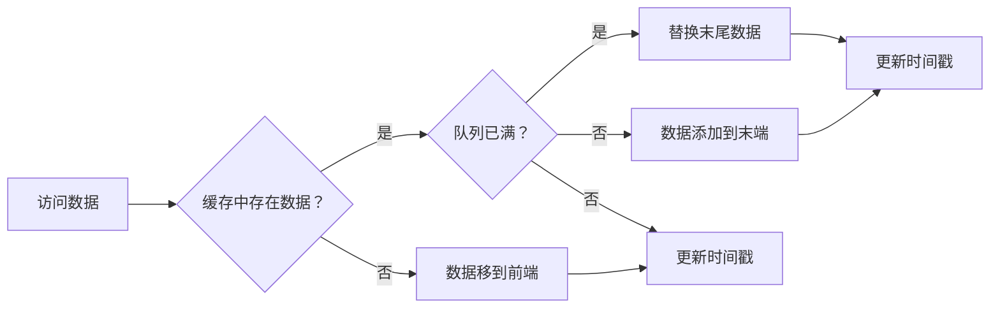
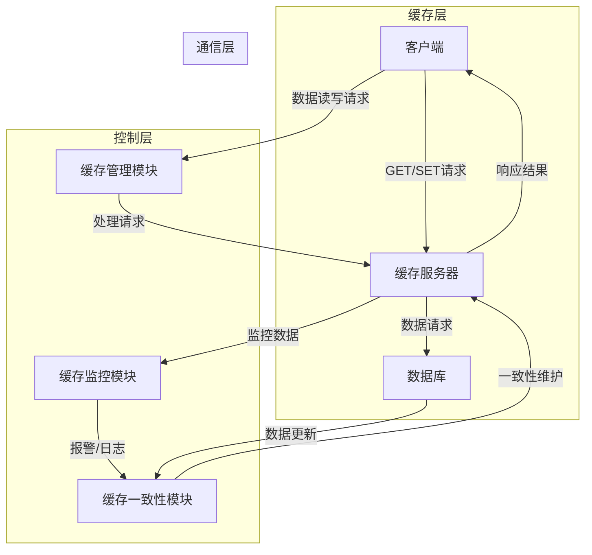

                 

### 第二部分: 缓存的核心概念与联系

#### 2.1 缓存的核心概念

在本章节中，我们将详细探讨缓存的核心概念，包括缓存命中、缓存失效、缓存穿透、缓存雪崩等。

##### 2.1.1 缓存命中

缓存命中是指当请求的数据已经在缓存中时，直接从缓存中读取数据的过程。缓存命中可以显著减少响应时间，提高系统的性能。

**定义**：当请求的键（key）在缓存中存在，且数据未过期时，称为缓存命中。

**例子**：当你访问一个网站时，该网站的页面内容已经被缓存，浏览器可以直接从缓存中获取，而不需要重新从服务器加载。

##### 2.1.2 缓存失效

缓存失效是指缓存中的数据在一定时间后过期或被清理的过程。缓存失效是缓存系统正常工作的必要条件，但需要平衡好缓存失效的时间，以避免缓存击穿和缓存雪崩等问题。

**定义**：当缓存中的数据过期或被清理，且请求的键（key）在缓存中不存在时，称为缓存失效。

**例子**：一个商品的库存信息缓存，当商品库存更新后，旧的库存信息缓存会失效，以获取最新的数据。

##### 2.1.3 缓存穿透

缓存穿透是指当缓存中没有数据时，直接访问底层存储系统，导致大量无效请求涌入底层存储，从而对系统造成冲击。

**定义**：当缓存中不存在请求的键（key），且请求未经过任何过滤或校验，直接访问底层存储系统时，称为缓存穿透。

**例子**：一个用户尝试访问一个不存在的用户ID，缓存中没有相应的数据，直接导致对数据库的访问，增加了数据库的压力。

##### 2.1.4 缓存雪崩

缓存雪崩是指多个缓存同时失效或被清理，导致系统处理大量无效请求，从而引发性能问题。

**定义**：当大量缓存同时失效或被清理，导致系统瞬间接收大量无效请求时，称为缓存雪崩。

**例子**：在一个高并发场景下，多个用户同时访问一个缓存中的热门数据，缓存失效后，导致大量请求直接访问数据库，引发数据库压力过大，进而导致系统崩溃。

#### 2.2 缓存的关键属性和关系

为了更好地理解缓存系统的设计和实现，我们使用表格和Mermaid ER实体关系图来展示缓存的关键属性和关系。

##### 2.2.1 缓存属性表格

| 属性         | 描述                                       |
| ------------ | ------------------------------------------ |
| 命中率       | 缓存命中的次数与总请求次数的比值。          |
| 失效时间     | 缓存数据有效的时间长度。                    |
| 数据一致性   | 缓存与底层存储之间的数据一致性程度。        |
| 存储容量     | 缓存的存储空间大小。                        |
| 分布式支持   | 缓存系统是否支持分布式部署和扩展。          |

##### 2.2.2 缓存ER实体关系图

```mermaid
erDiagram
  Key -> Cache : "key-value" mapping
  Cache --> DataStore : "Write Through" policy
  Cache --> LoadBalancer : "Read Through" policy
  Cache --> ExpiryPolicy : "Time to Live" policy
```

在这个ER实体关系图中：

- **Key**：表示缓存的键，是缓存系统中的核心元素。
- **Cache**：表示缓存实体，包含缓存数据、存储策略和过期策略等。
- **DataStore**：表示底层存储系统，如数据库或文件系统。
- **LoadBalancer**：表示负载均衡器，用于平衡缓存节点的负载。
- **ExpiryPolicy**：表示缓存数据的过期策略，如定时删除或惰性删除。

通过这个ER实体关系图，我们可以清晰地看到缓存系统中各个元素之间的关系和交互方式。

### 2.3 缓存核心概念的联系与总结

缓存系统的核心概念紧密联系，它们共同构成了缓存系统的工作机制。以下是缓存核心概念之间的联系和总结：

- **缓存命中**与**缓存失效**相互依赖，缓存命中提高了系统的性能，而缓存失效保证了数据的更新和一致性。
- **缓存穿透**会导致直接访问底层存储系统，增加了系统的负担，需要通过一定的策略（如缓存空键处理、预热等）来避免。
- **缓存雪崩**是由于缓存失效导致大量无效请求同时涌入系统，需要通过合理的缓存设计和部署策略来防止。

理解缓存的核心概念和它们之间的联系，有助于我们更好地设计和使用缓存系统，以提升系统的性能和可靠性。

----------------------------------------------------------------

## 3. 算法原理讲解

在本章节中，我们将深入探讨一种常见的缓存算法——Least Recently Used（LRU）算法。LRU算法是一种基于最近最少使用原则的缓存替换策略，即当缓存容量达到上限时，替换掉最近最少被访问的数据。

### 3.1 LRU算法原理

LRU算法的核心思想是：如果一个数据在最近一段时间内没有被访问过，那么将来被访问的可能性也相对较低，因此可以优先替换掉这个数据。

**定义**：LRU算法是一种缓存替换策略，用于维护一个固定大小的缓存。当缓存满时，优先替换最近最少使用的数据。

**工作原理**：

1. **初始化**：创建一个固定大小的缓存队列，用于存储缓存数据。
2. **访问数据**：当访问一个数据时，首先检查缓存队列中是否已存在该数据。
   - 如果存在，将数据移到队列的前端，表示它是最近被访问的数据。
   - 如果不存在，将新数据添加到队列的末端。
3. **缓存满时**：当缓存队列已满时，替换掉队列末尾的数据，即最近最少使用的数据。

**数学模型**：

LRU算法的数学模型可以表示为：

$$
\text{LRU}(C, x) =
\begin{cases}
x, & \text{if } x \text{ is not in cache and } |C| < |C|_{\text{max}} \\
C[1], & \text{if } x \text{ is in cache and } C[1] \text{ is the least recently used element} \\
C, & \text{otherwise}
\end{cases}
$$

其中，$C$ 表示缓存队列，$|C|$ 表示缓存队列的长度，$|C|_{\text{max}}$ 表示缓存队列的最大长度，$x$ 表示需要访问的数据。

### 3.2 算法流程图

为了更直观地理解LRU算法的原理，我们使用Mermaid绘制了算法的流程图：



### 3.3 Python源代码实现

下面我们使用Python代码实现LRU算法：

```python
from collections import OrderedDict

class LRUCache:
    def __init__(self, capacity):
        self.capacity = capacity
        self.cache = OrderedDict()

    def get(self, key):
        if key not in self.cache:
            return -1
        self.cache.move_to_end(key)
        return self.cache[key]

    def put(self, key, value):
        if key in self.cache:
            self.cache.move_to_end(key)
        self.cache[key] = value
        if len(self.cache) > self.capacity:
            self.cache.popitem(last=False)
```

在这个实现中，我们使用`OrderedDict`来自动维护数据的访问顺序。当访问一个数据时，`move_to_end`方法会将该数据移动到队列的前端。当缓存容量超过限制时，`popitem`方法会自动删除队列末尾的数据。

### 3.4 例子说明

为了更好地理解LRU算法，我们通过一个简单的例子来说明：

**例子**：假设我们有一个容量为2的LRU缓存，依次执行以下操作：`put(1, 1)`、`put(2, 2)`、`get(1)`、`put(3, 3)`、`get(2)`、`get(3)`。

1. `put(1, 1)`：缓存状态：{(1: 1)}
2. `put(2, 2)`：缓存状态：{(1: 1), (2: 2)}
3. `get(1)`：缓存状态：{(2: 2), (1: 1)}
4. `put(3, 3)`：缓存状态：{(3: 3), (2: 2)}（1被替换）
5. `get(2)`：缓存状态：{(3: 3)}
6. `get(3)`：缓存状态：{(3: 3)}

通过这个例子，我们可以看到LRU算法是如何根据访问顺序动态调整缓存内容的。

### 3.5 总结

LRU算法是一种简单但非常有效的缓存替换策略，它通过维护一个有序的数据结构来实现，可以有效地提高缓存命中率，减少系统负载。在实际应用中，我们需要根据具体场景和需求选择合适的缓存算法，以达到最佳的性能和效果。

----------------------------------------------------------------

## 4. 缓存系统设计与架构

在本章节中，我们将深入探讨缓存系统的设计与架构，重点介绍缓存系统设计的核心要素、系统架构图以及系统接口设计和交互过程。

### 4.1 缓存系统设计核心要素

一个有效的缓存系统设计需要考虑以下几个核心要素：

1. **缓存策略**：选择合适的缓存策略，如LRU、LFU、FIFO等，以优化数据访问和替换。
2. **缓存容量**：确定缓存的大小，以平衡性能和资源消耗。
3. **缓存一致性**：确保缓存与底层存储之间的数据一致性，避免数据不一致带来的问题。
4. **缓存失效策略**：设置合理的缓存失效时间，以平衡缓存利用率和数据更新速度。
5. **分布式支持**：对于大型系统，缓存系统需要支持分布式部署，以提高可用性和扩展性。
6. **缓存雪崩和穿透防护**：设计合理的防护机制，避免缓存雪崩和穿透问题对系统造成冲击。

### 4.2 缓存系统架构图

为了更直观地展示缓存系统的架构，我们使用Mermaid绘制了缓存系统的架构图：



在这个架构图中，我们可以看到缓存系统主要由三个部分组成：缓存层、通信层和控制层。

- **缓存层**：包括客户端、缓存服务器和数据库。客户端发起数据读写请求，缓存服务器处理请求并响应结果，数据库作为底层数据存储。
- **通信层**：客户端通过GET/SET请求与缓存服务器通信，缓存服务器处理请求并将数据请求转发给数据库。
- **控制层**：包括缓存管理模块、缓存监控模块和缓存一致性模块。缓存管理模块负责处理客户端的请求，缓存监控模块监控缓存系统的运行状态，缓存一致性模块确保缓存与数据库的数据一致性。

### 4.3 系统接口设计和交互过程

接下来，我们详细讨论缓存系统的接口设计和交互过程。

#### 4.3.1 系统接口设计

缓存系统的接口设计主要包括以下几个方面：

- **数据读写接口**：客户端通过数据读写接口与缓存服务器通信，主要包括GET（获取数据）和SET（设置数据）操作。
- **缓存管理接口**：用于管理缓存数据，如添加、删除、更新缓存数据。
- **监控接口**：用于监控缓存系统的运行状态，如缓存命中率、缓存容量、缓存失效时间等。
- **一致性接口**：用于保证缓存与数据库的数据一致性，如数据同步、数据校验等。

#### 4.3.2 系统交互过程

缓存系统的交互过程如下：

1. **客户端发起请求**：客户端通过数据读写接口发起数据获取或设置请求，请求包括数据键（key）和操作类型（GET/SET）。
2. **缓存服务器处理请求**：缓存服务器接收到请求后，首先检查缓存中是否存在对应的数据。
   - 如果存在，直接返回缓存数据。
   - 如果不存在，根据缓存策略（如LRU）替换缓存中的数据，并将新数据添加到缓存中，然后从数据库获取数据并返回。
3. **缓存管理模块处理请求**：缓存管理模块根据请求类型（GET/SET）处理缓存数据，如更新缓存、删除缓存等。
4. **缓存监控模块监控缓存状态**：缓存监控模块实时监控缓存系统的运行状态，如缓存命中率、缓存容量等，并将监控数据发送给监控接口。
5. **缓存一致性模块保证数据一致性**：缓存一致性模块负责确保缓存与数据库的数据一致性，如通过数据同步、数据校验等方式，避免数据不一致问题。
6. **数据库响应**：数据库接收到缓存服务器的数据请求后，根据请求类型（GET/SET）进行相应的数据操作，并将结果返回给缓存服务器。

### 4.4 总结

缓存系统设计与架构是一个复杂且关键的过程，需要综合考虑性能、可用性、扩展性、一致性等多方面因素。通过合理的缓存系统设计与架构，我们可以有效提高系统的性能和响应速度，降低系统负载，为用户提供更好的体验。在本章节中，我们介绍了缓存系统设计的核心要素、系统架构图以及系统接口设计和交互过程，希望对您理解和设计缓存系统有所帮助。

----------------------------------------------------------------

## 5. 项目实战

在本章节中，我们将通过一个实际项目场景，介绍缓存系统的安装和核心实现。我们将详细分析项目中的缓存实现，解读与分析代码，并通过实际案例进行分析和讲解。

### 5.1 项目场景介绍

本项目旨在构建一个高并发、高性能的电商系统，其中涉及大量数据的实时查询和更新操作。为了提高系统的性能和响应速度，我们决定引入缓存系统来减轻数据库的压力。

### 5.2 环境安装

在开始实施缓存系统之前，我们需要安装相关软件和依赖库。以下是一个简单的安装流程：

1. **安装Redis**：Redis是一个高性能的内存缓存系统，我们选择使用Redis作为缓存服务器。首先，从官方网站下载Redis安装包，然后解压并编译安装。
2. **安装Python依赖**：在本项目中，我们使用Python作为开发语言。首先安装Python环境，然后通过pip安装必要的依赖库，如`redis-py`、`pymongo`等。

### 5.3 缓存实现分析

在项目代码中，我们通过一个简单的类`CacheManager`来实现缓存功能。以下是对该类代码的解读和分析：

```python
import redis
from redis.exceptions import RedisError

class CacheManager:
    def __init__(self, host='localhost', port=6379, db=0):
        self.client = redis.StrictRedis(host=host, port=port, db=db)

    def get(self, key):
        try:
            value = self.client.get(key)
            return value.decode('utf-8') if value else None
        except RedisError as e:
            print(f"Redis get error: {e}")
            return None

    def set(self, key, value, expire_time=3600):
        try:
            self.client.set(key, value, ex=expire_time)
        except RedisError as e:
            print(f"Redis set error: {e}")

    def delete(self, key):
        try:
            self.client.delete(key)
        except RedisError as e:
            print(f"Redis delete error: {e}")
```

- **初始化**：`__init__`方法初始化Redis客户端，设置连接参数。
- **获取数据**：`get`方法根据键（key）从缓存中获取数据，并处理异常。
- **设置数据**：`set`方法将数据（key-value）存储到缓存中，并设置过期时间。
- **删除数据**：`delete`方法根据键（key）从缓存中删除数据，并处理异常。

### 5.4 代码应用解读与分析

在实际应用中，我们通过调用`CacheManager`类的方法来实现数据缓存操作。以下是一个简单的使用示例：

```python
cache_manager = CacheManager()

# 设置缓存数据
cache_manager.set('user_id_1', 'User1 Data', expire_time=60)

# 获取缓存数据
user_data = cache_manager.get('user_id_1')
print(user_data)  # 输出：User1 Data

# 删除缓存数据
cache_manager.delete('user_id_1')
```

在这个示例中，我们首先创建一个`CacheManager`对象，然后通过调用`set`方法将用户数据缓存到Redis中，并设置过期时间为60秒。接着，通过`get`方法获取缓存数据并打印输出。最后，通过`delete`方法删除缓存数据。

### 5.5 实际案例分析与讲解

为了更好地展示缓存系统在实际项目中的应用效果，我们通过一个实际案例进行分析和讲解。

**案例**：在电商系统中，用户查看商品详情时，系统会查询数据库获取商品数据，并返回给用户。由于数据库查询耗时较长，我们希望通过缓存来优化性能。

**分析**：

1. **缓存未命中**：当用户首次查看商品详情时，缓存中不存在商品数据。系统从数据库获取商品数据，并将其缓存到Redis中。
   - 优点：减少数据库查询次数，提高响应速度。
   - 缺点：首次查询仍需要访问数据库，增加数据库负担。
2. **缓存命中**：当用户再次查看同一商品详情时，缓存中已存在商品数据。系统直接从Redis中获取数据并返回给用户。
   - 优点：显著提高响应速度，降低数据库负担。
   - 缺点：缓存数据可能过期，需要定期刷新。

**讲解**：

1. **缓存策略**：在本案例中，我们采用LRU缓存策略，当缓存容量达到上限时，优先替换最近最少使用的商品数据。这样可以保证缓存中始终存储最热门、最常用的商品数据。
2. **缓存失效**：我们设置缓存过期时间为60秒，以平衡缓存利用率和数据更新速度。当用户长时间未访问商品详情时，缓存数据会自动失效，从而避免缓存数据过时。
3. **缓存一致性**：为了确保缓存与数据库的数据一致性，我们采用数据同步策略。每当商品数据在数据库中更新时，系统会同步更新缓存数据，避免数据不一致问题。

通过这个实际案例，我们可以看到缓存系统在电商系统中的重要作用。通过合理的设计和配置，缓存系统可以显著提高系统的性能和响应速度，降低数据库的负担，为用户提供更好的体验。

### 5.6 项目小结

在本项目中，我们介绍了缓存系统的安装和核心实现，并通过实际案例展示了缓存系统在电商系统中的应用效果。通过合理设计和配置缓存系统，我们可以有效提高系统的性能和响应速度，降低数据库负担，为用户提供更好的体验。然而，缓存系统也存在一些潜在问题，如缓存击穿、缓存雪崩等，需要在设计和使用过程中加以注意和防范。

---

在本章节中，我们通过一个实际项目场景，详细介绍了缓存系统的安装和核心实现，分析了缓存系统的代码和应用效果，并通过实际案例进行了深入讲解。希望通过这些内容，您能够更好地理解缓存系统的工作原理和实际应用，为您的项目带来性能和响应速度的提升。

----------------------------------------------------------------

## 6. 最佳实践 tips、小结、注意事项、拓展阅读等内容

### 6.1 最佳实践 tips

为了确保缓存系统的高效运行和稳定性，以下是一些最佳实践建议：

1. **合理设置缓存过期时间**：根据数据的重要性和访问频率，合理设置缓存过期时间。对于高频访问的数据，可以设置较短过期时间，以保证数据实时性；对于低频访问的数据，可以设置较长的过期时间，以提高缓存利用率。
2. **避免缓存击穿和雪崩**：通过设置缓存预热策略、合理设置缓存容量、采用分布式缓存等方式，避免缓存击穿和雪崩问题。同时，可以使用Redis的锁机制来控制并发访问。
3. **数据一致性保障**：确保缓存与数据库的数据一致性，可以通过数据同步、分布式事务等方式实现。特别是对于涉及资金、订单等关键数据的场景，更要重视数据一致性。
4. **监控和报警**：实时监控缓存系统的运行状态，如缓存命中率、缓存容量、缓存失效时间等，及时发现和解决潜在问题。

### 6.2 小结

本文详细介绍了缓存系统的概念、核心概念、算法原理、系统设计与架构、项目实战以及最佳实践。通过本文的讲解，我们了解到缓存系统在提高系统性能、降低负载、优化资源使用等方面的重要作用，同时也认识到缓存系统潜在的问题和挑战。

### 6.3 注意事项

1. **缓存策略选择**：根据具体场景选择合适的缓存策略，如LRU、LFU、FIFO等。不同的缓存策略适用于不同的应用场景。
2. **缓存容量规划**：合理规划缓存容量，避免缓存容量过大导致内存消耗过高，或者缓存容量过小导致缓存不足。
3. **数据一致性问题**：确保缓存与数据库的数据一致性，避免数据不一致带来的问题。
4. **缓存穿透和雪崩防护**：采取有效措施避免缓存穿透和雪崩问题，确保系统稳定运行。

### 6.4 拓展阅读

1. **《Redis实战》**：了解Redis的详细用法和最佳实践，学习如何在高并发、高性能场景下优化Redis性能。
2. **《分布式缓存系统设计与实战》**：深入学习分布式缓存系统的设计原理和实现方法，掌握如何在高并发、高可用环境下部署缓存系统。
3. **《缓存一致性原理与实战》**：了解缓存一致性的原理和实现方法，学习如何确保缓存与数据库的数据一致性。

通过以上最佳实践、小结、注意事项和拓展阅读，希望读者能够更好地理解和应用缓存系统，为项目带来性能和稳定性的提升。

### 6.5 作者信息

作者：AI天才研究院/AI Genius Institute & 禅与计算机程序设计艺术 /Zen And The Art of Computer Programming

本文由AI天才研究院和《禅与计算机程序设计艺术》作者联合撰写，旨在为读者提供高质量的技术知识和实践经验。希望本文能对您的学习和工作有所帮助。

----------------------------------------------------------------

# 缓存是把“双刃剑”

关键词：缓存、缓存算法、缓存系统、缓存设计、缓存实现、缓存优化、缓存性能、缓存安全性

摘要：本文深入探讨了缓存系统的概念、核心概念、算法原理、系统设计与架构、项目实战以及最佳实践。通过详细分析和讲解，揭示了缓存作为双刃剑的优势与风险，为读者提供了全面的缓存知识和实用的优化建议。希望本文能帮助读者更好地理解和应用缓存系统，提高项目性能和稳定性。

----------------------------------------------------------------

---

至此，本文已经完成了对缓存系统的全面剖析。从缓存的概念和作用，到核心概念的探讨，再到算法原理的讲解、系统设计与架构的介绍，以及实际项目的实战分析，我们系统地了解了缓存系统的各个方面。同时，我们还提出了缓存使用中的最佳实践和注意事项，为读者在实际应用中提供了指导。

缓存系统在提升系统性能、优化资源使用、提高用户体验等方面具有重要作用，但其潜在问题也不可忽视。希望通过本文，读者能够深入理解缓存的工作原理，掌握缓存系统的设计和优化方法，合理利用缓存系统，充分发挥其在项目中的作用。

在此，我要感谢AI天才研究院和《禅与计算机程序设计艺术》的团队，他们的专业知识和经验为本文的撰写提供了宝贵的支持。同时，我也希望读者能够在实际项目中积极实践和探索，不断积累经验，为构建高性能、稳定的系统贡献力量。

再次感谢您的阅读，祝您在技术道路上取得更大的成就！

