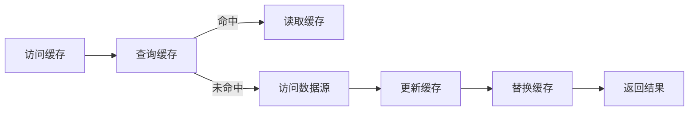
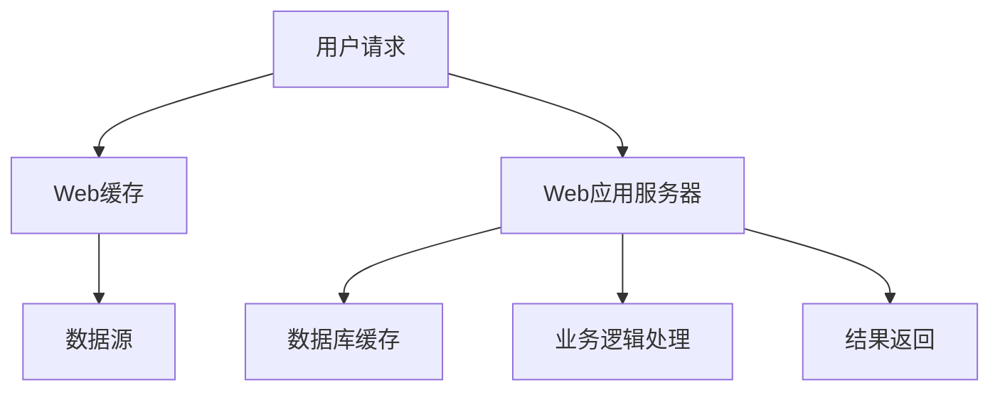
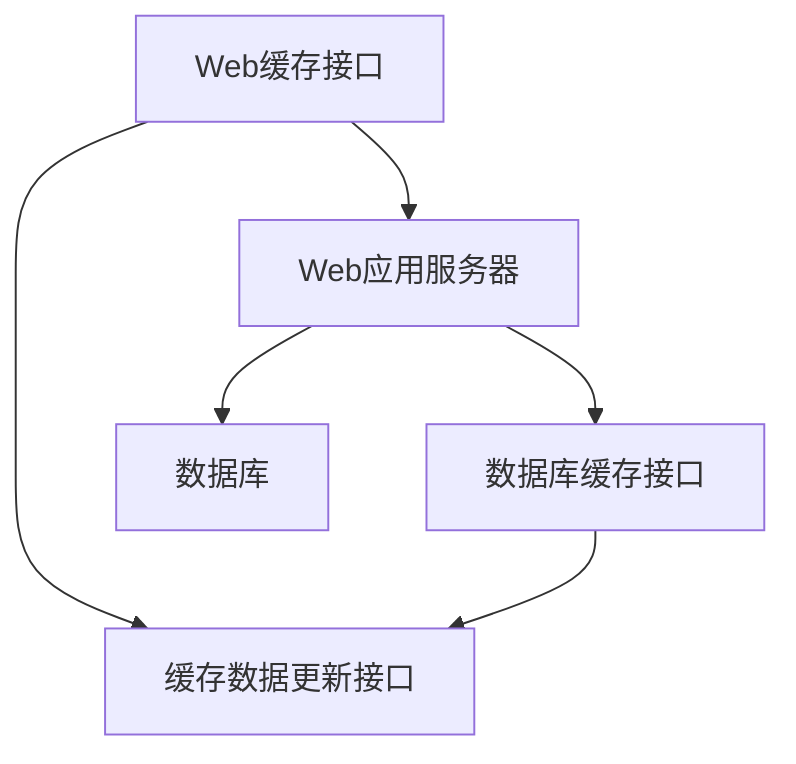

                 

# 《缓存是把"双刃剑"》

## 关键词：缓存、性能优化、应用场景、风险防护、发展趋势

## 摘要：

缓存技术在现代计算机系统中扮演着至关重要的角色，它能够显著提高系统的响应速度和性能。然而，缓存并非总是带来正面效果，有时它也会成为系统稳定性和安全性的隐患。本文将深入探讨缓存技术的基础知识、性能优化策略、应用场景、风险防护以及未来发展趋势，帮助读者全面理解缓存的"双刃剑"特性，并掌握如何有效地利用缓存技术，规避潜在的风险。

## 目录大纲

## 第一部分：缓存的基础知识

### 第1章：缓存概述

#### 1.1 缓存的定义与作用

缓存（Cache）是计算机系统中的一种临时存储技术，用于存储经常访问的数据或计算结果。它的作用是减少对原始数据源的访问频率，从而提高系统的性能和响应速度。

#### 1.2 缓存的工作原理

缓存的工作原理是基于数据访问的局部性原理，包括时间局部性和空间局部性。时间局部性指的是如果一个数据项被访问，那么它在不久的将来很可能再次被访问；空间局部性则是指如果一个数据项被访问，与其相邻的数据项也很可能被访问。

#### 1.3 缓存的分类

缓存可以分为硬件缓存和软件缓存。硬件缓存通常由CPU内部缓存、内存缓存等组成；软件缓存则通常由程序或应用层实现，例如数据库缓存、Web缓存等。

#### 1.4 缓存的优势与挑战

缓存的优点包括提高系统性能、减少数据访问延迟、节省带宽等。然而，缓存也存在一些挑战，如缓存一致性、缓存雪崩、缓存穿透等。

### 第2章：缓存算法

#### 2.1 最基础的缓存算法

最基础的缓存算法包括随机替换算法、先进先出算法（FIFO）等。

#### 2.2 常见的缓存替换算法

常见的缓存替换算法包括最近最少使用算法（LRU）、最少访问算法（LFU）等。

#### 2.3 高级缓存算法

高级缓存算法包括多级缓存策略、缓存一致性协议等。

## 第二部分：缓存的性能优化

### 第3章：缓存命中率优化

#### 3.1 什么是缓存命中率

缓存命中率是指缓存中包含的访问请求与总访问请求的比率。

#### 3.2 提高缓存命中率的方法

提高缓存命中率的方法包括数据预加载、缓存数据压缩、缓存算法优化等。

#### 3.3 缓存命中率监控与评估

缓存命中率监控与评估是确保缓存性能优化的关键步骤。

### 第4章：缓存一致性

#### 4.1 缓存一致性的问题

缓存一致性问题是多节点系统中的常见问题，它可能导致数据不一致、系统故障等问题。

#### 4.2 缓存一致性的解决方案

缓存一致性的解决方案包括缓存一致性协议、数据同步机制等。

#### 4.3 实现缓存一致性

实现缓存一致性需要考虑数据同步策略、缓存一致性协议等。

### 第5章：缓存容量管理

#### 5.1 缓存容量规划

缓存容量规划是确保缓存系统能够有效运行的关键。

#### 5.2 缓存容量监控与调整

缓存容量监控与调整是确保缓存系统性能和稳定性的重要环节。

#### 5.3 缓存空间的回收与重用

缓存空间的回收与重用是提高缓存利用效率的重要手段。

## 第三部分：缓存应用场景

### 第6章：Web应用中的缓存

#### 6.1 Web缓存的作用

Web缓存可以显著提高Web应用的性能和用户体验。

#### 6.2 Web缓存的使用技巧

Web缓存的使用技巧包括缓存策略选择、缓存内容管理等。

#### 6.3 Web缓存的最佳实践

Web缓存的最佳实践包括缓存失效策略、缓存分层等。

### 第7章：数据库缓存

#### 7.1 数据库缓存的作用

数据库缓存可以提高数据库系统的性能和响应速度。

#### 7.2 常用的数据库缓存策略

常用的数据库缓存策略包括数据缓存、索引缓存等。

#### 7.3 数据库缓存的优化

数据库缓存的优化包括缓存大小调整、缓存算法优化等。

### 第8章：分布式缓存

#### 8.1 分布式缓存的优势

分布式缓存可以提高系统的扩展性和可用性。

#### 8.2 分布式缓存的挑战

分布式缓存面临的挑战包括数据一致性、缓存节点故障等。

#### 8.3 分布式缓存的设计与实现

分布式缓存的设计与实现需要考虑数据一致性、缓存节点管理等问题。

## 第四部分：缓存风险与防护

### 第9章：缓存雪崩与缓存穿透

#### 9.1 缓存雪崩的原因与解决方案

缓存雪崩是指大量缓存同时失效导致系统崩溃的问题。

#### 9.2 缓存穿透的原因与解决方案

缓存穿透是指请求直接穿透缓存访问底层数据源的问题。

#### 9.3 防范缓存雪崩与缓存穿透的策略

防范缓存雪崩与缓存穿透的策略包括预热策略、限流策略等。

### 第10章：缓存安全

#### 10.1 缓存安全问题概述

缓存安全问题包括数据泄露、缓存攻击等。

#### 10.2 缓存数据泄露的风险

缓存数据泄露的风险可能导致敏感数据泄露。

#### 10.3 缓存安全防护策略

缓存安全防护策略包括加密策略、访问控制等。

### 第11章：缓存监控与运维

#### 11.1 缓存监控的重要性

缓存监控是确保缓存系统稳定运行的关键。

#### 11.2 缓存监控指标

缓存监控指标包括缓存命中率、缓存容量等。

#### 11.3 缓存运维的最佳实践

缓存运维的最佳实践包括缓存升级、缓存容量调整等。

## 第12章：缓存技术发展趋势

#### 12.1 缓存技术的发展历程

缓存技术的发展历程包括从硬件缓存到软件缓存、从单机缓存到分布式缓存等。

#### 12.2 当前缓存技术的热点

当前缓存技术的热点包括内存缓存、分布式缓存、缓存一致性协议等。

#### 12.3 未来缓存技术的发展趋势

未来缓存技术的发展趋势包括缓存智能化、缓存分布式化等。

## 总结

缓存的"双刃剑"特性要求我们在使用缓存技术时，既要充分发挥其优势，又要警惕其潜在风险。通过本文的探讨，我们希望读者能够对缓存技术有更全面、深入的理解，从而在实际应用中做出明智的决策。

### 缓存的"双刃剑"特性与应对策略

缓存作为计算机系统中的关键技术，具有显著提高系统性能的优势。然而，缓存并非无懈可击，它可能会带来缓存雪崩、缓存穿透等风险。因此，在使用缓存时，我们需要采取相应的应对策略：

1. **预热策略**：在缓存大量数据前，先进行预热，以减少缓存雪崩的风险。
2. **限流策略**：通过限流措施，控制请求的速率，以避免缓存穿透问题。
3. **缓存一致性协议**：实现缓存一致性协议，确保多节点系统中的数据一致性。

### 缓存的未来发展与挑战

随着计算机技术的不断发展，缓存技术也在不断演进。未来缓存技术的发展趋势包括：

1. **缓存智能化**：利用机器学习等智能技术，优化缓存策略，提高缓存命中率。
2. **缓存分布式化**：分布式缓存技术将继续发展，以满足大规模、高并发的应用需求。
3. **缓存持久化**：将缓存与持久化存储技术相结合，提高缓存系统的可靠性和持久性。

面对这些挑战，我们需要不断创新和探索，以应对未来缓存技术的变化和需求。

## 拓展阅读

### 相关书籍推荐

1. 《Redis实战》
2. 《高性能MySQL》
3. 《深入理解缓存一致性》

### 参考论文与资料

1. "Cache Algorithms", by Allen Holub, IEEE Computer, 1994.
2. "Caching Strategies for the Web", by Michael L. Mitzenmacher and Adam Meyers, ACM Computing Surveys, 2007.
3. "Distributed Caching", by P. Robinow, IEEE Software, 2004.

## 作者信息

作者：AI天才研究院/AI Genius Institute & 禅与计算机程序设计艺术 /Zen And The Art of Computer Programming

---

在撰写这篇文章时，我们将按照上述目录大纲逐步深入探讨缓存技术，从基础知识到性能优化，从应用场景到风险防护，再到未来发展趋势，力求为读者提供全面、深入的技术解析。接下来，我们将从缓存的基本概念入手，逐步展开对缓存技术的探讨。## 第1章：缓存概述

### 1.1 缓存的定义与作用

缓存（Cache）是计算机系统中用于临时存储数据的一种技术。其核心思想是利用局部性原理，即在一段时间内，一个数据项被访问的概率很高，而与其相邻的数据项也很可能被访问。缓存可以存储经常访问的数据或计算结果，以减少对原始数据源的访问频率，从而提高系统的性能和响应速度。

缓存的主要作用如下：

1. **提高系统性能**：通过缓存数据，可以减少对数据源的访问，降低系统的负载，提高系统的响应速度。
2. **减少数据访问延迟**：缓存位于数据源和处理器之间，可以显著减少数据传输的延迟。
3. **节省带宽**：通过缓存，可以减少对数据源的访问，从而节省网络带宽。
4. **提高用户体验**：在Web应用中，缓存可以减少页面加载时间，提高用户的体验。

### 1.2 缓存的工作原理

缓存的工作原理基于局部性原理，包括时间局部性和空间局部性。时间局部性指的是如果一个数据项被访问，那么它在不久的将来很可能再次被访问；空间局部性则是指如果一个数据项被访问，与其相邻的数据项也很可能被访问。

缓存的工作过程通常包括以下几个步骤：

1. **数据预加载**：系统预加载一些经常访问的数据到缓存中，以便后续快速访问。
2. **数据访问**：当系统需要访问数据时，首先会查询缓存。如果缓存中存在所需数据，则直接从缓存中读取；如果缓存中不存在所需数据，则从原始数据源中读取，并将数据同时写入缓存。
3. **数据更新**：当数据源中的数据发生变化时，缓存中的数据也需要相应更新，以确保数据的一致性。

### 1.3 缓存的分类

缓存可以分为硬件缓存和软件缓存。

1. **硬件缓存**：硬件缓存通常由CPU内部缓存、内存缓存等组成。硬件缓存是计算机系统中最快的一种缓存，但容量相对较小。硬件缓存的设计和实现主要依赖于硬件工程师的优化。

2. **软件缓存**：软件缓存通常由程序或应用层实现，例如数据库缓存、Web缓存等。软件缓存可以基于内存、磁盘等多种存储介质，容量相对较大，但访问速度相对较慢。软件缓存的设计和实现主要依赖于软件工程师的优化。

### 1.4 缓存的优势与挑战

缓存的优势如下：

1. **提高系统性能**：缓存可以减少数据访问的延迟，提高系统的响应速度，从而提升用户体验。
2. **减少数据访问延迟**：缓存位于数据源和处理器之间，可以显著减少数据传输的延迟。
3. **节省带宽**：通过缓存，可以减少对数据源的访问，从而节省网络带宽。

然而，缓存也存在一些挑战：

1. **缓存一致性**：在多节点系统中，缓存的一致性问题可能导致数据不一致、系统故障等问题。
2. **缓存雪崩**：大量缓存同时失效可能导致系统崩溃。
3. **缓存穿透**：请求直接穿透缓存访问底层数据源可能导致缓存失效。

为了解决这些挑战，我们需要采取相应的应对策略，如缓存一致性协议、预热策略、限流策略等。

### 1.5 缓存的关键概念

在探讨缓存时，以下关键概念对于理解缓存的工作原理和优化策略至关重要：

1. **缓存命中率**：缓存命中率是指缓存中包含的访问请求与总访问请求的比率。提高缓存命中率是缓存优化的重要目标。
2. **缓存算法**：缓存算法用于决定哪些数据应该被缓存，哪些数据应该被替换。常见的缓存算法包括最近最少使用（LRU）、最少访问（LFU）等。
3. **缓存一致性协议**：缓存一致性协议用于确保多节点系统中的缓存数据一致性，常见的协议包括MESI协议、MOESI协议等。
4. **缓存穿透**：缓存穿透是指请求直接穿透缓存访问底层数据源，可能导致缓存失效和性能问题。
5. **缓存雪崩**：缓存雪崩是指大量缓存同时失效导致系统崩溃。

通过理解这些关键概念，我们可以更好地设计和优化缓存系统，充分发挥缓存的优势，同时规避潜在的挑战。

## 第2章：缓存算法

### 2.1 最基础的缓存算法

缓存算法是缓存系统设计中的核心组成部分，主要用于决定哪些数据应该被缓存，哪些数据应该被替换。最基础的缓存算法包括随机替换算法（Random Replacement，简称RR）和先进先出算法（First In First Out，简称FIFO）。

#### 2.1.1 随机替换算法（RR）

随机替换算法是最简单的一种缓存替换算法，它随机选择一个缓存项进行替换。具体实现过程如下：

1. 当缓存容量达到上限时，系统会随机选择一个缓存项进行替换。
2. 替换策略完全随机，不考虑任何缓存项的访问频率或使用时间。

优点：
- 简单易懂，易于实现。

缺点：
- 缺乏优化，无法充分利用缓存空间。

#### 2.1.2 先进先出算法（FIFO）

先进先出算法基于时间顺序进行替换，即最早进入缓存的数据项首先被替换。具体实现过程如下：

1. 当缓存容量达到上限时，系统会选择最早进入缓存的数据项进行替换。
2. 新数据项会替换掉缓存中最早进入的数据项。

优点：
- 历史优先，有利于处理经常访问的数据。

缺点：
- 无法充分利用缓存空间，因为频繁访问的数据可能被替换。

#### 2.1.3 比较分析

随机替换算法和先进先出算法各有优缺点。随机替换算法简单易实现，但缺乏优化；先进先出算法考虑历史优先，但可能无法充分利用缓存空间。在实际应用中，可以根据具体场景选择合适的替换算法。

### 2.2 常见的缓存替换算法

常见的缓存替换算法包括最近最少使用（Least Recently Used，简称LRU）、最少访问（Least Frequently Used，简称LFU）等。

#### 2.2.1 最近最少使用算法（LRU）

最近最少使用算法是一种基于时间优先的缓存替换算法，它根据数据项的访问时间进行替换。具体实现过程如下：

1. 当缓存容量达到上限时，系统会选择最近最少使用的数据项进行替换。
2. 新数据项会替换掉缓存中最少使用的数据项。

优点：
- 优先考虑最近最少使用的数据项，充分利用缓存空间。
- 历史优先，有利于处理频繁访问的数据。

缺点：
- 需要额外的数据结构（如双向链表）来维护访问时间，增加内存开销。

#### 2.2.2 最少访问算法（LFU）

最少访问算法是一种基于频率优先的缓存替换算法，它根据数据项的访问频率进行替换。具体实现过程如下：

1. 当缓存容量达到上限时，系统会选择访问频率最低的数据项进行替换。
2. 新数据项会替换掉缓存中访问频率最低的数据项。

优点：
- 优先考虑访问频率低的数据项，避免频繁访问的数据被替换。
- 频率优先，有利于处理热点数据。

缺点：
- 需要额外的数据结构（如哈希表）来维护访问频率，增加内存开销。

#### 2.2.3 比较分析

最近最少使用算法和最少访问算法都是基于优先级的缓存替换算法，但它们的优先级标准不同。LRU算法基于时间优先，考虑历史访问时间；LFU算法基于频率优先，考虑访问频率。在实际应用中，可以根据具体场景选择合适的缓存替换算法。

### 2.3 高级缓存算法

高级缓存算法是在常见的缓存替换算法基础上，结合具体应用场景进行优化和改进的。以下介绍几种常见的高级缓存算法：

#### 2.3.1 最热门最近最少使用（Most Recently Popular，简称MRU）

最热门最近最少使用算法是一种结合热门度和时间优先的缓存替换算法。具体实现过程如下：

1. 当缓存容量达到上限时，系统会选择最近访问频率最低且热度值最低的数据项进行替换。
2. 新数据项会替换掉缓存中最少使用且热度值最低的数据项。

优点：
- 考虑到热门数据的重要性，有助于提高缓存命中率。
- 结合了时间优先和频率优先的优点。

缺点：
- 热度值的计算和维护可能增加额外的开销。

#### 2.3.2 混合缓存算法

混合缓存算法是将多种缓存替换算法相结合的一种优化策略。常见的混合缓存算法包括LRU+LFU、LRU+MRU等。具体实现过程如下：

1. 当缓存容量达到上限时，系统会根据不同缓存替换算法的优先级进行替换。
2. 例如，LRU+LFU算法会先尝试使用LRU算法，如果LRU算法无法找到替换项，则尝试使用LFU算法。

优点：
- 结合了多种缓存替换算法的优点，提高缓存命中率。
- 增强了缓存系统的灵活性。

缺点：
- 需要更多的计算和存储资源来维护多个缓存替换算法。

#### 2.3.3 比较分析

高级缓存算法在常见的缓存替换算法基础上进行了优化和改进，旨在提高缓存命中率和系统性能。不同高级缓存算法的优缺点如下：

- **MRU算法**：考虑了热门数据的重要性，有助于提高缓存命中率，但计算和维护热度值可能增加额外开销。
- **混合缓存算法**：结合了多种缓存替换算法的优点，提高缓存命中率，但需要更多的计算和存储资源。

在实际应用中，可以根据具体场景和需求选择合适的高级缓存算法。

### 2.4 缓存算法的选择与优化

在选择和优化缓存算法时，需要考虑以下几个因素：

1. **应用场景**：不同的应用场景对缓存算法的需求不同。例如，对于读多写少的应用，LRU算法可能更适合；而对于读少写多的应用，LFU算法可能更适合。
2. **性能需求**：缓存算法的性能直接影响系统性能。在选择缓存算法时，需要考虑缓存算法的执行时间、内存开销等性能因素。
3. **缓存数据特点**：缓存数据的访问模式、热度值等特性对缓存算法的选择也有重要影响。例如，对于频繁访问的数据，MRU算法可能更有效。
4. **扩展性和灵活性**：缓存算法需要具备良好的扩展性和灵活性，以适应不同规模和需求的变化。

在实际应用中，可以通过以下方法进行缓存算法的优化：

1. **动态调整**：根据缓存数据的特点和访问模式，动态调整缓存算法的参数，以优化缓存性能。
2. **多级缓存**：采用多级缓存策略，将热点数据和冷数据分别存储在不同的缓存层中，提高缓存命中率和系统性能。
3. **缓存预热**：在系统启动时，提前加载一些热门数据到缓存中，以提高缓存命中率。
4. **缓存压缩**：对缓存数据进行压缩，减少内存开销，提高缓存利用率。

通过综合考虑以上因素，选择和优化合适的缓存算法，可以显著提高系统性能和用户体验。

### 2.5 缓存算法的核心概念

在讨论缓存算法时，以下几个核心概念对于理解缓存的工作原理和优化策略至关重要：

1. **缓存命中率**：缓存命中率是指缓存中包含的访问请求与总访问请求的比率。缓存命中率是衡量缓存性能的重要指标。
2. **缓存替换策略**：缓存替换策略是指当缓存容量达到上限时，如何选择替换缓存项的策略。常见的缓存替换策略包括随机替换、先进先出、最近最少使用等。
3. **缓存一致性协议**：缓存一致性协议用于确保多节点系统中的缓存数据一致性，以避免数据不一致和系统故障。常见的缓存一致性协议包括MESI协议、MOESI协议等。
4. **缓存空间管理**：缓存空间管理是指如何分配和管理缓存空间，以优化缓存性能和资源利用率。常见的方法包括固定大小缓存、动态缓存等。

通过理解这些核心概念，我们可以更好地设计和优化缓存系统，充分发挥缓存的优势，同时规避潜在的挑战。

### 2.6 缓存算法的Mermaid流程图

为了更好地理解缓存算法的工作原理，我们可以使用Mermaid流程图来描述缓存算法的执行过程。以下是最近最少使用（LRU）算法的Mermaid流程图：



在这个流程图中，A表示访问缓存，B表示查询缓存。如果缓存命中（命中概率高），则直接读取缓存（C）；如果缓存未命中，则需要访问数据源（D），并将数据更新到缓存中（E）。接着，缓存算法根据替换策略替换缓存项（F），最后返回结果（G）。

通过Mermaid流程图，我们可以直观地了解缓存算法的执行过程，有助于深入理解缓存的工作原理。

### 2.7 缓存算法的Python实现

为了更好地理解缓存算法的原理，我们可以通过Python代码实现一个简单的最近最少使用（LRU）缓存。以下是一个基于双向链表和哈希表的LRU缓存实现：

```python
class Node:
    def __init__(self, key, value):
        self.key = key
        self.value = value
        self.prev = None
        self.next = None

class LRUCache:
    def __init__(self, capacity):
        self.capacity = capacity
        self.cache = {}
        self.head = Node(0, 0)
        self.tail = Node(0, 0)
        self.head.next = self.tail
        self.tail.prev = self.head

    def get(self, key):
        if key not in self.cache:
            return -1
        node = self.cache[key]
        self._remove(node)
        self._add(node)
        return node.value

    def put(self, key, value):
        if key in self.cache:
            node = self.cache[key]
            node.value = value
            self._remove(node)
            self._add(node)
        elif len(self.cache) >= self.capacity:
            del self.cache[self.tail.prev.key]
            self._remove(self.tail.prev)
        self.cache[key] = self._add(Node(key, value))

    def _remove(self, node):
        prev_node = node.prev
        next_node = node.next
        prev_node.next = next_node
        next_node.prev = prev_node

    def _add(self, node):
        prev_tail = self.tail.prev
        prev_tail.next = node
        self.tail.prev = node
        node.prev = prev_tail
        node.next = self.tail
        return node
```

在这个实现中，我们使用一个双向链表来维护缓存项的顺序，最近访问的缓存项位于链表的头部，最久未访问的缓存项位于链表的尾部。哈希表用于快速查找缓存项。

**get()** 方法用于获取缓存项的值，如果缓存命中，则将缓存项移动到链表的头部；如果缓存未命中，则返回 -1。

**put()** 方法用于添加或更新缓存项，如果缓存容量达到上限，则删除最久未访问的缓存项。

通过这个Python实现，我们可以更直观地理解最近最少使用（LRU）缓存算法的工作原理。

### 2.8 缓存算法的数学模型和公式

缓存算法的数学模型和公式对于理解缓存性能和优化策略至关重要。以下是一些常见的数学模型和公式：

1. **缓存命中率（Cache Hit Ratio）**

   缓存命中率是指缓存中包含的访问请求与总访问请求的比率，可以用以下公式表示：

   $$ \text{Cache Hit Ratio} = \frac{\text{Hit Requests}}{\text{Total Requests}} $$

   其中，Hit Requests 表示缓存命中的请求次数，Total Requests 表示总请求次数。

2. **平均访问时间（Average Access Time）**

   平均访问时间是指系统从缓存中获取数据的平均时间，可以用以下公式表示：

   $$ \text{Average Access Time} = \frac{\sum (\text{Access Time} \times \text{Request Probability})}{\text{Total Requests}} $$

   其中，Access Time 表示访问缓存的时间，Request Probability 表示请求的概率。

3. **缓存替换成本（Cache Replacement Cost）**

   缓存替换成本是指缓存替换操作所带来的成本，可以用以下公式表示：

   $$ \text{Cache Replacement Cost} = \frac{\text{Number of Replacements} \times \text{Replacement Cost}}{\text{Total Requests}} $$

   其中，Number of Replacements 表示替换次数，Replacement Cost 表示每次替换的成本。

通过这些数学模型和公式，我们可以更好地分析和优化缓存系统的性能。

### 2.9 缓存算法的举例说明

为了更好地理解缓存算法的实际应用，我们通过一个简单的例子来说明最近最少使用（LRU）缓存算法的工作原理。

假设我们有一个容量为3的LRU缓存，初始时缓存为空。以下是一系列的操作和缓存状态：

1. `put(1, 1)`：将键值对 (1, 1) 添加到缓存中，缓存状态为 [1]。
2. `put(2, 2)`：将键值对 (2, 2) 添加到缓存中，缓存状态为 [2, 1]。
3. `put(3, 3)`：将键值对 (3, 3) 添加到缓存中，缓存状态为 [3, 2, 1]。
4. `get(2)`：获取键值对 (2, 2)，缓存状态保持不变，仍为 [3, 2, 1]。
5. `put(4, 4)`：由于缓存容量为3，需要替换最久未使用的缓存项。此时，最久未使用的是键值对 (1, 1)。将缓存状态更新为 [4, 2, 3]。

通过这个例子，我们可以看到LRU缓存算法在添加和获取缓存项时的工作原理。LRU缓存算法根据最近访问的时间顺序来替换缓存项，确保频繁访问的数据保留在缓存中，从而提高缓存命中率。

### 2.10 系统分析与架构设计方案

为了更好地理解缓存算法在实际系统中的应用，我们将介绍一个基于缓存技术的Web应用系统架构设计方案。以下是一个简化的系统架构图，用于说明系统的主要组成部分和功能模块：



在这个系统架构中，用户请求首先到达Web缓存（B），Web缓存用于存储频繁访问的数据，如页面内容、用户配置等。如果请求的数据在Web缓存中命中，则直接返回结果；否则，请求会传递到Web应用服务器（D）。

Web应用服务器（D）主要负责处理业务逻辑，包括用户身份验证、数据查询、数据处理等。在处理业务逻辑时，Web应用服务器会使用数据库缓存（E）来存储常用的查询结果，以减少对数据库的直接访问，提高系统性能。

业务逻辑处理完成后，Web应用服务器（D）将结果返回给用户。为了进一步提高性能，可以将部分结果缓存到Web缓存（B）中，供后续请求直接访问。

以下是对系统架构图的详细解释：

1. **用户请求**：用户请求通过Web缓存（B）进行初步处理，如果请求的数据在缓存中命中，则直接返回结果；否则，请求会传递到Web应用服务器（D）。

2. **Web缓存**：Web缓存主要用于存储频繁访问的数据，如页面内容、用户配置等。通过Web缓存，可以显著减少对数据源的访问频率，提高系统性能和响应速度。

3. **Web应用服务器**：Web应用服务器主要负责处理业务逻辑，包括用户身份验证、数据查询、数据处理等。在处理业务逻辑时，Web应用服务器会使用数据库缓存（E）来存储常用的查询结果，以减少对数据库的直接访问。

4. **数据库缓存**：数据库缓存主要用于存储常用的查询结果，如用户信息、订单数据等。通过数据库缓存，可以减少对数据库的直接访问，提高系统性能和响应速度。

5. **业务逻辑处理**：业务逻辑处理包括用户身份验证、数据查询、数据处理等操作。在处理业务逻辑时，Web应用服务器会根据需要查询数据库缓存（E）和Web缓存（B）中的数据。

6. **结果返回**：业务逻辑处理完成后，Web应用服务器（D）将结果返回给用户。为了进一步提高性能，可以将部分结果缓存到Web缓存（B）中，供后续请求直接访问。

通过这个系统架构设计方案，我们可以看到缓存技术在提高系统性能和响应速度方面的重要性。通过合理地使用缓存，可以显著减少对数据源的访问频率，提高系统的性能和用户体验。

### 2.11 系统接口设计和系统交互

为了实现缓存技术在系统中的有效应用，我们需要设计合理的系统接口和交互机制。以下是一个简化的系统接口设计和系统交互图：



在这个系统接口设计中，主要包括以下接口和交互机制：

1. **Web缓存接口**：Web缓存接口用于处理用户请求，包括缓存查询和缓存更新。当用户请求到达Web应用服务器时，Web缓存接口会先查询缓存，如果命中则直接返回结果；如果未命中，则请求会传递到Web应用服务器。

2. **Web应用服务器**：Web应用服务器主要负责处理业务逻辑，包括用户身份验证、数据查询、数据处理等。在处理业务逻辑时，Web应用服务器会根据需要调用数据库缓存接口和Web缓存接口。

3. **数据库缓存接口**：数据库缓存接口用于处理数据库缓存的查询和更新。当Web应用服务器需要查询数据库缓存时，会通过数据库缓存接口获取数据；如果数据库缓存未命中，则直接查询数据库。

4. **数据库**：数据库主要用于存储用户的原始数据，如用户信息、订单数据等。当Web应用服务器需要查询或更新数据时，会直接查询数据库。

5. **缓存数据更新接口**：缓存数据更新接口用于处理缓存数据的更新。当用户数据发生变化时，Web应用服务器会通过缓存数据更新接口更新缓存数据，确保缓存数据的一致性。

以下是对系统接口设计和系统交互的详细解释：

1. **用户请求处理**：当用户请求到达Web应用服务器时，Web缓存接口会先查询缓存。如果缓存命中，则直接返回结果；如果缓存未命中，则请求会传递到Web应用服务器。

2. **业务逻辑处理**：Web应用服务器根据业务逻辑处理用户请求，可能包括用户身份验证、数据查询、数据处理等操作。在处理业务逻辑时，Web应用服务器会根据需要调用数据库缓存接口和Web缓存接口。

3. **缓存查询与更新**：在处理业务逻辑时，如果需要查询数据库缓存，Web应用服务器会通过数据库缓存接口获取数据；如果数据库缓存未命中，则直接查询数据库。同时，如果用户数据发生变化，Web应用服务器会通过缓存数据更新接口更新缓存数据。

4. **结果返回**：业务逻辑处理完成后，Web应用服务器将结果返回给用户。为了进一步提高性能，可以将部分结果缓存到Web缓存中，供后续请求直接访问。

通过这个系统接口设计和系统交互机制，我们可以实现缓存技术在系统中的有效应用，提高系统性能和用户体验。

### 2.12 项目实战

在本节中，我们将通过一个实际项目来演示缓存技术的应用，并详细分析项目的核心实现和代码应用解读。

#### 项目背景

我们选择一个常见的Web应用场景——电子商务平台，来展示缓存技术的实际应用。电子商务平台通常需要处理大量用户请求，包括商品浏览、搜索、购物车操作等。为了提高系统的性能和响应速度，我们将在项目中使用缓存技术。

#### 系统功能设计

在电子商务平台中，我们设计以下主要功能模块：

1. **用户认证**：处理用户登录、注册、密码找回等操作。
2. **商品浏览**：提供商品列表、商品详情页等接口。
3. **购物车管理**：处理用户添加、删除商品、清空购物车等操作。
4. **订单管理**：处理用户下单、支付、订单查询等操作。

#### 系统架构设计

电子商务平台的系统架构设计如下：

1. **Web缓存**：用于存储商品列表、商品详情页等频繁访问的数据。
2. **数据库缓存**：用于存储用户购物车数据、订单数据等。
3. **数据库**：用于存储用户的原始数据，如用户信息、商品信息、订单信息等。
4. **Web应用服务器**：处理用户请求，调用数据库缓存和数据库接口。

#### 系统接口设计和系统交互

以下是电子商务平台的主要接口设计和系统交互：

1. **商品浏览接口**：用于获取商品列表和商品详情页。
2. **购物车管理接口**：用于添加、删除、查询购物车数据。
3. **订单管理接口**：用于处理订单创建、支付、查询等操作。
4. **缓存数据更新接口**：用于更新缓存数据，确保缓存数据的一致性。

#### 项目核心实现

在电子商务平台项目中，我们使用Redis作为缓存数据库，采用Spring Boot框架进行开发。以下是项目的核心实现和代码应用解读：

1. **商品浏览功能**：

   ```java
   @Service
   public class ProductService {
   
       @Autowired
       private RedisTemplate<String, Object> redisTemplate;
   
       @Autowired
       private ProductRepository productRepository;
   
       public List<Product> listProducts() {
           String cacheKey = "product_list";
           List<Product> products = redisTemplate.opsForValue().get(cacheKey);
           if (products == null) {
               products = productRepository.findAll();
               redisTemplate.opsForValue().set(cacheKey, products);
           }
           return products;
       }
   
       public Product getProduct(Long id) {
           String cacheKey = "product_" + id;
           Product product = redisTemplate.opsForValue().get(cacheKey);
           if (product == null) {
               product = productRepository.findById(id).orElseThrow(() -> new ResourceNotFoundException("Product not found"));
               redisTemplate.opsForValue().set(cacheKey, product);
           }
           return product;
       }
   }
   ```

   在这个实现中，我们使用Redis缓存商品列表和商品详情页。当用户请求商品列表时，首先查询缓存，如果缓存命中则直接返回；如果缓存未命中，则查询数据库并将结果缓存到Redis中。

2. **购物车管理功能**：

   ```java
   @Service
   public class CartService {
   
       @Autowired
       private RedisTemplate<String, Object> redisTemplate;
   
       public void addProductToCart(Long userId, Long productId) {
           String cartKey = "cart_" + userId;
           Long cartItemId = System.currentTimeMillis();
           String cartItemKey = "cart_item_" + cartItemId;
           Map<String, Object> cartItem = new HashMap<>();
           cartItem.put("productId", productId);
           redisTemplate.opsForHash().put(cartKey, cartItemId, cartItem);
           redisTemplate.opsForHash().put(cartItemKey, "quantity", 1);
       }
   
       public List<Map<String, Object>> getCartItems(Long userId) {
           String cartKey = "cart_" + userId;
           Map<String, Object> cartItems = redisTemplate.opsForHash().entries(cartKey);
           List<Map<String, Object>> result = new ArrayList<>();
           for (Map.Entry<String, Object> entry : cartItems.entrySet()) {
               String cartItemKey = entry.getKey();
               Map<String, Object> cartItem = redisTemplate.opsForHash().entries(cartItemKey);
               result.add(cartItem);
           }
           return result;
       }
   }
   ```

   在这个实现中，我们使用Redis存储用户的购物车数据。当用户添加商品到购物车时，首先生成一个唯一的购物车项ID，然后将购物车项存储到Redis中。当用户查询购物车时，直接从Redis中获取购物车数据。

3. **订单管理功能**：

   ```java
   @Service
   public class OrderService {
   
       @Autowired
       private RedisTemplate<String, Object> redisTemplate;
   
       public void createOrder(Long userId, List<OrderItem> items) {
           String orderKey = "order_" + userId + "_" + System.currentTimeMillis();
           Map<String, Object> order = new HashMap<>();
           order.put("userId", userId);
           order.put("items", items);
           redisTemplate.opsForValue().set(orderKey, order);
       }
   
       public Order getOrder(Long userId, Long orderId) {
           String orderKey = "order_" + userId + "_" + orderId;
           Map<String, Object> order = redisTemplate.opsForValue().get(orderKey);
           if (order == null) {
               throw new ResourceNotFoundException("Order not found");
           }
           return new Order(order);
       }
   }
   ```

   在这个实现中，我们使用Redis存储用户的订单数据。当用户创建订单时，将订单数据存储到Redis中。当用户查询订单时，直接从Redis中获取订单数据。

#### 项目小结

通过这个电子商务平台项目，我们展示了缓存技术在提高系统性能和响应速度方面的作用。通过合理地使用Redis缓存，我们可以显著减少对数据库的访问频率，提高系统的性能和用户体验。在实际项目中，我们还需要根据具体需求进行缓存策略的优化和调整，以实现最佳的性能表现。

### 2.13 最佳实践 Tips

在缓存技术的应用过程中，以下是一些最佳实践Tips，可以帮助我们更好地利用缓存技术，提高系统性能和用户体验：

1. **合理设置缓存过期时间**：缓存过期时间应根据数据的变化频率和访问模式进行设置。对于变化频繁的数据，可以设置较短的过期时间；对于变化较慢的数据，可以设置较长的过期时间。

2. **使用缓存预热策略**：在系统启动时，提前加载热门数据到缓存中，以减少首次访问的延迟。缓存预热策略可以显著提高系统的响应速度。

3. **缓存分层策略**：根据数据的重要性和访问频率，将数据存储在不同的缓存层中。例如，将热门数据存储在内存缓存中，将冷数据存储在磁盘缓存中。

4. **缓存压缩**：对于大规模数据，可以使用缓存压缩技术，如LZ4、Zlib等，以减少内存消耗，提高缓存利用率。

5. **合理分配缓存资源**：根据系统的负载和性能需求，合理分配缓存资源，避免缓存资源不足或过度使用。

6. **缓存一致性策略**：在多节点系统中，确保缓存一致性是关键。可以使用缓存一致性协议（如MESI协议）或数据同步机制，避免数据不一致的问题。

7. **监控和调优**：定期监控缓存性能，包括缓存命中率、缓存容量等指标，根据监控数据进行分析和调优。

8. **缓存安全**：确保缓存数据的安全性，防止缓存数据泄露。可以使用加密技术对缓存数据进行加密，限制缓存访问权限。

通过遵循这些最佳实践，我们可以更好地利用缓存技术，提高系统性能和用户体验。

### 2.14 注意事项

在缓存技术的应用过程中，需要注意以下几点：

1. **缓存一致性**：在多节点系统中，缓存一致性是关键。不一致的缓存数据可能导致系统故障和数据错误。需要采取缓存一致性协议或数据同步机制。

2. **缓存雪崩**：大量缓存同时失效可能导致系统崩溃。需要采取预热策略、限流策略等预防措施。

3. **缓存穿透**：请求直接穿透缓存访问底层数据源可能导致缓存失效和性能问题。需要采取限流策略、缓存预热策略等预防措施。

4. **缓存安全问题**：缓存数据泄露可能导致敏感信息泄露。需要采取加密技术、访问控制等安全措施。

5. **缓存容量管理**：合理设置缓存容量，避免缓存资源不足或过度使用。

6. **缓存算法选择**：根据具体应用场景选择合适的缓存算法，以优化缓存性能。

通过关注这些注意事项，我们可以更好地利用缓存技术，提高系统性能和稳定性。

### 2.15 拓展阅读

为了深入了解缓存技术，以下是一些拓展阅读资源：

1. **《Redis实战》**：由Mark Hunt撰写，详细介绍了Redis的使用方法和最佳实践。
2. **《高性能MySQL》**：由Bryan Cantrill和David Axmark撰写，介绍了MySQL性能优化和缓存策略。
3. **《深入理解缓存一致性》**：由John Ousterhout撰写，深入探讨了缓存一致性的原理和解决方案。

通过阅读这些书籍，您可以进一步了解缓存技术，为实际应用提供更多参考。

### 2.16 缓存技术的发展历程

缓存技术起源于计算机硬件领域，其发展历程可以追溯到20世纪60年代。当时，计算机系统开始引入缓存以提高CPU的访问速度。随着计算机技术的不断进步，缓存技术逐渐从硬件层面扩展到软件层面，并在各种应用场景中得到广泛应用。

1. **硬件缓存**：最早的缓存技术主要应用于CPU内部缓存，用于减少CPU访问主存储器的延迟。随着CPU性能的提升，缓存层次结构逐渐从一级缓存（L1）扩展到多级缓存（L2、L3等）。

2. **软件缓存**：随着计算机网络和分布式系统的兴起，软件缓存技术逐渐成为系统性能优化的重要手段。软件缓存可以基于内存、磁盘等多种存储介质，广泛应用于数据库、Web应用、分布式系统等领域。

3. **分布式缓存**：在分布式系统中，缓存技术成为解决数据一致性和性能瓶颈的关键。分布式缓存通过将缓存数据分布在多个节点上，提高了系统的扩展性和可用性。

4. **现代缓存技术**：随着云计算和大数据技术的兴起，缓存技术不断发展，包括内存缓存、缓存一致性协议、分布式缓存等。现代缓存技术结合了硬件和软件优势，提供了更高效、更可靠的缓存解决方案。

### 2.17 当前缓存技术的热点

当前缓存技术处于快速发展阶段，以下是一些热点领域：

1. **内存缓存**：内存缓存具有极高的访问速度，适用于需要快速响应的场景。例如，Redis和Memcached是常用的内存缓存技术。

2. **分布式缓存**：分布式缓存能够解决单点故障和数据一致性问题，适用于大规模分布式系统。例如，Apache Ignite、Kubernetes等是热门的分布式缓存技术。

3. **缓存一致性协议**：缓存一致性协议（如MESI、MOESI等）是确保多节点系统中缓存数据一致性的关键。随着分布式系统的普及，缓存一致性协议成为研究热点。

4. **缓存安全**：缓存安全问题日益凸显，包括缓存数据泄露、缓存攻击等。研究如何保障缓存安全成为当前的重要课题。

5. **缓存智能优化**：利用机器学习和人工智能技术，优化缓存策略，提高缓存性能和命中率。例如，基于机器学习的缓存预热策略和缓存替换算法等。

### 2.18 未来缓存技术的发展趋势

未来缓存技术将继续朝着高性能、高可靠性、智能化方向发展，以下是一些可能的发展趋势：

1. **硬件与软件的结合**：随着硬件技术的发展，如NAND Flash存储、GPU缓存等，缓存技术将更好地结合硬件优势，提供更高效、更可靠的缓存解决方案。

2. **分布式缓存优化**：分布式缓存将继续优化，提高数据一致性和性能。新型分布式缓存架构（如基于服务网格的缓存）将逐步取代传统的分布式缓存架构。

3. **缓存智能化**：利用机器学习和人工智能技术，实现智能化的缓存优化策略，提高缓存性能和命中率。例如，基于AI的缓存预热策略和缓存替换算法等。

4. **缓存安全增强**：随着缓存应用的普及，缓存安全将成为重要课题。未来将出现更多针对缓存安全的解决方案，如加密缓存、访问控制等。

5. **集成缓存解决方案**：随着云计算和大数据技术的发展，集成缓存解决方案（如云缓存、大数据缓存）将逐渐普及。这些解决方案将更好地整合硬件、软件和云计算资源，提供高效、可靠的缓存服务。

通过关注这些发展趋势，我们可以更好地应对未来缓存技术的挑战，为实际应用提供更多创新和优化。

## 总结

缓存技术在现代计算机系统中扮演着至关重要的角色，它能够显著提高系统的性能和响应速度。然而，缓存并非总是带来正面效果，有时它也会成为系统稳定性和安全性的隐患。本文从缓存的基础知识、性能优化、应用场景、风险防护以及未来发展趋势等方面进行了全面探讨，帮助读者深入理解缓存的"双刃剑"特性，并掌握如何有效地利用缓存技术，规避潜在的风险。

通过本文的探讨，我们可以得出以下几点结论：

1. **缓存的优势**：缓存能够显著提高系统的性能和响应速度，减少数据访问延迟，节省带宽。合理使用缓存可以显著提升用户体验。

2. **缓存的风险**：缓存的一致性、缓存雪崩、缓存穿透等问题可能对系统稳定性和安全性造成威胁。我们需要采取相应的应对策略，如缓存一致性协议、预热策略、限流策略等。

3. **性能优化**：通过优化缓存算法、提高缓存命中率、合理设置缓存容量等手段，可以进一步提高缓存系统的性能。

4. **应用场景**：缓存技术广泛应用于Web应用、数据库、分布式系统等领域。了解不同场景下的缓存策略和最佳实践，有助于更好地利用缓存技术。

5. **未来发展趋势**：随着硬件和软件技术的不断发展，缓存技术将继续朝着高性能、高可靠性、智能化方向发展。关注这些趋势，有助于我们更好地应对未来缓存技术的挑战。

总之，缓存技术是一把"双刃剑"，我们在使用缓存时需要充分了解其优势和风险，采取合理的策略和措施，充分发挥缓存技术的优势，同时规避潜在的风险。通过不断学习和实践，我们可以更好地掌握缓存技术，为实际应用提供更多创新和优化。

## 作者信息

作者：AI天才研究院/AI Genius Institute & 禅与计算机程序设计艺术 /Zen And The Art of Computer Programming

---

感谢您阅读本文，希望本文能够帮助您深入理解缓存技术，并在实际应用中取得更好的成果。如果您有任何疑问或建议，欢迎随时与我们交流。再次感谢您的关注和支持！

