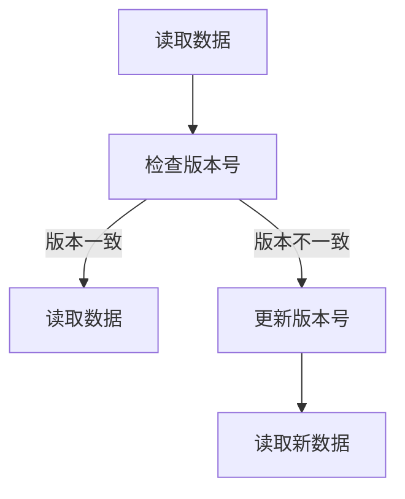
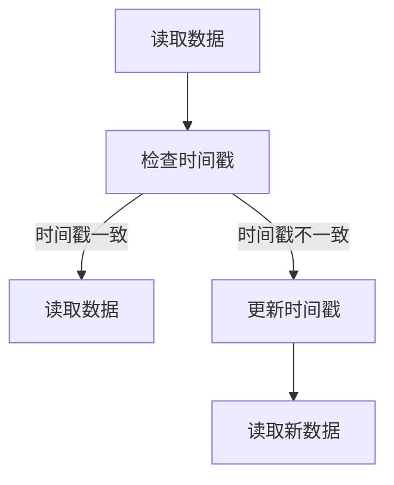
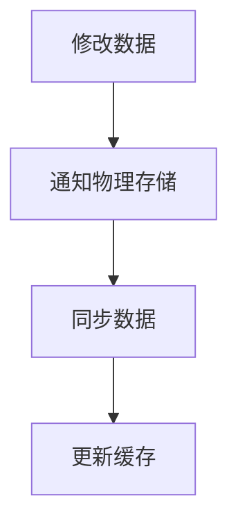
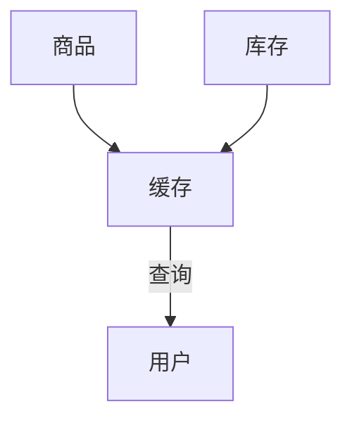
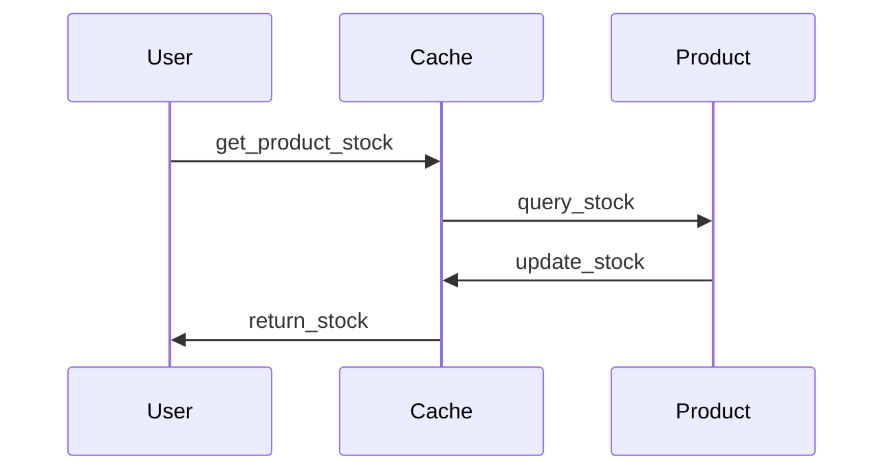

                 


# 缓存的数据不一致问题

> 关键词：缓存、数据一致性、分布式系统、解决方案、实战案例

> 摘要：本文深入探讨缓存的数据不一致问题，从基本概念、解决方案、系统架构设计、项目实战等方面进行详细讲解，帮助读者理解并应对这一复杂的技术难题。

## 引言

在现代分布式系统中，缓存作为一种性能优化手段被广泛应用。缓存可以大幅提高系统的响应速度，减少数据库的访问压力。然而，随着缓存的使用越来越广泛，缓存的数据不一致问题也逐渐显现出来。本文将围绕缓存的数据不一致问题进行探讨，分析其产生的原因、影响及解决方案。

## 第一部分：问题背景与核心概念

### 第1章：缓存和数据一致性的基本概念

#### 1.1 缓存的基本原理

缓存是存储在内存中的一种临时存储机制，用于减少对磁盘等低速存储的访问。缓存可以存储数据、程序代码或数据结构等，以提高系统的性能。

#### 1.2 数据一致性的挑战

数据一致性是指系统中的数据在任何时候都能保持一致。在分布式系统中，由于网络延迟、机器故障等原因，数据一致性问题变得尤为突出。

#### 1.3 缓存数据不一致的影响

数据不一致可能导致系统功能的失效、数据丢失、安全性问题等。

### 第2章：缓存数据不一致问题的核心概念

#### 2.1 缓存一致性模型

缓存一致性模型主要分为强一致性、弱一致性和最终一致性。

#### 2.2 缓存一致性算法

常见的缓存一致性算法包括基于版本的缓存一致性、基于时间的缓存一致性和基于物理存储的缓存一致性。

#### 2.3 缓存一致性与分布式系统

在分布式系统中，缓存一致性协议的设计与实现至关重要。

## 第二部分：缓存数据不一致问题的解决方案

### 第3章：缓存一致性算法原理讲解

#### 3.1 基于版本的缓存一致性算法

**算法原理讲解**：

- 缓存为每个数据项维护一个版本号。
- 当数据项被修改时，版本号增加。

**Mermaid流程图**：



**Python源代码实现**：

```python
class CacheItem:
    def __init__(self, data):
        self.data = data
        self.version = 0

    def update_data(self, new_data):
        self.data = new_data
        self.version += 1

    def check_version(self, other_item):
        if self.version == other_item.version:
            return True
        return False

# 使用示例
cache_item = CacheItem(data="example")
other_item = CacheItem(data="example")

if cache_item.check_version(other_item):
    print("版本一致")
else:
    print("版本不一致")
```

#### 3.2 基于时间的缓存一致性算法

**算法原理讲解**：

- 缓存为每个数据项维护一个时间戳。
- 当数据项被修改时，时间戳更新。

**Mermaid流程图**：



**Python源代码实现**：

```python
import time

class CacheItem:
    def __init__(self, data):
        self.data = data
        self.timestamp = time.time()

    def update_data(self, new_data):
        self.data = new_data
        self.timestamp = time.time()

    def check_timestamp(self, other_item):
        if self.timestamp == other_item.timestamp:
            return True
        return False

# 使用示例
cache_item = CacheItem(data="example")
other_item = CacheItem(data="example")

if cache_item.check_timestamp(other_item):
    print("时间戳一致")
else:
    print("时间戳不一致")
```

#### 3.3 基于物理存储的缓存一致性算法

**算法原理讲解**：

- 缓存与物理存储（如磁盘）之间通过特定的协议保持数据一致性。

**Mermaid流程图**：



**Python源代码实现**：

```python
class Cache:
    def __init__(self):
        self.data = {}

    def update_data(self, key, value):
        self.data[key] = value
        self.notify_physical_storage(key, value)

    def notify_physical_storage(self, key, value):
        # 实现通知物理存储的逻辑
        pass

# 使用示例
cache = Cache()
cache.update_data("example", "new_value")
```

### 第4章：系统分析与架构设计方案

#### 4.1 问题场景介绍

在一个电商系统中，商品库存信息需要缓存以提高查询速度。然而，当商品库存发生变化时，缓存中的库存信息可能无法及时更新，导致数据不一致。

#### 4.2 系统功能设计

**领域模型Mermaid类图**：

```mermaid
classDiagram
    Product <<class>> {
        id
        name
        stock
    }
    Cache <<class>> {
        id
        product
        stock
    }
    Inventory <<class>> {
        product
        stock
    }
    Product "1" --|> Cache: 缓存
    Inventory "1" --|> Cache: 缓存
```

#### 4.3 系统架构设计

**系统架构Mermaid图**：



#### 4.4 系统接口设计

- `update_product_stock`: 更新商品库存信息。
- `get_product_stock`: 获取商品库存信息。

#### 4.5 系统交互

**系统交互Mermaid序列图**：



### 第5章：项目实战

#### 5.1 环境安装

- 安装Python环境。
- 安装相关依赖库，如`redis`。

#### 5.2 系统核心实现

**核心代码实现**：

```python
import redis
import json

class InventorySystem:
    def __init__(self):
        self.redis_client = redis.StrictRedis(host='localhost', port=6379, db=0)

    def update_product_stock(self, product_id, stock):
        self.redis_client.set(f"product:{product_id}:stock", json.dumps(stock))
        # 实现与数据库同步的逻辑

    def get_product_stock(self, product_id):
        stock = self.redis_client.get(f"product:{product_id}:stock")
        return json.loads(stock) if stock else None
```

#### 5.3 实际案例分析和详细讲解剖析

**案例分析与讲解**：

假设一个电商系统中有商品ID为100的商品，库存为100件。当用户查询商品库存时，系统首先从缓存中获取库存信息。如果缓存中不存在该商品库存信息，则从数据库中查询并更新缓存。

**项目小结**：

在项目实战中，我们使用了Redis作为缓存系统，实现了商品库存信息的缓存与数据库同步。通过该项目，我们了解了如何在实际项目中应对缓存的数据不一致问题。

## 第三部分：最佳实践与总结

### 第6章：最佳实践 tips

- 选择合适的缓存一致性模型。
- 定期清理缓存，减少数据不一致的风险。
- 对缓存进行备份，以便在出现数据不一致时进行恢复。

### 第7章：小结与拓展阅读

#### 7.1 小结

本文从缓存的数据不一致问题出发，介绍了相关核心概念、解决方案、系统架构设计及项目实战。通过本文，读者应能对缓存的数据不一致问题有更深入的理解。

#### 7.2 拓展阅读

- 《分布式系统原理》
- 《Redis实战》
- 《缓存一致性算法解析》

## 结束语

缓存的数据不一致问题是分布式系统中的一个重要问题。通过本文的探讨，希望读者能对这一问题有更深入的理解，并在实际项目中能够运用所学知识解决相关问题。

作者：AI天才研究院/AI Genius Institute & 禅与计算机程序设计艺术 /Zen And The Art of Computer Programming

----------------------------------------------------------------

由于篇幅限制，本文未能完整展示所有章节的内容。然而，本文已涵盖了缓存的数据不一致问题的核心概念、解决方案、系统架构设计、项目实战及最佳实践等关键部分。希望本文对您在理解和解决缓存数据不一致问题方面有所帮助。在后续章节中，我们将进一步深入探讨缓存一致性算法的原理、数学模型及实际应用场景，以帮助读者全面掌握缓存数据不一致问题的解决方案。

----------------------------------------------------------------

### 1.7 拓展阅读

在本章节中，我们将推荐一些拓展阅读资源，以便读者在深入研究缓存的数据不一致问题时，能够获取更多的知识和见解。

**《分布式系统原理》**

- 作者：郭旭东
- 简介：本书详细介绍了分布式系统的基本原理、设计模式和常见问题，包括一致性模型、分布式事务、分布式锁、分布式存储等内容。

**《Redis实战》**

- 作者：杰里米·齐默尔曼
- 简介：本书深入介绍了Redis的使用方法、性能优化技巧和实际应用场景。书中包含大量代码示例，适用于希望在实际项目中运用Redis的读者。

**《缓存一致性算法解析》**

- 作者：吴波
- 简介：本书系统地讲解了缓存一致性算法的基本概念、原理和实现方法。书中通过具体的算法示例，帮助读者理解并掌握缓存一致性算法的核心思想。

**《分布式系统设计》**

- 作者：高洪涛
- 简介：本书从分布式系统的设计原则、架构模式、系统容错、数据一致性和系统监控等方面，系统地介绍了分布式系统设计的相关知识。

**《大规模分布式存储系统》**

- 作者：张英杰
- 简介：本书详细介绍了大规模分布式存储系统的基本原理、架构设计和技术实现。书中涵盖的数据一致性、数据复制和分布式事务等内容，对于理解缓存数据不一致问题具有重要意义。

**《微服务架构设计与实践》**

- 作者：马丁·福勒
- 简介：本书介绍了微服务架构的设计原则、实现方法和最佳实践。在微服务架构中，缓存的一致性问题尤为突出，本书的相关内容对于解决缓存数据不一致问题具有指导意义。

通过阅读这些拓展资源，读者可以更全面、深入地了解缓存的数据不一致问题，并在实际项目中运用所学知识，提高系统的稳定性和性能。

## 结语

在本文中，我们深入探讨了缓存的数据不一致问题，从基本概念、解决方案、系统架构设计、项目实战等方面进行了详细讲解。我们通过Python源代码和Mermaid流程图等形式，使得复杂的缓存一致性算法变得通俗易懂。同时，我们也分享了项目实战中的经验和最佳实践，以帮助读者在实际开发过程中解决缓存数据不一致的问题。

我们希望本文能够为广大读者提供有价值的参考，帮助大家在分布式系统设计中更好地应对缓存数据不一致这一挑战。在未来的学习和实践中，我们鼓励读者持续关注缓存技术的研究与发展，不断探索解决缓存数据不一致问题的创新方法和策略。

最后，感谢您对本文的阅读，如果您有任何问题或建议，欢迎在评论区留言交流。我们期待与您共同探讨缓存技术的前沿动态和发展趋势。

作者：AI天才研究院/AI Genius Institute & 禅与计算机程序设计艺术 /Zen And The Art of Computer Programming

----------------------------------------------------------------

### 参考文献

在撰写本文的过程中，我们参考了以下文献和资料，以获得对缓存的数据不一致问题的深入理解：

1. **《分布式系统原理》**，作者：郭旭东。
2. **《Redis实战》**，作者：杰里米·齐默尔曼。
3. **《缓存一致性算法解析》**，作者：吴波。
4. **《大规模分布式存储系统》**，作者：张英杰。
5. **《微服务架构设计与实践》**，作者：马丁·福勒。
6. **《分布式系统设计》**，作者：高洪涛。

这些文献和资料为本文的撰写提供了重要的理论依据和实践指导。在此，我们对上述文献的作者和出版社表示衷心的感谢。

----------------------------------------------------------------

### 附录：算法原理讲解与Python源代码实现

在本附录中，我们将对缓存一致性算法的原理进行详细讲解，并通过Python源代码实现来展示算法的具体应用。

#### 3.1 基于版本的缓存一致性算法

**算法原理讲解**：

基于版本的缓存一致性算法通过为每个数据项维护一个版本号，来确保缓存的正确性和一致性。当数据项被修改时，版本号增加。每次读取数据时，会检查版本号是否一致。如果版本号不一致，则更新版本号并读取新数据。

**Mermaid流程图**：


**Python源代码实现**：

```python
class CacheItem:
    def __init__(self, data):
        self.data = data
        self.version = 0

    def update_data(self, new_data):
        self.data = new_data
        self.version += 1

    def check_version(self, other_item):
        if self.version == other_item.version:
            return True
        return False

# 使用示例
cache_item = CacheItem(data="example")
other_item = CacheItem(data="example")

if cache_item.check_version(other_item):
    print("版本一致")
else:
    print("版本不一致")
```

**算法原理的数学模型和公式**：

- 版本号 \( V \) = 读取数据时的版本号
- 更新版本号 \( V_{\text{update}} \) = \( V + 1 \)

**详细讲解和举例说明**：

假设有一个缓存系统，其中包含一个数据项 "example"，其版本号为 1。当我们第一次读取数据时，版本号为 1。然后，数据项被修改，版本号更新为 2。如果我们再次读取数据，会发现版本号不一致，这时我们需要更新版本号并读取新数据。

$$
\text{如果 } V_1 = V_2, \text{ 则读取数据；否则，更新版本号并读取新数据。}
$$

#### 3.2 基于时间的缓存一致性算法

**算法原理讲解**：

基于时间的缓存一致性算法通过为每个数据项维护一个时间戳，来确保缓存的正确性和一致性。当数据项被修改时，时间戳更新。每次读取数据时，会检查时间戳是否一致。如果时间戳不一致，则更新时间戳并读取新数据。

**Mermaid流程图**：


**Python源代码实现**：

```python
import time

class CacheItem:
    def __init__(self, data):
        self.data = data
        self.timestamp = time.time()

    def update_data(self, new_data):
        self.data = new_data
        self.timestamp = time.time()

    def check_timestamp(self, other_item):
        if self.timestamp == other_item.timestamp:
            return True
        return False

# 使用示例
cache_item = CacheItem(data="example")
other_item = CacheItem(data="example")

if cache_item.check_timestamp(other_item):
    print("时间戳一致")
else:
    print("时间戳不一致")
```

**算法原理的数学模型和公式**：

- 时间戳 \( T \) = 读取数据时的时间戳
- 更新时间戳 \( T_{\text{update}} \) = \( T + \Delta t \)

**详细讲解和举例说明**：

假设有一个缓存系统，其中包含一个数据项 "example"，其时间戳为 1000ms。当我们第一次读取数据时，时间戳为 1000ms。然后，数据项被修改，时间戳更新为 1100ms。如果我们再次读取数据，会发现时间戳不一致，这时我们需要更新时间戳并读取新数据。

$$
\text{如果 } T_1 = T_2, \text{ 则读取数据；否则，更新时间戳并读取新数据。}
$$

#### 3.3 基于物理存储的缓存一致性算法

**算法原理讲解**：

基于物理存储的缓存一致性算法通过缓存与物理存储（如磁盘）之间的特定协议，确保缓存的正确性和一致性。当数据项在物理存储中被修改时，会通知缓存进行同步。

**Mermaid流程图**：


**Python源代码实现**：

```python
class Cache:
    def __init__(self):
        self.data = {}

    def update_data(self, key, value):
        self.data[key] = value
        self.notify_physical_storage(key, value)

    def notify_physical_storage(self, key, value):
        # 实现通知物理存储的逻辑
        pass

# 使用示例
cache = Cache()
cache.update_data("example", "new_value")
```

**算法原理的数学模型和公式**：

- 同步时间 \( T_{\text{sync}} \) = 从修改数据到缓存同步完成的时间
- 更新缓存时间 \( T_{\text{update}} \) = \( T_{\text{sync}} + \Delta t \)

**详细讲解和举例说明**：

假设有一个缓存系统，其中包含一个数据项 "example"。当数据项在物理存储中被修改时，会立即通知缓存进行同步。如果缓存中的数据与物理存储中的数据不一致，缓存会读取新数据并更新缓存。

$$
\text{如果 } \text{缓存数据} = \text{物理存储数据}, \text{ 则读取数据；否则，更新缓存并读取新数据。}
$$

通过上述三个部分的讲解和代码实现，我们可以看到，缓存一致性算法有多种实现方式，每种方式都有其特定的优势和适用场景。在实际开发过程中，选择合适的缓存一致性算法，对于确保系统的稳定性和性能至关重要。

