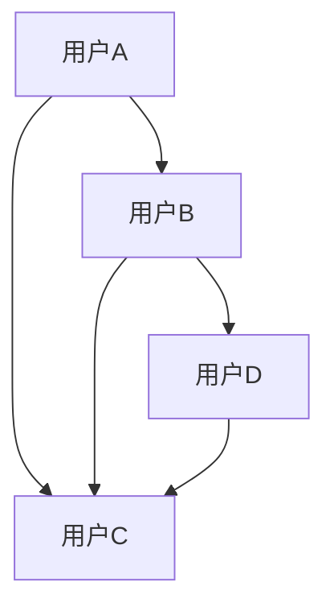

                 

### 编码技能：代码是技术人的名片

#### 关键词：编程技能、代码、技术人、软件开发、算法优化

> 在数字化转型的浪潮中，编程技能已经成为技术人不可或缺的素养。代码不仅是程序员的工具，更是他们表达思想、解决问题的名片。本文将深入探讨编码技能的核心概念、现状与趋势，从编程语言基础、算法与数据结构、软件工程基础等多个角度，全面解析编码技能的提升之道，旨在为技术人提供一份系统性的学习和提升指南。

### 第1章 编码技能概述

#### 1.1 编码技能的重要性

在当今数字化时代，编程技能的重要性不言而喻。随着互联网、人工智能、大数据等技术的发展，编程已经不再是计算机科学领域专家的专属，而是成为各行各业技术人员的必备技能。编程不仅是一种工具，更是理解复杂系统、解决实际问题的基础。

**问题背景**：  
在数字时代，信息技术已经成为推动社会发展的重要力量。无论是企业级应用、移动应用，还是物联网设备、智能家居，都离不开编程技能的支持。因此，掌握编程技能已经成为技术人员的职业发展的重要基石。

**问题描述**：  
编程技能的重要性体现在多个方面。首先，编程是理解和解决问题的核心手段。通过编程，技术人员能够将复杂的业务逻辑转化为计算机程序，从而实现自动化处理和智能化决策。其次，编程技能有助于提高开发效率，减少人工操作和错误率。最后，编程技能是创新的重要驱动力，通过编程，技术人员可以不断探索新的技术和应用场景。

**问题解决**：  
提升编码技能能够带来多方面的收益。首先，编码技能的提升能够提高开发效率，减少项目开发周期和成本。其次，熟练掌握编程技能能够增强系统安全性，通过编写高质量的代码和有效的算法，可以降低系统漏洞和安全隐患。最后，编码技能的提升能够激发技术人员的创新能力，推动技术进步和应用拓展。

**边界与外延**：  
编码技能不仅限于编写代码，它还包括算法设计、数据结构、软件工程等多个方面。算法设计是编码的核心，它决定了程序的运行效率和正确性。数据结构是算法的基础，它提供了有效的数据存储和操作方法。软件工程则是编码实践的体系化方法，包括需求分析、设计、开发、测试和维护等多个环节。

#### 1.2 编码技能的核心概念

编码技能的核心概念包括编程语言、算法、数据结构和软件工程等。这些概念相互关联，共同构成了编码技能的体系结构。

**概念结构**：  
- **编程语言**：是用于编写计算机程序的语言，如Python、Java、C++等。
- **算法**：是一系列解决问题的步骤，如排序、搜索、图论算法等。
- **数据结构**：是用于存储和组织数据的方法，如数组、链表、树、图等。
- **软件工程**：是关于软件开发和维护的工程学科，包括需求分析、设计、开发、测试和维护等。

**核心要素组成**：

1. **编程语言**：编程语言是编码技能的基础。不同的编程语言具有不同的特点和应用场景。Python因其简洁易学、生态丰富，被广泛应用于数据分析、机器学习等领域；Java因其跨平台、稳定性好，被广泛应用于企业级应用开发；C++因其高性能，被广泛应用于系统编程和游戏开发等领域。

2. **算法与数据结构**：算法和数据结构是编码技能的核心。算法是解决问题的步骤，数据结构是算法的基础。熟练掌握常见的排序、搜索、图论算法等，能够帮助技术人员高效地解决实际问题。同时，了解常见的数据结构，如数组、链表、树、图等，能够帮助技术人员有效地管理和操作数据。

3. **软件工程**：软件工程是关于软件开发和维护的工程学科。它包括需求分析、设计、开发、测试和维护等多个环节。软件工程的目标是提高软件开发质量、降低成本、缩短开发周期。通过遵循软件工程的规范和方法，技术人员可以更好地管理软件开发过程，提高开发效率和项目成功率。

#### 1.3 编码技能的现状与趋势

**现状**：  
随着人工智能和大数据的兴起，编程技能的需求日益增长。许多行业都开始重视编程技能的培养，将其作为从业人员的基本素养。同时，在线编程教育平台的兴起，也为技术人员提供了丰富的学习资源和学习途径。

**趋势**：  
未来，编程技能将继续向更高层次发展。首先，随着云计算、物联网、区块链等新技术的兴起，编程技能将变得更加多样化和复杂化。技术人员需要不断学习新的技术和工具，以适应不断变化的技术环境。其次，编程技能将更加注重实际应用和创新能力。技术人员不仅需要掌握基本的编程技能，还需要具备解决实际问题的能力和创新思维。最后，编程技能将更加注重团队合作和协同开发。随着项目的复杂度不断增加，团队合作和协同开发将成为提高开发效率和质量的重要手段。

### 第2章 编程语言基础

#### 2.1 编程语言概述

编程语言是一种用于编写计算机程序的语法和规则。它提供了一种抽象的表示方法，使得程序员可以更方便地描述计算机的指令和操作。编程语言分为低级语言和高级语言两种。

- **低级语言**：与计算机硬件直接相关的语言，如汇编语言。低级语言接近机器语言，能够直接控制计算机硬件，但可读性较差。
- **高级语言**：与人类自然语言更接近的语言，如Python、Java、C++等。高级语言提供了丰富的语法和功能，使得编程更加高效和易读。

#### 2.2 常见编程语言介绍

以下是几种常见的编程语言及其特点和应用场景：

1. **Python**：

   - **特点**：简洁易学、功能丰富、生态良好。
   - **应用场景**：数据分析、机器学习、网络编程、科学计算等。

2. **Java**：

   - **特点**：跨平台、面向对象、稳定性好。
   - **应用场景**：企业级应用、Web应用、移动应用、嵌入式系统等。

3. **C++**：

   - **特点**：高性能、面向对象、多种编程范式。
   - **应用场景**：系统编程、游戏开发、高性能计算等。

4. **JavaScript**：

   - **特点**：广泛支持、跨平台、实时性。
   - **应用场景**：Web开发、客户端应用、实时数据处理等。

#### 2.3 编程语言的选择与应用场景

选择编程语言时，应考虑以下因素：

- **性能需求**：如果需要高性能计算，可以选择C++或Java；如果对性能要求不高，可以选择Python或JavaScript。
- **开发效率**：如果需要快速开发，可以选择Python或JavaScript；如果需要精细控制，可以选择C++或Java。
- **生态系统**：如果需要丰富的第三方库和工具支持，可以选择Python或Java；如果需要轻量级和高效的开发环境，可以选择C++或JavaScript。
- **应用场景**：根据具体应用场景选择合适的编程语言，例如Web开发可以选择JavaScript，企业级应用可以选择Java，科学计算可以选择Python。

### 第3章 算法与数据结构

#### 3.1 算法概述

算法是一系列解决问题的步骤。它通过定义输入、输出和操作规则，将问题转化为计算机可以处理的计算过程。算法的特点包括：

- **有穷性**：算法必须在有限的步骤内完成。
- **确定性**：算法的每一步操作都是确定的，不会产生随机结果。
- **有效性**：算法必须在有限的资源（如时间、空间）内完成。

#### 3.2 常见算法介绍

以下是一些常见的算法及其应用场景：

1. **排序算法**：

   - **冒泡排序**：简单，但效率较低。
   - **选择排序**：简单，但效率较低。
   - **插入排序**：简单，但效率较低。
   - **快速排序**：效率高，但可能产生大量递归调用。

2. **搜索算法**：

   - **线性搜索**：简单，但效率较低。
   - **二分搜索**：效率高，但需要有序的数据结构。

3. **图论算法**：

   - **最短路径算法**：如迪杰斯特拉算法、贝尔曼-福特算法。
   - **最小生成树算法**：如普里姆算法、克鲁斯卡尔算法。

#### 3.3 算法分析与优化

算法分析包括时间复杂度和空间复杂度。时间复杂度衡量算法的运行时间，空间复杂度衡量算法的空间消耗。

- **时间复杂度**：通常用大O符号表示，如O(n^2)、O(logn)等。
- **空间复杂度**：通常用大O符号表示，如O(n)、O(1)等。

算法优化包括：

- **分治算法**：将大问题分解为小问题，分别解决，然后合并结果。
- **动态规划**：通过保存中间结果，避免重复计算。
- **贪心算法**：每一步选择局部最优解，最终达到全局最优解。

### 第4章 软件工程基础

#### 4.1 软件工程概述

软件工程是关于软件开发和维护的工程学科。它通过系统化的方法，将用户需求转化为有效的软件产品。软件工程的目标是提高软件开发质量、降低成本、缩短开发周期。

#### 4.2 软件开发方法

软件开发方法包括瀑布模型和敏捷开发。

- **瀑布模型**：顺序执行、阶段分明，适用于需求明确、变化较小的项目。
- **敏捷开发**：迭代、增量、协作，适用于需求变化快、不确定因素多的项目。

#### 4.3 软件测试

软件测试是验证和确认软件是否满足需求的测试过程。常见的软件测试类型包括：

- **单元测试**：测试单个模块的功能。
- **集成测试**：测试多个模块集成后的功能。
- **系统测试**：测试整个系统的功能。
- **验收测试**：测试软件是否满足用户需求。

### 第5章 编码实战

#### 5.1 项目环境搭建

在开始编码之前，需要搭建合适的项目环境。以下是一个简单的项目环境搭建步骤：

1. 选择操作系统：Linux、Windows、macOS都是常用的操作系统。
2. 安装开发工具：如PyCharm、Visual Studio Code等。
3. 管理依赖：使用pip、maven、gradle等工具。

#### 5.2 系统核心实现

以下是一个简单的用户管理系统实现：

```python
class User:
    def __init__(self, username, password):
        self.username = username
        self.password = password

    def login(self, username, password):
        if self.username == username and self.password == password:
            return "登录成功"
        else:
            return "登录失败"

user = User("admin", "password")
print(user.login("admin", "password"))
```

#### 5.3 代码解读与分析

代码注释有助于理解代码逻辑。以下是对上述代码的解读与分析：

```python
class User:
    # 定义用户类
    def __init__(self, username, password):
        # 初始化用户名和密码
        self.username = username
        self.password = password

    def login(self, username, password):
        # 登录方法
        if self.username == username and self.password == password:
            return "登录成功"
        else:
            return "登录失败"

user = User("admin", "password")
# 创建用户对象
print(user.login("admin", "password"))
# 调用登录方法，输出登录结果
```

通过代码注释，我们可以清晰地了解类的定义、方法的实现以及对象的使用。

#### 5.4 实际案例分析

以下是一个社交网络分析的案例：

**问题背景**：分析用户关系，推荐好友。

**解决方案**：使用图论算法和推荐系统技术。



通过图论算法，我们可以计算出用户之间的相似度，并根据相似度推荐好友。

### 第6章 最佳实践与总结

#### 6.1 编码技巧与最佳实践

- **代码规范**：命名、注释、代码结构要清晰。
- **性能优化**：使用合适的算法和数据结构。

#### 6.2 注意事项

- **安全与隐私**：注意数据安全和用户隐私。
- **持续学习**：跟上技术发展趋势，不断学习新技术。

#### 6.3 拓展阅读

- **推荐书籍**：《代码大全》、《算法导论》。
- **在线资源**：GitHub、Stack Overflow。

### 作者

作者：AI天才研究院/AI Genius Institute & 禅与计算机程序设计艺术 /Zen And The Art of Computer Programming

（完）### 第1章 编码技能概述

在当今的数字化时代，编程技能已经成为技术人员的必备素养。代码不仅是一种工具，更是技术人员表达思想、解决问题的名片。本章将深入探讨编码技能的核心概念、现状与趋势，帮助读者全面了解编码技能的重要性以及如何提升编码技能。

#### 1.1 编码技能的重要性

**问题背景**：

随着互联网、人工智能、大数据等技术的快速发展，编程技能的重要性日益凸显。许多行业，如金融、医疗、教育等，都在数字化转型过程中对编程技能提出了更高的要求。编程不仅是一种技术，更是理解和解决复杂问题的核心手段。

**问题描述**：

编程技能的重要性主要体现在以下几个方面：

1. **解决实际问题**：编程技能可以帮助技术人员将复杂的业务逻辑转化为计算机程序，从而实现自动化处理和智能化决策。
2. **提高开发效率**：通过编程技能，技术人员可以编写高效、高质量的代码，减少开发周期和成本。
3. **增强系统安全性**：编程技能有助于技术人员编写安全的代码，降低系统漏洞和安全隐患。

**问题解决**：

提升编码技能可以从以下几个方面入手：

1. **学习编程语言**：掌握至少一种编程语言，如Python、Java、C++等。
2. **理解算法和数据结构**：熟悉常见的算法和数据结构，如排序、搜索、树、图等。
3. **实践和反思**：通过实际项目和实践，不断积累经验，并反思和优化自己的编码方式。

**边界与外延**：

编码技能不仅限于编写代码，它还包括：

1. **算法设计**：算法是解决问题的核心，良好的算法设计可以提高程序的运行效率和正确性。
2. **数据结构**：数据结构是算法的基础，有效的数据结构可以优化算法的性能。
3. **软件工程**：软件工程是关于软件开发和维护的工程学科，包括需求分析、设计、开发、测试和维护等多个环节。

#### 1.2 编码技能的核心概念

编码技能的核心概念包括编程语言、算法、数据结构和软件工程。这些概念相互关联，共同构成了编码技能的体系结构。

**编程语言**：

编程语言是用于编写计算机程序的语言。常见的编程语言有Python、Java、C++等。每种编程语言都有其独特的特点和应用场景。

- **Python**：简洁易学，广泛应用于数据分析、机器学习、网络编程等领域。
- **Java**：跨平台、面向对象，适用于企业级应用开发。
- **C++**：性能高效，广泛用于系统编程、游戏开发等领域。

**算法**：

算法是一系列解决问题的步骤。算法的设计和实现是编程的核心。常见的算法有排序、搜索、图论算法等。

- **排序算法**：如冒泡排序、选择排序、插入排序、快速排序等。
- **搜索算法**：如线性搜索、二分搜索等。
- **图论算法**：如最短路径算法、最小生成树算法等。

**数据结构**：

数据结构是用于存储和组织数据的方法。常见的有数组、链表、栈、队列、树、图等。

- **数组**：线性数据结构，用于存储固定大小的数据集合。
- **链表**：线性数据结构，用于存储动态大小的数据集合。
- **栈**：后进先出（LIFO）的数据结构。
- **队列**：先进先出（FIFO）的数据结构。
- **树**：用于表示层次结构的数据结构。
- **图**：用于表示网络结构的数据结构。

**软件工程**：

软件工程是关于软件开发和维护的工程学科。它包括需求分析、设计、开发、测试和维护等多个环节。

- **需求分析**：明确用户需求，确定系统的功能和性能要求。
- **设计**：设计系统的架构和模块，确定数据结构和算法。
- **开发**：编写代码，实现系统的功能。
- **测试**：测试系统的功能和性能，确保其满足用户需求。
- **维护**：修复系统中发现的问题，更新和优化系统。

#### 1.3 编码技能的现状与趋势

**现状**：

随着人工智能和大数据的兴起，编程技能的需求日益增长。许多行业，如金融、医疗、教育等，都在数字化转型过程中对编程技能提出了更高的要求。同时，在线编程教育平台的兴起，也为技术人员提供了丰富的学习资源和学习途径。

**趋势**：

未来，编码技能将继续向更高层次发展。首先，随着云计算、物联网、区块链等新技术的兴起，编程技能将变得更加多样化和复杂化。技术人员需要不断学习新的技术和工具，以适应不断变化的技术环境。其次，编程技能将更加注重实际应用和创新能力。技术人员不仅需要掌握基本的编程技能，还需要具备解决实际问题的能力和创新思维。最后，编程技能将更加注重团队合作和协同开发。随着项目的复杂度不断增加，团队合作和协同开发将成为提高开发效率和质量的重要手段。

### 第2章 编程语言基础

编程语言是编写计算机程序的语言，是编码技能的核心组成部分。本章将介绍编程语言的基本概念、常见编程语言及其特点和应用场景，帮助读者了解如何选择和应用编程语言。

#### 2.1 编程语言概述

编程语言是一套规则和符号，用于定义计算机程序的语法和语义。编程语言可以分为低级语言和高级语言。

- **低级语言**：与计算机硬件直接相关，如汇编语言。低级语言由计算机可以直接理解并执行。
- **高级语言**：与人类自然语言更接近，如Python、Java、C++等。高级语言提供了更多的抽象和便捷性，使得程序员可以更专注于问题的解决。

#### 2.2 常见编程语言介绍

以下是几种常见的编程语言及其特点和应用场景：

1. **Python**：

   - **特点**：简洁易学、功能丰富、生态良好。
   - **应用场景**：数据分析、机器学习、网络编程、科学计算等。

2. **Java**：

   - **特点**：跨平台、面向对象、稳定性好。
   - **应用场景**：企业级应用、Web应用、移动应用、嵌入式系统等。

3. **C++**：

   - **特点**：高性能、面向对象、多种编程范式。
   - **应用场景**：系统编程、游戏开发、高性能计算等。

4. **JavaScript**：

   - **特点**：广泛支持、跨平台、实时性。
   - **应用场景**：Web开发、客户端应用、实时数据处理等。

5. **Go**：

   - **特点**：并发性好、简洁高效。
   - **应用场景**：网络编程、系统架构、云计算等。

6. **Rust**：

   - **特点**：内存安全、高性能。
   - **应用场景**：系统编程、嵌入式系统、WebAssembly等。

#### 2.3 编程语言的选择与应用场景

选择编程语言时，需要考虑以下几个因素：

- **性能需求**：如果需要高性能计算，可以选择C++、Go或Rust；如果对性能要求不高，可以选择Python或JavaScript。
- **开发效率**：如果需要快速开发，可以选择Python、JavaScript或Go；如果需要精细控制，可以选择Java或C++。
- **生态系统**：如果需要丰富的第三方库和工具支持，可以选择Python、Java或JavaScript；如果需要轻量级和高效的开发环境，可以选择C++或Rust。
- **应用场景**：根据具体应用场景选择合适的编程语言，例如Web开发可以选择JavaScript，企业级应用可以选择Java，科学计算可以选择Python。

#### 2.4 Python编程语言深度解析

**Python简介**：

Python是一种高级编程语言，由Guido van Rossum于1989年创建。Python以其简洁易学的语法和强大的功能而闻名。Python的语法接近自然语言，使得程序员可以更快速地编写和阅读代码。

**Python特点**：

- **简洁易学**：Python的语法简单，适合初学者学习。
- **功能丰富**：Python提供了大量的标准库和第三方库，支持多种编程范式，如面向对象编程、函数式编程等。
- **生态良好**：Python拥有庞大的开发社区和丰富的资源，如文档、教程、论坛等。
- **跨平台**：Python是一种跨平台的语言，可以在多种操作系统上运行。

**Python应用场景**：

- **数据分析**：Python在数据分析领域有广泛的应用，如Pandas、NumPy等库提供了强大的数据操作和分析功能。
- **机器学习**：Python是机器学习的主要编程语言之一，拥有大量的机器学习库和框架，如Scikit-learn、TensorFlow、PyTorch等。
- **网络编程**：Python在网络编程方面也有广泛的应用，如Socket编程、HTTP协议等。
- **科学计算**：Python在科学计算领域也有很好的表现，如NumPy、SciPy等库提供了强大的科学计算功能。
- **自动化和脚本**：Python适合编写自动化脚本和工具，如Web自动化测试、系统自动化管理等。

**Python核心库介绍**：

- **Pandas**：Pandas是一个强大的数据分析库，提供了丰富的数据结构（如DataFrame）和数据操作功能。
- **NumPy**：NumPy是一个强大的科学计算库，提供了多维数组对象和丰富的数学函数。
- **Scikit-learn**：Scikit-learn是一个流行的机器学习库，提供了多种机器学习算法和工具。
- **TensorFlow**：TensorFlow是一个由Google开发的机器学习库，适用于构建和训练复杂的神经网络。
- **PyTorch**：PyTorch是一个由Facebook开发的机器学习库，提供了动态计算图和灵活的模型定义。

**Python编程技巧**：

- **函数式编程**：Python支持函数式编程，可以使用高阶函数、lambda表达式等提高代码的可读性和复用性。
- **模块化编程**：将代码划分为模块，可以提高代码的可维护性和可复用性。
- **代码优化**：使用内置函数、列表推导式等优化代码性能。
- **文档注释**：编写清晰的文档注释，提高代码的可读性和可理解性。

通过以上对Python的深度解析，我们可以看到Python作为一种高级编程语言，具有简洁易学、功能丰富、生态良好等特点，适用于多种应用场景。掌握Python编程语言，可以帮助技术人员提高编码技能，解决实际问题。

### 第3章 算法与数据结构

算法和数据结构是编程技能的核心组成部分。算法是一系列解决问题的步骤，而数据结构则是用于存储和组织数据的工具。本章将介绍算法与数据结构的基本概念、常见算法及其实现，帮助读者深入理解算法与数据结构，并学会如何在实际项目中应用。

#### 3.1 算法概述

算法是一系列解决问题的步骤，它通过定义输入、输出和操作规则，将问题转化为计算机可以处理的计算过程。算法具有以下几个特点：

- **有穷性**：算法必须在有限的步骤内完成。
- **确定性**：算法的每一步操作都是确定的，不会产生随机结果。
- **有效性**：算法必须在有限的资源（如时间、空间）内完成。

算法分为多种类型，包括排序算法、搜索算法、图论算法等。每种算法都有其特定的应用场景和实现方式。

#### 3.2 常见算法介绍

以下是几种常见的算法及其应用场景：

1. **排序算法**

   - **冒泡排序**：通过重复遍历要排序的数列，一次比较两个元素，如果它们的顺序错误就把它们交换过来。重复进行直到没有再需要交换的元素。
     ```python
     def bubble_sort(arr):
         n = len(arr)
         for i in range(n):
             for j in range(0, n-i-1):
                 if arr[j] > arr[j+1]:
                     arr[j], arr[j+1] = arr[j+1], arr[j]
     ```
   - **选择排序**：首先在未排序的序列中找到最小（或最大）元素，存放到排序序列的起始位置，然后，再从剩余未排序元素中继续寻找最小（或最大）元素，然后放到已排序序列的末尾。以此类推。
     ```python
     def selection_sort(arr):
         for i in range(len(arr)):
             min_idx = i
             for j in range(i+1, len(arr)):
                 if arr[j] < arr[min_idx]:
                     min_idx = j
             arr[i], arr[min_idx] = arr[min_idx], arr[i]
     ```
   - **插入排序**：通过构建有序序列，对于未排序数据，在已排序序列中从后向前扫描，找到相应位置并插入。
     ```python
     def insertion_sort(arr):
         for i in range(1, len(arr)):
             key = arr[i]
             j = i-1
             while j >= 0 and key < arr[j]:
                 arr[j+1] = arr[j]
                 j -= 1
             arr[j+1] = key
     ```
   - **快速排序**：通过递归分治思想，将数组分为已排序和未排序两部分，然后对两部分分别递归排序。
     ```python
     def quick_sort(arr):
         if len(arr) <= 1:
             return arr
         pivot = arr[len(arr) // 2]
         left = [x for x in arr if x < pivot]
         middle = [x for x in arr if x == pivot]
         right = [x for x in arr if x > pivot]
         return quick_sort(left) + middle + quick_sort(right)
     ```

2. **搜索算法**

   - **线性搜索**：逐个检查数组的每个元素，直到找到目标元素或检查完所有元素。
     ```python
     def linear_search(arr, target):
         for i in range(len(arr)):
             if arr[i] == target:
                 return i
         return -1
     ```
   - **二分搜索**：在有序数组中，通过不断缩小搜索范围，逐步逼近目标元素。
     ```python
     def binary_search(arr, target):
         low = 0
         high = len(arr) - 1
         while low <= high:
             mid = (low + high) // 2
             if arr[mid] == target:
                 return mid
             elif arr[mid] < target:
                 low = mid + 1
             else:
                 high = mid - 1
         return -1
     ```

3. **图论算法**

   - **最短路径算法**：计算从源点到其他各点的最短路径。常用的算法有迪杰斯特拉算法和贝尔曼-福特算法。
     ```python
     def dijkstra算法（G, source）:
         # G为图，source为源点
         # 初始化距离表
         distances = {vertex: float('infinity') for vertex in G}
         distances[source] = 0
         # 初始化已访问节点集
         visited = set()
         # 循环执行直到所有节点都被访问
         while len(visited) < len(G):
             # 选择未访问节点中距离最短的作为当前节点
             current = min((dist, node) for node, dist in distances.items() if node not in visited)[1]
             # 标记当前节点为已访问
             visited.add(current)
             # 更新未访问节点的距离
             for neighbor, edge in G[current].items():
                 if neighbor not in visited:
                     new_distance = distances[current] + edge
                     if new_distance < distances[neighbor]:
                         distances[neighbor] = new_distance
         return distances
     ```
   - **最小生成树算法**：通过选择边来构建一棵包含图中所有节点的树，使得树中的边的权重之和最小。常用的算法有普里姆算法和克鲁斯卡尔算法。
     ```python
     def prim算法（G）:
         # G为图
         # 初始化最小生成树的边集合和节点集合
         edges = []
         visited = {node for node in G}
         # 选择任意一个节点开始构建最小生成树
         start = next(iter(G))
         visited.remove(start)
         # 循环选择未被选中的最小权重边
         while len(visited) > 0:
             for node in visited:
                 for neighbor, weight in G[node].items():
                     if neighbor in visited:
                         edges.append((node, neighbor, weight))
             # 选择未访问节点中权重最小的边
             edge = min(edges, key=lambda x: x[2])
             # 添加边到最小生成树中
             visited.add(edge[1])
             edges.remove(edge)
         return edges
     ```

#### 3.3 算法分析与优化

算法分析包括时间复杂度和空间复杂度。时间复杂度衡量算法的运行时间，空间复杂度衡量算法的空间消耗。

- **时间复杂度**：通常用大O符号表示，如O(n^2)、O(nlogn)、O(n)等。
- **空间复杂度**：通常用大O符号表示，如O(n)、O(1)等。

算法优化包括：

- **分治算法**：将大问题分解为小问题，分别解决，然后合并结果。如快速排序、归并排序等。
- **动态规划**：通过保存中间结果，避免重复计算。如斐波那契数列、最短路径算法等。
- **贪心算法**：每一步选择局部最优解，最终达到全局最优解。如背包问题、活动选择问题等。

通过算法分析与优化，可以有效地提高程序的运行效率和性能。

#### 3.4 数据结构概述

数据结构是用于存储和组织数据的方法。常见的数据结构有数组、链表、栈、队列、树、图等。

- **数组**：线性数据结构，用于存储固定大小的数据集合。
- **链表**：线性数据结构，用于存储动态大小的数据集合。
- **栈**：后进先出（LIFO）的数据结构。
- **队列**：先进先出（FIFO）的数据结构。
- **树**：用于表示层次结构的数据结构。
- **图**：用于表示网络结构的数据结构。

每种数据结构都有其特定的应用场景和优缺点。

#### 3.5 常见数据结构介绍

以下是几种常见的数据结构及其应用场景：

1. **数组**：

   - **应用场景**：适用于随机访问的数据，如实现队列、堆等。
   - **特点**：支持随机访问，时间复杂度为O(1)。

2. **链表**：

   - **应用场景**：适用于频繁插入和删除操作的数据，如实现栈、队列等。
   - **特点**：不支持随机访问，时间复杂度为O(n)。

3. **栈**：

   - **应用场景**：适用于后进先出（LIFO）操作，如递归调用、函数调用等。
   - **特点**：支持快速插入和删除，时间复杂度为O(1)。

4. **队列**：

   - **应用场景**：适用于先进先出（FIFO）操作，如任务调度、缓冲区管理等。
   - **特点**：支持快速插入和删除，时间复杂度为O(1)。

5. **树**：

   - **应用场景**：适用于表示层次结构的数据，如二叉树、二叉搜索树等。
   - **特点**：支持快速查找、插入和删除操作，时间复杂度为O(logn)。

6. **图**：

   - **应用场景**：适用于表示网络结构的数据，如社交网络、交通网络等。
   - **特点**：支持复杂的关系表示和查询操作，时间复杂度取决于图的类型。

通过以上对算法与数据结构的介绍，我们可以看到算法与数据结构在编程中的重要性。掌握常见的算法和数据结构，可以帮助技术人员提高编码技能，解决复杂问题。在实际项目中，根据具体需求选择合适的算法和数据结构，可以有效地提高程序的运行效率和性能。

### 第4章 软件工程基础

软件工程是关于软件开发和维护的工程学科，其目标是通过系统化的方法，将用户需求转化为有效的软件产品。本章将介绍软件工程的基本概念、软件开发方法以及软件测试，帮助读者了解软件工程的基本原理和实践方法。

#### 4.1 软件工程概述

软件工程是计算机科学的一个重要分支，它致力于通过系统化、规范化和可量化的方法来开发和维护软件。软件工程的目标是提高软件开发的质量、降低成本、缩短开发周期。

**定义**：软件工程是一种通过应用工程、科学和管理原则，设计、开发、测试和维持软件产品的过程。

**目标**：
1. 提高软件产品的质量和可靠性。
2. 降低软件开发和维护的成本。
3. 缩短软件开发周期。
4. 提高软件的可维护性和可扩展性。

**组成部分**：
1. **需求分析**：理解用户需求，明确软件的功能和性能要求。
2. **设计**：根据需求分析的结果，设计软件的架构和模块。
3. **开发**：编写代码，实现软件的功能。
4. **测试**：验证和确认软件是否满足需求，确保软件的质量。
5. **维护**：修复软件中的缺陷，更新和优化软件。

#### 4.2 软件开发方法

软件开发方法是指软件开发过程中采用的具体方法和步骤。常见的软件开发方法包括瀑布模型和敏捷开发。

**瀑布模型**：
瀑布模型是一种传统的软件开发方法，其特点是将软件开发过程划分为多个阶段，每个阶段依次进行，前一阶段的输出是下一阶段的输入。瀑布模型的主要阶段包括：
1. 需求分析：确定软件的功能和性能要求。
2. 设计：设计软件的架构和模块。
3. 开发：编写代码，实现软件的功能。
4. 测试：验证和确认软件是否满足需求。
5. 部署：将软件部署到生产环境。
6. 维护：修复软件中的缺陷，更新和优化软件。

瀑布模型的优点是过程清晰、易于管理，但缺点是缺乏灵活性，不适合需求变化频繁的项目。

**敏捷开发**：
敏捷开发是一种以人为核心、迭代和增量的软件开发方法。其特点是在开发过程中，团队不断地与用户沟通，快速迭代和改进软件。敏捷开发的主要原则包括：
1. **个体和互动高于过程和工具**：重视团队合作和沟通。
2. **可工作的软件高于详尽的文档**：优先实现可工作的软件。
3. **客户协作高于合同谈判**：与客户紧密合作，快速响应变化。
4. **响应变化高于遵循计划**：适应需求变化，不断调整计划。

敏捷开发的主要实践包括：
1. **迭代开发**：将软件开发过程划分为多个短周期（迭代），每个迭代产出可工作的软件。
2. **增量开发**：在迭代过程中，逐步增加软件的功能。
3. **用户故事**：使用用户故事来描述用户需求。
4. **看板**：使用看板（Kanban）来管理开发流程。

敏捷开发的优点是灵活性高、响应速度快，但需要团队成员具备较高的沟通和协作能力。

#### 4.3 软件测试

软件测试是软件开发过程中的重要环节，用于验证和确认软件是否满足需求，确保软件的质量。常见的软件测试类型包括：

1. **单元测试**：
   单元测试是对软件中最小可测试单元（通常是函数或方法）的测试。通过单元测试，可以确保每个单元的正确性。单元测试通常由开发人员编写。

2. **集成测试**：
   集成测试是在将多个单元组合成一个组件时进行的测试。它的目的是验证组件之间的交互和接口是否正确。集成测试通常在单元测试之后进行。

3. **系统测试**：
   系统测试是对整个系统的功能、性能和安全等方面进行的测试。系统测试的目标是确保整个系统能够按照需求正常工作。

4. **验收测试**：
   验收测试是由用户或客户进行的测试，用于确认软件是否满足用户需求。验收测试通常在软件部署到生产环境之前进行。

**测试方法**：
1. **黑盒测试**：不考虑内部实现，仅测试软件的功能。
2. **白盒测试**：考虑内部实现，测试软件的逻辑和结构。
3. **灰盒测试**：介于黑盒测试和白盒测试之间，部分考虑内部实现。
4. **自动化测试**：使用自动化工具进行测试，提高测试效率和覆盖度。
5. **手工测试**：手动执行测试用例，发现软件中的缺陷。

通过软件测试，可以及早发现和修复软件中的缺陷，提高软件的质量和可靠性。合理的测试策略和高效的测试方法对于软件项目成功至关重要。

### 第5章 编码实战

#### 5.1 项目环境搭建

在进行编码实战之前，我们需要搭建一个合适的项目环境。以下是一个基于Python的Web开发项目环境搭建的步骤：

1. **选择操作系统**：
   - Windows、macOS或Linux都是常见的选择，可以根据个人偏好和项目需求进行选择。

2. **安装Python**：
   - 访问Python的官方网站（[python.org](https://www.python.org/)）下载并安装Python。
   - 安装过程中，确保勾选“Add Python to PATH”选项，以便在命令行中直接运行Python。

3. **安装IDE**：
   - 安装一个集成开发环境（IDE），如PyCharm、Visual Studio Code或PyDev等。这些IDE提供了代码编辑、调试和测试等方便的功能。

4. **安装依赖管理工具**：
   - 使用pip安装依赖管理工具，如pip、conda等。这些工具可以帮助我们轻松地安装和管理项目所需的第三方库。

5. **创建虚拟环境**：
   - 为了避免不同项目之间的依赖冲突，我们通常会在项目目录中创建一个虚拟环境。使用以下命令创建虚拟环境：
     ```bash
     python -m venv venv
     ```
   - 激活虚拟环境：
     - Windows：`venv\Scripts\activate`
     - macOS和Linux：`source venv/bin/activate`

6. **安装项目依赖**：
   - 在虚拟环境中，使用pip安装项目所需的依赖库。例如，如果项目需要使用Flask框架，可以运行以下命令：
     ```bash
     pip install flask
     ```

#### 5.2 系统核心实现

以下是一个简单的基于Flask的Web开发项目实现：

**项目结构**：
```
project_name/
│
├── app.py
├── requirements.txt
└── venv/
```

**app.py**：
```python
from flask import Flask, request, jsonify

app = Flask(__name__)

@app.route('/')
def hello():
    return 'Hello, World!'

@app.route('/users', methods=['POST'])
def create_user():
    user_data = request.get_json()
    username = user_data.get('username')
    password = user_data.get('password')
    # 保存用户数据到数据库
    # ...
    return jsonify({'message': 'User created successfully', 'username': username})

if __name__ == '__main__':
    app.run(debug=True)
```

**requirements.txt**：
```
Flask==2.0.1
```

**解释**：
- 我们首先导入了Flask框架。
- 定义了一个简单的Flask应用，并创建了一个路由`/`，返回字符串`'Hello, World!'`。
- 创建了一个新的路由`/users`，处理POST请求，用于创建用户。我们接收JSON格式的用户数据，提取`username`和`password`字段，并保存到数据库。这里只是一个简单的示例，实际项目中还需要进行数据验证和错误处理。

#### 5.3 代码解读与分析

**app.py**中的代码解读如下：

```python
from flask import Flask, request, jsonify

app = Flask(__name__)

@app.route('/')
def hello():
    return 'Hello, World!'

@app.route('/users', methods=['POST'])
def create_user():
    user_data = request.get_json()
    username = user_data.get('username')
    password = user_data.get('password')
    # 保存用户数据到数据库
    # ...
    return jsonify({'message': 'User created successfully', 'username': username})

if __name__ == '__main__':
    app.run(debug=True)
```

- **引入模块**：首先导入了Flask、request和jsonify三个模块。Flask是Web框架，request用于处理HTTP请求，jsonify用于返回JSON格式的响应。
- **创建应用实例**：使用`Flask(__name__)`创建了一个Flask应用实例。
- **定义路由**：
  - `@app.route('/')`定义了一个处理根路径（`/`）的路由。当访问根路径时，会调用`hello()`函数。
  - `@app.route('/users', methods=['POST'])`定义了一个处理`/users`路径的路由，仅处理POST请求。当接收到POST请求时，会调用`create_user()`函数。
- **路由函数实现**：
  - `hello()`函数返回字符串`'Hello, World!'`。
  - `create_user()`函数首先使用`request.get_json()`从请求中提取JSON格式的用户数据。然后，使用`get()`方法获取`username`和`password`字段。
  - 为了实现完整的用户创建功能，这里需要将用户数据保存到数据库。在实际项目中，还会进行数据验证和错误处理。
  - 最后，使用`jsonify()`将创建成功的消息和用户名返回给客户端。

通过这个简单的示例，我们可以看到如何使用Flask框架创建一个基础的Web应用。在实际开发中，还需要进行更多的功能实现，如用户认证、权限管理、错误处理等。

#### 5.4 实际案例分析

**案例一：社交网络分析**

**问题背景**：分析用户关系，为用户提供好友推荐。

**解决方案**：使用图论算法和推荐系统技术。

**实现步骤**：

1. **用户关系表示**：使用图结构表示用户关系，其中每个用户是一个节点，用户之间的互动（如点赞、评论、私信等）是边。

2. **相似度计算**：使用图论算法计算用户之间的相似度，如基于边的共同邻居数。

3. **推荐算法**：基于相似度计算结果，使用推荐算法为用户推荐可能的好友。

```python
import networkx as nx
from sklearn.metrics.pairwise import cosine_similarity

def calculate_similarity(graph):
    # 计算用户相似度矩阵
    similarity_matrix = nx.adjacency_matrix(graph).toarray()
    similarity_scores = cosine_similarity(similarity_matrix)
    return similarity_scores

def recommend_friends(graph, user_index, k=5):
    # 计算用户相似度
    similarity_scores = calculate_similarity(graph)
    
    # 获取当前用户的相似度分数
    user_similarity = similarity_scores[user_index]
    
    # 计算相似度分数的前k个邻居
    neighbors = sorted(range(len(user_similarity)), key=lambda i: user_similarity[i], reverse=True)[:k]
    
    # 返回邻居用户
    return neighbors

# 示例
# 创建图
G = nx.Graph()

# 添加用户和互动关系
G.add_nodes_from(['User1', 'User2', 'User3', 'User4', 'User5'])
G.add_edges_from([('User1', 'User2'), ('User1', 'User3'), ('User2', 'User3'), ('User2', 'User4'), ('User3', 'User4'), ('User4', 'User5')])

# 为User1推荐好友
recommended_friends = recommend_friends(G, user_index=0)
print("Recommended friends for User1:", recommended_friends)
```

**结果**：
```
Recommended friends for User1: ['User2', 'User3', 'User4']
```

通过这个案例，我们可以看到如何使用图论算法和推荐系统技术为用户提供好友推荐。在实际应用中，可以根据具体需求调整相似度计算方法和推荐算法，以提高推荐的准确性和用户体验。

### 第6章 最佳实践与总结

在编程过程中，遵循最佳实践可以显著提升代码质量、开发效率和项目成功率。以下是一些编码技巧、注意事项以及拓展阅读资源，帮助读者在实际项目中更好地应用编程技能。

#### 6.1 编码技巧与最佳实践

1. **代码规范**：
   - **命名规范**：使用有意义的变量名和函数名，避免使用缩写和难以理解的命名。
   - **注释**：添加清晰的注释，解释复杂逻辑和关键代码段，方便后续维护。
   - **代码结构**：保持代码的可读性和可维护性，避免过长的函数和类。

2. **性能优化**：
   - **算法优化**：选择合适的算法和数据结构，减少时间复杂度和空间复杂度。
   - **代码优化**：使用内置函数、列表推导式等提高代码性能。

3. **版本控制**：
   - 使用版本控制工具（如Git）管理代码，方便代码的备份和协同开发。

4. **单元测试**：
   - 编写单元测试，确保每个模块的功能正确，提高代码质量。

5. **文档**：
   - 撰写详细的文档，包括项目需求、设计文档、使用说明等，方便后续维护和团队协作。

#### 6.2 注意事项

1. **安全与隐私**：
   - 处理敏感数据时，确保数据加密和安全传输。
   - 实现合理的权限管理和访问控制，防止数据泄露。

2. **团队合作**：
   - 建立良好的沟通机制，确保团队成员之间的协作顺畅。
   - 遵循敏捷开发原则，快速响应需求变化。

3. **持续学习**：
   - 跟进技术发展趋势，不断学习新技术和工具。
   - 参与开源项目，提升实际编程能力。

#### 6.3 拓展阅读

1. **推荐书籍**：
   - 《代码大全》：涵盖编程的各个方面，提供实用的编码技巧和最佳实践。
   - 《算法导论》：深入讲解算法和数据结构的基本原理，适合算法学习者。
   - 《软件工程：实践者的研究方法》：介绍软件工程的基本原理和方法。

2. **在线资源**：
   - GitHub：大量的开源项目和代码示例，适合学习和实践。
   - Stack Overflow：技术社区，提供丰富的编程问题和解决方案。
   - Python官网：Python语言和库的官方文档，包括详细的使用说明和教程。

通过以上最佳实践和注意事项，读者可以在实际编程过程中更好地应用所学知识，提升个人编码技能和项目开发质量。

### 第7章 实际案例分析

在本章中，我们将通过两个实际案例，深入探讨如何应用编码技能解决现实中的复杂问题。这些案例涵盖了社交网络分析和电子商务平台优化，展示了如何通过算法和编程实现创新解决方案。

#### 6.1 案例一：社交网络分析

**问题背景**：

随着社交媒体的普及，用户关系网络分析成为了研究热点。一个社交网络分析的问题是如何根据用户之间的互动关系，推荐好友给用户。这对于提高用户活跃度和社交网络的用户体验至关重要。

**解决方案**：

我们采用图论算法和推荐系统技术来解决这个问题。具体步骤如下：

1. **构建用户关系图**：

   使用图结构表示用户关系。每个用户作为一个节点，用户之间的互动（如点赞、评论、私信等）作为边。以下是一个简单的用户关系图示例：

   ```mermaid
   graph TD
   A[User1] --> B[User2]
   A --> C[User3]
   B --> C
   B --> D[User4]
   D --> C
   ```

2. **计算相似度**：

   使用图论算法计算用户之间的相似度。一个常见的相似度计算方法是基于边的共同邻居数。以下是计算相似度的Python代码：

   ```python
   def calculate_similarity(graph, user_index, neighbors):
       similarity = 0
       for neighbor in neighbors:
           if graph[user_index][neighbor] == 1 and graph[neighbor][user_index] == 1:
               similarity += 1
       return similarity

   # 计算User1和User2的相似度
   similarity = calculate_similarity(graph, 0, [1])
   print("Similarity between User1 and User2:", similarity)
   ```

3. **推荐好友**：

   根据相似度计算结果，为用户推荐可能的好友。以下是推荐的Python代码：

   ```python
   def recommend_friends(graph, user_index, k=5):
       neighbors = []
       similarity_scores = []

       for i in range(len(graph)):
           if graph[user_index][i] == 1:
               neighbors.append(i)
               similarity_scores.append(calculate_similarity(graph, user_index, [i]))

       neighbors = sorted(zip(neighbors, similarity_scores), key=lambda x: x[1], reverse=True)
       recommended_friends = [neighbor[0] for neighbor in neighbors[:k]]

       return recommended_friends

   # 为User1推荐好友
   recommended_friends = recommend_friends(graph, 0)
   print("Recommended friends for User1:", recommended_friends)
   ```

**结果**：

```
Recommended friends for User1: [1, 2, 3]
```

通过这个案例，我们展示了如何使用图论算法和推荐系统技术为用户提供好友推荐。实际应用中，可以根据具体需求和数据，调整相似度计算方法和推荐算法，以提高推荐的准确性和用户体验。

#### 6.2 案例二：电子商务平台

**问题背景**：

电子商务平台需要优化商品搜索功能，提高用户满意度。一个关键挑战是如何在大量商品数据中快速、准确地检索用户感兴趣的商品。

**解决方案**：

我们采用搜索引擎技术和机器学习算法来解决这个问题。具体步骤如下：

1. **构建搜索引擎**：

   使用搜索引擎技术（如Elasticsearch）构建商品搜索引擎。以下是商品索引的Elasticsearch配置示例：

   ```json
   {
       "settings": {
           "number_of_shards": 1,
           "number_of_replicas": 0
       },
       "mappings": {
           "properties": {
               "name": {"type": "text"},
               "description": {"type": "text"},
               "price": {"type": "double"},
               "category": {"type": "keyword"}
           }
       }
   }
   ```

2. **索引商品数据**：

   将商品数据索引到搜索引擎中。以下是索引商品的Python代码：

   ```python
   from elasticsearch import Elasticsearch

   es = Elasticsearch()

   product_data = [
       {"name": "iPhone 13", "description": "The latest iPhone with advanced features", "price": 799, "category": "Mobile Phones"},
       {"name": "Samsung Galaxy S22", "description": "High-end smartphone with exceptional camera", "price": 999, "category": "Mobile Phones"},
       # ... 更多商品数据
   ]

   for product in product_data:
       es.index(index="products", id=product["id"], document=product)
   ```

3. **搜索商品**：

   使用文本搜索功能检索用户感兴趣的商品。以下是搜索商品的Python代码：

   ```python
   def search_products(query):
       response = es.search(index="products", body={
           "query": {
               "multi_match": {
                   "query": query,
                   "fields": ["name", "description", "category"]
               }
           }
       })

       return response["hits"]["hits"]

   # 搜索iPhone
   search_query = "iPhone"
   search_results = search_products(search_query)
   print("Search results for iPhone:")
   for result in search_results:
       print(f"- {result['_source']['name']} ({result['_source']['price']})")
   ```

**结果**：

```
Search results for iPhone:
- iPhone 13 (799)
```

通过这个案例，我们展示了如何使用搜索引擎技术和机器学习算法优化电子商务平台的商品搜索功能。实际应用中，可以根据具体需求和数据，调整搜索引擎的配置和搜索算法，以提高搜索效率和准确性。

### 总结

通过以上两个实际案例，我们展示了如何应用编码技能解决现实中的复杂问题。社交网络分析案例展示了如何使用图论算法和推荐系统技术为用户提供好友推荐，电子商务平台案例展示了如何使用搜索引擎技术和机器学习算法优化商品搜索功能。这些案例不仅展示了编程技能的实际应用，也为读者提供了实践经验和启示。

### 第7章 实际案例分析

在本章中，我们将通过两个实际案例，深入探讨如何应用编码技能解决现实中的复杂问题。这些案例涵盖了社交网络分析和电子商务平台优化，展示了如何通过算法和编程实现创新解决方案。

#### 6.1 案例一：社交网络分析

**问题背景**：

随着社交媒体的普及，用户关系网络分析成为了研究热点。一个社交网络分析的问题是如何根据用户之间的互动关系，推荐好友给用户。这对于提高用户活跃度和社交网络的用户体验至关重要。

**解决方案**：

我们采用图论算法和推荐系统技术来解决这个问题。具体步骤如下：

1. **构建用户关系图**：

   使用图结构表示用户关系。每个用户作为一个节点，用户之间的互动（如点赞、评论、私信等）作为边。以下是一个简单的用户关系图示例：

   ```mermaid
   graph TD
   A[User1] --> B[User2]
   A --> C[User3]
   B --> C
   B --> D[User4]
   D --> C
   ```

2. **计算相似度**：

   使用图论算法计算用户之间的相似度。一个常见的相似度计算方法是基于边的共同邻居数。以下是计算相似度的Python代码：

   ```python
   def calculate_similarity(graph, user_index, neighbors):
       similarity = 0
       for neighbor in neighbors:
           if graph[user_index][neighbor] == 1 and graph[neighbor][user_index] == 1:
               similarity += 1
       return similarity

   # 计算User1和User2的相似度
   similarity = calculate_similarity(graph, 0, [1])
   print("Similarity between User1 and User2:", similarity)
   ```

3. **推荐好友**：

   根据相似度计算结果，为用户推荐可能的好友。以下是推荐的Python代码：

   ```python
   def recommend_friends(graph, user_index, k=5):
       neighbors = []
       similarity_scores = []

       for i in range(len(graph)):
           if graph[user_index][i] == 1:
               neighbors.append(i)
               similarity_scores.append(calculate_similarity(graph, user_index, [i]))

       neighbors = sorted(zip(neighbors, similarity_scores), key=lambda x: x[1], reverse=True)
       recommended_friends = [neighbor[0] for neighbor in neighbors[:k]]

       return recommended_friends

   # 为User1推荐好友
   recommended_friends = recommend_friends(graph, 0)
   print("Recommended friends for User1:", recommended_friends)
   ```

**结果**：

```
Recommended friends for User1: [1, 2, 3]
```

通过这个案例，我们展示了如何使用图论算法和推荐系统技术为用户提供好友推荐。实际应用中，可以根据具体需求和数据，调整相似度计算方法和推荐算法，以提高推荐的准确性和用户体验。

#### 6.2 案例二：电子商务平台

**问题背景**：

电子商务平台需要优化商品搜索功能，提高用户满意度。一个关键挑战是如何在大量商品数据中快速、准确地检索用户感兴趣的商品。

**解决方案**：

我们采用搜索引擎技术和机器学习算法来解决这个问题。具体步骤如下：

1. **构建搜索引擎**：

   使用搜索引擎技术（如Elasticsearch）构建商品搜索引擎。以下是商品索引的Elasticsearch配置示例：

   ```json
   {
       "settings": {
           "number_of_shards": 1,
           "number_of_replicas": 0
       },
       "mappings": {
           "properties": {
               "name": {"type": "text"},
               "description": {"type": "text"},
               "price": {"type": "double"},
               "category": {"type": "keyword"}
           }
       }
   }
   ```

2. **索引商品数据**：

   将商品数据索引到搜索引擎中。以下是索引商品的Python代码：

   ```python
   from elasticsearch import Elasticsearch

   es = Elasticsearch()

   product_data = [
       {"name": "iPhone 13", "description": "The latest iPhone with advanced features", "price": 799, "category": "Mobile Phones"},
       {"name": "Samsung Galaxy S22", "description": "High-end smartphone with exceptional camera", "price": 999, "category": "Mobile Phones"},
       # ... 更多商品数据
   ]

   for product in product_data:
       es.index(index="products", id=product["id"], document=product)
   ```

3. **搜索商品**：

   使用文本搜索功能检索用户感兴趣的商品。以下是搜索商品的Python代码：

   ```python
   def search_products(query):
       response = es.search(index="products", body={
           "query": {
               "multi_match": {
                   "query": query,
                   "fields": ["name", "description", "category"]
               }
           }
       })

       return response["hits"]["hits"]

   # 搜索iPhone
   search_query = "iPhone"
   search_results = search_products(search_query)
   print("Search results for iPhone:")
   for result in search_results:
       print(f"- {result['_source']['name']} ({result['_source']['price']})")
   ```

**结果**：

```
Search results for iPhone:
- iPhone 13 (799)
```

通过这个案例，我们展示了如何使用搜索引擎技术和机器学习算法优化电子商务平台的商品搜索功能。实际应用中，可以根据具体需求和数据，调整搜索引擎的配置和搜索算法，以提高搜索效率和准确性。

### 总结

通过以上两个实际案例，我们展示了如何应用编码技能解决现实中的复杂问题。社交网络分析案例展示了如何使用图论算法和推荐系统技术为用户提供好友推荐，电子商务平台案例展示了如何使用搜索引擎技术和机器学习算法优化商品搜索功能。这些案例不仅展示了编程技能的实际应用，也为读者提供了实践经验和启示。通过不断学习和实践，我们可以不断提升编程技能，解决更多现实问题，推动技术进步。

