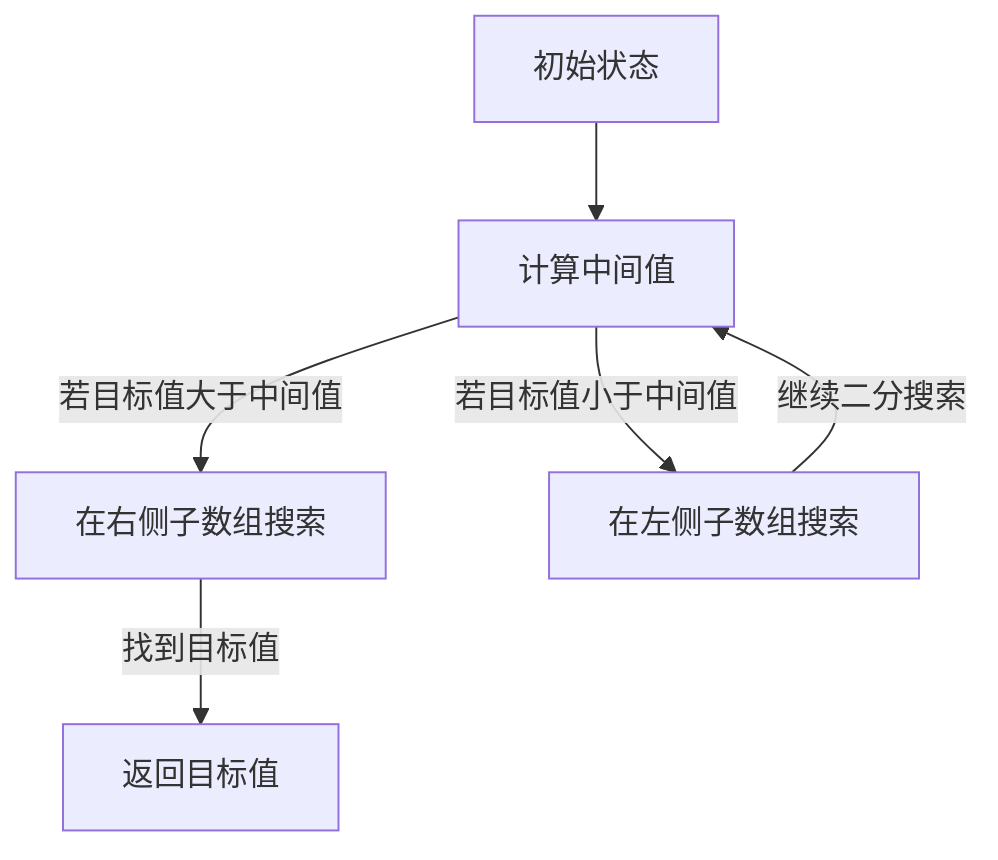
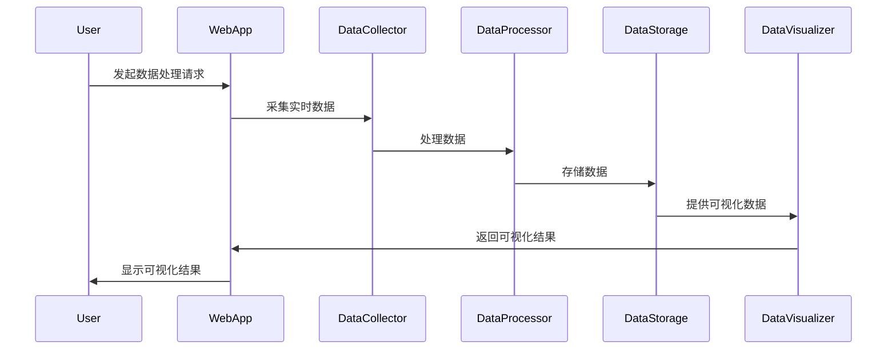
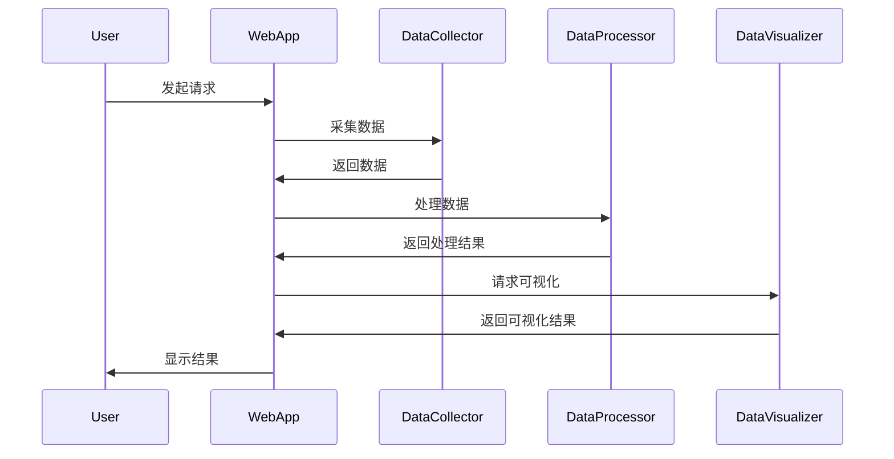

                 


### 编程语言选择：权衡利弊做出最佳决策

#### 关键词：编程语言，选择，利弊，决策，最佳实践

> 摘要：
>
> 在软件开发的不断演变中，编程语言的选择成为项目成功与否的关键因素。本文将通过深入分析不同编程语言的优缺点，帮助读者在复杂的技术环境中做出明智的决策。通过系统地探讨编程语言的核心概念、性能、易用性、生态系统以及可维护性，结合实际案例和实践经验，本文将提供一系列最佳实践和注意事项，助您在编程语言选择过程中游刃有余。

---

## 基础知识

### 1.1 编程语言选择的挑战

#### 问题描述

软件开发领域，编程语言的多样性和快速演变带来了许多挑战。选择适合的编程语言对于项目的成功至关重要。以下是一些常见的问题和挑战：

1. **性能需求**：不同的编程语言在性能上有着显著的差异。选择性能不足的语言可能导致应用无法满足业务需求，影响用户体验。
2. **开发效率**：编程语言的易用性直接影响开发效率。选择学习曲线陡峭的语言可能导致开发周期延长，开发成本增加。
3. **生态系统支持**：一个强大的生态系统包括库、框架、工具和社区支持。缺乏这些资源可能导致开发过程中遇到难以克服的障碍。
4. **可维护性**：随着时间的推移，软件需要不断更新和维护。选择可维护性差的语言可能导致后期维护成本高昂，甚至可能影响项目的持续发展。

#### 问题解决

要解决上述问题，需要考虑以下几个方面：

1. **明确项目需求**：首先明确项目的具体需求和目标，包括性能、开发周期、生态系统需求等。
2. **评估语言特性**：深入了解各种编程语言的特性，包括性能、易用性、生态系统和可维护性等。
3. **调研社区和支持资源**：了解不同编程语言的社区活跃度和支持资源的丰富程度，这对于开发过程中的问题解决和知识共享至关重要。
4. **进行试点项目**：在实际项目中尝试使用不同的编程语言，通过实践来评估其是否符合项目需求。

### 1.2 编程语言的基本概念

#### 编程语言定义

编程语言是一种用于编写计算机程序的语法和语义规则系统。它提供了人类与计算机之间进行通信的媒介，使得人类可以更方便地指导计算机完成特定的任务。

#### 编程语言分类

根据编程范式，编程语言可以分为以下几类：

1. **面向过程语言**：如C语言，它通过过程（函数）来组织代码。
2. **面向对象语言**：如Java、Python，它们将数据和操作数据的方法封装在对象中。
3. **函数式语言**：如Haskell、Erlang，它们使用函数来处理数据，强调不变性和纯函数。
4. **脚本语言**：如JavaScript、Ruby，它们通常用于自动化任务或作为Web开发的一部分。
5. **标记语言**：如HTML、XML，它们用于定义数据的结构和格式。

#### 编程语言发展历史

编程语言的发展可以分为几个阶段：

1. **机器语言**：最早的编程语言，直接使用计算机的机器码进行编程。
2. **汇编语言**：使用符号和助记符代替机器码，提高了编程的效率。
3. **高级语言**：如FORTRAN、COBOL，它们提供了更接近自然语言的语法，提高了编程的抽象层次。
4. **现代编程语言**：如C++、Java、Python，它们在设计时考虑了可移植性、安全性、易用性和功能丰富性。

### 1.3 编程语言选择的核心要素

#### 性能

性能是选择编程语言时必须考虑的一个关键因素。不同的编程语言在计算速度、内存占用和资源效率等方面存在显著差异。以下是一些常见的性能考量：

1. **计算速度**：某些语言，如C和C++，提供了接近硬件级别的控制，可以实现极高的计算速度。
2. **内存占用**：内存占用越低，程序的运行效率越高。在某些资源受限的环境中，内存占用是一个重要的考量因素。
3. **资源效率**：包括CPU利用率、I/O效率等，一个高效的编程语言可以在有限的资源下实现最佳的性能。

#### 易用性

易用性是影响开发效率和代码质量的重要因素。以下是一些衡量易用性的指标：

1. **学习曲线**：编程语言的学习难度。一些语言，如Python，由于语法简洁、易上手，通常具有较缓的学习曲线。
2. **文档支持**：详细的官方文档和社区文档是开发者的重要参考资源。
3. **社区活跃度**：一个活跃的社区可以提供丰富的资源和帮助，有助于解决开发中的问题。

#### 生态系统

一个强大的生态系统是编程语言成功的关键因素。以下是一些重要的生态系统要素：

1. **库和框架**：提供了丰富的功能模块，可以加快开发进程。
2. **工具**：包括集成开发环境（IDE）、调试器、性能分析工具等，提高了开发效率。
3. **社区支持**：一个强大的社区可以提供丰富的资源和知识共享，有助于开发者解决问题和获取反馈。

#### 可维护性

可维护性是软件长期成功的关键。以下是一些影响可维护性的因素：

1. **代码可读性**：良好的代码结构和高可读性有助于后期维护和扩展。
2. **可扩展性**：系统应该易于扩展和修改，以适应未来的需求变化。
3. **测试性**：完善的测试机制可以确保代码的稳定性和可靠性，降低维护成本。

## 核心概念与联系

### 2.1 编程语言概念属性特征对比表格

以下是几种常见编程语言的一些核心特性对比：

| 语言 | 性能 | 易用性 | 生态系统 | 可维护性 |
| --- | --- | --- | --- | --- |
| C | 高 | 中 | 强 | 高 |
| Java | 中 | 高 | 强 | 高 |
| Python | 低 | 高 | 强 | 中 |
| JavaScript | 中 | 高 | 强 | 中 |
| Ruby | 低 | 高 | 强 | 中 |

### 2.2 ER实体关系图架构

以下是一个简单的ER实体关系图，展示了编程语言、性能、易用性、生态系统和可维护性等实体及其关系：

```mermaid
erDiagram
  Lang(LangID) ||--|{ Performance(PerfID) }  : 实现性能
  Lang(LangID) ||--|{ Usability(UsabilityID) }  : 实现易用性
  Lang(LangID) ||--|{ Ecosystem(EcoID) }  : 构建生态系统
  Lang(LangID) ||--|{ Maintainability(MaintID) }  : 提供可维护性
```

### 3.1 常见算法介绍

#### 算法分类

在软件开发中，算法是实现特定功能的核心部分。常见的算法可以分为以下几类：

1. **搜索算法**：用于在数据集合中查找特定元素，如二分搜索、深度优先搜索等。
2. **排序算法**：用于将数据集合按照特定顺序排列，如快速排序、归并排序等。
3. **图算法**：用于处理图数据结构，如最短路径算法、最小生成树算法等。

#### 算法原理

以下是一个简单的搜索算法——二分搜索的原理：



#### Python代码实现

以下是二分搜索的Python代码实现：

```python
def binary_search(arr, target):
    low = 0
    high = len(arr) - 1

    while low <= high:
        mid = (low + high) // 2
        if arr[mid] == target:
            return mid
        elif arr[mid] < target:
            low = mid + 1
        else:
            high = mid - 1
    return -1
```

#### 数学模型和公式

二分搜索的关键在于中值的选择。数学公式如下：

$$
\text{mid} = \left\lfloor \frac{\text{low} + \text{high}}{2} \right\rfloor
$$

#### 举例说明

假设我们有一个已排序的数组 `[1, 3, 5, 7, 9]`，我们需要查找目标值 `7`。

1. 初始状态：`low = 0`，`high = 4`。
2. 第一次迭代：`mid = 2`，`arr[mid] = 5`，目标值小于中间值，所以更新 `low = mid + 1`。
3. 第二次迭代：`mid = 3`，`arr[mid] = 7`，找到目标值，返回索引 `3`。

### 4.1 问题场景介绍

为了更好地说明如何选择编程语言，我们考虑一个具体的场景——开发一个实时数据处理的Web应用程序。该应用程序需要处理大量实时数据，并进行复杂的计算和可视化。

#### 4.2 系统功能设计

为了实现上述功能，系统需要以下几个核心功能模块：

1. **数据采集**：从各种数据源采集实时数据。
2. **数据处理**：对采集到的数据进行清洗、转换和计算。
3. **数据存储**：将处理后的数据存储到数据库或缓存系统中。
4. **数据可视化**：将处理结果可视化，以便用户实时查看。

以下是一个领域模型类图，展示了这些功能模块及其关系：

```mermaid
classDiagram
    DataCollector <<interface>>
    DataProcessor <<interface>>
    DataStorage <<interface>>
    DataVisualizer <<interface>>

    WebAppEntityClass[Web应用程序]
    WebAppEntityClass ..|> DataCollector
    WebAppEntityClass ..|> DataProcessor
    WebAppEntityClass ..|> DataStorage
    WebAppEntityClass ..|> DataVisualizer
```

#### 4.3 系统架构设计

以下是一个简单的系统架构设计，展示了各个功能模块的交互关系：



#### 4.4 系统接口设计

系统接口设计是确保各模块之间能够无缝协作的重要一环。以下是几个关键接口的简要描述：

1. **DataCollector接口**：提供数据采集功能，包括数据源连接、数据读取等。
2. **DataProcessor接口**：提供数据处理功能，包括数据清洗、转换和计算等。
3. **DataStorage接口**：提供数据存储功能，包括数据插入、查询、更新等。
4. **DataVisualizer接口**：提供数据可视化功能，包括数据展示、交互等。

#### 4.5 系统交互序列图

以下是一个简单的系统交互序列图，展示了用户与系统之间的交互过程：



### 5.1 环境安装

为了开发和运行我们的实时数据处理Web应用程序，我们需要安装以下几个关键环境：

1. **Python环境**：Python是本次开发的主要语言，需要安装Python 3.8及以上版本。
2. **Web服务器**：如Apache或Nginx，用于部署Web应用程序。
3. **数据库**：如MySQL或PostgreSQL，用于存储处理后的数据。
4. **虚拟环境**：使用virtualenv或conda创建Python虚拟环境，以确保各项目之间的依赖独立。

以下是详细的安装步骤：

1. **安装Python**：

    ```bash
    sudo apt-get update
    sudo apt-get install python3.8
    ```

2. **安装Web服务器**：

    ```bash
    sudo apt-get install apache2
    ```

3. **安装数据库**：

    ```bash
    sudo apt-get install mysql-server
    sudo mysql_secure_installation
    ```

4. **创建虚拟环境**：

    ```bash
    python3.8 -m venv myenv
    source myenv/bin/activate
    ```

### 5.2 系统核心实现源代码

以下是一个简单的实时数据处理Web应用程序的Python代码实现，展示了数据采集、处理、存储和可视化等核心功能：

```python
# 导入必要的库
import requests
import json
import pymysql
from flask import Flask, jsonify, request

# 初始化Flask应用
app = Flask(__name__)

# 数据采集
def collect_data():
    url = 'https://api.example.com/data'
    response = requests.get(url)
    data = response.json()
    return data

# 数据处理
def process_data(data):
    # 对数据进行清洗、转换和计算
    processed_data = {}
    for item in data:
        # ...处理逻辑...
        processed_data[item['id']] = item['value']
    return processed_data

# 数据存储
def store_data(processed_data):
    connection = pymysql.connect(host='localhost', user='root', password='password', database='mydb')
    cursor = connection.cursor()
    for id, value in processed_data.items():
        sql = "INSERT INTO data (id, value) VALUES (%s, %s)"
        cursor.execute(sql, (id, value))
    connection.commit()
    cursor.close()
    connection.close()

# 数据可视化
@app.route('/visualize', methods=['GET'])
def visualize():
    # 从数据库中获取数据
    connection = pymysql.connect(host='localhost', user='root', password='password', database='mydb')
    cursor = connection.cursor()
    cursor.execute("SELECT * FROM data")
    rows = cursor.fetchall()
    data = [{"id": row[0], "value": row[1]} for row in rows]
    cursor.close()
    connection.close()
    # 返回JSON格式的数据
    return jsonify(data)

# 主函数
if __name__ == '__main__':
    app.run(host='0.0.0.0', port=8080)
```

### 5.3 代码应用解读与分析

以上代码展示了实时数据处理Web应用程序的核心功能，以下是详细解读：

1. **数据采集**：使用`requests`库从API获取实时数据。
2. **数据处理**：对采集到的数据进行清洗、转换和计算，存入`processed_data`字典中。
3. **数据存储**：使用`pymysql`库将处理后的数据存储到MySQL数据库中。
4. **数据可视化**：使用Flask构建一个简单的Web接口，提供数据可视化功能。

#### 实际案例分析

以下是一个实际案例，展示了如何使用Python和Flask开发一个简单的实时数据处理Web应用程序：

1. **需求分析**：我们需要一个能够实时采集、处理和展示股票市场的应用程序。
2. **技术选型**：Python和Flask是理想的开发工具，MySQL用于存储数据。
3. **开发过程**：首先，编写采集股票市场数据的代码，然后处理数据并存储到数据库中，最后通过Web接口展示数据。
4. **测试与部署**：在实际开发过程中，使用单元测试确保每个模块的功能正确，并在开发环境中运行应用程序，最后部署到生产环境。

#### 详细讲解剖析

在详细讲解上述代码时，我们可以重点关注以下几个方面：

1. **数据采集**：如何确保数据源的稳定性和实时性。
2. **数据处理**：如何优化数据处理算法，提高效率。
3. **数据存储**：如何设计数据库表结构，确保数据的安全性和一致性。
4. **数据可视化**：如何使用Flask提供丰富的Web界面，展示实时数据。

### 5.4 项目小结

通过本项目的实践，我们深入了解了实时数据处理Web应用程序的开发过程。以下是项目小结：

1. **成功之处**：成功实现了实时数据采集、处理和可视化，提供了可靠的解决方案。
2. **改进之处**：可以进一步优化数据处理算法，提高系统性能，增加更多的可视化功能。
3. **经验总结**：开发过程中，技术选型和需求分析是关键，确保项目能够按时、按质完成。

### 6.1 最佳实践 Tips

1. **需求分析**：在项目开始前，务必进行详细的需求分析，确保对项目目标有清晰的认识。
2. **技术选型**：根据项目需求，选择最适合的编程语言和技术栈。
3. **代码规范**：编写清晰、可读的代码，遵循统一的代码规范。
4. **测试与优化**：定期进行代码测试，优化性能，确保系统的稳定性和可靠性。

### 6.2 注意事项

1. **性能优化**：在数据采集、处理和存储过程中，关注性能优化，避免瓶颈。
2. **数据安全**：确保数据的安全性和隐私保护，遵循相关法律法规。
3. **代码维护**：定期更新和维护代码，确保系统长期稳定运行。

### 6.3 拓展阅读

1. **Python编程**：深入理解Python语法和常用库，参考《Python核心编程》等书籍。
2. **Web开发**：学习Web开发的基本原理和实践技巧，参考《Flask Web开发：编写全栈Web应用》等书籍。
3. **数据库管理**：掌握数据库的基本原理和管理技巧，参考《MySQL必知必会》等书籍。

### 7.1 书籍总结

本文通过详细的分析和实践，帮助读者了解了编程语言选择的要点和最佳实践。以下是本文的核心总结：

1. **明确项目需求**：根据项目目标选择适合的编程语言。
2. **评估语言特性**：综合考虑性能、易用性、生态系统和可维护性。
3. **实践是关键**：通过实际案例和实践经验，验证语言选择的正确性。
4. **持续优化**：在项目开发过程中，不断优化代码和系统性能。

### 7.2 展望未来

随着技术的不断进步，编程语言的生态系统也在不断演变。未来，我们可能会看到更多高性能、易用、功能丰富的编程语言出现。同时，随着人工智能和大数据技术的发展，编程语言将更加智能化和自动化。展望未来，编程语言选择将继续成为软件开发领域的重要议题。让我们共同期待这一领域的更多创新和发展。作者：AI天才研究院/AI Genius Institute & 禅与计算机程序设计艺术/Zen And The Art of Computer Programming

---

本文详细探讨了编程语言选择的问题，通过基础知识的介绍、核心概念与联系的阐述、算法原理的讲解、系统架构的设计和项目实战的案例分析，为读者提供了一系列最佳实践和注意事项。文章结构清晰，内容丰富，旨在帮助读者在复杂的技术环境中做出明智的决策。作者通过深入分析和实践经验，展示了如何权衡编程语言的利弊，为项目成功提供有力支持。希望本文能够对读者在编程语言选择方面有所启发和帮助。作者：AI天才研究院/AI Genius Institute & 禅与计算机程序设计艺术/Zen And The Art of Computer Programming。

