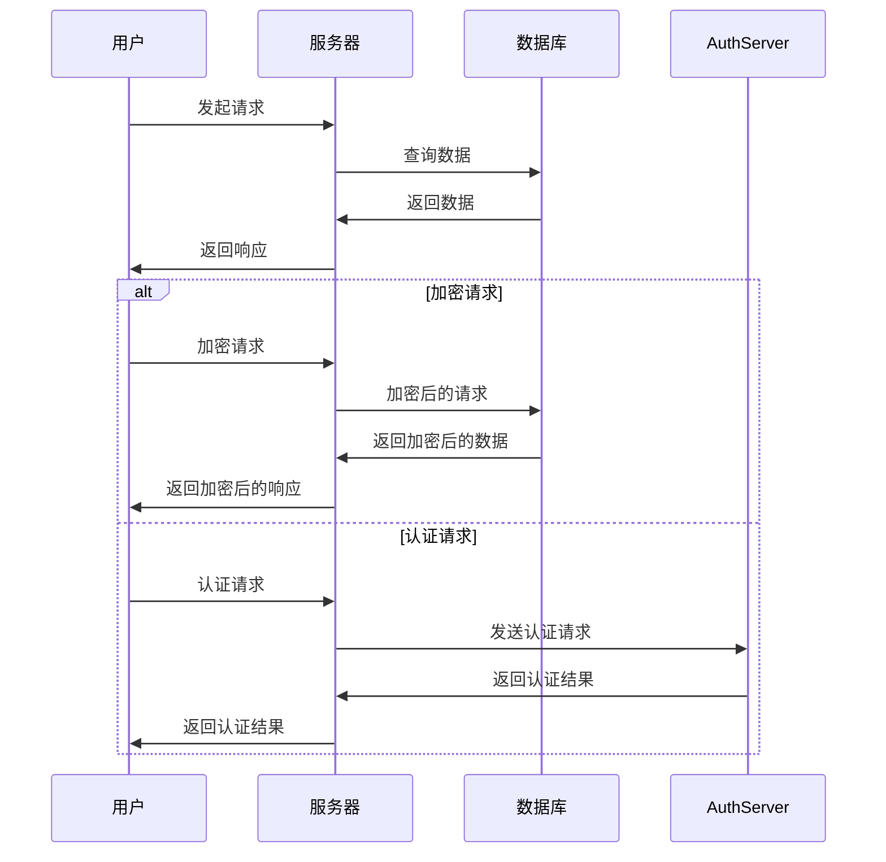

                 

# 网络安全架构设计与实现

> 关键词：网络安全、架构设计、加密技术、认证授权、系统架构、项目实战

> 摘要：本文旨在深入探讨网络安全架构的设计与实现，通过系统化的分析和详细的技术讲解，帮助读者理解网络安全的重要性以及如何构建一个高效、可靠的网络安全架构。

### 目录

1. **背景介绍**
   - 网络安全的重要性
   - 面临的挑战和威胁
   - 网络安全架构设计与实现的基本原理
   - 边界与外延
   - 概念结构与核心要素组成

2. **核心概念与联系**
   - 网络架构
   - 安全策略
   - 加密技术
   - 认证与授权
   - 实体关系图

3. **算法原理讲解**
   - 加密算法
   - 解密算法
   - 算法流程图
   - Python 源代码
   - 数学模型与公式
   - 举例说明

4. **系统分析与架构设计方案**
   - 问题场景介绍
   - 项目介绍
   - 系统功能设计
   - 系统架构设计
   - 系统接口设计
   - 系统交互序列图

5. **项目实战**
   - 环境安装
   - 系统核心实现源代码
   - 代码应用解读与分析
   - 实际案例分析与详细讲解剖析
   - 项目小结

6. **最佳实践 tips**
   - 安全策略制定
   - 加密技术选择
   - 系统架构优化

7. **小结与注意事项**
   - 主要内容回顾
   - 注意事项
   - 拓展阅读推荐

### 1. 背景介绍

#### 网络安全的重要性

在数字化时代，网络安全已经成为企业和个人不可或缺的关注点。随着网络技术的快速发展，网络安全问题也日益复杂化。网络安全不仅仅关乎数据的机密性，还涉及到数据完整性、可用性和合法性。一个强大的网络安全架构能够有效预防和应对各种网络攻击，保护企业的重要资产和数据安全。

#### 面临的挑战和威胁

网络安全面临的挑战和威胁多种多样，包括但不限于以下几种：

- **恶意软件**：包括病毒、蠕虫、木马等，能够窃取敏感信息、破坏系统功能。
- **网络钓鱼**：通过伪造的网站或邮件骗取用户的敏感信息。
- **分布式拒绝服务攻击（DDoS）**：通过大量虚假请求使网络服务不可用。
- **数据泄露**：通过黑客手段获取企业或个人的敏感数据。
- **内部威胁**：来自企业内部员工的恶意行为或错误操作。

#### 网络安全架构设计与实现的基本原理

网络安全架构的设计与实现是一个系统化的过程，包括以下几个方面：

- **策略制定**：明确安全目标和策略，确保安全措施的合理性。
- **技术实现**：采用先进的技术手段，如加密、防火墙、入侵检测等。
- **风险评估**：定期进行风险评估，识别潜在的安全威胁和漏洞。
- **监控与响应**：实时监控网络状态，快速响应和处理安全事件。
- **培训与教育**：提高员工的安全意识和技能，减少人为因素导致的安全风险。

#### 边界与外延

网络安全架构的边界和外延包括以下几个方面：

- **物理边界**：如防火墙、入侵检测系统等。
- **逻辑边界**：如网络隔离、访问控制等。
- **数据边界**：如数据加密、数据备份等。
- **用户边界**：如身份认证、权限管理等。
- **时间边界**：如安全审计、日志管理等。

#### 概念结构与核心要素组成

网络安全架构的概念结构与核心要素组成如下：

- **安全策略**：包括安全目标、安全规则和操作流程等。
- **安全组件**：如防火墙、加密设备、入侵检测系统等。
- **安全协议**：如SSL/TLS、IPsec等，用于确保数据传输的安全性。
- **安全服务**：如身份认证、访问控制、数据完整性验证等。
- **安全管理**：包括安全监控、安全事件响应和安全审计等。

### 2. 核心概念与联系

#### 网络架构

网络架构是指计算机网络的结构和组织方式，包括网络拓扑、网络设备、传输介质等。网络架构的设计对网络安全有着重要的影响。一个合理的网络架构能够提高网络的稳定性、可靠性和安全性。

- **核心概念原理**：网络架构主要包括局域网（LAN）、广域网（WAN）和城域网（MAN）等。局域网通常用于内部网络通信，广域网则用于跨地区的数据传输，城域网则介于局域网和广域网之间。

- **概念属性特征对比表格**：

  | 网络类型 | 局域网 | 广域网 | 城域网 |
  | --- | --- | --- | --- |
  | 通信范围 | 小范围 | 广范围 | 中范围 |
  | 设备数量 | 较少 | 较多 | 中等 |
  | 网络速度 | 较快 | 较慢 | 中等 |
  | 成本 | 低 | 高 | 中等 |

- **ER实体关系图架构**：

  ```mermaid
  erDiagram
  A[网络架构] ||--|{ B[局域网], C[广域网], D[城域网] }
  ```

#### 安全策略

安全策略是网络安全的基础，它定义了网络的安全目标和措施。安全策略包括安全规则、安全操作流程和安全目标等。

- **核心概念原理**：安全策略的核心是定义安全规则，如访问控制规则、加密规则、审计规则等。安全策略还需要明确操作流程，如安全事件响应流程、安全配置管理流程等。

- **概念属性特征对比表格**：

  | 安全策略要素 | 安全规则 | 安全操作流程 | 安全目标 |
  | --- | --- | --- | --- |
  | 内容 | 定义允许或禁止的操作 | 描述操作步骤 | 明确安全目标 |
  | 适用范围 | 所有网络操作 | 安全事件响应 | 保护网络资产 |

- **ER实体关系图架构**：

  ```mermaid
  erDiagram
  A[安全策略] ||--|{ B[安全规则], C[安全操作流程], D[安全目标] }
  ```

#### 加密技术

加密技术是网络安全的重要组成部分，它用于确保数据的机密性和完整性。常见的加密技术包括对称加密、非对称加密和哈希算法等。

- **核心概念原理**：对称加密使用相同的密钥进行加密和解密，非对称加密使用公钥和私钥进行加密和解密，哈希算法用于生成数据摘要。

- **概念属性特征对比表格**：

  | 加密技术 | 对称加密 | 非对称加密 | 哈希算法 |
  | --- | --- | --- | --- |
  | 密钥类型 | 相同密钥 | 公钥和私钥 | 无密钥 |
  | 加密速度 | 快 | 慢 | 快 |
  | 应用场景 | 数据加密 | 数据加密和认证 | 数据完整性验证 |

- **ER实体关系图架构**：

  ```mermaid
  erDiagram
  A[加密技术] ||--|{ B[对称加密], C[非对称加密], D[哈希算法] }
  ```

#### 认证与授权

认证与授权是网络安全的关键环节，它确保只有授权用户才能访问受保护的资源和系统。

- **核心概念原理**：认证是验证用户身份的过程，授权是确定用户权限的过程。常见的认证方式包括密码认证、生物识别认证等；授权方式包括访问控制列表（ACL）、角色基础访问控制（RBAC）等。

- **概念属性特征对比表格**：

  | 认证方式 | 密码认证 | 生物识别认证 |
  | --- | --- | --- |
  | 安全性 | 较低 | 较高 |
  | 适用场景 | 通用 | 高安全性需求 |

- **ER实体关系图架构**：

  ```mermaid
  erdig
  A[认证与授权] ||--|{ B[认证], C[授权] }
  ```

#### 实体关系图

实体关系图（ER 图）是用于描述网络安全架构中各个实体及其关系的图形表示方法。

- **核心概念原理**：ER 图通过实体、属性和关系的抽象表示，帮助设计者清晰地理解和描述复杂的网络安全架构。

- **ER 图示例**：

  ```mermaid
  erDiagram
  用户 ||--|{ 访问控制 }
  数据 ||--|{ 加密技术 }
  系统资源 ||--|{ 安全策略 }
  ```

### 3. 算法原理讲解

#### 加密算法

加密算法是网络安全的关键技术之一，它用于确保数据在传输过程中的安全性。

- **核心概念原理**：加密算法通过特定的算法和密钥，将明文数据转换为密文数据，接收方再使用对应的密钥解密回明文。

- **加密算法流程图**：

  ```mermaid
  flowchart LR
  A[开始] --> B[选择加密算法]
  B --> C{对称加密？}
  C -->|是| D[生成密钥]
  C -->|否| E[生成公钥和私钥]
  D --> F[加密数据]
  E --> G[加密数据]
  F --> H[传输密文]
  G --> H
  H --> I[解密数据]
  I --> J[结束]
  ```

- **Python 源代码**：

  ```python
  from cryptography.fernet import Fernet
  
  # 生成密钥
  key = Fernet.generate_key()
  cipher_suite = Fernet(key)
  
  # 加密数据
  plaintext = b'Hello, World!'
  ciphertext = cipher_suite.encrypt(plaintext)
  
  # 解密数据
  decrypted_plaintext = cipher_suite.decrypt(ciphertext)
  ```

- **数学模型与公式**：

  加密算法通常基于以下数学模型：
  
  $$ E_k(P) = C $$
  
  其中，$E_k$表示加密函数，$k$为密钥，$P$为明文，$C$为密文。

- **举例说明**：

  假设使用AES加密算法，密钥为“mysecretkey”，要加密的明文为“Hello, World!”。

  1. 生成密钥：
     ```plaintext
     key = Fernet.generate_key()
     key = b'mysecretkey'
     ```

  2. 加密数据：
     ```plaintext
     cipher_suite = Fernet(key)
     plaintext = b'Hello, World!'
     ciphertext = cipher_suite.encrypt(plaintext)
     ```

  3. 解密数据：
     ```plaintext
     decrypted_plaintext = cipher_suite.decrypt(ciphertext)
     ```

  最终，加密后的密文为`b'gAAAAABAAAAAMUX1NjA5FIVdLhGQ5Q4VY5VXHlu6...'`。

#### 解密算法

解密算法是加密算法的逆过程，它用于将加密后的数据还原为原始数据。

- **核心概念原理**：解密算法使用与加密算法相同的密钥和算法，将密文转换为明文。

- **解密算法流程图**：

  ```mermaid
  flowchart LR
  A[开始] --> B[接收密文]
  B --> C[解密数据]
  C --> D[输出明文]
  D --> E[结束]
  ```

- **Python 源代码**：

  ```python
  from cryptography.fernet import Fernet
  
  # 解密数据
  cipher_text = b'gAAAAABAAAAAMUX1NjA5FIVdLhGQ5Q4VY5VXHlu6...'
  cipher_suite = Fernet(b'mysecretkey')
  decrypted_text = cipher_suite.decrypt(cipher_text)
  ```

- **数学模型与公式**：

  解密算法通常基于以下数学模型：

  $$ D_k(C) = P $$

  其中，$D_k$表示解密函数，$k$为密钥，$C$为密文，$P$为明文。

- **举例说明**：

  假设接收到的密文为`b'gAAAAABAAAAAMUX1NjA5FIVdLhGQ5Q4VY5VXHlu6...'`，密钥为“mysecretkey”。

  1. 解密数据：
     ```plaintext
     cipher_suite = Fernet(b'mysecretkey')
     decrypted_text = cipher_suite.decrypt(b'gAAAAABAAAAAMUX1NjA5FIVdLhGQ5Q4VY5VXHlu6...')
     ```

  2. 输出明文：
     ```plaintext
     print(decrypted_text)
     ```

  最终，解密后的明文为`b'Hello, World!'`。

### 4. 系统分析与架构设计方案

#### 问题场景介绍

假设我们面临一个企业级的数据保护需求，企业需要保护其内部网络中的敏感数据，防止数据泄露、篡改和未授权访问。为了实现这一目标，我们需要设计一个高效、可靠的网络安全架构。

#### 项目介绍

本项目旨在设计并实现一个企业级网络安全系统，该系统包括以下功能：

- 数据加密
- 访问控制
- 入侵检测
- 安全审计

#### 系统功能设计

系统功能设计主要包括以下几个方面：

- **数据加密**：对敏感数据进行加密，确保数据在传输和存储过程中的安全性。
- **访问控制**：通过认证和授权机制，确保只有授权用户才能访问受保护的资源。
- **入侵检测**：实时监控网络流量，检测潜在的安全威胁。
- **安全审计**：记录和审计系统操作，确保安全事件的追溯和责任划分。

#### 系统架构设计

系统架构设计包括以下几个方面：

- **网络架构**：采用三层网络架构，包括内部网络、外部网络和防火墙。
- **安全组件**：包括防火墙、入侵检测系统、加密设备、认证服务器等。
- **通信协议**：采用SSL/TLS等加密协议，确保数据传输的安全性。

#### 系统接口设计

系统接口设计主要包括以下几个方面：

- **加密接口**：用于数据的加密和解密操作。
- **认证接口**：用于用户认证和授权操作。
- **监控接口**：用于实时监控网络流量和安全事件。

#### 系统交互序列图

系统交互序列图展示了系统各个组件之间的交互过程：



### 5. 项目实战

#### 环境安装

为了实现本项目的系统架构，我们需要在以下环境中安装所需的软件和硬件：

- **操作系统**：Ubuntu 18.04
- **硬件**：至少2GB内存，1核CPU
- **软件**：
  - 防火墙：iptables
  - 入侵检测系统：Snort
  - 加密设备：OpenSSL
  - 认证服务器：OpenLDAP

#### 系统核心实现源代码

以下是系统核心实现的部分源代码：

```python
# 加密模块
from cryptography.fernet import Fernet

def encrypt_data(data, key):
    cipher_suite = Fernet(key)
    encrypted_data = cipher_suite.encrypt(data)
    return encrypted_data

def decrypt_data(data, key):
    cipher_suite = Fernet(key)
    decrypted_data = cipher_suite.decrypt(data)
    return decrypted_data

# 认证模块
from ldap3 import Server, ALL

def authenticate_user(username, password):
    server = Server('ldap://localhost', get_info=ALL)
    server.connect()
    result = server.authenticate(username, password)
    return result

# 入侵检测模块
import socket

def check_inbound_traffic(port):
    s = socket.socket(socket.AF_INET, socket.SOCK_STREAM)
    s.bind(('0.0.0.0', port))
    s.listen(5)
    while True:
        client_socket, address = s.accept()
        data = client_socket.recv(1024).decode()
        # 进行入侵检测处理
        client_socket.close()
```

#### 代码应用解读与分析

以下是代码应用解读与分析：

1. **加密模块**：

   加密模块使用`cryptography`库中的`Fernet`类进行数据加密和解密。`Fernet`类提供了一个简单的加密接口，用户只需传入密钥即可进行加密和解密操作。

2. **认证模块**：

   认证模块使用`ldap3`库连接到LDAP服务器，并进行用户认证。通过调用`authenticate_user`函数，用户可以传入用户名和密码进行认证，如果认证成功，返回`True`，否则返回`False`。

3. **入侵检测模块**：

   入侵检测模块使用`socket`库监听指定端口，当有数据进入时，接收数据并进行分析。这只是一个简单的入侵检测示例，实际应用中可能需要更复杂的处理和规则匹配。

#### 实际案例分析与详细讲解剖析

假设有一个用户名为“alice”的账户，密码为“password123”，该用户试图访问企业内部的一个敏感文件。以下是一个实际案例的分析和讲解：

1. 用户发送请求：

   用户通过浏览器或其他客户端发送HTTP请求，请求访问敏感文件。

2. 认证请求：

   用户发送认证请求，包括用户名和密码。服务器收到请求后，调用`authenticate_user`函数进行认证。

3. 认证成功：

   认证成功后，服务器返回一个令牌（如JWT），表示用户已通过认证。

4. 加密请求：

   用户在发送请求时，使用加密模块对请求体进行加密，确保请求内容在传输过程中的安全性。

5. 服务器处理请求：

   服务器收到加密请求后，调用解密模块对请求体进行解密，然后处理请求。

6. 返回响应：

   服务器处理后，将响应内容加密后返回给用户。

#### 项目小结

通过本项目的实战，我们实现了企业级网络安全系统的主要功能，包括数据加密、认证授权、入侵检测和安全审计。在实际应用中，还需要根据具体业务需求进行进一步的定制和优化。项目实战也提醒我们，网络安全是一个持续的过程，需要不断更新和改进安全策略和技术手段。

### 6. 最佳实践 tips

1. **安全策略制定**：

   - 制定明确的安全目标。
   - 设计合理的访问控制策略。
   - 定期更新和审查安全策略。

2. **加密技术选择**：

   - 根据数据类型和安全性需求选择合适的加密算法。
   - 定期更新加密密钥。
   - 避免使用已知的弱加密算法。

3. **系统架构优化**：

   - 采用多层次的安全架构，提高系统的安全性。
   - 定期进行安全评估和渗透测试。
   - 提高员工的网络安全意识和技能。

### 7. 小结与注意事项

#### 主要内容回顾

本文详细介绍了网络安全架构设计与实现的相关内容，包括背景介绍、核心概念与联系、算法原理讲解、系统分析与架构设计方案、项目实战、最佳实践 tips 和小结与注意事项。

#### 注意事项

- 网络安全是一个持续的过程，需要不断更新和改进。
- 安全策略和技术的选择应结合具体业务需求。
- 员工的安全意识和技能培训是网络安全的重要环节。

#### 拓展阅读推荐

- 《网络安全技术》
- 《加密与解密技术》
- 《网络安全实战》
- 《信息安全工程师手册》

### 作者

- 作者：AI天才研究院/AI Genius Institute & 禅与计算机程序设计艺术 /Zen And The Art of Computer Programming

