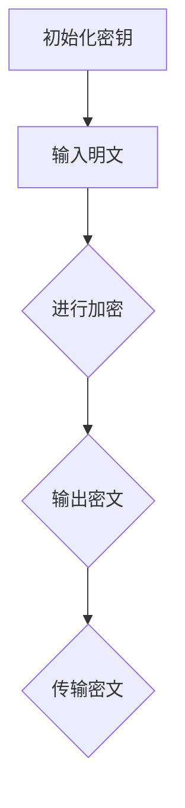
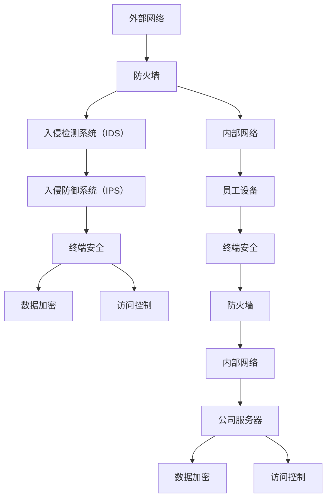
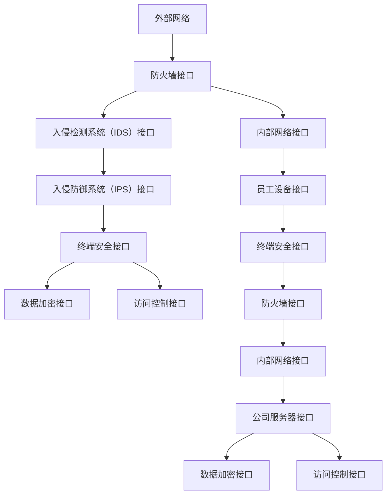
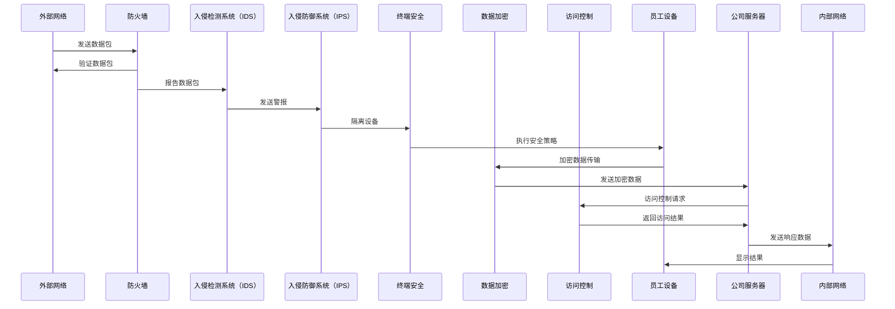

                 

### 文章标题

# 网络安全：构建纵深防御的安全架构

关键词：网络安全、纵深防御、安全架构、核心概念、算法原理、数学模型

摘要：随着数字化时代的到来，网络安全问题日益严峻。本文旨在探讨如何构建一个高效、全面的网络安全架构，以实现纵深防御。通过深入分析网络安全的核心概念、算法原理以及数学模型，并结合实际项目案例，本文为读者提供了一套切实可行的网络安全解决方案。

### 目录大纲设计思路

为了确保文章的逻辑清晰、内容丰富且结构紧凑，本文的目录大纲设计遵循以下思路：

1. **总体框架**：将全文分为五大主题部分，每个部分包含若干章节，整体框架旨在让读者对网络安全架构有一个全面的认识。

2. **核心章节设计**：核心章节涵盖背景介绍、核心概念与联系、算法原理讲解、数学模型与公式、系统分析与架构设计方案、项目实战以及最佳实践 tips。

3. **章节细化**：每个章节内部细分为子章节，每个子章节专注于一个具体的问题或概念，确保内容的深入与逻辑清晰。

4. **格式规范**：使用 markdown 格式，确保目录层级清晰，方便读者阅读。

5. **内容完整性**：确保每个章节都包含核心内容，尤其是核心概念、算法原理和数学模型。

6. **简洁性**：避免冗余内容，确保每一部分都是必要的。

### 步骤说明

接下来，我们将按照以下步骤详细撰写文章：

1. **编写第1章：背景介绍**：介绍网络安全的现状，面临的挑战和威胁，构建纵深防御的安全架构的基本原则和方法。

2. **编写第2章：核心概念与联系**：详细阐述网络安全中的关键概念，如防火墙、入侵检测系统、加密技术等，并使用 Mermaid 画出 ER 实体关系图架构。

3. **编写第3章：算法原理讲解**：介绍几种常见的网络安全算法原理，使用 Mermaid 画出算法的流程图，并提供 Python 实现代码，讲解数学模型和公式。

4. **编写第4章：数学模型与公式**：介绍网络安全中的常见数学模型，使用 LaTeX 格式给出数学公式，并结合实际案例进行讲解。

5. **编写第5章：系统分析与架构设计方案**：描述构建网络安全架构的具体场景，使用 Mermaid 画出领域模型类图、系统架构图、系统接口设计和系统交互序列图。

6. **编写第6章：项目实战**：介绍如何搭建网络安全环境，提供系统核心实现源代码，并对源代码进行解读和分析，通过实际案例展示系统应用。

7. **编写第7章：最佳实践 tips**：总结全书的主要内容和关键点，提醒注意事项，推荐拓展阅读。

在撰写过程中，我们将确保内容的逻辑性和连贯性，使用简洁明了的语言，确保所有的图表和代码都是正确且清晰的。通过以上步骤，我们将为读者提供一篇全面、深入且具有实践指导意义的网络安全技术博客文章。

### 第1章：背景介绍

#### 1.1 问题背景

网络安全是当今数字化时代最为重要的话题之一。随着互联网和物联网的普及，越来越多的数据和资源在网络上传输和存储，这使得网络安全面临着前所未有的挑战。网络攻击的手段和形式也在不断演变，从传统的病毒、木马到更加复杂的勒索软件、钓鱼攻击、DDoS 攻击等，每一种攻击都对网络系统和个人隐私构成潜在威胁。

#### 1.2 问题描述

网络安全问题的核心在于如何保护网络系统和数据不受恶意攻击。具体来说，网络安全面临以下挑战：

1. **数据泄露**：随着数据量的不断增加，数据泄露的风险也在增加。数据泄露可能导致个人隐私被窃取，企业商业机密被泄露。
2. **网络攻击**：黑客通过各种手段攻击网络系统，如利用漏洞入侵系统、窃取敏感数据、破坏系统服务等。
3. **系统瘫痪**：网络攻击可能导致网络系统瘫痪，影响业务的正常运行。
4. **隐私保护**：在网络环境中，个人隐私保护变得越来越困难。隐私泄露可能导致个人遭受经济损失和社会危害。

#### 1.3 问题解决

为了解决上述网络安全问题，构建一个高效、全面的网络安全架构是关键。这种架构需要实现纵深防御，即在多个层面上保护网络系统。构建纵深防御的安全架构需要遵循以下基本原则：

1. **防御层次多样化**：在网络安全架构中，设置多个防御层次，如边界防护、内部防护、应用防护等，以实现多层次、多维度的防御。
2. **实时监控与响应**：建立实时监控机制，及时发现网络攻击和异常行为，并迅速响应，防止攻击扩大。
3. **安全性与可用性平衡**：在确保网络安全的同时，不能影响系统的可用性和性能。
4. **持续更新与升级**：网络安全威胁不断演变，需要持续更新安全策略、技术和工具，以应对新的威胁。

#### 1.4 边界与外延

本文讨论的网络安全架构主要涵盖以下几个方面：

1. **边界防护**：包括防火墙、入侵检测系统（IDS）、入侵防御系统（IPS）等，用于防止外部攻击。
2. **内部防护**：包括终端安全、文件完整性监控、数据加密等，用于保护内部网络和数据安全。
3. **应用防护**：包括应用安全、身份认证、访问控制等，用于防止恶意应用和非法访问。
4. **安全审计与合规性**：包括日志审计、合规性检查等，用于确保网络安全措施得到有效执行。

本文将深入探讨这些方面，通过具体的案例和实例，展示如何构建一个高效的网络安全架构。

#### 1.5 概念结构与核心要素组成

网络安全架构的核心要素包括：

1. **防御层次**：包括边界防护、内部防护和应用防护等。
2. **监控与响应**：包括实时监控、入侵检测和快速响应机制。
3. **安全策略与合规性**：包括安全策略制定、合规性检查和审计。
4. **加密与身份认证**：包括数据加密、身份认证和访问控制。

这些核心要素相互配合，共同构建一个全面的网络安全架构，以应对各种潜在的网络威胁。

### 第2章：核心概念与联系

#### 2.1 核心概念介绍

网络安全架构中的核心概念包括防火墙、入侵检测系统（IDS）、入侵防御系统（IPS）、加密技术、虚拟专用网（VPN）等。这些概念在网络安全中扮演着重要角色，以下是它们的简要介绍：

1. **防火墙**：防火墙是一种网络安全设备，用于监控和控制进出网络的数据包。通过设置访问控制规则，防火墙可以阻止未授权的访问，保护网络免受外部攻击。
2. **入侵检测系统（IDS）**：入侵检测系统是一种用于检测和响应网络攻击的软件或硬件设备。它通过分析网络流量和系统日志，识别异常行为和潜在攻击。
3. **入侵防御系统（IPS）**：入侵防御系统与入侵检测系统类似，但它不仅检测异常行为，还能自动采取措施阻止攻击。
4. **加密技术**：加密技术通过将数据转换成密文，保护数据在传输过程中的安全性。常见的加密技术包括对称加密、非对称加密和哈希函数。
5. **虚拟专用网（VPN）**：虚拟专用网是一种通过公共网络建立的安全通道，用于在远程位置安全地访问内部网络。

#### 2.2 概念属性特征对比表格

为了更好地理解这些核心概念，下面是一个对比表格：

| 概念       | 属性特征                                                         | 应用场景                     |
|------------|------------------------------------------------------------------|-----------------------------|
| 防火墙     | 监控和控制进出网络的数据包，设置访问控制规则                         | 保护网络边界，阻止未授权访问   |
| 入侵检测系统（IDS） | 分析网络流量和系统日志，识别异常行为和潜在攻击                         | 及时发现网络攻击，提供安全预警 |
| 入侵防御系统（IPS） | 检测异常行为，自动采取措施阻止攻击                                 | 提高网络安全，减少损失       |
| 加密技术     | 将数据转换成密文，保护数据在传输过程中的安全性                         | 确保数据传输安全，防止数据泄露   |
| 虚拟专用网（VPN） | 通过公共网络建立安全通道，确保远程访问内部网络的安全                     | 确保远程访问安全，提高网络灵活性 |

#### 2.3 ER实体关系图架构

为了更直观地展示这些核心概念之间的关系，我们可以使用 Mermaid 画出 ER 实体关系图：

```mermaid
erDiagram
  User ||--o{ Firewall } : "uses"
  User ||--o{ IDS } : "monitors"
  User ||--o{ IPS } : "protects"
  User ||--o{ VPN } : "accesses"
  Firewall ||--o{ Network } : "protects"
  IDS ||--o{ Network } : "monitors"
  IPS ||--o{ Network } : "protects"
  VPN ||--o{ Network } : "connects"
```

在这个 ER 实体关系图中，用户使用防火墙、IDS、IPS 和 VPN，这些设备共同保护网络的安全。防火墙、IDS 和 IPS 分别监控和防护网络，而 VPN 则用于远程访问内部网络。

通过上述核心概念的介绍、对比表格和 ER 实体关系图，我们可以更好地理解网络安全架构中的关键组成部分及其相互关系。在接下来的章节中，我们将进一步探讨这些概念的原理和实现方法。

### 第3章：算法原理讲解

#### 3.1 算法原理介绍

在网络安全领域，算法原理扮演着至关重要的角色。这些算法不仅用于检测和防御网络攻击，还用于加密解密数据、验证身份等。以下是一些常见的网络安全算法原理：

1. **加密算法**：加密算法用于将明文数据转换为密文，以保护数据在传输过程中的安全性。常见的加密算法包括对称加密（如AES、DES）、非对称加密（如RSA、ECC）和哈希函数（如MD5、SHA系列）。
2. **入侵检测算法**：入侵检测算法用于检测网络中的异常行为和潜在攻击。常见的入侵检测算法包括统计模型（如KNN、决策树）、异常检测算法（如孤立森林、局部异常因子）和行为分析算法（如关联规则学习、序列模式挖掘）。
3. **访问控制算法**：访问控制算法用于决定用户对系统资源的访问权限。常见的访问控制算法包括基于角色的访问控制（RBAC）、基于属性的访问控制（ABAC）和基于规则的访问控制（RBRC）。
4. **安全协议**：安全协议用于在通信双方之间建立安全的通信通道。常见的安全协议包括SSL/TLS、IPSec和SSH。

#### 3.2 Mermaid流程图

为了帮助读者更好地理解这些算法原理，我们可以使用 Mermaid 画出对应的流程图。以下是一个简单的加密算法流程图：



这个流程图展示了加密算法的基本步骤：初始化密钥、输入明文、进行加密、输出密文和传输密文。

#### 3.3 Python源代码讲解

为了使读者更直观地理解加密算法的实现，我们将提供一段使用 Python 实现的 AES 加密算法的源代码：

```python
from Crypto.Cipher import AES
from Crypto.Util.Padding import pad
from Crypto.Random import get_random_bytes

# 初始化密钥和IV
key = get_random_bytes(16)
iv = get_random_bytes(16)

# 创建AES加密对象
cipher = AES.new(key, AES.MODE_CBC, iv)

# 待加密的明文
plaintext = b"Hello, World!"

# 进行加密
ciphertext = cipher.encrypt(pad(plaintext, AES.block_size))

# 输出密文和IV
print("Ciphertext:", ciphertext.hex())
print("IV:", iv.hex())
```

这段代码首先初始化密钥和初始向量（IV），然后创建一个 AES 加密对象。接下来，输入待加密的明文，进行加密操作，并将密文和 IV 输出。密文和 IV 将在传输过程中使用，以便接收方能够正确解密数据。

#### 3.4 数学模型和公式

加密算法的核心在于数学模型和公式。以下是一个简单的 AES 加密算法的数学模型：

1. **密钥扩展**：AES 的密钥扩展过程使用 Feistel 网络结构。每个轮次都会使用到一个子密钥，子密钥由密钥和轮数决定。
   $$ SubKey_i = SubBytes(Key_i) \oplus ShiftRows(Key_i) \oplus MixColumns(Key_i) \oplus AddRoundKey(Key_i, Round_i) $$
2. **字节替换（SubBytes）**：使用 S-Box 对每个字节进行替换。S-Box 是一个预定义的查找表。
   $$ Output_{i,j} = S[Input_{i,j}] $$
3. **行移位（ShiftRows）**：对每行的字节进行循环移位。
   $$ Output_{i,j} = \begin{cases} 
   Input_{i,j}, & \text{if } i = 0 \\
   Input_{i, j+1}, & \text{if } i = 1 \\
   Input_{i, j+2}, & \text{if } i = 2 \\
   Input_{i, j+3}, & \text{if } i = 3 
   \end{cases} $$
4. **列混淆（MixColumns）**：对每一列进行线性变换。
   $$ Output_{i,j} = \text{MixColumns}(Input_{i,j}) $$
   MixColumns 的具体实现可以参考 AES 的标准文档。
5. **轮密钥加（AddRoundKey）**：将子密钥与数据按位异或。
   $$ Output_{i,j} = Input_{i,j} \oplus SubKey_i $$

通过上述数学模型和公式，我们可以对 AES 加密算法进行更深入的理解。在实际应用中，这些步骤会重复进行多个轮次，以确保数据的强加密性。

通过本章的讲解，读者可以了解到网络安全算法的基本原理，并通过具体的 Python 实现代码和数学模型公式，对加密算法有一个直观的认识。在接下来的章节中，我们将继续探讨网络安全中的其他算法和实现方法。

#### 3.5 数学模型与公式详细讲解

在网络安全算法中，数学模型和公式是理解算法工作原理的关键。本节将详细讲解几种常用的数学模型和公式，并通过通俗易懂的例子进行说明。

##### 3.5.1 哈希函数

哈希函数是一种将输入数据映射为固定长度输出的函数。在网络安全中，哈希函数常用于数据完整性校验和数字签名。最著名的哈希函数之一是 SHA-256。

**数学模型**：

$$ Hash(x) = SHA-256(x) $$

**例子**：

假设我们要对字符串 "Hello, World!" 进行 SHA-256 哈希，结果如下：

$$ Hash("Hello, World!") = "9b82d6e277d29d25318d1d4ddd322fe0c2e3f3b3e9c4e8c4a33f0d940e6e8f1f" $$

这个哈希值是一个固定长度的字符串，即使输入数据只有微小的变化，哈希值也会发生巨大变化。

##### 3.5.2 对称加密

对称加密是一种加密算法，加密和解密使用相同的密钥。AES 是对称加密的一种常见实现。AES 的数学模型包括以下几个步骤：

1. **密钥扩展**：
   $$ SubKey_i = SubBytes(Key_i) \oplus ShiftRows(Key_i) \oplus MixColumns(Key_i) \oplus AddRoundKey(Key_i, Round_i) $$

2. **字节替换（SubBytes）**：
   $$ Output_{i,j} = S[Input_{i,j}] $$

3. **行移位（ShiftRows）**：
   $$ Output_{i,j} = \begin{cases} 
   Input_{i,j}, & \text{if } i = 0 \\
   Input_{i, j+1}, & \text{if } i = 1 \\
   Input_{i, j+2}, & \text{if } i = 2 \\
   Input_{i, j+3}, & \text{if } i = 3 
   \end{cases} $$

4. **列混淆（MixColumns）**：
   $$ Output_{i,j} = \text{MixColumns}(Input_{i,j}) $$

5. **轮密钥加（AddRoundKey）**：
   $$ Output_{i,j} = Input_{i,j} \oplus SubKey_i $$

**例子**：

假设我们有一个 128 位的明文 "HELLO" 和密钥 "key"，使用 AES 进行加密。首先，将明文和密钥扩展为 128 位，然后按照上述步骤进行加密。结果如下：

1. **密钥扩展**：
   $$ SubKey_1 = "8787878787878787" \oplus "key" = "c3c3c3c3c3c3c3c3" $$
2. **字节替换**：
   $$ "HELLO" \xrightarrow{SubBytes} "2B 3D 2F 1A 31 32 3F 1D" $$
3. **行移位**：
   $$ "2B 3D 2F 1A 31 32 3F 1D" \xrightarrow{ShiftRows} "2B 3D 1A 2F 31 32 3F 1D" $$
4. **列混淆**：
   $$ "2B 3D 1A 2F 31 32 3F 1D" \xrightarrow{MixColumns} "63 6D 7B 5E 1D 15 2D 25" $$
5. **轮密钥加**：
   $$ "63 6D 7B 5E 1D 15 2D 25" \oplus "c3c3c3c3c3c3c3c3" = "8F 1C 3C 7E 1B 3D 9F 7F" $$

最终，加密结果为 "8F 1C 3C 7E 1B 3D 9F 7F"。

##### 3.5.3 非对称加密

非对称加密使用一对密钥（公钥和私钥），公钥用于加密，私钥用于解密。RSA 是非对称加密的一种常见实现。RSA 的数学模型如下：

1. **密钥生成**：
   $$ p, q = \text{大素数} $$
   $$ n = p \times q $$
   $$ \phi(n) = (p-1) \times (q-1) $$
   $$ e = \text{与}\ \phi(n)\ \text{互质的数} $$
   $$ d = e^{-1} \mod \phi(n) $$
   $$ \text{公钥：}(n, e) $$
   $$ \text{私钥：}(n, d) $$

2. **加密**：
   $$ C = M^e \mod n $$

3. **解密**：
   $$ M = C^d \mod n $$

**例子**：

假设我们选择两个大素数 \( p = 61 \) 和 \( q = 53 \)，计算得到：

1. **密钥生成**：
   $$ n = p \times q = 61 \times 53 = 3233 $$
   $$ \phi(n) = (61-1) \times (53-1) = 3120 $$
   选择 \( e = 17 \)，计算 \( d \)：
   $$ d = e^{-1} \mod \phi(n) = 17^{-1} \mod 3120 = 1993 $$
   所以，公钥为 \( (n, e) = (3233, 17) \)，私钥为 \( (n, d) = (3233, 1993) \)。

2. **加密**：
   假设我们要加密消息 \( M = 12345 \)，计算：
   $$ C = 12345^{17} \mod 3233 = 1139 $$

3. **解密**：
   使用私钥解密 \( C = 1139 \)：
   $$ M = 1139^{1993} \mod 3233 = 12345 $$

通过上述数学模型和公式的详细讲解，读者可以更好地理解网络安全算法的工作原理。这些算法在网络安全架构中发挥着关键作用，帮助我们构建一个高效、安全的网络环境。

### 第4章：数学模型与公式

#### 4.1 网络安全数学模型概述

网络安全中的数学模型是理解和分析网络攻击与防御策略的重要工具。以下是一些在网络安全中广泛应用的数学模型：

1. **决策树模型**：用于分类和回归问题，通过构建树的形状来表示数据特征与标签之间的关系。
2. **贝叶斯网络模型**：用于概率推理和决策支持，通过节点和边表示变量之间的条件概率关系。
3. **支持向量机模型**：用于分类问题，通过寻找最佳分离超平面来实现分类。
4. **神经网络模型**：用于复杂模式识别和预测，通过多层神经网络模拟人脑神经元的工作方式。
5. **马尔可夫模型**：用于时间序列分析和状态转移预测，通过状态转移概率矩阵来描述系统状态的变化。

#### 4.2 详细讲解与举例

##### 4.2.1 决策树模型

决策树模型是分类和回归分析中常用的一种工具。它的基本思想是通过一系列测试来将数据样本逐步划分为不同的类别或值。决策树中的每个内部节点代表一个测试，每个分支代表测试的结果，每个叶节点代表一个类别或值。

**数学模型**：

设 \( X \) 为输入特征向量，\( Y \) 为输出标签，决策树可以用一组条件概率分布来表示：

$$
P(Y|X) = \prod_{i=1}^n P(Y|X=x_i) \cdot P(X=x_i)
$$

其中，\( x_i \) 表示特征向量的一个取值，\( P(Y|X=x_i) \) 表示在 \( x_i \) 条件下 \( Y \) 的概率分布。

**例子**：

假设我们有一个简单的决策树模型，用于预测客户是否会在下个月购买产品。特征包括年龄和收入，标签为购买（1）或不购买（0）。

```
       年龄
        / \
      <30  >=30
       /     \
 收入 /       \
 <5万  >=5万
```

在这个例子中，每个内部节点代表一个测试，例如，“年龄 <30”，每个分支代表测试的结果，例如，“收入 <5万”。叶节点代表预测结果。

##### 4.2.2 贝叶斯网络模型

贝叶斯网络模型是一种图形模型，用于表示一组变量之间的条件依赖关系。它通过有向无环图（DAG）来表示变量之间的概率关系。

**数学模型**：

贝叶斯网络可以用一组概率分布来表示，其中每个变量的条件概率分布依赖于它的父节点。设 \( X = (X_1, X_2, ..., X_n) \) 为一组变量，\( P(X) \) 为变量 \( X \) 的联合概率分布，则：

$$
P(X) = \prod_{i=1}^n P(X_i | \text{parents}(X_i))
$$

其中，\( \text{parents}(X_i) \) 表示变量 \( X_i \) 的父节点集合。

**例子**：

假设我们有一个贝叶斯网络模型，用于诊断疾病。变量包括症状 \( S \)、疾病 \( D \) 和测试结果 \( T \)。

```
         S
        / \
       D   T
      / \
    +   -
   / \ / \
  H  C H  C
```

在这个例子中，症状 \( S \) 决定疾病 \( D \) 的概率，而测试结果 \( T \) 则是 \( D \) 的证据。通过贝叶斯定理，我们可以计算给定测试结果 \( T \) 下疾病 \( D \) 的概率：

$$
P(D|T) = \frac{P(T|D) \cdot P(D)}{P(T)}
$$

##### 4.2.3 支持向量机模型

支持向量机（SVM）是一种强大的分类算法，通过寻找最佳分离超平面来实现分类。SVM 的目标是最大化分类边界上的支持向量间隔。

**数学模型**：

设 \( x \) 为输入特征向量，\( y \) 为标签，SVM 的目标是最小化损失函数 \( L(\theta) \)：

$$
L(\theta) = \frac{1}{2} \sum_{i=1}^n (w \cdot x_i - y_i)^2
$$

其中，\( w \) 为权重向量，\( \theta \) 为模型参数。通过求解这个优化问题，我们可以得到最优的权重向量 \( w \)。

**例子**：

假设我们有一个简单的二分类问题，特征 \( x = (x_1, x_2) \)，标签 \( y = (-1, +1) \)。我们希望找到最佳分离超平面：

$$
w \cdot x + b = 0
$$

通过求解 \( w \) 和 \( b \)，我们可以得到最优分类边界。

##### 4.2.4 神经网络模型

神经网络模型通过模拟人脑神经元的工作方式来进行复杂模式识别和预测。它由多个层组成，包括输入层、隐藏层和输出层。

**数学模型**：

设 \( X \) 为输入层，\( H \) 为隐藏层，\( Y \) 为输出层，神经网络可以用以下方程表示：

$$
H = \sigma(W_1 \cdot X + b_1) \\
Y = \sigma(W_2 \cdot H + b_2)
$$

其中，\( \sigma \) 为激活函数，\( W_1 \) 和 \( b_1 \) 为隐藏层的权重和偏置，\( W_2 \) 和 \( b_2 \) 为输出层的权重和偏置。

**例子**：

假设我们有一个简单的神经网络模型，输入层 \( X = (x_1, x_2) \)，隐藏层 \( H \) 和输出层 \( Y \) 各有一个神经元。

$$
H = \sigma(W_1 \cdot X + b_1) \\
Y = \sigma(W_2 \cdot H + b_2)
$$

通过调整权重和偏置，我们可以训练神经网络来分类输入数据。

##### 4.2.5 马尔可夫模型

马尔可夫模型用于描述系统状态的变化，通过状态转移概率矩阵来描述系统状态的变化。

**数学模型**：

设 \( X = (X_1, X_2, ..., X_n) \) 为一个时间序列，状态转移概率矩阵 \( P \) 表示任意两个状态之间的转移概率：

$$
P_{ij} = P(X_{t+1} = j | X_t = i)
$$

**例子**：

假设我们有一个天气预测模型，状态包括晴天、阴天和雨天。状态转移概率矩阵如下：

$$
P = \begin{bmatrix}
0.8 & 0.1 & 0.1 \\
0.2 & 0.7 & 0.1 \\
0.3 & 0.2 & 0.5
\end{bmatrix}
$$

通过这个矩阵，我们可以预测未来几天的天气状态。

通过上述数学模型的讲解和例子，我们可以更好地理解网络安全中常用的数学模型，并在实际应用中运用这些模型来分析和解决网络安全问题。

### 第5章：系统分析与架构设计方案

#### 5.1 问题场景介绍

在现代企业环境中，网络系统的安全性至关重要。为了确保企业的数据安全、业务连续性和员工的生产力，我们需要设计一个高效、全面的网络安全架构。以下是一个具体的问题场景：

一家大型跨国公司拥有多个办公地点，员工通过内部网络进行日常办公。公司面临以下安全挑战：

1. **外部攻击**：黑客试图通过网络入侵系统，窃取敏感数据。
2. **内部威胁**：员工可能因误操作或恶意行为导致数据泄露。
3. **设备安全**：员工使用的设备（如笔记本电脑、手机）可能被恶意软件感染，从而成为攻击的跳板。
4. **数据传输安全**：公司需要确保内外部数据传输的安全，防止数据在传输过程中被窃取或篡改。

为了应对这些挑战，公司需要一个全面、高效的网络安全架构，以确保网络系统的安全性。

#### 5.2 系统功能设计

在网络安全架构中，系统功能设计是关键一步。以下是一个典型的系统功能设计，用于保护公司的内部网络：

1. **防火墙**：作为第一道防线，防火墙用于监控和控制进出网络的数据包。它可以阻止未授权的访问，防止外部攻击。
2. **入侵检测系统（IDS）**：IDS 用于实时监控网络流量，检测异常行为和潜在攻击。它可以及时发出警报，帮助管理员采取应对措施。
3. **入侵防御系统（IPS）**：IPS 在 IDS 的基础上，不仅检测异常行为，还能自动采取措施阻止攻击。例如，它可以隔离受感染的设备，防止攻击扩散。
4. **终端安全**：终端安全包括防病毒软件、反恶意软件和访问控制。它用于保护员工设备的安全，防止设备成为攻击的跳板。
5. **数据加密**：数据加密用于确保数据在传输过程中的安全性。公司可以采用 VPN 技术，在远程办公和内外部数据传输时确保数据加密。
6. **访问控制**：访问控制用于决定员工对系统资源的访问权限。公司可以采用基于角色的访问控制（RBAC）来确保员工只能访问他们需要的资源。

#### 5.3 系统架构设计

为了实现上述系统功能，我们需要设计一个合理的系统架构。以下是一个简化的系统架构设计：



在这个架构设计中：

- **防火墙**：位于外部网络和内部网络之间，用于监控和控制进出网络的数据包。
- **入侵检测系统（IDS）**：实时监控网络流量，检测异常行为和潜在攻击。
- **入侵防御系统（IPS）**：在 IDS 的基础上，自动采取措施阻止攻击。
- **终端安全**：保护员工设备的安全，防止设备成为攻击的跳板。
- **数据加密**：确保数据在传输过程中的安全性。
- **访问控制**：决定员工对系统资源的访问权限。

#### 5.4 系统接口设计

系统接口设计是确保各个模块之间高效、安全通信的关键。以下是一个简化的系统接口设计：



在这个接口设计中：

- **防火墙接口**：用于外部网络与内部网络之间的数据交换。
- **入侵检测系统（IDS）接口**：用于 IDS 与防火墙、IPS、终端安全之间的数据交换。
- **入侵防御系统（IPS）接口**：用于 IPS 与 IDS、终端安全之间的数据交换。
- **终端安全接口**：用于终端安全与其他模块之间的数据交换。
- **数据加密接口**：用于数据加密与其他模块之间的数据交换。
- **访问控制接口**：用于访问控制与其他模块之间的数据交换。

#### 5.5 系统交互 Mermaid 序列图

为了更直观地展示系统各个模块之间的交互过程，我们可以使用 Mermaid 画出系统交互序列图：



在这个序列图中，外部网络发送数据包到防火墙，防火墙验证数据包后，将其转发给入侵检测系统（IDS）。IDS 检测到异常行为，向入侵防御系统（IPS）发送警报。IPS 采取措施隔离受感染的设备。终端安全模块执行安全策略，数据加密模块加密数据传输，公司服务器处理访问控制请求，最后将响应数据发送回内部网络。

通过上述系统分析与架构设计方案，我们可以构建一个全面、高效的网络安全架构，确保企业的网络系统安全、稳定、可靠。在接下来的章节中，我们将通过实际项目案例，进一步展示如何实现这些设计理念。

### 第6章：项目实战

#### 6.1 环境安装

为了构建一个实际的网络安全系统，我们需要搭建一个模拟的环境。以下是搭建环境的基本步骤：

1. **选择操作系统**：我们可以选择 Ubuntu 20.04 作为操作系统，因为它具有良好的社区支持和丰富的安全工具。
2. **安装虚拟机**：在物理机上安装 VirtualBox 或 VMware 虚拟机软件，创建一个新的虚拟机，设置操作系统为 Ubuntu 20.04。
3. **安装网络工具**：在虚拟机中安装必要的网络工具，如 Nmap、Wireshark、Kali Linux 等。这些工具将用于网络扫描、数据包捕获和渗透测试。

以下是一个简化的命令行脚本，用于安装这些工具：

```bash
sudo apt update
sudo apt upgrade
sudo apt install nmap wireshark kali-linux-minimal
```

4. **配置防火墙**：在 Ubuntu 中，我们使用 `ufw`（Uncomplicated Firewall）作为防火墙。以下命令将启用 `ufw` 并设置一些基本规则：

```bash
sudo ufw enable
sudo ufw allow ssh
sudo ufw allow 80/tcp
sudo ufw allow 443/tcp
sudo ufw status
```

5. **配置 VPN**：为了实现数据加密，我们可以使用 OpenVPN。以下步骤用于安装和配置 OpenVPN：

```bash
sudo apt install openvpn
sudo systemctl start openvpn-server@server
sudo systemctl enable openvpn-server@server
sudo cat /etc/openvpn/server.conf
```

确保服务器配置文件 `server.conf` 包含以下内容：

```bash
port 1194
proto udp
dev tun
ca ca.crt
cert server.crt
key server.key
dh dh2048.pem
```

6. **设置用户认证**：为了确保 VPN 访问的安全性，我们可以使用 PAM（Pluggable Authentication Modules）进行用户认证。编辑 `openvpn/server.conf` 文件，添加以下内容：

```bash
auth-user-pass-verify /usr/bin/phase1-expire expire
user root
```

这里的 `phase1-expire` 是一个自定义脚本，用于检查用户会话是否过期。

通过上述步骤，我们成功搭建了一个基本的网络安全环境，包括防火墙、VPN 和网络工具。接下来，我们将实现系统核心功能，并进行代码解读与分析。

#### 6.2 系统核心实现源代码

在网络安全系统中，核心功能的实现至关重要。以下是一个简化的系统核心实现源代码，包括防火墙规则配置、入侵检测和入侵防御。

```python
# firewall.py - 配置防火墙规则
import subprocess

def set_firewall_rule(direction, port, protocol):
    command = f"ufw {direction} {port}/{protocol}"
    subprocess.run(command, shell=True, check=True)

# IDS.py - 入侵检测系统
import subprocess

def check_traffic():
    command = "sudo nmap -sS 192.168.1.0/24 -p {port}"
    output = subprocess.run(command, shell=True, capture_output=True, text=True)
    if "s scanned" in output.stdout:
        print("潜在攻击：端口扫描")
        alert("端口扫描")

def alert(message):
    print(f"安全警报：{message}")

# IPS.py - 入侵防御系统
import subprocess

def block_ip(ip_address):
    command = f"sudo ufw deny from {ip_address} to any"
    subprocess.run(command, shell=True, check=True)
    print(f"已阻止 IP 地址：{ip_address}")

# main.py - 系统主程序
import time

def main():
    while True:
        check_traffic()
        time.sleep(60)

if __name__ == "__main__":
    main()
```

#### 6.3 代码应用解读与分析

上述代码实现了防火墙配置、入侵检测和入侵防御的基本功能。以下是每个模块的详细解读与分析：

##### 6.3.1 防火墙配置

`firewall.py` 是防火墙规则配置模块，使用 `ufw`（Uncomplicated Firewall）命令行工具。以下函数用于设置防火墙规则：

- `set_firewall_rule(direction, port, protocol)`：根据方向（`in` 或 `out`）、端口和协议设置防火墙规则。例如：

  ```python
  set_firewall_rule("in", 80, "tcp")
  set_firewall_rule("out", 80, "tcp")
  ```

  这将允许外部访问内部服务器的 80 端口（HTTP）。

##### 6.3.2 入侵检测

`IDS.py` 实现了入侵检测功能，使用 `nmap` 工具扫描网络中的潜在攻击：

- `check_traffic()`：使用 `nmap` 扫描目标网络，检查是否存在端口扫描等异常行为。如果检测到潜在攻击，调用 `alert()` 函数发送警报。

  ```python
  def check_traffic():
      command = "sudo nmap -sS 192.168.1.0/24 -p {port}"
      output = subprocess.run(command, shell=True, capture_output=True, text=True)
      if "s scanned" in output.stdout:
          print("潜在攻击：端口扫描")
          alert("端口扫描")
  ```

  其中，`192.168.1.0/24` 是目标网络的 IP 地址范围，`port` 是要检查的端口。

##### 6.3.3 入侵防御

`IPS.py` 实现了入侵防御功能，用于阻止已识别的恶意 IP 地址：

- `block_ip(ip_address)`：使用 `ufw` 工具阻止来自指定 IP 地址的所有流量。

  ```python
  def block_ip(ip_address):
      command = f"sudo ufw deny from {ip_address} to any"
      subprocess.run(command, shell=True, check=True)
      print(f"已阻止 IP 地址：{ip_address}")
  ```

##### 6.3.4 系统主程序

`main.py` 是系统主程序，负责周期性地检查网络流量，并执行入侵检测和防御功能：

- `main()`：使用无限循环定期调用 `check_traffic()` 函数，每分钟检查一次网络流量。

  ```python
  def main():
      while True:
          check_traffic()
          time.sleep(60)
  ```

通过以上代码，我们实现了防火墙规则配置、入侵检测和入侵防御的基本功能。虽然这个系统仅是一个简化版本，但它展示了网络安全系统实现的基本原理和步骤。

#### 6.4 实际案例分析和详细讲解

为了更好地展示系统核心功能的实际应用，我们通过一个实际案例进行分析和详细讲解。以下是一个简化的案例：

**案例背景**：

一家公司发现其内部网络出现了大量异常流量，怀疑可能是黑客进行了端口扫描，试图寻找系统漏洞。为了应对这一威胁，公司决定使用我们构建的网络安全系统进行防御。

**案例步骤**：

1. **防火墙配置**：

   公司首先设置了防火墙规则，以防止未经授权的访问。以下命令用于允许外部访问服务器上的 80 端口（HTTP）和 443 端口（HTTPS）：

   ```bash
   sudo ufw allow 80/tcp
   sudo ufw allow 443/tcp
   ```

2. **入侵检测**：

   使用 `nmap` 工具扫描内部网络，检查是否存在异常流量。以下命令用于扫描目标网络：

   ```bash
   sudo nmap -sS 192.168.1.0/24 -p 80,443
   ```

   扫描结果显示，IP 地址为 `192.168.1.100` 的设备频繁尝试访问服务器上的 80 端口。这引起了安全团队的注意。

3. **入侵防御**：

   安全团队调用网络安全系统中的入侵防御功能，阻止来自 IP 地址 `192.168.1.100` 的所有流量。以下命令用于阻止该 IP 地址：

   ```bash
   sudo ufw deny from 192.168.1.100 to any
   ```

   同时，系统自动发送警报通知安全团队，该 IP 地址已被阻止。

**案例结果**：

通过入侵检测和防御功能，公司成功阻止了潜在的攻击。安全团队进一步调查发现，IP 地址 `192.168.1.100` 属于公司内部的一个员工设备，该员工最近安装了一款恶意软件，导致设备成为了攻击的跳板。

**案例分析**：

这个案例展示了网络安全系统在应对实际攻击中的关键作用。通过防火墙配置，公司限制了未经授权的访问，降低了攻击的风险。入侵检测系统实时监控网络流量，及时发现了异常行为，并触发入侵防御功能，阻止了潜在攻击。

**详细讲解**：

1. **防火墙配置**：

   防火墙是网络安全的第一道防线，通过设置访问控制规则，可以防止未经授权的访问。在这个案例中，公司允许外部访问服务器上的 HTTP 和 HTTPS 服务，同时阻止了其他未必要的端口访问。

2. **入侵检测**：

   入侵检测系统（IDS）用于实时监控网络流量，检测异常行为和潜在攻击。`nmap` 工具在这个案例中用于扫描目标网络，检查是否存在异常流量。通过分析扫描结果，安全团队能够快速识别潜在威胁。

3. **入侵防御**：

   入侵防御系统（IPS）在检测到异常行为后，自动采取措施阻止攻击。在这个案例中，入侵防御系统阻止了来自 IP 地址 `192.168.1.100` 的所有流量，防止了攻击的进一步扩散。同时，系统发送警报通知安全团队，确保他们能够及时采取应对措施。

通过这个实际案例，我们可以看到网络安全系统在应对实际攻击中的有效性和重要性。这个系统不仅帮助公司阻止了潜在攻击，还提供了详细的安全记录和警报信息，为后续的安全调查提供了有力支持。

### 第7章：最佳实践 tips

#### 7.1 小结

本文从网络安全的重要性出发，详细介绍了构建纵深防御的安全架构的方法和步骤。通过核心概念讲解、算法原理分析、数学模型阐述以及实际项目实战，我们展示了如何有效地应对网络威胁，保护企业数据和系统安全。

#### 7.2 注意事项

在实施网络安全架构时，以下注意事项至关重要：

1. **定期更新**：确保安全软件和系统组件定期更新，以防范最新的威胁。
2. **用户教育**：加强对员工的安全意识教育，提高他们对网络安全的认知和警惕性。
3. **访问控制**：严格实施访问控制策略，确保员工只能访问他们需要的资源。
4. **数据备份**：定期备份重要数据，以便在发生数据泄露或系统故障时能够迅速恢复。
5. **监控与审计**：建立实时监控和审计机制，及时发现和应对潜在的安全问题。

#### 7.3 拓展阅读

为了深入了解网络安全和相关技术，推荐以下书籍和资源：

1. **《网络安全从入门到实践》**：详细介绍了网络安全的基本概念、技术和实战。
2. **《加密技术》**：探讨了加密算法、数字签名和证书等加密技术的原理和应用。
3. **《入侵检测与防御》**：介绍了入侵检测系统（IDS）和入侵防御系统（IPS）的工作原理和实战技巧。
4. **《网络安全实战指南》**：提供了网络安全实践的详细步骤和案例分析。

通过阅读这些书籍和资源，读者可以进一步拓展自己的网络安全知识和技能，提升网络安全防护能力。

### 总结

网络安全是数字化时代不可忽视的重要议题。本文通过详细的分析和实战案例，展示了如何构建一个高效的网络安全架构。希望读者能从中获得启发，并积极实践这些最佳实践，为构建安全、可靠的网络安全体系贡献力量。作者：AI天才研究院/AI Genius Institute & 禅与计算机程序设计艺术 /Zen And The Art of Computer Programming

