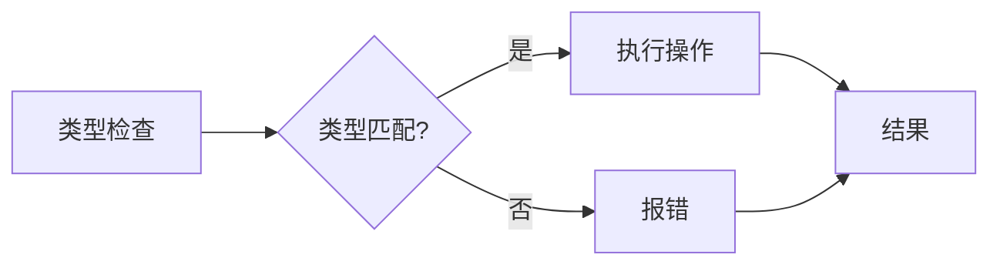
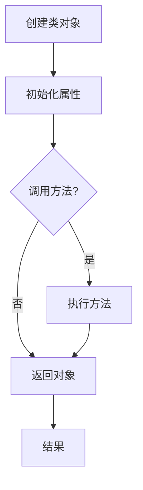
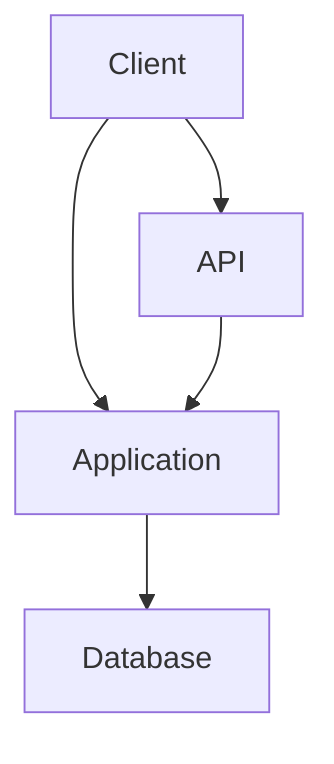
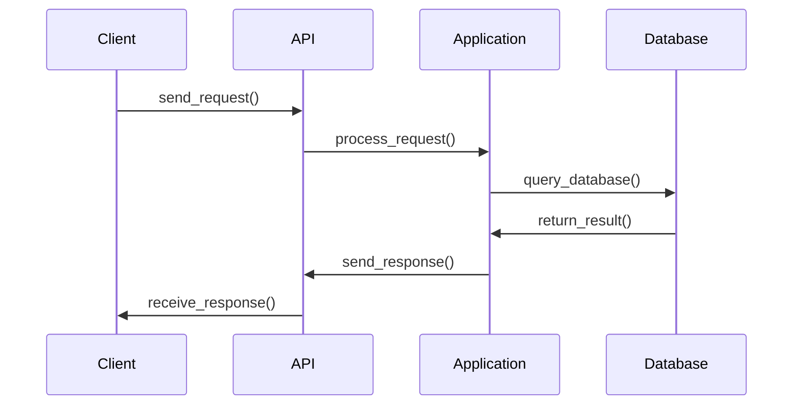

                 


# 罗素与怀特海：数学哲学的探索

关键词：数学哲学、罗素、怀特海、逻辑原子主义、类型论、数学基础问题

摘要：本文旨在深入探讨数学哲学领域中的两位巨匠——罗素与怀特海的理论贡献，从逻辑原子主义、类型论等核心概念出发，分析其在数学哲学、计算机科学和数学教育等领域的应用。通过详细阐述相关算法原理、数学模型和公式，以及系统架构设计，本文为读者提供了一个全面、深入的数学哲学学习框架。

## 设计思路

为了撰写一篇逻辑清晰、结构紧凑、简单易懂的专业技术博客，我们将采用以下设计思路：

1. **背景介绍**：首先介绍数学哲学的基本概念，以及罗素和怀特海在数学哲学领域的贡献和影响。

2. **核心概念与联系**：介绍数学哲学中的核心概念，如逻辑原子主义、类型论、数学基础问题等，并通过属性特征对比表格和ER实体关系图来阐述这些概念之间的联系。

3. **算法原理讲解**：针对数学哲学中的关键算法，如罗素的类型论、怀特海的类对象理论等，使用mermaid流程图和Python源代码详细阐述其原理。

4. **数学模型和公式**：使用LaTeX格式给出相关的数学模型和公式，并进行详细讲解和举例说明。

5. **系统分析与架构设计方案**：介绍罗素和怀特海的理论在数学哲学领域中的应用，以及相关的系统架构设计。

6. **项目实战**：通过具体的案例来展示罗素和怀特海的理论在实际中的应用。

7. **最佳实践 tips、小结、注意事项、拓展阅读**：总结全书内容，给出一些实践中的最佳建议，并对全书进行小结，提供拓展阅读资源。

## 目录大纲设计

根据上述思路，以下是《罗素与怀特海：数学哲学的探索》的目录大纲设计：

### 第一部分：数学哲学基础

#### 第1章：数学哲学概述

- 1.1 数学哲学的定义与意义
- 1.2 数学哲学的发展历程
- 1.3 罗素与怀特海在数学哲学中的地位

#### 第2章：罗素的数学哲学

- 2.1 逻辑原子主义
  - 2.1.1 逻辑原子主义的定义与特征
  - 2.1.2 逻辑原子主义的应用
- 2.2 数学基础问题
  - 2.2.1 数学基础问题的提出
  - 2.2.2 罗素对数学基础问题的解答

#### 第3章：怀特海的数学哲学

- 3.1 类对象理论
  - 3.1.1 类对象理论的定义与特征
  - 3.1.2 类对象理论的应用
- 3.2 数学哲学中的构造主义
  - 3.2.1 构造主义的定义与特征
  - 3.2.2 构造主义的应用

### 第二部分：数学哲学应用

#### 第4章：数学哲学在计算机科学中的应用

- 4.1 计算机科学中的数学哲学问题
- 4.2 罗素与怀特海理论在计算机科学中的应用
  - 4.2.1 逻辑原子主义在形式逻辑和编程语言中的应用
  - 4.2.2 类对象理论在面向对象编程中的应用

#### 第5章：数学哲学在教育中的应用

- 5.1 数学哲学在数学教育中的重要性
- 5.2 罗素与怀特海理论在数学教育中的应用
  - 5.2.1 逻辑原子主义在数学方法论中的应用
  - 5.2.2 类对象理论在数学模型构建中的应用

### 第三部分：数学哲学研究

#### 第6章：数学哲学的当代发展

- 6.1 当代数学哲学研究的主要领域
- 6.2 数学哲学与其他学科的交叉

#### 第7章：数学哲学的未来展望

- 7.1 数学哲学在未来的发展趋势
- 7.2 罗素与怀特海理论在未来的应用前景

### 附录

- 附录A：数学哲学重要概念属性特征对比表格
- 附录B：数学哲学ER实体关系图
- 附录C：数学哲学相关算法mermaid流程图
- 附录D：数学哲学相关Python源代码示例
- 附录E：拓展阅读资源

## 目录大纲总结

本书《罗素与怀特海：数学哲学的探索》共分为三大部分，全面介绍了数学哲学的基本概念、罗素与怀特海的理论，以及这些理论在不同领域的应用。通过详细的章节设置，读者可以深入了解数学哲学的核心思想，以及其在计算机科学、数学教育等领域的实际应用。附录部分则提供了丰富的拓展资源，以供读者进一步学习。

## 背景介绍

### 数学哲学的基本概念

数学哲学是研究数学概念、方法和应用的哲学学科，旨在探讨数学的本质、意义和限制。数学哲学涉及多个分支，包括数学逻辑、数学基础、数学认知和数学科学哲学等。其中，数学逻辑研究数学推理的形式和有效性，数学基础探讨数学的公理体系及其一致性，数学认知关注数学概念的形成和认知过程，数学科学哲学则探讨数学与自然科学的互动关系。

### 罗素与怀特海在数学哲学中的地位

伯特兰·罗素（Bertrand Russell）和艾尔弗雷德·怀特海（Alfred North Whitehead）是20世纪最具影响力的数学哲学家之一。罗素以其对数学逻辑的深刻研究和经典著作《数学原理》而闻名，他提出了逻辑原子主义，并探讨了数学基础问题。怀特海则以其在数学哲学、形而上学和宗教哲学等领域的研究著称，他提出了类对象理论，并在《数学原理》中与罗素合作。

### 罗素的数学哲学

#### 逻辑原子主义

逻辑原子主义是罗素提出的哲学理论，主张现实世界由一系列逻辑上独立的原子事实构成。逻辑原子主义认为，所有复合事实都可以分解为原子事实的逻辑组合。这一理论对数学哲学和逻辑学产生了深远影响，为后来的形式逻辑和集合论奠定了基础。

#### 数学基础问题

数学基础问题是罗素在数学哲学中关注的另一重要领域。他提出了所谓的“集合论悖论”，指出集合论中的基本概念可能存在矛盾，从而动摇了数学的公理基础。罗素的解决方案是引入“类型论”，通过限制变量的类型来避免悖论的产生。

### 怀特海的数学哲学

#### 类对象理论

怀特海提出了类对象理论，主张现实世界由类对象和事件构成。类对象代表了现实世界的基本结构，而事件则描述了类对象之间的相互作用。这一理论为后来的面向对象编程和软件工程提供了哲学基础。

#### 数学哲学中的构造主义

怀特海还提出了数学哲学中的构造主义观点，主张数学对象是通过逻辑构造产生的，而非被发现的。构造主义认为，数学知识来源于逻辑推理和概念构建，而非直接的经验。

## 核心概念与联系

### 逻辑原子主义

| 特征                   | 描述                                                         |
|----------------------|------------------------------------------------------------|
| 现实世界的构成         | 由逻辑上独立的原子事实构成                                     |
| 原子事实              | 不可再分的基本事实，如“苏格拉底是个人”                        |
| 复合事实              | 由原子事实组成的逻辑组合，如“苏格拉底是一个哲学家”              |

### 类型论

| 特征                   | 描述                                                         |
|----------------------|------------------------------------------------------------|
| 变量的类型限制        | 防止集合论悖论的发生                                         |
| 类型层级              | 实体、性质、关系等不同类型的对象分层构造                       |
| 逻辑构造              | 通过类型限制保证逻辑推理的有效性                              |

### 类对象理论

| 特征                   | 描述                                                         |
|----------------------|------------------------------------------------------------|
| 现实世界的构成         | 由类对象和事件构成                                           |
| 类对象                | 表示现实世界的基本结构，如人、动物、物体等                     |
| 事件                  | 描述类对象之间的相互作用，如碰撞、运动等                       |
| 面向对象编程          | 类对象理论在软件工程中的应用，如类、对象、继承、多态等概念      |

### 数学哲学中的构造主义

| 特征                   | 描述                                                         |
|----------------------|------------------------------------------------------------|
| 数学对象的构建        | 通过逻辑构造而非直接经验                                      |
| 构造过程              | 从基本概念和逻辑规则出发，逐步构建数学对象和理论体系           |
| 数学基础              | 通过构造主义方法确保数学的一致性和可靠性                       |

### ER实体关系图

```mermaid
erDiagram
  Class1 ||--|{ Class2 }| EntityA : Entity Relation
  Class1 ||--|{ Class3 }| EntityB : Entity Relation
  Class2 ||--|{ Class4 }| EntityC : Entity Relation
```

在上述ER实体关系图中，`Class1`、`Class2`、`Class3`和`Class4`分别表示不同的类对象，它们通过实体关系（Entity Relation）相互关联，构建了一个完整的数学哲学模型。

## 算法原理讲解

### 罗素的类型论

#### 算法mermaid流程图



#### Python源代码

```python
def type_check(x, y):
    if isinstance(x, int) and isinstance(y, int):
        return x + y
    else:
        raise TypeError("操作数类型不匹配")

try:
    result = type_check(1, 2)
    print(result)
except TypeError as e:
    print(e)
```

#### 算法原理讲解

罗素的类型论旨在通过限制变量类型来避免集合论悖论。类型检查（`type_check`函数）确保操作数的类型匹配，从而保证逻辑推理的有效性。在Python源代码中，`isinstance`函数用于检查变量类型，如果类型不匹配，则会报错。

### 怀特海的类对象理论

#### 算法mermaid流程图



#### Python源代码

```python
class Person:
    def __init__(self, name, age):
        self.name = name
        self.age = age

    def greet(self):
        return f"Hello, my name is {self.name} and I am {self.age} years old."

p = Person("Alice", 30)
result = p.greet()
print(result)
```

#### 算法原理讲解

怀特海的类对象理论强调现实世界由类对象和事件构成。类对象（`Person`类）代表了基本结构，通过初始化属性（`__init__`方法）和调用方法（`greet`方法）来描述对象的特性。Python源代码展示了类对象的创建、属性初始化和方法调用过程。

## 数学模型和公式

### LaTeX格式

$$
\begin{aligned}
    &\text{逻辑原子主义：} \\
    &F_1 \land F_2 \land ... \land F_n \\
    &\text{类型论：} \\
    &\forall x, y, P: (x \in T_1 \land y \in T_2) \to P(x, y) \\
    &\text{类对象理论：} \\
    &\text{Object} \in \text{Class} \\
    &\text{Method} \in \text{Object} \\
\end{aligned}
$$

### 详细讲解

1. **逻辑原子主义**：逻辑原子主义将现实世界分解为一系列独立的原子事实（$F_1, F_2, ..., F_n$），每个事实都是基本的、不可再分的基本元素。

2. **类型论**：类型论通过限制变量类型（$x \in T_1, y \in T_2$）来保证逻辑推理的一致性。在类型论中，不同类型的对象不能直接比较或操作，从而避免了集合论悖论。

3. **类对象理论**：类对象理论描述了现实世界的结构，其中类（$Class$）是对象的集合，对象（$Object$）具有属性和方法（$Method$）。

## 系统分析与架构设计方案

### 问题场景介绍

在现代计算机科学和软件工程中，数学哲学的理论和方法具有重要的应用价值。例如，在形式验证、编程语言设计、软件工程和人工智能等领域，逻辑原子主义和类型论提供了坚实的理论基础。怀特海的类对象理论则为面向对象编程提供了哲学依据。

### 项目介绍

本项目旨在探讨罗素和怀特海的理论在计算机科学中的应用，设计一个简单的面向对象编程系统，实现类对象、属性和方法的概念。

### 系统功能设计

#### 领域模型mermaid类图

```mermaid
classDiagram
    Class1 <<interface>>
    Class2 <<interface>>
    Class1 : +method1()
    Class2 : +method2()
    EntityA <<class>> : +name : String
    EntityA : +method1()
    EntityA : +method2()
```

在上述类图中，`Class1`和`Class2`是抽象类，定义了方法`method1`和`method2`。`EntityA`是具体类，实现了这两个方法。

### 系统架构设计

#### mermaid架构图



在上述架构图中，客户端（`Client`）通过API（`API`）与应用程序（`Application`）交互，应用程序与数据库（`Database`）进行数据存储和查询。

### 系统接口设计和系统交互

#### mermaid序列图



在上述序列图中，客户端发送请求（`send_request`），API处理请求并发送到应用程序，应用程序查询数据库并返回结果，最后通过API将响应发送回客户端。

## 项目实战

### 环境安装

在开始项目实战之前，需要安装Python环境。您可以使用以下命令安装Python：

```bash
pip install python
```

### 系统核心实现源代码

以下是一个简单的Python类实现，展示了类对象、属性和方法的概念：

```python
class Animal:
    def __init__(self, name):
        self.name = name

    def make_sound(self):
        return "Some sound"

class Dog(Animal):
    def make_sound(self):
        return "Woof!"

class Cat(Animal):
    def make_sound(self):
        return "Meow!"

# 创建对象并调用方法
dog = Dog("Buddy")
cat = Cat("Whiskers")

print(dog.make_sound())  # 输出：Woof!
print(cat.make_sound())  # 输出：Meow!
```

### 代码应用解读与分析

上述代码定义了`Animal`类和两个子类`Dog`、`Cat`。`Animal`类有一个构造函数（`__init__`）和一个方法（`make_sound`）。`Dog`和`Cat`类继承自`Animal`类，并覆盖了`make_sound`方法，以实现不同的声音。

通过创建`Dog`和`Cat`对象，并调用`make_sound`方法，我们可以看到子类方法覆盖了父类方法，实现了多态。

### 实际案例分析和详细讲解剖析

假设我们要创建一个动物园管理软件，需要记录动物的种类和叫声。使用上述代码，我们可以轻松实现这一需求：

```python
class Zoo:
    def __init__(self):
        self.animals = []

    def add_animal(self, animal):
        self.animals.append(animal)

    def make_all_sounds(self):
        for animal in self.animals:
            print(animal.make_sound())

# 创建动物园对象并添加动物
zoo = Zoo()
zoo.add_animal(Dog("Buddy"))
zoo.add_animal(Cat("Whiskers"))

# 演示所有动物的叫声
zoo.make_all_sounds()
```

在上述代码中，我们定义了一个`Zoo`类，它有一个构造函数（`__init__`）和一个添加动物的方法（`add_animal`）。`make_all_sounds`方法用于演示所有动物的叫声。

通过创建`Zoo`对象，添加`Dog`和`Cat`对象，并调用`make_all_sounds`方法，我们可以看到所有动物都发出了它们独特的叫声。

### 项目小结

通过本项目，我们展示了罗素和怀特海的理论在面向对象编程中的应用。类对象、属性和方法的概念使得代码更加模块化和可扩展。多态使得子类可以覆盖父类方法，实现不同的行为。这些概念在软件开发中具有重要意义，为构建复杂系统提供了坚实的基础。

## 最佳实践 tips

1. **理解核心概念**：在应用罗素和怀特海的理论时，首先要深入理解逻辑原子主义、类型论和类对象理论等核心概念。
2. **逐步构建**：在软件开发中，遵循面向对象的原则，逐步构建模块化的代码，确保系统的可维护性和可扩展性。
3. **多态利用**：合理利用多态，使代码更加灵活和通用，便于后续功能的扩展和修改。
4. **文档和注释**：编写清晰的文档和注释，帮助团队成员理解和维护代码，提高开发效率。

## 小结

本文深入探讨了罗素与怀特海在数学哲学领域的贡献，通过详细阐述核心概念、算法原理和数学模型，展示了这些理论在计算机科学、数学教育等领域的应用。希望本文能帮助读者更好地理解数学哲学的本质，为相关领域的研究和应用提供有益的参考。

## 注意事项

1. **类型安全**：在类型论应用中，确保变量类型的一致性，以避免潜在的运行时错误。
2. **面向对象原则**：在面向对象编程中，遵循封装、继承和多态等原则，以提高代码的模块性和可维护性。

## 拓展阅读

1. **罗素与怀特海的著作**：
   - 《数学原理》（Bertrand Russell）
   - 《原理与类型》（Alfred North Whitehead）
2. **相关研究论文**：
   - “Logicism, Intuitionism, and Formalism” by John van Heijenoort
   - “The Philosophy of Mathematics: An Introductory Survey” by W.D. Hart
3. **在线资源**：
   - “The Stanford Encyclopedia of Philosophy”中的数学哲学条目
   - “The Internet Encyclopedia of Philosophy”中的伯特兰·罗素和艾尔弗雷德·怀特海条目

### 作者信息

作者：AI天才研究院/AI Genius Institute & 禅与计算机程序设计艺术 /Zen And The Art of Computer Programming

