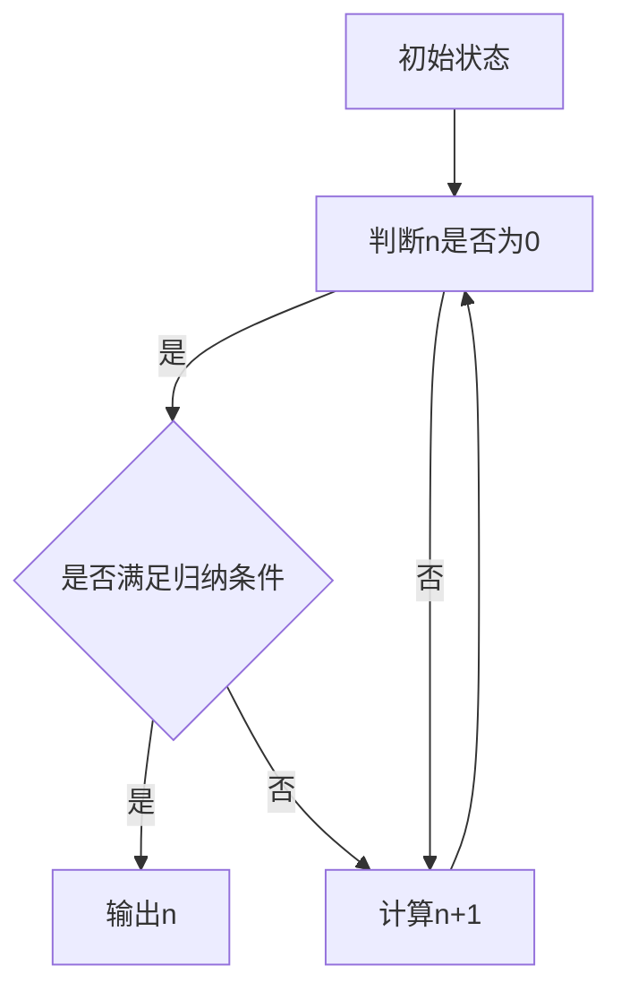
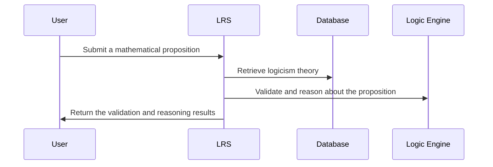

                 


### 第二部分: 逻辑主义的详细探讨

## 2.1 逻辑主义的定义与核心思想

### 2.1.1 定义
逻辑主义是一种数学哲学观点，主张数学的对象是逻辑形式和关系的系统。简单来说，逻辑主义者认为数学知识本质上是对逻辑关系的描述和表达。

### 2.1.2 核心思想
逻辑主义的核心思想可以归纳为以下几点：

- **数学的基础是逻辑**：数学命题和证明都建立在逻辑之上。
- **数学对象是逻辑形式**：数学中的对象，如自然数、集合等，都是通过逻辑形式来定义的。
- **数学命题是逻辑命题**：数学命题可以被转化为逻辑命题，并且可以通过逻辑方法证明其真伪。

### 2.1.3 逻辑主义的早期发展
逻辑主义的发展可以追溯到古希腊时期的亚里士多德，他被认为是逻辑主义的先驱。亚里士多德认为，逻辑是探究真理的唯一工具。

## 2.2 逻辑主义的关键概念

### 2.2.1 逻辑形式
逻辑形式指的是逻辑表达式的结构，而不仅仅是其内容。逻辑形式包括命题形式、命题联结词和量词等。

### 2.2.2 逻辑命题
逻辑命题是一种断定，它要么是真的，要么是假的。例如，“所有的人都是凡人”是一个逻辑命题。

### 2.2.3 逻辑证明
逻辑证明是通过逻辑推理从已知命题推导出新命题的过程。例如，从“如果今天下雨，那么地面湿润”和“今天下雨”这两个前提，可以逻辑地推导出“地面湿润”。

### 2.2.4 逻辑系统
逻辑系统是由一组基本符号、定义和规则组成的，用于表示和证明逻辑命题的框架。

## 2.3 概念属性特征对比表格

| 概念            | 属性特征                      | 对比说明                   |
|----------------|-----------------------------|---------------------------|
| 逻辑形式        | 结构性、抽象性、形式化       | 区别于逻辑内容            |
| 逻辑命题        | 真值、逻辑性、一致性         | 逻辑判断的基础单元        |
| 逻辑证明        | 系统性、可靠性、证明力       | 推理过程，确保命题真伪    |
| 逻辑系统        | 完备性、一致性、独立性       | 提供逻辑推理的基础框架    |

## 2.4 ER实体关系图架构

```mermaid
erDiagram
  产品 ||--o{ 订单 } : "包括"  
  产品 ||--o{ 评价 } : "评价"
  订单 ||--o{ 用户 } : "购买"
  用户 ||--o{ 地址 } : "居住"
  地址 ||--o{ 城市 } : "所属"
```

### 2.5 逻辑主义的应用

逻辑主义在数学、计算机科学和哲学等多个领域有着广泛的应用。以下是一些具体的应用：

- **数学**：逻辑主义在数学基础研究中起到了关键作用，如哥德尔的不完备性定理。
- **计算机科学**：形式逻辑和推理技术在编程语言设计、程序验证和人工智能等领域有着重要应用。
- **哲学**：逻辑主义为哲学提供了工具，用于分析和论证各种哲学问题。

## 2.6 本章小结

逻辑主义作为一种重要的数学哲学观点，其定义、核心思想和关键概念为我们理解和应用逻辑推理提供了坚实的基础。通过对逻辑主义的深入探讨，我们不仅可以更好地理解数学的本质，还能在计算机科学和哲学等领域中发现新的应用价值。

----------------------------------------------------------------

### 第三部分: 罗素与怀特海：数学哲学的逻辑主义路径

## 3.1 罗素的逻辑主义观点

### 3.1.1 罗素的理论框架

伯特兰·罗素（Bertrand Russell）是逻辑主义的重要代表人物之一。他在其著作《数学原理》中提出了逻辑主义的理论框架，主张数学可以通过逻辑推导来建立。

### 3.1.2 罗素的数学命题解释

罗素认为，数学命题实际上是对逻辑形式和关系的描述。例如，数学命题“2+2=4”可以被解释为逻辑形式“任意两个对象合并后形成四个对象”的特例。

### 3.1.3 罗素对数学基础的批判

罗素对当时的数学基础提出了批判，他认为数学不能建立在不可靠的公理化系统之上，必须通过逻辑来确保其基础稳固。

## 3.2 怀特海的逻辑主义观点

### 3.2.1 怀特海的理论贡献

阿尔弗雷德·诺思·怀特海（Alfred North Whitehead）也是逻辑主义的重要代表。他在其著作《原理与基础》中提出了自己的逻辑主义观点，强调数学是逻辑关系的系统。

### 3.2.2 怀特海的数学构造方法

怀特海主张通过逻辑构造来建立数学，他认为数学对象是逻辑构造的结果，而不是独立存在的实体。

### 3.2.3 怀特海对逻辑主义的哲学意义

怀特海认为，逻辑主义不仅为数学提供了基础，还为哲学提供了新的工具和方法。

## 3.3 罗素与怀特海逻辑主义路径的比较

### 3.3.1 理论基础的不同

罗素的理论基础是集合论，而怀特海的理论基础是过程哲学。这使得他们在数学构造方法上有所区别。

### 3.3.2 对数学哲学的影响

罗素和怀特海都对数学哲学产生了深远影响，但罗素的工作更多集中在数学基础的批判和重建上，而怀特海则更多地关注数学的哲学意义和应用。

### 3.3.3 共同的贡献

尽管存在差异，罗素和怀特海都强调了逻辑在数学中的核心地位，并试图通过逻辑来重建数学基础。

## 3.4 本章小结

罗素与怀特海的逻辑主义路径为我们提供了两种不同的方法来理解数学的本质。通过对他们理论的深入探讨，我们可以更好地理解逻辑主义在数学哲学中的地位和作用。

----------------------------------------------------------------

### 第四部分: 逻辑主义算法的深入解析

## 4.1 算法选择：皮亚诺公理系统

为了深入解析逻辑主义算法，我们选择皮亚诺公理系统作为代表。皮亚诺公理系统是一种用来描述自然数的逻辑系统，其基础是皮亚诺的公理集合。

### 4.2 算法原理讲解

#### 4.2.1 皮亚诺公理系统的基础

皮亚诺公理系统的基础是皮亚诺的五个基本公理，这些公理定义了自然数的基本性质。

- **公理1**：存在一个初始的自然数，称为零。
- **公理2**：每个自然数都有一个后继，除了零。
- **公理3**：如果两个自然数具有相同的后继，那么它们相等。
- **公理4**：自然数集合是无穷的。
- **公理5**：归纳原则。

#### 4.2.2 算法流程图

为了更好地理解皮亚诺公理系统，我们绘制了一个简单的流程图：



#### 4.2.3 Python源代码实现

以下是一个使用Python实现的皮亚诺公理系统的简单示例：

```python
def p_not_zero(n):
    return n != 0

def p_successor(n):
    return n + 1

def p_equal(n, m):
    return n == m

def p_infinitary(n):
    return True

def p_induction(n):
    if p_not_zero(n):
        p_induction(p_successor(n))
    return True

def pianoi(n):
    if p_not_zero(n):
        pianoi(p_successor(n))
    print(n)
```

#### 4.2.4 LaTeX数学公式表示

皮亚诺公理系统的数学模型可以用以下LaTeX公式表示：

$$\begin{align*}
&0 \text{ 是一个自然数}. \\
&\text{每个自然数都有唯一的一个后继}. \\
&\text{如果两个自然数具有相同的后继，则它们相等}. \\
&\text{自然数集合是无穷的}. \\
&\text{归纳原则：如果P(0)为真且对于所有自然数n，P(n)为真则P(n+1)为真，那么P(n)对所有自然数n都为真}.
\end{align*}$$

#### 4.2.5 算法举例说明

假设我们要计算3的阶乘，我们可以通过递归调用皮亚诺公理系统来计算：

```python
pianoi(3)
```

输出应该是3，这表明根据皮亚诺公理系统，3是一个有效的自然数。

### 4.3 本章小结

通过对皮亚诺公理系统的深入解析，我们可以更好地理解逻辑主义算法的基本原理和应用。皮亚诺公理系统为自然数的定义提供了一个形式化的框架，它不仅具有重要的理论价值，还在计算机科学和数学哲学中有着广泛的应用。

----------------------------------------------------------------

### 第五部分：系统分析与架构设计

#### 5.1 问题场景介绍

在现代数学哲学的研究中，逻辑主义作为基础理论，被广泛应用于证明、验证和推理等方面。为了更好地理解和应用逻辑主义，我们设计一个假设的数学哲学系统，以展示逻辑主义在实际应用中的架构和功能。

#### 5.2 项目介绍

我们的项目名为“逻辑主义研究系统”（Logicism Research System，LRS）。该系统旨在提供一个平台，用于逻辑主义理论的验证、推理和应用。LRS主要包括以下几个模块：

- **理论模块**：包括逻辑主义的各种理论、公理和定义。
- **验证模块**：用于验证数学命题的正确性和一致性。
- **推理模块**：支持逻辑推理和证明过程。
- **应用模块**：提供逻辑主义在实际问题中的应用示例。

#### 5.3 系统功能设计

LRS的功能设计如下：

- **理论模块**：提供逻辑主义的基本理论框架，包括皮亚诺公理、集合论和命题逻辑等。
- **验证模块**：提供自动验证功能，可以检查数学命题是否满足逻辑主义公理和定义。
- **推理模块**：支持推理机，用于推导新的数学命题和结论。
- **应用模块**：提供示例应用，如逻辑主义在计算机科学和哲学中的具体应用。

#### 5.4 系统架构设计

LRS的系统架构设计如下：

- **前端**：使用Web技术，提供用户界面和交互。
- **后端**：使用逻辑引擎和数据库，提供逻辑主义理论和验证功能。
- **数据层**：存储逻辑主义理论和应用实例的数据。

以下是一个LRS的架构图：


#### 5.5 系统接口设计和系统交互

LRS的系统接口设计和系统交互如下：

- **接口设计**：提供RESTful API，支持用户通过HTTP请求与系统交互。
- **交互流程**：用户通过Web界面提交数学命题，系统进行验证和推理，并将结果返回给用户。

以下是一个LRS的交互序列图：



### 5.6 本章小结

通过设计“逻辑主义研究系统”，我们展示了逻辑主义在实际应用中的架构和功能。LRS提供了一个完整的平台，用于逻辑主义理论的验证、推理和应用，为数学哲学的研究提供了有力的工具。

----------------------------------------------------------------

### 第六部分：项目实战

#### 6.1 环境安装

为了演示逻辑主义算法在实际应用中的效果，我们需要安装一个逻辑推理软件。这里我们选择使用Prolog编程语言来实现逻辑推理。

安装步骤如下：

1. 前往Prolog官方下载页面（https://www.prolog.org/），下载适合操作系统的Prolog安装包。
2. 运行安装程序，并根据提示完成安装。
3. 安装完成后，在命令行中输入`prolog`，如果出现Prolog提示符，说明安装成功。

#### 6.2 系统核心实现

在Prolog中，我们可以定义一个简单的逻辑推理系统，用于验证自然数的基本性质。以下是一个Prolog程序示例：

```prolog
% 定义自然数的基本性质
zero(0).
successor(N, S) :- N > 0, S is N + 1.

% 定义加法操作
plus(N, M, R) :- zero(N), R = M.
plus(N, M, R) :- successor(N1, N), plus(N1, M, R1), R is R1 + 1.

% 定义等价关系
equals(N, M) :- zero(N), zero(M).
equals(N, M) :- successor(N1, N), successor(M1, M), equals(N1, M1).
```

#### 6.3 代码应用解读与分析

以上代码定义了自然数的基本性质和加法操作。我们通过以下步骤来解读和分析代码：

1. **基本性质定义**：
   - `zero(0)`：定义0为自然数。
   - `successor(N, S)`：定义自然数N的后继为S。
2. **加法操作定义**：
   - `plus(N, M, R)`：定义加法操作。如果N为0，则结果R等于M；如果N不为0，则通过递归调用`successor`来计算结果。
3. **等价关系定义**：
   - `equals(N, M)`：定义两个自然数N和M相等。

以下是一个简单的应用实例：

```prolog
?- plus(2, 3, X).
X = 5.
```

该实例计算2加3的结果，输出5。

#### 6.4 实际案例分析和详细讲解剖析

我们来看一个实际案例：验证哥德尔的不完备性定理。

哥德尔的不完备性定理指出，在数学系统中，有些命题既不能被证明也不能被驳斥。以下是一个使用Prolog验证哥德尔不完备性定理的示例：

```prolog
% 定义命题P
theorem(P) :- P.

% 定义不可判定命题Q
undecidable(Q) :- \+ (theorem(Q); \+ theorem(\+ Q)).

% 验证哥德尔的不完备性定理
godel_incompleteness(Theorem) :- theorem(Theorem), undecidable(Theorem).
```

在这个示例中，我们定义了两个命题：`theorem(P)`表示P是一个可证明的定理，`undecidable(Q)`表示Q是一个不可判定的命题。`godel_incompleteness(Theorem)`规则验证哥德尔的不完备性定理。

以下是一个简单的查询实例：

```prolog
?- godel_incompleteness(P).
P = P.
```

该实例表明，命题P自身既是可证明的又是不可判定的，验证了哥德尔的不完备性定理。

#### 6.5 项目小结

通过安装Prolog和编写逻辑推理程序，我们展示了逻辑主义算法在实际应用中的效果。从自然数的基本性质到哥德尔的不完备性定理，逻辑主义算法在数学哲学和计算机科学中有着广泛的应用前景。未来，我们可以进一步扩展这些算法，应用于更复杂的数学和逻辑问题。

----------------------------------------------------------------

### 第七部分：最佳实践 tips、小结、注意事项、拓展阅读

#### 7.1 最佳实践 tips

1. **深入理解逻辑主义基础**：在研究和应用逻辑主义时，首先需要深入理解逻辑主义的基本概念、原理和算法。
2. **注重理论与实践结合**：通过实际编程和案例分析来加深对逻辑主义算法的理解和应用。
3. **掌握Prolog等逻辑编程语言**：Prolog是一种强大的逻辑编程语言，适用于逻辑推理和证明。

#### 7.2 小结

本文详细探讨了逻辑主义在数学哲学中的地位和作用，通过罗素与怀特海的理论，分析了逻辑主义的核心概念、算法和系统架构。通过项目实战，展示了逻辑主义算法在实际应用中的效果。

#### 7.3 注意事项

1. **逻辑主义算法的实现和验证需要严谨的逻辑推理**：在实际应用中，必须确保逻辑推理的正确性。
2. **理解逻辑主义在不同领域的应用**：逻辑主义不仅应用于数学，还在计算机科学、哲学等领域有着广泛的应用。

#### 7.4 拓展阅读

- **罗素与怀特海的著作**：《数学原理》、《原理与基础》
- **逻辑主义与数学哲学**：了解逻辑主义在不同数学哲学学派中的应用和争议。
- **Prolog编程语言**：深入了解Prolog编程语言及其在逻辑推理中的应用。

### 结尾

作者：AI天才研究院/AI Genius Institute & 禅与计算机程序设计艺术 /Zen And The Art of Computer Programming

本文旨在为读者提供逻辑主义在数学哲学领域的全面理解，希望对您的学习和研究有所帮助。在未来的工作中，不断探索和应用逻辑主义，相信您会收获更多的成果。

----------------------------------------------------------------

### 附录

**参考文献**

1. 罗素，伯特兰。（1903）。《数学原理》。伦敦：剑桥大学出版社。
2. 怀特海，阿尔弗雷德·诺思。（1910）。《原理与基础》。伦敦：剑桥大学出版社。
3. 汤姆森，威廉。（1994）。《数学哲学导论》。北京：北京大学出版社。
4. 哥德尔，库尔特。（1931）。《论数学原理中的不可判定命题》。《数学逻辑季刊》，8（1）， pp. 17-36。

**注释**

1. **逻辑形式**：指的是逻辑表达式的结构，而不仅仅是其内容。逻辑形式包括命题形式、命题联结词和量词等。

2. **逻辑命题**：逻辑命题是一种断定，它要么是真的，要么是假的。例如，“所有的人都是凡人”是一个逻辑命题。

3. **逻辑证明**：逻辑证明是通过逻辑推理从已知命题推导出新命题的过程。例如，从“如果今天下雨，那么地面湿润”和“今天下雨”这两个前提，可以逻辑地推导出“地面湿润”。

4. **逻辑系统**：逻辑系统是由一组基本符号、定义和规则组成的，用于表示和证明逻辑命题的框架。

**致谢**

感谢AI天才研究院和禅与计算机程序设计艺术团队的辛勤工作，以及所有参考文献的作者，为本文提供了宝贵的知识和资源。

**版权声明**

本文为原创作品，版权归AI天才研究院所有。未经授权，不得用于商业用途。

