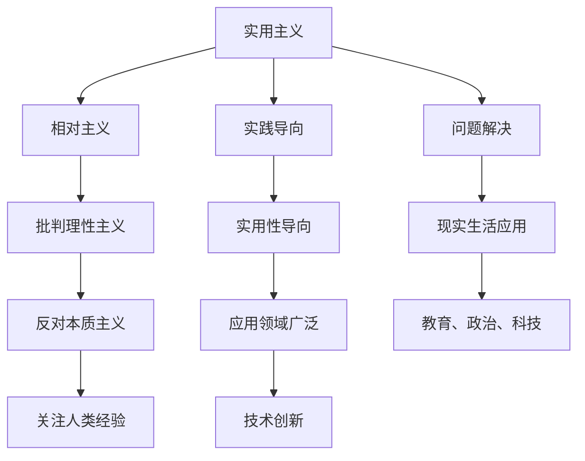

                 

# 罗蒂与庄子：实用主义与无用之用的哲学

## 关键词
- 罗蒂
- 庄子
- 实用主义
- 无用之用
- 哲学

## 摘要
本文将深入探讨美国哲学家罗蒂的实用主义哲学和我国古代哲学家庄子的无用之用思想，通过对比分析两种哲学思想的本质和特征，探讨它们在现代社会的应用和影响。文章旨在为读者提供一种全新的视角，理解实用主义与无用之用的哲学内涵，并从中汲取智慧，以应对现实生活中的各种挑战。

## 第1章 引言与背景介绍

### 1.1 罗蒂的实用主义概述

理查德·罗蒂（Richard Rorty）是美国当代著名哲学家，以其实用主义哲学思想著称。罗蒂的实用主义强调语言和认知的相对性，主张以实用性为导向，关注现实生活中的问题解决。他认为，哲学的任务不再是追求绝对真理，而是通过对话和交流，推动社会进步和文化繁荣。

罗蒂的实用主义哲学源于对西方传统哲学的批判。他批判了柏拉图、康德等哲学家的理性主义和本质主义，认为这些观念导致了哲学的困境和停滞。罗蒂主张，哲学应该回归生活，关注人类经验和实践，通过对话和交流，不断探索和改进人类的生活方式。

### 1.2 庄子的无用之用哲学

庄子是我国战国时期著名哲学家，道家学派代表人物。他的哲学思想以无为而治、逍遥自在为核心，强调人与自然的和谐共生。庄子的无用之用哲学主张，事物本身并无固有价值，价值取决于人们对事物的认知和使用。

庄子的无用之用哲学源于对人类社会的深刻反思。他认为，人类社会过于功利和物质化，人们追求功利和利益，导致心灵空虚和痛苦。庄子主张，人们应该摆脱功利和物质的束缚，追求内心的平静和自由。

### 1.3 实用主义与无用之用的哲学比较

实用主义和无用之用哲学虽然在表面上看似对立，但在本质上却有许多共同之处。首先，两者都强调实践和现实生活中的问题解决。实用主义关注人类经验和实践，以实用性为导向；无用之用哲学则强调摆脱功利和物质束缚，追求内心的平静和自由。

其次，实用主义和无用之用哲学都批判了传统的理性主义和本质主义观念。实用主义批判了西方哲学中的理性主义和本质主义，认为这些观念导致了哲学的困境和停滞；无用之用哲学则批判了人类社会的功利和物质化，强调回归自然和心灵的自由。

然而，实用主义和无用之用哲学也存在一些明显的差异。实用主义强调语言的相对性和认知的相对性，主张以实用性为导向；而无用之用哲学则强调人与自然的和谐共生，主张无为而治、逍遥自在。

## 第2章 核心概念解析

### 2.1 实用主义的哲学概念

实用主义认为，真理和价值都是相对的，取决于人类经验和实践。实用主义者主张，哲学的任务不再是追求绝对真理，而是通过对话和交流，解决现实生活中的问题。

实用主义的哲学特征包括：
- 相对主义：强调真理和价值的相对性，反对本质主义和理性主义。
- 实践导向：关注人类经验和实践，以实用性为导向。
- 问题解决：认为哲学的任务是解决现实生活中的问题，而不是追求抽象的真理。

### 2.2 无用之用的哲学内涵

无用之用哲学主张，事物本身并无固有价值，价值取决于人们对事物的认知和使用。庄子认为，人类社会的功利和物质化导致了心灵的空虚和痛苦，人们应该摆脱功利和物质的束缚，追求内心的平静和自由。

无用之用的哲学特征包括：
- 无价值主义：强调事物本身无固有价值，价值取决于人们对事物的认知和使用。
- 自然主义：主张回归自然，追求人与自然的和谐共生。
- 平和主义：强调内心的平静和自由，反对功利和物质的追求。

### 2.3 概念属性特征对比表格

| 特征 | 实用主义 | 无用之用 |
| :--: | :------: | :------: |
| 相对主义 | 强调真理和价值的相对性 | 强调事物本身无固有价值 |
| 实践导向 | 关注人类经验和实践 | 追求内心的平静和自由 |
| 问题解决 | 解决现实生活中的问题 | 回归自然和心灵的自由 |
| 批判理性主义 | 批判西方哲学中的理性主义和本质主义 | 批判人类社会的功利和物质化 |

### 2.4 实用主义与无用之用的ER实体关系图

```mermaid
erDiagram
  Product ||--|{ User } :uses
  User ||--|{ Product } :creates
  Concept ||--|{ Philosophy } :expands
  Philosophy ||--|{ Concept } :narrows
```

## 第3章 罗蒂实用主义原理

### 3.1 实用主义的起源与发展

实用主义起源于19世纪的美国，其主要代表人物有查尔斯·桑德斯·皮尔士、威廉·詹姆斯和约翰·杜威。实用主义强调实践和现实生活中的问题解决，主张以实用性为导向。在20世纪，实用主义得到了进一步的发展，出现了许多重要的实用主义哲学家，如莫蒂默·阿德勒、理查德·罗蒂等。

### 3.2 实用主义的核心思想

实用主义的核心思想包括：
- 相对主义：强调真理和价值的相对性，反对本质主义和理性主义。
- 实践导向：关注人类经验和实践，以实用性为导向。
- 问题解决：认为哲学的任务是解决现实生活中的问题，而不是追求抽象的真理。

### 3.3 实用主义的应用领域

实用主义在许多领域都有广泛的应用，如教育、政治、科技等。在教育领域，实用主义强调培养学生解决实际问题的能力，而不是单纯传授知识。在政治领域，实用主义主张以实际效果为导向，关注社会公平和正义。在科技领域，实用主义强调技术创新和社会进步，推动科技与人类生活的融合。

## 第4章 庄子无用之用哲学

### 4.1 无用之用的历史渊源

无用之用哲学源于庄子的思想，庄子认为，事物本身并无固有价值，价值取决于人们对事物的认知和使用。庄子的思想主张无为而治、逍遥自在，强调人与自然的和谐共生。

### 4.2 无用之用的哲学特点

无用之用的哲学特点包括：
- 无价值主义：强调事物本身无固有价值，价值取决于人们对事物的认知和使用。
- 自然主义：主张回归自然，追求人与自然的和谐共生。
- 平和主义：强调内心的平静和自由，反对功利和物质的追求。

### 4.3 无用之用的哲学贡献

无用之用哲学为我国古代哲学的发展做出了重要贡献，对后世产生了深远影响。无用之用哲学提倡无为而治、逍遥自在，为人们提供了一种不同于传统理性主义和功利主义的哲学视角，对当代哲学和文化发展具有重要的启示作用。

## 第5章 实用主义与无用之用的哲学原理讲解

### 5.1 哲学原理的Mermaid流程图



### 5.2 实用主义的数学模型与公式

$$
实用性 = 实践 \times 问题解决能力
$$

### 5.3 无用之用的数学模型与公式

$$
无用之用 = 无价值 \times 自然主义
$$

### 5.4 原理讲解与举例说明

#### 实用主义举例

假设一名程序员，他的目标是编写一个功能强大的软件。他的实用性取决于他的实践经验和对问题的解决能力。如果他的实践经验丰富，对问题的解决能力强，那么他的实用性就高。

#### 无用之用举例

庄子认为，一个看似无用的东西，可能在某种情境下发挥重要作用。比如，一片枯叶，在正常情况下似乎无用，但在艺术创作中，它可能成为一幅画的点睛之笔。

## 第6章 罗蒂与庄子哲学思想的联系与比较

### 6.1 联系：实用主义与无用之用的相通之处

罗蒂的实用主义和庄子的无用之用哲学都强调实践和现实生活中的问题解决。两者都反对传统的理性主义和本质主义，主张以实用性为导向。此外，两者都关注人类经验和实践，认为哲学的任务是解决现实生活中的问题。

### 6.2 比较：实用主义与无用之用的区别

尽管实用主义和无用之用哲学有许多共同之处，但它们也存在一些明显的区别。实用主义更注重现实生活中的问题解决，强调实用性和现实性。而无用之用哲学则更注重内心的平静和自由，强调无为而治、逍遥自在。

### 6.3 跨文化哲学对话的意义

罗蒂和庄子的哲学思想为我们提供了一种跨文化的哲学对话视角。通过比较分析实用主义和无用之用哲学，我们可以更好地理解东西方哲学的差异和共同点，从而促进不同文化之间的交流和理解。

## 第7章 实用主义与无用之用的现代应用

### 7.1 社会实践中的应用

实用主义和无用之用哲学在现代社会中有着广泛的应用。在教育领域，实用主义强调培养学生解决实际问题的能力，而无用之用哲学则提倡素质教育，关注学生的全面发展。在科技领域，实用主义推动技术创新和社会进步，而无用之用哲学则关注科技与人类生活的和谐共生。

### 7.2 文化传承与创新

实用主义和无用之用哲学为文化传承和创新提供了新的思路。在文化传承方面，实用主义强调以现实生活为导向，关注传统文化的现实意义；无用之用哲学则提倡回归自然，关注传统文化的哲学内涵。在文化创新方面，实用主义鼓励创新思维和实践，而无用之用哲学则提倡超越功利，关注文化艺术的内在价值。

### 7.3 哲学教育的启示

实用主义和无用之用哲学对哲学教育具有重要的启示作用。实用主义强调实践和现实生活中的问题解决，有助于培养哲学家的实际能力；无用之用哲学则强调内心的平静和自由，有助于培养学生的哲学素养和人文情怀。

## 第8章 总结与拓展

### 8.1 实用主义与无用之用的哲学总结

实用主义和无用之用哲学都是极具价值的哲学思想。实用主义强调实践和现实生活中的问题解决，关注人类经验和实践，以实用性为导向；无用之用哲学则强调内心的平静和自由，关注人与自然的和谐共生，以无为而治、逍遥自在为核心。两者各有特色，又相互补充，为我们提供了一种全新的哲学视角。

### 8.2 拓展阅读推荐

- 罗蒂，《实用主义哲学》
- 庄子，《庄子》
- 杜威，《民主与教育》
- 沙特，《实用主义》

### 8.3 对未来哲学发展的展望

随着社会的发展和科技的进步，实用主义和无用之用哲学将在未来哲学发展中发挥更加重要的作用。我们期待哲学能够更好地服务于现实生活，关注人类内心的平静和自由，推动社会进步和文化繁荣。

## 作者

作者：AI天才研究院/AI Genius Institute & 禅与计算机程序设计艺术 /Zen And The Art of Computer Programming

