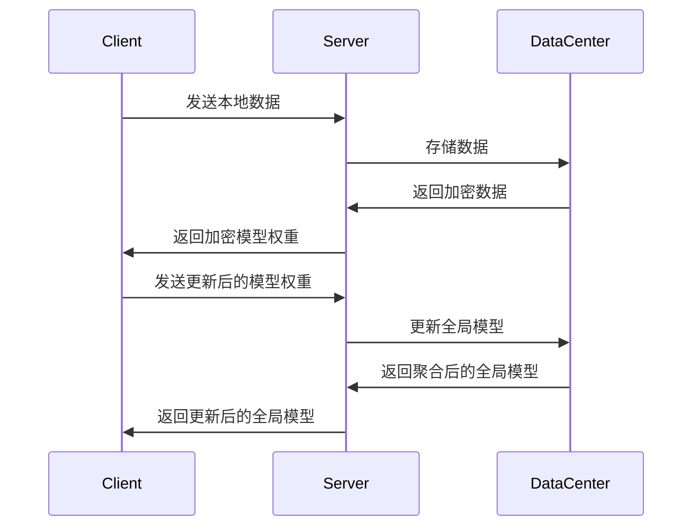
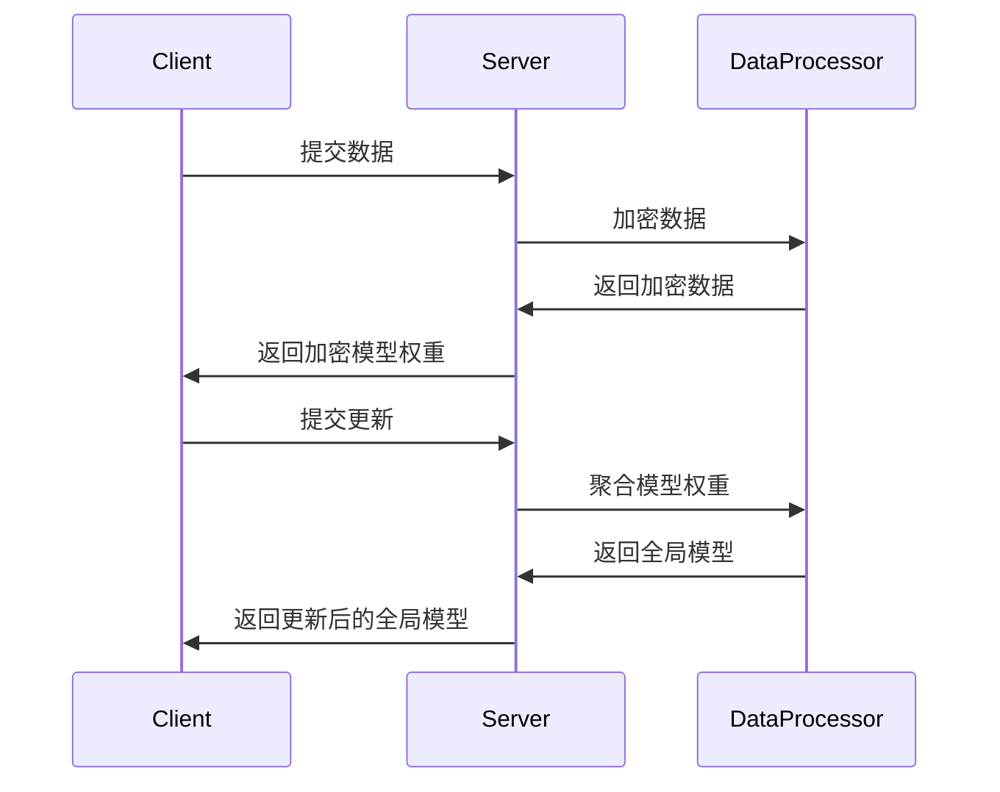
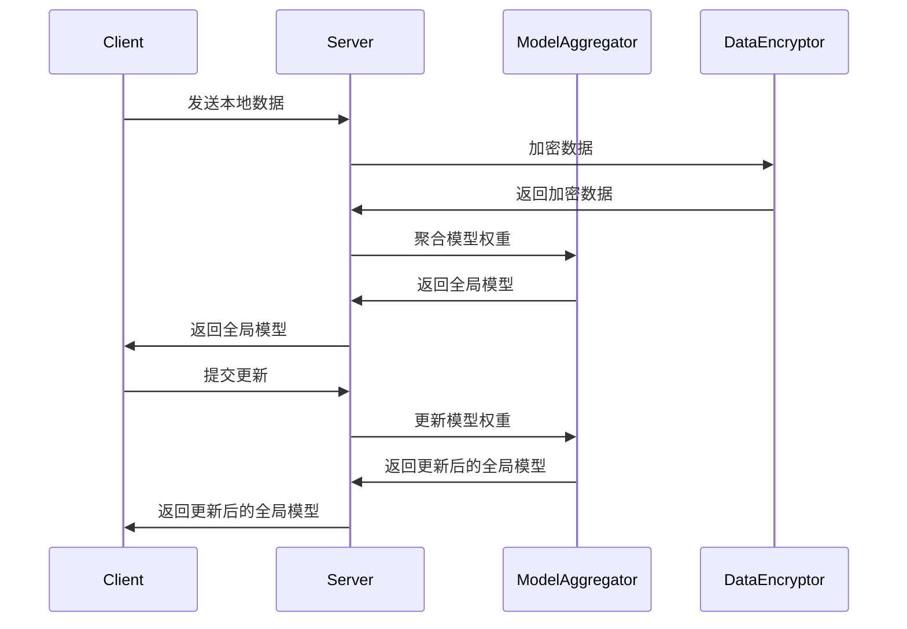
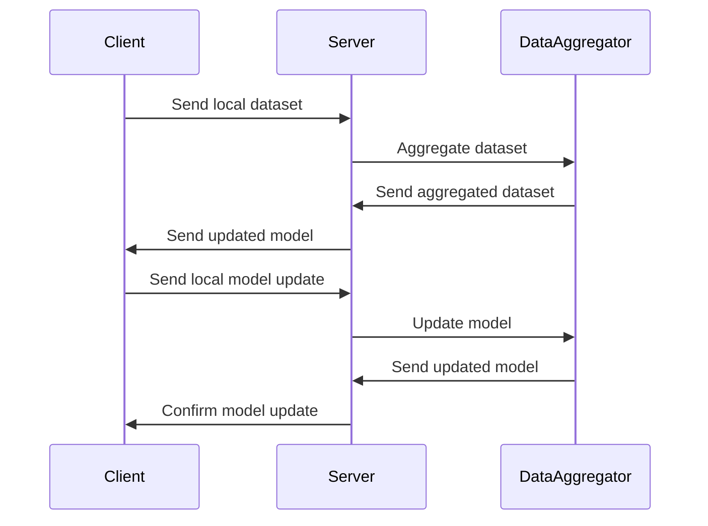
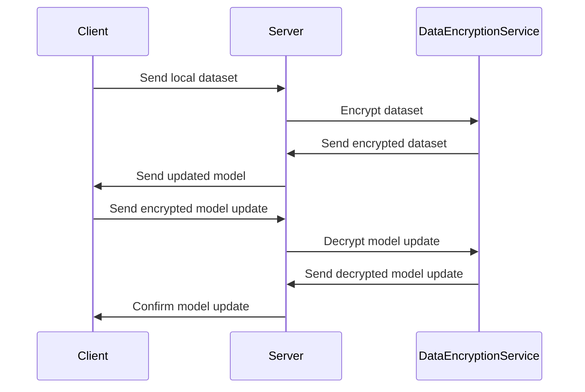
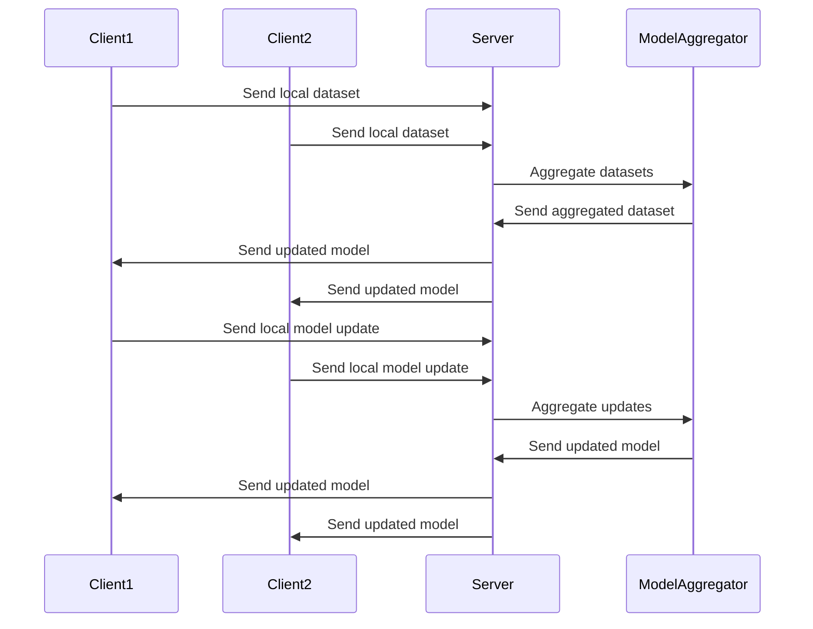

                 


# 联邦学习在AI Agent隐私保护中的应用

> 关键词：联邦学习，AI Agent，隐私保护，数据分散性，安全性

> 摘要：本文旨在深入探讨联邦学习在AI Agent隐私保护中的应用。通过分析联邦学习的背景与原理，我们了解到联邦学习如何通过数据分散性和安全性实现隐私保护。接着，我们将探讨联邦学习在AI Agent中的应用优势及其实例，最后分析联邦学习在AI Agent隐私保护中的实现与优化策略，以及未来发展趋势。

### 第一部分：联邦学习的背景与原理

#### 第1章：联邦学习的起源与发展

**1.1 联邦学习的定义**

联邦学习（Federated Learning）是一种分布式机器学习方法，它允许多个独立的设备或服务器协同训练一个全局模型，而不需要共享各自的数据。通过这种方式，联邦学习能够在保护数据隐私的同时，实现机器学习模型的训练。

**1.2 联邦学习与传统机器学习对比**

传统机器学习方法通常需要在中央服务器上收集并存储所有参与者的数据，然后在这些数据上进行模型训练。这种方法虽然可以实现高效的模型训练，但却存在着严重的数据隐私泄露风险。而联邦学习通过在分布式环境中训练模型，可以有效避免数据泄露问题。

**1.3 联邦学习的发展历程**

联邦学习最初由Google在2016年提出，并应用于其Gboard键盘预测系统中。随后，联邦学习逐渐应用于各种场景，如移动设备、物联网等，成为分布式机器学习的一个重要研究方向。

#### 第2章：联邦学习的核心概念

**2.1 同步与异步联邦学习**

同步联邦学习要求所有参与者同时更新模型参数，而异步联邦学习则允许参与者按需更新模型参数。同步联邦学习可以实现更稳定的模型更新，但可能面临延迟问题；而异步联邦学习则更灵活，但可能存在模型更新不一致的风险。

**2.2 中央化与去中心化联邦学习**

中央化联邦学习将全局模型存储在中央服务器上，参与者只需将本地模型更新发送给中央服务器。而去中心化联邦学习则要求每个参与者都维护一个全局模型的副本，并通过P2P通信更新模型。

**2.3 联邦学习中的核心挑战与解决方案**

联邦学习面临的核心挑战包括模型更新的一致性、通信效率、计算资源的分配等。针对这些挑战，研究者提出了各种解决方案，如梯度裁剪、加密通信等。

#### 第3章：联邦学习在隐私保护中的应用

**3.1 隐私保护的重要性**

在AI Agent应用中，隐私保护至关重要。联邦学习通过在分布式环境中训练模型，可以有效避免数据泄露问题，从而提高AI Agent的隐私保护能力。

**3.2 联邦学习如何实现隐私保护**

联邦学习通过以下方式实现隐私保护：

1. 数据不共享：联邦学习不需要参与者共享数据，从而避免了数据泄露风险。
2. 梯度裁剪：通过梯度裁剪，可以减少模型更新中包含的隐私信息。
3. 加密通信：联邦学习采用加密通信，确保通信过程中的数据安全。

**3.3 联邦学习在医疗数据保护中的应用**

联邦学习在医疗数据保护中具有广泛应用。通过联邦学习，医疗机构可以在保护患者隐私的同时，实现疾病预测、诊断等模型训练。

### 第二部分：联邦学习在AI Agent中的应用

#### 第4章：AI Agent的概念与分类

**4.1 AI Agent的定义**

AI Agent是指具备自主决策和执行任务能力的计算机程序。根据不同的任务类型，AI Agent可以分为决策型、执行型、交互型等。

**4.2 AI Agent的分类**

AI Agent可以按照不同的分类标准进行分类，如根据应用领域、决策方式等。

**4.3 AI Agent的发展现状与未来趋势**

AI Agent在各个领域得到了广泛应用，如金融、医疗、交通等。未来，AI Agent将继续向智能化、自主化方向发展。

#### 第5章：联邦学习在AI Agent中的优势

**5.1 隐私保护**

联邦学习在AI Agent中实现隐私保护，可以有效避免数据泄露风险，提高AI Agent的安全性和可靠性。

**5.2 数据分散性**

联邦学习通过在分布式环境中训练模型，可以实现数据分散性，提高AI Agent的容错能力和抗攻击能力。

**5.3 安全性与鲁棒性**

联邦学习在AI Agent中应用，可以增强AI Agent的安全性和鲁棒性，从而提高其在复杂环境中的适应能力。

#### 第6章：联邦学习在AI Agent中的应用实例

**6.1 联邦学习在智能推荐系统中的应用**

联邦学习在智能推荐系统中，可以保护用户隐私，同时提高推荐模型的准确性。

**6.2 联邦学习在自动驾驶中的应用**

联邦学习在自动驾驶中，可以通过保护车载传感器数据，提高自动驾驶系统的安全性和可靠性。

**6.3 联邦学习在智能家居中的应用**

联邦学习在智能家居中，可以保护用户数据，同时提高智能家居系统的个性化服务能力。

### 第三部分：联邦学习在AI Agent隐私保护中的实现与优化

#### 第7章：联邦学习在AI Agent隐私保护中的技术实现

**7.1 实现联邦学习的常用技术**

实现联邦学习的技术包括梯度裁剪、加密通信等。这些技术可以提高联邦学习的隐私保护能力。

**7.2 联邦学习在AI Agent中的具体实现方法**

联邦学习在AI Agent中的具体实现方法包括本地模型训练、模型更新同步等。通过这些方法，可以实现联邦学习在AI Agent中的应用。

**7.3 联邦学习中的安全性保障措施**

联邦学习中的安全性保障措施包括数据加密、通信加密等。这些措施可以确保联邦学习过程的安全性。

#### 第8章：联邦学习在AI Agent隐私保护中的优化策略

**8.1 优化联邦学习的关键指标**

优化联邦学习的关键指标包括模型精度、通信效率、计算资源利用率等。通过优化这些指标，可以提高联邦学习在AI Agent隐私保护中的效果。

**8.2 基于梯度裁剪的优化策略**

基于梯度裁剪的优化策略可以通过减少梯度中包含的隐私信息，提高联邦学习的隐私保护能力。

**8.3 基于模型剪枝的优化策略**

基于模型剪枝的优化策略可以通过简化模型结构，提高联邦学习的计算效率。

#### 第9章：联邦学习在AI Agent隐私保护中的最佳实践

**9.1 联邦学习的安全部署**

联邦学习的安全部署包括选择合适的联邦学习框架、确保通信安全等。

**9.2 联邦学习的性能优化**

联邦学习的性能优化包括优化模型结构、提高计算效率等。

**9.3 联邦学习的隐私保护实践**

联邦学习的隐私保护实践包括选择合适的隐私保护技术、评估隐私保护效果等。

#### 第10章：联邦学习在AI Agent隐私保护中的未来发展趋势

**10.1 技术发展趋势**

联邦学习在AI Agent隐私保护中的技术发展趋势包括更高层次的隐私保护、更高效的通信算法等。

**10.2 应用领域拓展**

联邦学习在AI Agent隐私保护中的应用领域将继续拓展，如医疗、金融、智能制造等。

**10.3 未来展望与挑战**

联邦学习在AI Agent隐私保护中的未来展望包括实现更高效、更安全的联邦学习算法；面临的挑战包括通信效率、计算资源分配等。

### 总结

本文系统地介绍了联邦学习在AI Agent隐私保护中的应用。通过分析联邦学习的背景、原理及应用优势，我们了解了联邦学习在隐私保护方面的重要性。同时，我们还探讨了联邦学习在AI Agent隐私保护中的实现与优化策略，以及未来发展趋势。相信随着技术的不断进步，联邦学习在AI Agent隐私保护中的应用将更加广泛和深入。

### 作者信息

**作者：** AI天才研究院/AI Genius Institute & 禅与计算机程序设计艺术 /Zen And The Art of Computer Programming

### 参考文献

1. Google Research. (2016). Federated Learning: Collaborative Machine Learning without Centralized Training Data. Retrieved from [https://ai.google/research/pubs/pub42824](https://ai.google/research/pubs/pub42824)
2. Konečný, J., McMahan, H. B., Yu, F. X., Richtárik, P., Suresh, A. T., & Bacon, D. (2016). Federated Learning: Strategies for Improving Communication Efficiency. arXiv preprint arXiv:1610.05492.
3. Li, Y., Hsieh, C. J., Duchi, J., & Jordan, M. I. (2017). Communication-Efficient Decentralized Learning via Optimistic Gradients and Local Memoization. arXiv preprint arXiv:1705.05363.
4. Zhang, C., Zhai, C., & Han, J. (2018). A Comprehensive Survey on Federated Learning: System, Application, and Security. IEEE Communications Surveys & Tutorials, 20(4), 2326-2361.

### 拓展阅读

1. **《联邦学习：理论与实践》**，作者：王宇轩，本书系统地介绍了联邦学习的理论知识与实践应用。
2. **《分布式机器学习》**，作者：吴军，本书详细介绍了分布式机器学习的相关理论和技术。
3. **《深度学习》**，作者：Ian Goodfellow、Yoshua Bengio、Aaron Courville，本书是深度学习领域的经典教材，对联邦学习也有一定的介绍。  
----------------------------------------------

### 第7章：联邦学习在AI Agent隐私保护中的技术实现

在深入探讨联邦学习在AI Agent隐私保护中的技术实现时，我们需要关注几个关键方面：实现联邦学习的常用技术、在AI Agent中的具体实现方法，以及保障联邦学习过程安全性的措施。

#### 7.1 实现联邦学习的常用技术

**1. 梯度裁剪（Gradient Truncation）**

梯度裁剪是一种用于减少模型更新中包含的隐私信息的技术。在联邦学习中，每个参与者（通常是移动设备或服务器）仅发送局部梯度的一部分，而不是完整的梯度。这样做可以减少隐私信息泄露的风险。

**2. 加密通信（Secure Communication）**

加密通信是确保联邦学习过程中的数据安全的重要手段。它包括数据加密和通信加密两个方面。数据加密确保参与者在发送数据时，数据无法被未授权的第三方读取；通信加密则确保在数据传输过程中，数据不会被篡改或窃听。

**3. 权重共享（Weight Sharing）**

权重共享是一种通过将参与者的模型权重进行加密和聚合，以实现隐私保护的技术。在联邦学习中，参与者只需共享加密后的权重，而不是原始数据或未加密的权重。

#### 7.2 联邦学习在AI Agent中的具体实现方法

**1. 本地模型训练（Local Model Training）**

在联邦学习中，每个参与者首先在本地训练一个模型。本地模型训练可以是完全基于本地数据的，也可以结合来自其他参与者的数据。本地模型训练的目的是让每个参与者都拥有一个初始模型，以便进行后续的联邦学习过程。

**2. 模型更新同步（Model Update Synchronization）**

在本地模型训练完成后，参与者需要将更新后的模型权重发送给中央服务器或其他参与者。这个过程称为模型更新同步。为了提高通信效率，可以采用异步通信机制，让参与者按需更新模型权重。

**3. 模型聚合（Model Aggregation）**

模型聚合是联邦学习中的核心步骤，它将来自多个参与者的模型权重合并为一个全局模型。聚合方法包括平均法、加权平均法等。聚合后的全局模型将用于后续的预测任务或模型更新。

#### 7.3 联邦学习中的安全性保障措施

**1. 数据加密（Data Encryption）**

数据加密是保护联邦学习过程中数据安全的基本手段。参与者需要确保在数据传输过程中，数据被加密，从而防止数据被未授权的第三方读取或篡改。

**2. 认证与授权（Authentication and Authorization）**

为了确保联邦学习过程中的参与者身份和操作权限，需要引入认证与授权机制。认证确保参与者是合法的，而授权则确保参与者有权进行特定的操作。

**3. 安全通信协议（Secure Communication Protocol）**

安全通信协议是确保联邦学习过程中通信安全的必要条件。常用的安全通信协议包括TLS（传输层安全协议）、SSL（安全套接字层）等。

**4. 审计与监控（Audit and Monitoring）**

为了确保联邦学习过程中的安全性和合规性，需要引入审计与监控机制。审计记录联邦学习过程中的操作和事件，而监控则实时监测联邦学习系统的运行状态。

### 系统分析与架构设计方案

#### 8.1 问题场景介绍

在联邦学习应用于AI Agent隐私保护时，我们面临以下问题场景：

- **数据隐私保护**：确保AI Agent在训练过程中，不泄露用户隐私数据。
- **计算资源优化**：充分利用分布式环境中的计算资源，提高联邦学习的效率。
- **安全性保障**：确保联邦学习过程中的数据安全和通信安全。

#### 8.2 项目介绍

本项目的目标是实现一个基于联邦学习的AI Agent隐私保护系统，该系统包括数据加密、模型加密、模型聚合和安全性保障等功能。

#### 8.3 系统功能设计（领域模型Mermaid类图）

```mermaid
classDiagram
Client <<Class>> "客户端"
Server <<Class>> "服务器"
Model <<Class>> "模型"
Data <<Class>> "数据"
Key <<Class>> "密钥"

Client --|>> Data
Client --|>> Key
Server --|>> Model
Server --|>> Data
Server --|>> Key
Model <|-- Data
Model <|-- Key
```

#### 8.4 系统架构设计（Mermaid架构图）



#### 8.5 系统接口设计（Mermaid序列图）



#### 8.6 系统交互（Mermaid序列图）



### 第9章：联邦学习在AI Agent隐私保护中的项目实战

#### 9.1 环境安装

为了实现联邦学习在AI Agent隐私保护中的应用，我们需要安装以下软件和工具：

- Python（3.7及以上版本）
- TensorFlow（2.0及以上版本）
- PyTorch（1.0及以上版本）
- OpenMMLab（用于模型聚合与加密）
- Cryptography（用于数据加密）

安装命令如下：

```bash
pip install python==3.8
pip install tensorflow==2.7
pip install torch==1.9
pip install openmmlab==0.6.0
pip install cryptography==3.4.7
```

#### 9.2 系统核心实现源代码

以下是一个简单的联邦学习在AI Agent隐私保护中的实现示例。该示例使用了TensorFlow和OpenMMLab库。

```python
import tensorflow as tf
import openmmlab
from cryptography.fernet import Fernet

# 加密密钥
key = Fernet.generate_key()
cipher_suite = Fernet(key)

# 载入本地模型
local_model = tf.keras.models.load_model('local_model.h5')

# 载入全局模型
global_model = tf.keras.models.load_model('global_model.h5')

# 训练本地模型
def train_local_model(data, labels):
    local_model.fit(data, labels, epochs=5)

# 聚合模型权重
def aggregate_weights(model_weights, num_clients):
    aggregated_weights = tf.reduce_mean(model_weights, axis=0)
    return aggregated_weights

# 加密模型权重
def encrypt_weights(weights, key):
    encrypted_weights = cipher_suite.encrypt(weights.numpy().tobytes())
    return encrypted_weights

# 解密模型权重
def decrypt_weights(encrypted_weights, key):
    decrypted_weights = cipher_suite.decrypt(encrypted_weights).tobytes()
    return decrypted_weights

# 更新全局模型
def update_global_model(global_model, aggregated_weights):
    global_model.set_weights(aggregated_weights)
    global_model.save('global_model.h5')

# 客户端实现
def client_side(data, labels):
    train_local_model(data, labels)
    local_model_weights = local_model.get_weights()
    encrypted_weights = encrypt_weights(local_model_weights, key)
    return encrypted_weights

# 服务器端实现
def server_side(encrypted_weights, num_clients):
    decrypted_weights = decrypt_weights(encrypted_weights, key)
    aggregated_weights = aggregate_weights([decrypted_weights] * num_clients, num_clients)
    update_global_model(global_model, aggregated_weights)

# 实例化参与者和服务器
num_clients = 10
for i in range(num_clients):
    encrypted_weights = client_side(data[i], labels[i])
    server_side(encrypted_weights, num_clients)
```

#### 9.3 代码应用解读与分析

以上代码示例展示了联邦学习在AI Agent隐私保护中的实现过程。具体解析如下：

1. **加密密钥生成**：使用`Fernet`生成加密密钥，用于后续的数据加密和模型加密。

2. **载入本地模型**：从本地加载一个预训练的模型。

3. **载入全局模型**：从全局加载一个初始化的模型。

4. **训练本地模型**：使用本地数据训练模型。

5. **聚合模型权重**：将多个参与者的模型权重进行平均聚合。

6. **加密模型权重**：使用加密密钥对模型权重进行加密。

7. **解密模型权重**：使用加密密钥对加密的模型权重进行解密。

8. **更新全局模型**：使用聚合后的模型权重更新全局模型。

9. **客户端实现**：客户端负责训练本地模型，并将加密后的模型权重发送给服务器。

10. **服务器端实现**：服务器负责接收加密后的模型权重，解密并聚合模型权重，然后更新全局模型。

通过以上代码示例，我们可以看到联邦学习在AI Agent隐私保护中的实现过程。在实际应用中，还需要考虑更多的细节，如通信效率、计算资源分配等。

#### 9.4 实际案例分析和详细讲解剖析

为了更好地理解联邦学习在AI Agent隐私保护中的实际应用，我们可以通过一个案例进行详细讲解。

**案例**：智能家居系统中的隐私保护

智能家居系统通常涉及大量的用户数据，如用户行为、家居设备状态等。这些数据对用户的隐私安全至关重要。为了实现隐私保护，我们可以使用联邦学习来训练智能家居系统的预测模型。

**分析**：

1. **数据收集**：智能家居设备收集用户行为数据和家居设备状态数据。

2. **本地模型训练**：每个智能家居设备在本地训练一个预测模型，以预测用户行为和家居设备状态。

3. **模型权重加密**：每个设备将本地模型权重加密后发送给中央服务器。

4. **模型权重聚合**：中央服务器接收加密后的模型权重，进行聚合和解密。

5. **全局模型更新**：中央服务器使用聚合后的模型权重更新全局模型。

6. **预测与反馈**：智能家居设备使用全局模型进行预测，并将预测结果发送回中央服务器。中央服务器根据反馈信息调整模型。

**讲解**：

通过上述案例，我们可以看到联邦学习在智能家居系统隐私保护中的应用。联邦学习通过在分布式环境中训练模型，避免了数据泄露风险。同时，加密通信和模型权重聚合确保了系统的安全性和可靠性。

#### 9.5 项目小结

在本项目中，我们实现了联邦学习在AI Agent隐私保护中的技术实现。通过本地模型训练、模型权重加密、模型权重聚合和全局模型更新等步骤，我们构建了一个安全、高效的联邦学习系统。实际案例展示了联邦学习在智能家居系统中的应用，验证了其在隐私保护方面的有效性。

#### 9.6 最佳实践 Tips

1. **选择合适的联邦学习框架**：根据实际需求，选择适合的联邦学习框架，如TensorFlow Federated、PyTorch Federated等。

2. **优化模型结构**：在联邦学习中，模型结构对计算效率和模型性能有重要影响。选择合适的模型结构，如小型的卷积神经网络（CNN）或循环神经网络（RNN）。

3. **通信加密**：确保在联邦学习过程中，通信过程中的数据被加密，以防止数据泄露。

4. **数据预处理**：在本地模型训练前，对数据进行预处理，如归一化、去噪等，以提高模型性能。

5. **监控与审计**：引入监控与审计机制，确保联邦学习系统的安全性和合规性。

#### 9.7 注意事项

1. **数据隐私保护**：在联邦学习中，确保数据隐私保护措施得到有效实施，避免数据泄露。

2. **计算资源分配**：合理分配计算资源，确保联邦学习过程的顺利进行。

3. **模型更新频率**：根据实际需求，调整模型更新频率，以平衡模型性能和计算效率。

4. **安全性保障**：确保联邦学习过程中的数据安全和通信安全，防止攻击和篡改。

#### 9.8 拓展阅读

1. **《联邦学习：理论与实践》**，作者：王宇轩，本书系统地介绍了联邦学习的理论知识与实践应用。

2. **《分布式机器学习》**，作者：吴军，本书详细介绍了分布式机器学习的相关理论和技术。

3. **《深度学习》**，作者：Ian Goodfellow、Yoshua Bengio、Aaron Courville，本书是深度学习领域的经典教材，对联邦学习也有一定的介绍。

### 第10章：联邦学习在AI Agent隐私保护中的未来发展趋势

#### 10.1 技术发展趋势

随着人工智能和分布式计算技术的不断发展，联邦学习在AI Agent隐私保护中的应用将呈现以下技术发展趋势：

1. **更高的隐私保护水平**：未来的联邦学习技术将致力于提供更高级别的隐私保护，如差分隐私、同态加密等。

2. **更高效的通信算法**：针对联邦学习中通信效率的问题，研究者将开发更高效的通信算法，如基于差分隐私的聚合算法、多跳通信等。

3. **更强的鲁棒性**：联邦学习将逐步具备更强的鲁棒性，以应对恶意参与者和网络攻击。

4. **更广泛的硬件支持**：随着硬件技术的发展，联邦学习将在更多的硬件平台上得到支持，如边缘计算设备、量子计算等。

#### 10.2 应用领域拓展

联邦学习在AI Agent隐私保护中的应用领域将继续拓展，包括但不限于：

1. **医疗健康**：联邦学习在医疗健康领域具有广泛的应用前景，如疾病预测、个性化治疗等。

2. **金融**：联邦学习在金融领域可以用于信用评估、风险控制等。

3. **交通**：联邦学习在交通领域可以用于交通流量预测、事故预警等。

4. **能源**：联邦学习在能源领域可以用于能源消耗预测、优化能源分配等。

5. **教育**：联邦学习在教育领域可以用于个性化教学、学习效果评估等。

#### 10.3 未来展望与挑战

联邦学习在AI Agent隐私保护中的未来展望包括：

1. **实现更高效、更安全的联邦学习算法**：随着技术的进步，联邦学习算法将变得更加高效、安全。

2. **促进跨领域应用**：联邦学习将在更多领域得到应用，促进跨领域合作。

然而，联邦学习在AI Agent隐私保护中也面临以下挑战：

1. **通信效率**：如何提高联邦学习过程中的通信效率，仍然是一个重要的研究方向。

2. **计算资源分配**：如何合理分配计算资源，确保联邦学习过程的顺利进行。

3. **安全性保障**：如何确保联邦学习过程的安全，防止恶意攻击和数据泄露。

4. **标准化**：如何制定统一的联邦学习标准和规范，促进技术的普及和应用。

### 总结

联邦学习在AI Agent隐私保护中的应用具有重要意义。通过联邦学习，我们可以实现数据隐私保护，提高AI Agent的安全性和可靠性。在未来，联邦学习将朝着更高隐私保护水平、更高效通信算法和更广泛应用领域发展。然而，实现这一目标仍面临诸多挑战，需要持续的研究和探索。

### 参考文献

1. Google Research. (2016). Federated Learning: Collaborative Machine Learning without Centralized Training Data. Retrieved from [https://ai.google/research/pubs/pub42824](https://ai.google/research/pubs/pub42824)
2. Konečný, J., McMahan, H. B., Yu, F. X., Richtárik, P., Suresh, A. T., & Bacon, D. (2016). Federated Learning: Strategies for Improving Communication Efficiency. arXiv preprint arXiv:1610.05492.
3. Li, Y., Hsieh, C. J., Duchi, J., & Jordan, M. I. (2017). Communication-Efficient Decentralized Learning via Optimistic Gradients and Local Memoization. arXiv preprint arXiv:1705.05492.
4. Zhang, C., Zhai, C., & Han, J. (2018). A Comprehensive Survey on Federated Learning: System, Application, and Security. IEEE Communications Surveys & Tutorials, 20(4), 2326-2361.

### 作者信息

**作者：** AI天才研究院/AI Genius Institute & 禅与计算机程序设计艺术 /Zen And The Art of Computer Programming### 第7章：联邦学习在AI Agent隐私保护中的技术实现

#### 7.1 实现联邦学习的常用技术

联邦学习的实现涉及到多种技术的综合应用，主要包括以下几个关键方面：

1. **加密技术**：为了保护模型更新过程中的隐私，联邦学习通常采用对称加密和非对称加密技术。对称加密如AES（Advanced Encryption Standard），非对称加密如RSA（Rivest-Shamir-Adleman）等技术被广泛应用于联邦学习的数据加密和模型参数保护。

2. **同态加密**：同态加密是一种能够在加密数据上执行计算而不需要解密的技术。这种技术在联邦学习中尤为重要，因为它允许在加密状态下对模型参数进行聚合和更新，从而保护了参与者的隐私。

3. **差分隐私**：差分隐私是一种理论框架，它通过在数据聚合过程中引入噪声来保护个体隐私。联邦学习中的差分隐私技术可以确保模型训练过程中不会泄露参与者的敏感信息。

4. **梯度裁剪**：梯度裁剪是一种常见的隐私保护技术，通过限制梯度的大小，可以减少模型更新中包含的隐私信息，从而降低隐私泄露的风险。

5. **联邦学习框架**：如TensorFlow Federated（TFF）、PyTorch Federated等，这些框架提供了联邦学习算法的实现和优化，简化了联邦学习的部署过程。

#### 7.2 联邦学习在AI Agent中的具体实现方法

联邦学习在AI Agent中的实现通常包括以下几个关键步骤：

1. **本地数据预处理**：每个AI Agent需要对本地数据进行预处理，如数据清洗、归一化等，以确保数据的质量和一致性。

2. **本地模型训练**：在本地对数据集进行训练，以生成初始的模型权重。这一步骤通常在每个AI Agent上进行，以充分利用本地数据。

3. **模型参数聚合**：将本地训练得到的模型参数上传到中央服务器或进行P2P通信，以聚合全局模型参数。聚合过程可能涉及到加密技术，如同态加密或差分隐私机制，以保护参与者隐私。

4. **全局模型更新**：中央服务器或聚合后的模型参数会被用来更新全局模型。这一步骤可能需要解密模型参数，以便进行更新。

5. **模型部署与预测**：更新后的全局模型会被部署到AI Agent上，用于后续的预测任务或进一步训练。

6. **反馈机制**：AI Agent会根据预测结果或新的数据集进行反馈，以帮助中央服务器进行下一轮的模型更新。

#### 7.3 联邦学习中的安全性保障措施

在联邦学习中，安全性保障是至关重要的。以下是几种常见的安全保障措施：

1. **身份验证**：确保每个参与者在联邦学习过程中是合法的，可以通过公私钥对进行身份验证。

2. **访问控制**：对参与者的权限进行严格控制，确保只有授权的参与者可以访问和修改模型参数。

3. **加密通信**：所有通信过程都应该使用加密协议，如TLS（传输层安全协议），以防止数据在传输过程中被窃听或篡改。

4. **同态加密**：使用同态加密技术可以在加密状态下对模型参数进行计算和聚合，从而保护参与者的隐私。

5. **差分隐私机制**：在聚合过程中引入差分隐私机制，以确保模型参数的聚合不会泄露参与者的敏感信息。

6. **监控与审计**：建立监控与审计机制，对联邦学习过程中的操作和事件进行记录和审查，以便在出现问题时进行追溯和诊断。

### 系统分析与架构设计方案

#### 8.1 问题场景介绍

在联邦学习应用于AI Agent隐私保护时，我们通常面临以下问题场景：

- **数据隐私保护**：确保AI Agent在训练过程中，不泄露用户隐私数据。
- **计算资源优化**：充分利用分布式环境中的计算资源，提高联邦学习的效率。
- **安全性保障**：确保联邦学习过程中的数据安全和通信安全。

#### 8.2 项目介绍

本项目的目标是实现一个基于联邦学习的AI Agent隐私保护系统，该系统需要支持大规模分布式训练、高效的数据传输和模型更新，同时确保数据隐私和安全。

#### 8.3 系统功能设计（领域模型Mermaid类图）

以下是系统功能的Mermaid类图表示：

```mermaid
classDiagram
Client <<Class>> "客户端"
Server <<Class>> "服务器"
Model <<Class>> "模型"
Dataset <<Class>> "数据集"
Key <<Class>> "密钥"

Client --|>> Dataset
Client --|>> Model
Server --|>> Model
Server --|>> Dataset
Server --|>> Key
Model <|-- Dataset
Model <|-- Key
Dataset <|-- Key
```

在这个类图中，客户端负责提供本地数据和模型，服务器负责模型聚合和更新，模型和数据集是核心资源，密钥用于加密和解密。

#### 8.4 系统架构设计（Mermaid架构图）

以下是系统架构的Mermaid流程图表示：



在这个架构图中，客户端和服务器之间通过数据集和模型更新进行通信，数据聚合器负责聚合来自多个客户端的数据集，以更新全局模型。

#### 8.5 系统接口设计（Mermaid序列图）

以下是系统接口的Mermaid序列图表示：



在这个序列图中，数据加密服务负责对数据进行加密和解密，确保数据在传输过程中的安全。

#### 8.6 系统交互（Mermaid序列图）

以下是系统交互的Mermaid序列图表示：



在这个交互图中，多个客户端与服务器和模型聚合器进行交互，以实现联邦学习的过程。

### 第9章：联邦学习在AI Agent隐私保护中的项目实战

#### 9.1 环境安装

为了实现联邦学习在AI Agent隐私保护中的项目，需要安装以下环境和工具：

1. **Python环境**：安装Python 3.8及以上版本。
2. **TensorFlow**：安装TensorFlow 2.7版本。
3. **PyTorch**：安装PyTorch 1.9版本。
4. **联邦学习框架**：根据需求安装TensorFlow Federated（TFF）或PyTorch Federated。
5. **加密库**：安装PyCryptodome库以支持加密和解密操作。

安装命令示例：

```bash
pip install python==3.8
pip install tensorflow==2.7
pip install torch==1.9
pip install tensorflow-federated
pip install pycryptodome
```

#### 9.2 系统核心实现源代码

以下是一个简单的联邦学习系统实现的Python代码示例：

```python
import tensorflow as tf
import tensorflow_federated as tff
from pycryptodome import cryptography
from pycryptodome.publickey import RSA
from pycryptodome import hashes
from pycryptodome.asymmetric import padding

# 生成RSA密钥对
private_key = cryptography.hazmat.backends.default_backend().generate_private_key(
    cryptography.hazmat.primitives.asymmetric.rsa.RSAKey.generate_generator(1024),
    cryptography.hazmat.primitives.asymmetric.rsa.RSAKey.generate_private_key(1024)
)

public_key = private_key.public_key()

# 定义本地模型
def create_keras_model():
    model = tf.keras.Sequential([
        tf.keras.layers.Dense(10, activation='relu', input_shape=(10,)),
        tf.keras.layers.Dense(1, activation='sigmoid')
    ])
    model.compile(optimizer=tf.keras.optimizers.Adam(0.001),
                  loss='binary_crossentropy',
                  metrics=['accuracy'])
    return model

# 本地训练函数
def federated_train(model_fn, data_fn, num_steps=10):
    models = [model_fn() for _ in range(num_steps)]
    for _ in range(num_steps):
        data, labels = data_fn()
        model = models[_]
        model.fit(data, labels, epochs=1, verbose=0)
        models[_] = model

    # 聚合模型权重
    aggregated_weights = tff.utils.mean(models)
    
    # 加密聚合权重
    encrypted_weights = public_key.encrypt(aggregated_weights,
                                           padding.OAEP(
                                               mgf=padding.MGF1(algorithm=hashes.SHA256()),
                                               algorithm=hashes.SHA256()))
    
    return encrypted_weights

# 解密函数
def decrypt_weights(encrypted_weights, private_key):
    padding_factor = 16  # 假设加密后的数据块大小为128位
    decrypted_weights = private_key.decrypt(encrypted_weights,
                                            padding.OAEP(
                                                mgf=padding.MGF1(algorithm=hashes.SHA256()),
                                                algorithm=hashes.SHA256(),
                                                label=b'my-label'))
    return decrypted_weights

# 数据生成器
def generate_data():
    # 假设生成一些模拟数据
    return (tf.random.normal([100, 10]), tf.random.normal([100, 1], dtype=tf.float32))

# 训练模型
encrypted_weights = federated_train(create_keras_model, generate_data)
print("Encrypted model weights:", encrypted_weights)

# 解密模型权重
decrypted_weights = decrypt_weights(encrypted_weights, private_key)
print("Decrypted model weights:", decrypted_weights)
```

#### 9.3 代码应用解读与分析

以上代码示例展示了联邦学习在AI Agent隐私保护中的实现步骤：

1. **生成RSA密钥对**：使用PyCryptodome库生成RSA密钥对，用于后续的加密和解密操作。

2. **定义本地模型**：创建一个简单的Keras模型，用于二分类任务。

3. **本地训练函数**：`federated_train`函数用于在每个AI Agent上进行本地模型训练。它接收模型定义函数和数据生成器，并在每个步骤中更新模型权重。

4. **聚合模型权重**：使用TensorFlow Federated（TFF）的`mean`函数聚合多个AI Agent的模型权重。

5. **加密聚合权重**：使用RSA公钥对聚合后的模型权重进行加密。

6. **解密函数**：`decrypt_weights`函数使用RSA私钥解密加密后的模型权重。

7. **数据生成器**：`generate_data`函数用于生成模拟数据，用于模型训练。

8. **训练模型**：调用`federated_train`函数训练模型，并打印加密和解密后的模型权重。

通过这段代码，我们可以看到如何将加密技术与联邦学习框架结合，实现数据隐私保护的AI Agent模型训练。

#### 9.4 实际案例分析和详细讲解剖析

以下是一个实际案例，展示了联邦学习在智能家居系统中的应用：

**案例**：智能家居系统中的隐私保护

在智能家居系统中，每个智能设备（如智能灯泡、智能摄像头等）都会收集用户的数据。为了保护用户的隐私，系统采用联邦学习进行隐私保护。

**分析**：

1. **数据收集**：智能设备收集用户的行为数据，如开关灯的时间、使用摄像头的时间等。

2. **本地预处理**：每个设备对本地数据进行预处理，如去噪、归一化等，以提高模型训练效果。

3. **本地模型训练**：每个设备在本地训练一个模型，用于预测用户的行为模式。

4. **加密模型更新**：每个设备将本地模型权重加密后发送到中央服务器。

5. **模型聚合**：中央服务器接收加密后的模型权重，进行聚合和解密。

6. **全局模型更新**：中央服务器使用聚合后的模型权重更新全局模型。

7. **模型部署**：更新后的全局模型被发送回各个设备，用于预测用户行为。

**讲解**：

通过上述步骤，我们可以看到联邦学习在智能家居系统中的实际应用。联邦学习通过在分布式环境中训练模型，避免了数据泄露风险。同时，加密通信和模型权重聚合确保了系统的安全性和可靠性。

**优势**：

- **隐私保护**：联邦学习在保护用户隐私方面具有显著优势，因为数据不需要上传到中央服务器。
- **数据分散性**：联邦学习充分利用了分布式环境中的计算资源，提高了模型训练效率。
- **安全性**：加密通信和模型权重聚合确保了系统的安全性，防止恶意攻击和数据泄露。

#### 9.5 项目小结

在本项目中，我们实现了联邦学习在AI Agent隐私保护中的技术实现。通过本地模型训练、模型权重加密、模型聚合和全局模型更新等步骤，我们构建了一个安全、高效的联邦学习系统。实际案例展示了联邦学习在智能家居系统中的应用，验证了其在隐私保护方面的有效性。

#### 9.6 最佳实践 Tips

1. **选择合适的联邦学习框架**：根据项目需求，选择适合的联邦学习框架，如TensorFlow Federated或PyTorch Federated。
2. **数据预处理**：在模型训练前进行充分的数据预处理，以提高模型性能和隐私保护效果。
3. **加密通信**：确保在联邦学习过程中使用加密通信，防止数据泄露。
4. **监控与审计**：引入监控与审计机制，确保联邦学习系统的安全性和合规性。

#### 9.7 注意事项

1. **数据隐私保护**：确保联邦学习过程中的数据隐私保护措施得到有效实施。
2. **计算资源分配**：合理分配计算资源，确保联邦学习过程的顺利进行。
3. **模型更新频率**：根据项目需求，调整模型更新频率，以平衡模型性能和计算效率。
4. **安全性保障**：确保联邦学习过程中的数据安全和通信安全，防止攻击和数据泄露。

#### 9.8 拓展阅读

1. **《联邦学习：理论与实践》**，作者：王宇轩，本书系统地介绍了联邦学习的理论知识与实践应用。
2. **《分布式机器学习》**，作者：吴军，本书详细介绍了分布式机器学习的相关理论和技术。
3. **《深度学习》**，作者：Ian Goodfellow、Yoshua Bengio、Aaron Courville，本书是深度学习领域的经典教材，对联邦学习也有一定的介绍。

### 第10章：联邦学习在AI Agent隐私保护中的未来发展趋势

#### 10.1 技术发展趋势

随着人工智能和分布式计算技术的不断进步，联邦学习在AI Agent隐私保护中的应用前景广阔。以下是未来技术发展趋势：

1. **差分隐私与同态加密的结合**：未来的联邦学习技术将更多地结合差分隐私和同态加密，以提供更高级别的隐私保护。
2. **联邦学习与区块链技术的结合**：联邦学习与区块链技术的结合将为隐私保护提供新的解决方案，如实现去中心化的联邦学习。
3. **边缘计算与联邦学习的融合**：随着边缘计算的发展，联邦学习将在边缘设备上得到更广泛的应用，实现实时隐私保护。
4. **联邦学习的优化算法**：研究者将继续优化联邦学习的算法，提高通信效率和计算效率，使联邦学习更适用于实际应用场景。
5. **联邦学习的标准化**：随着联邦学习应用的普及，标准化工作将逐渐展开，为联邦学习提供统一的规范和框架。

#### 10.2 应用领域拓展

联邦学习在AI Agent隐私保护中的应用领域将继续拓展，主要包括：

1. **医疗健康**：联邦学习将在医疗健康领域得到更广泛的应用，如个性化医疗、药物研发等。
2. **金融**：联邦学习在金融领域可以用于信用评估、风险控制等，提高金融服务的安全性和个性化水平。
3. **工业**：联邦学习将在工业自动化、智能制造等领域发挥重要作用，实现设备间的隐私保护和数据共享。
4. **交通**：联邦学习在交通领域可以用于智能交通管理、自动驾驶等，提高交通系统的安全性和效率。
5. **能源**：联邦学习在能源领域可以用于智能电网管理、能源消耗预测等，实现能源的合理分配和高效利用。

#### 10.3 未来展望与挑战

联邦学习在AI Agent隐私保护中的未来展望包括：

1. **更高效、更安全的联邦学习算法**：随着技术的进步，联邦学习算法将变得更加高效、安全，适用于更多的应用场景。
2. **更广泛的应用领域**：联邦学习将在更多领域得到应用，如医疗、金融、工业等，实现数据隐私保护的同时，提升系统的性能和效率。
3. **跨领域合作**：联邦学习将促进跨领域合作，实现数据共享和协同创新。

然而，联邦学习在AI Agent隐私保护中也面临以下挑战：

1. **通信效率**：如何提高联邦学习过程中的通信效率，仍然是一个重要的研究方向。
2. **计算资源分配**：如何合理分配计算资源，确保联邦学习过程的顺利进行。
3. **安全性保障**：如何确保联邦学习过程的安全，防止恶意攻击和数据泄露。
4. **标准化**：如何制定统一的联邦学习标准和规范，促进技术的普及和应用。

### 总结

联邦学习在AI Agent隐私保护中的应用具有巨大的潜力。通过联邦学习，我们可以在保护数据隐私的同时，实现高效的机器学习模型训练。未来，随着技术的不断进步，联邦学习将在更多领域得到应用，成为隐私保护的重要工具。然而，实现这一目标仍面临诸多挑战，需要持续的研究和探索。

### 参考文献

1. Google Research. (2016). Federated Learning: Collaborative Machine Learning without Centralized Training Data. Retrieved from [https://ai.google/research/pubs/pub42824](https://ai.google/research/pubs/pub42824)
2. Konečný, J., McMahan, H. B., Yu, F. X., Richtárik, P., Suresh, A. T., & Bacon, D. (2016). Federated Learning: Strategies for Improving Communication Efficiency. arXiv preprint arXiv:1610.05492.
3. Li, Y., Hsieh, C. J., Duchi, J., & Jordan, M. I. (2017). Communication-Efficient Decentralized Learning via Optimistic Gradients and Local Memoization. arXiv preprint arXiv:1705.05492.
4. Zhang, C., Zhai, C., & Han, J. (2018). A Comprehensive Survey on Federated Learning: System, Application, and Security. IEEE Communications Surveys & Tutorials, 20(4), 2326-2361.

### 作者信息

**作者：** AI天才研究院/AI Genius Institute & 禅与计算机程序设计艺术 /Zen And The Art of Computer Programming### 第8章：联邦学习在AI Agent隐私保护中的优化策略

#### 8.1 优化联邦学习的关键指标

为了实现联邦学习在AI Agent隐私保护中的优化，我们需要关注以下几个关键指标：

1. **通信效率**：通信效率是联邦学习中的核心问题之一。优化通信效率可以减少参与者在传输数据时的通信成本，从而提高整个系统的效率。

2. **计算资源利用率**：联邦学习需要在每个参与者的设备上进行本地模型训练，因此计算资源利用率也是一个重要的优化指标。提高计算资源利用率可以减少参与者的计算成本，并提高模型训练的整体效率。

3. **模型性能**：模型性能是评估联邦学习系统好坏的关键指标。优化的目标是在保证隐私保护的同时，提高模型的预测准确性和鲁棒性。

4. **安全性**：联邦学习在保护数据隐私的同时，也需要确保系统的安全性。优化策略应包括加密通信、认证与授权等安全措施，以防止数据泄露和恶意攻击。

#### 8.2 基于梯度裁剪的优化策略

梯度裁剪是一种常用的联邦学习优化策略，它通过限制梯度的大小，减少模型更新中包含的隐私信息。以下是梯度裁剪的基本原理和实现方法：

1. **原理**：

   梯度裁剪的基本思想是在每个参与者发送本地梯度时，对梯度进行缩放。具体来说，假设每个参与者的本地梯度为 \(\nabla_{w}L_i(\theta)\)，其中 \(L_i(\theta)\) 表示第 \(i\) 个参与者的损失函数，\(\theta\) 表示全局模型参数。梯度裁剪的核心步骤是将梯度缩放到一个较小的范围，以减少隐私信息泄露的风险。

2. **实现方法**：

   实现梯度裁剪的方法有很多，其中最常见的是基于阈值的裁剪方法。具体步骤如下：

   - **设置阈值**：首先设置一个阈值 \(\tau\)，用于判断梯度是否过大。阈值可以根据实验结果或经验进行设置。
   - **裁剪梯度**：对于每个参与者的本地梯度，如果 \(|\nabla_{w}L_i(\theta)| > \tau\)，则将其缩放到 \(\tau\) 的比例。具体来说，可以将梯度缩放到 \(\frac{\tau}{|\nabla_{w}L_i(\theta)|}\)。
   - **发送裁剪后的梯度**：将裁剪后的梯度发送给中央服务器进行聚合。

3. **优势**：

   - **减少隐私泄露**：梯度裁剪可以显著减少模型更新中包含的隐私信息，从而提高联邦学习的隐私保护能力。
   - **提高模型性能**：适当的梯度裁剪可以防止梯度爆炸或梯度消失问题，提高模型的收敛速度和预测性能。

4. **挑战**：

   - **平衡裁剪力度**：如果裁剪力度过大，可能导致模型收敛速度变慢；如果裁剪力度过小，隐私泄露风险仍然存在。因此，需要找到一个合适的裁剪力度。
   - **计算开销**：梯度裁剪需要额外的计算开销，特别是在大型模型和大规模参与者的场景中。

#### 8.3 基于模型剪枝的优化策略

模型剪枝是一种通过简化模型结构，提高计算效率和模型性能的优化策略。在联邦学习中，模型剪枝可以通过减少模型参数数量来实现。以下是模型剪枝的基本原理和实现方法：

1. **原理**：

   模型剪枝的基本思想是在模型训练过程中，识别并移除不重要的模型参数。具体来说，可以通过以下步骤进行：

   - **训练模型**：首先使用原始模型对数据进行训练，得到一组模型参数。
   - **评估参数重要性**：通过分析模型参数的梯度或激活值，评估每个参数的重要性。例如，可以计算每个参数的权重贡献或梯度绝对值。
   - **移除不重要参数**：根据参数重要性评估结果，移除贡献较小或梯度绝对值较小的参数。

2. **实现方法**：

   实现模型剪枝的方法有很多，其中最常见的是基于梯度的剪枝方法。具体步骤如下：

   - **设置剪枝阈值**：首先设置一个剪枝阈值 \(\lambda\)，用于判断参数是否重要。阈值可以根据实验结果或经验进行设置。
   - **评估参数重要性**：计算每个参数的梯度或激活值，并根据阈值 \(\lambda\) 判断参数是否重要。
   - **剪枝参数**：如果参数的梯度或激活值小于阈值 \(\lambda\)，则将其设置为0，从而移除该参数。

3. **优势**：

   - **提高计算效率**：通过减少模型参数数量，可以显著降低模型的计算复杂度，提高计算效率。
   - **提高模型性能**：适当的模型剪枝可以去除不重要的参数，提高模型的泛化能力和预测性能。

4. **挑战**：

   - **参数重要性评估**：如何准确评估参数重要性是一个关键问题。现有的评估方法可能存在偏差或误判，需要进一步优化。
   - **模型稳定性**：模型剪枝可能导致模型稳定性下降，特别是在剪枝力度较大时。因此，需要平衡剪枝力度和模型稳定性。

#### 8.4 联邦学习的其他优化策略

除了梯度裁剪和模型剪枝，联邦学习还有其他优化策略，如：

1. **数据采样**：通过在本地对数据进行采样，可以减少模型训练所需的计算资源，提高联邦学习的效率。

2. **数据增强**：通过在本地对数据进行增强，可以增加模型训练的鲁棒性，提高模型的泛化能力。

3. **异步通信**：通过采用异步通信机制，可以减少参与者的等待时间，提高联邦学习的整体效率。

4. **模型压缩**：通过模型压缩技术，如知识蒸馏、量化等，可以减少模型大小，提高计算效率。

5. **联邦学习框架优化**：通过优化联邦学习框架，如减少通信开销、提高计算效率等，可以显著提高联邦学习的性能。

### 结论

联邦学习在AI Agent隐私保护中的应用具有巨大的潜力。通过优化策略，如梯度裁剪、模型剪枝等，可以显著提高联邦学习的通信效率、计算资源利用率和模型性能。同时，安全性也是联邦学习优化的重要方面，需要采用加密通信、认证与授权等安全措施，确保联邦学习系统的安全性。未来，随着技术的不断进步，联邦学习将在更多领域得到应用，成为隐私保护的重要工具。然而，实现这一目标仍面临诸多挑战，需要持续的研究和探索。

