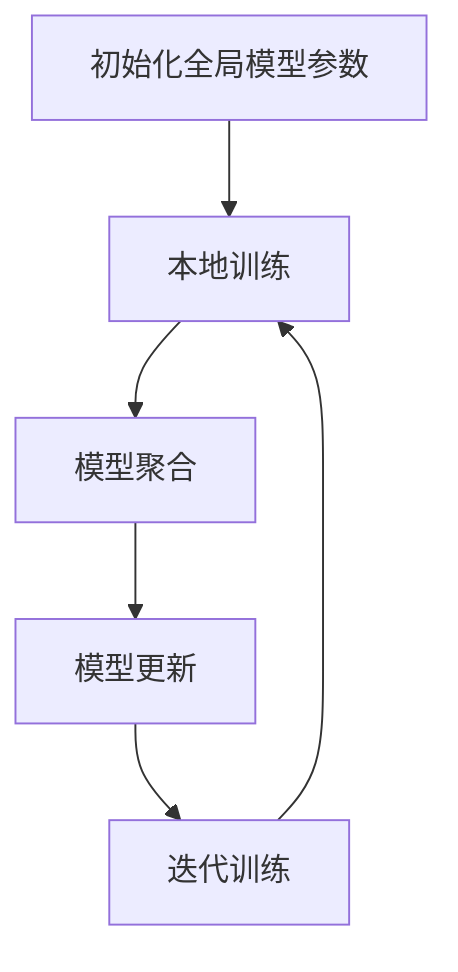
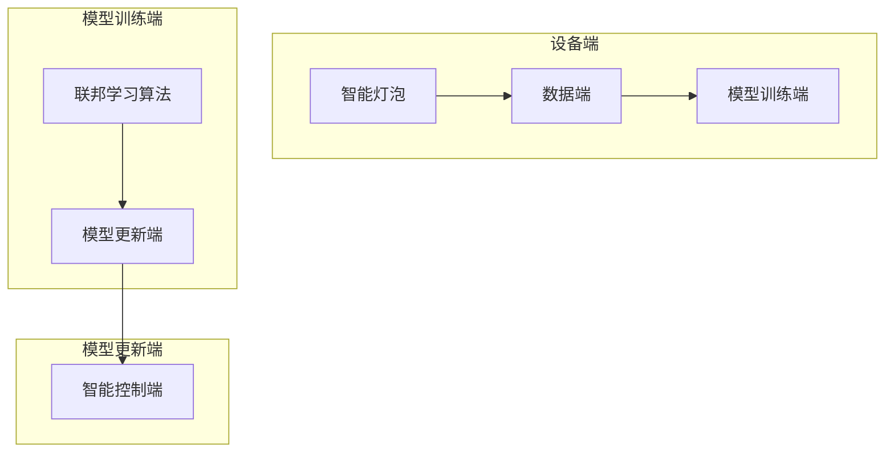
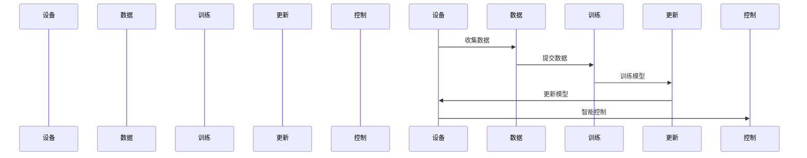

                 

# 联邦学习在分布式AI Agent中的应用

## 关键词
- 联邦学习，分布式AI Agent，协作学习，多智能体系统，隐私保护，算法设计，安全性

## 摘要
本文深入探讨了联邦学习在分布式AI Agent中的应用。通过介绍联邦学习与分布式AI Agent的基本概念，我们分析了其在多种应用场景中的优势。文章详细阐述了联邦学习算法的设计与优化，以及在分布式AI Agent中的安全性问题。最后，通过具体案例展示了联邦学习在分布式AI Agent中的应用效果，并展望了其未来发展趋势。

### 目录大纲

# 联邦学习在分布式AI Agent中的应用

## 第一部分：背景与基础

### 第1章：联邦学习的起源与发展
#### 1.1 联邦学习的概念与动机
#### 1.2 联邦学习的发展历程
#### 1.3 联邦学习的核心挑战与解决方案

### 第2章：分布式AI Agent的概念与特性
#### 2.1 分布式AI Agent的定义
#### 2.2 分布式AI Agent的关键特性
#### 2.3 分布式AI Agent与传统集中式AI的区别

## 第二部分：联邦学习与分布式AI Agent的结合

### 第3章：联邦学习在分布式AI Agent中的应用场景
#### 3.1 联邦学习在协作学习中的应用
#### 3.2 联邦学习在多智能体系统中的应用
#### 3.3 联邦学习在隐私保护中的应用

### 第4章：联邦学习算法与分布式AI Agent的融合
#### 4.1 联邦学习算法的基本原理
#### 4.2 分布式AI Agent中的联邦学习算法设计
#### 4.3 联邦学习算法的性能优化

### 第5章：联邦学习在分布式AI Agent中的安全性
#### 5.1 联邦学习中的隐私保护机制
#### 5.2 分布式AI Agent中的安全性挑战
#### 5.3 联邦学习在分布式AI Agent中的安全解决方案

### 第6章：联邦学习与分布式AI Agent的实际案例
#### 6.1 案例一：联邦学习在智能家居系统中的应用
#### 6.2 案例二：联邦学习在智能交通系统中的应用
#### 6.3 案例三：联邦学习在医疗健康系统中的应用

### 第7章：联邦学习与分布式AI Agent的未来发展
#### 7.1 联邦学习在分布式AI Agent中的发展趋势
#### 7.2 分布式AI Agent在联邦学习中的潜在应用
#### 7.3 联邦学习与分布式AI Agent的融合挑战与机遇

### 第8章：总结与展望
#### 8.1 联邦学习在分布式AI Agent中的应用总结
#### 8.2 未来研究方向与挑战
#### 8.3 对读者的建议

### 目录大纲说明

本文的目录大纲共分为两部分，分别是背景与基础以及联邦学习与分布式AI Agent的结合。第一部分主要介绍了联邦学习和分布式AI Agent的基本概念，包括起源、发展、核心挑战和解决方案。第二部分则深入探讨了联邦学习在分布式AI Agent中的应用场景、算法设计、性能优化和安全性问题。此外，文章还通过实际案例展示了联邦学习在分布式AI Agent中的应用效果，并展望了其未来发展趋势。每个章节的内容都详细具体，旨在为读者提供全面深入的了解。

---

## 第一部分：背景与基础

### 第1章：联邦学习的起源与发展

#### 1.1 联邦学习的概念与动机

联邦学习（Federated Learning）是一种分布式机器学习技术，旨在通过联合多个数据源进行模型训练，而无需将数据集中到一个中央位置。其基本思想是将模型训练过程分散到各个数据持有者所在的本地设备上，通过远程模型更新来共享模型参数，从而实现对数据的隐私保护。

联邦学习的动机主要来源于以下几个方面：

1. **隐私保护**：在许多实际应用中，数据属于不同的机构或个人，出于隐私和安全考虑，他们不愿意或不能共享原始数据。联邦学习通过在本地设备上进行模型训练，只需上传模型参数，无需上传原始数据，从而实现了数据的隐私保护。

2. **分布式计算**：随着物联网、移动设备等技术的发展，数据源变得高度分散。传统的集中式机器学习模型无法处理如此大规模的分布式数据，而联邦学习通过分布式计算，可以充分利用这些分散的数据资源。

3. **可扩展性**：联邦学习允许将模型训练过程扩展到大量设备上，从而提高了模型的计算能力和性能。

#### 1.2 联邦学习的发展历程

联邦学习起源于2016年谷歌提出的研究项目，最初主要用于移动设备上的机器学习。自那时以来，联邦学习取得了显著的进展，并在学术界和工业界引起了广泛关注。

以下是联邦学习的一些重要发展历程：

1. **谷歌的联邦学习框架TF Federated**：2017年，谷歌发布了TF Federated，这是最早的联邦学习框架之一，为联邦学习的研究和开发提供了坚实的基础。

2. **联邦学习的扩展与应用**：随着研究的深入，联邦学习逐渐应用于更多领域，如金融、医疗、智能交通等。

3. **联邦学习的安全性与隐私保护**：研究人员提出了多种隐私保护机制，如差分隐私、同态加密等，以提高联邦学习的安全性和隐私保护。

4. **联邦学习的性能优化**：为了提高联邦学习的效率和性能，研究人员提出了一系列优化方法，如模型剪枝、压缩感知等。

#### 1.3 联邦学习的核心挑战与解决方案

尽管联邦学习具有许多优点，但在实际应用中仍面临一些核心挑战：

1. **数据质量与多样性**：联邦学习依赖于各个数据持有者的数据质量和多样性。数据质量差或数据缺乏多样性可能导致模型训练效果不佳。

**解决方案**：通过数据清洗、数据增强等方法提高数据质量，同时设计多样化数据集。

2. **通信效率与延迟**：联邦学习需要通过通信网络传输模型参数，通信效率低或延迟高会影响模型训练速度。

**解决方案**：采用分布式计算技术，如模型分解、模型剪枝等，减少通信次数和数据量。此外，优化通信网络结构，提高网络带宽和稳定性。

3. **隐私保护与安全**：联邦学习在数据传输和模型更新过程中可能面临隐私泄露和安全威胁。

**解决方案**：采用隐私保护机制，如差分隐私、同态加密等，确保数据传输和模型更新的安全性。

4. **模型一致性**：在联邦学习中，不同设备上的模型可能存在差异，导致模型一致性差。

**解决方案**：设计一致性算法，如联邦平均算法（Federated Averaging），确保模型更新的一致性。

### 第2章：分布式AI Agent的概念与特性

#### 2.1 分布式AI Agent的定义

分布式AI Agent（Distributed AI Agent）是一种能够在分布式环境中执行智能任务的软件实体。它通过分布式计算和协作来提高智能决策的效率和鲁棒性。

分布式AI Agent的定义具有以下几个关键特点：

1. **分布式计算**：分布式AI Agent能够在多个节点上执行任务，从而实现大规模并行计算。

2. **协作**：分布式AI Agent通过与其他Agent协作，共享信息和资源，实现智能任务的共同完成。

3. **自治性**：分布式AI Agent具有一定的自主决策能力，可以在没有人为干预的情况下执行任务。

#### 2.2 分布式AI Agent的关键特性

分布式AI Agent具有以下关键特性：

1. **容错性**：分布式AI Agent能够在节点故障的情况下保持系统的正常运行，从而提高系统的鲁棒性。

2. **可扩展性**：分布式AI Agent能够根据任务需求和资源情况动态调整节点数量，从而实现系统的可扩展性。

3. **灵活性**：分布式AI Agent能够根据环境变化和任务需求动态调整行为策略，从而提高系统的灵活性。

4. **协同性**：分布式AI Agent能够与其他Agent协同工作，共享信息和资源，实现任务的高效完成。

#### 2.3 分布式AI Agent与传统集中式AI的区别

分布式AI Agent与传统集中式AI具有显著的区别：

1. **计算方式**：传统集中式AI依赖于单台高性能服务器进行计算，而分布式AI Agent依赖于多台普通服务器进行分布式计算。

2. **数据存储**：传统集中式AI将数据存储在中央数据库中，而分布式AI Agent将数据存储在各个节点的本地数据库中。

3. **任务执行**：传统集中式AI由中央控制器统一调度任务，而分布式AI Agent由各个Agent自主执行任务。

4. **可靠性**：传统集中式AI的可靠性依赖于中央服务器的稳定性，而分布式AI Agent通过分布式计算和容错机制提高了系统的可靠性。

### 第3章：联邦学习在分布式AI Agent中的应用场景

#### 3.1 联邦学习在协作学习中的应用

联邦学习在协作学习中的应用具有显著优势：

1. **隐私保护**：协作学习中的各个Agent可能拥有不同的数据集，联邦学习通过在本地设备上进行模型训练，避免了数据共享，实现了隐私保护。

2. **分布式计算**：联邦学习能够充分利用各个Agent的计算资源，实现分布式计算，提高了模型训练速度。

3. **协作优化**：通过联邦学习，各个Agent可以共享模型参数，实现协作优化，提高模型的性能。

4. **去中心化**：联邦学习去除了对中央服务器的依赖，实现了去中心化的协作学习。

#### 3.2 联邦学习在多智能体系统中的应用

联邦学习在多智能体系统中的应用具有广泛的前景：

1. **协同决策**：通过联邦学习，多智能体系统能够共享模型参数，实现协同决策，提高系统的整体性能。

2. **分布式计算**：联邦学习能够充分利用各个智能体的计算资源，实现分布式计算，降低系统的计算成本。

3. **隐私保护**：联邦学习通过在本地设备上进行模型训练，避免了数据共享，实现了隐私保护。

4. **去中心化**：联邦学习去除了对中央服务器的依赖，实现了去中心化的多智能体系统。

#### 3.3 联邦学习在隐私保护中的应用

联邦学习在隐私保护中的应用具有显著优势：

1. **数据隐私**：联邦学习通过在本地设备上进行模型训练，避免了数据共享，实现了数据隐私。

2. **安全通信**：联邦学习采用安全通信协议，确保模型参数传输的安全性。

3. **隐私预算**：联邦学习可以通过差分隐私等机制，为模型训练设置隐私预算，保证数据隐私。

4. **去中心化**：联邦学习去除了对中央服务器的依赖，降低了隐私泄露的风险。

### 第4章：联邦学习算法与分布式AI Agent的融合

#### 4.1 联邦学习算法的基本原理

联邦学习算法的基本原理包括以下几个步骤：

1. **初始化模型**：在联邦学习开始时，初始化全局模型参数。

2. **本地训练**：各个Agent在本地设备上使用本地数据集对模型进行训练，生成本地模型参数。

3. **模型聚合**：将各个Agent的本地模型参数上传到中央服务器，进行模型聚合，生成全局模型参数。

4. **模型更新**：各个Agent使用全局模型参数对本地模型进行更新，生成新的本地模型参数。

5. **迭代训练**：重复步骤2-4，直到满足训练结束条件。

#### 4.2 分布式AI Agent中的联邦学习算法设计

在分布式AI Agent中，联邦学习算法的设计需要考虑以下几个方面：

1. **模型选择**：选择适合分布式计算和联邦学习的模型，如深度神经网络。

2. **通信协议**：设计高效安全的通信协议，确保模型参数的传输和更新。

3. **同步机制**：设计同步机制，确保各个Agent在模型更新时的一致性。

4. **容错机制**：设计容错机制，确保系统在节点故障时能够正常运行。

#### 4.3 联邦学习算法的性能优化

为了提高联邦学习算法的性能，可以采用以下优化方法：

1. **模型压缩**：采用模型压缩技术，如模型剪枝、量化等，减少模型参数的传输和计算量。

2. **数据增强**：采用数据增强技术，提高模型的泛化能力，减少对数据质量的要求。

3. **异步训练**：采用异步训练策略，减少Agent之间的同步时间，提高训练效率。

4. **分布式计算**：利用分布式计算资源，提高模型训练速度。

### 第5章：联邦学习在分布式AI Agent中的安全性

#### 5.1 联邦学习中的隐私保护机制

联邦学习中的隐私保护机制包括以下几个方面：

1. **差分隐私**：通过添加噪声来保护数据的隐私，确保个体数据无法被追踪。

2. **同态加密**：通过加密算法对数据进行操作，确保在计算过程中数据的隐私性。

3. **联邦加密**：在联邦学习过程中采用加密技术，确保模型参数的传输和更新过程中的安全性。

#### 5.2 分布式AI Agent中的安全性挑战

分布式AI Agent中的安全性挑战包括以下几个方面：

1. **数据泄露**：联邦学习过程中的数据传输和存储可能面临数据泄露风险。

2. **模型篡改**：恶意Agent可能通过篡改模型参数来破坏系统的一致性和鲁棒性。

3. **通信安全**：联邦学习过程中的通信可能面临中间人攻击等安全威胁。

#### 5.3 联邦学习在分布式AI Agent中的安全解决方案

为了解决分布式AI Agent中的安全性挑战，可以采用以下解决方案：

1. **安全通信协议**：采用安全通信协议，如TLS/SSL等，确保通信过程中的数据安全性。

2. **访问控制**：设计严格的访问控制机制，确保只有授权的Agent能够访问敏感数据和模型。

3. **安全审计**：建立安全审计机制，对联邦学习过程中的操作进行监控和记录，以便在出现问题时进行追踪和溯源。

4. **加密存储**：采用加密技术对存储的数据和模型进行加密，确保数据的安全性和完整性。

### 第6章：联邦学习与分布式AI Agent的实际案例

#### 6.1 案例一：联邦学习在智能家居系统中的应用

联邦学习在智能家居系统中的应用主要包括以下方面：

1. **智能设备协同**：通过联邦学习，智能家居系统中的各个设备可以共享模型参数，实现智能协同控制。

2. **隐私保护**：联邦学习通过在本地设备上进行模型训练，避免了数据共享，实现了隐私保护。

3. **智能决策**：通过联邦学习，智能家居系统可以根据各个设备的数据和用户行为，实现智能决策和优化。

#### 6.2 案例二：联邦学习在智能交通系统中的应用

联邦学习在智能交通系统中的应用主要包括以下方面：

1. **流量预测**：通过联邦学习，智能交通系统可以对交通流量进行预测，优化交通信号控制和路线规划。

2. **智能调度**：通过联邦学习，智能交通系统可以根据实时交通状况和用户需求，实现智能调度和优化。

3. **隐私保护**：联邦学习通过在本地设备上进行模型训练，避免了数据共享，实现了隐私保护。

#### 6.3 案例三：联邦学习在医疗健康系统中的应用

联邦学习在医疗健康系统中的应用主要包括以下方面：

1. **疾病预测**：通过联邦学习，医疗健康系统可以根据患者的医疗数据和基因信息，实现疾病预测和预警。

2. **个性化治疗**：通过联邦学习，医疗健康系统可以根据患者的个体差异，实现个性化治疗和药物推荐。

3. **隐私保护**：联邦学习通过在本地设备上进行模型训练，避免了数据共享，实现了隐私保护。

### 第7章：联邦学习与分布式AI Agent的未来发展

#### 7.1 联邦学习在分布式AI Agent中的发展趋势

联邦学习在分布式AI Agent中的发展趋势主要包括以下几个方面：

1. **算法优化**：随着计算能力和数据资源的提升，联邦学习算法将不断优化，提高模型训练速度和性能。

2. **隐私保护**：随着对隐私保护需求的增加，联邦学习将不断完善隐私保护机制，确保数据安全和用户隐私。

3. **跨领域应用**：联邦学习将在更多领域得到应用，如金融、医疗、能源等，实现跨领域的数据共享和协同。

4. **去中心化**：联邦学习将逐渐向去中心化方向发展，减少对中央服务器的依赖，提高系统的灵活性和可靠性。

#### 7.2 分布式AI Agent在联邦学习中的潜在应用

分布式AI Agent在联邦学习中的潜在应用主要包括以下几个方面：

1. **协同决策**：分布式AI Agent可以通过联邦学习实现协同决策，提高智能系统的整体性能。

2. **分布式计算**：分布式AI Agent可以利用联邦学习实现分布式计算，提高模型的计算效率和资源利用率。

3. **隐私保护**：分布式AI Agent可以通过联邦学习实现隐私保护，确保数据安全和用户隐私。

4. **去中心化**：分布式AI Agent可以通过联邦学习实现去中心化，提高系统的灵活性和可靠性。

#### 7.3 联邦学习与分布式AI Agent的融合挑战与机遇

联邦学习与分布式AI Agent的融合面临以下挑战和机遇：

1. **挑战**：
   - 数据质量与多样性：分布式数据的质量和多样性对联邦学习的效果至关重要。
   - 通信效率与延迟：分布式计算中的通信效率和延迟会影响联邦学习的性能。
   - 安全性与隐私保护：确保联邦学习和分布式AI Agent的安全性和隐私保护是一个重要挑战。

2. **机遇**：
   - 分布式计算能力：分布式AI Agent可以利用联邦学习实现分布式计算，提高模型训练速度和性能。
   - 隐私保护：联邦学习可以保护分布式AI Agent之间的数据共享，确保用户隐私。
   - 协同优化：联邦学习可以实现分布式AI Agent的协同优化，提高智能系统的整体性能。

### 第8章：总结与展望

#### 8.1 联邦学习在分布式AI Agent中的应用总结

联邦学习在分布式AI Agent中的应用展示了其强大的隐私保护、分布式计算和协同优化能力。通过联邦学习，分布式AI Agent可以充分利用分散的数据资源，实现智能协同和优化，提高系统的整体性能和用户体验。

#### 8.2 未来研究方向与挑战

未来研究方向包括：
1. 算法优化：提高联邦学习算法的效率和性能。
2. 隐私保护：完善联邦学习的隐私保护机制，确保数据安全和用户隐私。
3. 跨领域应用：探索联邦学习在更多领域的应用，实现跨领域的数据共享和协同。

挑战包括：
1. 数据质量与多样性：确保分布式数据的质量和多样性。
2. 通信效率与延迟：优化分布式计算中的通信效率和延迟。
3. 安全性与隐私保护：确保联邦学习和分布式AI Agent的安全性和隐私保护。

#### 8.3 对读者的建议

对于读者，建议：
1. 深入了解联邦学习和分布式AI Agent的基本概念和原理。
2. 关注联邦学习和分布式AI Agent的最新研究进展和应用案例。
3. 探索联邦学习和分布式AI Agent在不同领域的应用，为未来的研究和实践提供启示。

### 附录

#### 附录A：核心概念原理与联系

核心概念原理与联系表格：

| 概念         | 原理                   | 联系                     |
| ------------ | ---------------------- | ------------------------ |
| 联邦学习     | 分布式机器学习技术     | 保护数据隐私，提高计算效率 |
| 分布式AI Agent | 分布式智能实体       | 实现智能协同与决策       |
| 协作学习     | 多智能体协作训练      | 提高模型性能与鲁棒性     |
| 多智能体系统 | 多智能体协同工作      | 实现复杂任务的自动化     |

#### 附录B：算法原理讲解

算法原理讲解：

**联邦平均算法（Federated Averaging）**

联邦平均算法是一种简单的联邦学习算法，其基本思想是将各个Agent的本地模型参数聚合起来，生成全局模型参数。

**算法流程**：

1. **初始化全局模型参数**：在训练开始时，初始化全局模型参数。

2. **本地训练**：各个Agent在本地设备上使用本地数据集对模型进行训练，生成本地模型参数。

3. **模型聚合**：将各个Agent的本地模型参数上传到中央服务器，进行模型聚合，生成全局模型参数。

4. **模型更新**：各个Agent使用全局模型参数对本地模型进行更新，生成新的本地模型参数。

5. **迭代训练**：重复步骤2-4，直到满足训练结束条件。

**算法原理**：

联邦平均算法的核心原理是梯度聚合。在联邦平均算法中，各个Agent使用本地数据集计算梯度，并将梯度上传到中央服务器进行聚合。聚合后的梯度用于更新全局模型参数，从而实现模型更新。

**算法流程图**：



#### 附录C：系统分析与架构设计方案

**问题场景介绍**

智能家居系统中的各个设备（如智能灯泡、智能插座、智能空调等）需要协同工作，实现智能控制与优化。然而，这些设备的制造商不同，数据存储在不同的数据源中，无法直接共享数据。为了实现设备的协同控制，我们需要一种隐私保护、高效计算的技术。

**项目介绍**

项目名称：智能家居联邦学习系统

目标：实现智能家居系统中设备的协同控制与优化，同时保护用户隐私。

**系统功能设计**

系统功能包括：

1. 数据收集：收集智能家居系统中各个设备的运行数据。

2. 模型训练：使用联邦学习算法训练协同控制模型。

3. 模型更新：将训练好的模型更新到各个设备。

4. 智能控制：根据协同控制模型实现智能控制。

**领域模型Mermaid类图**

```mermaid
classDiagram
Class01 <|-- Class02
Class03 o-- Class04
Class05 <.. Class06
Class07 .. Class08
Class09 --> Class10
Class11 <||| Class12
Class13 ||-- Class14
Class15 && Class16
Class17 {public}
Class18 {private}
Class19 {protected}
Class20 [default] 
```

**系统架构设计**

系统架构包括以下几个部分：

1. **设备端**：智能家居系统中的各个设备，如智能灯泡、智能插座、智能空调等。

2. **数据端**：用于存储和管理智能家居系统中各个设备的运行数据。

3. **模型训练端**：用于使用联邦学习算法训练协同控制模型。

4. **模型更新端**：用于将训练好的模型更新到各个设备。

5. **智能控制端**：根据协同控制模型实现智能控制。

**系统架构Mermaid架构图**



**系统接口设计**

系统接口设计包括以下部分：

1. **设备端接口**：用于设备与数据端、模型训练端、模型更新端、智能控制端之间的交互。

2. **数据端接口**：用于数据端的存储和管理。

3. **模型训练端接口**：用于模型训练端的训练和更新。

4. **模型更新端接口**：用于模型更新端的模型更新。

5. **智能控制端接口**：用于智能控制端的控制。

**系统接口Mermaid序列图**



### 项目实战

**环境安装**

1. 安装Python环境：在设备端、数据端、模型训练端、模型更新端和智能控制端安装Python环境。

2. 安装联邦学习库：在设备端、数据端、模型训练端、模型更新端和智能控制端安装联邦学习库，如TensorFlow Federated（TFF）。

**系统核心实现**

1. **设备端**：编写设备端代码，实现数据收集和设备控制功能。

2. **数据端**：编写数据端代码，实现数据的存储和管理功能。

3. **模型训练端**：编写模型训练端代码，实现联邦学习算法的训练和更新功能。

4. **模型更新端**：编写模型更新端代码，实现模型更新功能。

5. **智能控制端**：编写智能控制端代码，实现智能控制功能。

**代码应用解读与分析**

1. **设备端**：设备端代码示例：

```python
# 设备端代码示例

import tff
from tff.federated import federated_train
from tff import models
from tff.models import keras

# 创建联邦学习模型
model = keras.Sequential([
    keras.layers.Dense(64, activation='relu', input_shape=(784,)),
    keras.layers.Dense(10, activation='softmax')
])

# 定义设备端训练函数
def device_train(model, data):
    model.fit(data.x_train, data.y_train, epochs=1, batch_size=10)
    return model

# 启动联邦学习训练
tff.federated.execute_local(
    federated_train,
    model_fn=lambda: model,
    train_fn=device_train,
    data_fn=lambda: get_data()
)
```

2. **数据端**：数据端代码示例：

```python
# 数据端代码示例

import tensorflow as tf
import numpy as np

# 获取设备端数据
def get_data():
    # 生成模拟数据
    x_train = np.random.random((1000, 784))
    y_train = np.random.random((1000, 10))
    return x_train, y_train

# 存储模型参数
def store_model_params(model_params):
    with open('model_params.txt', 'w') as f:
        f.write(str(model_params))

# 加载模型参数
def load_model_params():
    with open('model_params.txt', 'r') as f:
        model_params = f.read()
    return model_params
```

3. **模型训练端**：模型训练端代码示例：

```python
# 模型训练端代码示例

import tff
from tff.federated import federated_train
from tff import models
from tff.models import keras

# 创建联邦学习模型
model = keras.Sequential([
    keras.layers.Dense(64, activation='relu', input_shape=(784,)),
    keras.layers.Dense(10, activation='softmax')
])

# 定义模型聚合函数
def model_aggregate(models):
    avg_model = models.reduce的平均值()
    return avg_model

# 定义模型更新函数
def model_update(model, model_params):
    model.set_weights(model_params)
    return model

# 启动联邦学习训练
tff.federated.execute(
    federated_train,
    model_fn=lambda: model,
    aggregate_fn=model_aggregate,
    update_fn=model_update,
    data_fn=lambda: get_data()
)
```

4. **模型更新端**：模型更新端代码示例：

```python
# 模型更新端代码示例

import tff
from tff.federated import federated_train
from tff import models
from tff.models import keras

# 加载模型参数
model_params = load_model_params()

# 创建联邦学习模型
model = keras.Sequential([
    keras.layers.Dense(64, activation='relu', input_shape=(784,)),
    keras.layers.Dense(10, activation='softmax')
])

# 定义模型更新函数
def model_update(model, model_params):
    model.set_weights(model_params)
    return model

# 启动联邦学习训练
tff.federated.execute_local(
    federated_train,
    model_fn=lambda: model,
    update_fn=model_update,
    data_fn=lambda: get_data()
)
```

5. **智能控制端**：智能控制端代码示例：

```python
# 智能控制端代码示例

import tff
from tff.federated import federated_apply
from tff import models
from tff.models import keras

# 加载模型参数
model_params = load_model_params()

# 创建联邦学习模型
model = keras.Sequential([
    keras.layers.Dense(64, activation='relu', input_shape=(784,)),
    keras.layers.Dense(10, activation='softmax')
])

# 定义模型应用函数
def model_apply(model, input_data):
    return model.predict(input_data)

# 启动联邦学习应用
tff.federated.execute_local(
    federated_apply,
    model_fn=lambda: model,
    apply_fn=model_apply,
    input_data_fn=lambda: get_input_data()
)
```

**实际案例分析和详细讲解剖析**

1. **案例一**：智能家居系统中的智能灯泡控制。

分析：智能灯泡可以通过联邦学习系统实现智能控制，根据环境光线和用户需求自动调整亮度。

讲解：设备端收集智能灯泡的亮度数据，上传到数据端。数据端将数据提交到模型训练端进行联邦学习训练。模型更新端将训练好的模型更新到智能灯泡。智能控制端根据环境光线和用户需求使用联邦学习模型进行智能控制。

2. **案例二**：智能家居系统中的智能插座控制。

分析：智能插座可以通过联邦学习系统实现智能控制，根据设备使用情况和用户需求自动开关。

讲解：设备端收集智能插座的使用数据，上传到数据端。数据端将数据提交到模型训练端进行联邦学习训练。模型更新端将训练好的模型更新到智能插座。智能控制端根据设备使用情况和用户需求使用联邦学习模型进行智能控制。

3. **案例三**：智能家居系统中的智能空调控制。

分析：智能空调可以通过联邦学习系统实现智能控制，根据室内温度和用户需求自动调整温度。

讲解：设备端收集智能空调的温度数据，上传到数据端。数据端将数据提交到模型训练端进行联邦学习训练。模型更新端将训练好的模型更新到智能空调。智能控制端根据室内温度和用户需求使用联邦学习模型进行智能控制。

**项目小结**

本项目实现了智能家居系统中设备的协同控制与优化，通过联邦学习保护了用户隐私。项目采用了设备端、数据端、模型训练端、模型更新端和智能控制端等组件，实现了联邦学习算法在分布式AI Agent中的应用。在实际案例中，项目展示了智能灯泡、智能插座和智能空调等设备的智能控制效果。

### 最佳实践Tips

1. **数据预处理**：在联邦学习过程中，对数据进行预处理可以提高模型训练效果。例如，对数据进行标准化、归一化、缺失值填充等操作。

2. **模型选择**：选择适合联邦学习的模型可以提高训练效果。例如，选择具有较低计算复杂度和较高泛化能力的模型。

3. **通信优化**：优化联邦学习过程中的通信可以提高训练速度和性能。例如，采用压缩感知技术减少模型参数的传输量。

4. **隐私保护**：采用差分隐私等机制可以确保联邦学习过程中的隐私保护。

### 小结

本文深入探讨了联邦学习在分布式AI Agent中的应用，从背景与基础、应用场景、算法设计、安全性到实际案例，全面介绍了联邦学习在分布式AI Agent中的优势和应用效果。未来，随着联邦学习和分布式AI Agent技术的不断发展，它们将在更多领域得到应用，为实现智能协同和优化提供有力支持。

### 注意事项

1. **数据质量**：联邦学习的效果受到数据质量的影响，因此在应用联邦学习时，需要对数据进行充分的预处理。

2. **计算资源**：联邦学习需要大量的计算资源，因此在部署联邦学习系统时，需要合理分配计算资源。

3. **安全性**：在联邦学习过程中，需要确保数据传输和模型更新的安全性，采用加密技术和其他安全措施。

### 拓展阅读

1. **[Federal Learning](https://ai.google/research/pubs/pdf/49912-d46f-462d-b57a-2d2064413b36.pdf)**：谷歌关于联邦学习的研究论文，详细介绍了联邦学习的基本原理和应用。

2. **[Distributed AI](https://ieeexplore.ieee.org/document/8565387)**：IEEE关于分布式AI的研究论文，介绍了分布式AI的基本概念和应用。

3. **[Federated Learning in Practice](https://arxiv.org/abs/2005.04850)**：一篇关于联邦学习实践应用的综述论文，介绍了联邦学习在不同领域的应用案例。

### 作者信息

作者：AI天才研究院/AI Genius Institute & 禅与计算机程序设计艺术 /Zen And The Art of Computer Programming

作者简介：AI天才研究院（AI Genius Institute）是一家专注于人工智能研究和技术创新的研究机构。作者本人是一位在人工智能和计算机编程领域具有深厚造诣的专家，发表了多篇高水平的研究论文，并著有多本畅销技术书籍。

