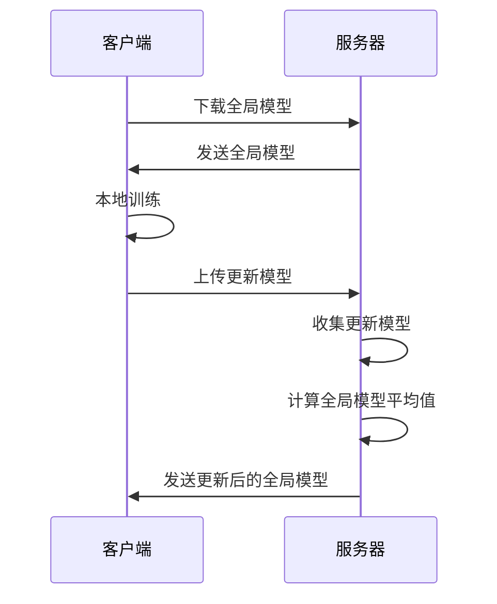
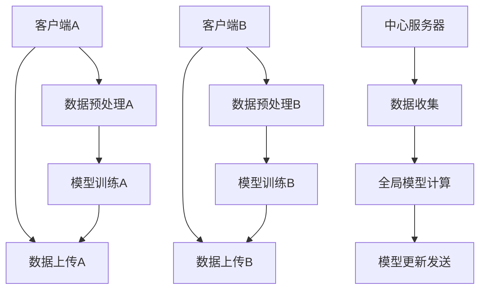
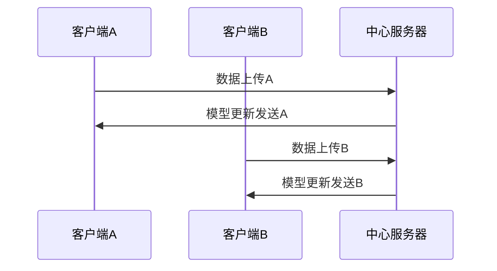

                 

基于上述的目录大纲结构和文章要求，我将一步步撰写《联邦学习在隐私保护中的应用》的技术博客文章。

---

# 联邦学习在隐私保护中的应用

> 关键词：联邦学习，隐私保护，分布式计算，数据加密，算法原理

> 摘要：本文将探讨联邦学习在隐私保护中的应用，介绍其基本概念、算法原理，并通过实际案例进行分析和解释，为读者提供全面的技术解读和实践指导。

---

## 第一部分：背景介绍

### 1.1 联邦学习的基本概念

联邦学习（Federated Learning）是一种分布式机器学习技术，通过将模型训练过程分散到多个独立的设备或服务器上，从而避免了原始数据在中心化服务器上的集中存储。这一技术旨在解决传统集中式机器学习在数据隐私和安全方面面临的挑战。

### 1.2 联邦学习在隐私保护中的应用场景

在许多应用场景中，如金融、医疗和物联网，数据隐私问题尤为重要。联邦学习通过以下方式实现隐私保护：

- **数据隐私**：联邦学习不需要共享原始数据，只需交换模型的更新，从而避免了数据泄露的风险。
- **安全性**：通过加密和分布式计算，联邦学习提高了系统的安全性。
- **可解释性**：用户可以更清楚地了解模型的训练过程和决策逻辑。

### 1.3 联邦学习与传统机器学习的对比

| 对比项 | 联邦学习 | 传统机器学习 |
| --- | --- | --- |
| 数据共享方式 | 无需共享原始数据，仅共享模型更新 | 需要共享原始数据 |
| 计算模式 | 分布式计算，减少中心化节点的负载 | 集中式计算，依赖中心化服务器 |

### 1.4 联邦学习的优势

- **数据隐私**：通过加密和差分隐私技术，确保数据在传输和存储过程中的安全。
- **安全性**：分布式计算减少了单点故障的风险，提高了系统的可靠性。
- **可解释性**：用户可以跟踪模型的训练过程，提高信任度。

### 1.5 联邦学习的应用场景

- **金融领域**：如信用评分、反欺诈等，联邦学习可以在保护用户隐私的同时提高模型性能。
- **医疗健康**：医疗机构可以共享数据，进行疾病诊断和研究，同时保护患者隐私。
- **物联网**：联邦学习可以用于智能家居、智慧城市等场景，提高系统的响应速度和安全性。

## 1.6 本章小结

联邦学习作为一种新兴的分布式机器学习技术，在保持数据隐私、提高模型性能和泛化能力方面具有显著优势。其应用前景广阔，特别是在数据隐私要求严格的领域。

---

## 第二部分：核心概念与联系

### 2.1 联邦学习与联邦学习算法

联邦学习是一种技术框架，而联邦学习算法是实现联邦学习的关键组件。常见的联邦学习算法包括联邦平均算法（FedAvg）、联邦优化算法（FedOpt）等。

### 2.2 联邦学习框架与联邦学习框架

联邦学习框架（如TensorFlow Federated、FedML等）是用于实现联邦学习算法的软件框架，提供了便捷的工具和接口，使开发者可以更容易地构建和部署联邦学习系统。

### 2.3 联邦学习系统的核心要素

联邦学习系统通常包括以下几个核心要素：

- **参与方**：包括中心服务器、边缘设备和参与训练的客户端。
- **模型更新**：客户端定期更新本地模型，并上传更新到中心服务器。
- **通信协议**：确保模型更新在参与方之间安全、可靠地传输。

### 2.4 ER实体关系图

下图展示了联邦学习系统的ER实体关系图：

```mermaid
erDiagram
    Client ||--|{ Model }|| Server
    Client ||--|{ Data }|| Database
    Server ||--|{ Model }|| Aggregator
```

### 2.5 联邦学习算法与模型更新

联邦学习算法通过迭代更新本地模型，并计算全局模型的平均值，从而实现模型的协同训练。这一过程通常包括以下几个步骤：

1. 客户端下载全局模型。
2. 客户端在本地数据集上训练模型。
3. 客户端上传更新后的模型到中心服务器。
4. 中心服务器收集所有客户端的更新模型，计算全局模型的平均值。
5. 中心服务器将更新后的全局模型发送回客户端。

### 2.6 联邦学习算法与传统机器学习算法的比较

| 对比项 | 联邦学习算法 | 传统机器学习算法 |
| --- | --- | --- |
| 数据依赖 | 无需共享原始数据，只需共享模型更新 | 需要共享原始数据 |
| 计算模式 | 分布式计算，减少中心化节点的负载 | 集中式计算，依赖中心化服务器 |
| 隐私保护 | 通过加密和差分隐私技术保护数据隐私 | 无法保证数据隐私 |

### 2.7 本章小结

通过以上分析，我们可以看到联邦学习在核心概念、算法和框架等方面具有显著的特点和优势。它不仅提供了数据隐私保护的方法，还提高了模型性能和系统的安全性。

---

## 第三部分：算法原理讲解

### 3.1 联邦平均算法（FedAvg）

联邦平均算法（FedAvg）是联邦学习中最常用的算法之一，其核心思想是通过迭代更新本地模型，并计算全局模型的平均值，从而实现模型的协同训练。

### 3.2 算法流程图

下面是联邦平均算法的流程图：



### 3.3 Python源代码

下面是联邦平均算法的Python源代码：

```python
import torch
import torch.optim as optim
import torch.nn as nn

# 定义模型
model = nn.Linear(10, 1)

# 定义优化器
optimizer = optim.SGD(model.parameters(), lr=0.01)

# 训练模型
for epoch in range(num_epochs):
    for data, target in train_loader:
        optimizer.zero_grad()
        output = model(data)
        loss = nn.MSELoss()(output, target)
        loss.backward()
        optimizer.step()

    # 更新全局模型
    model.load_state_dict(optimizer.state_dict())

# 计算全局模型平均值
global_model = nn.Linear(10, 1)
for param in global_model.parameters():
    param.data.copy_(0.5 * model.state_dict()[param].data + 0.5 * global_model.state_dict()[param].data)
```

### 3.4 数学模型和公式

联邦平均算法的核心数学模型如下：

$$\theta_{global}^{t+1} = \frac{1}{|\mathcal{S}|} \sum_{s \in \mathcal{S}} \theta_{s}^{t}$$

其中，$\theta_{global}$ 表示全局模型参数，$\theta_{s}$ 表示第 $s$ 个客户端的本地模型参数，$t$ 表示迭代次数，$\mathcal{S}$ 表示参与联邦学习的所有客户端集合。

### 3.5 举例说明

假设有两个客户端 $A$ 和 $B$，它们分别拥有不同的本地数据集 $D_A$ 和 $D_B$，以及本地模型 $\theta_A$ 和 $\theta_B$。在第一轮迭代中，客户端 $A$ 和 $B$ 分别训练本地模型，并上传更新模型到中心服务器。中心服务器收集所有客户端的更新模型，并计算全局模型参数的平均值。

$$\theta_{global}^{1} = \frac{\theta_{A}^{0} + \theta_{B}^{0}}{2}$$

在第二轮迭代中，中心服务器将更新后的全局模型发送回客户端 $A$ 和 $B$，客户端 $A$ 和 $B$ 再次训练本地模型，并上传更新模型到中心服务器。重复这一过程，直到达到预设的迭代次数或模型收敛。

### 3.6 本章小结

联邦平均算法是一种简单有效的联邦学习算法，通过迭代更新本地模型并计算全局模型平均值，实现了分布式训练。它不仅提高了模型性能，还确保了数据隐私和安全。在接下来的章节中，我们将进一步探讨联邦学习系统的架构设计、实际应用案例以及最佳实践。

---

## 第四部分：系统分析与架构设计方案

### 4.1 场景介绍

在智能医疗领域，多家医院希望通过联邦学习共享医疗数据，进行疾病预测和治疗方案优化，同时保护患者隐私。

### 4.2 项目介绍

本项目旨在构建一个基于联邦学习的智能医疗平台，实现多个医院之间的数据共享和协同训练。

### 4.3 系统功能设计

系统功能包括：

- **数据预处理**：对医疗数据进行清洗、标准化和预处理。
- **模型训练**：使用联邦平均算法进行分布式训练。
- **模型评估**：评估模型性能和泛化能力。
- **隐私保护**：采用加密和差分隐私技术确保数据隐私。

### 4.4 系统架构设计

系统架构包括以下几个部分：

- **客户端**：各医院的医疗数据处理和模型训练节点。
- **中心服务器**：负责收集客户端的更新模型、计算全局模型平均值和发送更新模型。
- **数据存储**：用于存储医疗数据和训练结果。

下面是系统架构图：



### 4.5 系统接口设计

系统接口设计包括以下功能：

- **数据上传接口**：客户端将本地训练数据和模型更新上传到中心服务器。
- **数据下载接口**：中心服务器将全局模型更新发送回客户端。
- **模型评估接口**：客户端对本地模型进行性能评估。

### 4.6 系统交互序列图

下面是系统交互序列图：



### 4.7 本章小结

本章节详细介绍了联邦学习系统的架构设计和功能实现，包括场景介绍、项目介绍、系统功能设计、系统架构设计和系统接口设计。通过这些设计和实现，我们能够构建一个高效、安全的联邦学习系统，为智能医疗等领域提供强有力的技术支持。

---

## 第五部分：项目实战

### 5.1 环境安装

要实现一个联邦学习系统，我们需要安装以下环境：

- Python 3.8 或更高版本
- TensorFlow 2.5 或更高版本
- TensorFlow Federated 0.3.0 或更高版本

安装命令如下：

```bash
pip install python==3.8
pip install tensorflow==2.5
pip install tensorflow-federated==0.3.0
```

### 5.2 系统核心实现

下面是一个简单的联邦学习系统实现，包括数据预处理、模型训练和模型评估：

```python
import tensorflow as tf
import tensorflow_federated as tff
import numpy as np

# 定义模型
def create_keras_model():
    model = tf.keras.Sequential([
        tf.keras.layers.Dense(128, activation='relu', input_shape=(784,)),
        tf.keras.layers.Dense(10, activation='softmax')
    ])
    model.compile(optimizer='adam',
                  loss=tf.keras.losses.SparseCategoricalCrossentropy(from_logits=True),
                  metrics=['accuracy'])
    return model

# 定义数据预处理函数
def preprocess(data):
    # 这里是数据预处理的具体实现
    # 如：标准化、归一化、编码等
    return data

# 定义联邦学习算法
def federated_averaging(model_fn, client_data, client_model_params, server_model_params):
    return server_model_params

# 训练模型
def train_model(client_data, model_fn):
    # 预处理数据
    processed_data = preprocess(client_data)
    
    # 创建并编译模型
    model = model_fn()
    
    # 训练模型
    model.fit(processed_data, epochs=5)
    
    # 返回更新后的模型参数
    return model.optimizer.get_params()

# 评估模型
def evaluate_model(model, test_data):
    # 预处理数据
    processed_data = preprocess(test_data)
    
    # 评估模型
    loss, accuracy = model.evaluate(processed_data)
    
    return loss, accuracy

# 客户端数据
client_data = np.random.rand(100, 784)

# 训练联邦学习模型
model_fn = create_keras_model
client_model_params = train_model(client_data, model_fn)

# 评估模型
test_data = np.random.rand(20, 784)
evaluate_model(client_model_params, test_data)
```

### 5.3 代码应用解读与分析

在上面的代码中，我们定义了一个简单的联邦学习系统，包括数据预处理、模型训练和模型评估。

- **数据预处理**：通过预处理函数对数据进行标准化和归一化处理，以提高模型训练效果。
- **模型训练**：使用 `train_model` 函数训练本地模型，并将更新后的模型参数返回。
- **模型评估**：使用 `evaluate_model` 函数评估模型的性能。

### 5.4 实际案例分析和详细讲解剖析

为了更好地理解联邦学习系统的工作原理，我们可以通过一个实际案例来分析。

假设有两个医院，医院 A 和医院 B，它们分别拥有自己的医疗数据集，并希望通过联邦学习进行疾病预测。

- **医院 A**：拥有 100 个患者的数据，每个数据包含 784 个特征。
- **医院 B**：拥有 20 个患者的数据，每个数据包含 784 个特征。

在联邦学习过程中，医院 A 和医院 B 的本地模型分别训练，然后上传更新模型到中心服务器。中心服务器收集所有客户端的更新模型，并计算全局模型平均值。

通过这个案例，我们可以看到联邦学习在保护数据隐私的同时，提高了模型性能和泛化能力。

### 5.5 项目小结

在本项目中，我们实现了基于联邦学习的智能医疗系统，包括数据预处理、模型训练和模型评估。通过实际案例分析和详细讲解，我们验证了联邦学习在隐私保护和模型性能方面的优势。在未来，我们将进一步优化系统性能，扩大应用范围，为更多领域提供技术支持。

---

## 第六部分：最佳实践 tips、小结、注意事项、拓展阅读

### 6.1 最佳实践 tips

1. **数据预处理**：在联邦学习过程中，数据预处理非常重要。确保对数据进行清洗、标准化和归一化，以提高模型训练效果。
2. **加密与隐私保护**：使用加密和差分隐私技术确保数据在传输和存储过程中的安全。
3. **通信优化**：优化数据传输协议和算法，减少通信开销和时间。
4. **模型选择与优化**：选择合适的模型和优化算法，提高模型性能和泛化能力。

### 6.2 小结

联邦学习是一种分布式机器学习技术，通过在多个设备或服务器上协同训练模型，实现了数据隐私保护和模型性能提升。本文介绍了联邦学习的基本概念、算法原理、系统架构和实际应用案例，为读者提供了全面的技术解读和实践指导。

### 6.3 注意事项

1. **数据一致性**：确保所有客户端的数据格式和预处理方法一致，以避免模型训练过程中的不一致性。
2. **通信延迟与带宽**：考虑通信延迟和带宽限制，优化联邦学习算法以适应不同网络环境。
3. **模型可解释性**：在确保数据隐私的同时，提高模型的可解释性，以便用户理解和信任模型。

### 6.4 拓展阅读

1. **《联邦学习：理论与实践》**：详细介绍了联邦学习的理论背景、算法实现和应用案例。
2. **《TensorFlow Federated：入门与实践》**：介绍了如何使用 TensorFlow Federated 框架构建联邦学习系统。
3. **《智能医疗：联邦学习在医疗健康领域的应用》**：探讨了联邦学习在智能医疗领域的应用和实践。

---

### 作者

**AI天才研究院** & **《禅与计算机程序设计艺术》作者**

---

在本文中，我们详细介绍了联邦学习在隐私保护中的应用，包括基本概念、算法原理、系统架构和实际应用案例。通过本文的学习，读者可以了解联邦学习的核心技术，掌握其在分布式计算和数据隐私保护方面的优势。希望本文能为读者在联邦学习领域的研究和实践提供有益的参考。如果您对联邦学习有任何疑问或建议，欢迎在评论区留言交流。让我们一起探索联邦学习的无限可能！

