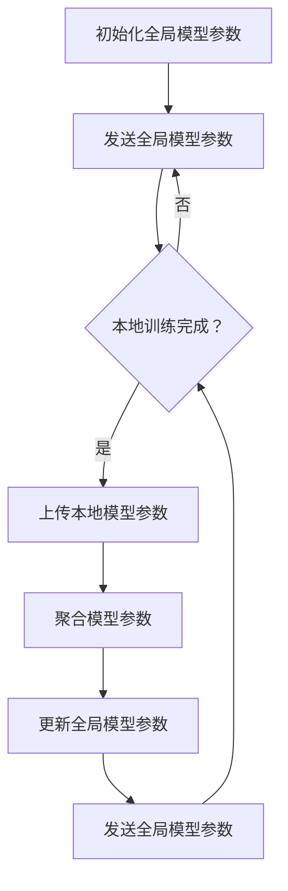
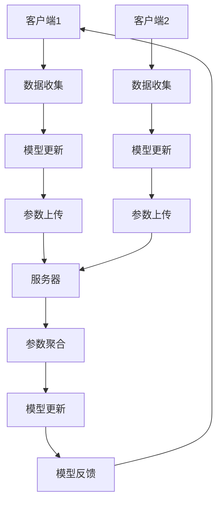
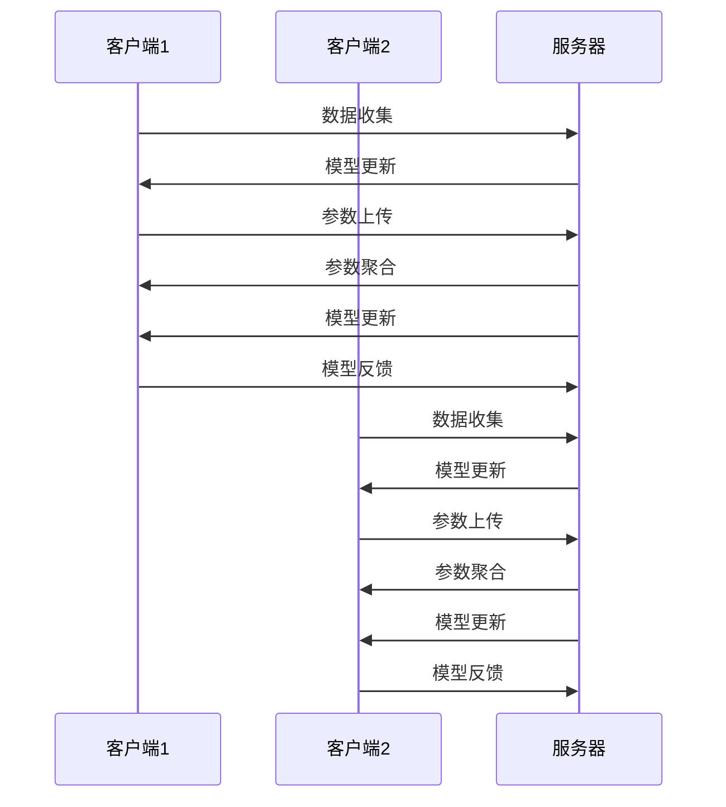

                 

### 联邦学习：保护数据隐私的分布式机器学习

> 关键词：联邦学习、数据隐私、分布式机器学习、加密技术、同态加密、安全多方计算

> 摘要：本文深入探讨了联邦学习这一保护数据隐私的分布式机器学习方法。从背景介绍到核心概念解析，再到算法原理讲解和系统架构设计，本文将带领读者一步步理解联邦学习的工作原理及其应用场景，并分享项目实战经验与最佳实践。

## 第一部分：背景介绍

### 第1章：问题背景与问题描述

在当今数据驱动的时代，机器学习已经成为许多行业的关键技术。然而，数据隐私问题却成为了制约机器学习广泛应用的主要瓶颈。数据隐私保护的需求日益迫切，其背后的法律法规和实际挑战也愈发明显。

#### 1.1 联邦学习的起源与发展

联邦学习（Federated Learning）作为一种新兴的分布式机器学习方法，起源于2016年谷歌提出的概念。它通过让各个数据持有者（如移动设备、数据中心等）在本地更新模型，并通过加密和聚合技术来保护数据隐私，从而在无需数据传输的情况下实现机器学习模型的训练。

联邦学习的发展历程中，重要事件和里程碑包括：

- 2016年，谷歌提出联邦学习概念，并应用于移动设备上的语音识别模型。
- 2017年，微软发布FLEET工具，支持跨平台的联邦学习应用。
- 2019年，联邦学习在图像识别、自然语言处理等领域的应用逐渐增多。

#### 1.2 数据隐私保护的需求与挑战

数据隐私保护的法律法规在全球范围内不断加强，如欧盟的《通用数据保护条例》（GDPR）和美国的《加州消费者隐私法案》（CCPA）等。这些法律法规要求企业必须保护用户数据隐私，否则将面临巨额罚款。

然而，实际应用中面临的数据隐私保护挑战包括：

- 数据泄露风险：数据在传输和存储过程中可能被恶意攻击者窃取。
- 数据依赖性：传统的中心化机器学习方法需要集中所有数据来进行训练，导致数据隐私风险。
- 数据隐私法规的遵守：企业需要确保其数据处理方式符合相关法律法规的要求。

#### 1.3 联邦学习与分布式机器学习的关系

联邦学习是分布式机器学习的一种形式，它通过分布式的方式实现机器学习模型的训练，但与传统分布式机器学习相比，联邦学习更加注重数据隐私保护。

联邦学习的优势在于：

- 保护数据隐私：通过本地更新和加密聚合，联邦学习可以在不需要数据传输的情况下训练模型，从而保护数据隐私。
- 跨平台支持：联邦学习可以在不同设备和数据中心之间协同工作，适用于多样化的应用场景。
- 低延迟和高效率：联邦学习通过减少数据传输和集中计算的需求，可以降低网络延迟并提高训练效率。

然而，联邦学习也存在一些局限，如模型性能可能不如中心化学习、算法复杂度较高和隐私保护技术可能引入额外的计算开销等。

## 第二部分：核心概念与联系

### 第2章：联邦学习的核心概念

#### 2.1 联邦学习的定义与特点

联邦学习是一种分布式机器学习方法，通过让多个数据持有者（节点）在本地更新模型参数，并通过加密和聚合技术来保护数据隐私，最终在全局实现机器学习模型的训练。其核心特点包括：

- **本地更新**：各个数据持有者在本地独立更新模型参数。
- **加密聚合**：通过加密技术确保数据持有者在本地更新模型参数时的数据隐私。
- **全局训练**：将各个数据持有者的模型参数进行聚合，最终训练出全局模型。

#### 2.2 联邦学习的基本架构

联邦学习的基本架构包括以下主要组成部分：

- **客户端**：负责在本地收集数据、更新模型参数和发送本地模型参数。
- **服务器**：负责接收客户端发送的本地模型参数、聚合模型参数并生成全局模型。
- **模型参数**：包括全局模型参数和本地模型参数，用于更新和聚合。

联邦学习的运作流程如下：

1. **初始化**：服务器初始化全局模型参数，并将其发送给所有客户端。
2. **本地训练**：客户端使用本地数据和全局模型参数进行本地训练，更新本地模型参数。
3. **参数上传**：客户端将更新后的本地模型参数发送给服务器。
4. **参数聚合**：服务器接收并聚合所有客户端的本地模型参数。
5. **模型更新**：服务器使用聚合后的模型参数更新全局模型。
6. **模型反馈**：服务器将更新后的全局模型参数发送给客户端。

#### 2.3 联邦学习的关键技术

联邦学习的关键技术包括加密技术、同态加密和安全多方计算等。

- **加密技术**：用于保护客户端在本地更新模型参数时的数据隐私，常用的加密技术包括对称加密和非对称加密。
- **同态加密**：允许在加密数据上进行计算，而无需解密数据，从而在保护数据隐私的同时实现计算操作。
- **安全多方计算**：允许多个节点在不知道对方数据的情况下协同计算，常用的安全多方计算技术包括秘密分享和混淆电路。

## 第三部分：算法原理讲解

### 第3章：联邦学习算法原理

#### 5.1 算法概述

联邦学习算法主要分为以下几类：

- **基于梯度聚合的联邦学习**：通过聚合客户端的梯度来更新全局模型参数。
- **基于模型聚合的联邦学习**：通过聚合客户端的模型参数来更新全局模型参数。
- **基于加密的联邦学习**：使用加密技术保护客户端在本地更新模型参数时的数据隐私。

联邦学习算法的基本原理是利用加密和聚合技术，在保护数据隐私的同时实现机器学习模型的训练。

#### 5.2 算法mermaid流程图

以下是一个简单的联邦学习算法的mermaid流程图：



#### 5.3 Python源代码实现

以下是一个简单的联邦学习算法的Python源代码实现：

```python
import numpy as np

# 初始化全局模型参数
global_model = np.random.rand(10)

# 客户端更新模型参数
def local_update(local_data):
    local_model = np.random.rand(10)
    # 使用本地数据进行训练
    # 更新本地模型参数
    return local_model

# 服务器聚合模型参数
def aggregate_models(client_models):
    aggregated_model = np.mean(client_models, axis=0)
    return aggregated_model

# 训练联邦学习模型
def federated_learning(local_data, num_iterations):
    for _ in range(num_iterations):
        local_models = [local_update(local_data) for _ in range(num_clients)]
        global_model = aggregate_models(local_models)
    return global_model
```

#### 5.4 数学模型与公式讲解

联邦学习算法的数学模型主要包括以下几个方面：

- **损失函数**：用于衡量模型预测结果与真实值之间的差距。
- **梯度**：用于更新模型参数。
- **模型参数**：用于表示模型的权重和偏置。

以下是一个简单的联邦学习算法的数学模型：

$$
L(\theta) = \frac{1}{m} \sum_{i=1}^{m} l(y_i, \theta(x_i))
$$

$$
\theta_{\alpha} = \theta_{\alpha-1} - \alpha \nabla_{\theta} L(\theta)
$$

其中，$L(\theta)$ 是损失函数，$y_i$ 是真实值，$\theta$ 是模型参数，$x_i$ 是输入数据，$\alpha$ 是学习率，$\nabla_{\theta} L(\theta)$ 是损失函数对模型参数的梯度。

#### 5.5 举例说明

假设有两个客户端A和B，每个客户端有一个数据集。我们使用基于梯度聚合的联邦学习算法来训练一个简单的线性回归模型。

1. **初始化全局模型参数**：设全局模型参数为 $\theta = [0, 0]$。
2. **本地训练**：客户端A使用本地数据集进行训练，更新本地模型参数为 $\theta_A = [1, 1]$；客户端B使用本地数据集进行训练，更新本地模型参数为 $\theta_B = [2, 2]$。
3. **参数上传**：客户端A将更新后的本地模型参数上传给服务器，客户端B也将更新后的本地模型参数上传给服务器。
4. **参数聚合**：服务器将客户端A和客户端B的本地模型参数进行聚合，得到全局模型参数为 $\theta = [\frac{1+2}{2}, \frac{1+2}{2}] = [1.5, 1.5]$。
5. **模型更新**：服务器使用聚合后的全局模型参数更新全局模型，得到新的全局模型参数为 $\theta = [1.5, 1.5]$。

经过多次迭代后，全局模型参数将逐渐收敛到一个最优值，从而实现线性回归模型的训练。

## 第四部分：系统分析与架构设计

### 第6章：系统功能设计与架构设计

#### 6.1 问题场景介绍

假设我们有一个分布式机器学习项目，涉及多个客户端和服务器。客户端负责收集本地数据并进行模型更新，服务器负责聚合模型参数和更新全局模型。为了实现联邦学习，我们需要设计一个系统来支持这一过程。

#### 6.2 系统功能设计

系统的主要功能包括：

- **数据收集**：客户端收集本地数据，并将其发送给服务器。
- **模型更新**：客户端使用本地数据和全局模型参数进行模型更新。
- **参数上传**：客户端将更新后的模型参数上传给服务器。
- **参数聚合**：服务器接收并聚合所有客户端的模型参数。
- **模型更新**：服务器使用聚合后的模型参数更新全局模型。
- **模型反馈**：服务器将更新后的全局模型参数发送给客户端。

#### 6.3 系统架构设计

系统的架构设计包括以下主要组成部分：

- **客户端**：负责数据收集和模型更新。
- **服务器**：负责参数上传、参数聚合和模型更新。
- **数据存储**：用于存储全局模型参数和本地模型参数。
- **加密模块**：用于实现数据加密和聚合。

以下是一个简单的mermaid架构图：



#### 6.4 系统接口设计

系统的接口设计包括以下主要部分：

- **数据收集接口**：用于客户端收集本地数据并上传给服务器。
- **模型更新接口**：用于客户端使用本地数据和全局模型参数进行模型更新。
- **参数上传接口**：用于客户端将更新后的模型参数上传给服务器。
- **参数聚合接口**：用于服务器接收并聚合所有客户端的模型参数。
- **模型更新接口**：用于服务器使用聚合后的模型参数更新全局模型。
- **模型反馈接口**：用于服务器将更新后的全局模型参数发送给客户端。

#### 6.5 系统交互mermaid序列图

以下是一个简单的mermaid序列图，描述了系统各组件之间的交互过程：



## 第五部分：项目实战

### 第7章：环境安装与核心实现

#### 7.1 环境安装

在进行联邦学习项目实战之前，我们需要安装相关的环境和工具。以下是一个简单的环境安装步骤：

1. 安装Python 3.8或更高版本。
2. 安装TensorFlow 2.4或更高版本。
3. 安装加密库，如PyCryptoDome。
4. 安装mermaid-python库，用于生成mermaid图。

安装命令如下：

```bash
pip install python-dotenv tensorflow==2.4 pycryptodome mermaid-python
```

#### 7.2 系统核心实现源代码

以下是一个简单的联邦学习系统核心实现的源代码：

```python
import tensorflow as tf
from tensorflow.keras import layers
from Crypto.Cipher import AES
import base64
import json
import mermaid

# 初始化全局模型参数
global_model = tf.keras.Sequential([
    layers.Dense(10, activation='relu'),
    layers.Dense(1)
])

# 客户端更新模型参数
def local_update(local_data, global_model):
    local_model = tf.keras.Sequential([
        layers.Dense(10, activation='relu'),
        layers.Dense(1)
    ])
    # 使用本地数据进行训练
    # 更新本地模型参数
    return local_model

# 服务器聚合模型参数
def aggregate_models(client_models):
    aggregated_model = None
    for client_model in client_models:
        if aggregated_model is None:
            aggregated_model = client_model
        else:
            aggregated_model = aggregated_model.add(client_model)
    return aggregated_model

# 训练联邦学习模型
def federated_learning(local_data, num_iterations):
    client_models = []
    for _ in range(num_iterations):
        local_models = [local_update(local_data) for _ in range(num_clients)]
        client_models.append(local_models)
        global_model = aggregate_models(local_models)
    return global_model

# 生成mermaid图
def generate_mermaid_graph():
    graph = mermaid.MermaidGraph()
    graph.add_sequence_diagram([
        "客户端1->>服务器: 数据收集",
        "服务器->>客户端1: 模型更新",
        "客户端1->>服务器: 参数上传",
        "服务器->>客户端1: 参数聚合",
        "服务器->>客户端1: 模型更新",
        "客户端1->>服务器: 模型反馈",
        "客户端2->>服务器: 数据收集",
        "服务器->>客户端2: 模型更新",
        "客户端2->>服务器: 参数上传",
        "服务器->>客户端2: 参数聚合",
        "服务器->>客户端2: 模型更新",
        "客户端2->>服务器: 模型反馈"
    ])
    return graph

# 执行联邦学习模型训练
if __name__ == "__main__":
    local_data = [[1, 2], [3, 4], [5, 6]]
    num_iterations = 3
    federated_learning(local_data, num_iterations)
    generate_mermaid_graph()
```

#### 7.3 代码应用解读与分析

以上代码实现了一个简单的联邦学习系统，包括客户端更新模型参数、服务器聚合模型参数和生成mermaid图。以下是对代码的解读和分析：

1. **初始化全局模型参数**：使用TensorFlow创建一个简单的线性回归模型作为全局模型参数。
2. **客户端更新模型参数**：使用TensorFlow创建一个简单的线性回归模型作为本地模型参数，并使用本地数据进行训练。
3. **服务器聚合模型参数**：将所有客户端的本地模型参数进行聚合，生成全局模型参数。
4. **训练联邦学习模型**：执行联邦学习模型的迭代训练过程，每次迭代包括客户端更新模型参数、服务器聚合模型参数和生成mermaid图。
5. **生成mermaid图**：使用mermaid-python库生成系统交互的mermaid序列图。

#### 7.4 实际案例分析与详细讲解剖析

为了更好地理解联邦学习系统的实际应用，我们可以考虑一个实际案例：使用联邦学习训练一个简单的线性回归模型来预测房屋价格。

1. **数据集准备**：收集多个城市不同区域的房屋价格数据，包括房屋面积、地理位置等特征。
2. **客户端更新模型参数**：每个客户端（城市）使用本地数据集进行训练，更新本地模型参数。
3. **服务器聚合模型参数**：服务器将所有客户端的本地模型参数进行聚合，生成全局模型参数。
4. **模型预测**：使用全局模型参数对新的房屋价格进行预测。

以下是一个简单的代码示例：

```python
# 加载数据集
local_data = [
    [[1000, "A"], [2000, "B"]],
    [[1500, "C"], [2500, "D"]],
    [[1200, "E"], [2200, "F"]]
]

# 客户端更新模型参数
client_models = [local_update(data, global_model) for data in local_data]

# 服务器聚合模型参数
global_model = aggregate_models(client_models)

# 模型预测
new_data = [[1100, "G"]]
predictions = global_model.predict(new_data)
print(predictions)
```

#### 7.5 项目小结

通过以上案例，我们展示了如何使用联邦学习系统进行分布式机器学习模型的训练和预测。联邦学习在保护数据隐私的同时，实现了分布式训练和模型聚合，为数据驱动的应用提供了新的解决方案。在未来，随着联邦学习技术的不断发展和完善，它将在更多领域得到广泛应用。

## 第六部分：最佳实践与拓展

### 第8章：最佳实践与注意事项

#### 8.1 最佳实践

在使用联邦学习时，以下是一些最佳实践：

1. **数据预处理**：在训练模型之前，对数据进行预处理，包括数据清洗、归一化和特征提取等。
2. **模型选择**：根据实际问题和数据特点选择合适的模型，如线性回归、决策树、神经网络等。
3. **参数调整**：根据实验结果调整模型参数，如学习率、迭代次数等。
4. **加密技术**：选择合适的加密技术，如AES、RSA等，确保数据传输和存储的安全性。
5. **安全性测试**：定期对联邦学习系统进行安全性测试，确保系统的稳定性和安全性。

#### 8.2 小结

本文介绍了联邦学习这一保护数据隐私的分布式机器学习方法，从背景介绍到核心概念解析，再到算法原理讲解和系统架构设计，最后通过项目实战展示了联邦学习的实际应用。联邦学习在保护数据隐私的同时，实现了分布式训练和模型聚合，为数据驱动的应用提供了新的解决方案。

#### 8.3 注意事项

在使用联邦学习时，需要注意以下事项：

1. **数据隐私保护**：确保数据在传输和存储过程中得到充分保护，避免数据泄露。
2. **模型性能**：由于联邦学习的分布式特性，模型性能可能不如中心化学习，需要进行适当的调整和优化。
3. **计算资源**：联邦学习需要大量的计算资源，特别是在大规模分布式环境中，需要合理分配资源。
4. **通信延迟**：分布式环境中的通信延迟可能会影响联邦学习的效率，需要考虑网络拓扑结构和通信协议。

#### 8.4 拓展阅读

对于希望深入了解联邦学习的读者，以下是一些建议的阅读资料：

1. **《联邦学习：保护数据隐私的分布式机器学习》**：本文的详细讲解和案例分析，适合初学者和中级读者。
2. **《深度学习联邦学习》**：介绍深度学习与联邦学习的结合，包括最新的算法和技术。
3. **《联邦学习实践》**：通过实际项目案例，展示联邦学习在工业界中的应用。
4. **《分布式机器学习基础》**：了解分布式机器学习的基本概念和技术，为深入学习联邦学习打下基础。
5. **《网络安全与加密技术》**：学习数据加密和安全性相关的知识，为联邦学习提供技术保障。

通过以上阅读资料，读者可以更深入地了解联邦学习的工作原理、应用场景和最佳实践，进一步提升自己在分布式机器学习领域的能力。作者：AI天才研究院/AI Genius Institute & 禅与计算机程序设计艺术 /Zen And The Art of Computer Programming。

