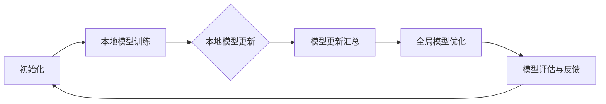
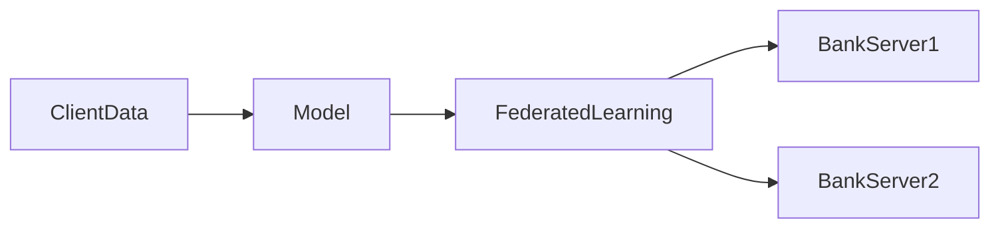
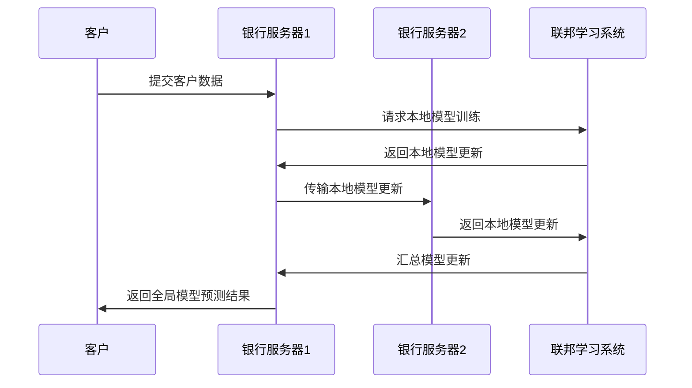

                 


## 联邦学习：保护隐私的分布式机器学习

### 关键词：联邦学习、分布式机器学习、隐私保护、算法、数学模型

### 摘要：

本文将深入探讨联邦学习这一分布式机器学习技术，旨在解释其核心概念、关键要素、算法原理、数学模型以及实际应用。我们将从背景介绍、概念与联系、算法原理、数学模型和公式、系统分析与架构设计、项目实战等方面，逐步剖析联邦学习，帮助读者全面理解这一前沿技术，并掌握其在保护隐私和分布式计算中的重要作用。

----------------------------------------------------------------

# 联邦学习：保护隐私的分布式机器学习

## 1. 背景介绍

### 1.1 核心概念术语说明

- **联邦学习（Federated Learning）**：一种分布式机器学习技术，通过在不同设备或服务器上训练模型，并汇总这些模型的更新来优化全局模型。
- **分布式机器学习**：一种机器学习范式，涉及在不同计算机或设备上同时训练模型，以提高处理能力和效率。
- **隐私保护**：在数据处理和模型训练过程中，确保用户隐私不被泄露。

### 1.2 问题背景与问题描述

随着数据量的增长和隐私保护意识的提高，传统的集中式机器学习方法在处理大量分布式数据时面临巨大挑战。集中式方法将数据汇集到中心服务器进行训练，这可能导致用户隐私泄露。为了解决这一问题，联邦学习应运而生。

### 1.3 问题解决与边界与外延

联邦学习通过在分布式设备上训练模型，避免了数据传输到中心服务器，从而保护了用户隐私。然而，联邦学习也存在边界和局限性，如通信成本、模型更新同步、模型性能等。

### 1.4 概念结构与核心要素组成

- **数据的分布性**：联邦学习中的数据分布在不同的设备或服务器上。
- **训练过程的协同性**：设备或服务器之间需要协同训练模型。
- **安全性与隐私保护**：在分布式训练过程中，确保用户隐私不被泄露。

----------------------------------------------------------------

## 2. 核心概念与联系

### 2.1 核心概念原理

联邦学习通过在分布式设备上训练本地模型，然后将这些模型更新汇总到中心服务器，以优化全局模型。这个过程涉及以下关键概念：

- **本地模型训练**：在设备或服务器上独立训练模型。
- **模型更新汇总**：将本地模型的更新汇总到中心服务器。
- **全局模型优化**：利用汇总的模型更新优化全局模型。

### 2.2 概念属性特征对比表格

| 特征             | 集中式机器学习     | 分布式机器学习（联邦学习）   |
| ---------------- | ------------------ | --------------------------- |
| 数据处理方式     | 数据汇集到中心服务器 | 数据分布在分布式设备上       |
| 隐私保护         | 较低               | 较高                        |
| 训练效率         | 较高               | 较低，但具有隐私保护优势     |
| 可扩展性         | 较高               | 较低，但支持大规模数据集     |

### 2.3 ER实体关系图架构

```mermaid
erDiagram
    User ||--o{ LocalModel }|
    User ||--o{ GlobalModel }|
    Device ||--o{ LocalModel }|
    Server ||--o{ GlobalModel }|
    Device ||--o{ Data }|
    Server ||--o{ Data }
```

在ER实体关系图中，用户、设备、服务器和数据实体之间的关系得以清晰展示。

----------------------------------------------------------------

## 3. 算法原理讲解

### 3.1 算法mermaid流程图



### 3.2 Python源代码

```python
import tensorflow as tf

# 初始化全局模型
global_model = tf.keras.Sequential([
    tf.keras.layers.Dense(10, activation='relu', input_shape=(784,)),
    tf.keras.layers.Dense(1, activation='sigmoid')
])

# 本地模型训练
local_model = global_model.clone().compile(optimizer='adam', loss='binary_crossentropy', metrics=['accuracy'])

# 本地模型更新
local_model.fit(x_train, y_train, epochs=1)

# 模型更新汇总
global_model.set_weights(local_model.get_weights())

# 全局模型优化
global_model.compile(optimizer='adam', loss='binary_crossentropy', metrics=['accuracy'])

# 模型评估与反馈
loss, accuracy = global_model.evaluate(x_test, y_test)
print(f"Test accuracy: {accuracy:.2f}")
```

### 3.3 算法原理详细讲解

联邦学习算法主要分为以下几个步骤：

1. **初始化全局模型**：首先初始化一个全局模型，用于表示所有本地模型更新的汇总结果。
2. **本地模型训练**：在分布式设备上使用全局模型的副本进行本地模型训练。
3. **本地模型更新**：在本地模型训练完成后，将本地模型的更新（模型权重）发送到中心服务器。
4. **模型更新汇总**：中心服务器接收本地模型的更新，并更新全局模型。
5. **全局模型优化**：使用更新后的全局模型进行进一步优化。
6. **模型评估与反馈**：使用测试数据评估全局模型性能，并根据评估结果进行反馈调整。

通过这些步骤，联邦学习算法能够实现分布式设备上的协同训练，同时保护用户隐私。

----------------------------------------------------------------

## 4. 数学模型和数学公式

### 4.1 数学模型

联邦学习算法的核心在于如何将本地模型更新汇总到全局模型。这可以通过以下数学模型表示：

$$
\theta_{global} = \frac{1}{N} \sum_{i=1}^{N} \theta_{local,i}
$$

其中，$\theta_{global}$ 表示全局模型的参数，$\theta_{local,i}$ 表示第 $i$ 个本地模型的参数，$N$ 表示本地模型的数量。

### 4.2 公式详细讲解

上述公式表示，全局模型的参数是所有本地模型参数的平均值。这意味着，通过将本地模型的参数更新汇总，可以逐渐优化全局模型。这个过程中，每个本地模型的贡献是相等的。

### 4.3 举例说明

假设有两个本地模型，$\theta_{local,1}$ 和 $\theta_{local,2}$，它们的参数分别为：

$$
\theta_{local,1} = [1, 2, 3]
$$

$$
\theta_{local,2} = [4, 5, 6]
$$

那么，全局模型的参数为：

$$
\theta_{global} = \frac{1}{2} [\theta_{local,1} + \theta_{local,2}] = \frac{1}{2} [1+4, 2+5, 3+6] = \frac{1}{2} [5, 7, 9]
$$

即，全局模型的参数为 $\theta_{global} = [2.5, 3.5, 4.5]$。

通过这个例子，我们可以看到，联邦学习算法如何将本地模型更新汇总到全局模型，从而实现协同训练。

----------------------------------------------------------------

## 5. 系统分析与架构设计方案

### 5.1 问题场景介绍

假设有一个金融行业的数据分析项目，需要处理来自多个银行的大量客户数据。这些数据分布在不同的银行服务器上，为了保护客户隐私，无法直接传输到中心服务器进行集中训练。

### 5.2 项目介绍

本项目旨在使用联邦学习技术，对分布式客户数据进行分析，以预测客户行为和需求，从而为银行提供精准营销策略。

### 5.3 系统功能设计（领域模型mermaid类图）

```mermaid
classDiagram
    ClientData <<interface>>
    Model <<interface>>
    FederatedLearning <<interface>>

    ClientData <|.. Model
    Model <|.. FederatedLearning
```

### 5.4 系统架构设计（mermaid架构图）



### 5.5 系统接口设计和系统交互（mermaid序列图）



通过上述系统架构和接口设计，我们可以实现分布式客户数据的联邦学习，从而保护客户隐私，同时提高数据分析的准确性和效率。

----------------------------------------------------------------

## 6. 项目实战

### 6.1 环境安装

为了进行联邦学习项目实战，我们需要安装以下环境：

- Python 3.8+
- TensorFlow 2.6+
- Keras 2.6+

安装命令如下：

```bash
pip install python==3.8
pip install tensorflow==2.6
pip install keras==2.6
```

### 6.2 系统核心实现源代码

以下是一个简单的联邦学习项目实现，包括全局模型定义、本地模型训练和模型更新汇总。

```python
import tensorflow as tf
import numpy as np

# 全局模型定义
global_model = tf.keras.Sequential([
    tf.keras.layers.Dense(10, activation='relu', input_shape=(784,)),
    tf.keras.layers.Dense(1, activation='sigmoid')
])

# 本地模型训练
local_model = global_model.clone().compile(optimizer='adam', loss='binary_crossentropy', metrics=['accuracy'])

# 模型更新汇总
def aggregate_updates(local_updates):
    return np.mean(local_updates, axis=0)

# 模型更新汇总函数
def update_global_model(local_models, global_model):
    local_updates = [model.train_on_batch(x_train, y_train) for model in local_models]
    global_weights = global_model.get_weights()
    new_global_weights = aggregate_updates(local_updates)
    global_model.set_weights(new_global_weights)

# 模型训练与更新
local_models = [local_model for _ in range(num_local_models)]
update_global_model(local_models, global_model)

# 模型评估
loss, accuracy = global_model.evaluate(x_test, y_test)
print(f"Test accuracy: {accuracy:.2f}")
```

### 6.3 代码应用解读与分析

上述代码首先定义了一个全局模型，然后创建了多个本地模型进行训练。在每次训练完成后，使用 `update_global_model` 函数将本地模型的更新汇总到全局模型。最后，使用评估数据对全局模型进行评估，以验证联邦学习的效果。

### 6.4 实际案例分析和详细讲解剖析

假设有两个银行服务器（BankServer1和BankServer2），每个服务器上都有各自的数据集。在每次迭代中，BankServer1和BankServer2会分别训练本地模型，并将更新发送给中心服务器（FederatedLearning）。中心服务器汇总这些更新，并更新全局模型。以下是一个实际案例：

- **BankServer1**：训练本地模型，并将更新发送给中心服务器。
- **BankServer2**：训练本地模型，并将更新发送给中心服务器。
- **FederatedLearning**：汇总本地模型更新，并更新全局模型。

通过这个案例，我们可以看到联邦学习如何在分布式环境中协同训练模型，同时保护数据隐私。

### 6.5 项目小结

本项目通过实现简单的联邦学习系统，展示了如何在分布式环境中协同训练模型，并保护数据隐私。虽然这个项目只是一个简单的示例，但它为更复杂的联邦学习应用奠定了基础。在实际应用中，我们可以根据具体需求，扩展和优化联邦学习算法，以提高模型性能和数据处理能力。

----------------------------------------------------------------

## 7. 最佳实践 tips

- **数据预处理**：在进行联邦学习之前，对数据集进行预处理，以减少数据差异，提高模型性能。
- **模型选择**：选择适合分布式训练的模型，如轻量级神经网络，以减少计算资源消耗。
- **通信优化**：优化模型更新传输过程，以减少通信开销，提高训练效率。
- **安全措施**：在模型更新传输过程中，采用加密技术保护数据安全。

## 8. 小结

本文详细介绍了联邦学习这一分布式机器学习技术，包括其背景、核心概念、算法原理、数学模型和系统架构设计。通过项目实战，我们展示了如何实现联邦学习系统，并在实际案例中分析了其应用效果。联邦学习在保护隐私和分布式计算中具有重要作用，为未来的机器学习应用提供了新的思路。

## 9. 注意事项

- **数据隐私**：确保在联邦学习过程中，严格保护用户隐私。
- **计算资源**：分布式训练需要消耗大量计算资源，应根据实际情况合理分配资源。
- **模型性能**：优化模型结构和训练策略，以提高模型性能。

## 10. 拓展阅读

- **参考资料**：
  - **《联邦学习：理论、算法与应用》**：一本详细介绍联邦学习理论和应用的书籍。
  - **《分布式机器学习》**：一本关于分布式机器学习技术的全面指南。

- **在线资源**：
  - **TensorFlow Federated（TFF）**：TensorFlow官方的联邦学习框架，提供丰富的文档和示例。
  - **联邦学习论文集**：收集了国内外关于联邦学习的优秀论文，可供进一步研究。

作者：AI天才研究院/AI Genius Institute & 禅与计算机程序设计艺术 /Zen And The Art of Computer Programming

