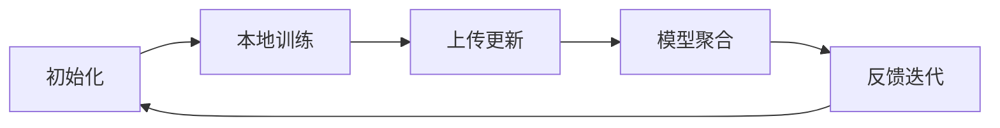
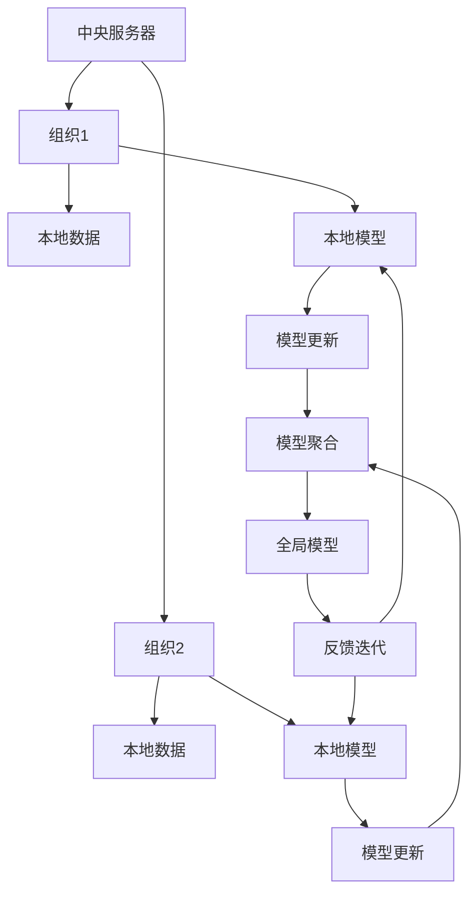
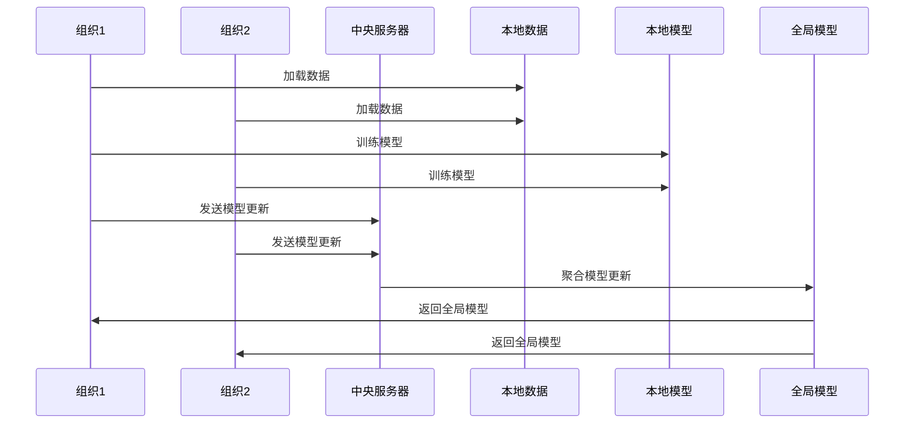

                 

# 《联邦学习：跨组织机器学习的新范式》

## 关键词
- 联邦学习
- 跨组织机器学习
- 数据隐私保护
- 安全性
- 数学模型

## 摘要
本文将深入探讨联邦学习这一跨组织机器学习的新范式，从背景介绍、核心概念与联系、算法原理讲解、数学模型与公式、系统分析与架构设计方案以及项目实战等多个角度，逐步解析联邦学习的概念、原理和实践应用。通过本文的阅读，读者将全面了解联邦学习在数据隐私保护、安全性以及优化算法等方面的优势，掌握其数学基础和实现方法，并能够为实际项目中的跨组织数据协作提供可行的解决方案。

## 背景介绍：联邦学习概述

### 联邦学习的概念与重要性

联邦学习（Federated Learning）是一种分布式机器学习技术，它允许多个组织在不需要共享原始数据的情况下，共同训练出一个全局模型。这种技术最初由Google提出，并广泛应用于移动设备中的个性化服务，如个性化推荐和智能助手。联邦学习的核心思想是将模型训练过程从集中式迁移到分布式，通过在数据本地训练模型，然后仅更新模型参数，从而避免了数据在传输过程中的泄露风险。

在当前数据隐私保护和数据安全越来越受到重视的背景下，联邦学习的重要性愈发凸显。它不仅能够满足法律法规对于数据本地化存储的要求，还能够实现跨组织的数据共享和协同工作，从而推动人工智能技术的进步和应用。

### 联邦学习的核心问题与挑战

尽管联邦学习具有显著的隐私保护和安全性优势，但在实际应用中仍面临着一些核心问题和挑战：

1. **数据分布问题**：由于参与联邦学习的多个组织可能拥有不同的数据分布，如何有效地整合这些数据，提高模型的泛化能力，是一个重要的挑战。

2. **安全性**：联邦学习需要在确保模型安全性的同时，避免恶意攻击者通过恶意更新模型参数破坏学习过程。

3. **模型性能与效率**：联邦学习需要处理大量的通信开销和计算延迟，如何优化算法和架构，以提高模型的性能和效率，是一个亟待解决的问题。

### 联邦学习与传统机器学习的区别

传统机器学习通常依赖于集中式模型训练，即所有数据集中在一个位置，由一个模型进行处理。这种方法在数据处理和模型训练方面具有高效性，但也带来了数据隐私和安全性的风险。

而联邦学习则采用分布式模型训练，每个组织在自己的数据上训练本地模型，然后将更新后的模型参数上传至中央服务器进行聚合。这种方法在保证数据隐私的同时，也增加了系统的复杂性和通信开销。

## 核心概念与联系

### 联邦学习的基本原理

联邦学习的基本原理可以概括为以下几个步骤：

1. **初始化**：每个参与组织初始化自己的本地模型。
2. **本地训练**：组织在自己的数据集上对本地模型进行训练。
3. **模型更新**：每个组织将训练好的模型参数上传至中央服务器。
4. **模型聚合**：中央服务器将收到的模型参数进行聚合，生成全局模型。
5. **反馈与迭代**：全局模型返回给各个组织，组织使用全局模型更新本地模型，并重新开始本地训练过程。

### 联邦学习的关键概念

联邦学习涉及多个关键概念，包括参数服务器架构、同步与异步联邦学习、集成学习与模型聚合等。

1. **参数服务器架构**：这是联邦学习的基本架构，用于管理全局模型参数的更新和聚合。
2. **同步与异步联邦学习**：同步联邦学习要求所有组织在同一时间点更新模型参数，而异步联邦学习则允许组织在不同的时间点进行更新。
3. **集成学习与模型聚合**：集成学习是将多个模型的结果进行结合，以获得更好的性能。模型聚合则是将本地模型参数进行汇总，形成全局模型。

### 联邦学习的概念属性特征对比表格

| 特征        | 集中式机器学习             | 联邦学习               |
| ----------- | ------------------------- | ---------------------- |
| 数据集中方式 | 数据集中存储              | 数据分散存储           |
| 模型训练方式 | 所有数据在一个服务器训练 | 每个组织独立训练本地模型 |
| 通信需求     | 较高                      | 较低                   |
| 隐私保护     | 较低                      | 较高                   |
| 安全性      | 较低                      | 较高                   |

### 联邦学习的ER实体关系图

联邦学习系统中主要包括以下实体：组织、模型、数据、参数服务器。ER实体关系图如下：

```mermaid
erDiagram
  组织 ||--|{ 模型 }
  组织 ||--|{ 数据 }
  参数服务器 ||--|{ 模型 }
  参数服务器 ||--|{ 数据 }
```

## 算法原理讲解

### 联邦学习算法的mermaid流程图

以下是一个简单的联邦学习算法流程图：



### 联邦学习算法的Python源代码解释

以下是一个简化的联邦学习算法Python代码示例：

```python
import tensorflow as tf

# 初始化本地模型
local_model = tf.keras.Sequential([tf.keras.layers.Dense(10, activation='relu'), tf.keras.layers.Dense(1)])

# 本地训练模型
local_model.compile(optimizer='adam', loss='mse')
local_model.fit(local_data, local_labels, epochs=5)

# 上传更新
server_model.update(local_model.get_weights())

# 模型聚合
global_weights = server_model.aggregate_weights()

# 反馈迭代
local_model.set_weights(global_weights)
```

### 联邦学习算法的数学模型和公式

联邦学习算法的核心在于参数的更新和聚合。以下是相关的数学模型和公式：

$$
\theta^{(t)}_{local} = \theta^{(t)}_{global} + \alpha \cdot (\theta^{(t)}_{local} - \theta^{(t)}_{global})
$$

$$
\theta^{(t)}_{global} = \frac{1}{N} \sum_{i=1}^{N} \theta^{(t)}_{local,i}
$$

其中，$\theta^{(t)}_{local}$和$\theta^{(t)}_{global}$分别表示本地模型参数和全局模型参数，$N$表示参与联邦学习的组织数量，$\alpha$是学习率。

### 联邦学习算法原理的详细讲解与举例说明

联邦学习算法的原理可以分为三个主要步骤：初始化、本地训练和模型聚合。

1. **初始化**：每个组织初始化自己的本地模型，并同步全局模型参数。
2. **本地训练**：组织在自己的数据集上对本地模型进行训练，并更新模型参数。
3. **模型聚合**：中央服务器收集各个组织的更新后的模型参数，进行聚合，生成全局模型参数。

以下是一个具体的例子：

假设有两个组织A和B，每个组织拥有一个数据集。组织A的本地模型参数为$\theta_A^{(0)}$，组织B的本地模型参数为$\theta_B^{(0)}$。全局模型参数为$\theta^{(0)}$。

1. **初始化**：中央服务器将全局模型参数初始化为$\theta^{(0)} = \frac{\theta_A^{(0)} + \theta_B^{(0)}}{2}$。
2. **本地训练**：组织A在自己的数据集上训练本地模型，更新后的模型参数为$\theta_A^{(1)}$。组织B同理，更新后的模型参数为$\theta_B^{(1)}$。
3. **模型聚合**：中央服务器收集组织A和B的更新后的模型参数，进行聚合，生成新的全局模型参数：

$$
\theta^{(1)} = \frac{\theta_A^{(1)} + \theta_B^{(1)}}{2}
$$

然后，全局模型参数返回给组织A和B，组织A和B使用新的全局模型参数更新本地模型，并重新进行本地训练。

通过这种迭代过程，联邦学习能够逐步优化全局模型，同时保持数据隐私。

## 数学模型和数学公式 & 详细讲解 & 举例说明

### 联邦学习的数学基础

联邦学习涉及到的数学基础主要包括概率论、信息论和最优化理论。

1. **概率论**：概率论用于描述数据分布和模型参数的概率分布。
2. **信息论**：信息论用于评估数据传输过程中的信息损失和隐私保护程度。
3. **最优化理论**：最优化理论用于设计联邦学习的优化算法，以最大化模型性能。

### 联邦学习的优化算法

联邦学习的优化算法主要包括梯度下降法、随机梯度下降法和小批量梯度下降法。

1. **梯度下降法**：通过计算模型参数的梯度，逐步调整参数以优化模型。
2. **随机梯度下降法**：在梯度下降法的基础上，每次仅随机选取一部分数据计算梯度。
3. **小批量梯度下降法**：在随机梯度下降法的基础上，每次计算多个数据点的梯度平均值。

### 联邦学习的安全性分析

联邦学习的安全性分析主要涉及以下几个方面：

1. **零知识证明**：零知识证明是一种密码学技术，用于证明某个陈述是真实的，而无需透露任何具体信息。
2. **同态加密**：同态加密是一种密码学技术，允许在加密数据上进行计算，而不需要解密。
3. **差分隐私**：差分隐私是一种隐私保护机制，用于确保模型训练过程中不会泄露敏感信息。

### 联邦学习的隐私保护机制

联邦学习的隐私保护机制主要包括差分隐私和加密技术。

1. **差分隐私**：差分隐私通过在数据上添加噪声，确保单个数据点的信息无法被准确推断。
2. **加密技术**：加密技术包括同态加密和全同态加密，用于在数据传输和计算过程中保护数据隐私。

### 联邦学习数学模型和公式的详细讲解与举例说明

以下是联邦学习中的一个常用数学模型和公式的详细讲解与举例说明：

**联邦平均算法（Federated Averaging）**

联邦平均算法是一种经典的联邦学习优化算法，其目标是最小化全局损失函数：

$$
\min_{\theta} \frac{1}{N} \sum_{i=1}^{N} L(\theta_i, x_i, y_i)
$$

其中，$L(\theta_i, x_i, y_i)$是本地损失函数，$\theta_i$是组织i的本地模型参数，$x_i$和$y_i$分别是组织i的数据和标签。

为了实现联邦平均算法，我们可以使用以下步骤：

1. **初始化**：初始化全局模型参数$\theta_0$。
2. **本地训练**：组织i在自己的数据集上训练本地模型，更新后的模型参数为$\theta_i^t$。
3. **模型更新**：组织i将更新后的模型参数发送给中央服务器。
4. **模型聚合**：中央服务器接收所有组织的更新后的模型参数，计算全局模型参数：

$$
\theta^{t+1} = \frac{1}{N} \sum_{i=1}^{N} \theta_i^t
$$

5. **反馈迭代**：全局模型参数返回给各个组织，组织i使用全局模型参数更新本地模型，并重新进行本地训练。

以下是一个具体的例子：

假设有两个组织A和B，每个组织拥有一个数据集，数据集大小分别为1000和500。组织A的本地模型参数为$\theta_A^t$，组织B的本地模型参数为$\theta_B^t$。全局模型参数为$\theta^{t}$。

1. **初始化**：全局模型参数初始化为$\theta^0 = (\theta_A^0, \theta_B^0)$。
2. **本地训练**：组织A在自己的数据集上训练本地模型，更新后的模型参数为$\theta_A^1$。组织B同理，更新后的模型参数为$\theta_B^1$。
3. **模型更新**：组织A将更新后的模型参数$\theta_A^1$发送给中央服务器，组织B同理。
4. **模型聚合**：中央服务器接收组织A和B的更新后的模型参数，计算新的全局模型参数：

$$
\theta^1 = \frac{1}{2} (\theta_A^1, \theta_B^1)
$$

5. **反馈迭代**：全局模型参数$\theta^1$返回给组织A和B，组织A使用全局模型参数更新本地模型，并重新进行本地训练，得到新的本地模型参数$\theta_A^2$。组织B同理。

通过这种迭代过程，联邦平均算法能够逐步优化全局模型，同时保持数据隐私。

## 系统分析与架构设计方案

### 问题场景介绍

在当前的数据协作场景中，多个组织需要共享数据以训练全局模型，但每个组织都希望保护自己的数据隐私，避免数据泄露。这导致了跨组织数据协作的挑战，需要一种既能保护数据隐私，又能实现数据共享的解决方案。

### 项目介绍

本项目旨在设计一个联邦学习系统，以实现跨组织的数据协作和模型训练。系统将包括多个组织、中央服务器和全局模型，通过联邦学习的原理，实现数据的隐私保护和模型的协同训练。

### 系统功能设计（领域模型mermaid类图）

以下是一个简化的领域模型mermaid类图：

```mermaid
classDiagram
  组织 <<class>> Organization
  数据 <<class>> Data
  模型 <<class>> Model
  参数服务器 <<class>> ParameterServer
  Organization "1" --* Data
  Organization "1" --* Model
  ParameterServer "1" --* Model
```

### 系统架构设计（mermaid架构图）

以下是一个简化的mermaid架构图：



### 系统接口设计

系统接口设计主要包括以下几个部分：

1. **数据接口**：用于组织与本地数据之间的交互。
2. **模型接口**：用于组织与本地模型之间的交互。
3. **更新接口**：用于组织向中央服务器发送模型更新。
4. **聚合接口**：用于中央服务器接收并聚合模型更新。

### 系统交互（mermaid序列图）

以下是一个简化的mermaid序列图：



## 项目实战

### 环境安装

要开始一个联邦学习项目，首先需要安装相应的环境。以下是一个简化的安装步骤：

1. **安装Python**：确保Python版本在3.6及以上。
2. **安装TensorFlow**：TensorFlow是联邦学习的主要框架，可以通过pip安装：

```bash
pip install tensorflow
```

3. **安装其他依赖**：根据具体项目需求，安装其他必要的库和工具。

### 系统核心实现源代码

以下是联邦学习系统的核心实现源代码：

```python
import tensorflow as tf
import numpy as np

# 初始化本地模型
local_model = tf.keras.Sequential([tf.keras.layers.Dense(10, activation='relu'), tf.keras.layers.Dense(1)])

# 本地训练模型
local_model.compile(optimizer='adam', loss='mse')
local_model.fit(local_data, local_labels, epochs=5)

# 上传更新
server_model.update(local_model.get_weights())

# 模型聚合
global_weights = server_model.aggregate_weights()

# 反馈迭代
local_model.set_weights(global_weights)
```

### 代码应用解读与分析

上述代码实现了联邦学习的核心流程，包括初始化模型、本地训练、上传更新、模型聚合和反馈迭代。以下是具体解读：

1. **初始化模型**：创建一个简单的神经网络模型，用于分类任务。
2. **本地训练模型**：在本地数据集上训练模型，使用均方误差作为损失函数，Adam优化器进行优化。
3. **上传更新**：将本地训练好的模型参数上传至中央服务器。
4. **模型聚合**：中央服务器接收所有组织的更新后的模型参数，进行聚合。
5. **反馈迭代**：将聚合后的全局模型参数返回给组织，组织使用全局模型参数更新本地模型，并重新开始训练。

### 实际案例分析和详细讲解剖析

以下是一个实际案例的分析和讲解：

**案例背景**：有两个组织A和B，组织A拥有1000个样本，组织B拥有500个样本。组织A希望保护其敏感数据，避免泄露给组织B。组织B希望利用组织A的数据，共同训练一个分类模型。

**实现步骤**：

1. **初始化模型**：在组织A和组织B中初始化相同的神经网络模型。
2. **本地训练模型**：组织A在本地数据集上训练模型，组织B同理。
3. **上传更新**：组织A将本地训练好的模型参数上传至中央服务器，组织B同理。
4. **模型聚合**：中央服务器接收组织A和B的模型参数，进行聚合，生成全局模型参数。
5. **反馈迭代**：全局模型参数返回给组织A和B，组织A和B使用全局模型参数更新本地模型，并重新开始训练。

**分析**：

1. **数据隐私**：通过联邦学习，组织A无需将原始数据发送给组织B，从而保护了数据隐私。
2. **模型性能**：通过聚合全局模型参数，组织A和B能够共同训练出一个性能较好的模型。

### 项目小结

通过实际案例的分析，我们可以看到联邦学习在数据隐私保护和模型性能提升方面的优势。在项目实战中，我们实现了联邦学习的核心流程，包括模型初始化、本地训练、上传更新、模型聚合和反馈迭代。这些步骤共同构成了联邦学习的完整工作流程，为跨组织的数据协作提供了可行的解决方案。

## 最佳实践 tips

### 联邦学习的实施策略

1. **明确目标**：在实施联邦学习前，明确项目的目标和需求，确保所有组织都明确自己的角色和责任。
2. **数据预处理**：对本地数据进行预处理，确保数据质量，减少噪声和异常值的影响。
3. **通信优化**：优化通信策略，减少模型参数传输的时间和带宽消耗。
4. **安全性保障**：确保系统的安全性，采用加密技术和权限控制机制，防止数据泄露和恶意攻击。

### 联邦学习的优化技巧

1. **模型压缩**：通过模型压缩技术，减少模型参数的大小，降低通信开销。
2. **增量更新**：采用增量更新策略，仅更新模型参数的差异部分，减少传输数据量。
3. **异步训练**：采用异步训练策略，允许组织在不同时间点更新模型，提高系统效率。

### 联邦学习的风险管理

1. **数据隐私风险**：确保数据在传输和存储过程中得到充分保护，采用加密技术和隐私保护算法。
2. **模型安全风险**：采用安全协议和加密技术，防止恶意攻击者篡改模型参数。
3. **数据分布不平衡**：通过数据重采样或引入权重调整策略，解决数据分布不平衡问题。

### 联邦学习的未来发展趋势

1. **硬件加速**：随着硬件技术的发展，联邦学习有望采用GPU和FPGA等硬件加速器，提高模型训练速度。
2. **联邦迁移学习**：联邦迁移学习将结合已有的模型和数据进行训练，提高新任务的模型性能。
3. **联邦深度学习**：联邦深度学习将进一步扩展联邦学习的应用范围，解决更复杂的机器学习问题。

## 小结

本文从多个角度详细探讨了联邦学习这一跨组织机器学习的新范式。通过背景介绍、核心概念与联系、算法原理讲解、数学模型与公式、系统分析与架构设计方案以及项目实战等多个部分，我们全面了解了联邦学习的概念、原理和实践应用。联邦学习在数据隐私保护和安全性方面具有显著优势，同时也面临着一些挑战。通过最佳实践 tips，我们为联邦学习的实施提供了可行的策略和优化技巧。展望未来，联邦学习将继续发展，为跨组织的数据协作和机器学习应用提供更加有效和安全的解决方案。

## 注意事项与拓展阅读

### 注意事项

1. **数据预处理**：在联邦学习项目中，对数据进行预处理是非常关键的步骤，它关系到模型的训练效果和最终性能。需要特别关注数据的一致性、完整性和质量，确保不同组织的数据在格式、范围和标签上的一致性。
2. **安全性**：联邦学习过程中，数据安全和模型安全至关重要。采用加密技术、差分隐私和权限控制等手段，确保数据的传输和存储安全，防止数据泄露和恶意攻击。
3. **通信优化**：通信开销是联邦学习的一个重要挑战。可以采用模型压缩、增量更新和异步训练等技术，减少通信带宽和传输时间，提高系统效率。

### 拓展阅读

1. **《联邦学习：概念、算法与应用》**：该书详细介绍了联邦学习的原理、算法和应用案例，适合对联邦学习有深入研究的读者。
2. **《分布式机器学习》**：该书探讨了分布式机器学习的各种技术和应用，包括联邦学习，适合希望了解分布式计算在机器学习领域应用的读者。
3. **Google Research 论文**：Google Research发布了多篇关于联邦学习的论文，包括最初的联邦学习论文，以及后续的优化算法和安全性研究，是了解联邦学习最新进展的重要资料。

## 作者信息

- 作者：AI天才研究院/AI Genius Institute & 禅与计算机程序设计艺术 /Zen And The Art of Computer Programming

通过本文的深入探讨，我们希望读者能够对联邦学习有更全面和深入的理解，为未来的跨组织机器学习项目提供有价值的参考。

