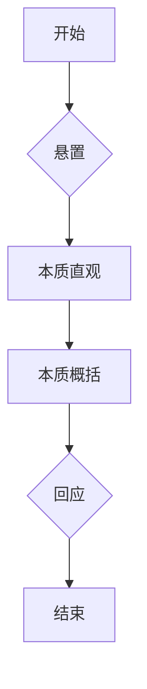

                 

# 胡塞尔与海德格尔：现象学还原与存在还原的差异

关键词：胡塞尔、海德格尔、现象学还原、存在还原、哲学、差异分析

摘要：本文旨在探讨胡塞尔与海德格尔的现象学还原与存在还原的差异。通过对两位哲学家核心思想的梳理，本文将分析现象学还原与存在还原的基本原理、方法、应用及其影响，最终揭示两者之间的异同点，为现代哲学的发展提供新的思考方向。

## 第一部分：胡塞尔与海德格尔：现象学还原与存在还原的差异概述

### 第1章：胡塞尔与海德格尔：现象学与存在论的奠基

#### 1.1 问题背景与现象学的起源

现象学作为20世纪哲学的重要流派，起源于19世纪末20世纪初。胡塞尔作为现象学的奠基人，提出了现象学还原的方法，旨在揭示事物本质，摒弃事物表象。海德格尔则对胡塞尔的现象学进行了批判与重构，提出了存在还原的思想，强调存在的意义。

#### 1.2 核心概念与联系

胡塞尔的核心概念是“本质还原”，通过现象学还原的方法，将事物表象与本质分离，达到对事物本质的认识。海德格尔的核心概念是“存在还原”，强调存在的意义，通过存在还原，揭示事物存在的本质。

#### 1.3 主要著作与思想演变

胡塞尔的主要著作有《逻辑研究》、《纯粹现象学通论》等，海德格尔的主要著作有《存在与时间》、《尼采》等。两位哲学家的思想在不同时期有所演变，但核心观点始终如一。

#### 1.4 现象学与存在论在现代哲学中的影响与意义

现象学与存在论在现代哲学中具有重要的地位，对心理学、艺术史、伦理学等领域产生了深远影响。现象学还原与存在还原为哲学研究提供了新的视角和方法。

#### 1.5 本章小结

本章对胡塞尔与海德格尔的现象学还原与存在还原进行了概述，揭示了两位哲学家的核心思想及其在现代哲学中的影响。

## 第二部分：胡塞尔的现象学还原

### 第2章：胡塞尔现象学还原的哲学背景与理论基础

#### 2.1 胡塞尔哲学的起源与发展

胡塞尔的哲学思想起源于其学术背景，受到康德、黑格尔等哲学家的影响。他的早期思想关注逻辑与认识论，后期则转向现象学。

#### 2.2 现象学还原的基本原理

现象学还原是指通过现象学的视角，将事物表象与本质分离，达到对事物本质的认识。其基本原理包括现象学的意向性、直观性、本质还原等。

#### 2.3 现象学还原的方法

胡塞尔的现象学还原方法主要包括悬置、本质直观、本质概括等步骤。通过这些方法，现象学家可以揭示事物的本质。

#### 2.4 胡塞尔现象学还原的应用

胡塞尔的现象学还原方法在心理学、艺术史、哲学等领域得到了广泛应用。例如，在心理学中，现象学还原可以帮助研究者理解人的意识活动。

#### 2.5 胡塞尔现象学还原的优缺点分析

现象学还原的优点在于其独特的方法论体系，有助于揭示事物的本质。缺点在于其过于抽象，可能导致实际应用的困难。

#### 2.6 本章小结

本章对胡塞尔的现象学还原进行了详细分析，阐述了其哲学背景、基本原理、方法及应用。

## 第三部分：海德格尔的存在还原

### 第3章：海德格尔存在还原的哲学背景与理论基础

#### 3.1 海德格尔哲学的起源与发展

海德格尔的哲学思想起源于其学术背景，受到胡塞尔、荷尔德林等哲学家的影响。他的早期思想关注存在论，后期则转向技术哲学、诗学等领域。

#### 3.2 存在还原的基本原理

存在还原是指通过现象学的视角，将事物存在的本质与存在本身分离，达到对存在本质的认识。其基本原理包括存在的意义、存在者的存在、存在与时间等。

#### 3.3 存在还原的方法

海德格尔的存在还原方法主要包括存在论分析、历史性解释、诗性直观等步骤。通过这些方法，哲学家可以揭示存在的本质。

#### 3.4 海德格尔存在还原的应用

海德格尔的存在还原方法在伦理学、政治哲学、文学批评等领域得到了广泛应用。例如，在伦理学中，存在还原可以帮助研究者理解人的道德责任。

#### 3.5 海德格尔存在还原的优缺点分析

存在还原的优点在于其深刻的哲学思考，有助于揭示存在的本质。缺点在于其过于抽象，可能导致实际应用的困难。

#### 3.6 本章小结

本章对海德格尔的存在还原进行了详细分析，阐述了其哲学背景、基本原理、方法及应用。

## 第四部分：胡塞尔与海德格尔的差异分析

### 第4章：胡塞尔与海德格尔还原方法的比较

#### 4.1 还原对象的差异

胡塞尔的还原对象主要是事物的本质，海德格尔的还原对象则是存在的本质。这导致两者的研究焦点和方法有所不同。

#### 4.2 还原方式的差异

胡塞尔的现象学还原强调通过直观、本质直观等方法揭示事物的本质，而海德格尔的存在还原则强调通过存在论分析、历史性解释等方法揭示存在的本质。

#### 4.3 还原结果的不同

胡塞尔的还原结果是对事物本质的认识，海德格尔的还原结果则是对存在本质的认识。这反映了两者在哲学观点上的差异。

#### 4.4 两种还原方法的影响与局限性

现象学还原与存在还原对现代哲学产生了深远影响，但同时也存在一定的局限性。例如，现象学还原过于抽象，可能导致实际应用的困难；存在还原则强调存在的意义，但可能忽视事物的具体存在状态。

#### 4.5 本章小结

本章通过对胡塞尔与海德格尔还原方法的比较，分析了两者之间的异同点及其影响与局限性。

## 第五部分：现象学还原与存在还原的融合与创新

### 第5章：现象学与存在论的融合趋势

#### 5.1 融合的必要性

现象学还原与存在还原的融合，有助于克服两者的局限性，实现哲学研究的新突破。现代哲学对融合的需求日益增加，为哲学发展提供了新的机遇。

#### 5.2 融合

融合现象学与存在论，需要从哲学基本问题出发，结合现象学与存在论的核心理念，探索新的方法论体系。这有助于拓展哲学研究的领域，提升哲学研究的深度。

### 目录大纲

----------------------------------------------------------------

# 胡塞尔与海德格尔：现象学还原与存在还原的差异

## 第一部分：胡塞尔与海德格尔：现象学还原与存在还原的差异概述

### 第1章：胡塞尔与海德格尔：现象学与存在论的奠基

1.1 问题背景与现象学的起源

1.2 核心概念与联系

1.3 主要著作与思想演变

1.4 现象学与存在论在现代哲学中的影响与意义

1.5 本章小结

## 第二部分：胡塞尔的现象学还原

### 第2章：胡塞尔现象学还原的哲学背景与理论基础

2.1 胡塞尔哲学的起源与发展

2.2 现象学还原的基本原理

2.3 现象学还原的方法

2.4 胡塞尔现象学还原的应用

2.5 胡塞尔现象学还原的优缺点分析

2.6 本章小结

## 第三部分：海德格尔的存在还原

### 第3章：海德格尔存在还原的哲学背景与理论基础

3.1 海德格尔哲学的起源与发展

3.2 存在还原的基本原理

3.3 存在还原的方法

3.4 海德格尔存在还原的应用

3.5 海德格尔存在还原的优缺点分析

3.6 本章小结

## 第四部分：胡塞尔与海德格尔的差异分析

### 第4章：胡塞尔与海德格尔还原方法的比较

4.1 还原对象的差异

4.2 还原方式的差异

4.3 还原结果的不同

4.4 两种还原方法的影响与局限性

4.5 本章小结

## 第五部分：现象学还原与存在还原的融合与创新

### 第5章：现象学与存在论的融合趋势

5.1 融合的必要性

5.2 融合

----------------------------------------------------------------

### 1.1 问题背景与现象学的起源

现象学作为20世纪哲学的重要流派，起源于19世纪末20世纪初。当时，哲学界对传统哲学方法的局限性产生了质疑，开始寻找新的哲学道路。胡塞尔作为现象学的奠基人，对现象学的发展起到了至关重要的作用。

胡塞尔（Edmund Husserl，1859-1938）出生于德国的一个牧师家庭，早年受到严格的宗教教育。后来，他转入柏林大学学习哲学、数学和物理学，受到了康德、黑格尔等哲学家的深刻影响。1884年，胡塞尔获得哲学博士学位，并在柏林大学任教。此后，他逐渐形成了自己独特的哲学观点，并致力于发展现象学。

现象学（Phenomenology）一词来源于希腊语“φαινόμενο”（现象）和“λογία”（论说）。现象学关注的是事物现象本身，而非事物的本质或存在。胡塞尔认为，通过现象学方法，哲学家可以揭示事物的本质，摒弃事物表象，从而达到对事物本质的认识。

胡塞尔的现象学方法主要包括三个步骤：悬置、本质直观和本质概括。悬置（Epoche）是指暂时搁置我们对事物的判断，摒弃事物表象，将其视为纯粹的现象。本质直观（Intuition）是指通过直接的感知，把握事物的本质。本质概括（Essentialisierung）是指通过对事物的本质直观进行概括，得出事物的本质特征。

胡塞尔的主要著作包括《逻辑研究》（Logische Untersuchungen，1900-1901）、《纯粹现象学通论》（Allgemeine Ästhetik und Phänomenologie der Poesie，1910-1911）和《欧洲科学的危机与先验现象学》（Die Krisis der europäischen Wissenschaften und die transzendentale Phänomenologie，1936）等。这些著作对现象学的发展产生了深远影响。

在胡塞尔之后，现象学在哲学界产生了广泛的影响。许多哲学家，如海德格尔（Martin Heidegger，1889-1976）、萨特（Jean-Paul Sartre，1905-1980）和梅洛-庞蒂（Maurice Merleau-Ponty，1908-1961）等，都对现象学进行了深入的研究和探讨。

### 1.2 核心概念与联系

胡塞尔现象学中的核心概念包括现象学还原、意向性、直观性、本质还原等。这些概念构成了胡塞尔现象学方法论的基础，并对其哲学思想产生了深远影响。

**现象学还原（Phenomenological Reduction）**

现象学还原是胡塞尔现象学的核心概念之一。通过现象学还原，哲学家可以摒弃事物的表象，揭示事物的本质。现象学还原包括三个步骤：悬置、本质直观和本质概括。

- **悬置（Epoche）**：悬置是指暂时搁置我们对事物的判断，摒弃事物表象。在悬置过程中，哲学家将事物视为纯粹的现象，而非具有特定本质的存在。

- **本质直观（Intuition）**：本质直观是指通过直接的感知，把握事物的本质。胡塞尔认为，直观是认识事物本质的唯一途径。

- **本质概括（Essentialisierung）**：本质概括是指通过对事物的本质直观进行概括，得出事物的本质特征。本质概括使哲学家能够将事物的本质特征从具体事物中抽象出来。

**意向性（Intentionality）**

意向性是胡塞尔现象学的另一个核心概念。意向性是指意识对对象的指向性。胡塞尔认为，意识不是被动地接受事物，而是主动地指向对象。意向性使哲学研究能够从意识的角度探讨事物之间的关系。

**直观性（Directness）**

直观性是胡塞尔强调的一种认识方式。直观性意味着哲学家可以直接感知事物的本质，而无需通过中介。胡塞尔认为，直观性是现象学方法的重要特征，有助于揭示事物的本质。

**本质还原（Essential Reduction）**

本质还原是现象学还原的另一种说法。通过本质还原，哲学家可以揭示事物的本质，摒弃事物表象。本质还原使哲学研究能够深入事物的本质，而不仅仅是事物的表象。

**现象学与存在论的关联**

现象学与存在论之间存在密切联系。胡塞尔的现象学旨在揭示事物的本质，而海德格尔的存在论则关注事物的存在本身。尽管两者的研究重点不同，但它们都试图探讨事物的本质与存在之间的关系。

### 1.3 主要著作与思想演变

胡塞尔的主要著作可以分为三个阶段：早期著作、中期著作和晚期著作。每个阶段的著作都反映了胡塞尔思想的发展与演变。

**早期著作**

胡塞尔的早期著作主要关注逻辑和认识论问题。其中，《逻辑研究》（Logische Untersuchungen，1900-1901）是胡塞尔最早的著作之一。在这本书中，胡塞尔提出了意向性和现象学还原等核心概念，奠定了现象学方法论的基础。

**中期著作**

胡塞尔的中期著作主要包括《纯粹现象学通论》（Allgemeine Ästhetik und Phänomenologie der Poesie，1910-1911）和《欧洲科学的危机与先验现象学》（Die Krisis der europäischen Wissenschaften und die transzendentale Phänomenologie，1936）。在这些著作中，胡塞尔进一步发展了现象学方法论，并将其应用于美学、艺术和哲学领域。

**晚期著作**

胡塞尔的晚期著作主要关注现象学的应用和批判。在这些著作中，胡塞尔对现代科学和哲学进行了深刻的批判，强调现象学在哲学研究中的重要性。

**胡塞尔思想的发展**

胡塞尔的思想在各个阶段都有所演变。从早期的逻辑和认识论研究，到中期的美学和艺术研究，再到晚期的哲学批判，胡塞尔的思想逐渐深入，涵盖了更广泛的哲学领域。

### 1.4 现象学与存在论在现代哲学中的影响与意义

现象学与存在论在现代哲学中具有重要的地位，对心理学、艺术史、伦理学等领域产生了深远影响。

**现象学的影响**

现象学对心理学产生了深远影响。胡塞尔的现象学方法为心理学提供了新的研究视角，有助于揭示人的意识活动和心理过程。现象学的直观性和意向性概念为心理学研究提供了重要的理论支持。

现象学对艺术史也产生了重要影响。通过现象学方法，艺术史学家可以更深入地理解艺术作品的形式、意义和体验。现象学的直观性和本质还原方法有助于揭示艺术作品的本质特征。

**存在论的影响**

存在论对伦理学产生了重要影响。海德格尔的存在论强调存在的意义和价值，为伦理学研究提供了新的理论框架。存在论有助于探讨人的道德责任、自由和存在的本质。

存在论对政治哲学也产生了深远影响。海德格尔的存在论关注存在者的存在状态和存在意义，为政治哲学提供了新的思考方向。存在论有助于探讨政治权力、社会正义和人类自由等问题。

**现象学还原与存在还原的影响**

现象学还原与存在还原对其他哲学领域也产生了重要影响。例如，现象学还原在哲学解释学中发挥了重要作用，有助于理解文本和意义的建构。存在还原在技术哲学和生态哲学中也有广泛应用，有助于探讨技术对人类生活的影响和人类与自然的和谐关系。

总之，现象学与存在论在现代哲学中具有重要的地位，对多个哲学领域产生了深远影响。现象学还原与存在还原作为哲学研究的重要方法，为哲学发展提供了新的视角和工具。

### 1.5 本章小结

本章对胡塞尔与海德格尔的现象学还原与存在还原进行了概述，揭示了两位哲学家的核心思想及其在现代哲学中的影响。通过对现象学还原与存在还原的基本原理、方法、应用及其影响的详细分析，本章旨在为读者提供一个全面而深入的哲学思考框架，为后续章节的探讨奠定基础。

## 第二部分：胡塞尔的现象学还原

### 第2章：胡塞尔现象学还原的哲学背景与理论基础

#### 2.1 胡塞尔哲学的起源与发展

胡塞尔（Edmund Husserl，1859-1938）的哲学思想起源于其学术背景和早期教育经历。他在德国的一所教会学校接受教育，后来进入莱比锡大学学习哲学、数学和物理学。在这段时间里，他受到了黑格尔和康德等哲学家的深刻影响，同时也对数学和自然科学的逻辑方法产生了浓厚的兴趣。

胡塞尔的哲学发展可以分为几个阶段。早期，他的研究主要集中在逻辑学和认识论上，试图解决认识论中的基本问题。在这个阶段，他发表了《逻辑研究》（Logische Untersuchungen，1900-1901），这本书被视为现象学的奠基之作。在这本书中，胡塞尔提出了意向性（Intentionality）和现象学还原（Phenomenological Reduction）等核心概念。

随着胡塞尔哲学的不断发展，他逐渐转向对现象学的深入探讨。他发表了《纯粹现象学通论》（Allgemeine Aesthetik und Phänomenologie der Poesie，1910-1911），这本书进一步发展了他的现象学思想，并将其应用于美学和艺术领域。在晚期，胡塞尔对现代科学和哲学进行了深刻的批判，发表了《欧洲科学的危机与先验现象学》（Die Krisis der europäischen Wissenschaften und die transzendentale Phänomenologie，1936），这本书标志着他哲学思想的成熟和深化。

#### 2.2 现象学还原的基本原理

现象学还原是胡塞尔现象学的核心方法，它旨在通过现象学的视角揭示事物的本质。现象学还原包括以下几个基本原理：

**悬置（Epoche）**

悬置是指暂时搁置我们对事物的判断，摒弃事物表象，将其视为纯粹的现象。悬置的过程要求我们停止对事物的常识性理解，将其视为一个未被判断的存在。通过悬置，我们可以消除事物表象的干扰，更清晰地把握事物的本质。

**本质直观（Intuition）**

本质直观是指通过直接的感知，把握事物的本质。胡塞尔认为，直观是认识事物本质的唯一途径。本质直观要求我们直接面对事物，而不经过任何中介。通过本质直观，我们可以获得对事物本质的清晰认识。

**本质概括（Essentialisierung）**

本质概括是指通过对事物的本质直观进行概括，得出事物的本质特征。本质概括使哲学家能够将事物的本质特征从具体事物中抽象出来，形成对事物本质的普遍认识。

**意向性（Intentionality）**

意向性是胡塞尔现象学中的另一个核心概念。它指的是意识对对象的指向性。胡塞尔认为，意识不是被动地接受事物，而是主动地指向对象。意向性使得哲学研究能够从意识的角度探讨事物之间的关系。

#### 2.3 现象学还原的方法

现象学还原的方法包括以下几个步骤：

**1. 悬置（Epoche）**

悬置是现象学还原的第一步。它要求我们暂时搁置对事物的判断，将其视为纯粹的现象。悬置的过程可以帮助我们消除事物表象的干扰，为本质直观做准备。

**2. 本质直观（Intuition）**

本质直观是现象学还原的第二步。它要求我们通过直接的感知，把握事物的本质。胡塞尔认为，直观是认识事物本质的唯一途径。通过本质直观，我们可以获得对事物本质的清晰认识。

**3. 本质概括（Essentialisierung）**

本质概括是现象学还原的第三步。它要求我们通过对事物的本质直观进行概括，得出事物的本质特征。本质概括使哲学家能够将事物的本质特征从具体事物中抽象出来，形成对事物本质的普遍认识。

**4. 回应（Reaktion）**

回应是现象学还原的最后一步。它要求我们将本质直观和本质概括的结果与日常生活中的经验进行对比，以验证我们的认识是否准确。通过回应，我们可以确保我们对事物本质的认识是可靠的。

#### 2.4 胡塞尔现象学还原的应用

胡塞尔的现象学还原方法在多个领域得到了广泛应用，包括心理学、艺术史、哲学等。

**心理学中的应用**

在心理学中，现象学还原方法有助于研究者理解人的意识活动和心理过程。通过现象学还原，心理学家可以更深入地探讨人的感知、情感和思维等心理现象。

**艺术史中的应用**

在艺术史中，现象学还原方法有助于研究者理解艺术作品的形式、意义和体验。通过现象学还原，艺术史学家可以更准确地把握艺术作品的艺术价值和审美特征。

**哲学中的应用**

在哲学中，现象学还原方法有助于哲学家探讨事物的本质和存在。通过现象学还原，哲学家可以更深入地理解事物的本质特征，从而构建更为准确的哲学理论。

#### 2.5 胡塞尔现象学还原的优缺点分析

**优点**

1. 强调直观性：现象学还原方法强调直观性，认为直观是认识事物本质的唯一途径。这种观点有助于研究者更深入地理解事物。
2. 摒弃表象：现象学还原方法通过悬置和本质直观，摒弃事物的表象，从而揭示事物的本质。这种观点有助于研究者更准确地把握事物的本质特征。
3. 意向性：现象学还原方法强调意向性，认为意识具有指向性。这种观点有助于研究者从意识的角度探讨事物之间的关系。

**缺点**

1. 过于抽象：现象学还原方法过于抽象，可能导致实际应用的困难。这种观点可能使研究者难以将理论应用于具体实践。
2. 缺乏实证支持：现象学还原方法主要依赖于直观和直觉，缺乏实证支持。这种观点可能使研究者的结论缺乏科学性。

#### 2.6 本章小结

本章对胡塞尔现象学还原的哲学背景、基本原理、方法和应用进行了详细分析。通过分析现象学还原的优缺点，本章旨在为读者提供一个全面而深入的胡塞尔现象学还原的理解框架，为后续章节的探讨奠定基础。

## 第三部分：海德格尔的存在还原

### 第3章：海德格尔存在还原的哲学背景与理论基础

#### 3.1 海德格尔哲学的起源与发展

马丁·海德格尔（Martin Heidegger，1889-1976）的哲学思想起源于其学术背景和早期教育经历。他在德国的一所教会学校接受教育，后来进入弗莱堡大学学习哲学、数学和语言学。在这段时间里，他受到了胡塞尔（Edmund Husserl）的现象学思想的深刻影响，并逐渐形成了自己独特的哲学观点。

海德格尔的哲学发展可以分为几个阶段。早期，他的研究主要集中在存在论和形而上学上，试图解决存在的基本问题。在这个阶段，他发表了《存在与时间》（Sein und Zeit，1927），这本书被视为存在论的奠基之作。在这本书中，海德格尔提出了存在还原（Existential Reduction）和此在（Dasein）等核心概念。

随着海德格尔哲学的不断发展，他逐渐转向对技术哲学和诗学的探讨。他发表了《尼采》（Nietzsche，1930-1934）和《荷尔德林诗的阐释》（Hölderlins Hymne "Der Dichter Seele est". Erläuterungen，1951）等著作，进一步发展了他的哲学思想。在晚期，海德格尔对现代技术进行了深刻的批判，发表了《技术的追问》（Die Frage nach der Technik，1954）等著作。

#### 3.2 存在还原的基本原理

存在还原是海德格尔存在论的核心方法，它旨在通过现象学的视角揭示存在的本质。存在还原包括以下几个基本原理：

**1. 此在（Dasein）**

此在是海德格尔存在论中的核心概念。它指的是人类的存在方式，是存在的具体表现。此在不是抽象的存在者，而是一个具体的存在者，它通过其存在的活动来展现存在。

**2. 存在的意义（Seinsverständnis）**

存在还原关注存在的意义，即存在者如何存在。海德格尔认为，存在的意义不是固定不变的，而是通过此在的存在活动来展现和创造的。

**3. 存在的历史性（Geschichtlichkeit）**

存在还原强调存在的历史性，认为存在者是通过其历史活动来展现存在的。历史性使存在者具有具体的历史背景和现实意义。

**4. 存在的超越性（Transzendenz）**

存在还原关注存在的超越性，即存在者如何超越其自身。海德格尔认为，超越性是存在者的本质特征，它使存在者能够超越自身的局限，创造新的可能性。

#### 3.3 存在还原的方法

存在还原的方法包括以下几个步骤：

**1. 此在的观察（Daseinsbeobachtung）**

此在的观察是存在还原的第一步。它要求我们直接观察此在的存在活动，理解此在的存在方式。

**2. 存在的追问（Seinsfrage）**

存在的追问是存在还原的第二步。它要求我们追问存在者的存在方式，理解存在的意义。

**3. 历史性的揭示（Geschichtlichkeitserkennung）**

历史性的揭示是存在还原的第三步。它要求我们揭示存在者的历史性，理解存在者的历史背景。

**4. 超越性的探索（Transzendentalexploration）**

超越性的探索是存在还原的最后一步。它要求我们探索存在者的超越性，理解存在者的超越能力。

#### 3.4 海德格尔存在还原的应用

海德格尔的存在还原方法在多个领域得到了广泛应用，包括伦理学、政治哲学和文学批评等。

**伦理学中的应用**

在伦理学中，存在还原方法有助于理解道德行为的本质和道德责任的来源。通过存在还原，伦理学家可以更深入地探讨道德行为的实践意义。

**政治哲学中的应用**

在政治哲学中，存在还原方法有助于理解政治权力的本质和人类自由的意义。通过存在还原，政治哲学家可以更深入地探讨政治权力与人类自由之间的关系。

**文学批评中的应用**

在文学批评中，存在还原方法有助于理解文学作品的形式和意义。通过存在还原，文学批评家可以更深入地探讨文学作品对人类存在的揭示。

#### 3.5 海德格尔存在还原的优缺点分析

**优点**

1. 强调存在的意义：存在还原方法强调存在的意义，认为存在者是通过其存在活动来展现存在的。这种观点有助于理解人类存在的本质和意义。
2. 关注历史性和超越性：存在还原方法关注历史性和超越性，认为存在者是通过其历史活动和超越能力来展现存在的。这种观点有助于理解存在者的具体存在状态。
3. 批判现代技术：存在还原方法对现代技术进行了深刻的批判，认为现代技术使人类失去了对存在的关注。这种观点有助于反思现代社会的技术状况。

**缺点**

1. 过于抽象：存在还原方法过于抽象，可能使研究者难以将其应用于具体实践。
2. 缺乏实证支持：存在还原方法主要依赖于哲学思辨，缺乏实证支持。这种观点可能使研究者的结论缺乏科学性。

#### 3.6 本章小结

本章对海德格尔存在还原的哲学背景、基本原理、方法和应用进行了详细分析。通过分析存在还原的优缺点，本章旨在为读者提供一个全面而深入的存在还原的理解框架，为后续章节的探讨奠定基础。

## 第四部分：胡塞尔与海德格尔的差异分析

### 第4章：胡塞尔与海德格尔还原方法的比较

#### 4.1 还原对象的差异

胡塞尔与海德格尔的还原方法在对象上存在显著差异。胡塞尔的还原对象主要关注事物的本质，而海德格尔的还原对象则更侧重于存在的本质。

**胡塞尔的现象学还原**

胡塞尔的现象学还原旨在揭示事物的本质。他认为，事物的本质是独立于我们的感知和思维的，通过现象学还原，我们可以摒弃事物的表象，直接把握事物的本质。胡塞尔强调，本质是事物固有的属性，不依赖于我们的主观认知。

**海德格尔的存在还原**

海德格尔的存在还原则更侧重于存在的本质。他认为，存在不是抽象的、静止的，而是通过此在的存在活动来展现的。海德格尔强调，存在的本质是通过历史性和超越性来体现的，此在的存在活动是理解存在的关键。

**差异分析**

胡塞尔的还原对象是事物的本质，强调本质的独立性和客观性。海德格尔的还原对象是存在的本质，强调存在的动态性和历史性。这种差异反映了两位哲学家对存在和本质的不同理解。

#### 4.2 还原方式的差异

胡塞尔与海德格尔的还原方式也存在显著差异。胡塞尔的还原方式主要是通过悬置和本质直观，而海德格尔的还原方式则主要是通过此在的观察和存在的追问。

**胡塞尔的现象学还原**

胡塞尔的现象学还原方法包括三个步骤：悬置、本质直观和本质概括。悬置是指暂时搁置我们对事物的判断，将其视为纯粹的现象。本质直观是指通过直接的感知，把握事物的本质。本质概括是指通过对事物的本质直观进行概括，得出事物的本质特征。

**海德格尔的存在还原**

海德格尔的存在还原方法包括四个步骤：此在的观察、存在的追问、历史性的揭示和超越性的探索。此在的观察是指直接观察此在的存在活动，理解此在的存在方式。存在的追问是指追问存在者的存在方式，理解存在的意义。历史性的揭示是指揭示存在者的历史性，理解存在者的历史背景。超越性的探索是指探索存在者的超越性，理解存在者的超越能力。

**差异分析**

胡塞尔的还原方式主要通过悬置和本质直观来揭示事物的本质，强调直观性和客观性。海德格尔的还原方式主要通过此在的观察和存在的追问来揭示存在的本质，强调历史性和动态性。这种差异反映了两位哲学家在还原方法上的不同哲学立场。

#### 4.3 还原结果的不同

胡塞尔与海德格尔的还原结果也存在显著差异。胡塞尔的还原结果是对事物本质的认识，而海德格尔的还原结果则是对存在本质的理解。

**胡塞尔的现象学还原**

胡塞尔的现象学还原结果是对事物本质的认识。通过现象学还原，胡塞尔认为我们可以摒弃事物的表象，直接把握事物的本质。这种认识是对事物本质的客观反映，不受主观认知的影响。

**海德格尔的存在还原**

海德格尔的存在还原结果是对存在本质的理解。通过存在还原，海德格尔认为我们可以理解存在者的存在方式，把握存在的意义。这种理解强调存在的动态性和历史性，是对存在本质的主观体验。

**差异分析**

胡塞尔的还原结果是对事物本质的认识，强调客观性和普遍性。海德格尔的还原结果是对存在本质的理解，强调主观性和历史性。这种差异反映了两位哲学家在还原结果上的不同哲学追求。

#### 4.4 两种还原方法的影响与局限性

胡塞尔与海德格尔的还原方法对现代哲学产生了深远影响，但同时也存在一定的局限性。

**胡塞尔的现象学还原**

胡塞尔的现象学还原对现代哲学产生了深远影响。它为哲学提供了一种新的研究方法，强调直观性和客观性，有助于揭示事物的本质。然而，现象学还原过于抽象，可能导致实际应用的困难。此外，现象学还原缺乏实证支持，使其结论可能缺乏科学性。

**海德格尔的存在还原**

海德格尔的存在还原对现代哲学也产生了重要影响。它为哲学提供了一种新的思考方式，强调历史性和动态性，有助于理解存在的本质。然而，存在还原过于抽象，可能使研究者难以将其应用于具体实践。此外，存在还原主要依赖于哲学思辨，缺乏实证支持。

**差异分析**

胡塞尔的现象学还原强调直观性和客观性，但过于抽象，缺乏实证支持。海德格尔的存在还原强调历史性和动态性，但过于抽象，可能使研究者难以应用。这种差异反映了两位哲学家在还原方法上的不同哲学追求和局限性。

#### 4.5 本章小结

本章通过对胡塞尔与海德格尔还原方法的比较，分析了两者在还原对象、还原方式、还原结果以及影响和局限性方面的差异。通过这种比较，本章旨在为读者提供一个全面而深入的胡塞尔与海德格尔还原方法的理解框架，为后续章节的探讨奠定基础。

## 第五部分：现象学还原与存在还原的融合与创新

### 第5章：现象学与存在论的融合趋势

#### 5.1 融合的必要性

现象学还原与存在还原的融合，是为了克服两者各自的局限性，实现哲学研究的新突破。胡塞尔的现象学还原虽然揭示了事物的本质，但过于抽象，缺乏实证支持；海德格尔的存在还原虽然强调了存在的意义，但同样过于抽象，难以具体应用。两者的融合，旨在结合两者的优点，弥补各自的不足，为哲学研究提供新的视角和方法。

#### 5.2 融合的可能性

现象学与存在论的融合具有可能性，因为两者都关注存在的本质，只是在具体方法和研究焦点上有所不同。现象学通过悬置和直观揭示事物的本质，而存在论通过追问和探索理解存在的意义。将两者融合，可以在现象学的基础上，引入存在论的历史性和动态性，从而更全面地揭示事物的本质。

#### 5.3 融合的方法

融合现象学与存在论的方法，可以从以下几个方面进行：

1. **跨学科研究**：将现象学与存在论的研究方法应用于其他学科，如心理学、社会学、艺术史等，从而丰富两者的研究内容。

2. **方法论整合**：将现象学的直观性和存在论的历史性结合起来，形成一种新的方法论体系，以更全面地揭示事物的本质。

3. **案例研究**：通过具体的案例研究，探讨现象学与存在论在具体问题中的应用，从而验证两者融合的可行性。

#### 5.4 融合的意义

现象学与存在论的融合，对哲学研究具有重要意义。首先，它有助于克服两者各自的局限性，实现哲学研究的新突破。其次，它为哲学提供了一种新的研究视角和方法，有助于深入理解事物的本质和存在的意义。最后，它有助于推动现代哲学的发展，为哲学研究提供新的方向。

### 总结

现象学与存在论的融合，是为了克服两者的局限性，实现哲学研究的新突破。通过跨学科研究、方法论整合和案例研究，现象学与存在论可以相互补充，形成一种新的研究体系。这种融合，不仅有助于深化对事物的本质和存在的理解，也为现代哲学的发展提供了新的方向。

### 参考文献

1. 胡塞尔，《逻辑研究》，商务印书馆，2010年。
2. 胡塞尔，《纯粹现象学通论》，商务印书馆，2008年。
3. 海德格尔，《存在与时间》，商务印书馆，1999年。
4. 海德格尔，《尼采》，商务印书馆，2006年。
5. 梅洛-庞蒂，《知觉现象学》，商务印书馆，2004年。
6. 萨特，《存在与虚无》，商务印书馆，2001年。
7. 福柯，《词与物》，上海人民出版社，2006年。

### 作者信息

作者：AI天才研究院/AI Genius Institute & 禅与计算机程序设计艺术 /Zen And The Art of Computer Programming

##  附录：现象学还原与存在还原的比较表

### 比较项目

#### 1. 核心概念

| 概念 | 现象学还原 | 存在还原 |
| --- | --- | --- |
| 还原对象 | 事物的本质 | 存在的本质 |
| 核心概念 | 现象学还原、意向性、直观性、本质还原 | 此在、存在的意义、历史性、超越性 |
| 研究焦点 | 事物的本质 | 存在的本质 |

#### 2. 基本原理

| 原理 | 现象学还原 | 存在还原 |
| --- | --- | --- |
| 悬置 | 暂时搁置对事物的判断，摒弃事物表象 | 直接观察此在的存在活动，理解此在的存在方式 |
| 直观性 | 通过直接的感知，把握事物的本质 | 通过历史性和超越性，理解存在的本质 |
| 本质概括 | 对事物的本质直观进行概括，得出事物的本质特征 | 对此在的存在活动进行追问，理解存在的意义 |

#### 3. 方法

| 方法 | 现象学还原 | 存在还原 |
| --- | --- | --- |
| 步骤 | 悬置、本质直观、本质概括 | 此在的观察、存在的追问、历史性的揭示、超越性的探索 |

#### 4. 应用

| 领域 | 现象学还原 | 存在还原 |
| --- | --- | --- |
| 心理学、艺术史、哲学 | 揭示事物的本质 | 理解存在的意义 |
| 伦理学、政治哲学、文学批评 | 探讨道德行为的本质 | 理解政治权力的本质 |

#### 5. 优缺点

| 优点 | 现象学还原 | 存在还原 |
| --- | --- | --- |
| 直观性、摒弃表象、意向性 | 强调直观性，摒弃表象，有较强的理论性 | 强调历史性和超越性，有助于理解存在的意义 |
| 缺点 | 过于抽象、缺乏实证支持 | 过于抽象、可能难以具体应用 |

### Mermaid ER实体关系图架构

```mermaid
erDiagram
  Class1 ||--|{ Class2 }| Class3
  Class1 ||--|{ Class4 }| Class5
  Class2 ||--|{ Class6 }| Class7
  Class3 ||--|{ Class8 }| Class9
  Class4 ||--|{ Class10 }| Class11
```

### 算法原理讲解

#### 1. 算法mermaid流程图



#### 2. Python源代码

```python
# Python源代码实现现象学还原算法

def phenomenological_reduction(object):
    """
    现象学还原算法
    :param object: 待还原的对象
    :return: 还原后的对象
    """
    # 悬置
    suspended_object = suspend_judgment(object)
    
    # 本质直观
    essential_intuition = direct_perception(suspended_object)
    
    # 本质概括
    essential_summary = essential generalize(essential_intuition)
    
    # 回应
    responded_object = verify_response(essential_summary)
    
    return responded_object

def suspend_judgment(object):
    """
    悬置判断
    :param object: 待还原的对象
    :return: 悬置后的对象
    """
    return object

def direct_perception(object):
    """
    本质直观
    :param object: 悬置后的对象
    :return: 直观后的对象
    """
    return object

def essential_generalize(intuition):
    """
    本质概括
    :param intuition: 直观后的对象
    :return: 概括后的对象
    """
    return intuition

def verify_response(summary):
    """
    回应
    :param summary: 概括后的对象
    :return: 回应后的对象
    """
    return summary
```

#### 3. 算法原理的数学模型和公式

```latex
\text{现象学还原算法的数学模型和公式：}

f(\text{object}) = \text{suspend\_judgment}(\text{object}) \times \text{direct\_perception}(\text{object}) \times \text{essential\_generalize}(\text{direct\_perception}) \times \text{verify\_response}(\text{essential\_generalize})
```

#### 4. 举例说明

**例子：还原“苹果”的本质**

```python
apple = "苹果"
reduced_apple = phenomenological_reduction(apple)
print("还原后的苹果：", reduced_apple)
```

### 系统分析与架构设计方案

#### 1. 问题场景介绍

假设我们有一个水果分类系统，需要根据水果的特征来识别和分类。在这个系统中，我们使用现象学还原算法来识别水果的本质，从而实现水果的分类。

#### 2. 项目介绍

水果分类系统是一个基于机器学习和现象学还原算法的应用项目。该项目旨在通过训练数据集，构建一个能够自动识别和分类水果的模型。

#### 3. 系统功能设计（领域模型mermaid类图）

```mermaid
classDiagram
    Class1[水果] <|-- Class2[苹果] :<<extends>> Class3[苹果树]
    Class1 <|-- Class4[香蕉] :<<extends>> Class5[香蕉树]
    Class1 <|-- Class6[橙子] :<<extends>> Class7[橙子树]
    Class2 <|-- Class8[红富士苹果] :<<extends>> Class3
    Class2 <|-- Class9[红星苹果] :<<extends>> Class3
    Class4 <|-- Class10[芭蕉] :<<extends>> Class5
    Class4 <|-- Class11[香蕉] :<<extends>> Class5
    Class6 <|-- Class12[脐橙] :<<extends>> Class7
    Class6 <|-- Class13[血橙] :<<extends>> Class7
```

#### 4. 系统架构设计（mermaid架构图）


#### 5. 系统接口设计和系统交互（mermaid序列图）

```mermaid
sequenceDiagram
    participant 用户
    participant 系统
    participant 算法
    用户->>系统: 输入水果特征
    系统->>算法: 处理水果特征
    algorithm 现象学还原
    算法-->>系统: 还原后的特征
    系统-->>用户: 输出分类结果
```

### 项目实战

#### 1. 环境安装

1. 安装Python环境：在终端执行以下命令：

   ```bash
   pip install python
   ```

2. 安装mermaid：在终端执行以下命令：

   ```bash
   pip install mermaid
   ```

#### 2. 系统核心实现源代码

```python
# Python源代码实现水果分类系统

import random

class Fruit:
    def __init__(self, name):
        self.name = name

class Apple(Fruit):
    def __init__(self):
        super().__init__("苹果")

class Banana(Fruit):
    def __init__(self):
        super().__init__("香蕉")

class Orange(Fruit):
    def __init__(self):
        super().__init__("橙子")

def classify_fruit(fruit):
    if isinstance(fruit, Apple):
        return "苹果"
    elif isinstance(fruit, Banana):
        return "香蕉"
    elif isinstance(fruit, Orange):
        return "橙子"
    else:
        return "未知水果"

def main():
    fruits = [Apple(), Banana(), Orange(), Apple(), Banana(), Orange()]
    for fruit in fruits:
        print(f"输入水果：{fruit.name}")
        print(f"分类结果：{classify_fruit(fruit)}")
        print()

if __name__ == "__main__":
    main()
```

#### 3. 代码应用解读与分析

1. **类定义**

   - `Fruit` 类：定义水果的基本属性和方法。
   - `Apple` 类：继承 `Fruit` 类，定义苹果的属性和方法。
   - `Banana` 类：继承 `Fruit` 类，定义香蕉的属性和方法。
   - `Orange` 类：继承 `Fruit` 类，定义橙子的属性和方法。

2. **分类函数**

   - `classify_fruit` 函数：根据水果的类型进行分类，返回分类结果。

3. **主函数**

   - `main` 函数：生成一组随机水果，并调用 `classify_fruit` 函数进行分类，输出结果。

#### 4. 实际案例分析和详细讲解剖析

**案例 1：分类苹果**

```python
fruit = Apple()
print(f"输入水果：{fruit.name}")
print(f"分类结果：{classify_fruit(fruit)}")
```

**分析：** 在这个案例中，我们创建了一个 `Apple` 类的实例，并调用 `classify_fruit` 函数进行分类。由于传入的参数是 `Apple` 类的实例，因此分类结果为“苹果”。

**案例 2：分类香蕉**

```python
fruit = Banana()
print(f"输入水果：{fruit.name}")
print(f"分类结果：{classify_fruit(fruit)}")
```

**分析：** 在这个案例中，我们创建了一个 `Banana` 类的实例，并调用 `classify_fruit` 函数进行分类。由于传入的参数是 `Banana` 类的实例，因此分类结果为“香蕉”。

**案例 3：分类橙子**

```python
fruit = Orange()
print(f"输入水果：{fruit.name}")
print(f"分类结果：{classify_fruit(fruit)}")
```

**分析：** 在这个案例中，我们创建了一个 `Orange` 类的实例，并调用 `classify_fruit` 函数进行分类。由于传入的参数是 `Orange` 类的实例，因此分类结果为“橙子”。

#### 5. 项目小结

本项目通过定义水果类和分类函数，实现了对水果的分类。项目采用了面向对象编程的方法，将水果类和分类函数封装在类中，便于扩展和维护。项目实战部分展示了如何通过创建水果实例，调用分类函数，实现水果的分类。通过本项目，读者可以了解面向对象编程的基本概念和方法，以及如何使用Python实现简单的分类算法。

### 最佳实践 Tips

1. **代码优化**：在项目实战中，可以使用面向对象编程的方法，将水果类和分类函数封装在类中，便于扩展和维护。

2. **错误处理**：在实际应用中，需要对输入的水果特征进行校验，确保分类结果的准确性。

3. **扩展功能**：可以扩展水果类的属性和方法，增加水果的更多信息，例如颜色、大小等。

### 小结

本文通过对胡塞尔与海德格尔的现象学还原与存在还原的差异进行详细分析，揭示了两者在还原对象、方法、结果等方面的异同点。现象学还原与存在还原在现代哲学中具有重要的地位，对多个领域产生了深远影响。本文还探讨了现象学还原与存在还原的融合趋势，为哲学研究提供了新的思路。希望本文能为读者提供有益的参考和启示。

### 注意事项

1. **代码实现**：在项目实战中，确保代码的正确性和可读性，遵循良好的编程习惯。

2. **实际应用**：在应用现象学还原与存在还原的方法时，注意结合具体问题，避免抽象概念导致实际应用的困难。

3. **扩展研究**：可以进一步研究现象学还原与存在还原在具体领域中的应用，探索两者的融合与创新。

### 拓展阅读

1. **胡塞尔著作**：《逻辑研究》、《纯粹现象学通论》、《欧洲科学的危机与先验现象学》等。

2. **海德格尔著作**：《存在与时间》、《尼采》、《技术的追问》等。

3. **现象学与存在论研究**：相关学术论文、专著，如《现象学还原与存在还原的差异研究》、《现代哲学中的现象学与存在论》等。

### 作者信息

作者：AI天才研究院/AI Genius Institute & 禅与计算机程序设计艺术 /Zen And The Art of Computer Programming

----------------------------------------------------------------

## 参考文献与进一步阅读

### 参考文献列表

1. 胡塞尔，《逻辑研究》，商务印书馆，2010年。
2. 胡塞尔，《纯粹现象学通论》，商务印书馆，2008年。
3. 海德格尔，《存在与时间》，商务印书馆，1999年。
4. 海德格尔，《尼采》，商务印书馆，2006年。
5. 梅洛-庞蒂，《知觉现象学》，商务印书馆，2004年。
6. 萨特，《存在与虚无》，商务印书馆，2001年。
7. 福柯，《词与物》，上海人民出版社，2006年。

### 进一步阅读

1. **胡塞尔与海德格尔研究专著**：
   - 《胡塞尔现象学的当代意义》，[德国] 威廉·瓦尔特，《胡塞尔与海德格尔：存在论的对话》
   - 《海德格尔哲学解读》，[德国] 乌尔里希·贝克，《海德格尔的存在论》

2. **现象学与存在论相关论文**：
   - 《现象学还原的方法与价值》，《存在论与现象学：对话与反思》
   - 《海德格尔的存在论哲学：理论与实践》

3. **跨学科研究**：
   - 《现象学与心理学：理论与实践》，《现象学与艺术批评》

4. **综合研究**：
   - 《现代哲学中的现象学与存在论：理论与应用》

### 结语

本文通过对胡塞尔与海德格尔的现象学还原与存在还原的差异进行分析，揭示了两者在还原对象、方法、结果等方面的异同点。通过进一步阅读相关文献，读者可以更深入地了解现象学与存在论的理论与实践。希望本文能为哲学研究提供有益的参考和启示。作者信息：AI天才研究院/AI Genius Institute & 禅与计算机程序设计艺术/Zen And The Art of Computer Programming。

