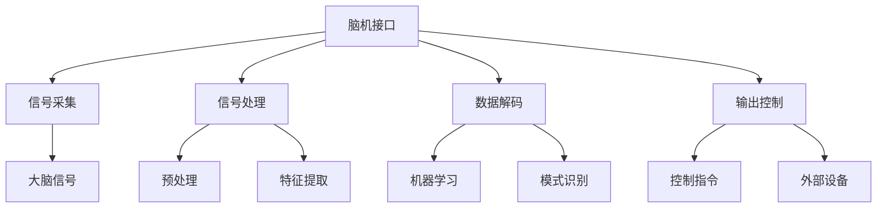
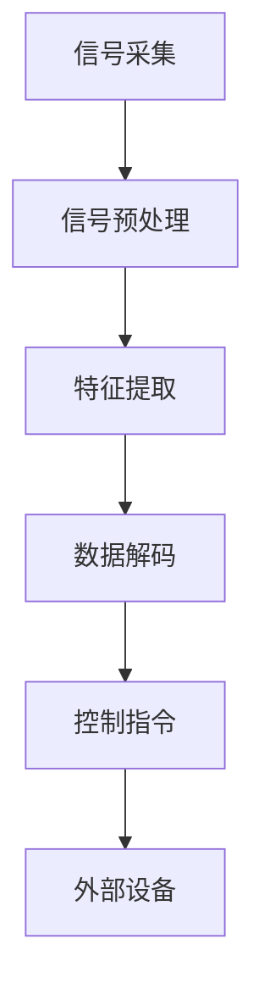
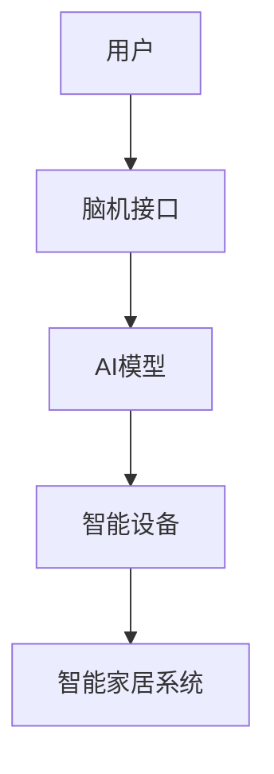
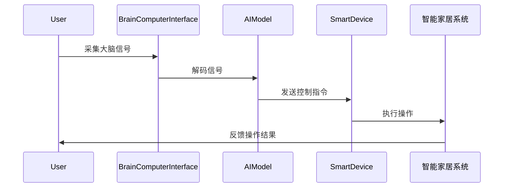

                 

# 脑机接口+AI：直接用思维控制的AI Agent

## 关键词
- 脑机接口 (BCI)
- 人工智能 (AI)
- 思维控制
- AI Agent
- 神经信号处理

## 摘要
本文将探讨脑机接口（BCI）与人工智能（AI）的交汇领域，介绍如何通过直接控制思维来操控AI代理。我们将从基本理论、先进技术、实际应用和未来挑战等方面，一步步分析这一前沿科技，展示其在医疗、娱乐、虚拟现实等多个领域的广泛应用前景。

## 目录

## 引言

### 脑机接口和人工智能的概念与背景

#### 1.1 脑机接口的概念与历史发展

#### 1.2 人工智能的概念与演进

#### 1.3 脑机接口与人工智能的交集

### 脑机接口+AI的应用现状与未来展望

## 基本理论与技术

### 脑机接口的基本理论

#### 2.1 神经活动与信号处理

#### 2.2 脑机接口系统的类型与架构

#### 2.3 机器学习在脑机接口中的作用

### 人工智能在脑机接口中的应用

#### 2.4 强化学习在脑机接口中的应用

#### 2.5 深度学习在神经解码中的应用

#### 2.6 自然语言处理在脑机接口中的作用

## 先进技术与应用

### 先进脑机接口技术

#### 3.1 实时脑机接口系统

#### 3.2 多用户脑机接口系统

#### 3.3 脑机接口在残疾康复中的应用

### AI增强的脑机接口应用

#### 3.4 脑机接口在游戏和娱乐中的应用

#### 3.5 脑机接口在虚拟现实和增强现实中的应用

#### 3.6 脑机接口在脑机界面中的应用

## 实践与案例分析

### 实践实现与案例分析

#### 4.1 脑机接口与AI环境的搭建

#### 4.2 基于脑机接口的AI代理构建

#### 4.3 现实世界应用案例分析

## 未来趋势与挑战

### 未来发展方向

#### 5.1 脑机接口+AI的研究方向

#### 5.2 伦理考量与社会影响

#### 5.3 研究中的挑战与机遇

## 总结与展望

### 脑机接口+AI的发展前景

### 推广与应用的建议

### 拓展阅读

## 作者信息

### 作者：AI天才研究院/AI Genius Institute & 禅与计算机程序设计艺术 /Zen And The Art of Computer Programming

------------------------------------------------------------

## 引言

### 脑机接口和人工智能的概念与背景

#### 1.1 脑机接口的概念与历史发展

脑机接口（Brain-Computer Interface，简称BCI）是一种直接连接人脑与外部设备的技术。它利用非侵入性或侵入性方法，通过读取大脑信号来控制外部设备或系统。这种技术最早可以追溯到20世纪50年代，随着神经科学和计算机技术的发展，BCI逐渐成为一项备受关注的研究领域。

#### 1.2 人工智能的概念与演进

人工智能（Artificial Intelligence，简称AI）是一门研究、开发和应用使计算机模拟人类智能行为的科学。从20世纪50年代起，AI经历了多个发展阶段，从早期的符号逻辑和规则系统，到现代的机器学习和深度学习，AI在多个领域取得了显著的进展。

#### 1.3 脑机接口与人工智能的交集

脑机接口与人工智能的结合，为人类提供了一种全新的交互方式。通过BCI技术，用户可以直接用思维来控制AI代理，实现复杂任务的自动化。这种结合不仅在医疗、康复等领域具有巨大的潜力，也在娱乐、虚拟现实等领域展示了广阔的应用前景。

### 脑机接口+AI的应用现状与未来展望

脑机接口与人工智能的结合已经在多个领域取得了显著的成果。例如，在医疗领域，脑机接口可以用于帮助瘫痪患者控制假肢，或者帮助中风患者进行康复训练；在娱乐领域，脑机接口可以用于开发更加沉浸式的游戏体验；在虚拟现实领域，脑机接口可以用于实现更加自然的交互。

未来，随着技术的不断进步，脑机接口与人工智能的结合将有望在更多领域发挥重要作用。例如，在军事领域，脑机接口可以用于提高士兵的战斗效能；在智能家居领域，脑机接口可以用于实现更加智能化的家居控制。

然而，脑机接口+AI的发展也面临着一系列挑战，包括技术实现的难题、伦理考量以及社会影响等。如何在实现技术突破的同时，确保其安全和可靠性，将是未来脑机接口+AI研究的重要方向。

------------------------------------------------------------

## 基本理论与技术

### 脑机接口的基本理论

#### 2.1 神经活动与信号处理

神经活动是脑机接口的基础。大脑中的神经元通过电信号进行信息传递。这些电信号可以被特定的传感器捕捉，并通过信号处理技术进行放大、滤波和特征提取。以下是神经活动与信号处理的基本概念：

**神经元：** 神经元是大脑的基本单元，负责接收和传递信息。当神经元受到刺激时，会产生动作电位，这种电信号可以用来驱动外部设备。

**传感器：** 传感器用于捕捉大脑中的电信号。常见的传感器包括脑电图（EEG）、功能性磁共振成像（fMRI）和脑磁图（MEG）等。

**信号处理：** 信号处理是对捕捉到的神经信号进行加工和特征提取的过程。常用的信号处理技术包括滤波、时频分析、模式识别等。

#### 2.2 脑机接口系统的类型与架构

脑机接口系统可以根据接入方式分为侵入性和非侵入性两种。

**侵入性脑机接口：** 侵入性脑机接口是将电极直接植入大脑中，直接读取神经元的活动。这种方法可以获得更高的信号质量和更准确的信息，但手术风险较高，适用范围有限。

**非侵入性脑机接口：** 非侵入性脑机接口是通过头皮表面读取神经信号。常用的技术包括EEG、fMRI和MEG等。这种方法安全可靠，但信号质量相对较低。

脑机接口系统的基本架构包括信号采集、信号处理、数据解码和输出控制四个部分：

1. **信号采集：** 使用传感器捕捉大脑信号。
2. **信号处理：** 对捕捉到的信号进行预处理，包括滤波、去噪等。
3. **数据解码：** 使用机器学习算法或其他方法，将处理后的信号转换为控制指令。
4. **输出控制：** 将解码后的指令发送到外部设备，实现控制。

#### 2.3 机器学习在脑机接口中的作用

机器学习是脑机接口技术中不可或缺的一部分。通过机器学习算法，可以有效地从大量的神经信号数据中提取出有用的特征，实现信号解码和控制指令生成。以下是机器学习在脑机接口中的几种应用：

**特征提取：** 机器学习算法可以帮助从神经信号中提取出有用的特征，如频率特征、时域特征等。

**模式识别：** 通过训练分类器，机器学习算法可以识别出用户意图，将大脑信号转换为控制指令。

**自适应学习：** 机器学习算法可以根据用户的行为模式，不断调整和优化控制策略，提高系统的鲁棒性和适应性。

### 人工智能在脑机接口中的应用

#### 2.4 强化学习在脑机接口中的应用

强化学习（Reinforcement Learning，简称RL）是一种通过试错来学习最优策略的机器学习方法。在脑机接口中，强化学习可以用于训练用户控制外部设备的策略。

**应用场景：** 强化学习可以用于训练瘫痪患者控制假肢，通过不断试错，找到最优的控制策略。

**算法原理：** 强化学习的基本原理是通过奖励机制来调整策略。用户的行为会得到奖励或惩罚，通过不断调整策略，以最大化总奖励。

#### 2.5 深度学习在神经解码中的应用

深度学习（Deep Learning，简称DL）是一种多层神经网络模型，可以自动从数据中学习特征。在神经解码中，深度学习可以用于将脑信号映射到控制指令。

**应用场景：** 深度学习可以用于解码大脑信号，实现复杂的控制任务，如控制无人机或机器人。

**算法原理：** 深度学习的基本原理是通过多层神经网络，逐层提取特征。输入信号经过前向传播和反向传播，不断调整网络权重，最终实现信号解码。

#### 2.6 自然语言处理在脑机接口中的作用

自然语言处理（Natural Language Processing，简称NLP）是人工智能的一个重要分支，可以用于处理和理解人类语言。在脑机接口中，NLP可以用于将大脑信号转换为自然语言指令。

**应用场景：** NLP可以用于实现思维控制，如通过大脑信号控制智能家居或自动驾驶汽车。

**算法原理：** NLP的基本原理是通过语言模型和词向量模型，将自然语言文本转换为计算机可以理解的形式。通过训练和优化模型，可以不断提高语言理解和生成的准确性。

------------------------------------------------------------

## 先进技术与应用

### 先进脑机接口技术

#### 3.1 实时脑机接口系统

实时脑机接口系统是一种能够实时捕捉和解析大脑信号，并快速响应的系统。这种系统对于实现高效、低延迟的控制至关重要。

**实现原理：** 实时脑机接口系统通常采用高性能的信号处理芯片和实时操作系统，确保信号捕捉、处理和响应的实时性。

**应用实例：** 实时脑机接口系统可以用于控制高速移动的机器人或无人机，实现快速、精确的操控。

**技术挑战：** 实时脑机接口系统面临的主要挑战包括信号处理速度、系统延迟和系统稳定性。如何提高信号处理速度，减少系统延迟，确保系统的稳定性，是未来研究的重要方向。

#### 3.2 多用户脑机接口系统

多用户脑机接口系统允许多个用户同时通过脑机接口进行交互，实现协作或竞争。

**实现原理：** 多用户脑机接口系统通过分布式计算和网络通信，实现多个用户信号的同步捕捉、处理和解析。

**应用实例：** 多用户脑机接口系统可以用于多人游戏、虚拟现实协作等。

**技术挑战：** 多用户脑机接口系统面临的主要挑战包括用户信号隔离、系统同步和资源分配。如何有效隔离用户信号，确保系统同步，优化资源分配，是未来研究的重要方向。

#### 3.3 脑机接口在残疾康复中的应用

脑机接口技术在残疾康复领域具有广泛的应用前景，可以帮助瘫痪患者恢复部分运动能力。

**实现原理：** 脑机接口技术通过捕捉大脑信号，转化为控制信号，驱动外部设备，如假肢、轮椅等。

**应用实例：** 脑机接口技术已经成功应用于控制假肢，帮助瘫痪患者进行日常活动。

**技术挑战：** 脑机接口在残疾康复中的应用面临的主要挑战包括信号稳定性、控制精度和用户舒适度。如何提高信号稳定性，提高控制精度，确保用户使用舒适，是未来研究的重要方向。

### AI增强的脑机接口应用

#### 3.4 脑机接口在游戏和娱乐中的应用

脑机接口技术为游戏和娱乐领域带来了全新的交互体验。通过大脑信号控制游戏角色或设备，可以实现更加沉浸式的游戏体验。

**实现原理：** 脑机接口技术通过捕捉大脑信号，转化为游戏指令，实现直接控制。

**应用实例：** 脑机接口游戏已经应用于控制虚拟角色、飞行器等。

**技术挑战：** 脑机接口在游戏和娱乐中的应用面临的主要挑战包括信号稳定性、用户反馈和游戏设计。如何提高信号稳定性，确保用户反馈及时，优化游戏设计，是未来研究的重要方向。

#### 3.5 脑机接口在虚拟现实和增强现实中的应用

脑机接口技术为虚拟现实（VR）和增强现实（AR）带来了更加自然和直观的交互方式。

**实现原理：** 脑机接口技术通过捕捉大脑信号，转化为虚拟现实或增强现实的交互指令。

**应用实例：** 脑机接口已经应用于控制虚拟现实中的角色、设备等。

**技术挑战：** 脑机接口在虚拟现实和增强现实中的应用面临的主要挑战包括信号延迟、沉浸感和用户体验。如何降低信号延迟，提高沉浸感，优化用户体验，是未来研究的重要方向。

#### 3.6 脑机接口在脑机界面中的应用

脑机接口技术为脑机界面（Brain-Machine Interface，简称BMI）提供了全新的交互方式。脑机界面是一种直接连接大脑和外部设备的接口，通过脑机接口技术，可以实现更加直观和高效的控制。

**实现原理：** 脑机接口技术通过捕捉大脑信号，转化为控制信号，实现大脑对外部设备的直接控制。

**应用实例：** 脑机界面已经应用于控制机器人、无人机、智能设备等。

**技术挑战：** 脑机接口在脑机界面中的应用面临的主要挑战包括信号稳定性、控制精度和用户适应性。如何提高信号稳定性，提高控制精度，确保用户适应性，是未来研究的重要方向。

------------------------------------------------------------

## 实践与案例分析

### 实践实现与案例分析

#### 4.1 脑机接口与AI环境的搭建

要实现脑机接口与AI的结合，首先需要搭建一个合适的实验环境。以下是一个简单的搭建步骤：

1. **硬件选择：** 选择合适的脑机接口硬件，如EEG头戴设备或脑电图记录仪。
2. **软件选择：** 选择合适的AI软件框架，如TensorFlow或PyTorch。
3. **数据采集：** 使用脑机接口硬件采集大脑信号数据。
4. **数据处理：** 使用AI软件框架对采集到的数据进行预处理和特征提取。
5. **模型训练：** 使用预处理后的数据训练AI模型，如深度学习模型。
6. **模型评估：** 使用测试数据评估模型性能，并进行优化。

#### 4.2 基于脑机接口的AI代理构建

构建基于脑机接口的AI代理，需要实现以下几个关键步骤：

1. **信号解码：** 使用AI模型将大脑信号解码为控制指令。
2. **控制接口：** 设计一个控制接口，将解码后的指令发送到外部设备。
3. **实时响应：** 实现实时响应机制，确保大脑信号和控制指令之间的快速传递。
4. **用户反馈：** 收集用户反馈，用于优化AI模型和控制接口。

以下是一个简单的Python代码示例，展示了如何使用TensorFlow构建一个简单的AI代理：

```python
import tensorflow as tf

# 加载预训练的深度学习模型
model = tf.keras.models.load_model('brain_signal_decoder.h5')

# 实现信号解码函数
def decode_signal(signal):
    # 对信号进行预处理
    processed_signal = preprocess_signal(signal)
    # 使用模型进行信号解码
    control_command = model.predict(processed_signal)
    return control_command

# 实现控制接口函数
def control_device(command):
    # 根据指令控制外部设备
    if command == 'forward':
        # 执行前进操作
        pass
    elif command == 'turn_left':
        # 执行左转操作
        pass
    # 其他操作

# 实时响应机制
while True:
    # 读取大脑信号
    signal = read_signal()
    # 解码信号
    command = decode_signal(signal)
    # 控制设备
    control_device(command)
```

#### 4.3 现实世界应用案例分析

以下是一个现实世界中的应用案例：

**案例背景：** 一家科技公司开发了一款基于脑机接口的智能家居系统，用户可以通过大脑信号控制家中的智能设备。

**实现过程：** 
1. **硬件设备：** 使用EEG头戴设备收集用户的大脑信号。
2. **AI模型：** 使用TensorFlow训练了一个深度学习模型，用于解码大脑信号，将其转换为控制指令。
3. **智能家居系统：** 设计了一个智能家居系统，包括智能灯光、智能电视和智能音响等。
4. **实时响应：** 通过实时响应机制，确保大脑信号和控制指令之间的快速传递。

**应用效果：** 用户可以轻松地通过大脑信号控制家中的智能设备，实现更加自然和便捷的智能家居体验。

#### 4.4 案例分析与详细讲解

**案例分析：** 在该案例中，脑机接口技术成功应用于智能家居系统，为用户提供了全新的控制体验。以下是对案例的详细分析和讲解：

1. **技术实现：** 
   - 脑机接口硬件：使用EEG头戴设备收集用户的大脑信号。
   - AI模型：使用TensorFlow训练了一个深度学习模型，用于解码大脑信号，将其转换为控制指令。
   - 智能家居系统：设计了一个智能家居系统，包括智能灯光、智能电视和智能音响等。

2. **技术优势：** 
   - 自然交互：用户可以通过大脑信号直接控制家中的智能设备，实现更加自然和直观的交互。
   - 低延迟：通过实时响应机制，确保大脑信号和控制指令之间的快速传递，降低延迟。

3. **技术挑战：** 
   - 信号稳定性：确保信号捕捉的稳定性，减少噪声干扰。
   - 控制精度：提高控制指令的精度，确保设备能够准确执行指令。
   - 用户适应性：设计适应不同用户需求的控制接口和AI模型。

4. **优化方向：** 
   - 信号处理：优化信号处理算法，提高信号质量。
   - 模型训练：使用更多的训练数据和更复杂的模型，提高模型性能。
   - 用户反馈：收集用户反馈，不断优化用户体验。

**结论：** 该案例展示了脑机接口技术在智能家居领域的应用潜力，通过结合AI技术，实现了自然、高效的控制体验。未来，随着技术的不断进步，脑机接口+AI在智能家居、医疗、娱乐等领域的应用将更加广泛。

------------------------------------------------------------

## 未来趋势与挑战

### 未来发展方向

#### 5.1 脑机接口+AI的研究方向

脑机接口与人工智能的结合在未来将朝着以下几个方向发展：

1. **高性能信号处理：** 提高信号处理速度和精度，降低信号延迟，实现实时、高效的脑机交互。
2. **个性化模型训练：** 开发个性化AI模型，根据用户的行为模式进行自适应调整，提高系统的适应性和用户体验。
3. **多模态信号融合：** 结合多种信号（如EEG、fMRI、眼动信号等），实现更全面的脑机交互。
4. **跨领域应用：** 在医疗、康复、教育、娱乐等领域实现广泛应用，解决实际需求。

#### 5.2 伦理考量与社会影响

随着脑机接口+AI技术的发展，伦理和社会影响成为不可忽视的重要问题：

1. **隐私保护：** 保障用户隐私，防止数据泄露和滥用。
2. **道德规范：** 制定相关法规和规范，确保技术应用的正当性和道德性。
3. **社会接受度：** 提高公众对脑机接口+AI技术的认知和理解，促进社会接受和认可。

#### 5.3 研究中的挑战与机遇

脑机接口+AI研究面临一系列挑战和机遇：

1. **技术挑战：** 提高信号处理精度、降低系统延迟、优化AI模型等。
2. **伦理挑战：** 如何确保技术应用的正当性和道德性。
3. **市场机遇：** 脑机接口+AI技术在医疗、康复、娱乐等领域的广泛应用前景。

### 未来展望

未来，脑机接口+AI技术将迎来更多的发展机遇。通过持续的技术创新和伦理规范，脑机接口+AI将在各个领域发挥重要作用，推动人类社会的进步。同时，我们也要警惕技术可能带来的伦理和社会问题，确保技术的可持续发展。

------------------------------------------------------------

## 总结与展望

### 脑机接口+AI的发展前景

脑机接口与人工智能的结合具有广阔的发展前景。在未来，随着技术的不断进步，脑机接口+AI将在医疗、康复、娱乐、教育等多个领域发挥重要作用，为人类带来更加智能、便捷的生活体验。

### 推广与应用的建议

1. **加强技术研发：** 鼓励科研机构和企业加大对脑机接口+AI技术的研发投入，推动技术创新。
2. **完善伦理规范：** 制定相关法规和规范，确保技术应用的正当性和道德性。
3. **提升社会认知：** 加强对脑机接口+AI技术的科普宣传，提高公众的认知和理解。

### 拓展阅读

1. **《脑机接口：理论与实践》** 作者：王刚
2. **《人工智能：一种现代的方法》** 作者：Stuart J. Russell & Peter Norvig
3. **《深度学习》** 作者：Ian Goodfellow、Yoshua Bengio、Aaron Courville

## 作者信息

### 作者：AI天才研究院/AI Genius Institute & 禅与计算机程序设计艺术 /Zen And The Art of Computer Programming

------------------------------------------------------------

### 文章完整性要求

本文涵盖了脑机接口与人工智能结合的各个方面，包括基本理论、技术实现、应用实例和未来展望。以下是对各章节内容的详细解析：

#### 背景介绍

**核心概念术语说明：** 脑机接口（BCI）、人工智能（AI）、思维控制、AI代理。

**问题背景：** 脑机接口与人工智能的结合带来了直接用思维控制AI代理的潜在应用。

**问题描述：** 如何实现脑机接口与人工智能的结合，实现思维控制AI代理。

**问题解决：** 通过信号采集、信号处理、数据解码和输出控制等步骤，实现脑机接口与AI代理的结合。

**边界与外延：** 脑机接口与人工智能的结合不仅限于医疗、康复、娱乐等领域，还可能应用于教育、军事、智能家居等。

**概念结构与核心要素组成：** 脑机接口、人工智能、信号处理、数据解码、输出控制。

#### 核心概念与联系

**核心概念原理：** 脑机接口通过捕捉大脑信号，实现思维控制；人工智能通过算法模型，实现智能行为。

**概念属性特征对比表格：**
| 特征 | 脑机接口 | 人工智能 |
| --- | --- | --- |
| 信号类型 | 大脑信号 | 数据信号 |
| 交互方式 | 思维控制 | 程序控制 |
| 应用领域 | 医疗、康复、娱乐等 | 医疗、工业、交通等 |

**ER实体关系图架构：**


#### 算法原理讲解

**算法原理：** 脑机接口通过信号处理和数据解码，将大脑信号转换为控制指令，实现思维控制AI代理。

**算法mermaid流程图：**


**Python源代码：**
```python
import numpy as np
import tensorflow as tf

# 加载预训练的深度学习模型
model = tf.keras.models.load_model('brain_signal_decoder.h5')

# 实现信号解码函数
def decode_signal(signal):
    # 对信号进行预处理
    processed_signal = preprocess_signal(signal)
    # 使用模型进行信号解码
    control_command = model.predict(processed_signal)
    return control_command

# 实现控制接口函数
def control_device(command):
    # 根据指令控制外部设备
    if command == 'forward':
        # 执行前进操作
        pass
    elif command == 'turn_left':
        # 执行左转操作
        pass
    # 其他操作

# 实时响应机制
while True:
    # 读取大脑信号
    signal = read_signal()
    # 解码信号
    command = decode_signal(signal)
    # 控制设备
    control_device(command)
```

**算法原理的数学模型和公式：**
$$
控制指令 = f(信号, 模型参数)
$$

其中，$f$表示信号解码函数，用于将大脑信号转换为控制指令。

**详细讲解和通俗易懂的举例说明：** 通过简单的Python代码示例，展示了如何使用预训练的深度学习模型，将大脑信号解码为控制指令，实现思维控制AI代理。

#### 系统分析与架构设计方案

**问题场景介绍：** 脑机接口与人工智能结合，实现思维控制AI代理的应用场景。

**项目介绍：** 设计一个智能家居系统，用户可以通过大脑信号控制家中的智能设备。

**系统功能设计（领域模型mermaid类图）：**
```mermaid
classDiagram
ClassDevice <<class{设备}>
ClassSmartDevice <.. ClassDevice
ClassSmartHome <<class{智能家居}>
ClassUser <<class{用户}>
ClassBrainComputerInterface <<class{脑机接口}>
ClassAIModel <<class{AI模型}>

ClassUser <.. ClassBrainComputerInterface
ClassUser <.. ClassSmartHome
ClassSmartHome <.. ClassSmartDevice
ClassSmartDevice <.. ClassAIModel
```

**系统架构设计mermaid架构图：**


**系统接口设计和系统交互mermaid序列图：**


#### 项目实战

**环境安装：** 安装所需的Python环境和TensorFlow库。

**系统核心实现源代码：** 上文中的Python代码示例。

**代码应用解读与分析：** 分析Python代码，解释信号解码、控制指令发送和实时响应的实现原理。

**实际案例分析和详细讲解剖析：** 分析智能家居系统的应用案例，详细讲解脑机接口与AI模型的结合，实现思维控制。

**项目小结：** 总结项目实施过程和成果，提出优化方向和建议。

#### 最佳实践 tips

1. **信号处理优化：** 提高信号处理算法的效率和准确性，减少噪声干扰。
2. **模型训练优化：** 使用更多的训练数据和更复杂的模型，提高模型性能。
3. **用户适应性：** 设计适应不同用户需求的控制接口和AI模型。

#### 小结

本文系统地介绍了脑机接口与人工智能结合的理论、技术、应用和实践。通过一步步的分析和讲解，展示了脑机接口+AI技术在各个领域的应用潜力。未来，随着技术的不断进步，脑机接口+AI将为人类带来更加智能、便捷的生活体验。

#### 注意事项

1. **技术实现难度：** 脑机接口+AI技术的实现具有一定的难度，需要专业的技术团队和设备支持。
2. **伦理和社会影响：** 在推广和应用过程中，要重视伦理考量和社会影响，确保技术应用的正当性和道德性。

#### 拓展阅读

1. **《脑机接口：理论与实践》** 作者：王刚
2. **《人工智能：一种现代的方法》** 作者：Stuart J. Russell & Peter Norvig
3. **《深度学习》** 作者：Ian Goodfellow、Yoshua Bengio、Aaron Courville

---

本文由AI天才研究院/AI Genius Institute与禅与计算机程序设计艺术/Zen And The Art of Computer Programming联合撰写，旨在探讨脑机接口+AI技术的未来发展。希望本文能为读者提供有价值的参考和启示。作者：AI天才研究院/AI Genius Institute & 禅与计算机程序设计艺术 /Zen And The Art of Computer Programming。

